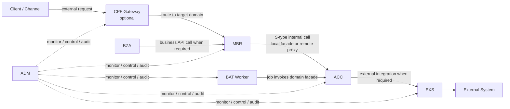

> [!IMPORTANT]
> **이번 회차의 유일한 활성 Codex 요청서는 이 파일 `CPF_CURRENT_WORK_REQUEST.md`이다.**
> 과거 `CPF_NEW_REQUEST*`, `CPF_FINAL_NEXT_REQUEST*`, 날짜가 붙은 요청서·분석서·보정서·결정서·준비 문서는 활성 지시서가 아니며, 최신 정본과 이 요청서에 고유 내용이 흡수됐는지 확인한 뒤 삭제 대상이다.
> Codex는 작업 시작 전에 최신 `origin/master`를 확인하고 이 파일을 가장 먼저 읽은 뒤, 검증·보완·문서 정리·`origin/master` push까지 수행한다.

# CPF 현재 통합 Codex 작업 요청서

## 0. 요청 목적

이 요청서는 CPF를 상용 Enterprise Business Platform Framework 수준으로 완성하기 위한 현재 회차의 단일 실행 요청서다.

이번 회차는 다음을 하나의 연결된 마일스톤으로 수행한다.

1. 2026-07-20 두 차례 push 결과를 최신 `master`에서 직접 검수하고 미흡·회귀를 종료한다.
2. PFW·CMN·ADM·BAT·EXS·업무 주제영역의 architecture와 ownership을 고정한다.
3. README와 정본의 잘못된 ACC/BZA/XYZ/EDU 표현을 바로잡는다.
4. 제품 버전 `1.0.0-SNAPSHOT`과 artifact/release 기반을 구현한다.
5. external Tomcat/JNDI, 전체 runtime, 다중 인스턴스·failover·worker 신뢰성을 실제 검증한다.
6. 실 broker와 대표 외부 adapter를 제품 port에 연결한다.
7. ADM/BZA 운영·업무 UI의 실제 인증 browser E2E를 보강한다.
8. durable orchestration과 DB portability/installer의 기반을 이후 재구축 없이 확장 가능한 형태로 착수한다.
9. 준비·분석·보정 문서를 정본에 흡수하고 불필요 문서·가비지를 삭제한다.
10. 구현·검증·문서 정리 후 `origin/master` 반영과 push까지 완료한다.

이 요청서는 이전 날짜별 요청서·분석서·보정서의 고유 내용을 통합한 현재 작업 기준이다. 별도 추가 지시가 없어도 독립적으로 수행할 수 있어야 한다.

### 0.1 현재 요청서 활성화와 과거 요청서 폐기 기준

이 파일 `CPF_CURRENT_WORK_REQUEST.md`를 현재 회차의 **유일한 활성 Codex 요청서**로 사용한다.

Codex는 작업 시작 시 다음을 명확히 적용한다.

1. 가장 먼저 최신 `origin/master`에 포함된 `CPF_CURRENT_WORK_REQUEST.md`를 읽고 작업 기준으로 선언한다.
2. 과거 `CPF_NEW_REQUEST*`, `CPF_FINAL_NEXT_REQUEST*`, 날짜별 요청서·분석서·보정서·결정서·준비 문서는 활성 지시서로 사용하지 않는다.
3. 과거 문서에만 존재하는 고유 요구가 있는지 비교한 뒤, 필요한 내용은 최상위 정본 또는 이 요청서에 흡수한다.
4. 고유 내용 흡수가 끝난 과거 요청 문서는 참조 링크와 script/index를 정리한 뒤 삭제한다.
5. 파일명이 오래됐다는 이유로 과거 요청서를 우선 읽거나, 여러 요청서를 합성하여 임의로 범위를 축소·변경하지 않는다.
6. 현재 요청서와 과거 문서가 충돌하면 `CPF_FINAL_TARGET_REQUIREMENTS.md`와 이 요청서의 최신 결정이 우선한다.
7. 최종 결과 보고에는 삭제·통합한 과거 문서와 남겨둔 문서의 역할을 기록한다.

이 전환이 완료되기 전에는 문서 정리가 끝난 것으로 보지 않는다.

---


## 0.2 이번 요청서가 반영한 실제 검수 결과

이 요청서는 단순 사전 계획이 아니다. `CPF_STABILIZATION_REPORT.md` 상단의 2026-07-20 검수 보정 결과를 필수 작업 범위로 흡수한다.

반드시 먼저 종료할 항목:

1. 제공 report의 152/342/82/88과 최신 Codex 주장 154/354/87/94 차이를 최신 commit·evidence로 재계산
2. Gateway→ACC 200을 target·DB·header·trace·policy·failure E2E로 확장 검증
3. BAT step/restart/rerun을 실제 Spring Batch metadata와 side effect로 검증
4. stale `CPF_EVIDENCE_INDEX.md`와 report/GAP/ledger를 최신 commit 기준으로 재생성
5. README 아키텍처를 MBR·ACC·BZA·XYZ 동급 업무 주제영역 기준으로 교체
6. XYZ domain/module/artifact/topology에서 EDU identity 제거
7. `/xyz/edu`, `cpf.xyz.edu.*`, `*-EDU-*` 공개 계약은 영향 분석 후 alias·deprecation·migration 적용
8. `XYZ01EDU0099` 등 O/S/B 표준과 충돌하는 실행 ID 전수 점검
9. generator의 service null 방어, ORDER BY whitelist 우회, concrete repository(null) test pattern 보완
10. 과거 Git 금지 지시를 정본·Guide·baseline에서 제거
11. 검수 결과를 보고만 하지 않고 source/test/SQL/script/config/docs에 수정 후 재검증
12. 완료된 준비 문서의 고유 내용을 정본에 흡수한 뒤 불필요 문서 삭제

위 항목을 끝내지 않은 채 외부 환경 신규 기능만 진행하지 않는다.


## 1. 최상위 기준과 상태 표현

### 1.1 Repository

```text
repository: https://github.com/freeangelsun/202412_01_CPF
base branch: master
사용자 확인 최신 commit: 22818f0cb55f564c544cddf470ba8cf7d7136b6c
오늘 첫 commit: e969641
직전 기준: ff4661e
검수 범위: ff4661e..22818f0
```

작업 시작 시 원격이 더 갱신됐다면 최신 `origin/master`를 기준으로 다시 고정하고, `22818f0` 이후 변경도 함께 검수한다.

### 1.2 정본 우선순위

1. `CPF_FINAL_TARGET_REQUIREMENTS.md`
2. 이 요청서 `CPF_CURRENT_WORK_REQUEST.md`
3. `CPF_REVIEW_PROGRESS_COMPLETION_GUIDE.md`
4. 최신 source·test·SQL·script·config·runtime evidence
5. `CPF_STABILIZATION_REPORT.md`
6. `CPF_GAP_MATRIX.md`
7. `CPF_EVIDENCE_INDEX.md`
8. `specs/기능_구현_매트릭스.*`
9. `specs/sample-coverage-matrix.md`
10. `README.md`

01~05 보조 목표 파일이 존재하면 검색과 추적 보조로 사용하되, 최상위 정본을 축소하거나 대체하지 않는다.


### 1.4 작업 전 필수 참조 파일 Gate

Codex는 구현 전에 아래 **현재 활성 정본과 상태 파일만** 우선 확인한다.

```text
CPF_CURRENT_WORK_REQUEST.md
CPF_FINAL_TARGET_REQUIREMENTS.md
CPF_REVIEW_PROGRESS_COMPLETION_GUIDE.md
CPF_STABILIZATION_REPORT.md
CPF_GAP_MATRIX.md
CPF_EVIDENCE_INDEX.md
specs/기능_구현_매트릭스.*
specs/sample-coverage-matrix.md
README.md
최신 source·test·SQL·script·config·runtime evidence
```

과거 날짜가 붙은 요청서·분석서·보정서·결정서·준비 문서는 작업 지시로 사용하지 않는다.
현재 요청서와 정본에 이미 흡수된 문서는 참조·링크·script 영향만 확인한 뒤 이번 회차에서 삭제한다.
과거 파일을 먼저 읽고 범위를 재구성하거나 현재 요청서를 축소하면 안 된다.

### 1.3 허용 상태값

다음 상태만 사용한다.

```text
완료
부분 구현
미구현
미검증
실패
재확인 필요
```

Source 존재, 일부 test 통과, 정적 검색, OpenAPI path 존재, sampleId 등록, Codex 보고만으로 `완료` 처리하지 않는다.

---

## 2. Git 실행 원칙

사용자가 Git 자동 수행 중단을 명시하기 전까지 Codex가 Git 작업의 우선 실행 주체다.

### 2.1 작업 시작 전 필수 수행

```text
1. repository와 remote URL 확인
2. 현재 branch·HEAD 확인
3. git status 확인
4. git fetch --all --prune
5. origin/master 최신 SHA 확인
6. local master와 origin/master 차이 확인
7. 이 요청서와 정본이 최신 master에 포함됐는지 확인
8. 시작 기준 commit과 문서 hash 기록
9. 최신 원격 확인 전 source·SQL·migration 수정 금지
```

로컬 변경이나 divergence가 있으면 임의 삭제하지 않는다. 변경 유실 없이 원인을 확인하고 안전하게 정리한다.

### 2.2 작업 종료 기준

작업 완료는 변경이 `origin/master`에 포함되고 원격 master SHA를 재확인한 경우에만 인정한다.

```text
구현
→ 필수 검증
→ secret·가비지·삭제·회귀 검사
→ commit
→ 필요 시 작업 branch push
→ master merge 또는 PR merge
→ origin/master push
→ 원격 master SHA 재확인
→ working tree clean 확인
```

다음은 완료가 아니다.

- 로컬 수정만 존재
- 로컬 commit만 존재
- 작업 branch만 push
- 미병합 PR
- master push 미완료
- 원격 master SHA 미확인

push 충돌은 최신 fetch 후 rebase/merge로 해결한다. force가 불가피하면 backup branch와 원격 최신 SHA를 확인하고 `--force-with-lease`만 사용한다. 제3자 신규 commit을 덮어쓰면 안 된다.

권한·인증·GitHub 장애·필수 승인 정책으로 자체 해결할 수 없는 경우만 `실패` 또는 `차단`으로 정확히 보고한다.

---

# 필수 완료 범위

### 3.0 ChatGPT 직접 검수 범위와 한계

이번 요청서에는 다음 파일을 실제로 열어 확인한 결과를 반영했다.

```text
CPF_STABILIZATION_REPORT.md
CPF_GAP_MATRIX.md
CPF_EVIDENCE_INDEX.md
CPF_REVIEW_PROGRESS_COMPLETION_GUIDE.md
specs/sample-coverage-matrix.md
XyzEducationController.java
CpfStandardExecutionId.java
CpfExecutionDefinition.java
scripts/create-domain.ps1
README 아키텍처 이미지
```

직접 확인된 주요 사실:

- 기존 Report는 `152 suites / 342 tests / qualityGate 82 tasks / ledger 88개`
- 최신 Codex 보고 `154 / 354 / 87 / 94`와 불일치
- 기존 Report·GAP·Evidence에는 Gateway 실제 target proxy와 BAT runtime이 미검증으로 남음
- `XyzEducationController`는 `cpf.xyz.edu`, `/xyz/edu`, `XYZ-EDU`, `XYZ01EDU0099`를 사용
- 표준 실행 ID 값 객체는 `^([OB])([A-Z]{3})-([A-Z0-9]{3})-([A-Z0-9]{2})-([0-9]{4})$` 형식
- 정본·보고는 O/S/B 실행 ID를 요구하지만 현재 확인된 값 객체 정규식은 O/B만 허용하므로 S형 소유 계약을 전수 확인해야 함
- `XYZ01EDU0099`는 해당 형식과 일치하지 않음
- generator의 remote proxy는 null request에서 NPE 가능
- generator Mapper는 `${sortBy} ${sortDirection}` 문자열 치환을 사용하며 service 우회 방어 검증 필요
- generator test는 concrete `Repository(null)` stub을 생성
- 정본과 Guide에 과거 Git commit/push/branch 금지 문구가 존재했음
- README 그림은 ACC·BZA·XYZ의 업무 주제영역 위상과 MBR→ACC 내부 거래를 잘못 표현

GitHub connector 장애로 `ff4661e..22818f0` 전체 253개 변경 파일 patch와 최신 runtime evidence는 ChatGPT가 전수 확인하지 못했다.
이 부분은 완료로 주장하지 않으며, Codex가 최신 master에서 첫 Gate로 직접 검수하고 발견 결함을 보완한 뒤 재검증해야 한다.
checkout 장애가 지속되면 정확한 commit SHA의 GitHub Web/API 파일 원문과 diff를 파일 단위로 확인하고, 실행 검증만 `미검증`으로 남긴다.


## 3. Gate 0 — 최신 Git과 변경 인벤토리 확정

첫 구현 전에 다음을 수행한다.

### 3.1 두 commit과 통합 diff

```text
ff4661e..e969641
e969641..22818f0
ff4661e..22818f0
```

각 범위에서 다음을 집계한다.

- 추가·수정·삭제·rename 파일 수
- source/test/resource/SQL/script/config/UI/docs/evidence별 수
- binary·대용량·build 산출물·IDE·log·tmp·backup 유입
- 삭제 파일의 잔존 참조
- 첫 push 후 두 번째 push가 보완한 내용과 새 회귀

Codex 보고의 `253개 변경 파일`을 Git 기준으로 재계산한다. 별도의 253개 파일 목록 문서는 만들지 말고 report에 분류·고위험 경로만 요약한다.

### 3.2 검증 수치 재계산

다음 주장을 최종 commit에서 다시 확인한다.

```text
154 suites
354 tests
failures 0
errors 0
skipped 4
qualityGate 87 tasks
MariaDB 구조·권한 검사 38개
ledger 94개
완료 48 / 부분 구현 30 / 재확인 필요 12 / 미검증 4
```

확인 기준:

- JUnit XML과 Gradle 결과의 실제 합계
- 중복 suite/test 집계 제거
- task 이름과 exit code
- 최종 SHA가 evidence에 기록됐는지
- 94개 check ID가 유일한지
- 상태 합계가 정확히 94인지
- evidence path가 존재하고 최신 commit과 맞는지
- 이전 88개 ledger에서 추가된 6개 항목과 상태 변경 근거

두 번째 push 이후 source·test·SQL·script가 변경됐다면 첫 번째 push 이전 evidence만으로 완료 처리하지 않는다.

### 3.3 Checkout·Git 연결 장애 시 검수 대체 절차

로컬 checkout, DNS, GitHub MCP 또는 인증 문제로 저장소 전체 checkout이 일시적으로 불가능하더라도 검수 자체를 생략하거나 Codex 보고를 그대로 신뢰하지 않는다.

검수 우선순위는 다음과 같다.

```text
1. 최신 origin/master 직접 checkout + source/test/SQL/script/runtime 실행 검증
2. 정확한 commit SHA를 기준으로 GitHub Web/API에서 commit diff와 파일 원문을 파일 단위로 직접 검토
3. 정확한 commit에서 export한 source ZIP과 commit/file hash 목록을 이용한 로컬 검토
4. 위 방법도 불가능한 항목은 미검증 또는 재확인 필요로 기록
```

GitHub Web/API 파일 단위 검수 시 최소한 다음을 확인한다.

- `ff4661e..e969641`, `e969641..22818f0`, 통합 `ff4661e..22818f0`의 변경 파일
- 각 변경 파일의 실제 원문과 diff
- source와 대응 test
- Mapper interface/XML/result mapping/null 처리
- SQL·Flyway·설치·재실행 script
- Gateway route·policy·header·error contract
- BAT Job/step/restart/rerun 구현과 metadata 처리
- ADM/BZA UI/API·권한·감사 연결
- generator/remover와 재유입 방지 gate
- README·Report·GAP·Evidence·ledger 상호 참조
- 삭제 파일의 잔존 import·script·문서 링크

파일 단위 검수 결과에는 반드시 다음을 남긴다.

```text
commit SHA
파일 경로
검토한 변경 범위
확인 사실
발견 결함
직접 실행 여부
판정 상태
```

Web/API 정적 검토만 수행한 항목은 `runtime 검증 완료`로 기록하지 않는다. checkout 또는 실행 환경이 복구되면 동일 commit 기준으로 build·test·DB·runtime 검증을 다시 수행해야 한다.

네트워크 장애를 이유로 결함 보완을 다음 회차에 자동 이월하지 않는다. 파일 단위 검토로 확인 가능한 결함은 이번 회차에서 수정하고, 실행이 필요한 항목만 `미검증`으로 구분한다.

### 3.4 기존 commit 검수 결과의 보완까지 이번 회차 범위에 포함

`ff4661e..22818f0` 검수는 보고서 작성으로 끝내지 않는다.

1. 두 commit에서 발견한 결함·누락·회귀·과대 완료 판정을 실제 source/test/SQL/script/config/UI/docs에 수정한다.
2. 첫 번째 push에서 발생하고 두 번째 push에서 일부만 보완된 결함도 끝까지 추적한다.
3. Codex가 보고한 성공 항목이라도 직접 근거가 부족하면 재검증하고 상태를 낮춘다.
4. 보완 후 관련 단위·통합·runtime·DB 검증을 다시 실행한다.
5. 보완으로 영향받은 기존 완료 기능의 회귀 검증을 수행한다.
6. 최종 `CPF_STABILIZATION_REPORT.md`, `CPF_GAP_MATRIX.md`, `CPF_EVIDENCE_INDEX.md`, 기능 ledger와 sample coverage를 실제 결과에 맞게 갱신한다.
7. 미흡 사항을 발견하고도 다음 요청서에 기록만 한 채 이번 회차 수정 가능한 범위를 남겨두지 않는다.
8. 실행 환경상 종료하지 못한 항목만 원인·대안·재현 절차와 함께 `미검증`, `실패` 또는 `재확인 필요`로 남긴다.

따라서 이번 회차의 완료 기준은 **검수 + 결함 보완 + 재검증 + 정본 정합화 + master 반영**이다.

### 3.5 제공 파일에서 이미 확인된 보완 대상

아래 사항은 단순 추정이 아니라 이번 요청서 준비 과정에서 제공 파일을 직접 열어 확인한 불일치다. 최신 master에서 이미 수정됐다면 source/evidence로 확인하고 회귀 방지 gate를 남기며, 아직 남아 있으면 반드시 보완한다.

- 제공된 `CPF_STABILIZATION_REPORT.md`에는 `qualityGate 82 tasks`, Gateway 실제 target proxy 미검증, BAT actual Job/restart 미검증이 남아 있다.
- 사용자 전달 최신 보고의 `154 suites / 354 tests / 87 tasks / 94 ledger`, Gateway→ACC 200, BAT step/restart/rerun과 서로 일치하는지 최신 commit에서 재계산한다.
- 제공된 `CPF_EVIDENCE_INDEX.md`는 주로 `20260715_01`을 가리키며 `bat-runtime=미검증`, 과거 ACC 제거 상태와 `xyz-edu` identity가 남아 있다.
- 제공된 `CPF_GAP_MATRIX.md`에는 Gateway actual proxy, BAT runtime, channel policy의 최신 결과가 반영되지 않은 상태다.
- `CPF_REVIEW_PROGRESS_COMPLETION_GUIDE.md`, sample matrix, `XyzEducationController`는 EDU를 sample namespace와 도메인 identity가 섞여 보이게 한다.
- 과거 `CPF_FINAL_NEXT_REQUEST.md` 등에는 폐기된 Git 금지 지시가 남아 있다.

이 항목들은 최신 source/evidence 확인 없이 삭제하거나 완료로 승격하지 않는다. 실제 구현과 일치하도록 report·GAP·evidence·ledger·guide·README를 함께 보정한다.


### 3.6 직접 확인된 구체 결함과 보완 조건

#### Report·ledger

- 제공 report는 2026-07-16 기준 `152 suites / 342 tests / 82 tasks`
- ledger 직접 집계는 `88개 = 완료 35 / 부분 구현 34 / 재확인 필요 13 / 미검증 6`
- 최신 Codex 주장 `154 / 354 / 87 / 94`, `48 / 30 / 12 / 4`와 차이가 있음
- 94개 check ID를 실제 JSON/HTML/report/GAP/evidence에서 재계산하고 신규 6개 및 상태 변경 근거를 제출

#### Evidence

- 제공 evidence index는 20260715_01 기준이며 ACC 제거, bat-runtime 미검증, 과거 execution ID 기준이 남음
- 최신 20260720 evidence directory와 commit SHA binding을 새로 생성
- stale evidence를 완료 근거에서 제외하고 대체 후 삭제 또는 archive 정책 적용

#### O/S/B 표준 실행 ID 계약

직접 확인한 `CpfStandardExecutionId.PATTERN`은 다음과 같다.

```java
^([OB])([A-Z]{3})-([A-Z0-9]{3})-([A-Z0-9]{2})-([0-9]{4})$
```

정본과 안정화 보고는 O/S/B 표준을 주장하지만 현재 확인된 값 객체는 `S`를 허용하지 않는다.

- S형 공유 API가 별도 ID 체계를 사용하는지 확인
- 같은 표준 ID를 사용해야 한다면 `CpfExecutionType`, parser, validation, catalog, annotation scanner, alias migration, OpenAPI와 테스트를 함께 보완
- O/B 전용 값 객체가 의도라면 이름·문서·완료 판정을 명확히 분리
- 단순 정규식 변경만 하지 말고 기존 ID migration과 consumer 호환성을 검증

#### XYZ

- `XyzEducationController`의 package, URI, tag, operationId, 실행 ID를 전수 점검
- `@CpfTransaction(id = "XYZ01EDU0099")`가 최신 O/S/B 실행 ID 계약과 일치하는지 확인하고 불일치 시 migration
- module/artifact/topology는 XYZ 표준 identity
- sample namespace 변경 시 deprecated URI alias와 contract test를 제공

#### Generator

- Controller를 우회한 Service/Facade/Remote 호출에서도 null validation을 보장
- sorting은 string interpolation 이전에 enum/whitelist value object로 강제
- concrete `Repository(null)` test stub 대신 Port fake/mock 사용
- local/remote adapter에 동일 normalized request contract 적용
- 임시 domain 생성 후 test, bootJar, bootWar, Mapper, DB, cleanup을 검증

#### README

이 요청서의 Architecture·Ownership 동결 구간에 포함된 책임도와 대표 거래 흐름을 기준으로 README를 수정한다.

---

## 4. Gate 1 — 2026-07-20 작업 결과 실제 종료

### 4.1 ACC 구조·Mapper·null·transaction

ACC를 실제 업무 주제영역으로 검수한다.

- feature-first package 구조
- 중복 Controller·Service·DTO·Repository·Mapper 제거
- 타 domain Repository·Mapper·DB 직접 접근 금지
- ACC DataSource/JdbcTemplate/MyBatis/transaction manager qualifier 명확화
- Mapper interface와 XML statement/result mapping/parameter 이름 일치
- nullable column과 primitive mapping 오류 방지
- create/read/update/delete/search/sort/paging
- 논리 삭제 후 재조회·재수정 차단
- optimistic version 충돌
- not found·duplicate·validation·DB failure 표준 오류
- before/after/reason audit
- rollback과 transaction boundary
- embedded와 external WAS bean parity

ACC 수동 보정은 생성기 template에도 반영한다. 새 임시 도메인을 순수 생성해 같은 결함이 재발하지 않는지 확인한다.

### 4.2 Gateway→ACC 실제 proxy

HTTP 200 한 건만으로 완료 처리하지 않는다.

대표 흐름:

```text
Client
→ CPF Gateway
→ route/channel/identity/policy 검사
→ ACC target
→ ACC DB 변경
→ 응답
→ transaction/audit/trace 저장
```

필수 확인:

- Gateway URL로 호출
- Gateway가 실제 ACC instance로 전달
- request/response body와 status
- ACC DB side effect
- `transactionGlobalId`, segment, execution ID 전파
- 외부 입력 내부 identity header 무시·재생성
- 허용/비허용 channel·method·route
- 400/401/403/404/409/429/5xx 표준 오류
- timeout budget, retry 가능 조건, circuit/bulkhead
- duplicate/idempotency
- target DOWN, slow response, connection refusal
- route snapshot version과 rollback
- streaming/cancellation 구현 여부를 사실대로 분리

### 4.3 BAT 온디맨드·step·restart·rerun

실제 Spring Batch metadata와 업무 side effect를 확인한다.

- 202 접수와 idempotency
- JobInstance/JobExecution/StepExecution 생성
- parameter identity
- tasklet/chunk 실제 실행
- step 상태와 count
- checkpoint
- stop cooperative 처리
- 실패 후 restart가 완료 step을 재실행하지 않는지
- rerun이 restart와 다른 새 실행 의미를 갖는지
- 동일 parameter 중복 처리
- partially committed item
- audit reason/operator/transaction ID
- ADM 조회·제어 연결
- 종료·재기동 후 복구

### 4.4 채널 정책과 ADM 관리

PFW Gateway data plane과 ADM control plane을 분리한다.

정책 모델:

- channel master
- 거래별 허용 channel
- URI + O/S/B execution ID
- client/service/user identity binding
- method/path/header 조건
- policy version
- activation time/expiry
- immutable active snapshot
- maker-checker approval
- rollback
- cache/DB 장애 fail-open/fail-closed
- audit

ADM:

- 조회·등록·수정·승인·적용·rollback API/UI
- 서버 권한 200/403
- UI와 실제 backend 연결
- Gateway가 동일 snapshot을 사용하는 runtime evidence
- ADM이 Gateway routing engine을 복제하지 않음

### 4.5 생성기·제거기·가비지 gate

생성기:

- 입력 검증과 경로 이탈 차단
- PFW/CMN dependency
- DataSource/MyBatis/transaction
- facade/local adapter/remote proxy
- SQL/Flyway/install manifest
- test/OpenAPI/profile/deploy inventory
- bootJar/bootWar
- 실패 rollback과 재실행 안전성

제거기:

- dry-run
- 참조 inventory
- 사용자 작성 파일 보호
- shared resource 오삭제 방지
- settings/build/deploy/SQL/docs/matrix 참조 정리
- 부분 실패 복구

Gate:

- 삭제 package 재유입 탐지
- build/IDE/log/tmp/backup/빈 디렉터리 탐지
- 정상 파일 오탐 방지
- Windows 경로·대소문자·CRLF·BOM
- negative test

---

### 4.6 ACC 생성·삭제 lifecycle과 최소 scaffold 재정의

#### ACC conformance 검증

실제 master의 ACC를 위험하게 삭제하지 말고 동일 SHA의 임시 worktree 또는 disposable clone에서 다음을 수행한다.

```text
현재 ACC tracked file manifest/hash 보관
→ 임시 worktree에서 ACC 제거기 dry-run
→ 사용자 작성 파일 보호·참조 inventory 확인
→ ACC 제거 적용
→ 잔존 settings/import/SQL/config/deploy/docs/evidence/빈 디렉터리 검사
→ 최신 생성기로 ACC 순수 재생성
→ 생성 직후 파일 manifest와 예상 최소 manifest 비교
→ compile/test/bootJar/bootWar/OpenAPI/DB/runtime
→ 대표 account 거래 기능 적용
→ 최종 repository ACC와 구조·기반 차이 비교
```

최신 작업에서 ACC를 실제로 delete→generate한 증거가 없다면 `완료`로 기록하지 않는다.

#### 기본 생성 모드

생성기의 기본값은 **최소 실행 가능한 업무 주제영역 + 대표 거래 1개**다.

필수 기본 산출물:

- module build와 platform version 상속
- Application
- ModuleBaseController와 ModuleBaseService
- feature 1개
- FeatureController/Facade/Service/Port/local adapter/remote proxy
- typed request/response/model
- Repository/Mapper
- 정상·empty·not-found·validation·DB failure 테스트
- application 공통 설정 1개와 local profile
- SQL/Flyway candidate 1개
- OpenAPI와 smoke
- ownership·execution catalog manifest
- generator result manifest는 임시 evidence 위치에만 생성

기본 생성에서 제외하고 명시 option으로만 생성:

- batch
- BZA menu
- ADM menu/permission seed
- prod profile
- deploy inventory
- external Tomcat/JNDI example
- remote deployment env
- 다중 DB vendor adapter
- 추가 sample feature
- patch-candidates 복사본

기본값은 `BzaMenu=N`, `Batch=N`, `ProductionProfile=N`으로 한다.

#### 중간물·빈 디렉터리 금지

- `patch-candidates`, `create-domain-result.json`, 임시 SQL 사본, 중복 env/inventory는 제품 module 아래에 남기지 않는다.
- 생성 후보는 `build/domain-generator/<runId>` 또는 evidence 임시 디렉터리에 만들고 정본 반영 후 삭제한다.
- zero-byte placeholder, `.gitkeep`, 빈 package directory, 삭제된 package의 상위 빈 디렉터리도 검사한다.
- Git은 일반 빈 디렉터리를 추적하지 않으므로 repository에서 보이는 빈 폴더는 placeholder·IDE·build 산출물 여부를 구분한다.
- 생성 직후 예상 파일 allowlist와 실제 파일을 비교하고 추가 파일이 있으면 실패한다.
- 제거 후 module path, settings, SQL, profile, inventory, docs, matrix, evidence reference가 모두 0건이어야 한다.
- 사용자가 추가한 업무 파일이 있으면 제거기는 중단하고 보호 목록을 출력한다.

#### 생성기 구조 보완

- `version='0.0.1-SNAPSHOT'` 하드코딩 제거, CPF platform version 상속
- 표준 실행 ID 생성은 canonical value object/formatter를 사용
- 문자열 조합으로 ID를 만들지 않음
- domain별 `@Primary` 남용 금지
- modular-monolith에서 여러 domain DataSource/transaction manager 동시 기동 검증
- DB vendor와 Batch repository database type 하드코딩 제거
- PFW auto-configuration을 사용하고 `scanBasePackages` 광역 스캔 최소화
- CMN dependency는 실제 capability 사용 시에만 추가
- Map 기반 임시 응답보다 typed contract를 기본으로 생성

---

## 5. Gate 2 — Architecture·Ownership 고정

이 Gate가 끝나기 전 대규모 신규 기능 구현을 시작하지 않는다.

### 5.1 구성요소 역할

| 구분 | 구성요소 | 확정 역할 |
|---|---|---|
| Framework Core | PFW | 실행 표준, call engine, resilience, trace, idempotency, registry, runtime port |
| Edge Data Plane | PFW Gateway | 외부 Client/Channel ingress와 target routing |
| Shared Common | CMN | 공통 contract·facade·code/message/calendar/file/fixed-length 등 |
| Operations Control Plane | ADM | 관제·정책·승인·감사·운영 제어 |
| Execution Support | BAT | batch·scheduler·worker·center-cut |
| Integration Support | EXS | 외부 기관·시스템·파일·전문 연계 |
| Business Subject Area | MBR | 회원 등 자신의 업무·DB·transaction ownership |
| Business Subject Area | ACC | 계정 업무 주제영역; generator conformance fixture 역할 병행 가능 |
| Business Subject Area | BZA | 직원·업무관리·결재·backoffice 업무 주제영역 |
| Business Subject Area | XYZ | 일반 업무 주제영역; reference/sample 역할은 metadata로만 표현 |
| Development Tool | Domain Generator | 신규 업무 주제영역 scaffold 생성 |

### 5.2 호출 규칙

- 외부 Client/Channel은 선택형 PFW Gateway 경유
- 내부 주제영역 호출은 Gateway 재경유 금지
- 같은 JVM: local facade adapter
- 분리 WAS: remote facade proxy
- 동일 facade/contract 유지
- PFW service-call engine, header, timeout, retry, circuit, idempotency, trace 적용
- 타 domain Repository·Mapper·DB 직접 접근 금지
- CMN을 업무 호출 hub로 사용 금지
- PFW가 업무 DTO·table·업무 service를 소유하지 않음

대표 MBR→ACC 호출을 source/test/runtime/OpenAPI/evidence로 유지한다.

### 5.3 BZA 확정

BZA는 ADM의 하위 control-plane 모듈이 아니라 업무 주제영역이다.

- 자신의 조직·직원·업무 사용자·권한·결재·업무 운영 데이터 소유
- 다른 업무 데이터는 해당 domain API/facade 호출
- BZA 업무 결재와 ADM 플랫폼 변경 승인을 분리
- BZA API/UI를 실제 product capability로 검증

### 5.4 ACC 확정

- Runtime 정체성: 업무 주제영역
- 개발 검증 역할: generator conformance fixture
- README node에 `generator reference`를 사용하지 않음
- 생성기 역할은 개발 도구 diagram에서만 표현

### 5.5 XYZ와 EDU 확정

XYZ에는 도메인 레벨 `EDU` 표기를 사용하지 않는다.

금지:

```text
XYZ online EDU
cpf-xyz-edu-*.jar
cpf.xyz.edu.*를 최상위 구조로 사용
/edu를 주제영역 base path로 사용
EDU를 별도 module/domain으로 topology에 배치
```

권장:

```text
XYZ
cpf-xyz-1.0.0-SNAPSHOT.jar
cpf.xyz.<feature>
/api/xyz/...
sample/reference 역할은 matrix·catalog·annotation·README 설명으로 관리
```

기존 공개 contract가 있다면 deprecated alias와 compatibility test를 제공하고 무단 breaking change를 하지 않는다.

### 5.6 CMN 확정

CMN은 예외적인 shared common 영역이다.

- contract와 범용 공통 기능만 소유
- 업무 workflow/data ownership 금지
- 모든 주제영역 호출 중계 금지
- CMN이 업무 domain 구현에 의존 금지
- library와 runtime service 역할이 섞여 있다면 명확히 분리

### 5.7 Architecture gate

다음 표현과 구조를 재유입 방지 검사에 포함한다.

- `ACC generator reference`를 runtime topology label로 사용
- `XYZ online EDU`
- `BIZADM` active package/module/config
- PFW→업무 domain dependency
- 업무 domain 간 Repository/Mapper/DB 직접 접근
- internal call의 Gateway 재경유
- ADM에 Gateway data-plane engine 복제

---

### 5.8 BaseController·BaseService 확장 계층

사용자가 이전부터 요구한 안정적 확장점이며 이번 회차에서 실제 source 전수 보정한다.

```text
CpfBaseController
→ <Module>BaseController
→ FeatureController
```

```text
CpfBaseService
→ <Module>BaseService
→ FeatureService
```

적용 원칙:

- PFW base는 응답 helper, 표준 context 접근, 공통 validation/error hook처럼 안정적인 기술 확장점만 제공한다.
- module base는 module code, 기본 permission namespace, 업무 log/audit context 같은 주제영역 공통 확장점만 제공한다.
- feature controller/service는 실제 업무만 구현한다.
- DTO/entity/repository/mapper/port/adapter는 상속을 강제하지 않는다.
- 단순 이름 통일을 위한 다중 상속, 비대한 CRUD generic base, reflection 기반 magic 처리는 금지한다.
- module base가 당장 비어 있어도 향후 확장점으로 허용하되 route/bean/AOP를 갖지 않는 추상 class로 둔다.
- `cpf.pfw.common.base.BaseController`와 `cpf.pfw.web.base.CpfBaseController` 등 중복 후보를 inventory하고 canonical package 하나로 통합한다.
- 같은 기준으로 BaseService 중복·alias를 정리한다.

전수 검수 대상:

- ACC
- MBR
- BZA
- XYZ
- ADM API controller/service
- BAT의 HTTP controller와 업무 service
- 신규 domain generator template
- EDU/reference sample controller/service

예외:

- Spring infrastructure configuration, repository, mapper, batch `Job`/`Step` definition은 억지로 BaseService를 상속하지 않는다.
- 기존 공개 API 호환성을 깨지 않도록 class 이동보다 상속·import·package alias 영향을 먼저 검토한다.

필수 검증:

- 상속 누락 scanner
- 허용 예외 allowlist
- Spring bean/AOP/transaction/OpenAPI route 회귀
- base method override 계약
- module base 단위 테스트
- generator로 만든 임시 domain의 hierarchy 검사

---

### 5.9 Logging AOP ownership

#### PFW 소유

다음 공통 기술 구현은 PFW 한 곳에서 제공한다.

- transaction entry/exit Aspect
- Controller/request-response logging filter/interceptor
- service call segment logging
- MDC/transactionGlobalId/segment/instance context
- file log와 DB transaction log writer
- masking engine
- exception/error log normalization
- async queue/backpressure/failure fallback
- log retention·rotation·compression contract
- dynamic log-level control port
- metrics와 audit hook

#### 업무 domain 소유

MBR·ACC·BZA·XYZ 등은 아래만 소유할 수 있다.

- 업무 이벤트 이름과 의미
- 업무 감사 사유와 before/after payload mapping
- 추가 검색 가치 field 추출기
- domain 민감필드 masking metadata
- PFW annotation/port를 호출하는 얇은 adapter
- domain 전용 log category 선언

업무 domain 아래 `@Aspect`가 존재하면 전수 검토한다.

- PFW 공통 기술 Aspect의 복제라면 PFW로 이동하고 domain source를 삭제한다.
- 오직 업무 이벤트 의미만 보강한다면 `@Aspect`보다 PFW extension port/annotation/provider로 전환한다.
- 불가피하게 domain Aspect를 유지하면 이유, join point 범위, 중복 방지, 순서, 성능, 오류 격리를 문서화하고 테스트한다.

필수 scan:

```text
@Aspect
@Around
@Before
@After
@AfterReturning
@AfterThrowing
cpf.mbr..logging
cpf.acc..logging
cpf.bza..logging
cpf.xyz..logging
```

동일 join point를 PFW와 domain Aspect가 중복 가로채는지, 로그가 이중 적재되는지, masking 이전 원문이 남는지 검증한다.

### 5.10 XYZ reference module의 운영 배포 정책

XYZ는 업무 주제영역 표준을 실제로 보여주는 reference module이지만 고객 운영의 기본 업무 module은 아니다.

#### 포함

- source distribution과 개발자 SDK
- build/test
- OpenAPI
- local/dev/test profile
- embedded runtime smoke
- 필요한 external Tomcat/JNDI compatibility test
- sample coverage
- generator·PFW capability 회귀 검증

#### 기본 운영 배포에서 제외

- production service inventory
- production 자동 start/stop/status 대상
- 고객 운영 DB 기본 생성
- 운영 secret/Vault 발급
- 운영 Gateway route 활성화
- 운영 ADM/BZA menu seed
- 운영 monitoring/SLA 집계의 기본 대상
- 고객 배포 BOM의 필수 runtime dependency

필요 시 명시적 `demo/reference` distribution 또는 `includeReferenceModules=true` 옵션으로만 포함한다.

금지:

- PFW/CMN/업무 production module이 XYZ에 의존
- XYZ가 없으면 설치·기동·migration·quality gate가 실패
- XYZ prod env/inventory를 기본 생성
- README에서 XYZ를 실제 고객 업무 module처럼 오인하게 표현

논리 architecture에서는 다른 업무 주제영역과 같은 표준을 따르되 node에
`XYZ Reference Business Domain — non-production default`를 명시한다.

---

### 5.11 Framework 기본 사용성 — Default-first / Typed / Policy-driven

CPF 공통 기능은 **기본 사용은 짧고 안전하며, 고급 설정은 명시적으로 분리**되어야 한다.

#### 공통 API 원칙

모든 PFW/CMN 공통 capability에 다음을 적용한다.

1. 기본 경로는 업무 입력과 계약 ID만 받는다.
2. timeout, retry, circuit breaker, bulkhead, concurrency, queue, codec, log, masking,
   transaction, datasource, broker, file transport 기본값은 중앙 policy registry에서 결정한다.
3. 업무 개발자가 raw millis, retry count, thread count, URI, header, attribute key,
   transport adapter를 기본 코드에서 직접 조립하지 않는다.
4. 고급 override는 별도 `Options` 또는 named policy를 사용하고 권한·범위·상한·감사를 적용한다.
5. `Map<String,Object>`, magic string과 raw `String` payload보다 typed request/response/value object를 우선한다.
6. local JVM과 remote WAS 호출은 동일 typed client/facade contract를 사용한다.
7. framework가 source module, instance, channel, trace, transactionGlobalId, segment와 보안 context를 자동 파생한다.
8. 기본 sample은 happy path와 대표 오류 처리만 보여주고, timeout/retry override 등은 `advanced` sample로 분리한다.
9. 기본 API는 1~3줄의 업무 코드로 사용 가능해야 한다.
10. 모든 override는 default 정책과 effective policy를 ADM에서 조회 가능해야 한다.

#### 내부 주제영역 호출의 식별 기준

- 내부 호출의 **기본 계약 키는 표준 거래/서비스 ID**다.
- URI는 HTTP remote adapter가 registry에서 해석하는 transport metadata다.
- 외부 REST API는 URI와 거래 ID를 함께 제공할 수 있으나 운영·정책·추적·호환성 기준 키는 거래 ID다.
- 업무 개발자는 URI를 직접 넣지 않고 generated/typed client 또는 contract constant를 사용한다.
- transaction ID 형식은 정본의 canonical formatter/value object 하나로만 생성·검증한다.

권장 기본 형태:

```java
MemberSummaryResponse response =
        memberSummaryClient.getSummary(MemberSummaryRequest.of(memberNo));
```

또는 typed client 생성 전의 최소 engine 형태:

```java
MemberSummaryResponse response = serviceCallEngine.invoke(
        MemberServiceContracts.MEMBER_SUMMARY,
        MemberSummaryRequest.of(memberNo));
```

금지되는 기본 sample:

```java
timeoutMillis(...)
retryCount(...)
requestPath(...)
httpMethod(...)
attribute("sourceModuleCode", ...)
invoke(request, remoteAdapter)
```

#### 정책 계층

```text
제품 기본 policy
→ 환경/profile policy
→ 주제영역 policy
→ 거래 ID policy
→ 승인된 호출별 advanced override
```

우선순위·상한·병합 방식은 deterministic해야 한다.

예시 policy 항목:

- connect/read/overall timeout
- retry eligibility와 max attempts
- retryable error code
- backoff/jitter
- circuit breaker
- bulkhead/concurrency
- idempotency requirement
- fallback/unknown-result policy
- payload size
- log/masking level
- cache
- rate limit

raw 숫자 override보다 `DEFAULT_QUERY`, `FAST_READ`, `LONG_RUNNING_APPROVED` 같은 named policy를 우선한다.

#### override guardrail

- production에서는 raw override 기본 금지
- 허용 범위 validation
- 거래별 최대 timeout/retry 상한
- POST/변경 거래 retry 시 idempotency 필수
- override 사용 감사
- ADM effective policy 조회
- 설정 reload/version
- 다중 인스턴스 전파
- rollback
- policy 없는 거래는 fail-fast 또는 명시된 안전 default

### 5.12 전 공통 capability 사용성 전수 감사

ServiceCall 하나만 고치지 말고 다음 공통 기능의 public API·sample·generator를 같은 기준으로 전수 감사한다.

- transaction execution
- Gateway invocation
- service call
- database/DAO/repository
- paging/search/sort
- logging/audit/masking
- security/authentication/authorization
- idempotency
- outbox/inbox/DLQ
- messaging
- file transfer/SFTP
- attachment/compression
- batch/on-demand/center-cut
- scheduler/worker
- cache
- distributed lock/lease/fencing
- async task
- retry/recovery/reconciliation
- payload codec/JSON/XML/fixed-length
- external system adapter
- configuration/secret
- tracing/metrics/alert
- OpenAPI/error contract

각 capability에 대해 다음 표를 제출한다.

```text
capability
basic API
required business inputs
central defaults
advanced options
typed contract
local/remote parity
security/audit
sample
JavaDoc
negative tests
deprecated legacy API
migration plan
```

기본 사용 예제가 transport·framework 내부 객체를 노출하거나 5개 이상의 기술 옵션을 요구하면 실패로 본다.

### 5.13 표준 계층별 Base Contract

모든 계층은 PFW의 표준 확장 계약을 먼저 받고, 필요한 경우 주제영역 base를 거쳐 feature 구현으로 이어진다.
다만 Java의 단일 상속과 DTO serialization을 해치지 않도록 **구체 class 상속, interface, support composition을 계층 성격에 맞게 선택**한다.

#### Controller

```text
CpfBaseController
→ <Domain>BaseController
→ FeatureController
```

#### Service

```text
CpfBaseService
→ <Domain>BaseService
→ FeatureService
```

#### Facade/Application service

```text
CpfApplicationFacade
→ <Domain>ApplicationFacade
→ FeatureFacade
```

필요한 경우 interface + abstract support 조합을 사용한다.

#### DAO/Repository

MyBatis Mapper나 Spring Data interface에 무리한 concrete class 상속을 강제하지 않는다.

```text
CpfRepositoryPort<T, ID>
→ <Domain>RepositoryPort<T, ID>
→ FeatureRepositoryPort

CpfDaoSupport
→ <Domain>DaoSupport
→ FeatureDao
```

공통 제공 범위:

- datasource/transaction context 접근
- exception translation
- pagination/sort value object
- optimistic locking helper
- audit field helper
- SQL timing/trace hook
- tenant/scope guard
- null/empty/not-found 표준

generic CRUD를 모든 업무에 강제하지 않는다.

#### DTO/Request/Response

모든 DTO가 mutable concrete base class를 상속하게 하면 schema·record·Jackson·단일 상속 제약이 커진다.
대신 다음 **base contract/capability interface**를 제공한다.

```text
CpfRequest
CpfResponse
CpfCommand
CpfQuery
CpfPageRequest
CpfPageResponse<T>
CpfErrorResponse
CpfAuditablePayload
CpfMaskablePayload
```

필요한 실제 공통 필드가 있는 경우에만:

```text
CpfBaseRequest
→ <Domain>BaseRequest
→ FeatureRequest
```

```text
CpfBaseResponse
→ <Domain>BaseResponse
→ FeatureResponse
```

를 사용한다. framework header/trace/security context를 업무 DTO에 매번 복사하지 않고 execution context로 관리한다.

#### Entity/Model

상속 강제가 아니라 capability 기반으로 제공한다.

```text
CpfIdentifiable<ID>
CpfAuditableEntity
CpfVersionedEntity
CpfTenantScoped
CpfSoftDeletable
```

#### Mapper/Assembler

```text
CpfMapperContract
→ <Domain>MapperContract
→ FeatureMapper
```

marker/interface와 mapping support를 사용하고 persistence Mapper와 API assembler 책임을 분리한다.

#### Client/Adapter

```text
CpfServiceClient
→ <Domain>ServiceClient
→ TypedFeatureClient
```

```text
CpfRemoteAdapterSupport
→ <Domain>RemoteAdapterSupport
→ FeatureRemoteAdapter
```

업무 코드에 `ResolvedTarget`, HTTP client, URL, retry executor가 노출되지 않도록 한다.

#### Batch/Worker

```text
CpfJobSupport
→ <Domain>JobSupport
→ FeatureJob

CpfStepSupport
→ <Domain>StepSupport
→ FeatureStep
```

Job/Step builder의 기술 option도 central policy와 named template을 사용한다.

#### 적용 규칙

- 계층별 canonical base/contract는 하나만 존재
- 3단계를 초과하는 상속 금지
- 빈 base class는 안정적 확장점일 때만 허용
- 기술 세부 구현을 base class에 과도하게 축적 금지
- composition이 적합한 구간에 상속 강제 금지
- 전체 source scanner와 예외 allowlist
- generator와 EDU/reference sample 동기화
- 기존 API migration과 binary/source compatibility 검증

### 5.14 JavaDoc·API 문서·배포

#### JavaDoc 필수 범위

다음에는 의미 있는 JavaDoc을 필수로 작성한다.

- 모든 public/protected class, interface, enum, annotation
- 모든 public/protected constructor와 method
- PFW/CMN API와 SPI
- Base contract
- generator가 생성하는 extension point
- typed client, policy, error, transaction ID, DTO capability
- deprecated API와 migration target

JavaDoc에는 가능한 범위에서 다음을 포함한다.

- 목적과 사용 시점
- thread-safety
- nullability
- idempotency
- transaction 경계
- security/permission
- masking·민감정보
- timeout/retry/effective policy
- parameter와 return
- 발생 exception과 표준 error code
- local/remote 차이 여부
- 기본 예제와 advanced 예제 링크
- `@since`, `@deprecated`, `@see`

private/package-private method는 로직이 자명하지 않은 경우에만 설명한다.
`값을 반환한다`, `서비스를 호출한다` 같은 무의미한 기계적 주석은 금지한다.

#### 생성·검증·배포

- Gradle aggregate JavaDoc task
- module별 `javadocJar`와 `sourcesJar`
- public API doclint
- broken link와 missing JavaDoc gate
- JavaDoc warning을 qualityGate에 포함
- sample code compile test 또는 snippet test
- API/SPI/Experimental/Internal 표기
- release distribution에 offline JavaDoc ZIP 포함
- JavaDoc HTML은 build 산출물이며 source repository에 생성물로 commit하지 않음
- version, Git SHA, build time, compatibility range를 JavaDoc footer/manifest에 표시
- OpenAPI와 JavaDoc의 transaction ID·error·parameter 설명 정합성 검사

### 5.15 EDU/reference sample 현행화 원칙

- 모든 기본 sample은 최신 canonical API만 사용
- deprecated/legacy API sample은 별도 migration 구간에만 유지
- 기본 sample과 advanced sample을 분리
- 기본 sample은 업무 입력 중심, 1~3줄 사용
- timeout/retry/URI/adapter/raw header는 advanced sample에서만 설명
- 모든 sample은 compile test와 runtime smoke
- sample이 가리키는 JavaDoc/OpenAPI link 검증
- framework API 변경 시 sample coverage matrix를 같은 commit에서 갱신
- XYZ는 운영 기본 배포에서 제외하되 sample 품질은 production 수준으로 검증

---

### 5.16 모든 계층의 3단 확장 체계 확정

CPF의 모든 개발 확장점은 개념적으로 다음 3단계를 따른다.

```text
PFW 공통 Base/Contract
→ 주제영역 Base/Contract
→ 개발자 Feature 구현
```

대표 예시는 다음과 같다.

```text
CpfBaseController
→ MbrBaseController
→ MemberController
```

```text
CpfBaseService
→ MbrBaseService
→ MemberService
```

```text
CpfBaseDaoSupport
→ MbrBaseDaoSupport
→ MemberDao
```

```text
CpfRepositoryPort
→ MbrRepositoryPort
→ MemberRepositoryPort
```

```text
CpfBaseRequest / CpfRequest
→ MbrBaseRequest / MbrRequest
→ MemberSearchRequest
```

```text
CpfBaseResponse / CpfResponse
→ MbrBaseResponse / MbrResponse
→ MemberSearchResponse
```

```text
CpfMapperContract
→ MbrMapperContract
→ MemberMapper
```

```text
CpfServiceClient
→ MbrServiceClient
→ MemberSummaryClient
```

```text
CpfJobSupport
→ MbrJobSupport
→ MemberJob
```

#### 적용 원칙

- 개발자가 직접 만드는 class/interface는 가능한 한 PFW→주제영역→Feature의 3단 확장 체계를 따른다.
- 주제영역 Base/Contract는 해당 주제영역의 공통 정책·코드·권한·감사·logging metadata·DTO 공통 규약을 담는 안정적 확장점이다.
- 3단계를 넘는 상속 사슬은 금지한다.
- Java 단일 상속, JPA/MyBatis proxy, record/Jackson serialization, interface 기반 Repository 특성 때문에 concrete class 상속이 부적절한 계층은 같은 3단 개념을 interface와 support composition으로 구현한다.
- "모든 것이 concrete class를 상속"하는 방식이 아니라 "모든 계층에 PFW 표준 계약과 주제영역 표준 계약이 존재"해야 한다.
- 상속을 적용하지 않는 예외는 이유와 대체 PFW contract/support를 allowlist에 기록한다.
- 신규 generator는 모든 계층의 PFW Base/Contract와 Domain Base/Contract를 함께 생성한다.
- 기존 ACC·MBR·BZA·XYZ·ADM·BAT source를 scanner로 전수 검사하고 누락을 보완한다.
- EDU/reference sample은 항상 동일한 최신 계층을 사용한다.

#### PFW Base에 포함할 수 있는 것

- 실행 context 접근
- 표준 response/error helper
- validation hook
- transaction/audit/logging hook
- permission namespace hook
- typed paging/sort
- exception translation
- datasource/transaction helper
- extension SPI 호출
- JavaDoc 기반 기본 사용법

#### PFW Base에 넣지 말아야 할 것

- 개별 업무 CRUD
- 업무 테이블명
- 특정 주제영역 규칙
- reflection 기반 자동 magic
- 모든 DTO에 강제되는 불필요 필드
- 무제한 generic 처리
- framework 내부 transport 세부정보

---

### 5.17 개발자 친화적 Overload·Override·Extension 설계

PFW 공통 API는 개발자가 기본 기능을 짧게 사용하고, 필요한 경우에만 안전하게 확장할 수 있어야 한다.

#### 기본 API

기본 메서드는 업무 입력만 받고 중앙 default policy를 사용한다.

```java
MemberSummaryResponse getSummary(MemberSummaryRequest request);
```

```java
MemberSummaryResponse invoke(
        ServiceContract<MemberSummaryRequest, MemberSummaryResponse> contract,
        MemberSummaryRequest request);
```

#### 제한된 Overload

추가 제어가 필요한 경우에만 typed options 또는 named policy overload를 제공한다.

```java
MemberSummaryResponse getSummary(
        MemberSummaryRequest request,
        ServiceCallOptions options);
```

```java
MemberSummaryResponse getSummary(
        MemberSummaryRequest request,
        PolicyId policyId);
```

금지:

- timeout/retry/header/URI/HTTP method를 각각 파라미터로 늘린 overload 폭발
- `Object...`, raw `Map`, magic string option
- 같은 의미를 가진 모호한 overload
- 호출자가 framework 내부 target/adapter/executor를 넘기는 API

#### Override와 Template Method

공통 실행 순서는 PFW가 고정하고 주제영역/Feature는 허용된 hook만 override한다.

```text
validate
→ resolve policy
→ authorize
→ execute
→ normalize result
→ audit/log
→ map error
```

개발자가 override할 수 있는 hook 예:

- `validateBusinessRule`
- `beforeExecute`
- `afterSuccess`
- `afterFailure`
- `enrichAuditContext`
- `resolveDomainPolicy`
- `mapBusinessError`

보안·감사·transaction·masking·idempotency처럼 우회되면 안 되는 단계는 `final` template method 또는 내부 composition으로 보호한다.

#### Extension SPI

공통 기능은 다음 형태의 SPI를 제공한다.

- PolicyResolver
- ServiceTargetResolver
- ErrorMapper
- AuditContextProvider
- MaskingMetadataProvider
- RetryEligibilityPolicy
- IdempotencyKeyProvider
- PayloadCodec
- FileTransferAdapter
- MessageBrokerAdapter
- DomainConfigurationCustomizer

SPI에는 다음이 필요하다.

- 명확한 lifecycle
- thread-safety
- priority/order
- multiple implementation conflict 규칙
- failure isolation
- default implementation
- JavaDoc와 sample
- test harness
- backward compatibility

#### 호환성

- 기존 public API를 제거하기 전에 deprecated adapter와 migration guide 제공
- overload 추가로 binary/source ambiguity가 생기지 않는지 compile matrix 검증
- Kotlin/Groovy/Java 호출 호환성 확인
- generated client와 handwritten client가 동일 contract 사용
- local/remote adapter에서 같은 override 결과 보장

---

### 5.18 Framework Default와 환경 Property 관리 원칙

사용자 의견에 동의한다. 다만 **모든 값을 무조건 property로 외부화하는 것은 금지**한다.
운영·정책상 변경 가능한 default는 property로 관리하고, protocol invariant·보안 불변식·타입 규칙은 source의 canonical constant/value object로 유지한다.

#### Property로 관리해야 하는 항목

- timeout
- retry/backoff/jitter
- circuit breaker
- bulkhead/concurrency/queue
- rate limit
- cache TTL/size
- log level/retention/rotation/compression
- masking mode
- payload size
- file chunk/timeout/retry
- broker topic/consumer/ack/retry/DLQ
- batch chunk/worker/lease
- scheduler
- DB pool/statement timeout
- Gateway route/policy
- service-call policy
- observability sampling
- feature toggle
- ADM/BZA operational policy
- allowed override 상한

#### Property로 두지 말아야 하는 항목

- 거래 ID 문법
- 표준 header 이름
- error code schema
- Java package/module ownership
- 보안상 반드시 고정되어야 하는 invariant
- 알고리즘 내부 상수 중 외부 변경 시 안전성이 깨지는 값
- runtime에서 자동 파생되는 source module, instance, transactionGlobalId, segment
- secret 원문
- 업무 DTO field 자체

#### Canonical 설정 파일

다음 구조를 기본으로 한다.

```text
application.yml                     # 공통 Spring 최소 설정
application-cpf.yml                 # CPF 전체 기본값과 상세 한글 주석
application-cpf-local.yml           # local 차이만
application-cpf-dev.yml             # dev 차이만
application-cpf-test.yml            # test 차이만
application-cpf-prod-example.yml    # 값이 아닌 안전한 예시와 placeholder
```

실제 prod secret은 Vault, 환경변수 또는 승인된 secret manager에서 주입한다.
repository에는 secret 원문을 넣지 않는다.

#### 한글 주석 기준

`application-cpf.yml`의 각 property에는 이해 가능한 한글 설명을 작성한다.

필수 설명:

- 목적
- 기본값
- 단위
- 허용 범위
- 운영 영향
- 관련 거래/기능
- 재기동 필요 여부
- 동적 reload 가능 여부
- 민감정보 여부
- 예시
- 잘못된 값일 때 동작
- 상위/하위 override 우선순위

예:

```yaml
cpf:
  service-call:
    policies:
      default-query:
        # 전체 호출 제한 시간입니다. 연결·읽기·재시도를 모두 포함합니다.
        # 단위: 밀리초
        # 기본값: 3000
        # 허용 범위: 100~30000
        # 운영 중 변경: 가능, 다중 인스턴스 전파와 policy version 감사 필요
        overall-timeout-ms: 3000

        # 최초 호출 실패 후 추가 재시도 횟수입니다.
        # 변경성 거래는 멱등성이 보장된 경우에만 1 이상을 허용합니다.
        # 기본값: 1
        # 허용 범위: 0~3
        max-retries: 1
```

#### Type-safe Configuration

- `@ConfigurationProperties` 사용
- nested typed property class
- Bean Validation
- duration/data-size enum type 사용
- unknown property fail-fast 정책
- deprecated property alias와 migration warning
- `spring-configuration-metadata.json` 생성
- IDE auto-completion과 설명 제공
- profile별 duplicate 전체 복사 금지, 차이만 override
- effective config와 source를 ADM에서 조회
- secret masking
- config version·Git SHA·적용 시간·적용 instance 기록
- 다중 인스턴스 reload 일관성
- invalid config rollback
- config change audit

#### 중앙 Default 우선순위

```text
PFW compiled safe default
→ application-cpf.yml 제품 default
→ environment/profile override
→ subject-area override
→ transaction/service ID override
→ 승인된 runtime override
```

모든 단계의 effective value와 origin을 조회할 수 있어야 한다.

#### 설정 문서 품질 Gate

- 모든 `@ConfigurationProperties`와 YAML key 정합성
- orphan property 0건
- undocumented property 0건
- 사용되지 않는 property 0건
- 중복/충돌 property 0건
- default value 불일치 0건
- 단위 누락 0건
- 민감값 원문 0건
- JavaDoc·metadata·YAML 한글 주석·ADM 화면 정합성
- local/dev/test/prod-example profile load test

---

### 5.19 선제적 Framework 품질 감사

사용자가 특정 source를 지적할 때만 고치는 방식을 금지한다.
Codex는 이번 회차에서 전체 public API·SPI·generator·sample을 선제적으로 검사한다.

필수 전수 점검:

1. 업무 개발자가 기술 옵션을 직접 조립하는 API
2. raw String·Map·Object·magic key 사용
3. URI/HTTP/transport 누출
4. 중앙 default 없이 호출마다 timeout/retry 설정
5. PFW Base/Contract 또는 Domain Base/Contract 누락
6. 공통 AOP가 업무 domain에 복제
7. DTO·DAO·Mapper·Repository의 확장점 누락 또는 잘못된 상속
8. JavaDoc 누락
9. sample이 deprecated API 사용
10. property가 source와 중복 하드코딩
11. profile별 설정 전체 복사
12. secret·PII·masking 위험
13. local/remote 동작 차이
14. generator가 오래된 구조 생성
15. OpenAPI·JavaDoc·sample·source·test 불일치
16. 초기 scaffold의 불필요 파일·빈 package·중간 산출물
17. production 기본 배포에 reference/EDU module 포함
18. version·execution ID·error·header 표준 불일치

결과는 단순 목록이 아니라 다음까지 포함한다.

```text
문제 source
영향 consumer
현재 사용법
권장 기본 API
고급 확장 API
migration
test
evidence
상태
이번 회차 수정 여부
```

---

## 6. Gate 3 — README와 정본 동기화

### 6.1 README 그림

현재 한 그림에 runtime call·dependency·control plane·generator를 섞지 않는다.

README에는 최소 두 그림을 둔다.

1. 구성요소 책임도
2. 대표 거래 흐름도

다음 Mermaid 구조를 기반으로 최신 실제 module명에 맞게 적용한다.

```mermaid
flowchart TB
    subgraph BUSINESS[Business Subject Areas]
        MBR[MBR]
        ACC[ACC]
        BZA[BZA Backoffice Domain]
        XYZ[XYZ]
        NEW[Generated Business Domain]
    end

    GW[CPF Gateway\nOptional Edge Runtime]
    PFW[PFW Framework Core]
    CMN[CMN Shared Common]
    ADM[ADM Operations Control Plane]
    BAT[BAT Batch / Worker Runtime]
    EXS[EXS External Integration Runtime]
    GEN[Domain Generator\nDevelopment-time Tool]

    GW -. framework dependency .-> PFW
    MBR -. framework dependency .-> PFW
    ACC -. framework dependency .-> PFW
    BZA -. framework dependency .-> PFW
    XYZ -. framework dependency .-> PFW
    BAT -. framework dependency .-> PFW
    EXS -. framework dependency .-> PFW
    ADM -. framework dependency .-> PFW

    MBR -. shared contract / common .-> CMN
    ACC -. shared contract / common .-> CMN
    BZA -. shared contract / common .-> CMN
    XYZ -. shared contract / common .-> CMN
    BAT -. shared contract / common .-> CMN
    EXS -. shared contract / common .-> CMN

    ADM -. observe / manage / policy .-> GW
    ADM -. observe / manage / policy .-> BAT
    ADM -. observe / manage / policy .-> MBR
    ADM -. observe / manage / policy .-> ACC
    ADM -. observe / manage / policy .-> BZA
    ADM -. observe / manage / policy .-> XYZ
    ADM -. observe / manage / policy .-> EXS

    GEN -. generates skeleton .-> NEW
```





실제 구현하지 않은 호출을 확정 flow처럼 넣지 말고, 예시임을 명시한다.

### 6.2 정본 보정

다음 문서를 active architecture 기준과 맞춘다.

- `CPF_FINAL_TARGET_REQUIREMENTS.md`
- `CPF_REVIEW_PROGRESS_COMPLETION_GUIDE.md`
- `README.md`
- `CPF_STABILIZATION_REPORT.md`
- `CPF_GAP_MATRIX.md`
- `CPF_EVIDENCE_INDEX.md`
- 기능 ledger와 sample coverage

주의:

- REQ-ID를 재번호화하지 않는다.
- `BIZADM`, `SAMPLE-BIZADM`, `SAMPLE-EDU` 등 legacy ID가 이미 추적에 쓰이면 ID는 유지하고 설명·alias·active component 의미만 보정한다.
- 대용량 정본 전체를 기계적으로 검색·치환하지 않는다.
- EDU는 sample/reference classification이며 deployable module/domain이 아님을 명시한다.

### 6.3 README License

README 마지막 section은 다음으로 유지한다.

```markdown
---

## License

개인의 비상업적 학습·연구·실험 목적 사용은 허용됩니다.  
그 외의 모든 사용은 Team Pixel의 사전 승인 또는 별도 계약이 필요합니다.

Unauthorized commercial use is prohibited.

**Team Pixel**  
freeangelsun@gmail.com
```

이 뒤에 다른 section을 두지 않는다.

---

## 7. Gate 4 — 제품 버전·Artifact·Release 기반

### 7.1 현재 버전

```text
현재 개발: 1.0.0-SNAPSHOT
RC: 1.0.0-rc.1, 1.0.0-rc.2 ...
1차 공식 완성: 1.0.0
```

개발 중 버전 숫자를 반복 변경하지 않는다.

### 7.2 기본 상속과 override

- 모든 module/domain은 기본적으로 CPF platform version을 상속한다.
- PFW와 CMN은 platform-locked component로 관리하며 CPF platform version과 항상 동일해야 한다.
- ADM·BZA·BAT·EXS 및 독립 배포 가능한 업무 주제영역은 기본적으로 platform version을 상속하되, 독립 수정·검증·배포가 실제로 필요한 경우에만 component version override를 허용한다.
- MBR·ACC·XYZ·신규 업무 domain은 별도 release stream이 필요하다는 근거가 생기기 전까지 platform version을 상속한다.
- component version만으로 CPF 호환성을 추정하지 않는다. 독립 version을 사용하는 component는 `CPF-Platform-Version`과 `CPF-Compatible-Range`를 반드시 함께 선언한다.
- BZA 기본 제품과 고객별 extension은 동일 source를 직접 변형하는 방식으로 섞지 않는다. 고객별 extension은 별도 module/project와 별도 version·compatibility range를 가져야 한다.
- PATCH/MINOR/MAJOR의 선택은 release owner가 변경 호환성을 판단해 지정하고, 자동화는 현재 version 계산과 전체 반영만 수행한다. Git diff만으로 bump 수준을 임의 결정하지 않는다.

### 7.3 Artifact 명명

```text
cpf-pfw-1.0.0-SNAPSHOT.jar
cpf-adm-1.0.0-SNAPSHOT.jar
cpf-bza-1.0.0-SNAPSHOT.jar
cpf-bat-1.0.0-SNAPSHOT.jar
cpf-acc-1.0.0-SNAPSHOT.jar
cpf-mbr-1.0.0-SNAPSHOT.jar
cpf-xyz-1.0.0-SNAPSHOT.jar
```

`cpf-xyz-edu-*`는 금지한다.

### 7.4 단일 정본과 자동 반영

Repository 실제 구조에 적합한 단일 version manifest를 사용한다. 파일명은 현재 구조에 맞게 확정하되, version 값이 Gradle·frontend·문서·배포 설정 여러 곳에 중복 하드코딩되지 않게 한다.

개념 예시는 다음과 같다.

```yaml
platform: 1.0.0-SNAPSHOT
components:
  pfw: inherit
  cmn: inherit
  adm: inherit
  bza: inherit
  bat: inherit
  exs: inherit
  mbr: inherit
  acc: inherit
  xyz: inherit
```

독립 수정 시에만 예를 들어 `xyz: 1.0.1-SNAPSHOT`처럼 override한다.

자동 반영 대상:

- Gradle project version
- JAR/WAR/ZIP
- frontend package/UI About
- Manifest
- OpenAPI info.version
- runtime version API
- ADM system information
- BOM
- installer/distribution
- container image label
- checksum/SBOM metadata

Manifest 최소 정보:

```text
Implementation-Version
CPF-Platform-Version
CPF-Compatible-Range
Git-Commit
Build-Number
Build-Time
Artifact-Checksum
```

version consistency gate, snapshot release 잔존 gate, bump/RC/release task를 제공한다.

최소 자동화 기능:

```text
verifyVersionConsistency
bumpComponentVersion -Pcomponent=<name> -Plevel=patch|minor|major
prepareReleaseCandidate -Prc=<n>
prepareRelease
```

실제 task명은 repository convention에 맞게 정할 수 있으나 다음은 자동화돼야 한다.

- 현재 effective version 계산
- canonical manifest 갱신
- artifact/JAR/WAR/ZIP 이름 반영
- Manifest/OpenAPI/UI/About/runtime version API 반영
- BOM·installer·distribution manifest·container/OCI label 반영
- compatibility manifest 검증
- SNAPSHOT/RC/final 규칙 검증
- checksum·SBOM·provenance 생성
- 재현 가능한 build 정보와 artifact signing 지원

공식 release는 branch가 아니라 검증된 commit의 tag와 GitHub Release로 식별한다. `v1.0.0` tag와 Release는 최종 1.0.0 판정 때만 생성한다. release branch는 여러 유지보수 계열을 동시에 운영할 필요가 있을 때만 사용한다.

---

## 8. Gate 5 — External Tomcat/JNDI와 전체 Runtime Parity

현재 embedded bootJar 성공만으로 배포 완료 처리하지 않는다.

### 8.1 대상

최신 repository에서 WAR 대상과 standalone 대상 inventory를 먼저 확정한다.

예상 대상:

- Gateway
- MBR
- ACC
- XYZ
- ADM
- BZA
- EXS
- BAT standalone worker

모든 module에 WAR를 강제하지 말고 실제 배포 책임에 맞춘다.

### 8.2 필수 검증

- embedded startup
- external Tomcat WAR deploy
- JNDI DataSource lookup
- multiple DataSource qualifier
- context path
- actuator/health
- OpenAPI
- static UI resource
- transaction manager
- Spring Batch JobRepository
- graceful shutdown
- profile/env/secret 주입
- log path와 instance ID
- clean redeploy

### 8.3 전체 동시 기동

최신 동일 build로 가능한 실행 module 전체를 기동한다.

- port conflict 없음
- DB/schema ownership
- service registry
- readiness/dependency health
- 대표 business call
- Gateway ingress
- BAT 실행
- ADM/BZA UI
- 종료 후 port/process/PID/tmp 정리

재현 가능한 PowerShell/Linux script와 sanitized evidence를 남긴다.

---

## 9. Gate 6 — 다중 인스턴스·Failover·Worker 신뢰성

### 9.1 Gateway와 업무 domain

최소 2개 Gateway 또는 2개 target instance를 실제 기동해 검증한다.

- unique instance ID
- registry register/heartbeat/expire
- readiness 기반 routing
- round-robin 또는 확정된 LB mode
- direct instance mode
- target DOWN failover
- in-flight request 처리
- retry budget
- circuit/bulkhead/backpressure
- connection pool
- graceful drain
- route snapshot 일관성
- trace/segment/instance header
- ADM topology/health 반영

대표 flow는 MBR→ACC 또는 Gateway→MBR→ACC로 한다.

### 9.2 BAT multi-worker

최소 2개 worker를 실제 기동한다.

- job claim
- lease
- fencing token
- heartbeat
- duplicate execution 방지
- worker crash
- ghost detection
- false positive 방지
- lease expiry/reclaim
- restart/rerun
- graceful shutdown
- JobRepository consistency
- ADM worker/job timeline

`SELECT 후 UPDATE` 같은 취약한 claim 구현으로 완료 처리하지 않는다. DB lock/conditional update/version/fencing을 검증한다.

---

## 10. Gate 7 — 실 Broker 통합

Repository의 현재 port와 adapter를 확인해 우선 인증할 primary broker 하나를 선택한다. 기존 구현과 운영 현실을 기준으로 선택 이유를 report에 남긴다.

최소 검증:

- 실제 broker container/server
- publish/consume
- standard envelope/header
- outbox/inbox
- idempotent consumer
- retry/backoff
- poison message
- DLQ
- replay
- consumer restart
- broker temporary outage
- duplicate/out-of-order
- transaction boundary
- ADM status/replay/audit
- secret 미노출

다른 broker는 port/compatibility 범위를 유지하되 실제 실행하지 않았다면 완료로 표시하지 않는다.

---

# 보강 완료 범위

## 11. Secret/Vault와 원격 파일 adapter

가능한 한 local test environment를 자동 구성해 실제 검증한다.

### 11.1 Secret provider

- Vault 또는 현재 port에 적합한 대표 secret server
- static secret 원문 repository 저장 금지
- startup fetch
- lease/expiry
- rotation
- refresh failure
- last-known-good 정책
- audit와 마스킹
- ADM에는 secret 값이 아닌 metadata만 표시

### 11.2 원격 파일 서버

대표 SFTP server를 우선 인증한다.

- upload/download
- temp file + atomic rename
- checksum
- duplicate/idempotency
- retry/resume
- timeout
- partial transfer cleanup
- path traversal/symlink
- permission failure
- credential rotation
- transfer history/audit
- ADM/EXS 상태 조회

FTP/FTPS/SCP/SSH 등은 port 설계와 지원 등급을 구분한다. 실행하지 않은 protocol은 준비 또는 미검증으로 기록한다.

---

## 12. ADM/BZA 실제 Browser E2E

정적 HTML 200이나 source 존재만으로 UI 완료 처리하지 않는다.

### 12.1 공통

ADM/BZA web UI는 현재 Vue 기반 구현을 제품 표준으로 정리한다. 개별 화면마다 API 호출·인증·오류·테이블·권한 처리를 제각각 복제하지 않는다.

- 실제 backend·DB
- bootstrap/login
- token/refresh/session
- role·permission 기반 route/menu/action guard
- 공통 API client와 표준 오류 처리
- 공통 state/session 관리
- 공통 table/search/filter/paging/detail pattern
- 공통 form validation과 optimistic conflict 표현
- loading/empty/error/timeout/partial failure
- API 200/401/403/404/409/429/5xx
- browser console error 없음
- responsive desktop/tablet/mobile
- keyboard/accessibility 기본
- component/unit test와 핵심 browser E2E
- screenshot과 network evidence
- ADM/BZA가 design system을 공유하더라도 업무 ownership과 배포 경계를 섞지 않음

### 12.2 ADM 핵심 flow

- Gateway route/channel policy 조회·승인·적용·rollback
- service instance/topology/health
- APM형 운영 dashboard: throughput, success/error rate, latency percentile, timeout, retry, circuit 상태, instance별 비교, 시간 구간 drill-down
- transaction group/detail/timeline과 parent/child segment
- 처리 시작·종료시간, 상태, 소요시간, transactionGlobalId, segment, 실패 구간, 표준/확장 header 주요 조건 검색
- batch job/instance/execution/step/restart/rerun/worker
- broker/outbox/inbox/DLQ/replay
- orchestration instance/step/timer/compensation/manual action
- audit/log/download
- 운영 제어 action에 권한·승인·사유·before/after·결과 감사 적용

### 12.3 BZA 핵심 flow

- login/password/lock/refresh
- organization/employee
- user/role/menu/permission
- approval sequential/parallel
- optimistic conflict
- audit reason/before/after
- attachment/search/download

BZA는 업무 domain이며 ADM UI package에 종속시키지 않는다. 공통 design system은 ADM 소유 shared UI package 또는 독립 공통 package로 명확히 관리한다.

### 12.4 거래 Payload·전문·로그 Viewer 표준

ADM/BZA 또는 관련 운영 화면의 payload viewer는 단순 raw text box로 끝내지 않는다.

- JSON: raw/pretty/tree, search, copy, download
- XML: raw/pretty/tree, namespace 보존
- fixed-length: 전문 정의 기반 field name, byte offset, byte length, decoded value, validation error 표시
- charset: UTF-8 기본, 업무 연계 필요 시 EUC-KR/MS949 등 명시적 charset 선택과 byte 기준 해석
- byte와 character length를 혼동하지 않음
- 원본/포맷 결과를 함께 조회하되 대용량 제한·pagination/truncation 정책 제공
- binary/압축/attachment는 안전한 metadata와 승인된 download로 분리
- 개인정보·인증정보·secret masking을 raw/pretty/download 모두에 동일 적용
- 조회·복사·다운로드 권한과 감사 로그
- malformed JSON/XML, 잘못된 전문 길이, charset decode 실패를 사용자에게 명확히 표시
- viewer가 원문을 변조하거나 재저장하지 않음

표준 viewer component와 parser/formatter contract를 공통화하고, 화면별 임의 구현을 금지한다.

---

# 착수 범위

## 13. Durable Orchestration 기반

이번 회차에서 전체 Workflow Designer를 완성하라는 의미가 아니다. 그러나 이후 요구 추가 때 PFW 기반을 다시 뜯지 않도록 core contract와 persistence boundary를 확정하고 대표 E2E를 구현한다.

### 13.1 최소 모델

- WorkflowDefinition와 version
- WorkflowInstance
- StepDefinition/StepExecution
- deterministic transition
- input/output/payload reference
- retry policy
- timeout/deadline
- compensation
- UNKNOWN/reconciliation
- event/callback wait
- durable timer
- human task boundary
- parallel/join
- lease/fencing
- audit/trace

### 13.2 대표 Golden Flow

예:

```text
MBR request
→ ACC 업무 step
→ 외부 연계 또는 broker step
→ 실패/timeout
→ retry 또는 compensation
→ ADM에서 instance/step/timeline/수동 조치
```

최소 한 흐름을 DB 재기동·worker crash를 포함해 검증한다.

### 13.3 금지

- JVM memory만으로 workflow 상태 유지
- 재기동 시 상태 유실
- 동일 step 중복 실행 무방비
- compensation과 retry 혼동
- human task를 단순 DB status update로만 구현
- 정의 version 없이 실행 중 definition 변경

이 범위는 실제 구현·검증된 부분만 완료 또는 부분 구현으로 기록한다.

---

## 14. DB Portability·Installer 기반

MariaDB는 실제 인증 기준 DB로 유지한다.

### 14.1 원칙

- source tree SQL을 실행 시점에 직접 교체하지 않음
- 전역 “현재 DB vendor” 상태 금지
- module별 SQL ownership
- common SQL과 vendor SQL 구분
- Flyway version/history 일관성
- expand/contract migration
- app/migration/admin 계정 분리
- product seed와 dev/sample seed 분리
- installer package에 source·secret 포함 금지

### 14.2 이번 착수 결과

- 지원 등급 matrix
- MariaDB installer/full install 재현
- vendor-resolved build/package 구조
- query portability gate
- empty DB bootstrap
- apply/verify/history
- version upgrade와 expand/contract migration rehearsal
- upgrade 실패 시 중단·진단·재실행·rollback/restore 절차
- backup/restore와 DR 검증 연결
- 설치 계정·migration 계정·runtime 계정 권한 분리
- 설치 package checksum·SBOM·서명·version manifest
- 실패 시 중단과 진단
- 운영 destructive action 보호

PostgreSQL/Oracle/SQL Server/MySQL은 준비와 실제 인증을 구분한다. 실행하지 않은 DB를 완료로 표시하지 않는다.

---

# 후순위·제외 범위

## 15. 이번 회차에서 최종 완료를 요구하지 않는 항목

다음은 기반과 연결은 고려하되 최종 완료를 요구하지 않는다.

- 모든 DBMS의 실제 상용 인증
- 모든 broker/protocol 동시 인증
- 완전한 visual Workflow Designer
- 전체 산업군 package
- multi-tenant 완성
- 상용 license server
- 전체 성능 benchmark와 장시간 soak의 최종 수치
- DOCX 9종 최종 재생성
- `1.0.0` final tag/Release

DOCX는 architecture, source, SQL, API, test, evidence가 안정된 최종 정본화 단계에서만 생성한다.

---

## 16. 문서 통합·삭제·가비지 정리

문서를 위한 문서를 만들지 않는다.

### 16.1 유지 정본

- `CPF_FINAL_TARGET_REQUIREMENTS.md`
- `CPF_REVIEW_PROGRESS_COMPLETION_GUIDE.md`
- `CPF_STABILIZATION_REPORT.md`
- `CPF_GAP_MATRIX.md`
- `CPF_EVIDENCE_INDEX.md`
- 기능 ledger
- sample coverage
- `README.md`
- 실제 설치·운영·개발자가 쓰는 최소 가이드
- 현재 작업 중인 `CPF_CURRENT_WORK_REQUEST.md`

### 16.2 통합·삭제 대상

현재 요청서와 장기 정본에 고유 내용이 흡수된 다음 파일은 repository 활성 구조에 남기지 않는다.

- `CPF_NEW_REQUEST*`
- `CPF_FINAL_NEXT_REQUEST*`
- `CPF_NEXT_*` 중 완료된 요청·준비 파일
- 날짜가 붙은 `*_REVIEW_*`, `*_PREANALYSIS_*`, `*_FINAL_DECISIONS_*`
- `*_WORKING_BASELINE_*`, `*_GAP_ANALYSIS*`, 준비 master·manifest
- 완료된 apply note·인수인계·보정서
- 과거 요청 bundle ZIP과 압축 해제 복사본
- backup·copy·tmp·generated intermediate·빈 디렉터리

삭제 전에 `git grep`과 script/index 참조 검사를 수행한다.
고유 요구가 발견되면 `CPF_FINAL_TARGET_REQUIREMENTS.md`, `CPF_REVIEW_PROGRESS_COMPLETION_GUIDE.md` 또는 이 요청서에 흡수한 뒤 원본을 삭제한다.
Git 이력이 보존되므로 단순 보관 목적의 중복 문서는 남기지 않는다.

앞으로 활성 요청서는 `CPF_CURRENT_WORK_REQUEST.md` 한 파일만 사용한다.

---

## 17. 보호해야 할 기존 기능

다음 기능은 이번 변경으로 회귀하면 안 된다.

- O/S/B 10자리 실행 ID와 legacy alias
- 표준·확장 header
- transactionGlobalId/segment/timeline
- PFW transaction/file log
- error/validation/masking/audit/RBAC
- local/remote facade contract
- ACC CRUD·optimistic lock·logical delete·audit
- MBR→ACC service call
- Gateway route/identity/policy
- BAT on-demand/job/step/restart/rerun
- scheduler/dependency/ghost/center-cut
- outbox/inbox/DLQ
- attachment storage와 remote log
- BZA auth/refresh/permission/organization/approval/audit
- ADM transaction/log/batch/gateway/operation APIs
- OpenAPI와 sample coverage
- domain generator/remover
- MariaDB full install/Flyway/권한 분리
- embedded bootJar와 필요한 bootWar
- Java 25 toolchain

기존 evidence가 변경 후 더 이상 유효하지 않으면 상태를 되돌리고 새 evidence를 생성한다.

---

## 18. 필수 실행 검증

### 18.1 Static/Architecture

- forbidden dependency
- direct Repository/Mapper/DB access
- old BIZADM/EDU/runtime labels
- duplicate package/class/bean
- mapper statement/result mapping
- API/schema compatibility
- secret scan
- UTF-8/mojibake/BOM
- broken link/path
- stale evidence commit
- garbage

### 18.2 Build/Test

- clean root build
- all module tests
- module isolated build
- bootJar/bootWar
- frontend test/lint/build
- generator/remover smoke
- negative gate tests
- Java 25 bytecode
- version consistency
- artifact checksum/SBOM/provenance/signature verification

### 18.3 DB

- MariaDB empty install
- reinstall/idempotency
- migration upgrade
- smoke
- FK/index/unique/not null/default
- app/migration/admin privilege
- module schema ownership
- BATCH_* ownership
- seed separation

### 18.4 Runtime

- embedded startup
- external Tomcat/JNDI
- full module startup
- Gateway→domain proxy
- MBR→ACC local and remote
- BAT job execution/restart/rerun
- multi-instance failover
- real broker
- Vault/secret
- SFTP/file
- graceful shutdown and cleanup

### 18.5 Browser

- ADM login and core operations
- BZA login and core business flows
- 200/403
- responsive
- console/network errors
- screenshot

### 18.6 Fault/Recovery

- target DOWN/slow
- DB temporary failure
- broker outage
- worker crash
- duplicate request/message
- partial batch item
- lease expiry
- secret refresh failure
- file partial transfer
- restart after process termination

실행하지 않은 검증은 성공으로 기록하지 않는다.

---

## 19. Evidence 기준

새 evidence는 `specs/evidence/<작업일자_회차>/` 하나의 현재 작업 디렉터리에 정리한다.

최소 metadata:

```text
repository
branch
commit SHA
request file hash
final target hash
profile
DB/vendor/version
Java/Gradle/Node version
start/end time
command
exit code
result
sanitization status
```

금지:

- 비밀번호/token/private key 원문
- raw production-like personal data
- 현재 commit과 다른 stale evidence를 완료 근거로 사용
- 수작업으로 성공처럼 편집한 로그
- screenshot만으로 backend 완료 판정

Evidence index, report, GAP, ledger가 같은 상태와 경로를 가리켜야 한다.

---

## 20. 완료 금지 조건
- 특정 sample 지적 항목만 수정하고 전체 public API/SPI를 전수 감사하지 않음
- override hook으로 보안·감사·transaction·masking을 우회 가능하게 함
- 기본 API보다 기술 option overload가 더 복잡함
- profile별 설정을 전체 복사하여 중복·불일치 발생
- YAML property에 목적·기본값·단위·범위·운영 영향 한글 설명이 없음
- 거래 ID 문법·표준 header·보안 invariant까지 property로 임의 변경 가능하게 함
- 변경 가능한 운영 default를 property로 제공하지 않음
- timeout/retry/circuit/logging/DB/broker/file default를 source에 하드코딩
- 모든 계층에 concrete class 상속만 강제하여 Java single inheritance·ORM·serialization을 훼손
- PFW→주제영역→Feature 3단 확장 계약 없이 개발자 class/interface를 직접 생성
- framework API 변경 후 EDU/reference sample과 coverage matrix를 갱신하지 않음
- JavaDoc 생성 HTML을 source repository에 commit
- public/protected API·SPI JavaDoc 누락 상태에서 완료 처리
- 모든 DTO·Mapper·Repository에 무조건 concrete base class 상속을 강제
- 공통 capability의 기본 API가 Map·magic string·raw String payload 중심
- sourceModuleCode·trace·instance·channel 값을 호출자가 직접 입력
- `Function<ServiceCallResolvedTarget,...>` 등 framework 내부 객체를 업무 API에 노출
- 내부 주제영역 호출의 기본 계약을 거래 ID가 아닌 raw URI로 정의
- 기본 sample이 timeout/retry/URI/raw header/remote adapter를 업무 개발자에게 요구
- generator가 0.0.1-SNAPSHOT, 비표준 실행 ID, MariaDB/MYSQL 하드코딩을 생성
- XYZ를 고객 production 기본 inventory·자동 배포·필수 runtime dependency에 포함
- MBR 등 업무 domain에 PFW 공통 logging Aspect를 복제
- FeatureController/FeatureService가 canonical module base 계층을 우회
- generator가 patch-candidates·중복 profile·빈 package·중간 결과 파일을 module 아래 남김
- ACC 자체 delete→generate를 하지 않고 임시 module smoke만으로 ACC lifecycle 완료 처리

다음 중 하나라도 해당하면 전체 작업을 완료로 보고하지 않는다.

- 최신 origin/master 확인 없이 작업
- 과거 요청서를 활성 요청서처럼 사용하거나 현재 요청서보다 우선함
- checkout 장애를 이유로 파일 단위 검수조차 생략함
- Web/API 정적 검토를 runtime 실행 검증으로 기록함
- 기존 commit 검수에서 결함을 발견하고 보완 없이 보고만 함
- `ff4661e..22818f0` 검수 생략
- ACC 수동 수정만 하고 generator 미수정
- Gateway health 200만으로 proxy 완료
- BAT status row만 바꾸고 실제 Job 미실행
- ADM UI만 있고 Gateway 정책 미적용
- BZA를 ADM 하위 control plane으로 취급
- ACC를 generator 전용 낮은 계층으로 표현
- XYZ module/artifact/topology/package root에 EDU 유지
- CMN을 업무 호출 hub로 사용
- external Tomcat/JNDI 미실행을 완료 처리
- mock/in-memory만으로 multi-instance/broker/file/Vault 완료
- test count 또는 task count 근거 없음
- ledger 상태 합계·evidence 불일치
- 신규 문서를 추가하고 중복 문서를 방치
- 삭제 파일 참조·broken link 존재
- secret·build·tmp·backup·IDE 파일 commit
- 작업 branch push 후 master 미반영
- `origin/master` SHA 미확인
- DOCX 작성으로 구현을 대신함

---

## 21. 결과 보고 형식

최종 보고에는 다음을 순서대로 작성한다.

### 21.1 Git

- 시작 `origin/master` SHA
- 사용 branch
- commit 목록
- merge 방식
- 최종 `origin/master` SHA
- push 확인
- working tree clean 여부
- force-with-lease/backup branch 사용 여부

### 21.2 구현 결과

- 필수 완료 범위별 변경
- 보강 범위
- 착수 범위
- 후순위
- 보호 기능 회귀 여부

### 21.3 검증 결과

- suites/tests/failure/error/skipped
- qualityGate task 수와 task 목록
- DB 검사 수
- runtime/browser/multi-instance/broker/file/Vault 결과
- 실행하지 못한 항목과 원인

### 21.4 상태

- 전체 ledger 수
- 완료/부분 구현/미구현/미검증/실패/재확인 필요
- 이전 대비 실제 순감소 gap
- 새로 발견된 필수 gap
- 상태 변경 check ID와 근거

### 21.5 문서·가비지

- 갱신한 정본
- 통합·삭제한 문서
- 삭제한 stale evidence/garbage
- 남은 문서와 역할
- broken link 검사

### 21.6 Evidence

- evidence directory
- 주요 sanitized 파일
- commit 귀속 확인

---

## 22. 최종 작업 원칙

- `CPF_FINAL_TARGET_REQUIREMENTS.md`가 최상위 정본이다.
- 목표 확인 없이 범위를 축소하거나 완료 처리하지 않는다.
- 신규 요구는 기존 architecture와 ownership 안에서 수용하고 기반을 반복 재설계하지 않는다.
- 기반 변경이 필요하다고 판단되면 정본 충돌, 영향 module·consumer, API/SQL/config/evidence/migration/호환성, 회귀 범위와 더 작은 대안을 먼저 분석하고 승인 가능한 근거를 남긴다.
- 기술 ownership과 확장 point를 우회하는 임시 구현을 만들지 않는다.
- 잘못된 기존 구조는 공수가 크더라도 제품 목표에 맞게 수정한다.
- 이미 올바르게 구현된 기능은 재사용하고 중복 구현하지 않는다.
- 문서량으로 구현을 대신하지 않는다.
- 민감정보 원문을 기록하지 않는다.
- 실행하지 않은 검증을 성공으로 기록하지 않는다.
- 중간 산출물과 개발 잔재를 남기지 않는다.
- PDF/DOCX 최종 정본화는 마지막 단계에서 수행한다.
- 작업은 `origin/master` 반영·push·원격 SHA 확인까지 끝낸다.


### 5.5.1 EDU 명칭 보정 범위와 호환성 보호

이번 명칭 보정은 기반을 흔드는 전면 재작성으로 수행하지 않는다.

반드시 제거할 범위:

```text
README architecture node의 `XYZ online EDU`
module/service identity로서의 EDU
artifact 이름의 `-edu-`
별도 EDU runtime/deploy profile/port/inventory
XYZ를 교육 전용 도메인으로 정의하는 정본 문구
```

별도 영향 분석 후 결정할 범위:

```text
cpf.xyz.edu.* / cpf.bat.edu.* 하위 sample package
/xyz/edu/** sample API URI
XYZ-EDU sampleId, OpenAPI tag, operationId
EducationSample class 이름
```

후자의 변경은 기존 개발자 샘플 검색성, OpenAPI contract, 테스트, matrix, 문서 링크와 호환성을 깨뜨릴 수 있다. 유지할 수 있으면 내부 sample namespace로 명확히 정의하고, 변경이 필요하면 alias·deprecation·migration·동시 검증을 적용한다. 명칭 정리만을 위해 대규모 source 이동을 반복하지 않는다.


### 3.1 추가 직접 검수 — 생성기·Base 계층·Logging ownership·XYZ 배포

이번 추가 검수는 제공된 `scripts/create-domain.ps1`, `XyzEducationController.java`,
`CpfStandardExecutionId.java`, `CpfExecutionDefinition.java`, 과거 요청서와 Codex 실행 기록을
직접 대조한 결과다.

#### 확인 사실

1. Codex 실행 기록에는 `smoke-create-domain.ps1`과 `smoke-remove-domain.ps1` 실행 성공이 있다.
2. 다만 최신 작업에서 **ACC 자체를 제거한 뒤 생성기로 처음부터 다시 생성했다는 증적은 확인되지 않는다.**
   기록상 ACC source는 feature package로 직접 이동·수정했고, 생성·삭제 양방향 smoke는 임시 생성 모듈에서 수행했다.
3. 제공 생성기는 `Controller extends BaseController`, `Service extends BaseService`를 생성한다.
4. 그러나 요청했던 표준은 `CpfBaseController → ModuleBaseController → FeatureController`,
   `CpfBaseService → ModuleBaseService → FeatureService`의 제한된 3단 계층이다.
   현재 생성기는 module base 계층을 만들지 않으며, 제공된 `XyzEducationController`도 base controller를 상속하지 않는다.
5. 생성기는 기본 실행 ID를 `O${DomainIdCode}QY0001`, `B${DomainIdCode}TS0001` 형식으로 생성한다.
   제공된 `CpfStandardExecutionId`의 형식 `OXYZ-ABC-DE-0001` 계열과 일치하지 않는다.
6. 생성 모듈 version이 `0.0.1-SNAPSHOT`으로 고정되어 CPF platform `1.0.0-SNAPSHOT` 상속 원칙과 충돌한다.
7. 생성기는 기본값으로 local/dev/stg/prod profile, deploy env/inventory, SQL candidate,
   ADM/BZA seed candidate, patch-candidates 복사본을 대량 생성한다.
8. 생성기 결과에는 `application*.yml`, deploy env/inventory, patch candidate가 중복 생성되어
   초기 업무 모듈보다 생성 중간물과 후보 파일이 과도하게 남을 수 있다.
9. 생성기는 MariaDB driver와 Spring Batch database type `MYSQL`을 직접 고정하고,
   domain DataSource를 `@Primary`로 선언하며, `scanBasePackages={"cpf.pfw","cpf.cmn",domain}`를 사용한다.
   이는 DB portability와 modular-monolith 다중 domain bean 경계에서 재검토가 필요하다.
10. 공통 transaction/request-response/file/DB logging, MDC/trace, masking과 AOP engine은 PFW 소유가 원칙이다.
    MBR 등 업무 domain에는 공통 logging Aspect 복제본이 남으면 안 된다.
11. 업무 domain이 소유할 수 있는 것은 업무 이벤트 의미, 감사 사유, 추가 log field mapping,
    민감필드 masking 선언 및 PFW logging port/annotation 사용 부분이다.
12. XYZ는 일반 업무 주제영역 구조를 따르는 **개발·테스트·reference 실행 모듈**이다.
    실제 고객 운영 기본 배포 대상은 아니며 prod inventory·자동 설치·자동 기동·운영 secret 발급 대상에서 제외해야 한다.
    단, 운영과 동일한 품질로 build/test/bootJar/bootWar/runtime 검증은 수행한다.

#### 판정

| 항목 | 판정 |
|---|---|
| 임시 domain 생성·삭제 smoke | Codex 기록상 확인 |
| ACC 자체 delete→generate→retest | 재확인 필요 |
| 생성기 최소 산출물 | 부분 구현 |
| ModuleBaseController/ModuleBaseService | 미구현 또는 재확인 필요 |
| XYZ 기존 controller/service base 상속 | 미구현 가능성 높음 |
| MBR logging Aspect ownership | 재확인 필요 |
| XYZ 운영 기본 배포 제외 | 정본·배포 설정 보정 필요 |
| generator version/ID/DB portability | 결함 확인 |


### 3.2 추가 직접 검수 — ServiceCall sample과 Framework 사용성

제공된 `XyzServiceCallEngineEducationSample`을 직접 검토했다.

```java
ServiceCallRequest.builder("MBR")
    .endpointCode("MBR_MEMBER_SUMMARY")
    .httpMethod("GET")
    .requestPath("/api/v1/mbr/members/" + memberNo)
    .timeoutMillis(3000)
    .retryCount(2)
    .attribute("sourceModuleCode", "XYZ")
    .attribute("externalKey", memberNo)
    .build();

serviceCallEngine.invoke(request, remoteAdapter);
```

#### 확인된 설계 문제

1. 교육용 기본 sample이 timeout·retry·HTTP method·URI·attribute·remote adapter를 모두 개발자에게 노출한다.
2. `Function<ServiceCallResolvedTarget, String>`을 업무 개발자가 전달하게 하여 transport/local-remote resolution이 업무 코드로 누출된다.
3. 내부 주제영역 호출인데 URI가 주 계약처럼 사용되고 표준 거래/서비스 ID가 중심이 아니다.
4. `sourceModuleCode`는 실행 context에서 파생해야 하며 개발자가 매번 넣을 값이 아니다.
5. `externalKey`에 memberNo를 넣으면 log·trace·metric attribute로 흘러갈 수 있으므로 masking/PII 정책이 필요하다.
6. `memberNo`를 URI 문자열에 직접 연결하여 typed path variable·encoding·validation을 우회한다.
7. `endpointCode`, attribute key와 target module이 문자열 magic value다.
8. `ServiceCallResult<String>`은 업무 contract를 typed DTO로 보호하지 못한다.
9. retry 횟수 의미가 전체 횟수인지 추가 재시도 횟수인지 불명확하다.
10. timeout/retry를 호출마다 자유롭게 바꾸면 운영 정책·장애 확산·SLA·다중 인스턴스 제어를 우회할 수 있다.
11. 메서드와 public class에 JavaDoc이 없고 기본 사용법·정책·예외·thread-safety가 드러나지 않는다.
12. `EducationSample`이라는 이름과 인프라 세부설정이 XYZ 업무 sample에 결합돼 있다.

#### 판정

이 코드는 advanced engine 기능 예시로도 정책 guard가 부족하고,
기본 교육 sample로는 부적합하다. `부분 구현`이 아니라 API 사용성 관점에서 재설계가 필요하다.
