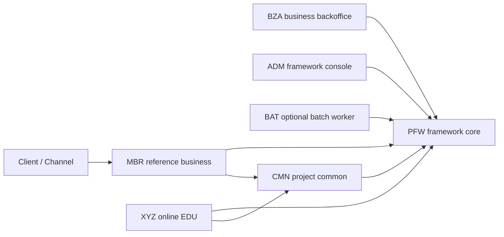

# CPF CoreFlow Platform Framework

CPF는 Java 25와 Spring Boot 3.4를 기준으로 온라인 API, 배치, 외부 연계, 운영 관제와 공통 신뢰성 기능을 같은 규칙으로 개발하기 위한 멀티 모듈 프레임워크입니다. 코드만 제공하는 골격이 아니라 SQL/Flyway, ADM·BZA 운영 화면, XYZ·BAT EDU, 배포 설정과 자동 검증을 함께 제공합니다.

최종 목표는 [CPF_FINAL_TARGET_REQUIREMENTS.md](CPF_FINAL_TARGET_REQUIREMENTS.md), 현재 검증 결과는 [CPF_STABILIZATION_REPORT.md](CPF_STABILIZATION_REPORT.md), 남은 차이는 [CPF_GAP_MATRIX.md](CPF_GAP_MATRIX.md)에서 확인합니다.

## 아키텍처 원칙



- `pfw`는 프레임워크 코어와 기술 공통 기능을 소유합니다.
- `cmn`은 CPF를 도입한 프로젝트가 추가하는 프로젝트 공통 업무 영역입니다.
- 업무 모듈은 다른 주제영역의 DB, Repository, Mapper에 직접 접근하지 않습니다.
- 같은 JVM은 public port와 local adapter, 분리 배포는 remote proxy와 PFW service-call 경계를 사용합니다.
- 범용 온라인 EDU는 `xyz`, 배치 EDU는 `bat`가 소유합니다. PFW와 CMN은 각각 계약 테스트와 프로젝트 helper 테스트를 둡니다.

## 모듈

| 모듈 | 형태 | 책임 |
|---|---|---|
| `pfw` | library | 표준 헤더·거래 ID·trace, 응답·예외, 로그, 보안, service-call, broker, 파일 전송, 배치 운영 메타, 캐시·메시지·코드·설정 엔진 |
| `cmn` | library | 프로젝트별 공통 업무 규칙과 helper. 기술 구현은 PFW public port 사용 |
| `adm` | bootJar | 프레임워크 운영 콘솔. 운영자·권한, 표준 실행, 로그, 배치, 캐시, 메시지, 코드, 설정, 보안과 복구 관제 |
| `bza` | bootJar | 업무 백오피스. 사용자·직원·조직·업무 권한·결재·업무 감사 |
| `mbr` | bootJar | 회원 주제영역 reference 업무 |
| `xyz` | bootJar | 온라인·공통 기능 EDU와 검증 API |
| `bat` | bootJar, 선택 | Spring Batch worker와 배치 EDU. 기본 실행 묶음에서는 선택 가능 |

ACC와 EXS는 초기 배포 baseline에서 제거했습니다. 새 업무 주제영역은 `scripts/create-domain.ps1`로 생성합니다.

## 주요 표준

- 거래 ID 헤더 `X-Transaction-Id`: `yyyyMMddHHmmssSSS(17) + moduleId(3) + wasId(7) + sequence(7)`의 34자리.
- 표준 온라인 ID: `O{DOM}-{BIZ}-{SUB}-{NNNN}`, 예: `OBZA-AUT-02-0001`.
- 표준 배치 ID: `B{DOM}-{BIZ}-{SUB}-{NNNN}`, 예: `BBAT-OPS-SM-0001`.
- 표준 헤더: transaction, trace, span/segment, workflow, client/channel 정보 검증과 하위 호출 전파.
- 공통 응답: 정상·오류 schema, validation, 내부 오류 노출 차단과 응답코드 관리.
- 신뢰성: timeout, retry, endpoint failover, circuit breaker, idempotency, outbox/inbox/DLQ, unknown-result 복구.
- 로그: 온라인 거래·구간·배치·감사·파일 로그, 민감정보 마스킹과 ADM 조회.
- 배치: Spring Batch JobRepository, CPF 운영 메타, lock·lease·heartbeat·ghost, dependency, 영업일·스케줄 simulation.

## 개발 환경

- Java 25. 컴파일 결과 class major는 69여야 합니다.
- 저장소의 Gradle 9.1 wrapper.
- Windows PowerShell 5.1 이상.
- DB 검증은 기설치 MariaDB와 사용자가 명시적으로 주입한 자격정보만 사용합니다.
- DOCX의 실제 Word 열기 검증에는 Microsoft Word가 필요합니다. OpenXML 구조 검사는 Word 없이 동작합니다.

개인 PC의 JDK 절대 경로와 실제 secret은 저장소에 기록하지 않습니다.

## 빌드와 검증

```powershell
java --version
.\gradlew.bat test --no-daemon --console=plain
.\gradlew.bat qualityGate --no-daemon --console=plain

powershell -NoProfile -ExecutionPolicy Bypass -File scripts/check-utf8.ps1 -CheckMojibake
powershell -NoProfile -ExecutionPolicy Bypass -File scripts/check-sql-standard.ps1
powershell -NoProfile -ExecutionPolicy Bypass -File scripts/check-docx-standard.ps1
powershell -NoProfile -ExecutionPolicy Bypass -File scripts/smoke-create-domain.ps1
```

`qualityGate`는 컴파일·테스트 외에 ownership, 서비스 호출 경계, 표준 실행 ID, OpenAPI operationId, SQL, UTF-8, 보안 seed, profile, 배포 inventory, 로그 정책, 샘플 커버리지와 문서·증적 정합성을 검사합니다.

## 로컬 실행

| 모듈 | 기본 포트 | 시작 클래스 |
|---|---:|---|
| MBR | 8081 | `MbrApplication` |
| ADM | 8090 | `AdmApplication` |
| BZA | 8091 | `BzaApplication` |
| BAT | 8093 | `BatApplication` |
| XYZ | 8099 | `XyzApplication` |

```powershell
powershell -NoProfile -ExecutionPolicy Bypass -File scripts/runtime-start-services.ps1 `
  -Modules MBR,ADM,BZA,XYZ -BuildBeforeRun -NoExitOnFailure

powershell -NoProfile -ExecutionPolicy Bypass -File scripts/runtime-status.ps1
powershell -NoProfile -ExecutionPolicy Bypass -File scripts/runtime-diagnostics.ps1
powershell -NoProfile -ExecutionPolicy Bypass -File scripts/runtime-stop-services.ps1
```

로컬 DB 계정과 BZA JWT secret이 준비되지 않으면 DB 기반 로그인·운영 API는 정상 동작하지 않습니다. 스크립트 결과가 성공인지와 각 업무 시나리오가 검증됐는지를 구분해 리포트합니다.

## MariaDB와 Flyway

`specs/sql/00_all_install.sql`과 `00_all_install_and_smoke.sql`은 `SOURCE`에 의존하지 않는 단일 실행 파일입니다. split SQL은 `specs/sql`에, 증분 migration은 `specs/sql/migration/flyway/V*__*.sql`에 둡니다.

```powershell
$env:CPF_DB_HOST = "localhost"
$env:CPF_DB_PORT = "3306"
$env:CPF_DB_ROOT_USERNAME = "root"
$env:CPF_DB_ROOT_PASSWORD = "<secret>"
$env:CPF_DB_MIGRATION_PASSWORD = "<separate-secret>"
$env:CPF_DB_APP_PASSWORD = "<separate-secret>"

powershell -NoProfile -ExecutionPolicy Bypass -File scripts/smoke-mariadb-full-install.ps1 -RequireRun
```

- 자격정보가 없으면 DB 연결을 시도하거나 임의 값을 추측하지 않고 `미검증`으로 기록합니다.
- migration 계정은 설치·변경 DDL, app 계정은 필요한 DML만 수행합니다.
- seed는 재실행 가능해야 하며 FK, index, COMMENT, 권한과 smoke 결과를 함께 검증합니다.
- 비밀번호와 JWT secret 원문은 SQL, 로그, 문서, 증적에 남기지 않습니다.

## ADM과 BZA

- ADM: `http://localhost:8090/adm`
- BZA: `http://localhost:8091/bza`
- OpenAPI: 각 실행 모듈의 `/v3/api-docs`, Swagger UI는 `/swagger-ui/index.html`

ADM은 프레임워크 관리 콘솔이고 BZA는 업무 운영 백오피스입니다. ADM이 BZA 업무 Repository를 직접 소유하지 않으며, BZA 권한도 화면 숨김에만 의존하지 않고 서버 filter에서 메뉴·행위 권한을 다시 검사합니다. BZA의 사용자·역할·메뉴·버튼/API 권한은 조회와 등록·수정 UI/API를 제공하고, 비밀번호는 PFW hash port를 거쳐 저장하며 모든 변경에 감사 사유와 before/after를 남깁니다.

BZA는 조직·직원·결재 외에 대시보드, 업무 알림, 첨부파일, 저장 검색, 다운로드 감사, 역할 비교와 권한 시뮬레이션을 제공합니다. 쓰기·결재·다운로드 감사 주체는 요청 본문이 아니라 인증 filter가 확정한 운영자 ID를 사용합니다. 첨부파일은 PFW `CpfAttachmentStoragePort`를 통해 경로·확장자·크기·checksum을 검증하며, prod에서는 `CPF_ATTACHMENT_ROOT`를 반드시 주입하고 object storage나 보안 파일 서버 adapter로 교체할 수 있습니다.

ADM 원격 로그 API는 PFW `CpfRemoteLogArtifactPort`를 사용합니다. 기본 구성은 현재 인스턴스를 registry node로 등록하고 허용된 로그 root의 검색·마스킹 preview·안전한 다운로드, 다중 node 라우팅 ID, timeout·부분 실패 진단, 선택 ZIP과 checksum manifest를 제공합니다. 대용량 선택 다운로드는 `CpfRemoteLogBundleJobPort`의 비동기 작업 상태, 소유자 격리, 요청 한도, 만료와 1회성 다운로드 token 재발급 흐름을 사용합니다. 기본 작업 queue는 단일 ADM 인스턴스용 in-memory adapter이므로 운영 cluster에서는 공유 저장소·분산 rate limit adapter로 교체합니다. 원격 HTTP client는 `CpfRemoteLogNodeClientPort`, 단기 service token은 `CpfRemoteLogServiceCredentialPort` 구현으로 교체하며 실제 mTLS 다중 서버 통합은 외부 인프라 런타임 검증 대상입니다.

## 신규 도메인 생성

```powershell
powershell -NoProfile -ExecutionPolicy Bypass -File scripts/create-domain.ps1 `
  -ModuleCode lng `
  -ModuleName Lending `
  -DomainIdCode LNG `
  -BasePackage cpf.lng `
  -TablePrefix lng `
  -Port 8180 `
  -Online Y `
  -Batch Y `
  -BzaMenu Y `
  -GeneratePatch
```

생성기는 Controller·Facade·Service·DTO·validation·Repository·Mapper뿐 아니라 업무 Port, local adapter, PFW service-call remote proxy, 표준 온라인/배치 ID manifest, SQL/Flyway 후보, ADM 카탈로그와 BZA 메뉴 후보, profile, 배포 inventory, smoke와 테스트를 만듭니다. `scripts/smoke-create-domain.ps1`은 임시 PYM 모듈을 생성해 test·bootJar·Java 25 class major 69를 확인한 뒤 임시 모듈을 삭제합니다.

## EDU

- 온라인 API, 표준 헤더, validation, paging, transaction, MyBatis, service-call, broker, 파일 전송, 보안, AI: `xyz/src/main/java/cpf/xyz/edu`
- AI provider·embedding·vector store port와 안전성 계약: `pfw/src/main/java/cpf/pfw/common/ai`
- AI deterministic 실습 API: `/xyz/edu/ai/**`에서 구조화 출력, streaming, tool call, retry·fallback, RAG·출처, 사람 승인과 사용량 지표를 확인합니다.
- 첨부 실습 API: `/xyz/edu/attachments/**`에서 안전한 저장과 checksum 재검증을 확인하며 `scripts/smoke-attachment-edu-runtime.ps1`로 저장·재조회 HTTP 스모크를 실행합니다.
- tasklet, chunk, retry/skip, restart/checkpoint, lock, scheduler, center-cut: `bat/src/main/java/cpf/bat/edu`
- 샘플과 테스트 연결: [sample-coverage-matrix.md](specs/sample-coverage-matrix.md)

## 공식 문서

| 문서 | 내용 |
|---|---|
| [프레임워크 소개 및 아키텍처](specs/CPF_프레임워크_소개_및_아키텍처.docx) | 제품 개요, PFW/CMN/업무 모듈 경계 |
| [개발자 가이드](specs/CPF_개발자_가이드.docx) | 온라인 API, DB, 거래, 로그와 확장 개발 |
| [운영자 ADM 가이드](specs/CPF_운영자_ADM_가이드.docx) | 권한, 로그, 배치, 캐시, 보안과 복구 운영 |
| [설치 DB SQL Flyway 가이드](specs/CPF_설치_DB_SQL_Flyway_가이드.docx) | 설치, 계정 분리, migration, smoke |
| [배치 센터컷 스케줄러 가이드](specs/CPF_배치_센터컷_스케줄러_가이드.docx) | 배치 개발, 관계, 실행, ghost와 관제 |
| [외부연계 파일전송 전문 가이드](specs/CPF_외부연계_파일전송_전문_가이드.docx) | HTTP, broker, 파일 전송, 고정길이 전문 |
| [EDU 샘플 카탈로그](specs/CPF_EDU_샘플_카탈로그_및_실습가이드.docx) | 상황별 XYZ/BAT 샘플과 실습 순서 |
| [기능 구현 검증 매트릭스](specs/CPF_기능_구현_검증_매트릭스.docx) | 기능별 구현·검증 상태 |
| [전체 테스트 검증 리포트](specs/CPF_전체_테스트_검증_리포트.docx) | 실행한 검증과 제한사항 |

정제 증적은 `specs/evidence/<작업일자_회차>`에 보관합니다. 실행하지 않은 검증은 성공으로 기록하지 않습니다.
