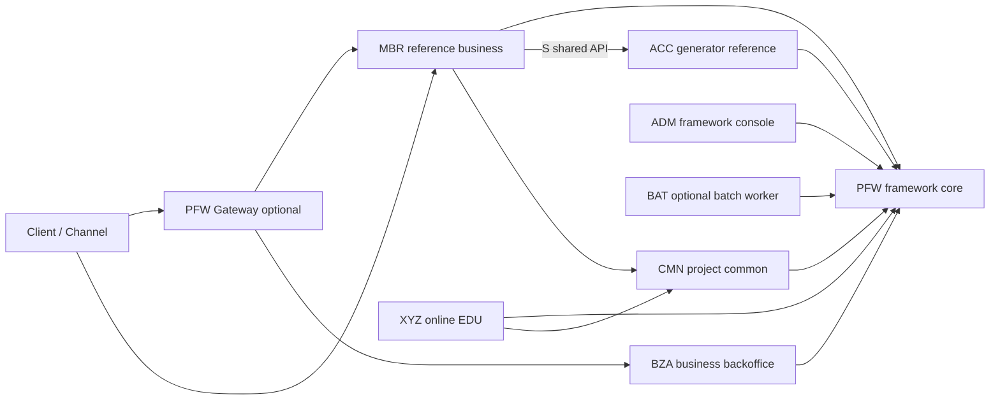

# CPF CoreFlow Platform Framework

CPF는 Java 25와 Spring Boot 3.4를 기준으로 온라인 API, 배치, 외부 연계, 운영 관제와 공통 신뢰성 기능을 같은 규칙으로 개발하기 위한 멀티 모듈 프레임워크입니다. 코드만 제공하는 골격이 아니라 SQL/Flyway, ADM·BZA 운영 화면, XYZ·BAT EDU, 배포 설정과 자동 검증을 함께 제공합니다.

CPF는 modular monolith와 분리 배포를 같은 업무 코드와 계약으로 지원합니다. 개발자는 주제영역 내부의 업무 규칙에 집중하고, 프레임워크는 호출 경계, 거래 추적, 운영 정책, 보안, 배치와 배포 검증을 일관되게 제공합니다.

## 아키텍처 원칙



- `pfw`는 프레임워크 코어와 기술 공통 기능을 소유합니다.
- `cmn`은 CPF를 도입한 프로젝트가 추가하는 프로젝트 공통 업무 영역입니다.
- 업무 모듈은 다른 주제영역의 DB, Repository, Mapper에 직접 접근하지 않습니다.
- 같은 JVM은 public port와 local adapter, 분리 배포는 remote proxy와 PFW service-call 경계를 사용합니다.
- 범용 온라인 EDU는 `xyz`, 배치 EDU는 `bat`가 소유합니다. PFW와 CMN은 각각 계약 테스트와 프로젝트 helper 테스트를 둡니다.

## 실행 모델

CPF 업무 기능은 동일 JVM의 local facade와 분리 배포의 remote facade proxy를 같은 public port 뒤에 둡니다. 호출자는 대상의 Controller, Repository, DB를 직접 알지 않으며 Service Call Engine이 endpoint 선택, 표준 헤더 재생성, timeout과 실패 분류를 담당합니다. 이 구조로 단일 애플리케이션에서 시작한 업무를 코드 재작성 없이 독립 서비스로 분리할 수 있습니다.

외부 진입은 업무 서비스 직접 URL 또는 선택형 PFW Gateway를 사용할 수 있습니다. Gateway는 `O` 온라인 실행 카탈로그의 공개 route만 snapshot으로 적재하고 실행 ID 기준 권한과 채널 정책을 통과한 요청만 전달합니다. 내부 공유용 `S` 실행은 공개 route에 노출하지 않으며 대상 서비스가 호출 서비스와 인스턴스 신원을 다시 검증합니다.

각 실행 인스턴스는 health와 registry 정보를 제공하고, 호출 시 선택된 인스턴스와 Gateway 인스턴스를 응답 헤더와 거래 구간에 남깁니다. endpoint 선택 정책은 PFW port로 분리되어 registry, service discovery, 외부 API Gateway 또는 배포 플랫폼 adapter로 교체할 수 있습니다.

## 모듈

| 모듈 | 형태 | 책임 |
|---|---|---|
| `pfw` | library | 표준 헤더·거래 ID·trace, 응답·예외, 로그, 보안, service-call, broker, 파일 전송, 배치 운영 메타, 캐시·메시지·코드·설정 엔진 |
| `cmn` | library | 프로젝트별 공통 업무 규칙과 helper. 기술 구현은 PFW public port 사용 |
| `adm` | bootJar | 프레임워크 운영 콘솔. 운영자·권한, 표준 실행, 로그, 배치, 캐시, 메시지, 코드, 설정, 보안과 복구 관제 |
| `bza` | bootJar | 업무 백오피스. 사용자·직원·조직·업무 권한·결재·업무 감사 |
| `mbr` | bootJar | 회원 주제영역 reference 업무 |
| `acc` | bootJar/bootWar, 선택 | 생성기 결과를 지속 검증하는 중립적 계정 reference domain |
| `xyz` | bootJar | 온라인·공통 기능 EDU와 검증 API |
| `bat` | bootJar, 선택 | Spring Batch worker와 배치 EDU. 기본 실행 묶음에서는 선택 가능 |
| `pfw-gateway-runtime` | bootJar, 선택 | PFW route snapshot과 Service Call Engine을 사용하는 단일 진입 runtime |

ACC는 기본 업무 배포 대상이 아니라 `scripts/create-domain.ps1` 산출물의 빌드·WAR·SQL·배포·공유 API 계약을 검증하는 reference domain입니다. EXS의 범용 외부 연계 기능은 PFW capability와 XYZ EDU로 이전하며 독립 업무 runtime으로 복원하지 않습니다. 새 업무 주제영역도 같은 생성기로 만듭니다.

## 주요 표준

- 거래 ID 헤더 `X-Transaction-Id`: `yyyyMMddHHmmssSSS(17) + moduleId(3) + wasId(7) + sequence(7)`의 34자리.
- 표준 실행 ID: `[유형 1][주제영역 3][기능 2][순번 4]`의 10자리 고정값이며 정규식은 `^[OSB][A-Z]{3}[A-Z0-9]{2}[0-9]{4}$`입니다.
- `O`는 온라인 거래, `S`는 CPF 내부 공유 API, `B`는 배치·비동기 실행입니다. 예: `OMBRAC0001`, `SACCAC0001`, `BBATOD0001`.
- 구형 하이픈 ID는 `pfw_standard_execution_alias` 조회 호환에만 사용하며 신규 헤더·로그·카탈로그 저장은 10자리 ID로 단일화합니다.
- 표준 헤더: transaction, trace, span/segment, workflow, client/channel 정보 검증과 하위 호출 전파.
- 공통 응답: 정상·오류 schema, validation, 내부 오류 노출 차단과 응답코드 관리.
- 신뢰성: timeout, retry, endpoint failover, circuit breaker, idempotency, outbox/inbox/DLQ, unknown-result 복구.
- 로그: 온라인 거래·구간·배치·감사·파일 로그, 민감정보 마스킹과 ADM 조회.
- 배치: Spring Batch JobRepository, CPF 운영 메타, lock·lease·heartbeat·ghost, dependency, 영업일·스케줄 simulation.

## 채널과 Gateway

PFW 채널 레지스트리는 `original channel`과 현재 호출 채널을 구분합니다. 최초 유입 채널은 거래의 출처로 보존하고, 서비스 간 호출 과정의 현재 채널은 별도 헤더로 전파합니다. 채널 코드는 대소문자와 공백을 정규화한 뒤 활성 상태, 인증·서명 요구, 호출 유형과 거래별 허용 정책을 평가합니다.

채널과 거래 정책은 `pfw_channel`, `pfw_channel_execution_policy`를 정본으로 사용하며 애플리케이션은 불변 snapshot을 원자적으로 교체합니다. DB를 사용할 수 없는 local 환경에는 제한된 fallback이 있지만 운영 정책 저장 실패를 성공으로 숨기지 않습니다. 정책 package는 환경 독립 JSON으로 export/import할 수 있고 ADM에서 변경 내용과 refresh 결과를 관리합니다.

Gateway는 다음 두 호출 방식을 제공합니다.

- 자연어 route: 카탈로그에 등록된 HTTP method와 업무 URI로 호출
- 실행 ID route: `/cpf/execute/{standardExecutionId}`로 호출하고 실제 target URI는 route snapshot에서 결정

Gateway는 외부에서 전달된 내부 서비스 신원 헤더를 그대로 신뢰하지 않습니다. 자신이 확정한 Gateway route·instance 정보와 PFW 호출자 헤더를 다시 만들며, 대상 응답의 표준 거래 헤더를 호출자에게 돌려줍니다. Gateway 기능은 선택형 runtime이므로 외부 제품 API Gateway를 사용할 때도 PFW route·채널·거래 계약을 adapter로 재사용할 수 있습니다.

## 거래 추적과 오류

`transactionGlobalId`는 전체 업무 흐름을 묶고 각 서비스 호출과 배치 step은 segment로 분리됩니다. 업무 거래 ID, trace ID, parent segment, workflow와 보상 정보가 온라인 로그, 외부 호출 로그, 배치 실행 로그에 같은 규격으로 연결됩니다. ADM은 거래 그룹의 헤더·구간·timeline·외부 로그를 조회하며 JSON, text, 고정길이 전문은 원문 권한과 포맷 보기를 분리합니다.

오류 응답은 PFW 응답코드와 메시지 카탈로그를 사용합니다. validation, 권한, 업무 오류는 외부 메시지와 내부 상세를 분리하고 예상하지 못한 내부 예외의 stack trace와 SQL 정보를 응답에 노출하지 않습니다. Gateway와 직접 호출은 동일한 오류 envelope를 사용하며 trace와 거래 식별자는 장애 조사에 필요한 범위로만 반환합니다.

로그와 감사 데이터는 비밀번호, token, 주민·연락처 같은 민감값을 마스킹합니다. 원문 조회와 다운로드는 별도 권한을 요구하고 운영 변경은 행위자, 시각, 사유, before/after를 남깁니다.

## 신뢰성과 외부 연계

Service Call Engine은 endpoint별 timeout, 제한된 retry, circuit breaker와 failover 확장점을 제공합니다. 재시도가 안전하지 않은 쓰기 요청은 idempotency key와 처리 상태를 먼저 설계하며, 응답을 받지 못한 unknown result는 무조건 재호출하지 않고 reconciliation 경로로 확인합니다.

PFW broker 계약은 outbox·inbox·DLQ·replay 경계를 제공하고 Redis, Kafka, RabbitMQ adapter를 선택할 수 있습니다. 파일 연계는 SFTP·FTP·FTPS·SCP·SSH 명령 계획, checksum, 임시 파일, 원자적 이동과 이력을 공통 규격으로 묶습니다. 업무 모듈은 PFW port를 호출하며 접속정보와 vendor SDK를 업무 Service에 직접 포함하지 않습니다.

첨부파일은 허용 root, 경로 이탈, symlink, 확장자, content type, 크기와 SHA-256을 검증합니다. local storage는 개발용 adapter이고 운영에서는 object storage 또는 보안 파일 서버 adapter로 교체합니다. 고정길이 전문은 CMN layout 계약과 XYZ EDU를 통해 byte 길이, charset, parse/format round-trip을 검증할 수 있습니다.

## 배치와 스케줄러

Spring Batch 원천 메타는 `pfwDB.BATCH_*`에 저장하고 CPF 운영 메타는 표준 배치 ID, 스케줄, 실행, step, lock, worker heartbeat와 운영 행위를 연결합니다. 업무 item 처리는 해당 주제영역 DataSource와 트랜잭션 관리자를 사용하므로 프레임워크 메타와 업무 데이터의 소유권이 섞이지 않습니다.

BAT는 actual job과 공식 EDU를 분리합니다. actual job은 `bat/job/<job-definition>` vertical slice에 구성하고, EDU는 tasklet, chunk, retry, checkpoint/restart, idempotency, center-cut, reconciliation처럼 학습 목적별 package를 사용합니다. 애플리케이션 기동 시 Job 자동 실행은 비활성화하며 ADM 또는 승인된 운영 경로가 실행을 시작합니다.

온디맨드 API는 202 접수, 표준 배치 ID allowlist, 멱등키, 업무일자, 실행 사유와 요청자를 저장한 뒤 worker가 실행합니다. 상태와 step을 조회할 수 있고 `restart`는 같은 JobInstance의 checkpoint 재개, `rerun`은 새 인스턴스 실행으로 구분합니다. 거절된 restart 결과가 기존 실행 추적 ID를 지우지 않으므로 운영자는 정책 확인 후 안전하게 rerun할 수 있습니다.

스케줄 정책은 영업일, 허용 시간, 선후행과 trigger 관계, 중복 실행 lock을 표현합니다. ADM은 실행 전 simulation, 대기 인스턴스, dependency, worker·lock·ghost 후보와 작업 로그를 조회하는 운영 경계를 제공합니다.

## 개발 환경

- Java 25. 컴파일 결과 class major는 69여야 합니다.
- 저장소의 Gradle 9.1 wrapper.
- Windows PowerShell 5.1 이상.
- DB 검증은 기설치 MariaDB와 사용자가 명시적으로 주입한 자격정보만 사용합니다.
- DOCX의 실제 Word 열기 검증에는 Microsoft Word가 필요합니다. OpenXML 구조 검사는 Word 없이 동작합니다.

개인 PC의 JDK 절대 경로와 실제 secret은 저장소에 기록하지 않습니다.

## 빌드와 검증

```powershell
java --version
.\gradlew.bat test --no-daemon --console=plain
.\gradlew.bat qualityGate --no-daemon --console=plain

powershell -NoProfile -ExecutionPolicy Bypass -File scripts/check-utf8.ps1 -CheckMojibake
powershell -NoProfile -ExecutionPolicy Bypass -File scripts/check-sql-standard.ps1
powershell -NoProfile -ExecutionPolicy Bypass -File scripts/check-docx-standard.ps1
powershell -NoProfile -ExecutionPolicy Bypass -File scripts/smoke-create-domain.ps1
```

`qualityGate`는 컴파일·테스트 외에 ownership, 서비스 호출 경계, 표준 실행 ID, OpenAPI operationId, SQL, UTF-8, 보안 seed, profile, 배포 inventory, 로그 정책, 샘플 커버리지와 문서·증적 정합성을 검사합니다.

## 로컬 실행

| 모듈 | 기본 포트 | 시작 클래스 |
|---|---:|---|
| MBR | 8081 | `MbrApplication` |
| ACC | 8082 | `AccApplication` |
| PFW Gateway | 8070 | `PfwGatewayApplication` |
| ADM | 8090 | `AdmApplication` |
| BZA | 8091 | `BzaApplication` |
| BAT | 8093 | `BatApplication` |
| XYZ | 8099 | `XyzApplication` |

```powershell
powershell -NoProfile -ExecutionPolicy Bypass -File scripts/runtime-start-services.ps1 `
  -Modules MBR,ADM,BZA,XYZ -BuildBeforeRun -NoExitOnFailure

powershell -NoProfile -ExecutionPolicy Bypass -File scripts/runtime-status.ps1
powershell -NoProfile -ExecutionPolicy Bypass -File scripts/runtime-diagnostics.ps1
powershell -NoProfile -ExecutionPolicy Bypass -File scripts/runtime-stop-services.ps1
```

로컬 DB 계정과 BZA JWT secret이 준비되지 않으면 DB 기반 로그인·운영 API는 정상 동작하지 않습니다. 스크립트 결과가 성공인지와 각 업무 시나리오가 검증됐는지를 구분해 리포트합니다.

ACC와 Gateway는 선택 실행 대상입니다. Gradle에서는 `-PcpfRunServices=MBR,ACC,GATEWAY`처럼 명시하며, 운영 배포 topology에서도 필요한 runtime만 활성화합니다.

## 주제영역 간 공유 API

동일 JVM은 CMN의 Facade Contract와 local adapter를 사용하고, 분리 배포는 remote facade proxy와 PFW Service Call Engine을 사용합니다. `@CpfSharedApi`가 선언된 `S` 실행은 공개 Gateway route에 포함되지 않으며 대상 서비스 ingress에서 다음을 다시 검증합니다.

- `X-Cpf-Standard-Execution-Id`와 실제 handler의 `S` ID 일치
- PFW가 현재 서비스 기준으로 재생성한 `X-Caller-Service`, `X-Caller-Instance-Id`
- annotation의 허용 호출 서비스와 실제 호출자 일치
- PFW/external Gateway 우회 호출 차단
- local/dev/test loopback 또는 명시된 peer, 운영 mTLS/service-token 검증 adapter

운영 프로필은 검증 adapter가 없으면 기본 거부합니다. 서비스 신원 확장은 `CpfInternalServiceIdentityVerifier`로 연결하며, 외부에서 받은 호출자 헤더를 신뢰해 그대로 전달하지 않습니다.

## MariaDB와 Flyway

`specs/sql/00_all_install.sql`과 `00_all_install_and_smoke.sql`은 `SOURCE`에 의존하지 않는 단일 실행 파일입니다. split SQL은 `specs/sql`에, 증분 migration은 `specs/sql/migration/flyway/V*__*.sql`에 둡니다.

```powershell
$env:CPF_DB_HOST = "localhost"
$env:CPF_DB_PORT = "3306"
$env:CPF_DB_ROOT_USERNAME = "root"
$env:CPF_DB_ROOT_PASSWORD = "<secret>"
$env:CPF_DB_MIGRATION_PASSWORD = "<separate-secret>"
$env:CPF_DB_APP_PASSWORD = "<separate-secret>"

powershell -NoProfile -ExecutionPolicy Bypass -File scripts/smoke-mariadb-full-install.ps1 -RequireRun
```

- 자격정보가 없으면 DB 연결을 시도하거나 임의 값을 추측하지 않고 `미검증`으로 기록합니다.
- migration 계정은 설치·변경 DDL, app 계정은 필요한 DML만 수행합니다.
- seed는 재실행 가능해야 하며 FK, index, COMMENT, 권한과 smoke 결과를 함께 검증합니다.
- 비밀번호와 JWT secret 원문은 SQL, 로그, 문서, 증적에 남기지 않습니다.

## ADM과 BZA

- ADM: `http://localhost:8090/adm`
- BZA: `http://localhost:8091/bza`
- OpenAPI: 각 실행 모듈의 `/v3/api-docs`, Swagger UI는 `/swagger-ui/index.html`

ADM은 프레임워크 관리 콘솔이고 BZA는 업무 운영 백오피스입니다. ADM이 BZA 업무 Repository를 직접 소유하지 않으며, BZA 권한도 화면 숨김에만 의존하지 않고 서버 filter에서 메뉴·행위 권한을 다시 검사합니다. BZA의 사용자·역할·메뉴·버튼/API 권한은 조회와 등록·수정 UI/API를 제공하고, 비밀번호는 PFW hash port를 거쳐 저장하며 모든 변경에 감사 사유와 before/after를 남깁니다.

BZA는 조직·직원·결재 외에 대시보드, 업무 알림, 첨부파일, 저장 검색, 다운로드 감사, 역할 비교와 권한 시뮬레이션을 제공합니다. 쓰기·결재·다운로드 감사 주체는 요청 본문이 아니라 인증 filter가 확정한 운영자 ID를 사용합니다. 첨부파일은 PFW `CpfAttachmentStoragePort`를 통해 경로·확장자·크기·checksum을 검증하며, prod에서는 `CPF_ATTACHMENT_ROOT`를 반드시 주입하고 object storage나 보안 파일 서버 adapter로 교체할 수 있습니다.

ADM 원격 로그 API는 PFW `CpfRemoteLogArtifactPort`를 사용합니다. 기본 구성은 현재 인스턴스를 registry node로 등록하고 허용된 로그 root의 검색·마스킹 preview·안전한 다운로드, 다중 node 라우팅 ID, timeout·부분 실패 진단, 선택 ZIP과 checksum manifest를 제공합니다. 대용량 선택 다운로드는 `CpfRemoteLogBundleJobPort`의 비동기 작업 상태, 소유자 격리, 요청 한도, 만료와 1회성 다운로드 token 재발급 흐름을 사용합니다. 기본 작업 queue는 단일 ADM 인스턴스용 in-memory adapter이므로 운영 cluster에서는 공유 저장소·분산 rate limit adapter로 교체합니다. 원격 HTTP client는 `CpfRemoteLogNodeClientPort`, 단기 service token은 `CpfRemoteLogServiceCredentialPort` 구현으로 교체하며 실제 mTLS 다중 서버 통합은 외부 인프라 런타임 검증 대상입니다.

ADM의 채널 정책 화면은 채널 master, 거래별 허용 정책, refresh와 정책 package export/import를 제공합니다. 목록·상세·변경 행위는 메뉴 표시와 별개로 서버 API 권한을 다시 검사하며, 캐시·메시지·코드·응답코드·설정·동적 로그레벨·배치 실행 같은 운영 변경에도 동일한 감사 원칙을 적용합니다.

## 개발자 사용 모델

새 기능은 Controller에서 요청을 검증하고 application Service에서 트랜잭션 경계를 선언하며, port와 adapter를 통해 DB·외부 시스템을 연결합니다. DTO는 API 계약에 집중하고 정렬 컬럼·상태 코드·파일 경로처럼 SQL 또는 자원 접근에 영향을 주는 값은 allowlist로 제한합니다. 다른 주제영역 기능은 public facade contract로만 호출합니다.

공통 기술 기능이 필요하면 먼저 PFW public port를 확인합니다. 프로젝트 여러 업무에서 공유하는 비즈니스 규칙은 CMN에 구현하되 PFW 내부 Repository나 타 업무 DB에 의존하지 않습니다. 특정 업무 규칙은 해당 업무 모듈이 소유하며 ADM은 관제 API를 통해서만 접근합니다.

개발 순서는 다음과 같습니다.

1. XYZ 또는 BAT의 목적별 EDU와 `specs/sample-coverage-matrix.md`에서 가까운 샘플을 찾습니다.
2. 표준 실행 ID, API·DTO, validation과 오류코드를 먼저 정의합니다.
3. Service 트랜잭션과 port/adapter 경계를 구현합니다.
4. SQL/Flyway, seed·smoke와 OpenAPI를 함께 갱신합니다.
5. 단위·slice·통합 테스트를 추가하고 `qualityGate`를 통과시킵니다.
6. 운영 변경 기능이면 ADM 권한, 감사 사유, before/after와 EDU를 연결합니다.

## 신규 도메인 생성

```powershell
powershell -NoProfile -ExecutionPolicy Bypass -File scripts/create-domain.ps1 `
  -ModuleCode lng `
  -ModuleName Lending `
  -DomainIdCode LNG `
  -BasePackage cpf.lng `
  -TablePrefix lng `
  -Port 8180 `
  -Online Y `
  -Batch Y `
  -BzaMenu Y `
  -GeneratePatch
```

생성기는 Controller·Facade·Service·DTO·validation·Repository·Mapper뿐 아니라 업무 Port, local adapter, PFW service-call remote proxy, 표준 온라인/배치 ID manifest, SQL/Flyway 후보, ADM 카탈로그와 BZA 메뉴 후보, profile, 배포 inventory, smoke와 테스트를 만듭니다. `scripts/smoke-create-domain.ps1`은 임시 검증 모듈을 생성해 test·bootJar·bootWar·Java 25 class major 69를 확인한 뒤 임시 모듈을 삭제합니다.

배치가 포함된 생성 모듈은 Spring Batch 원천 메타를 `pfwDB.BATCH_*`에 기록하고 업무 데이터는 해당 주제영역 DB의 전용 트랜잭션 관리자로 처리합니다. 생성된 Job은 애플리케이션 기동 시 자동 실행하지 않으며 승인된 운영 실행 경로에서만 시작합니다.

## EDU

- 온라인 API, 표준 헤더, validation, paging, transaction, MyBatis, service-call, broker, 파일 전송, 보안, AI: `xyz/src/main/java/cpf/xyz/edu`
- AI provider·embedding·vector store port와 안전성 계약: `pfw/src/main/java/cpf/pfw/common/ai`
- AI deterministic 실습 API: `/xyz/edu/ai/**`에서 구조화 출력, streaming, tool call, retry·fallback, RAG·출처, 사람 승인과 사용량 지표를 확인합니다.
- 첨부 실습 API: `/xyz/edu/attachments/**`에서 안전한 저장과 checksum 재검증을 확인하며 `scripts/smoke-attachment-edu-runtime.ps1`로 저장·재조회 HTTP 스모크를 실행합니다.
- tasklet, chunk, retry/skip, restart/checkpoint, lock, scheduler, center-cut: `bat/src/main/java/cpf/bat/edu`
- 샘플과 테스트 연결: [sample-coverage-matrix.md](specs/sample-coverage-matrix.md)

EDU 샘플은 제품 코드의 장식이 아니라 공통 계약의 실행 가능한 사용 예입니다. 각 샘플은 대응 테스트를 가지며 sample coverage gate가 source·test·카탈로그 연결을 검사합니다. 실제 업무 코드는 EDU package에 두지 않고, 검증된 패턴을 해당 주제영역의 feature package로 옮겨 사용합니다.

## 기술 사양

| 구분 | 기준 |
|---|---|
| 언어·JVM | Java 25, class major 69 |
| 애플리케이션 | Spring Boot 3.4, embedded bootJar와 external bootWar 확장 |
| 빌드 | Gradle Wrapper 9.1 |
| DB | MariaDB, 주제영역 DB 분리, Flyway 증분 migration |
| SQL | lower snake case, 주제영역 prefix, 공통 감사 컬럼, UTF-8 `utf8mb4` |
| API | REST `/api/v1`, OpenAPI 3.1, O/S/B 표준 실행 카탈로그 |
| 배치 | Spring Batch JobRepository + CPF 운영 메타 |
| 관측 | health/readiness/liveness, metric·trace 확장점, 구조화 로그 |
| 보안 | 서버 권한 재검사, secret 외부 주입, 민감정보 마스킹, 감사 이력 |
| 패키징 | library, 선택형 bootJar/bootWar, local/dev/stg/prod profile |

## 공식 문서

| 문서 | 내용 |
|---|---|
| [프레임워크 소개 및 아키텍처](specs/CPF_프레임워크_소개_및_아키텍처.docx) | 제품 개요, PFW/CMN/업무 모듈 경계 |
| [개발자 가이드](specs/CPF_개발자_가이드.docx) | 온라인 API, DB, 거래, 로그와 확장 개발 |
| [운영자 ADM 가이드](specs/CPF_운영자_ADM_가이드.docx) | 권한, 로그, 배치, 캐시, 보안과 복구 운영 |
| [설치 DB SQL Flyway 가이드](specs/CPF_설치_DB_SQL_Flyway_가이드.docx) | 설치, 계정 분리, migration, smoke |
| [배치 센터컷 스케줄러 가이드](specs/CPF_배치_센터컷_스케줄러_가이드.docx) | 배치 개발, 관계, 실행, ghost와 관제 |
| [외부연계 파일전송 전문 가이드](specs/CPF_외부연계_파일전송_전문_가이드.docx) | HTTP, broker, 파일 전송, 고정길이 전문 |
| [EDU 샘플 카탈로그](specs/CPF_EDU_샘플_카탈로그_및_실습가이드.docx) | 상황별 XYZ/BAT 샘플과 실습 순서 |
| [기능 구현 검증 매트릭스](specs/CPF_기능_구현_검증_매트릭스.docx) | 기능별 구현·검증 상태 |
| [전체 테스트 검증 리포트](specs/CPF_전체_테스트_검증_리포트.docx) | 실행한 검증과 제한사항 |

기능별 현재 검증 상태와 실행 증적은 제품 소개와 분리해 `CPF_STABILIZATION_REPORT.md`, `CPF_GAP_MATRIX.md`, `CPF_EVIDENCE_INDEX.md`에서 관리합니다.
