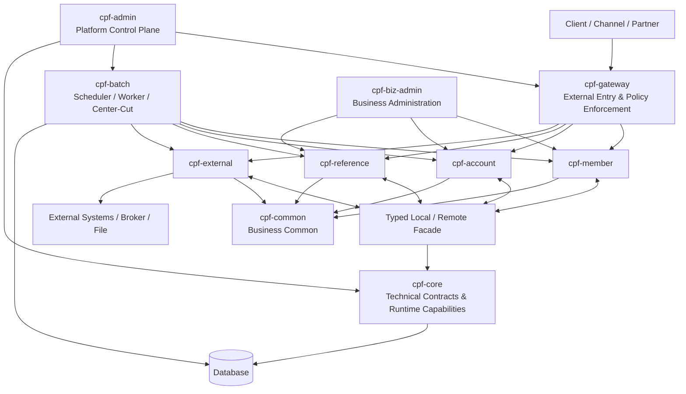

<div align="center">

# Core Platform Framework

### Business Platform Framework for Reliable and Extensible Systems

**Build once. Operate safely. Extend consistently.**

<br/>


</div>

---

## Overview

**Core Platform Framework(CPF)**???ㅼ뼇???낅Т ?쒖뒪?쒖쓣 ?쇨???援ъ“濡?媛쒕컻?섍퀬 ?댁쁺?섍린 ?꾪븳 Java 湲곕컲 Framework?낅땲??

?⑤씪??嫄곕옒, 二쇱젣?곸뿭 媛??몄텧, 諛곗튂?€ ?€??泥섎━, ?몃? ?쒖뒪???곌퀎, ?뚯씪怨??꾨Ц, 硫붿떆吏? 蹂댁븞, 媛먯궗, ?댁쁺 愿€?? ?μ븷 蹂듦뎄, ?ㅼ튂?€ ?낃렇?덉씠?쒖뿉 ?꾩슂??怨듯넻 援ъ“?€ ?ㅽ뻾 湲곕컲???쒓났?⑸땲??

?쒖뒪?쒖쓽 洹쒕え?€ 援ъ꽦 諛⑹떇???щ씪吏€?붾씪???숈씪??媛쒕컻 ?먯튃怨??댁쁺 湲곗????좎??????덈룄濡??ㅺ퀎?섏뿀?쇰ʼn, MSA?€ Modular Monolith ?섍꼍???④퍡 吏€?먰빀?덈떎.

CPF??湲곕뒫 援ы쁽肉??꾨땲??嫄곕옒 異붿쟻, ?ㅻ쪟 泥섎━, ?ъ떆?? 蹂듦뎄, 蹂댁븞, 媛먯궗, ?댁쁺 ?쒖뼱?€ ?뺤옣 援ъ“瑜??④퍡 愿€由ы빀?덈떎.

## Product Highlights

| Platform Engineering | Reliability & Operations |
|---|---|
| MSA?€ Modular Monolith ?숈떆 吏€??| ?ㅼ쨷 ?몄뒪?댁뒪, ?ъ떆?? 蹂듦뎄?€ 寃곌낵 遺덈챸 泥섎━ |
| ?숈씪 JVM怨?遺꾨━ WAS???숈씪 ?낅Т Contract | 嫄곕옒 異붿쟻, ?뚯씪쨌DB 濡쒓렇, 媛먯궗?€ Trace Boost |
| ?쒖? Gateway?€ Local/Remote ?몄텧 | Worker lease, fencing, drain怨?takeover |
| ?좉퇋 ?낅Т 二쇱젣?곸뿭 Generator | ?댁쁺 議고쉶쨌?쒖뼱쨌?뱀씤쨌?ъ쿂由?|
| OpenAPI, JavaDoc?€ EDU | ?ㅼ튂쨌Migration쨌Upgrade쨌Rollback |

| Security & Integration | Batch & Massive Processing |
|---|---|
| ?몄쬆, 沅뚰븳, 留덉뒪?? 媛먯궗?€ Secret 愿€由?| Batch, Scheduler, Agent?€ Worker |
| mTLS, OAuth2, JWT?€ API Key | Center-Cut, 遺꾪븷 泥섎━?€ ?ъ떆??|
| REST, 怨좎젙湲몄씠 ?꾨Ц怨??뚯씪 | 硫깅벑?? checkpoint?€ item ?ъ쿂由?|
| Outbox, Inbox, DLQ?€ Reconciliation | ?숆린쨌鍮꾨룞湲??낅Т ?몄텧怨?蹂댁긽 |

## Architecture at a Glance



### Runtime Principles

- ?몃? Client?€ Channel?€ `cpf-gateway`瑜??듯빐 吏꾩엯?⑸땲??
- ?대? 二쇱젣?곸뿭 媛??몄텧?€ Gateway瑜??ш꼍?좏븯吏€ ?딆뒿?덈떎.
- ?숈씪 JVM ?몄텧怨?Remote ?몄텧?€ ?숈씪???낅Т Contract瑜?怨듭쑀?⑸땲??
- 湲곗닠 怨듯넻?€ ?낅Т Module??李몄“?섏? ?딆뒿?덈떎.
- ?곹깭 湲곕컲 湲곕뒫?€ 硫깅벑?? ?숈떆?? ?ъ떆?? 寃곌낵 遺덈챸怨?蹂듦뎄瑜??④퍡 ?ㅺ퀎?⑸땲??
- 紐⑤뱺 ?댁쁺 議곗튂??沅뚰븳, ?뱀씤, 媛먯궗?€ ?ㅽ뻾 Evidence瑜??④퉩?덈떎.

## Official Modules

CPF??怨듭떇 Module?€ 湲곕낯 援ъ꽦???ы븿?섎뒗 **?꾩닔 Module**, ?꾨줈?앺듃 ?붽뎄???곕씪 ?곸슜?섎뒗 **?좏깮 Module**, Generator ?쒖? 援ъ“瑜??곕Ⅴ??**?앹꽦???낅Т Module**濡?援щ텇?⑸땲??

| Module | Code | ?좏삎 | ??븷 |
|---|---:|---|---|
| `cpf-core` | `CPF` | ?꾩닔 | 湲곗닠 怨듯넻쨌Runtime쨌?뺤옣 SPI |
| `cpf-gateway` | `GWY` | ?좏깮 | ?몃? 吏꾩엯쨌?쇱슦?끒룸낫?댟룹옣??寃⑸━ |
| `cpf-common` | `CMN` | ?꾩닔 | ?낅Т 怨듯넻 湲곕뒫쨌怨듯넻 紐⑤뜽 |
| `cpf-admin` | `ADM` | ?꾩닔 | ?뚮옯???댁쁺쨌愿€?쑣룸낫?댟룰컧??|
| `cpf-biz-admin` | `BZA` | ?좏깮 | ?낅Т 愿€由ъ옄쨌?낅Т ?댁쁺 |
| `cpf-batch` | `BAT` | ?좏깮 | Batch쨌Scheduler쨌Worker쨌Center-Cut |
| `cpf-member` | `MBR` | ?앹꽦??| ?뚯썝 ?낅Т 二쇱젣?곸뿭 |
| `cpf-account` | `ACC` | ?앹꽦??| 怨꾩쥖 ?낅Т 二쇱젣?곸뿭 |
| `cpf-reference` | `REF` | ?좏깮 | 李몄“ 援ы쁽쨌EDU |
| `cpf-external` | `EXS` | ?앹꽦??| ?€???곌퀎 二쇱젣?곸뿭 |

?앹꽦???낅Т Module?€ ?꾩슂??Module留??좏깮?섏뿬 ?ъ슜?????덉쑝硫? `cpf-tools`??Generator瑜??댁슜???숈씪???쒖? 援ъ“???좉퇋 ?낅Т 二쇱젣?곸뿭??異붽??????덉뒿?덈떎.


## Core Capabilities

### Application Platform

- ?쒖? ?붿껌쨌?묐떟 Header?€ 嫄곕옒 ?앸퀎??- ?낅Т ID?€ URI 湲곕컲 ?몄텧
- Local Facade?€ Remote Adapter
- Validation, ?ㅻ쪟 肄붾뱶?€ 硫붿떆吏€ ?쒖?
- Transaction, Idempotency?€ ?곹깭 ?꾩씠
- Timeout budget, Retry, Circuit Breaker?€ Bulkhead
- OpenAPI, JavaDoc?€ 媛쒕컻???뺤옣 SPI

?쒖? ?⑤씪???붿껌?€ `X-Transaction-Id`瑜??ъ슜?⑸땲?? 湲곕낯 ID??`yyyyMMddHHmmssSSS`(17) + 紐⑤뱢 ID(3) + WAS ID(7) + ?쇱씪 ?쒕쾲(7)??34?먮━?대ʼn, ?곸꽭 Header ?좊ː 寃쎄퀎?€ ?꾨떖 洹쒖튃?€
[API Guide](cpf-docs/api/API_GUIDE.md#3-standard-headers)瑜??곕쫭?덈떎.

### Operations

- 嫄곕옒 洹몃９, ?곸꽭, 援ш컙蹂?Timeline怨??ㅽ뙣 吏€??議고쉶
- ?뚯씪 濡쒓렇?€ DB 濡쒓렇??嫄곕옒 ?⑥쐞 異붿쟻
- ?쒕퉬?ㅒ텲ndpoint쨌Instance Registry?€ ?곹깭 議고쉶
- ?숈쟻 濡쒓렇 ?덈꺼怨??쒗븳 ?쒓컙 Trace Boost
- Batch쨌Worker쨌Center-Cut 議고쉶?€ ?쒖뼱
- ?ъ쿂由? 蹂댁긽, 寃곌낵 遺덈챸 ?뺤씤怨??섎룞 蹂듦뎄
- ?댁쁺 議곗튂 ?뱀씤, 媛먯궗?€ ?듦퀎

### Security

- AuthN, AuthZ, RBAC?€ ?뺤콉 湲곕컲 ?묎렐 ?쒖뼱
- 媛쒖씤?뺣낫 遺꾨쪟, 留덉뒪?밴낵 ?ㅼ슫濡쒕뱶 ?듭젣
- Secret ?몃??붿? Rotation
- mTLS, OAuth2, JWT?€ API Key
- 愿€由ъ옄 Dual Control怨?媛먯궗 異붿쟻
- Dependency, SBOM, License?€ Secret Scan

### Integration & Data

- REST?€ 怨좎젙湲몄씠 ?꾨Ц
- ?뚯씪, 泥⑤?, ?뺤텞怨?SFTP
- Outbox, Inbox, DLQ?€ Replay
- Saga, Compensation怨?Reconciliation
- MariaDB, PostgreSQL, Oracle怨?SQL Server
- ?좉퇋 ?ㅼ튂, Migration, Upgrade?€ Rollback

## Repository Layout

```text
cpf-core-platform-framework/
?쒋? cpf-core/          湲곗닠 怨듯넻 Contract, Runtime 湲곕뒫怨??뺤옣 SPI
?쒋? cpf-gateway/       ?몃? 吏꾩엯, ?몄쬆 ?곌퀎, Routing怨??μ븷 寃⑸━
?쒋? cpf-common/        ?щ윭 ?낅Т 二쇱젣?곸뿭?먯꽌 怨듭쑀?섎뒗 ?낅Т 怨듯넻 湲곕뒫
?쒋? cpf-admin/         ?뚮옯???댁쁺, 愿€?? 蹂댁븞, 媛먯궗?€ ?쒖뼱
?쒋? cpf-biz-admin/     怨좉컼 ?낅Т 愿€由ъ옄 ?붾㈃怨??낅Т ?댁쁺 湲곕뒫
?쒋? cpf-batch/         Batch, Scheduler, Agent, Worker?€ Center-Cut
?쒋? cpf-member/        ?뚯썝 ?낅Т 二쇱젣?곸뿭
?쒋? cpf-account/       怨꾩쥖 ?낅Т 二쇱젣?곸뿭怨?Generator lifecycle 湲곗?
?쒋? cpf-reference/     湲곗??뺣낫, 李몄“ 援ы쁽怨?EDU ?낅Т 二쇱젣?곸뿭
?쒋? cpf-external/      ?몃?湲곌?, ?꾨Ц, ?뚯씪, 硫붿떆吏뺢낵 ?곌퀎 蹂듦뎄
?쒋? cpf-docs/          ?꾪궎?띿쿂, 媛쒕컻, ?댁쁺, 蹂댁븞, API?€ Release 臾몄꽌
?쒋? cpf-deployment/    ?ㅼ튂, 諛고룷, ?몃? WAS, Container?€ ?댁쁺 Script
?쒋? cpf-tools/         Generator, Migration, 寃€利앷낵 媛쒕컻 吏€???꾧뎄
?쒋? build.gradle       怨듯넻 Build?€ ?덉쭏 寃€利??ㅼ젙
?쒋? settings.gradle    怨듭떇 Module 援ъ꽦
?붴? README.md          ?쒗뭹 ?뚭컻, 援ъ“, 二쇱슂 湲곕뒫怨??쒖옉 ?덈궡
```

蹂꾨룄??Root `specs/` ?붾젆?곕━???먯? ?딆뒿?덈떎. ?쒗뭹 Specification怨?Guide????븷???곕씪 `cpf-docs/` ?꾨옒???듯빀?섍퀬, ?먮룞 ?앹꽦 ?먮즺?€ ?ㅽ뻾 Evidence???뺥빐吏?怨듭떇 ?꾩튂?먯꽌 愿€由ы빀?덈떎.

## Quick Start

### Prerequisites

- JDK 25
- Git
- Gradle Wrapper
- MariaDB 10.6 ?댁긽
- Node.js LTS?€ npm ??ADM/BZA Frontend 媛쒕컻 ??- Docker ?먮뒗 ?몃? WAS ???좏깮 ?ы빆

### Build

Linux/macOS:

```bash
./gradlew clean build
```

Windows:

```powershell
.\gradlew.bat clean build
```

### Database Installation

MariaDB 湲곗? ?ㅼ튂 SQL怨?Migration???곸슜?⑸땲??

```bash
./gradlew cpfInstallDb -PcpfDbVendor=mariadb -PcpfProfile=local
```

?ㅼ튂 ??諛섎뱶??schema version, seed, 沅뚰븳怨?二쇱슂 ?뚯씠釉붿쓣 寃€利앺빀?덈떎.

```bash
./gradlew cpfVerifyDb -PcpfDbVendor=mariadb -PcpfProfile=local
```

### Run Core Services

```bash
./gradlew :cpf-gateway:bootRun --args='--spring.profiles.active=local'
./gradlew :cpf-admin:bootRun --args='--spring.profiles.active=local'
./gradlew :cpf-batch:bootRun --args='--spring.profiles.active=local'
```

媛??낅Т Module?€ ?숈씪 JVM ?먮뒗 ?낅┰ ?쒕퉬?ㅻ줈 ?ㅽ뻾?????덉뒿?덈떎.

```bash
./gradlew :cpf-member:bootRun --args='--spring.profiles.active=local'
./gradlew :cpf-account:bootRun --args='--spring.profiles.active=local'
./gradlew :cpf-reference:bootRun --args='--spring.profiles.active=local'
./gradlew :cpf-external:bootRun --args='--spring.profiles.active=local'
```

### Frontend

```bash
cd cpf-admin/frontend
npm ci
npm run lint
npm run typecheck
npm run test
npm run build
```

?숈씪 ?덉감瑜?`cpf-biz-admin/frontend`?먮룄 ?곸슜?⑸땲??

## Create a New Business Domain

```powershell
.\cpf-tools\generator\create-domain.ps1 `
  -DomainName "payment" `
  -SystemCode "PAY" `
  -BasePackage "com.cpf.payment" `
  -DbVendor "mariadb" `
  -Capabilities "database,batch,external,messaging,ui"
```

?앹꽦 ?꾩뿉??寃€利?紐낅졊???ㅽ뻾?⑸땲??

```powershell
.\cpf-tools\generator\verify-domain.ps1 -DomainName "payment"
```

?먯꽭???댁슜?€ [Generator Guide](cpf-docs/development/GENERATOR_GUIDE.md)瑜?李멸퀬?⑸땲??

## Documentation

| Audience | Guide |
|---|---|
| ?꾩껜 臾몄꽌 ?덈궡 | [Documentation Home](cpf-docs/README.md) |
| ?꾪궎?랁듃쨌Tech Lead | [Architecture Guide](cpf-docs/architecture/ARCHITECTURE_GUIDE.md) |
| Backend쨌Frontend 媛쒕컻??| [Developer Guide](cpf-docs/development/DEVELOPER_GUIDE.md) |
| ?좉퇋 二쇱젣?곸뿭 媛쒕컻??| [Generator Guide](cpf-docs/development/GENERATOR_GUIDE.md) |
| ?덉젣 ?숈뒿 | [EDU Guide](cpf-docs/development/EDU_GUIDE.md) |
| ?댁쁺??| [Operator Guide](cpf-docs/operations/OPERATOR_GUIDE.md) |
| ?ㅼ튂 ?대떦??| [Installation Guide](cpf-docs/operations/INSTALLATION_GUIDE.md) |
| 諛고룷 ?대떦??| [Deployment Guide](cpf-docs/operations/DEPLOYMENT_GUIDE.md) |
| ?μ븷 ?€???대떦??| [Recovery Guide](cpf-docs/operations/RECOVERY_GUIDE.md) |
| 蹂댁븞 ?대떦??| [Security Guide](cpf-docs/security/SECURITY_GUIDE.md) |
| API Consumer | [API Guide](cpf-docs/api/API_GUIDE.md) |
| Upgrade ?대떦??| [Migration Guide](cpf-docs/releases/MIGRATION_GUIDE.md) |
| Release ?뺤씤 | [Release Notes](cpf-docs/releases/RELEASE_NOTES.md) |

## Quality Principles

CPF??湲곕뒫?€ Source ?묒꽦肉??꾨땲???ㅼ젣 ?곌껐怨??ㅽ뻾 寃곌낵源뚯? ?④퍡 ?뺤씤?⑸땲??

- Source?€ ?ㅼ젣 Consumer ?곌껐
- API Contract?€ ?ㅻ쪟 泥섎━
- SQL, Migration怨?Rollback
- ?뺤긽, ?ㅻ쪟, 寃쎄퀎?€ 遺€遺??ㅽ뙣 泥섎━
- 硫깅벑?? ?숈떆?깃낵 ?ㅼ쨷 ?몄뒪?댁뒪 ?€??- 蹂댁븞, 沅뚰븳, 媛먯궗?€ 留덉뒪??- ?댁쁺 議고쉶?€ ?쒖뼱
- Unit, Integration, Runtime怨?Browser 寃€利?- 理쒖떊 Commit怨??쇱튂?섎뒗 Evidence
- 湲곗〈 湲곕뒫???뚭? 諛⑹?

媛?湲곕뒫?€ 援ы쁽, ?ㅼ젙, ?곗씠??援ъ“, ?뚯뒪?몄? 臾몄꽌媛€ ?쒕줈 ?쇱튂?섎뒗 ?곹깭瑜?湲곗??쇰줈 愿€由ы빀?덈떎.

