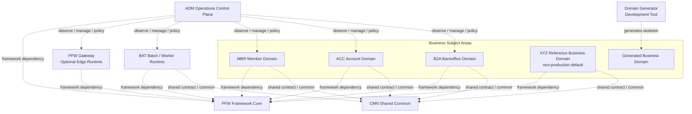
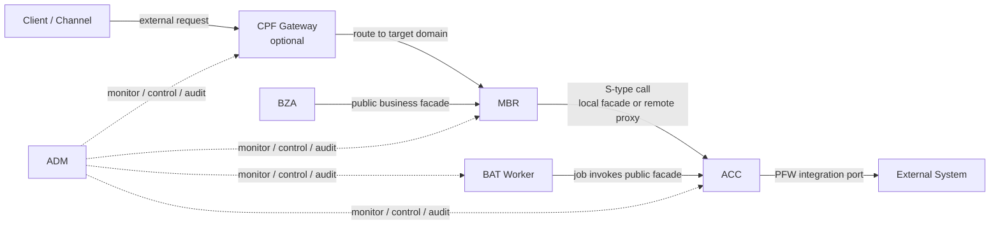

# CPF CoreFlow Platform Framework

CPF는 Java 25와 Spring Boot 3.4 기반의 업무 플랫폼 프레임워크입니다. 온라인 API, 내부 서비스 호출, 거래 추적, 배치, 외부 연계, 운영 제어와 검증 기준을 같은 계약으로 제공합니다. 현재 제품 버전의 정본은 `gradle/cpf-platform.properties`이며 기본 버전은 `1.0.0-SNAPSHOT`입니다.

`pfw`는 프레임워크 코어와 기술 공통을 소유하고, `cmn`은 CPF를 도입한 프로젝트가 공유하는 업무 공통 계약과 기능을 소유합니다. MBR, ACC, BZA, XYZ와 생성된 신규 모듈은 각자의 데이터와 업무 규칙을 소유하며 다른 주제영역의 Repository, Mapper 또는 DB에 직접 접근하지 않습니다.

## 구성요소 책임



| 구성요소 | 배포 형태 | 책임 |
|---|---|---|
| `pfw` | library | 표준 헤더와 실행 ID, 응답·예외, 로그·마스킹, service-call, resilience, broker·파일 전송 port, registry와 runtime 계약 |
| `pfw-gateway-runtime` | optional bootJar | 외부 Client/Channel 진입, 공개 route snapshot과 대상 업무 서비스 라우팅 |
| `cmn` | library | 프로젝트 공통 contract·facade와 코드, 메시지, 달력, 전문 등 프로젝트 공유 기능 |
| `adm` | bootJar | 플랫폼 관제, 정책, 승인, 감사, 로그·배치·캐시·보안 운영 제어 |
| `bat` | optional bootJar | Spring Batch, scheduler, worker와 center-cut 실행 지원 |
| `mbr` | bootJar | 회원 업무와 회원 데이터 소유 |
| `acc` | bootJar/bootWar | 계정 업무와 계정 데이터 소유. 생성기 적합성 fixture 역할도 병행 |
| `bza` | bootJar | 직원, 조직, 결재와 업무 backoffice 데이터 소유 |
| `xyz` | bootJar | 업무 주제영역 표준을 실행 가능한 샘플로 보여 주는 참조 도메인. 운영 기본 배포에서는 제외 |

EDU는 별도 모듈이나 배포 단위가 아니라 XYZ와 BAT 내부의 학습용 샘플 분류입니다. XYZ의 canonical API는 `/api/xyz/reference/**`이고, 기존 `/xyz/edu/**`는 호환 기간에만 유지하는 별칭입니다.

## 대표 거래 흐름

아래는 현재 구현된 MBR에서 ACC로의 내부 호출을 중심으로 한 대표 예시입니다. 내부 주제영역 호출은 Gateway를 다시 경유하지 않습니다.



같은 JVM에서는 public facade의 local adapter를, 분리 WAS에서는 같은 계약의 remote proxy를 사용합니다. 원격 호출의 endpoint 선택, 표준 헤더, timeout, retry, circuit breaker, idempotency와 trace 전파는 PFW service-call 계층이 담당합니다.

## 핵심 표준

- 거래 ID `X-Transaction-Id`: `yyyyMMddHHmmssSSS(17) + moduleId(3) + wasId(7) + sequence(7)`의 34자리 값입니다.
- 표준 실행 ID: `^[OSB][A-Z]{3}[A-Z0-9]{2}[0-9]{4}$` 형식의 10자리 값입니다. `O`는 온라인, `S`는 내부 공유 API, `B`는 배치·비동기 실행입니다.
- 확장 계층: `CpfBaseController/Service` -> `<Module>BaseController/Service` -> 기능 Controller/Service 순서를 사용합니다.
- API 기본 사용법은 typed request/response와 named policy를 사용합니다. URI, raw timeout/retry와 adapter 제어는 승인된 고급 확장점에서만 노출합니다.
- 모든 테이블은 주제영역 prefix와 공통 감사 컬럼을 사용하고, 설치 SQL·Flyway·Mapper·문서를 함께 변경합니다.
- 운영 secret은 저장소에 두지 않으며 환경변수, Vault 또는 승인된 secret provider에서 주입합니다.

## 빠른 시작

요구 도구는 JDK 25, MariaDB 10.6 이상, PowerShell과 프로젝트의 Gradle Wrapper입니다. Redis와 Kafka는 선택 기능 검증 시에만 필요합니다.

```powershell
# 전체 컴파일과 단위·통합 테스트
.\gradlew.bat test

# 정적 검사, 샘플, 문서·증적 정합성까지 포함한 품질 gate
.\gradlew.bat qualityGate -PcpfResultDir=specs/evidence/local

# 최소 신규 업무 모듈 생성과 임시 빌드 검증
powershell -NoProfile -ExecutionPolicy Bypass -File scripts/create-domain.ps1 `
  -ModuleCode pay -ModuleName "결제" -DryRun
```

생성기의 기본값은 `Online=Y`, `Batch=N`, `BzaMenu=N`, `ProductionProfile=N`입니다. 기본 생성물은 업무 모듈, typed contract, Controller/Service/Facade/Port, Mapper·SQL 후보, OpenAPI와 테스트에 집중합니다. 배치, BZA/ADM 메뉴, 운영 profile, 배포 inventory와 외부 WAS 예시는 명시 옵션으로만 추가합니다.

MariaDB 전체 설치는 `specs/sql/00_all_install.sql`, 설치 후 smoke까지는 `specs/sql/00_all_install_and_smoke.sql`을 사용합니다. migration 계정과 app 계정을 분리하고 비밀번호는 명령행이나 문서에 기록하지 않습니다.

## 산출물과 버전

모든 모듈은 `cpf-<module>-1.0.0-SNAPSHOT` 이름을 사용합니다. 일반 jar, sources jar, JavaDoc jar와 실행 가능한 bootJar/bootWar를 모듈 특성에 따라 생성합니다.

```powershell
.\gradlew.bat verifyVersionConsistency
.\gradlew.bat assemble aggregateJavadoc
.\gradlew.bat generateReleaseMetadata
```

`generateReleaseMetadata`는 로컬 `build/release/<version>` 아래에 SHA-256, release manifest, SBOM-lite와 provenance 기초 자료를 만듭니다. 승인된 서명 키가 없는 빌드는 서명 완료로 표시하지 않습니다.

## 문서 안내

README는 진입점만 제공합니다. 구현·운영 절차는 아래 가이드와 source를 함께 확인합니다.

| 문서 | 내용 |
|---|---|
| [프레임워크 소개 및 아키텍처](specs/CPF_프레임워크_소개_및_아키텍처.docx) | PFW/CMN/업무 도메인 경계와 호출 규칙 |
| [개발자 가이드](specs/CPF_개발자_가이드.docx) | 온라인 API, DB, 거래, 로그와 확장 개발 |
| [운영자 ADM 가이드](specs/CPF_운영자_ADM_가이드.docx) | 권한, 로그, 배치, 캐시, 보안과 복구 운영 |
| [설치·DB·SQL·Flyway 가이드](specs/CPF_설치_DB_SQL_Flyway_가이드.docx) | 설치, 계정 분리, migration과 smoke |
| [배치·센터컷·스케줄러 가이드](specs/CPF_배치_센터컷_스케줄러_가이드.docx) | 배치 개발, 관계, 실행과 관제 |
| [외부연계·파일전송·전문 가이드](specs/CPF_외부연계_파일전송_전문_가이드.docx) | HTTP, broker, 파일 전송과 고정길이 전문 |
| [EDU 샘플 카탈로그](specs/CPF_EDU_샘플_카탈로그_및_실습가이드.docx) | 상황별 XYZ/BAT 샘플과 실습 순서 |
| [샘플 커버리지](specs/sample-coverage-matrix.md) | 샘플 source, test, 실행 ID와 검증 연결 |
| [기능 구현 매트릭스](specs/기능_구현_매트릭스.md) | 기능별 구현·검증 상태 |

검증 결과는 `CPF_STABILIZATION_REPORT.md`, 남은 범위는 `CPF_GAP_MATRIX.md`, 증적 연결은 `CPF_EVIDENCE_INDEX.md`에서 확인합니다. 실행하지 않은 검증은 완료로 취급하지 않습니다.

---

## License

개인의 비상업적 학습·연구·실험 목적 사용은 허용됩니다.
그 외의 모든 사용은 Team Pixel의 사전 승인 또는 별도 계약이 필요합니다.

Unauthorized commercial use is prohibited.

**Team Pixel**
freeangelsun@gmail.com
