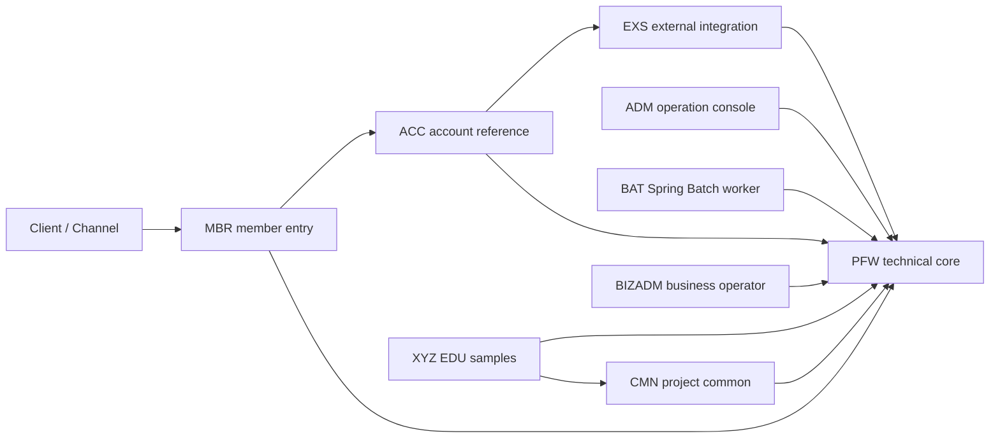

# CPF CoreFlow Platform Framework

CPF는 Java 25와 Spring Boot 3.4를 기준으로 온라인 API, 배치, 외부 연계, 운영 콘솔, 공통 신뢰성 기능을 같은 규칙으로 개발하기 위한 멀티 모듈 프레임워크입니다. 이 저장소는 프레임워크 코어뿐 아니라 실제 업무 모듈, ADM 운영 화면, 실행 가능한 EDU 샘플, SQL/Flyway, 배포·검증 자동화까지 함께 제공합니다.

최상위 목표와 완료 판정 기준은 [CPF_FINAL_TARGET_REQUIREMENTS.md](CPF_FINAL_TARGET_REQUIREMENTS.md)와 [CPF_REVIEW_PROGRESS_COMPLETION_GUIDE.md](CPF_REVIEW_PROGRESS_COMPLETION_GUIDE.md)를 따릅니다.

## CPF를 사용하는 사람

- **업무 개발자**: 표준 헤더, 응답, 예외, 거래 로그, validation, MyBatis, 외부 호출을 조합해 신규 업무 API를 개발합니다.
- **배치 개발자**: Spring Batch와 CPF 배치 운영 메타, lock, restart, center-cut을 사용합니다.
- **프로젝트 공통 개발자**: `cmn`에서 프로젝트에 특화된 공통 업무 규칙과 helper를 개발합니다.
- **운영자**: `adm`에서 회원·운영자·권한·로그·배치·캐시·메시지·코드·설정·신뢰성 상태를 관리합니다.
- **프레임워크 개발자**: `pfw`의 기술 엔진과 public port를 확장하고 EDU와 품질 게이트로 호환성을 검증합니다.

## 핵심 가치

1. PFW 기술 코어와 프로젝트 공통 CMN의 소유권을 분리합니다.
2. modular monolith와 MSA를 같은 public port와 거래 문맥으로 지원합니다.
3. 거래 ID, trace, 헤더, 로그, 오류 응답을 모든 실행 모듈에 일관되게 적용합니다.
4. retry, circuit breaker, idempotency, outbox/inbox/DLQ, 복구 상태를 ADM에서 추적할 수 있게 합니다.
5. 기능을 코드만으로 완료하지 않고 테스트, SQL, OpenAPI, EDU, DOCX, 정제 증적까지 함께 관리합니다.

## 아키텍처



### 모듈 맵

| 모듈 | 배포 | 책임 |
|---|---|---|
| `pfw` | library | 프레임워크 코어. 표준 헤더, 거래·trace, 응답·예외, 파일 로그, service-call, broker, 파일 전송, 보안 credential port, batch 공통 API, 캐시·메시지·코드·설정 엔진을 소유합니다. |
| `cmn` | library | 프로젝트 공통. 프로젝트별 공통 업무 규칙과 helper만 소유하며 기술 adapter는 PFW public port를 사용합니다. |
| `adm` | bootJar | 운영 콘솔과 운영 API입니다. 운영자/회원, 메뉴·버튼·API 권한, 로그, 배치, center-cut, 캐시, 기준정보, 보안과 복구를 관리합니다. |
| `bat` | bootJar | Spring Batch worker와 scheduler 실행 모듈입니다. |
| `acc` | bootJar | 계정 reference 업무 모듈입니다. |
| `mbr` | bootJar | 회원 진입 reference 업무 모듈입니다. |
| `bizadm` | bootJar | 업무 운영자 reference 모듈이며 프레임워크 ADM 권한과 분리됩니다. |
| `exs` | bootJar | 외부 연계 reference 업무 모듈입니다. |
| `xyz` | bootJar | 개발자 교육용 EDU API와 샘플을 제공합니다. |

타 주제영역의 DB, Repository, Mapper를 직접 호출하지 않습니다. 같은 JVM에서는 local facade, 분리 배포에서는 PFW service-call 경계를 사용합니다. MBR의 ACC reference는 `MBR_ACC_CALL_MODE=AUTO|LOCAL|REMOTE`로 선택하며 `AUTO`는 local facade 존재 여부에 따라 결정합니다.

## 주요 기능

- `X-Transaction-Id`는 34자리이며 `yyyyMMddHHmmssSSS(17) + moduleId(3) + wasId(7) + sequence(7)` 규격을 사용합니다.
- `X-Trace-Id`, span/segment, workflow, client/channel 헤더의 검증·마스킹·하위 호출 전파.
- 공통 응답과 오류 schema, validation, 내부 오류 노출 차단.
- 온라인 거래·구간·파일 로그, 업무일자 기반 거래 로그, durable DB fallback과 복구.
- timeout, retry, endpoint failover, circuit breaker, unknown-result 분류.
- idempotency, outbox/inbox, DLQ replay, broker bridge.
- local/file/remote 전송 gateway와 경로 traversal 방어.
- Spring Batch JobRepository 연계, CPF 운영 메타, lock, heartbeat, ghost 판정, 재실행, 영업일·스케줄 simulation, center-cut.
- ADM 회원·운영자·역할·메뉴·버튼·API 권한과 서버 측 권한 검사.
- ADM 거래 timeline, JSON/고정길이 전문 조회, 캐시·메시지·코드·응답코드·설정 관리.
- XYZ/BAT EDU 샘플과 신규 도메인 생성기.

## 사전 조건

- Java 25. `java --version`과 `javac --version`이 모두 25여야 합니다.
- 저장소의 Gradle 9.1 wrapper. 별도 Gradle 설치는 필요하지 않습니다.
- Windows PowerShell 5.1 이상.
- DB runtime 검증 시 기설치 MariaDB와 명시적으로 주입한 자격정보.
- DOCX 재생성 후 실제 열기 검증 시 Microsoft Word. 패키지 검사는 Word 없이 실행됩니다.

개인 PC의 JDK 절대 경로를 저장소 설정에 넣지 않습니다. 컴파일 toolchain, `--release`, class major는 모두 Java 25/69가 아니면 품질 게이트에서 실패합니다.

## 빠른 시작

```powershell
git clone <repository-url>
cd 202412_01_CPF

java --version
.\gradlew.bat cleanTest test --no-daemon --console=plain
.\gradlew.bat qualityGate --no-daemon --console=plain
```

외부 네트워크를 사용하지 않는 재현이 필요하고 Gradle cache가 준비돼 있으면 `--offline`을 추가합니다.

## 로컬 실행

실행 모듈 기본 포트는 다음과 같습니다.

| 모듈 | 기본 포트 | 시작 클래스 |
|---|---:|---|
| ACC | 8080 | `AccApplication` |
| MBR | 8081 | `MbrApplication` |
| ADM | 8090 | `AdmApplication` |
| BIZADM | 8091 | `BizadmApplication` |
| EXS | 8092 | `ExsApplication` |
| BAT | 8093 | `BatApplication` |
| XYZ | 8099 | `XyzApplication` |

```powershell
powershell -NoProfile -ExecutionPolicy Bypass -File scripts/runtime-start-services.ps1 `
  -Modules ACC,MBR,EXS,ADM,BAT -BuildBeforeRun -NoExitOnFailure

powershell -NoProfile -ExecutionPolicy Bypass -File scripts/runtime-status.ps1
powershell -NoProfile -ExecutionPolicy Bypass -File scripts/runtime-diagnostics.ps1
powershell -NoProfile -ExecutionPolicy Bypass -File scripts/runtime-stop-services.ps1
```

local 로그는 PFW가 계산한 절대 root 아래 `${environment}/${module}/${instanceId}`로 기록합니다. dev/stg/prod는 절대 `CPF_LOG_ROOT`와 고유 `CPF_INSTANCE_ID`가 없으면 기동하지 않습니다. 모듈별 `*/logs` 폴더와 개별 `*_LOG_BASE_PATH`는 사용하지 않습니다.

## MariaDB와 Flyway

MariaDB 설치·삭제·업그레이드는 자동화 범위가 아닙니다. 기설치 DB만 사용하며 자격정보가 없으면 연결을 시도하지 않고 `미검증`으로 기록합니다.

```powershell
$env:CPF_DB_HOST = "localhost"
$env:CPF_DB_PORT = "3306"
$env:CPF_DB_ROOT_USERNAME = "root"
$env:CPF_DB_ROOT_PASSWORD = "<secret>"
$env:CPF_DB_MIGRATION_PASSWORD = "<separate-secret>"
$env:CPF_DB_APP_PASSWORD = "<separate-secret>"

powershell -NoProfile -ExecutionPolicy Bypass -File scripts/smoke-mariadb-full-install.ps1 -RequireRun
```

`specs/sql/00_all_install.sql`과 `00_all_install_and_smoke.sql`은 전체 SQL이 포함된 단일 실행 파일입니다. 서비스 계정 비밀번호는 파일에 저장하지 않으며 같은 MariaDB 세션의 `@cpf_migration_password`, `@cpf_app_password`로만 주입합니다. application 계정은 DML, migration 계정은 필요한 DDL 권한을 가집니다. 증분 변경은 `specs/sql/migration/flyway/V*__*.sql`로 관리합니다.

## ADM 접속과 보안 bootstrap

ADM URL은 기본 `http://localhost:8090/adm`입니다. 로그인 API는 `/adm/api/auth/login`, 사용자 정보는 `/adm/api/auth/me`입니다.

- 저장소에 초기 평문 비밀번호를 두지 않습니다.
- bootstrap은 `CPF_ADM_BOOTSTRAP_ENABLED`, `CPF_ADM_BOOTSTRAP_OPERATOR_ID`, `CPF_ADM_BOOTSTRAP_PASSWORD`를 명시적으로 주입한 경우에만 수행합니다.
- 운영 환경에서는 secret provider가 값을 공급하고 첫 로그인 후 비밀번호를 변경합니다.
- 비밀번호 변경은 `/adm/api/operators/{operatorId}/password`, 정책 조회는 `/adm/api/operators/password-policy`를 사용합니다.
- 비밀번호 초기화, 잠금 해제, 세션 폐기는 각각 독립된 버튼/API 권한과 감사 사유가 필요합니다.
- bootstrap secret은 로그, SQL, README, DOCX, evidence에 기록하지 않습니다.

현재 비밀번호 확인, 정책 위반, 변경 이력, 세션 무효화의 구체적 완료 상태는 [ADM 운영자 가이드](specs/CPF_운영자_ADM_가이드.docx)와 [기능 검증 매트릭스](specs/기능_구현_매트릭스.md)를 기준으로 판단합니다.

## Swagger/OpenAPI

실행 모듈은 `/v3/api-docs`와 `/swagger-ui/index.html`을 사용합니다. operationId는 명시적이고 중복되지 않아야 하며, 표준 헤더와 공통 오류 응답이 문서에 포함돼야 합니다.

```powershell
powershell -NoProfile -ExecutionPolicy Bypass -File scripts/smoke-openapi.ps1
powershell -NoProfile -ExecutionPolicy Bypass -File scripts/check-openapi-source-coverage.ps1
```

앱을 실제 기동하지 않은 source 검사와 `/v3/api-docs` runtime 검증은 서로 다른 검증 수준입니다.

## EDU 샘플

`xyz/src/main/java/cpf/xyz/edu`는 온라인 API, validation, paging, transaction, MyBatis, 표준 헤더, service-call, broker, 파일 전송, 로그, 보안 샘플을 제공합니다. `bat/src/main/java/cpf/bat/edu`는 tasklet, chunk, retry/skip, restart/checkpoint, lock, scheduler, center-cut 샘플을 제공합니다.

샘플과 테스트의 1:1 연결은 [sample-coverage-matrix.md](specs/sample-coverage-matrix.md)와 [EDU 실습 가이드](specs/CPF_EDU_샘플_카탈로그_및_실습가이드.docx)에서 확인합니다.

## 신규 도메인 생성기

```powershell
powershell -NoProfile -ExecutionPolicy Bypass -File scripts/create-domain.ps1 -DomainCode LNG -DomainName "예제 업무"
powershell -NoProfile -ExecutionPolicy Bypass -File scripts/smoke-create-domain.ps1
```

생성 결과는 Java 25로 compile/test/bootJar하고 class major 69를 확인해야 합니다. 생성기가 만든 모듈은 PFW/CMN 의존, profile, OpenAPI, 로그, SQL merge 후보, 테스트 골격을 포함합니다.

## Profile과 배포

표준 profile은 `local`, `dev`, `stg`, `prod`입니다. dev/stg/prod는 포트, datasource, JNDI/URL 모드, log root, instance ID, secret을 명시적으로 주입합니다.

```powershell
.\gradlew.bat checkDeployEnv -PcpfModule=ACC -PcpfEnv=dev
.\gradlew.bat checkDeployInventory -PcpfModule=ACC -PcpfEnv=dev
.\gradlew.bat checkPackagedDependencies -PcpfModule=ACC
.\gradlew.bat remoteDeployDryRun -PcpfModule=ACC -PcpfEnv=dev `
  -PcpfDeployMode=dryRun -PcpfRequireApproval=false
```

실제 원격 배포 전에는 dry-run 증적, checksum, 승인, rollback 계획을 확인합니다.

## 배치와 center-cut

ADM 배치 API는 `/adm/api/batch` 아래 job, schedule simulation, execution, step, instance, worker, relation, target, lock, ghost, calendar, run/retry/stop 기능을 제공합니다. center-cut 조회 API는 `/adm/api/center-cut`입니다. 모든 변경 작업에는 서버 권한과 감사 사유가 필요합니다.

상세 개발·운영 절차는 [배치/센터컷/스케줄러 가이드](specs/CPF_배치_센터컷_스케줄러_가이드.docx)를 따릅니다.

## 외부 연계와 broker

PFW가 HTTP service-call, broker bridge, file transfer 기술 엔진을 소유합니다. CMN은 프로젝트 업무 helper만 제공하며 Kafka/Rabbit/SFTP 구현을 직접 소유하지 않습니다. in-memory/deterministic adapter는 로컬 계약 검증용이고 실제 Kafka, Rabbit, Redis, SFTP/FTP/FTPS/SCP/SSH 서버 검증은 별도 환경이 필요합니다.

상세 규격은 [외부연계/파일전송/전문 가이드](specs/CPF_외부연계_파일전송_전문_가이드.docx)를 확인합니다.

## 디렉터리 구조

```text
pfw/                  프레임워크 기술 코어
cmn/                  프로젝트 공통 업무 확장
adm/ bat/             운영 콘솔, 배치 worker
acc/ mbr/ bizadm/     reference 업무 모듈
exs/ xyz/             외부 연계, EDU 모듈
specs/sql/             설치, seed, smoke, Flyway SQL
specs/evidence/        정제된 재현 가능 증적
deploy/                profile별 env와 배포 inventory
scripts/               생성, 실행, smoke, 품질 검사
```

## 공식 문서

| 문서 | 용도 |
|---|---|
| [CPF 프레임워크 소개 및 아키텍처](specs/CPF_프레임워크_소개_및_아키텍처.docx) | 제품 개요, 모듈 경계, 배포 구조 |
| [CPF 개발자 가이드](specs/CPF_개발자_가이드.docx) | API, 거래, 헤더, 로그, DB, 외부 호출 개발 |
| [CPF 운영자 ADM 가이드](specs/CPF_운영자_ADM_가이드.docx) | ADM 권한, 회원, 로그, 배치, 보안 운영 |
| [CPF 설치 DB SQL Flyway 가이드](specs/CPF_설치_DB_SQL_Flyway_가이드.docx) | 설치, 계정 분리, SQL, migration |
| [CPF 배치 센터컷 스케줄러 가이드](specs/CPF_배치_센터컷_스케줄러_가이드.docx) | 배치 개발과 ADM 관제 |
| [CPF 외부연계 파일전송 전문 가이드](specs/CPF_외부연계_파일전송_전문_가이드.docx) | HTTP, broker, 파일, 고정길이 전문 |
| [CPF EDU 샘플 카탈로그 및 실습가이드](specs/CPF_EDU_샘플_카탈로그_및_실습가이드.docx) | 상황별 샘플과 실습 순서 |
| [CPF 기능 구현 검증 매트릭스](specs/CPF_기능_구현_검증_매트릭스.docx) | 기능별 상태와 증적 |
| [CPF 전체 테스트 검증 리포트](specs/CPF_전체_테스트_검증_리포트.docx) | 전체 검증 결과와 제한 |

기계 검증 정본은 [기능_구현_매트릭스.md](specs/기능_구현_매트릭스.md), [기능_구현_매트릭스.json](specs/기능_구현_매트릭스.json), [sample-coverage-matrix.md](specs/sample-coverage-matrix.md)입니다.

## 검증과 증적

```powershell
.\gradlew.bat cleanTest test --no-daemon --console=plain
.\gradlew.bat qualityGate --no-daemon --console=plain

powershell -NoProfile -ExecutionPolicy Bypass -File scripts/check-java25-standard.ps1 -RequireClasses -RequireBootJars
powershell -NoProfile -ExecutionPolicy Bypass -File scripts/check-utf8.ps1 -CheckMojibake
powershell -NoProfile -ExecutionPolicy Bypass -File scripts/check-docx-standard.ps1
powershell -NoProfile -ExecutionPolicy Bypass -File scripts/check-sql-standard.ps1
powershell -NoProfile -ExecutionPolicy Bypass -File scripts/check-feature-evidence.ps1
powershell -NoProfile -ExecutionPolicy Bypass -File scripts/check-report-matrix-evidence-consistency.ps1
powershell -NoProfile -ExecutionPolicy Bypass -File scripts/check-architecture-ownership.ps1
powershell -NoProfile -ExecutionPolicy Bypass -File scripts/check-spring-event-usage.ps1
powershell -NoProfile -ExecutionPolicy Bypass -File scripts/check-sample-coverage.ps1
powershell -NoProfile -ExecutionPolicy Bypass -File scripts/check-profile-loading.ps1
powershell -NoProfile -ExecutionPolicy Bypass -File scripts/smoke-service-registry-runtime.ps1
powershell -NoProfile -ExecutionPolicy Bypass -File scripts/smoke-standard-header-e2e.ps1
powershell -NoProfile -ExecutionPolicy Bypass -File scripts/smoke-composite-transaction-runtime.ps1
powershell -NoProfile -ExecutionPolicy Bypass -File scripts/smoke-adm-transaction-group-runtime.ps1
powershell -NoProfile -ExecutionPolicy Bypass -File scripts/smoke-file-log-standard-runtime.ps1
powershell -NoProfile -ExecutionPolicy Bypass -File scripts/smoke-trace-boost-runtime.ps1
powershell -NoProfile -ExecutionPolicy Bypass -File scripts/smoke-bat-runtime.ps1
powershell -NoProfile -ExecutionPolicy Bypass -File scripts/smoke-mariadb-full-install.ps1
powershell -NoProfile -ExecutionPolicy Bypass -File scripts/smoke-log-policy-runtime.ps1
```

정제 증적은 현재 작업의 `specs/evidence/<yyyymmdd_nn>`에 저장합니다. 실행하지 않은 검증은 성공으로 기록하지 않으며 자격정보, token, 원문 secret, 개인 절대 경로를 증적에 포함하지 않습니다.

## 현재 검증 상태와 제한

- Java 25 compile/test와 7개 실행 모듈 bootJar의 class major 69는 로컬에서 검증합니다.
- PFW 파일 로그는 두 인스턴스, 거래별 JSON Lines, DB fallback 마스킹을 명시적 runtime probe로 검증합니다.
- MariaDB 전체 설치, 권한, seed idempotency와 DB 기반 mapper 테스트는 자격정보가 제공된 경우에만 실행합니다.
- 실제 Redis/Kafka/Rabbit/SFTP 계열 broker·protocol runtime은 해당 서버가 없으면 `미검증`입니다.
- ADM 브라우저 클릭 검증은 ADM과 DB가 실제 기동된 경우에만 완료 처리합니다.

최신 판정은 [CPF_STABILIZATION_REPORT.md](CPF_STABILIZATION_REPORT.md), [CPF_GAP_MATRIX.md](CPF_GAP_MATRIX.md), [CPF_EVIDENCE_INDEX.md](CPF_EVIDENCE_INDEX.md)에서 확인합니다.

## 문제 해결

- Java class major가 69가 아니면 `JAVA_HOME`, `java --version`, `javac --version`과 `.vscode/settings.json`의 개인 경로 여부를 확인합니다.
- DB smoke가 건너뛰어지면 `CPF_DB_ROOT_PASSWORD`, `CPF_DB_MIGRATION_PASSWORD`, `CPF_DB_APP_PASSWORD` 제공 여부를 확인합니다.
- 앱이 기동하지 않으면 profile별 필수 datasource, `CPF_LOG_ROOT`, instance ID 누락을 `runtime-diagnostics.ps1`로 확인합니다.
- DOCX 검사가 실패하면 `check-docx-standard.ps1`과 `check-docx-standard.ps1 -OpenWithWord`를 각각 실행해 패키지 구조와 실제 Word 열기를 구분합니다.
- 기능 상태와 증적이 다르면 `sync-verification-ledger.ps1`로 리포트, 기능 매트릭스, 증적 인덱스를 같은 check ID 기준으로 동기화합니다.

## 개발 규칙

- 모든 신규 주석, 설명, SQL `COMMENT`는 한글로 작성합니다.
- 운영 코드는 기능 단위 주석을, EDU는 학습 흐름을 따라 자세한 주석을 둡니다.
- 기능 변경 시 source, test, SQL/Flyway, OpenAPI, EDU, README, DOCX, matrix, evidence를 함께 갱신합니다.
- 공통 감사 컬럼은 `created_by`, `created_at`, `updated_by`, `updated_at`입니다.
- 테이블과 FK/UK/index는 주제영역 prefix와 lower snake case를 사용하고 `*_table` suffix를 사용하지 않습니다.
- 요청서, 최종 목표, 사용자 변경을 임의로 되돌리거나 커밋하지 않습니다.
