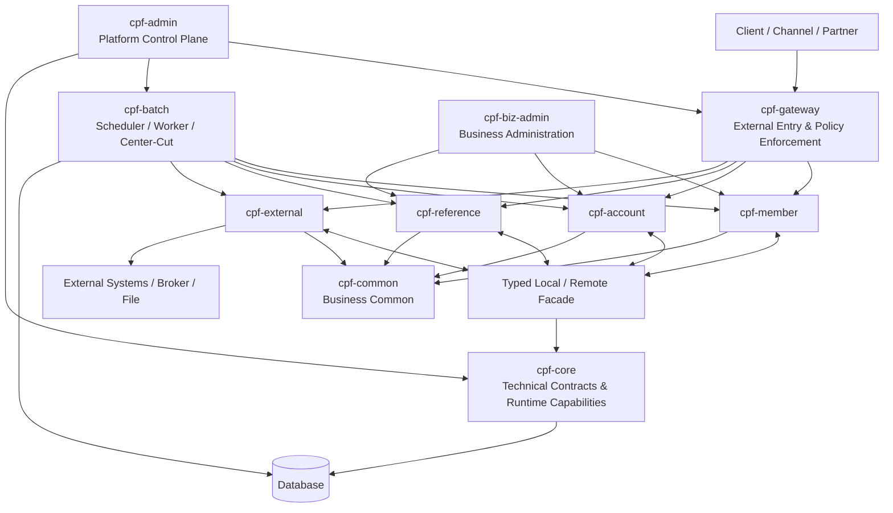

<div align="center">

# Core Platform Framework

### Business Platform Framework for Reliable and Extensible Systems

**Build once. Operate safely. Extend consistently.**

<br/>


</div>

---

## Overview

**Core Platform Framework(CPF)**는 다양한 업무 시스템을 일관된 구조로 개발하고 운영하기 위한 Java 기반 Framework입니다.

온라인 거래, 주제영역 간 호출, 배치와 대량 처리, 외부 시스템 연계, 파일과 전문, 메시징, 보안, 감사, 운영 관제, 장애 복구, 설치와 업그레이드에 필요한 공통 구조와 실행 기반을 제공합니다.

시스템의 규모와 구성 방식이 달라지더라도 동일한 개발 원칙과 운영 기준을 유지할 수 있도록 설계되었으며, MSA와 Modular Monolith 환경을 함께 지원합니다.

CPF는 기능 구현뿐 아니라 거래 추적, 오류 처리, 재시도, 복구, 보안, 감사, 운영 제어와 확장 구조를 함께 관리합니다.

## Product Highlights

| Platform Engineering | Reliability & Operations |
|---|---|
| MSA와 Modular Monolith 동시 지원 | 다중 인스턴스, 재시도, 복구와 결과 불명 처리 |
| 동일 JVM과 분리 WAS의 동일 업무 Contract | 거래 추적, 파일·DB 로그, 감사와 Trace Boost |
| 표준 Gateway와 Local/Remote 호출 | Worker lease, fencing, drain과 takeover |
| 신규 업무 주제영역 Generator | 운영 조회·제어·승인·재처리 |
| OpenAPI, JavaDoc와 EDU | 설치·Migration·Upgrade·Rollback |

| Security & Integration | Batch & Massive Processing |
|---|---|
| 인증, 권한, 마스킹, 감사와 Secret 관리 | Batch, Scheduler, Agent와 Worker |
| mTLS, OAuth2, JWT와 API Key | Center-Cut, 분할 처리와 재시작 |
| REST, 고정길이 전문과 파일 | 멱등성, checkpoint와 item 재처리 |
| Outbox, Inbox, DLQ와 Reconciliation | 동기·비동기 업무 호출과 보상 |

## Architecture at a Glance



### Runtime Principles

- 외부 Client와 Channel은 `cpf-gateway`를 통해 진입합니다.
- 내부 주제영역 간 호출은 Gateway를 재경유하지 않습니다.
- 동일 JVM 호출과 Remote 호출은 동일한 업무 Contract를 공유합니다.
- 기술 공통은 업무 Module을 참조하지 않습니다.
- 상태 기반 기능은 멱등성, 동시성, 재시도, 결과 불명과 복구를 함께 설계합니다.
- 모든 운영 조치는 권한, 승인, 감사와 실행 Evidence를 남깁니다.

## Official Modules

CPF의 공식 Module은 기본 구성에 포함되는 **필수 Module**, 프로젝트 요구에 따라 적용하는 **선택 Module**, Generator 표준 구조를 따르는 **생성형 업무 Module**로 구분합니다.

| Module | Code | 유형 | 역할 |
|---|---:|---|---|
| `cpf-core` | `PFW` | 필수 | 기술 공통·Runtime·확장 SPI |
| `cpf-gateway` | `GWY` | 선택 | 외부 진입·라우팅·보안·장애 격리 |
| `cpf-common` | `CMN` | 필수 | 업무 공통 기능·공통 모델 |
| `cpf-admin` | `ADM` | 필수 | 플랫폼 운영·관제·보안·감사 |
| `cpf-biz-admin` | `BZA` | 선택 | 업무 관리자·업무 운영 |
| `cpf-batch` | `BAT` | 선택 | Batch·Scheduler·Worker·Center-Cut |
| `cpf-member` | `MBR` | 생성형 | 회원 업무 주제영역 |
| `cpf-account` | `ACC` | 생성형 | 계좌 업무 주제영역 |
| `cpf-reference` | `REF` | 선택 | 참조 구현·EDU |
| `cpf-external` | `EXS` | 생성형 | 대외 연계 주제영역 |

생성형 업무 Module은 필요한 Module만 선택하여 사용할 수 있으며, `cpf-tools`의 Generator를 이용해 동일한 표준 구조의 신규 업무 주제영역을 추가할 수 있습니다.


## Core Capabilities

### Application Platform

- 표준 요청·응답 Header와 거래 식별자
- 업무 ID와 URI 기반 호출
- Local Facade와 Remote Adapter
- Validation, 오류 코드와 메시지 표준
- Transaction, Idempotency와 상태 전이
- Timeout budget, Retry, Circuit Breaker와 Bulkhead
- OpenAPI, JavaDoc와 개발자 확장 SPI

### Operations

- 거래 그룹, 상세, 구간별 Timeline과 실패 지점 조회
- 파일 로그와 DB 로그의 거래 단위 추적
- 서비스·Endpoint·Instance Registry와 상태 조회
- 동적 로그 레벨과 제한 시간 Trace Boost
- Batch·Worker·Center-Cut 조회와 제어
- 재처리, 보상, 결과 불명 확인과 수동 복구
- 운영 조치 승인, 감사와 통계

### Security

- AuthN, AuthZ, RBAC와 정책 기반 접근 제어
- 개인정보 분류, 마스킹과 다운로드 통제
- Secret 외부화와 Rotation
- mTLS, OAuth2, JWT와 API Key
- 관리자 Dual Control과 감사 추적
- Dependency, SBOM, License와 Secret Scan

### Integration & Data

- REST와 고정길이 전문
- 파일, 첨부, 압축과 SFTP
- Outbox, Inbox, DLQ와 Replay
- Saga, Compensation과 Reconciliation
- MariaDB, PostgreSQL, Oracle과 SQL Server
- 신규 설치, Migration, Upgrade와 Rollback

## Repository Layout

```text
cpf-core-platform-framework/
├─ cpf-core/          기술 공통 Contract, Runtime 기능과 확장 SPI
├─ cpf-gateway/       외부 진입, 인증 연계, Routing과 장애 격리
├─ cpf-common/        여러 업무 주제영역에서 공유하는 업무 공통 기능
├─ cpf-admin/         플랫폼 운영, 관제, 보안, 감사와 제어
├─ cpf-biz-admin/     고객 업무 관리자 화면과 업무 운영 기능
├─ cpf-batch/         Batch, Scheduler, Agent, Worker와 Center-Cut
├─ cpf-member/        회원 업무 주제영역
├─ cpf-account/       계좌 업무 주제영역과 Generator lifecycle 기준
├─ cpf-reference/     기준정보, 참조 구현과 EDU 업무 주제영역
├─ cpf-external/      외부기관, 전문, 파일, 메시징과 연계 복구
├─ cpf-docs/          아키텍처, 개발, 운영, 보안, API와 Release 문서
├─ cpf-deployment/    설치, 배포, 외부 WAS, Container와 운영 Script
├─ cpf-tools/         Generator, Migration, 검증과 개발 지원 도구
├─ build.gradle       공통 Build와 품질 검증 설정
├─ settings.gradle    공식 Module 구성
└─ README.md          제품 소개, 구조, 주요 기능과 시작 안내
```

별도의 Root `specs/` 디렉터리는 두지 않습니다. 제품 Specification과 Guide는 역할에 따라 `cpf-docs/` 아래에 통합하고, 자동 생성 자료와 실행 Evidence는 정해진 공식 위치에서 관리합니다.

## Quick Start

### Prerequisites

- JDK 25
- Git
- Gradle Wrapper
- MariaDB 10.6 이상
- Node.js LTS와 npm — ADM/BZA Frontend 개발 시
- Docker 또는 외부 WAS — 선택 사항

### Build

Linux/macOS:

```bash
./gradlew clean build
```

Windows:

```powershell
.\gradlew.bat clean build
```

### Database Installation

MariaDB 기준 설치 SQL과 Migration을 적용합니다.

```bash
./gradlew cpfInstallDb -PcpfDbVendor=mariadb -PcpfProfile=local
```

설치 후 반드시 schema version, seed, 권한과 주요 테이블을 검증합니다.

```bash
./gradlew cpfVerifyDb -PcpfDbVendor=mariadb -PcpfProfile=local
```

### Run Core Services

```bash
./gradlew :cpf-gateway:bootRun --args='--spring.profiles.active=local'
./gradlew :cpf-admin:bootRun --args='--spring.profiles.active=local'
./gradlew :cpf-batch:bootRun --args='--spring.profiles.active=local'
```

각 업무 Module은 동일 JVM 또는 독립 서비스로 실행할 수 있습니다.

```bash
./gradlew :cpf-member:bootRun --args='--spring.profiles.active=local'
./gradlew :cpf-account:bootRun --args='--spring.profiles.active=local'
./gradlew :cpf-reference:bootRun --args='--spring.profiles.active=local'
./gradlew :cpf-external:bootRun --args='--spring.profiles.active=local'
```

### Frontend

```bash
cd cpf-admin/frontend
npm ci
npm run lint
npm run typecheck
npm run test
npm run build
```

동일 절차를 `cpf-biz-admin/frontend`에도 적용합니다.

## Create a New Business Domain

```powershell
.\cpf-tools\generator\create-domain.ps1 `
  -DomainName "payment" `
  -SystemCode "PAY" `
  -BasePackage "com.cpf.payment" `
  -DbVendor "mariadb" `
  -Capabilities "database,batch,external,messaging,ui"
```

생성 후에는 검증 명령을 실행합니다.

```powershell
.\cpf-tools\generator\verify-domain.ps1 -DomainName "payment"
```

자세한 내용은 [Generator Guide](cpf-docs/development/GENERATOR_GUIDE.md)를 참고합니다.

## Documentation

| Audience | Guide |
|---|---|
| 전체 문서 안내 | [Documentation Home](cpf-docs/README.md) |
| 아키텍트·Tech Lead | [Architecture Guide](cpf-docs/architecture/ARCHITECTURE_GUIDE.md) |
| Backend·Frontend 개발자 | [Developer Guide](cpf-docs/development/DEVELOPER_GUIDE.md) |
| 신규 주제영역 개발자 | [Generator Guide](cpf-docs/development/GENERATOR_GUIDE.md) |
| 예제 학습 | [EDU Guide](cpf-docs/development/EDU_GUIDE.md) |
| 운영자 | [Operator Guide](cpf-docs/operations/OPERATOR_GUIDE.md) |
| 설치 담당자 | [Installation Guide](cpf-docs/operations/INSTALLATION_GUIDE.md) |
| 배포 담당자 | [Deployment Guide](cpf-docs/operations/DEPLOYMENT_GUIDE.md) |
| 장애 대응 담당자 | [Recovery Guide](cpf-docs/operations/RECOVERY_GUIDE.md) |
| 보안 담당자 | [Security Guide](cpf-docs/security/SECURITY_GUIDE.md) |
| API Consumer | [API Guide](cpf-docs/api/API_GUIDE.md) |
| Upgrade 담당자 | [Migration Guide](cpf-docs/releases/MIGRATION_GUIDE.md) |
| Release 확인 | [Release Notes](cpf-docs/releases/RELEASE_NOTES.md) |

## Quality Principles

CPF의 기능은 Source 작성뿐 아니라 실제 연결과 실행 결과까지 함께 확인합니다.

- Source와 실제 Consumer 연결
- API Contract와 오류 처리
- SQL, Migration과 Rollback
- 정상, 오류, 경계와 부분 실패 처리
- 멱등성, 동시성과 다중 인스턴스 대응
- 보안, 권한, 감사와 마스킹
- 운영 조회와 제어
- Unit, Integration, Runtime과 Browser 검증
- 최신 Commit과 일치하는 Evidence
- 기존 기능의 회귀 방지

각 기능은 구현, 설정, 데이터 구조, 테스트와 문서가 서로 일치하는 상태를 기준으로 관리합니다.

## License

개인의 학습, 연구와 실험 목적 사용은 허용됩니다. 그 외 용도로 사용하거나 배포하려면 **Team Pixel**의 사전 승인이 필요합니다.

**Team Pixel**  
`freeangelsun@gmail.com`
