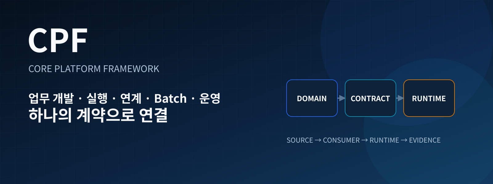
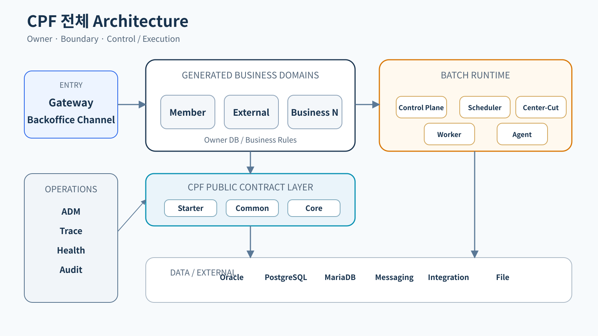
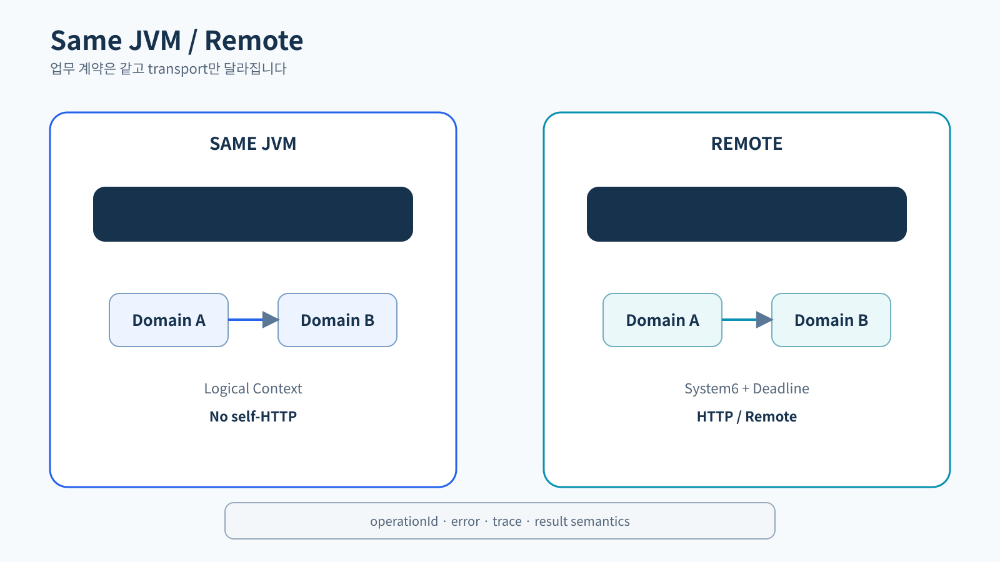
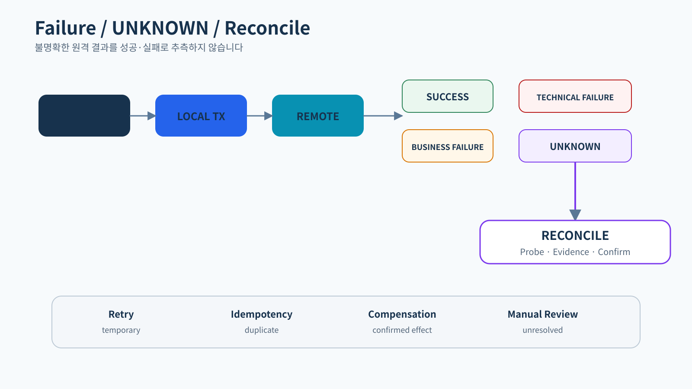
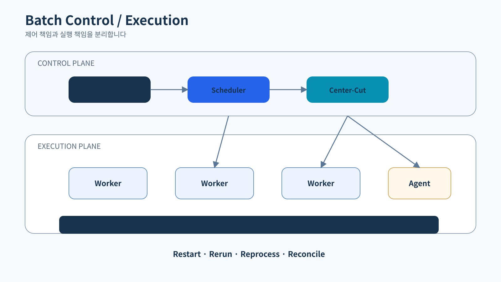
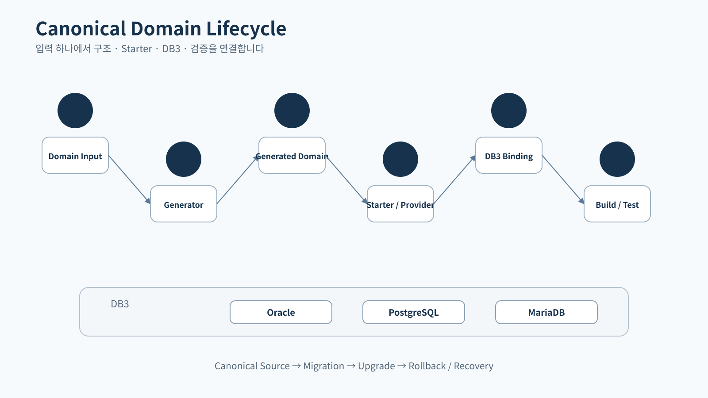
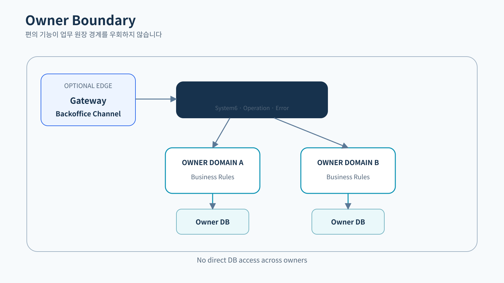
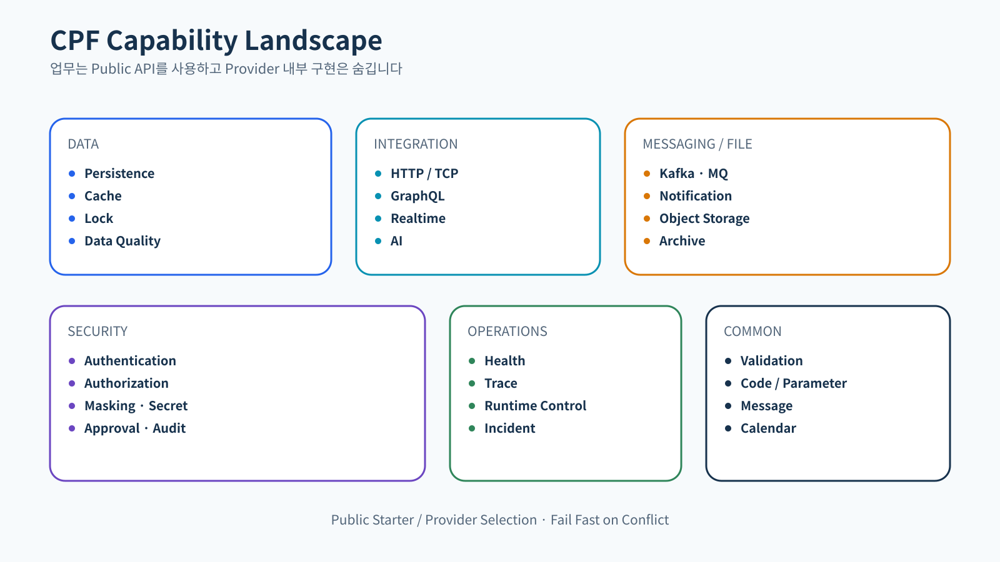

# CPF / Core Platform Framework



CPF는 업무 시스템의 호출 경계, 거래 상태, 공통 기능, Batch, DB, 운영 제어를 서로 다른 규칙으로 쪼개지 않고 하나의 Framework 계약으로 연결합니다. 개발자는 반복되는 기반 기능을 직접 조립하는 대신 Domain과 업무 규칙에 집중하고, 운영자는 같은 식별 체계와 복구 모델로 장애를 추적합니다.



**CPF 전체 Architecture.** Generated Business Domain이 업무 원장을 소유하고, CPF Core/Common/Starter가 호출·상태·공통 기능 계약을 제공합니다. Gateway와 Backoffice Channel은 필요한 경계에서 선택하며 Batch와 Operations는 실행·제어 책임을 분리합니다.

# 1. 배포 구조가 달라져도 업무 호출 계약은 그대로 유지합니다

## Same JVM과 Remote를 같은 계약으로 호출

업무 Domain 호출은 `CpfDomainClient` 계약을 기준으로 합니다. 동일 JVM에서는 내부 binding을 사용하고, 경계를 넘을 때만 Remote transport로 직렬화하므로 배포 Topology가 바뀌어도 업무 호출 코드를 별도 방식으로 다시 만들지 않습니다. 동일 JVM에서 자기 자신을 HTTP로 다시 호출하는 self-HTTP는 사용하지 않습니다.



## System6 거래 Context를 자동으로 전파

Online 업무 경계에서 CPF는 `X-Transaction-Id`, `X-Original-System-Code`, `X-System-Code`, `X-Caller-System-Code`, `X-Target-System-Code`, `X-Target-Operation-Id`를 생성·전파·검증합니다. 개발자가 Header를 직접 조립하지 않으며, 수신 Runtime과 Target이 맞지 않거나 불변 값이 변조되면 업무 Controller로 진입하기 전에 차단합니다.

## transactionId·operationId·instanceId로 거래를 연결

`transactionId`는 거래 흐름, `operationId`는 실행하려는 업무 Operation, `instanceId`는 실제 처리 Runtime 인스턴스를 식별합니다. Log·Trace·Timeline·Batch·외부 연계가 이 식별 체계를 공유하므로 여러 System과 인스턴스를 지나간 거래도 같은 기준으로 역추적할 수 있습니다.

# 2. 성공과 실패 사이의 불확실성까지 거래 상태로 관리합니다

## Local Transaction과 원격 Side Effect를 구분

로컬 DB Transaction의 Commit 여부와 원격 시스템·메시지·파일 같은 Side Effect의 결과는 같은 의미가 아닙니다. CPF는 로컬 원자성은 Transaction으로, 원격 효과는 Timeout·Retry·Idempotency·Compensation·Reconcile 계약으로 분리해 다룹니다.

## UNKNOWN을 추측하지 않고 Reconcile

Timeout이나 응답 유실처럼 실제 결과를 확정할 수 없을 때 성공 또는 실패로 임의 판정하지 않습니다. `UNKNOWN`을 보존하고 Probe/Reconcile을 통해 근거를 다시 확인한 뒤 결과를 확정합니다.



## Idempotency로 중복 Side Effect를 제어

재시도, 응답 유실, Process 재시작은 같은 요청을 다시 만들 수 있습니다. CPF는 Idempotency key와 실행 기록을 사용해 중복 수행을 판별하고, 이미 처리된 Side Effect를 무조건 다시 실행하지 않도록 제어합니다.

## Saga·TCC·XA를 자원 특성에 맞게 선택

분산 거래는 하나의 방식으로 강제하지 않습니다. 보상 가능한 장기 흐름은 Saga, 명시적 Try/Confirm/Cancel이 필요한 흐름은 TCC, XA 참여가 가능한 자원은 XA를 선택하며 단순 Remote 호출을 로컬 Transaction처럼 오인하지 않습니다.

# 3. Batch는 실행·제어·복구 역할을 나눠 운영 실수를 줄입니다

## Control Plane·Scheduler·Worker·Center-Cut·Agent 역할

Control Plane은 정의와 운영 명령을, Scheduler는 Trigger와 실행 예약을, Worker는 실제 Job 실행을 담당합니다. Center-Cut은 대량 대상 제어를, Agent는 Host/Process 수준 제어를 맡아 제어 책임과 실행 책임을 분리합니다.



## Restart·Rerun·Reprocess·Reconcile 선택

`Restart`는 기존 Execution의 Checkpoint에서 이어가고, `Rerun`은 새 Execution을 시작합니다. `Reprocess`는 선택한 대상을 다시 처리하며, `Reconcile`은 결과가 불확실한 실행을 확인합니다. CPF는 이 네 동작을 같은 버튼 의미로 섞지 않습니다.

## Lease·Fencing·Heartbeat와 Process Kill 복구

다중 Worker에서는 Heartbeat로 생존 상태를 보고하고 Lease로 실행 소유권을 잡습니다. Fencing token은 종료되었거나 오래된 Worker가 다시 쓰는 stale writer를 차단해 Process Kill과 재할당 상황에서도 소유권을 명확히 합니다.

# 4. Domain 생성부터 Starter와 DB까지 같은 규칙으로 맞춥니다

## Generator가 Domain 구조와 Package를 Canonical하게 생성

Generated Domain은 Generator가 정한 Canonical 구조를 사용합니다. Online/Batch Runtime과 Business Feature, Java package, Starter 연결을 같은 입력에서 생성해 Domain마다 다른 폴더·Package·설정 관행이 생기지 않도록 합니다.



## 필요한 Starter·Provider만 조합

Public Profile과 Starter는 필요한 Capability만 선택하도록 구성되어 있습니다. JDBC/MyBatis/JPA, Caffeine/Redis/Valkey, Kafka/RabbitMQ/JMS/IBM MQ, OIDC, S3 등은 공개 Starter에서 선택하고 Internal Leaf/Foundation은 구현 세부로 숨깁니다.

## Oracle·PostgreSQL·MariaDB Lifecycle을 함께 관리

공식 DB Vendor는 Oracle, PostgreSQL, MariaDB입니다. Canonical DB Source를 기준으로 Fresh Init, Migration, Seed, Upgrade, Rollback/Recovery, Runtime Query가 Vendor별 산출물과 함께 움직이도록 관리합니다.

# 5. 외부 연계와 Gateway·Backoffice도 업무 Owner 경계를 유지합니다

## 외부 연계·Messaging·File·Notification의 실패와 재처리

HTTP·전문·Messaging·File·Notification은 Provider가 달라도 Timeout, Deadline, Retry, Idempotency, 상태 확인, UNKNOWN/Reconcile 관점에서 운영할 수 있어야 합니다. 실패를 단순 Exception으로 끝내지 않고 재처리 가능성과 Side Effect 여부를 함께 판단합니다.

## Gateway는 필요한 경계에서만 선택

Gateway는 Routing, Trust, Rate/Admission, Resilience 같은 경계가 필요한 경우 선택합니다. 모든 내부 호출의 필수 Hop이 아니며, 장애 시 자동으로 보안 경계를 우회하는 fallback 경로로 사용하지 않습니다.

## Backoffice는 Owner Domain을 우회하지 않음

Backoffice Web은 DB 없는 Channel/BFF 역할을 하고, 내부 Backoffice/Business 기능은 공식 Domain Invocation을 통해 Owner Domain을 호출합니다. 화면 편의를 이유로 업무 원장 DB에 직접 접근하는 경로를 만들지 않습니다.



# 6. 운영자는 거래와 Runtime을 같은 식별 체계로 추적합니다

## Log·Trace·Timeline·Health를 한 흐름으로 확인

운영 정보는 단순 로그 파일 목록이 아니라 거래와 Runtime의 상태를 연결하는 근거입니다. `transactionId`, `operationId`, `instanceId`를 기준으로 Log·Trace·Timeline·Health를 확인하고, 외부 연계나 Batch 실행까지 같은 흐름에서 원인을 좁힙니다.

## 위험 조치는 Permission·Reason·Approval·Audit와 연결

재실행, 강제 상태 변경, 민감정보 접근 같은 위험 조치는 호출 가능 여부만 검사하지 않습니다. Permission, 수행 사유, 필요한 Approval과 결과 Audit를 함께 남겨 누가 왜 어떤 조치를 했는지 추적할 수 있게 합니다.

## 운영 상태와 복구 결과를 같은 기준으로 확인

Runtime Start/Stop/Restart/Drain, Feature Flag, Dynamic Log, Incident, Batch Recovery 같은 운영 조치는 요청 상태와 실제 적용 결과를 분리해 확인합니다. 부분 실패나 결과 미확정 상태는 숨기지 않고 후속 확인 조건을 남깁니다.

# 7. 반복 공통 기능을 다시 만들지 않고 필요한 Capability를 선택합니다

## Cache·Validation·Messaging·File·Notification 공통 계약

Cache, Validation/Data Quality, Messaging, File/Archive/Tabular, Notification처럼 여러 업무가 반복해서 필요로 하는 기능은 CPF Public API와 Starter 계약으로 제공합니다. 업무 Domain은 Provider 내부 구현 대신 CPF 계약을 소비합니다.



## Security·Masking·Audit·Approval 공통 정책

인증·인가, Session, Secret/Crypto, Digital Signature, Masking, Sensitive Data Access, Approval/Audit는 Runtime별 임의 구현으로 흩어지지 않도록 공통 정책과 운영 근거를 연결합니다.

## Config·Profile·Provider로 Runtime 기능 선택

기본값, 환경 Profile, 정책, Provider, 호출별 옵션은 정해진 우선순위를 따릅니다. 개발자는 필요한 Capability를 명시적으로 선택하고, 충돌하는 Provider나 위험한 기본값은 Fail-Closed로 확인합니다.

# 8. 시작·생성·Build·Test 흐름이 정해져 있어 바로 개발에 들어갑니다

## 개발 Shell로 Build·Run·검증

Windows 개발 환경에서는 `cpf-tools/build/tools/cpf-dev.ps1`이 Java 25 확인부터 Build, Test, 빠른 검증, 변경영향 검증, 전체 로컬 검증, Runtime 실행/상태/종료까지 공통 진입점을 제공합니다.

```powershell
pwsh .\cpf-tools\build\tools\cpf-dev.ps1 build
pwsh .\cpf-tools\build\tools\cpf-dev.ps1 verify-full
pwsh .\cpf-tools\build\tools\cpf-dev.ps1 run-local
```

## Generator CLI로 Domain 생성·동기화

Cross-platform CLI `cpf-tools/runtime/cli/cpf.py`는 `domain`, `db`, `verify`, `open-git` 그룹을 제공합니다. Domain Lifecycle은 `create`, `setup`, `sync`, `diff`, `remove`로 구분하고 DB3 Render와 Generator/Domain 검증을 같은 CLI에서 수행합니다.

```text
cpf domain create | setup | sync | diff | remove
cpf db render
cpf verify generator | domain | all
```

## 상세 문서는 역할별 Guide에서 바로 확인

구현 선택은 [프레임워크 개발자 가이드](cpf-docs/guides/02_프레임워크_개발자_가이드.pdf), Batch 개발은 [배치 개발자 가이드](cpf-docs/guides/03_배치_개발자_가이드.pdf), 장애 대응은 [운영자 매뉴얼](cpf-docs/guides/04_운영자_매뉴얼.pdf), Gateway는 [Gateway 개발/사용 가이드](cpf-docs/guides/06_Gateway_개발_사용_가이드.pdf)에서 이어서 확인합니다. 정확한 계약과 Architecture 판단은 [Specification](cpf-docs/guides/07_Specification_기술_명세.pdf)과 [아키텍처설계서](cpf-docs/deliverables/아키텍처설계서.pdf)를 기준으로 합니다.

# 9. Community & Evaluation License

## CPF는 **Community & Evaluation License** 안내를 기준으로 사용합니다.
