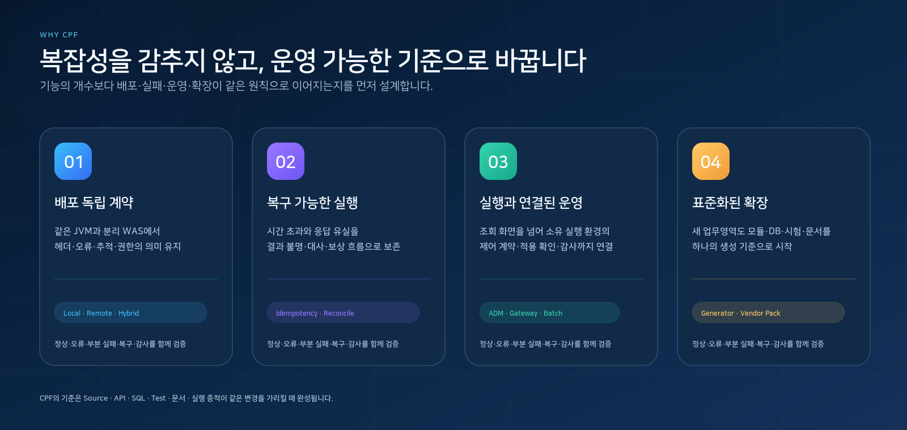
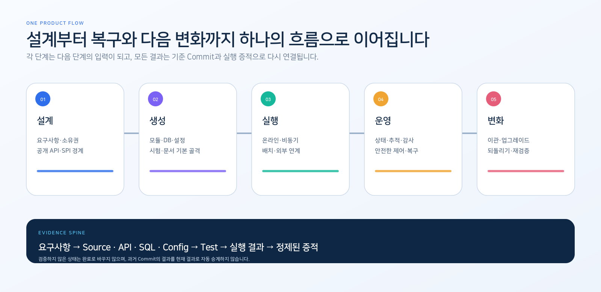

<div align="center">

<picture>
  <source media="(max-width: 720px)" srcset="cpf-docs/assets/readme/cpf-hero-mobile.png">
  
</picture>

<br>

**설계에서 실행, 운영, 복구와 다음 변화까지 하나의 기준으로 연결합니다.**

동일 JVM · 분리 WAS · 모듈형 단일체 · 마이크로서비스 · 다중 인스턴스 · 배치 · 외부 연계 · 운영 통제

[문서 홈](cpf-docs/guides/README.md) · [구조와 배포](cpf-docs/guides/CPF_ARCHITECTURE_AND_TOPOLOGY_GUIDE.md) · [개발 시작](cpf-docs/guides/CPF_DEVELOPER_GUIDE.md) · [운영 시작](cpf-docs/guides/CPF_ADMIN_OPERATOR_GUIDE.md) · [설치와 업그레이드](cpf-docs/guides/CPF_INSTALL_UPGRADE_ROLLBACK_GUIDE.md)

</div>

---

## CPF 전체 구조

CPF는 공통 Library 묶음이나 특정 프로젝트의 예제 구조가 아닙니다. 채널의 요청이 업무영역에 도달하고, 공통 기반·선택 실행 환경·외부 시스템·운영 도구로 이어지는 전체 흐름을 하나의 제품 규칙으로 관리합니다.

<picture>
  <source media="(max-width: 720px)" srcset="cpf-docs/assets/readme/cpf-architecture-overview-mobile.png">
  
</picture>

- 채널은 업무영역으로 직접 진입하거나, 공통 진입 정책이 필요한 경우에만 `cpf-gateway`를 선택합니다.
- `cpf-admin`, `cpf-biz-admin`과 생성 업무영역은 자신의 API·데이터·상태 전이와 운영 계약을 소유합니다.
- `cpf-core`는 배포 구성에 독립적인 기술 계약을, `cpf-common`은 필요한 업무영역이 선택해 사용하는 업무 공통을 제공합니다.
- `cpf-batch`는 제어 서버, Scheduler, Worker, Center-Cut Runner와 Host Agent를 독립 실행 환경으로 확장합니다.
- 생성기, 데이터베이스 도구, 품질 Gate와 산출물 공급 도구는 개발부터 설치·변경·복구·검증까지 연결합니다.

[전체 구조와 의존성 원칙 자세히 보기 →](cpf-docs/guides/CPF_ARCHITECTURE_AND_TOPOLOGY_GUIDE.md)

---

## 책임이 분명한 제품 구성

<picture>
  <source media="(max-width: 720px)" srcset="cpf-docs/assets/readme/cpf-product-map-mobile.png">
  
</picture>

`cpf-admin`, `cpf-biz-admin`과 생성 업무영역은 각자의 기능과 데이터를 소유합니다. `cpf-gateway`와 `cpf-batch`는 필요한 환경에서 선택하는 독립 실행 제품이며, `cpf-core`와 `cpf-common`은 모든 기능을 중앙에서 경유시키지 않고 공개 계약과 재사용 기준을 제공합니다.

---

## 복잡성을 운영 가능한 기준으로 바꿉니다

업무 시스템은 화면과 API를 만드는 것만으로 끝나지 않습니다. 배포 방식이 달라져도 계약이 유지돼야 하고, 부분 실패와 응답 유실 뒤에는 실제 처리 결과를 확정할 수 있어야 합니다. 운영 명령은 실제 실행 환경에 연결돼야 하며, 새 업무영역도 같은 품질 기준으로 시작해야 합니다.

<picture>
  <source media="(max-width: 720px)" srcset="cpf-docs/assets/readme/cpf-value-pillars-mobile.png">
  
</picture>

CPF는 기능이 존재한다는 사실보다 **누가 소유하고, 누가 사용하며, 어떻게 실패하고, 어떻게 복구하고, 무엇으로 검증하는지**를 더 중요하게 다룹니다. 공개 API·SPI, 실행 문맥, 오류, 멱등성, 추적, 승인, 감사, 데이터베이스 생명주기와 검증 증적이 같은 변경 단위로 이어집니다.

---

## 하나의 제품 흐름

<picture>
  <source media="(max-width: 720px)" srcset="cpf-docs/assets/readme/cpf-lifecycle-mobile.png">
  
</picture>

1. **설계** — Requirement, 소유 Module, 공개 API·SPI와 데이터 소유권을 먼저 확정합니다.
2. **생성** — 모듈·패키지·DB·설정·시험·문서의 기본 골격을 같은 생성 기준으로 만듭니다.
3. **실행** — 온라인, 비동기, 외부 연계, 파일과 배치가 같은 식별·오류·복구 원칙을 사용합니다.
4. **운영** — 상태·추적·감사와 안전한 제어를 실제 소유 실행 환경에 연결합니다.
5. **변화** — 이관·업그레이드·되돌리기·재검증 결과를 기준 Commit과 증적에 연결합니다.

---

## 배포가 달라도 업무 계약은 같습니다

<picture>
  <source media="(max-width: 720px)" srcset="cpf-docs/assets/readme/cpf-topology-mobile.png">
  
</picture>

같은 JVM에서는 Local Adapter가, 분리된 실행 환경에서는 Remote Adapter가 같은 공개 계약을 실행합니다. 호출자는 배포 위치를 알 필요가 없으며 표준 Header, 인증·권한 문맥, 오류 분류, 시간 예산, 멱등성 키와 Trace의 의미가 유지됩니다.

다중 인스턴스 작업은 Lease, Claim, Fencing Token, 버전과 낙관적 잠금을 사용합니다. 소유권을 잃은 과거 실행자가 늦게 완료를 보고해도 현재 상태를 덮어쓰지 못하게 합니다.

[배포 구성별 설계·검증 절차 →](cpf-docs/guides/CPF_ARCHITECTURE_AND_TOPOLOGY_GUIDE.md)

---

## 실패를 숨기지 않고 복구 가능한 상태로 남깁니다

<picture>
  <source media="(max-width: 720px)" srcset="cpf-docs/assets/readme/cpf-execution-mobile.png">
  
</picture>

대상 시스템에 요청을 보낸 뒤 응답을 잃었다면 성공이나 실패로 단정하지 않습니다. CPF는 처리 여부가 확정되지 않은 상태를 `UNKNOWN_RESULT`로 보존하고 거래 식별자, 호출 시도, 상대 결과 조회와 대사 자료로 실제 결과를 확정합니다.

확정 결과에 따라 재처리, 보상 또는 운영 확정을 수행합니다. 온라인 호출, 비동기 메시지, 기관 연계, 파일 처리와 Batch 실행은 서로 다른 기술을 사용하더라도 같은 실패 분류와 복구 원칙을 따릅니다.

[비동기·메시징·보상 →](cpf-docs/guides/CPF_ASYNC_MESSAGING_AND_COMPENSATION_GUIDE.md) · [관측·장애대응·복구 →](cpf-docs/guides/CPF_OBSERVABILITY_INCIDENT_AND_RECOVERY_GUIDE.md)

---

## 운영 화면이 실제 실행과 연결됩니다

<picture>
  <source media="(max-width: 720px)" srcset="cpf-docs/assets/readme/cpf-operations-mobile.png">
  
</picture>

### 플랫폼 운영

- 서비스 등록부의 조회 계약과 제어 계약을 분리하고, 등록·수정·배수·점검 명령을 소유 실행 환경에 전달합니다.
- 서비스 호출은 Retry·Failover의 각 대상, 상태, HTTP 결과, 지연, 실패 코드와 결과 불명 여부를 표준 Attempt Event로 관측합니다.
- ADM과 Gateway의 내부 제어 채널은 Method, 요청 대상, Content-Type, Body Hash, 호출자, 운영자, 요청 시각, Nonce, Audience와 Key ID를 정규화해 HMAC으로 보호합니다. 다중 인스턴스 Nonce Claim과 보안 감사 저장이 재생 요청을 차단합니다.
- Gateway 경로는 수신 Pattern과 상류 Target Path를 분리해 안전하게 재작성하고, 버전 동기화·인스턴스별 ACK·실제 Probe·연결시험·구성 불일치·거래 원장으로 이어집니다.
- Batch 작업정의는 검증·승인·게시 뒤 실행 Projection으로 배포되며 Scheduler와 Worker가 승인된 Projection을 실행합니다. 서비스 호출·승인 Shell·파일 처리기는 Typed 실행기로 연결되고 각 실행 시도는 별도 원장으로 추적합니다.
- 로그 복사와 내려받기는 서버가 재귀 마스킹한 산출물만 제공합니다. 내려받기 Artifact는 ADM DB에 15분간 보존되고 생성 운영자만 접근하며 사유·행위자·대상·결과를 감사합니다.

### 업무 관리

사용자, 조직, Role, Permission, 결재, 알림과 첨부는 업무 운영 규칙으로 관리합니다. 위험한 조회·내려받기·상태 변경은 서버 권한, 사유, 승인, 버전 확인과 감사 이력을 함께 적용합니다.

[플랫폼 운영자 가이드 →](cpf-docs/guides/CPF_ADMIN_OPERATOR_GUIDE.md) · [업무 관리자 가이드 →](cpf-docs/guides/CPF_BIZ_ADMIN_GUIDE.md) · [Gateway 운영 가이드 →](cpf-docs/guides/CPF_GATEWAY_OPERATIONS_GUIDE.md) · [Batch 실행 환경 가이드 →](cpf-docs/guides/CPF_BATCH_RUNTIME_AND_REMOTE_AGENT_GUIDE.md)

---

## 새 업무영역도 같은 품질로 시작합니다

<picture>
  <source media="(max-width: 720px)" srcset="cpf-docs/assets/readme/cpf-domain-journey-mobile.png">
  
</picture>

```powershell
pwsh -File .\cpf-tools\generator\create-domain.ps1 `
  -DomainName payment `
  -SystemCode PAY `
  -DatabaseVendor postgresql `
  -DryRun
```

사전 계획은 모듈명, Package, SystemCode, Port, Route, Database와 서비스 등록 정보의 충돌을 검사합니다. 적용 후에는 공개 API·SPI, 계층 구조, Local·Remote 호출, Oracle·PostgreSQL·MariaDB 산출물, Test, OpenAPI, JavaDoc, EDU와 실행 설정을 함께 관리합니다.

생성기 소유 영역과 고객 수정 영역을 분리해 재실행과 업그레이드가 사용자 코드를 임의로 덮어쓰지 않도록 합니다.

[업무영역 생성기 가이드 →](cpf-docs/guides/CPF_GENERATOR_TOOL_GUIDE.md)

---

## 역할에 맞는 문서에서 시작하세요

<picture>
  <source media="(max-width: 720px)" srcset="cpf-docs/assets/readme/cpf-guide-map-mobile.png">
  
</picture>

- **구조를 설계한다면** — [구조와 배포](cpf-docs/guides/CPF_ARCHITECTURE_AND_TOPOLOGY_GUIDE.md) → [공개 API와 생성 업무영역](cpf-docs/guides/CPF_PUBLIC_API_AND_GENERATED_DOMAIN_GUIDE.md)
- **업무를 개발한다면** — [개발자 가이드](cpf-docs/guides/CPF_DEVELOPER_GUIDE.md) → [기반 API](cpf-docs/guides/CPF_FOUNDATION_API_GUIDE.md) → [생성기](cpf-docs/guides/CPF_GENERATOR_TOOL_GUIDE.md)
- **플랫폼을 운영한다면** — [플랫폼 운영자](cpf-docs/guides/CPF_ADMIN_OPERATOR_GUIDE.md) → [관측·장애대응](cpf-docs/guides/CPF_OBSERVABILITY_INCIDENT_AND_RECOVERY_GUIDE.md)
- **설치·DB·배포를 담당한다면** — [설치·업그레이드](cpf-docs/guides/CPF_INSTALL_UPGRADE_ROLLBACK_GUIDE.md) → [데이터베이스 도구](cpf-docs/guides/CPF_DATABASE_TOOL_GUIDE.md) → [산출물 공급](cpf-docs/guides/CPF_ARTIFACT_SUPPLY_AND_CICD_GUIDE.md)

전체 문서의 역할, 선행 문서와 추천 순서는 [CPF 문서 홈](cpf-docs/guides/README.md)에 정리돼 있습니다.

---

<details>
<summary><strong>5분 시작 명령 보기</strong></summary>

### 준비 환경

JDK 25, Git, Gradle Wrapper, PowerShell 7, Node.js와 npm, Oracle·PostgreSQL·MariaDB 중 사용할 데이터베이스가 필요합니다.

### 전체 Build

```powershell
.\gradlew.bat clean build
```

```bash
./gradlew clean build
```

### 데이터베이스 설치와 검증

```powershell
pwsh -File .\cpf-tools\scripts\initialize-cpf-database.ps1 -All -RequireRun
```

### 로컬 통합 실행 환경

```powershell
pwsh -File .\cpf-tools\scripts\start-cpf-local.ps1
pwsh -File .\cpf-tools\scripts\status-cpf-local.ps1
pwsh -File .\cpf-tools\scripts\stop-cpf-local.ps1
```

### 로컬 분산 Batch 실행 환경

```powershell
pwsh -File .\cpf-tools\scripts\start-bat-local-distributed.ps1
pwsh -File .\cpf-tools\scripts\stop-bat-local-distributed.ps1
```

실제 계정, Port, Secret Reference, Database 권한, 실행 Profile과 검증 절차는 [설치·업그레이드·되돌리기 가이드](cpf-docs/guides/CPF_INSTALL_UPGRADE_ROLLBACK_GUIDE.md)를 따릅니다.

</details>

---

## 지원 범위

**배포** — 동일 JVM, 분리 WAS, 모듈형 단일체, 마이크로서비스, 내장 실행 JAR, 외부 WAS용 WAR, 다중 인스턴스, Rolling, Canary, Blue-Green와 재해복구 구성

**데이터베이스** — Oracle, PostgreSQL, MariaDB의 설치, Seed, 검증, Migration, Upgrade, Rollback, Reapply, Backup과 Restore

**실행** — 온라인 호출, 비동기 Event와 Messaging, 외부 시스템 연계, File·Attachment·전문, Batch·Scheduler·Worker·Host Agent·Center-Cut

**운영** — 서비스·인스턴스·거래·Log·Trace·Batch·설정·배포 상태 조회, 위험 조치 승인, 감사, Reconcile과 Recovery

> CPF는 기능 목록이 아니라, 업무 시스템이 오래 유지되도록 설계·실행·운영·변화를 연결하는 기준입니다.
