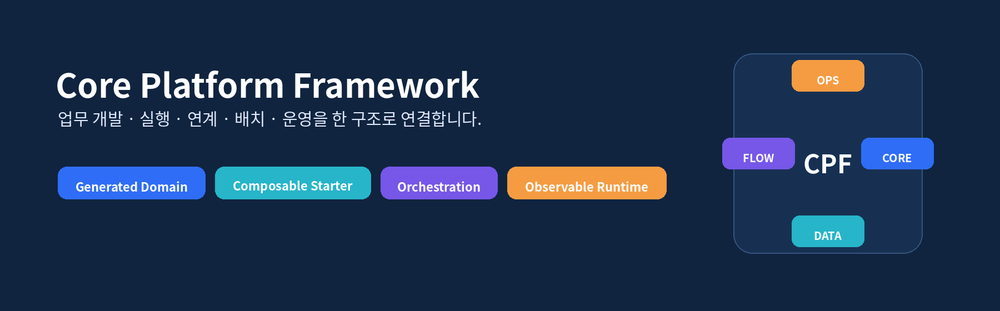
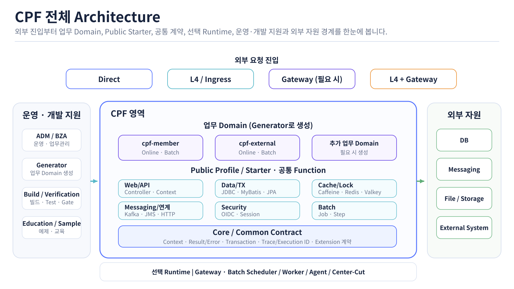
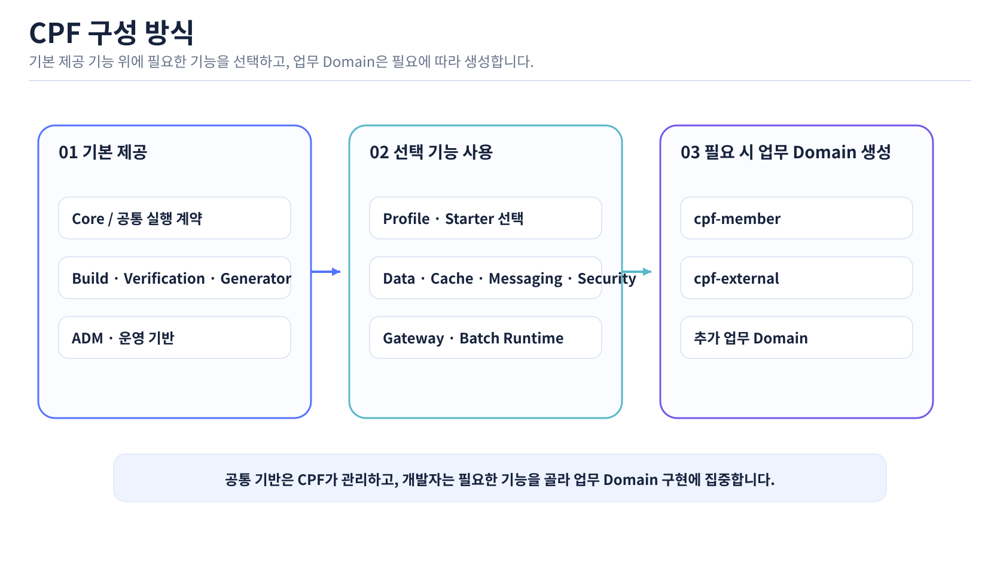
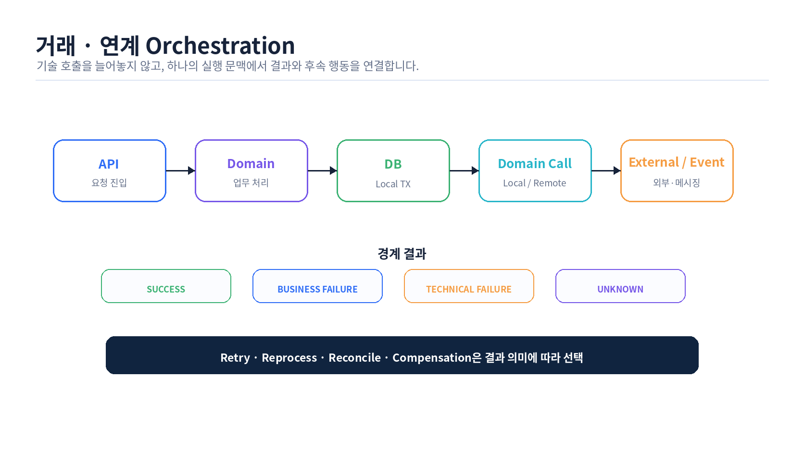
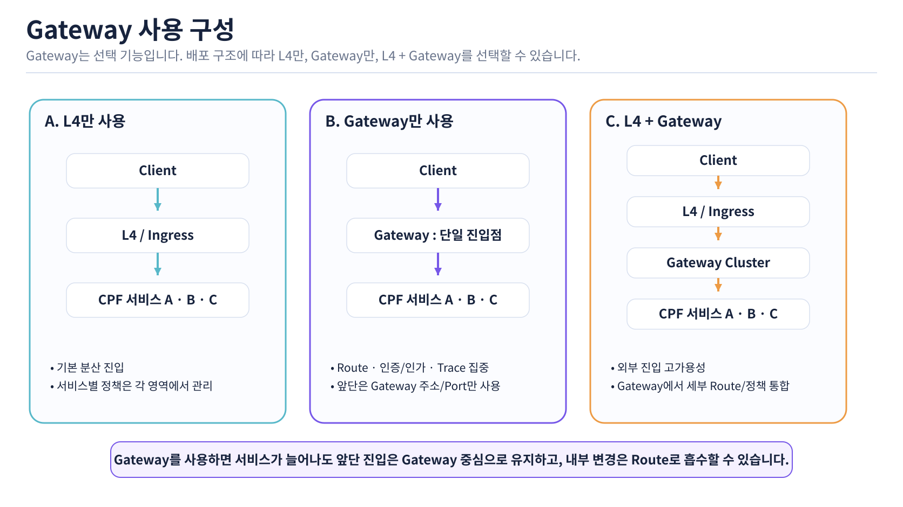
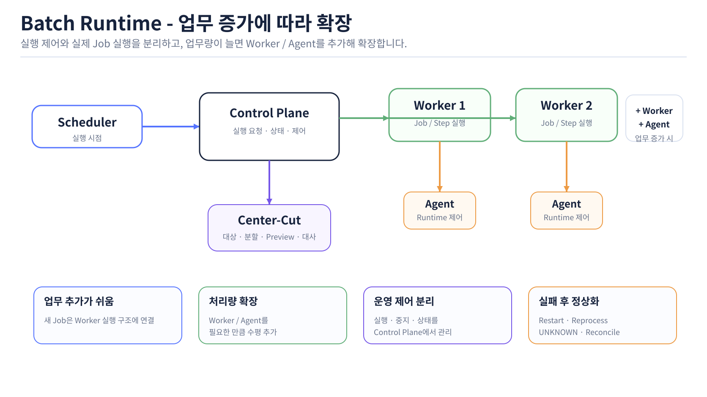
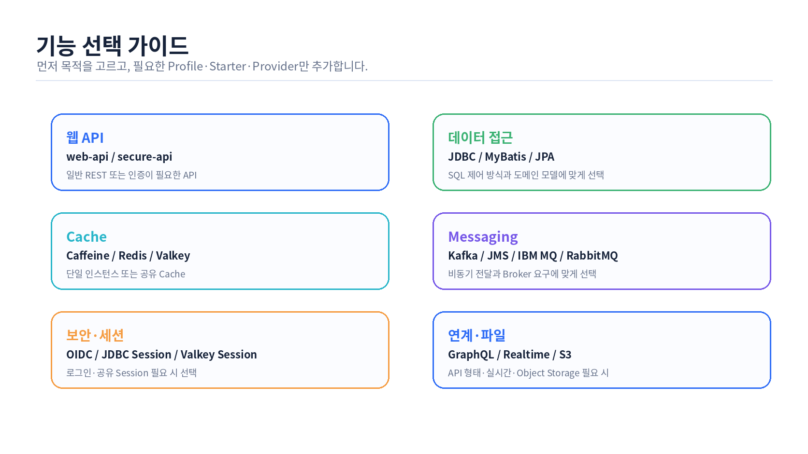
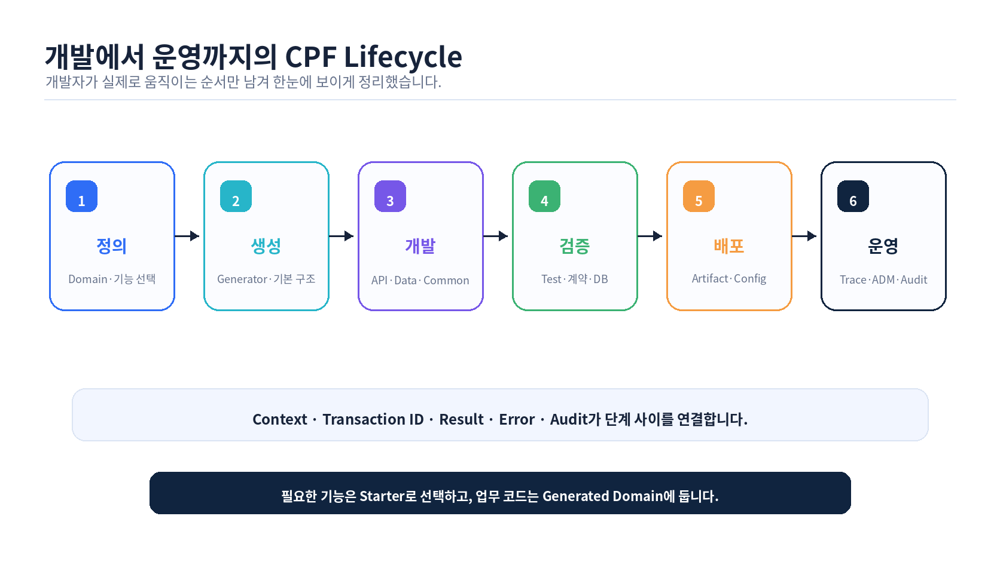

<div align="center">



# Core Platform Framework

**업무 애플리케이션의 개발·실행·연계·배치·운영을 하나의 구조로 연결하는 Business Platform Framework**

Online API부터 분산 연계, Batch Runtime, Gateway, 운영·관제까지 필요한 기능을 선택해 구성하고, 업무 코드는 Generated Domain에서 개발합니다.

</div>

<br>
<hr>
<br>

## CPF 한눈에 보기

- **생성형 개발** — 업무 코드는 Generated Domain에서 구현합니다.
- **선택형 확장** — Web, Data, Transaction, Security, Cache, Messaging, Integration, Gateway, Batch를 필요한 만큼 조합합니다.
- **유연한 진입 구조** — Direct, L4/Ingress, Gateway, L4/Ingress+Gateway 구성을 환경에 맞게 선택합니다.
- **거래·연계 오케스트레이션** — Local Transaction, Domain Call, Event, 외부 연계와 Batch 실행을 동일한 실행 문맥으로 연결합니다.
- **통합 운영** — ADM, Batch Runtime, Trace·Log·Audit를 통해 실행 상태와 운영 이력을 추적합니다.

<br>
<hr>
<br>

## 1. CPF 전체 구조

CPF는 **외부 요청 진입 → Generated Domain → 공통 실행 기반 → Batch·운영 기능 → 데이터·외부 연계**를 하나의 구조로 연결합니다. 업무 코드는 Framework 내부가 아니라 Generated Domain에 두고, 필요한 기능만 선택해 조합합니다.



**CPF는 외부 요청 진입부터 업무 Domain, 공통 실행 기반, Batch와 운영 기능, 데이터·외부 연계까지 업무 시스템의 실행 구조를 일관된 방식으로 연결합니다.** 업무 기능은 Generated Domain에 구현하고 필요한 기능은 Starter와 Runtime을 선택해 조합합니다.

<br>
<hr>
<br>

## 2. CPF 구성 방식

구성은 **기본형 → 선택형 → 생성형** 순서로 이해하면 됩니다.



**기본형**은 공통 실행 계약·도구·운영 기반입니다. **선택형**은 업무와 배포 요구에 따라 Starter, Provider, Gateway, Batch Runtime 등을 추가하는 영역입니다. **생성형**은 Generator가 만드는 실제 업무 Domain이며 개발자가 업무 코드를 작성하는 주 영역입니다.

<br>
<hr>
<br>

## 3. 거래·연계 오케스트레이션

CPF의 오케스트레이션은 단순한 HTTP 호출 묶음이 아닙니다. **Local Transaction, Domain Call, 외부 연계, Event, Batch 후속 처리와 결과 상태를 하나의 실행 문맥으로 연결**합니다.



같은 Runtime의 Local 호출은 Local Transaction 경계를 사용할 수 있지만, Remote·Messaging·외부 Side Effect는 동일 원자성으로 가정하지 않습니다. 분산 경계에서는 `SUCCESS / BUSINESS_FAILURE / TECHNICAL_FAILURE / UNKNOWN`을 구분하고 Retry·Reconcile·Compensation을 적용합니다.

<br>
<hr>
<br>

## 4. Gateway와 외부 진입 구성

Gateway는 **필수 진입점이 아니라 선택형 Runtime**입니다. 시스템 규모와 외부 진입 정책에 따라 Direct, L4/Ingress, Gateway, L4/Ingress+Gateway 구성을 선택할 수 있습니다.



Gateway를 선택하면 Route, 인증·인가 경계, 요청 제한, Target 선택, Health, Canary, Runtime 정책과 감사 기능을 외부 진입 계층에 집중할 수 있습니다. **Domain 간 내부 거래는 Gateway를 필수로 경유하지 않으며 Typed Domain Client를 사용합니다.**

<br>
<hr>
<br>

## 5. Batch Runtime

CPF Batch는 Job/Step 작성만 제공하는 구조가 아니라 **실행 계획·분산 처리·Runtime 제어·대량처리·운영 추적**까지 연결합니다.



- **Scheduler** - 실행 시점과 Job 요청을 관리합니다.
- **Worker** - Job/Step/Partition을 실제 처리합니다.
- **Agent** - 승인된 Runtime 작업의 설치·기동·중지·재시작·상태·Rollback·Drain/Resume를 수행합니다.
- **Center-Cut** - 대량 대상 선정, Preview, 분할 실행, 진행 상태, 실패 대상, 대사를 하나의 흐름으로 관리합니다.

상세 Job 개발은 **배치 개발자 가이드**, 실행·중단·재시작·재처리·대사는 **배치 운영 가이드**에서 다룹니다.

<br>
<hr>
<br>

## 6. 기능 선택

CPF는 모든 기술을 한 프로젝트에 강제하지 않습니다. 개발 목적을 먼저 정하고 필요한 기능군과 Provider를 선택합니다.



주요 범위는 Web/API, Persistence, Transaction, Cache/Lock, Messaging, Integration, Security, Observability, Batch와 File/Storage입니다. 정확한 Starter·API·Property 계약은 **Specification / 기술 명세**에서 확인합니다.

<br>
<hr>
<br>

## 7. 개발에서 운영까지

CPF는 업무 정의부터 생성·개발·검증·배포·관측·운영까지 하나의 흐름으로 연결합니다.



상세 개발 절차는 **프레임워크 개발자 가이드·배치 개발자 가이드**, 운영 절차는 **운영자 매뉴얼·배치 운영 가이드**에서 확인합니다.

<br>
<hr>
<br>

## 8. 최소 시작 절차

**요구 환경**

- Java: `25`
- Gradle Wrapper: Repository 포함
- Spring Boot: `4.1.0`
- 공식 DB Vendor: Oracle / PostgreSQL / MariaDB

기본 셋업 이후 일상 개발은 Root의 개발 도구에서 시작하면 됩니다.

```powershell
pwsh .\cpf-tools\build\tools\cpf-dev.ps1
```

평소에는 **로컬 실행(1) / 전체 빌드(2) / 빠른 검증(4)** 세 가지를 먼저 익히면 됩니다. 업무 코드 작성법은 **프레임워크 개발자 가이드**, Batch Job은 **배치 개발자 가이드**에서 바로 찾아볼 수 있습니다.

<br>
<hr>
<br>

## 9. Repository 주요 영역

- `cpf-core/` - Topology와 무관한 핵심 계약
- `cpf-starters/` - 선택 기능·Public API·Provider·AutoConfiguration
- `cpf-admin/` - 플랫폼 운영·관리
- `cpf-biz-admin/` - 선택형 업무관리 기능
- `cpf-batch/` - Batch Scheduler·Worker·Agent·Center-Cut Runtime
- `cpf-gateway/` - 선택형 외부 진입 Runtime
- `cpf-tools/` - Generator·DB Lifecycle·Build·Verification
- `cpf-education/` - 실제 사용 패턴과 학습·검증 예제
- `cpf-member/`, `cpf-external/` - Generated Domain 검증 영역

<br>
<hr>
<br>

## 10. 공식 문서

| 순서 | 공식 문서 | 사용 목적 |
|:---:|---|---|
| **02** | [프레임워크 개발자 가이드](cpf-docs/guides/02_프레임워크_개발자_가이드.pdf) | Online/API/DB/Transaction/Domain Call/공통 기능 개발 |
| **03** | [배치 개발자 가이드](cpf-docs/guides/03_배치_개발자_가이드.pdf) | Job/Step/Chunk/Partition/Worker/Scheduler 개발 |
| **04** | [운영자 매뉴얼](cpf-docs/guides/04_운영자_매뉴얼.pdf) | ADM·BZA·Runtime·Config·Gateway를 포함한 일반 운영 |
| **05** | [배치 운영 가이드](cpf-docs/guides/05_배치_운영_가이드.pdf) | Job 실행·중지·Restart·Reprocess·Reconcile·Worker 운영 |
| **06** | [Gateway 개발·사용 가이드](cpf-docs/guides/06_Gateway_개발_사용_가이드.pdf) | Gateway Route·Policy·Security·Resilience 개발과 적용 |
| **07** | [Specification / 기술 명세](cpf-docs/guides/07_Specification_기술_명세.pdf) | Public API·SPI·Annotation·Config·State·DB·기술 계약 확인 |

공식 사용자 문서는 위 **7종(README 포함)**을 기준으로 합니다. QA·Requirement·Evidence·Governance 자료는 내부 관리 자료이며 사용자 Navigation에는 포함하지 않습니다.

<br>
<hr>
<br>

## License

This project is provided under the **Community & Evaluation License**.

학습, 테스트, 평가 및 비상업적 이용은 자유롭게 허용합니다.
기업의 상용 또는 업무 목적 사용은 별도 협의가 필요합니다.
