<div align="center">

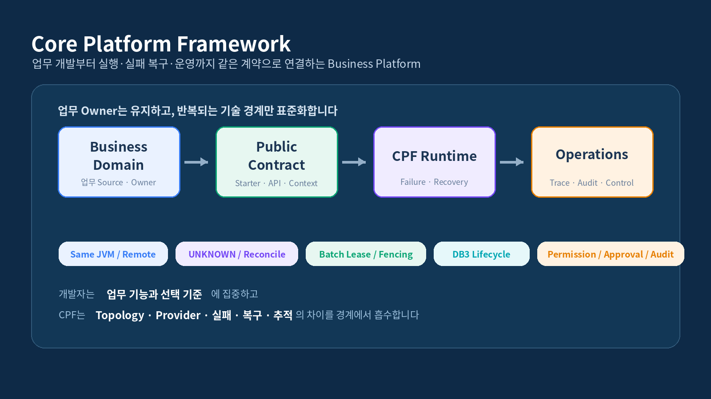

업무 Domain의 소유권은 유지하면서 개발·실행·연계·배치·DB3·운영·복구를 하나의 제품 계약으로 연결합니다.
<br><br>

# Core Platform Framework

**Spring Boot 기반 업무 시스템을 개발하고 운영할 때 반복되는 기술 경계를 CPF가 표준화합니다.**

</div>

CPF(Core Platform Framework)는 업무 규칙과 업무 데이터를 Framework 안으로 가져오지 않습니다. 각 Business Domain이 자기 업무와 DB를 계속 소유하고, CPF는 Context, Transaction, Security, Logging/Audit, Domain Invocation, Integration, Messaging, Cache, File, Batch, DB Lifecycle, Runtime 추적을 Public Contract로 제공합니다.

개발자는 업무 기능과 필요한 Capability에 집중하고, 운영자는 같은 거래를 Transaction·Operation·Runtime·Recovery 축으로 연결해 추적합니다. Same JVM에서 시작한 Domain이 분리 WAS/MSA로 이동해도 업무 코드가 배포 Topology에 끌려가지 않도록 계약을 유지하는 것이 CPF의 기본 방향입니다.

<br><br>

---

<br><br>

## 1. 전체 Architecture는 Owner 경계부터 봅니다

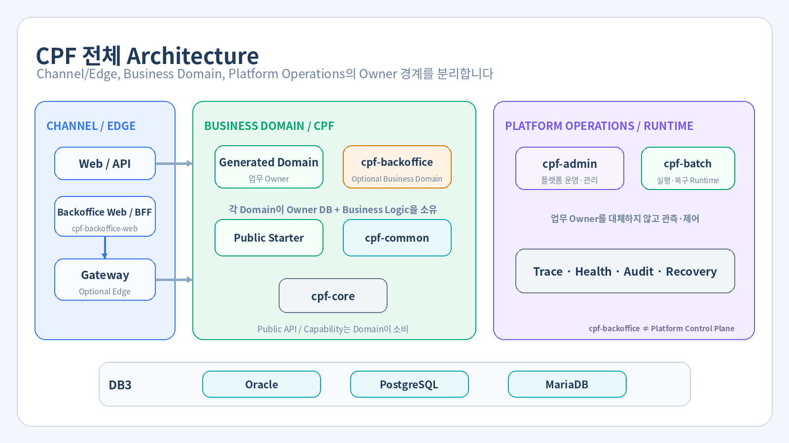

외부 진입, 업무 Domain, Platform Runtime, DB Owner를 한 화면에서 분리합니다. **업무 Logic과 업무 데이터는 Business Domain이 소유하고, Gateway·ADM·Batch는 그 소유권을 대신하지 않습니다.**

- **Channel / Edge** — Browser·API·`cpf-backoffice-web`·Optional Gateway가 외부 진입과 Trust Boundary를 담당합니다.
- **Business Domain / CPF** — Generated Domain과 `cpf-backoffice`가 업무를 소유하고 Public Starter·`cpf-common`·`cpf-core` 계약을 사용합니다.
- **Platform Runtime / DB3** — `cpf-admin`, `cpf-batch`, Trace·Health·Audit·Recovery와 Oracle/PostgreSQL/MariaDB Lifecycle이 운영 경계를 구성합니다.

<details>
<summary><b>Owner와 호출 경계 상세 보기</b></summary>

`cpf-backoffice-web`은 Browser Session, CSRF, Frontend SPA와 Public HTTP Contract를 소비하는 DB-less Channel/BFF입니다. Business Domain Java Project나 CPF Internal Java API에 직접 결합하지 않습니다.

`cpf-backoffice`는 조직·권한·결재·업무 설정을 제공하는 Optional Prebuilt Business Domain입니다. 다른 Domain의 DB/Repository를 직접 읽지 않고 공식 Public Contract로 호출하며, 플랫폼 Control Plane은 `cpf-admin`이 소유합니다.

Gateway는 외부 Trust Boundary의 Optional Edge입니다. 내부 Business Domain → Business Domain 호출을 중앙 집중시키지 않고 Same JVM/Remote Domain Invocation 계약을 사용합니다.


**Architecture 결정 시 확인할 흐름**

- 외부 Entry를 정할 때 Browser/BFF/Gateway가 인증과 Header 재구성을 어디서 수행하는지 먼저 확정합니다. L4 + Gateway, L4 only, Gateway only 중 어떤 배치를 선택해도 Domain의 Public Contract와 보안 수준은 달라지지 않습니다.
- 새 Business Domain을 만들 때 SystemCode, Operation ID, Package/Module, Owner DB, 호출 대상과 실제 Consumer를 함께 정의합니다. 업무 데이터의 Owner가 불명확하면 공유 DB나 ADM 우회 조회로 해결하지 않고 Domain 경계를 먼저 정리합니다.
- Same JVM과 Remote/MSA는 물리 Transport만 다르게 보고 Context, Result/Error, Timeout, Retry, Trace, Security 의미를 동일하게 유지합니다. 배포 변경 때문에 Controller/Service가 호출 방식별 분기를 갖게 되면 Architecture 경계를 다시 검토합니다.
- Platform Runtime은 업무 Owner를 대신하지 않습니다. `cpf-admin`은 플랫폼 Control Plane, `cpf-batch`는 실행·복구 Runtime, `cpf-gateway`는 Optional Edge이며 실제 업무 결과의 최종 판단은 Owner Domain에 남습니다.

장애 설계도 같은 Owner 지도를 사용합니다. Gateway 장애, Domain 오류, DB Lock, Broker 지연, Batch Worker Kill을 하나의 실패로 묶지 않고 각 Failure Domain의 상태와 복구 책임을 분리한 뒤 transactionId·operationId·instanceId·recoveryId로 다시 연결합니다.

</details>

<br><br>

---

<br><br>

## 2. Public Capability는 필요한 기능만 조합합니다

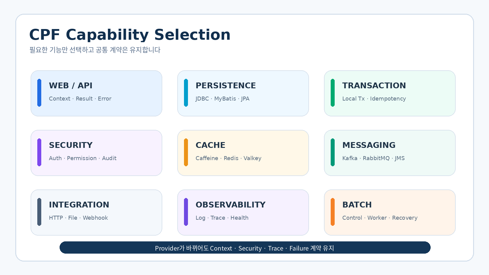

업무 프로젝트는 모든 기술 모듈을 한꺼번에 끌어오지 않습니다. **필요한 Capability와 Provider만 선택하고 업무 코드는 Public Contract를 사용**해 Provider 교체와 Runtime 변경의 영향을 줄입니다.

- Data·Transaction·Cache/Lock은 업무 DB와 일관성 경계를 명확히 합니다.
- Messaging·Integration·File은 Provider 차이보다 Timeout·Retry·Idempotency·UNKNOWN·Recovery 의미를 먼저 통일합니다.
- Security·Observability·Batch는 실행 권한, 추적, 복구를 실제 Consumer와 Runtime에 연결합니다.

<details>
<summary><b>Capability 선택 기준 상세 보기</b></summary>

Data 영역은 JDBC·MyBatis·JPA Repository 전략, Local Transaction, Cache, Lock, Data Quality를 선택합니다. Persistence 변경은 Oracle/PostgreSQL/MariaDB와 실제 Repository/Mapper Query까지 함께 검증합니다.

Messaging은 Kafka·JMS·RabbitMQ·IBM MQ 같은 Provider를 Producer/Consumer 계약 뒤에 두고 Ack/Nack, Retry, DLQ, Replay, Ordering, Duplicate를 운영 의미까지 연결합니다.

Integration은 HTTP, SOAP, TCP, Fixed Length, ISO8583, Webhook, Realtime, AI Provider를 Deadline, Timeout, Retry, Result/UNKNOWN 관점에서 연결합니다. 업무 Service가 Transport/SDK 예외에 직접 결합하지 않도록 경계를 둡니다.


**업무 프로젝트에서의 선택 순서**

- 먼저 Web/Data/Integration/Messaging/Batch 중 업무가 실제로 필요한 Capability를 고르고 Public Starter/Profile을 연결합니다. Provider SDK를 직접 추가하기 전에 CPF Public API로 같은 요구를 해결할 수 있는지 확인합니다.
- Provider 선택 뒤에는 성공 API만 확인하지 않고 장애 모드까지 정합니다. Cache는 TTL·Invalidation·Stampede, Messaging은 Ack/DLQ/Replay, Integration은 Timeout/UNKNOWN, File은 Checksum/Finalize 같은 운영 의미를 함께 선택합니다.
- File Capability는 Attachment와 **Object Storage**, S3 연계, **Archive**, **Tabular** 입출력, **Checksum** 검증까지 하나의 Lifecycle로 다룹니다. 임시 파일 생성과 최종 확정 사이의 실패를 구분하고 Quarantine·Retention 정책을 Runtime 설정과 연결합니다.
- 공통 기능이 여러 Domain에서 필요해도 업무별 Owner를 없애는 Shared Service로 바꾸지 않습니다. `cpf-common`과 Public Capability는 반복 기술 계약을 제공하고, 업무 규칙과 고객별 정책은 해당 Domain 또는 고객 공통 Library에 남깁니다.

</details>

<br><br>

---

<br><br>

## 3. Domain 개발은 생성부터 Runtime 확인까지 이어집니다

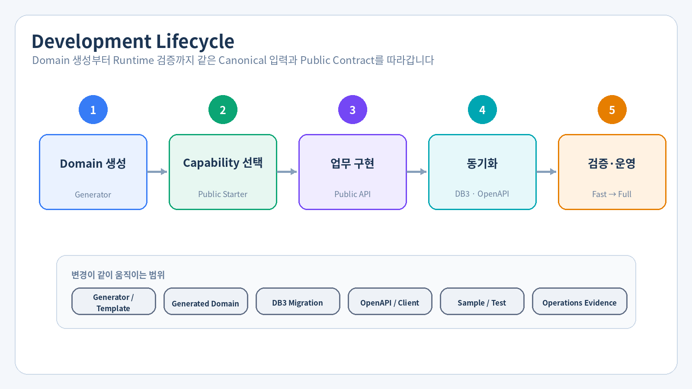

개발 흐름은 **환경 확인 → Domain 생성 → Capability 선택 → 업무 구현 → 동기화 → Build/Test → Runtime 확인**으로 이어집니다. Generator, Starter, Source, Runtime이 서로 다른 규칙을 갖지 않게 만드는 것이 핵심입니다.

- `cpf doctor`와 `cpf bootstrap`으로 prerequisite와 로컬 기반을 먼저 확인합니다.
- `cpf domain-new` / `cpf domain-sync`로 Canonical Domain 구조와 Generated 영역을 맞춥니다.
- `cpf build` / `cpf test` / `cpf run` / `cpf status`로 Source와 실제 Runtime을 함께 검증합니다.

<details>
<summary><b>개발 완료 흐름 상세 보기</b></summary>

개발자는 User-owned Feature에 Controller·Service·Repository/Client 업무 로직을 작성하고 필요한 `web`, `data`, `messaging`, `integration`, `security`, `batch` Capability를 Public Starter/Profile로 선택합니다.

정상 거래만 확인하고 끝내지 않습니다. Validation 오류, BUSINESS_FAILURE, TECHNICAL_FAILURE, Timeout, UNKNOWN, Retry/Reconcile과 DB/Trace/Audit 결과까지 확인해야 해당 기능의 개발 흐름이 닫힙니다.


**실제 업무 기능 하나를 닫는 순서**

- Domain 생성 후 먼저 Operation과 Request/Result 계약을 확정하고 Controller → Service → Repository/Client의 Consumer 경로를 연결합니다. Annotation이나 DTO가 존재해도 실제 Service 호출과 Runtime Endpoint가 이어지지 않으면 구현 완료로 보지 않습니다.
- Persistence가 포함되면 JDBC/MyBatis/JPA 중 전략을 선택하고 Local Transaction, Lock, Pagination, Index, DB3 Query 차이를 확인합니다. 외부 Side Effect가 있으면 Local Commit과 Remote 결과를 같은 Transaction으로 가정하지 않고 Idempotency와 UNKNOWN 처리 경계를 함께 구현합니다.
- OpenAPI/Frontend가 있는 Domain은 Backend Contract 변경 뒤 Generated Client와 실제 화면 Consumer까지 갱신합니다. Generator Template만 바꾸고 기존 Generated Domain, Sample, EDU가 예전 API를 계속 쓰는 상태를 허용하지 않습니다.
- 검증은 Unit Test 한 번으로 끝내지 않습니다. 정상·Validation·BUSINESS/TECHNICAL·Timeout·UNKNOWN·Retry/Reconcile을 실행하고 DB/Log/Trace/Audit에서 같은 transactionId와 operationId로 결과를 확인합니다.

개발자가 기능을 마친 뒤 `cpf status`에서 Process가 떠 있다는 사실만 확인하지 않습니다. 실제 거래를 다시 보내고 원하는 업무 결과, DB 상태, 외부 Side Effect, 실패 시 복구 결과가 함께 맞아야 Runtime 검증을 닫습니다.

</details>

<br><br>

---

<br><br>

## 4. Generator는 Generated와 User-owned를 분리합니다

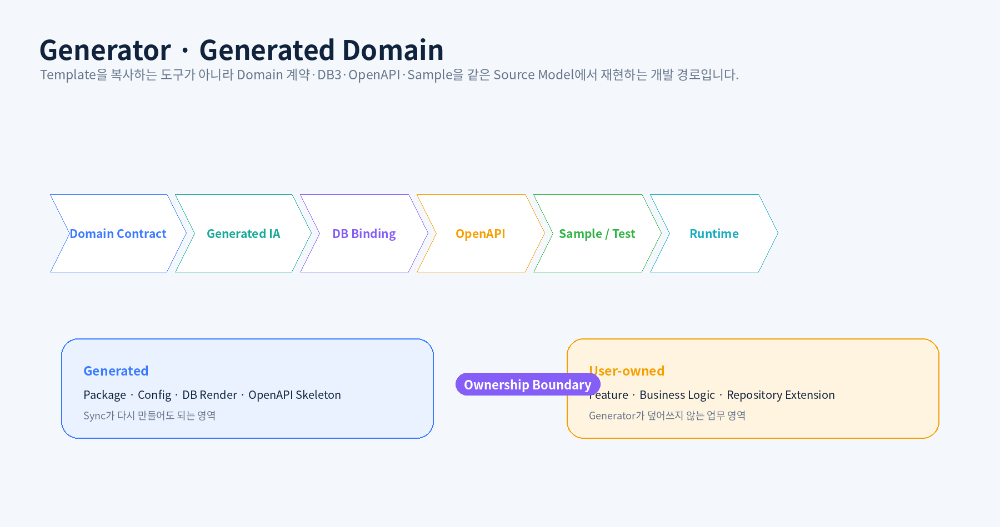

Generator는 빈 프로젝트 복사가 아니라 **Domain 계약을 반복 가능한 Source 구조로 재생성하는 도구**입니다. Generated 영역은 다시 만들 수 있어야 하고, 업무 개발자가 작성한 User-owned Feature는 재생성으로 덮어쓰지 않습니다.

- Package·Config·DB Binding·OpenAPI·Sample/Test·Runtime 진입 구조를 Canonical 입력에서 생성합니다.
- Generated-owned 파일의 사용자 변경이나 삭제 위험은 임의 병합하지 않고 fail-closed로 멈춥니다.
- Template 변경은 Generated 결과, Sample/EDU, DB3, OpenAPI, Test/Runtime까지 함께 검증합니다.

<details>
<summary><b>재생성과 소유권 경계 상세 보기</b></summary>

Generated Source는 Canonical 입력으로 다시 만들 수 있는 구조와 Binding을 소유합니다. User-owned 영역은 업무 Feature, 업무 규칙, 고객별 정책과 Repository 확장을 소유합니다.

DB Vendor나 Runtime 구성이 바뀌더라도 Generated 영역과 업무 영역의 경계가 유지되면 변경 영향이 명확해집니다. Sync는 사용자 Source를 보호하고 실제 Consumer가 새 계약을 사용하는지까지 확인해야 완료됩니다.


**Generator 변경 시 함께 확인할 것**

- Canonical Starter Catalog와 Template이 바뀌면 create/setup, preview, sync, diff, remove Lifecycle을 다시 실행해 Generated-owned 영역이 동일 규칙으로 재현되는지 확인합니다.
- Generated Java/Config/DB/OpenAPI 결과는 실제 Build 대상이어야 합니다. 샘플 파일만 생성되거나 컴파일에서 제외되는 경로에 놓이면 성공으로 보지 않습니다.
- User-owned Source의 Hash나 수정 흔적이 있으면 삭제·덮어쓰기보다 충돌을 표시하고 사용자가 결정할 수 있게 멈춥니다. 재생성 안전성이 Generator의 주요 계약입니다.
- Generated Domain은 실제 Public Starter/API Consumer 역할도 합니다. Framework Public 계약 변경 시 Generator·Generated Domain·Sample/EDU·OpenAPI·Test가 함께 갱신되어야 문서와 Source가 같은 사용법을 설명할 수 있습니다.

</details>

<br><br>

---

<br><br>

## 5. Domain Invocation은 배치 위치가 달라도 같은 계약을 사용합니다

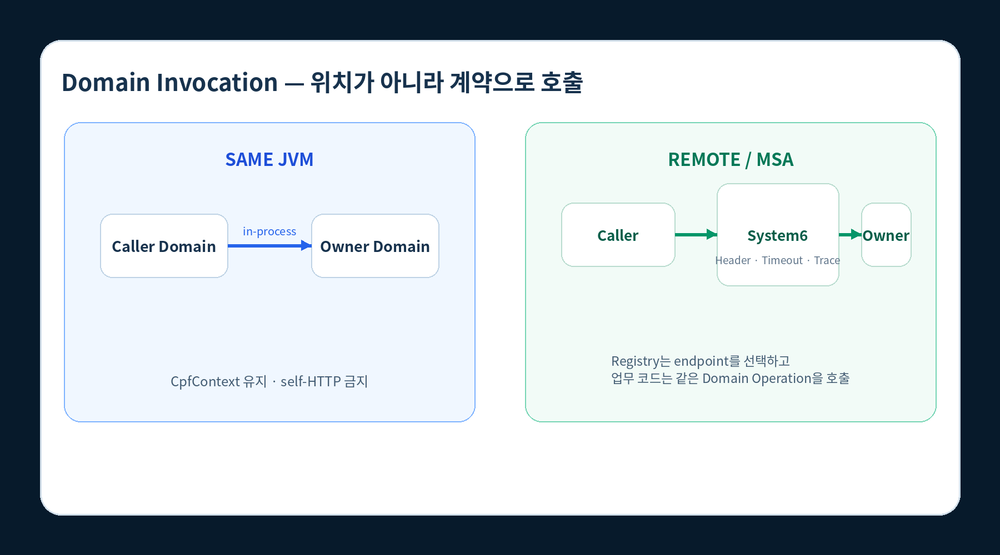

같은 JVM이면 Local Binding, 분리 WAS/MSA면 Registry·Transport를 사용하지만 **업무 코드는 같은 Domain Operation을 호출**합니다. 내부 호출을 Gateway나 self-HTTP로 우회해 Topology를 업무 코드에 박아 넣지 않습니다.

- Canonical System6는 Transaction/Original/Current/Caller/Target/Operation의 논리 호출 경로를 전달합니다.
- `instanceId`는 Header가 아니라 실제 WAS/Container Runtime 식별자이며 명시값 우선, 미설정 시 Hostname으로 확정합니다.
- Deadline, Timeout, Retry, Idempotency, Result/Error, UNKNOWN 의미를 Same JVM/Remote에서 동일하게 유지합니다.

<details>
<summary><b>System6와 Runtime Identity 상세 보기</b></summary>

Canonical Header는 `X-Transaction-Id`, `X-Original-System-Code`, `X-System-Code`, `X-Caller-System-Code`, `X-Target-System-Code`, `X-Target-Operation-Id` 여섯 개입니다. 신뢰 경계에서 구성하고 Receiver는 Controller 실행 전에 검증합니다.

Transaction ID와 Original System은 최초 확정 후 유지되고 Caller/Target/Operation은 실제 Hop을 반영합니다. Browser 같은 Untrusted Client가 Protected Header를 신뢰값으로 임의 생성하지 않습니다.

`instanceId`는 Process 생명주기의 실행 위치를 식별해 Log·Trace·ADM·Batch Recovery를 연결합니다. System6와 Runtime Identity를 분리하면 같은 SystemCode의 여러 Instance에서도 논리 거래와 실제 실행 위치를 섞지 않고 추적할 수 있습니다.


**호출 경계에서 확인할 실제 항목**

- 호출자는 Target Domain과 안정적인 Operation ID를 명시하고 CPF가 Same JVM Local Binding 또는 Remote Registry/Transport를 선택하게 합니다. 업무 Service가 Host/Port를 직접 조합하거나 Remote 여부를 기준으로 다른 업무 분기를 만들지 않습니다.
- Receiver는 System6 필수값과 실제 Target/Operation이 일치하는지 Controller 실행 전에 확인합니다. 누락·위조·잘못된 Route는 업무 로직에서 보정하지 않고 신뢰 경계에서 거부합니다.
- Deadline은 전체 호출의 남은 시간을 나타내므로 하위 호출이 매번 새 Timeout을 초기화하지 않습니다. Retry가 있더라도 남은 Deadline과 Idempotency 조건을 확인하고 Retry exhausted 이후 결과가 UNKNOWN인지 다시 판정합니다.
- Multi-instance 환경에서는 동일 SystemCode의 여러 Process를 `instanceId`로 분리합니다. Registry·Log·Trace·ADM·Batch Evidence에서 실제 Host/Container가 일관되게 보이지 않으면 READY 상태를 신뢰하지 않습니다.

</details>

<br><br>

---

<br><br>

## 6. Transaction은 실패 종류와 다음 행동을 구분합니다

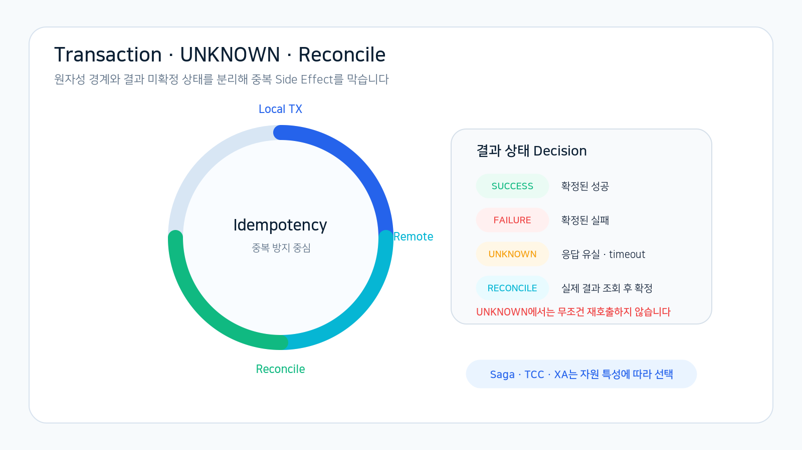

Remote Side Effect가 포함되면 Local DB Commit만으로 전체 결과를 단정할 수 없습니다. CPF는 **SUCCESS / BUSINESS_FAILURE / TECHNICAL_FAILURE / UNKNOWN**을 분리해 Retry, Probe, Reconcile, Compensation의 선택 근거를 남깁니다.

- BUSINESS_FAILURE는 업무 거절이므로 동일 요청 반복을 해결책으로 보지 않습니다.
- TECHNICAL_FAILURE의 Retry 여부는 멱등성, Side Effect, Deadline과 함께 판단합니다.
- UNKNOWN은 Blind Retry하지 않고 Probe/Reconcile로 실제 결과부터 확정합니다.

<details>
<summary><b>분산 거래와 복구 상세 보기</b></summary>

단일 Local DB 원자성은 Local Transaction으로 닫습니다. 여러 Resource/Domain이 참여할 때는 업무 특성에 따라 Saga, TCC, XA 또는 Reconcile 기반 보상 흐름을 선택합니다.

`@CpfIdempotent`, Inbox/Outbox, Recovery ID, Fencing은 재호출·Process 재기동·다중 Instance에서도 같은 Side Effect가 두 번 확정되지 않게 하는 근거입니다. 복구 후에는 Result/DB/Trace/Audit를 다시 확인합니다.


**Result 상태별 다음 행동**

- SUCCESS는 최종 업무 결과와 필요한 Side Effect가 확정됐을 때만 사용합니다. HTTP 200이나 Provider Ack 하나만으로 전체 업무가 성공했다고 단정하지 않습니다.
- BUSINESS_FAILURE는 업무 규칙상 확정 거절이므로 사용자 메시지와 후속 업무 흐름으로 돌립니다. 같은 idempotency key를 반복 호출해 상태를 바꾸려 하지 않습니다.
- TECHNICAL_FAILURE는 기술 오류가 명확할 때 사용하지만 자동 Retry 여부는 별도 정책입니다. Non-idempotent Side Effect나 짧은 Deadline에서는 기술 실패라도 즉시 재호출하지 않을 수 있습니다.
- UNKNOWN은 실제 반영 여부를 알 수 없는 상태를 보존합니다. Probe·업무 원장 조회·외부기관 상태 확인으로 결과를 확정하고 필요할 때 recoveryId 기반 Reconcile/Compensation으로 연결합니다.

</details>

<br><br>

---

<br><br>

## 7. Integration과 Messaging은 실패·복구 의미를 공유합니다

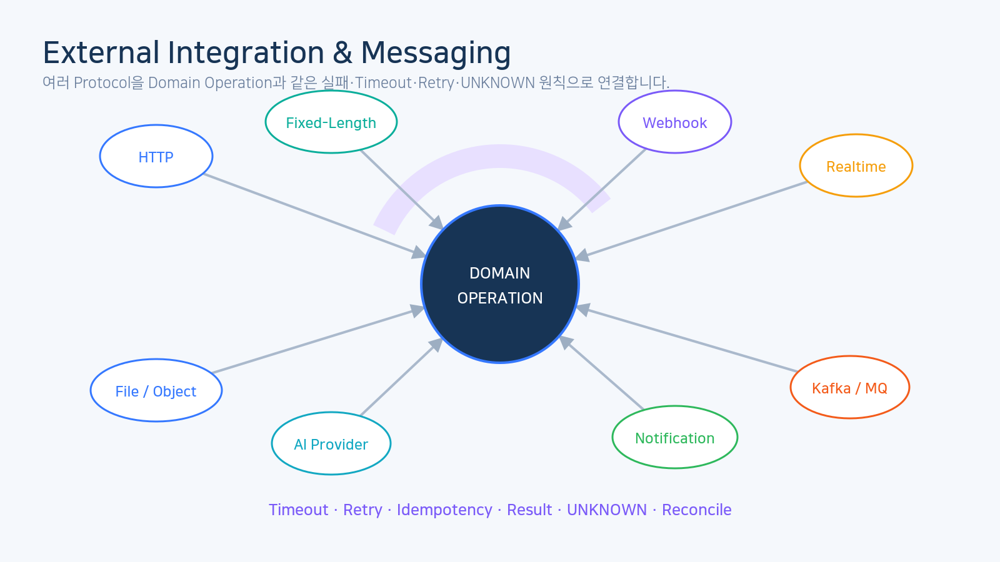

Protocol과 Provider는 달라도 **Timeout·Retry·Idempotency·Result/UNKNOWN·Reconcile의 의미는 같은 기준**으로 유지합니다. 외부 SDK나 Broker API를 업무 코드 곳곳에 직접 노출하지 않습니다.

- HTTP·SOAP·TCP·Fixed Length·ISO8583·Webhook·Realtime·AI Provider를 Public Client/Operations 경계로 연결합니다.
- Messaging은 Ack/Nack·Retry·DLQ·Replay·Ordering·Duplicate·Schema Compatibility까지 운영 시나리오로 닫습니다.
- File/Object Storage는 Checksum·Temporary Upload·Atomic Finalize·Quarantine·Retention을 함께 다룹니다.

<details>
<summary><b>외부 Side Effect 처리 상세 보기</b></summary>

Outbox/Inbox는 DB Transaction과 Message Side Effect 사이의 간격을 보완합니다. Consumer 중복 전달이나 Process 재기동에서도 이미 확정된 업무가 반복되지 않도록 처리 상태를 확인합니다.

Provider 응답이 유실되면 성공/실패를 추측하지 않습니다. 외부 요청 ID, Transaction/Operation Context, 업무 원장과 Provider 상태를 연결해 실제 결과를 확인하고 필요한 Reconcile을 수행합니다.


**Protocol별로 달라져도 유지하는 계약**

- HTTP/SOAP는 Status Code와 업무 Result를 분리하고 Connection Reset·Timeout 뒤 실제 처리 여부를 확인합니다. Fixed Length/TCP/ISO8583도 전문 송신 성공과 상대 업무 반영을 같은 의미로 보지 않습니다.
- Kafka/JMS/RabbitMQ/IBM MQ에서는 Broker Ack와 Consumer 업무 완료를 분리합니다. DLQ나 Replay를 수행할 때 기존 messageId/idempotencyKey와 이미 발생한 Side Effect를 확인해 중복 처리를 막습니다.
- Webhook/Notification/Realtime은 요청 전송, 상대 수신, 최종 사용자 전달 상태를 구분해 Trace/Audit에 연결합니다. Callback이 늦거나 중복되어도 원 Operation과 상관관계를 유지합니다.
- AI/외부 Provider는 응답 생성 실패뿐 아니라 느린 응답, 부분 응답, Provider 전환 시 데이터·보안 정책을 확인합니다. 실패 시 무조건 다른 Provider로 재전송해 Side Effect나 비용을 중복시키지 않습니다.

</details>

<br><br>

---

<br><br>

## 8. Batch는 실행 소유권과 복구 지점을 명확히 합니다

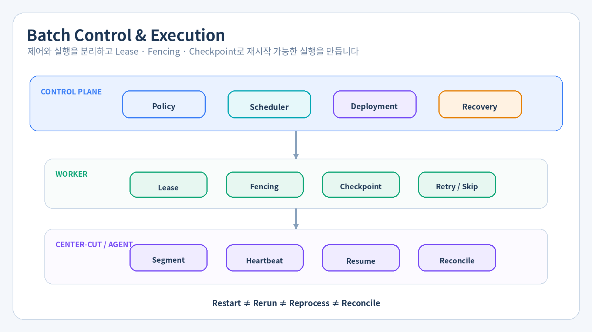

Batch는 Job 코드만 제공하지 않습니다. **Control Plane·Scheduler·Worker·Center-Cut·Agent의 역할을 분리하고 Lease·Fencing·Checkpoint로 실행 소유권과 복구 위치를 관리**합니다.

- Lease는 현재 실행 Owner, Fencing Token은 stale Worker의 늦은 쓰기를 차단합니다.
- Heartbeat와 Checkpoint는 Process Kill·Network Partition 후 Takeover와 Resume의 근거가 됩니다.
- Restart·Rerun·Reprocess·Reconcile을 같은 의미로 취급하지 않고 실제 Side Effect 상태에 따라 선택합니다.

<details>
<summary><b>Multi-instance Batch 복구 상세 보기</b></summary>

Control Plane/Scheduler가 실행을 결정하고 Worker가 실제 Job/Step을 수행합니다. Center-Cut과 Agent는 대량처리와 Host 실행 경계를 담당하며 Local Batch Runtime은 개발 도구이지 운영 독립 Process를 대체하지 않습니다.

새 Worker가 Takeover해도 기존 Worker의 결과를 무조건 덮어쓰지 않습니다. Lease/Fencing 상태, Checkpoint와 이미 발생한 DB/File/External Side Effect를 확인한 뒤 Resume/Reconcile을 선택합니다.


**운영에서 구분해야 하는 복구 명령**

- Restart는 같은 Execution의 복구 가능 지점부터 이어가는 의미이고, Rerun은 새 Execution으로 전체 Job을 다시 수행합니다. Reprocess는 특정 데이터 범위를 다시 처리하며 Reconcile은 이미 발생한 결과를 먼저 대사해 최종 상태를 확정합니다.
- Process Kill 뒤 새 Worker가 Lease를 얻어도 이전 Worker가 Network 복구 후 늦게 쓰는 상황을 가정합니다. Fencing Token이 stale write를 차단하는지 DB/외부 Side Effect까지 실제로 확인합니다.
- Checkpoint는 단순 진행률 숫자가 아니라 재시작의 기준입니다. 처리 대상 키, 마지막 성공 단위, 중간 파일/DB 상태와 함께 저장해 재기동 후 중복·누락 없이 이어지는지 검증합니다.
- Scheduler/Control Plane 장애와 Worker 장애는 복구 방법이 다릅니다. Schedule 결정 상태, Queue, 실행 Owner, Heartbeat를 분리해 보고 어느 역할을 재기동해야 하는지 판단합니다.

</details>

<br><br>

---

<br><br>

## 9. Gateway는 외부 Entry의 선택 경계입니다

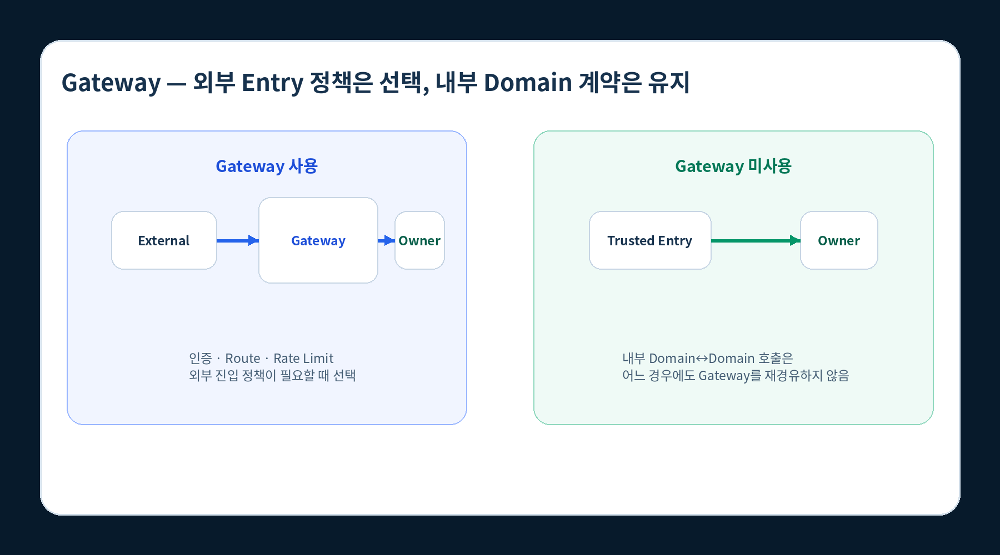

Gateway는 모든 내부 호출의 중앙 허브가 아니라 **외부 Trust Boundary의 Optional Edge**입니다. L4 + Gateway, L4 only, Gateway only 중 배포 요구에 맞게 선택하되 Security·Audit·Operation 검증 수준은 동일하게 유지합니다.

- **L4 + Gateway** — L4가 Gateway Instance로 분산하고 Gateway가 Route·Version·Rate Limit·Edge Policy를 소유합니다.
- **L4 only** — Gateway 없이 허용 Public HTTP Target으로 연결하되 인증·인가·System6·Audit를 낮추지 않습니다.
- **Gateway only** — Gateway Endpoint를 Entry로 사용하며 Multi-instance와 Gateway Failure Domain을 함께 설계합니다.

<details>
<summary><b>Route·Failover 원칙 상세 보기</b></summary>

CPF가 장애를 감지했다고 보안 수준이 다른 Direct 경로로 자동 fallback하지 않습니다. 허용 Route, Canary, Drain, Failover, Rollback은 배포·운영 정책이 소유합니다.

내부 Business Domain → Business Domain 호출은 Gateway를 다시 경유하지 않습니다. Gateway가 없어도 Direct Public HTTP를 보안 우회 경로로 쓰지 않고 동일한 Trust Boundary와 Operation 검증을 적용합니다.


**배포 선택 후 확인할 항목**

- L4 + Gateway에서는 L4 Health와 Gateway Readiness/Drain을 분리하고, Gateway Instance 교체 중 신규 요청이 Drain 대상에 들어가지 않는지 확인합니다. Route/Version 변경은 Audit와 Rollback 기준을 남깁니다.
- L4 only에서는 Gateway가 없다는 이유로 Public HTTP 인증이나 Caller/Target 검증을 생략하지 않습니다. Direct Target 목록과 TLS/Identity/Rate 정책을 배포 계약으로 명시합니다.
- Gateway only에서는 Gateway 자체가 단일 Failure Point가 되지 않도록 Multi-instance 노출과 Client DNS/Endpoint 정책을 함께 검토합니다. Gateway 장애를 Domain 장애로 오인해 업무 DB를 조치하지 않습니다.
- Canary/Failover 뒤에는 Edge Health만 보지 않고 같은 업무 Operation을 실제 실행해 System6, Trace, Domain Result, Audit가 정상인지 확인합니다.

</details>

<br><br>

---

<br><br>

## 10. DB3는 Canonical Source에서 Runtime Query까지 닫습니다

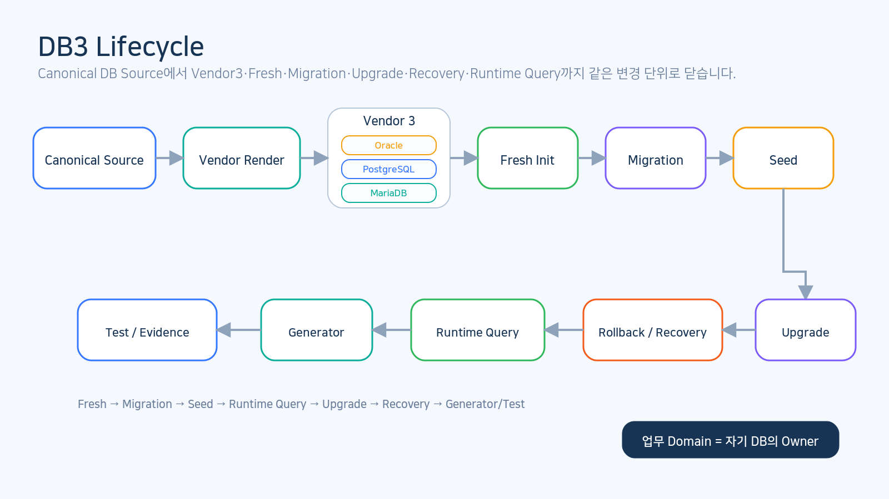

공식 DB Vendor는 **Oracle·PostgreSQL·MariaDB**입니다. DB 변경은 한 SQL 파일에서 끝내지 않고 Canonical Source → Vendor3 → Migration → Seed → Runtime Query → Upgrade → Rollback/Recovery까지 한 변경 단위로 관리합니다.

- Fresh Init과 Upgrade를 분리해 신규 환경과 운영 Upgrade를 각각 확인합니다.
- Schema 적용 뒤 Repository·Mapper·Generated DB Binding과 실제 Query까지 검증합니다.
- 실패 후 Recovery와 재실행으로 멱등성과 데이터 일관성을 확인합니다.

<details>
<summary><b>DB Owner와 Lifecycle 상세 보기</b></summary>

업무 Domain은 자기 업무 Table과 Query의 Owner입니다. Platform/ADM이 다른 Domain DB를 편의상 직접 읽지 않고 필요한 정보는 공식 Public Contract로 조회합니다.

Vendor별 문법 차이는 인정하지만 업무 Schema 의미와 Runtime 계약은 동일하게 유지합니다. Generator가 DB Binding을 생성하면 Canonical Schema, Vendor3 Render, Generated 결과, Runtime Query, Test/Evidence까지 함께 닫습니다.


**DB 변경 완료 체크**

- Canonical Schema를 바꾼 뒤 Oracle/PostgreSQL/MariaDB 세 Render를 생성하고 Datatype, Sequence/Identity, Index, Constraint 차이를 확인합니다. Vendor 한 곳만 성공한 상태는 Current Schema 완료가 아닙니다.
- Fresh Install은 빈 Schema에서 Initializer→Migration→Seed를 실행하고 Upgrade는 이전 버전 데이터를 가진 상태에서 같은 Current Schema로 이동하는지 검증합니다. 운영 데이터가 있는 변경은 복구·Rollback 전략을 별도로 기록합니다.
- Repository/Mapper/JPA Query는 실제 Runtime Profile에서 실행합니다. DDL이 성공해도 Index/FK/Query Plan이나 Vendor 함수 차이로 Consumer가 실패하면 DB 변경은 완료가 아닙니다.
- Generator가 DB Binding을 소비하면 Generated Source를 다시 만들고 Domain Build/Test를 실행합니다. Schema와 Generated Model이 어긋난 상태를 수동 Mapping으로 숨기지 않습니다.

</details>

<br><br>

---

<br><br>

## 11. Security는 실행 권한과 운영 조치의 이유를 남깁니다

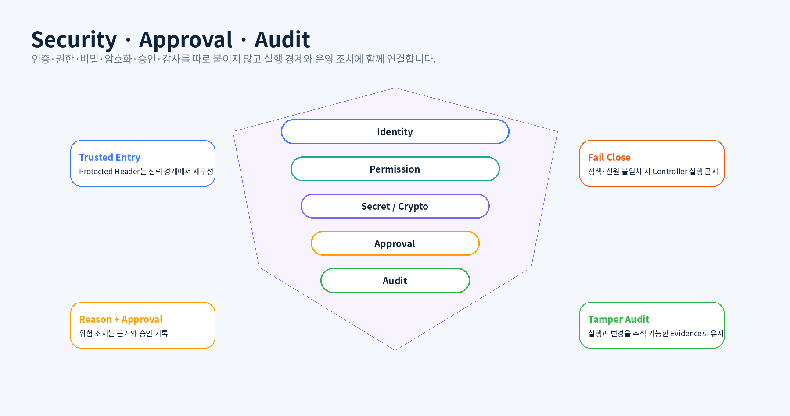

Identity, Permission, Secret/Crypto, Approval, Audit를 따로 흩어놓지 않고 **실제 실행 경계와 하나의 추적 흐름으로 연결**합니다. 신뢰할 수 없는 Header나 권한 없는 요청은 업무 로직 실행 전에 fail-close합니다.

- `@CpfPermission`으로 실행 가능 여부를 명시하고 Identity와 Permission을 분리합니다.
- 위험 조치는 Reason → Approval → Execute → Audit 순서로 남깁니다.
- Secret/Key/Certificate와 PII는 코드·일반 로그·Audit에 평문으로 노출하지 않습니다.

<details>
<summary><b>보안·승인·감사 상세 보기</b></summary>

Config 변경, Feature Flag, Dynamic Log Level, Cache/Runtime Control, Batch/Gateway 운영 조치는 필요에 따라 Reason과 Approval을 요구하고 실제 실행 결과와 실패·복구까지 Audit로 남깁니다.

OIDC/Resource Server, Browser Session, Service Identity는 각 Trust Boundary에 맞는 방식을 사용합니다. 서비스 간 호출에서 사용자 세션을 임의 복제하거나 Secret Provider 장애 시 평문 fallback을 만들지 않습니다.


**운영 보안까지 포함한 검증**

- Permission 없는 사용자/Service가 실제 Endpoint를 호출했을 때 Controller/Service Side Effect가 발생하지 않는지 확인합니다. 권한 오류를 Logging만 하고 실행을 계속하는 Fail-open은 허용하지 않습니다.
- Secret Rotation은 새 Key 적용뿐 아니라 기존 Connection/Token/Certificate가 언제 만료되고 Runtime Reload가 어떻게 이뤄지는지 확인합니다. Secret Provider 장애 시 평문 Default나 코드 상수로 우회하지 않습니다.
- Approval 대상 조치는 승인 전 실행 불가, 승인자와 실행자 분리, Reason 기록, 실행 결과 Audit를 확인합니다. 긴급 조치도 사유와 사후 Evidence가 남아야 합니다.
- Log/Audit/Trace에는 식별에 필요한 Context를 남기되 비밀번호, Token, 주민번호 같은 민감정보 원문이 노출되지 않도록 Masking과 접근권한을 함께 검증합니다.

</details>

<br><br>

---

<br><br>

## 12. Operations는 거래·Instance·Recovery를 같은 Timeline으로 봅니다

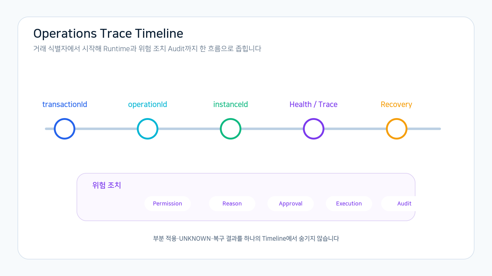

운영자는 **transactionId → operationId → instanceId → recoveryId**를 따라 업무 흐름, 실제 Runtime, 복구 작업을 연결합니다. Health가 녹색이라는 이유만으로 사건을 닫지 않고 실제 업무 결과와 Side Effect를 확인합니다.

- BUSINESS/TECHNICAL/UNKNOWN을 구분하고 Gateway·Domain·DB·Broker·Batch·외부기관 중 실제 Failure Domain을 좁힙니다.
- UNKNOWN이면 Retry보다 Probe/Reconcile을 먼저 수행합니다.
- 조치 후 거래·DB·Trace·Audit와 Reconcile Queue까지 다시 확인해야 정상화가 끝납니다.

<details>
<summary><b>ADM과 Incident 흐름 상세 보기</b></summary>

`cpf-admin`은 Runtime/Health/Trace/Log/Config/Incident/Recovery/Deployment/Batch/Gateway/Security를 조회·제어하는 ADM Platform Control Plane입니다. 업무 Transaction이나 업무 Master Data의 Owner가 아닙니다.

운영 조치에는 Permission, Reason, Approval, Audit를 연결하고 Before/After 상태와 실제 업무 결과를 Evidence로 남깁니다. Multi-instance에서는 특정 Instance 한 곳의 정상만 보고 전체 정상으로 판정하지 않습니다.


**Incident를 닫기 전 확인할 흐름**

- 먼저 transactionId와 operationId로 실패 거래를 찾고 instanceId로 실제 Process를 좁힙니다. 같은 SystemCode의 다른 Instance가 정상이어도 문제 Instance의 요청·DB·Trace를 확인하기 전 전체 정상으로 보지 않습니다.
- HTTP Status, Health, Error Log만으로 결과를 확정하지 않습니다. Owner Domain의 업무 상태, DB Commit 여부, Broker/외부기관 Side Effect를 확인해 SUCCESS/FAILURE/UNKNOWN을 다시 판정합니다.
- 재기동·Failover·Cache invalidate·Batch Reprocess 같은 운영 조치에는 대상, Reason, Approval, Before/After를 남깁니다. 조치 자체가 성공했다는 메시지와 업무 정상화는 별개의 검증 단계입니다.
- Reconcile Queue나 수동 보정 대상이 남으면 Owner와 기한, 원 transactionId/recoveryId를 기록합니다. 후속 작업이 추적 가능한 상태가 되어야 Incident를 종료할 수 있습니다.

`cpf-admin`의 화면과 API는 판단을 돕는 Control Plane입니다. 최종 완료 근거는 실제 거래 재실행, DB/Trace/Audit 확인, 재발하지 않는 상태와 복구 Evidence가 함께 맞는지로 판단합니다.

</details>

<br><br>

---

<br><br>

## 13. Public CLI는 개발과 Runtime 진입점을 하나로 맞춥니다


일반 개발자는 Unified **`cpf` Public CLI**로 환경 확인, Domain 생성·동기화, Build/Test, Runtime 기동·상태·종료를 수행합니다. Internal 검증 Namespace는 일반 개발 Golden Path와 분리합니다.

- 준비: `cpf doctor` → `cpf bootstrap`
- 개발: `cpf domain-new` → `cpf domain-sync` → `cpf build` → `cpf test`
- 실행: `cpf run` → `cpf status` → `cpf stop`, 필요 시 `cpf reset`

```text
cpf doctor [--json] [--strict] [--non-interactive]
cpf bootstrap [--db oracle|postgresql|mariadb]
cpf domain-new <domain> [SYSTEM_CODE]
cpf domain-sync [domain]
cpf build
cpf test
cpf run
cpf status
cpf stop
cpf reset
cpf version
cpf help
```

<details>
<summary><b>각 Public 명령의 사용 시점 보기</b></summary>

`doctor`는 Java/Gradle/Docker와 CPF 도구 prerequisite를 확인하고 `bootstrap`은 DB를 포함한 로컬 기반을 준비합니다. `domain-new`는 Canonical Domain 구조를 생성하며 `domain-sync`는 현재 Source Model과 Generated 영역을 다시 맞춥니다.

`build`와 `test`가 통과해야 Runtime 검증으로 넘어갑니다. `run` 뒤에는 `status`로 실제 Process/Health를 확인하고 `stop`으로 종료합니다. `reset`은 Fresh Replay가 필요할 때 사용하며 `version`과 `help`는 설치 식별과 Public 명령 확인에 사용합니다.


**명령을 한 번씩 실행하는 것보다 중요한 확인점**

- `cpf doctor`가 prerequisite 오류를 보고하면 그 상태에서 `bootstrap`이나 `run`을 강행하지 않습니다. `cpf bootstrap`은 선택 DB의 Health와 실제 사용 준비가 끝난 뒤 성공으로 봅니다.
- `cpf domain-new`는 새 Domain의 Canonical 구조와 SystemCode를 만들고, `cpf domain-sync`는 기존 Domain의 Generated 영역을 Current Contract와 맞춥니다. 두 명령 모두 User-owned Source 보존 여부를 확인합니다.
- `cpf build`는 컴파일·패키징 계약, `cpf test`는 자동 Test 결과를 확인합니다. Public API/Generator/DB/OpenAPI 변경이 있으면 필요한 범위의 Targeted/Full 검증까지 이어집니다.
- `cpf run` 뒤 `cpf status`는 실제 Process/Health/Runtime Identity를 확인하는 단계입니다. `cpf stop`은 종료, `cpf reset`은 Fresh 환경 재현에 사용하며 다른 프로젝트나 사용자 데이터를 광범위하게 삭제하는 명령으로 사용하지 않습니다.
- `cpf version`은 실행 중인 Tool/Framework 식별을 확인하고 `cpf help`는 현재 Public Surface를 보여줍니다. 일반 개발 문서는 `dev`, `verify`, `publish`, `release` 같은 Internal Namespace를 Golden Path로 안내하지 않습니다.

</details>

<br><br>

---

<br><br>

## 14. 역할에 맞는 공식 문서로 이어서 확인합니다


README는 CPF 전체 제품과 주요 흐름을 빠르게 이해하는 첫 안내 문서입니다. 실제 구현 옵션, Working Example, 실패·복구, 운영 Runbook, DB 표준은 아래 역할별 PDF에서 이어서 확인합니다.

<br>

### 업무·Batch 개발

- [프레임워크 개발자 가이드 PDF](cpf-docs/guides/02_%ED%94%84%EB%A0%88%EC%9E%84%EC%9B%8C%ED%81%AC_%EA%B0%9C%EB%B0%9C%EC%9E%90_%EA%B0%80%EC%9D%B4%EB%93%9C.pdf) — CRUD/Persistence, Transaction/UNKNOWN, Domain·외부 호출, Messaging/Cache/File/Security, Starter/Generator/Test를 실제 개발 순서로 확인합니다.
- [배치 개발자 가이드 PDF](cpf-docs/guides/03_%EB%B0%B0%EC%B9%98_%EA%B0%9C%EB%B0%9C%EC%9E%90_%EA%B0%80%EC%9D%B4%EB%93%9C.pdf) — Job/Step, Partition, Lease/Fencing, Checkpoint, Center-Cut, Restart/Rerun/Reconcile과 Process Kill 복구를 확인합니다.

<br>

### 운영·Gateway

- [운영자 매뉴얼 PDF](cpf-docs/guides/04_%EC%9A%B4%EC%98%81%EC%9E%90_%EB%A7%A4%EB%89%B4%EC%96%BC.pdf) — 거래 식별, Runtime/Config, Incident, Security, Gateway/Batch/DB 장애를 좁히고 복구하는 절차를 확인합니다.
- [배치 운영 가이드 PDF](cpf-docs/guides/05_%EB%B0%B0%EC%B9%98_%EC%9A%B4%EC%98%81_%EA%B0%80%EC%9D%B4%EB%93%9C.pdf) — Scheduler/Worker/Lease/Fencing, Restart/Rerun/Reprocess/Reconcile 선택과 Takeover를 확인합니다.
- [Gateway 개발·사용 가이드 PDF](cpf-docs/guides/06_Gateway_%EA%B0%9C%EB%B0%9C_%EC%82%AC%EC%9A%A9_%EA%B0%80%EC%9D%B4%EB%93%9C.pdf) — 세 배포 선택, Route/Security/Timeout/Retry, HA/Canary/Drain을 확인합니다.

<br>

### 설계·규격·표준

- [Specification 기술 명세 PDF](cpf-docs/guides/07_Specification_%EA%B8%B0%EC%88%A0_%EB%AA%85%EC%84%B8.pdf) — Public Contract, System6/Runtime Identity, Result/Error, Transaction, Integration, Security, Batch/Gateway, DB3의 Canonical 명세를 확인합니다.
- [아키텍처설계서 PDF](cpf-docs/deliverables/%EC%95%84%ED%82%A4%ED%85%8D%EC%B2%98%EC%84%A4%EA%B3%84%EC%84%9C.pdf) — Module Owner, Dependency Direction, Topology, Failure Domain, Backoffice/Gateway/Batch/DB 경계를 확인합니다.
- [기술사양서 PDF](cpf-docs/deliverables/%EA%B8%B0%EC%88%A0%EC%82%AC%EC%96%91%EC%84%9C.pdf) — Runtime, Starter/Profile/Provider, 지원 기술, Compatibility와 실행 전제조건을 확인합니다.
- [기술표준서 PDF](cpf-docs/deliverables/%EA%B8%B0%EC%88%A0%ED%91%9C%EC%A4%80%EC%84%9C.pdf) — Naming/Dependency, Controller·Service·Repository, Context/Error/Security, Test/Review 규칙을 확인합니다.
- [데이터베이스표준서 PDF](cpf-docs/deliverables/%EB%8D%B0%EC%9D%B4%ED%84%B0%EB%B2%A0%EC%9D%B4%EC%8A%A4%ED%91%9C%EC%A4%80%EC%84%9C.pdf) — DB3 Naming/Datatype/Key/Index, Migration/Upgrade/Recovery, Runtime Query 검증을 확인합니다.
- [산출물목록 PDF](cpf-docs/deliverables/%EC%82%B0%EC%B6%9C%EB%AC%BC%EB%AA%A9%EB%A1%9D.pdf) — 역할과 작업 목적에 따라 어떤 공식 문서를 먼저 읽을지 확인합니다.

<details>
<summary><b>문서를 실제 작업에 연결하는 방법</b></summary>

- 새 업무 기능을 만드는 개발자는 README에서 전체 Owner와 호출 경계를 먼저 확인한 뒤 프레임워크 개발자 가이드의 해당 장으로 이동합니다. 선택표만 보고 끝내지 않고 Working Example, 실패 분기, 검증 명령까지 같은 작업 흐름으로 따라갑니다.
- Batch 기능은 일반 개발자 가이드의 공통 Transaction/Result 원칙과 배치 개발자 가이드의 Lease·Fencing·Checkpoint를 함께 봅니다. 운영 전환 시에는 배치 운영 가이드에서 Restart/Rerun/Reprocess/Reconcile의 실제 선택 기준을 확인합니다.
- 외부 Entry와 Route를 설계하는 경우 Gateway 가이드와 아키텍처설계서를 함께 사용합니다. 세 배포 선택의 보안 수준, Domain 호출 경계, Failure Domain이 서로 다른 문서에서 모순되지 않는지 확인합니다.
- DB 변경은 데이터베이스표준서만 읽고 끝내지 않습니다. 기술표준의 Repository 규칙, Specification의 Runtime Contract, 개발자 가이드의 실제 Consumer 검증을 연결해 Canonical Schema에서 Runtime Query까지 한 변경으로 닫습니다.
- 운영 장애는 운영자 매뉴얼에서 거래 식별과 Incident 흐름을 시작하고, 기능별 상세 가이드로 내려갑니다. 복구 뒤에는 원 업무 결과와 Trace/Audit가 정상인지 다시 확인해 문서의 종료 조건까지 수행합니다.

</details>

<br><br>

---

<br><br>

## 15. 받은 뒤 5분 안에 실행합니다

Public Distribution을 받으면 별도 설치 절차 없이 `bin/`의 진입점만으로 로컬 실행까지 끝납니다.
Windows는 `.ps1`, Linux/macOS는 `.sh`가 **같은 lifecycle**을 제공합니다.

```bash
# 1) 로컬 개발 환경을 준비합니다 (JDK/도구 확인, 로컬 DB 초기화, 실행 준비)
bin/cpf-bootstrap.sh          # Windows: bin\cpf-bootstrap.ps1

# 2) Runtime을 기동하고 상태를 확인합니다
bin/cpf-start.sh              # Windows: bin\cpf-start.ps1
bin/cpf-status.sh
bin/cpf-health.sh

# 3) 로그를 보고, 필요하면 재기동하거나 정지합니다
bin/cpf-log.sh
bin/cpf-restart.sh
bin/cpf-stop.sh
```

`bin/cpf-bootstrap`이 끝나면 `CPF LOCAL DEVELOPMENT READY`가 출력됩니다. 이 상태에서 `cpf-education`의
Online/Batch 예제를 그대로 실행해 보며 계약을 확인할 수 있습니다.

업무 Domain을 새로 만들 때는 같은 진입점을 사용합니다. Domain은 생성 시점부터 자기 canonical
SystemCode를 가지므로 3자리 코드를 함께 지정합니다.

```bash
bin/cpf-domain-new.sh  member MBR     # 새 업무 Domain 생성 (이름 + canonical SystemCode)
bin/cpf-domain-sync.sh member         # 계약 변경을 생성물에 반영
bin/cpf-build.sh                      # 빌드
bin/cpf-test.sh                       # 테스트
```

사용 가능한 진입점 전체는 `bin/cpf-help.sh`(Windows는 `bin\cpf-help.ps1`)로 확인합니다.
초기 상태로 되돌리려면 `bin/cpf-reset.sh --confirm`을 사용합니다. 실행 로그는 배포 트리의 `logs/`에
실행 시각별로 남습니다.

<br><br>

---

<br><br>

CPF는 **Community & Evaluation License** 안내를 기준으로 사용합니다.
