<div align="center">

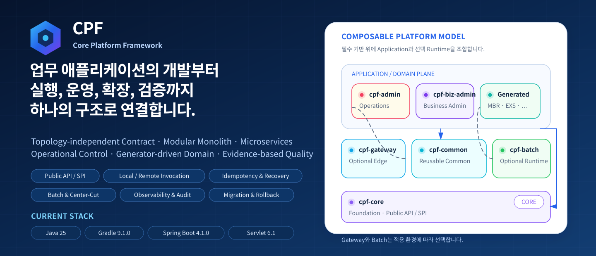

# Core Platform Framework

업무 시스템의 개발, 실행, 운영과 확장을 하나의 구조로 연결합니다.

온라인 처리, 배치, 외부 연계, 보안, 감사, 복구와 배포에 필요한 공통 계약과 실행 기반을 제공합니다.

<br/>

[개발자 안내](cpf-docs/guides/CPF_DEVELOPER_GUIDE.md)
· [운영자 안내](cpf-docs/guides/CPF_ADMIN_OPERATOR_GUIDE.md)
· [업무 관리자 안내](cpf-docs/guides/CPF_BIZ_ADMIN_GUIDE.md)
· [Generator 안내](cpf-docs/guides/CPF_GENERATOR_TOOL_GUIDE.md)
· [DB 도구 안내](cpf-docs/guides/CPF_DATABASE_TOOL_GUIDE.md)
· [도구 옵션 참고](cpf-docs/guides/CPF_TOOL_REFERENCE.md)

</div>

<br/>

---

<br/>

## CPF를 한눈에 보기

CPF는 공통 Library 하나를 제공하는 구조에 머물지 않습니다.

업무 요청이 들어오는 지점부터 업무 Domain의 실행, 다른 Domain 또는 외부 시스템과의 연계, 비동기 처리, 배치와 대량 처리, 운영 조회와 제어, 장애 복구, DB 변경과 배포, 신규 Domain 확장까지 서로 연결된 기준을 제공합니다.

<br/>

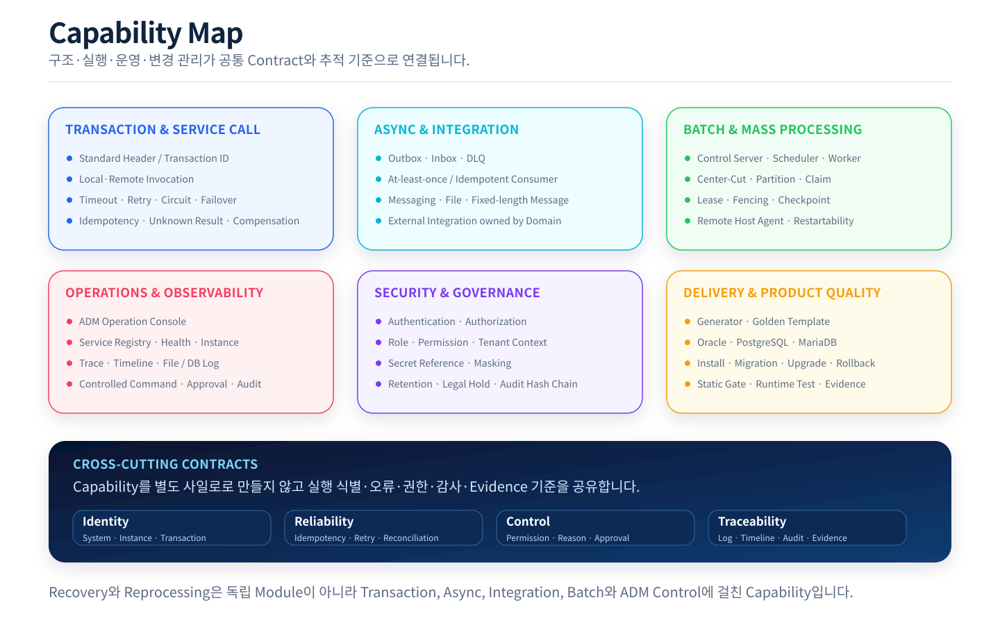

<br/>

위 그림은 CPF가 다루는 영역을 기능 관점에서 묶은 것입니다. 각 기능은 독립된 목록으로 끝나는 것이 아니라 Header, 거래 식별자, 권한, 감사, 오류, 재처리와 Evidence 기준을 공유하도록 구성합니다.

<br/>

### 핵심 기능 요약

| 적용 구조 | 신뢰성과 복구 |
| --- | --- |
| MSA와 Modular Monolith를 같은 Module 원칙으로 구성합니다. | Timeout이나 부분 실패 뒤 결과를 즉시 확정할 수 없으면 `UNKNOWN_RESULT`로 보존합니다. |
| 동일 JVM과 분리 WAS 환경에서 같은 업무 Public Contract를 사용합니다. | Idempotency, Retry, Reconciliation과 Compensation을 실행 흐름에 연결합니다. |
| Generated Domain은 `DomainName + SystemCode` 기준으로 확장합니다. | Runtime Instance는 Identity와 Health 상태를 가지며 Registry에서 종합합니다. |
| Public API·SPI와 내부 구현의 경계를 분리합니다. | Lease와 Fencing을 사용해 중복 실행과 이전 Owner의 재진입을 제한합니다. |

<br/>

| 보안과 거버넌스 | 운영과 변경 관리 |
| --- | --- |
| Authentication, Authorization, Masking, Approval과 Audit을 역할별로 연결합니다. | Service, Instance, Batch와 실행 이력을 조회하고 제어합니다. |
| Secret은 참조와 메타데이터 중심으로 다루고 원문 노출을 제한합니다. | 운영 명령은 대상 확인, 권한, 결과와 감사 이력으로 연결됩니다. |
| 조직, 사용자, Role, Permission과 결재 흐름을 업무 관리자 기능과 연결합니다. | Install, Migration, Upgrade, Rollback, Backup, Restore와 DR 절차를 구분합니다. |
| 감사 데이터와 운영 데이터의 책임과 Transaction 경계를 구분합니다. | 검증 결과와 실행 근거는 현재 Source와 연결해 관리합니다. |

<br/>

---

<br/>

## 사용자 관점에서 무엇을 할 수 있나

README를 처음 보는 개발자, 운영자와 아키텍트가 CPF의 범위를 빠르게 파악할 수 있도록 대표 상황을 기능과 연결하면 다음과 같습니다.

<br/>

| 상황 | CPF에서 연결되는 기능 |
| --- | --- |
| 같은 JVM 안에서 다른 업무 기능을 호출해야 한다. | Local Adapter와 업무 Public Contract를 사용합니다. |
| 분리된 WAS의 다른 업무 Domain을 호출해야 한다. | 같은 Public Contract를 Remote Adapter와 Service Call 구조로 연결합니다. |
| 호출 대상 Instance 중 하나가 비정상이다. | Service Registry, Instance Health와 Circuit 상태를 기준으로 대상 선택과 장애 판단을 연결합니다. |
| 요청이 Timeout 되었는데 상대 시스템에서 처리됐는지 모르겠다. | 결과를 임의로 실패 처리하지 않고 `UNKNOWN_RESULT`로 보존해 Reconciliation 대상으로 연결합니다. |
| 동일 요청이 다시 들어올 수 있다. | Idempotency Key와 처리 이력을 사용해 중복 실행을 제한합니다. |
| 비동기 메시지가 중복되거나 실패할 수 있다. | Outbox, Inbox, DLQ, Retry와 Replay 흐름을 사용합니다. |
| 대량 데이터를 여러 실행기로 나눠 처리해야 한다. | Center-Cut 대상, Partition, Claim, Lease, Runner와 Checkpoint 흐름을 사용합니다. |
| Worker가 중간에 죽거나 이전 Owner가 다시 실행될 수 있다. | Lease와 Fencing 기준으로 실행 소유권을 구분합니다. |
| 운영자가 여러 WAS의 상태를 보고 싶다. | Instance Identity, Liveness, Readiness와 Service Registry 상태를 `cpf-admin`에서 연결해 조회합니다. |
| 장애 거래의 어느 구간에서 실패했는지 보고 싶다. | transactionId, 실행 Segment, Timeline, Log와 Audit을 연결합니다. |
| DLQ나 결과 불명 거래를 다시 처리해야 한다. | Recovery, Replay, Reconciliation과 운영 Command 흐름으로 연결합니다. |
| 운영자가 위험한 상태 변경을 수행한다. | 대상 확인, 권한, 필요 시 승인, 실행 결과와 감사 이력을 연결합니다. |
| 업무 관리자 Role을 여러 개 부여해야 한다. | BZA의 User Role 이력, Primary Role, Permission과 유효기간 기준을 사용합니다. |
| 결재 요청자가 Body 값을 조작하면 안 된다. | 인증된 Operator와 Employee Mapping을 기준으로 요청자를 결정합니다. |
| 조직·직원·직책·직무를 업무 관리자 화면에서 관리해야 한다. | BZA Directory와 Assignment 구조를 사용합니다. |
| 첨부 파일을 바로 다운로드시키면 안 된다. | Scan 상태와 격리 상태를 기준으로 다운로드 가능 여부를 통제합니다. |
| 업무 알림과 읽음 상태가 필요하다. | BZA Notification 조회와 읽음 처리를 사용합니다. |
| 감사 데이터가 사후에 변경되지 않았는지 확인하고 싶다. | BZA Audit Hash Chain 검증 구조를 사용합니다. |
| Secret 값을 운영 화면에 그대로 보여주고 싶지 않다. | Secret Reference, Metadata와 Provider 경계를 사용합니다. |
| 오래된 운영 로그를 보존하거나 제거해야 한다. | Retention Policy, Legal Hold, Archive와 Purge 흐름을 사용합니다. |
| 새로운 업무 Domain을 표준 구조로 추가해야 한다. | Generator에 `DomainName + SystemCode`를 입력해 Module, Package, Config와 DB 충돌을 검사하고 생성합니다. |
| DB를 처음 설치하거나 버전을 올려야 한다. | Vendor별 Canonical Source, Install, Migration, Upgrade와 Rollback 구조를 사용합니다. |
| 장애 복구를 위해 DB Backup과 Restore를 수행해야 한다. | Backup Manifest, SHA-256 확인, Restore와 DR 검증 절차를 사용합니다. |
| 공통 코드·메시지·응답 코드가 설치 환경마다 달라지면 안 된다. | Default Metadata Catalog와 Product Seed 검증을 사용합니다. |

<br/>

---

<br/>

## 제품 개요

**Core Platform Framework(CPF)**는 업무 시스템의 개발, 실행, 운영과 확장을 하나의 구조로 연결하는 Framework입니다.

온라인 거래, 도메인 간 호출, 배치와 대량 처리, 외부 시스템 연계, 파일과 전문, 메시징, 보안, 감사, 운영 관제, 장애 복구, 설치와 변경 관리에 필요한 공통 계약과 실행 기반을 다룹니다.

배치 형태가 달라져도 업무 Public Contract, Header, 오류 기준, 권한과 추적 기준을 가능한 한 같은 구조로 유지하는 것을 기본 원칙으로 합니다.

기능의 존재만으로 완료를 판단하지 않습니다. Source, API, SQL, Migration, Test, Runtime 결과와 Evidence가 같은 기준을 가리키도록 관리합니다.

<br/>

### Module 유형을 먼저 이해하기

CPF의 Module은 **필수 Module**, **선택 Module**, **생성형 업무 Module**로 구분합니다.

이 구분은 단순한 설치 편의가 아니라 **제품 책임과 확장 방식의 차이**를 나타냅니다.

| 유형 | 의미 | 적용 기준 |
| --- | --- | --- |
| **필수 Module** | CPF의 공통 실행 계약과 운영 기준선을 구성하는 Platform Module입니다. | CPF를 구성할 때 기본 기준으로 유지합니다. 배포 토폴로지에 따라 Process는 분리할 수 있지만 제품 책임 자체를 Generated Domain으로 대체하지 않습니다. |
| **선택 Module** | CPF가 공식 제공하지만 모든 적용 환경에서 반드시 사용할 필요는 없는 기능 Module입니다. | Gateway, Batch, 업무 관리자, 참조 기능처럼 적용 환경의 요구에 따라 선택합니다. 선택형이라고 해서 Sample이나 임시 구현을 의미하지 않습니다. |
| **생성형 업무 Module** | 업무 Domain별로 Generator 표준을 따라 생성·확장하는 Module입니다. | 필요한 업무 Domain만 선택해 사용합니다. `MBR`, `ACC`, `EXS`도 이 범주이며 Platform 필수 Domain이 아닙니다. |

<br/>

> **중요**
>
> `cpf-member(MBR)`와 `cpf-account(ACC)`는 Repository에 포함되어 있어도 **필수 Platform Module이 아니라 생성형 업무 Domain**입니다.  
> `EXS` 역시 고정 Module이 아니며 외부 연계 업무 Domain이 필요할 때 Generator로 생성합니다.  
> 신규 업무도 `PAY`, `INS`, `CRM`처럼 같은 Generator 정책과 Golden Domain 구조를 사용합니다.

<br/>

### Module 구성

| Module | 코드 | 유형 | 역할 |
| --- | --- | --- | --- |
| `cpf-core` | `CPF` | **필수** | 기술 공통 Contract, Runtime 기반, Public API·SPI |
| `cpf-common` | `CMN` | **필수** | 여러 업무 Domain이 공유하는 정책과 확장 구현 |
| `cpf-admin` | `ADM` | **필수** | 플랫폼 운영, 관제, 보안, 감사와 제어 |
| `cpf-gateway` | `GWY` | **선택** | 외부 진입, Routing, 인증 연계와 장애 격리 |
| `cpf-biz-admin` | `BZA` | **선택** | 업무 관리자 기능과 업무 운영 흐름 |
| `cpf-batch` | `BAT` | **선택** | Batch, Scheduler, Worker와 `Center-Cut Runner` Runtime |
| `cpf-reference` | `REF` | **선택** | 참조 구현과 EDU |
| `cpf-member` | `MBR` | **생성형** | 회원 업무 Domain |
| `cpf-account` | `ACC` | **생성형** | 계좌 업무 Domain |
| `external / EXS` | `EXS` | **생성형** | 필요할 때 Generator로 생성하는 외부 연계 업무 Domain |
| `cpf-<domain>` | 각 Domain 코드 | **생성형** | Generator로 생성하는 신규 업무 Domain |

<br/>

생성형 업무 Module은 필요한 Domain만 선택하여 사용할 수 있습니다.

`cpf-tools/generator/create-domain.ps1`가 Module, Package, SystemCode, Config, Route, SQL과 DB 충돌을 사전 검증하고 같은 표준 구조를 생성하는 기준 경로입니다.

`EXS`도 다른 생성형 Domain과 동일하게 취급하며, EXS 전용 업무 Table을 Platform 기본 설치의 고정 소유물로 두지 않습니다.

<br/>

---

<br/>

## 설계 원칙

### 책임 경계를 분명하게 둡니다.

Owner Module, Public API·SPI, 내부 구현과 운영 책임을 구분합니다.

다른 Module이 Owner의 내부 Package나 DB를 직접 우회하지 않는 구조를 기본으로 합니다.

<br/>

### 실행 토폴로지가 달라도 같은 계약을 유지합니다.

동일 JVM과 분리 WAS 환경에서 업무 Public Contract, Header, 오류와 추적 기준을 가능한 한 동일하게 유지합니다.

외부 Client와 Channel은 Gateway 경계를 사용할 수 있지만 내부 업무 Domain 간 호출을 불필요하게 Gateway로 다시 보내지 않습니다.

<br/>

### 실패와 복구를 실행 흐름의 일부로 다룹니다.

Timeout, 부분 실패, 중복 요청, 장애 복구와 결과 불명 상태를 사후 처리로만 남기지 않습니다.

실행 결과가 확정되지 않은 경우에는 상태를 보존하고 대사, 재처리 또는 보상으로 연결합니다.

<br/>

### 운영 기능도 Owner 경계를 따릅니다.

`cpf-admin`은 상태 조회와 운영 명령을 연결하지만 Owner가 소유한 데이터와 상태 변경 책임을 대체하지 않습니다.

운영 기능 자체의 실패가 원 업무 Transaction을 불필요하게 오염시키지 않도록 책임과 Transaction 경계를 분리합니다.

<br/>

### 확장은 하나의 표준 구조를 사용합니다.

Generated Domain은 DomainName, SystemCode, Module, Package, Config와 DB 규칙을 같은 Generator 정책으로 확장합니다.

Generator가 관리하는 영역과 업무 개발자가 수정하는 영역을 구분해 재생성 과정에서 사용자 코드를 임의로 덮어쓰지 않는 것을 기본 원칙으로 합니다.

<br/>

### 검증 근거를 실행 결과와 연결합니다.

Requirement에서 Source, API, SQL, Test, Runtime과 Evidence까지 이어지는 추적 구조를 유지합니다.

직접 실행하지 않은 검증을 성공으로 간주하지 않습니다.

<br/>

---

<br/>

## CPF 전체 Architecture

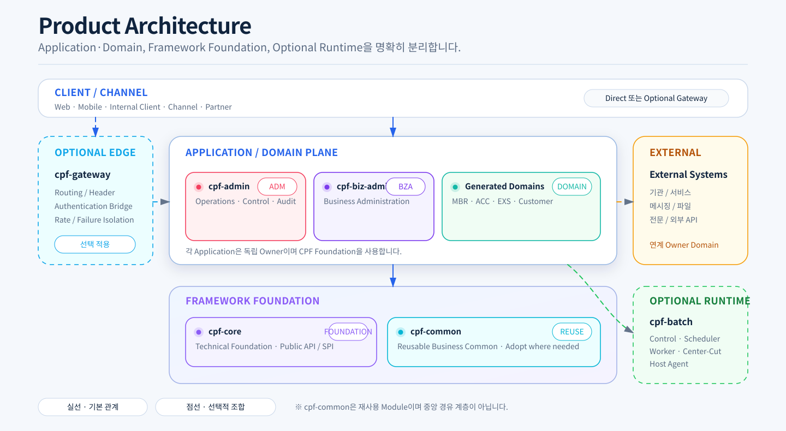

<br/>

외부 채널에서 `cpf-gateway`를 거쳐 업무 Domain으로 진입하고, `cpf-common`과 `cpf-core`가 공통 정책과 실행 기반을 제공합니다. 여기서 `cpf-member(MBR)`, `cpf-account(ACC)`, `EXS`와 신규 업무 Module은 모두 Generated Domain 계열이며 필요한 Domain만 선택해 구성합니다.

같은 구조 안에서 `cpf-batch`, `cpf-admin`, `cpf-biz-admin`, 외부 시스템 연계와 복구 흐름이 연결됩니다.

<br/>

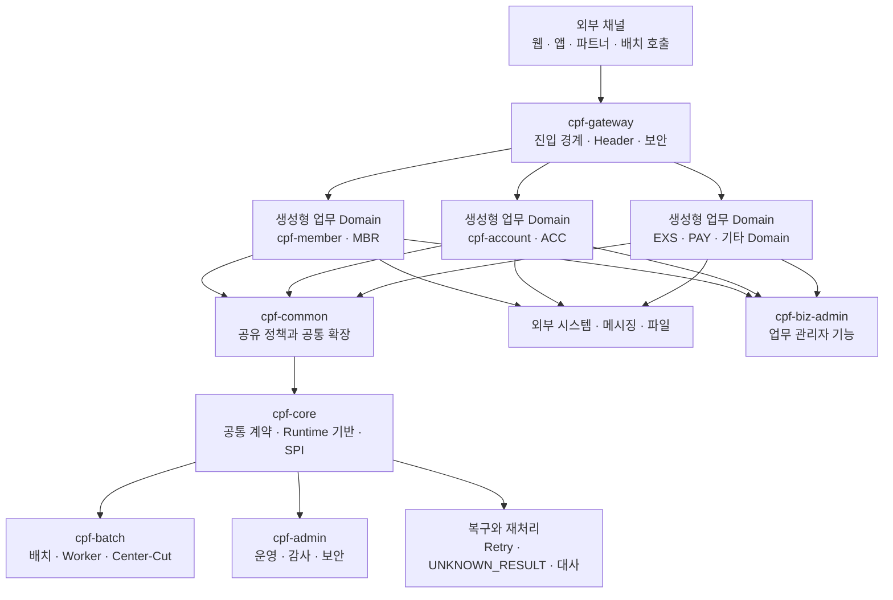
```mermaid
flowchart TD
    C[외부 채널<br/>웹 · 앱 · 파트너 · 배치 호출] --> G[cpf-gateway<br/>진입 경계 · Header · 보안]
    G --> D1[생성형 업무 Domain<br/>cpf-member · MBR]
    G --> D2[생성형 업무 Domain<br/>cpf-account · ACC]
    G --> D3[생성형 업무 Domain<br/>EXS · PAY · 기타 Domain]

    D1 --> CM[cpf-common<br/>공유 정책과 공통 확장]
    D2 --> CM
    D3 --> CM
    CM --> CORE[cpf-core<br/>공통 계약 · Runtime 기반 · SPI]

    D1 --> EXT[외부 시스템 · 메시징 · 파일]
    D2 --> EXT
    D3 --> EXT

    CORE --> BAT[cpf-batch<br/>배치 · Worker · Center-Cut]
    CORE --> ADM[cpf-admin<br/>운영 · 감사 · 보안]
    D1 --> BZA[cpf-biz-admin<br/>업무 관리자 기능]
    D2 --> BZA
    D3 --> BZA
    CORE --> REC[복구와 재처리<br/>Retry · UNKNOWN_RESULT · 대사]
```

<br/>

---

<br/>

## Module 책임과 의존성

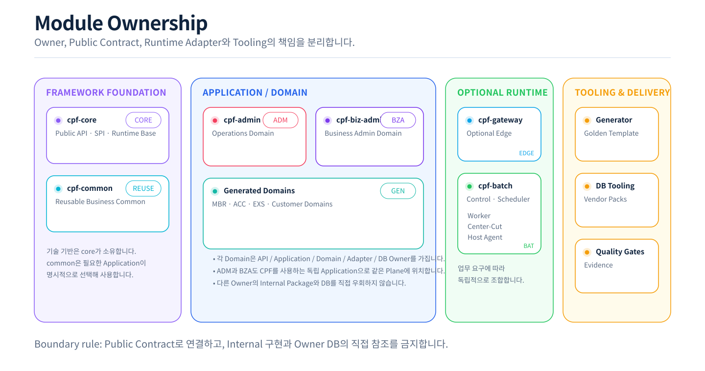

<br/>

업무 Domain은 자신의 업무 데이터와 규칙을 소유합니다.

`cpf-common`은 여러 업무 Domain이 공유하는 정책과 확장 구현을, `cpf-core`는 공통 계약과 Runtime 기반을 소유합니다.

`cpf-gateway`, `cpf-batch`, `cpf-admin`, `cpf-biz-admin`은 각자의 역할에 맞는 Query·Command·Runtime 계약을 사용합니다.

<br/>

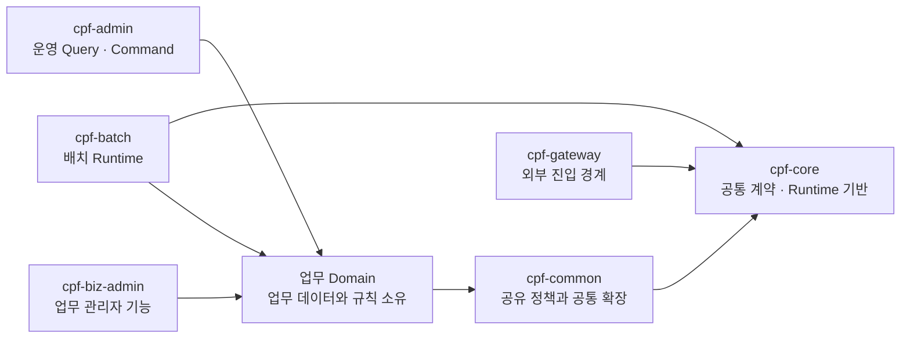
```mermaid
flowchart LR
    DOMAIN[업무 Domain<br/>업무 데이터와 규칙 소유] --> CMN[cpf-common<br/>공유 정책과 공통 확장]
    CMN --> CORE[cpf-core<br/>공통 계약 · Runtime 기반]
    GW[cpf-gateway<br/>외부 진입 경계] --> CORE
    BAT[cpf-batch<br/>배치 Runtime] --> CORE
    BAT --> DOMAIN
    ADM[cpf-admin<br/>운영 Query · Command] --> DOMAIN
    BZA[cpf-biz-admin<br/>업무 관리자 기능] --> DOMAIN
```

<br/>

### 금지 관계

- `cpf-core`가 특정 업무 Domain에 역방향으로 의존하지 않습니다.
- `cpf-admin`이 Owner DB를 직접 수정하지 않습니다.
- 업무 Domain 간 DB 직접 접근을 사용하지 않습니다.
- 내부 Domain 호출이 `cpf-gateway`를 의무적으로 재경유하지 않습니다.
- Module 간 순환 의존을 만들지 않습니다.

<br/>

---

<br/>

## Runtime과 배포 구조

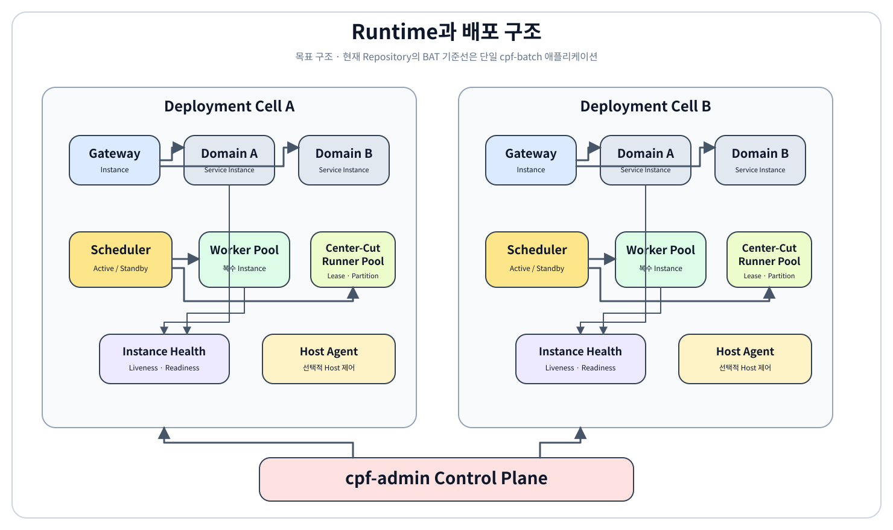

<br/>

아래 구조는 **목표 구조**입니다.

복수의 Deployment Cell 안에 Runtime Service, Worker Pool, `Center-Cut Runner` Pool, Scheduler Active/Standby, 선택적 Host Agent를 두고 `cpf-admin` Control Plane이 여러 Cell의 상태와 운영 명령을 연결합니다.

<br/>

> **현재 기준선**  
> 현재 Repository는 단일 `cpf-batch` 애플리케이션을 기준으로 구성되어 있습니다. 역할별 독립 Artifact는 목표 Runtime 구조에서 분리합니다.

<br/>

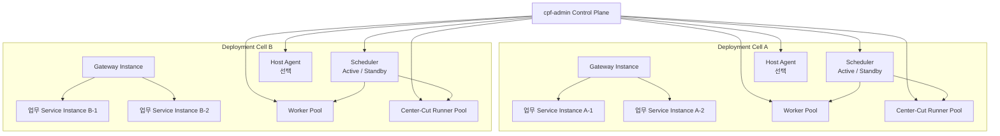
```mermaid
flowchart TB
    ADM[cpf-admin Control Plane]

    subgraph CELLA[Deployment Cell A]
        GA[Gateway Instance]
        DA1[업무 Service Instance A-1]
        DA2[업무 Service Instance A-2]
        SA[Scheduler<br/>Active / Standby]
        WA[Worker Pool]
        CA[Center-Cut Runner Pool]
        HA[Host Agent<br/>선택]
    end

    subgraph CELLB[Deployment Cell B]
        GB[Gateway Instance]
        DB1[업무 Service Instance B-1]
        DB2[업무 Service Instance B-2]
        SB[Scheduler<br/>Active / Standby]
        WB[Worker Pool]
        CB[Center-Cut Runner Pool]
        HB[Host Agent<br/>선택]
    end

    ADM --> SA
    ADM --> WA
    ADM --> CA
    ADM --> HA
    ADM --> SB
    ADM --> WB
    ADM --> CB
    ADM --> HB

    GA --> DA1
    GA --> DA2
    GB --> DB1
    GB --> DB2

    SA --> WA
    SA --> CA
    SB --> WB
    SB --> CB
```

<br/>

### Instance Health와 Registry

각 Runtime Instance는 자신의 Liveness와 Readiness를 판단합니다.

Readiness는 모든 원격 Service를 무차별적으로 호출하는 방식이 아니라 해당 Instance가 정상 처리에 필요한 로컬 필수 의존성을 중심으로 판단합니다. 여러 Instance의 상태는 Service Registry와 운영 화면에서 종합합니다.

운영자가 Instance를 구분할 수 있도록 Module, WAS, Server Instance, Host, Process와 Profile 같은 Identity를 연결할 수 있습니다.

<br/>

---

<br/>

## 온라인 거래와 Service Call

CPF의 온라인 흐름은 Controller 호출 하나에만 초점을 두지 않습니다.

요청 식별, Header 신뢰 경계, 업무 Public Contract, Local/Remote 호출, Retry, Circuit Breaker, Idempotency와 결과 불명 복구를 하나의 실행 흐름으로 연결합니다.

<br/>

### 기본 흐름

```text
외부 또는 내부 요청
→ 표준 Header와 transactionId 확인
→ 업무 Public Contract 호출
→ Local 또는 Remote Adapter 선택
→ Timeout / Retry / Circuit 정책 적용
→ 결과 확정
→ Log / Audit / Trace 연결
```

표준 Header `X-Transaction-Id`의 `transactionId`는 `cpf-core`가 생성·검증하는 정확히 34자리의 전역 거래 식별자입니다.
Local/Remote/Async/Batch 구간에서 새 값으로 바꾸지 않고 동일 값을 Header, Log, Audit과 Timeline에 전파합니다.

<br/>

### Local과 Remote

동일 업무 Contract를 같은 JVM 안에서는 Local Adapter로, 분리된 WAS에서는 Remote Adapter로 연결할 수 있습니다.

Topology가 바뀌었다는 이유로 업무 DTO, 오류 기준과 추적 규칙이 별도 규격으로 갈라지지 않도록 하는 것이 기본 방향입니다.

<br/>

### Retry와 Idempotency

Retry는 단순히 모든 오류를 다시 호출하는 기능이 아닙니다.

Validation 오류나 재실행하면 안 되는 요청과, 일시적인 연결 실패처럼 재시도할 수 있는 오류를 구분해야 합니다. 상태 변경 요청은 Idempotency와 함께 설계해 Timeout 뒤 재호출이 중복 원장 변경으로 이어지지 않도록 합니다.

<br/>

### 결과를 알 수 없는 거래

```text
요청 전송
→ 상대 처리 가능성 존재
→ 응답 전에 Timeout 또는 연결 단절
→ 성공/실패 즉시 확정 불가
→ UNKNOWN_RESULT
→ Owner 또는 외부 시스템 결과 대사
→ 재처리 / 보상 / 최종 확정
```

`UNKNOWN_RESULT`는 일반 `FAILED`와 구분합니다. 복구 기록을 남기지 못한 상태에서 단순히 결과 불명 응답만 반환하는 구조를 목표로 하지 않습니다.

<br/>

---

<br/>

## 비동기, 메시징과 외부 연계

CPF는 동기 HTTP 호출 외에도 메시징, 파일, 전문과 비동기 처리 흐름을 같은 운영 기준으로 연결합니다.

<br/>

### 비동기 처리

- Outbox를 사용해 업무 Transaction과 메시지 발행 경계를 관리할 수 있습니다.
- Inbox를 사용해 Consumer의 중복 수신을 제어할 수 있습니다.
- DLQ에 실패 메시지를 분리하고 운영자가 원인을 확인한 뒤 재처리할 수 있습니다.
- Retry와 Replay는 원 요청의 식별자와 처리 이력을 잃지 않도록 연결합니다.
- 성공 여부를 확정하기 어려운 외부 연계는 Reconciliation 대상으로 연결합니다.

<br/>

### 파일과 전문

- File 전송과 수신의 실행 결과를 거래 식별자와 연결합니다.
- Fixed-Length 전문의 Layout과 변환 경계를 Framework 계약으로 둘 수 있습니다.
- SFTP 같은 외부 File 전송 Adapter를 연결할 수 있습니다.
- Attachment는 Scan 상태와 격리 상태를 기준으로 사용 가능 여부를 구분합니다.
- 파일이나 전문 처리 실패도 단순 로그 한 줄이 아니라 재처리와 운영 조회의 대상이 될 수 있도록 설계합니다.

<br/>

---

<br/>

## Batch와 대량 처리

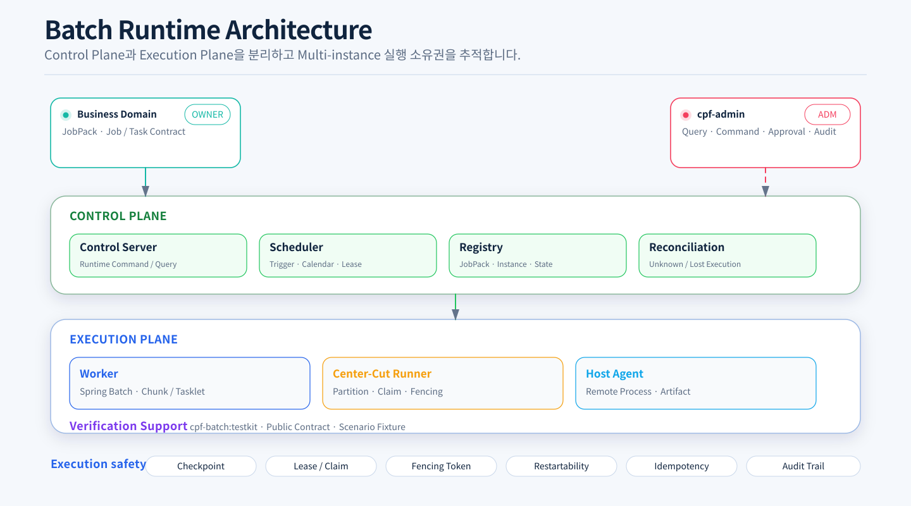

<br/>

`cpf-batch`는 Batch 실행, Scheduler, Worker, `Center-Cut Runner`, Checkpoint, 재처리와 운영 관제를 연결하는 Runtime Owner입니다.

<br/>

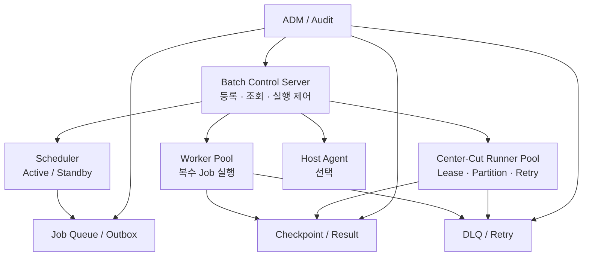
```mermaid
flowchart TB
    CTRL[Batch Control Server<br/>등록 · 조회 · 실행 제어]
    SCH[Scheduler<br/>Active / Standby]
    WK[Worker Pool<br/>복수 Job 실행]
    CC[Center-Cut Runner Pool<br/>Lease · Partition · Retry]
    AGT[Host Agent<br/>선택]
    Q[Job Queue / Outbox]
    CK[Checkpoint / Result]
    DLQ[DLQ / Retry]
    OPR[ADM / Audit]

    CTRL --> SCH
    CTRL --> WK
    CTRL --> CC
    CTRL --> AGT
    SCH --> Q
    WK --> CK
    WK --> DLQ
    CC --> CK
    CC --> DLQ
    OPR --> CTRL
    OPR --> Q
    OPR --> CK
    OPR --> DLQ
```

<br/>

### 일반 Batch

Batch Job은 Job 정의, 실행 Instance, 실행 이력, Step 상태와 운영 로그를 분리해 조회할 수 있도록 구성합니다.

다중 인스턴스 환경에서는 단순 Boolean Lock보다 Owner와 Lease를 명확히 하고, 이전 Owner가 뒤늦게 돌아와 쓰기를 계속하는 상황을 제한하기 위해 Fencing 개념을 사용합니다.

<br/>

### Center-Cut

```text
대상 생성
→ Partition
→ Claim
→ Lease
→ Center-Cut Runner 처리
→ Checkpoint / Result 기록
→ 부분 실패 집계
→ 실패 건 재처리
```

대량 대상 자체의 업무 데이터는 Owner Domain 또는 BAT 기본 구현이 소유하고, `cpf-core`는 공통 계약과 상태 기준을 담당하는 구조를 사용합니다.

<br/>

### Retention

Batch Operation Log를 대상으로 Retention API·SPI와 Archive/Purge 기본 구현을 연결할 수 있습니다.

파괴적 실행은 Preview, Cutoff, Legal Hold와 실행 허용 설정을 구분해 안전장치 없이 바로 삭제되지 않도록 구성합니다.

<br/>

---

<br/>

## 운영과 관제

`cpf-admin`은 단순 조회 화면이 아니라 실행 상태를 이해하고 필요한 조치를 Owner 기능으로 연결하는 Control Plane 역할을 담당합니다.

<br/>

### 거래와 로그

운영자는 다음 정보를 연결해 장애 구간을 추적할 수 있습니다.

- transactionId
- Module과 Runtime Instance
- 호출 Segment와 Timeline
- 처리 시작·종료 시각
- 상태와 소요 시간
- 실패 구간과 오류 정보
- 파일 로그와 DB 로그
- Audit과 운영 Command 결과

<br/>

### Service Registry와 Health

Service, Endpoint와 Instance의 등록 상태를 조회하고 Instance별 Health와 Routing 상태를 함께 볼 수 있도록 구성합니다.

한 Instance의 장애를 전체 Service 장애와 같은 의미로 취급하지 않고 복수 Instance 상태를 종합합니다.

<br/>

### 회원 운영

`cpf-admin`은 MBR Owner의 Public Operations를 통해 회원 목록과 상세 정보를 조회합니다.

Owner DB를 ADM이 직접 조회하는 구조를 사용하지 않으며, 대량 목록은 DB 기반 Paging Contract로 연결합니다.

<br/>

### Secret 운영

Secret 원문을 운영 API의 일반 조회 결과로 노출하지 않고 Provider, Reference와 Metadata 중심으로 조회합니다.

Rotation이 가능한 Provider는 별도 확장 Contract로 연결할 수 있습니다.

> **확장 경계**  
> 기본 구조는 Secret Provider API·SPI와 Environment 기반 Provider를 포함합니다. Vault, KMS 또는 HSM 같은 외부 Secret Backend는 적용 환경에 맞는 Provider Adapter로 연결합니다.

<br/>

### 복구와 위험 운영 명령

운영 명령은 다음 흐름을 기본으로 합니다.

```text
대상 조회
→ 현재 상태 확인
→ 영향 범위 확인
→ 권한 확인
→ 필요 시 승인
→ Owner Command 실행
→ 결과 확인
→ Audit / Evidence
```

<br/>

---

<br/>

## 업무 관리자 기능

`cpf-biz-admin`은 플랫폼 자체 운영과 구분되는 업무 관리자 기능을 담당합니다.

사용자와 조직, Role과 Permission, 업무 결재, Attachment, Notification과 Audit을 각각의 책임으로 분리하면서 하나의 운영 흐름으로 연결합니다.

<br/>

### 사용자와 Role

- 관리자 User의 상태와 잠금 여부를 관리합니다.
- User Role은 이력 기반으로 부여하고 유효기간을 적용할 수 있습니다.
- Primary Role 변경 시 동시 변경을 고려한 직렬화 경계를 둡니다.
- 동일 Operation ID로 같은 요청이 반복될 경우 멱등 결과를 반환할 수 있습니다.
- Role 이력이 존재하는 사용자의 만료·회수 Role을 Legacy Role 값으로 되살리지 않도록 구분합니다.

<br/>

### Permission

Menu, Button과 API Permission을 구분합니다.

Environment 조건을 Permission 계산에 적용할 수 있고, 화면에서 보이는 권한과 Backend에서 실제 허용하는 권한이 같은 정책을 사용하도록 하는 방향을 따릅니다.

<br/>

### 조직과 직원

- Organization
- Employee
- Position
- Job Title
- Assignment
- Organization Responsibility

위 정보를 분리해 관리하고 Assignment를 통해 직원의 조직·직책·직무와 유효기간을 연결합니다.

조직 구조 변경 시 순환 참조가 만들어지지 않도록 검증합니다.

<br/>

### 결재

결재 요청자는 Request Body의 임의 문자열을 신뢰하지 않고 인증된 Operator와 Employee Mapping을 기준으로 결정합니다.

사용 중인 Approval Policy Version은 변경하지 않고 새 Version을 생성하는 방식으로 이력을 보존합니다.

Legacy 상태 변경 경로는 신규 Approval Engine을 우회하지 못하도록 차단하는 방향을 사용합니다.

<br/>

### Attachment

Attachment는 `PENDING`, `CLEAN`, `INFECTED`, `FAILED`, `QUARANTINED` 같은 Scan 상태를 구분합니다.

정상 Scan을 통과한 파일과 격리되지 않은 파일만 다운로드 대상으로 처리할 수 있도록 합니다.

Data Classification과 보존 기한도 함께 관리할 수 있습니다.

<br/>

### Notification

업무 알림 목록, 미읽음 조회, 개별 읽음과 일괄 읽음을 지원하는 구조를 사용합니다.

Reference 정보를 통해 알림에서 관련 업무 화면으로 연결할 수 있습니다.

<br/>

### Audit Hash Chain

BZA 업무 Audit은 Canonical JSON과 SHA-256 기반 Record Chain으로 연결할 수 있습니다.

다중 인스턴스 Writer가 동시에 Chain을 기록할 때 DB Lock Row를 사용해 순서를 직렬화하고, Chain 검증 시 중간 변조뿐 아니라 최종 Head와의 불일치도 확인할 수 있습니다.

<br/>

---

<br/>

## 보안과 거버넌스

보안은 인증 기능 하나로 끝내지 않고 권한, 민감정보, 운영 행위와 Audit을 함께 봅니다.

<br/>

### 주요 범위

- Authentication과 Session
- Role과 Permission
- Password 정책 확장 경계
- Masking과 Data Classification
- Secret Reference와 Rotation
- 결재와 Delegation
- 민감 Download 통제
- Audit과 보존 정책
- Tenant Context 확장 경계

<br/>

### Tenant 경계

`cpf-core`에는 선택적으로 활성화할 수 있는 Tenant Context와 Resolver SPI가 있습니다.

Tenant 사용이 활성화됐는데 Resolver가 없거나 Tenant 식별에 실패한 요청을 정상 업무 요청으로 계속 처리하지 않도록 경계를 둘 수 있습니다.

> **확장 경계**  
> Tenant Context는 업무 실행 경계를 제공하는 기반입니다. 실제 Row-Level 또는 Schema-Level 데이터 격리는 각 저장소와 업무 Domain의 Tenant 정책까지 함께 적용해야 합니다.

<br/>

---

<br/>

## DB, Migration과 변경 관리

CPF의 DB Artifact는 Vendor별 Canonical Source와 Runtime Lifecycle Pack이 서로 다른 정본으로 갈라지지 않도록 관리합니다.

<br/>

### Canonical Source

MariaDB 기준 Canonical Source는 다음과 같은 역할을 구분합니다.

- Schema
- Product Seed
- Optional Sample Seed
- Test Seed
- Verify
- Migration
- Rollback

Generated bundle은 Canonical Source를 기준으로 생성하고 byte-level parity를 확인할 수 있도록 관리합니다.

<br/>

### Metadata

기본 Metadata Catalog는 반복적으로 필요한 Code, Message, Response Code와 Config를 정의합니다.

예를 들어 다음과 같은 범주를 공통화할 수 있습니다.

- Y/N
- Module
- Request Type
- Channel Code
- Execution Status
- Async Status
- Batch Status
- Retry Status
- Idempotency Status
- Health Status
- Circuit State
- File Scan Status
- Data Classification
- Approval Status
- Retention Action

<br/>

### Migration과 Rollback

Migration은 Column이나 Table 존재 여부만 보고 조용히 통과시키는 것이 아니라 기존 Schema와 기대 Shape가 다른 Drift를 검출할 수 있어야 합니다.

Rollback이 이력이나 Archive 데이터를 잃을 수 있는 경우에는 조건 없이 DROP하는 대신 사전 조건으로 중단할 수 있도록 설계합니다.

<br/>

### Backup, Restore와 DR

DB Backup은 원본 데이터가 민감정보를 포함할 수 있다는 전제로 취급합니다.

Backup 결과에는 Hash Manifest를 함께 생성하고 Restore 시 Backup File, Vendor와 대상 DB 정보를 검증하는 흐름을 사용할 수 있습니다.

DR 검증은 격리 DB의 기본 연결/Schema 검증과 전체 Platform 검증을 구분할 수 있습니다.

<br/>

---

<br/>

## 업무 Domain 확장

<br/>

Generated Domain은 Platform 필수 Module과 구분됩니다.

- `cpf-member(MBR)` — 회원 업무 Domain
- `cpf-account(ACC)` — 계좌 업무 Domain
- `external / EXS` — 필요할 때 생성하는 외부 연계 업무 Domain
- `cpf-<domain>` — 적용 환경에서 추가하는 신규 업무 Domain

Repository에 `MBR`나 `ACC`가 존재한다는 이유만으로 모든 적용 환경에 설치해야 하는 것은 아닙니다. 필요한 업무 Domain을 선택하고, 신규 Domain은 동일한 Generator 규칙으로 확장합니다.


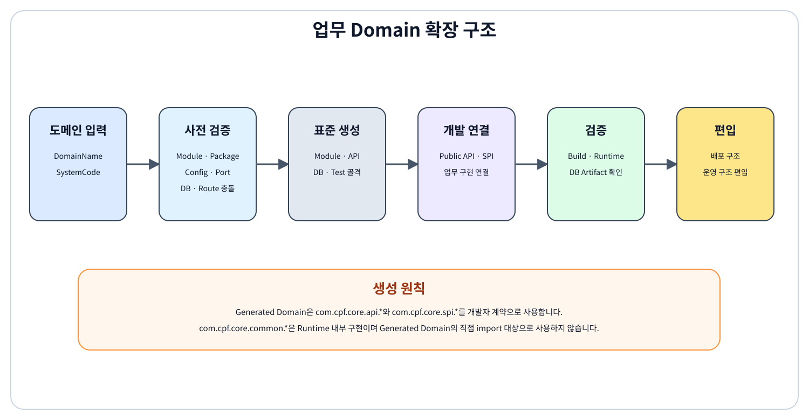

<br/>

Generated Domain은 `DomainName + SystemCode`를 기준으로 생성합니다.

SystemCode는 내부 식별에 사용하고 읽을 수 있는 DomainName은 Module과 문서에서 사용합니다.

<br/>

```text
DomainName + SystemCode
→ Module · Package · SystemCode · Config · Route · DB 충돌 검증
→ 표준 Module 생성
→ API · DB · Test 구성
→ Public API · SPI 연결
→ Build와 Runtime 검증
→ 배포와 운영 구조 편입
```

<br/>

Generated Domain은 `com.cpf.core.api.*`와 `com.cpf.core.spi.*`를 개발자 계약으로 사용합니다.

`com.cpf.core.common.*`은 Runtime 내부 구현이며 Generated Domain에서 직접 import하지 않습니다.

<br/>

### Generator가 확인해야 하는 것

- Module 이름 중복
- SystemCode 중복
- Package 중복
- Port 충돌
- DB 이름과 Schema 충돌
- Route 충돌
- 지원하지 않는 DB Vendor 선택
- 기존 사용자 수정 영역 덮어쓰기 가능성

<br/>

---

<br/>

## 공통 개발 API와 자료구조

Framework 공통 API는 업무 개발자가 매번 서로 다른 규칙을 만들지 않도록 반복되는 구조를 표준화합니다.

<br/>

### Paging

`CpfPageRequest`와 `CpfPage<T>`를 통해 DB 기반 Paging 결과를 공통 Contract로 전달할 수 있습니다.

화면에서 전체 데이터를 한 번에 받아 다시 자르는 Client Paging 대신 Owner DB Query와 Page Contract를 연결하는 방향을 사용합니다.

<br/>

### Secret

`CpfSecretReference`, `CpfSecretMetadata`, `CpfSecretValue`, `CpfSecretProvider`, `CpfRotatableSecretProvider`를 통해 Secret 원문과 Metadata, Provider 책임을 분리합니다.

`CpfSecretValue`는 사용 후 메모리 값을 지울 수 있는 경계를 제공하고 `toString()`에서 원문이 노출되지 않도록 설계합니다.

<br/>

### Retention

`CpfRetentionPolicy`, `CpfRetentionCommand`, `CpfRetentionResult`, `CpfRetentionOperations`와 Handler SPI를 통해 보존 대상별 실행 구현을 연결할 수 있습니다.

<br/>

### Tenant

`CpfTenantContext`와 `CpfTenantResolver`를 통해 Tenant 식별을 Runtime Context에 연결할 수 있습니다.

<br/>

---

<br/>

## 운영 추적 기준

온라인 처리, Local/Remote Service Call, 비동기, Batch와 Center-Cut은 가능한 한 동일한 실행 식별 체계로 연결합니다.

<br/>

```text
Request
→ transactionId
→ Local / Remote Segment
→ Runtime Instance
→ Log / Audit / Trace
→ Recovery 또는 Operation Command
```

<br/>

운영자는 파일 로그와 DB 로그의 저장 방식이 달라도 System, Instance, 거래와 실행 단위를 연계해 볼 수 있어야 합니다.

민감정보는 Log, Audit, Trace, Download와 Evidence에서 같은 기준으로 분류하고 마스킹해야 합니다.

<br/>

---

<br/>

## 현재 기준선과 목표 구조를 구분하는 항목

README에서는 현재 구현된 기반과 목표 Architecture를 같은 완료 상태처럼 표현하지 않습니다.

<br/>

| 영역 | 현재 기준선 | 목표 또는 적용 환경 확장 |
| --- | --- | --- |
| BAT Runtime | 단일 `cpf-batch` Application에서 Scheduler, Worker, Center-Cut 기능을 연결합니다. | Control Server, Scheduler, Worker, `Center-Cut Runner`, Host Agent를 역할별 독립 Artifact로 분리할 수 있는 구조 |
| Secret | Public API·SPI와 Environment 기반 Provider | Vault, KMS, HSM 등 적용 환경의 Secret Backend Adapter |
| Tenant | Tenant Context와 Resolver SPI | 업무 DB까지 포함한 Row/Schema 격리 정책 |
| DB Vendor | MariaDB Canonical Source를 기준으로 관리 | 추가 Vendor는 해당 Vendor SQL과 Runtime 검증을 완료한 뒤 지원 범위에 포함 |
| Runtime Topology | 동일 JVM과 분리 WAS Contract를 지원하는 구조 | 여러 Deployment Cell과 역할별 독립 Runtime을 포함한 배포 모델 |

<br/>

---

<br/>

## 빠른 시작

아래 명령은 Repository의 실제 Build와 Script 구성을 기준으로 적용 환경에 맞게 확인해 사용합니다.

<br/>

### 준비 조건

- JDK 25
- Git
- Gradle Wrapper
- MariaDB
- Node.js와 npm — `cpf-admin`, `cpf-biz-admin` Frontend 개발 시
- PowerShell 7 — DB, Generator와 운영 Tool 실행 시

<br/>

### 전체 Build

Linux/macOS:

```bash
./gradlew clean build
```

Windows:

```powershell
.\gradlew.bat clean build
```

<br/>

### Frontend 검증

```bash
cd cpf-admin/frontend
npm ci
npm run lint
npm run typecheck
npm run test
npm run build
```

같은 방식으로 `cpf-biz-admin/frontend`도 검증합니다.

<br/>

### 신규 Domain 생성 계획 확인

먼저 `DryRun`으로 충돌과 생성 계획을 확인합니다.

```powershell
pwsh -File .\cpf-tools\generator\create-domain.ps1 `
  -DomainName "payment" `
  -SystemCode "PAY" `
  -DatabaseVendor "mariadb" `
  -DryRun
```

Generator의 전체 옵션과 충돌 검증 기준은 [CPF_GENERATOR_TOOL_GUIDE.md](cpf-docs/guides/CPF_GENERATOR_TOOL_GUIDE.md)와 [CPF_TOOL_REFERENCE.md](cpf-docs/guides/CPF_TOOL_REFERENCE.md)를 확인합니다.

<br/>

### DB Tool

DB 설치, 초기화, Migration, Verify, Backup과 Restore는 [CPF_DATABASE_TOOL_GUIDE.md](cpf-docs/guides/CPF_DATABASE_TOOL_GUIDE.md)와 [CPF_TOOL_REFERENCE.md](cpf-docs/guides/CPF_TOOL_REFERENCE.md)의 현재 Script 옵션을 기준으로 실행합니다.

README에서 Tool 옵션 전체를 중복해서 복사하지 않고 실제 Tool Reference를 정본으로 연결합니다.

<br/>

---

<br/>

## 역할별 문서 안내

README는 전체 범위를 보여주는 시작 문서이고, 실제 개발·운영 절차와 Tool 옵션은 역할별 Guide에서 이어집니다.

<br/>

| 역할 또는 주제 | 문서 |
| --- | --- |
| 개발자 | [CPF_DEVELOPER_GUIDE.md](cpf-docs/guides/CPF_DEVELOPER_GUIDE.md) |
| Public API와 Generated Domain | [CPF_PUBLIC_API_AND_GENERATED_DOMAIN_GUIDE.md](cpf-docs/guides/CPF_PUBLIC_API_AND_GENERATED_DOMAIN_GUIDE.md) |
| Foundation API | [CPF_FOUNDATION_API_GUIDE.md](cpf-docs/guides/CPF_FOUNDATION_API_GUIDE.md) |
| Generator | [CPF_GENERATOR_TOOL_GUIDE.md](cpf-docs/guides/CPF_GENERATOR_TOOL_GUIDE.md) |
| 운영자 | [CPF_ADMIN_OPERATOR_GUIDE.md](cpf-docs/guides/CPF_ADMIN_OPERATOR_GUIDE.md) |
| 업무 관리자 | [CPF_BIZ_ADMIN_GUIDE.md](cpf-docs/guides/CPF_BIZ_ADMIN_GUIDE.md) |
| DB 도구 | [CPF_DATABASE_TOOL_GUIDE.md](cpf-docs/guides/CPF_DATABASE_TOOL_GUIDE.md) |
| Health와 Registry | [CPF_HEALTH_AND_SERVICE_REGISTRY_GUIDE.md](cpf-docs/guides/CPF_HEALTH_AND_SERVICE_REGISTRY_GUIDE.md) |
| 보안, DR와 Retention | [CPF_SECURITY_DR_RETENTION_GUIDE.md](cpf-docs/guides/CPF_SECURITY_DR_RETENTION_GUIDE.md) |
| Metadata, Code와 Message | [CPF_METADATA_CODE_MESSAGE_GUIDE.md](cpf-docs/guides/CPF_METADATA_CODE_MESSAGE_GUIDE.md) |
| 전체 Tool 개요 | [CPF_TOOLS_GUIDE.md](cpf-docs/guides/CPF_TOOLS_GUIDE.md) |
| Tool 옵션 상세 | [CPF_TOOL_REFERENCE.md](cpf-docs/guides/CPF_TOOL_REFERENCE.md) |
| EDU 범위 | [CPF_EDU_COVERAGE_GUIDE.md](cpf-docs/guides/CPF_EDU_COVERAGE_GUIDE.md) |
| DB Profile과 Domain DB | [DATABASE_PROFILE_AND_DOMAIN_DB_GUIDE.md](cpf-docs/guides/DATABASE_PROFILE_AND_DOMAIN_DB_GUIDE.md) |
| Generated Domain DB 규칙 | [GENERATED_DOMAIN_DB_ARTIFACT_POLICY.md](cpf-docs/guides/GENERATED_DOMAIN_DB_ARTIFACT_POLICY.md) |

<br/>

---

<br/>

## 검증과 Evidence

CPF의 검증은 기능 목록이나 Source 파일의 존재 확인에서 끝나지 않습니다.

<br/>

```text
Requirement
→ Source / API / SQL
→ Test
→ Runtime
→ Evidence
```

<br/>

### 함께 확인하는 범위

- Module Ownership과 Public API·SPI 경계
- API Contract와 오류 처리
- SQL, Migration, Upgrade와 Rollback
- 정상, 오류, 경계와 부분 실패
- Idempotency, Concurrency와 Multi-instance
- Security, Authorization, Audit와 Masking
- 운영 조회와 제어
- Unit, Integration, Runtime과 Browser 흐름
- Generator 산출물과 Framework 표준의 정합성
- 현재 Source와 Evidence의 일치
- 기존 동작의 회귀 여부

<br/>

직접 실행하지 않은 검증을 성공으로 간주하지 않습니다.

실제 검증 결과와 실행 근거는 Quality, Review와 Evidence 문서에서 관리합니다.
