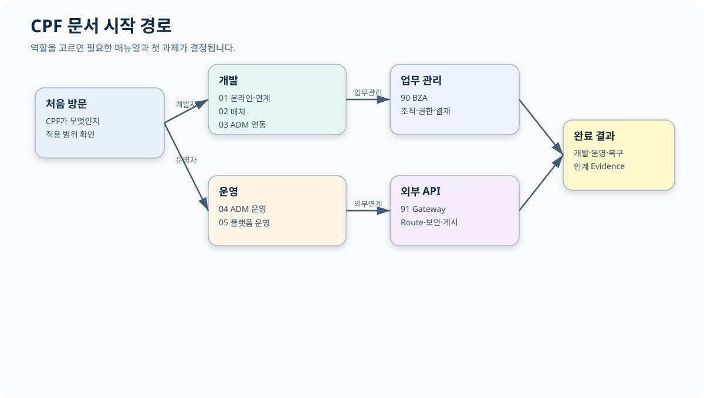

<picture>
  <source media="(max-width: 720px)" srcset="cpf-docs/assets/readme/cpf-hero-mobile.png">
  
</picture>

 

**설계, 개발, 실행, 운영과 변화 대응을 하나의 기준 Source로 연결합니다.**

동일 JVM · 분리 WAS · 모듈형 단일 애플리케이션 · 마이크로서비스 · 다중 인스턴스 · 정기·대량 처리 · 비동기 메시지 처리 · 운영 통제

[프레임워크 안내](cpf-docs/guides/00_프레임워크안내.pdf) · [개발자 매뉴얼](cpf-docs/guides/01_개발자매뉴얼.pdf) · [배치 개발](cpf-docs/guides/02_배치개발매뉴얼.pdf) · [ADM 연동 개발](cpf-docs/guides/03_ADM개발자매뉴얼.pdf) · [ADM 운영](cpf-docs/guides/04_ADM운영자매뉴얼.pdf) · [플랫폼 운영](cpf-docs/guides/05_플랫폼운영매뉴얼.pdf) 
[BZA 운영](cpf-docs/guides/90_BZA매뉴얼.pdf) · [Gateway 운영](cpf-docs/guides/91_Gateway매뉴얼.pdf) · [아키텍처 설계](cpf-docs/deliverables/아키텍처설계서.pdf) · [기술 사양](cpf-docs/deliverables/기술사양서.pdf)

> **공식 문서 형식** · 열람은 PDF, 편집·인수 원본은 같은 이름의 DOCX를 사용합니다. Guide/설계 Authoring Markdown은 공식 사용자 문서로 제공하지 않습니다.

> **현재 문서 기준** · master `f6d7080c5a14` (`07_11`), Product Source `f0aa49f29cba` (`07_08`). 사용자 문서는 제품 완료 상태에서 수행해야 하는 설치·개발·운영·복구·검증 계약을 기준으로 구성합니다.

---

## 처음 방문했다면 여기서 시작합니다

| 지금 알고 싶은 것 | 먼저 읽을 문서 | 문서를 읽고 끝낼 일 |
|---|---|---|
| CPF가 어떤 시스템에 맞는가 | [00 프레임워크 안내](cpf-docs/guides/00_프레임워크안내.pdf) | 기능 범위·Profile·Capability·Topology·Owner·도입 순서를 결정 |
| 온라인·연계 업무를 만드는 방법 | [01 개발자 매뉴얼](cpf-docs/guides/01_개발자매뉴얼.pdf) | 업무 Domain을 생성하고 Query·Command·DB·Message·외부연계·보안·Test·운영 인계를 완료 |
| 정기·대량 처리를 만드는 방법 | [02 배치 개발 매뉴얼](cpf-docs/guides/02_배치개발매뉴얼.pdf) | Job을 개발하고 실행·Stop·Restart·Reprocess·Reconcile까지 수행 |
| 고객 업무를 ADM에 연결하는 방법 | [03 ADM 개발자 매뉴얼](cpf-docs/guides/03_ADM개발자매뉴얼.pdf) | Owner Query·Command를 Same-JVM/Remote·OpenAPI·Generated Client·화면까지 연결 |
| ADM 화면에서 장애를 판단하고 복구하는 방법 | [04 ADM 운영자 매뉴얼](cpf-docs/guides/04_ADM운영자매뉴얼.pdf) | 실제 Route별 조회·조치·승인·대사·복구·감사를 수행 |
| 설치·설정·배포·백업·DR 방법 | [05 플랫폼 운영 매뉴얼](cpf-docs/guides/05_플랫폼운영매뉴얼.pdf) | Artifact부터 Config·DB·Broker·배포·관측·Backup·DR까지 운영 |
| 조직·사용자·권한·결재 적용 방법 | [90 BZA 매뉴얼](cpf-docs/guides/90_BZA매뉴얼.pdf) | 조직 기준일·Effective Permission·결재·위임·감사를 업무에 적용 |
| 외부 API 공개와 게시 복구 방법 | [91 Gateway 매뉴얼](cpf-docs/guides/91_Gateway매뉴얼.pdf) | Route·보안·Target·Publish·ACK/NACK·LKG·Rollback을 운영 |

각 PDF는 **표지 → 빠른 찾기 → 기능 Navigator/Reference → 핵심 업무 흐름 → 완료 판정 Gate → Source Trace** 순서로 읽습니다. **“CPF의 이 기능은 어디에 있습니까?”**라는 질문은 [00 프레임워크 안내](cpf-docs/guides/00_프레임워크안내.pdf)의 **제품 기능 Navigator**에서 기능명으로 찾습니다. 개발 중 공통 API·SPI·Starter·Paging·Transaction·Log·Messaging·외부 연계 사용법은 [01 개발자 매뉴얼](cpf-docs/guides/01_개발자매뉴얼.pdf)의 **CPF 개발 기능 Reference**, Job·Chunk·Restart·Partition·Worker Transaction은 [02 배치 개발 매뉴얼](cpf-docs/guides/02_배치개발매뉴얼.pdf)의 **배치 기능 Reference**에서 바로 판단합니다. 각 Reference는 실제 진입점, 사용 경계, 정상·오류·부분 실패·Rollback/Compensation/Reconcile과 Source Trace까지 연결합니다.

---

## 시스템의 전체 생명주기를 하나의 구조로

CPF는 조회·등록·상태 변경 API, 정기·대량 처리, 비동기 메시지, 파일·외부기관 연계, 권한·감사, 운영 화면과 장애 정상화를 같은 제품 계약으로 구성하는 Business Platform Framework를 목표로 합니다.

<picture>
  <source media="(max-width: 720px)" srcset="cpf-docs/assets/readme/cpf-architecture-overview-mobile.png">
  
</picture>

- 신규 업무 Domain을 생성하고 API·DB·Test·운영 인계 항목을 같은 변경 단위로 관리합니다.
- 같은 업무 계약을 동일 JVM Local Facade와 분리 서비스 Remote Facade에서 유지합니다.
- 중복 요청, 동시성 충돌, 시간초과, 응답 유실과 결과 불명을 상태와 대사 절차로 관리합니다.
- Broker, HTTP/TCP/전문, File/Attachment/SFTP 같은 기술을 업무 Owner 계약과 Provider 구현 사이에 분리합니다.
- Spring Batch 기반 Job·Step·Chunk·Partition·Center-Cut·Scheduler·Worker를 중지·재시작·재처리·대사 흐름과 연결합니다.
- ADM에서 상태·로그·배치·설정·복구·승인·감사를 조회하고 허용된 조치를 Owner 계약으로 전달합니다.
- BZA는 조직·사용자·권한·결재를, Gateway는 외부 API의 인증·라우팅·Target 적용과 복구를 담당합니다.

[제품 범위와 선택 절차 →](cpf-docs/guides/00_프레임워크안내.pdf)

---

## 책임이 분명한 제품 구성

<picture>
  <source media="(max-width: 720px)" srcset="cpf-docs/assets/readme/cpf-product-map-mobile.png">
  
</picture>

### 기본 플랫폼

- `cpf-core` — 기술 중립 Public API·SPI, Context·Error·식별자
- `cpf-common` — 고객 공통 정책과 명시된 업무 공통 기능
- `cpf-starters` — 선택 기술 Runtime과 AutoConfiguration
- `cpf-batch` — Batch Contract·Execution·Control·Scheduler·Worker·Runner·Agent
- `cpf-admin` — 플랫폼 운영 Control Plane
- `cpf-tools` — Generator·Build Plugin·BOM·DB Pack·검증·환경 도구
- `cpf-member`, `cpf-reference` — 생성 Domain 기준과 교육·복구 예제

### 선택 제품

- `cpf-biz-admin` — 조직·직원·사용자·Role·Permission·Data Scope·결재가 필요한 업무
- `cpf-gateway` — 외부 Client와 내부 API 사이의 인증·라우팅·제한·Target 적용 통제가 필요한 업무

고객 개발자가 선택하는 공개 Profile은 `minimal-domain`, `web-api`, `secure-api`, `browser-bff`, `event-service`, `batch-service`입니다. 선택한 Capability와 Provider는 생성 결과 Manifest와 해석된 Starter Lock으로 추적합니다.

---

## 배포 구성이 달라도 같은 업무 계약

<picture>
  <source media="(max-width: 720px)" srcset="cpf-docs/assets/readme/cpf-topology-mobile.png">
  
</picture>

Modular Monolith에서는 Local Facade가, Microservice와 분리 WAS에서는 Remote Facade가 같은 요청·응답 의미, Validation, Error Taxonomy, Idempotency, Timeout Budget, Audit와 Trace 의미를 유지해야 합니다. 다중 인스턴스에서는 Lease·Claim·Fencing Token·Expected Version을 사용해 오래된 실행자의 늦은 갱신과 중복 부작용을 통제합니다.

[온라인·비동기·외부 연계 개발 절차 →](cpf-docs/guides/01_개발자매뉴얼.pdf)

---

## 처리 상태와 판정 근거를 이어갑니다

<picture>
  <source media="(max-width: 720px)" srcset="cpf-docs/assets/readme/cpf-execution-mobile.png">
  
</picture>

요청을 보낸 뒤 응답을 받지 못한 경우 실제 부작용이 발생했는지 확인하기 전까지 성공이나 실패로 확정하지 않습니다. Transaction ID, Idempotency Key, Request Hash, Operation/Attempt, Provider Tracking ID와 업무 원장을 연결해 결과를 대사한 뒤 재처리·보상·운영 확정을 수행합니다.

---

## 정기·대량 업무와 운영 통제

CPF 배치는 Tasklet·Chunk·File·Partition·Remote Worker·Center-Cut·Scheduler를 Spring Batch Metadata와 운영 상태로 연결합니다. 운영자는 대상 Preview, 승인, 실행, 진행, Stop·Restart·Abandon·Reprocess, 결과 불명 대사와 업무 합계를 같은 Execution 맥락으로 추적합니다.

[배치 개발과 운영 절차 →](cpf-docs/guides/02_배치개발매뉴얼.pdf)

---

## 실제 실행과 연결되는 운영

<picture>
  <source media="(max-width: 720px)" srcset="cpf-docs/assets/readme/cpf-operations-mobile.png">
  
</picture>

업무 개발자는 Owner Query·Command를 ADM에 연결하고, 운영자는 Route별 권한·Data Scope·Reason·Approval·Expected Version에 따라 조회와 조치를 수행합니다. 플랫폼 운영자는 Artifact·Config·Secret·DB·Broker·배포·관측·Backup·DR을 관리합니다.

- [ADM 연동 개발자 매뉴얼 →](cpf-docs/guides/03_ADM개발자매뉴얼.pdf)
- [ADM 운영자 매뉴얼 →](cpf-docs/guides/04_ADM운영자매뉴얼.pdf)
- [플랫폼 운영 매뉴얼 →](cpf-docs/guides/05_플랫폼운영매뉴얼.pdf)

---

## 새 서비스도 같은 품질 기준으로 시작

<picture>
  <source media="(max-width: 720px)" srcset="cpf-docs/assets/readme/cpf-domain-journey-mobile.png">
  
</picture>

Generator를 사용할 때에는 Dry Run으로 Module·Package·System Code·Profile·Provider Binding·DB Vendor·충돌 경로를 먼저 확인합니다. 적용 후 Domain Manifest, Resolved Starter Lock, DB Pack, OpenAPI, Test와 운영 인계표를 함께 검토합니다. 정확한 명령과 Parameter는 [개발자 매뉴얼](cpf-docs/guides/01_개발자매뉴얼.pdf)의 Generator 절차를 따릅니다.

---

## 역할에 맞는 공식 매뉴얼

| 문서 | 주 독자와 완료 결과 |
|---|---|
| [00 프레임워크 안내](cpf-docs/guides/00_프레임워크안내.pdf) | 도입 검토자·아키텍트가 기능 범위·Profile·Topology·도입 순서를 결정 |
| [01 개발자 매뉴얼](cpf-docs/guides/01_개발자매뉴얼.pdf) | 온라인·비동기·파일·외부 연계 업무를 설계·구현·시험·운영 인계 |
| [02 배치 개발 매뉴얼](cpf-docs/guides/02_배치개발매뉴얼.pdf) | 배치를 개발하고 실행·중지·재시작·재처리·대사 |
| [03 ADM 개발자 매뉴얼](cpf-docs/guides/03_ADM개발자매뉴얼.pdf) | 고객 업무의 조회·조치·승인·복구 계약을 ADM에 연결 |
| [04 ADM 운영자 매뉴얼](cpf-docs/guides/04_ADM운영자매뉴얼.pdf) | 실제 Route에서 조회·조치·승인·대사·Rollback 수행 |
| [05 플랫폼 운영 매뉴얼](cpf-docs/guides/05_플랫폼운영매뉴얼.pdf) | 설치·설정·DB·배포·관측·Backup·DR·장애 정상화 |
| [90 BZA 매뉴얼](cpf-docs/guides/90_BZA매뉴얼.pdf) | 조직·사용자·권한·결재·첨부·감사 운영 |
| [91 Gateway 매뉴얼](cpf-docs/guides/91_Gateway매뉴얼.pdf) | API Route·보안·게시·ACK/NACK·Drift·Rollback 운영 |

---

## 설계 산출물

- [산출물 목록](cpf-docs/deliverables/산출물목록.pdf)
- [아키텍처 설계서](cpf-docs/deliverables/아키텍처설계서.pdf)
- [기술 사양서](cpf-docs/deliverables/기술사양서.pdf)
- [기술 표준서](cpf-docs/deliverables/기술표준서.pdf)
- [데이터베이스 표준서](cpf-docs/deliverables/데이터베이스표준서.pdf)
