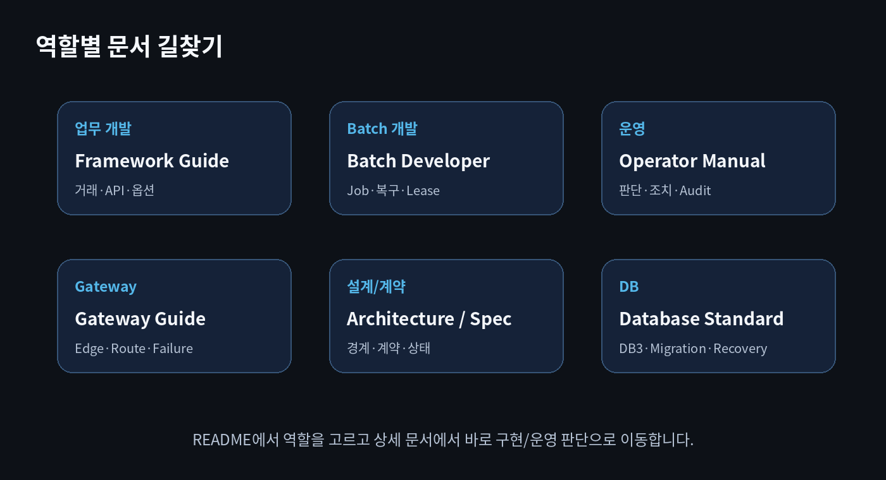

<h1 align="center">CPF / Core Platform Framework</h1>


CPF는 업무 시스템의 **호출 경계, 거래 상태, 공통 기능, Batch, DB, 운영 제어**를 하나의 Framework 계약으로 연결합니다. 개발자는 기반 기능을 다시 조립하기보다 Domain과 업무 규칙에 집중하고, 운영자는 같은 식별자와 복구 모델로 장애를 추적합니다.


**CPF 전체 구조.** 업무 원장은 Generated Business Domain이 소유합니다. CPF Core/Common/Starter가 공통 계약을 제공하고, Gateway·Backoffice·Batch·Operations는 필요한 경계에서 역할을 나눕니다.

<br><br>

# 1. 호출·오케스트레이션은 배포 구조가 달라져도 같은 업무 계약을 유지합니다

## 1.1 Same JVM과 Remote를 같은 Domain Invocation 계약으로 호출


업무 코드는 Local/Remote 분기를 직접 만들지 않습니다. CPF가 Same JVM이면 In-process binding을, Remote이면 System6·timeout·trace가 적용된 transport를 선택합니다. **내부 Domain 간 호출은 Gateway를 경유하지 않으며 self-HTTP도 사용하지 않습니다.**

## 1.2 호출 순서와 실패 경계를 오케스트레이션 계약으로 분리

- **업무 순서** - 어떤 Domain/Operation을 어떤 순서로 실행할지 명확히 합니다.
- **실패 경계** - Local rollback과 Remote Side Effect를 같은 실패로 취급하지 않습니다.
- **복구 경로** - Retry·Idempotency·Compensation·Reconcile을 결과 확정 가능성에 맞춰 선택합니다.
- **관측성** - transactionId·operationId·instanceId로 전체 호출을 연결합니다.

## 1.3 System6·transactionId·operationId·instanceId로 거래를 연결

Canonical System6는 경계를 통과할 때 CPF가 생성·전파·검증합니다. 개발자는 Header를 직접 조립하지 않고, 운영자는 transactionId → operationId → instanceId 순서로 실제 처리 경로를 좁힙니다.

<br><br>

# 2. 성공과 실패 사이의 불확실성까지 거래 상태로 관리합니다

## 2.1 Local Transaction과 원격 Side Effect를 구분


로컬 DB 원자성은 Transaction으로 관리하고, 원격 시스템·메시지·파일 Side Effect는 별도의 결과 확인과 복구 계약으로 다룹니다.

## 2.2 UNKNOWN을 추측하지 않고 Reconcile


Timeout이나 응답 유실처럼 실제 결과를 확정할 수 없으면 SUCCESS/FAILURE로 추측하지 않습니다. `UNKNOWN`을 보존하고 Probe/Reconcile으로 실제 결과를 확인합니다.

## 2.3 Idempotency로 중복 Side Effect를 제어

동일 의미의 요청이 재전송돼도 durable idempotency 상태를 기준으로 이미 확정된 Side Effect를 무조건 다시 실행하지 않습니다.

## 2.4 Saga·TCC·XA를 자원 특성에 맞게 선택

- **Saga** - 장기 흐름과 명시적 보상이 필요한 경우
- **TCC** - Try/Confirm/Cancel을 업무적으로 분리할 수 있는 경우
- **XA** - 참여 Resource가 XA를 지원하고 동기 원자성이 필요한 경우

<br><br>

# 3. Batch는 실행·제어·복구 역할을 나눠 운영 실수를 줄입니다

## 3.1 Control Plane·Scheduler·Worker·Center-Cut·Agent 역할


제어 명령과 실제 Job 실행을 분리하고 Lease·Fencing으로 다중 Worker의 실행 소유권을 보호합니다.

## 3.2 Restart·Rerun·Reprocess·Reconcile 선택

`Restart`는 기존 Execution을 이어가고, `Rerun`은 새 Execution, `Reprocess`는 선택 대상 재처리, `Reconcile`은 결과 미확정 상태 확인에 사용합니다. 네 동작을 같은 의미로 섞지 않습니다.

## 3.3 Lease·Fencing·Heartbeat와 Process Kill 복구

Heartbeat로 생존 상태를 보고하고 Lease/Fencing으로 stale worker의 재기록을 차단해 Process Kill과 재할당 후에도 실행 소유권을 명확히 합니다.

<br><br>

# 4. Domain 생성부터 Starter와 DB까지 같은 규칙으로 맞춥니다

## 4.1 Generator가 Domain 구조와 Package를 Canonical하게 생성


Generator가 Domain IA와 Package를 Canonical 규칙으로 만들고, Public Starter·DB3·Build/Test까지 같은 Catalog에서 연결합니다.

## 4.2 필요한 Starter·Provider만 조합

JDBC/MyBatis/JPA, Cache, Messaging, Security, File, Integration 등은 Public Starter에서 필요한 Capability만 선택합니다. Generated Domain이 Internal Leaf를 직접 참조하지 않습니다.

## 4.3 Oracle·PostgreSQL·MariaDB Lifecycle을 함께 관리

공식 DB Vendor는 Oracle, PostgreSQL, MariaDB입니다. Canonical Source → Fresh Init → Migration/Seed → Upgrade → Rollback/Recovery → Runtime Query를 세 Vendor와 함께 검증합니다.

<br><br>

# 5. 외부 연계와 Gateway·Backoffice도 업무 Owner 경계를 유지합니다

## 5.1 외부 연계·Messaging·File·Notification의 실패와 재처리

외부 연계는 Provider가 달라도 timeout·retry·idempotency·UNKNOWN·Reconcile 관점에서 같은 실패 모델을 사용합니다.

## 5.2 Gateway 선택 시와 미선택 시 경계를 한눈에 비교


Gateway는 **외부 진입, Routing, Trust, Rate/Admission, Resilience 정책 경계가 필요할 때만** 추가합니다. 내부 Domain 호출의 기본 Hop이 아닙니다.

## 5.3 내부 Domain 간 호출은 Gateway를 경유하지 않음

Domain A → Domain B 호출은 Same JVM 또는 Remote Domain Invocation으로 연결합니다. Gateway 장애 시 내부 호출을 우회하거나 fallback 경로로 만들지 않습니다.

## 5.4 Backoffice는 Owner Domain을 우회하지 않음

Backoffice는 Channel/BFF 역할을 하며 업무 원장 DB에 직접 접근하지 않습니다. Owner Domain의 공식 호출 계약을 통해 조회·조작합니다.

<br><br>

# 6. 운영자는 거래와 Runtime을 같은 식별 체계로 추적합니다

## 6.1 Log·Trace·Timeline·Health를 한 흐름으로 확인


transactionId로 거래를 찾고 operationId로 실행 단위를 좁힌 뒤 instanceId로 실제 Runtime을 확인합니다.

## 6.2 위험 조치는 Permission·Reason·Approval·Audit와 연결

재실행·강제 상태 변경·민감정보 접근 같은 위험 조치는 권한뿐 아니라 사유, 필요한 승인, 실행 결과 Audit까지 남깁니다.

## 6.3 운영 상태와 복구 결과를 같은 기준으로 확인

Runtime control, Feature Flag, Dynamic Log, Incident, Batch Recovery는 요청 상태와 실제 적용 결과를 분리해 확인하고 부분 실패를 숨기지 않습니다.

<br><br>

# 7. 반복 공통 기능을 다시 만들지 않고 필요한 Capability를 선택합니다

## 7.1 Cache·Validation·Messaging·File·Notification 공통 계약

업무 Domain은 Provider 구현 대신 CPF Public API와 Starter를 사용해 반복 코드를 줄이고 운영 규칙을 일관되게 유지합니다.

## 7.2 Security·Masking·Audit·Approval 공통 정책

인증·인가·Session·Secret/Crypto·Masking·Sensitive Data Access·Approval/Audit를 각 Runtime이 별도 규칙으로 만들지 않습니다.

## 7.3 Config·Profile·Provider로 Runtime 기능 선택

기본값, 환경 Profile, Provider, 호출별 옵션의 우선순위를 명확히 하고 충돌하는 Provider나 위험한 기본값은 Fail-Closed로 처리합니다.

<br><br>

# 8. 시작·생성·Build·Test 흐름이 정해져 있어 바로 개발에 들어갑니다

## 8.1 Bootstrap으로 개발 환경 준비

공개 개발 환경은 Bootstrap이 prerequisite → DB/Schema → Migration/Seed → 필요한 Middleware → Domain discovery → Build/Test → Runtime/Health 순으로 준비하는 Golden Path를 제공합니다.

## 8.2 Build·Test·Runtime을 검증된 명령으로 실행

```powershell
pwsh .\cpf-tools\build\tools\cpf-dev.ps1 build
pwsh .\cpf-tools\build\tools\cpf-dev.ps1 verify-full
pwsh .\cpf-tools\build\tools\cpf-dev.ps1 run-local
```

## 8.3 Generator CLI로 Domain 생성·검증

```text
cpf domain create | setup | sync | diff | remove
cpf db render
cpf verify generator | domain | all
```

<br><br>

# 9. 필요한 매뉴얼과 상세 가이드를 역할별로 바로 찾습니다



## 9.1 Framework·Batch 개발자는 개발 가이드에서 선택/API를 확인

- [프레임워크 개발자 가이드](cpf-docs/guides/02_프레임워크_개발자_가이드.docx) ([PDF](cpf-docs/guides/02_프레임워크_개발자_가이드.pdf)) - 거래 패턴, 호출 API, 옵션, 오류·복구, Starter/Generator
- [배치 개발자 가이드](cpf-docs/guides/03_배치_개발자_가이드.docx) ([PDF](cpf-docs/guides/03_배치_개발자_가이드.pdf)) - Job/Step/Chunk/Partition, Lease/Fencing, 복구 선택

## 9.2 운영자는 운영자·Batch 운영 가이드에서 판단과 조치를 확인

- [운영자 매뉴얼](cpf-docs/guides/04_운영자_매뉴얼.docx) ([PDF](cpf-docs/guides/04_운영자_매뉴얼.pdf)) - 거래 추적, UNKNOWN, Incident, 위험 조치
- [배치 운영 가이드](cpf-docs/guides/05_배치_운영_가이드.docx) ([PDF](cpf-docs/guides/05_배치_운영_가이드.pdf)) - Restart/Rerun/Reprocess/Reconcile, Worker 장애, 복구

## 9.3 Gateway·Specification·Architecture·DB 표준은 상세 계약과 경계를 확인

- [Gateway 개발/사용 가이드](cpf-docs/guides/06_Gateway_개발_사용_가이드.docx) ([PDF](cpf-docs/guides/06_Gateway_개발_사용_가이드.pdf))
- [Specification 기술 명세](cpf-docs/guides/07_Specification_기술_명세.docx) ([PDF](cpf-docs/guides/07_Specification_기술_명세.pdf))
- [아키텍처설계서](cpf-docs/deliverables/아키텍처설계서.docx) ([PDF](cpf-docs/deliverables/아키텍처설계서.pdf))
- [기술사양서](cpf-docs/deliverables/기술사양서.pdf) · [기술표준서](cpf-docs/deliverables/기술표준서.pdf) · [데이터베이스표준서](cpf-docs/deliverables/데이터베이스표준서.pdf)

<br><br>

# 10. Community & Evaluation License

## CPF는 **Community & Evaluation License** 안내를 기준으로 사용합니다.
