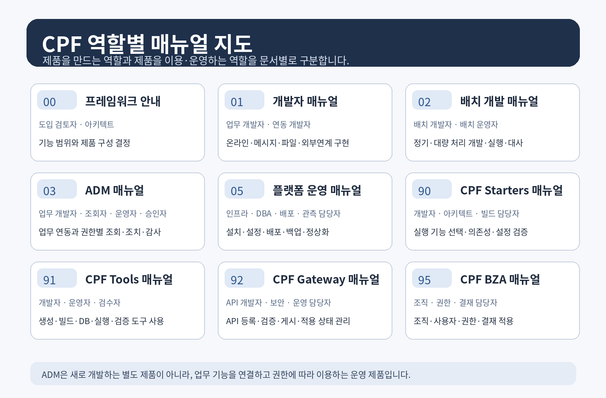

<div align="center">

<picture>
  <source media="(max-width: 720px)" srcset="cpf-docs/assets/readme/cpf-hero-mobile.png">
  
</picture>

<br>

**설계, 개발, 실행, 운영과 변화 대응을 하나의 제품 기준으로 연결합니다.**

동일 JVM · 분리 WAS · 모듈형 단일 애플리케이션 · 마이크로서비스 · 다중 인스턴스 · 정기·대량 처리 · 비동기 메시지 처리 · 운영 통제

[프레임워크 안내](cpf-docs/guides/00_프레임워크안내.md) · [개발자 매뉴얼](cpf-docs/guides/01_개발자매뉴얼.md) · [배치 개발](cpf-docs/guides/02_배치개발매뉴얼.md) · [ADM 매뉴얼](cpf-docs/guides/03_ADM매뉴얼.md) · [CPF Starters](cpf-docs/guides/90_CPF_Starters_매뉴얼.md) · [CPF Tools](cpf-docs/guides/91_CPF_Tools_매뉴얼.md)

</div>

---

## 시스템의 전체 생명주기를 하나의 구조로

CPF는 업무 서비스를 같은 설계·개발·운영 기준으로 구축하기 위한 프레임워크입니다. 조회·등록·변경 API, 정기·대량 처리, 비동기 메시지 처리, 파일·외부기관 연계, 권한·감사, 운영 화면과 장애 대응을 필요한 기능별로 선택해 업무 시스템에 적용할 수 있습니다.

<picture>
  <source media="(max-width: 720px)" srcset="cpf-docs/assets/readme/cpf-architecture-overview-mobile.png">
  
</picture>

- 신규 업무 서비스를 생성하고 조회·등록·변경·승인·대사 기능을 같은 개발 순서로 만들 수 있습니다.
- 같은 기능을 한 애플리케이션 안에서 실행하거나 분리 서비스로 배포할 수 있습니다.
- 메시지 브로커, 파일 처리, 외부 REST·전문 연계와 응답 유실 후 결과 확인을 업무 기능에 연결할 수 있습니다.
- 정기·대량 처리에서 일회성 작업, 분할 실행, 재시작과 재처리를 같은 운영 기준으로 구성할 수 있습니다.
- ADM에서 업무 서비스의 상태·로그·배치·설정·장애를 조회하고 권한에 따라 조치할 수 있습니다.
- 조직·사용자·권한·결재가 필요하면 BZA를, 공통 API 진입점이 필요하면 Gateway를 선택할 수 있습니다.

[제품 범위와 책임 경계 자세히 보기 →](cpf-docs/guides/00_프레임워크안내.md)

---

## 책임이 분명한 제품 구성

<picture>
  <source media="(max-width: 720px)" srcset="cpf-docs/assets/readme/cpf-product-map-mobile.png">
  
</picture>

### 기본 플랫폼

- 업무 서비스 생성과 공통 개발 규칙
- 기술 중립 계약을 제공하는 Core와 업무 공통 기능
- 온라인 조회·등록·변경·대사 기능
- 메시지·파일·외부기관 연계
- 정기·대량 처리
- ADM 기반 운영 조회·통제·정상화
- 설치·배포·관측·백업 도구
- 필요한 실행 기술을 선택하는 Starter 제품군

### 선택 제품

- `cpf-biz-admin` — 조직·직원·사용자·권한·결재 기능을 공통으로 사용할 때 선택
- `cpf-gateway` — 여러 업무 API의 인증·라우팅·제한·게시 상태를 공통으로 관리할 때 선택

Starter는 독립 서버가 아니라 실행 제품에 포함되는 선택형 라이브러리입니다. 기준 Commit에서 `settings.gradle`에 등록된 공개 Starter는 보안, 메시징, 캐시, 관측, 복원력, 기능 전환, 비밀정보의 7개 프로젝트입니다. 현재 Core·Common의 선택 Runtime 분리와 Capability Profile·Aggregate Starter는 QA38 목표에 포함돼 있으나 기준 Commit에서는 부분 구현 또는 미구현 상태이므로, 현재 사용 가능한 의존성과 목표 구조를 구분해 판단해야 합니다.

---

## 배포 구성이 달라도 같은 계약

<picture>
  <source media="(max-width: 720px)" srcset="cpf-docs/assets/readme/cpf-topology-mobile.png">
  
</picture>

같은 애플리케이션에서는 내부 호출 방식이, 분리된 서비스에서는 원격 호출 방식이 같은 업무 계약을 실행합니다. 호출자는 배포 위치에 결합되지 않으며 표준 식별자, 인증·권한 문맥, 오류 분류, 시간 예산, 멱등성과 추적의 의미가 유지되어야 합니다.

다중 인스턴스 실행에서는 임대 잠금, 소유권, 펜싱 토큰과 버전을 사용해 이전 실행자가 현재 상태를 덮어쓰지 않도록 설계합니다. 실제 적용 여부는 사용 모듈의 Source·DB·시험 결과로 확인합니다.

[같은 애플리케이션·분리 서비스 연동과 거래 처리 →](cpf-docs/guides/01_개발자매뉴얼.md)

---

## 처리 상태와 판정 근거를 이어갑니다

<picture>
  <source media="(max-width: 720px)" srcset="cpf-docs/assets/readme/cpf-execution-mobile.png">
  
</picture>

온라인·비동기·배치·외부 연계 전 과정의 상태와 이력을 연결해 중단 이후 재시작, 결과 대사, 재처리와 운영 정상화의 판정 근거를 유지합니다.

대상에 요청을 보낸 뒤 응답을 받지 못한 경우에는 실제 처리 여부를 확인하기 전까지 결과를 임의로 확정하지 않습니다. 거래 식별자, 요청 해시, 멱등성 키, 실행 시도 이력과 상대 시스템 상태 조회를 연결해 실제 결과를 확인한 뒤 재처리·보상·운영 확정을 수행합니다.

---

## 정기·대량 업무를 같은 기준으로 구성

CPF 배치를 사용하면 일회성 작업, 대량 분할 처리, 파일 처리, 원격 작업자 처리와 정기 실행을 같은 절차로 개발하고 운영할 수 있습니다. 중단된 작업은 저장된 진행 위치와 업무 대사 기준을 확인해 재시작하고, 처리·제외·오류 건수를 업무 합계와 비교합니다.

배치 개발자와 운영 담당자는 작업 정의·버전·승인·실행 위치·배포 파일·작업자 보안·중복 실행 차단·결과 대사와 ADM 확인 절차를 함께 적용합니다.

[배치 작업부터 Center-Cut·Worker 정상화까지 따라 하기 →](cpf-docs/guides/02_배치개발매뉴얼.md)

---

## 실제 실행과 연결되는 운영

<picture>
  <source media="(max-width: 720px)" srcset="cpf-docs/assets/readme/cpf-operations-mobile.png">
  
</picture>

ADM은 업무 서비스·인스턴스·거래·로그·추적·배치·설정·배포 상태를 조회하고, 허용된 조치를 권한·사유·승인·버전·감사와 함께 해당 Owner에 전달하는 운영 제품입니다. ADM 자체를 새로 개발하는 것이 아니라, 업무 개발자가 공개 계약을 연결하고 조회자·운영자·승인자·보안 담당자가 같은 제품을 역할별로 사용합니다.

플랫폼 운영자는 프로필·설정값·비밀정보, DB, 배포 파일, 프로세스, 배포, 관측, 백업·복원과 재해 대응을 관리합니다. ADM 화면 조작과 실행환경 운영은 책임과 권한이 다르므로 절차를 구분합니다.

- [업무 연동부터 권한별 조회·조치·승인까지 →](cpf-docs/guides/03_ADM매뉴얼.md)
- [설정·DB·배포·기동·정상화 담당자 →](cpf-docs/guides/05_플랫폼운영매뉴얼.md)

---

## 새 서비스도 같은 품질 기준으로 시작

<picture>
  <source media="(max-width: 720px)" srcset="cpf-docs/assets/readme/cpf-domain-journey-mobile.png">
  
</picture>

```powershell
pwsh -File .\cpf-tools\generator\create-domain.ps1 `
  -DomainName payment `
  -SystemCode PAY `
  -DatabaseVendor postgresql `
  -DryRun
```

계획 단계에서 모듈, 패키지, 시스템 코드, 포트, 경로와 DB 충돌을 검사합니다. 기준 Commit의 생성기는 기능 선택값을 받지만 QA38의 Versioned Capability Profile·`resolvedStarters`·Version Lock은 아직 구현 여부를 다시 확인해야 합니다. 생성 결과에는 실제 Build 의존성, 설정, DB Vendor Pack, 시험과 배포 산출물이 일치해야 합니다.

[생성 도구를 포함한 전체 개발 절차 →](cpf-docs/guides/01_개발자매뉴얼.md)

---

## 역할에 맞는 매뉴얼



| 문서 | 주 독자와 완료 결과 |
|---|---|
| [00 프레임워크 안내](cpf-docs/guides/00_프레임워크안내.md) | 도입 검토자·아키텍트가 기능 범위와 제품 구성을 결정 |
| [01 개발자 매뉴얼](cpf-docs/guides/01_개발자매뉴얼.md) | 업무 개발자가 온라인·메시지·파일·외부연계 기능을 개발하고 운영 인계 |
| [02 배치 개발 매뉴얼](cpf-docs/guides/02_배치개발매뉴얼.md) | 배치 개발자·운영 담당자가 정기·대량 처리를 개발·실행·재시작·대사 |
| [03 ADM 매뉴얼](cpf-docs/guides/03_ADM매뉴얼.md) | 업무 개발자와 권한별 사용자가 ADM 연동·조회·조치·승인·감사를 수행 |
| [05 플랫폼 운영 매뉴얼](cpf-docs/guides/05_플랫폼운영매뉴얼.md) | 인프라·DBA·배포·관측 담당자가 설치·설정·배포·백업·정상화 |
| [90 CPF Starters 매뉴얼](cpf-docs/guides/90_CPF_Starters_매뉴얼.md) | 개발자·아키텍트가 필요한 실행 기능만 선택하고 의존성·설정·시험을 검증 |
| [91 CPF Tools 매뉴얼](cpf-docs/guides/91_CPF_Tools_매뉴얼.md) | 처음 사용하는 개발자·운영자가 생성·빌드·DB·실행·검증 도구를 사용 |
| [92 CPF Gateway 매뉴얼](cpf-docs/guides/92_CPF_Gateway_매뉴얼.md) | API 개발자·보안·운영 담당자가 API 등록·검증·게시·적용 상태를 관리 |
| [95 CPF BZA 매뉴얼](cpf-docs/guides/95_CPF_BZA_매뉴얼.md) | 조직·권한·결재 담당자가 BZA를 업무 시스템에 적용하고 운영 |

[역할별 시작 순서 →](cpf-docs/guides/00_프레임워크안내.md#8-역할별-문서-지도)

---

## 처음 접하는 사용자의 문서 사용법

1. [00 프레임워크 안내](cpf-docs/guides/00_프레임워크안내.md)에서 만들려는 업무 결과와 필요한 제품을 선택합니다.
2. 역할별 매뉴얼의 시작 점검표로 선행 조건과 책임자를 정합니다.
3. 기능별 절차를 정상 흐름뿐 아니라 중복·동시성·시간초과·응답 유실·부분 실패까지 실행합니다.
4. 예제의 업무 이름·상태·권한·대사 기준을 실제 업무 규칙으로 교체합니다.
5. 개발자는 운영 인계표를 전달하고 운영 담당자는 ADM·로그·지표·추적·감사에서 같은 식별자를 확인합니다.

각 매뉴얼은 기능 선택, 단계별 수행, 정상 결과, 오류 대응, 재시작·재처리·대사, 권한·감사와 미검증 범위를 함께 설명합니다.

---

## 제품 요구사항과 설계 산출물

역할별 작업 절차는 위 매뉴얼을 사용합니다. 제품 범위, 설계 판단과 기술 계약의 근거가 필요한 기술 책임자·아키텍트·감사 담당자는 아래 산출물을 확인합니다.

- [산출물 목록과 읽는 순서](cpf-docs/deliverables/산출물목록.md)
- [아키텍처 설계서](cpf-docs/deliverables/아키텍처설계서.md)
- [기술 표준서](cpf-docs/deliverables/기술표준서.md)
- [기술 사양서](cpf-docs/deliverables/기술사양서.md)
- [데이터베이스 표준서](cpf-docs/deliverables/데이터베이스표준서.md)
- [최상위 제품 요구사항](cpf-docs/governance/CPF_FINAL_TARGET_REQUIREMENTS.md)

README에는 전체 API·설정·상태·검증 원장을 복사하지 않습니다. 상세 값과 현재 구현 상태는 Source와 해당 산출물에서 확인합니다.

---

<details>
<summary><strong>시작 명령 보기</strong></summary>

### 저장소와 환경

```powershell
git rev-parse HEAD
git status --short
java -version
pwsh --version
```

### 전체 빌드

```powershell
.\gradlew.bat clean build
```

```bash
./gradlew clean build
```

### 데이터베이스

```powershell
pwsh -File .\cpf-tools\scripts\initialize-cpf-database.ps1 -All -RequireRun
```

### 로컬 실행

```powershell
pwsh -File .\cpf-tools\scripts\start-cpf-local.ps1
pwsh -File .\cpf-tools\scripts\status-cpf-local.ps1
pwsh -File .\cpf-tools\scripts\stop-cpf-local.ps1
```

지원 환경, 매개변수, 정상 결과와 되돌리기 절차는 [플랫폼 운영 매뉴얼](cpf-docs/guides/05_플랫폼운영매뉴얼.md)에 정리되어 있습니다.

</details>

---

## 시작 순서

1. 프레임워크 안내에서 기능 범위와 책임 경계를 확인합니다.
2. 업무 개발자는 개발자 매뉴얼에서 기능 유형을 선택해 구현합니다.
3. 정기·대량 처리는 배치 개발 매뉴얼을 따릅니다.
4. 업무 상태와 운영 조치를 ADM에 연결하고 사용할 때는 통합 ADM 매뉴얼을 사용합니다.
5. 플랫폼 운영 담당자는 설치·DB·배포·관측·백업과 장애 대응 절차를 인계받습니다.
6. 실행 기능 선택은 CPF Starters, 생성·빌드·DB·검증 도구는 CPF Tools 매뉴얼을 사용합니다.
7. 조직·권한·결재가 필요하면 CPF BZA, 공통 API 진입점이 필요하면 CPF Gateway 매뉴얼을 사용합니다.

각 문서는 현재 구현, 목표 구조, 검증 결과와 미검증 범위를 구분합니다.
