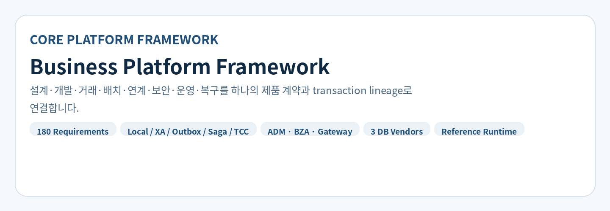
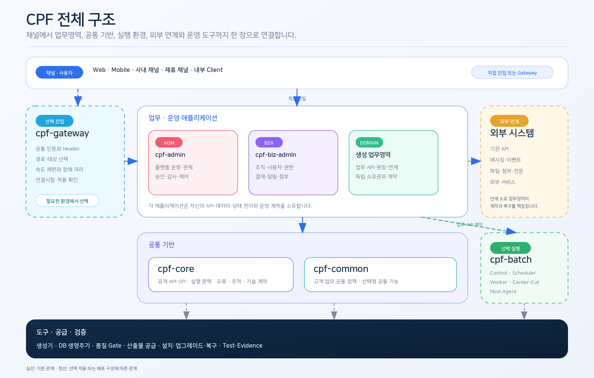
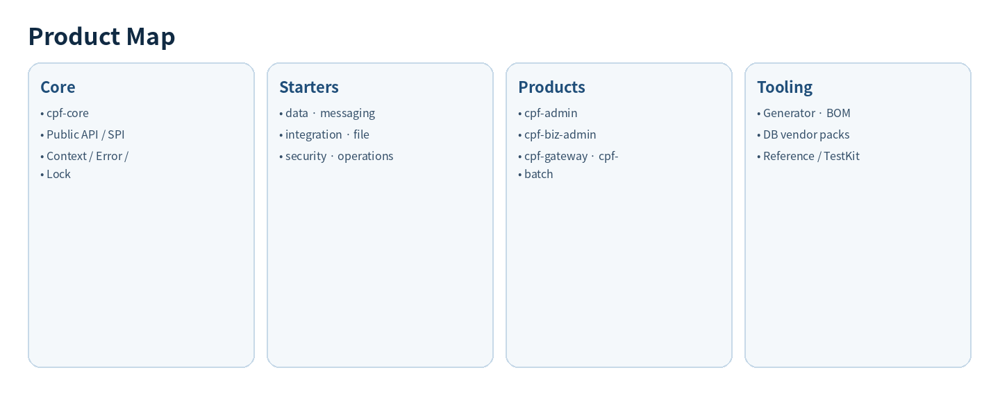
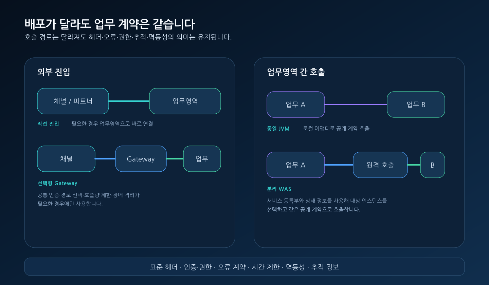
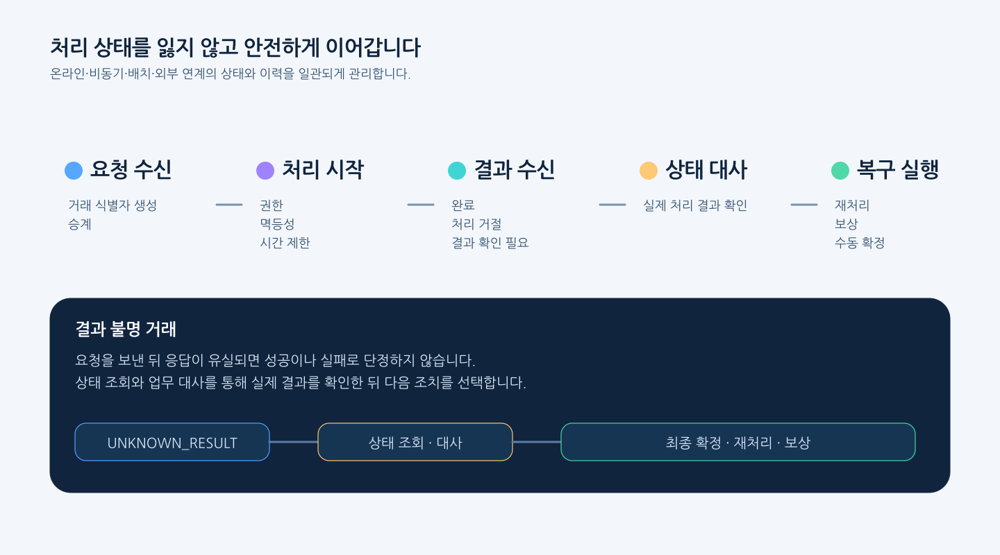
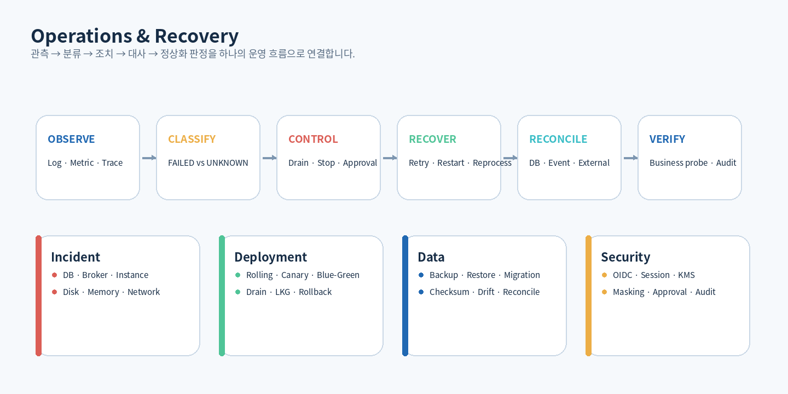
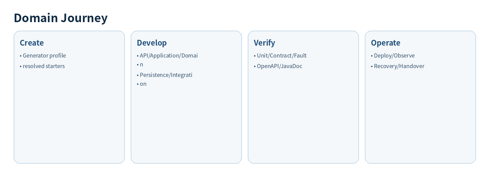
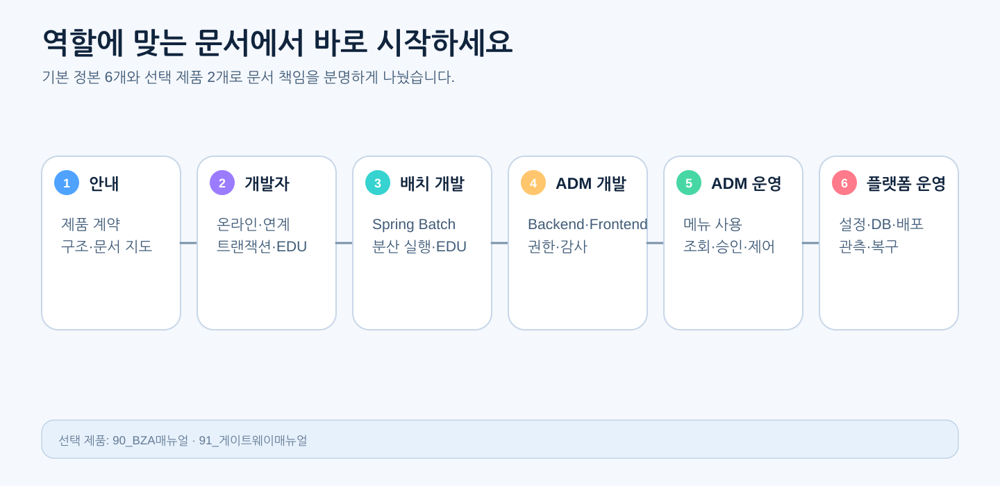

<div align="center">

<picture>
  <source media="(max-width: 720px)" srcset="cpf-docs/assets/readme/cpf-hero-mobile.png">
  
</picture>

<br>

**설계, 개발, 실행, 운영, 복구와 다음 변화를 하나의 제품 기준으로 연결합니다.**

동일 JVM · 분리 WAS · Modular Monolith · MSA · 다중 인스턴스 · Spring Batch · Kafka · 운영 통제

[프레임워크 안내](cpf-docs/guides/00_프레임워크안내.md) · [개발자 매뉴얼](cpf-docs/guides/01_개발자매뉴얼.md) · [배치 개발](cpf-docs/guides/02_배치개발매뉴얼.md) · [ADM 운영](cpf-docs/guides/04_ADM운영자매뉴얼.md) · [플랫폼 운영](cpf-docs/guides/05_플랫폼운영매뉴얼.md)

</div>

---

## 시스템의 전체 생명주기를 하나의 구조로

CPF는 고객사의 업무 서비스를 빠르게 만들고 같은 방법으로 운영하기 위한 플랫폼입니다. 조회·등록·변경 API, 대용량 배치, 메시지 처리, 파일·외부기관 연계, 권한·감사, 운영 화면과 장애 복구를 필요한 기능별로 선택해 업무 시스템에 적용할 수 있습니다.

<picture>
  <source media="(max-width: 720px)" srcset="cpf-docs/assets/readme/cpf-architecture-overview-mobile.png">
  
</picture>

- 신규 업무 서비스를 생성하고 조회·등록·변경·승인·대사 기능을 같은 개발 순서로 만들 수 있습니다.
- 같은 기능을 한 애플리케이션 안에서 실행하거나 분리 서비스로 배포할 수 있습니다.
- Kafka 이벤트, 파일 처리, 외부 REST·전문 연계와 응답 유실 복구를 업무 기능에 연결할 수 있습니다.
- Spring Batch 기반 정기 배치, 대량 처리, 분할 실행, 재시작과 재처리를 구성할 수 있습니다.
- ADM에서 고객 업무의 상태·로그·배치·설정·장애를 조회하고 권한에 따라 통제할 수 있습니다.
- 조직·사용자·권한·결재가 필요하면 BZA를, 공통 API 진입점이 필요하면 Gateway를 선택할 수 있습니다.

[제품 스펙과 책임 경계 자세히 보기 →](cpf-docs/guides/00_프레임워크안내.md)

---

## 책임이 분명한 제품 구성

<picture>
  <source media="(max-width: 720px)" srcset="cpf-docs/assets/readme/cpf-product-map-mobile.png">
  
</picture>

### 기본 플랫폼

- 업무 서비스 생성과 공통 개발 규칙
- 온라인 조회·등록·변경·대사 기능
- 메시지·파일·외부기관 연계
- Spring Batch 기반 대량·정기 처리
- ADM 기반 운영 조회·통제·복구
- 설치·배포·관측·백업 도구

### 선택 제품

- `cpf-biz-admin` — 조직·직원·사용자·권한·결재 기능이 필요한 업무 시스템에서 선택
- `cpf-gateway` — 여러 업무 API의 인증·라우팅·제한·배포 상태를 공통 관리할 때 선택

선택하지 않은 제품이 필수 Dependency나 기동 조건으로 따라오지 않도록 Module과 Starter 경계를 유지합니다.

---

## 배포 구성이 달라도 같은 계약

<picture>
  <source media="(max-width: 720px)" srcset="cpf-docs/assets/readme/cpf-topology-mobile.png">
  
</picture>

같은 애플리케이션에서는 내부 호출 방식이, 분리된 서비스에서는 원격 호출 방식이 같은 업무 계약을 실행합니다. 호출자는 배포 위치에 결합되지 않으며 표준 식별자, 인증·권한 문맥, 오류 분류, 시간 예산, 멱등성과 Trace의 의미가 유지됩니다.

다중 인스턴스 실행은 Lease, Claim, Fencing Token과 Version을 사용해 소유권을 잃은 과거 실행자가 현재 상태를 덮어쓰지 못하게 합니다.

[개발자가 따라 하는 같은 애플리케이션·분리 서비스 연동과 거래 처리 →](cpf-docs/guides/01_개발자매뉴얼.md)

---

## 처리 상태와 복구 근거를 이어갑니다

<picture>
  <source media="(max-width: 720px)" srcset="cpf-docs/assets/readme/cpf-execution-mobile.png">
  
</picture>

온라인·비동기·배치·외부 연계 전 과정의 상태와 이력을 일관되게 관리해 중단 이후 재시작·대사·복구 절차와 판정 근거를 유지합니다.

대상에 요청을 보낸 뒤 응답을 받지 못한 경우에는 실제 처리 여부를 확인하기 전까지 결과를 임의로 확정하지 않습니다. 거래 식별자, 요청 Hash, 멱등성 Key, Attempt와 상대 상태 조회를 연결해 실제 결과를 확정한 뒤 재처리·보상·운영 확정을 수행합니다.

---

## Spring Batch로 정기·대량 업무를 구성

CPF Batch를 사용하면 일회성 작업, 대량 분할 처리, 파일 처리, 원격 Worker 처리와 정기 실행을 같은 절차로 개발하고 운영할 수 있습니다. 중단된 작업은 저장된 진행 위치에서 다시 시작하고, 처리·제외·오류 건수를 업무 합계와 대사할 수 있습니다.

고객사는 배치 정의·버전·승인·실행 위치·배포 파일·Worker 보안·중복 실행 차단·결과 대사와 ADM 운영 절차를 함께 적용합니다.

[Spring Batch Job부터 Center-Cut·Worker 복구까지 따라 하기 →](cpf-docs/guides/02_배치개발매뉴얼.md)

---

## 실제 실행과 연결되는 운영

<picture>
  <source media="(max-width: 720px)" srcset="cpf-docs/assets/readme/cpf-operations-mobile.png">
  
</picture>

ADM은 서비스·인스턴스·거래·로그·Trace·Batch·설정·배포 상태를 조회하고, 위험 조치를 권한·사유·승인·Version·감사와 함께 실제 고객 업무 서비스에 전달합니다.

플랫폼 운영자는 Profile·Property·Secret, DB, Artifact, Process, 배포, 관측, Backup·Restore와 DR을 관리합니다. 화면 조작과 실행환경 운영을 한 문서에 섞지 않고 역할별 절차로 분리했습니다.

- [고객 업무 기능을 ADM에 연동하는 개발자 →](cpf-docs/guides/03_ADM개발자매뉴얼.md)
- [ADM 화면을 사용하는 운영관리자 →](cpf-docs/guides/04_ADM운영자매뉴얼.md)
- [설정·DB·배포·기동·복구 담당자 →](cpf-docs/guides/05_플랫폼운영매뉴얼.md)

---

## 새 서비스도 같은 품질 기준으로 시작

<picture>
  <source media="(max-width: 720px)" srcset="cpf-docs/assets/readme/cpf-domain-journey-mobile.png">
  
</picture>

```powershell
pwsh -File .\cpf-tools\generator\create-domain.ps1 `
  -DomainName payment `
  -SystemCode PAY `
  -DatabaseVendor postgresql `
  -DryRun
```

계획 단계에서 Module, Package, SystemCode, Port, Route와 DB 충돌을 검사합니다. 생성 뒤에는 업무 API, 같은 애플리케이션·분리 서비스 호출, Oracle·PostgreSQL·MariaDB, Test, OpenAPI, JavaDoc, 설정과 운영 등록을 함께 확인합니다.

[Generator를 포함한 전체 개발 절차 →](cpf-docs/guides/01_개발자매뉴얼.md)

---

## 역할에 맞는 매뉴얼

<picture>
  <source media="(max-width: 720px)" srcset="cpf-docs/assets/readme/cpf-guide-map-mobile.png">
  
</picture>

| 문서 | 대상 |
|---|---|
| [00 프레임워크 안내](cpf-docs/guides/00_프레임워크안내.md) | CPF로 만들 수 있는 기능과 필요한 제품을 선택할 때 |
| [01 개발자 매뉴얼](cpf-docs/guides/01_개발자매뉴얼.md) | 고객 업무의 조회·등록·변경·연계 기능을 순서대로 개발할 때 |
| [02 배치 개발 매뉴얼](cpf-docs/guides/02_배치개발매뉴얼.md) | 정기·대량·분할 배치를 개발하고 실행·재시작·복구할 때 |
| [03 ADM 개발자 매뉴얼](cpf-docs/guides/03_ADM개발자매뉴얼.md) | 고객 업무의 조회·조치·승인·감사 기능을 ADM에 연결할 때 |
| [04 ADM 운영자 매뉴얼](cpf-docs/guides/04_ADM운영자매뉴얼.md) | 조회자·운영자·승인자·보안관리자 권한별로 ADM을 사용할 때 |
| [05 플랫폼 운영 매뉴얼](cpf-docs/guides/05_플랫폼운영매뉴얼.md) | 고객 환경에 설치하고 설정·배포·관측·백업·복구할 때 |
| [90 BZA 매뉴얼](cpf-docs/guides/90_BZA매뉴얼.md) | 조직·사용자·권한·결재 기능을 고객 업무에 적용하고 운영할 때 |
| [91 Gateway 매뉴얼](cpf-docs/guides/91_Gateway매뉴얼.md) | 고객 API를 정책에 맞게 공개하고 라우팅·배포·장애를 운영할 때 |

[역할별 매뉴얼과 읽는 순서 →](cpf-docs/guides/00_프레임워크안내.md#5-역할별-시작-문서)

---

<details>
<summary><strong>시작 명령 보기</strong></summary>

### Repository와 환경

```powershell
git rev-parse HEAD
git status --short
java -version
pwsh --version
```

### 전체 Build

```powershell
.\gradlew.bat clean build
```

```bash
./gradlew clean build
```

### 데이터베이스

```powershell
Get-Help .\cpf-tools\scripts\initialize-cpf-database.ps1 -Full
pwsh -File .\cpf-tools\scripts\initialize-cpf-database.ps1 -All -RequireRun
```

### 로컬 실행

```powershell
pwsh -File .\cpf-tools\scripts\start-cpf-local.ps1
pwsh -File .\cpf-tools\scripts\status-cpf-local.ps1
pwsh -File .\cpf-tools\scripts\stop-cpf-local.ps1
```

명령의 실제 Parameter와 지원 환경은 최신 `master`의 `Get-Help`와 [플랫폼 운영 매뉴얼](cpf-docs/guides/05_플랫폼운영매뉴얼.md)을 확인합니다.

</details>

---

---

## 처음 접하는 고객의 시작 순서

1. [프레임워크 안내](cpf-docs/guides/00_프레임워크안내.md)에서 만들려는 기능이 CPF에서 제공되는지 확인합니다.
2. 고객 업무 개발자는 [개발자 매뉴얼](cpf-docs/guides/01_개발자매뉴얼.md)의 기능 유형을 선택해 순서대로 구현합니다.
3. 정기·대량 처리는 [배치 개발 매뉴얼](cpf-docs/guides/02_배치개발매뉴얼.md)을 따릅니다.
4. 업무 상태를 ADM에서 조회·통제하려면 [ADM 개발자 매뉴얼](cpf-docs/guides/03_ADM개발자매뉴얼.md)로 연동합니다.
5. 운영 담당자는 [ADM 운영자 매뉴얼](cpf-docs/guides/04_ADM운영자매뉴얼.md)과 [플랫폼 운영 매뉴얼](cpf-docs/guides/05_플랫폼운영매뉴얼.md)을 사용합니다.
6. 조직·권한·결재가 필요하면 [BZA 매뉴얼](cpf-docs/guides/90_BZA매뉴얼.md), 공통 API 진입점이 필요하면 [Gateway 매뉴얼](cpf-docs/guides/91_Gateway매뉴얼.md)을 사용합니다.

각 매뉴얼은 가능한 기능, 적용 시점, 작업 순서, 입력값, 정상 결과, 오류 대응과 교육 예제를 한 장 안에서 이어서 설명합니다.
