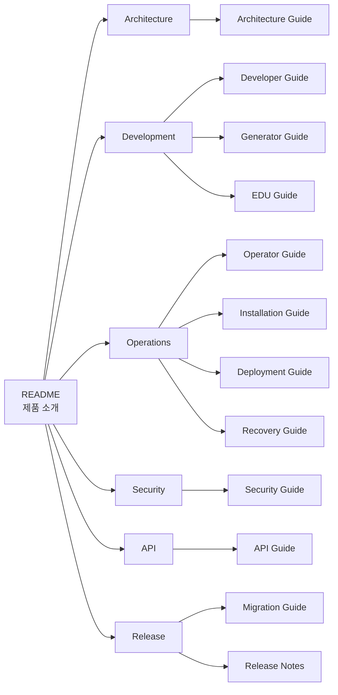

# CPF Documentation

Core Platform Framework의 공식 제품 문서입니다.

이 디렉터리의 Markdown 문서가 개발·운영 문서의 정본이며, PDF·DOCX·HTML은 Release 시 정본으로부터 생성합니다.

## Documentation Map



## Guides

### Architecture

- [Architecture Guide](architecture/ARCHITECTURE_GUIDE.md)  
  제품 구조, Module Ownership, 호출 경계, 상태·복구·운영 원칙

### Development

- [Developer Guide](development/DEVELOPER_GUIDE.md)  
  개발 환경, Package 구조, API, DB, Test, Frontend와 품질 기준
- [Generator Guide](development/GENERATOR_GUIDE.md)  
  신규 업무 주제영역 생성, 검증, 삭제와 확장
- [EDU Guide](development/EDU_GUIDE.md)  
  Reference Domain과 교육 시나리오

### Operations

- [Operator Guide](operations/OPERATOR_GUIDE.md)  
  서비스, 거래, Batch, Worker, Log와 운영 조치
- [Installation Guide](operations/INSTALLATION_GUIDE.md)  
  신규 설치, 설정, DB와 외부 WAS
- [Deployment Guide](operations/DEPLOYMENT_GUIDE.md)  
  Build, Release, Rolling Deployment와 Rollback
- [Recovery Guide](operations/RECOVERY_GUIDE.md)  
  장애 분류, 결과 불명, 재처리, 복구와 DR

### Security

- [Security Guide](security/SECURITY_GUIDE.md)  
  인증, 권한, Secret, mTLS, 개인정보와 감사

### API

- [API Guide](api/API_GUIDE.md)  
  Header, 오류, 멱등성, Paging, Versioning과 OpenAPI

### Release

- [Migration Guide](releases/MIGRATION_GUIDE.md)  
  버전 Upgrade, DB Migration, 호환성과 Rollback
- [Release Notes](releases/RELEASE_NOTES.md)  
  Release별 기능, 호환성과 적용 사항

## Document Roles

- `README.md`: 제품의 얼굴과 빠른 시작
- `Guide`: 사용자 역할별 사용·운영 방법
- `Specification`: API, 상태, 데이터와 동작 계약
- `Evidence`: 실제 실행 근거
- `Work/Review`: 작업 요청, 검수와 진행 관리
- `Generated`: Inventory와 Traceability 파생 자료

작업 문서, 검수 문서, 날짜별 Evidence와 자동 생성 자료는 제품 Guide에 혼합하지 않습니다.

## Reading Markdown in VS Code

- 미리보기 열기: `Ctrl + Shift + V`
- 편집기 옆 미리보기: `Ctrl + K`, `V`
- Mermaid가 렌더링되지 않으면 Markdown Preview Mermaid 지원 확장을 사용합니다.

## Release Conversion

Markdown을 DOCX 또는 PDF로 변환하는 예시입니다.

```bash
pandoc cpf-docs/development/DEVELOPER_GUIDE.md \
  --toc \
  -o dist/docs/DEVELOPER_GUIDE.docx
```

```bash
pandoc cpf-docs/development/DEVELOPER_GUIDE.md \
  --toc \
  -o dist/docs/DEVELOPER_GUIDE.pdf
```
