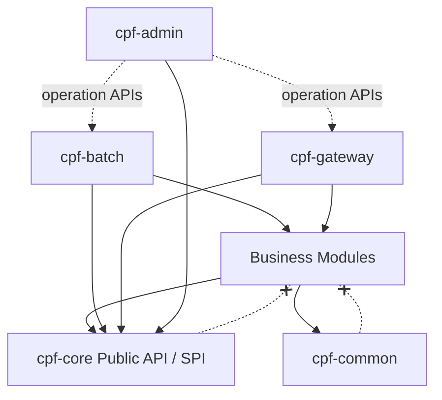
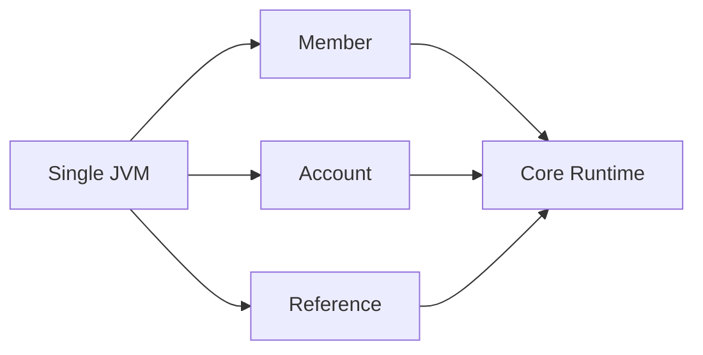
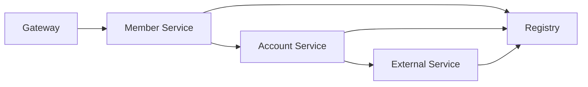
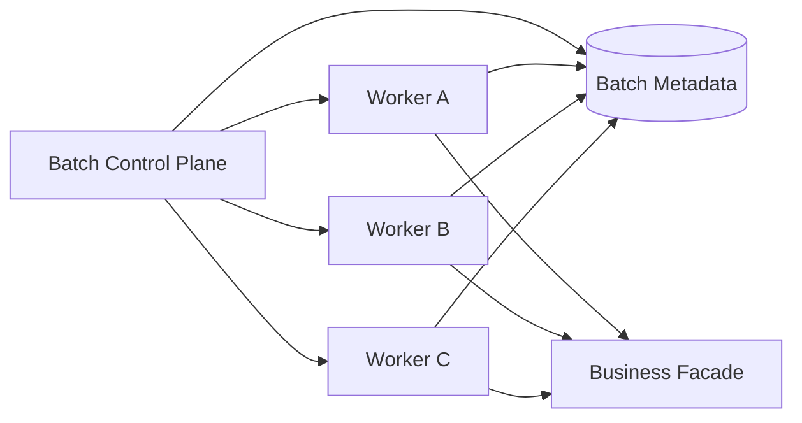

# CPF Architecture Guide

## 1. Purpose

이 문서는 Core Platform Framework의 제품 구조, Module Ownership, 의존성 방향, Runtime topology, 확장 경계와 운영 원칙을 정의합니다.

## 2. Architecture Goals

CPF는 다음 품질 속성을 우선합니다.

- **Consistency**: 모든 도메인이 동일한 Header, 오류, Log, 보안과 개발 구조 사용
- **Reliability**: 부분 실패, Timeout, Retry, Unknown Result와 Recovery 대응
- **Scalability**: 다중 인스턴스, Worker 분산과 수평 확장
- **Observability**: 거래, 구간, 외부 호출, Batch와 운영 조치 추적
- **Security**: 최소 권한, 개인정보 보호, Secret 관리와 감사
- **Extensibility**: Public API, SPI와 Generator 기반 확장
- **Operability**: 운영자가 조회, 차단, 재처리, 승인과 복구 가능
- **Portability**: MSA, Modular Monolith, JAR, WAR와 분리 WAS 지원

## 3. Module Ownership

### cpf-core

기술 공통 Contract와 Runtime capability를 소유합니다.

- 표준 Header와 거래 식별자
- 오류, Validation과 Message 조립
- Local/Remote 호출 공통 Contract
- Retry, Timeout, Circuit Breaker와 Bulkhead
- Idempotency, Lock과 상태 전이 기반
- Logging, Tracing, Audit 공통 계약
- Public API와 확장 SPI

업무 Entity, 특정 기관 전문, 관리자 화면과 AI 전용 기능을 소유하지 않습니다.

### cpf-gateway

외부 진입점과 정책 집행을 소유합니다.

- 인증 전처리
- Channel·Client 허용 정책
- Routing, Load Balance와 Failover
- Timeout budget과 Circuit Breaker
- 외부 공유 호출 차단
- 요청 Header 정규화와 Trust Boundary
- Gateway 거래 로그와 Metric

내부 도메인 호출을 중계하지 않습니다.

### cpf-common

여러 업무 도메인에서 공유하는 고객 업무 공통을 소유합니다.

- 공통 코드와 업무 기준정보
- 공통 업무 Value Object
- 공통 파일·첨부 업무 정책
- 고객 프로젝트 공통 검증

기술 Runtime과 특정 업무 기능을 소유하지 않습니다.

### cpf-admin

플랫폼 Control Plane을 소유합니다.

- 서비스·Endpoint·Instance Registry
- 거래 조회와 Timeline
- 로그, Trace Boost와 동적 설정
- Batch·Worker 관제
- 보안·감사·승인
- 운영 통계와 Alert

### cpf-biz-admin

고객 업무 관리 기능을 소유합니다.

- 회원·계좌·기준정보 관리
- 업무별 승인과 조회
- 업무 운영 다운로드
- 업무 권한과 메뉴

### cpf-batch

Batch·Scheduler·Agent·Worker·Center-Cut을 소유합니다.

- Job·Step·Schedule
- Worker Registration과 Heartbeat
- Claim, Lease, Fencing과 Takeover
- Partition, Checkpoint와 Restart
- Center-Cut item/result 저장소
- 업무별 Provider·Repository·Handler Adapter

### Business Modules

`cpf-member`, `cpf-account`, `cpf-reference`, `cpf-external`은 각 업무의 Application, Domain, Port와 Adapter를 소유합니다.

## 4. Dependency Direction



### Mandatory Rules

- `cpf-core`는 업무 Module을 참조하지 않습니다.
- 업무 Module은 다른 업무 Module의 Repository나 DB Table을 직접 접근하지 않습니다.
- 공통 Module에 특정 업무 기능을 임시 적치하지 않습니다.
- 운영 화면은 내부 구현 Class가 아니라 운영 API를 호출합니다.
- SPI는 실제 Consumer와 기본 구현이 있을 때만 제공합니다.
- Module 간 순환 의존을 허용하지 않습니다.

## 5. Package Structure

```text
com.cpf.<domain>.<feature>/
├─ api/             Public API와 DTO
├─ application/     Use case와 orchestration
├─ domain/          Aggregate, Entity, Value Object와 policy
├─ port/            외부 의존 경계
├─ adapter/         DB, HTTP, Broker와 File 구현
├─ repository/      Persistence contract
├─ mapper/          DB·전문·API mapping
├─ validation/      업무 검증
├─ config/          Module 설정
└─ internal/        외부 공개 금지 구현
```

Controller·Service·DTO만으로 구성된 평면 구조를 피하고, 업무 기능 단위로 응집시킵니다.

## 6. Runtime Topologies

### Modular Monolith



- 동일 JVM Adapter가 업무 Contract를 직접 호출합니다.
- Remote 호출과 동일한 입력 검증·오류·Header 처리를 유지합니다.
- 기술적 Network retry를 적용하지 않습니다.

### Microservices



- Remote Adapter는 Service discovery, Timeout budget과 장애 격리를 적용합니다.
- Retry는 멱등성과 결과 불명 정책을 만족할 때만 수행합니다.
- 내부 호출은 Gateway를 재경유하지 않습니다.

## 7. Service Call Model

업무 호출 Contract는 다음 요소를 포함합니다.

- 업무 기능 ID
- 요청 DTO
- 표준 Header
- 호출 Option
- Timeout budget
- Idempotency key
- 응답 또는 표준 오류
- 거래 Global ID와 Segment ID

### Local and Remote Parity

동일 업무 기능은 Local과 Remote에서 다음이 같아야 합니다.

- Validation
- 권한 판단
- Error code
- Audit
- Transaction identity
- Idempotency
- Response schema

Network 특성에 의한 Timeout·Circuit Breaker·Retry만 Remote Adapter가 추가합니다.

## 8. Transaction Identity and Tracing

주요 Header:

- `X-Transaction-Id`
- `X-Trace-Id`
- `X-Transaction-Segment-Id`
- Channel·Caller·User 식별자
- 외부기관·Endpoint 식별자
- `X-Cpf-Ext-1` ~ `X-Cpf-Ext-5`

원본 외부 Header를 무조건 신뢰하지 않습니다. Gateway 또는 신뢰 경계에서 허용 항목만 채택하고 나머지는 재생성하거나 제거합니다.

거래 Timeline은 다음을 표현합니다.

- Parent·Child
- Caller·Callee
- Local·Remote
- Request·Response
- 시작·종료·소요시간
- 오류·실패 구간
- Retry attempt
- 보상·재처리·수동 복구

## 9. Failure and Recovery Model

### Failure Categories

- Validation failure
- Authorization failure
- Business rejection
- Timeout
- Target unavailable
- Partial failure
- Unknown result
- Duplicate request
- Data conflict
- Infrastructure failure

### Unknown Result

Timeout이 발생했지만 상대 시스템 처리 여부를 알 수 없으면 자동 재호출로 단정하지 않습니다.

1. Idempotency key 확인
2. 상대 결과 조회
3. 내부 거래 상태와 비교
4. Reconciliation
5. 필요 시 보상
6. 운영 승인 후 수동 복구

## 10. Batch and Worker Architecture



필수 안전장치:

- Lease expiry
- Fencing token
- Heartbeat
- Drain
- Graceful stop
- Ghost worker 정리
- Takeover
- 최대 동시성
- 동일 item 중복 처리 방지
- Checkpoint와 Restart

## 11. Data Architecture

- Table과 Migration의 Owner Module은 하나입니다.
- 다른 도메인 DB를 직접 조회하지 않습니다.
- 설치 SQL과 Flyway Migration은 동일 schema 결과를 생성합니다.
- MariaDB를 우선 실검증하고, PostgreSQL·Oracle·SQL Server dialect를 분리합니다.
- DB Transaction과 외부 호출을 하나의 ACID Transaction으로 가장하지 않습니다.
- Outbox, Saga 또는 Reconciliation을 사용합니다.

## 12. Security Architecture

- 인증과 외부 Trust Boundary: Gateway
- 업무 권한: 업무 Module과 정책 Engine
- 관리자 권한·승인·감사: ADM/BZA
- Secret: 외부 Secret Provider
- 개인정보 Masking: 응답·로그·다운로드 전 계층
- mTLS와 인증서: Endpoint 정책과 Rotation
- 보안 이벤트: 별도 Audit stream

## 13. Observability

- 구조화 Application log
- 거래 단위 File log
- DB transaction log
- Metric
- Distributed trace
- Security event
- Audit event
- Batch·Worker meter
- Health와 Readiness

Observability 실패가 거래를 중단할지 여부는 데이터 중요도와 규제 요구에 따라 fail-open 또는 fail-close로 명시합니다.

## 14. Extension Model

### Public API

고객 개발자가 안정적으로 사용하는 Contract입니다. 호환성 정책을 적용합니다.

### SPI

고객 또는 업무 Module이 교체하는 확장 경계입니다. 기본 구현, 오류 계약과 운영 노출을 함께 제공합니다.

### Internal

제품 내부 구현입니다. 외부 사용을 금지하고 호환성을 보장하지 않습니다.

## 15. Prohibited Patterns

- `cpf-core`에 업무 또는 AI 기능 적치
- 업무 Module 간 DB 직접 접근
- Gateway를 내부 Service Bus로 사용
- 실제 Consumer 없는 Interface
- 실행 검증 없는 문서 완료
- 무제한 Retry
- Timeout 후 무조건 재호출
- 전역 관리자 권한
- 원문 개인정보 Log
- 임시 SQL을 설치 정본으로 사용
- Sample을 제품 구현으로 간주


## 16. 확정 Ownership 보정

### Fixed-Length

범용 고정길이 전문 Engine, Layout/Field/Group Contract, byte-length parsing/writing, encoding, validation, masking과 extension SPI는 `cpf-core`가 소유합니다. 기관별 Layout, Mapping, Endpoint, Adapter와 기관 오류 정책은 `cpf-external`이 소유합니다. `cpf-common` 또는 `cmnDB`는 이를 소유하지 않습니다.

### 업무 채번

업무 채번은 Core/Common 필수 기능이 아닙니다. `cpf-biz-admin`은 선택형 Customization Sample과 관리 화면만 제공하며 실제 Runtime Owner는 고객 Common 확장, 업무 도메인 또는 별도 고객 Service입니다. 온라인 업무가 BZA 가용성에 의존해서는 안 됩니다.

### cmnDB

`cmnDB`는 설치 시 생성하되 최소 Sample Table 1개만 제공하며, Common은 DB-less Extension으로도 사용할 수 있어야 합니다.

### Batch Physical Ownership

Batch, Scheduler, Agent, Runner, Worker와 Center-Cut 상태는 `cpf-batch`가 소유합니다. Table Prefix와 Schema는 Owner와 일치시키고 예외는 ADR과 Migration으로 설명합니다.

## 17. Center-Cut Runtime 경계

`CenterCutRunner`는 일반 Batch Agent와 구분되는 Runtime 책임입니다. Job Claim, immutable parameter 복원, target/item 생성, Worker 분배, 속도 제어, 집계, 중지·재개, 재시도, 결과 불명 복구와 다중 인스턴스 중복 방지를 담당합니다. Agent 내부 또는 별도 Process로 배포할 수 있어야 합니다.

## 18. Architecture Decision 완료 조건

Architecture 변경은 다음이 함께 있어야 합니다.

- Owner Module과 Package
- Public API/SPI/Internal 경계
- 실제 Consumer
- Local/Remote topology
- SQL/Migration과 Rollback
- Security/Audit/Masking
- Multi-instance/Failure/Recovery
- Test와 Runtime Evidence
- Guide와 Generator 반영

## 15. 2026-07-24 Architecture Baseline

- Vendor SQL physical owner는 `cpf-tools/db/vendor/<vendor>` 하나다. Module-local Vendor SQL fallback은 사용하지 않는다.
- ADM은 다른 Owner DB를 직접 제어하지 않고 Local/Remote Owner Query/Command Contract를 사용한다.
- ADM Approval과 BZA Approval은 별도 Engine/DB/Policy다. 상세는 `APPROVAL_ARCHITECTURE_GUIDE.md`를 따른다.
- Batch/Scheduler/Agent/Worker/Center-Cut Runtime owner는 `cpf-batch`; Core에는 topology-neutral API/SPI만 둔다.
- Requirement ID는 `CPF_REQUIREMENT_CONTINUITY_LEDGER.md`를 통해 영구 추적한다.
