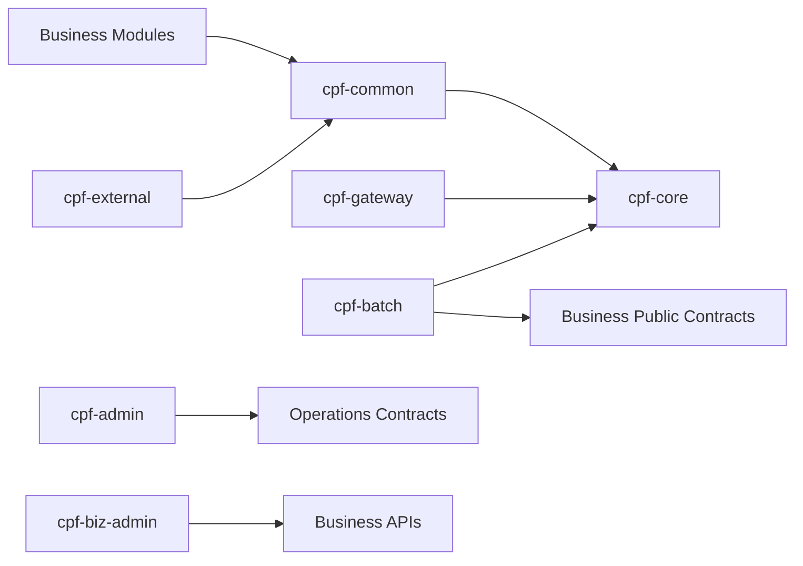

# CPF Architecture Guide

## 1. Architecture Drivers

- 금융권 수준 보안·감사
- Multi-instance
- Partial Failure
- Unknown Result
- MSA·Modular Monolith
- Independent Deployment
- Upgrade·Rollback
- Customer Extension
- Operational Control

## 2. Layer Model

```text
Public API
Application
Domain
Port/SPI
Adapter
Internal Runtime
Operations
```

Public Contract와 Internal 구현을 Package·Artifact·ArchUnit로 분리한다.

## 3. Module Ownership

### cpf-core

기술 공통 Contract·Runtime. 업무 의미 금지.

### cpf-common

고객사 공통 정책·Extension. 기본 제품 기술 Engine 적치 금지.

### cpf-gateway

External Entry·Routing·Policy.

### cpf-batch

Batch·Agent·Runner·Worker·Center-Cut.

### cpf-admin

Platform Control Plane.

### cpf-biz-admin

Customer Business Admin.

### cpf-external

Institution-specific Integration Domain.

### Generated Business Modules

고객 업무와 최소 Reference.

## 4. Dependency Graph



## 5. Local/Remote Parity

- 같은 업무 Contract
- Local Adapter
- Remote Adapter
- Header/Context 동일
- Error Mapping 동일
- Timeout·Idempotency 동일 의미
- Local 호출이 Gateway 재경유하지 않음

## 6. State and Failure

상태 변경 기능은 다음을 함께 설계한다.

- Idempotency
- Concurrency
- Retry
- Timeout
- Unknown
- Reconciliation
- Compensation
- Audit
- Operations

## 7. Data Ownership

- Schema·Table Owner 1개
- 다른 Domain DB 직접 접근 금지
- Read Model·API·Event로 공유
- Batch/통계 예외는 문서·승인·Read-only
- Physical Naming이 Owner를 드러냄

## 8. Runtime Topology

### Small

- Modular Monolith
- Embedded Agent/Runner
- Local Adapters

### Large

- Independent Services
- Separate Gateway
- Separate Batch Agent
- Separate CenterCutRunner
- Worker Pool
- ADM/BZA independent UI

Contract는 Topology에 종속되지 않는다.

## 9. Extension

### API

일반 개발자 사용.

### SPI

고객 정책·Adapter 확장.

### Internal

호환성 보장 대상 아님.

### Sample

Reference일 뿐 Product Owner가 아님.

## 10. Architecture Decision Gate

신규 기능 전:

1. Owner
2. API/SPI/Internal
3. Dependency
4. Local/Remote
5. Multi-instance
6. Failure
7. Security
8. Operations
9. Migration
10. Generator
11. Consumer
12. Evidence
