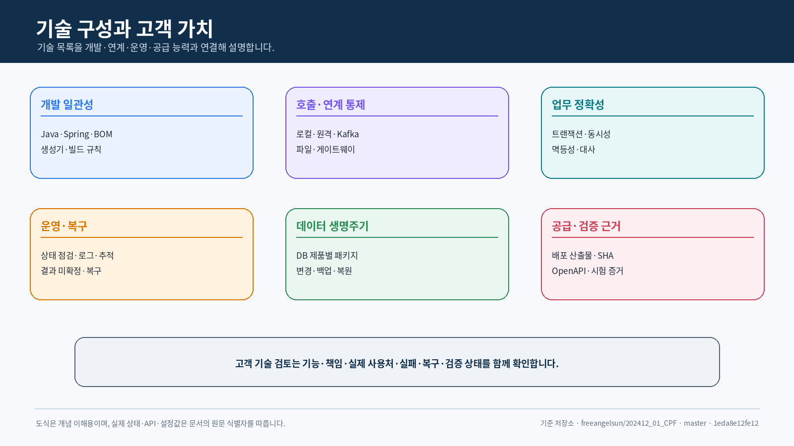

<div align="center">

# 코어 플랫폼 프레임워크(Core Platform Framework)
## 기술사양서

**고객이 CPF의 실제 기술 구성과 연계·배포·운영 조건을 판단할 수 있도록 적용 계약을 정리합니다.**

`기술 구성 · API · 설정 · 실행 · 호환성`

</div>

<p align="center">
  
</p>

---
## 문서 안내

| 항목 | 내용 |
|---|---|
| 목적 | CPF의 기술 값, 입력·기본값, 배포 산출물, 인터페이스, 실행 환경 계약 확인 |
| 주요 독자 | 고객 아키텍트·기술 검토자, 개발·연동·보안·빌드·배포·운영 담당자 |
| 값 정본 | `gradle/cpf-stack.properties`, `gradle/cpf-platform.properties`, 잠금 파일, 소스코드 |
| 주의 | 문서의 버전보다 소스코드 기준이 우선하며 `SNAPSHOT`과 `TARGET` 상태를 숨기지 않음 |


## 기술 검토자를 위한 판단 요약

### 이 문서는 무엇을 확인하는가

기술사양서는 CPF가 어떤 기술로 만들어졌는지만 적는 문서가 아닙니다. 고객 환경에서 실제로
설치·연결·개발·운영할 수 있는지 판단하기 위해 다음을 확인합니다.

- 어떤 개발 언어와 프레임워크 버전을 사용하는가
- 어떤 라이브러리와 실행 프로그램을 설치하거나 참조하는가
- API와 메시지가 어떤 형식으로 요청과 결과를 주고받는가
- 로컬·원격·Kafka·파일·배치 처리가 어떤 실패 계약을 공유하는가
- 고객 DB와 배포 산출물 저장소, 폐쇄망 환경에 어떻게 공급하는가
- 화면과 백엔드 API가 어떻게 같은 계약을 사용하는가
- 어떤 항목이 소스코드에 있고 어떤 항목은 실행 환경 검증이 더 필요한가

<p align="center">
  
</p>

### 기술 구성을 쉬운 말로 보면

| 기술 구성 | 쉬운 설명 | 고객이 확인할 이유 |
|---|---|---|
| Java·Spring | 백엔드 업무 기능을 만드는 기본 실행 환경 | 고객 개발 표준과 버전 호환 여부 |
| Vue 화면 | ADM·BZA 운영 화면을 만드는 웹 기술 | 브라우저·접근성·생성 클라이언트 검증 |
| 플랫폼 BOM | 여러 라이브러리 버전을 맞추는 공통 목록 | 개발자마다 다른 의존성이 들어가는 것을 방지 |
| 공통 빌드 규칙 플러그인 | 모든 모듈에 같은 빌드·시험 규칙을 적용 | 새 업무도 같은 품질 기준으로 시작 |
| 스타터 관리 프로젝트 | `cpf-stater`가 선택 기능 제품군의 루트 등록·목록·통합 검증을 관리 | 프로젝트 구조 누락을 방지하고 기능별 선택 사용을 유지 |
| 선택 기능 모듈 | 보안·Kafka·캐시 같은 기능을 선택 적용 | 필요한 기능만 추가하고 설정 편차를 줄임 |
| OpenAPI·생성 클라이언트 | 백엔드 API 약속과 화면 호출 코드를 연결 | 화면과 API 변경 불일치를 조기에 확인 |
| 배포 산출물 공급 방식 | 개발망·내부 저장소·폐쇄망 공급 방식 | 고객 네트워크와 배포 정책에 맞는 설치 경로 |
| DB 제품별 패키지 | MariaDB·PostgreSQL·Oracle별 SQL 차이 관리 | 고객 DB에서 설치·업그레이드·복구 가능 여부 |
| 로그·지표·추적·감사 | 상태·성능·요청 경로와 조치 이력 | 운영자가 장애 원인과 결과를 확인 |

### 설치·배포되는 결과물

CPF는 소스코드만 전달하고 고객이 알아서 조립하는 구조를 목표로 하지 않습니다. 다음 결과물을
버전과 소스코드 기준으로 관리합니다.

| 결과물 | 사용 위치 |
|---|---|
| 코어·공통·선택 기능 모듈 JAR | 고객 업무 애플리케이션이 참조 |
| 플랫폼 BOM·공통 빌드 규칙 플러그인 | 고객 빌드가 의존성과 품질 규칙을 사용 |
| ADM·BZA·게이트웨이 실행 JAR/WAR | 운영·업무 관리·API 진입 실행 환경 |
| 배치 실행 환경 JAR | 일정 실행기·작업자·Center-Cut·에이전트 실행 |
| DB 제품별 패키지 | 신규 설치·업그레이드·복구 SQL |
| 화면 정적 파일 | ADM·BZA 브라우저 화면 |
| 목록 파일·검사값·SBOM | 소스코드·버전·파일 무결성과 공급 근거 |
| 폐쇄망 묶음 | 외부 Registry를 사용할 수 없는 환경 |

### 고객 환경과 맞춰야 하는 입력

| 고객 제공 정보 | CPF에서 결정되는 사항 |
|---|---|
| Java·Spring·빌드 표준 | 도구 체계·플러그인·BOM·의존성 호환성 |
| 배포 방식과 망 구간 | Spring Boot JAR·WAR, 게이트웨이, 내부·외부 경로, TLS |
| 인증·권한·감사 체계 | 세션/JWT/HMAC, 역할·권한·데이터 범위, 감사 |
| 메시징·외부 연계 | Kafka, Outbox/Inbox, REST·전문·파일 연결 어댑터 |
| DB 제품과 운영 정책 | DB 제품별 패키지, 스키마, DB 변경, 백업·복원 |
| 배포 산출물 저장소·폐쇄망 | `REMOTE` 또는 폐쇄망 공급과 인증 정보·검사값 |
| 성능·가용성 목표 | 시간초과·연결 풀·대기열·분할·수평 확장·장애 시험 |
| 운영 조직과 승인 체계 | ADM/BZA 역할, 위험 명령, 사유·승인·감사 |

### 기술 검토 완료의 의미

기술 검토는 버전 표를 확인하는 것으로 끝나지 않습니다.

1. 고객 환경에서 사용할 모듈과 선택 기능 모듈을 정합니다.
2. 고객 업무가 수정할 영역과 CPF가 유지할 공개 API·SPI 경계를 정합니다.
3. 온라인·메시지·파일·배치·게이트웨이의 시간초과과 실패 의미를 맞춥니다.
4. DB 설치·업그레이드·복구와 배포 산출물 공급 방식을 정합니다.
5. 실행 환경 OpenAPI·생성 클라이언트·브라우저·DB·장애 검증 범위를 합의합니다.
6. 실제로 실행하지 않은 항목은 미검증으로 남깁니다.

뒤의 장은 위 판단을 위한 실제 버전, 배포 산출물, API, 설정, 소스코드와 상태를 제공합니다.

## 0. 기술 사양 한눈에 보기

| 영역 | 현재 기준 |
|---|---|
| 플랫폼 버전 | `1.0.0-SNAPSHOT` |
| 호환 범위 | `[1.0.0,2.0.0)` |
| 기술 구성 상태 | `TARGET` |
| Language/빌드 | Java 25 · Gradle 9.1.0 |
| 백엔드 | Spring Boot 4.1.0 · Spring MVC |
| 게이트웨이 | Spring 클라우드 게이트웨이 서버 웹 MVC |
| 배치 | Spring Batch 6.0.4 · db-일정 실행기 16.7.0 |
| Database | MariaDB · PostgreSQL · Oracle · Flyway OSS 코어 |
| 메시지 처리 | Kafka · Outbox/Inbox · at-least-once |
| 화면 실행 환경 | Node `>=22.18.0 <25` · npm `10.9.2` |
| 화면 | Vue 3.5.40 · 라우터 5.2.0 · Pinia 4.0.2 · Element Plus 2.14.3 |
| API 클라이언트 | Orval 8.23.0 · 소스코드·배포본 OpenAPI 입력 검증 |
| 관측 | Micrometer Observation · OpenTelemetry |
| 배포 산출물 공급 방식 | `LOCAL_DEV` · `REMOTE` · `OFFLINE` |

> `stackState=TARGET`이므로 현재 기준은 목표 기술 구성 소스코드입니다. 루트의 `commercialReleaseGate`는
> `SUPPORTED_GA` 상태를 요구하므로 이번 문서 작성만으로 배포본 수용 기준 통과를 주장하지 않습니다.

## 1. 기술 구성과 버전

### 1.1 백엔드·빌드

| 항목 | 버전 | 정본 |
|---|---:|---|
| Java | 25 | `gradle/cpf-stack.properties` |
| Gradle | 9.1.0 | 기술 구성 설정·Wrapper |
| Spring Boot | 4.1.0 | 기술 구성 설정 |
| Spring 의존성 Management | 1.1.7 | 기술 구성 설정 |
| Spring 클라우드 | 2025.1.2 | 기술 구성 설정 |
| Spring Batch | 6.0.4 | 기술 구성 설정 |
| Servlet | 6.1 | 기술 구성 설정 |
| Open기능 | 1.17.0 | 기술 구성 설정 |
| db-일정 실행기 | 16.7.0 | 기술 구성 설정 |
| CycloneDX Gradle | 3.0.1 | 기술 구성 설정 |

### 1.2 화면

| 항목 | ADM/BZA 버전 |
|---|---:|
| Node | `>=22.18.0 <25` |
| npm | `10.9.2` |
| Vue | `3.5.40` |
| Vue 라우터 | `5.2.0` |
| Pinia | `4.0.2` |
| TanStack Vue 조회문 | `5.101.4` |
| TanStack Vue 테이블 | `8.21.3` |
| Element Plus | `2.14.3` |
| Zod | `4.4.3` |
| Orval | `8.23.0` |
| Vite | `8.1.5` |
| Vitest | `4.1.10` |
| Playwright | `1.62.0` |
| TypeScript | `6.0.3` |
| vue-tsc | `3.3.7` |
<p align="center">
  
</p>
## 2. 모듈과 배포 산출물 목록

### 2.1 `cpf-stater` 프로젝트 등록 사양

| 항목 | 값 |
|---|---|
| 정확한 저장소 경로 | `cpf-stater/` |
| 정확한 Gradle 프로젝트 ID | `:cpf-stater` |
| 프로젝트 유형 | 스타터 제품군 루트 관리 프로젝트 |
| 관계 경로 | 기존 구현은 `cpf-starters/*`에 유지 |
| 주요 책임 | 스타터 목록, 루트 등록, 통합 검증, BOM·게시·문서 연결 확인 |
| 실제 사용처 | 루트 빌드·품질 검증·제품 구성 목록 |
| 고객 실행 의존성 | 전체 스타터를 일괄 추가하지 않고 필요한 `:cpf-starter-*`만 선택 |
| 데이터 소유 | 기본 없음. DB 자원이 있으면 기능별 책임 주체와 DB 변경 경로를 별도 선언 |
| 현재 Git 상태 | 기준 커밋 `1eda8e12fe123281748a4388938c62f11819da1e`의 `settings.gradle`에는 미등록 |
| 동일 푸시 수용 조건 | `cpf-stater/`, `:cpf-stater`, 빌드·시험·프로젝트 목록이 함께 등록 |

목표 `settings.gradle` 등록:

```groovy
include 'cpf-stater'
project(':cpf-stater').projectDir = file('cpf-stater')
```

등록 후 최소 확인 명령:

```powershell
git ls-files -- cpf-stater cpf-starters settings.gradle build.gradle
.\gradlew.bat projects | Select-String 'cpf-stater|cpf-starter-'
.\gradlew.bat :cpf-stater:check
```

`cpf-stater`가 실제 배포 산출물을 생성하는지는 `cpf-stater/build.gradle`을 기준으로 판정합니다.
소스 확인 없이 JAR·POM·게시 작업을 문서에서 만들지 않습니다.

### 2.2 현재 7개 기능별 스타터 사양

현재 기준 커밋의 기능별 스타터는 모두 `cpf-starters/*` 아래에 있고, 각 모듈의
`AutoConfiguration.imports`로 자동 설정 진입점을 등록합니다.

| Gradle 프로젝트 | 실제 경로 | 자동 설정 진입점 | 주요 활성 조건 | 핵심 설정·필수 빈 | 선택 기준 |
|---|---|---|---|---|---|
| `:cpf-starter-security` | `cpf-starters/security` | `CpfServerSessionSecurityAutoConfiguration` | 서블릿 웹, `DataSource`, Spring Security·Session 클래스, `cpf.security.session.enabled=true` | `cpf.security.session.*`, JDBC Vault, Spring Session, 제품 환경 암호화 키 | ADM/BZA 관리자 브라우저 세션과 자격 증명 보호 |
| `:cpf-starter-messaging-kafka` | `cpf-starters/messaging-kafka` | `CpfKafkaAutoConfiguration` | `KafkaTemplate` 클래스, Bridge는 `cpf.broker.type=KAFKA` | `cpf.messaging.kafka.*`, `KafkaTemplate`, `ObjectMapper` | Kafka Event 발행·수신과 Broker 계약 구현 |
| `:cpf-starter-cache` | `cpf-starters/cache` | `Cpf캐시AutoConfiguration` | `Cpf캐시Port` 클래스, 제공자별 `cpf.cache.provider` | LOCAL 기본, CAFFEINE·REDIS 선택, 크기·페이로드·Redis·비밀값·무효화 | 반복 조회·참조 데이터 캐시와 분산 잠금·무효화 |
| `:cpf-starter-observability` | `cpf-starters/observability` | `CpfObservabilityAutoConfiguration` | `ObservationRegistry` Class | `ObservationRegistry`, 수집기·Label·거래 식별자 정책 | 요청·Event·Batch·외부 호출 관측 |
| `:cpf-starter-resilience` | `cpf-starters/resilience` | `CpfResilienceAutoConfiguration` | `CircuitBreakerFactory` Class | 회로 차단기 구현, 시간초과·격리·재시도·대사 정책 | 원격·외부 호출 장애 격리 |
| `:cpf-starter-featureflag` | `cpf-starters/featureflag` | `CpfFeatureFlagAutoConfiguration` | OpenFeature `OpenFeatureAPI` Class | OpenFeature 제공자·클라이언트, 기본값·대상 문맥 | 단계 공개·사용자/조직별 기능 전환 |
| `:cpf-starter-secret` | `cpf-starters/secret` | `CpfSecretAutoConfiguration` | 자동 설정은 로드되며 제공자가 없으면 기동 실패 | 하나 이상의 `CpfSecretProvider` | 고객 관리 비밀값 저장소 연결 |

#### 보안 스타터

- 설정 접두어는 `cpf.security.session`입니다.
- 기본 Cookie 이름은 `CPFSESSION`, 기본 Timeout은 30분, `SameSite` 기본값은 `Strict`입니다.
- 관리자 경로 `/adm/**`, `/bza/**`, `/api/bza/**`에 별도 Security Filter Chain을 적용합니다.
- 자격 증명 원문은 Session Attribute에 두지 않고 `CPF_BFF_CREDENTIAL_VAULT`에 암호화해 저장합니다.
- 제품 환경에서는 암호화 키와 JDBC 준비 상태를 Fail-closed로 확인해야 합니다.

#### Kafka 스타터

- 설정 접두어는 `cpf.messaging.kafka`입니다.
- 확인 시간 기본값은 10초, 최대 페이로드 기본값은 1 MiB이며 16 MiB 초과를 거부합니다.
- `CpfBrokerClient`는 `KafkaTemplate`이 있으면 제공하고, `CpfBrokerBridgePort`는
  `cpf.broker.type=KAFKA`일 때 제공합니다.
- 메시지 전송 성공과 업무 반영 성공을 구분하고, 중복·순서·재처리·대사 정책을 업무 계약과 연결합니다.

#### 캐시 스타터

- `cpf.cache.provider` 기본값은 `LOCAL`이며 `CAFFEINE`, `REDIS`를 선택할 수 있습니다.
- Caffeine 기본 최대 항목 수는 10,000, 최대 페이로드는 1 MiB입니다.
- Redis 제공자는 Redis 연결과 비밀값 참조, 분산 잠금, 빠른 무효화와 JDBC 기반 지속 무효화 이력을 함께 검토합니다.
- 캐시는 원본 업무 데이터의 책임 주체가 아니며 장애 시 원본 조회와 정상화 기준이 있어야 합니다.

#### 관측·복원력·기능 플래그·비밀값 스타터

- 관측 스타터는 `ObservationRegistry`가 있을 때 `CpfObservationSupport`를 제공합니다.
- 복원력 스타터는 `CircuitBreakerFactory`가 있을 때 `CpfResilienceExecutor`를 제공합니다.
- 기능 플래그는 OpenFeature 클라이언트 `cpf`를 사용하며 권한이나 영구 업무 규칙을 대신하지 않습니다.
- 비밀값 스타터는 승인된 `CpfSecretProvider`가 한 개도 없으면 기동을 거부합니다.

### 2.3 공개 플랫폼 배포 산출물

| 소스코드 단위 | 대표 배포 산출물 | 공급 대상 |
|---|---|---|
| `cpf-core` | JAR, Sources, JavaDoc, POM | 모든 CPF 실제 사용처 |
| `cpf-common` | JAR, Sources, JavaDoc, POM | 업무 영역 |
| `cpf-batch:contract` | 계약 JAR | 배치 클라이언트·ADM·업무 영역 |
| `cpf-tools/build/platform-bom` | `com.cpf.platform:cpf-platform-bom` | 독립 업무 영역·서비스 |
| `cpf-tools/build/gradle-plugin` | 플러그인 `com.cpf.platform-conventions` | CPF 빌드 실제 사용처 |
| ADM/BZA | Spring Boot JAR·WAR + 정적 자원 | 운영·업무 관리 |
| 게이트웨이 | Boot JAR | 외부 진입 실행 환경 |
| 배치 실행 환경 단위 | 처리별 JAR | 제어 서버·일정 실행기·작업자·실행기·에이전트 |
| DB 제품별 패키지 | DB 변경·되돌리기·검사값 | 설치·업그레이드 |
| 폐쇄망 묶음 | Maven 구조 + 목록 파일·검사값 | 외부 저장소를 사용할 수 없는 환경 |

### 2.4 공통 빌드 규칙 플러그인

| 항목 | 값 |
|---|---|
| 소스코드 | `cpf-tools/build/gradle-plugin` |
| 그룹 | `com.cpf.gradle` |
| 플러그인 ID | `com.cpf.platform-conventions` |
| 버전 | `gradle/cpf-platform.properties`의 `platformVersion` |
| Java | 25 도구 체계 |
| 소스코드 공급 | `settings.gradle`의 `pluginManagement.includeBuild(...)` |
| 게시 | 로컬·검증 저장소·내부 저장소 작업 |

### 2.5 플랫폼 BOM

| 항목 | 값 |
|---|---|
| 소스코드 | `cpf-tools/build/platform-bom` |
| 그룹 | `com.cpf.platform` |
| 배포 산출물 | `cpf-platform-bom` |
| 정렬 대상 | Spring Boot BOM, Spring 클라우드 BOM, CPF 코어·공통·배치 계약 |
| 소스코드 공급 | `settings.gradle`의 `includeBuild(...)` |
| 게시 | 로컬·검증 저장소·내부 경로 |

### 2.6 경량 `cpf-core` 목표 사양

현재 `cpf-core/build.gradle`과 목표 구조를 구분합니다.

| 현재 코어 의존·기능 | 목표 원칙 | 분리 상태 |
|---|---|---|
| `mybatis-spring-boot-starter` | DB 접근 구현과 Mapper 자동 설정을 선택 기능으로 이동 | 미구현 |
| Spring Boot AspectJ·AspectJ 실행 환경·Weaver | 거래 로깅·접근 정책의 책임을 관측·보안 경계로 분리 | 재확인 필요 |
| WebFlux·RestClient 컴파일 의존 | 원격 호출 연결 기능으로 분리하고 코어에는 호출 계약만 유지 | 미구현 |
| Spring Batch Core 컴파일 의존 | 배치 계약과 실행 기술의 경계를 분리 | 부분 구현·재확인 필요 |
| OpenTelemetry API·SDK·OTLP Exporter | 구현 중립 계약은 최소화하고 실행 SDK는 관측 스타터가 소유 | 부분 구현 |
| Commons Compress | 파일·압축 실행 기능 분리 | 미구현 |
| Springdoc WebMVC UI·Scalar | API 문서 UI 실행 기능 분리 | 미구현 |
| Hibernate Validator·Boot Validation | 최소 검증 계약과 실행 구현 분리 | 재확인 필요 |

#### 수용 기준

```powershell
git -c core.quotepath=false diff -- cpf-core cpf-starters cpf-stater settings.gradle build.gradle
.\gradlew.bat :cpf-core:dependencies --configuration runtimeClasspath
.\gradlew.bat :cpf-core:test
.\gradlew.bat :cpf-stater:check
```

- `cpf-core` 실행 의존성에 분리 완료한 기술이 남지 않아야 합니다.
- 스타터를 하나도 사용하지 않는 최소 업무 시험이 성공해야 합니다.
- 각 스타터 단독 시험에서 필요한 빈만 생성되고 다른 스타터 의존성이 전파되지 않아야 합니다.
- 같은 스타터 집합을 개별 등록하거나 프로필로 등록한 실행 의존성 결과가 같아야 합니다.
- 프로필을 사용해도 `cpf-core` 실행 의존성이 무거워지지 않아야 합니다.
- 기존 공개 API·SPI와 Property를 변경하면 호환성·이관·지원 버전을 함께 기록해야 합니다.

### 2.7 스타터 세분화 계획 관리

세분화 계획은 현재 구현 목록과 분리해 관리합니다. 아래 영역은 **분리 후보**이며 정식 프로젝트 이름과
배포 좌표는 아직 확정하지 않습니다.

| 분리 후보 영역 | 현재 위치 | 분리 시 확인할 실제 사용처 | 현재 상태 |
|---|---|---|---|
| 영속성·MyBatis | `cpf-core`, `cpf-common` | Repository·Mapper·DB 로그·DB 변경 | 미구현 |
| API 문서·Web 실행 | `cpf-core` | Controller·OpenAPI·Swagger UI·Scalar | 미구현 |
| 원격 호출 Client | `cpf-core` 컴파일 경계 | Local/Remote Adapter·Deadline·오류 연결 | 미구현 |
| 파일·압축 | `cpf-core` | 파일 처리·첨부·외부 연계·검사값 | 미구현 |
| 검증 실행 | `cpf-core`, `cpf-common` | DTO 검증·오류 응답·Controller | 재확인 필요 |
| 거래 로깅·Aspect | `cpf-core` | 로그·접근 정책·감사·관측 | 재확인 필요 |

분리 작업은 다음 항목이 모두 같은 커밋에 있어야 완료로 판정합니다.

1. 프로젝트 경로와 `settings.gradle` 등록
2. `cpf-stater` 제품군 목록과 통합 검증
3. 자동 설정 진입점과 조건부 활성화
4. 설정 접두어·기본값·환경변수·메타데이터
5. BOM·POM·게시·SBOM·검사값
6. 생성기·예제·교육 자료·공식 매뉴얼 연결
7. 정상·미선택·단독·조합·제거·장애 시험
8. DB 자원·Migration·복구 책임
9. 기존 API·설정·배포 좌표의 이관 정책
10. 영향을 받는 스타터 프로필의 필수·조건부 구성과 시험표

### 2.8 스타터 프로필 목표 사양

현재 기준 Git에는 스타터 프로필을 구현한 프로젝트·플러그인·설정 DSL이 없습니다. 이 절은 동작
계약과 수용 기준을 정의하며 상태는 `미구현`입니다.

#### 등록 모델

| 모델 | 입력 | 빌드 결과 |
|---|---|---|
| 코어 전용 | 스타터 선택 없음 | `cpf-core` 최소 계약과 명시한 공통 모듈만 포함 |
| 개별 등록 | 필요한 `:cpf-starter-*` 또는 같은 배포 좌표 | 입력한 스타터만 실행 의존성에 포함 |
| 프로필 등록 | 승인된 프로필 이름과 조건 | 필수 구성 + 충족된 조건부 구성을 개별 스타터로 확장 |
| 복수 프로필 | 두 개 이상의 승인 프로필 | 개별 스타터 합집합, 중복 제거, 충돌 검사 |

정확한 Gradle 함수·플러그인 ID·프로젝트 좌표는 실제 구현 없이 문서에서 선언하지 않습니다.

#### 프로필 메타데이터 최소 항목

| 항목 | 의미 |
|---|---|
| 프로필 식별자·표시 이름 | 빌드와 문서에서 같은 프로필 식별 |
| 플랫폼 버전 | 적용 가능한 CPF BOM·플랫폼 버전 |
| 필수 스타터 | 항상 확장되는 개별 스타터 |
| 조건부 스타터 | 제공자·인증·외부 제품·업무 흐름 조건이 있을 때 확장 |
| 조건 판정 근거 | 명시적 빌드 입력 또는 제품 기능 선택 |
| 금지 조합 | 함께 사용할 수 없는 제공자·설정·버전 |
| 확장 결과 | 최종 개별 스타터와 버전 목록 |
| 소스코드 SHA | 프로필 정의와 스타터 목록의 정확한 소스코드 |
| 시험표 | 최소·단독·프로필·복수 프로필·제거·장애 시험 |
| 변경 이력 | 구성원 추가·삭제·필수/조건부 전환과 이관 기준 |

#### 프로필 구성 상태

| 문서상 프로필 | 필수 구성 | 조건부 구성 | 구현 상태 |
|---|---|---|---|
| 관리자 웹 운영 | 보안, 관측 | 비밀값 | 미구현 |
| 외부기관 연계 | 복원력, 관측 | 비밀값 | 미구현 |
| 이벤트 처리 | Kafka 메시지, 관측 | 비밀값, 복원력 | 미구현 |
| 분산 캐시 | 캐시, 관측 | 비밀값 | 미구현 |
| 단계적 기능 공개 | 기능 플래그, 관측 | 비밀값 | 미구현 |
| 외부 호출 배치 | 관측, 복원력 | 비밀값 | 미구현 |

#### 공급·시험 기준

- `dependencies`와 `dependencyInsight`에서 확장된 개별 스타터를 확인합니다.
- 의존성 잠금에 개별 모듈·버전을 기록합니다.
- 프로필이 BOM 버전을 임의로 덮어쓰지 않습니다.
- 배포 목록과 SBOM에 프로필과 확장 결과를 함께 기록합니다.
- 폐쇄망 묶음에는 확장된 개별 JAR·POM·메타데이터가 포함됩니다.
- 같은 스타터 집합의 개별 등록과 프로필 등록 결과가 동일해야 합니다.
- 복수 프로필의 중복은 제거하고 버전·제공자·설정 충돌은 실패해야 합니다.
- 조건 미충족 시 조건부 스타터와 불완전한 빈이 생성되지 않아야 합니다.
- 프로필 제거 후 불필요한 JAR·빈·설정·스레드·연결·DB 자원이 남지 않아야 합니다.

## 3. 실행·패키징·배포 산출물 공급

### 3.1 소스코드 식별

루트 빌드는 다음 순서로 정확한 40자 SHA를 구합니다.

1. Gradle 설정값 `cpfSourceSha`
2. 환경변수 `CPF_SOURCE_SHA`
3. `git rev-parse HEAD`

빈 값·축약 SHA·추정값은 실패합니다.

### 3.2 배포 산출물 공급 방식

| 방식 | 필수 입력 | 사용 저장소 | 실패 조건 |
|---|---|---|---|
| `LOCAL_DEV` | 선택: `CPF_LOCAL_ARTIFACT_REPOSITORY` | 기본 `${user.home}/.cpf/repository` | 다른 방식의 게시 작업 호출 |
| `REMOTE` | `CPF_ARTIFACT_REPOSITORY_URL` | 내부 Maven 저장소 | URL 누락, 로컬 대체 경로 시도 |
| `OFFLINE` | `CPF_OFFLINE_ARTIFACT_REPOSITORY` | 파일 Maven 저장소 | 경로 누락, 네트워크 대체 경로 |

### 3.3 압축 파일·메타데이터

- Java 25 `--release`로 Compile합니다.
- Sources JAR와 JavaDoc JAR를 생성합니다.
- 압축 파일의 시각을 보존하지 않고 파일 순서를 재현 가능하게 구성합니다.
- `META-INF/cpf-platform.properties`에 플랫폼/구성요소/호환 범위를 기록합니다.
- 목록 파일에 Implementation Title/버전, CPF 플랫폼 버전, 소스코드 SHA를 포함합니다.
- 의존성 잠금을 모든 Configuration에 적용합니다.

### 3.4 게시 흐름

```text
소스코드 정합성 확인 / 품질 수용 기준
        ↓
Isolated Staging Repository
        ↓ POM·JAR·Sources·JavaDoc·BOM·Plugin·Hash 검사
Manifest Barrier
        ↓
공유 로컬 저장소 또는 원격 내부 저장소
        ↓
Independent/Generated Domain Consumer 검증
```

| 목적 | 루트 작업 | 이번 실행 |
|---|---|---|
| 소스코드/빌드 품질 | `aggregateQualityBuild` | 미검증 |
| 최종 소스코드 수용 기준 | `verifyCpfFinalSourceGates` | 미검증 |
| 문서 포함 게시 수용 기준 | `publicationGate` | 미검증 |
| 검증된 로컬 게시 | `publishCpfVerifiedLocalPlatformArtifacts` | 미검증 |
| 로컬 실제 사용처 전파 검증 | `verifyCpfLocalArtifactPropagation` | 미검증 |
| 폐쇄망 묶음 | `buildCpfOfflineArtifactBundle` | 미검증 |
| 원격 게시 | `publishCpfPlatformArtifacts` | 미검증 |
| Commercial 배포본 | `commercialReleaseGate` | 현재 `TARGET` 상태로 통과 주장 금지 |

## 4. API 공통 계약
<p align="center">
  
</p>
### 4.1 접점 정의 항목

| 항목 | 필수 사양 |
|---|---|
| 책임 주체 | 상태와 명령을 소유하는 모듈 |
| 실제 사용처 | 화면, 서비스, 게이트웨이, 배치, 외부 클라이언트 |
| 호출 방식/경로 | 실제 제어기·OpenAPI 값 |
| 권한 | API 조치, 메뉴/Button, 데이터/항목 범위 |
| 요청 | 요청 헤더, 경로, 조회문, 본문, 기본값, 길이, 형식 |
| 응답 | 상태, ID, 버전, 페이지 조회, 마스킹 |
| 오류 | 코드, HTTP 상태, Retryability, 실패 단계 |
| 트랜잭션 | DB·감사·Outbox 원자성 경계 |
| 복구 | 결과 조회문, 대사, 보상, 되돌리기 |
| 호환성 | API 버전, Deprecated 기간, 혼합 버전 |

### 4.2 응답 형태 예시

```json
{
  "data": {},
  "meta": {
    "transactionId": "34-character-id",
    "operationId": "change-operation-id",
    "version": 7,
    "timestamp": "2026-08-02T00:00:00+09:00"
  }
}
```

실제 접점이 다른 Envelope를 사용하면 OpenAPI 소스코드와 제어기·생성 클라이언트를 함께 기준으로 합니다.

## 5. 요청 헤더와 거래 문맥
<p align="center">
  
</p>
### 5.1 transactionId

기본 규격은 34자리입니다.

```text
yyyyMMddHHmmssSSS(17) + SystemCode(3) + wasId(7) + sequence(7)
```

| 식별자 | 책임 |
|---|---|
| transactionId | 한 번의 업무 실행 전체 |
| operationId | 변경·재처리·게시·복구 작업 |
| segmentId | 호출·처리 구간 |
| parentSegmentId | 상위 구간 |
| `attempt` | 재시도·재전송 횟수 |
| `resourceId`, `version` | 상태 대상과 낙관적 잠금 |
| instanceId/runtimeId | 실행 주체 |

클라이언트가 보낸 내부 요청 헤더·인증 주체·환경·인스턴스 ID를 그대로 신뢰하지 않습니다.
게이트웨이·서비스 신뢰 경계에서 검증하거나 재생성합니다.

## 6. 오류 · 멱등성 · 동시성
<p align="center">
  
</p>
### 6.1 오류 필드

| 필드 | 의미 |
|---|---|
| 코드 | 안정된 오류 식별자 |
| `message` | 사용자·운영자에게 보여 줄 설명 |
| 항목/offset | 입력 위치 또는 전문 바이트 위치 |
| retryable | 동일 요청 재시도 허용 여부 |
| failureStage | 입력 검증, 커밋 전, 커밋 후, 외부 연계 등 |
| unknownResult | 부수 효과 결과 미확정 여부 |
| operationId | 결과 조회·대사 키 |
| guidance | 운영자 다음 행동 |

### 6.2 멱등성

변경 요청은 적용 가능한 범위에서 다음을 결합합니다.

- 멱등성 키 또는 operationId
- 정규화한 requestHash
- 자원/명령 자료형
- 결과 상태와 버전
- 최초/마지막 처리 시도
- 만료 정책과 Replay 응답

같은 키에 다른 해시가 오면 충돌로 거부합니다.

### 6.3 동시성

| 상황 | 계약 |
|---|---|
| 동일 자원 동시 수정 | expectedVersion/Optimistic 잠금 |
| 다중 일정 실행기 Claim | Lease + Fencing Epoch |
| 중복 이벤트 | Inbox/Processed 키 |
| 순서 역전 | 버전/시퀀스 비교 |
| 늦은 응답 | 현재 버전과 처리 시도를 조회 후 폐기/대사 |
| 부분 성공 | 대상별 결과 원장, 실패 대상만 재처리 |

## 7. API 빠른 참조 작성 규격

각 공개 API는 다음 표를 채워야 합니다.

| 항목 | 예시 형식 |
|---|---|
| 책임 주체/실제 사용처 | `cpf-member` / ADM, 게이트웨이 |
| 호출 방식/경로 | `POST /...` |
| 권한 | `RESOURCE:ACTION`, 데이터 범위 |
| 요청 | 필수·선택·기본값·범위 |
| 응답 | ID·상태·버전·마스킹 |
| 오류 | 입력 검증·403·404·409·429·5xx·UNKNOWN |
| 부수 효과 | 테이블·Outbox·외부 연계 |
| 복구 | 조회 API·대사 명령 |
| 시험 | 단위·계약·통합·브라우저/장애 |
| 소스코드 | 제어기·애플리케이션·OpenAPI·생성 클라이언트 |

목록만 나열하지 않고 정상·오류·복구 흐름을 연결합니다.
## 8. 같은 애플리케이션·원격 서비스 호출

| 항목 | 로컬 | 원격 |
|---|---|---|
| 계약 | 동일 공개 API | 동일 공개 API |
| 연결 어댑터 | 동일 프로세스 파사드 | HTTP·메시지 클라이언트 |
| 시간초과 | 문맥 시간 예산 | Connect/조회/Overall |
| 신원 | 서버 문맥 | 서비스 신원 |
| 오류 | 업무 영역/Technical 오류 | Transport 연결표 후 동일 코드 |
| 재시도 | 멱등성 안에서 제한 | 네트워크 분류 후 제한 |
| 추적 | 로컬 구간 | 클라이언트/서버 구간 |
| 결과 Loss | 예외 경계 | 응답 유실 가능, 결과 조회문 필요 |

## 9. 메시지 처리

| 항목 | 사양 |
|---|---|
| Broker | Apache Kafka |
| Delivery | at-least-once |
| 발행자 | Outbox 또는 원자성 근거 |
| 실제 사용처 | Inbox/멱등성, 처리 상태 |
| 이벤트 포장 구조(Envelope) | `eventId`, `type`, `version`, `occurredAt`, `transactionId`, 발행자 |
| Ordering | 분할 키와 범위 명시 |
| 재시도 | 기술 오류만 제한된 Backoff |
| DLT | 원 이벤트·오류·처리 시도·대상 Topic 보존 |
| 재처리 | 현재 책임 주체 상태 조회 후 실행 |
| 호환성 | Backward/Forward 규칙, Unknown 항목 |

## 10. 파일 · 첨부 · 외부 연계

| 영역 | 필수 사양 |
|---|---|
| Upload | 최대 크기, MIME, 확장자, 해시, 검사 상태 |
| Storage | 개체/파일 경로, 암호화, 보존, 접근 권한 |
| Parsing | 인코딩, Delimiter/Fixed Width, 요청 헤더/Trailer, 행 오류 |
| Download | 권한, 마스킹, 사유, 감사, 만료 |
| 외부 연계 REST | Base URL, TLS, Connect/조회/Overall 시간초과, 재시도 |
| 전문 | 바이트 길이, Charset, Padding, 기관 거래번호 |
| 결과 대사 | requestHash, attemptId, 상대 조회/대사 파일 |
| 부분 실패 | 대상별 상태와 재처리 범위 |

## 11. 배치 처리

| 사양 | 값/원칙 |
|---|---|
| 기본 엔진 | Spring Batch |
| 메타데이터 | JobInstance, JobExecution, StepExecution, ExecutionContext |
| 일정 실행기 | db-일정 실행기 |
| Control | Definition, 버전, 승인, 명령 |
| 실행 환경 | Execution, 일정 실행기, 작업자, Center-Cut 실행기, 호스트 에이전트 |
| 매개변수 | 재실행 신원와 업무일·대상 범위를 구분 |
| 저장 지점 | Reader/Writer 상태와 커밋 Interval |
| 중지·재시작 | Spring Batch 상태와 운영 명령 연결 |
| 분할 | 분할 키, Grid, Lease, Fencing |
| Center-Cut | 대상 선정, 건수/금액 Preview, 분할·대사 |
| UNKNOWN_RESULT | 에이전트/외부 실행 결과 조회와 대사 |
| 배포 산출물 | Job 패키지 버전, 해시, 승인, 실행 환경 기능 |

## 12. API 게이트웨이

| 영역 | 사양 |
|---|---|
| 엔진 | Spring 클라우드 게이트웨이 서버 웹 MVC |
| 경로 | ID, 버전, Predicate, Filter, Rewrite, Target |
| Discovery/LB | 인스턴스 상태 점검과 Selection 정책 |
| 보안 | Authentication, 인가, HMAC/Audience/본문 해시/Nonce |
| SSRF | Scheme/호스트/연결 지점/IP 허용 목록과 Redirect 제한 |
| TLS | Protocol, Cipher, Certificate, 신뢰 Store, Rotation |
| 복원력 | 시간초과, 재시도, Circuit Breaker, 격리(Bulkhead) |
| 멱등성 | operationId/requestHash/처리 시도 이력 원장 |
| 게시 | 검증, 승인, 버전·검사값, ACK·NACK |
| 부분 적용 | 인스턴스별 버전·검사값, 대사 |
| 되돌리기 | 승인된 LKG |

## 13. ADM·BZA 운영 화면

### 13.1 OpenAPI 생명주기

ADM/BZA 화면의 `npm run verify`는 다음 축을 연결합니다.

1. 잠금 파일 검증
2. 설치 의존성 검증
3. 기본 화면 사용 검증
4. OpenAPI 소스코드·배포본 생명주기 시험
5. API 클라이언트 생성
6. 생성 클라이언트 계약 검증
7. 작업 실제 사용처 검증
8. Lint·Typecheck·단위 시험
9. Production 정적 자원 빌드와 묶음 목록 파일

### 13.2 주요 스크립트

| 스크립트 | 목적 |
|---|---|
| `validate:openapi:source` | 소스 명세 검증 |
| `validate:openapi:release` | 배포 명세 검증 |
| `generate:api` | 검증 후 클라이언트 생성 |
| `verify:generated` | 생성 소스코드·계약 검증 |
| `verify:consumer` | 작업의 실제 화면 실제 사용처 검증 |
| `test:openapi:lifecycle` | 소스코드·배포본 전환 규칙 검증 |
| `test:e2e` | 브라우저 시나리오 |
| `test:a11y` | 접근성 시나리오 |
| `build:prod` | Vite 빌드 + 묶음 목록 파일 |

이번 산출물 작성에서는 npm 명령을 실행하지 않았으므로 결과는 미검증입니다.

## 14. 설정 속성 사양

각 설정값는 다음 필드를 가져야 합니다.

| 필드 | 설명 |
|---|---|
| 키/환경변수 | 실제 이름 |
| 자료형 | String, Duration, Integer, 열거형 등 |
| 기본값 | 소스코드 기본값, 없으면 필수 |
| Required | 프로필/방식별 필수 여부 |
| 범위 | 최소·최대·패턴·허용 열거형 |
| 실제 사용처 | 실제 읽는 클래스/모듈 |
| 프로필 | 적용 환경 |
| 재시작 | 재기동 필요 여부 |
| 비밀값 | 비밀값 제공자 대상 여부 |
| 실패 | 누락·오류 값의 실패 방식 |
| 검사 | 확인 명령·상태 점검·로그 |
| 되돌리기 | 이전 값 복구 절차 |

빌드 핵심 설정값:

| 키 | 기본/조건 |
|---|---|
| `CPF_ARTIFACT_MODE` | 기본 `LOCAL_DEV`, 허용 `LOCAL_DEV/REMOTE/OFFLINE` |
| `CPF_LOCAL_ARTIFACT_REPOSITORY` | 기본 `${user.home}/.cpf/repository` |
| `CPF_ARTIFACT_REPOSITORY_URL` | `REMOTE` 필수 |
| `CPF_OFFLINE_ARTIFACT_REPOSITORY` | `OFFLINE` 필수 |
| `CPF_SOURCE_SHA` | 선택 Override, 정확한 40자 |
| `CPF_JAVA_VERSION` | 선택 Override, 정본과 호환 필요 |
| `CPF_ARTIFACT_REPOSITORY_USER/PASSWORD` | 원격 인증 정보, 일반 로그 금지 |
<p align="center">
  
</p>
## 15. 데이터베이스

| 항목 | 사양 |
|---|---|
| DB 제품 | MariaDB, PostgreSQL, Oracle |
| DB 변경 엔진 | Flyway OSS 코어 방향 |
| 공통 기준 | 논리 스키마/메타데이터 + DB 제품별 패키지 |
| 기본 스키마 | cpfDB, cmnDB, admDB, bzaDB, batDB, refDB + 업무 영역 |
| DB 변경 | 순서, 검사값, Repeatable 정책, Baseline 금지 조건 |
| 되돌리기 | 하향 스크립트 또는 복원·전진 복구 근거 |
| 구성 차이 | 설치 스키마와 목록 파일·검사값 비교 |
| 잠금 | 업무·DB 변경·일정 실행기 잠금 구분 |
| 백업 | DB별 Full/Incremental/압축 파일 정책 |
| 복원 | Point-in-time, 검증, 대사 |

## 16. 보안 · 권한 · 감사

- 서버가 최종 권한과 데이터 범위를 판정합니다.
- 마스킹은 API·화면·내보내기·로그·추적·감사 각각에 적용합니다.
- 위험 명령는 사유, approvalId, actor, target, before/after, operationId를 기록합니다.
- 비밀값은 환경변수 원문 출력, 일반 설정값 커밋, 검증 증거 포함을 금지합니다.
- 세션·갱신 토큰의 브라우저 영구 저장을 금지하고 서버/BFF·HttpOnly 경계를 사용합니다.
- 비상 권한는 별도 권한·만료·사후 검토를 요구합니다.

## 17. 관측과 상태 점검

| 관측 | 필수 속성 |
|---|---|
| 로그 | 시각, `level`, `service`, 인스턴스, `transactionId`, `operationId`, 코드 |
| 지표 | `name`, `unit`, `service`, `outcome`, 제한된 `label` |
| 추적 | `trace`, 구간, `parent`, `service`, `operation`, `outcome` |
| 감사 | `actor`, 역할, `permission`, 사유, 승인, `target`, 변경 전·후 |
| 상태 점검 | `liveness`, `readiness`, `dependency`, `version`, `sourceSha` |
| 대사 | 책임 주체 상태, 처리 시도 상태, 외부 연계 상태, 최종 판단 |

개인식별정보(PII)·인증 정보·본문 원문은 허용 목록/마스킹 규칙 없이 기록하지 않습니다.

## 18. 호환성·버전·배포 산출물 무결성
<p align="center">
  
</p>
| 계약 | 버전 기준 | 비호환 변경 처리 |
|---|---|---|
| 플랫폼 | `platformVersion`, `compatibleRange` | Major 또는 승인된 DB 변경 |
| Java 배포 산출물 | 그룹·배포 산출물·버전 + BOM | 실제 사용처 컴파일·실행 환경 계약 시험 |
| API | 경로/요청 헤더/스키마 버전 | 새 버전 또는 Deprecation 기간 |
| 메시지 | eventType/schemaVersion | Dual 조회/쓰기 기간과 재처리 기준 |
| DB | DB 변경 버전·검사값 | 업그레이드·복원·전진 복구 |
| 설정 | 키/자료형/기본값/Required | 혼합 버전 지원표 |
| 화면 | OpenAPI 해시/생성 클라이언트/묶음 목록 파일 | 배포 명세 재생성·실제 사용처 검증 |
| 폐쇄망 묶음 | 목록 파일·검사값/소스코드 SHA | 전체 묶음 교체와 검증 |

### 18.1 현재 배포본 해석

- 플랫폼 버전은 `1.0.0-SNAPSHOT`입니다.
- 기술 구성 상태는 `TARGET`입니다.
- `commercialReleaseGate`는 `SUPPORTED_GA`, License, Signature, CVE 보고서를 요구합니다.
- 이번 작업에서는 해당 수용 기준을 실행하지 않았습니다.

## 19. 검증 명령과 소스코드 기준점

### 19.1 Windows PowerShell 예시

```powershell
.\gradlew.bat aggregateQualityBuild --no-daemon --max-workers=1
.\gradlew.bat verifyCpfFinalSourceGates --no-daemon --max-workers=1
.\gradlew.bat publicationGate --no-daemon --max-workers=1
.\gradlew.bat publishCpfVerifiedLocalPlatformArtifacts `
  -PcpfArtifactMode=LOCAL_DEV --no-daemon --max-workers=1
```

화면:

```powershell
Push-Location cpf-admin/frontend
npm ci
npm run verify
Pop-Location

Push-Location cpf-biz-admin/frontend
npm ci
npm run verify
Pop-Location
```

이 명령은 계약으로 제시하며 이번 산출물 생성 환경에서는 실행하지 않았습니다.

### 19.2 소스코드 연결표

| 사양 | 정본 |
|---|---|
| 기술 구성 버전 | `gradle/cpf-stack.properties` |
| 플랫폼 버전 | `gradle/cpf-platform.properties` |
| 모듈/포함 빌드 | `settings.gradle` |
| 스타터 루트 프로젝트 | `settings.gradle`, `cpf-stater/build.gradle` |
| 빌드·수용 기준·게시 | `build.gradle` |
| 플러그인 | `cpf-tools/build/gradle-plugin` |
| BOM | `cpf-tools/build/platform-bom` |
| ADM 화면 | `cpf-admin/frontend/package.json`, `scripts/*` |
| BZA 화면 | `cpf-biz-admin/frontend/package.json`, `scripts/*` |
| Target Requirements | `cpf-docs/governance/CPF_FINAL_TARGET_REQUIREMENTS.md` |

## 20. 저장소에 포함된 OpenAPI의 실제 상태

### 20.1 작업 목록

| 모듈 | Spec 경로 | 접두어 | 작업 | 현재 용도 |
|---|---|---|---:|---|
| ADM | `cpf-admin/frontend/openapi/cpf-openapi.json` | `/adm/api/` | 298 | 제어기 소스코드 정합성 확인 |
| BZA | `cpf-biz-admin/frontend/openapi/cpf-openapi.json` | `/api/bza/` | 84 | 제어기 소스코드 정합성 확인 |
| 합계 |  |  | **382** | 실행 환경 배포본 계약 아님 |

대표 ADM 그룹:

```text
audit-logs, auth, batch-runtime, batch, break-glass, business-calendars,
cache, center-cut, channels, codes, configs, downloads, file-jobs,
gateway-registry, health, incidents, log-exports, log-level, log-policies,
logs, maintenance, messages, notifications, observability, operators,
permissions, reliability, remote-logs, response-codes, runtime-control,
secrets, security, service-registry, standard-executions,
transaction-groups, transactions, system-version
```

대표 BZA 그룹:

```text
admin-users, approvals, attachments, audits, auth, backoffice, dashboard,
directory, download-audits, downloads, menus, notifications, permissions,
roles, saved-searches, settings
```

### 20.2 소스 명세와 배포 명세 차이

| 항목 | 저장소 관리 소스 명세 | 배포본 입력 검증 요구 |
|---|---|---|
| 버전 | `0.0.0-pre-runtime` | 실행 환경 내보내기 버전 |
| Origin | `CONTROLLER_SOURCE_PRE_RUNTIME` | `BACKEND_RUNTIME` |
| 배포본 Eligible | `false` | `true` |
| 스키마 | 공통 `additionalProperties=true` 개체 | 실제 성공 DTO |
| 오류 | 현재 소스 명세은 대표적으로 `200` 중심 | `401`, `403`, `404`, `409`, `429`, `500`, `503` |
| 보안 | 소스코드 정합성 확인 범위 | Cookie `cpfSession` 보안 Scheme |
| 소스코드 SHA | 저장소 관리 Spec에 기록 금지 | 별도 배포본 검증 증거와 정확한 SHA 연결 |

`validate-openapi.mjs`는 소스코드와 배포본 범위를 분리합니다. 실행 환경 내보내기를 실행하지 않은 상태에서
저장소 관리 소스 명세만으로 DTO·오류·보안 계약이 확인됐다고 기록하지 않습니다.

### 20.3 전체 API 목록 추출 명령

저장소 루트에서 다음 한 줄은 파일을 수정하지 않고 작업 목록을 출력합니다.

```powershell
@('cpf-admin/frontend/openapi/cpf-openapi.json','cpf-biz-admin/frontend/openapi/cpf-openapi.json') | ForEach-Object { $s=Get-Content -LiteralPath $_ -Raw | ConvertFrom-Json; $s.paths.PSObject.Properties | ForEach-Object { $path=$_.Name; $_.Value.PSObject.Properties | Where-Object { $_.Name -in @('get','post','put','patch','delete','head','options') } | ForEach-Object { [pscustomobject]@{Module=$s.'x-cpf-product-module';Method=$_.Name.ToUpper();Path=$path;OperationId=$_.Value.operationId} } } } | Sort-Object Module,Path,Method | Format-Table -AutoSize
```

## 21. 빌드·배포 산출물·소스코드 정합성

| 계약 | 루트 실제 사용처 | 포함/모듈 소스코드 | 현재 판정 |
|---|---|---|---|
| 공통 빌드 규칙 플러그인 로컬 | `publishCpfVerifiedLocalPlatformArtifacts` 계열 | 플러그인 `publishCpfPluginToLocal` 존재 | 소스코드 확인, 실행 미검증 |
| 공통 빌드 규칙 플러그인 검증 저장소 | 루트 검증 저장소 흐름 | 플러그인 `publishCpfPluginToStaging` 존재 | 소스코드 확인, 실행 미검증 |
| 공통 빌드 규칙 플러그인 내부 | 원격 게시 | 플러그인 `publishCpfPluginToInternal` 존재 | 소스코드 확인, 실행 미검증 |
| 플랫폼 BOM 로컬 | 루트가 `publishCpfBomToLocal` 호출 | BOM 빌드 소스코드에서 명시 작업 미확인 | 재확인 필요 |
| 플랫폼 BOM 검증 저장소 | 루트가 `publishCpfBomToStaging` 호출 | BOM 빌드 소스코드에서 명시 작업 미확인 | 재확인 필요 |
| 플랫폼 BOM 내부 | 루트가 `publishCpfBomToInternal` 호출 | BOM `publishCpfBomToInternal` 존재 | 소스코드 확인, 실행 미검증 |
| 배치 `execution-runtime` | `settings.gradle` 등록 | BAT 루트 검증·게시 목록에서 제외 | 재확인 필요 |

작업 존재 확인:

```powershell
.\gradlew.bat -p cpf-tools/build/platform-bom tasks --all --no-daemon
.\gradlew.bat :cpf-batch:tasks --all --no-daemon
```

이번 작업에서는 위 명령을 실행하지 않았습니다.

## 22. 실행형 교육 예제 32개 소스코드 목록

아래 목록은 실제 실행 환경 성공표가 아니라, QA37 목록에 기록된 대표 실제 사용처와 소스코드 위치입니다.
목록의 기준 SHA가 `1edd96c6dcc69b0b4d6e9e22a0709d910d7cfb04`이고 검증 상태가 미검증이므로 최신 SHA 성공 근거로 사용하지 않습니다.

| ID | 영역 | 대표 클래스 | 대표 소스코드 | 최신 판정 |
|---|---|---|---|---|
| EDU-001 | 빌드·배포 산출물 | `EduOps01Handler` | `cpf-reference/.../platform/install/artifact/EduOps01Handler.java` | 소스코드 존재, 실행 환경 미검증 |
| EDU-002 | 생성기 | `EduDev01Handler` | `cpf-reference/.../online/generator/domain/EduDev01Handler.java` | 소스코드 존재, 실행 환경 미검증 |
| EDU-003 | 트랜잭션 | `EduDev03Handler` | `cpf-reference/.../online/command/audit/EduDev03Handler.java` | 소스코드 존재, 실행 환경 미검증 |
| EDU-004 | 요청 헤더/오류 | `EduDev23Handler` | `cpf-reference/.../online/contract/validation/EduDev23Handler.java` | 소스코드 존재, 실행 환경 미검증 |
| EDU-005 | 로컬·원격 | `EduDev06Handler` | `cpf-reference/.../online/servicecall/topology/EduDev06Handler.java` | 소스코드 존재, 실행 환경 미검증 |
| EDU-006 | 멱등성 | `EduDev05Handler` | `cpf-reference/.../online/idempotency/payment/EduDev05Handler.java` | 소스코드 존재, 실행 환경 미검증 |
| EDU-007 | Concurrency | `EduDev04Handler` | `cpf-reference/.../online/concurrency/optimisticlock/EduDev04Handler.java` | 소스코드 존재, 실행 환경 미검증 |
| EDU-008 | Unknown 결과 | `EduDev15Handler` | `cpf-reference/.../online/resilience/recovery/EduDev15Handler.java` | 소스코드 존재, 실행 환경 미검증 |
| EDU-009 | Outbox/Inbox | `EduDev21Handler` | `cpf-reference/.../online/messaging/transactionaloutbox/EduDev21Handler.java` | 소스코드 존재, 실행 환경 미검증 |
| EDU-010 | Kafka | `EduDev07Handler` | `cpf-reference/.../online/messaging/outboxinbox/EduDev07Handler.java` | 소스코드 존재, 실행 환경 미검증 |
| EDU-011 | 외부 연계 REST | `EduDev09Handler` | `cpf-reference/.../online/counterparty/rest/EduDev09Handler.java` | 소스코드 존재, 실행 환경 미검증 |
| EDU-012 | Fixed-길이 Protocol | `EduDev10Handler` | `cpf-reference/.../online/counterparty/fixedwidth/EduDev10Handler.java` | 소스코드 존재, 실행 환경 미검증 |
| EDU-013 | 파일/압축 파일 | `EduDev26Handler` | `cpf-reference/.../online/file/sftp/EduDev26Handler.java` | 소스코드 존재, 실행 환경 미검증 |
| EDU-014 | 캐시 | `EduDev36Handler` | `cpf-reference/.../online/cache/consistency/EduDev36Handler.java` | 소스코드 존재, 실행 환경 미검증 |
| EDU-015 | 기능 플래그 | `EduDev35Handler` | `cpf-reference/.../online/runtime/featuretoggle/EduDev35Handler.java` | 소스코드 존재, 실행 환경 미검증 |
| EDU-016 | 비밀값 | `EduOps03Handler` | `cpf-reference/.../platform/security/secretrotation/EduOps03Handler.java` | 소스코드 존재, 실행 환경 미검증 |
| EDU-017 | 보안 | `EduDev11Handler` | `cpf-reference/.../online/security/authorization/EduDev11Handler.java` | 소스코드 존재, 실행 환경 미검증 |
| EDU-018 | 관측 | `EduDev42Handler` | `cpf-reference` 관측 EDU 소스코드 | 소스코드 존재, 실행 환경 미검증 |
| EDU-019 | Database 3 Vendors | `EduDev14Handler` | `cpf-reference/.../online/database/migration/EduDev14Handler.java` | 소스코드 존재, DB 3종 미검증 |
| EDU-020 | DB 변경 | `EduOps04Handler` | `cpf-reference/.../platform/database/lifecycle/EduOps04Handler.java` | 소스코드 존재, 생명주기 미검증 |
| EDU-021 | 배치 Tasklet | `EduBat01Handler` | `cpf-reference/.../batch/tasklet/close/EduBat01Handler.java` | 소스코드 존재, 실행 환경 미검증 |
| EDU-022 | 배치 청크 | `EduBat02Handler` | `cpf-reference/.../batch/chunk/membergrade/EduBat02Handler.java` | 소스코드 존재, 실행 환경 미검증 |
| EDU-023 | 일정 실행기 HA | `EduBat07Handler` | `cpf-reference/.../batch/scheduler/businessday/EduBat07Handler.java` | 소스코드 존재, HA 미검증 |
| EDU-024 | 원격 작업자 | `EduBat24Handler` | `cpf-reference/.../batch/remote/reassignment/EduBat24Handler.java` | 소스코드 존재, 처리 장애 미검증 |
| EDU-025 | Center-Cut | `EduBat06Handler` | `cpf-reference/.../batch/centercut/approval/EduBat06Handler.java` | 소스코드 존재, 대사 미검증 |
| EDU-026 | 호스트 에이전트 | `EduBat28Handler` | `cpf-reference/.../batch/agent/offline/EduBat28Handler.java` | 소스코드 존재, 에이전트 실행 환경 미검증 |
| EDU-027 | Deployment | `EduOps07Handler` | `cpf-reference/.../platform/deployment/rolling/EduOps07Handler.java` | 소스코드 존재, Rolling/Canary 미검증 |
| EDU-028 | 게이트웨이 | `EduGw07Handler` | `cpf-reference/.../optional/gateway/registry/EduGw07Handler.java` | 소스코드 존재, 게이트웨이 실행 환경 미검증 |
| EDU-029 | ADM | `EduAdm08Handler` | `cpf-reference/.../optional/operations/search/EduAdm08Handler.java` | 참조 실제 사용처, ADM 브라우저 미검증 |
| EDU-030 | REF_BACKOFFICE | `EduBackoffice07Handler` | `cpf-reference/.../optional/backoffice/directory/EduBackoffice07Handler.java` | 참조 전용, BZA 제품 근거 아님 |
| EDU-031 | Supply Chain | `EduDev41Handler` | `cpf-reference/.../online/audit/evidence/EduDev41Handler.java` | 소스코드 존재, 배포본 Scan 미검증 |
| EDU-032 | 다중 인스턴스/DR | `EduOps12Handler` | `cpf-reference/.../platform/recovery/disaster/EduOps12Handler.java` | 소스코드 존재, 다중 인스턴스/DR 미검증 |

## 23. QA37 검증표와 검증 증거 최신성

| 자료 | 현재 기록 | 최신 커밋과의 관계 | 사용 기준 |
|---|---|---|---|
| `CPF_20260801_QA37_REQUIREMENT_RESULT_MATRIX.csv` | `baseline_sha=1edd96c6dcc69b0b4d6e9e22a0709d910d7cfb04` | 이전 기준 | 현재 성공 판정 금지 |
| 같은 검증표의 `result_sha` | `PENDING_USER_APPLY_COMMIT_PUSH` | 확정 커밋 아님 | 적용·푸시 후 재생성 |
| `CPF_20260801_QA37_EDU32_SOURCE_MAPPING.csv` | `1edd96c6dcc69b0b4d6e9e22a0709d910d7cfb04` | 이전 기준 | 소스코드 위치 참고만 가능 |
| `cpf-edu-executable-catalog.json` | `1edd96c6dcc69b0b4d6e9e22a0709d910d7cfb04`, 검증 상태 미검증 | 이전 기준 | Representative 실제 사용처 참고만 가능 |
| 최신 커밋 | `1eda8e12fe123281748a4388938c62f11819da1e` | 산출물 기준 | 실행 환경 검증 증거 별도 필요 |

검증표나 목록의 `developmentStatus=완료`와 `verificationStatus=미검증`을 결합해
실행 환경 성공으로 표현하지 않습니다.

## 구현·검증 상태 표기

| 상태 | 의미 |
|---|---|
| 완료 | 구현과 필요한 검증이 현재 기준 커밋에서 확인됨 |
| 부분 구현 | 주요 소스코드는 있으나 실제 사용처·복구·검증 중 일부가 부족함 |
| 미구현 | 요구 기능의 소스코드 또는 실제 사용처가 없음 |
| 미검증 | 소스코드는 있으나 실행 환경·DB·브라우저·장애 시험을 실행하지 않음 |
| 실패 | 실행한 검증에서 기대 결과를 충족하지 못함 |
| 재확인 필요 | 기준 커밋·환경·검증 증거가 달라 현재 상태를 확정할 수 없음 |
## 기준 저장소와 문서 근거

| 항목 | 값 |
|---|---|
| 저장소 | `freeangelsun/202412_01_CPF` |
| 브랜치 | `master` |
| 기준 커밋 | `1eda8e12fe123281748a4388938c62f11819da1e` |
| 동일 푸시 승인 추가 | `cpf-stater/`, `:cpf-stater` 정식 루트 프로젝트 등록 |
| 제품 구조 목표 | `cpf-core` 최소 계약화, 업무 영역의 기능별 스타터 선택 사용 |
| 검토일 | `2026-08-02` |
| 최상위 요구사항 식별자 | `CPF_FINAL_TARGET_REQUIREMENTS.md` |
| 현재 Git 정본 경로 | `cpf-docs/governance/CPF_FINAL_TARGET_REQUIREMENTS.md` |
| 문서 표준 | `cpf-docs/specification/CPF_DOCUMENTATION_STANDARD.md` |
| 사실 정본 | 소스코드 · SQL · API · 설정 · 화면 · 스크립트 · 시험 |
| 플랫폼 버전 | `1.0.0-SNAPSHOT` |
| 기술 구성 상태 | `TARGET` |
| 이번 검증 | 최신 Git 소스코드 정적 대조, `cpf-stater` 동일 푸시 계약 대조, Markdown·이미지·ZIP 구조 검사 |
| 미검증 | 루트 빌드, npm verify, DB 3종, 브라우저, 다중 인스턴스, 장애/DR, 배포 산출물 게시 |

> 기준 커밋의 저장소 루트에는 `CPF_FINAL_TARGET_REQUIREMENTS.md`가 없으며
> `cpf-docs/governance/CPF_FINAL_TARGET_REQUIREMENTS.md`가 정본을 선언합니다. 중복 정본을 추가하지 않습니다.
