<div align="center">

# Core Platform Framework
## 기술사양서

**기술 Stack, Module, Artifact, API, Header, 설정과 Runtime 계약을 빠르게 찾는 기준 문서**

`Technology · API · Configuration · Runtime · Contract`

</div>

<p align="center">
  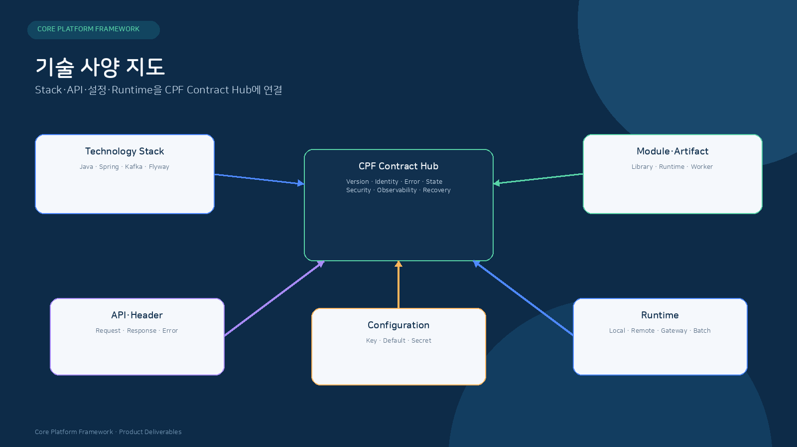
</p>

---

## 문서 안내

| 항목 | 내용 |
|---|---|
| 목적 | CPF에 적용되는 기술 값과 실행 계약을 한 문서에서 확인할 수 있게 합니다. |
| 주요 독자 | 아키텍트, 개발자, 연동 개발자, 빌드·배포 담당자 |
| 포함 범위 | Stack, Module, Artifact, API, Header, 오류, Messaging, Batch, Gateway, 설정 |
| 관련 문서 | [아키텍처설계서](아키텍처설계서.md) · [기술표준서](기술표준서.md) · [데이터베이스표준서](데이터베이스표준서.md) |

<details>
<summary><strong>빠른 목차</strong></summary>

1. 기술 Stack
2. Module·Artifact Catalog
3. Runtime·Packaging
4. API 공통 계약
5. 공통 API Header·Context
6. 오류·멱등성·동시성
7. API Quick Reference
8. Local·Remote 호출
9. Messaging
10. 파일·전문·외부연계
11. Batch
12. Gateway
13. ADM·BZA·Frontend
14. 설정 속성
15. 데이터베이스
16. 보안·감사
17. 관측·Health
18. 호환성·Version·Artifact 무결성
19. Source 기준점

</details>


## 0. 기술 사양 한눈에 보기

| 영역 | 기준 |
|---|---|
| Language·Build | Java 25 · Gradle 9.1.0 |
| Backend | Spring Boot 4.1.0 · Spring MVC |
| Distributed Call | Local Facade와 Remote Adapter의 동일 Public Contract |
| Messaging | Kafka · Outbox/Inbox · at-least-once |
| Batch | Spring Batch · db-scheduler · Worker/Runner/Agent |
| Gateway | Spring Cloud Gateway Server Web MVC |
| Database | MariaDB · PostgreSQL · Oracle · Flyway |
| Frontend | Vue 3 · Element Plus · TanStack · Pinia · Zod · Orval |
| Observability | Micrometer Observation · OpenTelemetry |
| Artifact Supply | LOCAL_DEV · REMOTE · OFFLINE |

## 1. 기술 Stack

### 1.1 Version 정본

| 영역 | 기준 값 | 정본 |
|---|---:|---|
| Java | 25 | `gradle/cpf-stack.properties` |
| Gradle | 9.1.0 | `gradle/cpf-stack.properties`, Wrapper |
| Spring Boot | 4.1.0 | `gradle/cpf-stack.properties` |
| Spring Dependency Management | 1.1.7 | `gradle/cpf-stack.properties` |
| Spring Cloud | 2025.1.2 | `gradle/cpf-stack.properties` |
| Spring Batch | 6.0.4 | `gradle/cpf-stack.properties` |
| Servlet | 6.1 | `gradle/cpf-stack.properties` |
| OpenFeature | 1.17.0 | `gradle/cpf-stack.properties` |
| db-scheduler | 16.7.0 | `gradle/cpf-stack.properties` |
| CycloneDX Gradle | 3.0.1 | `gradle/cpf-stack.properties` |

### 1.2 Primary 기술 구성

| 영역 | Primary | CPF가 소유하는 경계 |
|---|---|---|
| Web Backend | Spring Boot · Spring MVC | API, 오류, Security, Runtime 정책 |
| Gateway | Spring Cloud Gateway Server Web MVC | Route, Trust, Approval, Attempt Ledger |
| Batch | Spring Batch | Job Pack, Runtime 분리, 운영 Command |
| Scheduler | db-scheduler | Trigger, Calendar, Claim, Misfire 정책 |
| Messaging | Apache Kafka | Envelope, Outbox/Inbox, Idempotency, DLT |
| Resilience | Spring Cloud CircuitBreaker + Resilience4j | Timeout Budget, Retry 정책, 결과 분류 |
| Observability | Micrometer Observation + OpenTelemetry | CPF Context와 Attribute 정책 |
| Local Cache | Caffeine | Cache Namespace와 Invalidation 정책 |
| Feature Flag | OpenFeature | Evaluation, Override, Audit |
| DB Migration | Flyway OSS Core | Canonical Schema와 Vendor Pack |
| Frontend | Vue 3 + Element Plus + TanStack + Pinia + Zod + Orval | 화면 Composition, 권한, API Contract |

<p align="center">
  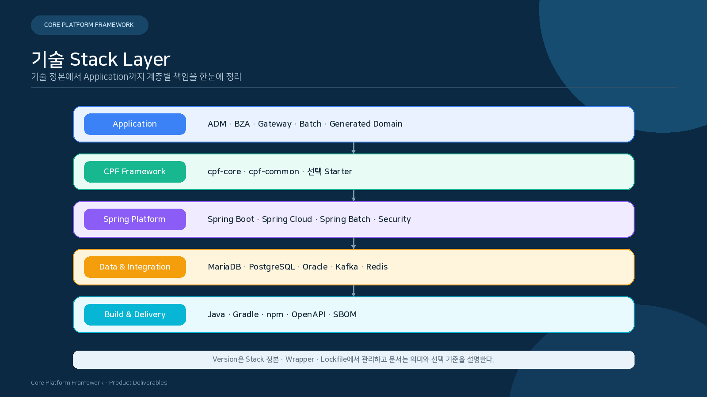
</p>

<p align="center"><sub>Application은 CPF Public Contract를 사용하고, 선택 Runtime은 Starter와 Adapter 경계에서 결합합니다.</sub></p>

- Stack Version은 중앙 정본과 Lockfile에서 관리합니다.
- `cpf-core`는 선택 OSS 구현 Type을 Public API에 노출하지 않습니다.
- Kafka·Redis·OTel Exporter 같은 선택 Runtime은 사용하는 Module이 명시적으로 소유합니다.
- 최종 Artifact에는 Runtime 의존성과 Frontend 산출물의 포함 여부가 명확해야 합니다.

## 2. Module · Artifact Catalog

### 2.1 Platform Module

| Module | 유형 | 대표 산출물 | 핵심 기능 |
|---|---|---|---|
| `cpf-core` | Library | JAR · Sources · JavaDoc | 기술 Public API/SPI, Context, Error, File, Message, Resilience 계약 |
| `cpf-common` | Library | JAR · Sources · JavaDoc | Calendar, Code, Message, 공통 데이터 정책 |
| `cpf-admin` | Web Runtime | Boot JAR / WAR + ADM Static | 플랫폼 운영 Control Plane |
| `cpf-biz-admin` | Web Runtime | Boot JAR / WAR + BZA Static | 업무 관리 Control Plane |
| `cpf-gateway` | Executable | Boot JAR | 외부 진입, Route, Trust, Resilience |
| `cpf-member` | Generated Domain | Domain Artifact | Generator 기준 업무 Domain |
| `cpf-reference` | Reference Runtime | Boot Artifact | Public API 사용·복구 예제 |
| `cpf-local-runtime` | Local Tool | Executable | Local 통합 실행 |
| `cpf-local-batch-runtime` | Local Tool | Executable | Local Batch 실행 |

### 2.2 선택 Starter

| Project | 기능 | 선택하지 않을 때의 원칙 |
|---|---|---|
| `cpf-starter-security` | 인증·인가·Session·보안 설정 | Core 기능의 필수 기동 조건이 되지 않습니다. |
| `cpf-starter-messaging-kafka` | Kafka Adapter·Outbox·Inbox | Messaging 미사용 서비스에 Broker Runtime을 강제하지 않습니다. |
| `cpf-starter-cache` | Local·Distributed Cache Provider | Cache가 없어도 업무 계약은 유지됩니다. |
| `cpf-starter-observability` | Metric·Trace SDK·Exporter | Core는 Context와 API 경계만 유지합니다. |
| `cpf-starter-resilience` | Timeout·Circuit·Bulkhead | 호출 정책을 명시한 Consumer가 선택합니다. |
| `cpf-starter-featureflag` | Feature Evaluation·Audit | Flag 미사용 서비스에 Provider를 강제하지 않습니다. |
| `cpf-starter-secret` | Secret Provider·Rotation | Secret 원문을 일반 Property로 관리하지 않습니다. |

### 2.3 Batch Project

| Project | 역할 | 실행 형태 |
|---|---|---|
| `cpf-batch:contract` | Query·Command·DTO Public Contract | Library |
| `cpf-batch:runtime-common` | 실행 공통 Context·Policy | Library |
| `cpf-batch:execution-runtime` | Spring Batch Job 실행 | Process |
| `cpf-batch:control-server` | 등록·승인·Command·조회 | Server |
| `cpf-batch:scheduler` | Trigger·Claim·Start | Scheduler Process |
| `cpf-batch:worker` | Partition·Chunk 처리 | Worker Process |
| `cpf-batch:center-cut-runner` | 대상 선정·분할·대사 | Runner Process |
| `cpf-batch:host-agent` | 승인된 Artifact·Process 실행 | Agent Process |
| `cpf-batch:testkit` | Contract·Fault Test 지원 | Test Library |

## 3. Runtime · Packaging

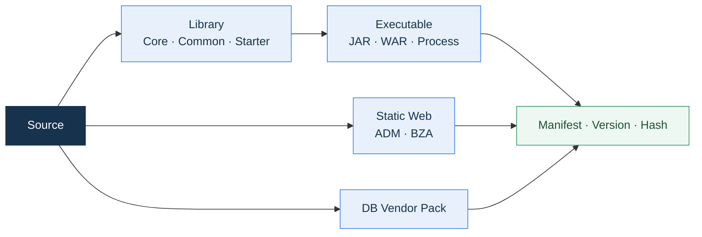

| 실행 형태 | 주요 대상 | 필수 식별 정보 |
|---|---|---|
| Embedded JAR | Domain, ADM, BZA, Gateway, Control Server | Version, Source SHA, Profile, Port, Health |
| External WAR | ADM·BZA 등 Servlet 배포 | Context Path, Servlet 6.1, Session, Security |
| Static Frontend | ADM·BZA | Asset Hash, API Spec Hash, Route/Permission Manifest |
| Worker Process | Scheduler, Worker, Runner, Agent | Runtime ID, Capability, Lease, Artifact Hash |
| Library | Core, Common, Starter, Contract | Group, Artifact, Version, POM, Sources, JavaDoc |
| DB Pack | MariaDB, PostgreSQL, Oracle | Schema Version, Migration, Rollback, Checksum |

### 3.1 Artifact 공급 Mode

| Mode | 주요 설정 | 저장소 |
|---|---|---|
| `LOCAL_DEV` | `CPF_ARTIFACT_MODE=LOCAL_DEV` | `${user.home}/.cpf/repository` 또는 지정 경로 |
| `REMOTE` | `CPF_ARTIFACT_MODE=REMOTE` | `CPF_ARTIFACT_REPOSITORY_URL` |
| `OFFLINE` | `CPF_ARTIFACT_MODE=OFFLINE` | `CPF_OFFLINE_ARTIFACT_REPOSITORY` |

## 4. API 공통 계약

### 4.1 Endpoint 정의 항목

| 항목 | 정의 내용 |
|---|---|
| Owner | 상태와 Command를 소유하는 Module |
| Method · Path | Controller와 OpenAPI의 실제 값 |
| Consumer | Frontend, Service, Gateway, Batch, 외부 Client |
| Permission | Menu, Action, API, Data Scope, Field Scope |
| Request | Header, Path, Query, Body, 기본값, 길이, 형식 |
| Response | 상태, Resource ID, Version, Paging, Masking |
| Error | Code, HTTP Status, Failure Stage, Retryability |
| Transaction | DB, Audit, Outbox의 원자성 경계 |
| Recovery | Result Query, Reconcile, Compensation, Rollback |

### 4.2 Request·Response 기본 형태

```json
{
  "data": {},
  "meta": {
    "transactionId": "34자리 거래 식별자",
    "operationId": "변경 작업 식별자",
    "version": 3
  }
}
```

```json
{
  "code": "안정된 오류 코드",
  "message": "호출자 안내",
  "transactionId": "거래 식별자",
  "operationId": "변경 작업 식별자",
  "failureStage": "VALIDATION | EXECUTION | COMMIT | EXTERNAL_SEND | RESPONSE",
  "retryable": false,
  "unknownResult": false
}
```


<p align="center">
  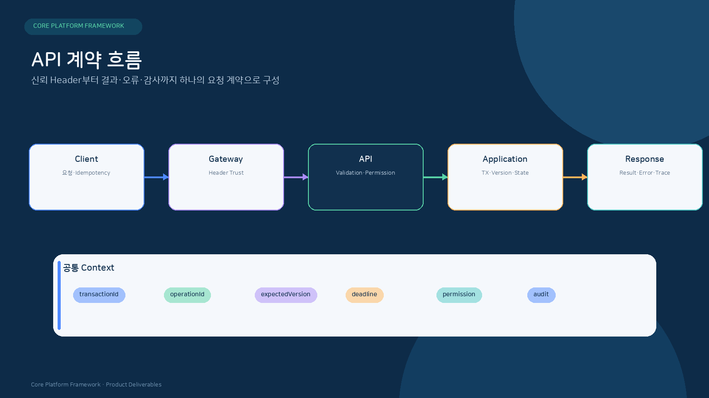
</p>

<p align="center"><sub>Header 신뢰·검증·Transaction·결과·감사가 하나의 요청 계약을 이룹니다.</sub></p>

## 5. 공통 API Header 규격

### 5.1 표준 HTTP Header

| Header | 방향 | 용도 | 처리 기준 |
|---|---|---|---|
| `Authorization` | Request | 사용자·Client 인증 | Entry에서 검증하고 내부 호출은 Service Identity 정책을 적용합니다. |
| `Content-Type` | Request | Request Body Media Type | API 계약과 일치하지 않으면 거부합니다. |
| `Accept` | Request | Response Media Type | 지원 가능한 형식을 명시합니다. |
| `traceparent` | Request/Response | W3C Trace Context | 허용 형식과 Sampling 정책을 적용합니다. |
| `tracestate` | Request/Response | Vendor Trace Context | 크기와 Entry Allowlist를 적용합니다. |
| `Idempotency-Key` | Command Request | 중복 실행 방지 | Scope·Request Hash와 함께 Owner 원장에서 검증합니다. |
| `If-Match` | Command Request | Resource Version 동시성 | 현재 Version과 다르면 Conflict/Precondition 오류를 반환합니다. |
| `Content-Disposition` | Response | Download 파일명 | CRLF·경로 문자를 제거하고 서버 정책으로 생성합니다. |

### 5.2 CPF Context 논리 항목

CPF Context는 HTTP Header, Message Envelope, Batch Context에서 같은 의미를 유지합니다. 물리 이름은 Source의 Header 상수와 OpenAPI를 정본으로 사용합니다.

| 논리 항목 | 생성 주체 | 전파 규칙 |
|---|---|---|
| `transactionId` | 최초 신뢰 경계 또는 거래 ID 생성기 | Local·Remote·Async·Batch 후속에서 동일 값을 유지합니다. |
| `segmentId` | 호출 Adapter | 호출 구간마다 새 값을 생성합니다. |
| `parentSegmentId` | 호출 Adapter | 상위 Segment를 연결합니다. |
| `attempt` | Retry·Gateway·Batch Runtime | 재시도마다 증가하고 transactionId는 유지합니다. |
| `originalChannel` | 최초 Entry | 최초 유입 Channel을 유지합니다. |
| `callerChannel` | 현재 Caller | 각 호출 구간의 Caller를 기록합니다. |
| `operationId` | 변경 요청 Owner | 결과 조회·대사·재처리의 기준으로 사용합니다. |
| `expectedVersion` | Client 또는 이전 조회 결과 | 낙관적 잠금에 사용합니다. |
| `reason` | 사용자·운영자 | 위험 조치와 변경 Audit에 연결합니다. |
| `approvalId` | 승인 Engine | 승인된 대상·Version·Command Hash와 결합합니다. |

### 5.3 transactionId 규격

| 구간 | 길이 | 형식 |
|---|---:|---|
| 시각 | 17 | `yyyyMMddHHmmssSSS` |
| SystemCode | 3 | CPF · CMN · ADM · BZA · BAT · GWY · Domain Code |
| wasId | 7 | 실행 Instance 식별 |
| sequence | 7 | 동일 Millisecond 내 순번 |
| 합계 | **34** | 전 구간 거래 식별자 |

### 5.4 Header 신뢰 원칙

- 외부 Client가 보낸 내부 사용자, Environment, Instance, Role Header를 그대로 신뢰하지 않습니다.
- Gateway 또는 최초 Entry가 허용 목록을 적용하고 내부 Context를 검증·재구성합니다.
- Retry와 Failover는 transactionId를 유지하고 attempt·target 기록을 분리합니다.
- Header에는 Secret, Credential, 개인정보 원문을 넣지 않습니다.
- Header 크기와 개수에 상한을 적용합니다.

<p align="center">
  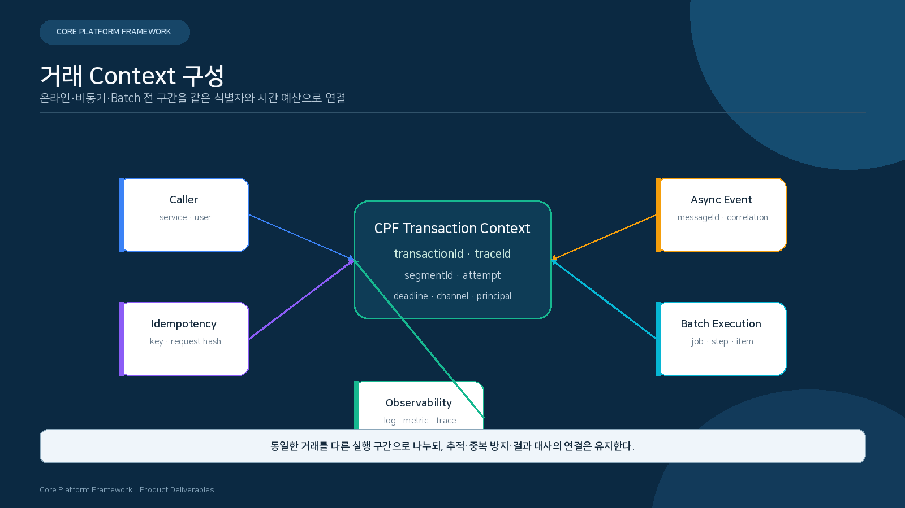
</p>

<p align="center"><sub>한 거래를 온라인·Event·Batch 구간으로 나누어도 식별자와 시간 예산은 연결됩니다.</sub></p>

| Context | 용도 |
|---|---|
| `transactionId` | 전체 업무 흐름을 연결하는 대표 거래 식별자 |
| `traceId`·`segmentId` | 호출·Event·Batch 구간의 분산 추적 |
| `attempt` | Retry·재처리 시도 구분 |
| `deadline` | 하위 호출·DB·Broker에 배분할 전체 시간 예산 |
| `channel`·`principal` | 최초 유입 채널과 검증된 실행 주체 |
| `idempotencyKey` | 중복 실행 방지와 저장된 결과 재사용 |

## 6. 오류 · 멱등성 · 동시성

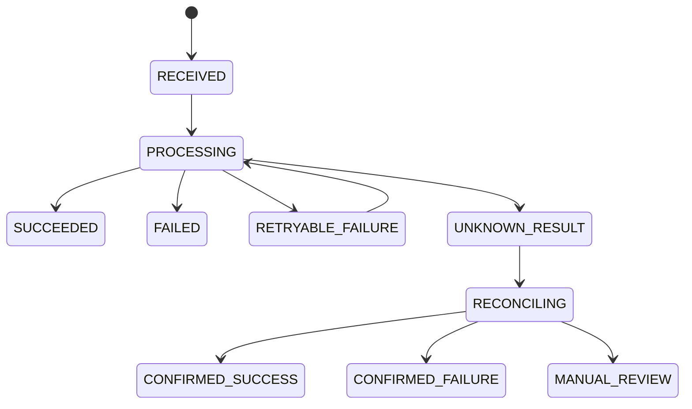

| 상태 | 의미 | 다음 행동 |
|---|---|---|
| `SUCCEEDED` | 업무 결과와 Side Effect가 확정됨 | 결과 반환·후속 처리 |
| `FAILED` | 실패와 미반영이 확정됨 | 오류 수정 후 새 요청 또는 정책상 재시도 |
| `RETRYABLE_FAILURE` | 동일 Operation을 재시도할 수 있음 | Budget·Backoff 적용 |
| `UNKNOWN_RESULT` | 전송·Commit·응답 경계에서 결과를 단정할 수 없음 | 상태 조회·대사 |
| `RECONCILING` | Owner와 상대 상태를 대조 중 | 중복 실행 금지 |
| `MANUAL_REVIEW` | 자동 판정 근거가 부족함 | 운영자 승인·확인·보상 |


<p align="center">
  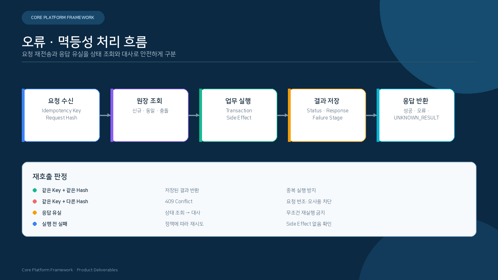
</p>

<p align="center"><sub>같은 요청의 재전송, 다른 요청의 Key 충돌, 응답 유실을 서로 다른 상태로 처리합니다.</sub></p>

- 동일 Key와 동일 Request Hash는 최초 저장 결과를 반환합니다.
- 동일 Key를 다른 요청에 사용하면 Conflict로 거부합니다.
- 응답 유실 가능성이 있으면 결과 조회·대사 API로 실제 Side Effect를 먼저 확인합니다.
- 오류 응답은 Code, Field·Offset, Retryability, Failure Stage, 결과 불명 여부를 함께 제공합니다.


### 6.1 멱등성 계약

| 항목 | 사양 |
|---|---|
| Key | Client 또는 Channel이 생성하는 요청 식별자 |
| Scope | API·Resource·Caller·Tenant 등 Owner가 정의 |
| Request Hash | Method·Path·Canonical Body·중요 Header 기반 |
| Stored Result | 상태, Response, Resource ID, Version, Failure Stage |
| Conflict | 같은 Key와 다른 Hash는 `409 Conflict` |
| TTL | 업무 재전송 기간과 감사·보존 정책을 고려 |

### 6.2 동시성 계약

| 유형 | 적용 방식 | 결과 |
|---|---|---|
| Resource 수정 | `If-Match` 또는 `expectedVersion` | 최신 Version 불일치 시 Conflict |
| 중복 등록 | Business UK + Idempotency | 한 Resource만 생성 |
| Worker 실행 | Lease + Fencing Epoch | 만료된 Writer의 Commit 차단 |
| 상태 전이 | 현재 상태 + Version 조건 | 허용 전이만 반영 |
| 운영 변경 | Preview Snapshot + expectedVersion | 대상 Drift 감지 |

## 7. API Quick Reference

| 목적 | 계약 |
|---|---|
| 요청 추적 | `transactionId`와 W3C `traceparent`를 사용합니다. |
| 변경 요청 식별 | `operationId`로 상태 조회·대사·재처리를 연결합니다. |
| 중복 방지 | `Idempotency-Key`와 canonical request hash를 함께 검증합니다. |
| 동시 수정 | `If-Match` 또는 `expectedVersion`으로 최신 Version을 확인합니다. |
| 권한 | Authentication, API Permission, Data Scope, Field Scope를 서버에서 검사합니다. |
| 오류 | `code`, `failureStage`, `retryable`, `unknownResult`를 제공합니다. |
| 목록 조회 | 허용된 Filter·Sort와 Page Size 상한, 안정된 Tie-breaker를 사용합니다. |
| 파일 응답 | Content Type, 파일명, 크기, Checksum과 Download Audit를 연결합니다. |

### 7.1 대표 API 영역

| 제품 영역 | 대표 경로·Resource | 주요 계약 |
|---|---|---|
| ADM 거래 | `/adm/api/transactions` | Server Paging, 상태 조회, Scan·Inactivate Command |
| ADM Batch | `/adm/api/batch-runtime`, `/adm/api/batch` | Definition, Command, Deployment, Workbench |
| ADM Gateway | `/adm/api/gateway-registry` | Group·Binding·Connection Test |
| ADM 운영 | `/adm/api/runtime-control`, `/adm/api/incidents` | Preview, Change, Version, Incident Lifecycle |
| BZA 조직·인사 | `backoffice/organizations`, `backoffice/employees` | 조직 범위, 개인정보 가림, 변경 Audit |
| BZA 권한·결재 | `roles`, `permissions`, `approvals`, `audits` | Role·Permission·Approval·Audit |

### 7.2 오류 분류와 호출자 행동

| 분류 | 호출자 행동 |
|---|---|
| Validation | 입력 Field를 수정한 뒤 새 요청을 보냅니다. |
| Authentication·Authorization | Credential·Permission·Data Scope를 확인합니다. |
| Conflict·Precondition | 최신 상태와 Version을 다시 조회합니다. |
| Rate·Capacity | Retry-After 또는 Backoff 정책을 적용합니다. |
| Dependency | Side Effect 발생 여부를 구분하고 상태 조회를 수행합니다. |
| Unknown Result | 같은 Command를 반복하기 전에 operationId로 결과를 확정합니다. |


## 8. Local · Remote 호출 사양

| 항목 | Local | Remote |
|---|---|---|
| Contract | 동일 Public API | 동일 Public API |
| Adapter | Same-JVM Facade | HTTP/Protocol Client |
| Validation | 동일 | 동일 |
| Authorization | 동일 정책 | Service Identity와 Audience 추가 |
| Context | 직접 전달 | Header/Envelope 직렬화 |
| Timeout | Use Case Budget | Connect·Read·Write·Overall Budget |
| Error | 동일 Error Taxonomy | Transport Error Mapping 추가 |
| Test | Local Contract Test | Mock Server·Fault·Compatibility Test |

## 9. Messaging 사양

<p align="center">
  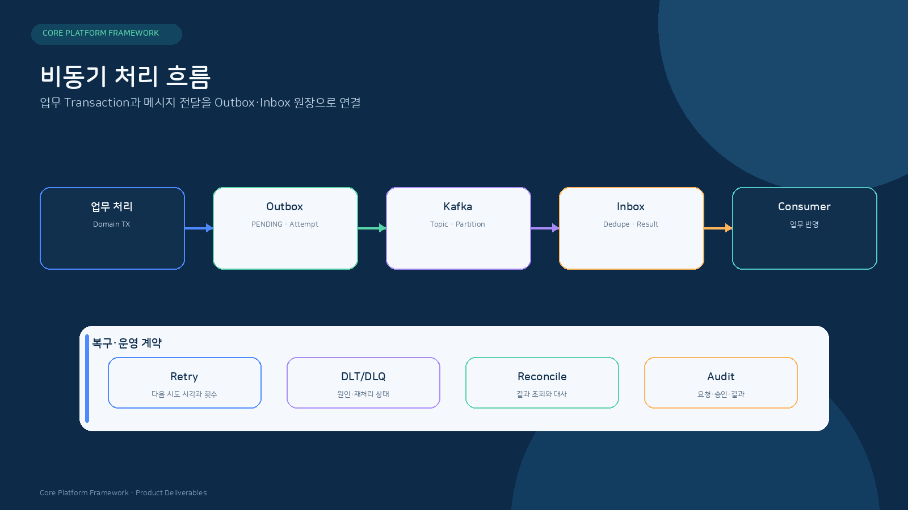
</p>

| 항목 | 계약 |
|---|---|
| Primary Broker | Apache Kafka |
| Delivery | at-least-once |
| 중복 방지 | messageId·idempotencyKey 기반 Inbox |
| 발행 원자성 | 업무 Transaction과 Outbox 기록 연결 |
| 순서 | Topic·Partition Key·업무 Aggregate 기준 |
| Retry | 횟수, Backoff, Next Attempt, Lease |
| 실패 보관 | DLT/DLQ + 원인·재처리 상태 |
| Payload | Versioned Schema, Size Limit, Serialization Allowlist |


## 10. 파일 · 전문 · 외부연계 사양

<p align="center">
  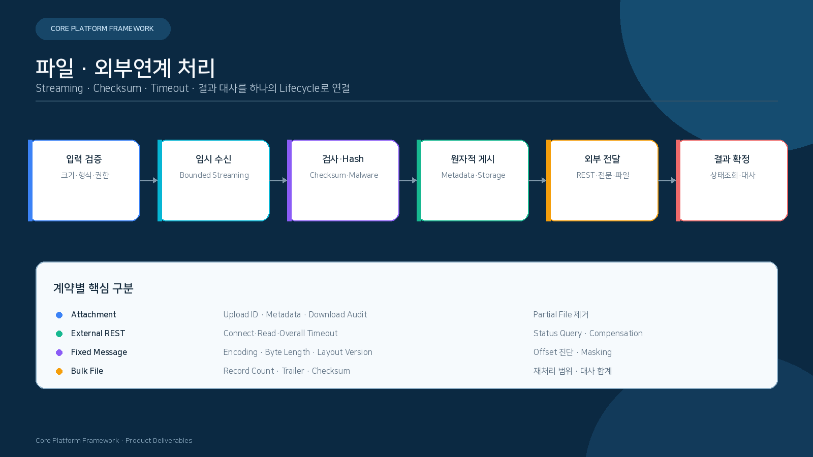
</p>

### 10.1 File · Attachment

| 항목 | 사양 |
|---|---|
| 수신 | Bounded Streaming, Size·Count·Content Type 제한 |
| 임시 저장 | 격리 Directory, 임의 실행 금지, Cleanup 정책 |
| 검증 | 파일명 정규화, Path Traversal·Archive Bomb 차단, Checksum |
| 게시 | Temporary → fsync/checksum → Atomic Publish |
| Metadata | Owner ID, Attachment ID, Size, Hash, Media Type, Retention |
| Download | Permission, Range·Streaming, 안전한 파일명, Audit |

### 10.2 외부 REST

| 항목 | 사양 |
|---|---|
| Endpoint | Scheme·Host·Port Allowlist와 TLS 검증 |
| Timeout | Connect, Request Write, Response Header, Read, Overall Deadline |
| Retry | Method·Failure Stage·멱등성 기준으로 제한 |
| Error Mapping | 외부 Code를 CPF Error Taxonomy와 업무 상태로 변환 |
| 결과 대사 | 상대 Status Query, operationId, 외부 Transaction ID 연결 |
| 보상 | 취소·Reverse·Manual Reconcile 계약 |

### 10.3 고정길이 전문 · Bulk File

| 항목 | 사양 |
|---|---|
| Layout | Version, Field Name, Start, Byte Length, Type, Required |
| Encoding | Charset, Padding, Sign, Decimal, Newline |
| 검증 | 전체 길이, Field Offset, Group Count, Trailer 합계 |
| 진단 | Field·Offset 단위 오류와 Masked 원문 |
| 재처리 | Record·Block·File 단위 식별자와 Checkpoint |
| 대사 | 건수·금액·Hash·기관 결과 합계 |

## 11. Batch 사양

| 영역 | 사양 |
|---|---|
| Primary Engine | Spring Batch |
| Job 구성 | Job · Step · Tasklet · Chunk · Partition |
| Metadata | JobInstance · JobExecution · StepExecution · ExecutionContext |
| Parameter | 식별 Parameter와 실행 옵션 분리, 민감값 보호 |
| Restart | Checkpoint와 상태를 기준으로 재개 |
| Scheduler | db-scheduler Trigger, Calendar, Misfire, Claim |
| Worker | Capability, Lease, Fencing, Drain, Heartbeat |
| Center-Cut | Target Snapshot, Partition, Chunk, Commit, Reconcile |
| Host Agent | 허용 Artifact·Command, mTLS, Allowlist, Output Budget |

## 12. Gateway 사양

<p align="center">
  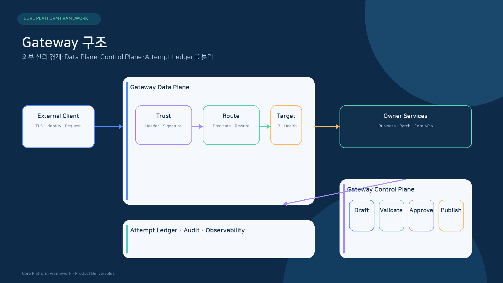
</p>

| 영역 | 주요 사양 |
|---|---|
| Runtime | Spring Cloud Gateway Server Web MVC + Embedded Tomcat |
| Route | Predicate, Filter, Rewrite, Service Binding, Version Snapshot |
| Routing | Instance, Zone, Version, Weight, Maintenance, Health |
| Trust | Authentication, HMAC, Audience, Body Hash, Timestamp, Nonce |
| Safety | SSRF 차단, TLS 검증, Header Trust, Request Limit |
| Resilience | Timeout, Retry Budget, Circuit Breaker, Bulkhead, Backpressure |
| Apply | Validate → Approve → Publish → ACK/NACK → Reconcile → Rollback |
| Ledger | transactionId, attempt, target, stage, result, reconciliation |

## 13. ADM · BZA · Frontend 사양

### 13.1 ADM

- Service·Instance·Gateway·Transaction·Batch·Config·Security·Approval·Audit를 운영합니다.
- Owner Query·Command Contract를 사용합니다.
- 위험 조치는 Preview, Reason, Approval, expectedVersion, Idempotency를 적용합니다.

### 13.2 BZA

- 조직·직원·사용자·Role·Permission·결재·첨부·알림을 관리합니다.
- 업무 대상은 Owner Business Contract를 통해 연결합니다.
- Menu·Action·API·Data Scope를 서버 권한과 연결합니다.

### 13.3 Frontend Stack

| 영역 | 기술 |
|---|---|
| UI Widget | Element Plus |
| Table | TanStack Table |
| Routing | Vue Router |
| Client State | Pinia |
| Server State | TanStack Vue Query |
| Validation | Zod + Element Plus Form |
| API Client | Orval Generated Client |
| Browser Test | Playwright |


## 14. 설정 속성 사양

### 14.1 Property 정의 필수 열

| 열 | 설명 |
|---|---|
| Key | 실제 Property Key |
| Environment Variable | 변환된 환경변수 명칭 |
| Type | String, Integer, Duration, URI, Enum 등 |
| Default | 안전한 기본값 또는 미지정 |
| Required | Profile·기능별 필수 여부 |
| Range | 최소·최대·Pattern·Allowlist |
| Consumer | 실제 Bean·Module·Runtime |
| Restart | 재기동 필요 여부 |
| Secret | 민감값 여부와 Provider 사용 |
| Verification | 확인 명령·Health·Metric·Log |

### 14.2 적용 우선순위

```text
Operation Override
→ Environment / Deployment Override
→ Profile
→ Application Property
→ Safe Default
```

- Secret은 일반 설정 파일에 원문으로 저장하지 않습니다.
- Runtime 변경은 Version, Diff, Approval, Apply Result와 Rollback을 기록합니다.
- 일부 Instance만 적용된 상태를 탐지하고 Reconciliation합니다.


<p align="center">
  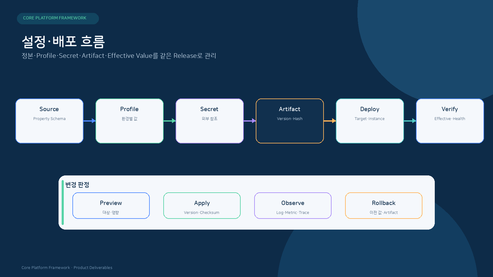
</p>

<p align="center"><sub>설정은 Key 목록이 아니라 Source·Secret·Artifact·적용 결과를 연결하는 배포 계약입니다.</sub></p>

| 단계 | 확인할 값 |
|---|---|
| Source | Property Key, Type, Default, Consumer, Profile |
| Secret | 참조 이름, Provider, Rotation, 원문 비노출 |
| Artifact | Version, Source SHA, Config 호환 범위 |
| Deploy | 대상 Instance, 적용 순서, 재기동 여부 |
| Verify | Effective Value, Health, 대표 업무, Audit |
| Rollback | 이전 Version·설정값·적용 대상 복원 |

### 14.3 중요 설정 레지스트리

| Key·환경변수 | Type·Default | 적용 범위 | Consumer |
|---|---|---|---|
| `CPF_ARTIFACT_MODE` | Enum · `LOCAL_DEV` | Build·Artifact 공급 | `settings.gradle` |
| `CPF_ARTIFACT_REPOSITORY_URL` | URI · 없음 | REMOTE Mode | Plugin·Dependency Repository |
| `CPF_ARTIFACT_REPOSITORY_USER` | String · 없음 | 인증 저장소 | Repository Credentials |
| `CPF_ARTIFACT_REPOSITORY_PASSWORD` | Secret · 없음 | 인증 저장소 | Repository Credentials |
| `CPF_LOCAL_ARTIFACT_REPOSITORY` | Path · `${user.home}/.cpf/repository` | LOCAL_DEV Mode | Local Maven Repository |
| `CPF_OFFLINE_ARTIFACT_REPOSITORY` | Path · 없음 | OFFLINE Mode | Offline Maven Repository |
| `cpf.security.session.enabled` | Boolean · 구성값 | Session BFF | Security AutoConfiguration |
| `cpf.security.session.cookie-name` | String · `CPFSESSION` | Browser Session | Session Filter |

### 14.4 Property Family

| Family | 대표 범위 |
|---|---|
| `cpf.security.*` | Session, Cookie, Authentication, Authorization, CSRF |
| `cpf.gateway.*` | Route, Target, Timeout, Trust, Apply, Ledger |
| `cpf.batch.*` | Control Server, Scheduler, Worker, Lease, Agent |
| `cpf.observability.*` | Metric, Trace, Exporter, Sampling |
| `cpf.messaging.*` | Kafka, Outbox, Inbox, Retry, DLT |
| `cpf.cache.*` | Namespace, Provider, TTL, Invalidation |
| `cpf.secret.*` | Provider, Key ID, Rotation, Metadata |
| `spring.datasource.*` | DB Connection, Pool, Transaction |
| `spring.kafka.*` | Producer, Consumer, Security, Topic |
| `management.*` | Health, Metric, Endpoint Exposure |


## 15. 데이터베이스 사양

| 항목 | 값 |
|---|---|
| 공식 Vendor | MariaDB · PostgreSQL · Oracle |
| Logical Schema | `cpfDB`, `cmnDB`, `admDB`, `bzaDB`, `batDB`, `refDB`, Domain Schema |
| Canonical 정본 | `cpf-tools/db/canonical/platform-schema.json` |
| Vendor Pack | `cpf-tools/db/vendor/<vendor>` |
| Migration | Flyway Versioned Migration |
| Lifecycle | Install → Upgrade → Runtime Query → Drift → Rollback → Reapply → Backup/Restore |

## 16. 보안 · 감사 사양

| 영역 | 사양 |
|---|---|
| Authentication | User, Client, Service Identity 분리 |
| Authorization | Role, Menu, Action, API, Data Scope, Field Scope |
| Session | Server-side Session, Secure/HttpOnly/SameSite Cookie, CSRF |
| Secret | SecretProvider SPI, Rotation, Metadata만 노출 |
| Masking | 목록 기본 Masking, Raw 조회 권한·사유·TTL·Audit |
| Approval | 요청자·승인자 분리, 대상 Snapshot, 만료, Command Hash |
| Audit | Actor, Subject, Action, Reason, Before/After, Result, transactionId |

## 17. 관측 사양

| 신호 | 연결 기준 |
|---|---|
| Log | transactionId, segmentId, operationId, module, instance, errorCode |
| Metric | 요청량, 오류율, 지연, Queue, Retry, Lease, Drift, Resource |
| Trace | W3C Trace Context + CPF transaction/segment Attribute |
| Audit | 변경·조회·Download·Raw Data·승인·복구 Event |
| Health | Liveness, Readiness, Startup, Dependency, Business Readiness |

### 17.1 Health 계약

| Health | 확인 범위 | 사용 목적 |
|---|---|---|
| Liveness | Process Event Loop·Thread 생존 | Process 재시작 판단 |
| Startup | 초기 Migration·Cache·Route 준비 | 기동 완료 판단 |
| Readiness | 요청 수신 가능, 필수 Dependency | Traffic 연결·제외 |
| Dependency | DB·Kafka·Redis·외부 Endpoint | 장애 영향 범위 확인 |
| Business Readiness | 대표 Query·Schema Version·Service Identity | 실제 업무 처리 가능성 확인 |


## 18. 호환성 · Version · Artifact 무결성

<p align="center">
  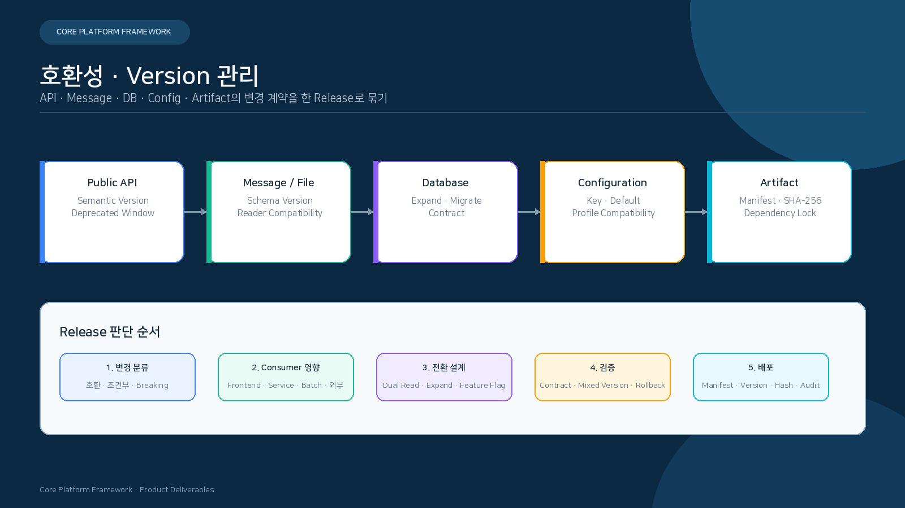
</p>

### 18.1 호환성 단위

| 대상 | Version 기준 | 호환성 규칙 |
|---|---|---|
| Public API | Semantic Version · API Version | 기존 Consumer의 Request·Response 의미 유지 |
| Event | Envelope·Payload Schema Version | Reader가 이전 Version을 해석하거나 명시적 전환 |
| Database | Migration Version · Schema Manifest | Expand → Migrate → Contract |
| Config | Key·Type·Default·Profile | 누락·구형 값의 처리와 재기동 범위 정의 |
| File·전문 | Layout·Record Version | Field 추가·길이 변경·Encoding 전환 규칙 |
| Frontend Client | OpenAPI Source SHA · Generated Client | Backend Contract와 Generated Source 일치 |

### 18.2 Artifact Manifest

| 필드 | 내용 |
|---|---|
| Product·Module | CPF, Module, Artifact ID |
| Version | Release Version과 Sequence |
| Source | Commit SHA와 Branch |
| Build | Java·Gradle·Node·Plugin Version |
| Content | JAR/WAR/Static/DB Pack SHA-256 |
| Contract | API·DB·Config·Message Version |
| Dependency | Lockfile·SBOM·License Notice |
| Runtime | Profile, Supported Topology, Health Identity |

- Rolling·Canary·Blue-Green에서는 신·구 Version의 API·DB·Message 호환 범위를 먼저 확인합니다.
- Artifact, DB Migration, Config를 서로 다른 Release 기준으로 배포하지 않습니다.
- Generated Client와 Static Asset은 Source API Version·Hash를 기록합니다.

## 19. Source 기준점

| 주제 | 정본 경로 |
|---|---|
| Version | `gradle/cpf-stack.properties` |
| Module 목록 | `settings.gradle` |
| Build·Artifact | Root와 각 Module `build.gradle` |
| API | Controller · OpenAPI · Generated Client · Contract Test |
| Header | Header Constants · Filter · Interceptor · Client · Test |
| 설정 | `application*.yml`, `@ConfigurationProperties`, Environment Binding |
| DB | Canonical Schema · Vendor Pack · Migration · Runtime Query |
| Frontend | ADM/BZA Route · Permission · Generated Client |


---

## 문서 기준

| 항목 | 값 |
|---|---|
| Repository | `freeangelsun/202412_01_CPF` |
| Branch | `master` |
| 기준 Commit | `1edd96c6dcc69b0b4d6e9e22a0709d910d7cfb04` |
| 상위 요구사항 정본 | `cpf-docs/governance/CPF_FINAL_TARGET_REQUIREMENTS.md` |
| 문서 표준 | `cpf-docs/specification/CPF_DOCUMENTATION_STANDARD.md` |
| 사실 정본 | Source · SQL · API · Config · Frontend · Script · Test |
