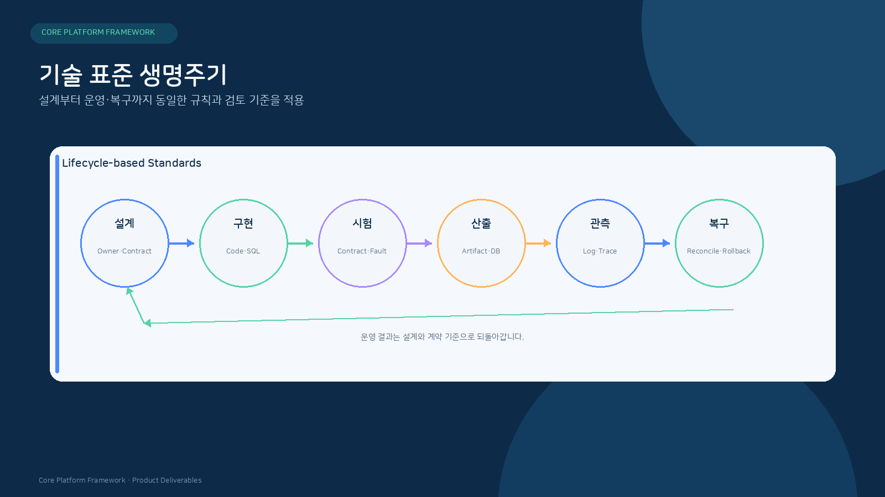
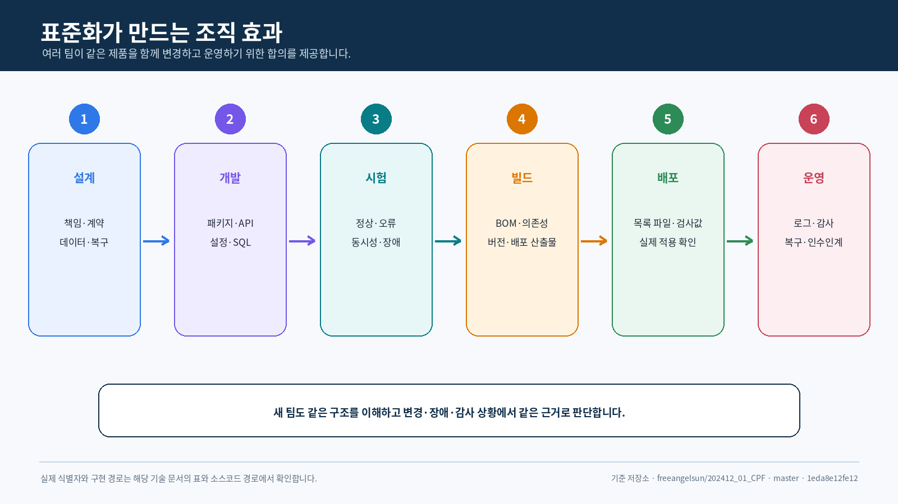
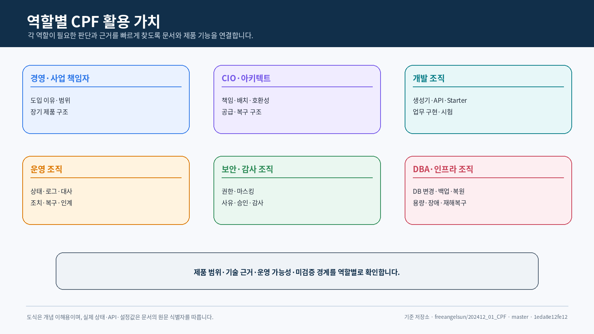
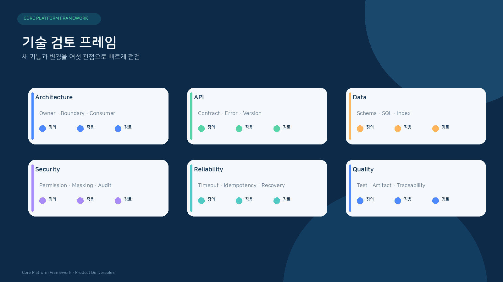
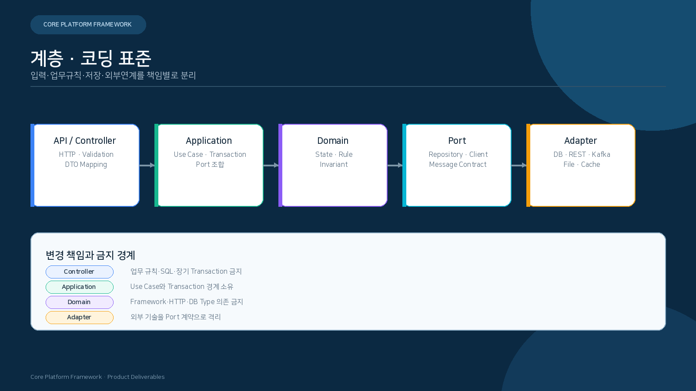
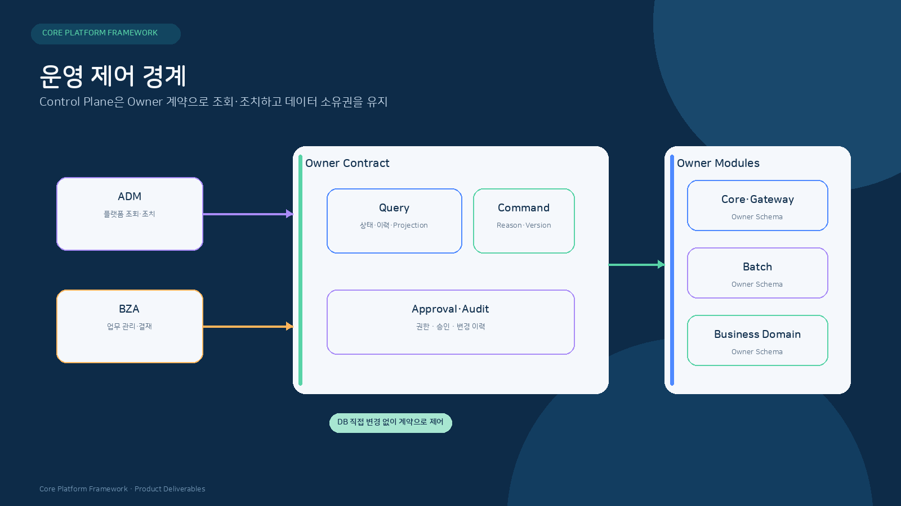
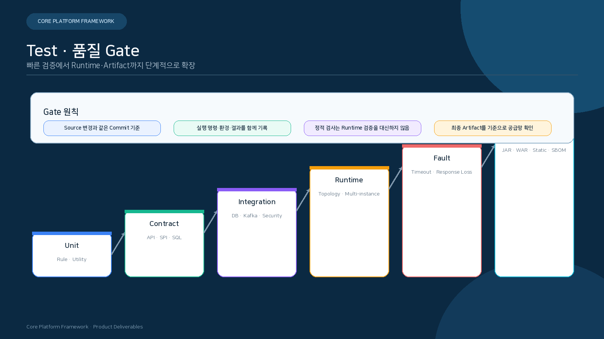

<div align="center">

# 코어 플랫폼 프레임워크(Core Platform Framework)
## 기술표준서

**여러 팀이 같은 제품을 개발·변경·운영할 수 있도록 아키텍처·코드·보안·복구·검증 규범을 정의합니다.**

`규칙 · 개발 · 보안 · 복구 · 검증 증거`

</div>

<p align="center">
  
</p>

---
## 문서 안내

| 항목 | 내용 |
|---|---|
| 목적 | 고객과 CPF 개발 조직이 소스코드·SQL·API·설정·화면·시험·빌드를 같은 기준으로 변경하도록 공통 규칙 제공 |
| 규범 | 필수, 금지, 권고, 선택 |
| 적용 단위 | 루트 빌드, 포함 빌드, 모듈, 생성 업무 영역, 실행 환경, DB 제품별 패키지 |
| 완료 판정 | 실제 사용처·오류·복구·검증·검증 증거까지 확인 |


## 표준을 채택하면 무엇이 달라지는가

### 비전문가에게 기술표준이 필요한 이유

여러 팀이 하나의 업무 시스템을 오래 운영하려면 “코드를 잘 작성한다”는 말만으로는 부족합니다.
누가 데이터를 책임하는지, 다른 시스템과 어떤 약속으로 연결하는지, 장애 이후 무엇을 확인하고
어떻게 복구하는지, 어떤 결과를 성공으로 인정하는지를 같은 기준으로 정해야 합니다.

CPF 기술표준은 개발자의 자유를 줄이기 위한 규칙집이 아닙니다. **업무팀의 고유한 규칙은 각
업무가 소유하고, 여러 팀과 운영 조직이 함께 알아야 하는 부분은 공통 기준으로 관리하기 위한
조직의 약속**입니다.

<p align="center">
  
</p>

### 실제로 달라지는 예

신청 상태를 변경하는 기능을 여러 팀이 각각 개발한다고 가정합니다.

| 표준이 없을 때 | CPF 표준을 적용할 때 |
|---|---|
| 팀마다 요청 형식과 오류 코드가 다름 | 공통 요청 헤더·오류 형식과 업무별 코드를 구분 |
| 동시에 수정하면 마지막 저장이 이전 결과를 덮을 수 있음 | 예상 버전과 충돌 응답으로 재확인 |
| 같은 요청이 반복되면 두 번 처리될 수 있음 | 멱등성 키와 요청 해시로 중복 판정 |
| 운영자가 DB를 직접 수정해 상태를 맞춤 | 책임 주체 명령을 사유·권한·승인·감사와 함께 실행 |
| 응답 유실 후 다시 눌러도 되는지 알 수 없음 | 거래 식별자로 결과 조회 후 재처리·대사 여부 결정 |
| 문서에는 성공이지만 실제 시험는 실행하지 않음 | 개발 상태와 실행 환경·DB·브라우저·장애 검증을 분리 |

### 프레임워크와 업무팀의 역할

<p align="center">
  
</p>

| 프레임워크가 공통으로 유지 | 업무팀이 소유하고 결정 |
|---|---|
| 거래 문맥, 오류 형태, 멱등성·대사 계약 | 업무 상태, 계산·승인·보상 규칙 |
| 공개 API·SPI·패키지·의존성 경계 | 업무 API의 입력·출력과 상태 의미 |
| 보안·감사·마스킹 적용 방식 | 역할·권한·데이터 범위 정책 |
| 빌드·버전·배포 산출물·검증 증거 형식 | 배포본 일정과 고객 업무 승인 |
| DB 변경·되돌리기·검증 규칙 | 업무 테이블·열·인덱스와 보존 기간 |
| 운영 명령의 사유·승인·감사 구조 | 누가 어떤 업무 조치를 승인하는지 |

### 표준을 적용하는 순서

1. 고객의 기존 표준과 CPF 표준이 겹치거나 충돌하는 영역을 찾습니다.
2. 각 업무의 상태·데이터 책임 주체와 외부에 공개할 계약을 먼저 정합니다.
3. 신규 업무부터 생성기·패키지·시험·DB 변경 기준을 적용합니다.
4. 기존 시스템은 API·연결 어댑터와 운영·감사 경계부터 단계적으로 연결합니다.
5. 빌드·OpenAPI·DB·브라우저·장애 시험를 고객 CI/CD와 인수 기준에 연결합니다.
6. 예외가 필요하면 책임 주체·사유·영향·제거 조건을 기록합니다.

### 이 문서의 읽는 방법

- 비전문가와 책임자는 현재 장에서 표준이 조직에 필요한 이유와 책임 경계를 확인합니다.
- 개발자는 Java·Spring·API·트랜잭션·메시지 처리·배치·화면 표준을 확인합니다.
- 운영·보안 담당자는 보안·설정·로그·감사·복구 표준을 확인합니다.
- 품질 담당자는 시험·검증 증거·배포 산출물·문서 수용 기준을 확인합니다.

뒤의 규칙에서 `필수`는 지켜야 하는 계약, `금지`는 회귀와 운영 위험 때문에 허용하지 않는 방식,
`권고`는 상황에 따라 선택하되 다른 방식의 근거를 남겨야 하는 기준입니다.

## 1. 표준 적용 생명주기

| 단계 | 필수 질문 | 산출 |
|---|---|---|
| 요구 | 공통 기준 Requirement와 상태가 무엇인가? | Requirement ID·수용 기준 |
| 설계 | 책임 주체·실제 사용처·데이터·보안·복구가 어디인가? | 아키텍처/API/데이터 설계 |
| 구현 | 공개 API/SPI/내부과 소스코드 기준이 분리되는가? | 소스코드·SQL·설정·화면 |
| 시험 | 정상·오류·동시성·부분 실패·복구를 재현하는가? | 시험·장애 시나리오 |
| 공급 | 정확한 SHA·버전·BOM·플러그인·목록 파일이 일치하는가? | 배포 산출물·검사값 |
| 운영 | 로그·지표·추적·감사로 판단할 수 있는가? | 대시보드·운영 절차 |
| 복구 | 재시도·재시작·재처리·대사·되돌리기가 구분되는가? | 복구 계약 |
| 검증 | 현재 정확한 SHA 검증 증거인가? | 검증표·보고서·해시 |
<p align="center">
  
</p>
## 2. 아키텍처와 책임 소유 표준

### 필수

- 기능·상태·DB·명령·생명주기의 책임 주체를 하나로 정합니다.
- 실제 제품 사용처를 확인합니다.
- 제어 영역과 처리 영역의 쓰기 경계를 분리합니다.
- 로컬·원격·비동기·배치의 업무 계약과 오류 의미를 일치시킵니다.
- 다중 인스턴스 상태는 공유 원장·Lease·Fencing 또는 명시된 정본을 사용합니다.
- 응답 유실·부분 실패의 상태와 대사 경로를 설계합니다.
- 빌드 플러그인·BOM·배포 산출물 저장소도 책임 주체와 소스코드를 둡니다.

### 금지

- 순환 의존성
- 코어의 업무·ADM·배치 역방향 의존
- ADM·BZA·게이트웨이의 책임 주체 DB 직접 갱신
- 실제 사용처 없는 추상화
- Legacy와 신규 구현의 이중 기본 경로
- 로컬 캐시에만 존재하는 빌드 플러그인/BOM
- 예제·생성 참조를 제품 원장으로 사용

## 3. 모듈과 패키지 표준

```text
com.cpf.<owner>.api
com.cpf.<owner>.spi
com.cpf.<owner>.application
com.cpf.<owner>.domain
com.cpf.<owner>.persistence
com.cpf.<owner>.adapter
com.cpf.<owner>.internal
```

<p align="center">
  
</p>

| 패키지 | 포함 | 금지 |
|---|---|---|
| `api` | DTO·명령·조회문·결과·오류 | 저장소·OSS 구현 자료형 |
| `spi` | 기능·생명주기·실패 | 제공자 내부 설정 강제 |
| `application` | 사용 사례·트랜잭션·연결 지점 조합 | HTTP·SQL 기술 세부 |
| `domain` | 상태·불변식·전이 | 프레임워크 애너테이션 남용 |
| `persistence` | 저장소 연결 어댑터·Mapper·조회문 | 업무 상태 판단 |
| `adapter` | HTTP·Kafka·파일·외부 연계 연결 | 책임 주체 규칙 재정의 |
| `internal` | 엔진·구현 세부 | 외부 모듈 참조 |

### 3.1 스타터 제품군 관리 표준

#### 정본과 등록

- 정식 컨테이너 경로는 `cpf-starters/`입니다.
- 컨테이너는 Gradle 프로젝트가 아니며 별도 단수형 관리 프로젝트를 만들지 않습니다.
- 프로젝트 ID·경로 등록 정본은 `settings.gradle`입니다.
- 기능별 구현·자동 설정·설정·시험·게시 정본은 각 `cpf-starters/<leaf>/`가 소유합니다.
- 제품군 생명주기·Profile·Aggregate 정책 정본은
  `cpf-docs/governance/CPF_STARTER_ARCHITECTURE_AND_LIFECYCLE_POLICY.md`입니다.
- 배포 좌표·버전 정렬은 최종 배포 산출물 카탈로그와 `cpf-platform-bom`에서 확인합니다.

#### Leaf 스타터 필수 기준

- 단일 기술 기능과 CPF 공개 계약 연결만 소유합니다.
- 제품·Generated Domain이 필요한 Leaf만 명시적으로 선택합니다.
- 선택하지 않은 애플리케이션에 JAR·빈·설정·SQL·스레드·연결을 전파하지 않습니다.
- 독립 JAR·POM·Sources·JavaDoc·자동 설정 메타데이터·단독 시험을 제공합니다.
- 실제 제품 소비자 또는 승인된 전략적 참조 소비자가 있어야 합니다.
- `cpf-common` 참조는 고객 업무 공통 전체가 전이되지 않는다는 예외 승인과 Footprint 근거가 필요합니다.
- 제품 모듈·업무 Domain·Batch·Gateway의 고유 정책을 스타터에 넣지 않습니다.

#### 현재 7개 프로젝트의 추가 통제

| 프로젝트 | 필수 통제 |
|---|---|
| 보안 | Session JDBC와 Resource Server를 혼합하지 않고 ADM/BZA 경로 정책과 범용 기술 경계를 분리 |
| Kafka | Producer·Consumer·ACK/NACK·DLQ·중복·순서·결과 미확정·대사와 실제 소비자 확보 |
| 캐시 | LOCAL·Caffeine·Redis·JDBC 무효화 책임을 분리 검토하고 `cpf-common` API 전이를 승인 또는 제거 |
| 관측 | SDK·Exporter·마스킹·Backpressure·수집 실패와 실제 운영 수집기 검증 |
| 복원력 | 시간 예산·Retry·Circuit Breaker·Bulkhead와 멱등성·부수 효과·대사 연결 |
| 기능 플래그 | 실제 Provider·대상 문맥·감사·Secure Override·장애 기본값 |
| 비밀값 | 고객 Provider·권한·교체·Rotation·상태 점검·원문 비노출 |

#### Profile·Aggregate·BOM 표준

| 계층 | 표준 |
|---|---|
| Capability Profile | Generator/Build가 Leaf 목록으로 해석하고 `resolvedStarters`, Profile Version, Lock을 저장 |
| Aggregate Starter | 실행 코드·자동 설정·DB 없이 승인된 Leaf 의존성만 전이 |
| Platform BOM | 버전만 정렬하고 실행 의존성은 활성화하지 않음 |

- Profile 이름만 남기고 실제 Leaf 의존성을 숨기지 않습니다.
- Profile 변경으로 기존 Domain의 의존성이 묵시적으로 바뀌지 않게 버전과 해석 결과를 잠급니다.
- Aggregate는 동일 조합의 Profile과 하나의 정본을 공유합니다.
- Consumer는 개별 Leaf 선택 방식을 계속 사용할 수 있어야 합니다.
- `all`, `full`, `everything` 성격의 Mega Starter는 금지합니다.
- 상호 배타 Provider가 함께 들어오면 생성·빌드 단계에서 거부 우선으로 실패합니다.
- Batch·Gateway·ADM·BZA 제품 고유 조합은 범용 Profile이 아닌 제품 빌드 또는 전용 빌드 규칙이 관리합니다.

#### Generated Domain 적용 표준

- 현재 생성기는 Profile을 구현하지 않았으므로 필요한 Leaf를 `build.gradle`에 직접 선언합니다.
- Profile 구현 시 생성기 입력, Domain Manifest, 설정, 시험, DB 패키지, 안내서를 같은 변경에서 갱신합니다.
- 생성 결과에는 Profile 이름뿐 아니라 최종 Leaf 목록과 버전을 기록합니다.
- `cpf-member` Golden Reference가 생성기와 같은 결과를 갖는지 검증합니다.

#### 경량 코어 분리 표준

- Core에는 표준 식별자·오류·요청 문맥·구현 중립 공개 API·SPI와 최소 자료형만 둡니다.
- MyBatis·AspectJ·Web 실행·OpenAPI UI·OTel Exporter·압축·Provider 구현은 실제 책임 스타터 또는 모듈로 이관합니다.
- 의존성만 옮기지 않고 공개 계약·Consumer·설정·시험·오류·복구·DB·생성기·안내서를 함께 이관합니다.
- 이전 Core 기본 구현을 남겨 이중 기본 경로를 만들지 않습니다.
- Core만 소비하는 비 Spring 계약 소비자와 최소 업무 컴파일 시험을 유지합니다.

#### 변경 수용 기준

| 확인 항목 | 완료 조건 |
|---|---|
| 등록 | `settings.gradle`의 7개 ID와 `cpf-starters/*` 경로 일치 |
| 컨테이너 | 별도 Gradle 프로젝트로 오인하지 않음 |
| 단독 빌드 | 7개 `check`, JAR·POM·Sources·JavaDoc 성공 |
| 실제 사용처 | 제품 빌드·빈·설정·DB·운영 경로 연결 |
| 미선택 제거 | 불필요 JAR·빈·설정·SQL·스레드·연결 0 |
| 역방향 의존 | Core·Common·제품 모듈의 금지 방향 0 |
| Profile | 해석된 Leaf 목록·버전 잠금·동등성·충돌 시험 |
| Aggregate | 실행 코드 0, 승인 Leaf만 전이, Footprint 검증 |
| BOM | 버전 제약만 제공하고 실행 의존성 활성화 0 |
| 공급 | LOCAL_DEV·REMOTE·OFFLINE의 동일 SHA·POM·SBOM·검사값 |
| 문서 | 아키텍처·사양·표준·DB·개발자·운영자 안내의 상태 일치 |

## 4. 공개 API와 SPI 표준

- 공개 API는 immutable 또는 명확한 입력 검증 규칙을 사용합니다.
- 컬렉션은 널 대신 빈 컬렉션을 반환합니다.
- 시간은 시간대·시각 기준 소스코드·정밀도를 명시합니다.
- 상태값은 열거형 또는 버전이 있는 목록으로 관리합니다.
- 오류 코드는 메시지와 분리합니다.
- SPI는 기능, 생명주기, 실패, 스레드 안전성, 버전을 문서화합니다.
- 공개 API에 특정 OSS 구현 자료형을 노출하지 않습니다.
- 호환성을 깨는 변경은 실제 사용처·혼합 버전·DB 변경 영향을 분석합니다.

## 5. 빌드 규칙 플러그인과 BOM 표준

### 5.1 정본

| 항목 | 정본 |
|---|---|
| 기술 구성 | `gradle/cpf-stack.properties` |
| 플랫폼 버전 | `gradle/cpf-platform.properties` |
| 모듈/포함 빌드 | `settings.gradle` |
| 스타터 컨테이너·프로젝트 등록 | `settings.gradle`, `cpf-starters/*/build.gradle` |
| 루트 빌드 계약 | `build.gradle` |
| 공통 빌드 규칙 플러그인 | `cpf-tools/build/gradle-plugin` |
| 플랫폼 BOM | `cpf-tools/build/platform-bom` |

### 5.2 필수

- 플러그인과 BOM 소스코드를 Git에 추적합니다.
- 빈 `GRADLE_USER_HOME`에서도 포함 빌드로 플러그인을 해석할 수 있어야 합니다.
- Java 도구 체계·`--release`·인코딩·소스·JavaDoc JAR를 중앙 계약으로 둡니다.
- 정확한 40자 소스코드 SHA를 배포 산출물 메타데이터에 넣습니다.
- 의존성 잠금과 BOM을 함께 검증합니다.
- 압축 파일의 시각과 파일 순서를 재현 가능하게 설정합니다.
- 로컬·검증 저장소·원격 저장소를 분리합니다.
- 검증 저장소 검증 뒤 목록 파일 Barrier로 승격합니다.
- `REMOTE`·폐쇄망 공급에서 개발자 로컬 저장소로 우회하지 않습니다.

### 5.3 금지

- `SNAPSHOT`을 배포본 버전처럼 표기
- 소스코드 없는 플러그인 표시 산출물만 배포
- 모듈별 임의 버전 Override
- 인증 정보를 빌드 로그·설정값 파일·검증 증거에 출력
- 수용 기준 실패 배포 산출물의 승격
- 기본 빌드 성공 후 게시를 암묵적으로 실행

## 6. Java · Spring 표준

### Java

- Constructor Injection을 사용합니다.
- 공개 호출 방식의 입력·결과·오류를 명시합니다.
- 변경 가능한 컬렉션·배열를 방어 복사합니다.
- 자원은 try-with-resources 또는 책임 주체 생명주기로 닫습니다.
- Catch 후 무시하거나 일반 성공으로 변환하지 않습니다.
- 동시성 상태는 스레드 안전성와 Visibility를 설명합니다.

### Spring

- `@Transactional`은 애플리케이션 사용 사례 경계에 둡니다.
- Self Invocation에 의존하지 않습니다.
- `@ConfigurationProperties`와 입력 검증을 사용합니다.
- 프로필로 업무 규칙을 숨기지 않습니다.
- 선택 기능은 `@ConditionalOn...` 조건과 명시적 설정으로 활성화합니다.
- 제어기에 업무 규칙·SQL·재시도 Loop를 두지 않습니다.

## 7. API·OpenAPI·생성 클라이언트 표준

### 필수 생명주기

```text
제어기·API 소스코드
        ↓
OpenAPI 소스 명세 검증
        ↓
생성 클라이언트
        ↓
생성 계약 시험
        ↓
작업 실제 사용처 검증
        ↓
배포 명세 검증
        ↓
화면 묶음 목록 파일
```

- 호출 방식, 경로, 요청 헤더, 요청, 응답, 오류, 권한을 OpenAPI와 소스코드에서 일치시킵니다.
- 소스 명세과 배포 명세의 용도를 분리합니다.
- 생성 결과를 임의 수정하지 않습니다.
- 작업이 실제 화면·서비스 실제 사용처와 연결되는지 검사합니다.
- 경로·메뉴·권한과 API 작업을 대조합니다.
- Deprecated API는 제거일·대체 API·혼합 버전 기간을 명시합니다.
- 조회 전용 API에 명령·승인 계약을 섞지 않습니다.

## 8. 트랜잭션 · 동시성 표준

| 상황 | 필수 통제 |
|---|---|
| 자원 동시 수정 | expectedVersion·Optimistic 잠금 |
| 중복 변경 요청 | 멱등성 키·requestHash |
| 다중 일정 실행기/작업자 | Lease·Fencing Epoch |
| Kafka 중복 | Inbox·Processed 키 |
| 순서 역전 | 버전·시퀀스·OccurredAt 보조 |
| 늦은 응답 | 현재 상태·처리 시도 조회 |
| 부분 성공 | 대상별 결과 원장 |
| DB 교착상태 | 루트 Cause 분석, 제한 재시도 |
| 잠금 시간초과 | 실패 단계·Retryability·운영 안내 |

트랜잭션은 DB·감사·Outbox·외부 부수 효과 경계를 명시합니다.

## 9. 멱등성·결과 미확정·대사 표준

1. 실행 전 실패, 부수 효과 전 실패, 커밋 전 실패를 구분합니다.
2. 커밋 후 응답 유실과 외부 부수 효과 후 응답 유실을 `UNKNOWN_RESULT`로 분류합니다.
3. 같은 operationId와 requestHash로 결과를 조회합니다.
4. 책임 주체 상태, 처리 시도 이력 원장, 외부 상태를 비교합니다.
5. 실제 결과가 확인되면 `RECONCILED` 또는 업무 최종 상태로 전이합니다.
6. 확인 불가 시 수동 판단 조건·만료·승인 절차를 둡니다.
7. 무조건 재전송하거나 일반 실패로 닫지 않습니다.

## 10. 로컬·원격 호출과 장애 복원력 표준

- 전체 처리 기한을 먼저 정하고 Connect/조회/대기열 시간 예산을 나눕니다.
- 재시도는 오류 유형, 멱등성, 남은 처리 기한, 최대 처리 시도를 확인합니다.
- 4xx 업무 오류는 일반 네트워크 재시도 대상이 아닙니다.
- Circuit Breaker는 실패율·Slow Call·Open 시간·Half-open 요청 수를 명시합니다.
- 격리(Bulkhead)는 Thread/연결/대기열 용량을 제한합니다.
- 대체 경로은 성공과 구분되는 상태·소스코드·신선도를 반환합니다.
- 원격 응답 유실은 결과 조회문가 없는 한 재전송을 금지합니다.

## 11. Kafka 이벤트 표준

- at-least-once 전달을 전제로 합니다.
- Outbox와 Inbox 또는 동등한 원자성·중복 통제를 사용합니다.
- 이벤트 Envelope에 ID·자료형·버전·발행자·OccurredAt·transactionId를 포함합니다.
- 분할 키와 순서 보장 범위를 명시합니다.
- 재시도와 DLT의 대상 오류를 분리합니다.
- DLT 재처리 전 현재 책임 주체 상태를 조회합니다.
- 스키마 호환성과 열거형 확장 규칙을 시험합니다.
- PII·비밀값 원문을 이벤트·요청 헤더·DLT에 넣지 않습니다.

## 12. 파일·첨부·외부 연계 표준

- 파일 크기·MIME·확장자·해시·검사 상태를 저장합니다.
- 대용량은 스트리밍과 Backpressure를 적용합니다.
- 저장 경로와 접근 권한을 사용자 입력 그대로 조합하지 않습니다.
- Parsing 오류는 행/항목/바이트 Offset을 제공합니다.
- 부분 성공은 대상별 상태를 보존합니다.
- 외부 요청은 requestHash·상대 거래번호·attemptId를 기록합니다.
- 시간초과 후 상대 상태 조회 없이 재전송하지 않습니다.
- 전문은 바이트 길이·인코딩·Padding을 시험 Fixture로 검증합니다.
## 13. 보안·권한·감사 표준

- Authentication과 인가을 서버에서 최종 판정합니다.
- 역할, 권한, 데이터 범위, 항목 범위를 구분합니다.
- 위험 조치는 사유, 승인, expectedVersion, Actor, 감사를 연결합니다.
- 마스킹은 API·화면·내보내기·로그·추적·검증 증거에 각각 적용합니다.
- 비밀값은 제공자/환경 주입을 사용하고 소스코드·Fixture에 원문을 두지 않습니다.
- 브라우저 인증 정보 영구 저장을 금지합니다.
- SSRF, 경로 Traversal, Injection, Replay, Nonce, 본문 해시를 적용 범위에 따라 검증합니다.
- 감사는 변경 전후, 대상, 결과, 실패 원인을 보존합니다.

## 14. 설정과 비밀값 표준

| 항목 | 기준 |
|---|---|
| 설정값 | 키, 자료형, 기본값, Required, 범위, 실제 사용처 |
| 환경 | 프로필·방식별 차이와 금지 값 |
| 비밀값 | 원문 비노출, Rotation, 버전, 제공자 |
| 변경 | 입력 검증 → 승인 → 부분 적용 → 대사 |
| 재기동 | 필요 여부와 영향 실행 환경 |
| 실패 | Fail-fast/Degraded/Disabled를 명시 |
| 되돌리기 | 이전 버전·검사값 복구 |
| 감사 | Actor·사유·Before/After·결과 |

## 15. 로그·지표·추적 표준

- `transactionId`, `operationId`, `segmentId`, `attempt`, `instanceId`를 적용 범위에 따라 연결합니다.
- 지표 Label은 Cardinality가 제한된 값만 사용합니다.
- 추적에 본문·토큰·주민번호·계좌번호 원문을 넣지 않습니다.
- 오류 로그는 코드·실패 단계·Retryability·Operator Guidance를 제공합니다.
- 관측 내보내기 실패와 업무 트랜잭션의 영향 경계를 명시합니다.
- Alert에는 조건, 지속 시간, Severity, 책임 주체, 운영 절차, 해제 조건을 둡니다.

## 16. 배치 표준

- Spring Batch 메타데이터를 Job·Step 실행 정본으로 사용합니다.
- JobParameter의 Identifying 여부를 설계합니다.
- 청크 Size와 커밋 Interval을 자원·복구 단위로 결정합니다.
- Reader/Processor/Writer의 재시작 가능성을 검증합니다.
- 중지·재시작·Abandon·재처리를 구분합니다.
- 분할/작업자에 Lease와 Fencing을 적용합니다.
- Center-Cut은 Preview, 대상 선정, 건수/금액 대사 기준을 가집니다.
- 호스트 에이전트는 승인 배포 산출물·해시·허용 명령만 실행합니다.
- Misfire, 중복 실행 조건, 처리 강제 종료, 응답 유실을 시험합니다.

## 17. 운영 화면 표준

- Vue 라우터, Pinia, TanStack 조회문/테이블, Zod, 생성 클라이언트를 기본 경로로 사용합니다.
- 화면별 임의 Fetch와 중복 API 모델을 만들지 않습니다.
- 경로·메뉴·권한·API 작업을 대조합니다.
- 서버 권한 판정을 UI 활성 조건으로 대체하지 않습니다.
- 조회문과 명령 상태를 분리합니다.
- Loading, 빈 값, 오류, 부분, UNKNOWN_RESULT 상태를 표시합니다.
- 위험 명령는 사유·승인·expectedVersion·대상 범위를 입력받습니다.
- 생성 클라이언트·잠금 파일·묶음 목록 파일 구성 차이를 수용 기준에서 차단합니다.
- Chromium·Firefox·WebKit과 접근성 시나리오를 적용 범위에 따라 실행합니다.

## 18. 데이터베이스 연계 경계

- 책임 주체 모듈만 자기 스키마의 쓰기를 수행합니다.
- 업무 영역 간 조회는 API/이벤트/조회 모델을 사용합니다.
- SQL은 조회문 자원·실제 사용처·매개변수 순서를 명시합니다.
- 동적 식별자는 허용 목록을 사용합니다.
- DB 제품별 문법 차이는 패키지로 분리합니다.
- DB 변경과 실행 환경 조회문의 자료형·길이·인덱스 의미를 일치시킵니다.
- 잠금과 격리 수준 Level을 업무 시나리오로 검증합니다.

## 19. 문서화 · 생성 소스코드 표준

- 공개 API/SPI와 복구·동시성·보안 로직에 한글 설명을 제공합니다.
- OpenAPI, JavaDoc, 안내서, 도식, 소스코드 경로를 연결합니다.
- 소스코드에 없는 클래스·설정값·경로·권한·상태를 만들지 않습니다.
- 생성 영역과 사용자 수정 영역을 목록 파일로 구분합니다.
- 재생성 후 구성 차이와 사용자 변경 보존 여부를 검사합니다.
- 기준 커밋과 미검증을 문서 하단에 기록합니다.
<p align="center">
  
</p>
## 20. 시험·품질·검증 증거 표준
<p align="center">
  
</p>
### 20.1 시험 축

| 축 | 대표 시험 |
|---|---|
| 정상 | 대표 업무 흐름·상태·DB·응답 |
| 입력/권한 | 입력 검증, Authentication, 인가, 범위, 마스킹 |
| 동시성 | Race, 버전 Conflict, Duplicate, Lease/Fencing |
| 결과 불명 | 커밋 후 응답 유실, 외부 ACK 유실 |
| 부분 실패 | 다중 대상 일부 성공·재처리 |
| 복구 | 재시도, 재시작, 재처리, 대사, 보상, 되돌리기 |
| DB 제품 | MariaDB, PostgreSQL, Oracle 의미 동등성 |
| 배치 구조 | 로컬, 원격, 다중 인스턴스 |
| 브라우저 | Chromium, Firefox, WebKit, 접근성 |
| Supply Chain | 잠금, SBOM, License, 비밀값, CVE, Signature |

### 20.2 검증 증거 필수 필드

- 정확한 소스코드 SHA
- 실행 명령과 Working 디렉터리
- OS/JDK/Gradle/Node/npm/DB/Broker 버전
- 시작·종료 시각과 종료 코드
- 로그·보고서·배포 산출물 경로와 SHA-256
- Sanitization 결과
- 실패 루트 Cause와 수정 범위
- 재실행 단계와 무효화된 이전 결과

실행하지 않은 시험를 성공으로 기록하지 않습니다.

## 21. 배포 산출물·의존성·버전 관리 표준

- 플랫폼 버전과 구성요소 버전 정본을 분리하지 않습니다.
- BOM과 의존성 잠금의 구성 차이를 검사합니다.
- Sources·JavaDoc·POM·목록 파일를 공개 배포 산출물과 함께 검증합니다.
- 폐쇄망 묶음은 Maven 구조, 목록 파일, 검사값, 소스코드 SHA를 포함합니다.
- 원격 게시는 명시된 저장소와 인증 정보이 없으면 실패합니다.
- 혼합 버전 지원 범위와 되돌리기 기준을 배포본별로 기록합니다.
- `SNAPSHOT`과 배포본 배포 산출물 저장소를 분리합니다.

## 22. 금지 패턴

| 금지 | 이유 |
|---|---|
| 제어기의 업무 규칙·SQL | 책임·시험·트랜잭션 경계 붕괴 |
| ADM/BZA의 책임 주체 테이블 수정 | 책임 소유 위반 |
| 시간초과 후 무조건 재전송 | 중복 부수 효과 |
| `catch(Exception)` 후 성공 반환 | 결과 왜곡 |
| 비밀값·PII 원문 로그 | 보안·감사 위반 |
| 로컬-only 플러그인/BOM | 빈 환경 빌드 실패 |
| 임의 생성 소스코드 수정 | 재생성 구성 차이 |
| 문서만의 API·설정값·화면 | 소스코드 불일치 |
| 과거 SHA 검증 증거 승계 | 현재 결과 오판 |
| 전체 미추적 파일 삭제 | 다른 작업자 변경 손실 |

## 23. 변경 검토·승인 기준

### 23.1 변경 분류

| 분류 | 예 | 추가 검증 |
|---|---|---|
| 공개 계약 | API·SPI·이벤트·오류 | 실제 사용처·호환성·OpenAPI |
| 데이터 | 테이블·열·인덱스·DB 변경 | 3 DB 제품·업그레이드·되돌리기·구성 차이 |
| 실행 환경 | 시간초과·Thread·대기열·프로필 | Load·장애·자원 |
| 보안 | Auth·권한·마스킹·비밀값 | Negative·감사·브라우저 |
| 빌드·배포 산출물 | 플러그인·BOM·버전·게시 | 빈 값 캐시·검증 저장소·실제 사용처 |
| 화면 | 경로·메뉴·생성 클라이언트 | 브라우저·권한·A11y |
| Documentation | 계약·절차·도식 | 소스코드 Link·기준 SHA·Broken Link |

### 23.2 승인 질문

1. 책임 주체와 실제 사용처가 분명한가?
2. 실패·부분 실패·UNKNOWN_RESULT가 정의됐는가?
3. 데이터·보안·호환성 영향이 검토됐는가?
4. 필요한 시험를 실행했고 검증 증거가 현재 SHA인가?
5. 되돌리기/전진 복구가 가능한가?
6. 공식 안내서와 산출물의 사실이 일치하는가?

## 24. 산출물 문서 수용 기준

### 24.1 실제 식별자 수용 기준

다음 항목이 원칙 설명만 있고 실제 식별자가 없으면 문서 상태를 부분 구현으로 기록합니다.

| 영역 | 최소 실제 식별자 |
|---|---|
| API | 모듈, 호출 방식, 경로, operationId, 소스코드·배포 명세 상태 |
| Java | 클래스/인터페이스, 패키지, 호출 방식 또는 Entry |
| 설정 | 키, 환경변수, 자료형, 기본값, 실제 사용처 |
| SQL | 스키마.테이블, 조회문 ID/자원, 실제 사용처, DB 변경 버전 |
| 화면 | 경로, 구성요소, 권한, 생성 작업 |
| 빌드 | 작업, 플러그인 ID, 배포 산출물 Coordinate, 저장소 방식 |
| 시험 | 시험 클래스/스크립트, 명령, 환경, 종료 코드 |
| 검증 증거 | 정확한 SHA, 보고서·배포 산출물 해시 |

“해당 표를 작성해야 한다”는 규칙만 있고 현재 제품 식별자가 없으면 사양서 완료로 판정하지 않습니다.

### 24.2 소스코드 불일치 수용 기준

문서 작성 중 다음 불일치를 발견하면 소스코드를 추정해서 맞추지 않습니다.

1. 루트 작업가 포함 빌드에 없는 작업를 참조
2. 등록 모듈이 루트 검증·게시 목록에서 누락
3. OpenAPI 작업과 생성 클라이언트 실제 사용처가 불일치
4. 검증표·목록 기준 SHA가 최신 커밋과 불일치
5. DB 변경과 실행 환경 조회문의 열·자료형이 불일치
6. 공식 안내서가 소스코드에 없는 화면·권한·상태를 설명

문서에는 불일치 소스코드 양쪽, 영향, 현재 상태, 판정 명령, 책임 주체를 기록합니다.

### 24.3 실행 전 OpenAPI 수용 기준

- `CONTROLLER_SOURCE_PRE_RUNTIME` Spec은 제어기 소스코드 정합성 확인에만 사용합니다.
- `release-eligible=false` Spec을 배포본 API 계약으로 표시하지 않습니다.
- `additionalProperties=true` 공통 개체는 구체 DTO 검증을 대체하지 않습니다.
- 실행 환경 배포 명세은 실제 보안 Scheme과 표준 오류 응답를 포함해야 합니다.
- 저장소 관리 Spec의 작업 수와 실행 환경 내보내기의 작업 수를 비교합니다.
- 생성 클라이언트는 배포 명세 또는 승인된 소스 명세 범위를 명시합니다.

### 24.4 오래된 검증 증거 수용 기준

- 검증 증거의 기준 SHA가 최신 소스코드와 다르면 `재확인 필요`입니다.
- `PENDING_*`, `UNKNOWN`, 축약 SHA는 결과 SHA로 인정하지 않습니다.
- 개발 완료와 실행 검증 상태를 별도 열으로 유지합니다.
- 소스코드 변경이 시험 결과에 영향을 줄 수 있으면 이전 성공 검증 증거를 무효화합니다.
- CI 상태가 없거나 조회되지 않으면 성공으로 간주하지 않습니다.

### 24.5 정리 명령 안전 표준

산출물 생성 작업의 정리 명령은 해당 작업이 생성한 **정확한 전달 파일 경로만** 삭제합니다.

허용 예:

```powershell
@('정확한파일1.zip','정확한파일2.json') | ForEach-Object { if(Test-Path -LiteralPath $_ -PathType Leaf){Remove-Item -LiteralPath $_ -Force} }
```

금지:

- `git clean`
- Wildcard로 ZIP·JSON·TXT 전체 삭제
- `cpf-docs/deliverables/**` 삭제
- 안내서·소스코드·다른 미추적 파일 삭제
- 저장소 전체 빈 폴더 재귀 삭제
- 다른 작업자의 변경 여부를 확인하지 않은 디렉터리 삭제

## 구현·검증 상태 표기

| 상태 | 의미 |
|---|---|
| 완료 | 구현과 필요한 검증이 현재 기준 커밋에서 확인됨 |
| 부분 구현 | 주요 소스코드는 있으나 실제 사용처·복구·검증 중 일부가 부족함 |
| 미구현 | 요구 기능의 소스코드 또는 실제 사용처가 없음 |
| 미검증 | 소스코드는 있으나 실행 환경·DB·브라우저·장애 시험을 실행하지 않음 |
| 실패 | 실행한 검증에서 기대 결과를 충족하지 못함 |
| 재확인 필요 | 기준 커밋·환경·검증 증거가 달라 현재 상태를 확정할 수 없음 |
## 기준 저장소와 문서 근거

| 항목 | 값 |
|---|---|
| 저장소 | `freeangelsun/202412_01_CPF` |
| 브랜치 | `master` |
| 기준 커밋 | `bdfd27d948ede982697deada0f7393c4290ecd66` |
| 제품 구조 목표 | `cpf-core` 경량화, `cpf-starters/` Leaf 선택, Profile·Aggregate·BOM 계층 분리 |
| 검토일 | `2026-08-02` |
| 최상위 요구사항 정본 | `cpf-docs/governance/CPF_FINAL_TARGET_REQUIREMENTS.md` |
| 현재 Git 정본 경로 | `cpf-docs/governance/CPF_FINAL_TARGET_REQUIREMENTS.md` |
| 문서 표준 | `cpf-docs/specification/CPF_DOCUMENTATION_STANDARD.md` |
| 사실 정본 | 소스코드 · SQL · API · 설정 · 화면 · 스크립트 · 시험 |
| 플랫폼 버전 | `1.0.0-SNAPSHOT` |
| 기술 구성 상태 | 현재 구현과 목표 구조 병기 |
| 이번 검증 | 최신 Git 소스코드·빌드·자동 설정·실제 사용처·생성기·정본 정책 대조, Markdown·이미지·ZIP 구조 검사 |
| 미검증 | 7개 스타터 전체 `check`, 프로필·묶음 구현, DB 3종, 브라우저, 다중 인스턴스, 장애/DR, 동일 배포본 게시 |

> 최상위 요구사항 정본은 `cpf-docs/governance/CPF_FINAL_TARGET_REQUIREMENTS.md`에 있으며, 실제 소스코드와 실행 결과가 하위 문서보다 우선합니다.