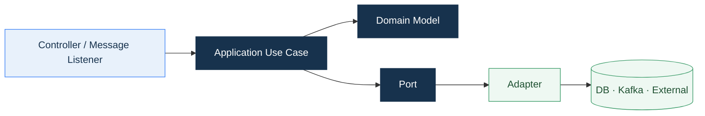
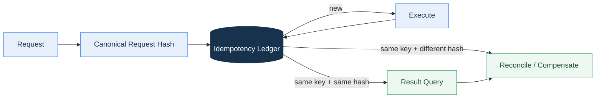

<div align="center">

# Core Platform Framework
## 기술표준서

**Architecture, API, 코드, 보안, 운영과 시험에 공통 적용하는 기술 기준**

`Rules · Coding · Security · Reliability · Quality`

</div>

<p align="center">
  
</p>

---

## 문서 안내

| 항목 | 내용 |
|---|---|
| 목적 | CPF Source·API·Config·Frontend·Test가 따라야 할 공통 규칙을 정의합니다. |
| 적용 대상 | Core, Common, Starter, ADM, BZA, Gateway, Batch, Generator, Reference, Domain |
| 규범 | **필수**, **금지**, **권고**, **선택** |
| 관련 문서 | [아키텍처설계서](아키텍처설계서.md) · [기술사양서](기술사양서.md) · [데이터베이스표준서](데이터베이스표준서.md) |

<details>
<summary><strong>빠른 목차</strong></summary>

1. 핵심 표준
2. Architecture
3. Module·Package
4. Public API·SPI
5. Java·Spring
6. 계층·Port·Adapter
7. API·Header·오류
8. Transaction·동시성
9. 멱등성·결과 대사
10. Local·Remote·Resilience
11. Kafka·Event
12. File·Attachment·외부연계
13. Security·Permission·Audit
14. Config·Secret
15. Log·Metric·Trace
16. Batch
17. Frontend
18. 데이터베이스 연계 경계
19. 문서화·Generated Source
20. Test·품질
21. Artifact·Dependency·Versioning
22. 금지 Pattern
23. 검토 기준

</details>


## 0. 표준 적용 순서

| 단계 | 적용 기준 | 산출 |
|---|---|---|
| 설계 | Owner, Public Contract, State, Data, Security 경계를 결정합니다. | Architecture·API·Data 설계 |
| 구현 | Package, Layer, Transaction, SQL, Config 규칙을 적용합니다. | Source·SQL·Config |
| 시험 | 정상·경계·동시성·복구·보안 계약을 확인합니다. | Unit·Contract·Integration Test |
| 배포 | Artifact, DB Migration, Config Version을 한 Release 단위로 묶습니다. | Manifest·Checksum·Release Note |
| 운영 | Log·Metric·Trace·Audit와 Control Plane을 연결합니다. | Dashboard·Alert·Audit |
| 복구 | Retry·Restart·Reprocess·Reconcile·Rollback을 구분합니다. | Recovery Contract |

## 1. 핵심 표준 12개

| 번호 | 표준 |
|---:|---|
| 1 | 기능·상태·DB·Command는 하나의 Owner Module이 소유합니다. |
| 2 | Module 간 연결은 Public API 또는 SPI를 사용합니다. |
| 3 | Local·Remote는 같은 업무 계약과 오류 의미를 유지합니다. |
| 4 | 변경 API는 Idempotency와 expectedVersion을 적용합니다. |
| 5 | Timeout·Retry는 전체 Deadline과 업무 의미 안에서 사용합니다. |
| 6 | 결과를 단정할 수 없는 경우 상태 조회·대사 경로를 제공합니다. |
| 7 | Kafka는 at-least-once를 기준으로 Consumer 중복 방지를 적용합니다. |
| 8 | 위험 조치는 Reason·Approval·Audit·Rollback을 연결합니다. |
| 9 | Secret·Credential·개인정보 원문을 Log·Trace·Evidence에 남기지 않습니다. |
| 10 | SQL은 Owner와 Query Resource를 명시하고 Vendor 차이를 분리합니다. |
| 11 | 정상·오류·동시성·복구·보안 Test를 기능 계약과 함께 작성합니다. |
| 12 | Generated Source와 Framework 보호 영역을 임의 수정하지 않습니다. |


<p align="center">
  
</p>

<p align="center"><sub>Architecture·API·Data·Security·Reliability·Quality 관점으로 변경을 검토합니다.</sub></p>

## 2. Architecture 표준

### 필수

- Module마다 Owner 책임과 실제 Consumer를 명시합니다.
- Control Plane과 Data Plane을 분리합니다.
- 선택 기능은 Starter·Adapter·Provider로 격리합니다.
- 동기·비동기·Batch·외부 연계에서 같은 transactionId와 오류 분류를 사용합니다.
- Multi-instance 상태는 공유 원장, Lease, Fencing 또는 명시된 정본을 사용합니다.

### 금지

- 순환 Dependency
- 업무 Domain 간 DB 직접 접근
- ADM·BZA의 Owner DB 직접 갱신
- Core에서 선택 Runtime을 강제
- 실제 Consumer 없는 Interface·Adapter·Starter
- Legacy와 신규 구현의 Dual Primary

## 3. Module · Package 표준

```text
com.cpf.<owner>.api
com.cpf.<owner>.spi
com.cpf.<owner>.application
com.cpf.<owner>.domain
com.cpf.<owner>.persistence
com.cpf.<owner>.adapter
com.cpf.<owner>.internal
```

| Package | 책임 |
|---|---|
| `api` | Public DTO·Command·Query·Result·Error |
| `spi` | 외부 Provider가 구현할 Capability Contract |
| `application` | Use Case, Transaction Boundary, Port 조합 |
| `domain` | 상태·규칙·전이·Value Object |
| `persistence` | Repository Adapter, Mapper, Query Resource |
| `adapter` | HTTP, Kafka, File, External System 연결 |
| `internal` | Owner 내부 Engine과 구현 세부 |

### Naming

- Class 이름은 책임을 드러내는 명사를 사용합니다.
- `Manager`, `Util`, `Helper`, `Common`처럼 범위가 불명확한 이름을 피합니다.
- Command는 행동, Query는 조회 의도를 표현합니다.
- DTO와 Domain Model을 동일 Class로 사용하지 않습니다.
- Boolean은 긍정형 의미를 사용합니다.

## 4. Public API · SPI 표준

| 항목 | Public API | SPI |
|---|---|---|
| 목적 | Consumer의 안정된 사용 계약 | Provider 확장 계약 |
| 문서 | 요청·응답·오류·Version | Capability·Lifecycle·Failure·Thread-safety |
| 변경 | 호환성 분석과 Version 정책 | 기본 Method 또는 새 Version Contract |
| 금지 | Internal Type, 특정 OSS 구현 Type 노출 | Provider 내부 설정 강제 |

- Public API는 immutable DTO 또는 명확한 Validation 규칙을 사용합니다.
- Collection은 Null 대신 빈 Collection을 반환합니다.
- 시간은 Zone·Clock Source·정밀도를 명시합니다.
- 상태값은 Enum 또는 Versioned Catalog로 관리합니다.
- 오류 Code는 안정된 식별자이고 Message와 분리합니다.

## 5. Java · Spring 작성 표준

### Java

- Constructor Injection을 사용합니다.
- Public Method는 입력과 결과 Contract를 명확히 합니다.
- `Optional`은 Return Type 중심으로 사용하고 Field·Parameter 남용을 피합니다.
- Mutable Collection과 Array는 방어 복사합니다.
- Resource는 try-with-resources 또는 Owner Lifecycle로 닫습니다.
- Catch 후 무시하거나 일반 성공으로 변환하지 않습니다.

### Spring

- `@Transactional` 경계를 Application Use Case에 둡니다.
- Self Invocation에 의존하지 않습니다.
- `@ConfigurationProperties`로 설정을 구조화하고 Validation합니다.
- Profile은 환경 차이를 표현하고 업무 분기를 숨기지 않습니다.
- Bean 선택은 `@ConditionalOn...`과 명시적 Capability를 사용합니다.
- Controller에 업무 규칙과 SQL을 두지 않습니다.

## 6. 계층 · Port · Adapter 표준



- Controller는 Protocol 변환, Validation, 인증 Context 전달을 담당합니다.
- Application은 Use Case 순서, Transaction, Port 호출을 담당합니다.
- Domain은 업무 상태와 규칙을 담당합니다.
- Port는 필요한 Capability를 정의합니다.
- Adapter는 DB, Kafka, File, 외부 API의 기술 구현을 담당합니다.

<p align="center">
  
</p>

<p align="center"><sub>Protocol, Use Case, 업무 규칙, 기술 구현을 변경 책임에 따라 분리합니다.</sub></p>

| 계층 | 반드시 포함할 책임 | 포함하지 않을 책임 |
|---|---|---|
| Controller·Listener | 입력 변환, Validation, 인증 Context | 업무 상태 전이, SQL, 외부 재시도 정책 |
| Application | Use Case 순서, Transaction, Port 조합 | HTTP·Kafka·DB 구현 Type |
| Domain | 상태, 불변식, 업무 판단 | Framework Annotation과 Adapter 세부사항 |
| Port | 필요한 Capability와 오류 계약 | 특정 Vendor·Library 구현 |
| Adapter | DB·REST·Kafka·File 구현 | Owner의 업무 규칙 재정의 |

## 7. API · Header · 오류 표준

### API

- Resource 중심 URI와 HTTP Method 의미를 일관되게 사용합니다.
- Command API는 생성된 ID, Version, Operation ID를 반환합니다.
- Paging은 Server Paging을 사용하고 Sort Field Allowlist를 적용합니다.
- Filter는 Type·범위·기간 상한을 정의합니다.
- Download는 서버 생성, File Hash, TTL, Audit를 적용합니다.

### Header

- `Authorization`, `traceparent`, `tracestate`, `Idempotency-Key`, `If-Match`는 표준 의미를 유지합니다.
- CPF Context의 물리 이름은 Header 상수와 OpenAPI를 단일 정본으로 사용합니다.
- 외부 신뢰 Header는 Entry에서 제거·검증·재생성합니다.
- Header에 Secret·Credential·개인정보 원문을 넣지 않습니다.

### 오류

| 분류 | 예 | 처리 |
|---|---|---|
| Validation | 형식·길이·범위 오류 | Field·Offset과 안정된 Code 반환 |
| Authentication | 인증 실패 | 내부 원인 노출 없이 거부 |
| Authorization | 권한·Data Scope 부족 | 대상 존재 여부를 과도하게 노출하지 않음 |
| Conflict | Duplicate·Version 불일치 | 현재 상태와 재조회 안내 |
| Dependency | DB·Broker·External 장애 | Retryability와 Failure Stage 구분 |
| Unknown Result | Response·ACK 유실 | 상태 조회·대사 경로 제공 |

## 8. Transaction · 동시성 표준

- Transaction은 한 Owner의 원자적 상태 변경을 기준으로 합니다.
- 외부 호출·대용량 파일·장시간 계산을 DB Transaction 안에 두지 않습니다.
- 낙관적 잠금은 `expectedVersion` 또는 Resource Version으로 적용합니다.
- Lock 대기와 Deadlock Retry 횟수에 상한을 둡니다.
- Distributed Lock은 Lease·Fencing Token·Owner Epoch를 함께 사용합니다.
- Stale Writer의 Update와 완료 보고를 거부합니다.

## 9. 멱등성 · 결과 대사 표준



- Scope, Idempotency Key, Request Hash, TTL, Result를 함께 저장합니다.
- 같은 Key·같은 Hash는 기존 결과를 반환합니다.
- 같은 Key·다른 Hash는 Conflict로 거부합니다.
- `PROCESSING` 상태의 동시 요청은 새 Side Effect를 만들지 않습니다.
- 결과 유실 시 Owner Status Query와 Reconciliation을 사용합니다.

## 10. Local · Remote · Resilience 표준

- 전체 요청 Deadline을 하위 호출에 분배합니다.
- Connect·TLS·Header·Read·Write·Overall Timeout을 구분합니다.
- 비멱등 Command의 자동 Retry는 명시적 멱등 계약이 있을 때만 허용합니다.
- Retry Budget, Backoff, Jitter, Circuit Breaker, Bulkhead, Queue 상한을 적용합니다.
- Failover는 같은 transactionId를 유지하고 Attempt·Target을 기록합니다.
- 모든 Target이 실패하면 내부 주소 없이 표준 오류를 반환합니다.

## 11. Kafka · Event 표준

- Event는 Versioned Envelope를 사용합니다.
- Producer는 messageId, transactionId, schemaVersion, occurredAt을 제공합니다.
- Outbox와 업무 Commit을 연결합니다.
- Consumer는 Inbox 또는 동등한 중복 방지 원장을 사용합니다.
- DLT/DLQ는 실패 원인과 재처리 상태를 보존합니다.
- Topic, Partition Key, Ordering Scope, Retention을 문서화합니다.
- Payload 크기와 Serialization Type을 제한합니다.

## 12. File · Attachment · 외부 연계 표준

### File·Attachment

- Path Alias와 허용 Root를 사용합니다.
- Path Traversal, Symlink, Zip Slip을 차단합니다.
- Streaming, Size Limit, Checksum, Atomic Publish를 사용합니다.
- Upload는 Scan·Quarantine·Release 상태를 구분합니다.
- Temp·Spool·Archive의 Cleanup과 Quota를 정의합니다.

### 외부 연계

- Host·Scheme·Port·Path Allowlist와 DNS/IP 재검증을 적용합니다.
- Redirect와 Private Network 접근 정책을 정의합니다.
- TLS Certificate와 Hostname을 검증합니다.
- 상대 거래번호, Attempt, Request/Response Hash를 기록합니다.
- Timeout 후 결과 조회·대사·보상 절차를 제공합니다.

## 13. Security · Permission · Audit 표준

<p align="center">
  
</p>

| 영역 | 기준 |
|---|---|
| Authentication | User·Client·Service Identity 분리 |
| Authorization | Role·Menu·Action·API·Data Scope·Field Scope |
| Session | Server-side, Secure, HttpOnly, SameSite, CSRF |
| Secret | Provider SPI, Rotation, Metadata 분리 |
| Masking | 목록 기본 Masking, Raw 조회 권한·사유·TTL·Audit |
| Approval | 요청자·승인자 분리, 대상·Version·Command Hash 고정 |
| Audit | Actor, Subject, Action, Reason, Before/After, Result, transactionId |

- 화면에서 버튼을 숨기는 것만으로 권한을 처리하지 않습니다.
- API Filter와 Owner Use Case에서 권한을 다시 검사합니다.
- Break-glass는 시간 제한, 사유, 사후 검토와 Session Audit를 적용합니다.
- Download와 Clipboard 복사는 Data 등급과 Audit 정책을 따릅니다.

## 14. Config · Secret 표준

- Property는 Key, Type, Default, Required, Range, Consumer, Restart를 정의합니다.
- 우선순위는 Operation Override → Environment → Profile → Application → Safe Default입니다.
- 잘못된 설정은 기동 또는 적용 단계에서 명확히 거부합니다.
- Runtime 변경은 Version, Diff, Approval, Apply Status와 Rollback을 기록합니다.
- Secret은 일반 Log·Actuator·Config 조회 응답에 노출하지 않습니다.

## 15. Log · Metric · Trace 표준

| 신호 | 필수 Context |
|---|---|
| Log | transactionId, segmentId, operationId, module, instance, errorCode |
| Metric | service, operation, result, latency bucket, queue/lease/resource |
| Trace | trace/span + transactionId/segment/attempt Attribute |
| Audit | actor, subject, reason, approval, before/after, result |

- 낮은 Cardinality Tag를 사용합니다.
- Secret·Credential·개인정보 원문을 기록하지 않습니다.
- Log 저장 실패와 업무 실패 정책을 분리합니다.
- Sampling과 장애 시 Trace Boost 정책을 정의합니다.

## 16. Batch 표준

- Spring Batch가 Job·Step·Metadata·Restart의 정본입니다.
- JobParameter는 Instance 식별 값과 실행 옵션을 분리합니다.
- Chunk Size, Commit Interval, Fetch Size와 Memory Budget을 함께 설계합니다.
- Scheduler는 Trigger·Calendar·Misfire를 소유하고 Job 내부 Scheduling을 금지합니다.
- Worker·Runner는 Lease, Fencing, Heartbeat, Drain을 적용합니다.
- Stop, Restart, Retry, Reprocess, Abandon의 의미를 구분합니다.
- Center-Cut은 대상 Snapshot, Partition, 처리 결과, 대사 기준을 남깁니다.

## 17. Frontend 표준

- Route·Menu·Permission·API Group은 같은 Feature Manifest와 연결합니다.
- Raw `fetch`와 문자열 Endpoint 대신 Generated Client를 사용합니다.
- Server Paging, Sort, Filter를 기본으로 사용합니다.
- Loading, Empty, Error, Partial, Stale 상태를 구분합니다.
- 위험 조치는 구조화된 Dialog로 대상·영향·사유·승인을 표시합니다.
- Keyboard, Focus, Label, Error Association, Table Header를 제공합니다.
- Browser-readable Access/Refresh Token 저장을 금지합니다.


## 18. 데이터베이스 연계 경계 표준

| 기준 | 규칙 |
|---|---|
| Ownership | Table·Query·Migration은 단일 Owner Module과 Schema를 가집니다. |
| Repository | Application은 Port를 사용하고 SQL·Mapper는 Adapter에 둡니다. |
| Cross Domain | 다른 Domain Table 직접 Join·Update를 금지하고 Public Query·Read Model을 사용합니다. |
| SQL Resource | 장문 SQL은 Vendor별 Resource와 안정된 Query ID로 관리합니다. |
| Transaction | Owner Use Case가 경계를 소유하고 외부 호출을 장기 Transaction에 포함하지 않습니다. |
| Concurrency | UK, Version, Lease, Fencing을 업무 의미에 맞게 적용합니다. |
| Migration | Schema 변경과 Source·Query·Rollback·Generator를 한 변경 단위로 검토합니다. |
| Data Protection | Masking·Encryption·Retention·Purge 책임을 Column·Table 정의에 기록합니다. |

- `SELECT *`, 문자열 연결 SQL, 무제한 조회, Owner 불명확 공유 Query를 사용하지 않습니다.
- Paging·Sort Column은 Allowlist를 적용하고 안정된 Tie-breaker를 포함합니다.
- DB 표준의 상세 Type·Index·Migration 규칙은 [데이터베이스표준서](데이터베이스표준서.md)를 정본으로 사용합니다.

## 19. 문서화 · Generated Source 표준

| 대상 | 필수 기준 |
|---|---|
| Public API | 목적, 입력, 상태, 오류, 동시성, Thread-safety, Version JavaDoc |
| OpenAPI | 실제 Controller·DTO·Permission·Error와 일치 |
| Generated Client | OpenAPI Source SHA와 Generator Version 기록, 수동 수정 금지 |
| Generator Output | Generator-owned와 User-owned 영역 구분, Deterministic Output |
| Architecture Diagram | 경계·방향·신뢰 Zone·범례를 명시하고 문서와 같은 Repository에 저장 |
| Property Reference | Key, Type, Default, Consumer, Profile, Secret, Restart |
| DB Definition | Owner, Table·Column·Index·Constraint, Migration, Reader·Writer |
| Change | Source·API·SQL·Config·Frontend·Test·문서를 같은 변경에서 정렬 |

- Sample·교육 Source를 제품 정본으로 사용하지 않습니다.
- Generated 파일을 수정해야 하는 경우 Template·Schema·Generator를 먼저 변경합니다.
- 문서의 코드·경로·Version은 실제 정본에서 추출하고 가상의 이름을 만들지 않습니다.

## 20. Test · 품질 표준

<p align="center">
  
</p>

<p align="center"><sub>빠른 단위 검증에서 실제 Runtime과 최종 Artifact까지 검증 범위를 확장합니다.</sub></p>

| Gate | 확인 대상 |
|---|---|
| Unit | 업무 규칙, 오류 분류, 직렬화, 유틸리티 |
| Contract | Public API·SPI, OpenAPI, Event, Query ID, SQL Result |
| Integration | DB Vendor, Kafka, Security, Session, 외부 Adapter |
| Runtime | Local·Remote, Multi-instance, Process, Browser |
| Fault | Timeout, Duplicate, Response Loss, Process Kill, 부분 적용 |
| Artifact | JAR·WAR·Static, Manifest, Checksum, SBOM, Dependency |

| Test | 목적 |
|---|---|
| Unit | Domain Rule, Value Object, Parser, Policy |
| Slice | Controller, Repository, Security, Serialization |
| Contract | Public API, SPI, Local·Remote, Message Schema |
| Integration | DB, Kafka, External Mock, File System |
| Concurrency | Duplicate, Race, Optimistic Lock, Lease, Fencing |
| Fault | Timeout, Disconnect, Process Kill, Response Loss |
| Browser | Route, Permission, Form, Error, Accessibility |
| Migration | Install, Upgrade, Rollback, Reapply, Drift |

- Test 이름은 조건·행동·결과를 표현합니다.
- Clock, ID Generator, External Client는 교체 가능한 Port를 사용합니다.
- 실제 실행한 명령, 환경, Source SHA와 결과를 연결합니다.
- Generated Source·OpenAPI·Client·Permission·DB Schema의 Drift를 검사합니다.

## 21. Artifact · Dependency · Versioning 표준

<p align="center">
  
</p>


- Version은 `gradle/cpf-stack.properties`, BOM, Wrapper와 Lockfile을 정본화합니다.
- CPF Artifact 저장소는 `com.cpf.*` Group으로 범위를 제한합니다.
- LOCAL_DEV, REMOTE, OFFLINE Mode의 우선순위를 고정합니다.
- JAR·WAR·ZIP·Container에 Version, Source SHA, Checksum을 연결합니다.
- Release Artifact는 Dependency, License, SBOM, Vulnerability, Hash를 같은 대상에서 검사합니다.
- 실패한 Build가 정상 Repository를 변경하지 않도록 Staging과 Promotion을 분리합니다.

## 22. 금지 Pattern 요약

| 금지 Pattern | 대안 |
|---|---|
| Controller에서 SQL·업무 규칙 수행 | Application·Domain·Repository 분리 |
| 모든 예외를 일반 RuntimeException으로 변환 | Error Taxonomy와 Stage 보존 |
| DB 오류를 Memory 성공으로 대체 | Profile이 명시한 Test Adapter만 사용 |
| 무제한 Retry | Budget·Backoff·Jitter·Idempotency 적용 |
| JSON Textarea로 중요 설정 저장 | Typed Schema·Validation·Preview·Approval |
| Client 전체 데이터 로딩 | Server Paging·Sort·Filter |
| Secret을 Property·Log에 원문 저장 | SecretProvider와 Redaction |
| Java 문자열 SQL | Query Resource·Mapper·Owner Query ID |
| 임시 Package와 Dead Interface | 명확한 Owner·Consumer·Lifecycle |

## 23. 검토 기준

| 질문 | 판정 기준 |
|---|---|
| Owner가 명확한가? | 상태·DB·Command·Migration이 한 Module에 연결됩니다. |
| Public 경계가 분명한가? | Consumer가 Internal Package와 구현 Type을 참조하지 않습니다. |
| 중복·동시성이 보호되는가? | Idempotency, Version, UK, Lease/Fencing 중 필요한 통제가 있습니다. |
| Remote 결과가 구분되는가? | Timeout, Retryability, Unknown Result와 Result Query가 정의됩니다. |
| 보안 문맥이 서버에서 검증되는가? | Authentication, Permission, Data Scope, Masking, Audit가 연결됩니다. |
| 관측 정보가 이어지는가? | transactionId·operationId·trace·audit가 같은 흐름을 가리킵니다. |
| 배포·DB 변경이 함께 관리되는가? | Artifact, Config, Migration, Compatibility, Rollback 단위가 같습니다. |
| Source와 문서가 일치하는가? | API·SQL·Property·Route·Test의 정본 경로가 연결됩니다. |


---

## 문서 기준

| 항목 | 값 |
|---|---|
| Repository | `freeangelsun/202412_01_CPF` |
| Branch | `master` |
| 기준 Commit | `1edd96c6dcc69b0b4d6e9e22a0709d910d7cfb04` |
| 상위 요구사항 정본 | `cpf-docs/governance/CPF_FINAL_TARGET_REQUIREMENTS.md` |
| 문서 표준 | `cpf-docs/specification/CPF_DOCUMENTATION_STANDARD.md` |
| 사실 정본 | Source · SQL · API · Config · Frontend · Script · Test |
