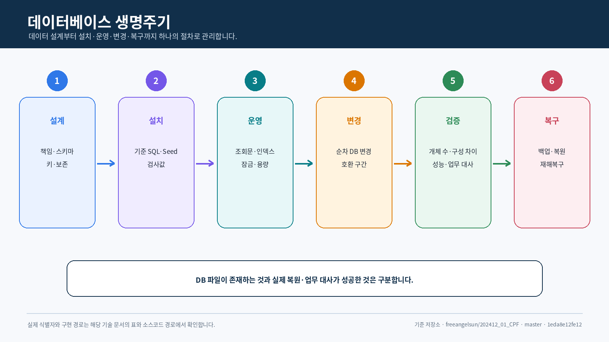
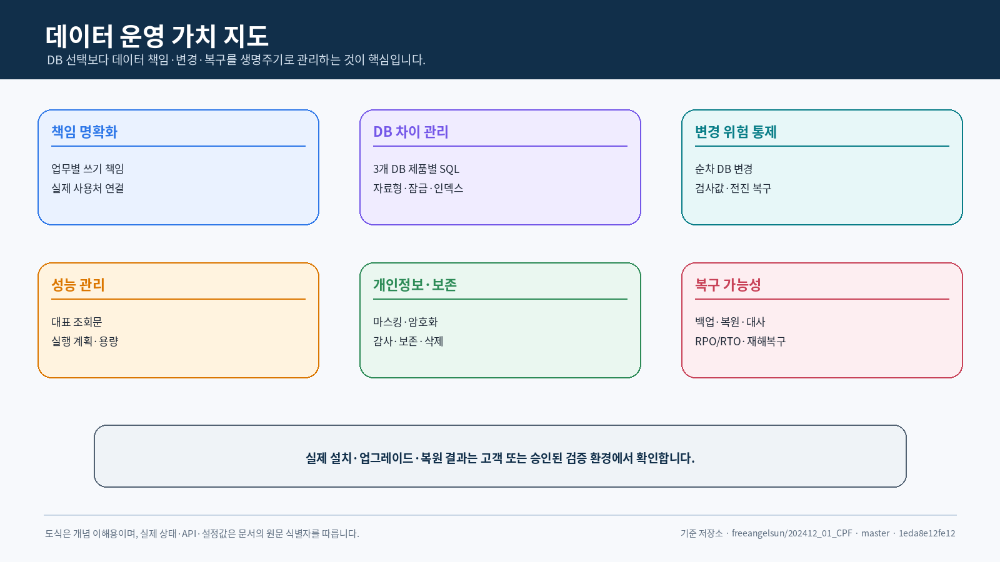
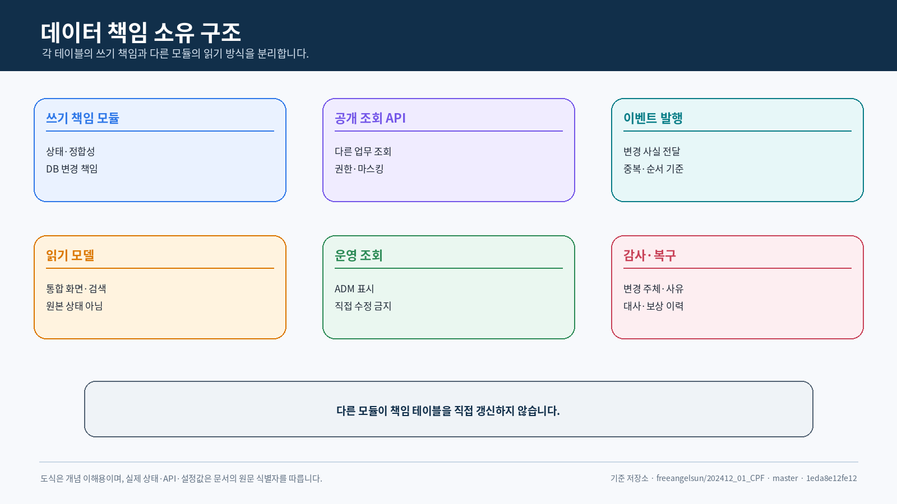
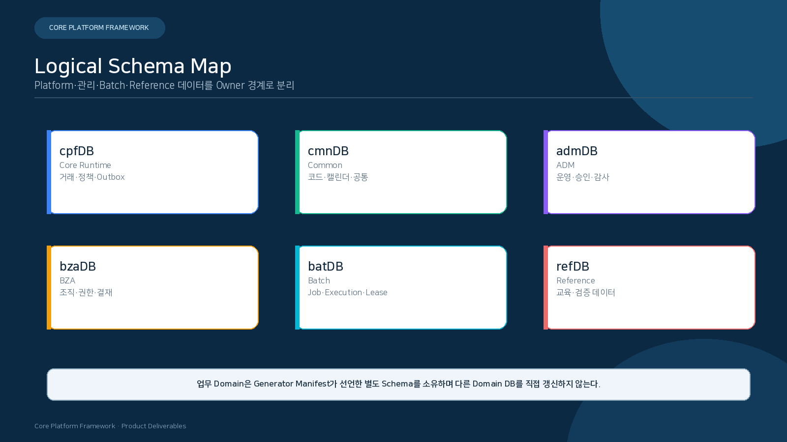
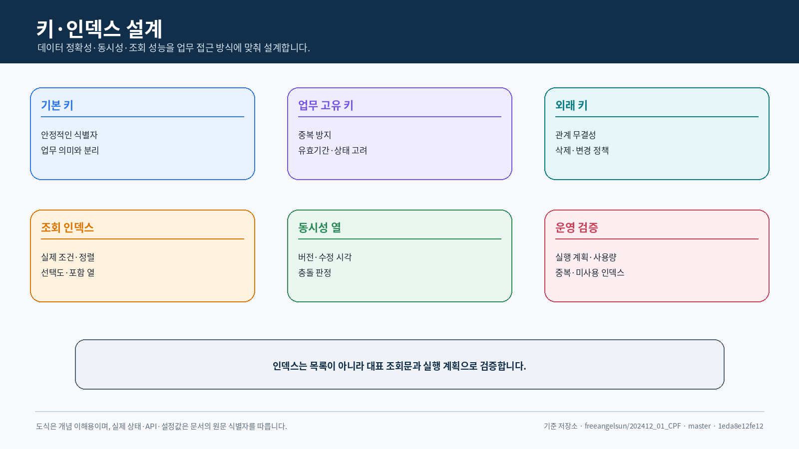
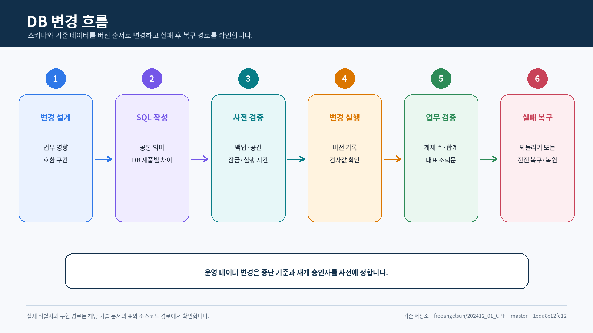
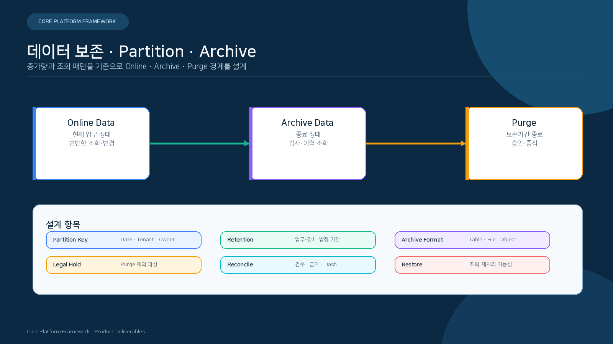

<div align="center">

# 코어 플랫폼 프레임워크(Core Platform Framework)
## 데이터베이스표준서

**고객 데이터의 소유권·변경·보존·복구 책임을 설계부터 운영까지 연결하고 3개 DB 제품 차이를 관리합니다.**

`스키마 · SQL · DB 변경 · 보존 · 복구`

</div>

<p align="center">
  
</p>

---
## 문서 안내

| 항목 | 내용 |
|---|---|
| 목적 | 스키마·테이블·열·키·인덱스·SQL·DB 변경·보존·복구 표준 정의 |
| 지원 DB 제품 | MariaDB, PostgreSQL, Oracle |
| 주 독자 | 고객 데이터 아키텍트·DBA·보안·운영 책임자, 프레임워크·업무 개발자, 설치 담당자 |
| 정본 원칙 | 논리 공통 기준 → DB 제품별 패키지 → DB 변경 → 실행 환경 조회문 → 검증 증거 |
| 이번 검증 | 문서·소스코드 구조 정적 대조, DB 실행 환경 미실행 |


## 고객 관점의 데이터 운영 요약

### 왜 데이터베이스 표준이 필요한가

업무 시스템에서 데이터는 회사가 장기간 보존하고 설명해야 하는 자산입니다. 프로그램을 새 버전으로
바꾸더라도 기존 계약·결제·정산·감사 데이터는 의미가 달라지거나 사라지면 안 됩니다.

CPF의 데이터베이스 표준은 테이블 이름을 맞추는 규칙에 그치지 않습니다. 다음 질문에 답하기 위한
생명주기입니다.

- 이 데이터는 어떤 업무가 최종 책임지는가
- 신규 환경에 같은 구조와 기준 데이터를 설치할 수 있는가
- 버전 업그레이드 때 기존 데이터를 어떻게 바꾸는가
- 많은 데이터와 동시 요청에서도 정확성과 성능을 유지하는가
- 개인정보를 누가 어떤 권한으로 볼 수 있는가
- 장애·오작업·재해 후 백업에서 복원하고 업무 결과를 확정할 수 있는가

<p align="center">
  
</p>

### 데이터가 만들어지고 운영되는 과정

1. 업무 설계에서 데이터의 의미와 최종 책임 업무를 정합니다.
2. 논리 구조를 MariaDB·PostgreSQL·Oracle용 SQL로 변환합니다.
3. 신규 설치 시 테이블·인덱스·기준 데이터와 버전을 확인합니다.
4. 애플리케이션이 정해진 조회문과 트랜잭션으로 데이터를 읽고 변경합니다.
5. 버전 업그레이드는 순서가 있는 DB 변경으로 수행합니다.
6. 성능·잠금·보존·개인정보·감사 상태를 운영 중 확인합니다.
7. 장애나 재해가 발생하면 백업을 복원하고 업무 기록과 대사합니다.
8. 실제 데이터가 정상임을 확인한 뒤 서비스를 재개합니다.

### 고객 관심사별 기준

| 고객 관심사 | CPF의 접근 | 고객이 결정·검증할 내용 |
|---|---|---|
| 데이터 책임 | 스키마·테이블의 쓰기 책임 주체와 실제 사용처 연결 | 다른 업무의 직접 조회와 예외 접근 허용 범위 |
| DB 선택 | 공통 데이터 의미와 DB 제품별 SQL 차이 분리 | 고객 표준 DB에서 자료형·잠금·시퀀스·인덱스 검증 |
| 신규 설치 | Baseline·기준 데이터·검사값·개체 개수 확인 | 동일 버전을 반복 설치할 수 있는지 |
| 업그레이드 | 순차 DB 변경·호환 구간·Backfill·구성 차이 관리 | 운영 데이터와 혼합 버전 구간의 영향 |
| 실패 복구 | 되돌리기 또는 전진 복구·복원·대사 | DDL·데이터 DB 변경 실패 시 중단과 재개 기준 |
| 성능 | 대표 조회문·인덱스·잠금·분할·Capacity | 실제 데이터 분포와 업무 부하의 실행 계획 |
| 개인정보 | 분류·마스킹·암호화·감사·보존 | 법규와 회사 정책을 테이블·조회문·내보내기에 반영 |
| DR | 백업·복원·RPO/RTO·Failover·Failback | 고객 인프라에서 복구와 업무 대사 시험 |

### 3개 DB 제품 지원의 의미

CPF가 MariaDB·PostgreSQL·Oracle을 지원한다는 것은 세 DB의 문법과 동작이 모두 같다는 의미가
아닙니다.

- 업무 데이터의 논리적 의미와 책임은 공통으로 관리합니다.
- 자료형·시퀀스·잠금·인덱스·DDL 차이는 DB 제품별 패키지로 나눕니다.
- 신규 설치·업그레이드·되돌리기 또는 전진 복구 절차를 DB 제품별로 제공합니다.
- 고객이 선택한 DB에서 실제 설치·성능·백업·복원을 실행해야 검증 상태가 됩니다.

### 고객이 도입 전에 정할 사항

1. 사용할 DB 제품과 버전
2. 업무별 스키마와 데이터 책임 주체
3. 신규 설치와 기존 DB 업그레이드 경로
4. 대용량 DB 변경 허용 시간과 중단 기준
5. 개인정보 분류·마스킹·암호화·보존 기간
6. 백업 주기와 RPO/RTO
7. 복원 후 업무 대사와 서비스 재개 승인자

뒤의 장은 이름 규칙, 자료형, 테이블, 키, 인덱스, SQL, 트랜잭션, DB 변경, 백업·복원과 DB 제품별
검증 기준을 실제 기술 수준으로 설명합니다.

## 1. 데이터 생명주기

```text
논리 모델·책임 소유
   → 공통 기준 메타데이터
   → DB 제품별 SQL 패키지
   → 신규 설치
   → 업그레이드
   → 실행 조회문·트랜잭션
   → 구성 차이·성능·보존
   → 백업·복원
   → 되돌리기 또는 전진 복구
   → 대사
```

각 단계는 버전, 검사값, 책임 주체, 실행 결과를 연결합니다.

## 2. 지원 DB 제품과 스키마

| DB 제품 | 상태 | 이번 실행 |
|---|---|---|
| MariaDB | 공식 지원 대상 | 미검증 |
| PostgreSQL | 공식 지원 대상 | 미검증 |
| Oracle | 공식 지원 대상 | 미검증 |

권장 논리 스키마:

| 스키마 | 책임 주체 |
|---|---|
| `cpfDB` | `cpf-core` 기술 공통 |
| `cmnDB` | `cpf-common` 업무 공통 |
| `admDB` | `cpf-admin` |
| `bzaDB` | `cpf-biz-admin` |
| `batDB` | 배치 Control/메타데이터 |
| `refDB` | `cpf-reference` |
| 업무 영역 스키마 | 생성기 목록 파일이 선언한 업무 책임 주체 |
<p align="center">
  
</p>
## 3. 데이터 책임 소유

### 필수

- 테이블 쓰기 책임 주체는 하나입니다.
- DB 변경 책임 주체와 실행 환경 조회문 실제 사용처를 연결합니다.
- 업무 영역 간 직접 테이블 접근을 금지합니다.
- ADM/BZA/게이트웨이는 책임 주체 조회문·명령을 사용합니다.
- 공통 코드/달력/메시지는 `cpf-common` 경계를 따릅니다.
- 배치는 대상 업무 상태를 책임 주체 계약으로 변경하고, 배치 메타데이터와 업무 원장을 구분합니다.

### 3.1 스타터 제품군의 데이터 경계

`cpf-starters/` 컨테이너와 Profile·Aggregate·BOM은 데이터 소유자가 아닙니다. DB 자원은 실제
Leaf 스타터 또는 명시된 제품·업무·DB 도구 책임 주체가 소유합니다.

#### 현재 스타터별 DB 사용 판단

| 스타터 | 현재 DB 사용 | 책임·주의 |
|---|---|---|
| 보안 | Spring Session JDBC와 `CPF_BFF_CREDENTIAL_VAULT` 사용 | ADM/BZA Session·Vault 설치, 키·보존·세션 종료 정리와 3개 DB 제품 검증 필요 |
| Kafka | 스타터 자체 업무 테이블 없음 | Outbox·Inbox·DLQ·처리 시도 원장은 실제 업무·연계 책임 주체가 소유 |
| 캐시 | LOCAL·Caffeine은 DB 없음; REDIS 사용 가능; JDBC 무효화 저장소는 `JdbcTemplate` 조건 | Cache 데이터와 무효화 원장 책임을 분리하고 공통 설치·선택 설치 정책 명시 |
| 관측 | 기본 업무 테이블 없음 | 추적·지표는 외부 수집기 책임이며 업무 DB에 고카디널리티 데이터를 적재하지 않음 |
| 복원력 | 기본 업무 테이블 없음 | 처리 시도 원장이 필요하면 Gateway·외부 연계·업무 Owner가 소유 |
| 기능 플래그 | 기본 업무 테이블 없음 | Provider 저장소·변경 감사와 업무 권한 데이터를 혼동하지 않음 |
| 비밀값 | 기본 업무 테이블 없음 | 비밀값 원문을 업무 DB에 저장하지 않고 Provider 참조·버전·교체 감사만 관리 |

#### 캐시 구조의 현재 데이터 위험

현재 캐시 스타터는 `cpf-common`의 Cache 자동 설정을 가져와 다음을 한 경계에서 활성화합니다.

- LOCAL 기본 Provider
- Redis 연결과 `CpfSecretProvider`
- Caffeine Provider
- 분산 잠금·Cache-aside
- JDBC 무효화 저장소
- Redis 빠른 무효화 신호

따라서 `cache-caffeine`, `cache-redis`, 공통 무효화 계약의 분리 여부를 검토하고, 각 DB 자원의
단일 책임 주체·설치 조건·되돌리기·보존·복원 시험을 정의해야 합니다.

#### Profile·Aggregate의 데이터 기준

- Profile은 해석된 Leaf 스타터의 DB 자원을 합산해 설치 목록을 만듭니다.
- Aggregate는 DB 변경 파일·테이블·조회문을 직접 소유하지 않습니다.
- 복수 Profile은 같은 Leaf·DB 자원을 한 번만 적용합니다.
- 조건부 Leaf는 실제 Provider·저장 방식이 선택된 경우에만 DB 설치 대상에 포함합니다.
- Profile 제거는 실제 남은 Consumer와 보존 정책을 확인한 뒤 데이터 유지·보관·삭제를 결정합니다.
- MariaDB·PostgreSQL·Oracle의 설치·업그레이드·되돌리기·복원 범위를 동일 규칙으로 검증합니다.

#### 경량 코어 전환 시 DB 규칙

- MyBatis·JDBC 자동 설정을 Core에서 분리할 때 Mapper·조회문·DB 변경·시험 책임도 함께 이동합니다.
- Security·Cache·Idempotency·Outbox/Inbox JDBC 연결은 기술 계약과 업무 원장을 구분합니다.
- 이전 Core 자동 설정과 새 스타터 자동 설정이 같은 테이블·Mapper를 동시에 소유하지 않게 합니다.
- 스타터 미선택 환경에 해당 DB 자원이 설치되지 않는지, 공통 설치가 필요하면 이유를 명시합니다.
- 스타터 제거 시 데이터 보존·Archive·삭제·Rollback 책임과 안전한 적용 순서를 기록합니다.

### 읽기 모델

업무 영역 간 조회가 필요하면 다음 중 하나를 선택합니다.

1. 책임 주체 조회문 API
2. 버전이 있는 이벤트로 생성한 조회 모델
3. 승인된 보고·복제본 경계
4. 업무 시점 사본

직접 조인이 필요한 예외는 책임 주체, 데이터 신선도, 권한, 장애 영향, 제거 조건을 ADR로 남깁니다.
<p align="center">
  
</p>
## 4. 공통 데이터 기준과 DB 제품별 패키지

| 계층 | 책임 |
|---|---|
| 공통 기준 메타데이터 | 테이블·열·자료형 의미, 키, 인덱스, 제약조건, 책임 주체 |
| 생성 틀 | DB 제품 중립 생성 규칙 |
| DB 제품별 패키지 | MariaDB/PostgreSQL/Oracle 문법·자료형·시퀀스·잠금 차이 |
| DB 변경 | 설치·업그레이드 순서와 검사값 |
| 되돌리기·복구 | 하향 스크립트 또는 복원·전진 복구 |
| 조회문 자원 | 실행 환경 SQL, 매개변수, 결과 연결표 |
| 검증 | 구성 차이, 개체 개수, 검사값, 기본 동작 조회문 |

DB 제품 SQL을 독립 정본으로 수동 복제하지 않습니다. 공통 기준 변경이 DB 제품별 패키지와 실행 환경 조회문에
전파되는지 수용 기준으로 확인합니다.

## 5. 이름 규칙

| 대상 | 규칙 |
|---|---|
| 스키마 | `<system>DB` 또는 생성기 목록 파일 값 |
| 테이블 | 책임 주체 접두어 + 업무 명사, 소문자 밑줄 표기 |
| 열 | 의미 중심 소문자 밑줄 표기 |
| PK | `<entity>_id` 또는 명시된 복합 키 |
| FK | 참조 대상 ID 의미를 유지 |
| 고유 | 업무 중복 방지 목적을 이름에 반영 |
| 인덱스 | `ix_<table>_<purpose>` |
| 제약조건 | `pk_`, `fk_`, `uk_`, `ck_` 접두어 |
| 시퀀스 | `seq_<entity>` |
| DB 변경 | 버전·설명·DB 제품 경로 규칙 |

예약어·대소문자 의존 식별자를 피합니다. 식별자 길이는 3개 DB 제품 제한을 고려합니다.

## 6. 데이터 자료형

| 의미 | 논리 자료형 | 고려 사항 |
|---|---|---|
| ID | 문자열·숫자 | 생성 방식·정렬·분산 충돌 |
| 금액 | Decimal | 정밀도·소수 자릿수 고정, 부동소수점 금지 |
| 일자 | 날짜 | 시간대 없음 |
| 시각 | 시각 | 시간대/UTC 저장·정밀도 |
| 상태 | 문자열/코드 | 버전이 있는 목록·검사 제약조건 |
| 논리값 | 논리값/Number | DB 제품 연결표와 널 의미 |
| 본문 | Text·CLOB | 최대 크기·검색·마스킹 |
| Binary | Blob·개체 저장소 참조 | DB 저장 여부·스트리밍 |
| JSON | JSON·CLOB | 조회문·인덱스·스키마 버전 |
| 해시 | 고정·가변 문자열 | 알고리즘·인코딩·길이 |

문자 길이는 문자 수와 바이트 수를 구분합니다. 외부 전문·파일의 바이트 길이를 DB 열 길이와
동일한 의미로 가정하지 않습니다.

## 7. 테이블과 열 설계

각 테이블은 다음 정보를 가집니다.

- 책임 주체 모듈/스키마
- 업무 목적과 상태 생명주기
- 기본 키와 업무 고유 키
- 생성/수정 Actor·시간
- 낙관적 잠금 버전
- transactionId/operationId 또는 연결 키
- Soft 삭제 사용 여부와 조회 조건
- PII/비밀값/마스킹 등급
- 보존·압축 파일·삭제 기준
- 대표 조회문과 인덱스
- DB 변경·되돌리기 영향

상태 테이블과 History/감사 테이블의 역할을 분리합니다.
<p align="center">
  
</p>
## 8. 키·제약조건·인덱스

### 8.1 키

- PK는 변경되지 않는 식별자를 사용합니다.
- 업무 중복 방지는 DB 고유 제약조건과 애플리케이션 멱등성을 함께 검토합니다.
- FK는 책임 소유와 삭제 정책을 확인합니다.
- 스키마 간 외래키(FK)는 배포·복구 결합도를 고려해 선택합니다.
- 다중 인스턴스 시퀀스/ID 생성 충돌을 시험합니다.

### 8.2 인덱스

| 검토 | 질문 |
|---|---|
| Predicate | WHERE 조건의 선택도와 순서가 적절한가? |
| 조인 | 조인 키 자료형·Collation·인덱스가 일치하는가? |
| Sort | ORDER BY와 페이지 조회이 인덱스를 활용하는가? |
| Covering | 과도한 중복 없이 주요 조회를 지원하는가? |
| 쓰기 Cost | Insert/Update 비용과 잠금 범위가 허용되는가? |
| 분할 | 분할 키와 로컬/Global 인덱스 의미가 맞는가? |
| DB 제품 | 3개 DB 제품 실행 계획 차이를 확인했는가? |

실행 계획·데이터 분포·대표 건수 없이 인덱스를 추가하지 않습니다.

## 9. 트랜잭션·잠금·동시성

| 상황 | 설계 기준 |
|---|---|
| 단일 상태 변경 | 애플리케이션 트랜잭션 + expectedVersion |
| 다중 행 변경 | 순서 고정, 잠금 범위 최소화 |
| 중복 요청 | 고유 키 + 멱등성 이력 원장 |
| 일정 실행기 Claim | Lease Expiry + Fencing Epoch |
| 대기열 소비 | Inbox 상태와 처리 트랜잭션 |
| 대량 처리 | 청크 커밋 + 저장 지점 |
| 교착상태 | 루트 Cause 분석, 제한 재시도 |
| 잠금 시간초과 | 실패 단계·Retryability·운영 안내 |
| 응답 유실 | operationId로 커밋 결과 조회 |

격리 수준 Level은 업무 불변식과 Phantom/Non-repeatable 조회 영향을 기준으로 선택합니다.

## 10. SQL과 조회문 자원 표준

### 필수 메타데이터

| 항목 | 내용 |
|---|---|
| 조회문 ID | 안정된 식별자 |
| 책임 주체 | 실행·변경 책임 모듈 |
| 실제 사용처 | 저장소·서비스·배치·ADM |
| DB 제품 | 공통 또는 DB 제품별 |
| 매개변수 | 이름·자료형·순서·널 |
| 결과 | 열·Alias·연결표 |
| 트랜잭션 | 조회-only/쓰기·격리 수준·시간초과 |
| 인덱스 | 기대 인덱스·정렬 |
| 페이지 조회 | Offset/Keyset과 정렬 안정성 |
| 오류 | No 행, Duplicate, 잠금, 시간초과 |
| 시험 | Fixture·Edge·Large 데이터 |

### 금지

- 문자열 연결 동적 SQL
- 사용자 입력 식별자 직접 삽입
- 제어기/서비스의 인라인 SQL
- 책임 주체가 불명확한 공용 조회문
- `SELECT *`
- 정렬 키 없는 페이지 조회
- DB 제품 차이를 실행 환경 조건문으로 산재
## 11. DB 변경 생명주기
<p align="center">
  
</p>
### 11.1 신규 설치

1. 대상 DB 제품·스키마·계정·Tablespace/Charset을 확인합니다.
2. 공통 기준과 DB 제품별 패키지 버전·검사값을 확인합니다.
3. 빈 스키마에 DB 변경을 적용합니다.
4. 개체 개수, 제약조건, 인덱스, 기준 데이터를 검증합니다.
5. 대표 조회/쓰기 기본 동작 시험를 실행합니다.
6. 설치 목록 파일와 검증 증거를 저장합니다.

### 11.2 업그레이드

1. 현재 버전과 구성 차이를 검사합니다.
2. 백업과 복원 시험 결과를 확인합니다.
3. 혼합 버전 애플리케이션의 호환성을 확인합니다.
4. DB 변경 Preview와 예상 잠금/시간을 검토합니다.
5. 승인 후 적용합니다.
6. 스키마 버전·검사값·기본 동작·업무 대사를 확인합니다.

### 11.3 실패 처리

| 실패 시점 | 처리 |
|---|---|
| DDL 전 | 원인 수정 후 재실행 |
| Transactional DDL 중 | DB 제품 되돌리기 결과 확인 |
| 비 Transactional DDL 중 | 적용 개체 식별, 복원 또는 Forward Fix |
| 데이터 DB 변경 중 | 처리 범위·저장 지점·중복 방지 |
| 애플리케이션 배포 후 불일치 | 처리량 차단, 혼합 버전 판단, 되돌리기/전진 복구 |

## 12. 되돌리기와 전진 복구

되돌리기은 단순 하향 스크립트 실행을 뜻하지 않습니다.

| 방식 | 선택 조건 |
|---|---|
| 트랜잭션 되돌리기 | 같은 트랜잭션 안에서 되돌릴 수 있음 |
| 하향 DB 변경 | 데이터 손실 없이 역변환 가능 |
| 복원 | DDL/데이터 손실 위험, 백업 시점 복구 |
| Forward Fix | 이미 사용된 스키마를 역변환하기 위험 |
| Dual 조회/쓰기 종료 | 호환 전환 기간의 단계적 제거 |
| 대사 | 애플리케이션·DB·외부 원장 상태 재확정 |

복구 후 스키마 버전뿐 아니라 업무 건수·금액·상태·검사값을 대사합니다.

## 13. 분할·보관·보존
<p align="center">
  
</p>
| 단계 | 데이터 | 통제 |
|---|---|---|
| Hot | 온라인 조회·변경 | 인덱스·용량·Latency |
| Warm | 제한 조회·배치 | 분할 Pruning·권한 |
| 압축 파일 | 장기 보존 | 불변성·암호화·검색 절차 |
| 삭제 | 보존기간 종료 | 승인·법적 보류·감사 |

- 분할 키는 업무일·생성일·Tenant 등 실제 조회문과 보존 기준을 함께 고려합니다.
- 분할 추가/교체/삭제는 승인·Preview·건수 대사를 거칩니다.
- Legal 보류 대상은 일반 보존 Job에서 제외합니다.
- 압축 파일 후 복원·조회 절차를 시험합니다.

## 14. 개인정보 · 보안 · 감사

- PII 열을 분류하고 마스킹·암호화·Access 범위를 기록합니다.
- 비밀값/인증 정보은 일반 업무 테이블에 저장하지 않습니다.
- 내보내기·Download에는 권한, 사유, 승인, Watermark/감사를 적용합니다.
- 감사는 Actor, 역할, 권한, 사유, Target, Before/After, Time, 결과를 포함합니다.
- 조회문 로그·Slow 로그·검증 증거에 Binding 원문이 노출되지 않게 합니다.
- 암호화 키 Rotation과 재암호화 범위를 계획합니다.

## 15. 백업·복원·재해복구

| 항목 | 필수 내용 |
|---|---|
| 백업 | Full/Incremental/압축 파일 로그, 주기, 보존, 암호화 |
| 검증 | 백업 파일 해시, 목록, 복원 시험 |
| 복원 | 대상 시점, 순서, 계정·권한, 애플리케이션 버전 |
| RPO/RTO | 측정 기준과 실제 결과 |
| Failover | 기본 차단, Replica 승격, 연결 전환 |
| Failback | 역복제, 차이 대사, 처리량 복귀 |
| 대사 | 업무 상태·건수·금액·Outbox/Inbox·배치 메타데이터 |
| 감사 | 실행자·승인·시작/종료·결과 |

이번 산출물 생성에서는 DB/DR 실행 환경을 실행하지 않았습니다.

## 16. 구성 차이·검사값·검증 증거

구성 차이 검사는 다음을 비교합니다.

- 공통 기준 버전과 DB 제품별 패키지 버전
- DB 변경 History와 파일 검사값
- 실제 테이블/열/자료형/널/기본값
- PK·FK·UK·검사 제약조건
- 인덱스 정의
- 시퀀스/신원
- 기준 데이터/코드 버전
- 실행 환경 조회문가 기대하는 열
- 애플리케이션 배포 산출물 소스코드 SHA

검증 증거에는 DB 제품/버전, 스키마, 명령, 시작·종료 시각, 종료 코드, 보고서 해시를 포함합니다.

## 17. 테이블 목록 최소 항목

| 필드 | 설명 |
|---|---|
| 스키마.테이블 | 물리 이름 |
| 책임 주체 모듈 | 쓰기 책임 |
| Purpose | 업무·기술 목적 |
| 상태/생명주기 | 주요 상태 |
| PK/UK | 식별·중복 방지 |
| 키 Columns | 자료형·길이·널·기본값 |
| PII 클래스 | 마스킹·암호화 |
| Main Queries | 실제 사용처·조회문 ID |
| 인덱스 | 목적·열 순서 |
| DB 변경 | 생성·변경 버전 |
| 보존 | Hot/Warm/압축 파일/삭제 |
| 복구 | 백업·복원·대사 |
| 검증 증거 | DB 제품별 검증 결과 |

## 18. DB 제품 차이 관리

| 영역 | MariaDB | PostgreSQL | Oracle | 표준 판단 |
|---|---|---|---|---|
| 신원/시퀀스 | Auto Increment/시퀀스 | 신원/시퀀스 | 시퀀스/신원 | ID 계약을 논리화 |
| 논리값 | 논리값/TinyInt 맵 | 논리값 | Number/Char 맵 | API 의미 일치 |
| 시각 | 정밀도·시간대 | 정밀도·시간대 | 시각 계열 | 저장 시간대 규칙 |
| Upsert | DB 제품 문법 | `ON CONFLICT` | `MERGE` | 조회문 패키지 분리 |
| 페이지 조회 | Limit/Offset | Limit/Offset | Fetch/Offset | 안정 정렬 |
| 잠금 | InnoDB 동작 | MVCC/잠금 | MVCC/잠금 | 시나리오 시험 |
| DDL 트랜잭션 | 제한 | 상대적으로 넓음 | Implicit 커밋 고려 | 복구 방식 분리 |
| JSON | JSON | JSONB/JSON | JSON·CLOB | 조회문·인덱스 필요성 판단 |

문법을 억지로 동일하게 만들기보다 업무 의미와 결과를 동일하게 유지합니다.

## 19. 검증 시나리오

1. 빈 스키마 신규 설치
2. 직전 지원 버전에서 업그레이드
3. 업그레이드 중 실패와 복구
4. 되돌리기 또는 전진 복구
5. DB 변경 재적용·검사값 변경 거부
6. 구성 차이가 있는 스키마 거부
7. 동시 DB 변경 잠금
8. 대표 CRUD·페이지 조회·잠금·교착상태
9. 대량 데이터 DB 변경 저장 지점
10. 백업·복원과 업무 대사
11. 3개 DB 제품 개체·조회문 의미 비교
12. 비밀값·PII의 로그·검증 증거 검사

## 20. 소스코드 기준점과 현재 상태

| 항목 | 정본 | 이번 상태 |
|---|---|---|
| DB 제품 지원 | 최상위 요구사항·DB 도구 | 정적 대조 |
| 모듈/스키마 책임 소유 | 아키텍처·모듈 소스코드 | 문서 정리 |
| DB 변경 | `cpf-tools/db` 및 모듈 자원 | 실행 환경 미검증 |
| 조회문 | 저장소/Mapper/조회문 자원 | 전수 실행 미검증 |
| 백업·복원·DR | 스크립트·운영 환경 | 미검증 |
| 구성 차이·검증 증거 | 수용 기준·검증표·실행 환경 보고서 | 미검증 |

## 21. 현재 DB 생명주기 소스코드 연결표

| 영역 | 대표 소스코드·스크립트 | 현재 상태 |
|---|---|---|
| 공통 기준 | `cpf-tools/db/canonical/**` | 소스코드 경로 확인, 전수 내용 미검증 |
| MariaDB 패키지 | `cpf-tools/db/vendor/mariadb/**` | 소스코드 경로 확인, DB 실행 환경 미검증 |
| PostgreSQL 패키지 | `cpf-tools/db/vendor/postgresql/**` | 소스코드 경로 확인, DB 실행 환경 미검증 |
| Oracle 패키지 | `cpf-tools/db/vendor/oracle/**` | 소스코드 경로 확인, DB 실행 환경 미검증 |
| 생명주기 정적 수용 기준 | `cpf-tools/scripts/verify-cpf-db-lifecycle-contract.py` | 스크립트 존재 근거, 이번 실행 미검증 |
| 공통 기준 검사 | `cpf-tools/scripts/check-canonical-db-lifecycle-contract.ps1` | 스크립트 존재 근거, 이번 실행 미검증 |
| Representative 실제 사용처 | `EduDev14Handler`, `EduOps04Handler` | 참조 소스코드, DB 성공 근거 아님 |
| Representative 시험 | `EduDev14IntegrationTest`, `EduOps04IntegrationTest` | 시험 소스코드, 이번 실행 미검증 |

대표 명령:

```powershell
python .\cpf-tools\scripts\verify-cpf-db-lifecycle-contract.py --root . --release
pwsh -NoProfile -File .\cpf-tools\scripts\check-canonical-db-lifecycle-contract.ps1
```

## 22. 현재 테이블·조회문 목록 공백

현재 문서는 테이블 목록 작성 규격과 DB 생명주기 소스코드 위치를 제공하지만, Git 전체 SQL을 로컬에서
전수 추출하지 못했으므로 현재 제품의 모든 테이블·열·인덱스·조회문 자원 행을 포함하지 않습니다.
따라서 데이터베이스표준서는 다음 범위에서 **부분 구현**입니다.

| 누락 목록 | 필요한 추출 |
|---|---|
| 전체 테이블 | DB 제품별 `CREATE TABLE`, 공통 기준 ID, 책임 주체 모듈 |
| 전체 열 | 자료형·길이·널·기본값·PII 클래스 |
| 전체 키/제약조건 | PK·UK·FK·검사와 업무 불변식 |
| 전체 인덱스 | 열 순서·대표 조회문·DB 제품 실행 계획 |
| 전체 실행 환경 조회문 | 조회문 자원·실제 사용처·매개변수·결과 연결표 |
| 전체 DB 변경 | 버전·검사값·Install/업그레이드/되돌리기 연결 |
| 전체 기준 데이터 | 코드/권한/메뉴/기본값 데이터 버전 |

### 22.1 전수 목록 생성 판정 조건

1. 정확한 SHA의 로컬 Working Tree에서 SQL·DB 변경·Mapper·저장소를 전수 열거합니다.
2. 공통 기준과 3개 DB 제품별 패키지의 개체 ID를 양방향 매핑합니다.
3. 실행 환경 조회문의 실제 사용처 클래스와 시험를 연결합니다.
4. 테이블·열·인덱스 개수를 DB 제품별로 비교합니다.
5. MariaDB·PostgreSQL·Oracle에서 설치·업그레이드·되돌리기/전진 복구를 실행합니다.
6. 생성한 목록과 검증 증거에 정확한 SHA와 해시를 기록합니다.

전수 목록이 생성되기 전에는 “전체 설정값·API·테이블·SQL 정리 완료”로 표현하지 않습니다.

## 23. QA37 DB 검증 증거 최신성

EDU DB 목록과 QA37 검증표는 `1edd96c6dcc69b0b4d6e9e22a0709d910d7cfb04`을 기준으로 하며 최신 커밋 `bdfd27d948ede982697deada0f7393c4290ecd66`의
DB 실행 환경 결과가 아닙니다. `developmentStatus=완료`, `verificationStatus=미검증`을 그대로 유지하고,
3개 DB 제품 실행 후에만 검증 상태를 변경합니다.

## 구현·검증 상태 표기

| 상태 | 의미 |
|---|---|
| 완료 | 구현과 필요한 검증이 현재 기준 커밋에서 확인됨 |
| 부분 구현 | 주요 소스코드는 있으나 실제 사용처·복구·검증 중 일부가 부족함 |
| 미구현 | 요구 기능의 소스코드 또는 실제 사용처가 없음 |
| 미검증 | 소스코드는 있으나 실행 환경·DB·브라우저·장애 시험을 실행하지 않음 |
| 실패 | 실행한 검증에서 기대 결과를 충족하지 못함 |
| 재확인 필요 | 기준 커밋·환경·검증 증거가 달라 현재 상태를 확정할 수 없음 |
## 기준 저장소와 문서 근거

| 항목 | 값 |
|---|---|
| 저장소 | `freeangelsun/202412_01_CPF` |
| 브랜치 | `master` |
| 기준 커밋 | `bdfd27d948ede982697deada0f7393c4290ecd66` |
| 제품 구조 목표 | `cpf-core` 경량화, `cpf-starters/` Leaf 선택, Profile·Aggregate·BOM 계층 분리 |
| 검토일 | `2026-08-02` |
| 최상위 요구사항 정본 | `cpf-docs/governance/CPF_FINAL_TARGET_REQUIREMENTS.md` |
| 현재 Git 정본 경로 | `cpf-docs/governance/CPF_FINAL_TARGET_REQUIREMENTS.md` |
| 문서 표준 | `cpf-docs/specification/CPF_DOCUMENTATION_STANDARD.md` |
| 사실 정본 | 소스코드 · SQL · API · 설정 · 화면 · 스크립트 · 시험 |
| 플랫폼 버전 | `1.0.0-SNAPSHOT` |
| 기술 구성 상태 | 현재 구현과 목표 구조 병기 |
| 이번 검증 | 최신 Git 소스코드·빌드·자동 설정·실제 사용처·생성기·정본 정책 대조, Markdown·이미지·ZIP 구조 검사 |
| 미검증 | 7개 스타터 전체 `check`, 프로필·묶음 구현, DB 3종, 브라우저, 다중 인스턴스, 장애/DR, 동일 배포본 게시 |

> 최상위 요구사항 정본은 `cpf-docs/governance/CPF_FINAL_TARGET_REQUIREMENTS.md`에 있으며, 실제 소스코드와 실행 결과가 하위 문서보다 우선합니다.