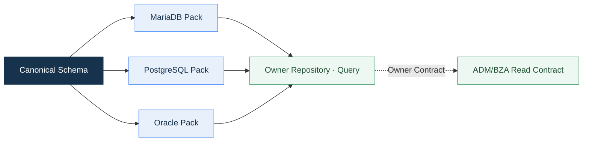

<div align="center">

# Core Platform Framework
## 데이터베이스표준서

**Schema Ownership, Table 설계, SQL, Migration과 주요 데이터 자산을 하나의 기준으로 관리**

`Data Ownership · Naming · SQL · Migration · Table Catalog`

</div>

<p align="center">
  
</p>

---

## 문서 안내

| 항목 | 내용 |
|---|---|
| 목적 | CPF의 데이터 Ownership, DB 설계 규칙, SQL·Migration 기준과 주요 Table을 정리합니다. |
| 공식 Vendor | MariaDB · PostgreSQL · Oracle |
| Canonical 정본 | `cpf-tools/db/canonical/platform-schema.json` |
| 관련 문서 | [아키텍처설계서](아키텍처설계서.md) · [기술사양서](기술사양서.md) · [기술표준서](기술표준서.md) |

<details>
<summary><strong>빠른 목차</strong></summary>

1. 데이터 Architecture 원칙
2. Vendor·Schema·정본
3. Naming
4. Data Type
5. Table·Column 정의
6. Key·Constraint
7. Index·성능
8. Transaction·Lock·동시성
9. SQL·Query
10. Migration Lifecycle
11. Partition·Archive·Retention
12. Data 보호·감사
13. Backup·Restore·DR
14. 주요 Table Catalog
15. 대표 Table 상세 정의
16. Table 정의 추적 형식
17. DB 검토 Checklist
18. Source 기준점

</details>


## 0. 데이터 기준 한눈에 보기

| 영역 | 기준 |
|---|---|
| Vendor | MariaDB · PostgreSQL · Oracle |
| Canonical | `cpf-tools/db/canonical/platform-schema.json` |
| Owner Schema | `cpfDB`, `cmnDB`, `admDB`, `bzaDB`, `batDB`, `refDB`, Domain Schema |
| Migration | Flyway Versioned Migration + Checksum |
| Runtime SQL | Owner별 Vendor Query Resource |
| 동시성 | Unique · Version · Lease · Fencing |
| Lifecycle | Install → Upgrade → Drift → Rollback → Reapply → Backup/Restore |
| 운영 연결 | Owner Query Contract · ADM/BZA Read Contract · Audit |

## 1. 데이터 Architecture 원칙

| 원칙 | 설명 |
|---|---|
| 단일 Owner | Schema·Table·Query·Migration은 하나의 Owner가 관리합니다. |
| 직접 갱신 금지 | 다른 Module은 Owner DB를 직접 갱신하지 않습니다. |
| Canonical First | 논리 Schema에서 Vendor별 DDL·Migration을 생성합니다. |
| 불변 Migration | 적용된 Version 파일은 변경하지 않고 새 Version으로 진화합니다. |
| Query 추적 | Query ID, Owner, Parameter, Result, Consumer를 연결합니다. |
| 동시성 보호 | Unique, Optimistic Lock, Lease, Fencing을 업무 의미에 맞게 사용합니다. |
| Lifecycle 관리 | Install, Upgrade, Rollback, Reapply, Drift, Backup, Restore를 연결합니다. |




<p align="center">
  
</p>

<p align="center"><sub>각 Schema의 쓰기 Owner와 운영 조회 계약을 분리합니다.</sub></p>

## 2. Vendor · Schema · 정본

### 2.1 Vendor Pack

| Vendor | Client | Migration Root | Rollback Root |
|---|---|---|---|
| MariaDB | `mariadb` | `cpf-tools/db/vendor/mariadb/migration/flyway` | `cpf-tools/db/vendor/mariadb/rollback` |
| PostgreSQL | `psql` | `cpf-tools/db/vendor/postgresql/migration/flyway/{logicalDatabase}` | `cpf-tools/db/vendor/postgresql/rollback/{logicalDatabase}` |
| Oracle | `sqlplus` | `cpf-tools/db/vendor/oracle/migration/flyway/{logicalDatabase}` | `cpf-tools/db/vendor/oracle/rollback/{logicalDatabase}` |

### 2.2 Logical Schema

| Schema | Owner | 주요 데이터 |
|---|---|---|
| `cpfDB` | `cpf-core` | 거래·기술 원장, Channel, Outbox·Inbox·DLQ, Cache Event |
| `cmnDB` | `cpf-common` | Calendar, Code, Message, 공통 Sample |
| `admDB` | `cpf-admin` | 운영자, 권한, Session, Approval, Audit, 운영 Read Model |
| `bzaDB` | `cpf-biz-admin` | 조직, 직원, 사용자, Role, Permission, 결재, 첨부, 알림 |
| `batDB` | `cpf-batch` | Job, Execution, Scheduler, Worker, Lease, Agent, Center-Cut |
| `refDB` | `cpf-reference` | 교육·참조 데이터 |
| Domain Schema | 각 업무 Domain | 업무 원장, 이력, Operation, Outbox·Inbox |

<p align="center">
  
</p>

<p align="center"><sub>Schema는 단순 분류가 아니라 쓰기 Owner, Migration 책임, 운영 계약의 경계입니다.</sub></p>

- 각 Owner는 자기 Schema의 Table·Index·Constraint·Runtime Query를 함께 관리합니다.
- ADM과 BZA는 다른 Owner의 원장을 직접 갱신하지 않고 Query·Command 계약을 사용합니다.
- 업무 Domain Schema는 Generator Manifest와 동일한 Lifecycle을 사용합니다.
- 공통 조회가 필요한 데이터는 복제 Read Model 또는 Public Query로 제공합니다.

## 3. Naming 표준

### 3.1 공통 규칙

- 영문 소문자와 `_`를 사용합니다.
- 의미 없는 축약과 Vendor 예약어를 사용하지 않습니다.
- 논리명과 물리명을 함께 기록합니다.
- Schema가 Owner를 구분하므로 Prefix는 필요한 범위에서만 사용합니다.
- 이름 변경은 Migration, Consumer, Index, View와 함께 수행합니다.

### 3.2 객체 이름

| 객체 | 규칙 | 예 |
|---|---|---|
| Table | `<영역>_<대상>` | `cpf_broker_outbox` |
| History | `<table>_history` | `bza_approval_history` |
| PK | `pk_<table>` | `pk_cmn_sample_item` |
| FK | `fk_<child>_<parent>` | `fk_bza_user_role_role` |
| UK | `uk_<table>_<purpose>` | `uk_cpf_broker_outbox_message` |
| Index | `ix_<table>_<purpose>` | `ix_cpf_broker_outbox_status` |
| Check | `ck_<table>_<purpose>` | `ck_cmn_sample_item_status` |
| View | `vw_<purpose>` | `vw_transaction_summary` |

### 3.3 공통 Column

| 의미 | 권장 이름 |
|---|---|
| 식별자 | `<entity>_id` |
| 업무 Key | 의미 있는 `<purpose>_key` |
| 상태 | `<purpose>_status` 또는 `status_code` |
| Version | `version_no` |
| 사용 여부 | `active_yn` |
| 삭제 여부 | `deleted_yn` |
| 생성 | `created_by`, `created_at` |
| 변경 | `updated_by`, `updated_at` |
| 거래 | `transaction_id`, `segment_id`, `operation_id` |
| 멱등성 | `idempotency_key`, `request_hash` |
| Lease | `lease_owner`, `lease_epoch`, `lease_until` |

## 4. Data Type 표준

| 논리 Type | MariaDB | PostgreSQL | Oracle | 기준 |
|---|---|---|---|---|
| 짧은 문자열 | `varchar(n)` | `varchar(n)` | `varchar2(n char)` | 문자 수와 Byte 기준 명시 |
| 긴 문자열 | `text` | `text` | `clob` | 검색·Index 필요 시 별도 구조 |
| 정수 | `int` / `bigint` | `integer` / `bigint` | `number(p,0)` | 예상 범위 기준 |
| Decimal | `decimal(p,s)` | `numeric(p,s)` | `number(p,s)` | Scale·반올림 규칙 명시 |
| Boolean | `char(1)` | `boolean` 또는 `char(1)` | `char(1)` | 공통 Query 계약 고려 |
| 날짜 | `date` | `date` | `date` | 시각 미포함 |
| Timestamp | `datetime(6)` | `timestamp(6)` | `timestamp(6)` | 정밀도와 Zone 기준 명시 |
| Binary | `blob` | `bytea` | `blob` | 크기·Backup 영향 검토 |
| JSON | `json` | `jsonb` | `json` 또는 `clob` | Schema·Query·Index 근거 필요 |

### 선택 기준

- 금액·수량은 최대값, Scale, 반올림을 정의합니다.
- Timestamp는 저장 Zone과 표시 Zone을 분리합니다.
- 상태값은 허용 목록과 Check 또는 Reference Catalog를 사용합니다.
- JSON을 임시 무정형 Column으로 사용하지 않습니다.
- 대용량 Binary는 Object Storage 참조 여부를 검토합니다.

## 5. Table · Column 정의 표준

### 5.1 Table 정의 필수 항목

| 항목 | 설명 |
|---|---|
| 논리명 · 물리명 | 업무 의미와 실제 이름 |
| Owner Module · Schema | 쓰기 책임과 Lifecycle |
| 목적 | 저장하는 상태와 제외 범위 |
| Primary Key | 생성 주체·형식·변경 가능성 |
| Reader · Writer | 실제 Repository·Query·API Consumer |
| 생성 Migration | Version과 Vendor 경로 |
| 상태 Lifecycle | 생성·변경·완료·보존·삭제 |
| 보안 등급 | 개인정보·Secret·Masking·Raw 권한 |
| 규모 | 초기 건수·증가량·보존 기간 |
| Index | 대표 Query와 Column 순서 |
| Backup · Restore | 복구 단위와 대사 기준 |

### 5.2 Column 정의 필수 항목

| 항목 | 설명 |
|---|---|
| 논리명 · 물리명 | 의미와 실제 Column |
| Type · 길이 · 정밀도 | Vendor별 Mapping 포함 |
| Null · Default | 업무 의미와 입력 생략 처리 |
| Key · Constraint | PK, FK, UK, Check |
| 상태 · Code | 허용값과 전이 |
| Masking · 암호화 | 저장·조회·Download 정책 |
| Writer · Reader | 생성·변경·조회 주체 |
| Index 포함 | Index명과 순서 |

## 6. Key · Constraint 표준

| 유형 | 적용 기준 |
|---|---|
| PK | 불변 식별자, Cluster·Vendor 특성 고려 |
| FK | 같은 Owner 경계의 참조 무결성에 사용 |
| UK | 업무 Key, 멱등성 Key, 중복 Seed 방지 |
| Check | 상태, Y/N, 범위, 상호 조건 검증 |
| Optimistic Version | 동시 수정이 가능한 변경 Table |
| Lease/Fencing | Multi-instance Worker·Scheduler·Publisher |

- Cross-Domain 참조는 FK 대신 Business Identifier와 Owner Contract를 사용합니다.
- Soft Delete를 사용해도 Unique 정책을 명확히 정의합니다.
- Cascade Delete는 데이터 보존·Audit 영향을 검토합니다.

## 7. Index · 성능 표준

- 대표 Query의 `WHERE → JOIN → ORDER BY` 순서를 기준으로 설계합니다.
- Equality 조건을 앞에, Range·Sort를 뒤에 배치합니다.
- Paging은 안정된 Tie-breaker PK를 포함합니다.
- 낮은 선택도의 단일 Boolean Index를 피합니다.
- 동일 Prefix의 중복 Index를 제거합니다.
- Write 빈도가 높은 원장에는 Index 개수와 갱신 비용을 함께 검토합니다.

### Index 정의 예

| Query | 권장 Index |
|---|---|
| Outbox 발행 대기 | `(outbox_status, next_attempt_at, outbox_id)` |
| 거래 Timeline | `(transaction_id, segment_id)` |
| Calendar 일자 조회 | `(business_date, calendar_id)` |
| 상태별 목록 | `(status_code, sort_order, id)` |
| Lease 만료 조회 | `(status, lease_until)` |

<p align="center">
  
</p>

<p align="center"><sub>정합성 제약과 실제 조회 경로를 하나의 Table 설계로 검토합니다.</sub></p>

| 설계 대상 | 핵심 확인 |
|---|---|
| Primary Key | 불변성, 외부 노출 여부, 생성 방식 |
| Unique Key | 업무 중복 기준, NULL 의미, 재처리 정책 |
| Version | 낙관적 잠금과 영향 행 0건 처리 |
| Status Index | 대기·실패·재처리 Queue의 정렬과 범위 |
| 검색 Index | Equality → Range → Stable Sort 순서 |
| Audit Column | 변경 주체·시간·거래 식별자 추적 |


### 7.1 성능 검토 기준

| 항목 | 기준 |
|---|---|
| 대표 데이터 | 초기·평시·Peak·보존기간 말기의 건수와 분포 |
| 실행계획 | Full Scan, Join 순서, Index Range, Sort·Temp 사용 |
| Paging | 최대 Size, Stable Sort, Deep Page 대안 |
| Write 비용 | Index 수, Hot Page, Sequence·Identity 경합 |
| Lock | Row·Gap·Table Lock, Deadlock 경로, 대기 시간 |
| 통계 | Vendor Statistics 갱신과 Plan 변화 |
| 회귀 | 주요 Query의 시간·읽은 Row·Result Count 기준 |

- Index 추가 전에는 실제 Query와 Data 분포를 확인합니다.
- Query 조건이 달라지면 Index 이름을 재사용하지 않고 목적과 Column 순서를 다시 검토합니다.
- 대량 삭제·Archive는 Online Transaction과 Lock·Redo·Undo 영향을 분리합니다.

## 8. Transaction · Lock · 동시성

- 한 Use Case의 Owner 데이터와 Audit·Outbox 중 원자성이 필요한 기록을 묶습니다.
- 외부 호출은 DB Transaction 밖에서 수행하고 Operation 상태로 연결합니다.
- 변경 API는 Version 조건을 사용합니다.
- Duplicate는 Application 사전 조회만이 아니라 UK로도 보호합니다.
- Worker·Scheduler·Publisher는 Lease와 Fencing Token을 사용합니다.
- Deadlock Retry는 횟수와 Backoff를 제한합니다.

## 9. SQL · Query 표준

| 항목 | 기준 |
|---|---|
| Query ID | Owner와 목적이 드러나는 안정된 식별자 |
| Parameter | Type, Null, 길이, 범위, Collection 상한 |
| Result | Column Alias, Null 의미, Paging·Sort 계약 |
| Resource | Vendor별 SQL Resource 또는 Canonical Query |
| Binding | Prepared Statement / MyBatis Parameter Binding |
| Dynamic Sort | Allowlist된 Column만 허용 |
| Pagination | 안정 정렬과 최대 Page Size |
| Timeout | Query·Transaction Timeout 명시 |

### 금지

- 사용자 입력 문자열을 SQL에 연결
- Java Source에 장문의 Runtime SQL 작성
- Owner가 불명확한 공유 Query
- `SELECT *`
- 무제한 List·전체 Table Scan을 기본 조회로 사용
- Vendor별 암묵 변환에 의존


<p align="center">
  
</p>

<p align="center"><sub>설치·변경·Checksum·배포·검사·복구를 Version 단위로 연결합니다.</sub></p>

## 10. Migration Lifecycle


### 규칙

- 적용된 Migration Version은 변경하지 않습니다.
- Schema 변경과 Data 변환을 분리합니다.
- Expand → Migrate → Contract 순서를 사용합니다.
- Column 삭제·Type 축소 전에 Consumer와 데이터 보존을 확인합니다.
- Checksum과 Canonical Schema Drift를 검사합니다.
- Rollback이 어려운 변경은 Forward Recovery와 Backup Checkpoint를 정의합니다.

### Lifecycle 정본

| 항목 | 값 |
|---|---|
| Contract | `cpf-tools/db/cpf-db-lifecycle-contract.json` |
| Stage | baseline-install, sequential-upgrade, runtime-query, schema-drift, reverse-rollback, forward-reapply, backup-restore |


## 11. Partition · Archive · Retention

<p align="center">
  
</p>

| 항목 | 정의 기준 |
|---|---|
| Partition 대상 | 대용량 시계열·원장·Audit 중 기간 조건이 지배적인 Table |
| Partition Key | 업무일·생성일·Tenant·Owner 중 Query·Purge와 일치하는 Column |
| Online 보존 | 업무 변경·빈번한 조회가 필요한 기간 |
| Archive 전환 | 종료 상태, 대사 완료, Legal Hold 확인 뒤 수행 |
| Archive 형식 | 별도 Table·Schema·File·Object Storage와 조회 계약 |
| Purge | 보존기간, 승인, 대상 Snapshot, 건수·Hash, Audit |
| Legal Hold | Purge 제외 Key와 해제 승인 |
| Restore | Archive 조회·재처리·Audit 요구에 맞는 복구 방식 |

### 11.1 처리 순서

1. 대상 상태·기간·Owner를 Snapshot으로 고정합니다.
2. Archive 대상 건수·금액·Hash를 산출합니다.
3. Online 부하를 제한하며 Chunk 단위로 이동합니다.
4. Archive 저장 결과와 원본을 대사합니다.
5. 승인된 대상만 Purge하고 Index·통계를 정리합니다.
6. 결과, 제외 건, 재처리 Key와 Audit를 기록합니다.

- Partition은 Vendor 기능 사용 자체가 목적이 아니라 조회·보존·Purge 경계를 단순화할 때 적용합니다.
- 개인정보 삭제와 Audit 보존이 충돌하는 경우 비식별·토큰화·Legal Hold 정책을 함께 정의합니다.

## 12. Data 보호 · 감사

- 개인정보·Secret·Credential은 분류와 Masking 규칙을 갖습니다.
- 원문 조회는 별도 권한, Reason, TTL, Audit를 적용합니다.
- Audit는 변경 전후, Actor, Subject, transactionId, Approval을 연결합니다.
- Retention, Purge, Archive, Legal Hold, 비식별을 데이터 유형별로 정의합니다.
- Backup에 포함되는 민감 데이터와 Key Metadata를 분리합니다.

## 13. Backup · Restore · DR

| 항목 | 정의 |
|---|---|
| Backup 단위 | Schema, Table Group, Config, Key Metadata |
| 복구 시점 | Full, Incremental, PITR |
| 암호화 | 저장·전송·Key 접근 정책 |
| 검증 | Row Count, Hash, Constraint, Runtime Query, 대사 |
| 보존 | 기간, 세대, Legal Hold, 폐기 |
| DR | Failover, Failback, DNS/Endpoint, 데이터 차이 대사 |

## 14. 주요 Table Catalog

### 14.1 `cpfDB`

| Table | 목적 | 핵심 Key·Index |
|---|---|---|
| `cpf_broker_outbox` | 업무 Event 발행 원장 | `message_id` UK, 상태·다음 시도·Lease·거래 Index |
| `cpf_broker_inbox` | Consumer 중복 처리 차단 | `message_id` UK, idempotency·상태 Index |
| `cpf_broker_dlq` | 반복 실패와 재처리 원장 | `message_id` UK, replay 상태·Topic Index |
| `cpf_cache_invalidation_event` | Cache 무효화 Event 원장 | `event_key` UK, Tenant·Namespace Index |
| `cpf_cache_invalidation_checkpoint` | Consumer 처리 위치 | `consumer_id` PK |
| `cpf_cache_refresh_event` | Cache Refresh Event | Cache·시각 Index |
| `cpf_cache_refresh_checkpoint` | Durable Consumer Cursor | `consumer_id` PK, Event Index |
| `cpf_channel_registry` | Channel·신뢰·인증 정책 | `channel_code` PK, 활성 상태 Index |
| `cpf_channel_execution_policy` | Channel별 실행 허용 정책 | 정책 Key PK, 실행·Channel 조건 |
| `cpf_channel_policy_version` | Channel 정책 변경 Version | 대상·Version Index |

### 14.2 `cmnDB`

| Table | 목적 | 핵심 Key·Index |
|---|---|---|
| `cmn_business_calendar_day` | 영업일·휴일·기관 Calendar | `(calendar_id, business_date)` PK, 일자·기관 Index |
| `cmn_sample_item` | CRUD·검색·Paging·동시성 기준 Sample | `sample_key` UK, 상태·분류·정렬 Index |

### 14.3 ADM Table Inventory

<details>
<summary><strong>ADM 주요 Table 펼치기</strong></summary>

| 영역 | Table |
|---|---|
| 운영자·조직 | `adm_operator`, `adm_operator_profile`, `adm_organization` |
| Role·Menu·Button | `adm_role`, `adm_operator_role`, `adm_menu`, `adm_role_menu`, `adm_button`, `adm_role_button` |
| API Permission | `adm_api_permission`, `adm_role_api_permission` |
| Session·Password·MFA | `adm_operator_session`, `adm_password_policy`, `adm_password_history`, `adm_ip_allowlist`, `adm_mfa_otp_secret` |
| Audit·Download | `adm_audit_log`, `adm_download_audit_log`, `adm_dynamic_log_level_rule` |
| Approval | `adm_approval_policy`, `adm_approval_policy_step`, `adm_approval_request`, `adm_approval_participant`, `adm_approval_history` |

</details>

### 14.4 BZA Table Inventory

<details>
<summary><strong>BZA 주요 Table 펼치기</strong></summary>

| 영역 | Table |
|---|---|
| 사용자·인증 | `bza_admin_user`, `bza_login_history`, `bza_refresh_token` |
| Menu·Role·Permission | `bza_menu`, `bza_role`, `bza_user_role`, `bza_permission` |
| 조직·인사 | `bza_organization`, `bza_position`, `bza_job_title`, `bza_employee`, `bza_employee_assignment`, `bza_organization_responsibility` |
| Audit | `bza_business_audit`, `bza_audit_chain_lock` |
| 지원 기능 | `bza_notification`, `bza_attachment`, `bza_saved_search`, `bza_download_audit`, `bza_project_setting` |
| Approval | `bza_approval_policy`, `bza_approval_policy_step`, `bza_approval_document`, `bza_approval_line`, `bza_approval_participant`, `bza_approval_delegation`, `bza_approval_history` |

</details>

### 14.5 Batch·Domain Table 관리

- Batch Table은 Job Definition, Execution, Schedule, Worker, Lease, Agent, Center-Cut, Deployment, Audit 영역으로 분류합니다.
- 업무 Domain Table은 Aggregate 원장, History, Operation, Idempotency, Outbox·Inbox를 업무 의미에 따라 구성합니다.
- 물리 Column·Constraint·Index 전체 정의는 Canonical Schema와 Vendor DDL을 정본으로 사용합니다.


## 15. 대표 Table 상세 정의

<details>
<summary><strong>cpf_broker_outbox — Event 발행 원장</strong></summary>

| Column | Type·Null | 역할 | Key·Index |
|---|---|---|---|
| `outbox_id` | BIGINT · NOT NULL | 내부 순번 | PK |
| `message_id` | VARCHAR(120) · NOT NULL | Message 불변 식별자 | UK |
| `topic` | VARCHAR(160) · NOT NULL | 발행 대상 Topic | Topic·시각 Index |
| `message_key` | VARCHAR(200) · NULL | Partition Key | - |
| `transaction_id` | CHAR(34) · NULL | 거래 연결 | 거래 Index |
| `segment_id` | VARCHAR(120) · NULL | 호출 구간 연결 | 거래 Index |
| `idempotency_key` | VARCHAR(160) · NULL | 중복 방지 Key | - |
| `payload` | BLOB 계열 · NULL | Versioned Payload | Size Policy |
| `outbox_status` | VARCHAR(30) · NOT NULL | 발행 상태 | 상태·다음 시도 Index |
| `attempt_count` | INT · NOT NULL | 발행 시도 횟수 | - |
| `next_attempt_at` | TIMESTAMP · NULL | 다음 발행 가능 시각 | Ready Index |
| `lease_until` | TIMESTAMP · NULL | Publisher 점유 만료 | Lease Index |
| `published_at` | TIMESTAMP · NULL | 발행 확정 시각 | - |

</details>

<details>
<summary><strong>cpf_broker_inbox — Consumer 중복 방지 원장</strong></summary>

| Column | Type·Null | 역할 | Key·Index |
|---|---|---|---|
| `inbox_id` | BIGINT · NOT NULL | 내부 순번 | PK |
| `message_id` | VARCHAR(120) · NOT NULL | 수신 Message 식별자 | UK |
| `idempotency_key` | VARCHAR(160) · NULL | 업무 중복 방지 Key | Index |
| `inbox_status` | VARCHAR(30) · NOT NULL | 수신·처리 상태 | 상태·수신시각 Index |
| `result_detail` | VARCHAR(1000) · NULL | 처리 결과 요약 | - |
| `received_at` | TIMESTAMP · NOT NULL | 수신 시각 | 상태 Index |
| `consumed_at` | TIMESTAMP · NULL | 처리 확정 시각 | - |

</details>

<details>
<summary><strong>cmn_business_calendar_day — 영업일·휴일 기준</strong></summary>

| Column | Type·Null | 역할 | Key·Index |
|---|---|---|---|
| `calendar_id` | VARCHAR(50) · NOT NULL | Calendar 식별자 | 복합 PK |
| `business_date` | DATE · NOT NULL | 기준 일자 | 복합 PK·일자 Index |
| `business_day_yn` | CHAR(1) · NOT NULL | 영업일 여부 | Check |
| `day_type` | VARCHAR(30) · NOT NULL | BUSINESS·HOLIDAY·SPECIAL | - |
| `institution_code` | VARCHAR(50) · NULL | 기관·시장 구분 | 기관·일자 Index |
| `reason` | VARCHAR(500) · NULL | 예외 사유 | - |
| `version_no` | BIGINT · NOT NULL | 낙관적 잠금 Version | Check |

</details>

<details>
<summary><strong>cmn_sample_item — CRUD·검색·Paging 기준 Table</strong></summary>

| Column | Type·Null | 역할 | Key·Index |
|---|---|---|---|
| `sample_item_id` | BIGINT · NOT NULL | 내부 식별자 | PK |
| `sample_key` | VARCHAR(100) · NOT NULL | 외부 노출 Key | UK |
| `item_name` | VARCHAR(200) · NOT NULL | 표시명·검색 조건 | 이름·PK Index |
| `category_code` | VARCHAR(30) · NOT NULL | 분류 | 분류·정렬 Index |
| `status_code` | VARCHAR(30) · NOT NULL | ACTIVE·INACTIVE | Check·상태 Index |
| `sort_order` | BIGINT · NOT NULL | 안정 정렬 | 복합 Index |
| `version_no` | BIGINT · NOT NULL | 낙관적 잠금 Version | Check |
| `deleted_yn` | CHAR(1) · NOT NULL | 논리 삭제 | Check |

</details>

## 16. Table 정의 추적 형식

```text
Schema / Table
→ Owner Module
→ 생성 Migration
→ Writer Repository / Command
→ Reader Query / API
→ Key · Constraint · Index
→ 상태 Lifecycle
→ Retention · Backup · Restore
```

### 정의서 작성 예

| 항목 | 예시 |
|---|---|
| 물리명 | `cpf_broker_outbox` |
| Owner | `cpf-core` Messaging Adapter |
| 목적 | 업무 Commit 후 Kafka 발행 요청과 Attempt를 보존 |
| PK | `outbox_id` |
| UK | `message_id` |
| 상태 | `PENDING` 등 Outbox 상태 Catalog |
| 주요 Index | 상태·다음 시도, Lease, transactionId·segmentId, Topic·발생 시각 |
| Writer | Outbox Repository |
| Reader | Publisher, Reconciliation, ADM Query |
| 보존 | 발행·대사·감사 정책에 따른 보존·Purge |

## 17. DB 검토 Checklist

- [ ] Table과 Query의 Owner가 명확한가?
- [ ] 실제 Reader·Writer가 정의됐는가?
- [ ] PK·UK·FK·Check가 업무 불변식을 보호하는가?
- [ ] 목록·상세·상태 조회 Index가 있는가?
- [ ] Paging Sort에 안정된 Tie-breaker가 있는가?
- [ ] Version·Idempotency·Lease가 필요한가?
- [ ] 개인정보·Secret·Masking·보존이 정의됐는가?
- [ ] Migration·Rollback·Reapply 순서가 정의됐는가?
- [ ] MariaDB·PostgreSQL·Oracle Type·Query 차이가 반영됐는가?
- [ ] Backup·Restore 후 정상 판정 기준이 있는가?

## 18. Source 기준점

| 주제 | 정본 경로 |
|---|---|
| Canonical Schema | `cpf-tools/db/canonical/platform-schema.json` |
| Lifecycle Contract | `cpf-tools/db/cpf-db-lifecycle-contract.json` |
| MariaDB | `cpf-tools/db/vendor/mariadb` |
| PostgreSQL | `cpf-tools/db/vendor/postgresql` |
| Oracle | `cpf-tools/db/vendor/oracle` |
| Runtime Query | `cpf-tools/db/vendor/<vendor>/runtime/<owner>` |
| Migration Checksum | Vendor Pack의 `checksums.sha256` |
| Query Consumer | Owner Repository·Mapper·Service·API |


---

## 문서 기준

| 항목 | 값 |
|---|---|
| Repository | `freeangelsun/202412_01_CPF` |
| Branch | `master` |
| 기준 Commit | `1edd96c6dcc69b0b4d6e9e22a0709d910d7cfb04` |
| 상위 요구사항 정본 | `cpf-docs/governance/CPF_FINAL_TARGET_REQUIREMENTS.md` |
| 문서 표준 | `cpf-docs/specification/CPF_DOCUMENTATION_STANDARD.md` |
| 사실 정본 | Source · SQL · API · Config · Frontend · Script · Test |
