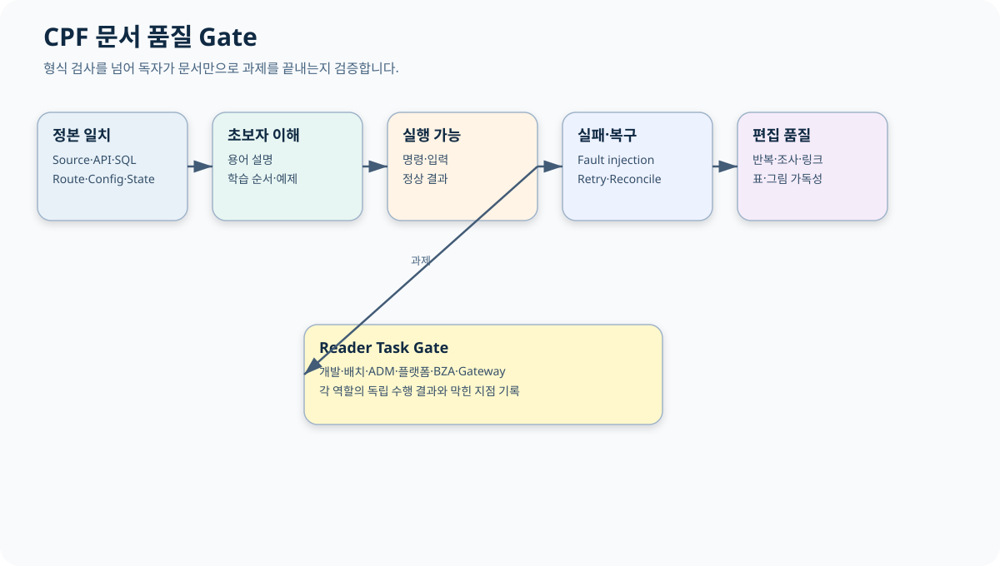

# CPF 산출물 목록

> 기준 Repository: `https://github.com/freeangelsun/202412_01_CPF`
> 기준 Branch: `master`
> 기준 Commit: `ee977cf66c251081df78ea5e9675b81c3dfafa59` (`06_07`)
> 기준일: `2026-08-06 Asia/Seoul`

| 항목 | 내용 |
|---|---|
| 주 독자 | 고객 기술책임자·문서 Owner·QA·Release Owner |
| 이 문서로 완료할 일 | 공식 문서·설계 산출물·시각 자산·Evidence와 적용·검증·Rollback 범위를 확인한다. |
| 읽는 방식 | 처음 접하는 독자는 앞에서부터 실습 순서로 읽고, 숙련자는 장별 판단표와 참조 경로를 사용한다. |
| 설명 원칙 | 제품 기능은 사용할 수 있는 상태로 설명한다. 실제 Source·SQL·API·Config·Frontend·Script·Test의 이름과 경계를 유지한다. |

## 1. 공식 사용자 문서

| 문서 | 독자 | 완료 결과 |
|---|---|---|
| `README.md` | 처음 방문한 사용자 | 역할별 시작 문서 선택 |
| `00_프레임워크안내.md` | 도입 검토자·아키텍트 | 범위·Profile·Topology·책임 결정 |
| `01_개발자매뉴얼.md` | 온라인·연계 개발자 | PAY 예제로 개발·Fault·인계 |
| `02_배치개발매뉴얼.md` | 배치 개발·운영 | Job·Restart·Reprocess·대사 |
| `03_ADM개발자매뉴얼.md` | ADM 연동 개발자 | Owner Port→화면·Browser Test |
| `04_ADM운영자매뉴얼.md` | 운영자·승인자·보안 | Route별 조회·조치·복구 |
| `05_플랫폼운영매뉴얼.md` | 인프라·DBA·DR | 설치·Config·배포·Backup·Runbook |
| `90_BZA매뉴얼.md` | 조직·권한·결재 담당 | 조직→권한→결재→업무 적용 |
| `91_Gateway매뉴얼.md` | API·보안·Gateway 운영 | Route 게시·NACK·LKG 복구 |

## 2. 설계 산출물

- `아키텍처설계서.md`
- `기술사양서.md`
- `기술표준서.md`
- `데이터베이스표준서.md`
- `산출물목록.md`

## 3. 이번 문서 개선 원칙

- 반복 분량보다 기능 고유 설명.
- 초보자 용어·학습 순서.
- 책처럼 이어지는 PAY·Batch·ADM·BZA·Gateway 예제.
- 코드·SQL·JSON·PowerShell Sample.
- 정상·오류·응답 유실·부분 적용·복구.
- 실제 Source Path·Route·Property 이름.
- 개념 박스 외에 Journey·Decision·Lifecycle 도식.

## 4. 주요 Source 반영

- `06_06`: OpenAPI WebMVC Public 계약·Property·운영 Snapshot.
- `06_07`: ADM `/integrationClosure`, Data Quality Correction Approval Snapshot, Generated Client, Route·Browser 화면.
- `cpf.adm.integration-closure` Property.
- `CpfDataQualityOperations` 승인·정정 계약.
- 현재 `routes.ts`의 Route Registry를 운영자 독자 작업으로 변환.

## 5. Evidence

| Evidence | 목적 |
|---|---|
| `CPF_ADM_ROUTE_READER_MATRIX.csv` | Route별 목적·입력·상태·복구 |
| `CPF_MANUAL_READER_TASK_MATRIX.csv` | 역할별 독립 수행 과제 |
| `CPF_DOCUMENT_REVIEW_MATRIX.csv` | 정적·편집·독자 Gate |
| `CPF_BASELINE_DELTA_MATRIX.csv` | 최신 Commit 변경과 문서 반영 |
| `CPF_DOCUMENT_FILE_MANIFEST.csv` | 파일 Size·SHA-256 |
| `CPF_INDEPENDENT_DOCUMENT_REVIEW.json` | 검수 요약·미검증 |
| `SHA256SUMS.txt` | Package 내부 Hash |

## 6. 품질 Gate

- 공식 사용자 문서 경로 9개.
- 설계 산출물 5개.
- 단일 H1·순차 H2·Fence Balance.
- 내부 링크·SVG XML.
- 금지 표현·제어문자·Placeholder.
- 장문 Exact Duplicate.
- Route Reader Matrix 연결.
- 초보자 과제·명령·정상 결과·오류·복구.
- ZIP Root 상대경로·CRC·재해제 Hash.

## 7. 적용

ZIP을 Repository Root에 해제한다. Local 변경이 있는 대상 파일은 먼저 별도 보존하고 경로별 diff를 검토한다. 전체 Working Tree를 초기화하지 않는다.

## 8. Rollback

적용 전 보존한 exact path 파일만 복원한다. `git reset --hard`, `git clean`, `git restore .`를 사용하지 않는다.
