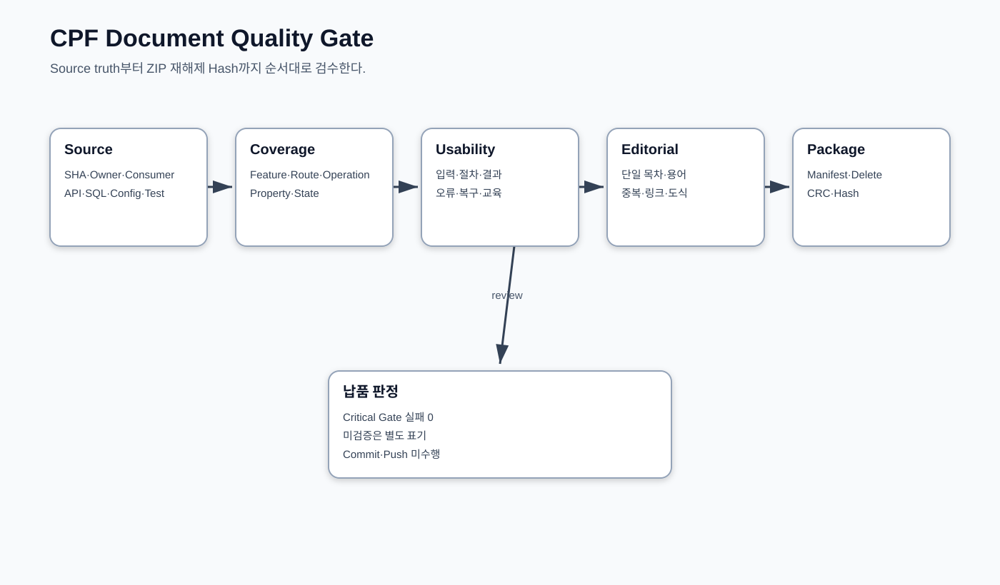

# CPF 산출물 목록

> 문서: `CPF 산출물 목록`
> 기준 Repository: `https://github.com/freeangelsun/202412_01_CPF`
> 기준 Branch: `master`
> 기준 Commit: `6976d2747481b8540b48ddb9ab8f53cfeaa4b888` (`06_02`)
> 기준일: `2026-08-06 Asia/Seoul`

| 항목 | 내용 |
|---|---|
| 주 독자 | 고객 기술책임자·문서 Owner·QA·Release Owner |
| 문서 목적 | 공식 문서·설계 산출물·Evidence·삭제·검수·개선 요청을 총괄한다. |
| 기능 서술 전제 | CPF 제품 기능은 고객이 사용할 수 있는 상태로 설명한다. 구현 진행률이나 개발 관리 상태는 이 문서의 사용 절차에 섞지 않는다. |
| 사실 우선순위 | 실제 Source·SQL·API·Config·Frontend·Script·Test → 설계·사양 → 본 매뉴얼 |
| 상태 표현 | 업무 상태와 운영 결과는 Source의 상태값을 사용한다. 문서 검토 상태는 `완료`, `부분 구현`, `미구현`, `미검증`, `실패`, `재확인 필요`만 사용한다. |

## 1. 공식 사용자 문서

| 문서 | 독자 | 완료 결과 |
|---|---|---|
| README.md | 도입 검토자 | 제품 범위와 공식 매뉴얼 선택 |
| 00_프레임워크안내.md | 기획자·아키텍트·리더 | 기능·Profile·Topology·Owner 결정 |
| 01_개발자매뉴얼.md | 온라인·연계 개발자 | 42개 기능 Recipe와 PAY 업무 개발 |
| 02_배치개발매뉴얼.md | Batch 개발·운영 | Job·Scheduler·Worker·Center-Cut·복구 |
| 03_ADM개발자매뉴얼.md | ADM 연동 개발자 | Owner Query/Command·OpenAPI·화면 연동 |
| 04_ADM운영자매뉴얼.md | 운영자·승인자·보안 | 62개 Route 조회·조치·복구 |
| 05_플랫폼운영매뉴얼.md | 인프라·DBA·배포·DR | 설치·Config·배포·관측·Backup·DR |
| 90_BZA매뉴얼.md | 조직·권한·결재 담당 | 26개 BZA Route와 업무 적용 |
| 91_Gateway매뉴얼.md | API·보안·Gateway 운영 | Route·보안·Publish·LKG·복구 |

## 2. 설계·표준 산출물

| 산출물 | 목적 |
|---|---|
| 아키텍처설계서.md | Context·Module·Data·Control Plane·Failure·Security·Deployment |
| 기술사양서.md | Public 계약·상태·API·Route·Config·Artifact Inventory |
| 기술표준서.md | 개발·Review·Test·Release 규칙 |
| 데이터베이스표준서.md | 3 Vendor Schema·Query·Migration·Backup·복구 |
| 산출물목록.md | 문서·Evidence·삭제·검수·개선 요청 총괄 |

## 3. 이번 현행화 기준

- Repository: `https://github.com/freeangelsun/202412_01_CPF`
- Branch: `master`
- Commit: `6976d2747481b8540b48ddb9ab8f53cfeaa4b888` (`06_02`)
- 기준일: `2026-08-06 Asia/Seoul`
- ADM Route: 62개
- ADM Route–Operation: 405개
- BZA Route: 26개
- BZA Route–Operation: 78개
- 기능 Recipe: 42개
- Configuration 항목: 70개

기능은 고객이 사용할 수 있는 상태로 서술했다. 이 산출물은 개발 진행률 보고서가 아니며 개발 관리 Workspace 상태를 공식 사용자 문서에 섞지 않는다.

## 4. 이전 문서 결함과 R8 조치

| 이전 결함 | R8 조치 |
|---|---|
| 문서 중간에 새 본문을 덧붙여 목차 번호 중복 | 13개 Markdown을 새 단일 목차로 재작성하고 H2 번호 단조 증가 Gate 적용 |
| ADM 348행 Matrix가 최신 Route Registry보다 오래됨 | `routes.ts` 현재 Registry에서 62 Route와 전체 expectedOperationIds 재구성 |
| 화면 Operation 입력·결과가 일반 문구 | 62개 Route별 검색 Field·Column·Detail·Button·정상 판정·오류·복구를 고유 작성 |
| Critical 화면 실제 Button 조건 부족 | Center-Cut·Cache·MFA·Runtime·Approval·Permission Source 계약 별도 작성 |
| 개발 기능별 실제 업무 결과 연결 부족 | 42개 고객 기능 Recipe와 PAY 종합 EDU 구성 |
| Configuration에 최신 Valkey/durable invalidation 누락 | Valkey 8개·Coordinator 3개 Property 추가 |
| 최신 4 Commit 기능 미반영 | Durable Cache, MFA TOTP, Center-Cut Approval, Notification fail-closed, BZA Approval/Sequence, AsyncAPI, Support Bundle 반영 |
| 외부 제출용 편집 완성도 부족 | 역할·목적·일관된 용어·Cross-reference·Review Matrix·File Manifest 정리 |

## 5. 삭제 Manifest

현재 원격에 남아 있는 과거 이름 Guide 9개는 새 공식 Guide와 역할이 중복된다. ZIP 적용 후 아래 exact path만 삭제한다.

```text
cpf-docs/guides/00_CPF_프레임워크안내.md
cpf-docs/guides/01_CPF_개발자매뉴얼.md
cpf-docs/guides/02_CPF_배치개발매뉴얼.md
cpf-docs/guides/03_CPF_ADM매뉴얼.md
cpf-docs/guides/05_CPF_플랫폼운영매뉴얼.md
cpf-docs/guides/90_CPF_Starters_매뉴얼.md
cpf-docs/guides/91_CPF_Tools_매뉴얼.md
cpf-docs/guides/92_CPF_Gateway_매뉴얼.md
cpf-docs/guides/95_CPF_BZA_매뉴얼.md
```

삭제 전 Repository 전체 Markdown·README·Script 링크에서 참조가 없는지 확인한다. 삭제는 사용자 승인 후 exact path로만 수행한다.

## 6. 문서 Evidence

| Evidence | 내용 |
|---|---|
| CPF_SOURCE_EVIDENCE_MATRIX.csv | Source Owner·Contract·Consumer·문서·검증 |
| CPF_BASELINE_DELTA_MATRIX.csv | 최신 기준 변경 Cluster와 반영 문서 |
| CPF_FEATURE_MANUAL_COVERAGE.csv | 42개 기능 Recipe 연결 |
| CPF_ADM_ROUTE_OPERATION_MATRIX.csv | 최신 62 Route와 Operation |
| CPF_ADM_SCREEN_FIELD_MATRIX.csv | Route별 검색·Column·Detail·Button·정본 |
| CPF_BZA_ROUTE_OPERATION_MATRIX.csv | 26 Route와 Operation |
| CPF_CONFIGURATION_MATRIX.csv | Property·Default·범위·Consumer·검증·Rollback |
| CPF_OPERATION_PLAYBOOK_INDEX.csv | Operation별 화면·행위·Owner·복구 |
| CPF_STATE_ERROR_RECOVERY_CATALOG.csv | 상태·오류·다음 행동 |
| CPF_ROLE_TASK_CATALOG.csv | 역할별 독립 수행 과제 |
| CPF_DOCUMENT_REVIEW_MATRIX.csv | 자체 품질 Gate 결과 |
| CPF_DOCUMENT_FILE_MANIFEST.csv | ZIP 파일별 Size·SHA-256 |

## 7. 문서 품질 Gate



- 공식 Guide 경로와 수량.
- 기준 SHA·Branch·Repository 표기.
- H1 1개, H2 번호 중복·역행 0건.
- Markdown Fence·내부 링크·SVG XML.
- ADM/BZA Route·Operation Coverage.
- 기능 Recipe·Configuration·Source Evidence Coverage.
- Route별 검색·Column·Detail·Button·정상·오류·복구 존재.
- 장문 문단 exact duplicate와 placeholder 문구 검사.
- 금지 표현·임시 파일·Root Wrapper·과거 Guide 포함 검사.
- ZIP CRC·재해제 Hash 비교.

### 7.1 독자 과제 Gate

| 문서 | 독자 과제 | 통과 Evidence |
|---|---|---|
| 00 | 기능·Profile·Topology·도입 순서 결정 | 선택 기록·Owner/Consumer·운영 책임 |
| 01 | PAY Domain 개발과 Fault/Recovery | Source·API·DB·Message·Test·ADM·인계 |
| 02 | Batch Job Pack 실행·Kill·Restart·대사 | Metadata·Checkpoint·업무 합계·Audit |
| 03 | 업무 Query/Command를 ADM에 연결 | OpenAPI·Client·Route·Permission·Browser |
| 04 | 62개 Route에서 조회·조치·복구 | Screen Field·Operation·Audit·교대 기록 |
| 05 | 설치·설정·배포·Backup·장애 복구 | Manifest·Health·Restore·Runbook |
| 90 | 조직·권한·결재를 업무에 적용 | 기준일·Simulation·Snapshot·History |
| 91 | Route Publish·UNKNOWN·NACK·LKG 복구 | Attempt·Connection·Target Apply·Audit |
| 설계/표준 | 기술심사·변경 Review | Architecture/Data/API/Test/Evidence Matrix |

### 7.2 편집 Gate

단일 H1, 순차 H2, 용어 정합, 내부 링크, 도식 XML, 금지 표현, Placeholder, 반복 장문, Source 경로, Matrix Coverage, Manifest, ZIP CRC와 재해제 Hash를 확인한다.

## 8. 현행화 시 프로젝트 개선·요청사항

다음은 공식 기능 사용 절차와 분리해 관리할 개선 요청이다.

1. **과거 Guide 중복 제거**: 새 공식 Guide 적용 후 exact path 9개를 삭제하고 README/내부 링크를 검사한다.
2. **Route Matrix 자동 생성**: `routes.ts`와 OpenAPI Runtime Inventory에서 Matrix를 생성해 수기 Stale을 방지한다.
3. **화면 캡처 파이프라인**: 고객 Theme·권한별 Browser E2E에서 주요 화면 캡처와 Callout을 생성해 운영자 매뉴얼에 Release별로 연결한다.
4. **Property Metadata 자동 추출**: `@ConfigurationProperties`와 환경변수 정본에서 Type·Default·범위·Consumer를 추출한다.
5. **Source–Manual Contract Test**: Route·Operation·Config·State·Permission이 문서 Matrix와 다른 경우 Build Gate에서 실패시킨다.
6. **지원 Bundle 표준 운영화**: Bundle allowlist·Masking·Hash·보존·전달 절차를 운영 정책에 등록한다.
7. **문서 독자 수행 기록**: 신규 개발자·운영자 교육에서 과제 수행 시간·질문·막힌 지점을 수집해 다음 현행화 입력으로 사용한다.

이 항목은 기능을 미완료로 서술하는 것이 아니라 문서 현행화와 운영 효율을 높이기 위한 관리 요청이다.

## 9. 적용·Rollback·검증

ZIP은 Repository Root 상대경로를 그대로 포함한다. 임의 상위 폴더가 없다. 적용 전 대상 파일의 Local 변경을 Backup하고 ZIP SHA-256과 Entry를 확인한다.

적용 후:

```powershell
git status --short
git diff --name-status -- cpf-docs
git diff --stat -- cpf-docs
git diff --check -- cpf-docs
```

Rollback은 적용 전 exact path Backup에서 이번 Package Path만 복원한다. `git reset --hard`, `git clean`, `git restore .`를 사용하지 않는다.

## 10. R8 교정 범위

R7 ZIP에는 공식 문서가 포함돼 있었으나 적용 여부를 원격에서 오인할 수 있었다. R8은 현재 `master`의 `6976d2747481b8540b48ddb9ab8f53cfeaa4b888`을 기준으로 다음을 교정한다.

- 공식 문서 13개를 같은 경로로 제공
- Time·Data Quality·Field Encryption·Crypto Policy·Webhook·ADM Integration Closure 반영
- V102·V103 3 Vendor DB 계약 반영
- Release Browser Test 필수 입력 반영
- Integration Closure 도식·Source/Feature/Operation/Config Evidence 추가
- 삭제 0건: R8 ZIP은 파일 삭제를 수행하지 않음

적용 후 `git status --short -- cpf-docs`에서 공식 문서의 `M`과 신규 assets/evidence의 `??` 또는 `A`가 보여야 한다.
