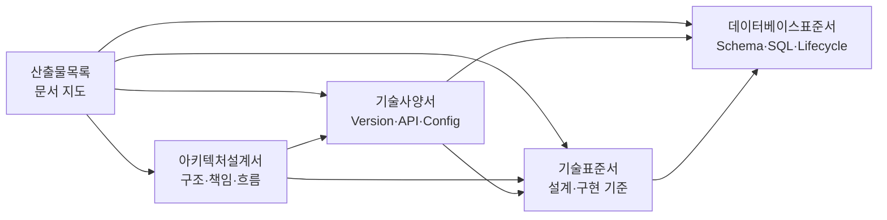

<div align="center">

# Core Platform Framework
## 프레임워크 산출물

**Architecture · Specification · Standards · Data를 하나의 제품 문서 체계로 연결합니다.**

`Product Map · Design · Contract · Rules · Data`

</div>

<p align="center">
  
</p>

---

## 1. 문서 세트 개요

CPF 프레임워크 산출물은 사용자 매뉴얼과 역할이 다릅니다. 매뉴얼이 **업무를 수행하는 절차**를 설명한다면, 이 문서 세트는 **제품이 어떤 구조·계약·표준으로 구성되는지**를 정의합니다.

| 문서 | 책임 | 핵심 질문 |
|---|---|---|
| **[아키텍처설계서](아키텍처설계서.md)** | 제품 경계, Module 책임, Topology, 흐름과 운영 경계 | 무엇이 어디에 있으며 어떤 계약으로 연결되는가? |
| **[기술사양서](기술사양서.md)** | Version, Artifact, API, Header, Runtime, Property와 호환성 | 실제 적용 값과 실행 계약은 무엇인가? |
| **[기술표준서](기술표준서.md)** | Architecture, Code, Security, Reliability와 품질 규칙 | 설계·구현·변경은 어떤 기준을 따라야 하는가? |
| **[데이터베이스표준서](데이터베이스표준서.md)** | Schema, Table, SQL, Index, Migration과 보존 기준 | 데이터는 어디에 어떤 규칙으로 저장·조회·변경하는가? |

<p align="center">
  
</p>

## 2. 패키지 구성

```text
cpf-docs/
└─ deliverables/
   ├─ 산출물목록.md
   ├─ 아키텍처설계서.md
   ├─ 기술사양서.md
   ├─ 기술표준서.md
   ├─ 데이터베이스표준서.md
   └─ png/
      └─ 산출물 설명 이미지
```

- 문서와 전용 이미지는 `deliverables` 아래에서 한 세트로 관리합니다.
- Markdown은 `png/<파일명>.png` 상대경로를 사용합니다.
- README 연결은 별도 작업에서 결정합니다.
- 설치·개발·운영 절차는 공식 사용자 매뉴얼에 두고 이 세트에서는 반복하지 않습니다.

## 3. 문서 관계



<p align="center">
  
</p>

## 4. 목적별 읽기 경로

| 목적 | 권장 순서 | 얻는 결과 |
|---|---|---|
| 제품 구조 소개 | 아키텍처설계서 1~7장 → 기술사양서 1~3장 | 제품 경계·Module·실행 형태 이해 |
| Module·Domain 설계 | 아키텍처설계서 3~9장 → 기술표준서 2~6장 | Owner·Dependency·Port 결정 |
| API 계약 검토 | 기술사양서 4~8장 → 기술표준서 7~10장 | Header·오류·멱등성·호출 규격 확정 |
| 파일·외부연계 설계 | 아키텍처설계서 10~11장 → 기술사양서 9~10장 → 기술표준서 11~12장 | Streaming·Timeout·대사 계약 확정 |
| Batch·Gateway 검토 | 아키텍처설계서 12~13장 → 기술사양서 11~12장 | 실행·제어·게시 구조 이해 |
| 보안·운영 검토 | 아키텍처설계서 16~17장 → 기술사양서 16~18장 → 기술표준서 13~15장 | Trust·권한·관측·호환성 기준 확정 |
| DB 설계 검토 | 데이터베이스표준서 전체 → 기술표준서 18장 | Schema·Table·SQL·Migration 설계 |

## 5. 문서별 필수 구성

이 장은 각 파일이 담당해야 하는 내용을 고정합니다. 상세 작성은 각 문서의 빠른 목차와 같은 순서를 사용합니다.

### 5.1 아키텍처설계서

| 구분 | 필수 내용 |
|---|---|
| 제품 관점 | Architecture 원칙, 품질속성, 시스템 Context, 경계 |
| 구조 관점 | Module Ownership, Dependency, Public API·SPI·Internal |
| 실행 관점 | Topology, 온라인, Local·Remote, Event, 파일·외부연계, Batch, Gateway |
| 운영 관점 | ADM·BZA, 데이터, 보안, 관측·복구, 배포·Generator |
| 결정 관점 | Architecture 결정, 제약, Source 기준점 |

### 5.2 기술사양서

| 구분 | 필수 내용 |
|---|---|
| 기술 | Stack Version, Primary 기술, Module·Starter·Artifact |
| Runtime | Packaging, 공급 Mode, Profile, Health, 실행 식별자 |
| Interface | API, Header, Context, 오류, 멱등성, Local·Remote, Messaging |
| Capability | 파일·전문·외부 REST, Batch, Gateway, ADM·BZA·Frontend |
| 운영 계약 | Property, DB, Security, Observability, Version·Compatibility |

### 5.3 기술표준서

| 구분 | 필수 내용 |
|---|---|
| 구조 | Module·Package·계층·Port·Adapter·Public Contract |
| 구현 | Java·Spring·API·Transaction·동시성·멱등성 |
| 연계 | Resilience, Kafka, File, 외부연계, DB 접근 경계 |
| 통제 | Security, Permission, Audit, Config, Secret, Observability |
| 품질 | Frontend, Generated Source, Test Gate, Artifact·Version, 금지 Pattern |

### 5.4 데이터베이스표준서

| 구분 | 필수 내용 |
|---|---|
| 구조 | Vendor, Logical Schema, Canonical 정본, Ownership |
| 설계 | Naming, Data Type, Table·Column, Key·Constraint, Index·성능 |
| 처리 | Transaction·Lock, SQL·Query, Migration Lifecycle |
| 수명주기 | Partition, Archive, Retention, 보호·감사, Backup·Restore·DR |
| 참조 | Table Catalog, 대표 물리 정의, 추적 형식, 검토 기준 |

## 6. 문서 책임 경계

| 항목 | 담당 문서 | 다른 문서에서의 처리 |
|---|---|---|
| Module 책임과 흐름 | 아키텍처설계서 | 사양·표준에서는 링크와 적용값만 제시 |
| 실제 Version·Header·Property | 기술사양서 | Architecture에서는 의미만 설명 |
| 작성 규칙과 금지 Pattern | 기술표준서 | 사양에서는 값과 계약만 제시 |
| Table·SQL·Migration 규칙 | 데이터베이스표준서 | 기술표준에서는 접근 경계만 제시 |
| 사용자 절차·명령·화면 사용법 | 공식 매뉴얼 | 본 산출물에서는 중복하지 않음 |

## 7. 정본 · Version · 변경 관리

```text
실제 Source · SQL · API · Config · Frontend · Script · Test
        ↓
Architecture · Specification · Canonical Schema
        ↓
프레임워크 산출물
        ↓
공식 사용자 매뉴얼
```

- Class, Package, Header, Property, Table, Column, Route와 상태값은 Source 원문을 사용합니다.
- Architecture 변경은 Module·API·DB·배포 영향과 함께 반영합니다.
- API·Message·DB·Config 변경은 Version과 호환성 규칙을 적용합니다.
- 그림은 문서와 같은 Repository·경로에서 Version 관리합니다.
- 같은 개념은 전체 문서에서 같은 명칭과 식별자를 사용합니다.

## 8. 공통 용어

| 용어 | 의미 |
|---|---|
| **Owner** | 상태·데이터·Command와 Lifecycle을 소유하는 Module |
| **Consumer** | API·SPI·SQL·Property를 실제로 사용하는 Module 또는 Runtime |
| **Public API** | 외부 Module이 사용하는 Version 계약 |
| **SPI** | 선택 Provider가 구현하는 확장 계약 |
| **Internal** | Owner Module 안에서만 사용하는 구현 |
| **Control Plane** | 조회·설정·승인·조정 영역 |
| **Data Plane** | 실제 요청·메시지·Batch 작업을 실행하는 영역 |
| **Canonical** | Vendor·Runtime 파생물을 생성하는 논리 정본 |
| **Reconciliation** | 여러 원장의 상태와 결과를 대조해 실제 결과를 확정하는 처리 |

---

## 문서 기준

| 항목 | 값 |
|---|---|
| Repository | `freeangelsun/202412_01_CPF` |
| Branch | `master` |
| 기준 Commit | `1edd96c6dcc69b0b4d6e9e22a0709d910d7cfb04` |
| 상위 요구사항 정본 | `cpf-docs/governance/CPF_FINAL_TARGET_REQUIREMENTS.md` |
| 문서 표준 | `cpf-docs/specification/CPF_DOCUMENTATION_STANDARD.md` |
| 사실 정본 | Source · SQL · API · Config · Frontend · Script · Test |
