<div align="center">

# 코어 플랫폼 프레임워크(Core Platform Framework)
## 프레임워크 산출물

**CPF가 어떤 상품이며, 고객 조직의 개발·운영 방식이 어떻게 달라지는지 기술 근거와 함께 설명합니다.**

`제품 지도 · 아키텍처 · 기술 사양 · 표준 · 데이터`

</div>

<p align="center">
  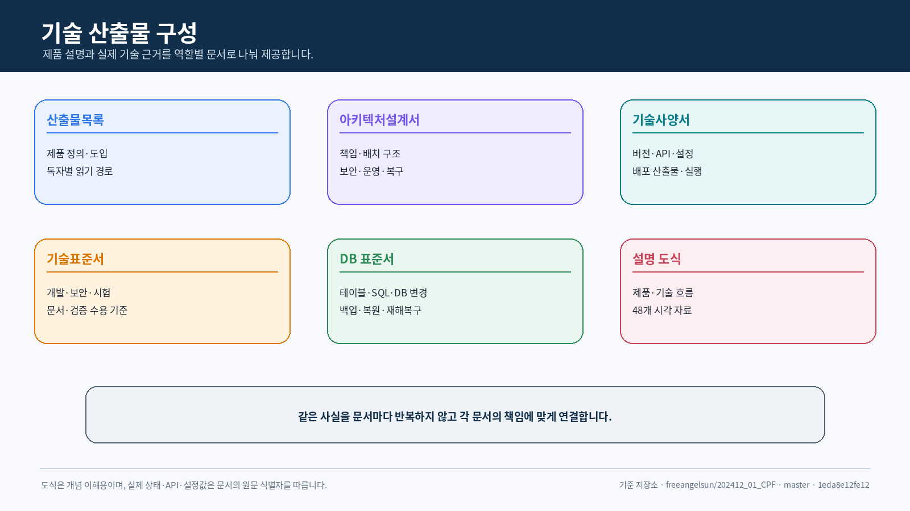
</p>

---

## 이 문서 세트를 처음 보는 분께

### 30초 설명

**CPF는 어떤 제품인가?**

**CPF(코어 플랫폼 프레임워크, Core Platform Framework)는 회사의 업무 시스템을 만들고 운영할 때 매번 반복되는 기술 기반을
하나의 제품으로 제공하는 프레임워크입니다.**

예를 들어 회원·계약·심사·결제·정산 같은 업무 시스템을 새로 만들 때는 업무 화면과 규칙만 필요한
것이 아닙니다. 로그인과 권한, 요청 추적, 오류 처리, 중복 방지, 다른 시스템과의 연결, 대량 배치,
운영 화면, 장애 확인, 감사 기록, DB 변경과 복구도 함께 필요합니다.

CPF는 이런 공통 영역을 프로젝트마다 처음부터 다시 만들지 않도록 제품 구조와 개발 규칙, 실행
기능, 운영 화면, 복구 절차와 검증 기준을 함께 제공합니다. 고객은 CPF 위에 자기 회사만의 업무
규칙과 화면을 구현합니다.

<p align="center">
  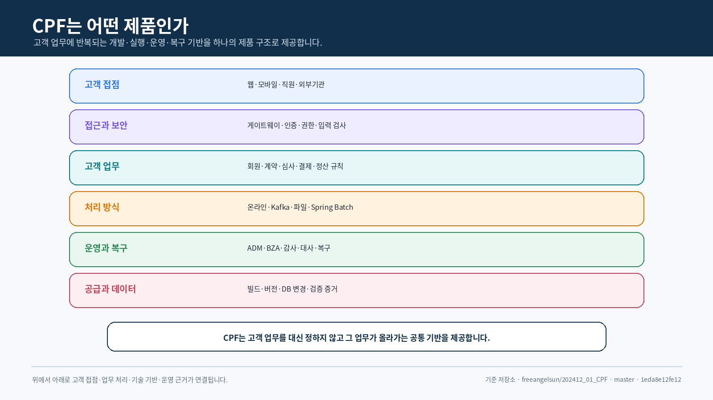
</p>

### 쉬운 비유

회사가 새로운 업무 시스템을 하나의 건물이라고 보면, 고객 업무는 그 건물 안에서 실제로 수행할
일입니다. CPF는 건물마다 반복해서 필요한 출입 통제, 전기·통신, 안전 설비, 관리실, 점검 기록과
복구 절차에 해당합니다.

CPF가 고객의 업무 자체를 대신 결정하지는 않습니다. 대신 고객 업무가 **같은 기준으로 만들어지고,
서로 연결되며, 운영되고, 장애 후 복구될 수 있는 기반**을 제공합니다.

### 왜 필요한가

시스템이 한두 개일 때는 프로젝트마다 공통 기능을 별도로 만들어도 운영할 수 있습니다. 그러나
시스템과 개발팀이 늘어나면 다음 문제가 반복됩니다.

- 같은 인증·오류·배치·운영 기능을 여러 프로젝트가 다시 만듭니다.
- 시스템마다 상태 이름, 로그 형식과 장애 대응 방법이 달라집니다.
- 응답을 받지 못했을 때 실제 처리가 됐는지 판단하기 어렵습니다.
- 운영자가 소스코드와 DB를 직접 분석해야 다음 조치를 결정할 수 있습니다.
- 공통 기능을 변경할 때 여러 업무 시스템에 예상하지 못한 영향이 생깁니다.
- API·DB·시험·문서와 실제 배포 산출물이 서로 다른 시점을 가리킵니다.

CPF는 이 문제를 조직이 함께 사용하는 제품 기준으로 바꾸려는 프레임워크입니다.

<p align="center">
  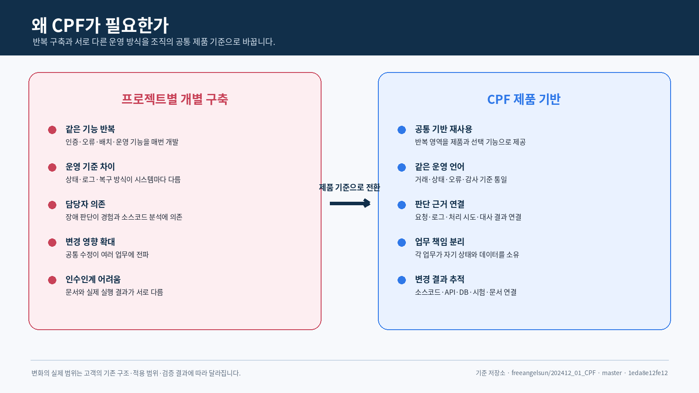
</p>

### CPF는 무엇이고 무엇이 아닌가

| 구분 | 설명 |
|---|---|
| CPF가 제공하는 것 | 업무 시스템 공통 개발 기반, 온라인·메시지·파일·대량·정기 처리, API 출입구, 운영 화면, 조직·권한·결재 기반, 보안·감사, DB 변경·복구, 빌드·검증 기준 |
| 고객이 만드는 것 | 고객 고유의 상품·계약·심사·결제·정산 규칙, 업무 화면, 승인 정책과 데이터 의미 |
| CPF가 아닌 것 | 특정 산업의 완성 업무 패키지, 화면만 조립하는 무코드(No-code) 도구, API 출입구 하나만을 의미하는 Middleware |
| 도입 방식 | 필요한 기본 기능과 선택 제품을 정하고 작은 대표 업무에서 검증한 뒤 조직 범위로 확장 |
| 성공 조건 | 고객 업무 책임 주체, 운영 조직, 보안·DB 정책과 검증 기준을 CPF 계약에 맞춰 함께 정함 |

### CPF 제품 구성

CPF는 하나의 라이브러리가 아니라 업무 시스템의 생명주기를 연결하는 여러 제품과 도구의 집합입니다.

<p align="center">
  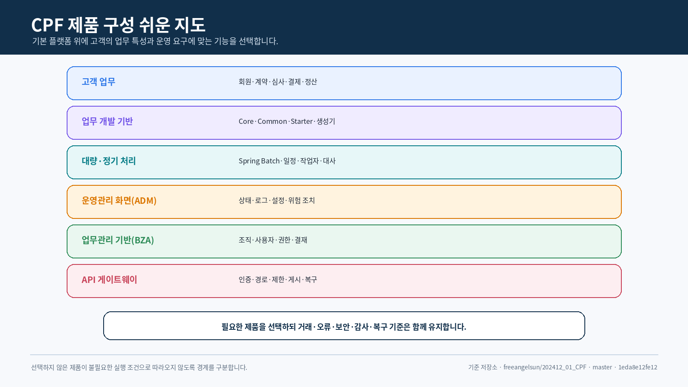
</p>

| 구성 | 쉬운 설명 | 고객이 얻는 결과 |
|---|---|---|
| 업무 개발 기반 | 새 업무의 기본 구조와 공통 기술 기능 | 개발팀이 공통 기반보다 업무 규칙에 집중 |
| 스타터 제품군 | 고정 제품 컨테이너 `cpf-starters/` 아래 7개 기능별 Gradle 프로젝트를 관리 | 필요한 실행 기능만 선택하고, 선택하지 않은 기술의 JAR·빈·설정·SQL 전파를 제한 |
| 대량·정기 처리 플랫폼(배치 플랫폼) | 정기·대량·분할 처리를 개발하고 운영하는 제품 | 중지·재시작·재처리·대사까지 같은 절차로 수행 |
| 운영관리 화면(ADM) | 시스템 상태를 조회하고 권한에 따라 조치하는 운영 화면 | 소스코드를 처음부터 분석하지 않고 상태와 조치 이력을 확인 |
| 업무관리 기반(BZA) | 조직·사용자·권한·결재를 제공하는 선택 제품 | 업무 시스템마다 관리 기반을 다시 만드는 범위를 줄임 |
| API 출입구(게이트웨이) | API 요청이 들어오는 공통 출입구 역할의 선택 제품 | 인증·라우팅·제한·게시와 장애 상태를 공통 관리 |
| DB·빌드·검증 도구 | DB 설치·변경·복구와 배포 결과를 관리 | 어떤 소스코드의 어떤 버전이 설치됐는지 확인 |

### 스타터는 무엇인가

CPF 스타터는 특정 실행 기술을 CPF 공개 계약에 연결하고 Spring Boot 자동 설정으로 조립하는
**선택형 라이브러리 JAR**입니다. 독립 서버가 아니며, 이를 선택한 업무·ADM·BZA·게이트웨이·배치
실행 파일 안에 포함됩니다.

현재 정식 구조는 다음과 같습니다.

| 구분 | 현행 식별자 | 의미 |
|---|---|---|
| 제품 컨테이너 | `cpf-starters/` | 기능별 스타터 소스코드의 고정 루트 폴더. Gradle 프로젝트 자체는 아님 |
| Gradle 프로젝트 | `:cpf-starter-security` 등 7개 | 독립 컴파일·시험·JAR·POM·게시 단위 |
| 배포 좌표 그룹 | `com.cpf.starter` | 기능별 스타터 Maven 좌표 그룹 |
| 버전 정렬 | `cpf-platform-bom` | 스타터 버전만 정렬하며 실행 의존성을 활성화하지 않음 |
| 선택 주체 | 제품 모듈·생성 업무 영역 | 필요한 스타터를 직접 선언하거나 향후 승인 프로필을 해석해 명시적으로 선언 |

과거 문서에서 가정했던 별도 단수형 관리 프로젝트는 최신 `settings.gradle`과 저장소 구조에
존재하지 않습니다. 제품군 목록·생명주기·프로필 후보는
`cpf-docs/governance/CPF_STARTER_ARCHITECTURE_AND_LIFECYCLE_POLICY.md`가 관리하고,
실제 등록 정본은 `settings.gradle`입니다.

#### 어떤 기능이 필요할 때 어떤 스타터를 선택하는가

| 기능 요구 | 현재 프로젝트 | 현재 실제 연결 | 선택 전 확인 |
|---|---|---|---|
| ADM·BZA 브라우저 세션, CSRF, JDBC 자격 증명 Vault | `:cpf-starter-security` | `cpf-admin`, `cpf-biz-admin` | Servlet·DataSource·Session JDBC, `cpf.security.session.*`, 허용 출처, 암호화 키, 세션·Vault DB |
| Kafka 발행과 `CpfBrokerClient`·Bridge | `:cpf-starter-messaging-kafka` | 자동 설정 구현 존재, 주요 제품 빌드 실제 사용처는 재확인 필요 | `KafkaTemplate`, `cpf.broker.type=KAFKA`, `cpf.messaging.kafka.*`, 멱등성·ACK·재처리 |
| LOCAL·Caffeine·Redis 캐시와 무효화 | `:cpf-starter-cache` | 자동 설정 구현 존재, 주요 제품 빌드 실제 사용처는 재확인 필요 | `cpf.cache.provider`, Redis·비밀값·JDBC 무효화, 원본 조회, Caffeine/Redis 동시 전이 영향 |
| 지표·추적 연결 | `:cpf-starter-observability` | `cpf-gateway`, `cpf-batch:execution-runtime` | `ObservationRegistry`, OTLP 수집기, 마스킹, 처리량·Backpressure |
| 회로 차단 실행 | `:cpf-starter-resilience` | `cpf-gateway`, `cpf-batch:execution-runtime` | `CircuitBreakerFactory`, 시간 예산, 재시도 멱등성, `UNKNOWN_RESULT` 대사 |
| OpenFeature 평가 | `:cpf-starter-featureflag` | 자동 설정 구현, 실제 제품 Provider·실제 사용처 재확인 필요 | Provider, 기본값, 대상 문맥, 변경 승인·감사 |
| 승인된 비밀값 Provider Registry | `:cpf-starter-secret` | 자동 설정 구현, 실제 고객 Provider·Rotation·실제 사용처 재확인 필요 | 최소 1개 `CpfSecretProvider`, 권한, 교체, 상태 점검 |

#### 현재 구현 상태를 읽는 방법

| 분류 | 현재 판정 | 의미 |
|---|---|---|
| 컨테이너·7개 프로젝트 등록 | 완료 | 최신 `settings.gradle`에 정확한 프로젝트 ID와 경로가 등록됨 |
| 7개 독립 JAR·게시 설정 | 부분 구현 | 모든 프로젝트에 `maven-publish`가 있으나 동일 배포본 게시·소비 시험은 이번 작업에서 미실행 |
| 보안 스타터 실제 사용처 | 부분 구현 | ADM·BZA 빌드 연결과 자동 설정 소스 확인. 브라우저·DB·장애 시험은 미검증 |
| 관측·복원력 실제 사용처 | 부분 구현 | 게이트웨이·배치 실행 환경 빌드 연결 확인. 실제 수집기·장애 시험은 미검증 |
| Kafka·캐시 실제 사용처 | 재확인 필요 | 구현은 있으나 확인한 주요 제품 빌드에서 직접 소비자가 확인되지 않음 |
| 기능 플래그·비밀값 | 부분 구현 | 자동 설정은 있으나 Provider·실제 제품 소비·감사·Rotation 검증이 부족 |
| 프로필·묶음 선택 | 미구현 | 정책과 후보만 존재하며 생성기·빌드 해석·잠금 결과가 없음 |

#### 코어와 스타터를 구성하는 네 계층

<p align="center">
  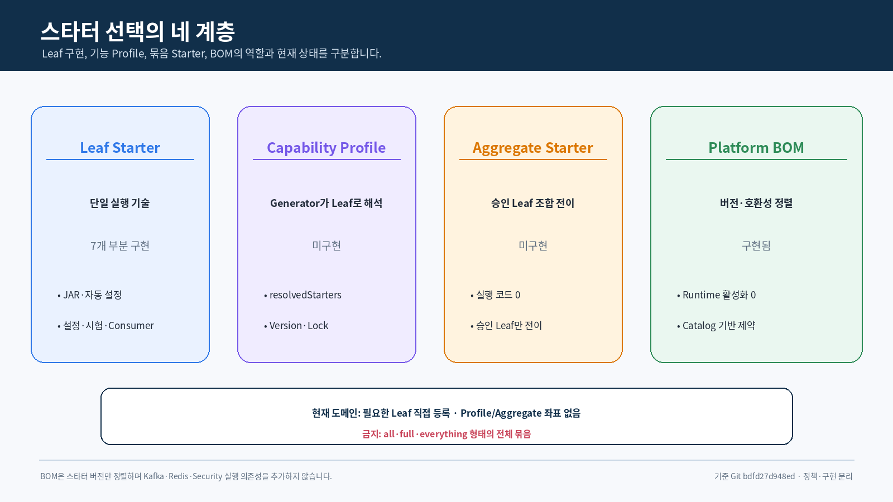
</p>

| 계층 | 목적 | 실행 의존성 활성화 | 현재 상태 |
|---|---|---:|---|
| Leaf 스타터 | 단일 실행 기술 구현과 검증의 정본 | 예 | 7개 프로젝트 부분 구현 |
| 기능 프로필 | 생성기·빌드가 승인된 Leaf 목록으로 해석하는 선택 선언 | 해석 후 명시적 활성화 | 정책 후보, 미구현 |
| 묶음 스타터 | 검증된 조합을 하나의 의존성으로 전이 | 예 | 필요성 검증 전, 미구현 |
| 플랫폼 BOM | 버전·호환성 정렬 | 아니오 | 구현됨. 최종 배포본 검증은 미검증 |

도메인이 모든 스타터를 한 줄씩 직접 등록해야 하는 것은 아닙니다. 다만 현재 생성기와
`cpf-member`에는 프로필 해석·`resolvedStarters`·프로필 잠금 구현이 없으므로, **현행 사용 방식은
필요한 Leaf 스타터의 명시적 등록**입니다.

#### 정책에 정의된 초기 프로필 후보

<p align="center">
  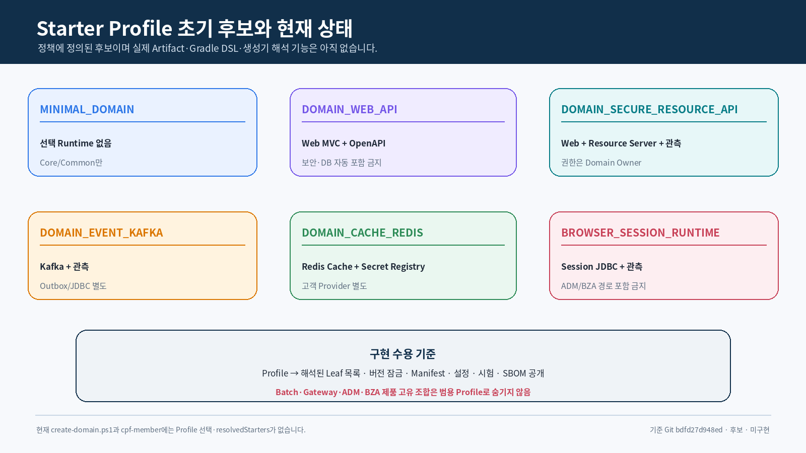
</p>

| 후보 | Leaf 스타터 후보 | 제외·주의 | 상태 |
|---|---|---|---|
| `MINIMAL_DOMAIN` | 선택 실행 기술 없음 | Core/Common 계약만 허용 | 미구현 |
| `DOMAIN_WEB_API` | Web MVC + OpenAPI Web MVC | 보안·영속성 자동 포함 금지 | 후보 |
| `DOMAIN_SECURE_RESOURCE_API` | Web MVC + Resource Server + 관측 | 권한은 업무 책임 주체가 소유 | 후보 |
| `DOMAIN_EVENT_KAFKA` | Kafka + 관측 | Outbox·JDBC는 별도 선택 | 후보 |
| `DOMAIN_CACHE_REDIS` | Redis Cache + Secret Registry | 고객 비밀값 Provider는 별도 | 후보 |
| `BROWSER_SESSION_RUNTIME` | Security Session JDBC + 관측 | ADM/BZA 경로·권한 포함 금지 | 후보 |

배치·게이트웨이·ADM·BZA의 제품 고유 조합은 범용 프로필로 숨기지 않고 각 제품 빌드나 제품 전용
빌드 규칙이 관리합니다.

#### 선택 절차

1. 업무에 필요한 실행 기능, 외부 제품, DB 자원, 장애·복구 조건을 적습니다.
2. 현재는 필요한 Leaf 스타터를 `build.gradle`에 직접 선언합니다.
3. BOM은 버전만 정렬하며 스타터를 활성화하지 않는지 확인합니다.
4. 상호 배타 Provider(Kafka/RabbitMQ, Caffeine/Redis, Session/Resource Server 등)를 함께 선택하지 않습니다.
5. 프로필 구현 후에도 생성 결과에 해석된 Leaf 목록과 버전 잠금을 남깁니다.
6. 선택하지 않은 스타터의 JAR·빈·설정·SQL·스레드·연결이 실행 파일에 없는지 제거 시험으로 확인합니다.
7. 프로필과 개별 등록이 같은 Leaf 집합이면 실행 의존성·설정·DB·운영 결과가 같아야 합니다.
8. `all`, `full`, `everything` 성격의 전체 묶음은 만들지 않습니다.

### 일반 공통 라이브러리와 무엇이 다른가

일반적인 공통 라이브러리는 개발할 때 필요한 코드를 재사용하는 데 초점을 둡니다. CPF는 코드 재사용에
더해 실행, 운영, 장애 복구, DB 변경, 배포와 검증까지 제품 범위로 연결합니다.

| 비교 항목 | 일반 공통 라이브러리 | CPF |
|---|---|---|
| 주 목적 | 반복 코드와 Utility 재사용 | 업무 시스템의 개발·실행·운영·복구 기준을 제품으로 제공 |
| 제공 범위 | 개발 시 참조하는 클래스와 함수 중심 | 라이브러리, 실행 프로그램, 운영 화면, DB 패키지, 빌드·검증 도구 |
| 업무 확장 | 공통 소스코드를 직접 수정하거나 프로젝트별 구조 사용 | 생성기와 모듈 책임 경계로 새 업무 추가 |
| 운영 | 별도 운영 화면과 절차를 프로젝트가 구축 | 운영관리 화면(ADM)·업무관리 기반(BZA)·API 게이트웨이·배치 운영 경로 제공 |
| 장애 대응 | 로그 확인과 개별 재시도 구현에 의존 | 거래 식별자·시도 이력·결과 대사·재처리·복구 계약 |
| 데이터 변경 | SQL과 업그레이드 절차를 프로젝트별 관리 | 공통 기준·DB 제품별 패키지·DB 변경·복원 생명주기 |
| 공급·버전 | 파일이나 의존성 버전 중심 | BOM·플러그인·배포 산출물·목록 파일·검사값·소스코드 SHA 연결 |
| 검증·문서 | 프로젝트별 시험과 문서 방식 | 소스코드·API·SQL·시험·문서·검증 증거의 연결 기준 |

따라서 CPF 도입은 라이브러리 하나를 추가하는 작업보다 넓습니다. 고객의 개발 표준, 운영 역할, 보안,
DB와 배포 절차를 CPF 제품 계약과 어떻게 연결할지 함께 결정해야 합니다.

### 가벼운 코어와 선택 스타터 구조

CPF의 목표는 모든 업무가 공유하는 구현 중립 계약만 `cpf-core`에 남기고, 실행 기술은 스타터 또는
실제 책임 모듈이 소유하게 하는 것입니다.

<p align="center">
  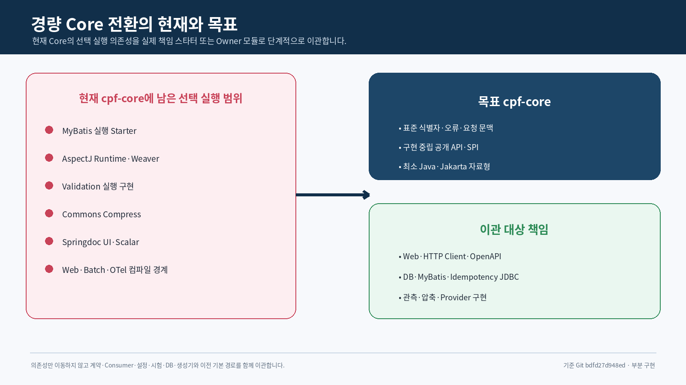
</p>

| 코어에 남길 책임 | 분리·이관 검토 대상 |
|---|---|
| 거래·작업 식별자, 요청·응답·오류 모델 | MyBatis·JDBC 실행 자동 설정 |
| 멱등성·처리 기한·결과 미확정 계약 | AspectJ 기반 선택 실행 구현 |
| 구현 기술을 노출하지 않는 공개 API·SPI | Web MVC 필터·인터셉터, RestClient·WebClient |
| 보안·캐시·메시지·관측의 구현 중립 계약 | Spring Security·Session, OpenAPI UI·Scalar |
| 최소 Java·Jakarta 자료형과 유틸리티 | OTel SDK·Exporter, 압축, Provider 구현 |
| 배치·외부 연계에 필요한 컴파일 계약 | 선택형 Idempotency·Outbox/Inbox JDBC 연결 |

최신 `cpf-core/build.gradle`에는 MyBatis, AspectJ, Validation, Commons Compress, Springdoc UI·Scalar가
여전히 `implementation`으로 존재하고 WebFlux·RestClient·Batch·OTel은 `compileOnly` 경계에
남아 있습니다. 따라서 경량화는 **부분 구현**이며, 단순 의존성 이동이 아니라 공개 계약·실제
사용처·설정·시험·DB·생성기·안내서와 이전 기본 경로 제거까지 함께 수행해야 합니다.

<p align="center">
  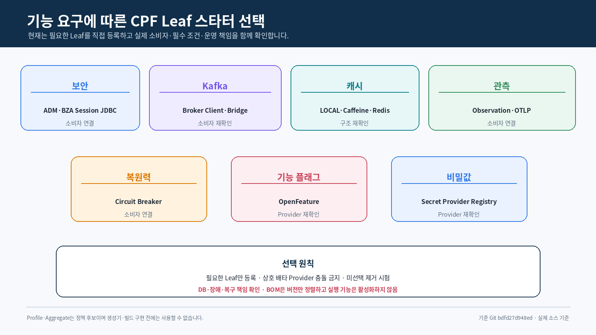
</p>

### CPF로 만들 수 있는 업무

<p align="center">
  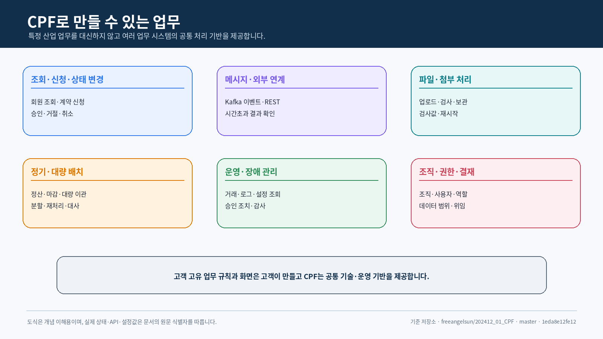
</p>

CPF는 다음과 같은 고객 업무 결과를 만드는 데 사용할 수 있습니다.

- 조건 검색·목록·상세·등록·수정·상태 변경 API와 화면
- 승인·거절·취소·재개처럼 상태가 바뀌는 업무
- 중복 요청과 동시에 발생한 수정 충돌을 통제하는 업무
- Kafka 이벤트를 발행·소비하고 실패 메시지를 재처리하는 업무
- 외부 REST·전문·파일 연계와 응답 유실 이후 결과를 확인하는 업무
- 정기·대량·분할·원격 배치와 중단 후 재시작·재처리 업무
- 운영자가 상태를 조회하고 사유·승인과 함께 조치하는 ADM 연동
- 조직·사용자·권한·결재·첨부·알림이 필요한 BZA 기반 업무
- 여러 API를 공통 인증·라우팅·제한 정책으로 공개하는 게이트웨이 업무

### 하나의 업무가 처리되는 과정

처음 보는 분은 CPF를 모듈 이름으로 외우기보다, 고객 요청이 들어와 결과가 확정될 때까지의
과정으로 이해하는 편이 쉽습니다.

<p align="center">
  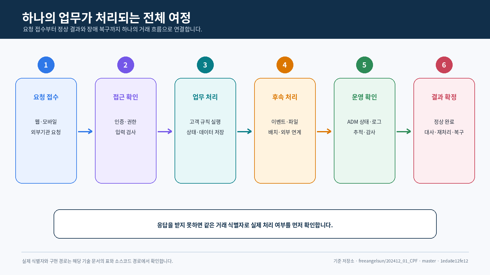
</p>

1. 고객이나 외부기관이 업무 요청을 보냅니다.
2. CPF는 사용자의 신원과 권한, 입력값을 확인하고 요청을 추적할 식별자를 부여합니다.
3. 고객이 만든 업무 규칙이 실행되고 상태와 데이터가 저장됩니다.
4. 필요하면 이벤트·파일·배치나 다른 시스템 연계가 이어집니다.
5. 운영자는 ADM에서 상태·로그·처리 경로와 감사 기록을 확인합니다.
6. 정상 결과를 확정하거나, 응답 유실·부분 실패가 있으면 대사 후 재처리·복구합니다.

특히 요청을 보낸 뒤 응답을 받지 못한 경우, CPF는 이를 바로 실패로 단정하고 다시 실행하지 않는
원칙을 사용합니다. 같은 거래 식별자와 요청 내용, 처리 시도 이력을 이용해 실제 결과를 확인한 뒤
맞는 복구 방법을 선택합니다.

### 대표 업무 사례: 계약 변경 신청

고객이 계약 내용을 변경하는 간단한 업무를 CPF 관점으로 보면 다음과 같습니다.

| 단계 | 고객에게 보이는 일 | CPF와 고객 업무가 수행하는 일 | 확인 결과 |
|---:|---|---|---|
| 1 | 사용자가 변경 내용을 입력하고 신청 | API 출입구가 사용자와 요청 권한을 확인 | 요청이 허용되거나 권한 오류로 거절 |
| 2 | 신청이 접수됨 | 거래 식별자를 만들고 필수값·형식을 검사 | 같은 요청을 끝까지 추적할 기준 생성 |
| 3 | 계약 상태가 변경됨 | 고객 업무가 현재 버전과 변경 가능 조건을 확인하고 저장 | 변경 전·후 상태와 처리 버전 기록 |
| 4 | 관련 부서나 시스템에 전달됨 | 이벤트 또는 업무 API로 후속 처리를 요청 | 발행·수신·실패·재처리 이력 확인 |
| 5 | 운영자가 진행 상태를 확인 | ADM에서 거래·로그·추적·감사 기록 조회 | 어느 단계까지 처리됐는지 판단 |
| 6 | 응답 유실이나 일부 실패 발생 | 실제 계약 상태와 후속 처리 결과를 대사 | 재처리·보상·운영 확정 중 맞는 조치 선택 |

예를 들어 사용자가 완료 화면을 받지 못했다고 해서 같은 변경을 바로 다시 실행하면 중복 처리될 수
있습니다. CPF는 거래 식별자와 중복 방지 키, 저장된 계약 상태와 후속 처리 이력을 먼저 확인하도록
합니다. 실제 변경이 완료됐다면 결과만 다시 안내하고, 처리되지 않았다면 안전한 조건에서 재처리합니다.

이 사례에서 **계약을 어떤 조건으로 변경할 수 있는지**는 고객 업무가 결정합니다. CPF는 요청 추적,
권한, 중복 방지, 오류, 이벤트, 운영 조회와 복구 절차의 공통 기반을 제공합니다.

### 도입하면 역할별로 무엇이 달라지는가

<p align="center">
  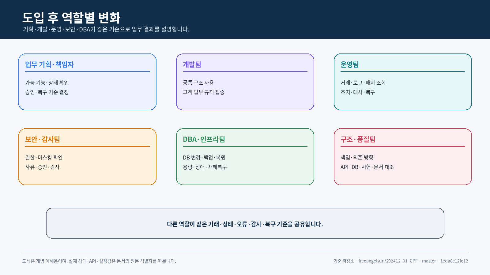
</p>

| 역할 | 도입 전 자주 겪는 문제 | CPF 적용 후 사용하는 기준 |
|---|---|---|
| 업무 기획·책임자 | 기술팀마다 가능 여부와 구현 방식 설명이 다름 | 가능한 기능·상태·승인·복구 기준을 제품 문서로 확인 |
| 개발팀 | 공통 기능과 초기 구조를 프로젝트마다 다시 구현 | 생성기·공통 계약·선택 기능 모듈을 사용하고 업무 규칙에 집중 |
| 운영팀 | 장애 때 담당 개발자와 소스코드 분석에 의존 | 같은 거래 식별자·상태·로그·감사·복구 절차로 판단 |
| 보안·감사팀 | 화면·API·DB 접근 이력이 서로 분리 | 권한·데이터 범위·마스킹·사유·승인·감사를 연결 |
| DBA·인프라팀 | 설치·업그레이드·복구 방법이 시스템별로 다름 | DB 제품별 패키지·DB 변경·백업·복원·DR 기준 사용 |
| 아키텍처·품질팀 | 문서와 구현, 시험과 배포 결과가 불일치 | 소스코드·API·SQL·시험·문서·검증 증거를 같은 기준으로 대조 |

### CPF와 고객의 책임 경계

<p align="center">
  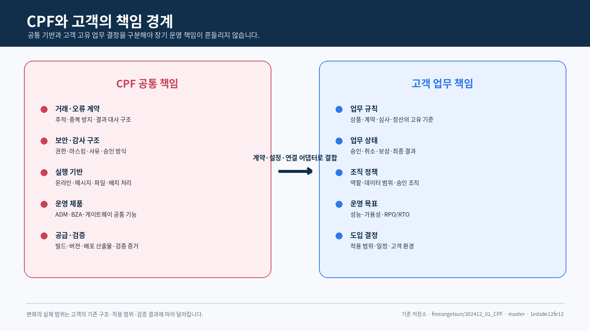
</p>

CPF는 고객 업무를 대신 소유하지 않습니다. 다음 경계를 먼저 합의해야 도입 이후 업그레이드와 장애
대응 책임이 명확해집니다.

| CPF가 공통으로 제공·관리 | 고객이 결정·소유 |
|---|---|
| 거래 식별자, 오류 의미, 중복 방지와 결과 대사 계약 | 업무 상태, 계산 규칙, 승인·취소·보상 기준 |
| 보안·감사·마스킹 적용 구조 | 사용자 역할, 데이터 접근 범위와 승인 조직 |
| 온라인·메시지·파일·배치 실행 기반 | 어떤 처리 방식을 어느 업무에 사용할지 |
| ADM·BZA·게이트웨이 공통 제품 기능 | 고객 전용 메뉴·업무 연계와 운영 역할 |
| 빌드·버전·배포 산출물·검증 증거 규칙 | 배포본 일정과 고객 인수 기준 |
| DB 변경·복구 생명주기 기준 | 고객 DB·백업·RPO/RTO와 운영 정책 |

### 도입 절차

CPF는 처음부터 모든 제품과 기능을 한꺼번에 적용하는 방식보다, 대표 업무에서 기준을 검증하고
확장하는 방식이 적합합니다.

<p align="center">
  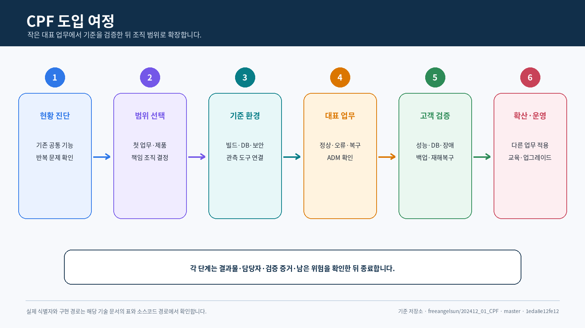
</p>

| 단계 | 주요 작업 | 단계 종료 시 확인할 결과 |
|---:|---|---|
| 1. 현황 진단 | 기존 공통 프레임워크·운영·보안·DB·반복 문제 조사 | CPF 적용 대상과 유지할 기존 기능 |
| 2. 범위 선택 | 첫 업무 영역, 기본·선택 제품, 고객 책임 결정 | 적용 아키텍처와 담당 조직 |
| 3. 기준 환경 | 빌드·배포 산출물·DB·보안·관측 환경 연결 | 개발·배포·운영 가능한 기준 환경 |
| 4. 대표 업무 | 조회·변경·연계·배치·ADM와 오류·복구 구현 | 고객 업무 결과와 운영 확인 경로 |
| 5. 환경 검증 | 성능·DB·브라우저·장애·백업·DR 시험 | 고객 인수 기준과 남은 미검증 |
| 6. 확산·운영 | 다른 업무에 반복 적용하고 버전 관리 | 조직 표준·교육·업그레이드 생명주기 |

### 도입 검토 질문

다음 질문에 여러 항목이 해당하면 CPF의 제품 기반 접근을 검토할 가치가 있습니다.

- 비슷한 공통 기능을 여러 프로젝트가 각각 만들고 있는가
- 온라인·메시지·파일·대량 처리가 한 업무 흐름에서 함께 사용되는가
- 장애 후 실제 처리 결과를 확인하거나 재처리·대사해야 하는가
- 운영·보안·감사 기준을 여러 시스템에서 같은 방식으로 적용해야 하는가
- 신규 업무를 추가할 때 기존 공통 소스코드 변경 위험이 큰가
- DB 설치·업그레이드·백업·복원 절차가 시스템마다 다른가
- 개발 결과와 문서·시험·배포 파일의 기준 버전을 맞추기 어려운가

이 질문은 도입을 자동 결정하는 점수표가 아닙니다. 현행 아키텍처와 운영 문제를 확인하고 첫
적용 범위를 정하기 위한 대화의 시작점입니다.

### 어떤 조직에 적합한가

CPF는 다음 조건이 있는 조직에서 가치가 큽니다.

- 여러 업무 시스템을 반복 구축하거나 장기간 확장해야 하는 조직
- 온라인·메시지·파일·배치·외부기관 연계가 함께 있는 조직
- 운영·보안·감사·장애 복구 기준을 시스템별이 아니라 조직 기준으로 맞추려는 조직
- Modular Monolith와 분리 서비스를 상황에 따라 선택해야 하는 조직
- 장애 결과 확인, 재처리와 업무 대사가 중요한 조직
- 프로젝트 결과를 다음 시스템에도 이어지는 제품 기반으로 전환하려는 조직

수명이 짧은 단일 기능 서비스이거나 운영·보안·복구 요구가 작고, 공통 제품을 유지할 조직적 책임이
없는 경우에는 CPF 전체 적용보다 필요한 구성요소만 검토하는 편이 적절할 수 있습니다.

### 처음 보는 분을 위한 핵심 용어

<p align="center">
  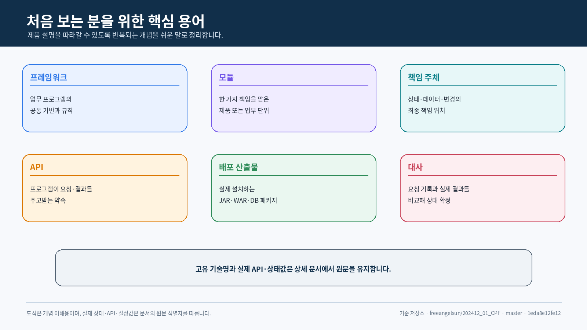
</p>

| 용어 | 쉬운 뜻 |
|---|---|
| 프레임워크 | 업무 프로그램을 만들 때 반복 사용하는 공통 기반과 규칙 |
| 모듈 | 한 가지 책임을 맡도록 나눈 제품 또는 업무 단위 |
| 책임 주체 | 특정 상태·데이터·변경에 최종 책임을 지는 단위 |
| API | 프로그램 사이에 요청과 결과를 주고받는 약속된 창구 |
| 배포 산출물 | 빌드 후 실제 설치·배포하는 JAR·WAR·DB 패키지 같은 결과물 |
| 게이트웨이 | API 요청이 들어오는 공통 출입구 |
| ADM | 플랫폼 상태를 조회하고 권한에 따라 조치하는 운영 화면 |
| BZA | 조직·사용자·권한·결재를 제공하는 업무 관리 제품 |
| 배치 | 많은 데이터를 정해진 시각이나 단위로 처리하는 작업 |
| 추적 | 하나의 요청이 여러 처리 단계를 지나간 경로를 이어서 보는 정보 |
| 대사 | 요청 기록과 실제 결과를 비교해 최종 상태를 확정하는 작업 |
| DB 변경 | DB 구조와 기준 데이터를 버전 순서대로 변경하는 절차 |

### 독자별 읽는 순서

<p align="center">
  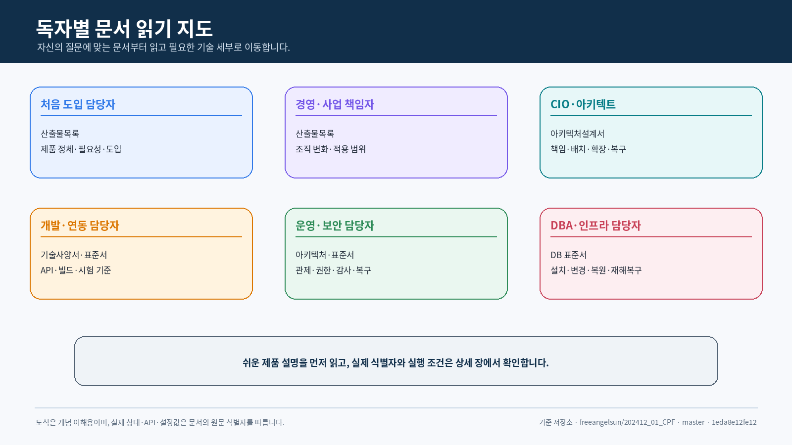
</p>

<p align="center">
  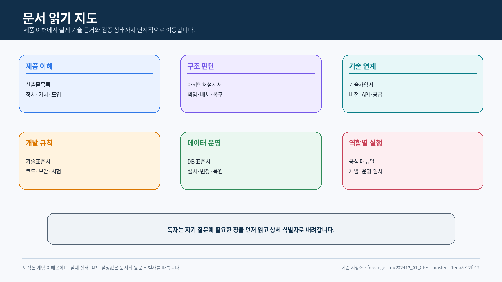
</p>

| 독자 | 먼저 읽을 곳 | 문서를 읽은 뒤 설명할 수 있어야 하는 내용 |
|---|---|---|
| IT 비전문가·처음 도입하는 담당자 | 이 문서의 현재 장 | CPF가 무엇이고 회사의 무엇을 바꾸는가 |
| 경영·사업·기획 책임자 | 이 문서 → 아키텍처설계서 앞부분 | 도입 이유, 적용 범위, 역할 변화와 단계 |
| CIO·CTO·아키텍트 | 아키텍처설계서 | 제품 구성, 책임 경계, 배포 형태, 확장과 복구 |
| 개발·연동 담당자 | 기술사양서 → 기술표준서 | 기술 구성·API·빌드·코딩·시험과 고객 수정 영역 |
| 운영·보안·감사 담당자 | 아키텍처설계서 → 기술표준서 | 관제·권한·감사·위험 조치·복구 기준 |
| DBA·인프라 담당자 | 데이터베이스표준서 | DB 설치·DB 변경·성능·백업·복원·DR |

이 첫 장을 읽은 사람은 최소한 다음 문장으로 CPF를 설명할 수 있어야 합니다.

> CPF는 여러 업무 시스템에 반복되는 개발·연계·배치·운영·보안·감사·복구 기반을 하나의 제품
> 기준으로 제공하고, 고객은 그 위에 자기 회사의 업무 규칙을 구현하는 프레임워크다.

## 1. 문서 세트의 역할

CPF 공식 사용자 매뉴얼은 고객이 업무를 개발·연동·운영하는 절차를 설명합니다.
이 산출물 세트는 그 절차가 의존하는 **제품 구조와 기술 계약의 정본**을 제공합니다.

| 문서 | 책임 | 결정할 사항 |
|---|---|---|
| **[아키텍처설계서](아키텍처설계서.md)** | 제품 경계, 모듈 책임 소유, 배치 구조, 데이터·제어 영역, 복구 경계 | 책임 주체, 의존 방향, 배포 형태, 실패 격리 |
| **[기술사양서](기술사양서.md)** | 버전, 배포 산출물, API, 요청 헤더, 설정, 실행 환경, 화면 계약 | 실제 값, 입력, 산출물, 실행·호환 조건 |
| **[기술표준서](기술표준서.md)** | 설계·구현·보안·시험·검증 증거 규칙 | 변경 허용 기준, 금지 패턴, 검증 수용 기준 |
| **[데이터베이스표준서](데이터베이스표준서.md)** | 스키마, 테이블, SQL, 인덱스, DB 변경, 보존·복구 | 데이터 책임 주체, 물리 설계, DB 제품 차이, 생명주기 |

문서 수·줄 수·그림 수는 보조 정보입니다. 품질은 실제 소스코드와의 일치, 사용자가 결정할 값,
정상·오류·부분 실패·복구 절차, 실행한 검증과 미검증 범위로 판단합니다.
<p align="center">
  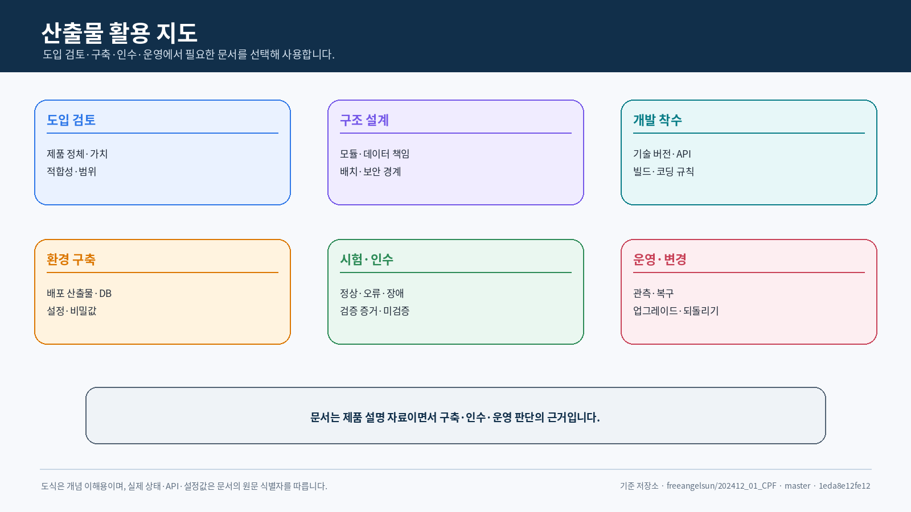
</p>
## 2. 최신 Git 현행화 변경점

기준 커밋 `bdfd27d948ede982697deada0f7393c4290ecd66`의 소스코드·빌드·자동 설정·실제 사용처·생성기·정본 정책을 다시 대조했습니다.

| 현행화 영역 | 최신 Git에서 확인한 사실 | 문서 반영 |
|---|---|---|
| 스타터 루트 | `cpf-starters/`는 고정 제품 컨테이너이고 별도 Gradle 프로젝트가 아님 | 단수형 관리 프로젝트 가정 전면 폐기 |
| 스타터 프로젝트 | `settings.gradle`에 7개 `:cpf-starter-*`와 실제 경로 등록 | 프로젝트·배포 좌표·상태표 갱신 |
| 실제 사용처 | 보안은 ADM/BZA, 관측·복원력은 Gateway/Batch 실행 환경이 직접 소비 | 구현과 실제 사용처를 분리해 표시 |
| 캐시 구조 | `cpf-common` 자동 설정과 LOCAL·Caffeine·Redis·JDBC 무효화가 한 경계에 존재 | 부분 구현·세분화·책임 이관 필요 명시 |
| 프로필·묶음 | 정책에는 Leaf/Profile/Aggregate/BOM 계층이 있으나 생성기·빌드 해석은 없음 | 후보와 미구현 상태를 분리 |
| 생성 업무 | `cpf-tools/generator/create-domain.ps1`은 기능 옵션을 받지만 스타터 프로필·해석 목록·잠금은 만들지 않음 | 현행은 Leaf 직접 등록으로 설명 |
| 경량 코어 | Core에서 Gateway 계약 일부가 제거됐지만 여러 선택 실행 의존성이 남음 | 부분 구현과 남은 분리 후보 갱신 |
| ADM/BZA | 생성 OpenAPI 클라이언트·작업 계약·경로 계약 파일이 저장소에 추적됨 | 과거 “생성 결과 공백” 판정 완화, 실행·브라우저는 미검증 |
| 배치 | Worker·Center-Cut 실행 상태와 처리기가 Spring Batch 중심으로 교체됨 | 소스 구현 진척과 실행 장애 검증을 분리 |
| 공급망 | Release Manifest·SBOM·Provenance 생성·검증과 Starter BOM 자동 제약이 구현됨 | 정적 구현 확인, 실제 게시·재현 시험은 미검증 |
| 문서 정본 | Governance 정본 Index·Starter·Domain·Gate·문서 정책이 추가됨 | 정본 경로와 우선순위 갱신 |

### 이번 패키지에서 수정하지 않는 범위

- README의 승인된 브로셔형 구조
- 9개 공식 사용자 매뉴얼
- Source·SQL·Frontend·Build·Test 구현
- Governance 정책 문서의 오래된 분석 SHA
- Commit·Push·Branch·Tag·PR

Governance 스타터 정책의 본문 방향은 최신 소스와 일치하지만 문서 머리말의 분석 SHA는 이전
커밋을 가리킵니다. 이번 담당 산출물에서는 최신 소스를 우선 적용하고, 해당 정본의 헤더 갱신은
별도 문서 통제 작업으로 `재확인 필요`로 남깁니다.

## 3. 목적별 읽기 순서

| 목적 | 읽기 순서 | 완료 결과 |
|---|---|---|
| 제품 도입·구조 검토 | 본 문서 고객 요약 → 아키텍처설계서 고객 관점 요약 → 기술사양서 기술 판단 요약 | 제품 가치, 적용 경계, 기술 근거와 추가 검증 범위를 결정 |
| 신규 업무 영역 설계 | 아키텍처설계서 4~11장 → 기술표준서 2~10장 → DB 표준서 2~9장 | 책임 주체, 공개 계약, 스키마, 오류·복구 계약을 확정 |
| API·외부 연계 검토 | 기술사양서 4~10장 → 기술표준서 7~12장 | 요청 헤더, 트랜잭션, 시간초과, 멱등성, 결과 대사 기준을 확정 |
| 배치 설계·운영 검토 | 아키텍처설계서 12장 → 기술사양서 11장 → 기술표준서 16장 | Job·Step/작업자/에이전트/Center-Cut 경계와 재시작 기준을 확정 |
| 게이트웨이 공개·복구 검토 | 아키텍처설계서 13장 → 기술사양서 12장 → 기술표준서 10·13장 | 경로·신뢰·처리 시도·게시·부분 적용·LKG 복구 기준을 확정 |
| 빌드·배포 산출물 검토 | 아키텍처설계서 18장 → 기술사양서 2·3·18장 → 기술표준서 5·21장 | 플러그인/BOM/게시/폐쇄망 묶음 계약을 확정 |
| DB 설치·업그레이드 검토 | 데이터베이스표준서 전체 → 기술사양서 15장 | DB 제품별 패키지, DB 변경, 구성 차이, 백업·복원 기준을 확정 |
| 독립 검증 | 각 문서의 검증 장 → 실제 소스코드·시험·스크립트 | 실행 결과와 미검증을 분리한 검증 증거를 작성 |

## 4. 패키지 구조

```text
cpf-docs/
└─ deliverables/
   ├─ 산출물목록.md
   ├─ 아키텍처설계서.md
   ├─ 기술사양서.md
   ├─ 기술표준서.md
   ├─ 데이터베이스표준서.md
   └─ png/
      └─ 54개 제품·기술 설명 도식
```

- Markdown의 이미지 경로는 `png/<파일명>.png`입니다.
- 산출물 이미지와 공식 안내서 이미지를 섞지 않습니다.
- 설치·화면 조작·EDU 실행 절차는 담당 공식 안내서에 두고, 이 문서에서는 계약과 판단 기준을 제공합니다.
- ZIP은 저장소 루트 기준 상대경로를 유지하고 임의의 최상위 폴더를 포함하지 않습니다.

## 5. 정본과 추적 체계

```text
최상위 요구사항 정본
        ↓ 요구사항 ID
소스코드 · SQL · API · 설정 · 화면 · 스크립트 · 시험
        ↓ 책임 주체 · 실제 사용처 · 버전 · 해시
아키텍처 · 기술 사양 · 기술 표준 · 데이터베이스 표준
        ↓ 사용자 작업 계약
공식 안내서
        ↓ 실행 결과
검증 증거 · 검증표 · 실행 로그
```

### 5.1 변경 시 필수 기록

| 항목 | 필수 값 |
|---|---|
| 기준선 | 저장소, 브랜치, 정확한 40자 커밋 SHA |
| 요구사항 | 공통 기준 ID, Legacy Alias 여부, 상태 |
| 소스코드 | 책임 주체 모듈, 공개 API/SPI/내부, 실제 사용처 |
| 데이터 | 스키마, 테이블, 조회문 자원, DB 변경, DB 제품 |
| 인터페이스 | 호출 방식/경로, 요청 헤더, 오류, 버전, OpenAPI 해시 |
| 배포 산출물 | 그룹·배포 산출물·버전, 소스코드 SHA, 검사값, 목록 파일 |
| 시험 | 명령, 환경, 시작·종료 시각, 종료 코드, 보고서 해시 |
| 미검증 | 미실행 이유, 필요한 환경, 다음 판정 조건 |
| 복구 | 재시도·재시작/재처리/대사/되돌리기 구분 |

## 6. 품질 판정 기준

다음 항목 중 하나라도 빠지면 해당 기능을 전체 완료로 기록하지 않습니다.

1. 책임 주체와 실제 사용처가 확인되는가?
2. 정상 흐름뿐 아니라 입력 오류·권한·동시성·시간초과·응답 유실·부분 실패가 정의됐는가?
3. 재시도와 결과 대사, 되돌리기/전진 복구가 구분되는가?
4. MariaDB·PostgreSQL·Oracle 또는 DB-less 근거가 있는가?
5. 로컬·원격·다중 인스턴스에서 계약 차이가 설명되는가?
6. 로그·지표·추적·감사의 식별자가 연결되는가?
7. 소스코드·OpenAPI·생성 클라이언트·화면·문서가 같은 버전을 가리키는가?
8. 실행한 시험과 미실행 시험이 분리되어 있는가?
9. 검증 증거가 현재 정확한 SHA를 가리키는가?
10. 임시 파일·과거 경로·오래된 문서가 패키지에 섞이지 않았는가?

## 7. 문서 책임 경계

| 항목 | 담당 문서 | 다른 문서 처리 |
|---|---|---|
| 모듈 책임과 흐름 | 아키텍처설계서 | 사양·표준은 적용 값과 규칙만 제시 |
| 실제 버전·요청 헤더·설정값 | 기술사양서 | 아키텍처는 의미와 경계만 제시 |
| 작성 규칙·금지 패턴 | 기술표준서 | 사양은 값과 실행 계약만 제시 |
| 테이블·SQL·DB 변경 | 데이터베이스표준서 | 기술표준은 접근 경계만 제시 |
| 사용자 절차·명령·화면 | 공식 안내서 | 산출물에서는 중복 설명을 제한 |
| 실행 검증 증거 | 품질 문서·실행 보고 | 산출물은 필수 필드와 판정 규칙 제시 |

## 8. 적용·변경 관리

### 8.1 적용 전

1. 저장소 루트에서 `git fetch origin master`를 실행합니다.
2. `HEAD`, `origin/master`, Working Tree 변경과 미추적 파일을 확인합니다.
3. 기존 `cpf-docs/deliverables/` 대상 59개 파일을 별도 경로에 백업합니다.
4. ZIP의 SHA-256과 파일 목록을 확인합니다.
5. ZIP을 저장소 루트에 풀어 동일 상대경로로 덮어씁니다.

### 8.2 적용 후

```powershell
git -c core.quotepath=false status --short -- cpf-docs/deliverables
git diff --name-status -- cpf-docs/deliverables
git diff --stat -- cpf-docs/deliverables
git diff --check -- cpf-docs/deliverables
```

### 8.3 되돌리기

적용 전에 만든 백업의 5개 Markdown과 54개 PNG를 동일 경로에 다시 복사합니다.
다른 작업자의 변경을 보호하기 위해 전체 디렉터리 삭제나 `git clean`을 사용하지 않습니다.

## 9. 최신 소스 전수 대조 결과

| ID | 확인 항목 | 최신 소스 근거 | 판정 | 문서 처리 |
|---|---|---|---|---|
| CUR-01 | 스타터 루트와 프로젝트 | `settings.gradle`, `cpf-starters/*` | 완료 | 컨테이너 1개와 프로젝트 7개로 교정 |
| CUR-02 | 보안 스타터 실제 사용처 | `cpf-admin/build.gradle`, `cpf-biz-admin/build.gradle` | 부분 구현 | 자동 설정·DB·보안 경계와 미검증 시험 기록 |
| CUR-03 | 관측·복원력 실제 사용처 | `cpf-gateway/build.gradle`, `cpf-batch/execution-runtime/build.gradle` | 부분 구현 | 실제 소비자 표시 |
| CUR-04 | Kafka·캐시 실제 사용처 | 스타터 소스 존재, 확인한 주요 제품 빌드 직접 의존 없음 | 재확인 필요 | Consumer 연결 전 완료 금지 |
| CUR-05 | 기능 플래그·비밀값 | 자동 설정 존재, Provider·실제 소비·감사·Rotation 부족 | 부분 구현 | 사용 가능 범위 제한 |
| CUR-06 | 캐시 책임 경계 | 스타터가 `cpf-common`, Caffeine, Redis를 API 전이 | 재확인 필요 | Leaf 세분화·역방향 전이 검토 |
| CUR-07 | 프로필·묶음 | 정책 후보만 있고 생성기·빌드 구현 없음 | 미구현 | 실제 좌표·DSL을 만들지 않음 |
| CUR-08 | 경량 코어 | Gateway 계약 일부 제거, 선택 실행 의존성 다수 잔존 | 부분 구현 | 현재와 목표 분리 |
| CUR-09 | ADM/BZA 생성 계약 | 생성 클라이언트·작업·경로 계약 파일 추적 | 부분 구현 | 정적 연결 진척 반영, 브라우저 미검증 |
| CUR-10 | 배치 실행 구조 | Spring Batch Worker·Center-Cut 구현으로 교체 | 부분 구현 | 소스 진척 반영, 다중 인스턴스·Kill 미검증 |
| CUR-11 | 공급망 메타데이터 | Manifest·SBOM·Provenance와 Starter BOM 제약 구현 | 부분 구현 | 게시·재현·서명 미검증 |
| CUR-12 | 최신 Commit CI | GitHub 결합 상태 목록 없음 | 미검증 | CI 성공으로 기록하지 않음 |

### 9.1 현재 사용 가능 범위

- ADM·BZA에서 보안 스타터를 빌드 의존성으로 사용하고 자동 설정 조건을 검토할 수 있습니다.
- Gateway와 Batch 실행 환경에서 관측·복원력 스타터의 소스 연결을 확인할 수 있습니다.
- Kafka·캐시·기능 플래그·비밀값 스타터는 소스와 게시 설정은 있으나 실제 제품 사용처·Provider
  검증 범위를 확인한 뒤 채택해야 합니다.
- 프로필·묶음 스타터는 아직 제품 기능으로 사용할 수 없으며 Leaf 스타터 직접 등록이 현행 방식입니다.
- `cpf-core` 경량화는 진행 중이므로 현재 Core POM의 선택 실행 의존성을 실제 배포본에서 확인해야 합니다.

### 9.2 완료 판정 조건

1. 7개 스타터 각각의 독립 `check`, JAR·POM·Sources·JavaDoc 생성이 성공합니다.
2. 실제 제품 소비자 또는 승인된 참조 소비자가 연결됩니다.
3. 스타터 미선택·단독·조합·제거 실행 의존성 시험이 성공합니다.
4. 캐시의 `cpf-common` 전이와 Caffeine/Redis 묶음 책임이 승인된 구조로 정리됩니다.
5. 생성기가 프로필을 지원한다면 해석된 Leaf 목록·버전 잠금·Manifest·시험을 함께 만듭니다.
6. 프로필과 개별 등록의 실행 결과 동등성, 복수 프로필 충돌 실패가 검증됩니다.
7. Core 분리 후보의 이전 기본 구현이 제거되고 역방향·순환 의존이 없습니다.
8. LOCAL_DEV·REMOTE·OFFLINE 게시와 동일 배포본의 BOM·SBOM·Provenance·검사값이 연결됩니다.
9. ADM/BZA 브라우저, 배치 다중 인스턴스·처리 강제 종료, DB 3종, 장애·DR 결과가 최신 SHA로 검증됩니다.

## 구현·검증 상태 표기

| 상태 | 의미 |
|---|---|
| 완료 | 구현과 필요한 검증이 현재 기준 커밋에서 확인됨 |
| 부분 구현 | 주요 소스코드는 있으나 실제 사용처·복구·검증 중 일부가 부족함 |
| 미구현 | 요구 기능의 소스코드 또는 실제 사용처가 없음 |
| 미검증 | 소스코드는 있으나 실행 환경·DB·브라우저·장애 시험을 실행하지 않음 |
| 실패 | 실행한 검증에서 기대 결과를 충족하지 못함 |
| 재확인 필요 | 기준 커밋·환경·검증 증거가 달라 현재 상태를 확정할 수 없음 |
## 기준 저장소와 문서 근거

| 항목 | 값 |
|---|---|
| 저장소 | `freeangelsun/202412_01_CPF` |
| 브랜치 | `master` |
| 기준 커밋 | `bdfd27d948ede982697deada0f7393c4290ecd66` |
| 제품 구조 목표 | `cpf-core` 경량화, `cpf-starters/` Leaf 선택, Profile·Aggregate·BOM 계층 분리 |
| 검토일 | `2026-08-02` |
| 최상위 요구사항 정본 | `cpf-docs/governance/CPF_FINAL_TARGET_REQUIREMENTS.md` |
| 현재 Git 정본 경로 | `cpf-docs/governance/CPF_FINAL_TARGET_REQUIREMENTS.md` |
| 문서 표준 | `cpf-docs/specification/CPF_DOCUMENTATION_STANDARD.md` |
| 사실 정본 | 소스코드 · SQL · API · 설정 · 화면 · 스크립트 · 시험 |
| 플랫폼 버전 | `1.0.0-SNAPSHOT` |
| 기술 구성 상태 | 현재 구현과 목표 구조 병기 |
| 이번 검증 | 최신 Git 소스코드·빌드·자동 설정·실제 사용처·생성기·정본 정책 대조, Markdown·이미지·ZIP 구조 검사 |
| 미검증 | 7개 스타터 전체 `check`, 프로필·묶음 구현, DB 3종, 브라우저, 다중 인스턴스, 장애/DR, 동일 배포본 게시 |

> 최상위 요구사항 정본은 `cpf-docs/governance/CPF_FINAL_TARGET_REQUIREMENTS.md`에 있으며, 실제 소스코드와 실행 결과가 하위 문서보다 우선합니다.