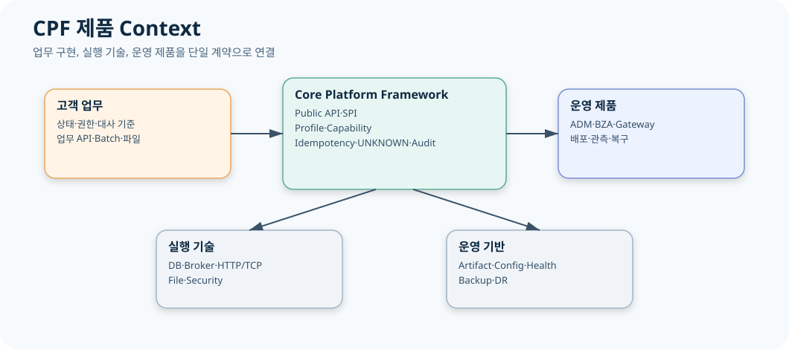
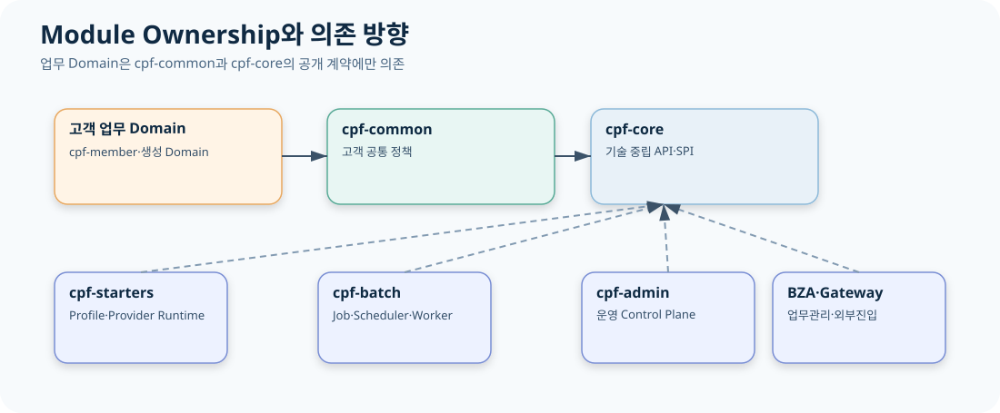
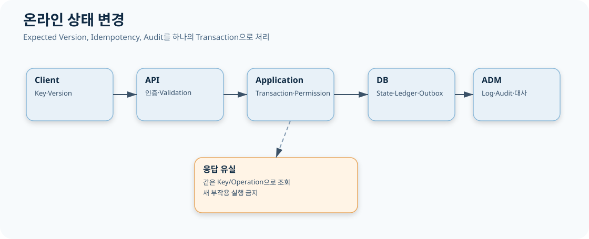
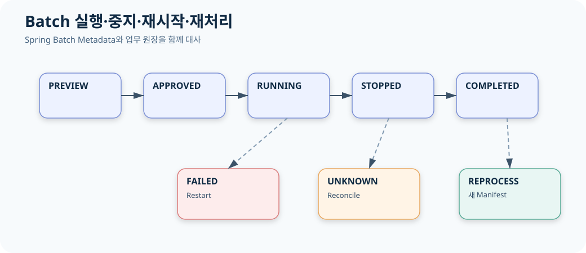
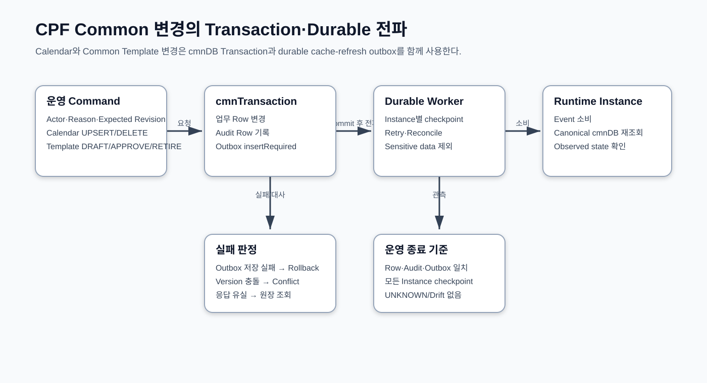
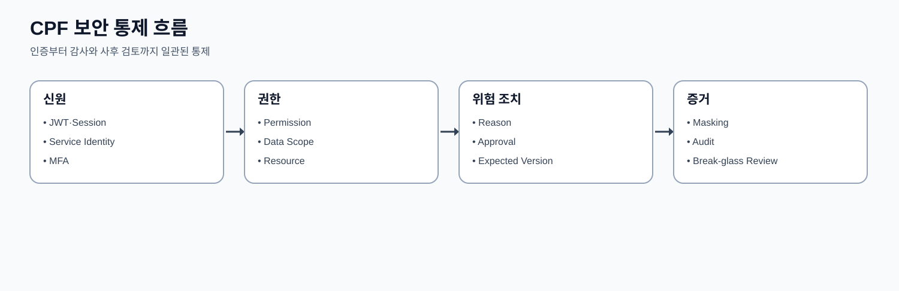

# CPF 아키텍처 설계서

> 문서: `CPF 아키텍처 설계서`
> 기준 Repository: `https://github.com/freeangelsun/202412_01_CPF`
> 기준 Branch: `master`
> 기준 Commit: `6976d2747481b8540b48ddb9ab8f53cfeaa4b888` (`06_02`)
> 기준일: `2026-08-06 Asia/Seoul`

| 항목 | 내용 |
|---|---|
| 주 독자 | 아키텍트·기술책임자·Module Owner·Integration Owner |
| 문서 목적 | CPF의 System Context, Module, Data, Control Plane, Failure, Security, Deployment 구조와 변경 영향을 검토한다. |
| 기능 서술 전제 | CPF 제품 기능은 고객이 사용할 수 있는 상태로 설명한다. 구현 진행률이나 개발 관리 상태는 이 문서의 사용 절차에 섞지 않는다. |
| 사실 우선순위 | 실제 Source·SQL·API·Config·Frontend·Script·Test → 설계·사양 → 본 매뉴얼 |
| 상태 표현 | 업무 상태와 운영 결과는 Source의 상태값을 사용한다. 문서 검토 상태는 `완료`, `부분 구현`, `미구현`, `미검증`, `실패`, `재확인 필요`만 사용한다. |

## 1. 설계 목표와 품질 속성

CPF Architecture는 고객 업무의 장기 변경, 다중 Topology, Provider 교체, 운영·감사, 오류·부분 실패·복구, 3 DB Vendor, Source/API/SQL/Test/문서 일치를 목표로 한다.

| 품질 속성 | 설계 수단 | 판정 Evidence |
|---|---|---|
| 변경 용이성 | Owner Module·Public API/SPI·Adapter | 영향 Matrix·Contract Test |
| 일관성 | Version·Idempotency·Transaction·Outbox/Inbox | Ledger·Audit·Reconciliation |
| 복구 가능성 | UNKNOWN_RESULT·Attempt·Checkpoint·LKG | Runbook·Fault Test |
| 보안 | Identity·Permission·Data Scope·Masking·Approval | Decision·Audit·Negative Test |
| 운영성 | Health·Log·Metric·Trace·ADM·Support Bundle | Dashboard·Incident·교대 기록 |
| 이식성 | Profile·Capability·Provider·3 DB Vendor | Resolved Lock·Vendor Verify |
| 추적성 | Source SHA·Operation ID·Evidence Matrix | Manifest·Coverage·Review |

## 2. System Context

외부 Actor는 고객 사용자, 운영자, 승인자, 외부기관/API Client, Scheduler, 배포/DBA/DR 담당자다. CPF Runtime은 업무 Domain, Common, Starter Provider, Batch, ADM, BZA, Gateway, Tooling으로 구성된다.

외부 시스템은 REST/TCP/파일/Broker/DB/Identity/Secret/Object Store/Monitoring과 연결된다. Trust Boundary는 Browser↔BFF, 외부 Client↔Gateway, Service↔Service, Runtime↔DB/Broker/Secret Provider에 존재한다.

## 3. 논리 Module View

| Module | 책임 | Consumer | 금지 경계 |
|---|---|---|---|
| cpf-core | 기술 중립 Public API·SPI, Context, Error, 식별자, Lock·Cache·Security 계약 | 모든 Runtime과 업무 Domain | Starter·Provider·Admin·Batch를 역참조하지 않는다. |
| cpf-common | 고객 공통 코드·메시지·Calendar·Template·Cache invalidation 조정 | Generated Domain·ADM·BZA·Notification | 공통 기준정보와 durable refresh 원장을 소유한다. |
| cpf-starters | Profile·Capability별 AutoConfiguration과 기술 Provider | 선택 Profile Runtime | Provider SDK Type을 Public API에 노출하지 않는다. |
| cpf-batch | Spring Batch, Scheduler, Center-Cut, Runner, Worker, Agent, Runtime Control | 배치 개발자·운영자·ADM | Job/Execution/Lease/Command 상태를 소유한다. |
| cpf-admin | 플랫폼 운영 Query·Command·승인·감사 Backend와 Frontend | 조회자·운영자·승인자·보안담당자 | Owner DB를 직접 수정하지 않고 Owner Port/API를 사용한다. |
| cpf-biz-admin | 조직·직원·사용자·Role·Permission·Data Scope·결재 | 업무 관리자·업무 Service | 기준일 Snapshot과 Versioned Policy를 소유한다. |
| cpf-gateway | 외부 Trust Boundary, Route, Security, Attempt Ledger, Publish·LKG | 외부 Client·업무 Service·ADM | 외부 Dispatch 이후 결과 불명을 Attempt 원장으로 보존한다. |
| cpf-member | Generator 기준 Golden Domain | 신규 업무 개발자 | 교육 예제와 고객 업무의 기준 구조를 제공한다. |
| cpf-reference | 정상·오류·복구 교육 흐름 | 교육·PoC·회귀 검수 | 제품 기능을 임의 축약하지 않는다. |
| cpf-tools | Generator, BOM, DB Vendor Pack, 환경, 검증, Release Tooling | 개발·배포·DBA·운영 | Source SHA와 Artifact·SQL·문서 Evidence를 연결한다. |

`cpf-core`는 기술 중립 계약을 소유하고 `cpf-common`은 고객 공통 기준정보와 정책을 소유한다. Starter는 SPI 구현과 AutoConfiguration을 제공한다. Admin/BZA/Gateway/Batch는 별도 Control Plane을 제공하지만 업무 State Owner를 대체하지 않는다.

### 3.1. `cpf-core`

| 관점 | 내용 |
|---|---|
| 소유 책임 | 기술 중립 Public API·SPI, Context, Error, 식별자, Lock·Cache·Security 계약 |
| 실제 Consumer | 모든 Runtime과 업무 Domain |
| 의존 경계 | Starter·Provider·Admin·Batch를 역참조하지 않는다. |
| 변경 시 확인 | Public API/SPI·DTO/Schema·DB/Message/Config·Generated Client·Test·문서 |
| 실패 시 복구 | Owner 원장과 Consumer 상태를 분리해 대사하고 계약 Version을 기준으로 복구 |

### 3.2. `cpf-common`

| 관점 | 내용 |
|---|---|
| 소유 책임 | 고객 공통 코드·메시지·Calendar·Template·Cache invalidation 조정 |
| 실제 Consumer | Generated Domain·ADM·BZA·Notification |
| 의존 경계 | 공통 기준정보와 durable refresh 원장을 소유한다. |
| 변경 시 확인 | Public API/SPI·DTO/Schema·DB/Message/Config·Generated Client·Test·문서 |
| 실패 시 복구 | Owner 원장과 Consumer 상태를 분리해 대사하고 계약 Version을 기준으로 복구 |

### 3.3. `cpf-starters`

| 관점 | 내용 |
|---|---|
| 소유 책임 | Profile·Capability별 AutoConfiguration과 기술 Provider |
| 실제 Consumer | 선택 Profile Runtime |
| 의존 경계 | Provider SDK Type을 Public API에 노출하지 않는다. |
| 변경 시 확인 | Public API/SPI·DTO/Schema·DB/Message/Config·Generated Client·Test·문서 |
| 실패 시 복구 | Owner 원장과 Consumer 상태를 분리해 대사하고 계약 Version을 기준으로 복구 |

### 3.4. `cpf-batch`

| 관점 | 내용 |
|---|---|
| 소유 책임 | Spring Batch, Scheduler, Center-Cut, Runner, Worker, Agent, Runtime Control |
| 실제 Consumer | 배치 개발자·운영자·ADM |
| 의존 경계 | Job/Execution/Lease/Command 상태를 소유한다. |
| 변경 시 확인 | Public API/SPI·DTO/Schema·DB/Message/Config·Generated Client·Test·문서 |
| 실패 시 복구 | Owner 원장과 Consumer 상태를 분리해 대사하고 계약 Version을 기준으로 복구 |

### 3.5. `cpf-admin`

| 관점 | 내용 |
|---|---|
| 소유 책임 | 플랫폼 운영 Query·Command·승인·감사 Backend와 Frontend |
| 실제 Consumer | 조회자·운영자·승인자·보안담당자 |
| 의존 경계 | Owner DB를 직접 수정하지 않고 Owner Port/API를 사용한다. |
| 변경 시 확인 | Public API/SPI·DTO/Schema·DB/Message/Config·Generated Client·Test·문서 |
| 실패 시 복구 | Owner 원장과 Consumer 상태를 분리해 대사하고 계약 Version을 기준으로 복구 |

### 3.6. `cpf-biz-admin`

| 관점 | 내용 |
|---|---|
| 소유 책임 | 조직·직원·사용자·Role·Permission·Data Scope·결재 |
| 실제 Consumer | 업무 관리자·업무 Service |
| 의존 경계 | 기준일 Snapshot과 Versioned Policy를 소유한다. |
| 변경 시 확인 | Public API/SPI·DTO/Schema·DB/Message/Config·Generated Client·Test·문서 |
| 실패 시 복구 | Owner 원장과 Consumer 상태를 분리해 대사하고 계약 Version을 기준으로 복구 |

### 3.7. `cpf-gateway`

| 관점 | 내용 |
|---|---|
| 소유 책임 | 외부 Trust Boundary, Route, Security, Attempt Ledger, Publish·LKG |
| 실제 Consumer | 외부 Client·업무 Service·ADM |
| 의존 경계 | 외부 Dispatch 이후 결과 불명을 Attempt 원장으로 보존한다. |
| 변경 시 확인 | Public API/SPI·DTO/Schema·DB/Message/Config·Generated Client·Test·문서 |
| 실패 시 복구 | Owner 원장과 Consumer 상태를 분리해 대사하고 계약 Version을 기준으로 복구 |

### 3.8. `cpf-member`

| 관점 | 내용 |
|---|---|
| 소유 책임 | Generator 기준 Golden Domain |
| 실제 Consumer | 신규 업무 개발자 |
| 의존 경계 | 교육 예제와 고객 업무의 기준 구조를 제공한다. |
| 변경 시 확인 | Public API/SPI·DTO/Schema·DB/Message/Config·Generated Client·Test·문서 |
| 실패 시 복구 | Owner 원장과 Consumer 상태를 분리해 대사하고 계약 Version을 기준으로 복구 |

### 3.9. `cpf-reference`

| 관점 | 내용 |
|---|---|
| 소유 책임 | 정상·오류·복구 교육 흐름 |
| 실제 Consumer | 교육·PoC·회귀 검수 |
| 의존 경계 | 제품 기능을 임의 축약하지 않는다. |
| 변경 시 확인 | Public API/SPI·DTO/Schema·DB/Message/Config·Generated Client·Test·문서 |
| 실패 시 복구 | Owner 원장과 Consumer 상태를 분리해 대사하고 계약 Version을 기준으로 복구 |

### 3.10. `cpf-tools`

| 관점 | 내용 |
|---|---|
| 소유 책임 | Generator, BOM, DB Vendor Pack, 환경, 검증, Release Tooling |
| 실제 Consumer | 개발·배포·DBA·운영 |
| 의존 경계 | Source SHA와 Artifact·SQL·문서 Evidence를 연결한다. |
| 변경 시 확인 | Public API/SPI·DTO/Schema·DB/Message/Config·Generated Client·Test·문서 |
| 실패 시 복구 | Owner 원장과 Consumer 상태를 분리해 대사하고 계약 Version을 기준으로 복구 |

## 4. 의존 방향과 Public Surface

- Public API: 고객 업무가 직접 소비하는 안정 계약.
- SPI: Provider가 구현하는 확장 계약.
- Internal: Module 내부 구현, Generated/SDK Type, Store.
- Owner Port: ADM/BZA/Batch/Gateway가 업무 상태를 조회·변경하는 공개 경계.
- Generated Client: OpenAPI Source에서 생성된 Remote Adapter 경계.

Core가 Starter·Admin·Batch·업무 Module을 참조하지 않는다. 업무 Domain끼리 Persistence를 직접 공유하지 않는다.

## 5. Profile·Capability View

| Profile | 결과 | Artifact | 선택 |
|---|---|---|---|
| minimal-domain | 최소 업무 Domain과 내부 Service | cpf-starter-profile-minimal-domain | UI·외부 API 없이 Domain부터 시작할 때 |
| web-api | REST API·Validation·OpenAPI | cpf-starter-profile-web-api | 외부/내부 HTTP API를 제공할 때 |
| secure-api | 인증·인가·Audit가 필요한 API | cpf-starter-profile-secure-api | 사용자 또는 서비스 권한이 필요한 업무 |
| browser-bff | 브라우저 Session·CSRF·BFF | cpf-starter-profile-browser-bff | Browser 중심 화면을 제공할 때 |
| event-service | Broker Producer·Consumer·Outbox/Inbox | cpf-starter-profile-event-service | 비동기 이벤트 업무 |
| batch-service | Spring Batch·Scheduler·Worker | cpf-starter-profile-batch-service | 정기·대량·분산 처리 |

| Capability | 기술 선택 | 업무 결과 |
|---|---|---|
| data | JDBC·MyBatis·Caffeine·Valkey | 업무 저장·조회·Cache |
| messaging | Kafka·RabbitMQ·JMS·IBM MQ·Outbox/Inbox/DLQ | 비동기·대외 메시지 |
| integration | HTTP·Resilience·TCP·Fixed-length·ISO8583 | 외부 시스템·전문 연계 |
| file | Attachment·Archive·Tabular·SFTP | 첨부·대량 파일·기관 파일 |
| notification | Email·SMS SPI·Receipt·Retry | 업무 알림 |
| security | Resource Server·Session·Service Identity·Secret | 사용자·서비스 인증과 Key |
| platform-operations | Observability·Runtime Control·Feature Flag | 운영·변경·관측 |

### 5.1 선택면의 Architecture 의미

| 선택 | 변경되는 것 | 유지되는 것 | 주요 위험 |
|---|---|---|---|
| Profile | Runtime 기본 Capability 집합·Entry Point | Domain Port·DTO·Error | 불필요 Provider 포함 |
| Capability | Messaging/File/Cache/Integration 기술 | 업무 계약·State Owner | Provider 중복·빠진 Migration |
| Provider | SDK·Connection·Dialect·AutoConfiguration | Public API/SPI | Vendor Type 누출 |
| Topology | Local/Remote Adapter·Timeout·Deployment | Owner Port·상태 의미 | Version skew·응답 유실 |
| DB Vendor | SQL Resource·Type·Migration | Canonical Model·Query 결과 | Vendor 편향 |

Resolved Starter Lock은 선택 결과를 재현하는 Release Evidence다. Build와 Runtime이 다른 선택면을 사용하지 않게 Manifest와 함께 검증한다.

## 6. Topology View

| Topology | Data Plane | Control Plane | 일관성·복구 책임 |
|---|---|---|---|
| Modular Monolith | 동일 JVM 업무 호출 | ADM/BZA Local Adapter | 공유 Transaction·Local Failure |
| Microservice | Remote API/Broker | ADM Remote Adapter·Gateway | Timeout·Service Identity·UNKNOWN |
| External WAS | WAR/Servlet | 배포·Health Tooling | Container Lifecycle |
| Batch | Runner/Worker | Control/Scheduler/Agent/ADM | Metadata·Lease·Checkpoint |
| Gateway | Route Data Plane | Publish/Approval/ADM | Attempt·ACK/NACK·LKG |
| Multi-instance | Instance별 Runtime | Registry·Cache/Event Checkpoint | Drift·Fencing·Reconcile |

### 6.1 Modular Monolith

Module별 Application/Persistence Owner는 유지하되 Same-JVM Adapter가 Port를 호출한다. 한 Process 장애를 공유하므로 Thread/Connection Pool·Memory·Startup 의존을 함께 Capacity 계획한다. Module 간 직접 Table 접근은 허용하지 않는다.

### 6.2 Microservice

Remote Adapter가 동일 Port의 DTO/Error 의미를 전송한다. Service Identity·Timeout·Serialization·Version Compatibility·Retry/UNKNOWN이 추가된다. DB와 Deployment는 Service Owner가 독립 소유한다.

### 6.3 Batch Remote Runtime

Control Server가 Definition·Schedule·Command를 소유하고 Runner/Worker/Agent가 실행 Evidence를 반환한다. Broker/Network 단절과 Process 생존을 분리하며 Lease·Fencing으로 중복 Writer를 막는다.

### 6.4 Gateway Edge

외부 인증·SSRF/TLS·Route·Attempt·Publish를 Gateway가 소유한다. 업무 Service는 내부 계약에 집중하고 외부 결과 불명은 Gateway Attempt와 업무 Key로 대사한다.

### 6.5 DR

Site별 Runtime은 같은 Artifact/Config Contract를 사용한다. DB/Object/Broker 복제 상태와 Writer Lease를 확인한 뒤 Traffic/Scheduler/Gateway Writer를 전환하고 Failback 때 양쪽 원장을 대사한다.

## 7. 온라인 Transaction View

상태 변경은 인증·권한→Idempotency→현재 상태/Version→Domain 전이→업무 Row/History/Audit/Outbox→Commit→응답 순서다. DB Commit 후 응답 유실은 같은 Idempotency Key로 결과를 조회한다. 외부 Write가 포함되면 Attempt Ledger와 Target 대사를 추가한다.

### 7.1 상태 변경 Sequence

1. Client/Gateway가 Transaction ID와 Idempotency Key를 전달한다.
2. Controller가 DTO 형식·길이·교차 Field를 검증한다.
3. Security가 Identity·Permission·Data Scope를 평가한다.
4. Application Service가 현재 상태·Expected Version·업무 규칙을 확인한다.
5. Persistence가 업무 Row·History·Audit·Outbox/Ledger를 Commit한다.
6. 응답은 상태·Version·Operation ID를 반환한다.
7. 응답 유실 시 Consumer는 같은 Idempotency Key/Operation을 조회한다.
8. 비동기 Consumer와 ADM은 같은 Transaction/Operation 식별자를 사용한다.

### 7.2 Transaction 경계 원칙

같은 DB의 업무 Row·Audit·Outbox는 하나의 Transaction에 참여한다. 외부기관·Broker·다른 DB를 Local Transaction으로 가정하지 않고 Attempt/Ledger와 Reconciliation으로 일관성을 맞춘다.

## 8. 비동기 Messaging View

Producer 업무 Transaction은 Outbox까지 Commit한다. Publisher는 Outbox Attempt로 Broker 저장을 확인한다. Consumer는 Inbox/Attempt를 확보하고 업무 처리 후 ACK한다. Broker redelivery와 Process Kill은 같은 Message ID/Business Key로 중복을 막는다. Poison은 DLQ로 격리하고 승인 Replay한다.

Kafka·RabbitMQ·JMS·IBM MQ Provider가 달라도 Event Schema·Idempotency·Inbox·Audit 의미는 같다.

### 8.1 Message 흐름

`Business Commit → Outbox → Publisher Attempt → Broker → Consumer Delivery → Inbox/Attempt → Consumer Business Commit → ACK`

- Event Key와 Schema Version은 Producer/Consumer 계약이다.
- ACK는 Consumer 업무 결과와 Inbox 저장 뒤에 수행한다.
- Redelivery는 Message ID/Request Hash로 Replay한다.
- Poison은 DLQ로 격리하고 정상 흐름을 막지 않는다.
- Replay는 원본 Message를 수정하지 않고 후속 Attempt를 만든다.
- Broker별 Confirm/Ack 차이는 Adapter가 소유한다.

### 8.2 Failure Matrix

| 실패 | 확정된 것 | 상태/복구 |
|---|---|---|
| 업무 Commit 전 | 부작용 없음 | FAILED, 새 요청 가능 |
| Outbox Commit 후 Publish 전 | 업무 성공 | Publisher Retry |
| Broker 수신 후 Producer 응답 유실 | Broker 여부 불명 | Event Key/Outbox Attempt 대사 |
| Consumer Commit 전 종료 | ACK 없음 | Redelivery/Inbox Replay |
| Consumer Commit 후 ACK 전 종료 | 업무 성공 | Inbox 결과 Replay 후 ACK |
| Poison | 해당 Message 실패 | DLQ·원인 수정·승인 Replay |

## 9. Batch Architecture View

Job Definition/Pack → Scheduler Dispatch → JobInstance/Execution → Step/Partition → Runner/Worker → Checkpoint/Result → Reconciliation 흐름이다. Control Plane은 Runtime Command와 Agent를 통해 Process를 통제하며 Data Plane의 업무 상태를 추정하지 않는다.

Center-Cut은 Preview Hash와 대상 Snapshot을 사용하고 FAILED/UNKNOWN은 Execution 단위로 조치한다.

### 9.1 Control Plane과 Data Plane

Control Plane은 Definition·Schedule·Approval·Command·Metadata·Recovery를 소유한다. Data Plane은 Runner·Worker가 실제 Reader/Processor/Writer와 외부 부작용을 실행한다. Host Agent는 Process 상태와 Command Evidence를 제공한다.

### 9.2 상태 소유

| 상태 | Owner |
|---|---|
| Job/Definition Version | Batch Artifact/Definition Owner |
| JobInstance/Execution/Step | Spring Batch Metadata |
| Schedule/Fire/Lease | Scheduler Owner |
| Partition/Claim/Fencing | Partition Owner |
| Runtime Command/Target Attempt | Control Server |
| Process Observed State | Host Agent/Service Manager |
| Center-Cut Target/Result | Center-Cut Owner |
| 업무 결과 | 업무 Domain Owner |

복구는 상태 Owner를 무시하고 Metadata Row를 직접 바꾸지 않는다.

## 10. Gateway Architecture View

외부 Request는 Listener→Authentication/Authorization→HMAC/Nonce/SSRF/TLS→Predicate/Rewrite→Resilience→Target Attempt→Response Mapping을 거친다. Route Definition과 Runtime Applied State를 분리하고 Publish는 Validate·Approval·Target ACK/NACK·LKG를 사용한다.

### 10.1 Gateway 내부 책임

- Definition Plane: Server Group·Binding·Security·Resilience·Version.
- Validation Plane: Conflict·Reference·SSRF·TLS·HMAC·Connection Test.
- Runtime Plane: Route Match·Authentication·Filter/Rewrite·Target Dispatch.
- Reliability Plane: Idempotency·Attempt·UNKNOWN·Circuit/Bulkhead.
- Distribution Plane: Approval·Publish·Target ACK/NACK·Applied Checksum·LKG.
- Operations Plane: Snapshot·Event·Transaction·Log Policy·Drift/Reconciliation.

Gateway가 업무 상태를 소유하지는 않는다. 외부 Attempt와 Target 결과를 기록해 업무 Owner가 결과를 판정할 수 있게 한다.

## 11. ADM/BZA Control Plane

ADM은 플랫폼·Batch·Gateway·업무 Owner Query/Command를 Generated Client/Adapter로 호출한다. BZA는 Directory·Permission·Approval의 업무 관리 원장을 제공한다.

Control Plane 공통 규칙:

1. Owner DB 직접 변경 금지.
2. Query와 Command 분리.
3. Command는 Reason·Version·Idempotency·Approval.
4. 응답 유실은 Operation 조회.
5. Partial은 Target별 표시.
6. Before/After·Actor·Approval Audit.
7. Browser 상태는 Owner 상태의 View다.

## 12. Data Ownership과 Transaction

| 상태 | Owner | 원자적 범위 | 외부 일관성 |
|---|---|---|---|
| 업무 Entity | 업무 Domain | Row·History·Audit·Outbox | Event/Remote Attempt |
| Common Calendar/Template | cpf-common | 기준정보·Audit·durable refresh | Instance checkpoint |
| Cache Invalidation | cpf-common/cache | Event Ledger·Checkpoint | Provider apply·Fast signal |
| Batch Metadata | cpf-batch | Job/Step/Checkpoint | 업무 원장 대사 |
| Approval | ADM/BZA Owner | Request·Decision·History | Target execution |
| Gateway | cpf-gateway | Binding/Policy/Publish/Attempt | Target Applied State |

### 12.1 주요 데이터 Owner Matrix

| 데이터 | Owner | Write Consumer | Read Consumer | 일관성/복구 |
|---|---|---|---|---|
| 업무 Entity | 업무 Domain | Application Service | API·Batch·ADM | Version·History·Audit |
| Idempotency | 요청 Owner | Write Command | Consumer·Recovery | Key+Hash·Result Replay |
| Outbox/Inbox | Messaging Owner | 업무/Consumer Transaction | Broker 운영·ADM | Attempt·DLQ·Replay |
| Batch Metadata | Batch Engine | Repository/Control | ADM·개발자 | Restart·Ghost Recovery |
| BZA Directory/Policy | cpf-biz-admin | BZA Service | 업무·ADM | 기준일·Version·Snapshot |
| Gateway Definition/Attempt | cpf-gateway | Gateway Admin/Runtime | ADM·업무 Recovery | Target별 Apply·LKG |
| Common Calendar/Template | cpf-common | Common Service | 업무·Batch·Notification | CAS·durable refresh |
| Cache Invalidation | cpf-common/cache | 요청 Owner | Cache Provider·ADM | Event·Checkpoint·Reconcile |

Cross-owner Join/Write 대신 Port, Read Model, Event, API를 선택한다.

## 13. 동시성·Idempotency·Lease

- Entity Update: Optimistic Version과 상태 조건.
- Request Duplicate: Idempotency Key + Request Hash + Result Snapshot.
- Worker Claim: Lease Expiry + Fencing Token.
- Scheduler HA: Schedule/Fire Time Lease와 Dispatch Ledger.
- Template/Policy: Version과 Revision CAS.
- Gateway/Runtime Multi-target: Target Snapshot과 Expected Version.
- Reconcile: 원본 Attempt를 보존하고 결정 Evidence를 추가한다.

## 14. Durable Cache Invalidation

Cache 변경은 DB Ledger를 정본으로 한다. `CpfCacheInvalidationCoordinator`는 Event를 append하고 local Key/Namespace Evict를 적용한 뒤 Consumer Checkpoint를 전진시킨다. Fast Signal은 best effort이며 실패해도 Ledger와 `reconcileNow`가 복구한다.

## 15. Common Template·Calendar

Template은 `DRAFT → APPROVED → RETIRED`, Revision CAS, Audit, `commonTemplate` durable refresh를 사용한다. Calendar는 Institution/Date/Day Type/Version과 Audit·refresh outbox를 같은 Transaction에 둔다. 조회 Consumer는 canonical DB와 checkpoint를 기준으로 한다.

## 16. Failure Domain과 상태 분류

| 상태 | 의미 | Architecture 조치 |
|---|---|---|
| REQUESTED | 요청이 수락됐지만 외부 부작용은 시작 전 | Worker/Scheduler/Owner가 실행 |
| RUNNING | 실행 중이며 Heartbeat 또는 진행률이 존재 | Progress·Lease·Attempt 관측 |
| SUCCEEDED | 업무·Target 결과가 명시적으로 성공 | 종료·후속 업무 진행 |
| FAILED | 외부 부작용 전 결정적 실패 또는 명시 실패 | 입력·정책·환경 수정 후 새 실행 |
| UNKNOWN_RESULT | 외부 부작용 이후 결과를 확정할 Evidence가 부족 | Target/Owner 원장 대사 |
| PARTIAL | 여러 Target 또는 Item 중 일부만 성공 | 성공·실패 대상을 분리해 복구 |
| ROLLED_BACK | 모든 대상이 이전 상태로 복귀 | 종료 또는 수정 후 새 요청 |
| PARTIALLY_ROLLED_BACK | 일부 Target만 복귀 | 남은 Target별 대사·보상 |

Failure Domain은 Client, Gateway, Network, Owner Runtime, DB, Broker, External Target, Agent/Process, Observability로 구분한다. Error Code는 어느 Domain에서 무엇이 확정됐는지 표현한다.

### 16.1 Quality Attribute Scenario

| Scenario | Stimulus | 기대 Architecture Response | Evidence |
|---|---|---|---|
| 중복 Write | 같은 Key 재호출 | 같은 Hash는 Replay, 다른 Hash는 Conflict | Ledger·Result Snapshot |
| Response Loss | 외부 Dispatch 후 연결 종료 | UNKNOWN 보존·Target 대사 | Attempt·Target 조회·Decision |
| Worker Kill | Partition 처리 중 Process 종료 | Lease 만료·상위 Token Reclaim | Heartbeat·Lease·Fencing |
| Cache Signal Loss | Fast Channel Publish 실패 | Durable Ledger로 Reconcile | Event·Checkpoint·Lag |
| Config 부분 적용 | Target 일부 NACK | 성공/실패 Target 분리·LKG | Target Applied State |
| DB Migration 실패 | DDL/Data 변환 중 중단 | Rollback/Forward Recovery·Verify | Migration/Audit/Checksum |
| DR 전환 | Primary Site 장애 | 단일 Writer·복구점·Failback 대사 | Lease·Replication·업무 합계 |
| Secret 만료 | 인증/서명 실패 | Versioned Rotation·Grace·Consumer Probe | Provider/Audit/Target Test |

## 17. Security Architecture

Identity는 사용자·서비스·운영자·Agent로 분리한다. Authorization은 Route/Menu/Button/API/Data Scope에서 적용한다. MFA TOTP는 6자리·30초·±1 Window·constant-time 비교를 사용한다. Secret은 Provider Reference와 Rotation을 사용한다. Gateway는 HMAC·Audience·Body Hash·Nonce·SSRF·TLS를 Trust Boundary에서 적용한다.

## 18. Observability Architecture

모든 동기·비동기·Batch·Gateway 흐름은 Transaction ID, Trace ID, Business ID, Operation ID, Attempt, Target을 연결한다. Log는 상세, Metric은 집계, Trace는 Segment, Audit는 변경 근거, Incident는 운영 Workflow를 소유한다. Support Bundle은 허용된 Evidence만 Masking하여 수집한다.

## 19. Deployment·Release·DR View

Artifact Manifest는 Source SHA·Version·Checksum·SBOM·DB Pack·Config Template·Frontend Client를 연결한다. Deployment는 Rolling/Blue-Green/Canary와 LKG Rollback을 지원한다. DR은 DB·Object·Config·Secret·Artifact 복구점과 Scheduler/Gateway Writer 단일 Active를 보장한다.

### 19.1 Release Unit

Release Unit은 Source SHA, Artifact/BOM, Frontend, DB Vendor Pack, Config Template, Secret/Certificate Reference, OpenAPI/Generated Client, SBOM, Test Evidence, Runbook, Rollback/LKG를 하나의 Manifest로 연결한다.

### 19.2 Deployment Compatibility

- Application N과 DB N/N-1 호환 범위를 명시한다.
- Producer/Consumer Schema Version과 배포 순서를 정한다.
- Blue/Green 혼재 중 Idempotency·Session·Cache·Scheduler Owner를 확인한다.
- Gateway/Batch Target은 Applied Version을 Target별로 기록한다.
- Rollback 뒤에도 신규 Data를 구 Version이 읽을 수 있는지 확인한다.

### 19.3 DR 복구 순서

Infrastructure→Secret/Certificate→DB/Object Restore/Replication→Broker→Common/Owner Service→Gateway/ADM/BZA→Batch Scheduler/Worker→Traffic 순서로 복구하고 Transaction·Message·File·Batch·Gateway·Audit를 대사한다.

## 20. Cross-session 영향도

Owner Module 파일만 수정해도 상위 호출자, 하위 Provider, Public API/SPI, DTO/Schema, DB/Message/Config, OpenAPI/Generated Client, Frontend·Batch·Scheduler·Worker·ADM/BZA, Sample/EDU, 다른 Connected Functional Slice를 검토한다.

타 Owner 변경이 필요하면 exact path, Root Cause, 영향 Requirement/Scenario, 계약 변화, 필요한 수정/Test/완료 기준을 Integration Owner에게 요청한다.

## 21. Architecture Decision Record

ADR은 Context, Decision, Alternatives, Consequences, Owner, Consumers, Data/Failure/Security, Migration, Rollback, Test, Evidence, 기준 SHA를 포함한다.

주요 ADR 주제:

- Local/Remote 동일 Port.
- Outbox/Inbox와 UNKNOWN_RESULT.
- 6 Profile·7 Capability 선택면.
- Center-Cut Execution-scope 조치.
- Durable Cache Invalidation.
- Versioned Template/Approval Policy.
- Gateway LKG Publish.
- 3 DB Vendor 동등성.

## 22. Architecture Review Checklist

1. 고객 업무 결과와 Owner가 명확한가?
2. Public API/SPI/Internal 경계가 지켜지는가?
3. 실제 Consumer가 존재하는가?
4. Local/Remote·Modular/MSA 책임이 분리되는가?
5. Transaction과 외부 일관성이 구분되는가?
6. Idempotency·Version·Lease·Fencing이 상태에 맞는가?
7. UNKNOWN/PARTIAL/ROLLBACK이 복구 가능한가?
8. Security·Permission·Masking·Approval·Audit가 연결되는가?
9. DB Vendor·Artifact·Deployment·DR가 양방향 호환되는가?
10. Source·SQL·API·Config·Frontend·Test·문서 Evidence가 같은 SHA인가?

## 23. Integration Closure Architecture

### 23.1 Owner와 Consumer

| 계약 | Owner | Consumer | State Owner |
|---|---|---|---|
| Time·Deadline | `cpf-core` API, `cpf-common` Provider | Online·Batch·ADM·BZA·Gateway | Host/Provider time source |
| Data Quality | `cpf-core` API, `cpf-common` Implementation | File·Integration·ADM·업무 Domain | Rule·Quarantine DB |
| Field Encryption | `cpf-core` API, `cpf-common` Crypto Provider | 개인정보 업무 Domain·BZA | Encryption Ledger·KMS |
| Webhook | `cpf-core` API, integration/webhook Starter | 외부 Callback Consumer·ADM | Endpoint·Delivery Ledger |

### 23.2 실패 경계

Time unhealthy는 시간 의존 Write를 Fail-closed한다. Data Quality ERROR/CRITICAL은 업무 원장 반영 전에 Quarantine한다. 암호화 정책 위반은 평문 저장으로 우회하지 않는다. Webhook Dispatch 이후 결과 불명은 UNKNOWN으로 보존하고 Target Event ID 대사를 거친다.

### 23.3 DB와 Control Plane

V102는 Field Encryption, Data Quality, Webhook, Audit 정본을 3 Vendor에 동일 의미로 제공한다. ADM은 Owner DB를 직접 변경하지 않고 `AdmIntegrationClosureController`를 통해 Query·Command를 수행한다. V103은 Batch UNKNOWN 조치의 요청자·승인자 분리와 Idempotency를 DB 제약으로 보강한다.
