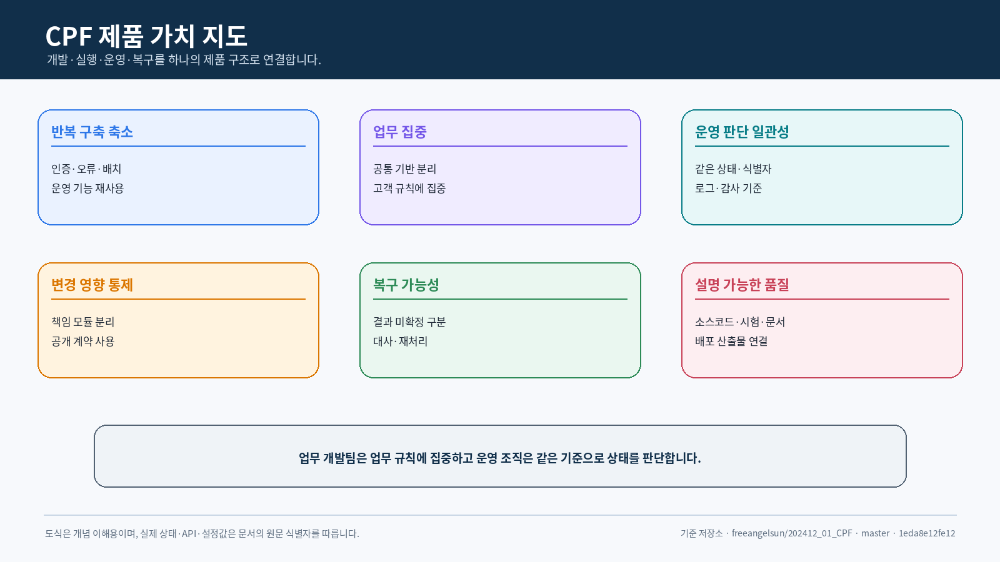
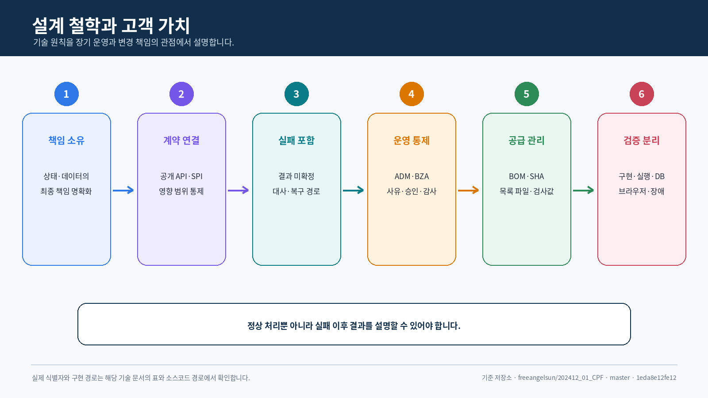
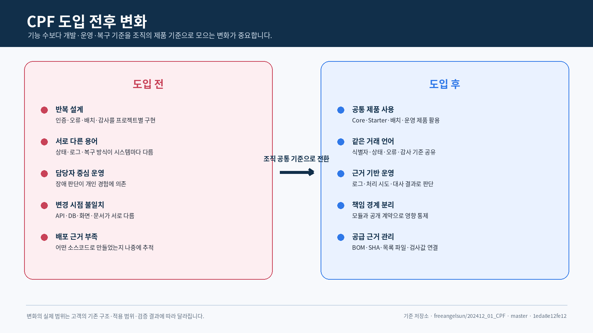
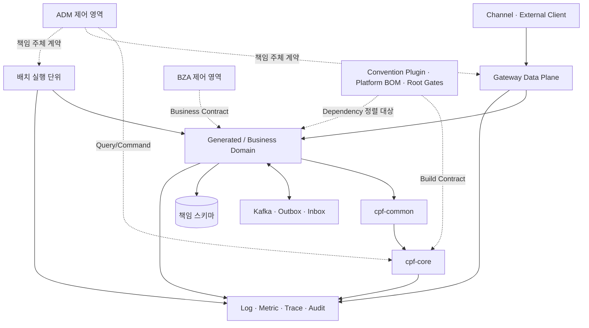
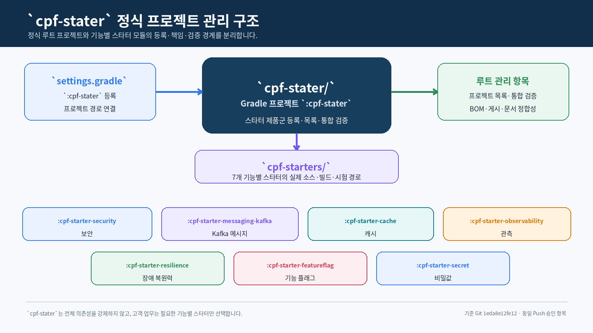
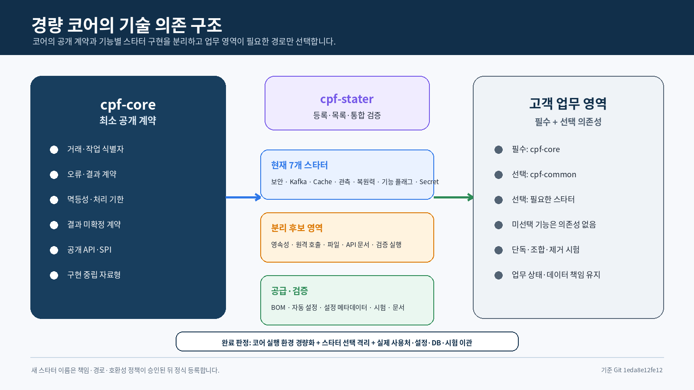
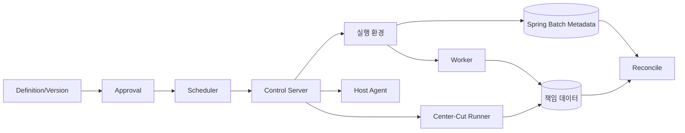

<div align="center">

# 코어 플랫폼 프레임워크(Core Platform Framework)
## 아키텍처설계서

**업무 시스템을 오래 확장하고 운영하기 위해 책임 소유·계약·통제·복구를 제품 구조로 설계합니다.**

`책임 소유 · 배치 구조 · 데이터 흐름 · 빌드 통제 · 복구`

</div>

<p align="center">
  
</p>

---
## 문서 안내

| 항목 | 내용 |
|---|---|
| 목적 | CPF의 제품 경계, 모듈 책임, 의존 방향, 실행 흐름, 빌드·배포·복구 구조 정의 |
| 주요 독자 | 고객 CIO·CTO·아키텍트, 기술 의사결정자, 프레임워크 개발자, 빌드·배포·운영 담당자 |
| 포함 범위 | 코어, 공통, `cpf-stater`, 선택 기능 모듈, 업무 영역, ADM, BZA, 게이트웨이, 배치, DB, 화면, 빌드 |
| 제외 범위 | 화면별 조작 절차, 고객 업무별 EDU 명령, 실제 환경별 계정·비밀값 |
| 사실 기준 | `settings.gradle`, `build.gradle`, 기술 구성/플랫폼 설정값, 모듈 소스코드 |


## 고객 관점의 아키텍처 요약

### 먼저 이해할 핵심

아키텍처는 기술 이름을 나열하는 문서가 아니라 **시스템의 각 부분이 무엇을 책임하고,
어떻게 연결되며, 문제가 생겼을 때 어디에서 결과를 확인하고 복구할지 정하는 설계**입니다.

CPF 아키텍처의 핵심은 다음 세 문장으로 설명할 수 있습니다.

1. 고객의 각 업무는 자기 상태와 데이터를 책임지는 독립된 영역으로 나눕니다.
2. 서로 다른 업무와 제품은 직접 내부 구현을 건드리지 않고 약속된 API와 메시지로 연결합니다.
3. 정상 처리뿐 아니라 시간초과·응답 유실·부분 실패 이후의 확인과 복구 경로를 함께 설계합니다.

### 제품 전체 구조

CPF는 고객 업무를 중심에 두고 접근, 실행, 비동기·배치 처리, 운영과 데이터 관리 기능을 둘러싼
구조입니다.

<p align="center">
  
</p>

| 영역 | 쉬운 설명 | 아키텍처 책임 |
|---|---|---|
| 고객 채널과 게이트웨이 | 고객·직원·외부기관의 요청이 들어오는 출입구 | 인증·권한·경로·시간초과·요청 제한 |
| 업무 영역 | 고객 고유의 회원·계약·심사·정산 규칙 | 상태·데이터·업무 명령의 최종 책임 |
| 코어·공통·선택 기능 모듈 | 여러 업무가 함께 사용하는 공통 기반 | 거래·오류·보안·메시지·관측 계약 |
| Kafka·파일·배치 | 즉시 처리하지 않거나 많은 데이터를 처리하는 방식 | 중복·순서·재시작·재처리·대사 |
| ADM·BZA | 운영과 업무 관리 화면 | 조회·승인·위험 조치·권한·감사 |
| DB·빌드·검증 증거 | 데이터를 변경하고 제품을 공급·검증하는 기반 | DB 변경·배포 산출물·버전·시험 결과 |

### 설계 철학과 고객 가치

<p align="center">
  
</p>

| 설계 철학 | 쉬운 의미 | 고객 조직에 필요한 이유 |
|---|---|---|
| 책임 소유자(책임 주체)를 하나로 둠 | 같은 상태를 여러 시스템이 제각각 바꾸지 않음 | 장애와 변경 시 최종 책임 위치가 명확해짐 |
| 약속된 계약으로 연결 | 다른 모듈의 내부 소스코드나 DB를 직접 사용하지 않음 | 배포 형태나 구현이 바뀌어도 영향 범위를 통제 |
| 실패와 복구도 설계 | 응답이 없거나 일부만 처리된 상태를 별도로 관리 | 잘못된 재실행과 중복 처리를 방지 |
| 운영 화면도 책임 주체 계약 사용 | ADM·BZA가 업무 DB를 임의로 수정하지 않음 | 권한·사유·승인·감사와 실제 조치 결과를 연결 |
| 빌드·배포 산출물도 제품 구조에 포함 | 어떤 소스코드로 무엇을 배포했는지 기록 | 고객 환경의 설치 결과와 버전을 설명 |
| 구현과 검증 상태를 분리 | 소스코드가 있다는 사실과 실행 성공을 구분 | 기술 검토와 인수 단계의 오해를 줄임 |

### 업무 처리 아키텍처

<p align="center">
  
</p>

정상 흐름에서는 요청 접수, 접근 확인, 업무 처리, 후속 연계, 운영 확인과 결과 확정이 이어집니다.
문제가 생기면 무조건 처음부터 다시 실행하지 않습니다.

- 입력이나 권한이 잘못되면 업무 처리 전에 거절합니다.
- 동시에 같은 데이터를 수정하면 버전과 잠금 기준으로 충돌을 판정합니다.
- 같은 요청이 반복되면 멱등성 키와 요청 해시로 중복 실행을 통제합니다.
- 외부기관에 요청을 보낸 뒤 응답이 없으면 실제 처리 여부를 조회합니다.
- 배치가 중단되면 저장된 진행 지점과 업무 합계를 확인한 뒤 재시작합니다.
- 일부 대상만 적용됐으면 성공·실패·미확정 대상을 분리하고 대사합니다.

### 제품별 책임 경계

| 책임 | CPF | 고객 업무 |
|---|---|---|
| 공통 기술 계약 | 거래 식별자, 오류, 시간초과, 중복 방지, 추적 | 업무별 오류 코드와 상태 의미 |
| 데이터 | 스키마·DB 변경·복구 규칙 | 업무 Entity·열·불변식·보존 정책 |
| 보안 | 인증·권한·마스킹·감사 적용 구조 | 사용자 역할과 업무 데이터 범위 |
| 운영 | ADM·BZA·게이트웨이·배치 Control 기능 | 어떤 조치를 누가 승인하고 수행하는지 |
| 배포 | BOM·플러그인·배포 산출물·목록 파일·검사값 | 배포본 일정, 고객 환경과 인수 기준 |
| 복구 | 재시도·재처리·대사·되돌리기 계약 | 업무 보상과 최종 상태 확정 기준 |

### 배포 형태는 고객 상황에 맞게 선택

CPF는 모든 기능을 반드시 여러 서버로 나누도록 요구하지 않습니다.

- 초기 규모가 작으면 하나의 애플리케이션 안에서 업무 모듈을 실행할 수 있습니다.
- 조직과 장애 격리 요구가 커지면 일부 업무를 별도 서비스로 분리할 수 있습니다.
- 같은 업무 계약을 유지하면서 내부 호출 방식만 로컬 또는 원격로 바꿉니다.
- 외부 API가 필요하면 게이트웨이를 사용하고, 내부 호출을 불필요하게 게이트웨이로 우회하지 않습니다.
- 배치·ADM·BZA는 고객의 업무와 운영 요구에 따라 선택합니다.

### 아키텍처 검토에서 결정할 사항

1. 첫 적용 업무와 그 업무의 상태·데이터 책임 주체
2. 고객의 기존 프레임워크와 CPF 중 어느 기능을 기준으로 사용할지
3. 하나의 애플리케이션과 분리 서비스의 경계
4. 게이트웨이·ADM·BZA·배치의 적용 범위
5. 고객 인증·권한·감사·메시징·관측 도구와의 연결 방식
6. DB 제품과 DB 변경·백업·DR 책임
7. 성능·가용성·보안·장애 검증의 고객 수용 기준

이 결정을 마친 뒤 뒤의 상세 장에서 실제 모듈, 소스코드, API, 배치 구조와 검증 상태를 확인합니다.

## 1. 아키텍처 요약

CPF는 단일 라이브러리가 아니라 업무 기능·운영 통제·배포·검증을 함께 구성하는 프레임워크입니다.

1. 업무 상태와 데이터의 책임 주체를 한 곳으로 정합니다.
2. 외부 실제 사용처가 사용할 공개 API와 제공자가 구현할 SPI를 구분합니다.
3. 로컬·원격·비동기·배치 형태가 바뀌어도 업무 계약과 오류 의미를 유지합니다.
4. 응답 유실과 부분 실패를 상태 원장과 대사 경로로 처리합니다.
5. ADM·BZA·게이트웨이는 책임 주체 DB를 직접 갱신하지 않고 조회문·명령 계약으로 연결합니다.
6. 빌드 플러그인·BOM·배포 산출물 공급 경로도 제품 아키텍처의 일부로 관리합니다.
7. 소스코드·SQL·API·화면·시험·문서·검증 증거가 같은 정확한 SHA를 가리키게 합니다.

| 원칙 | 적용 수단 | 실패 판정 |
|---|---|---|
| 단일 책임 소유 | 책임 주체 모듈·스키마·명령·생명주기 | 동일 상태를 둘 이상의 모듈이 독립 갱신 |
| 계약 중심 연결 | 공개 API·SPI·버전이 있는 메시지 | 내부 자료형 또는 테이블 직접 참조 |
| 배치 구조 동등성 | 로컬·원격 연결 어댑터, 공통 DTO·오류 | 원격 전환 시 업무 소스코드 재작성 |
| 결과 확정 가능성 | 멱등성, 처리 시도, Reconciliation | 시간초과을 성공/실패로 임의 단정 |
| 운영 통제 분리 | 제어 영역, 권한, 승인, 감사 | ADM/BZA가 책임 주체 DB 직접 수정 |
| 빌드 재현성 | 정확한 SHA, 플러그인, BOM, 잠금, 목록 파일 | 로컬 캐시·추정 버전에 의존 |
| 검증 증거 정합성 | 명령·환경·Exit·해시·기준 SHA | 과거 SHA 검증 증거를 현재 성공으로 승계 |
<p align="center">
  
</p>
## 2. 품질속성과 설계 수단

| 품질속성 | 설계 수단 | 검증 질문 |
|---|---|---|
| 확장성 | 루트 생성 업무 영역, 공개 계약, 선택 기능 모듈 격리 | 신규 업무 영역이 코어/내부 수정 없이 추가되는가? |
| 복구성 | 상태 이력 원장, 처리 시도, 대사, 되돌리기/전진 복구 | 처리 종료·응답 유실 후 실제 결과를 확정할 수 있는가? |
| 보안성 | 신뢰 Boundary, 서버 인가, 마스킹, Immutable 감사 | 클라이언트 요청 헤더·권한 밖 데이터·위험 조치를 거부하는가? |
| 운영성 | 상태 점검, 로그·지표·추적, ADM/BZA 조회문·명령 | 동일 식별자로 상태·원인·조치 이력을 찾는가? |
| 호환성 | API/메시지/DB/설정 버전, BOM, 혼합 버전 | Rolling·Canary 구간의 구·신 버전 계약이 정의되는가? |
| 자원 통제 | 처리 기한, Bounded 대기열/Stream, 연결 시간 예산 | 지연·대용량 입력이 전체 처리로 확산되지 않는가? |
| 공급 무결성 | 소스코드 SHA, 목록 파일, 검사값, Signature 수용 기준 | 배포 산출물가 어떤 소스코드·버전에서 생성됐는가? |
| 검증 가능성 | 소스코드 정합성 확인 → 통합 → 실행 환경 → 검증 증거 | 실패 지점과 재실행 범위를 분리할 수 있는가? |

## 3. 전체 시스템 문맥



### 3.1 실행·제어 영역 구분

| 영역 | 책임 | 쓰기 경계 |
|---|---|---|
| 처리 영역 | 외부 요청, 업무 처리, 이벤트, 배치 실행 | 각 업무 책임 주체 스키마 |
| 제어 영역 | 조회, 승인, 운영 명령, 대사, 감사 | 제어 영역 자체 상태와 책임 주체 명령 결과 |
| 빌드 영역 | 버전, 의존성, 플러그인, 배포 산출물, 품질 수용 기준 | 빌드 메타데이터·검증 저장소·배포 산출물 저장소 |
| 검증 증거 영역 | 시험 결과, 해시, 기준 SHA, 환경 정보 | 저장소 밖 실행 검증 증거 또는 정해진 품질 경로 |

## 4. 모듈 책임 소유

### 4.1 루트 프로젝트와 포함 빌드

| 단위 | 경로 | 유형 | 핵심 책임 |
|---|---|---|---|
| `cpf-core` | `cpf-core` | 라이브러리 | 기술 공개 API/SPI, 문맥, 오류, 파일, 메시지 계약 |
| `cpf-common` | `cpf-common` | 라이브러리 | 달력·코드·메시지 등 고객 공통 정책 |
| `cpf-admin` | `cpf-admin` | 웹 실행 환경 | 플랫폼 운영 조회·조치·승인·감사 |
| `cpf-biz-admin` | `cpf-biz-admin` | 웹 실행 환경 | 조직·직원·사용자·권한·결재·첨부·알림 |
| `cpf-gateway` | `cpf-gateway` | 실행형 | 외부 진입, 경로, 신뢰, 복원력, 처리 시도 이력 원장 |
| `cpf-reference` | `cpf-reference` | 참조 실행 환경 | 실제 공개 API 실제 사용처와 복구 예제 |
| `cpf-member` | `cpf-member` | 생성 업무 영역 | 생성기 산출 구조의 표준 생성 참조 |
| `cpf-stater` | `cpf-stater` | 루트 관리 프로젝트 | 스타터 제품군 등록·목록·통합 검증·문서 연결 |
| 7개 선택 기능 모듈 | `cpf-starters/*` | 선택형 라이브러리 | 보안, Kafka, 캐시, 관측, 복원력, 기능 플래그, 비밀값의 실제 구현·시험 |
| 로컬 실행 환경 | `cpf-tools/runtime/*` | 도구 실행 환경 | 로컬 통합 실행·배치 실행 |
| 배치 9개 단위 | `cpf-batch/*` | 계약/처리/시험 | Spring Batch, Control, 일정 실행기, 작업자, 실행기, 에이전트 |
| 공통 빌드 규칙 플러그인 | `cpf-tools/build/gradle-plugin` | 포함 빌드 | `com.cpf.platform-conventions`, Java 25 빌드 계약 |
| 플랫폼 BOM | `cpf-tools/build/platform-bom` | 포함 빌드 | Spring Boot/클라우드 및 CPF 공개 배포 산출물 버전 정렬 |
| 도구 | `cpf-tools` | 스크립트/생성기/DB 패키지 | 생성기, DB 제품별 패키지, 검증, 배포 산출물 승격 |

### 4.1.1 `cpf-stater`의 책임과 기존 스타터 경계

<p align="center">
  
</p>

`cpf-stater`는 기능 구현을 한곳에 합치는 모듈이 아니라, 스타터 제품군이 루트 프로젝트 구조에서
누락되지 않도록 관리하는 정식 프로젝트입니다.

| 책임 구분 | `cpf-stater` | `cpf-starters/*`의 기능별 모듈 |
|---|---|---|
| 프로젝트 등록 | 루트 프로젝트 항목과 제품군 목록 관리 | 각 `:cpf-starter-*` 프로젝트 ID와 실제 경로 |
| 소스코드 책임 | 목록·통합 검증·공급 메타데이터 | 자동 설정, 설정값, 연결 어댑터, 시험 |
| 고객 의존성 | 전체 스타터 의존성 강제 금지 | 고객이 필요한 기능만 선택 |
| 빌드 검증 | 스타터 누락, 중복 등록, 목록·BOM 정합성 확인 | 개별 컴파일·시험·자동 설정 조건 검증 |
| 게시 | 실제 산출물을 선언한 경우에만 게시 흐름 참여 | 개별 JAR·POM·모듈 메타데이터 |
| 데이터 책임 | 기본적으로 스키마·테이블을 소유하지 않음 | DB 자원이 있으면 실제 기능 책임과 DB 변경 경로를 명시 |

현재 기준 커밋의 `settings.gradle`에는 `cpf-stater`가 없으므로, 같은 푸시에서 다음 등록과 실제
프로젝트 소스가 함께 존재해야 합니다.

```groovy
include 'cpf-stater'
project(':cpf-stater').projectDir = file('cpf-stater')
```

위 코드는 목표 등록 계약입니다. 실제 `cpf-stater/build.gradle`의 플러그인·의존성·게시 항목은
같은 커밋의 소스코드를 기준으로 문서와 다시 대조합니다.

### 4.1.2 경량 코어와 선택 스타터 목표 구조

`cpf-core`는 모든 실행 기술의 집합이 아니라, 모든 업무 영역과 스타터가 공통으로 합의해야 하는 최소
계약의 책임 주체입니다. 고객 업무 영역은 코어를 기본으로 사용하고 필요한 실행 기능만 개별 스타터로
연결합니다.

<p align="center">
  
</p>

#### 코어 유지 기준

다음 질문이 모두 `예`일 때만 코어 유지 대상으로 봅니다.

1. 대부분의 업무 영역이 해당 자료형이나 계약을 사용해야 하는가
2. 특정 DB·Broker·Web·관측 제품에 종속되지 않는가
3. 자동 설정이나 실행 환경 빈 없이도 의미가 성립하는가
4. 다른 스타터가 구현할 수 있는 공개 API·SPI 경계인가
5. 코어만 참조하는 최소 업무 영역의 의존성을 불필요하게 늘리지 않는가

#### 현재 `cpf-core`의 분리 후보

| 현재 `cpf-core/build.gradle` 영역 | 목표 배치 | 상태 |
|---|---|---|
| MyBatis 스타터와 매퍼 구성 | 영속성 기능 스타터 후보 | 분리 계획·미구현 |
| AspectJ 기반 거래 로깅·접근 정책 | 관측 또는 보안 책임에 따라 스타터 분리 후보 | 책임 재확인 필요 |
| WebFlux·RestClient 컴파일 경계 | 원격 호출 연결 스타터 후보 | 분리 계획·미구현 |
| Spring Batch 컴파일 경계 | 최소 계약은 코어, 실행 기술은 배치 제품·스타터 | 부분 분리·재확인 필요 |
| OpenTelemetry SDK·Exporter 경계 | 구현 중립 계약만 코어, 실행 SDK는 관측 스타터 | 부분 분리 |
| Commons Compress | 파일·압축 기능 스타터 후보 | 분리 계획·미구현 |
| Springdoc UI·Scalar | API 문서 실행 스타터 후보 | 분리 계획·미구현 |
| Validation 구현 | 최소 검증 API와 실행 구현의 경계 재설계 | 재확인 필요 |

위 표의 “스타터 후보”는 새 프로젝트 이름을 승인한 것이 아닙니다. 실제 분리 작업에서 기능의 책임,
공개 계약, 실제 사용처, 설정 접두어, 자동 설정 조건과 호환성 정책을 확정한 뒤 정식 프로젝트 ID를
등록합니다.

#### 업무 영역의 선택 의존성

```text
업무 영역
  ├─ 필수: cpf-core 최소 계약
  ├─ 선택: cpf-common 업무 공통
  ├─ 선택 방식 A: 필요한 :cpf-starter-*를 개별 등록
  └─ 선택 방식 B: 승인된 스타터 프로필 등록
       └─ 빌드 시점에 필수·조건부 :cpf-starter-* 목록으로 확장
```

`cpf-stater`는 이 목록의 등록과 통합 검증을 관리하지만 업무 영역의 실행 의존성으로 모든 스타터를
전파하지 않습니다.

### 4.1.3 스타터 선택과 결합 원칙

| 원칙 | 적용 기준 |
|---|---|
| 기능 기준 선택 | 기술이 익숙하다는 이유가 아니라 업무 요구와 장애·운영 기준으로 선택 |
| 개별 의존성 | 업무 영역의 `build.gradle`에 필요한 스타터만 선언 |
| 프로필 의존성 | 반복되는 승인 조합은 `cpf-stater`가 관리하는 프로필로 선택하고 개별 스타터로 확장 |
| 전체 묶음 금지 | 모든 스타터를 포함하는 단일 통합 의존성을 제공하지 않음 |
| 조건부 자동 설정 | 클래스 경로, 설정값, 필수 빈 조건이 만족될 때만 활성화 |
| 업무 원장 분리 | 캐시·Session·처리 시도 저장소를 업무 원장의 대체물로 사용하지 않음 |
| 실패 의미 유지 | 원격 호출·Kafka·캐시 장애가 공통 오류·멱등성·대사 계약을 깨지 않음 |
| 운영 가능성 | 스타터 추가 시 상태 점검·로그·지표·설정 확인 방법을 함께 제공 |
| 제거 가능성 | 스타터 제거 후 사용하지 않는 설정·빈·의존성이 남지 않도록 시험 |

여러 스타터를 함께 사용할 때는 각 스타터의 활성 조건을 별도로 확인합니다. 예를 들어
`cpf-starter-cache`의 Redis 제공자가 비밀값 참조를 사용하면 `cpf-starter-secret`의 승인된
`CpfSecretProvider`가 필요할 수 있지만, Caffeine 또는 로컬 캐시 사용만으로 비밀값 스타터를
강제하지 않습니다.

### 4.1.4 스타터 프로필 아키텍처

스타터 프로필은 반복되는 기능 조합을 선택하기 위한 **빌드 메타데이터 계층**입니다.

| 계층 | 책임 | 소유하지 않는 것 |
|---|---|---|
| `cpf-stater` | 프로필 목록, 구성원, 필수·조건부 규칙, 호환성·시험표 | 업무 기능 구현, 빈, 설정값, 테이블 |
| 스타터 프로필 | 승인 조합을 개별 스타터 목록으로 확장 | 실행 코드, 별도 DB, 업무 상태 |
| 개별 `:cpf-starter-*` | 자동 설정, 설정값, 연결 어댑터, 상태 점검, DB 자원 | 다른 스타터의 책임 |
| 업무 영역 | 개별 등록 또는 프로필 선택, 업무 설정·운영 기준 결정 | 프로필 구성 임의 변경 |

#### 구현 원칙

1. 정확한 Gradle 구현 방식은 소스 구현 승인 뒤 확정합니다.
2. 모든 스타터를 `api` 전이 의존성으로 제공하는 통합 JAR은 사용하지 않습니다.
3. 프로필은 최종 개별 스타터 목록으로 확장되어 의존성 목록·잠금 파일·배포 목록·SBOM에서
   확인되어야 합니다.
4. 필수 구성원은 항상 포함하고 조건부 구성원은 제공자·인증·외부 제품·업무 흐름이 있을 때만
   포함합니다.
5. 복수 프로필은 스타터 합집합으로 확장하고 중복은 제거합니다.
6. 버전·제공자·설정 기본값 충돌은 조용히 선택하지 않고 실패합니다.
7. 프로필 구성 변경은 실행 의존성 변화이므로 호환성 영향과 이관 절차를 기록합니다.
8. 프로필에 불필요한 필수 구성원이 있으면 임의 제외하지 않고 개별 등록을 사용합니다.

#### 프로필과 개별 등록의 동등성

같은 스타터 집합을 선택했다면 프로필 등록과 개별 등록은 실행 의존성, 자동 설정, 설정 메타데이터,
DB 설치 대상, 상태 점검, 배포 목록, SBOM, 제거·장애 시험 결과가 같아야 합니다. 프로필은 사용
편의성만 높이고 기능 의미나 운영 계약을 바꾸지 않습니다.

### 4.2 배치 실행 단위

| 단위 | 책임 | 형태 |
|---|---|---|
| `contract` | 조회문·명령·DTO 계약 | 라이브러리 |
| `runtime-common` | 문맥·Policy·공통 실행 환경 | 라이브러리 |
| `execution-runtime` | Spring Batch Job·Step 실행 | 처리 |
| `control-server` | 등록·버전·승인·명령·조회 | 서버 |
| `scheduler` | 실행 조건·달력·Claim·Misfire | 처리 |
| `worker` | 분할·청크 처리 | 처리 |
| `center-cut-runner` | 대상 선정·분할·대사 | 처리 |
| `host-agent` | 승인 배포 산출물·처리 실행 | 에이전트 |
| `testkit` | 계약·통합·장애 시험 | 시험 라이브러리 |
<p align="center">
  
</p>
## 5. 의존 방향

```text
:cpf-stater             → 스타터 제품군 목록·통합 검증
Customer/Business Domain → 필요한 :cpf-starter-*만 선택
Generated/Business Domain → cpf-common → cpf-core
cpf-gateway               → cpf-core 공개 계약 + 선택 스타터
cpf-batch                 → cpf-core + Business Public Contract
cpf-admin                 → Operations Query/Command Contract
cpf-biz-admin             → Business Public Contract
Customer Adapter          → cpf-common/core SPI
Root Build                → Included Build Plugin/BOM Task
Independent Domain        → Published CPF JAR/BOM/Plugin
```

### 5.1 허용

- `cpf-stater`는 스타터 목록·등록·통합 검증을 관리하고 고객 실행 경로에는 필요한 `:cpf-starter-*`만 선택하게 합니다.
- 업무 영역은 `cpf-common`과 공개된 `cpf-core` 계약을 사용합니다.
- 제공자는 SPI의 기능·생명주기·실패 계약을 구현합니다.
- ADM/BZA는 책임 주체가 공개한 조회문·명령을 사용합니다.
- 배치/게이트웨이는 책임 주체의 API·이벤트·명령을 사용하고 책임 주체 테이블을 직접 갱신하지 않습니다.
- 독립 업무 영역은 검증된 Maven 배포 산출물과 BOM·공통 빌드 규칙 플러그인을 소비합니다.
- `local-domains` Composite Mount는 개발 편의를 위한 선택 경로이며 배포 정본이 아닙니다.

### 5.2 금지

- `cpf-core`에서 공통·ADM·BZA·배치·업무 영역으로 향하는 역방향 의존
- 업무 영역 간 DB 직접 접근
- 외부 모듈의 `internal` 패키지 참조
- 선택 실행 환경을 코어의 필수 의존성으로 포함
- 동일 JVM 내부 호출의 게이트웨이 강제 경유
- Legacy와 신규 구현의 이중 기본 경로
- 실제 사용처가 없는 인터페이스·연결 어댑터·선택 기능 모듈
- `cpf-stater`를 통해 7개 스타터의 모든 구현 의존성을 고객 모듈에 일괄 전파
- 플러그인/BOM을 개발자 로컬 캐시에만 두고 소스코드를 제거

## 6. 공개 API·SPI·내부 구현 경계

```text
com.cpf.<owner>.api
com.cpf.<owner>.spi
com.cpf.<owner>.application
com.cpf.<owner>.domain
com.cpf.<owner>.persistence
com.cpf.<owner>.adapter
com.cpf.<owner>.internal
```

| 경계 | 포함 | 변경 기준 |
|---|---|---|
| 공개 API | DTO, 명령, 조회문, 결과, 오류, 이벤트 Envelope | 실제 사용처 호환성와 Semantic 버전 |
| SPI | 기능, 생명주기, 실패, 스레드 안전성 | 제공자 대체와 선택 기능 독립성 |
| 내부 | 저장소, 엔진, Mapper, 연결 어댑터 구현 | 책임 주체 내부 변경, 외부 Compile 차단 |
| 생성 계약 | OpenAPI 클라이언트, 목록 파일, 업무 영역 Scaffold | 소스 명세·생성기 버전·해시 일치 |

공개 API에 특정 OSS 구현 자료형을 노출하지 않습니다. 시간, 컬렉션, 널, 오류, 버전,
Retryability와 UNKNOWN_RESULT 의미를 계약에 포함합니다.

## 7. 지원 배치 구조와 검증 상태

| 배치 구조 | 아키텍처 계약 | 이번 검토 상태 |
|---|---|---|
| Modular Monolith | 동일 JVM Facade, 공통 DTO·입력 검증·보안·오류 | 소스코드 구조 정적 대조, 실행 환경 미검증 |
| 독립 서비스 | 원격 연결 어댑터, 서비스 신원, 처리 기한, 호환성 | 소스코드 구조 정적 대조, 네트워크 장애 미검증 |
| Embedded Boot JAR | 프로필, 상태 점검, 연결 지점, 배포 산출물 메타데이터 | 빌드 미검증 |
| 외부 연계 WAS WAR | Servlet 6.1, 문맥 경로, 세션, 보안 | WAS 배포 미검증 |
| 정적 화면 | 독립 정적 자원, API Spec 해시, 경로/권한 | 스크립트 대조, 브라우저 미검증 |
| 다중 인스턴스 | Shared 상태, Lease, Fencing, 멱등성 | 다중 인스턴스 미검증 |
| 작업자 처리 | 실행 환경 ID, 기능, Drain, 결과 이력 원장 | 처리 강제 종료/장애 미검증 |
| Rolling/Canary/Blue-Green | 혼합 버전, LKG, 구성 차이/대사 | 배포 실행 환경 미검증 |
| 백업·복원·DR | RPO/RTO, Failover·Failback, 대사 | DR 실행 미검증 |
<p align="center">
  
</p>
## 8. 온라인 요청 구조

```text
Client
  → Gateway Trust Boundary
  → Controller/Protocol Validation
  → Application Use Case
  → Domain Rule
  → 책임 주체 저장소
  → Audit/Outbox
  → Response
```

1. 게이트웨이가 인증·경로·크기·처리 기한을 검사합니다.
2. 제어기는 Protocol 변환과 입력 검증을 수행합니다.
3. 애플리케이션은 권한, expectedVersion, 멱등성, 트랜잭션 순서를 결정합니다.
4. 업무 영역은 상태 전이와 불변식을 판단합니다.
5. 책임 주체 저장소가 상태를 저장하고 필요한 감사·Outbox를 연결합니다.
6. 응답에는 transactionId, operationId, 버전, 결과 상태를 포함합니다.

| 실패 지점 | 부수 효과 | 결과 | 다음 행동 |
|---|---|---|---|
| 입력 검증/권한 이전 | 없음 | 확정 실패 | 입력·권한 수정 |
| DB 커밋 이전 | 없음 또는 되돌리기 | 확정 실패 | 정책에 따라 재요청 |
| DB 커밋 후 응답 유실 | 있을 수 있음 | UNKNOWN_RESULT | operationId로 결과 조회·대사 |
| 외부 부수 효과 후 저장 실패 | 외부 결과 있음 | 부분 실패 | 처리 시도 조회, 보상 또는 대사 |
| 감사/관측 내보내기 실패 | 업무 결과와 분리 | 계약에 따른 업무 결과 | 별도 내보내기 재처리 |

## 9. 로컬·원격 호출 구조
<p align="center">
  
</p>
| 계약 | 로컬 | 원격 |
|---|---|---|
| DTO·입력 검증 | 동일 | 동일 |
| 인가 | 서버 최종 판정 | 서버 최종 판정 |
| 오류 코드·Retryability | 동일 | 동일 + Transport 연결표 |
| transactionId | 동일 전달 | 신뢰 경계에서 검증 후 전달 |
| 처리 기한 | 호출 문맥 시간 예산 | 요청 헤더/클라이언트 시간초과에 반영 |
| 재시도 | 업무 멱등성 안에서 제한 | 네트워크 실패 분류 후 제한 |
| 서비스 신원 | 처리 내부 인증 주체 | mTLS/토큰 등 명시된 신원 |
| 관측 | 구간 추가 | 클라이언트/서버 구간 추가 |

원격 장애를 로컬 예외와 같은 일반 오류로 합치지 않습니다. 연결 시간초과, 조회 시간초과,
연결 초기화, 응답 유실, 4xx 업무 오류, 5xx 처리 오류를 구분합니다.

## 10. 비동기 이벤트 구조
<p align="center">
  
</p>
1. 업무 트랜잭션이 상태와 Outbox 이벤트를 기록합니다.
2. Publisher가 버전이 있는 Envelope를 Kafka에 발행합니다.
3. 실제 사용처는 Inbox/멱등성 키로 중복을 판정합니다.
4. 업무 오류와 기술 오류를 구분하고 재시도·DLT 정책을 적용합니다.
5. 순서가 필요한 키는 분할 기준을 명시합니다.
6. 재처리는 원 이벤트 식별자와 `transactionId`, `attempt`를 유지합니다.
7. DLT 재처리 전 현재 책임 주체 상태를 조회해 중복 부수 효과를 방지합니다.

| 경계 | 필수 계약 |
|---|---|
| Envelope | eventId, eventType, schemaVersion, occurredAt, transactionId, 발행자 |
| Delivery | at-least-once, 중복 가능성, 순서 범위 |
| 실제 사용처 | Inbox, 처리 상태, 마지막 오류, 처리 시도 |
| 스키마 | 호환성 규칙, Unknown 항목, 열거형 확장 |
| 복구 | 재시도, DLT, 재처리, 대사 |

## 11. 파일·외부 연계 구조
<p align="center">
  
</p>
### 11.1 파일

- Upload 수신과 실제 업무 반영을 분리합니다.
- 파일 크기·확장자·MIME·해시·검사·저장 위치를 기록합니다.
- 대용량 파일은 Bounded 스트리밍을 사용하고 전체 바이트 Array 적재를 피합니다.
- 처리 원장은 수신·검사·파싱·적재·대사·완료 상태를 분리합니다.
- 부분 성공은 성공 행를 다시 실행하지 않고 실패 행만 재처리합니다.

### 11.2 외부 REST·전문

- Connect/조회/Overall 처리 기한을 구분합니다.
- 외부 거래번호, requestHash, attemptId와 CPF operationId를 연결합니다.
- 송신 전 실패와 송신 후 응답 유실을 구분합니다.
- 전문은 바이트 길이, 인코딩, Padding, 요청 헤더/본문/Trailer 규칙을 적용합니다.
- 상대 시스템 조회 API 또는 대사 파일이 없으면 UNKNOWN_RESULT 종료 조건을 별도 승인합니다.
## 12. 배치 처리 구조



| 책임 | 정본 |
|---|---|
| Job·Step/Execution/저장 지점 | Spring Batch 메타데이터 |
| 시간 실행 조건 | 일정 실행기 메타데이터 |
| 등록·버전·승인·명령 | Control 서버 |
| 분할 실행 | 작업자·분할/Fencing |
| 대상 선정·건수·금액 대사 | Center-Cut 실행기 |
| 외부 처리/스크립트 실행 | 호스트 에이전트 |
| 결과 확정 | Spring Batch + 책임 주체 데이터 + Reconciliation |

중지, 재시작, Abandon, 재처리를 같은 의미로 사용하지 않습니다.

- 재시작: 동일 Job 인스턴스의 실패 지점부터 재개
- 재처리: 실패 대상만 새 작업으로 처리
- 대사: 여러 원장의 실제 결과를 비교해 확정
- 보상: 이미 발생한 부수 효과를 반대 처리

## 13. API 게이트웨이 구조
<p align="center">
  
</p>
### 13.1 제어 영역

경로·Predicate·Filter·Rewrite·Target·시간초과·재시도·Circuit Breaker·격리(Bulkhead) 정책을
버전이 있는 패키지로 관리합니다. Draft → Validate → 승인 → 게시 → ACK/NACK → 대사
상태를 분리합니다.

### 13.2 처리 영역

1. 외부 연결과 TLS를 종료합니다.
2. 인증 결과와 신뢰 가능한 요청 헤더를 생성합니다.
3. 경로와 Target을 선택합니다.
4. 본문 해시·Nonce·Audience·SSRF 정책을 검사합니다.
5. 처리 기한과 복원력 정책을 적용합니다.
6. 처리 시도 이력 원장와 결과를 기록합니다.
7. 응답 유실 시 새 요청 전에 처리 시도와 책임 주체 결과를 대사합니다.

### 13.3 부분 적용

여러 게이트웨이 인스턴스 중 일부만 ACK하면 `PARTIAL`입니다.
적용 버전·검사값·인스턴스 상태를 대조하고, 승인된 LKG(Last Known Good)로 되돌리기하거나
실패 인스턴스만 재적용합니다.

## 14. ADM·BZA 운영 구조

| 제품 | 주 책임 | 책임 주체 연결 방식 | 금지 |
|---|---|---|---|
| ADM | 플랫폼 조회·위험 조치·승인·감사·복구 | Operations 조회문/명령 계약 | 책임 주체 DB 직접 수정 |
| BZA | 조직·직원·사용자·역할·권한·데이터 범위·결재 | Business 공개 계약 | 고객 업무 상태의 독립 원장화 |
| 화면 | 경로·메뉴·상태·테이블·Form·생성 클라이언트 | OpenAPI 생성 클라이언트 | 화면별 임의 Fetch·권한 단독 판정 |

조회 전용 기능에 명령·승인·되돌리기을 붙이지 않습니다. 변경 기능은 사유, expectedVersion,
approvalId, actor, operationId를 적용 가능한 범위에서 연결합니다.

## 15. 데이터 구조

| 원칙 | 내용 |
|---|---|
| 스키마 책임 소유 | `cpfDB`, `cmnDB`, `admDB`, `bzaDB`, `batDB`, `refDB`, 생성 업무 영역 스키마 |
| DB 제품 | MariaDB, PostgreSQL, Oracle |
| 공통 기준 | 논리 메타데이터·생성 틀에서 DB 제품별 패키지을 생성 |
| 조회문 책임 소유 | 실행 모듈과 조회문 자원를 연결 |
| DB 변경 | 설치·업그레이드·되돌리기/전진 복구·구성 차이를 분리 |
| 업무 영역 간 | API/이벤트/조회 모델로 연결, 테이블 직접 접근 금지 |
| 감사 | Actor·사유·Before/After·버전·Correlation을 보존 |
| 보존 | 업무·법규·복구 요구에 따라 보존·압축 파일·삭제 승인 |

## 16. 보안과 신뢰 경계
<p align="center">
  
</p>
| 경계 | 신뢰하지 않는 입력 | 통제 |
|---|---|---|
| 외부 클라이언트 → 게이트웨이 | 내부 요청 헤더, 인증 주체, Tenant, 환경 | 인증, 요청 헤더 재생성, 허용 목록, 본문 Limit |
| 게이트웨이 → 서비스 | 전달된 신원, 처리 기한, Correlation | 서비스 검증, Audience, Signature/토큰 |
| ADM/BZA → 책임 주체 | 권한, 사유, 승인, expectedVersion | 서버 권한, 데이터 범위, Optimistic 잠금 |
| 서비스 → DB | 동적 SQL, 스키마, Tenant 식별자 | 매개변수 Binding, 책임 주체 DS, 조회문 목록 |
| 빌드 → 저장소 | 버전, SHA, 배포 산출물, 인증 정보 | 정확한 SHA, 목록 파일, fail-closed 방식, 비밀값 제공자 |
| 검증 증거 → 보고 | 토큰, PII, 비밀값, 내부 URL | Sanitization, 마스킹, 해시 |

비상 권한는 별도 권한, 사유, 만료, 사후 검토와 감사를 요구합니다.

## 17. 관측 · 운영 · 복구
<p align="center">
  
</p>
### 17.1 공통 식별자

- transactionId: 한 번의 업무 실행
- operationId: 변경·재처리·게시 같은 작업
- segmentId/parentSegmentId: 호출 구간
- `attempt`: 재시도·재전송 횟수
- instanceId/runtimeId: 실행 주체
- `resourceId`, `version`: 상태 대상

### 17.2 운영 판단

| 관측 | 정상 판정 | 이상 판정 | 운영 행동 |
|---|---|---|---|
| 상태 점검 | 의존성과 Readiness 충족 | 기동 중/의존성 장애 | 처리량 제외·원인 확인 |
| 지표 | 처리량·지연·오류율 시간 예산 안 | 대기열·시간초과·오류 증가 | 부하·의존성·정책 확인 |
| 추적 | 호출 구간와 결과 연결 | 누락·긴 Span·오류 구간 | 병목·네트워크·재시도 분석 |
| 감사 | Actor·사유·승인·결과 존재 | 조치 근거 누락 | 조치 중단·감사 검토 |
| 대사 | 원장 간 상태·건수·금액 일치 | UNKNOWN/부분/구성 차이 | 재처리·보상·되돌리기 선택 |

## 18. 빌드·배포 산출물·생성기 구조

### 18.1 빌드 제어 영역

```text
gradle/cpf-stack.properties
gradle/cpf-platform.properties
        ↓
settings.gradle
  ├─ pluginManagement includeBuild(cpf-tools/build/gradle-plugin)
  └─ includeBuild(cpf-tools/build/platform-bom)
        ↓
root build.gradle
  ├─ Java 25 / 의존성 잠금 / 소스코드 SHA
  ├─ 품질·소스코드 정합성 수용 기준
  ├─ 격리된 검증 저장소 게시
  ├─ 목록 파일 기준 승격
  └─ 폐쇄망 / 원격 저장소 게시
```

| 구성 | 책임 | 실패 조건 |
|---|---|---|
| 기술 구성 설정 | Java·Gradle·Spring·OSS 버전 | 지원 검증표 밖 또는 정본 불일치 |
| 플랫폼 설정값 | 플랫폼/구성요소 버전·호환 범위 | 빈 버전, 구성요소 구성 차이 |
| 공통 빌드 규칙 플러그인 | 공통 Java 25 빌드 계약 | 포함 빌드 소스코드 없음, 시험 실패 |
| 플랫폼 BOM | 의존성 정렬 대상 | Boot/클라우드/CPF 배포 산출물 버전 구성 차이 |
| 루트 빌드 | 정확한 SHA, 압축 파일, 잠금, 수용 기준, 게시 | 추정 SHA, 방식 대체 경로, 수용 기준 실패 |
| 검증 저장소 | 검증 전 격리 저장소 | 기존 검증 배포 산출물 혼입 |
| 목록 파일 Barrier | POM/해시/BOM/플러그인 검증 뒤 승격 | 해시·목록 파일 누락 |
| 폐쇄망 묶음 | 외부 저장소를 사용할 수 없는 환경용 버전이 있는 묶음 | 검사값·목록 파일 누락 |

`CPF_ARTIFACT_MODE`는 `LOCAL_DEV`, `REMOTE`, `OFFLINE`만 허용합니다.
`REMOTE`·폐쇄망 필수 경로가 없으면 실패하며 개발자 로컬 저장소로 우회하지 않습니다.

### 18.2 업무 모듈 생성기

생성 업무 영역은 루트 프로젝트로 등록하고 다음 식별자를 목록 파일와 책임 소유 파일에서 일치시킵니다.

- projectName, moduleCode, moduleName, domainName
- systemCode, packageName, schemaName, tablePrefix
- dependency모델=`root-project`
- domainType=`GENERATED_DOMAIN`

프레임워크 보호 영역과 고객 수정 영역을 분리하고 재생성 시 구성 차이를 검사합니다.

## 19. 핵심 구조 결정

| 결정 | 선택 | 이유 | Trade-off |
|---|---|---|---|
| 빌드 정책 | 소스코드가 있는 포함 빌드 플러그인/BOM | 빈 캐시에서도 계약 해석 | 빌드 구조가 하나 더 늘어남 |
| 배포 산출물 공급 | 방식 분리 + fail-closed | 환경별 우회 방지 | 설정 누락 시 즉시 실패 |
| 배치 정본 | Spring Batch + 독립 실행 환경 단위 | 저장 지점·재시작과 운영 분리 | 처리·메타데이터 운영 필요 |
| 메시지 처리 | Kafka + Outbox/Inbox | at-least-once 중복 대응 | 원장·재처리 운영 필요 |
| 게이트웨이 | 웹 MVC 처리 영역 + CPF Control/이력 원장 | 외부 신뢰·게시·복구 분리 | Control/처리 영역 동기화 필요 |
| 화면 | OpenAPI 생성 클라이언트 + 실제 사용처 수용 기준 | Spec·클라이언트·경로 구성 차이 차단 | 생성 생명주기 관리 필요 |
| DB | 공통 기준 + 3 DB 제품별 패키지 | 의미 동등성과 구성 차이 검증 | DB 제품별 검증 환경 필요 |
| 검증 증거 | 정확한 SHA + 단계 이력 원장 | 오래된 성공 승계 방지 | 실행 기록 관리 필요 |

## 20. 구조 검토 질문

1. 상태와 쓰기를 소유하는 모듈·스키마가 하나인가?
2. 실제 사용처가 공개 API/SPI를 사용하고 있는가?
3. 로컬·원격에서 DTO·입력 검증·보안·오류가 같은가?
4. 시간초과과 응답 유실의 결과 확인 경로가 있는가?
5. 다중 인스턴스의 Lease·Fencing·멱등성 정본이 있는가?
6. 부분 성공에서 성공 대상을 다시 처리하지 않는가?
7. ADM/BZA/게이트웨이가 책임 주체 DB를 직접 수정하지 않는가?
8. 빌드 플러그인·BOM·배포 산출물가 소스코드와 목록 파일로 추적되는가?
9. 화면 생성 클라이언트가 현재 OpenAPI 소스코드와 일치하는가?
10. DB 3종 DB 변경·되돌리기·구성 차이 의미가 일치하는가?
11. 로그·지표·추적·감사에 비밀값·PII 원문이 없는가?
12. 현재 정확한 SHA에서 실행한 검증 증거인가?

## 21. 소스코드 기준점과 검증 상태

| 아키텍처 항목 | 소스코드 기준점 | 이번 상태 |
|---|---|---|
| 루트 모듈/포함 빌드 | `settings.gradle` | 정적 대조 완료 |
| 버전·배포 산출물 공급 방식·소스코드 SHA | `build.gradle`, `gradle/*.properties` | 정적 대조 완료 |
| 공통 빌드 규칙 플러그인 | `cpf-tools/build/gradle-plugin` | 소스코드 대조 완료, 시험 미검증 |
| 플랫폼 BOM | `cpf-tools/build/platform-bom` | 소스코드 대조 완료, 게시 미검증 |
| 화면 생명주기 | ADM/BZA `package.json`, `scripts/*` | 소스코드 대조 완료, npm verify 미검증 |
| 배치 단위 | `cpf-batch/*` | 등록·경계 대조, 실행 환경 미검증 |
| DB 제품 | `cpf-tools/db/vendor/*`와 DB 변경 소스코드 | 문서 계약 정리, DB 실행 환경 미검증 |
| 다중 인스턴스/장애/DR | 시험·스크립트·실행 환경 | 미검증 |

## 22. 현재 소스코드 불일치와 구조 위험 관리표

### 22.1 빌드 영역

| Risk | 관찰된 소스코드 | 영향 | 상태 | 판정 조건 |
|---|---|---|---|---|
| BOM 로컬·검증 저장소 작업 | 루트는 `publishCpfBomToLocal`, `publishCpfBomToStaging`을 호출하지만 BOM 빌드 소스코드에는 `publishCpfBomToInternal`만 명시 | 검증된 로컬 승격·검증 저장소 게시 실패 가능 | 재확인 필요 | 빈 Gradle Home에서 작업 조회·실행 |
| 플러그인/BOM 공급 동등성 | 플러그인은 로컬·검증 저장소·내부 저장소를 정의하지만 BOM은 내부 경로만 명시 | 독립 업무 영역의 플러그인/BOM 버전 불일치 가능 | 재확인 필요 | 동일 버전 목록 파일와 실제 사용처 빌드 확인 |
| 검증 증거 기준 SHA | QA37 검증표·EDU 목록는 `1edd96c6dcc69b0b4d6e9e22a0709d910d7cfb04`을 기록 | 최신 소스코드와 검증 증거 연결 단절 | 재확인 필요 | 최신 SHA 결과 검증 증거 생성 |

### 22.2 배치 영역

`settings.gradle`에는 다음 9개 단위이 등록됩니다.

```text
contract
runtime-common
execution-runtime
control-server
scheduler
worker
center-cut-runner
host-agent
testkit
```

그러나 `cpf-batch/build.gradle`의 `verifyStandaloneArtifacts`와 3개 게시 작업에는
`execution-runtime`이 포함되지 않습니다. 다음 중 어느 계약인지 소스코드와 배포본 정책에서 확정해야 합니다.

1. `execution-runtime`은 다른 실행형에 포함되는 내부 라이브러리이며 독립 배포 산출물가 아니다.
2. 루트 검증·게시 작업의 누락이다.
3. 폐기 예정 단위이지만 `settings.gradle`에 남아 있다.

현재 문서에서는 독립 배포 가능 여부를 **재확인 필요**로 기록합니다.

### 22.3 API 영역

저장소 관리 ADM/BZA OpenAPI는 제어기 소스코드에서 생성한 실행 전 계약입니다.

| 모듈 | 작업 | 내보내기 Origin | 배포본 Eligible | 응답 스키마 |
|---|---:|---|---|---|
| ADM | 298 | `CONTROLLER_SOURCE_PRE_RUNTIME` | `false` | `CpfControllerSourceResponse`, `additionalProperties=true` |
| BZA | 84 | `CONTROLLER_SOURCE_PRE_RUNTIME` | `false` | `CpfControllerSourceResponse`, `additionalProperties=true` |

따라서 현재 저장소 관리 Spec은 제어기 호출 방식·경로·operationId의 소스코드 정합성 확인에는 사용하지만,
실행 환경 보안 Scheme, 표준 오류 응답, 구체 DTO의 배포본 계약으로 사용하지 않습니다.

### 22.4 책임 주체 의미 분리

QA37 EDU 목록의 `ownerModule`은 일부 기능에서 **대표 실행 실제 사용처가 있는 모듈**을 가리킵니다.
제품 상태의 최종 책임 주체와 혼동하지 않습니다.

| 예 | 목록 대표 실행 위치 | 제품 책임 주체 해석 |
|---|---|---|
| EDU-029 ADM | `cpf-reference`의 `EduAdm08Handler` | ADM 제품 상태·API 책임 주체는 `cpf-admin` |
| EDU-030 REF_BACKOFFICE | `cpf-reference` | 독립 참조 시나리오이며 BZA 제품 구현 근거가 아님 |
| EDU-028 게이트웨이 | `cpf-reference`의 `EduGw07Handler` | 게이트웨이 경로·처리 시도·실행 환경 책임 주체는 `cpf-gateway` |
| EDU-019 DB 3 Vendors | `cpf-tools` | 각 업무 데이터 책임 주체와 DB 도구 책임 주체를 분리 |

아키텍처·사양·검증표에는 앞으로 `productOwner`, `referenceConsumer`, `runtimeOwner`,
`dataOwner`를 분리해 기록합니다.

### 22.5 경량 코어 전환 위험

| 위험 | 설명 | 통제 |
|---|---|---|
| 조기 분리 | 실제 사용처 확인 없이 클래스를 이동하면 순환 의존·호환성 결함 발생 | 소스코드·실제 사용처·시험을 먼저 목록화 |
| 숨은 전이 의존성 | 하나의 스타터가 다른 스타터 전체를 끌어오면 선택 구조가 무너짐 | `dependencyInsight`와 최소 업무 시험 |
| 프로필 구성 차이 | 문서상 프로필과 실제 확장 목록이 다르면 업무별 실행 결과가 달라짐 | 프로필 목록·의존성 잠금·SBOM 대조 |
| 프로필 중복·충돌 | 복수 프로필의 중복 스타터나 설정 제공자가 충돌 | 합집합 정규화·충돌 실패·조합 시험 |
| 프로필 비대화 | 조건부 기능까지 필수로 넣으면 경량 코어 목표가 훼손됨 | 필수·조건부 구성 분리와 개별 등록 전환 |
| 이중 자동 설정 | 코어와 새 스타터가 동시에 빈을 만들면 기동 결과가 환경별로 달라짐 | 기존 자동 설정 제거와 단일 책임 주체 검증 |
| 설정 호환성 | 접두어·기본값 변경으로 기존 고객 환경이 달라질 수 있음 | 이전 키 처리 정책·경고·이관 절차 승인 |
| DB 소유권 이동 | 테이블·DB 변경 파일이 코어와 스타터에 중복될 수 있음 | 단일 DB 책임과 3개 DB 제품 경로 대조 |
| 문서 선행 | 목표 구조가 현재 구현처럼 표현될 수 있음 | 현재 구현·분리 계획·미구현 상태를 분리 |

## 구현·검증 상태 표기

| 상태 | 의미 |
|---|---|
| 완료 | 구현과 필요한 검증이 현재 기준 커밋에서 확인됨 |
| 부분 구현 | 주요 소스코드는 있으나 실제 사용처·복구·검증 중 일부가 부족함 |
| 미구현 | 요구 기능의 소스코드 또는 실제 사용처가 없음 |
| 미검증 | 소스코드는 있으나 실행 환경·DB·브라우저·장애 시험을 실행하지 않음 |
| 실패 | 실행한 검증에서 기대 결과를 충족하지 못함 |
| 재확인 필요 | 기준 커밋·환경·검증 증거가 달라 현재 상태를 확정할 수 없음 |
## 기준 저장소와 문서 근거

| 항목 | 값 |
|---|---|
| 저장소 | `freeangelsun/202412_01_CPF` |
| 브랜치 | `master` |
| 기준 커밋 | `1eda8e12fe123281748a4388938c62f11819da1e` |
| 동일 푸시 승인 추가 | `cpf-stater/`, `:cpf-stater` 정식 루트 프로젝트 등록 |
| 제품 구조 목표 | `cpf-core` 최소 계약화, 업무 영역의 기능별 스타터 선택 사용 |
| 검토일 | `2026-08-02` |
| 최상위 요구사항 식별자 | `CPF_FINAL_TARGET_REQUIREMENTS.md` |
| 현재 Git 정본 경로 | `cpf-docs/governance/CPF_FINAL_TARGET_REQUIREMENTS.md` |
| 문서 표준 | `cpf-docs/specification/CPF_DOCUMENTATION_STANDARD.md` |
| 사실 정본 | 소스코드 · SQL · API · 설정 · 화면 · 스크립트 · 시험 |
| 플랫폼 버전 | `1.0.0-SNAPSHOT` |
| 기술 구성 상태 | `TARGET` |
| 이번 검증 | 최신 Git 소스코드 정적 대조, `cpf-stater` 동일 푸시 계약 대조, Markdown·이미지·ZIP 구조 검사 |
| 미검증 | 루트 빌드, npm verify, DB 3종, 브라우저, 다중 인스턴스, 장애/DR, 배포 산출물 게시 |

> 기준 커밋의 저장소 루트에는 `CPF_FINAL_TARGET_REQUIREMENTS.md`가 없으며
> `cpf-docs/governance/CPF_FINAL_TARGET_REQUIREMENTS.md`가 정본을 선언합니다. 중복 정본을 추가하지 않습니다.
