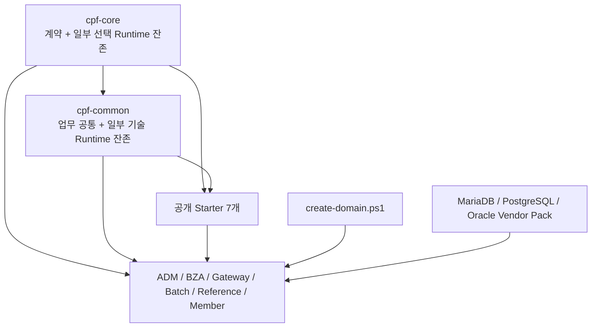
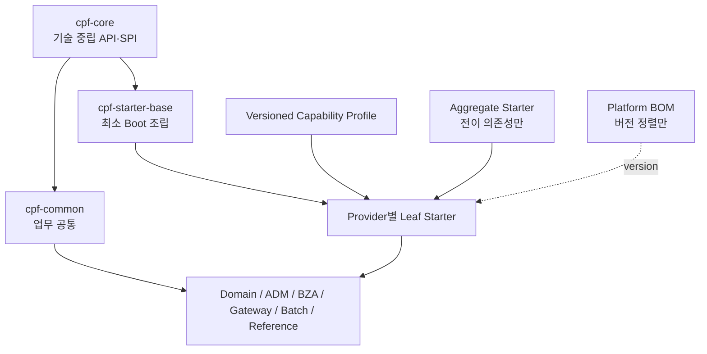

# CPF 아키텍처 설계서

> **주 독자**: CPF 제품 아키텍트, Module Owner, 개발·운영·보안·DB 책임자
> **목적**: 현재 구현과 QA38 목표 구조를 분리하고, 의존 방향·상태·복구 책임을 결정한다.

## 기준과 상태 표기

- Repository: `freeangelsun/202412_01_CPF`
- Branch: `master`
- 기준 Commit: `dafe5c0e5260ea8149234e8ab2e75347e75338c1` (`20260802_07`)
- 활성 개발 요구: `cpf-docs/work/current/CPF_QA38_FINAL_DEVELOPMENT_REQUIREMENTS.md`
- 활성 요구 Matrix: `cpf-docs/quality/CPF_QA38_FINAL_REQUIREMENT_MATRIX.csv`
- 과거 POST-QA37 날짜별 요청은 최신 Git에서 활성 Current 경로로 확인되지 않았으므로 이력 입력으로만 취급한다.

이 문서는 다음 두 상태를 분리한다.

| 상태 | 의미 |
|---|---|
| 개발 상태 | Source·SQL·Config·Generator·Consumer·Test가 존재하는 정도 |
| 검증 상태 | 실제 Build·DB·Runtime·Browser·장애·복구 시험을 실행한 정도 |

허용 상태는 `완료`, `부분 구현`, `미구현`, `미검증`, `실패`, `재확인 필요`다. 실제 실행 기록이 없는 항목은 성공으로 기록하지 않는다.


## 1. 설계 목표

CPF는 업무 시스템의 개발·실행·운영·검증·배포 수명주기를 같은 계약으로 연결한다. 아키텍처의 핵심은 기능 수가 아니라 다음 책임의 분리다.

- 업무 원장과 상태는 해당 Domain이 소유한다.
- 기술 중립 계약은 Core가 소유한다.
- 선택 Runtime과 Provider 조립은 Leaf Starter가 소유한다.
- ADM·BZA·Gateway·Batch는 자신의 제어 원장과 운영 계약만 소유한다.
- DB Schema·Migration·Rollback은 Owner Module과 중앙 Vendor Pack 계약이 함께 관리한다.
- 응답 유실이나 외부 효과 불명은 `UNKNOWN_RESULT`로 남기고 Reconciliation으로 확정한다.

## 2. 현재 구조



현재 `settings.gradle`에는 다음 7개 프로젝트만 공개 Starter로 등록돼 있다.

```text
:cpf-starter-security
:cpf-starter-messaging-kafka
:cpf-starter-cache
:cpf-starter-observability
:cpf-starter-resilience
:cpf-starter-featureflag
:cpf-starter-secret
```

`cpf-starters/`는 물리 컨테이너이고 Gradle 프로젝트 자체가 아니다.

## 3. QA38 목표 구조



### 목표 경계

| 계층 | 소유 | 금지 |
|---|---|---|
| `cpf-core` | Identifier, Header, Context, Error, Deadline, Idempotency, UNKNOWN_RESULT, Security·Audit·Masking 계약 | JDBC/MyBatis, Servlet/WebMVC, Provider SDK, OTel SDK, OpenAPI UI, Batch Runtime |
| `cpf-common` | Code, Calendar, Message, Template, 업무 Validation | Redis/Valkey, Caffeine, MyBatis, POI Runtime, 기술 AutoConfiguration |
| `cpf-starter-base` | 최소 Spring Boot 조립 | Web, DB, Broker, Cache, Session, Resource Server, OpenAPI, Batch 강제 전이 |
| Leaf Starter | Provider Runtime, AutoConfiguration, Typed Properties, Health, Operation, Test | 업무 상태·승인·원장 소유 |
| Capability Profile | Use Case를 승인 Leaf 목록으로 해석 | 숨은 Runtime, 이름 없는 다중 Provider |
| Aggregate Starter | 승인 Leaf의 전이 의존성 | Java Source, Bean, AutoConfiguration, 업무 정책 |
| BOM | 버전·호환성 정렬 | 기능 활성화 |

## 4. Module Ownership

| 영역 | Owner | 주요 원장·상태 | 다른 모듈 접근 방식 |
|---|---|---|---|
| 업무 시스템 | 각 Generated/업무 Domain | 업무 원장, 업무 상태, 보상·대사 기준 | Public API·Application Port·Event Contract |
| ADM | `cpf-admin` | 운영 조회·명령 요청·승인·감사 연결 상태 | Owner Contract 또는 Remote Port |
| BZA | `cpf-biz-admin` | 조직·사용자·권한·결재·위임 | BZA 공개 API와 생성 Client |
| Gateway | `cpf-gateway` | Route·Policy Version·Publish·Attempt Ledger·LKG | Gateway 공개 API와 Runtime Agent |
| Batch | `cpf-batch:*` | Execution·Checkpoint·Lease·Claim·Fencing·Schedule | `cpf-batch:contract` |
| Messaging Reliability | 목표 `cpf-starter-messaging-reliability-jdbc` | Outbox·Inbox·Dedup·DLQ·Replay·Reconcile | Provider-neutral Messaging Port |
| DB | Owner Module + 중앙 Vendor Pack | Schema Version·Migration·Drift | Generator와 Vendor Pack |

## 5. 의존 방향

허용 방향:

```text
제품/업무 Consumer
→ Public API·SPI
→ 선택 Leaf Starter
→ 외부 Provider SDK
```

금지 방향:

- Domain이 Starter `internal` package를 직접 참조
- Domain이 Kafka·RabbitMQ·JMS·IBM MQ·Redis·Vault SDK를 직접 참조
- Core가 제품 Route·Permission·Batch 실행 상태를 소유
- ADM·BZA·Gateway가 업무 테이블을 직접 갱신
- Starter가 업무 승인·보상·대사 정책을 소유
- BOM이 실행 의존성을 끌어옴

## 6. Topology

### 동일 JVM

- Application Port를 직접 연결한다.
- Remote Serialization과 네트워크 Timeout은 사용하지 않더라도 Deadline·Idempotency·Audit 계약은 유지한다.
- 같은 JVM이라는 이유로 Owner DB를 직접 접근하지 않는다.

### 분리 WAS·MSA

- OpenAPI/Generated Client 또는 Versioned Message Contract를 사용한다.
- Deadline과 Retry Budget을 호출 체인 전체에서 배분한다.
- Timeout 후 결과 불명 가능성이 있으면 `UNKNOWN_RESULT`와 조회·대사 API가 필요하다.

### 다중 인스턴스

- Lease·Claim은 만료시간만으로 소유권을 확정하지 않고 Fencing Token을 함께 검증한다.
- 재시도는 같은 Idempotency Key와 Operation ID를 사용한다.
- 작업자 종료 후 다른 인스턴스가 인계할 때 이전 쓰기를 차단한다.

## 7. 요청·결과 상태 모델


`UNKNOWN_RESULT`는 오류 코드가 아니라 결과 확정 절차가 필요한 상태다. 새 요청을 만들기 전에 업무 원장, Outbox/Inbox, 외부 Provider Receipt, Target 적용 상태를 대사한다.

## 8. Messaging·Integration 구조

| Capability | 현재 | QA38 목표 Owner | 필수 실패 처리 |
|---|---|---|---|
| Kafka | 공개 Starter 존재 | `cpf-starter-messaging-kafka` 보완 | ACK·Offset·Rebalance·DLT·Process Kill·Replay |
| RabbitMQ | 프로젝트 미등록 | `cpf-starter-messaging-rabbitmq` | Confirm·Return·ACK/NACK·DLX/DLQ·Cancellation |
| Jakarta JMS | 프로젝트 미등록 | `cpf-starter-messaging-jms` | Ack Mode·Session Transaction·Redelivery·Durable Subscription |
| IBM MQ | 프로젝트 미등록 | `cpf-starter-messaging-ibm-mq` Provider Extension | Queue Manager·Channel·TLS·Reason Code·In-doubt |
| TCP | 프로젝트 미등록 | `cpf-starter-integration-tcp` | Frame 분할·합침·Half-open·Response Loss·Orphan |
| Fixed Length | Core에 일부 구현 잔존 가능 | Pure Codec + Starter 분리 | Charset·Length·Binary·Malformed |
| SFTP | Planned/부분 경로 | `cpf-starter-integration-sftp` | Resume·Checksum·Atomic Rename·Transfer Ledger |
| Notification | 부분/미구현 | Notification Core + Email + SMS SPI | Accept 후 결과 불명·Receipt·Quiet Hours |

## 9. DB와 Transaction 경계

- 하나의 업무 Transaction은 자신의 Owner DB에서 끝낸다.
- 외부 Provider와 DB를 하나의 XA로 묶는 것을 기본값으로 삼지 않는다.
- DB Commit 후 메시지는 Outbox, 수신 중복은 Inbox/Dedup으로 다룬다.
- MariaDB·PostgreSQL·Oracle 모두 같은 Logical Model과 상태 전이를 유지한다.
- Vendor SQL은 Canonical Metadata와 Generator 결과에서 파생한다.

## 10. 보안·감사

모든 위험 Command는 다음 문맥을 유지한다.

```text
principal
permission
dataScope
reason
approvalId / policyVersion
expectedVersion
idempotencyKey
transactionId / traceId
before / after 또는 변경 요약
target / result / failureClass
```

Secret 값, Access Token, Password, Private Key는 Log·Metric Label·Trace Attribute·Evidence·문서에 기록하지 않는다.

## 11. 배포·Artifact

- Product Runtime은 필요한 Leaf Starter만 포함한다.
- BOM은 버전 정렬만 제공한다.
- Release Manifest·POM·SBOM·Provenance에는 해석된 Starter와 Provider Binding이 드러나야 한다.
- Optional Starter 제거 시험은 Compile과 Runtime 양쪽에서 수행한다.
- LOCAL_DEV·REMOTE·OFFLINE 모드는 같은 Artifact 좌표와 검증 계약을 사용한다.

## 12. 복구와 Rollback

| 변경 종류 | Rollback 단위 | 정상화 판정 |
|---|---|---|
| Config | Version·Checksum·LKG | 모든 Target ACK, Drift 0, Health 정상 |
| DB Migration | Rollback 또는 Forward Recovery Pack | Schema Version·Checksum·Runtime Query 일치 |
| Message Provider | Binding·Destination·Consumer Position | Backlog·DLQ·Dedup·Receipt 대사 |
| Gateway Route | Publish Version·LKG | Target별 ACK와 Probe 성공 |
| Batch | Checkpoint·Execution·Lease | 재시작 후 업무 합계·처리 대상 대사 |
| External Transfer | Transfer Ledger·Checksum | 원격 파일·원장·업무 반영 일치 |

## 13. 현재 Architecture Gap

1. Core와 Common에서 선택 Runtime을 실제 Leaf Starter로 이동해야 한다.
2. Base Starter, Capability Profile, Aggregate Starter, resolved lock이 구현돼야 한다.
3. RabbitMQ·JMS·IBM MQ·TCP·Notification의 실제 Consumer Closure가 필요하다.
4. 기존 Starter는 Health·Operation·Negative·Multi-instance·Process Kill·Unknown Result 검증이 부족하다.
5. Docker Runtime 추가는 Product Source 구현 완료를 의미하지 않는다.
