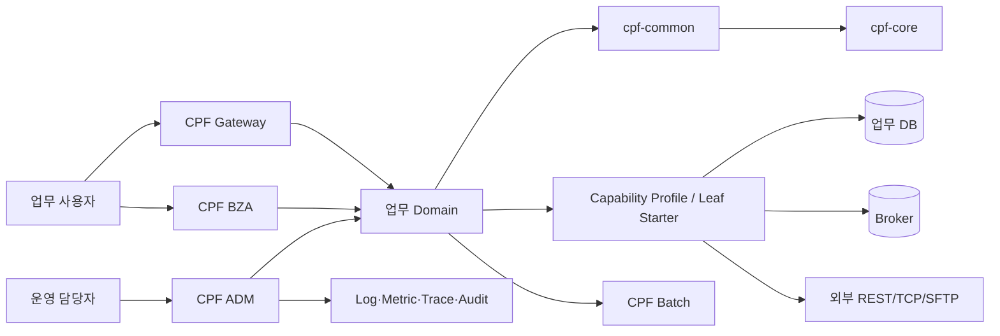
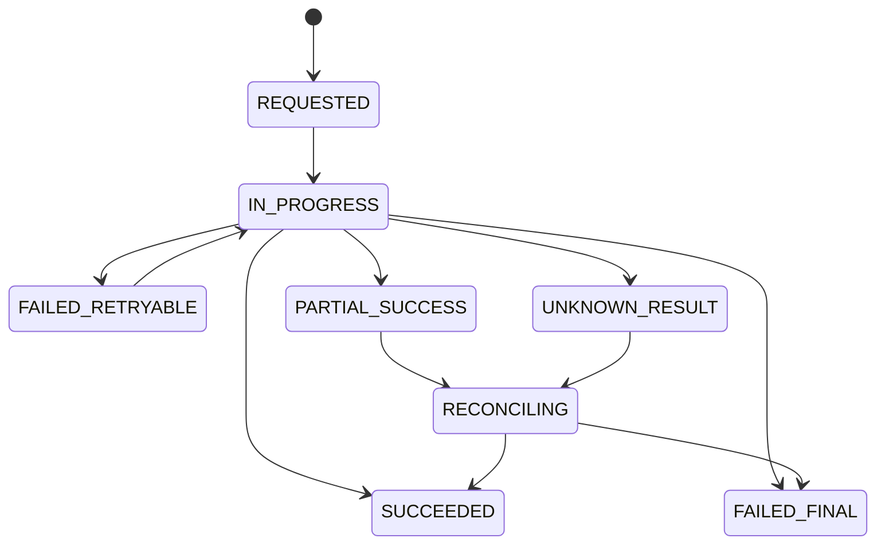
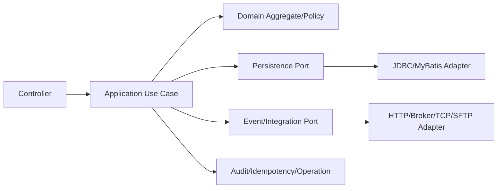
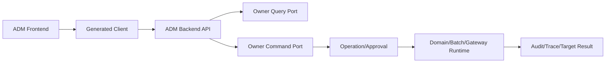
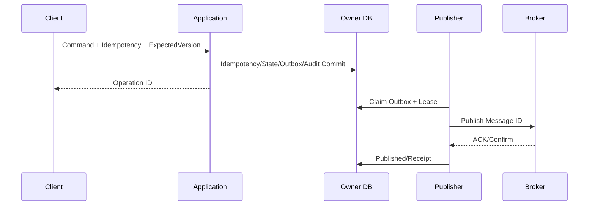
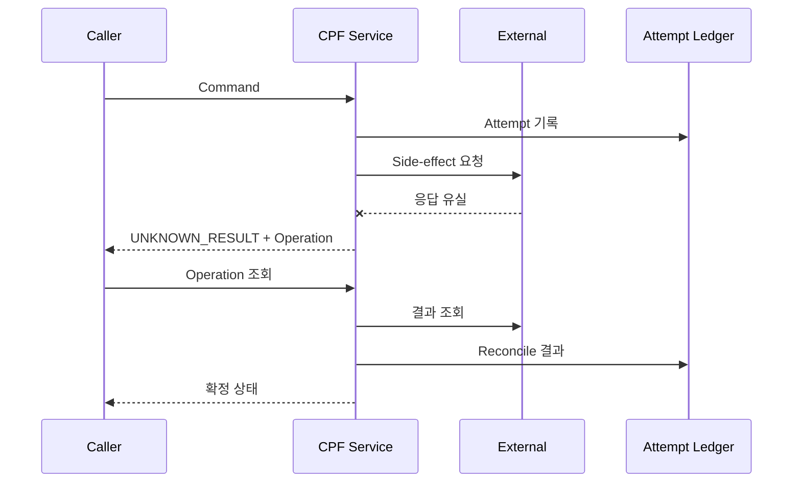
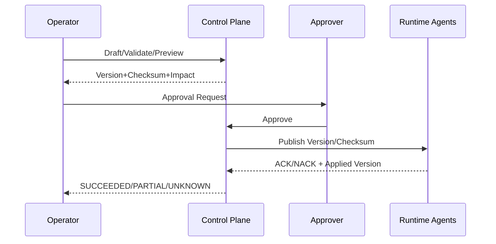

# CPF 아키텍처 설계서

> **주 독자**: 제품 아키텍트, Module Owner, 개발·운영·보안·DB 책임자
> **완료 결과**: 제품 경계·의존·배포·데이터·실패·보안·운영 설계를 결정하고 모든 구현과 문서를 추적한다.
> **기준 Repository**: `freeangelsun/202412_01_CPF` / `master` / `54bcc10887a83b933685bff462c0b0d7df824923` (`20260802_10`)

<!-- CPF-TOC:START -->
## 전체 목차

- [1. 설계 원칙](#1-설계-원칙)
- [2. Context Architecture](#2-context-architecture)
- [3. Module Ownership](#3-module-ownership)
- [4. Dependency Architecture](#4-dependency-architecture)
- [5. Starter Architecture](#5-starter-architecture)
- [6. Runtime Topology](#6-runtime-topology)
- [7. Request·State·Failure Model](#7-requeststatefailure-model)
- [8. Data Architecture](#8-data-architecture)
- [9. Integration Architecture](#9-integration-architecture)
- [10. Security Architecture](#10-security-architecture)
- [11. Operations Architecture](#11-operations-architecture)
- [12. Deployment Architecture](#12-deployment-architecture)
- [13. Quality Attributes](#13-quality-attributes)
- [14. Architecture Decision Records](#14-architecture-decision-records)
- [15. Architecture 검수 Gate](#15-architecture-검수-gate)
- [16. Component Architecture 상세](#16-component-architecture-상세)
  - [16.1 Online Domain](#161-online-domain)
  - [16.2 ADM Control Plane](#162-adm-control-plane)
  - [16.3 Gateway Data/Control Plane](#163-gateway-datacontrol-plane)
  - [16.4 Batch Control/Worker](#164-batch-controlworker)
- [17. 주요 Sequence](#17-주요-sequence)
  - [17.1 Command와 Outbox](#171-command와-outbox)
  - [17.2 응답 유실과 대사](#172-응답-유실과-대사)
  - [17.3 Gateway 게시](#173-gateway-게시)
- [18. Failure Domain·격리](#18-failure-domain격리)
- [19. Deployment Topology 상세](#19-deployment-topology-상세)
- [20. Architecture Traceability Matrix](#20-architecture-traceability-matrix)
- [21. Architecture 변경 절차](#21-architecture-변경-절차)

<!-- CPF-TOC:END -->

## 1. 설계 원칙

1. 업무 상태와 업무 원장은 한 Owner Domain이 소유한다.
2. Core는 Topology-independent API·SPI·식별자·오류·문맥만 소유한다.
3. 선택 Runtime은 Leaf Starter가 소유하고 Profile은 승인된 조합을 해석한다.
4. ADM·BZA·Gateway·Batch는 자신의 제어 원장만 소유하고 다른 Owner DB를 직접 갱신하지 않는다.
5. Local과 Remote는 DTO·Validation·Permission·Deadline·Idempotency·Audit·오류 의미가 같다.
6. 결과가 확정되지 않은 외부 효과는 `UNKNOWN_RESULT`로 유지하고 Reconciliation으로 확정한다.
7. 다중 인스턴스는 Lease·Claim·Fencing으로 Stale Writer를 차단한다.
8. Source·SQL·API·Config·Frontend·Script·Test·문서를 같은 계약으로 관리한다.

## 2. Context Architecture



## 3. Module Ownership

| Owner | Root Package/System Code | 원장·책임 | Public Consumer | 금지 |
|---|---|---|---|---|
| cpf-core | com.cpf.core / CPF | 식별자·오류·문맥·Deadline·Idempotency·Public API/SPI | 모든 제품/Domain | Provider Runtime·업무 정책 |
| cpf-common | com.cpf.common / CMN | Code·Calendar·Message 등 업무 공통 | 업무 Domain·제품 | 선택 기술 Runtime |
| cpf-admin | com.cpf.admin / ADM | 운영 Query·Command·Approval·Audit Control Plane | 운영 사용자 | 업무 DB 직접 변경 |
| cpf-biz-admin | com.cpf.bizadmin / BZA | 조직·직원·사용자·Role·Permission·결재 | 업무 Domain·관리 사용자 | 플랫폼 위험조치 |
| cpf-batch | com.cpf.batch / BAT | Job/Step/Metadata·Schedule·Worker·Lease·Center-Cut | 업무 Batch·ADM | 업무 결과 원장 소유 |
| cpf-gateway | com.cpf.gateway / GWY | Route·Target·Trust·Attempt·Publish·LKG | 외부 Client·ADM | 업무 상태 소유 |
| cpf-member | com.cpf.member / MBR | Generated Domain Golden Reference | Generator·개발자 | Framework 정본 대체 |
| cpf-reference | com.cpf.reference / REF | EDU·복구·운영 예제 | 교육·검증 | 운영 원장 대체 |
| cpf-starters | com.cpf.starter/기존 공개 계약 Package | Provider Runtime·AutoConfiguration·Properties·Health | 제품·Domain | 업무 상태·승인 |

## 4. Dependency Architecture

```text
Generated/Business Domain → cpf-common → cpf-core
Product Runtime → cpf-core/common Public Contract + selected Profile/Leaf
Gateway → core Public Contract + gateway-owned runtime
Batch → batch contract + business Public Contract + selected Profile
ADM/BZA → Owner Query/Command Contract
Provider Adapter → core/common SPI
```

Compile Gate는 `internal` Package 접근, 역방향 의존, 순환 의존, Consumer 없는 SPI, Core/Common의 Provider SDK를 차단한다.

## 5. Starter Architecture

| 계층 | 책임 | 제약 |
|---|---|---|
| Base | 최소 Boot·Binding Registry·Profile Validation | Web/DB/Broker 강제 전이 금지 |
| Leaf | 하나의 Capability/Provider, Properties, AutoConfiguration, Health, Test | 업무 정책 금지 |
| Aggregate | 승인 Leaf 전이 의존성 | Java Source·Bean·AutoConfiguration 금지 |
| Capability Profile | Use Case→resolvedStarters·Provider 허용 목록·Version | 숨은 Runtime 금지 |
| BOM | Version 정렬 | 기능 선택 금지 |
| Generator Lock | Profile Version·resolvedStarters·Provider·Starter Version 고정 | 기존 Domain 묵시 변경 금지 |

## 6. Runtime Topology

| Topology | Artifact | 호출 | 상태·운영 | 필수 검증 |
|---|---|---|---|---|
| Embedded Boot JAR | 실행 JAR | Local/HTTP | Process별 Config·Health | Startup·Shutdown·Mixed Version |
| External WAS WAR | WAR+Container | Servlet/HTTP | Container Session·Classloader | Deploy/Undeploy·Rollback |
| Modular Monolith | 단일 Process | Local Facade | Module 경계·공유 Resource | Internal 접근 차단·Transaction |
| Microservice | 서비스별 JAR/WAR | Remote Facade/Message | Identity·Deadline·Retry·Trace | Network Fault·Compatibility |
| ADM/BZA Static | Static Artifact+Backend | Generated Client | Browser Session·Permission | 3 Browser·CSP·CSRF |
| Gateway | 독립 Runtime | External→Internal | Route Version·Attempt·LKG | Scale-out·Partial Apply |
| Batch Worker/Agent | 독립 Process | Control/Message | Lease·Fencing·Checkpoint | Process Kill·Reassignment |
| Multi-zone/DR | 복수 Site | Traffic/Replication | Single Writer·RPO/RTO | Failover·Failback·Split Brain |

## 7. Request·State·Failure Model



각 Operation은 `operationId`, `businessKey`, `idempotencyKey`, Request Hash, Expected Version, Attempt, Target 결과, Actor, Reason, Approval, Trace, Audit를 연결한다.

## 8. Data Architecture

- 업무 테이블은 Domain Owner가 소유한다.
- Idempotency·Outbox·Inbox·Attempt·Transfer·Notification·Batch Metadata는 해당 기술 Owner의 지원 원장이다.
- 다른 Domain DB 직접 Join/Update를 금지하고 API·Event·Read Model을 사용한다.
- MariaDB·PostgreSQL·Oracle은 같은 Logical Contract·Constraint·Index·상태 의미를 유지한다.
- Migration은 Forward-only를 기본으로 하되 Rollback 가능 범위와 Backup Restore를 명시한다.
- Read Model 지연과 정본 Owner를 화면에 표시하고 Drift를 Reconcile한다.

## 9. Integration Architecture

| 방식 | Primary Contract | 신뢰성 | 결과 미확정 |
|---|---|---|---|
| HTTP | Typed Client·OpenAPI·Deadline | Attempt·Idempotency·Circuit | 상대 조회 API |
| Kafka | Event Envelope·Outbox/Inbox | ACK·Offset·DLQ·Replay | Outbox/Broker/Inbox 대사 |
| RabbitMQ | Exchange/Queue/Binding·Outbox/Inbox | Confirm·ACK/NACK·DLQ | Confirm/Queue/Inbox 대사 |
| JMS/IBM MQ | Destination·Session/Ack·Reason Code | Transaction·Redelivery·DLQ | Queue Manager/Attempt/Inbox |
| TCP/ISO8583 | Frame·Layout·Correlation·MAC | Attempt·Unknown Store·Reconnect | 기관 조회·Correlation 대사 |
| SFTP | Transfer Ledger·Checksum·Atomic Rename | Resume·Archive·Retry | 상대 파일·Ledger 대사 |
| Webhook | HMAC·Nonce·Delivery Ledger | Retry·Receipt·Dedup | 상대 Receipt/Attempt |

## 10. Security Architecture

- 사용자 인증, Service Identity, Session, Resource Server를 분리한다.
- Permission과 Data Scope는 Frontend 표시, Backend Authorization, Query, Command, Export에 동일 적용한다.
- HMAC은 Key Version·Audience·Timestamp·Nonce·Body Hash를 검증한다.
- Secret은 Reference만 Config에 두고 Rotation·접근·폐기를 Audit한다.
- Masking은 API·화면·Export·Log·Trace·Audit·Error에 적용한다.
- 위험 조치는 Reason·Expected Version·Idempotency·Approval·Before/After를 기록한다.
- Break-glass는 시간 제한·범위·사후 Review·회수를 필수로 한다.

## 11. Operations Architecture

ADM은 Owner Query/Command를 연결하고, 직접 DB 수정 없이 다음을 수행한다.

- Topology·Health·Capacity·Log·Trace·Transaction 조회
- Config·Cache·Log Level·Maintenance·Runtime Control
- Batch·Gateway·Broker·File·Unknown Result 운영
- Permission·MFA·Operator·Secret·Approval·Break-glass
- Operation·Target·ACK/NACK·Audit·Reconciliation

## 12. Deployment Architecture

1. Artifact·Source SHA·SBOM·Signature·Checksum을 검증한다.
2. DB/Message/File Contract의 이전·신규 Version 공존을 확인한다.
3. Config·Secret·Certificate를 Target Version으로 준비한다.
4. Canary를 배포하고 Readiness·업무 Smoke·오류·지연·대사를 관찰한다.
5. Target을 확대하고 Instance별 Version·Checksum을 대사한다.
6. 실패 Target은 격리·재적용하고 전체를 반복 배포하지 않는다.
7. LKG 또는 Forward Fix를 선택하고 Audit를 남긴다.

## 13. Quality Attributes

| 속성 | 설계 수단 | 측정·검증 |
|---|---|---|
| 가용성 | 다중 인스턴스·Health·Failover·Queue | 장애 주입·복구시간 |
| 일관성 | Owner·Version·Idempotency·Fencing | Race·Duplicate·Stale Write |
| 성능 | Bounded Queue·Pool·Streaming·Partition | TPS·Latency·Memory·Disk |
| 보안 | Least Privilege·TLS·HMAC·Masking | Negative Corpus·Secret Scan |
| 감사성 | Immutable Audit·Reason·Approval·Correlation | Actor→Result 추적 |
| 확장성 | Leaf Starter·Profile·SPI·Generated Domain | Provider 교체·Removal |
| 호환성 | Semantic Version·Mixed Version·Contract | Local/Remote·Old/New |
| 복구성 | Checkpoint·Outbox/Inbox·Reconcile·LKG·Backup | Process Kill·Response Loss·DR |
| 운영성 | ADM·Metric·Alert·Runbook | 초보 운영 시나리오 |

## 14. Architecture Decision Records

| ADR | 결정 | 대안 | 결정 이유 |
|---|---|---|---|
| ADR-001 | Core 경량화·Provider Starter 분리 | Core에 모든 Runtime 포함 | 선택하지 않은 기술 제거·호환성 |
| ADR-002 | Profile+resolvedStarters Version Lock | Boolean Capability만 저장 | 기존 Domain 묵시 변경 방지 |
| ADR-003 | Outbox/Inbox와 결과 대사 | 분산 XA 기본 | Provider 독립·응답 유실 처리 |
| ADR-004 | ADM/BZA/Gateway Owner DB 직접 수정 금지 | 운영 편의 직접 SQL | Ownership·Audit·호환성 |
| ADR-005 | Lease+Fencing | Lease 만료만 사용 | Stale Writer 차단 |
| ADR-006 | 3 Vendor Logical Contract | Vendor별 독립 모델 | 제품 의미·Migration 일치 |
| ADR-007 | LKG·Forward Fix | 무조건 Application Rollback | DB/Message 비호환 보호 |
| ADR-008 | Docker Created/Stopped 설치 | 설치 즉시 전체 기동 | Port·Data·Resource 보호 |

## 15. Architecture 검수 Gate

- [ ] 모든 상태·DB·Command에 단일 Owner가 있다.
- [ ] Public API/SPI/Internal과 의존 방향이 Compile Gate로 보호된다.
- [ ] Profile·Leaf·Aggregate·BOM 책임이 분리된다.
- [ ] Local/Remote·단일/다중 Instance 의미가 같다.
- [ ] Timeout·응답 유실·부분 실패·Stale Writer의 다음 행동이 있다.
- [ ] Security·Permission·Masking·Approval·Audit가 전체 흐름에 연결된다.
- [ ] Deployment·Backup·DR·Rollback과 데이터 호환성이 설계됐다.
- [ ] Source·SQL·API·Config·Frontend·Test·문서가 양방향으로 추적된다.

## 16. Component Architecture 상세

### 16.1 Online Domain



Controller는 인증 문맥·입력 검증·오류 Mapping만 수행한다. Application은 Transaction·Idempotency·상태 전이·Outbox를 소유한다. Domain은 업무 불변식을 소유한다. Adapter는 Provider SDK와 공개 SPI를 연결한다.

### 16.2 ADM Control Plane



ADM은 Query·Command·Approval·Operation 상태를 연결하고 Owner DB를 직접 수정하지 않는다. Same-JVM과 Remote Adapter는 같은 계약을 구현한다.

### 16.3 Gateway Data/Control Plane

- Control Plane: Route Draft·Validation·Approval·Publish·Target ACK/NACK·LKG·Audit
- Data Plane: Predicate·Filter·Authentication·Authorization·Target 선택·Attempt Ledger·Response Mapping
- Runtime Agent: Version/Checksum 수신, Preview/Apply, ACK/NACK, Health/Drift 보고

### 16.4 Batch Control/Worker

- Definition/Job Pack과 실행 Metadata를 분리한다.
- Scheduler는 Trigger를, Spring Batch는 JobInstance/Execution/Checkpoint를 정본으로 한다.
- Worker Claim은 Lease+Fencing으로 보호한다.
- Center-Cut은 Preview Snapshot·Approval·Target Result를 보존한다.

## 17. 주요 Sequence

### 17.1 Command와 Outbox



### 17.2 응답 유실과 대사



### 17.3 Gateway 게시



## 18. Failure Domain·격리

| 실패 영역 | 격리 수단 | 상태 영향 | 복구 |
|---|---|---|---|
| DB | Pool·Timeout·Circuit·Readonly/Failover | Commit 전 실패/미확정 분리 | Retry·Restore·Reconcile |
| Broker | Outbox Buffer·Circuit·DLQ | 업무 Commit 유지, Event 지연 | Publisher 재개·Replay |
| 외부 REST/TCP | Attempt·Deadline·Bulkhead | UNKNOWN_RESULT 가능 | 상대 조회·보상 |
| File/SFTP | Ledger·Temp/Atomic Rename | PARTIAL/UNKNOWN | Resume·Checksum 대사 |
| Cache | Provider 격리·Fallback | 원장 영향 없음 | Evict·Reload |
| Observability | Bounded Buffer·Drop Metric | 업무 처리와 분리 | Collector 복구 |
| ADM/BZA Frontend | Static/Backend 분리 | 운영 UI 영향 | Backend API·재배포 |
| Gateway Agent | Version/Checksum·LKG | Target별 Partial | Reconcile·Rollback |
| Batch Worker | Partition·Lease·Fencing | Partition별 실패 | 재할당·Restart |

## 19. Deployment Topology 상세

| 구성 | 구성요소 | Network/Trust | Data | 확장/장애 |
|---|---|---|---|---|
| 개발 단일 PC | Local Runtime+Docker DB/Broker/Fixture | Loopback | 개발 Data | 기능 Smoke |
| 모듈형 단일 Application | Domain+Common+Selected Starter | 내부 Module Boundary | 단일/복수 Schema | Process 단위 Scale |
| MSA | Domain별 Runtime+Gateway+ADM/BZA | mTLS/Service Identity | Owner DB | 서비스별 Scale/격리 |
| Batch Cluster | Control+Scheduler+Worker/Agent | Control Trust | Batch Metadata+Owner DB | Worker Pool/Lease |
| 다중 Zone | LB+복수 Instance+HA DB/Broker | Zone Network | 복제·Single Writer | Zone Failover |
| DR | Primary/DR Site | Traffic/DNS/Key | 복제/PITR | Failover/Failback |

## 20. Architecture Traceability Matrix

| 요구 범위 | Architecture Element | Source 정본 | 사용자 문서 | 검증 |
|---|---|---|---|---|
| Local/Remote | Public Port·Remote Adapter | core/common/product api/spi | 00/01/03 | Contract/Fault |
| Starter/Profile | Base/Leaf/Aggregate/Profile/BOM | settings·profile catalogs·generator | 00/90/91 | Context/Removal/Artifact |
| Messaging | Reliability+Provider Binding | messaging starters·3DB SQL | 01/05/90 | Broker/Fault/Reconcile |
| Batch | Spring Batch+Scheduler+Worker | cpf-batch modules | 02/03/05 | DB/Process Kill/Fencing |
| ADM | Control Plane+Generated Client | cpf-admin backend/frontend | 03 | Browser/Permission/Fault |
| BZA | Organization/Permission/Approval | cpf-biz-admin | 95 | Browser/DB/Audit |
| Gateway | Control/Data Plane+Agent | cpf-gateway+ADM gateway routes | 92 | Scale/Partial/LKG |
| DB | Canonical Metadata+Vendor Pack | cpf-tools/db/vendor | 05/DB표준 | 3 Vendor lifecycle |
| Docker | Base/Fixture/Toolchain | docker-development-test | 05/Docker docs | Compose/Runtime/Fault |

## 21. Architecture 변경 절차

1. 변경 이유·품질 속성·영향 Owner를 정의한다.
2. 기존/대안 구조와 비용·위험을 비교한다.
3. Public Contract·DB·Message·Config·Artifact 호환성을 분석한다.
4. Migration·Mixed Version·Rollback/Forward Fix를 설계한다.
5. Source·Generator·Consumer·Test·ADM/Operations·문서 변경을 묶는다.
6. ADR을 승인하고 구현 Gate와 제거 Legacy를 지정한다.
7. Runtime/Fault/DR Evidence를 Release SHA에 연결한다.
