<div align="center">

# Core Platform Framework
## 아키텍처설계서

**실행 형태가 달라도 업무 계약, 보안 문맥, 오류 의미와 복구 기준이 유지되는 구조**

`Architecture · Ownership · Topology · Data Flow · Operations`

</div>

<p align="center">
  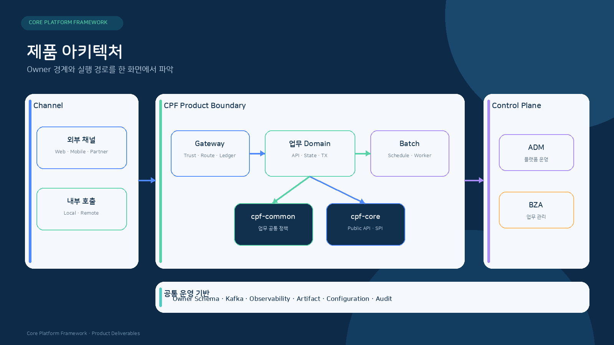
</p>

---

## 문서 안내

| 항목 | 내용 |
|---|---|
| 목적 | CPF의 전체 구조, Module 책임, 의존 방향, 실행 흐름과 운영 경계를 정의합니다. |
| 주요 독자 | 아키텍트, Framework 개발자, 기술 검토자, 유지보수 담당자 |
| 포함 범위 | Core, Common, Starter, Domain, ADM, BZA, Gateway, Batch, DB, 관측, Artifact |
| 관련 문서 | [기술사양서](기술사양서.md) · [기술표준서](기술표준서.md) · [데이터베이스표준서](데이터베이스표준서.md) |

<details>
<summary><strong>빠른 목차</strong></summary>

1. Architecture 요약
2. 품질속성과 설계 목표
3. 전체 Context
4. Module Ownership
5. 의존 방향
6. Public API·SPI·Internal
7. 지원 Topology
8. 온라인 요청 Architecture
9. Local·Remote 호출 Architecture
10. 비동기 Event Architecture
11. 파일·외부연계 Architecture
12. Batch Architecture
13. Gateway Architecture
14. ADM·BZA Architecture
15. 데이터 Architecture
16. 보안과 신뢰 경계
17. 관측·운영·복구
18. Artifact·배포·Generator
19. Architecture 핵심 결정
20. Architecture 검토 관점
21. Source 기준점

</details>

## 1. Architecture 요약

CPF의 구조는 다음 원칙을 중심으로 구성됩니다.

| 원칙 | 설명 |
|---|---|
| **단일 Ownership** | 기능·상태·DB·Command는 하나의 Owner Module이 소유합니다. |
| **계약 중심 연결** | Module 간 연결은 Public API 또는 SPI를 사용하고 Internal 구현을 공유하지 않습니다. |
| **Topology 동등성** | 같은 업무 계약을 동일 JVM과 분리 Runtime에서 유지합니다. |
| **선택 기능 분리** | Kafka, Cache, Observability, Resilience 등은 Starter로 선택합니다. |
| **결과 추적성** | transactionId, trace, segment, attempt를 온라인·비동기·Batch·복구 전 구간에 연결합니다. |
| **복구 가능한 상태** | Timeout, 응답 유실, 중복, 부분 실패를 상태와 원장으로 구분합니다. |
| **운영 경계 분리** | ADM·BZA는 Owner 계약을 통해 조회·조치하며 Owner DB를 직접 변경하지 않습니다. |


### 1.1 구조 선택 가이드

| 질문 | 선택 | 설계 기준 |
|---|---|---|
| 같은 배포 단위 안에서 호출하는가? | Local Adapter | Public Contract를 그대로 사용하고 Network 전용 처리는 제외합니다. |
| 독립 배포·확장·장애 격리가 필요한가? | Remote Adapter | Service Identity, Deadline, Retry, Compatibility를 추가합니다. |
| 여러 Consumer가 후속 처리를 공유하는가? | Kafka Event | Outbox·Inbox와 Versioned Envelope를 적용합니다. |
| 대량 대상과 재시작 지점이 필요한가? | Spring Batch | Job·Step·ExecutionContext·Checkpoint를 사용합니다. |
| 외부 진입과 공통 신뢰 경계가 필요한가? | Gateway | Route·Trust·Resilience·Attempt Ledger를 적용합니다. |
| 운영 조회·조치·승인이 필요한가? | ADM/BZA | Owner Query·Command Contract로 연결합니다. |

> [!NOTE]
> Topology를 바꿔도 업무 DTO, Validation, Authorization, 오류 의미, transactionId와 Audit 계약은 유지합니다.


## 2. 품질속성과 설계 목표

<p align="center">
  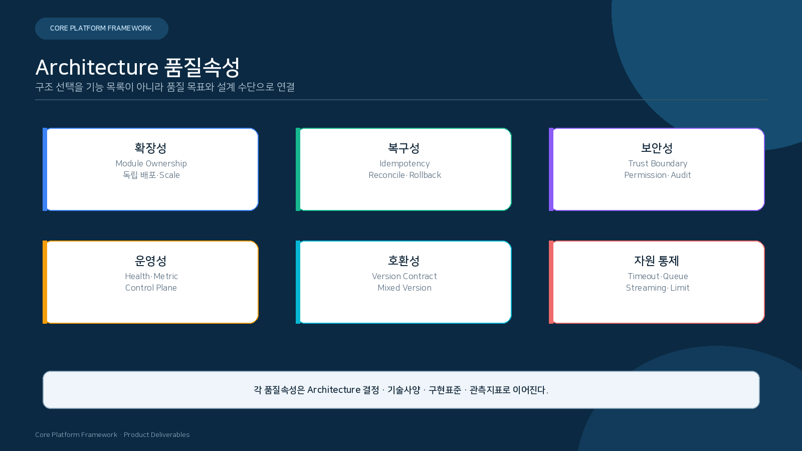
</p>

| 품질속성 | Architecture 수단 | 주요 판정 지점 |
|---|---|---|
| 확장성 | Module Ownership, Public Contract, 독립 Runtime | Domain 추가·분리 시 기존 업무 Source 변경 최소화 |
| 복구성 | Idempotency, State Ledger, Reconciliation, Rollback | Timeout·응답 유실·Process 종료 뒤 결과 확정 |
| 보안성 | Trust Boundary, Server Permission, Masking, Audit | 외부 Header·권한 밖 데이터·위험 조치 통제 |
| 운영성 | Health, Log·Metric·Trace, ADM/BZA Control Plane | Instance·거래·Batch·Gateway 상태를 같은 식별자로 조회 |
| 호환성 | Versioned API·Message·DB·Config, Mixed Version | Rolling·Canary·Upgrade 중 계약 유지 |
| 자원 통제 | Deadline, Queue·Payload Limit, Bounded Streaming | 부하·대용량·외부 지연이 Process 전체로 확산되지 않음 |

- 품질속성은 독립된 홍보 문구가 아니라 구조·사양·표준과 연결되는 설계 기준입니다.
- Topology·DB Vendor·Provider가 달라도 Public Contract와 오류 의미는 유지합니다.
- 운영 기능과 관측 저장 실패가 원 업무 Transaction을 불필요하게 오염시키지 않도록 경계를 분리합니다.

## 3. 전체 Context

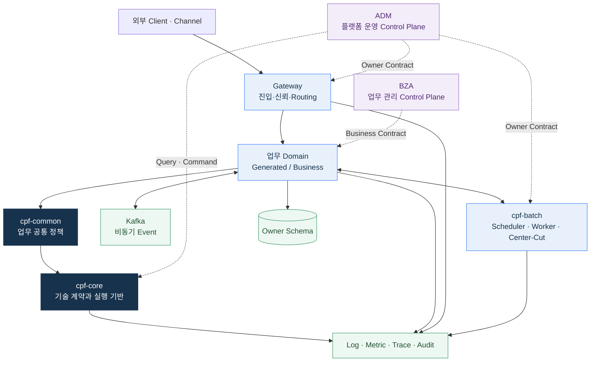

### 3.1 경계 정의

- **외부 진입 경계**: Gateway가 인증, Header 신뢰, Route, 요청 제한과 Attempt를 관리합니다.
- **업무 경계**: 업무 Domain이 업무 상태와 Transaction을 소유합니다.
- **기술 경계**: `cpf-core`가 거래·오류·Context·기술 API/SPI를 제공합니다.
- **공통 정책 경계**: `cpf-common`이 Calendar, Code, Message 등 업무 공통 정책을 제공합니다.
- **운영 경계**: ADM과 BZA가 조회·승인·조치·감사를 제공합니다.
- **데이터 경계**: 각 Owner가 자기 Schema의 쓰기와 Lifecycle을 소유합니다.

## 4. Module Ownership

| 역할 | Module | Root Package | SystemCode | 핵심 책임 |
|---|---|---|---:|---|
| 기술 공통 | `cpf-core` | `com.cpf.core` | CPF | Topology 독립 API/SPI, 거래 Context, 오류, 기술 실행 계약 |
| 업무 공통 | `cpf-common` | `com.cpf.common` | CMN | Calendar, Code, Message, 공통 데이터 정책과 Core SPI 확장 |
| 플랫폼 관리 | `cpf-admin` | `com.cpf.admin` | ADM | 플랫폼 조회·조치·승인·감사 Control Plane |
| 업무 관리 | `cpf-biz-admin` | `com.cpf.bizadmin` | BZA | 조직·직원·사용자·권한·결재·첨부·알림 |
| Batch 실행 | `cpf-batch` | `com.cpf.batch` | BAT | Spring Batch, Scheduler, Worker, Center-Cut, Host Agent |
| 외부 진입 | `cpf-gateway` | `com.cpf.gateway` | GWY | Route, Trust Boundary, Load Balancing, Resilience, Attempt Ledger |
| 기준 Domain | `cpf-member` | `com.cpf.member` | MBR | Generator 산출 구조의 Golden Reference |
| 교육·참조 | `cpf-reference` | `com.cpf.reference` | REF | Public API의 실제 사용 예와 복구 시나리오 |
| 선택 Runtime | `cpf-starters/*` | 기능별 | - | Security, Kafka, Cache, Observability, Resilience, Feature Flag, Secret |
| 도구·생성 | `cpf-tools` | 도구별 | - | Generator, DB Vendor Pack, Build, 검증 Script, Local Runtime |

### 4.1 Batch 내부 역할

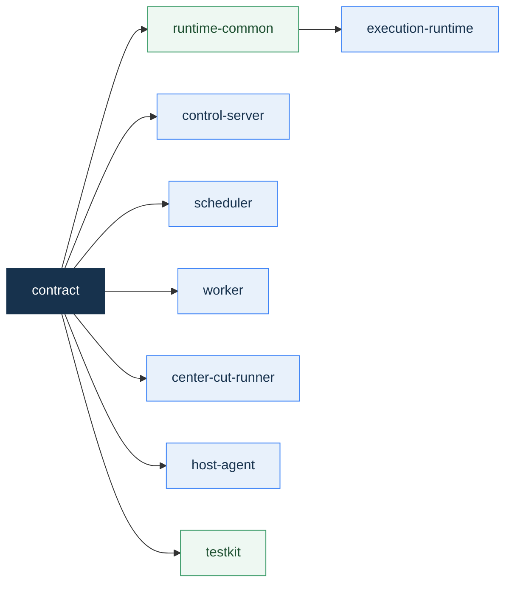

## 5. 의존 방향

<p align="center">
  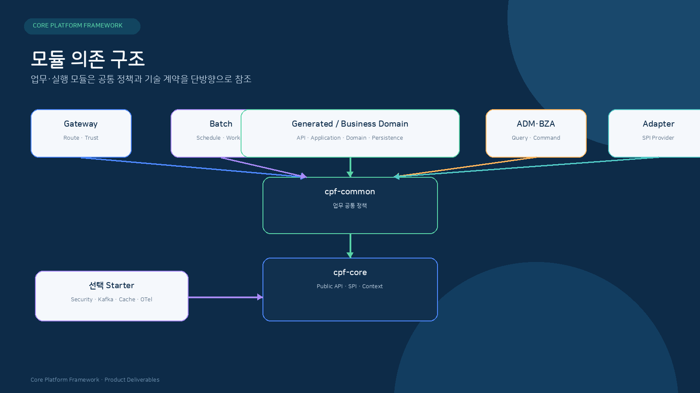
</p>

```text
Generated / Business Domain → cpf-common → cpf-core
cpf-gateway                 → cpf-core + 선택 Starter
cpf-batch                   → cpf-core + Business Public Contract
cpf-admin                   → Operations Query / Command Contract
cpf-biz-admin               → Business Public Contract
Adapter / Plugin            → cpf-common 또는 cpf-core SPI
```

### 5.1 허용 경계

| 호출자 | 대상 | 허용 방식 |
|---|---|---|
| 업무 Domain | `cpf-common` | Public API |
| 업무 Domain | `cpf-core` | `cpf-common`을 통하거나 명시된 Public API |
| Gateway | 업무 Domain | Route·Service Contract |
| Batch | 업무 Domain | Owner Public Contract |
| ADM | Gateway·Batch·Core | 운영 Query·Command Contract |
| BZA | 업무 Domain | Business Capability Contract |
| Provider | Core/Common | SPI 구현 |

### 5.2 금지 경계

- `cpf-core`에서 Common, Admin, BZA, Batch 또는 업무 Domain으로 향하는 역방향 의존
- 업무 Domain 간 Table 직접 조회·갱신
- ADM·BZA의 Owner Schema 직접 갱신
- 외부 Module의 `internal` Package 참조
- 동일 JVM 내부 호출의 Gateway 강제 경유
- 선택 Runtime을 `cpf-core`에 필수 의존성으로 포함

## 6. Public API · SPI · Internal

```text
com.cpf.<owner>.api       외부 Consumer가 사용하는 버전 계약
com.cpf.<owner>.spi       Provider가 구현하는 확장 계약
com.cpf.<owner>.internal  Owner Module 내부 구현
```

| 구분 | 포함 내용 | 호환성 기준 |
|---|---|---|
| Public API | DTO, Command, Query, Result, Error, Event Envelope | Semantic Version과 Consumer Contract |
| SPI | Provider Capability, Lifecycle, Failure, Thread-safety | 구현체 교체와 선택 기능 독립성 |
| Internal | Repository, Engine, Adapter 구현, Cache, Mapper | Owner Module 내부 변경 자유도 |

## 7. 지원 Topology

| Topology | 구조 | 동일하게 유지할 계약 |
|---|---|---|
| Modular Monolith | 동일 JVM 내부 Facade 호출 | DTO, Validation, 권한, 오류, transactionId, Audit |
| 독립 Service | Remote Client·Server Adapter | 위 계약 + Timeout, Retry, Service Identity |
| Embedded JAR | Module별 Boot Runtime | Profile, Health, Config, Artifact Version |
| External WAS WAR | Servlet Container 배포 | API, Session, Security, Context Path |
| Multi-instance | 여러 Instance + 공유 상태 | Lease, Fencing, Idempotency, Failover |
| Worker Process | Scheduler·Worker·Runner·Agent | Runtime Identity, Command, Drain, 결과 원장 |

<p align="center">
  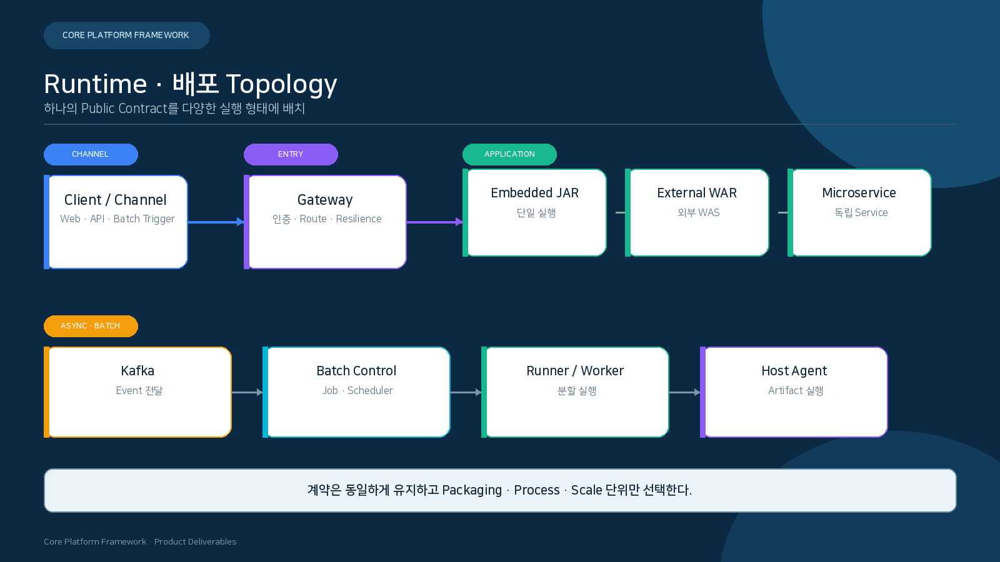
</p>

<p align="center"><sub>업무 계약은 유지하고 실행·배포·확장 단위를 선택합니다.</sub></p>

| 선택 항목 | 설계 판단 |
|---|---|
| 동일 JVM | 호출 비용과 배포 단순성이 우선이며 Owner 경계는 유지해야 합니다. |
| 독립 Service | 독립 배포·확장·장애 격리가 필요하며 Remote 오류와 Deadline을 추가합니다. |
| JAR·WAR | 실행 Container와 고객 환경의 배포 표준에 따라 선택합니다. |
| Worker·Runner·Agent | 장시간·분할·원격 실행을 온라인 요청 Process와 분리합니다. |

### 7.1 Topology 선택 기준

| 판단 항목 | Modular Monolith | 독립 Service |
|---|---|---|
| 배포 | 하나의 Release 단위 | Service별 Release |
| 확장 | Process 전체 Scale | 병목 Service 선택 Scale |
| 장애 격리 | Process 경계 안에서 처리 | Network·Process 경계로 격리 |
| 데이터 | Owner Schema 원칙 유지 | Owner DB·API 경계 강화 |
| 호출 비용 | Method 호출 중심 | 직렬화·Network·Timeout 추가 |
| 운영 복잡도 | 비교적 단순 | Registry·Health·Compatibility 필요 |

- 업무 규모와 조직 경계가 아닌 실제 배포·확장·복구 요구를 기준으로 선택합니다.
- 같은 Module을 Local과 Remote에서 제공할 때 DTO·Validation·Error를 이중 정의하지 않습니다.

## 8. 온라인 요청 Architecture

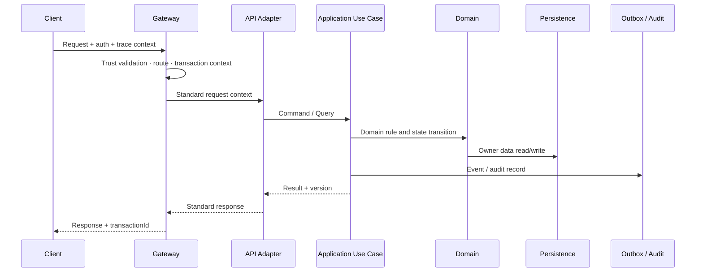

### 8.1 Command 경계

- Validation → Authorization → Idempotency → Domain Rule → Persistence → Event/Audit 순서를 기준으로 합니다.
- Transaction은 Owner DB 상태와 같은 원자성이 필요한 기록을 묶습니다.
- 외부 호출을 장기 DB Transaction 안에 포함하지 않습니다.
- 변경 결과는 Resource ID, Version, Operation ID와 함께 반환합니다.


<p align="center">
  
</p>

<p align="center"><sub>업무 Transaction과 메시지 전달을 Outbox·Kafka·Inbox 원장으로 연결합니다.</sub></p>


## 9. Local · Remote 호출 Architecture

<p align="center">
  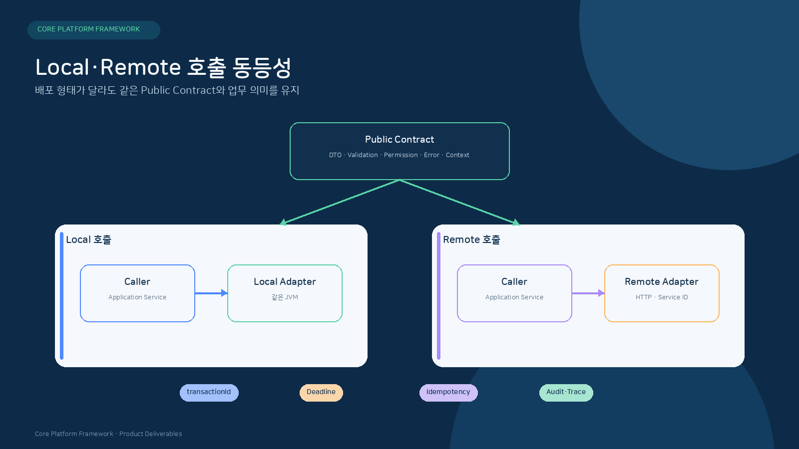
</p>

| 계약 | Local Adapter | Remote Adapter |
|---|---|---|
| Public Contract | 동일 Command·Query·Result | 동일 Command·Query·Result |
| 실행 Context | 객체로 직접 전달 | Header·Envelope로 직렬화 |
| 인증·권한 | 검증된 Principal·Service Context | Service Identity·Audience 추가 |
| 시간 예산 | Use Case Deadline | Connect·Write·Read Budget 분배 |
| 오류 | Domain·Validation·Conflict | Transport 오류를 같은 Taxonomy로 변환 |
| 중복 방지 | Owner Idempotency 원장 | Owner Idempotency + Network Retry 통제 |
| 관측 | Segment 생성 | Client·Server Segment와 Attempt 생성 |

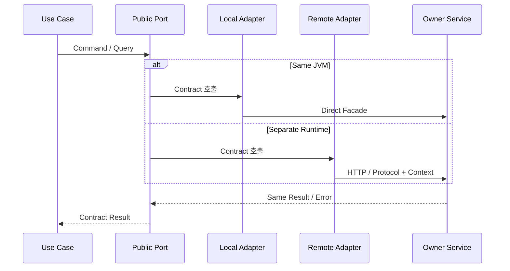

- Retry는 동일 요청을 다시 실행해도 되는 Command에서만 적용합니다.
- 응답 유실이 가능한 변경 요청은 `operationId`와 결과 조회 계약을 제공합니다.
- Remote 전환을 위해 업무 Service나 Domain Rule을 복제하지 않습니다.

## 10. 비동기 Event Architecture

| 구성요소 | 책임 |
|---|---|
| Event Envelope | messageId, transactionId, schemaVersion, producer, occurredAt, payload contract |
| Outbox | 업무 Commit과 발행 요청을 같은 근거로 기록 |
| Publisher | Lease·Retry·Backoff·Attempt를 관리하며 Kafka에 발행 |
| Inbox | messageId 또는 idempotency key로 중복 소비를 차단 |
| DLT/DLQ | 반복 실패 원인과 재처리 상태를 보존 |
| Reconciliation | Outbox·Broker·Inbox·업무 상태를 대조 |


## 11. 파일 · 외부연계 Architecture

<p align="center">
  
</p>

| 연계 유형 | Owner 경계 | 핵심 Architecture |
|---|---|---|
| Attachment | 업무 Domain + File SPI | Metadata와 Binary 수명주기 분리, Download Audit 연결 |
| 대량 File | File Job Owner | Streaming, Record Checkpoint, Trailer·Checksum 대사 |
| 외부 REST | 업무 Domain Adapter | Timeout Budget, Idempotency, 상대 상태 조회, Compensation |
| 고정길이 전문 | Core 기술 계약 + 기관 Adapter | Layout Version, Encoding, Byte Offset, Masked Diagnostic |
| Archive | Storage Adapter | Path Alias, Atomic Publish, Retention, Restore Contract |

- File은 임시 수신 → 검증 → Checksum → 원자적 게시 → Metadata 확정 순서를 사용합니다.
- 외부 변경 요청은 전송 성공과 상대 업무 반영 성공을 같은 의미로 간주하지 않습니다.
- 전문·File 원문은 크기·보존·Masking 정책을 적용하고 전체 메모리 적재를 피합니다.
- 취소·Timeout·Disk Full·Client Disconnect 이후 Partial 자산을 정리하고 상태를 기록합니다.

## 12. Batch Architecture

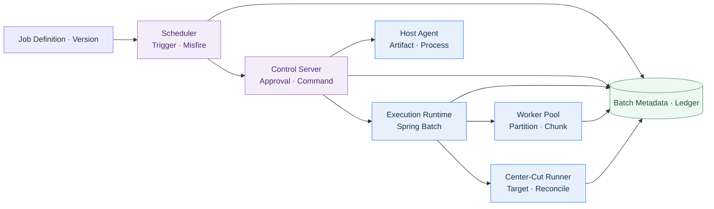

### 12.1 Batch 상태와 제어

- Job Definition과 Version은 실행 가능한 Artifact와 연결됩니다.
- Scheduler는 업무 실행 시각, Misfire, Calendar와 Claim을 관리합니다.
- Worker·Runner는 Lease와 Fencing으로 중복 실행을 차단합니다.
- Stop·Restart·Retry·Failed-only Reprocess는 별도 의미를 갖습니다.
- Checkpoint와 ExecutionContext는 재시작 기준을 제공합니다.
- 결과 확정이 어려운 실행은 대사 후 상태를 결정합니다.

## 13. Gateway Architecture

<p align="center">
  
</p>

| 영역 | 책임 |
|---|---|
| Data Plane | Listener, TLS, Authentication, Predicate, Filter, Rewrite, Routing, Load Balancing |
| Control Plane | Route Draft, Validation, Approval, Version, Publish, Apply Status, Rollback |
| Trust Boundary | 외부 Header 제거·검증, Service Identity, Audience, Nonce, Signature |
| Resilience | Connect/Read Timeout, Retry Budget, Circuit Breaker, Bulkhead, Backpressure |
| Attempt Ledger | Target 선택, Attempt, Response Stage, 결과 조회와 대사 근거 |

### 13.1 Route Lifecycle

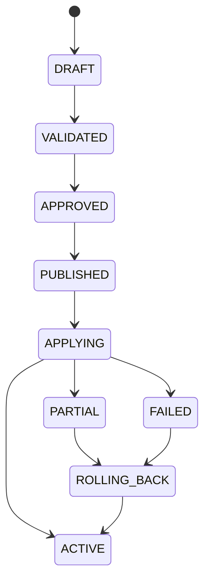


## 14. ADM · BZA Architecture

| Control Plane | 관리 대상 | 연결 원칙 |
|---|---|---|
| ADM | Service, Gateway, Transaction, Batch, Config, Secret Metadata, Approval, Audit, Incident | Owner Query·Command Contract 사용 |
| BZA | 조직, 직원, 사용자, Role, Permission, 결재, 첨부, 알림 | Business Public Contract 사용 |

- 화면 권한은 Menu·Action·API·Data Scope를 서버에서 다시 검사합니다.
- 위험 조치는 대상 Snapshot, Reason, Approval, expectedVersion, Command ID를 연결합니다.
- 조회 결과는 정상·부분·지연·오류 상태를 구분합니다.
- Download와 Raw Data 조회는 별도 권한·사유·감사를 적용합니다.

## 15. 데이터 Architecture

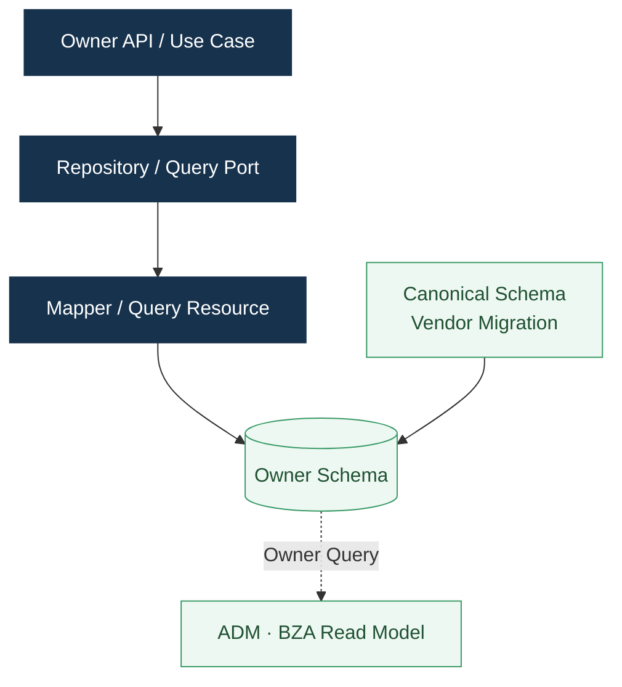

- Schema와 Table은 하나의 Owner를 갖습니다.
- 다른 Module은 Owner API 또는 명시된 Read Contract를 사용합니다.
- Canonical Schema에서 MariaDB·PostgreSQL·Oracle Vendor Pack을 생성합니다.
- Migration은 불변 Version, Checksum, 순차 Upgrade, Rollback/Forward Recovery를 사용합니다.
- 상세 규칙과 Table Inventory는 [데이터베이스표준서](데이터베이스표준서.md)를 따릅니다.

## 16. 보안과 신뢰 경계

<p align="center">
  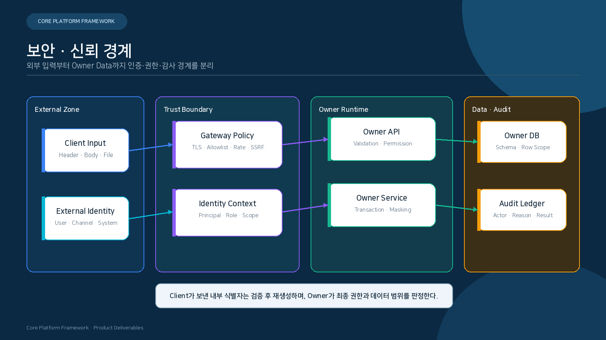
</p>

<p align="center"><sub>외부 입력의 신뢰 수준과 Owner의 최종 권한 판정을 분리합니다.</sub></p>

- Gateway는 외부 Header와 대상 주소를 검증하고 신뢰 가능한 Context만 전달합니다.
- Owner API는 Permission·Data Scope·상태·Version을 기준으로 최종 실행 여부를 판정합니다.
- 개인정보 원문, Secret, Credential은 Response·Log·Trace·Audit에서 각기 다른 정책으로 통제합니다.
- 위험 조치는 Reason·Approval·Expected Version·Audit를 하나의 Command 계약으로 묶습니다.

| 경계 | 핵심 통제 |
|---|---|
| 외부 → Gateway | TLS, Client Identity, Signature, Timestamp, Nonce, Body Hash, 요청 제한 |
| Gateway → Service | 내부 Header 재생성, Audience, Service Identity, Route Policy |
| Browser → ADM/BZA | Server-side Session, CSRF, Secure Cookie, Permission, Session Audit |
| Service → DB | 최소 권한 계정, Parameter Binding, Schema Ownership |
| Service → External | Allowlist, SSRF 차단, TLS 검증, Timeout Budget |
| 운영 조치 | Reason, Approval, expectedVersion, Idempotency, Immutable Audit |

## 17. 관측 · 운영 · 복구

<p align="center">
  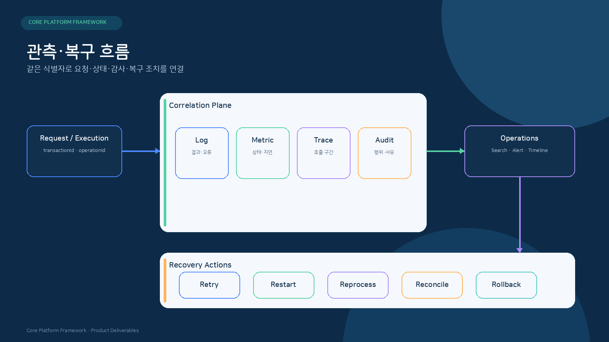
</p>

- transactionId는 Log·Trace·Audit·Event·Batch Execution을 연결합니다.
- Metric은 서비스 상태, 오류율, 지연, Queue, Retry, Lease, Drift를 나타냅니다.
- Trace는 HTTP, DB, Messaging, Batch와 외부 호출 Segment를 연결합니다.
- Audit는 Actor, Subject, Reason, Approval, Before/After, Result를 기록합니다.
- Recovery는 Retry, Restart, Reprocess, Reconcile, Compensation, Rollback을 구분합니다.

## 18. Artifact · 배포 · Generator

### 18.1 Artifact 구성

| 유형 | 예 |
|---|---|
| Library | Core, Common, Starter, Public Contract, Testkit |
| Executable | Gateway, ADM/BZA Backend, Batch Runtime, Reference Runtime |
| Web Artifact | ADM/BZA Static Frontend |
| DB Pack | Vendor별 Install, Migration, Rollback, Runtime Query, Checksum |
| Offline Bundle | BOM, Convention Plugin, Module Artifact, Manifest, Hash |

### 18.2 Generated Domain

```text
Generator Input
→ Plan / Collision Check
→ Module · Package · Build · API · DB · Test 생성
→ Root Include 또는 독립 Repository 연결
→ Local / Remote / Offline Artifact 소비
→ Regenerate / Remove 검증
```

- DomainName, SystemCode, Package, Schema, Port와 Route를 Manifest로 관리합니다.
- Generated Domain은 `cpf-common → cpf-core` 의존 방향을 따릅니다.
- 특정 Domain 이름을 Platform Source에 고정하지 않습니다.
- 사용자 수정 영역과 Generator 관리 영역을 분리합니다.

## 19. Architecture 핵심 결정

| 영역 | 결정 |
|---|---|
| Gateway | Spring Cloud Gateway Server Web MVC 기반 단일 실행 Runtime |
| Messaging | Kafka Primary, at-least-once + Consumer Idempotency |
| Batch | Spring Batch가 Job·Step·Metadata·Restart의 실행 정본 |
| Scheduler | db-scheduler 기본, Batch Scheduler와 기술 Scheduler 책임 분리 |
| Observability | Micrometer Observation + OpenTelemetry |
| Browser Security | Spring Security + Spring Session JDBC BFF |
| Frontend | Vue 3, Vue Router, Pinia, TanStack Query/Table, Zod, Orval, Element Plus |
| DB Migration | Flyway OSS Core와 Canonical Vendor Pack |
| Artifact | LOCAL_DEV · REMOTE · OFFLINE 세 가지 공급 Mode |


## 20. Architecture 검토 관점

| 관점 | 확인 질문 |
|---|---|
| Ownership | 상태·DB·Command의 Owner가 하나로 결정되어 있는가? |
| Contract | 외부 Consumer가 Public API·SPI만 사용하는가? |
| Topology | Local·Remote 전환이 업무 Source를 바꾸지 않는가? |
| Reliability | Timeout·중복·응답 유실·부분 적용의 상태가 구분되는가? |
| Security | 신뢰 경계, Service Identity, Permission과 Audit가 연결되는가? |
| Data | 다른 Module이 Owner Schema를 직접 갱신하지 않는가? |
| Operations | Log·Metric·Trace·Audit가 같은 식별자로 연결되는가? |
| Delivery | Artifact·Config·DB Version과 Rollback 단위가 함께 정의되는가? |

## 21. Source 기준점


| 주제 | 정본 경로 |
|---|---|
| 최상위 목표 | `cpf-docs/governance/CPF_FINAL_TARGET_REQUIREMENTS.md` |
| Module 구성 | `settings.gradle` |
| 기술 Version | `gradle/cpf-stack.properties` |
| Module Dependency | 각 Module `build.gradle` |
| Public API · SPI | `com.cpf.<owner>.api`, `com.cpf.<owner>.spi` |
| DB Canonical | `cpf-tools/db/canonical/platform-schema.json` |
| Vendor Pack | `cpf-tools/db/vendor/<vendor>` |
| Frontend | `cpf-admin/frontend`, `cpf-biz-admin/frontend` |
| Generator | `cpf-tools/generator` |


---

## 문서 기준

| 항목 | 값 |
|---|---|
| Repository | `freeangelsun/202412_01_CPF` |
| Branch | `master` |
| 기준 Commit | `1edd96c6dcc69b0b4d6e9e22a0709d910d7cfb04` |
| 상위 요구사항 정본 | `cpf-docs/governance/CPF_FINAL_TARGET_REQUIREMENTS.md` |
| 문서 표준 | `cpf-docs/specification/CPF_DOCUMENTATION_STANDARD.md` |
| 사실 정본 | Source · SQL · API · Config · Frontend · Script · Test |
