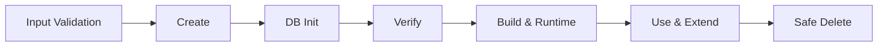

# CPF Generator Guide

## 1. Purpose

CPF Generator는 신규 업무 주제영역을 공식 Module·Package·SystemCode·Config·SQL·Test·EDU 구조로 생성하고 검증합니다.

## 2. Input Model

필수 입력:

- `DomainName`: 읽을 수 있는 업무 이름
- `SystemCode`: 3자리 대문자 내부 식별자
- `BasePackage`: `com.cpf.<domain>`
- `DbVendor`: MariaDB, PostgreSQL, Oracle, SQL Server
- `Capabilities`: 필요한 기능 묶음

선택 Capability:

- `database`
- `batch`
- `external`
- `messaging`
- `file`
- `ui`
- `security`
- `audit`
- `local-call`
- `remote-call`

## 3. Lifecycle



- `create`: Module, Package, Build, Config, SQL, Test와 문서 생성
- `db-init`: 선택 DB Vendor의 schema와 seed 적용
- `verify`: 구조, 잔존, 충돌, build와 contract 검증
- `delete`: 생성 소유 파일만 안전 삭제

## 4. Create a Domain

Windows:

```powershell
.\cpf-tools\generator\create-domain.ps1 `
  -DomainName "payment" `
  -SystemCode "PAY" `
  -BasePackage "com.cpf.payment" `
  -DbVendor "mariadb" `
  -Capabilities "database,batch,external,messaging,ui"
```

Linux/macOS:

```bash
./cpf-tools/generator/create-domain.sh \
  --domain-name payment \
  --system-code PAY \
  --base-package com.cpf.payment \
  --db-vendor mariadb \
  --capabilities database,batch,external,messaging,ui
```

## 5. Collision Validation

생성 전에 다음을 검사합니다.

- 예약 SystemCode
- 기존 DomainName
- `settings.gradle` 등록
- Module 디렉터리
- Java Package
- Spring configuration prefix
- Route
- Port
- SQL schema와 Table prefix
- Queue와 Topic
- Frontend route와 menu code
- ADM registry
- 기존 Generator manifest

충돌이 있으면 일부만 생성하지 않고 전체를 중단합니다.

## 6. Generated Structure

```text
cpf-payment/
├─ build.gradle
├─ src/main/java/com/cpf/payment/
│  ├─ api/
│  ├─ application/
│  ├─ domain/
│  ├─ port/
│  ├─ adapter/
│  ├─ validation/
│  └─ config/
├─ src/main/resources/
│  ├─ application.yml
│  ├─ db/migration/
│  └─ openapi/
├─ src/test/
├─ frontend/                capability 선택 시
└─ GENERATOR_MANIFEST.json
```

선택하지 않은 Capability의 파일, Dependency, 설정과 빈 디렉터리가 남지 않아야 합니다.

## 7. Database Vendor Matrix

```powershell
.\cpf-tools\generator\verify-domain.ps1 `
  -DomainName "payment" `
  -VerifyVendors "mariadb,postgresql,oracle,sqlserver"
```

검증 항목:

- Driver와 Dependency
- JDBC URL 형식
- SQL dialect
- Identity·Sequence
- Timestamp와 Boolean
- CLOB/BLOB
- Index와 constraint
- Flyway location
- Build와 migration parse

## 8. Verify

```powershell
.\cpf-tools\generator\verify-domain.ps1 -DomainName "payment"
```

필수 결과:

- Module 등록
- Package와 SystemCode 정합성
- clean build
- Unit test
- OpenAPI 노출
- 신규 설치 SQL
- Local Facade
- Remote Adapter
- ADM 메뉴·권한 등록
- 선택 Capability 존재
- 미선택 Capability 잔존 0

## 9. Safe Delete

```powershell
.\cpf-tools\generator\remove-domain.ps1 `
  -DomainName "payment" `
  -ExpectedSystemCode "PAY"
```

삭제 전:

- Generator manifest 확인
- 사용자 작성 파일 탐지
- DB object 목록 출력
- Consumer 탐지
- Route·Topic·Menu 의존성 확인
- 삭제 Plan 표시

사용자 작성 파일 또는 외부 Consumer가 있으면 기본적으로 삭제를 중단합니다.

## 10. Regeneration Parity

공식 검증 기준은 `cpf-account`입니다.

```text
snapshot
→ delete
→ residual scan
→ create
→ build
→ test
→ DB install
→ Local/Remote runtime
→ delete
→ regenerate
→ hash and semantic parity
```

생성 시각과 UUID처럼 비결정 값은 parity 비교에서 제외합니다.

## 11. Customization

생성 후 업무 개발자는 다음 영역을 확장합니다.

- `domain`
- `application`
- 고객 Adapter
- 업무 Validation
- API DTO
- EDU scenario

Generator가 관리하는 파일과 사용자 소유 파일을 manifest로 구분합니다.

## 12. Troubleshooting

### Module already exists

- `settings.gradle`
- 디렉터리
- Generator manifest
- ADM registry
- SQL prefix

를 함께 확인합니다.

### Build succeeds but Runtime fails

- component scan
- configuration prefix
- profile
- datasource
- migration
- port
- route

를 확인합니다.

### Delete leaves files

Residual scan 결과를 확인하고 수동 삭제 전에 파일 Owner를 판단합니다.

### Wrong package or SystemCode

문자열 치환으로 수정하지 말고 삭제 후 올바른 입력으로 재생성합니다. 사용자 작성 코드는 diff를 검토하여 이관합니다.
