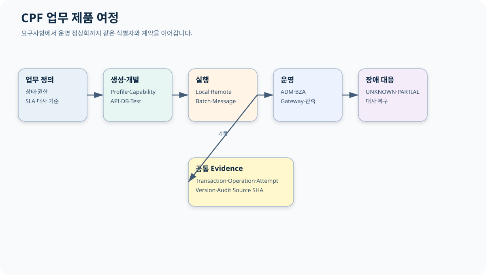
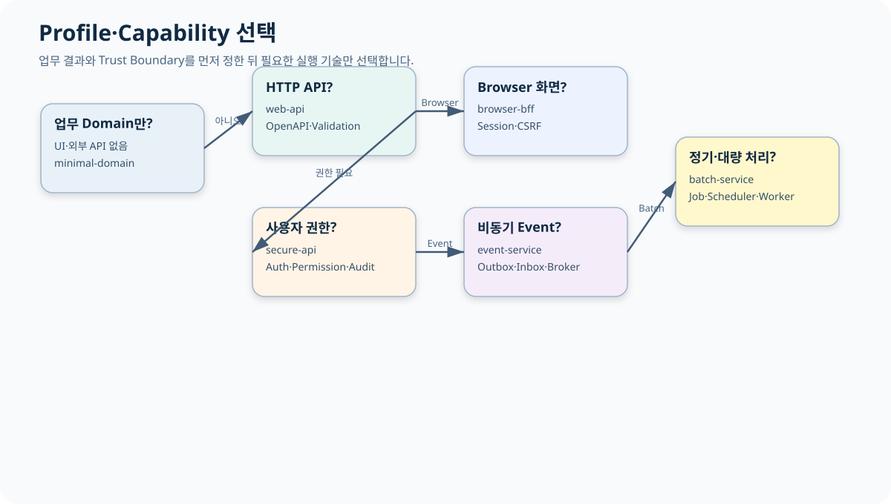

# CPF 프레임워크 안내

> 기준 Repository: `https://github.com/freeangelsun/202412_01_CPF`
> 기준 Branch: `master`
> 기준 Commit: `a8be27a34bdac0b7c075e06d6e86571244c96421` (`06_08`)
> 기준일: `2026-08-06 Asia/Seoul`

| 항목 | 내용 |
|---|---|
| 주 독자 | 도입 검토자·업무 기획자·아키텍트·개발/운영 리더 |
| 이 문서로 완료할 일 | CPF로 만들 시스템을 정의하고 Profile·Capability·Topology·제품 책임과 도입 순서를 결정한다. |
| 읽는 방식 | 처음 접하는 독자는 앞에서부터 실습 순서로 읽고, 숙련자는 장별 판단표와 참조 경로를 사용한다. |
| 설명 원칙 | 제품 기능은 사용할 수 있는 상태로 설명한다. 실제 Source·SQL·API·Config·Frontend·Script·Test의 이름과 경계를 유지한다. |

## 1. 이 문서를 읽고 남겨야 할 결과

이 문서는 Module 이름을 외우는 자료가 아니다. 처음 접하는 독자가 다음 다섯 가지를 결정하는 안내서다.

1. CPF가 담당할 업무 결과와 고객이 직접 결정할 업무 규칙.
2. 온라인·비동기·파일·배치·운영·BZA·Gateway 중 필요한 제품 범위.
3. `minimal-domain`, `web-api`, `secure-api`, `browser-bff`, `event-service`, `batch-service` 중 시작 Profile.
4. Modular Monolith, Microservice, External WAS, Worker Process 중 배포 형태.
5. 개발·운영·보안·DBA·업무 담당자의 책임과 인계 Evidence.

읽기를 마치면 다음 형식의 도입 결정표를 작성한다.

| 결정 항목 | 작성 예 | 확인할 문서 |
|---|---|---|
| 업무 결과 | 결제수단 등록·정지·재개와 기관 등록 결과 대사 | 본 문서 3장, 01 매뉴얼 |
| 상태 Owner | PAY Domain | 본 문서 5장 |
| 공개 채널 | Browser BFF + 외부 Partner API | 본 문서 6장, 91 매뉴얼 |
| 처리 방식 | 동기 Command + Kafka 후속 Event + 일 마감 Batch | 본 문서 4장 |
| 운영 방식 | ADM 조회·승인·복구, BZA 권한·결재 | 본 문서 8장 |
| 데이터 | PostgreSQL, Attachment Object Store | 05 매뉴얼 |
| 장애 기준 | 외부기관 응답 유실은 `UNKNOWN_RESULT` | 본 문서 9장 |

## 2. CPF를 쉬운 말로 설명하면

CPF는 업무 시스템을 만들 때 반복해서 필요한 **실행 규칙과 운영 규칙을 함께 제공하는 Framework**다. 화면이나 API만 빠르게 만드는 도구와 달리, 요청이 중복되거나 서버가 멈추거나 외부기관 응답이 사라졌을 때 무엇을 기준으로 정상화할지까지 제품 계약에 포함한다.

### 2.1 처음 보는 독자가 알아야 할 여섯 단어

| 용어 | 쉬운 설명 | 예 |
|---|---|---|
| Domain | 업무 상태와 규칙을 소유하는 영역 | PAY가 결제수단 상태를 소유 |
| Owner | 최종 상태를 결정하는 Module 또는 Service | ADM 화면이 아니라 PAY Owner가 정지 여부 결정 |
| Consumer | Owner 기능을 실제로 사용하는 쪽 | REST API, ADM, Batch, Gateway |
| Profile | 서비스를 시작할 때 선택하는 기본 실행 형태 | `secure-api`는 인증·권한이 필요한 API |
| Capability | DB·Broker·File·HTTP처럼 추가하는 기술 능력 | `messaging=kafka`, `file=sftp` |
| Evidence | 성공·실패·복구 판정을 뒷받침하는 기록 | API 응답, DB Row, Audit, Trace, Test 결과 |

### 2.2 CPF가 해결하는 질문

- 같은 요청이 두 번 들어오면 업무가 두 번 처리되는가?
- 두 운영자가 같은 Row를 동시에 바꾸면 누구의 변경이 유효한가?
- 외부기관에는 접수됐지만 응답을 받지 못하면 재호출해도 되는가?
- Process가 Chunk Commit 직후 종료되면 어디부터 재시작하는가?
- 일부 Instance만 새 설정을 적용했다면 전체 성공으로 보아도 되는가?
- 운영자가 위험 조치를 할 때 누가 승인하고 무엇을 감사에 남기는가?
- DB Vendor가 달라져도 같은 업무 상태와 Query 의미를 유지하는가?

CPF 문서는 정상 흐름뿐 아니라 위 질문에 답하는 상태·원장·조치 절차를 설명한다.

## 3. 적용 사례로 범위를 고르기

### 3.1 온라인 업무 서비스

고객·계약·결제·정산처럼 조회와 상태 변경 API가 있는 업무다. `secure-api`를 시작점으로 삼고, 상태 변경에는 Expected Version, Reason, Idempotency Key를 사용한다. 외부 후속 처리는 Outbox와 Broker 또는 HTTP Attempt로 분리한다.

**적합한 경우**

- 상태 전이와 권한 판정이 필요하다.
- 같은 요청의 중복 실행을 막아야 한다.
- 운영자가 ADM에서 거래와 오류를 추적해야 한다.

**다른 선택이 나은 경우**

- 단순 정적 페이지나 일회성 Script처럼 장기 상태와 운영 책임이 없다.
- 업무 Owner 없이 여러 화면이 DB를 직접 수정하는 구조를 유지하려 한다.

### 3.2 기관·대외 연계

HTTP, TCP, Fixed-length, ISO8583, SFTP, IBM MQ 등으로 외부기관과 연결한다. 연결 기술보다 먼저 업무 Key, Timeout Budget, Target 접수 ID, 응답 유실 대사 방법을 정한다.

### 3.3 정기·대량 처리

Spring Batch를 Primary Engine으로 사용한다. Tasklet·Chunk·Partition·Remote Worker·Center-Cut 중 처리 단위를 고르고 JobParameter, Checkpoint, 업무 대사 기준을 함께 설계한다.

### 3.4 업무 관리와 승인

조직·직원·사용자·Role·Permission·Data Scope·결재가 업무와 연결되면 BZA를 사용한다. BZA는 업무 상태를 대신 소유하지 않고, 기준일과 Version이 있는 조직·권한·결재 Snapshot을 제공한다.

### 3.5 외부 API 공개

외부 Client와 내부 Service 사이에 Trust Boundary가 필요하면 Gateway를 사용한다. 인증·HMAC·Nonce·SSRF·Rate Limit·Route 게시·Target 적용·Attempt Ledger를 한 경계에서 관리한다.

## 4. 처리 방식 선택표

| 요구 | 우선 선택 | 이유 | 함께 설계할 것 |
|---|---|---|---|
| 요청 시점에 결과가 필요한 조회 | 동기 Query API | 부작용 없이 현재 상태 반환 | Paging·Sort·Data Scope·Masking |
| 상태를 바꾸는 요청 | 동기 Command + Idempotency | 요청자에게 Operation을 반환 | Version·Reason·Audit·응답 유실 |
| 업무 Commit 뒤 후속 처리 | Outbox + Broker | 업무 Transaction과 Publish 분리 | Event Key·Inbox·DLQ·Replay |
| 외부기관 Write | Port + Attempt Ledger | Timeout 뒤 결과를 대사 | Target ID·Payload Hash·Compensation |
| 대량 Row 처리 | Chunk Batch | Commit·Checkpoint·Restart 사용 | Sort Key·Chunk Size·Writer 멱등성 |
| 기준시점 대상 일괄 처리 | Center-Cut | 대상 Snapshot과 승인·대사 | Preview Hash·Execution·합계 |
| 파일 수신·반영 | Attachment/SFTP + File Job | Scan·Checksum·Row 결과 분리 | Temp·Final·Quarantine·Rollback |

## 5. 제품 구성과 책임

| Module | 고객 관점의 책임 | 실제 Consumer | 직접 하면 안 되는 일 |
|---|---|---|---|
| `cpf-core` | 기술 중립 Public API·SPI, Context, Error, 식별자 | 모든 Runtime과 업무 Domain | Starter·Admin·Batch를 역참조 |
| `cpf-common` | Calendar·Code·Message·Template 등 고객 공통 정책 | 업무 Domain·ADM·BZA | 공통 기준정보를 각 업무가 중복 소유 |
| `cpf-starters` | 선택 Provider와 AutoConfiguration | Profile Runtime | 선택하지 않은 기술을 강제 포함 |
| `cpf-batch` | Job·Execution·Scheduler·Worker·Agent·Center-Cut | 배치 개발자·ADM | 업무 원장을 추정해 강제 성공 처리 |
| `cpf-admin` | 플랫폼 운영 조회·조치·승인·감사 | 운영자·승인자·보안 | Owner DB 직접 수정 |
| `cpf-biz-admin` | 조직·사용자·권한·결재 | 업무 관리자·업무 Service | 업무 Domain 상태를 대신 소유 |
| `cpf-gateway` | 외부 진입·Route·보안·Attempt·게시 | 외부 Client·업무 Service·ADM | 내부 호출을 모두 Gateway로 우회 |
| `cpf-tools` | Generator·BOM·DB Pack·검증·Release 도구 | 개발·배포·DBA | Source SHA와 다른 Artifact 배포 |
| `cpf-member` | Generator 산출물의 Golden Domain | 신규 업무 개발자 | 고객 업무 원장으로 사용 |
| `cpf-reference` | 정상·오류·복구 교육 예제 | 교육·회귀 검수 | 제품 기능을 축약한 가짜 성공 흐름 |

## 6. Profile·Capability 선택

### 6.1 Profile

| Profile | 만들어지는 서비스 | 선택 질문 |
|---|---|---|
| `minimal-domain` | Domain·Application 중심 내부 기능 | 외부 API나 Browser 없이 업무 규칙부터 시작하는가? |
| `web-api` | REST·Validation·OpenAPI | 인증 없이 내부 API 계약부터 필요한가? |
| `secure-api` | 인증·권한·Audit가 있는 API | 사용자 또는 서비스 권한 판정이 필요한가? |
| `browser-bff` | Browser Session·CSRF·BFF | Browser 중심 화면과 서버 Session이 필요한가? |
| `event-service` | Producer·Consumer·Outbox·Inbox | 비동기 Event가 업무 결과의 일부인가? |
| `batch-service` | Spring Batch·Scheduler·Worker | 정기·대량·분산 처리가 필요한가? |

### 6.2 Capability

- Data: JDBC, MyBatis, Caffeine, Valkey
- Messaging: Kafka, RabbitMQ, JMS, IBM MQ, reliability ledger
- Integration: HTTP, TCP, Fixed-length, ISO8583, resilience
- File: Attachment, Archive, Tabular, SFTP
- Notification: Dispatch, Email, SMS SPI
- Security: Resource Server, Session, Service Identity, Secret
- Platform Operations: Observability, OTLP, Runtime Control, Feature Flag

Capability는 “많이 선택할수록 좋다”는 목록이 아니다. 업무 결과와 운영 책임이 있는 기능만 선택하고 Generator Manifest와 `resolved-starter-lock.json`에 고정한다.

## 7. Topology 선택

| Topology | 선택 기준 | 주의할 실패 | 확인 Evidence |
|---|---|---|---|
| Embedded Boot JAR | 단일 서비스 독립 기동 | Profile·Port·Secret 오류 | Manifest·Health·Log |
| External WAS WAR | 조직 표준 WAS 사용 | Context Path·Classloader·Session | WAR 배포·Probe·Browser |
| Modular Monolith | 같은 JVM에서 Domain 조합 | Transaction 경계 확대·순환 의존 | ArchUnit·Local Contract Test |
| Microservice | 독립 배포·Scale·장애 격리 | Timeout·Version skew·응답 유실 | Remote Contract·Attempt·Trace |
| Static ADM/BZA | Backend와 Frontend 분리 | Base URL·CORS·권한·Generated Client | Build·Route·Browser Test |
| Runner/Worker Process | Batch 실행 격리 | Lease loss·stale writer·Process Kill | Heartbeat·Fencing·Metadata |
| Multi-zone | 장애 도메인 분리 | Clock·Network partition·Drift | Zone 상태·Failover·Reconcile |

Local과 Remote는 DTO·Validation·Error·Idempotency·Audit 의미가 같아야 한다. 차이는 Network, Serialization, Service Identity, Timeout, Attempt가 추가된다는 점이다.

## 8. 운영 제품 선택

### 8.1 ADM

플랫폼 상태와 고객 업무의 운영 Query·Command를 연결한다. 현재 Route Reader Matrix는 63개 Registry 행을 식별하고, Frontend 단위 Test는 60개를 기대한다. 이 수량 차이는 `재확인 필요`이며 문서는 Registry 행을 누락하지 않는다. `/integrationClosure`는 데이터 품질 정정 승인, 시간 Health, Crypto 상태, Webhook DLQ·Replay를 연결하며 위험도는 `CRITICAL`이다.

### 8.2 BZA

조직·직원·사용자·Role·Permission·Data Scope·결재·위임·대결을 기준일과 Version으로 제공한다. 업무 Service는 BZA의 Effective 결과를 소비하되 최종 업무 상태는 자기 Owner가 판단한다.

### 8.3 Gateway

외부 API의 Listener, Predicate, Rewrite, Target, Authentication, HMAC, Nonce, Timeout, Retry, Circuit, Bulkhead, Rate Limit, Idempotency와 게시 Version을 관리한다.

## 9. 공통 상태와 복구 언어

| 상태 | 의미 | 다음 행동 |
|---|---|---|
| `REQUESTED` | 요청 수락, 부작용 시작 전 | 같은 Key로 새 요청을 만들지 않음 |
| `RUNNING` | 처리 중, 진행 Evidence 존재 | Heartbeat·Deadline 확인 |
| `SUCCEEDED` | 업무 결과가 확정됨 | 재실행 금지, 결과 인계 |
| `FAILED` | 결정적 실패가 확정됨 | 원인 제거 후 새 Operation 또는 Restart |
| `UNKNOWN_RESULT` | 부작용 이후 결과 Evidence 부족 | Target·Owner 원장 대사, Blind Retry 금지 |
| `PARTIAL` | 여러 Target 중 결과 혼합 | 성공 Target 보존, 실패·불명만 조치 |
| `ROLLED_BACK` | 대상이 이전 상태로 복귀 | Rollback Evidence와 Drift 확인 |
| `PARTIALLY_ROLLED_BACK` | 일부만 복귀 | 미복귀 Target 대사·보상 |

## 10. 보안과 감사의 기본선

- 인증 주체와 요청 Body의 Actor를 별도로 믿지 않는다.
- Menu·Button·API·Data Scope·Masking 권한을 각각 판정한다.
- 위험 조치는 Reason, Expected Version, Approval Snapshot, Idempotency Key를 사용한다.
- Secret 원문을 일반 Config, Log, Trace, Support Bundle에 넣지 않는다.
- Audit는 Actor, Reason, Before/After, Operation, Target, 결과와 연결한다.
- Break-glass는 별도 권한·기간·사후 검토를 사용한다.

## 11. 도입 순서

### 11.1 1단계 — 대표 업무 한 개 선택

조회·상태 변경·외부 연계·비동기·운영 화면이 모두 있는 작은 업무를 고른다. PAY 결제수단 예제처럼 정상과 응답 유실을 함께 검증할 수 있어야 한다.

### 11.2 2단계 — Owner와 계약 확정

업무 상태, 권한, Idempotency Key, Version, 오류 코드, 대사 Key를 정한다. ADM·BZA·Gateway는 이 계약을 소비한다.

### 11.3 3단계 — Profile·Capability·Topology 결정

Generator Dry Run에서 해석된 Starter와 DB Vendor를 확인한다. 배포 위치가 바뀌어도 업무 Source가 유지되는지 검토한다.

### 11.4 4단계 — 정상·실패·복구 시나리오 실행

정상 요청, 중복 요청, Version 충돌, Process Kill, Timeout, 응답 유실, 부분 적용을 재현한다. 실행하지 않은 항목은 운영 인계에 남긴다.

### 11.5 5단계 — 운영과 인계

ADM Route, Alert, Runbook, Backup, Rollback, 담당자를 연결한다. 개발 Source만 전달하고 끝내지 않는다.

## 12. 역할별 RACI

| 과제 | 업무 Owner | CPF 개발 | 플랫폼 운영 | DBA | 보안 | ADM/BZA/Gateway 운영 |
|---|---|---|---|---|---|---|
| 업무 상태·대사 기준 | A/R | C | I | C | C | C |
| Profile·Capability | C | A/R | C | C | C | I |
| DB Schema·Migration | C | R | C | A/R | I | I |
| 권한·Masking | A | R | I | I | A/R | C |
| 배포·Config·Secret | I | C | A/R | C | A/R | I |
| 장애 판정·복구 | A | C | R | C | C | A/R |
| Audit·Evidence | A | R | R | C | A/R | R |

A는 최종 책임, R은 수행, C는 협의, I는 공유다.

## 13. 도입 검토 체크리스트

1. 업무 상태 Owner가 한 곳으로 정해졌는가?
2. Query와 Command를 분리했는가?
3. 중복 요청과 Version 충돌 판정이 있는가?
4. 외부 부작용 뒤 응답 유실 대사 방법이 있는가?
5. Local·Remote 계약이 같은가?
6. 필요한 Profile·Capability만 선택했는가?
7. 선택하지 않은 Provider가 Runtime·Config·SQL을 요구하지 않는가?
8. Batch Restart와 업무 대사 기준이 있는가?
9. ADM·BZA·Gateway가 Owner DB를 직접 바꾸지 않는가?
10. Artifact·DB·Config·Secret·Backup·Rollback 책임자가 정해졌는가?
11. 정상·오류·부분 실패·복구 Test가 계획됐는가?
12. 운영 인계만으로 교대자가 다음 행동을 판단할 수 있는가?

## 14. 다음 문서 선택

- 온라인·연계 개발: [01 개발자 매뉴얼](01_개발자매뉴얼.md)
- Batch: [02 배치 개발 매뉴얼](02_배치개발매뉴얼.md)
- ADM 연동: [03 ADM 개발자 매뉴얼](03_ADM개발자매뉴얼.md)
- ADM 운영: [04 ADM 운영자 매뉴얼](04_ADM운영자매뉴얼.md)
- 설치·배포·DR: [05 플랫폼 운영 매뉴얼](05_플랫폼운영매뉴얼.md)
- 조직·권한·결재: [90 BZA 매뉴얼](90_BZA매뉴얼.md)
- 외부 API: [91 Gateway 매뉴얼](91_Gateway매뉴얼.md)

<!-- CPF_R10_QUALITY_EXPANSION -->

## 부록 A. 처음 도입하는 팀의 15개 대표 업무 시나리오

아래 시나리오는 제품 기능을 나열하는 표가 아니라, 도입 회의에서 **어떤 기능을 고르고 어디까지 검증할지** 결정하기 위한 작업 카드다. 각 행의 복구 기준까지 합의되지 않으면 구현 범위를 확정하지 않는다.

| 업무 시나리오 | 선택 제품·Profile | 설계 핵심 | 실패 시 판정·복구 |
|---|---|---|---|
| 고객 계정 조회·상태 변경 | secure-api + persistence + audit | Query와 Command를 분리하고 상태 변경에 expectedVersion·reason·idempotencyKey를 사용 | 409 충돌 시 최신 상태를 다시 읽고 사용자가 재판단 |
| 외부기관 계좌 등록 | integration-http + resilience + attempt ledger | Timeout Budget과 기관 접수 ID를 저장하고 응답 유실을 UNKNOWN_RESULT로 분류 | 기관 상태조회로 대사하고 새 Operation으로 확정 |
| 대량 신청 파일 반영 | file + tabular + batch-service | Upload→검증→Preview→승인→Apply→Result Artifact 순서 | 부분 실패 Row만 재처리하고 전체 합계를 대사 |
| 일별 정산 | batch-service + scheduler + partition | JobParameter·Checkpoint·Commit·대사식을 설계 | Process Kill 후 동일 JobInstance를 Restart하고 금액 합계 확인 |
| 실시간 후속 알림 | event-service + outbox/inbox + notification | 업무 Commit과 Outbox를 묶고 Consumer Inbox로 중복 차단 | DLQ 원인 제거 후 Replay하고 Receipt를 확인 |
| 조직별 데이터 조회 | BZA + secure-api | 기준일 조직·Role·Data Scope를 계산해 Query에 적용 | 권한 변경 뒤 Session 재평가와 Export Audit 확인 |
| 위험 조치 승인 | ADM/BZA approval | 승인 Snapshot·Requester·Approver 분리·만료시간을 저장 | 만료 또는 Version Drift 시 새 승인 요청 |
| 외부 API 공개 | Gateway + security + route publish | Route·Predicate·Rewrite·HMAC·SSRF·Target Group을 검증 후 게시 | Target NACK이면 Partial 상태를 대사하고 LKG로 복원 |
| 다중 인스턴스 배포 | runtime control + observability | Desired/Observed Version과 Target ACK를 추적 | NACK Target만 원인 제거 후 재적용하거나 전체 Rollback |
| 개인정보 다운로드 | masking + download audit | 화면 조회와 Export 권한을 분리하고 Token 만료·사유를 기록 | 권한 실패·만료 시 새 요청, 원본 로그 노출 금지 |
| 공통 코드·영업일 | cpf-common + cache invalidation | Version·Effective Date·Durable invalidation을 사용 | Cache Signal 유실 시 Ledger Checkpoint 이후 Reconcile |
| Webhook 수신·재전송 | webhook + crypto + DLQ | Signature·Timestamp·Nonce·Body Hash를 검증하고 Delivery Attempt 저장 | DLQ 원인 제거 뒤 동일 Payload Hash로 Replay |
| 파일 첨부와 악성 파일 차단 | attachment + security | Size·MIME·확장자·Checksum·Virus Scan·Storage Key를 검증 | 격리 후 승인된 정정 파일만 새 Version으로 등록 |
| 서비스 간 호출 | Local/Remote facade | DTO·Validation·Error·Audit 의미를 동일하게 유지 | Remote Timeout은 결과 불명 가능성을 분리하고 Trace로 대사 |
| 재해복구 전환 | backup/restore + DR | RPO/RTO·Writer Lease·DNS·Config·Secret·Object Storage 순서를 정의 | Failback 전 양쪽 원장 차이를 대사하고 Writer를 하나만 활성화 |

### A.1 도입 회의에서 사용할 질문

1. 최종 상태를 소유하는 Owner는 어느 Module인가?
2. 화면·API·Batch·Gateway 중 실제 Consumer는 무엇인가?
3. 정상 응답을 받지 못했을 때 부작용 발생 여부를 어떻게 확인하는가?
4. 중복 요청과 동시 수정은 어떤 Key·Version으로 막는가?
5. 운영자가 ADM/BZA/Gateway에서 상태와 Audit를 찾을 수 있는가?
6. 재처리와 Rollback이 원본 실행을 덮어쓰지 않고 새 Operation으로 남는가?
7. DB Vendor·Topology·다중 Instance가 바뀌어도 계약 의미가 같은가?

## 부록 B. 선택 결정표

| 판단 주제 | 선택 A | 선택 B | 결정 근거 |
|---|---|---|---|
| 호출 위치 | Same-JVM Local Facade | Remote Facade | 독립 배포·장애 격리·Network 실패를 감수할 필요 |
| 상태 변경 | 동기 Command | 비동기 Event | 사용자가 같은 요청에서 결과를 알아야 하는지와 외부 부작용 여부 |
| 대량 처리 | Chunk | Partition/Remote Worker | 데이터량·처리시간·Worker 수·Partition 재시작 필요 |
| 스케줄 | db-scheduler | Quartz Adapter | 단순 Cluster Trigger인지 복잡 Calendar·고급 기능인지 |
| Cache | Caffeine | Valkey | Instance 간 공유·분산 무효화·장애 시 원장 복구 필요 |
| 브라우저 보안 | Browser BFF Session | Service Resource Server | 사용자가 Browser인지 시스템 간 Client인지 |
| 외부 공개 | Service 직접 API | Gateway | 외부 Trust Boundary·HMAC·Rate Limit·Attempt Ledger 필요 |
| 배포 | Rolling | Blue-Green/Canary | Artifact·DB 호환성과 빠른 Traffic 복귀 필요 |
| 복구 | Retry | Reconcile/Compensation | 실패가 확정됐는지 결과 불명인지 |
| 파일 처리 | 동기 Upload | File Job/Batch | 파일 크기·Preview·부분 실패·대사 필요 |

## 부록 C. 초보자를 위한 CPF 용어 사전

| 용어 | 쉬운 설명 |
|---|---|
| Owner | 업무 상태와 최종 판정을 책임지는 Module 또는 Service |
| Consumer | Owner의 공개 계약을 실제로 호출하는 화면·서비스·배치 |
| Public API | 다른 Module이 사용하도록 호환성을 관리하는 공개 계약 |
| SPI | Provider 교체를 위해 구현자가 제공해야 하는 확장 계약 |
| Internal | Owner 내부에서만 사용하며 외부 Compile을 막는 구현 |
| Profile | 업무 시작 형태를 고르는 승인된 Starter 조합 |
| Leaf Starter | 하나의 기술 기능과 AutoConfiguration을 소유하는 Starter |
| Resolved Lock | Generator가 실제 선택한 Starter와 Version을 고정한 파일 |
| Idempotency Key | 같은 업무 요청의 중복 실행을 식별하는 Key |
| Request Hash | 같은 Key에 다른 Payload가 들어오는 것을 막는 Hash |
| Expected Version | 사용자가 읽은 Version과 현재 Version을 비교하는 값 |
| Optimistic Lock | 동시에 수정한 요청 중 오래된 요청을 409로 차단하는 방식 |
| Outbox | 업무 Commit과 함께 저장해 나중에 Broker로 발행하는 원장 |
| Inbox | Consumer가 처리한 Event를 기록해 재전달 중복을 막는 원장 |
| DLQ | 정해진 Retry 뒤에도 처리하지 못한 메시지를 격리하는 Queue |
| Attempt Ledger | 외부 호출 시도·대상·응답·결과 불명을 기록하는 원장 |
| UNKNOWN_RESULT | 외부 부작용 발생 여부를 아직 확정할 수 없는 상태 |
| Reconcile | 여러 원장과 외부 상태를 비교해 결과를 확정하는 작업 |
| Reprocess | 실패 대상을 새 실행으로 다시 처리하는 작업 |
| Replay | 동일 Event 또는 Delivery를 원본 근거와 함께 다시 전달하는 작업 |
| Compensation | 이미 발생한 부작용을 반대 업무로 상쇄하는 작업 |
| Rollback | 이전 Artifact·Config·Route·Schema 호환 상태로 되돌리는 작업 |
| LKG | 최근 정상 적용본(Last Known Good) |
| Lease | 한 실행자에게 일정 시간 작업 소유권을 부여하는 기록 |
| Fencing Token | Lease를 잃은 이전 실행자의 늦은 쓰기를 차단하는 증가 Token |
| Checkpoint | 재시작할 위치와 처리 상태를 저장한 지점 |
| Center-Cut | 대량 대상의 선정·분할·실행·결과·대사를 일관되게 관리하는 처리 |
| Data Scope | 사용자가 조회·변경할 수 있는 조직·고객·업무 범위 |
| Masking | 권한에 따라 민감 Field 일부를 가리는 처리 |
| Reason | 위험 조치의 업무 사유 |
| Approval Snapshot | 승인 당시 대상·값·Version을 변경 불가 형태로 고정한 내용 |
| Desired Version | Control Plane이 적용하려는 Version |
| Observed Version | 각 Runtime이 실제 보고한 Version |
| ACK/NACK | Target이 적용 성공 또는 거부를 보고하는 결과 |
| Drift | Desired와 Observed 또는 Target 간 설정 차이 |
| Trace ID | 여러 Service·Batch·Gateway Segment를 연결하는 추적 식별자 |
| Operation ID | 한 번의 상태 변경·복구·배포 요청을 추적하는 식별자 |
| Transaction ID | 업무 거래의 요청·응답·로그를 연결하는 식별자 |
| Business ID | 계좌·신청·결제 등 업무 객체를 식별하는 값 |
| Timeout Budget | 상위 요청 시간을 하위 호출에 배분한 시간 한도 |
| Bulkhead | 한 기능의 장애가 전체 Thread·Connection을 소진하지 않게 분리하는 경계 |
| Circuit Breaker | 연속 실패 시 호출을 잠시 차단하는 상태 기계 |
| Rate Limit | Client·Route별 허용 요청량 제한 |
| Nonce | 재전송 공격을 막기 위한 1회성 값 |
| Body Hash | 요청 Body 변조를 확인하는 Hash |
| Audience | Token 또는 Signature가 사용될 대상 Service |
| SSRF | 서버가 공격자가 지정한 내부 주소로 호출하도록 유도하는 공격 |
| Canary | 일부 Target에 먼저 적용해 관측 후 확대하는 방식 |
| Blue-Green | 현재 환경과 새 환경을 병렬 준비한 뒤 Traffic을 전환하는 방식 |
| RPO/RTO | 허용 데이터 손실 시점과 복구 시간 목표 |

## 부록 D. 4주 학습·도입 순서

| 주차 | 학습 결과 | 실습 | 완료 판정 |
|---|---|---|---|
| 1주차 | CPF 제품 범위·Owner·Profile·Topology 결정 | 00 안내서의 대표 시나리오 3개를 선택해 Decision Record 작성 | 선택하지 않은 기능과 이유까지 기록 |
| 2주차 | 온라인 업무 Golden Journey 구현 | 01의 PAY Query·Command·Idempotency·Audit 실습 | 정상·중복·409·응답 유실 Test와 ADM Trace 확인 |
| 3주차 | Batch·ADM·BZA·Gateway 연동 | 02·03·90·91의 각 종합 실습 1개 수행 | 상태·승인·ACK/NACK·Restart·Reconcile Evidence 확보 |
| 4주차 | 설치·배포·복구 인계 | 05의 신규 설치·Canary·Backup·Restore·DR Tabletop | 운영자가 문서만 보고 복구 판정표를 작성 |

### D.1 도입 완료 문서 묶음

- 선택 Profile·Capability와 `resolved-starter-lock.json` 검토 결과
- 업무 상태도·Permission·Data Scope·Approval 정책
- API·Event·File·DB Schema와 Version 정책
- 정상·오류·중복·동시성·Timeout·응답 유실 Test 결과
- ADM/BZA/Gateway 운영 위치와 권한표
- 설치·Config·Secret·Migration·Backup·Rollback·DR 인계표

<!-- CPF_R10_REFERENCE_EXPANSION -->

## 부록 E. 고객 기능 50개 실무 사전

이 사전은 기능 이름만 나열하지 않는다. 처음 도입하는 사용자가 **어떤 입력을 준비하고 무엇을 정상으로 판정하며 실패하면 어디서 복구하는지** 빠르게 찾기 위한 참조다. 상세 Source와 Test는 연결된 역할별 매뉴얼에서 확인한다.

### E.1 Generator Dry Run과 충돌 검토

| 질문 | 답 |
|---|---|
| 무엇을 만드는가 | Generator Dry Run과 충돌 검토 |
| Owner·Source | cpf-tools/generator |
| 실제 Consumer | 고객 업무·ADM/BZA/Gateway/운영 |
| 준비할 입력 | DomainName·SystemCode·Profile·DB Vendor |
| 정상 판정 | 생성 경로·Starter Lock·충돌 목록 확인 |
| 대표 실패 | 기존 파일 충돌·지원하지 않는 조합 |
| 복구 | Dry Run 결과를 수정하고 적용 전 diff를 재검토 |
| 운영 위치 | /configs |
| 읽을 문서 | 자동 분류 |
| 검수 상태 | 완료 |

### E.2 secure-api Profile 조립

| 질문 | 답 |
|---|---|
| 무엇을 만드는가 | secure-api Profile 조립 |
| Owner·Source | cpf-starters/profiles/secure-api |
| 실제 Consumer | 고객 업무·ADM/BZA/Gateway/운영 |
| 준비할 입력 | Resource Server·Audit·Persistence 선택 |
| 정상 판정 | 선택 Starter만 Classpath·Health에 나타남 |
| 대표 실패 | 선택하지 않은 Provider Bean 유입 |
| 복구 | Resolved Lock과 dependencyInsight로 원인을 제거 |
| 운영 위치 | /openApiOperations |
| 읽을 문서 | 자동 분류 |
| 검수 상태 | 완료 |

### E.3 조건 검색과 Paging

| 질문 | 답 |
|---|---|
| 무엇을 만드는가 | 조건 검색과 Paging |
| Owner·Source | cpf-reference 온라인 EDU |
| 실제 Consumer | 고객 업무·ADM/BZA/Gateway/운영 |
| 준비할 입력 | 검색 Field·Page·Size·Sort |
| 정상 판정 | 허용 Sort와 Data Scope가 적용된 Page 응답 |
| 대표 실패 | 허용되지 않은 Sort·과대 Page |
| 복구 | 400으로 차단하고 최대 Page Size를 유지 |
| 운영 위치 | /transactions |
| 읽을 문서 | 자동 분류 |
| 검수 상태 | 완료 |

### E.4 상세 조회와 Masking

| 질문 | 답 |
|---|---|
| 무엇을 만드는가 | 상세 조회와 Masking |
| Owner·Source | cpf-reference 온라인 EDU |
| 실제 Consumer | 고객 업무·ADM/BZA/Gateway/운영 |
| 준비할 입력 | Business ID·Actor·Data Scope |
| 정상 판정 | 권한별 Masking 결과와 조회 Audit |
| 대표 실패 | 타 조직 ID·원문 민감값 조회 |
| 복구 | 403 또는 Masked 응답, Audit로 시도 확인 |
| 운영 위치 | /auditLogs |
| 읽을 문서 | 자동 분류 |
| 검수 상태 | 완료 |

### E.5 Versioned 상태 변경

| 질문 | 답 |
|---|---|
| 무엇을 만드는가 | Versioned 상태 변경 |
| Owner·Source | cpf-reference 온라인 EDU |
| 실제 Consumer | 고객 업무·ADM/BZA/Gateway/운영 |
| 준비할 입력 | expectedVersion·reason·command body |
| 정상 판정 | 상태·Version·History·Audit가 한 Transaction으로 변경 |
| 대표 실패 | 오래된 Version |
| 복구 | 409와 현재 Version 반환 후 사용자가 재판단 |
| 운영 위치 | /transactionGroups |
| 읽을 문서 | 자동 분류 |
| 검수 상태 | 완료 |

### E.6 Idempotency 동일 요청 재호출

| 질문 | 답 |
|---|---|
| 무엇을 만드는가 | Idempotency 동일 요청 재호출 |
| Owner·Source | cpf-reference reliability EDU |
| 실제 Consumer | 고객 업무·ADM/BZA/Gateway/운영 |
| 준비할 입력 | Idempotency-Key·Request Hash |
| 정상 판정 | 원본 결과를 반환하고 부작용 1회 |
| 대표 실패 | 응답 유실 뒤 같은 요청 재호출 |
| 복구 | 원본 Operation 결과 조회, 새 Row 생성 금지 |
| 운영 위치 | /reliability |
| 읽을 문서 | 자동 분류 |
| 검수 상태 | 완료 |

### E.7 Idempotency Key Payload 충돌

| 질문 | 답 |
|---|---|
| 무엇을 만드는가 | Idempotency Key Payload 충돌 |
| Owner·Source | cpf-reference reliability EDU |
| 실제 Consumer | 고객 업무·ADM/BZA/Gateway/운영 |
| 준비할 입력 | 같은 Key·다른 Payload |
| 정상 판정 | 409 또는 typed conflict |
| 대표 실패 | Key 재사용으로 다른 업무 실행 시도 |
| 복구 | 원본 Hash를 유지하고 새 Key 발급 |
| 운영 위치 | /incidents |
| 읽을 문서 | 자동 분류 |
| 검수 상태 | 완료 |

### E.8 Optimistic Lock 동시 수정

| 질문 | 답 |
|---|---|
| 무엇을 만드는가 | Optimistic Lock 동시 수정 |
| Owner·Source | cpf-reference concurrency EDU |
| 실제 Consumer | 고객 업무·ADM/BZA/Gateway/운영 |
| 준비할 입력 | 두 사용자의 동일 Version |
| 정상 판정 | 한 요청 성공·다른 요청 409 |
| 대표 실패 | Last-write-wins로 덮어쓰기 |
| 복구 | 최신 상태 재조회와 사유 재입력 |
| 운영 위치 | /transactions |
| 읽을 문서 | 자동 분류 |
| 검수 상태 | 완료 |

### E.9 업무 Transaction과 Audit

| 질문 | 답 |
|---|---|
| 무엇을 만드는가 | 업무 Transaction과 Audit |
| Owner·Source | cpf-reference transaction EDU |
| 실제 Consumer | 고객 업무·ADM/BZA/Gateway/운영 |
| 준비할 입력 | Actor·Reason·Before/After |
| 정상 판정 | 업무 Row·History·Audit Commit 시점 일치 |
| 대표 실패 | Audit만 Commit 또는 업무만 Commit |
| 복구 | Transaction Rollback 후 재시도 가능 상태 확인 |
| 운영 위치 | /auditLogs |
| 읽을 문서 | 자동 분류 |
| 검수 상태 | 완료 |

### E.10 Outbox 원자 저장

| 질문 | 답 |
|---|---|
| 무엇을 만드는가 | Outbox 원자 저장 |
| Owner·Source | cpf-reference messaging EDU |
| 실제 Consumer | 고객 업무·ADM/BZA/Gateway/운영 |
| 준비할 입력 | Event Type·Aggregate ID·Payload |
| 정상 판정 | 업무 Commit과 Outbox Row 동시 저장 |
| 대표 실패 | DB Commit 후 Process 종료 |
| 복구 | Publisher가 미발행 Row를 Claim해 발행 |
| 운영 위치 | /reliability |
| 읽을 문서 | 자동 분류 |
| 검수 상태 | 완료 |

### E.11 Outbox Publisher Lease

| 질문 | 답 |
|---|---|
| 무엇을 만드는가 | Outbox Publisher Lease |
| Owner·Source | cpf-reference messaging EDU |
| 실제 Consumer | 고객 업무·ADM/BZA/Gateway/운영 |
| 준비할 입력 | Lease Owner·Fencing Token |
| 정상 판정 | 다중 Instance 중 한 Publisher만 발행 |
| 대표 실패 | Lease 만료 뒤 이전 Publisher 늦은 갱신 |
| 복구 | Fencing Token으로 stale writer 차단 |
| 운영 위치 | /topology |
| 읽을 문서 | 자동 분류 |
| 검수 상태 | 완료 |

### E.12 Inbox 중복 소비 차단

| 질문 | 답 |
|---|---|
| 무엇을 만드는가 | Inbox 중복 소비 차단 |
| Owner·Source | cpf-reference messaging EDU |
| 실제 Consumer | 고객 업무·ADM/BZA/Gateway/운영 |
| 준비할 입력 | Event ID·Consumer ID |
| 정상 판정 | 재전달 시 기존 처리 결과 반환 |
| 대표 실패 | ACK 전 Consumer 종료 |
| 복구 | Inbox와 업무 결과를 확인하고 ACK만 재수행 |
| 운영 위치 | /reliability |
| 읽을 문서 | 자동 분류 |
| 검수 상태 | 완료 |

### E.13 Broker DLQ와 Replay

| 질문 | 답 |
|---|---|
| 무엇을 만드는가 | Broker DLQ와 Replay |
| Owner·Source | cpf-reference messaging EDU |
| 실제 Consumer | 고객 업무·ADM/BZA/Gateway/운영 |
| 준비할 입력 | DLQ ID·reason·approval |
| 정상 판정 | 원인 제거 뒤 새 Replay Operation 완료 |
| 대표 실패 | 원인 미해결 Blind Replay |
| 복구 | Replay 중단, Payload와 Consumer Version 분석 |
| 운영 위치 | /recoveryCenter |
| 읽을 문서 | 자동 분류 |
| 검수 상태 | 완료 |

### E.14 Kafka Consumer Process Kill

| 질문 | 답 |
|---|---|
| 무엇을 만드는가 | Kafka Consumer Process Kill |
| Owner·Source | cpf-reference fault EDU |
| 실제 Consumer | 고객 업무·ADM/BZA/Gateway/운영 |
| 준비할 입력 | Fault Point·Event ID |
| 정상 판정 | 재기동 후 중복 부작용 없이 완료 |
| 대표 실패 | Commit 후 ACK 전 Kill |
| 복구 | Inbox 기준으로 재전달을 정상화 |
| 운영 위치 | /incidents |
| 읽을 문서 | 자동 분류 |
| 검수 상태 | 완료 |

### E.15 RabbitMQ Provider 교체

| 질문 | 답 |
|---|---|
| 무엇을 만드는가 | RabbitMQ Provider 교체 |
| Owner·Source | cpf-starters/messaging-rabbitmq |
| 실제 Consumer | 고객 업무·ADM/BZA/Gateway/운영 |
| 준비할 입력 | Exchange·Routing Key·Queue |
| 정상 판정 | 업무 Event DTO와 실패 의미 유지 |
| 대표 실패 | Provider SDK Type이 Public API에 노출 |
| 복구 | Adapter 경계로 이동하고 Contract Test 재실행 |
| 운영 위치 | /notifications |
| 읽을 문서 | 자동 분류 |
| 검수 상태 | 완료 |

### E.16 JMS Provider 교체

| 질문 | 답 |
|---|---|
| 무엇을 만드는가 | JMS Provider 교체 |
| Owner·Source | cpf-starters/messaging-jms |
| 실제 Consumer | 고객 업무·ADM/BZA/Gateway/운영 |
| 준비할 입력 | Destination·Ack Mode |
| 정상 판정 | 표준 Event·Retry·DLQ 계약 유지 |
| 대표 실패 | Transaction/Ack 의미 불일치 |
| 복구 | Provider별 Adapter Test와 운영 정책 보정 |
| 운영 위치 | /reliability |
| 읽을 문서 | 자동 분류 |
| 검수 상태 | 완료 |

### E.17 IBM MQ 연계

| 질문 | 답 |
|---|---|
| 무엇을 만드는가 | IBM MQ 연계 |
| Owner·Source | cpf-starters/messaging-ibm-mq |
| 실제 Consumer | 고객 업무·ADM/BZA/Gateway/운영 |
| 준비할 입력 | Queue Manager·Channel·TLS Secret |
| 정상 판정 | MQMD/Correlation과 CPF 식별자 연결 |
| 대표 실패 | Channel Down·Backout Queue |
| 복구 | Backout 원인 제거 후 승인 Replay |
| 운영 위치 | /messages |
| 읽을 문서 | 자동 분류 |
| 검수 상태 | 완료 |

### E.18 HTTP Timeout Budget

| 질문 | 답 |
|---|---|
| 무엇을 만드는가 | HTTP Timeout Budget |
| Owner·Source | cpf-starters/http-client |
| 실제 Consumer | 고객 업무·ADM/BZA/Gateway/운영 |
| 준비할 입력 | 상위 Deadline·Connect/Read Timeout |
| 정상 판정 | 하위 Timeout 합이 상위 Budget 이내 |
| 대표 실패 | 하위 Timeout이 상위보다 김 |
| 복구 | 정책 검증에서 차단하고 Budget 재배분 |
| 운영 위치 | /resiliencePolicies |
| 읽을 문서 | 자동 분류 |
| 검수 상태 | 완료 |

### E.19 HTTP 응답 유실

| 질문 | 답 |
|---|---|
| 무엇을 만드는가 | HTTP 응답 유실 |
| Owner·Source | cpf-reference integration EDU |
| 실제 Consumer | 고객 업무·ADM/BZA/Gateway/운영 |
| 준비할 입력 | Operation ID·Target Request ID |
| 정상 판정 | Attempt가 UNKNOWN_RESULT로 보존 |
| 대표 실패 | Target 접수 후 Client Timeout |
| 복구 | Status API/대사 파일로 결과 확정 |
| 운영 위치 | /incidents |
| 읽을 문서 | 자동 분류 |
| 검수 상태 | 완료 |

### E.20 Circuit Breaker 전이

| 질문 | 답 |
|---|---|
| 무엇을 만드는가 | Circuit Breaker 전이 |
| Owner·Source | cpf-starters/resilience |
| 실제 Consumer | 고객 업무·ADM/BZA/Gateway/운영 |
| 준비할 입력 | 실패율·Open Duration·Half-open Probe |
| 정상 판정 | CLOSED→OPEN→HALF_OPEN→CLOSED 관측 |
| 대표 실패 | Retry Storm과 Thread 고갈 |
| 복구 | Retry를 줄이고 Bulkhead·Timeout을 함께 조정 |
| 운영 위치 | /resiliencePolicies |
| 읽을 문서 | 자동 분류 |
| 검수 상태 | 완료 |

### E.21 TCP Length Framing

| 질문 | 답 |
|---|---|
| 무엇을 만드는가 | TCP Length Framing |
| Owner·Source | cpf-starters/integration-tcp |
| 실제 Consumer | 고객 업무·ADM/BZA/Gateway/운영 |
| 준비할 입력 | Length Header·Charset·Max Frame |
| 정상 판정 | 한 Frame이 정확히 Decode |
| 대표 실패 | 길이 불일치·Oversize |
| 복구 | Connection 종료·원문 격리·재전송 판단 |
| 운영 위치 | /messages |
| 읽을 문서 | 자동 분류 |
| 검수 상태 | 완료 |

### E.22 TCP CRLF Framing

| 질문 | 답 |
|---|---|
| 무엇을 만드는가 | TCP CRLF Framing |
| Owner·Source | cpf-starters/integration-tcp |
| 실제 Consumer | 고객 업무·ADM/BZA/Gateway/운영 |
| 준비할 입력 | Delimiter·Escape 규칙 |
| 정상 판정 | 경계가 정확한 Message 생성 |
| 대표 실패 | 본문 CRLF 오해석 |
| 복구 | Escape/Length 방식으로 계약 변경 |
| 운영 위치 | /messages |
| 읽을 문서 | 자동 분류 |
| 검수 상태 | 완료 |

### E.23 TCP STX/ETX Framing

| 질문 | 답 |
|---|---|
| 무엇을 만드는가 | TCP STX/ETX Framing |
| Owner·Source | cpf-starters/integration-tcp |
| 실제 Consumer | 고객 업무·ADM/BZA/Gateway/운영 |
| 준비할 입력 | STX·ETX·DLE 규칙 |
| 정상 판정 | Control Byte 포함 Payload 복원 |
| 대표 실패 | DLE 누락·Frame 중첩 |
| 복구 | Connection Reset과 원문 분석 |
| 운영 위치 | /messages |
| 읽을 문서 | 자동 분류 |
| 검수 상태 | 완료 |

### E.24 Fixed-length 전문

| 질문 | 답 |
|---|---|
| 무엇을 만드는가 | Fixed-length 전문 |
| Owner·Source | cpf-starters/integration-fixedlength |
| 실제 Consumer | 고객 업무·ADM/BZA/Gateway/운영 |
| 준비할 입력 | Layout Version·Charset·Padding |
| 정상 판정 | Golden Bytes와 Object 상호 변환 |
| 대표 실패 | Byte 길이·한글 Charset 오류 |
| 복구 | 원문 보존 후 Layout Version으로 재파싱 |
| 운영 위치 | /messages |
| 읽을 문서 | 자동 분류 |
| 검수 상태 | 완료 |

### E.25 ISO8583 전문

| 질문 | 답 |
|---|---|
| 무엇을 만드는가 | ISO8583 전문 |
| Owner·Source | cpf-starters/integration-iso8583 |
| 실제 Consumer | 고객 업무·ADM/BZA/Gateway/운영 |
| 준비할 입력 | MTI·Bitmap·Field Spec |
| 정상 판정 | Golden Message·MAC·Correlation 일치 |
| 대표 실패 | Bitmap·MAC·Field Length 오류 |
| 복구 | NACK·격리 후 Spec Version 재확인 |
| 운영 위치 | /messages |
| 읽을 문서 | 자동 분류 |
| 검수 상태 | 완료 |

### E.26 Attachment Upload

| 질문 | 답 |
|---|---|
| 무엇을 만드는가 | Attachment Upload |
| Owner·Source | cpf-starters/file-attachment |
| 실제 Consumer | 고객 업무·ADM/BZA/Gateway/운영 |
| 준비할 입력 | Size·MIME·Checksum·Owner |
| 정상 판정 | Metadata·Object·Audit 연결 |
| 대표 실패 | 확장자 위장·Checksum 불일치 |
| 복구 | 격리하고 Object 삭제 또는 재검사 |
| 운영 위치 | /downloads |
| 읽을 문서 | 자동 분류 |
| 검수 상태 | 완료 |

### E.27 Archive 안전 해제

| 질문 | 답 |
|---|---|
| 무엇을 만드는가 | Archive 안전 해제 |
| Owner·Source | cpf-starters/file-archive |
| 실제 Consumer | 고객 업무·ADM/BZA/Gateway/운영 |
| 준비할 입력 | Entry Count·Total Size·Path |
| 정상 판정 | 허용 경로 아래에 제한된 Entry만 생성 |
| 대표 실패 | Zip Slip·압축폭탄 |
| 복구 | 전체 해제 중단·임시폴더 삭제·Audit |
| 운영 위치 | /file-jobs |
| 읽을 문서 | 자동 분류 |
| 검수 상태 | 완료 |

### E.28 Tabular Preview·Apply

| 질문 | 답 |
|---|---|
| 무엇을 만드는가 | Tabular Preview·Apply |
| Owner·Source | cpf-starters/file-tabular-poi |
| 실제 Consumer | 고객 업무·ADM/BZA/Gateway/운영 |
| 준비할 입력 | Schema·Header·Row Limit |
| 정상 판정 | Preview 건수·오류 Row·Hash 고정 |
| 대표 실패 | Apply 중 일부 Row 실패 |
| 복구 | 성공·실패 Row 원장 분리 후 실패만 Reprocess |
| 운영 위치 | /file-jobs |
| 읽을 문서 | 자동 분류 |
| 검수 상태 | 완료 |

### E.29 SFTP 수신

| 질문 | 답 |
|---|---|
| 무엇을 만드는가 | SFTP 수신 |
| Owner·Source | cpf-starters/integration-sftp |
| 실제 Consumer | 고객 업무·ADM/BZA/Gateway/운영 |
| 준비할 입력 | Remote Path·Host Key·Checksum |
| 정상 판정 | Temp Download→검증→Atomic Move |
| 대표 실패 | 중간 끊김·Host Key 변경 |
| 복구 | 부분 파일 삭제·Host Key 승인 확인 후 재수신 |
| 운영 위치 | /file-jobs |
| 읽을 문서 | 자동 분류 |
| 검수 상태 | 완료 |

### E.30 Email Notification

| 질문 | 답 |
|---|---|
| 무엇을 만드는가 | Email Notification |
| Owner·Source | cpf-starters/notification-email |
| 실제 Consumer | 고객 업무·ADM/BZA/Gateway/운영 |
| 준비할 입력 | Template·Recipient·Correlation |
| 정상 판정 | Delivery·Receipt·Audit 연결 |
| 대표 실패 | SMTP Timeout·Bounce |
| 복구 | Attempt 상태에 따라 Retry 또는 DLQ |
| 운영 위치 | /notifications |
| 읽을 문서 | 자동 분류 |
| 검수 상태 | 완료 |

### E.31 SMS SPI

| 질문 | 답 |
|---|---|
| 무엇을 만드는가 | SMS SPI |
| Owner·Source | cpf-notification-sms-spi |
| 실제 Consumer | 고객 업무·ADM/BZA/Gateway/운영 |
| 준비할 입력 | Template·Phone Token·Provider |
| 정상 판정 | 원문 전화번호 비노출, Receipt 연결 |
| 대표 실패 | Provider Timeout·중복 발송 |
| 복구 | Idempotency와 Provider Message ID로 대사 |
| 운영 위치 | /notifications |
| 읽을 문서 | 자동 분류 |
| 검수 상태 | 완료 |

### E.32 Caffeine Local Cache

| 질문 | 답 |
|---|---|
| 무엇을 만드는가 | Caffeine Local Cache |
| Owner·Source | cpf-starters/cache-caffeine |
| 실제 Consumer | 고객 업무·ADM/BZA/Gateway/운영 |
| 준비할 입력 | Key·TTL·Maximum Size |
| 정상 판정 | Owner 조회 감소와 TTL 만료 확인 |
| 대표 실패 | Stale Entry·Memory Pressure |
| 복구 | Namespace Evict 후 Owner에서 재적재 |
| 운영 위치 | /cache |
| 읽을 문서 | 자동 분류 |
| 검수 상태 | 완료 |

### E.33 Valkey Distributed Cache

| 질문 | 답 |
|---|---|
| 무엇을 만드는가 | Valkey Distributed Cache |
| Owner·Source | cpf-starters/cache-valkey |
| 실제 Consumer | 고객 업무·ADM/BZA/Gateway/운영 |
| 준비할 입력 | TLS·Key Prefix·Payload Limit |
| 정상 판정 | 다중 Instance가 같은 Cache Version 관측 |
| 대표 실패 | Valkey Down·Partial Key |
| 복구 | Fail-open/closed 정책 적용 후 Ledger Reconcile |
| 운영 위치 | /cache |
| 읽을 문서 | 자동 분류 |
| 검수 상태 | 완료 |

### E.34 Durable Cache Invalidation

| 질문 | 답 |
|---|---|
| 무엇을 만드는가 | Durable Cache Invalidation |
| Owner·Source | cpf-common cache invalidation |
| 실제 Consumer | 고객 업무·ADM/BZA/Gateway/운영 |
| 준비할 입력 | Event ID·Checkpoint·Consumer ID |
| 정상 판정 | Signal 유실 뒤에도 Checkpoint 이후 복구 |
| 대표 실패 | Pub/Sub Signal 유실 |
| 복구 | Durable Ledger를 읽어 누락 Event 재적용 |
| 운영 위치 | /cache |
| 읽을 문서 | 자동 분류 |
| 검수 상태 | 완료 |

### E.35 Feature Flag Override

| 질문 | 답 |
|---|---|
| 무엇을 만드는가 | Feature Flag Override |
| Owner·Source | cpf-starters/feature-flag |
| 실제 Consumer | 고객 업무·ADM/BZA/Gateway/운영 |
| 준비할 입력 | Typed Value·Rule·Expiry·Approval |
| 정상 판정 | 평가 Evidence와 Runtime 결과 일치 |
| 대표 실패 | 만료 누락·잘못된 Target |
| 복구 | Override 폐기 또는 Kill Switch |
| 운영 위치 | /featureFlags |
| 읽을 문서 | 자동 분류 |
| 검수 상태 | 완료 |

### E.36 Secret Rotation

| 질문 | 답 |
|---|---|
| 무엇을 만드는가 | Secret Rotation |
| Owner·Source | cpf-starters/secret |
| 실제 Consumer | 고객 업무·ADM/BZA/Gateway/운영 |
| 준비할 입력 | Secret Reference·Version·Grace |
| 정상 판정 | 새 Version 사용과 원문 비노출 |
| 대표 실패 | 일부 Consumer 구 Version |
| 복구 | Grace 내 재적용, 실패 Consumer 격리 |
| 운영 위치 | /secrets |
| 읽을 문서 | 자동 분류 |
| 검수 상태 | 완료 |

### E.37 Service Identity

| 질문 | 답 |
|---|---|
| 무엇을 만드는가 | Service Identity |
| Owner·Source | cpf-starters/security-service-identity |
| 실제 Consumer | 고객 업무·ADM/BZA/Gateway/운영 |
| 준비할 입력 | Audience·Scope·Credential Reference |
| 정상 판정 | Service 간 인증·권한 Audit |
| 대표 실패 | Wrong Audience·Expired Credential |
| 복구 | Credential 교체와 실패 Attempt 확인 |
| 운영 위치 | /security |
| 읽을 문서 | 자동 분류 |
| 검수 상태 | 완료 |

### E.38 Browser Session·CSRF

| 질문 | 답 |
|---|---|
| 무엇을 만드는가 | Browser Session·CSRF |
| Owner·Source | cpf-starters/profile-browser-bff |
| 실제 Consumer | 고객 업무·ADM/BZA/Gateway/운영 |
| 준비할 입력 | Secure Cookie·CSRF Token·Session ID |
| 정상 판정 | JS가 Token 원문에 접근하지 않음 |
| 대표 실패 | CSRF·Session Fixation·Role Revoke |
| 복구 | Session 폐기·재로그인·권한 재평가 |
| 운영 위치 | /operators |
| 읽을 문서 | 자동 분류 |
| 검수 상태 | 완료 |

### E.39 Data Scope와 Masking

| 질문 | 답 |
|---|---|
| 무엇을 만드는가 | Data Scope와 Masking |
| Owner·Source | cpf-starters/security |
| 실제 Consumer | 고객 업무·ADM/BZA/Gateway/운영 |
| 준비할 입력 | Actor·Organization·Field Policy |
| 정상 판정 | 조회·Export에서 다른 Masking 정책 적용 |
| 대표 실패 | 권한 우회·Raw Export |
| 복구 | 403·Masked 결과·Download Audit 확인 |
| 운영 위치 | /permissions |
| 읽을 문서 | 자동 분류 |
| 검수 상태 | 완료 |

### E.40 Business Calendar

| 질문 | 답 |
|---|---|
| 무엇을 만드는가 | Business Calendar |
| Owner·Source | cpf-common calendar |
| 실제 Consumer | 고객 업무·ADM/BZA/Gateway/운영 |
| 준비할 입력 | Calendar ID·Date·Day Type·Version |
| 정상 판정 | 기준일 계산과 Consumer Refresh 일치 |
| 대표 실패 | 유효기간 겹침·휴일 누락 |
| 복구 | 새 Version 저장 후 Cache Reconcile |
| 운영 위치 | /businessCalendar |
| 읽을 문서 | 자동 분류 |
| 검수 상태 | 완료 |

### E.41 Time·Deadline

| 질문 | 답 |
|---|---|
| 무엇을 만드는가 | Time·Deadline |
| Owner·Source | cpf-common time |
| 실제 Consumer | 고객 업무·ADM/BZA/Gateway/운영 |
| 준비할 입력 | UTC Instant·Business Zone·Deadline |
| 정상 판정 | 저장 UTC와 화면 업무시각 일치 |
| 대표 실패 | Clock Skew·DST 경계 |
| 복구 | Time Health 확인 후 실행 차단 또는 보정 |
| 운영 위치 | /integrationClosure |
| 읽을 문서 | 자동 분류 |
| 검수 상태 | 완료 |

### E.42 Data Quality Quarantine

| 질문 | 답 |
|---|---|
| 무엇을 만드는가 | Data Quality Quarantine |
| Owner·Source | cpf-common data quality |
| 실제 Consumer | 고객 업무·ADM/BZA/Gateway/운영 |
| 준비할 입력 | Rule Set·Record ID·Payload Hash |
| 정상 판정 | 위반 Row 격리와 원본 보존 |
| 대표 실패 | 오탐·Rule Version Drift |
| 복구 | Rule Version 확인 후 승인 정정 |
| 운영 위치 | /integrationClosure |
| 읽을 문서 | 자동 분류 |
| 검수 상태 | 완료 |

### E.43 정정 승인 Snapshot

| 질문 | 답 |
|---|---|
| 무엇을 만드는가 | 정정 승인 Snapshot |
| Owner·Source | cpf-admin integration closure |
| 실제 Consumer | 고객 업무·ADM/BZA/Gateway/운영 |
| 준비할 입력 | Quarantine ID·expectedVersion·reason |
| 정상 판정 | 승인 Snapshot과 실행 대상 일치 |
| 대표 실패 | 승인 후 Payload 변경·만료 |
| 복구 | 실행 차단 후 새 승인 요청 |
| 운영 위치 | /approvals |
| 읽을 문서 | 자동 분류 |
| 검수 상태 | 완료 |

### E.44 OpenAPI Snapshot Refresh

| 질문 | 답 |
|---|---|
| 무엇을 만드는가 | OpenAPI Snapshot Refresh |
| Owner·Source | cpf-starters/openapi-webmvc |
| 실제 Consumer | 고객 업무·ADM/BZA/Gateway/운영 |
| 준비할 입력 | Title·Version·Docs Path·Instance |
| 정상 판정 | Schema Hash와 Controller 일치 |
| 대표 실패 | 중복 Operation ID·Unsafe Path |
| 복구 | Schema 수정 후 Refresh 제한을 지켜 재실행 |
| 운영 위치 | /openApiOperations |
| 읽을 문서 | 자동 분류 |
| 검수 상태 | 완료 |

### E.45 Local·Remote 계약 동등성

| 질문 | 답 |
|---|---|
| 무엇을 만드는가 | Local·Remote 계약 동등성 |
| Owner·Source | cpf-reference contract fixture |
| 실제 Consumer | 고객 업무·ADM/BZA/Gateway/운영 |
| 준비할 입력 | 동일 Request Fixture |
| 정상 판정 | 응답·Error·Audit 의미 동등 |
| 대표 실패 | Remote Serialization·Timeout 차이 |
| 복구 | Adapter 수정 후 같은 Contract Test 재실행 |
| 운영 위치 | /transactionGroups |
| 읽을 문서 | 자동 분류 |
| 검수 상태 | 완료 |

### E.46 Tasklet 단일 작업

| 질문 | 답 |
|---|---|
| 무엇을 만드는가 | Tasklet 단일 작업 |
| Owner·Source | cpf-reference batch EDU |
| 실제 Consumer | 고객 업무·ADM/BZA/Gateway/운영 |
| 준비할 입력 | JobParameter·Resource |
| 정상 판정 | 작업 1회와 ExitStatus 기록 |
| 대표 실패 | 중간 예외 |
| 복구 | 멱등성 확인 후 Restart |
| 운영 위치 | - |
| 읽을 문서 | 자동 분류 |
| 검수 상태 | 완료 |

### E.47 Chunk Reader·Processor·Writer

| 질문 | 답 |
|---|---|
| 무엇을 만드는가 | Chunk Reader·Processor·Writer |
| Owner·Source | cpf-reference batch EDU |
| 실제 Consumer | 고객 업무·ADM/BZA/Gateway/운영 |
| 준비할 입력 | Page Size·Chunk Size |
| 정상 판정 | Read/Write/Commit 건수 일치 |
| 대표 실패 | Writer 실패 |
| 복구 | 마지막 Commit 이후 Restart |
| 운영 위치 | - |
| 읽을 문서 | 자동 분류 |
| 검수 상태 | 완료 |

### E.48 Paging Reader 정렬

| 질문 | 답 |
|---|---|
| 무엇을 만드는가 | Paging Reader 정렬 |
| Owner·Source | cpf-batch |
| 실제 Consumer | 고객 업무·ADM/BZA/Gateway/운영 |
| 준비할 입력 | PK Sort·Page Size |
| 정상 판정 | 중복·누락 없는 전체 순회 |
| 대표 실패 | 정렬 Key 중복 |
| 복구 | 복합 Sort Key로 보정 |
| 운영 위치 | - |
| 읽을 문서 | 자동 분류 |
| 검수 상태 | 완료 |

### E.49 Cursor Reader Resource

| 질문 | 답 |
|---|---|
| 무엇을 만드는가 | Cursor Reader Resource |
| Owner·Source | cpf-batch |
| 실제 Consumer | 고객 업무·ADM/BZA/Gateway/운영 |
| 준비할 입력 | Fetch Size·Connection |
| 정상 판정 | Resource가 Step 종료 시 닫힘 |
| 대표 실패 | Connection Drop |
| 복구 | Checkpoint와 재연결 정책으로 Restart |
| 운영 위치 | - |
| 읽을 문서 | 자동 분류 |
| 검수 상태 | 완료 |

### E.50 Processor Validation

| 질문 | 답 |
|---|---|
| 무엇을 만드는가 | Processor Validation |
| Owner·Source | cpf-reference batch EDU |
| 실제 Consumer | 고객 업무·ADM/BZA/Gateway/운영 |
| 준비할 입력 | Rule Version·Item |
| 정상 판정 | 오류 Item이 지정 정책으로 분류 |
| 대표 실패 | 검증 예외 폭증 |
| 복구 | Skip 한도 초과 시 Job 실패 |
| 운영 위치 | - |
| 읽을 문서 | 자동 분류 |
| 검수 상태 | 완료 |
