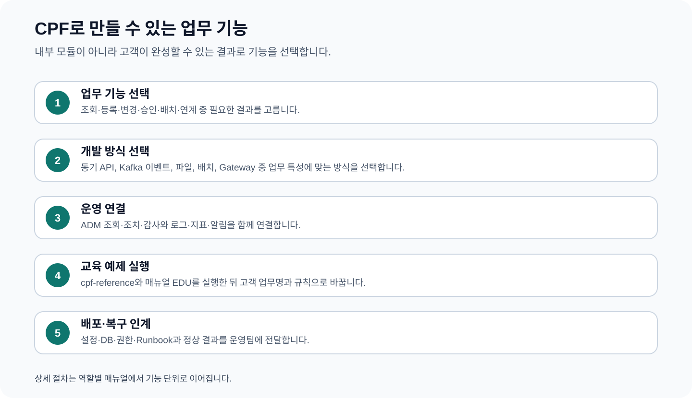

# CPF 프레임워크 안내 — 고객이 만들 수 있는 기능과 선택 방법

> **주 독자**: CPF를 처음 접하는 고객사 업무 기획자, 기술 책임자, 개발·배치·운영 리더
> **이 문서의 목표**: CPF 내부를 공부하는 문서가 아니다. CPF로 만들 수 있는 업무 기능을 확인하고 필요한 매뉴얼과 제품을 선택한다.

## 빠른 찾기

- [1. 10분 안에 확인할 세 가지](#1-10분-안에-확인할-세-가지)
- [2. CPF로 만들 수 있는 기능](#2-cpf로-만들-수-있는-기능)
- [2.1 도입 회의에서 바로 사용할 기능 선택표](#21-도입-회의에서-바로-사용할-기능-선택표)
- [3. 대표 고객 업무별 읽는 순서](#3-대표-고객-업무별-읽는-순서)
- [4. 처리 방식을 선택하는 질문](#4-처리-방식을-선택하는-질문)
- [5. 역할별 시작 문서](#5-역할별-시작-문서)
- [6. 업무 서비스 생성](#6-업무-서비스-생성)
- [7. 목록·상세 조회](#7-목록상세-조회)
- [8. 등록·수정·상태변경](#8-등록수정상태변경)
- [9. 동시 수정 충돌 방지](#9-동시-수정-충돌-방지)
- [10. 중복 방지·결과 대사](#10-중복-방지결과-대사)
- [11. 서비스 간 업무 연결](#11-서비스-간-업무-연결)
- [12. Kafka 비동기 처리](#12-kafka-비동기-처리)
- [13. 파일·첨부](#13-파일첨부)
- [14. 외부 REST 연계](#14-외부-rest-연계)
- [15. 고정길이·전문 연계](#15-고정길이전문-연계)
- [16. 권한·데이터 범위·감사](#16-권한데이터-범위감사)
- [17. Cache·기능 전환·Secret](#17-cache기능-전환secret)
- [18. 알림·내보내기](#18-알림내보내기)
- [19. DB 설치·변경](#19-db-설치변경)
- [20. 장애 시험·운영 인계](#20-장애-시험운영-인계)
- [21. 정기·대량 배치](#21-정기대량-배치)
- [22. ADM 업무 운영 연결](#22-adm-업무-운영-연결)
- [23. 플랫폼 설치·운영](#23-플랫폼-설치운영)
- [24. 조직·권한·결재](#24-조직권한결재)
- [25. 공통 API 진입점(Gateway)](#25-공통-api-진입점gateway)
- [26. 같은 애플리케이션과 분리 서비스 선택](#26-같은-애플리케이션과-분리-서비스-선택)
- [27. 기본 기능과 선택 제품](#27-기본-기능과-선택-제품)
- [28. 처음 접하는 팀의 권장 도입 순서](#28-처음-접하는-팀의-권장-도입-순서)
- [29. 용어를 쉽게 읽는 방법](#29-용어를-쉽게-읽는-방법)
- [30. 기준 정보](#30-기준-정보)

## 1. 10분 안에 확인할 세 가지

1. 아래 기능표에서 만들려는 업무가 가능한지 확인한다.
2. 대표 업무 흐름에서 필요한 기능 조합과 읽을 매뉴얼 순서를 확인한다.
3. 해당 매뉴얼의 교육 예제를 실행한 뒤 고객 업무 이름·상태·권한·DB로 바꾼다.

## 2. CPF로 만들 수 있는 기능

| 기능 | 가능 여부 | 고객이 만들 수 있는 결과 | 선택할 상황 | 상세 문서 | 교육 |
|---|---|---|---|---|---|
| 업무 서비스 생성 | 가능 | 회원·계약·지급·정산처럼 독립된 업무 영역 | 새 업무 소유권·DB·API·배포 단위가 필요할 때 | 01 개발자 3장 | EDU-DEV-01 |
| 목록·상세 조회 | 가능 | 검색·정렬·페이지·상세 조회 API와 화면 | 데이터를 변경하지 않고 정보를 제공할 때 | 01 개발자 4장 | EDU-DEV-02 |
| 등록·수정·상태변경 | 가능 | 신청·접수·승인요청·정지·재개 | 업무 상태와 변경 사유를 관리할 때 | 01 개발자 5장 | EDU-DEV-03 |
| 동시 수정 충돌 방지 | 가능 | 다른 사용자의 최신 변경을 덮어쓰지 않는 수정 | 한도·재고·설정·상태를 여러 사용자가 바꿀 때 | 01 개발자 6장 | EDU-DEV-04 |
| 중복 방지·결과 대사 | 가능 | 같은 요청은 한 번만 처리하고 응답 유실 결과 확인 | 결제·이체·신청·외부 변경 요청 | 01 개발자 7장 | EDU-DEV-05 |
| 서비스 간 업무 연결 | 가능 | 회원 확인 후 계약 생성처럼 여러 업무 연계 | 기능의 소유 서비스가 서로 다를 때 | 01 개발자 8장 | EDU-DEV-06 |
| Kafka 비동기 처리 | 가능 | 업무 완료 후 알림·정산·통계 후속 처리 | 호출자가 기다릴 필요가 없거나 소비자가 여러 개일 때 | 01 개발자 9장 | EDU-DEV-07 |
| 파일·첨부 | 가능 | 증빙·신청서·대량 파일 업로드·검사·다운로드 | 업무 데이터와 파일 수명주기가 함께 필요할 때 | 01 개발자 10장 | EDU-DEV-08 |
| 외부 REST 연계 | 가능 | 본인확인·주소·신용평가·결제대행 호출 | HTTP 외부 서비스와 연계할 때 | 01 개발자 11장 | EDU-DEV-09 |
| 고정길이·전문 연계 | 가능 | 기관·레거시 전문 생성·송수신·대사 | 필드 위치·길이·인코딩이 계약일 때 | 01 개발자 12장 | EDU-DEV-10 |
| 권한·데이터 범위·감사 | 가능 | 역할·조직에 따른 API·버튼·데이터 제한 | 개인정보·금융정보·운영 조치가 있을 때 | 01 개발자 13장 | EDU-DEV-11 |
| Cache·기능 전환·Secret | 가능 | 반복 조회 개선·점진 적용·비밀값 보호 | 성능·단계적 출시·외부 인증정보가 필요할 때 | 01 개발자 14장 | EDU-DEV-12 |
| 알림·내보내기 | 가능 | 업무 알림과 CSV·파일 결과 제공 | 처리 완료 통지·보고·대량 결과가 필요할 때 | 01 개발자 15장 | EDU-DEV-13 |
| DB 설치·변경 | 가능 | 3종 DB의 설치·Upgrade·Rollback | Table·Column·Index·Seed가 바뀔 때 | 01 개발자 16장 | EDU-DEV-14 |
| 장애 시험·운영 인계 | 가능 | 중복·시간초과·Process 종료·부분 실패 검증 | 모든 업무 기능의 배포 전 | 01 개발자 17장 | EDU-DEV-15 |
| 정기·대량 배치 | 가능 | 마감·정산·대량변환·파일처리·분할처리 | 사용자 요청 없이 많은 대상을 처리할 때 | 02 배치 개발 | EDU-BAT-* |
| ADM 업무 운영 연결 | 가능 | 고객 업무 조회·재처리·승인·감사 화면 | 운영자가 DB·Script 없이 관리해야 할 때 | 03·04 ADM | EDU-ADM-* |
| 플랫폼 설치·운영 | 가능 | 개발환경·DB·배포·관측·백업·DR | 고객 환경을 준비하고 지속 운영할 때 | 05 플랫폼 운영 | EDU-OPS-* |
| 조직·권한·결재 | 가능 | 조직·직원·역할·데이터 범위·결재 | 고객 업무에 관리조직과 승인 절차가 필요할 때 | 90 BZA | EDU-BZA-* |
| API Gateway | 가능 | 공통 주소·인증·라우팅·제한·게시 | 여러 고객 API를 공통 진입점으로 공개할 때 | 91 Gateway | EDU-GW-* |

## 2.1 도입 회의에서 바로 사용할 기능 선택표

| 고객 요구 | CPF에서 선택할 기능 | 함께 읽을 문서 | 먼저 확정할 값 |
|---|---|---|---|
| 일반 업무 API | 조회·등록·상태변경·동시성·중복 방지 | 01 | 업무 상태·권한·식별자·DB |
| 서비스 간 후속 처리 | 같은 애플리케이션·분리 서비스 호출, Kafka | 01 | 동기/비동기, 시간 제한, 결과 조회 |
| 증빙·기관 연계 | 파일·외부 REST·고정길이 전문 | 01 | 파일 정책, 기관 계약, 응답 유실 대사 |
| 정기·대량 처리 | Chunk·분할·원격 작업자·센터컷·일정 | 02 | 업무일, 대상 선정, 저장 지점, 합계 |
| 운영 화면 | ADM 조회·조치·승인·감사 연동 | 03, 04 | 운영 질문, 검색값, 허용 조치, 정상화 기준 |
| 설치·배포·복구 | 설정·DB·배포·관측·백업·DR | 05 | 환경, 배포 단위, RPO·RTO, 담당자 |
| 조직·권한·결재 | BZA | 90 | 원천 조직, 역할, 데이터 범위, 결재 정책 |
| 공통 API 진입점 | Gateway | 91 | 외부 계약, 대상 서비스, 보안, 게시 방식 |

## 3. 대표 고객 업무별 읽는 순서

| 만들려는 시스템 | 필요 기능 | 매뉴얼 순서 | 완료 결과 |
|---|---|---|---|
| 회원 가입 서비스 | 조회·등록·동시성·멱등성·권한·감사 | 01 → 03 → 04 | 가입 요청 한 번 처리, 상태·Version·감사 확인 |
| 지급·이체 서비스 | 멱등성·외부연계·응답 유실·Kafka·ADM 대사 | 01 → 03 → 04 → 91 | 지급 원장과 외부 결과를 같은 업무 ID로 확정 |
| 월말 정산 | Center-Cut·Partition·Chunk·Scheduler·대사 | 02 → 04 → 05 | 대상 Preview와 처리·제외·오류 합계 일치 |
| 조직 기반 업무 승인 | BZA 조직·역할·데이터 범위·결재·첨부 | 90 → 01 → 04 | 상신 시점 결재선과 업무 상태 반영 |
| 외부 채널 API 공개 | Gateway Route·인증·Timeout·적용 상태 | 91 → 04 → 05 | 모든 Gateway Instance의 Version·Checksum 일치 |

## 4. 처리 방식을 선택하는 질문

| 질문 | 예 | 선택 |
|---|---|---|
| 사용자가 결과를 기다려야 하는가? | 로그인·조회·신청 | 온라인 API |
| 후속 처리를 여러 기능이 받아야 하는가? | 가입 후 알림·포인트·통계 | Kafka 이벤트 |
| 대상이 많고 중간부터 다시 시작해야 하는가? | 월말 정산·대량 변환 | Chunk·Partition 배치 |
| 대상 선정과 승인·합계 대사가 중요한가? | 고객군 일괄 변경 | Center-Cut 배치 |
| 운영자가 DB 없이 상태를 보고 조치해야 하는가? | 재처리·중지·확정 | ADM 연동 |
| 조직·역할·결재가 공통으로 필요한가? | 관리자 업무·승인 | BZA |
| 여러 API를 공통 주소와 정책으로 공개하는가? | 외부 채널 API | Gateway |

## 5. 역할별 시작 문서

| 역할 | 첫 문서 | 그다음 문서 | 완료해야 할 일 |
|---|---|---|---|
| 업무 기획자·아키텍트 | 00 | 필요 기능의 매뉴얼 | 가능 기능·제품·배포 형태 결정 |
| 온라인·연계 개발자 | 01 | 03, 04 | 업무 기능 개발·ADM 연동·운영 인계 |
| 배치 개발자·운영자 | 02 | 04, 05 | 배치 개발·실행·재시작·대사 |
| ADM 연동 개발자 | 03 | 04 | 기존 ADM에 고객 업무 조회·조치·승인 연결 |
| ADM 운영자·승인자 | 04 | 05 | 화면 조회·통제·승인·대사·교대 |
| 플랫폼 운영자·DBA | 05 | 04 | 설치·설정·배포·관측·백업·복구 |
| 조직·권한·결재 담당자 | 90 | 01, 04 | BZA 구성·업무 연결·운영 |
| API·Gateway 담당자 | 91 | 04, 05 | API 등록·검증·게시·복구 |

## 6. 업무 서비스 생성

### 만들 수 있는 결과

회원·계약·지급·정산처럼 독립된 업무 영역

### 선택할 상황

새 업무 소유권·DB·API·배포 단위가 필요할 때

### 첫 작업

업무명·시스템코드·DB·배포단위를 정하고 생성기를 계획 모드로 실행한다.

### 따라갈 문서와 교육

- 상세 절차: **01 개발자 3장**
- 교육 과정: **EDU-DEV-01**

### 도입 완료 판정

기능의 입력·정상 결과·권한·중복·오류·복구·운영 확인 방법이 고객 업무 용어로 정의되면 도입 설계를 완료한다.
## 7. 목록·상세 조회

### 만들 수 있는 결과

검색·정렬·페이지·상세 조회 API와 화면

### 선택할 상황

데이터를 변경하지 않고 정보를 제공할 때

### 첫 작업

검색조건·기본기간·페이지크기·정렬·데이터 범위를 표로 작성한다.

### 따라갈 문서와 교육

- 상세 절차: **01 개발자 4장**
- 교육 과정: **EDU-DEV-02**

### 도입 완료 판정

기능의 입력·정상 결과·권한·중복·오류·복구·운영 확인 방법이 고객 업무 용어로 정의되면 도입 설계를 완료한다.
## 8. 등록·수정·상태변경

### 만들 수 있는 결과

신청·접수·승인요청·정지·재개

### 선택할 상황

업무 상태와 변경 사유를 관리할 때

### 첫 작업

상태표와 허용 전이, 필수 입력, 변경 사유를 먼저 정한다.

### 따라갈 문서와 교육

- 상세 절차: **01 개발자 5장**
- 교육 과정: **EDU-DEV-03**

### 도입 완료 판정

기능의 입력·정상 결과·권한·중복·오류·복구·운영 확인 방법이 고객 업무 용어로 정의되면 도입 설계를 완료한다.
## 9. 동시 수정 충돌 방지

### 만들 수 있는 결과

다른 사용자의 최신 변경을 덮어쓰지 않는 수정

### 선택할 상황

한도·재고·설정·상태를 여러 사용자가 바꿀 때

### 첫 작업

조회 응답과 수정 요청에 Version을 연결하고 조건부 Update를 적용한다.

### 따라갈 문서와 교육

- 상세 절차: **01 개발자 6장**
- 교육 과정: **EDU-DEV-04**

### 도입 완료 판정

기능의 입력·정상 결과·권한·중복·오류·복구·운영 확인 방법이 고객 업무 용어로 정의되면 도입 설계를 완료한다.
## 10. 중복 방지·결과 대사

### 만들 수 있는 결과

같은 요청은 한 번만 처리하고 응답 유실 결과 확인

### 선택할 상황

결제·이체·신청·외부 변경 요청

### 첫 작업

업무 중복 기준, 요청 식별자, 요청 Hash와 결과 조회 API를 정한다.

### 따라갈 문서와 교육

- 상세 절차: **01 개발자 7장**
- 교육 과정: **EDU-DEV-05**

### 도입 완료 판정

기능의 입력·정상 결과·권한·중복·오류·복구·운영 확인 방법이 고객 업무 용어로 정의되면 도입 설계를 완료한다.
## 11. 서비스 간 업무 연결

### 만들 수 있는 결과

회원 확인 후 계약 생성처럼 여러 업무 연계

### 선택할 상황

기능의 소유 서비스가 서로 다를 때

### 첫 작업

호출 순서, 전체 시간 예산, 실패 시 보상·대사 기준을 정한다.

### 따라갈 문서와 교육

- 상세 절차: **01 개발자 8장**
- 교육 과정: **EDU-DEV-06**

### 도입 완료 판정

기능의 입력·정상 결과·권한·중복·오류·복구·운영 확인 방법이 고객 업무 용어로 정의되면 도입 설계를 완료한다.
## 12. Kafka 비동기 처리

### 만들 수 있는 결과

업무 완료 후 알림·정산·통계 후속 처리

### 선택할 상황

호출자가 기다릴 필요가 없거나 소비자가 여러 개일 때

### 첫 작업

Event 이름·Version·Key·순서 범위·재처리 기준을 정한다.

### 따라갈 문서와 교육

- 상세 절차: **01 개발자 9장**
- 교육 과정: **EDU-DEV-07**

### 도입 완료 판정

기능의 입력·정상 결과·권한·중복·오류·복구·운영 확인 방법이 고객 업무 용어로 정의되면 도입 설계를 완료한다.
## 13. 파일·첨부

### 만들 수 있는 결과

증빙·신청서·대량 파일 업로드·검사·다운로드

### 선택할 상황

업무 데이터와 파일 수명주기가 함께 필요할 때

### 첫 작업

허용 형식·크기·검사·격리·보존·다운로드 권한을 정한다.

### 따라갈 문서와 교육

- 상세 절차: **01 개발자 10장**
- 교육 과정: **EDU-DEV-08**

### 도입 완료 판정

기능의 입력·정상 결과·권한·중복·오류·복구·운영 확인 방법이 고객 업무 용어로 정의되면 도입 설계를 완료한다.
## 14. 외부 REST 연계

### 만들 수 있는 결과

본인확인·주소·신용평가·결제대행 호출

### 선택할 상황

HTTP 외부 서비스와 연계할 때

### 첫 작업

인증·시간초과·재시도 가능 단계·상대 상태 조회를 정한다.

### 따라갈 문서와 교육

- 상세 절차: **01 개발자 11장**
- 교육 과정: **EDU-DEV-09**

### 도입 완료 판정

기능의 입력·정상 결과·권한·중복·오류·복구·운영 확인 방법이 고객 업무 용어로 정의되면 도입 설계를 완료한다.
## 15. 고정길이·전문 연계

### 만들 수 있는 결과

기관·레거시 전문 생성·송수신·대사

### 선택할 상황

필드 위치·길이·인코딩이 계약일 때

### 첫 작업

필드 위치·길이·인코딩·기관 오류·재전송 규칙을 표로 만든다.

### 따라갈 문서와 교육

- 상세 절차: **01 개발자 12장**
- 교육 과정: **EDU-DEV-10**

### 도입 완료 판정

기능의 입력·정상 결과·권한·중복·오류·복구·운영 확인 방법이 고객 업무 용어로 정의되면 도입 설계를 완료한다.
## 16. 권한·데이터 범위·감사

### 만들 수 있는 결과

역할·조직에 따른 API·버튼·데이터 제한

### 선택할 상황

개인정보·금융정보·운영 조치가 있을 때

### 첫 작업

업무 행위별 권한과 조직·소유자 범위, 원문 조회를 분리한다.

### 따라갈 문서와 교육

- 상세 절차: **01 개발자 13장**
- 교육 과정: **EDU-DEV-11**

### 도입 완료 판정

기능의 입력·정상 결과·권한·중복·오류·복구·운영 확인 방법이 고객 업무 용어로 정의되면 도입 설계를 완료한다.
## 17. Cache·기능 전환·Secret

### 만들 수 있는 결과

반복 조회 개선·점진 적용·비밀값 보호

### 선택할 상황

성능·단계적 출시·외부 인증정보가 필요할 때

### 첫 작업

원본 우선순위·TTL·기능 종료일·비밀값 보관 위치를 정한다.

### 따라갈 문서와 교육

- 상세 절차: **01 개발자 14장**
- 교육 과정: **EDU-DEV-12**

### 도입 완료 판정

기능의 입력·정상 결과·권한·중복·오류·복구·운영 확인 방법이 고객 업무 용어로 정의되면 도입 설계를 완료한다.
## 18. 알림·내보내기

### 만들 수 있는 결과

업무 알림과 CSV·파일 결과 제공

### 선택할 상황

처리 완료 통지·보고·대량 결과가 필요할 때

### 첫 작업

수신자·채널·재전송·최대 건수·파일 만료와 감사를 정한다.

### 따라갈 문서와 교육

- 상세 절차: **01 개발자 15장**
- 교육 과정: **EDU-DEV-13**

### 도입 완료 판정

기능의 입력·정상 결과·권한·중복·오류·복구·운영 확인 방법이 고객 업무 용어로 정의되면 도입 설계를 완료한다.
## 19. DB 설치·변경

### 만들 수 있는 결과

3종 DB의 설치·Upgrade·Rollback

### 선택할 상황

Table·Column·Index·Seed가 바뀔 때

### 첫 작업

논리 변경과 3종 DB 차이, Backfill·Rollback 순서를 정한다.

### 따라갈 문서와 교육

- 상세 절차: **01 개발자 16장**
- 교육 과정: **EDU-DEV-14**

### 도입 완료 판정

기능의 입력·정상 결과·권한·중복·오류·복구·운영 확인 방법이 고객 업무 용어로 정의되면 도입 설계를 완료한다.
## 20. 장애 시험·운영 인계

### 만들 수 있는 결과

중복·시간초과·Process 종료·부분 실패 검증

### 선택할 상황

모든 업무 기능의 배포 전

### 첫 작업

정상·오류·중복·응답 유실 시나리오와 정상화 판정을 작성한다.

### 따라갈 문서와 교육

- 상세 절차: **01 개발자 17장**
- 교육 과정: **EDU-DEV-15**

### 도입 완료 판정

기능의 입력·정상 결과·권한·중복·오류·복구·운영 확인 방법이 고객 업무 용어로 정의되면 도입 설계를 완료한다.
## 21. 정기·대량 배치

### 만들 수 있는 결과

마감·정산·대량변환·파일처리·분할처리

### 선택할 상황

사용자 요청 없이 많은 대상을 처리할 때

### 첫 작업

업무 기준일·대상 Preview·Chunk·Partition·재시작·대사 기준을 정한다.

### 따라갈 문서와 교육

- 상세 절차: **02 배치 개발**
- 교육 과정: **EDU-BAT-***

### 도입 완료 판정

기능의 입력·정상 결과·권한·중복·오류·복구·운영 확인 방법이 고객 업무 용어로 정의되면 도입 설계를 완료한다.
## 22. ADM 업무 운영 연결

### 만들 수 있는 결과

고객 업무 조회·재처리·승인·감사 화면

### 선택할 상황

운영자가 DB·Script 없이 관리해야 할 때

### 첫 작업

운영자가 답해야 할 질문과 검색·조치·승인·대사 항목을 정한다.

### 따라갈 문서와 교육

- 상세 절차: **03·04 ADM**
- 교육 과정: **EDU-ADM-***

### 도입 완료 판정

기능의 입력·정상 결과·권한·중복·오류·복구·운영 확인 방법이 고객 업무 용어로 정의되면 도입 설계를 완료한다.
## 23. 플랫폼 설치·운영

### 만들 수 있는 결과

개발환경·DB·배포·관측·백업·DR

### 선택할 상황

고객 환경을 준비하고 지속 운영할 때

### 첫 작업

환경·Artifact·DB·Secret·배포·관측·Backup 책임자를 정한다.

### 따라갈 문서와 교육

- 상세 절차: **05 플랫폼 운영**
- 교육 과정: **EDU-OPS-***

### 도입 완료 판정

기능의 입력·정상 결과·권한·중복·오류·복구·운영 확인 방법이 고객 업무 용어로 정의되면 도입 설계를 완료한다.
## 24. 조직·권한·결재

### 만들 수 있는 결과

조직·직원·역할·데이터 범위·결재

### 선택할 상황

고객 업무에 관리조직과 승인 절차가 필요할 때

### 첫 작업

조직 원천·기준일·역할·권한·결재 정책과 업무 연결 Key를 정한다.

### 따라갈 문서와 교육

- 상세 절차: **90 BZA**
- 교육 과정: **EDU-BZA-***

### 도입 완료 판정

기능의 입력·정상 결과·권한·중복·오류·복구·운영 확인 방법이 고객 업무 용어로 정의되면 도입 설계를 완료한다.
## 25. 공통 API 진입점(Gateway)

### 만들 수 있는 결과

공통 주소·인증·라우팅·제한·게시

### 선택할 상황

여러 고객 API를 공통 진입점으로 공개할 때

### 첫 작업

외부 Host·Path·Method·Target·보안·시간초과·Rollback을 정한다.

### 따라갈 문서와 교육

- 상세 절차: **91 Gateway**
- 교육 과정: **EDU-GW-***

### 도입 완료 판정

기능의 입력·정상 결과·권한·중복·오류·복구·운영 확인 방법이 고객 업무 용어로 정의되면 도입 설계를 완료한다.

## 26. 같은 애플리케이션과 분리 서비스 선택

### 같은 애플리케이션에서 시작

팀이 하나이고 배포·장애·용량 경계가 같으면 한 애플리케이션에서 시작한다. 개발과 운영이 단순하고 한 Transaction 안에서 처리하기 쉽다.

### 분리 서비스로 운영

업무 소유팀, 배포 주기, 보안 경계, 장애 격리 또는 용량이 다르면 서비스를 분리한다. 분리한 순간부터 전체 시간 예산, 응답 유실, 멱등성, 대사와 보상을 함께 설계한다.

### 여러 인스턴스 실행

같은 서비스를 여러 인스턴스로 실행할 수 있다. Scheduler·Partition·Runtime 변경처럼 한 실행자만 소유해야 하는 작업은 임대·소유권·과거 실행 차단 기준을 사용한다.

## 27. 기본 기능과 선택 제품

| 구분 | 모든 시스템 | 필요할 때 선택 |
|---|---|---|
| 업무 개발 | 서비스 생성, API, Transaction, 권한, 관측 | Kafka, Cache, File, 외부 연계 |
| 대량 처리 | Spring Batch 기반 Job·Step | Partition, 원격 Worker, Center-Cut |
| 운영 | ADM 조회·로그·거래·장애·배치 운영 | 고객 전용 업무 화면 |
| 업무 관리 | 고객 업무 자체 권한 | BZA 조직·사용자·결재 |
| API 공개 | 서비스 직접 호출 | Gateway 공통 진입점 |

## 28. 처음 접하는 팀의 권장 도입 순서

1. 기능표에서 첫 업무 기능을 고른다.
2. 개발자는 `01_개발자매뉴얼.md`의 같은 기능과 교육 예제를 실행한다.
3. 고객 업무명·상태·권한·DB·오류로 바꿔 구현한다.
4. 대량 처리는 `02_배치개발매뉴얼.md`의 유형을 선택한다.
5. 운영 질문을 정의하고 `03_ADM개발자매뉴얼.md`로 ADM에 연결한다.
6. 운영자는 `04_ADM운영자매뉴얼.md`로 일상·장애·승인 업무를 수행한다.
7. 플랫폼 운영자는 `05_플랫폼운영매뉴얼.md`로 환경을 설치·배포·복구한다.
8. 조직·결재 또는 공통 API 진입점이 필요할 때만 BZA·Gateway를 선택한다.

## 29. 용어를 쉽게 읽는 방법

| 용어 | 고객 업무에서의 뜻 |
|---|---|
| 업무 식별자 | 한 요청과 파생된 로그·메시지·배치를 함께 찾는 값 |
| 멱등성 | 같은 요청을 여러 번 보내도 업무 결과가 한 번만 만들어지는 성질 |
| 결과 미확정 | 요청은 보냈지만 응답을 못 받아 실제 처리 여부를 조회해야 하는 상태 |
| 대사 | 화면·업무 DB·외부기관·메시지·파일 결과를 비교해 실제 결과를 확정하는 작업 |
| 보상 | 이미 끝난 작업을 반대 업무로 상쇄하는 처리 |
| 예상 Version | 조회 이후 다른 사용자가 값을 바꿨는지 확인하는 값 |
| 데이터 범위 | 조직·담당자·업무 소유권에 따라 볼 수 있는 데이터 범위 |
| 추적 정보 | 같은 업무 요청을 로그·지표·분산 추적·감사에서 연결하는 식별 정보 |

## 30. 기준 정보

- Repository: `freeangelsun/202412_01_CPF`
- Branch: `master`
- 기준 Commit: `19dd72b5978f2a3c630943c0fff05bee2d2fed34`
- 교육 애플리케이션: `cpf-reference`
- 생성 업무 기준 예제: `cpf-member`
- 실제 명령과 설정 Key는 기준 Commit의 Script 도움말과 Source를 따른다.
