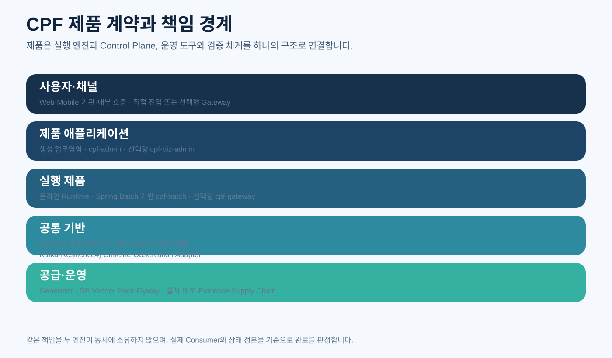

# CPF 프레임워크 안내

> **기준 Repository** `freeangelsun/202412_01_CPF` · **기준 Branch** `master` · **문서 작성 기준 SHA** `d31bd127aa12bb9368933216642a5a9d25bd0bfd`
> **문서 목적** CPF의 제품 범위, 보장 계약, Module 책임, 배포 구성, 보안·운영·공급 기준과 전체 문서 지도를 한곳에서 설명한다.
> **주요 독자** 아키텍트, 기술 책임자, 개발자, 배치 개발자, ADM 개발자, 운영자, 배포·DB 담당자
> **완료 결과** 독자가 CPF의 구성과 책임 경계를 이해하고 자신의 역할에 맞는 매뉴얼과 실제 Source 진입점을 선택한다.

## 0. 문서 사용 계약

이 문서는 제품 정본과 최신 Source를 함께 확인한다. 실행하지 않은 기능이나 검증은 완료로 표현하지 않는다.

문서의 예제는 다음 순서로 읽는다.

1. **제품 계약** — CPF가 보장해야 하는 규칙이다.
2. **현재 구현 확인** — 표에 제시한 Source·설정·API·SQL 경로를 최신 `master`에서 확인한다.
3. **실행 절차** — 명령을 실제 환경에서 실행하고 Exit Code와 결과를 확인한다.
4. **오류·복구** — 정상 경로만 보지 않고 중단·응답 유실·중복·부분 실패를 확인한다.
5. **Evidence** — 실행한 기준 SHA, 환경, 명령, 시작·종료 시각, Exit Code와 Sanitized 결과를 남긴다.

상태는 `완료`, `부분 구현`, `미구현`, `미검증`, `실패`, `재확인 필요`만 사용한다.


## 1. CPF의 정의

CPF의 정식 명칭은 **Core Platform Framework**다. CPF는 공통 Utility 묶음이나 예제 프로젝트가 아니라 시스템을 설계·개발·실행·운영·감사·확장·검증·배포하기 위한 상용 Framework 구조를 목표로 한다.



CPF가 해결하는 범위는 다음과 같다.

| 구분 | 제품이 제공해야 하는 결과 |
|---|---|
| 구조 | Modular Monolith와 MSA, 동일 JVM과 분리 WAS에서 같은 공개 계약 사용 |
| 실행 | 온라인, 비동기, 파일, 외부 연계, Spring Batch 기반 배치 실행 |
| 안정성 | 멱등성, Timeout, Retry, Circuit Breaker, `UNKNOWN_RESULT`, 대사와 보상 |
| 다중 인스턴스 | Lease, Claim, Fencing, 낙관적 잠금, 인계와 Stale 결과 차단 |
| 보안 | 인증, Role·Permission, Session, Secret Reference, 마스킹, 감사 |
| 운영 | 서비스·인스턴스·거래·로그·Trace·Batch 조회와 안전한 제어 |
| 확장 | Generator를 통한 신규 영역 생성, 사용자 코드 보호, Vendor DB 정합성 |
| 공급 | 설치, Migration, Upgrade, Rollback, Offline, SBOM, License, Evidence |

CPF는 특정 업무 이름에 종속되지 않는다. 생성되는 DomainName은 사람이 읽는 이름이고 `SystemCode`는 내부 식별용 3자리 대문자 코드다.

## 2. 제품 구성과 선택 기준

### 2.1 기본 플랫폼

| Module | 제품 책임 | 넣으면 안 되는 책임 |
|---|---|---|
| `cpf-core` | 배포 구성에 독립적인 기술 계약, 공개 API·SPI, 표준 문맥·오류·추적 | 특정 업무, ADM 화면, Batch Runtime, 선택 제품 구현 |
| `cpf-common` | 여러 고객 업무영역이 선택해 쓰는 업무 공통 | 모든 업무의 중앙 경유지, 기술 구현 Dependency의 무조건 전파 |
| `cpf-admin` | 플랫폼 운영·관리 Control Plane과 ADM | 고객 업무 관리 자체, 다른 Owner DB 직접 갱신 |
| 생성 업무영역 | 자신의 API, 상태, 데이터, Transaction과 운영 계약 | 다른 업무영역 데이터의 직접 소유 |

### 2.2 공식 실행 제품

- `cpf-batch` — Spring Batch를 Primary Execution Engine으로 사용하는 Batch·Scheduler·Worker·Agent·Center-Cut 실행 제품이다.
- `cpf-gateway` — 공통 진입 정책이 필요한 환경에서 선택하는 독립 실행 제품이다. 현재 QA32 제품 결정은 Spring Cloud Gateway Server Web MVC와 Embedded Tomcat 기반 단일 `cpf-gateway.jar`다.

### 2.3 선택 업무 관리 제품

- `cpf-biz-admin` — 사용자·조직·Role·Permission·결재·알림·첨부 등 고객 업무 관리 기능이 필요한 경우에 선택한다.
- BZA를 사용하지 않는 시스템은 `cpf-biz-admin`을 필수 Dependency나 기동 조건으로 가져서는 안 된다.

### 2.4 도구와 공급 영역

- `cpf-tools/generator` — 신규 영역 계획, 충돌 검사, 생성, 재생성, Export
- `cpf-tools/db` — Canonical Schema, Vendor SQL, Install, Migration, Verify, Backup·Restore
- `cpf-tools/scripts` — Build, Gate, Local Runtime, Packaging, Evidence
- `cpf-docs` — 제품 스펙, 매뉴얼, Architecture Decision, Matrix, Evidence

## 3. Module 소유권과 의존성

CPF의 의존성은 기능 편의가 아니라 소유권으로 결정한다.

```text
사용자/채널
   ↓
업무영역 · cpf-admin · 선택형 cpf-biz-admin
   ↓ public API/SPI
cpf-core · 선택형 cpf-common
   ↓ adapter/starter
Kafka · Resilience4j · Caffeine · Micrometer/OTel · DB Provider
```

### 3.1 허용 원칙

- 호출자는 공개 API에 의존하고 실제 구현은 Local 또는 Remote Adapter가 담당한다.
- 선택 기능은 기능별 Adapter·Starter로 분리하고 사용하지 않는 Consumer에게 기술 Dependency를 전파하지 않는다.
- `api`, `spi`, `internal` Package의 의미를 분리한다.
- 외부 Module이 `internal` 구현 Package를 직접 Import하지 않는다.
- `cpf-admin`은 Owner Runtime의 제어 API를 호출하며 Owner DB를 직접 갱신하지 않는다.
- Generator Template과 생성 산출물도 같은 Dependency 방향을 사용한다.

### 3.2 금지 원칙

- 편의를 위해 `cpf-core`에 Admin·Batch·업무 기능을 임시 적치
- Interface만 만들고 실제 Consumer·Adapter·복구·운영 기능 없이 완료 처리
- 두 Module이 서로의 구현 Package를 참조하는 순환 의존
- Kafka, Redis, WebFlux, MyBatis, POI 같은 구현 Dependency를 경량 Public API에서 무조건 전파
- 동일 책임을 OSS와 자체 엔진이 동시에 Primary로 소유

## 4. 공개 API·SPI·Internal 계약

### 4.1 공개 API

공개 API는 Consumer가 Compile 시 사용하는 안정 계약이다. DTO와 Enum은 직렬화·Null·시간대·호환성 규칙을 가져야 한다. 기술 Vendor Type을 Public Signature에 노출하지 않는다.

### 4.2 SPI

SPI는 고객 또는 제품 Adapter가 구현하는 확장 지점이다. SPI에는 다음이 필요하다.

- 책임과 호출 시점
- Thread-safety와 Lifecycle
- Timeout·Cancellation 계약
- 오류 분류와 재시도 가능성
- Provider 부재 시 기동 또는 실행 정책
- 보안·감사·마스킹 조건

### 4.3 Internal

Internal 구현은 Module 내부 교체가 가능한 영역이다. 외부 Consumer가 직접 Import하면 호환성과 Ownership Gate가 깨진다.

## 5. 배포 구성

| 구성 | 적용 상황 | 호출 Adapter | 필수 검증 |
|---|---|---|---|
| 동일 JVM | 소규모 또는 강한 로컬 일관성이 필요한 구성 | Local Adapter | 같은 Transaction 범위, Bean 충돌, 선택 기능 미포함 기동 |
| 분리 WAS | 운영·보안·Scale 단위를 나누는 구성 | Remote Adapter | Timeout, 인증, Header, 오류 동등성, 응답 유실 |
| Modular Monolith | 하나의 배포 Artifact 안에서 Module 경계를 유지 | Local/Module Adapter | 내부 구현 참조 금지, DB Owner 분리 |
| MSA | 서비스별 독립 배포·DB·Scale | Remote Adapter | Contract, Idempotency, Trace, Reconciliation |
| 혼합 | 일부 업무는 통합하고 Batch·Gateway·ADM을 분리 | Local+Remote | Topology별 동일 Scenario와 운영 추적 |

배포 위치가 달라져도 공개 요청·응답, 오류 의미, 식별자, 권한 문맥과 멱등성 의미는 유지해야 한다.

## 6. 표준 실행 문맥

### 6.1 핵심 식별자

| 식별자 | 목적 | 생성·승계 원칙 |
|---|---|---|
| `transactionId` | 하나의 사용자·시스템 거래 추적 | 최초 진입에서 생성하고 하위 호출에 승계 |
| `traceId` / `spanId` | 분산 추적 | Micrometer Observation과 OTel Export 경계에서 관리 |
| `operationId` | 변경 명령의 논리 실행 식별 | 중복 실행·감사·대사의 기준 |
| `idempotencyKey` | 동일 요청의 중복 Side Effect 차단 | 요청 Hash·Subject·대상과 함께 검증 |
| `attemptId` | Retry·Failover 각 시도 추적 | 시도마다 새로 생성하고 원장에 별도 저장 |
| `jobExecutionId` | Spring Batch 실행 연결 | CPF 원장과 `JobExecution`을 연결 |
| `stepExecutionId` | Step·Partition 실행 연결 | 처리 건수·상태·Worker와 연결 |
| `instanceId` | 실행 인스턴스 식별 | 환경·서비스 안에서 유일하고 재기동 정책 명확화 |

### 6.2 표준 Header

실제 Header 이름은 최신 Public API와 OpenAPI에서 확인한다. 최소한 다음 의미를 일관되게 전달한다.

- 거래·Trace 식별자
- 호출자 시스템·사용자·서비스 Subject
- 요청 시각과 시간 예산
- 멱등성 Key와 요청 Hash
- Schema·Message Version
- Locale·시간대
- 감사 사유와 승인 식별자

## 7. 오류와 상태 계약

### 7.1 오류 분류

| 분류 | 의미 | 재시도 |
|---|---|---|
| 검증 오류 | 입력 형식·업무 규칙 위반 | 수정 전 재시도 금지 |
| 인증·권한 오류 | Subject 검증 또는 권한 부족 | 권한 변경 없이 재시도 금지 |
| 충돌 | Version, 중복, 상태 전이 충돌 | 최신 상태 재조회 후 판단 |
| 일시적 기술 오류 | Timeout 전 연결 실패, Broker·DB 일시 장애 | 정책과 Budget 안에서 가능 |
| 결과 불명 | 요청이 상대에 도달했을 가능성이 있으나 결과 미확정 | 상태 조회·대사 전 Blind Retry 금지 |
| 영구 기술 오류 | 지원하지 않는 기능, 손상된 Artifact, 정책 위반 | 수정·교체 후 실행 |

### 7.2 결과 불명

`UNKNOWN_RESULT`는 일반 오류 문자열이 아니라 상태다. 대상에게 Side Effect가 발생했을 가능성이 있으면 성공 또는 실패로 임의 확정하지 않는다.

필수 정보:

- 거래·Operation·Attempt ID
- 대상 시스템과 Endpoint
- 요청 Hash와 Idempotency Key
- 전송 시각·Timeout 지점
- 상대 상태 조회 방법
- 대사 담당자와 만료 정책
- 확정 결과와 후속 재처리·보상

## 8. Transaction과 데이터 일관성

- Use Case의 Transaction Owner는 Application Service다.
- Controller, UI, ADM이 업무 DB Transaction을 소유하지 않는다.
- 다른 Owner DB를 같은 로컬 Transaction처럼 직접 갱신하지 않는다.
- 업무 데이터와 Outbox는 가능한 한 같은 Local Transaction에 저장한다.
- 원격 호출과 Local DB Commit은 하나의 원자 Transaction으로 간주하지 않는다.
- Multi-DataSource 순차 Commit은 부분 Commit 위험을 분석하고 대사·보상을 설계한다.
- 긴 원격 호출을 DB Transaction 안에 유지하는 경우 Lock·Pool·Timeout 영향을 명시한다.

상세 구현은 [01_개발자매뉴얼](01_개발자매뉴얼.md)의 Transaction 장을 따른다.

## 9. OSS-first Primary Engine 원칙

QA32에서 `ADOPT_NOW`로 결정한 OSS는 Dependency·Wrapper·Sample만 추가하는 방식으로 완료하지 않는다.

| 영역 | Primary Engine | CPF가 유지하는 책임 |
|---|---|---|
| UI | Element Plus + TanStack Table | Design Token, 권한·PII·감사 UX |
| Frontend 구조 | Vue Router, Pinia, TanStack Vue Query, Zod | Route ID, Query Key, 보안·오류 정책 |
| API Client | Orval | OpenAPI, Header, CSRF, 표준 오류 Mutator |
| Browser 보안 | Spring Security + Spring Session JDBC | Role·Permission·세션 감사·강제 종료 |
| Gateway | SCG Server Web MVC | Route Control Plane, 승인·Version·ACK·Ledger |
| Messaging | Kafka | Message Contract, Idempotency, DLT·Attempt Ledger |
| Resilience | Spring Cloud CircuitBreaker + Resilience4j | Retry Eligibility, Unknown, 정책 승인 |
| Batch | Spring Batch | 정의·승인·Topology·Agent 보안·대사·ADM |
| Migration | Flyway OSS Core | Vendor SQL·Backup·Restore·Rollback 정책 |
| Observability | Micrometer Observation + OTel OTLP | CPF 식별자·Attribute·Masking 정책 |
| Local Cache | Caffeine | Key·TTL·Invalidation·Fail Policy |

완료 조건은 `Consumer 전수 이관 + OSS-native Runtime + Legacy 제거 + 장애·복구 검증 + exact-SHA Evidence`다.

## 10. Spring Batch 제품 계약

Spring Batch는 CPF 배치 전체의 Primary Execution Engine이다.

- Job·Step·Flow·Tasklet·Chunk
- Reader·Processor·Writer
- JobRepository·ExecutionContext
- Checkpoint·Restart·Stop·Abandon
- Parallel Step, Local/Remote Partitioning, Remote Chunking 또는 Remote Step
- Center-Cut 중앙 실행과 Worker 분산 실행
- File·DB·API·Shell 작업의 실제 실행 생명주기

CPF는 정의·Version·승인·권한·감사·Topology·Artifact·Agent·Fencing·`UNKNOWN_RESULT`·대사·ADM을 소유한다. 자체 Job/Step Engine, 중복 Metadata Owner, 자체 Restart·Checkpoint·Partition Dispatcher는 Consumer 이관과 동등성 검증 뒤 제거한다.

## 11. 보안·권한·감사

### 11.1 인증과 Session

- Browser는 HttpOnly·Secure·SameSite Cookie 기반 Server-side Session을 기본으로 한다.
- ADM/BZA Namespace, CSRF, Session Fixation, Idle/Absolute Timeout, Concurrent Session을 검증한다.
- Browser Storage에 Access·Refresh Token을 저장하지 않는다.
- 내부 통신은 Browser Session Cookie를 그대로 전달하지 않는다.

### 11.2 권한

권한은 Menu, Route, Button, API, Method, Data Scope가 일치해야 한다. Frontend 숨김은 보안 통제가 아니며 Backend가 정본이다.

### 11.3 감사

위험 조치는 행위자·승인자·사유·대상·Version·요청 Hash·결과·Attempt·Trace·시간을 남긴다. 민감값 원문은 감사·로그·Evidence에 포함하지 않는다.

## 12. 운영과 관측

운영은 단순 조회 화면이 아니라 실제 상태를 판단하고 안전하게 제어하는 능력이다.

- Service·Endpoint·Instance 등록과 Heartbeat
- Liveness, Readiness, Functional Probe 분리
- Transaction·Log·Trace·Attempt 연결
- Batch JobExecution·StepExecution·Partition 조회
- 설정·Artifact·Deployment Version과 Drift
- 승인·위험 명령·Break-glass
- Reconcile·Restart·Rollback·Forward Fix
- DB·Kafka·Disk·Memory·Network 장애 Runbook

ADM 메뉴 사용은 [04_ADM운영자매뉴얼](04_ADM운영자매뉴얼.md), 서버·프로퍼티·DB·배포 운영은 [05_플랫폼운영매뉴얼](05_플랫폼운영매뉴얼.md)을 따른다.

## 13. 데이터베이스와 Migration

지원 Vendor는 Oracle, PostgreSQL, MariaDB이며 동일한 제품 관리 원칙을 사용한다.

- Canonical Source → Vendor Source → Install·Migration·Verify 산출물
- Fresh Install, N-1 Upgrade, 실패 Migration 복구, Checksum Tamper, Backup·Restore
- Schema Drift를 조용히 Skip하지 않음
- 존재하지 않는 Column을 참조하는 Index·FK를 Runtime 전에 검출
- Generator·Generated Domain과 함께 변경
- Flyway OSS Core의 Schema History와 실행 순서를 Primary로 사용

## 14. 설치·배포·공급

- Source SHA, Artifact Hash, Signature, SBOM, License·NOTICE를 연결한다.
- Local Development, Remote Repository, Full Offline Mode의 Repository 정책을 구분한다.
- Rolling, Blue/Green, Canary 배포 시 Drain·Readiness·Version 정합성을 확인한다.
- DB 변경은 Expand→Migrate→Contract 순서와 Rollback/Forward Fix 가능성을 검토한다.
- Release Artifact는 CycloneDX, ORT, Syft, Grype 결과를 상호 대조한다.

## 15. 검증과 Evidence

파일이나 Class 존재는 완료가 아니다. 적용 가능한 다음 계층을 연결한다.

1. Public API·SPI
2. Application Service와 정책
3. 실제 Adapter·Provider
4. DB·Broker·File·Session 상태 정본
5. Runtime Consumer와 Lifecycle
6. ADM/BZA 또는 운영 API·화면
7. 권한·승인·감사
8. Timeout·Retry·Unknown·Recovery
9. Generator·Artifact·Migration
10. Unit·Integration·Runtime·Browser Evidence
11. Legacy 제거와 재유입 차단

## 16. 현재 구현과 정본 목표를 구분하는 방법

작성 기준 SHA에서는 QA32 OSS Primary Engine 전환 요구가 정본에 반영돼 있다. 실제 Source 이관과 Runtime Evidence는 별도 개발 작업의 결과를 기준으로 재판정해야 한다.

- ADR·Matrix의 목표를 Source 완료로 읽지 않는다.
- `build.gradle`, `package.json`, Import, Bean, Route, Runtime Call Graph와 Final Artifact를 확인한다.
- 일부 Consumer만 전환된 상태는 `부분 구현`이다.
- 실행하지 않은 Oracle·PostgreSQL·MariaDB, Kafka, Browser, Multi-instance 시나리오는 `미검증`이다.
- 다른 SHA의 Evidence는 현재 완료 근거가 아니다.

## 17. 문서 지도

| 문서 | 이 문서를 읽고 할 수 있어야 하는 일 |
|---|---|
| [00_프레임워크안내](00_프레임워크안내.md) | 제품 계약·구조·책임과 전체 문서 선택 |
| [01_개발자매뉴얼](01_개발자매뉴얼.md) | 온라인 기능·Transaction·Messaging·File·외부 연계 개발 |
| [02_배치개발매뉴얼](02_배치개발매뉴얼.md) | Spring Batch Job·Step·분산 Worker·센터컷 개발 |
| [03_ADM개발자매뉴얼](03_ADM개발자매뉴얼.md) | ADM Backend·Frontend·권한·승인·감사 기능 개발 |
| [04_ADM운영자매뉴얼](04_ADM운영자매뉴얼.md) | ADM 화면으로 조회·승인·제어·대사 수행 |
| [05_플랫폼운영매뉴얼](05_플랫폼운영매뉴얼.md) | Profile·Property·DB·배포·기동·관측·복구 |
| [90_BZA매뉴얼](90_BZA매뉴얼.md) | 선택형 BZA 설치·개발·사용·운영 |
| [91_게이트웨이매뉴얼](91_게이트웨이매뉴얼.md) | 선택형 Gateway 설치·Route 개발·운영·복구 |

## 18. 구현 추적 시작점

| 확인 대상 | 대표 경로 | 확인 방법 |
|---|---|---|
| 최상위 목표 | `CPF_FINAL_TARGET_REQUIREMENTS.md` | 제품 목표와 현재 Requirement의 우선순위를 확인 |
| Module 등록 | `settings.gradle` | 공식 Module, Included Build, 선택 제품 구조 확인 |
| 공개 API·SPI | `cpf-core/src/main/java/com/cpf/core/api 및 spi` | 외부 Consumer가 사용할 계약과 기술 Type 누출 확인 |
| 업무 공통 | `cpf-common` | 선택 의존성과 특정 업무 종속성 확인 |
| ADM | `cpf-admin` | Backend·Frontend·운영 Control Plane 연결 확인 |
| Batch | `cpf-batch/**` | Spring Batch Primary Engine 이관과 Legacy 실행기 잔존 확인 |
| Gateway | `cpf-gateway` | SCG Server Web MVC Primary Data Plane과 단일 Artifact 확인 |
| Generator | `cpf-tools/generator` | 충돌 검사, Template, 사용자 수정 보호 확인 |
| DB | `cpf-tools/db` | Canonical·Vendor·Migration·Verify·Rollback 구조 확인 |
| 검증 | `cpf-tools/scripts/check-* 및 verify-*` | Static·Runtime·Evidence Gate 확인 |

## 19. 시작 체크리스트

- [ ] 현재 `master`의 exact SHA와 Working Tree 상태를 확인했다.
- [ ] 기능의 Owner Module과 실제 Consumer를 식별했다.
- [ ] 기본 제품과 선택 제품을 구분했다.
- [ ] Public API·SPI·Internal 경계를 확인했다.
- [ ] 동일 JVM과 분리 WAS 양쪽의 동작을 검토했다.
- [ ] DB·Generator·Migration·Upgrade·Rollback 영향을 확인했다.
- [ ] 보안·권한·감사·마스킹과 운영 조회·제어 요구를 확인했다.
- [ ] 정상·오류·중복·응답 유실·부분 실패·재시작 시나리오를 계획했다.
- [ ] 실행하지 않은 검증을 완료로 기록하지 않을 준비가 됐다.
