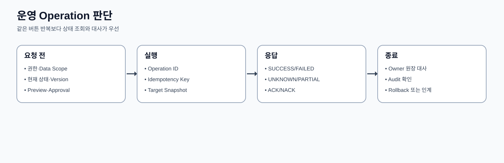
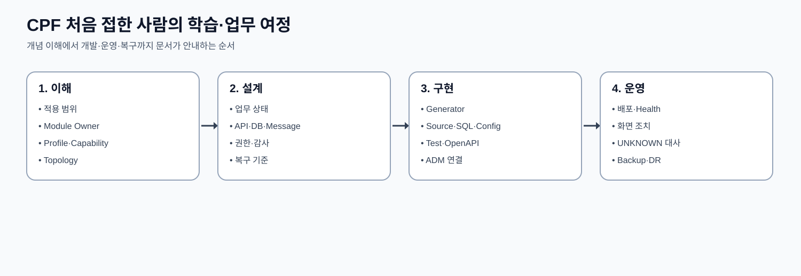

# CPF 프레임워크 안내

> 문서: `CPF 프레임워크 안내`
> 기준 Repository: `https://github.com/freeangelsun/202412_01_CPF`
> 기준 Branch: `master`
> 기준 Commit: `2a013663090d4e430a15983ad7269f8e86c5ef58` (`Merge B`)
> 기준일: `2026-08-06 Asia/Seoul`

| 항목 | 내용 |
|---|---|
| 주 독자 | 업무 기획자·아키텍트·개발/운영 리더 |
| 문서 목적 | CPF로 만들 수 있는 기능, 적용 범위, 제품 선택, 배포 형태와 도입 순서를 결정한다. |
| 기능 서술 전제 | CPF 제품 기능은 고객이 사용할 수 있는 상태로 설명한다. 구현 진행률이나 개발 관리 상태는 이 문서의 사용 절차에 섞지 않는다. |
| 사실 우선순위 | 실제 Source·SQL·API·Config·Frontend·Script·Test → 설계·사양 → 본 매뉴얼 |
| 상태 표현 | 업무 상태와 운영 결과는 Source의 상태값을 사용한다. 문서 검토 상태는 `완료`, `부분 구현`, `미구현`, `미검증`, `실패`, `재확인 필요`만 사용한다. |

## 1. CPF로 만들 수 있는 업무

CPF는 온라인 API, 비동기 이벤트, 파일·전문 연계, 정기·대량 Batch, 운영 Control Plane, 조직·권한·결재, 외부 API Gateway를 하나의 계약 체계로 제공한다. 고객은 업무 상태와 규칙을 정하고 CPF가 제공하는 Idempotency·Version·Audit·Outbox·UNKNOWN_RESULT·Approval·Recovery 계약을 사용한다.

| 업무 결과 | 대표 기능 | 주 매뉴얼 |
|---|---|---|
| 조건 검색과 상태 변경 | API·DB·Permission·Audit | 01 개발자, 03/04 ADM |
| 비동기 후속 처리 | Kafka/RabbitMQ/JMS/IBM MQ·Outbox/Inbox | 01 개발자, 05 운영 |
| 파일·기관 연계 | Attachment·SFTP·TCP·Fixed-length·ISO8583 | 01 개발자, 05 운영 |
| 정기·대량 처리 | Tasklet·Chunk·Partition·Center-Cut·Scheduler | 02 배치 |
| 플랫폼 운영 | ADM·승인·관측·복구 | 03/04 ADM, 05 운영 |
| 업무관리 | 조직·사용자·권한·결재 | 90 BZA |
| 외부 API 공개 | Route·HMAC·SSRF·Attempt·Publish·LKG | 91 Gateway |

### 1.1 고객 결과 중심 기능 지도

| 고객이 만들 결과 | CPF에서 선택할 기능 | 설계 시 결정할 값 | 운영자가 확인할 Evidence |
|---|---|---|---|
| 조건 검색·상세 화면 | Query API·Paging·Data Scope·Masking | 검색 Field, Sort whitelist, Page Size, 보존기간 | Transaction/Trace, 조회 건수, Export Audit |
| 신청·승인·상태변경 | Versioned Command·Idempotency·Audit | 상태전이, Reason, Expected Version, 승인 정책 | Operation 상태, Before/After, 승인·감사 |
| 이벤트 기반 후속 처리 | Outbox·Broker·Inbox·DLQ | Topic/Queue, Key, Schema, Consumer Group, Retry | Outbox/Inbox/Attempt, DLQ, Lag |
| 파일 수신·대량 반영 | Attachment·File Job·SFTP·Batch | 파일 Schema, Checksum, Preview, Apply, Rollback | Job/Row 원장, Artifact Hash, Audit |
| 외부기관 REST·전문 | HTTP/TCP·Fixed/ISO8583·Gateway | Timeout Budget, Correlation, HMAC/TLS, Attempt | Target 원장, Attempt, UNKNOWN 대사 |
| 정기·대량 처리 | Spring Batch·Scheduler·Partition·Center-Cut | Parameter, Checkpoint, Commit, Lease, 대사식 | Metadata, Worker, Result, Reconciliation |
| 조직·권한·결재 | BZA Directory·Permission·Approval | 기준일, Policy Version, Data Scope, 위임 | Effective Permission, Participant Snapshot, History |
| 운영·복구 | ADM·Runtime Control·Incident·Support Bundle | 역할, Approval, Alert, LKG, RPO/RTO | Target별 상태, Audit, Bundle Manifest |

각 기능은 단독으로 끝나지 않는다. 예를 들어 외부기관 송금은 API Validation, 업무 Transaction, Idempotency, Outbox, Gateway Attempt, UNKNOWN_RESULT, ADM Recovery, Audit와 운영 인계가 하나의 기능 흐름이다.

## 2. 제품 범위와 비범위

CPF는 고객 업무를 대신 정의하지 않는다. 고객은 업무 상태, 코드, Data Scope, 보존 기간, SLA, 외부기관 대사 기준, 결재 정책을 결정한다. CPF는 이를 구현·운영하기 위한 공통 계약과 실행 기능을 제공한다.

다음 적용은 금지한다.

1. 다른 Domain DB를 직접 조회·갱신해 Owner 경계를 우회한다.
2. ADM/BZA 화면이 Owner DB를 직접 수정한다.
3. Provider SDK Type을 Public API·DTO에 노출한다.
4. 응답 유실을 성공 또는 실패로 추정한다.
5. 선택하지 않은 Provider의 Bean·SQL·Secret 요구를 Runtime에 끌어온다.
6. Cache Signal·Metric·화면 값을 정본으로 간주하고 durable 원장을 무시한다.
7. 운영 편의를 이유로 Reason·Expected Version·Approval·Audit를 생략한다.

## 3. Module Ownership과 의존 방향

| Owner Module | 소유 책임 | 실제 Consumer | 경계 |
|---|---|---|---|
| cpf-core | 기술 중립 Public API·SPI, Context, Error, 식별자, Lock·Cache·Security 계약 | 모든 Runtime과 업무 Domain | Starter·Provider·Admin·Batch를 역참조하지 않는다. |
| cpf-common | 고객 공통 코드·메시지·Calendar·Template·Cache invalidation 조정 | Generated Domain·ADM·BZA·Notification | 공통 기준정보와 durable refresh 원장을 소유한다. |
| cpf-starters | Profile·Capability별 AutoConfiguration과 기술 Provider | 선택 Profile Runtime | Provider SDK Type을 Public API에 노출하지 않는다. |
| cpf-batch | Spring Batch, Scheduler, Center-Cut, Runner, Worker, Agent, Runtime Control | 배치 개발자·운영자·ADM | Job/Execution/Lease/Command 상태를 소유한다. |
| cpf-admin | 플랫폼 운영 Query·Command·승인·감사 Backend와 Frontend | 조회자·운영자·승인자·보안담당자 | Owner DB를 직접 수정하지 않고 Owner Port/API를 사용한다. |
| cpf-biz-admin | 조직·직원·사용자·Role·Permission·Data Scope·결재 | 업무 관리자·업무 Service | 기준일 Snapshot과 Versioned Policy를 소유한다. |
| cpf-gateway | 외부 Trust Boundary, Route, Security, Attempt Ledger, Publish·LKG | 외부 Client·업무 Service·ADM | 외부 Dispatch 이후 결과 불명을 Attempt 원장으로 보존한다. |
| cpf-member | Generator 기준 Golden Domain | 신규 업무 개발자 | 교육 예제와 고객 업무의 기준 구조를 제공한다. |
| cpf-reference | 정상·오류·복구 교육 흐름 | 교육·PoC·회귀 검수 | 제품 기능을 임의 축약하지 않는다. |
| cpf-tools | Generator, BOM, DB Vendor Pack, 환경, 검증, Release Tooling | 개발·배포·DBA·운영 | Source SHA와 Artifact·SQL·문서 Evidence를 연결한다. |

기본 의존 방향은 `업무 Domain → cpf-common → cpf-core`다. Starter와 Provider는 Core SPI를 구현한다. Admin·BZA·Gateway·Batch는 업무 Owner의 공개 Port/API를 소비하고 Owner Persistence를 우회하지 않는다.

## 4. 공개 Profile 선택

| Profile | 제공 결과 | Artifact | 선택 질문 |
|---|---|---|---|
| minimal-domain | 최소 업무 Domain과 내부 Service | cpf-starter-profile-minimal-domain | UI·외부 API 없이 Domain부터 시작할 때 |
| web-api | REST API·Validation·OpenAPI | cpf-starter-profile-web-api | 외부/내부 HTTP API를 제공할 때 |
| secure-api | 인증·인가·Audit가 필요한 API | cpf-starter-profile-secure-api | 사용자 또는 서비스 권한이 필요한 업무 |
| browser-bff | 브라우저 Session·CSRF·BFF | cpf-starter-profile-browser-bff | Browser 중심 화면을 제공할 때 |
| event-service | Broker Producer·Consumer·Outbox/Inbox | cpf-starter-profile-event-service | 비동기 이벤트 업무 |
| batch-service | Spring Batch·Scheduler·Worker | cpf-starter-profile-batch-service | 정기·대량·분산 처리 |

선택 절차:

1. 만들려는 업무 결과에 가장 가까운 Profile 하나를 고른다.
2. Data·Messaging·Integration·File·Notification·Security·Platform Operations Provider를 선택한다.
3. Generator Dry Run에서 실제 선택 Starter와 충돌을 확인한다.
4. `resolved-starter-lock.json`으로 Version·Artifact를 고정한다.
5. 선택하지 않은 Provider가 Classpath·Config·Health·DB Migration에 나타나지 않는지 확인한다.

## 5. Capability Group과 Provider 교체

| Group | 기능 | 고객 결과 |
|---|---|---|
| data | JDBC·MyBatis·Caffeine·Valkey | 업무 저장·조회·Cache |
| messaging | Kafka·RabbitMQ·JMS·IBM MQ·Outbox/Inbox/DLQ | 비동기·대외 메시지 |
| integration | HTTP·Resilience·TCP·Fixed-length·ISO8583 | 외부 시스템·전문 연계 |
| file | Attachment·Archive·Tabular·SFTP | 첨부·대량 파일·기관 파일 |
| notification | Email·SMS SPI·Receipt·Retry | 업무 알림 |
| security | Resource Server·Session·Service Identity·Secret | 사용자·서비스 인증과 Key |
| platform-operations | Observability·Runtime Control·Feature Flag | 운영·변경·관측 |

Provider 교체는 업무 Java Source를 바꾸는 작업이 아니다. Binding·Config·Secret Reference·Resolved Lock을 변경하고, 교체 전후 Contract Test·Runtime 연결·원장 호환·ADM 관측·Rollback을 확인한다. Kafka에서 RabbitMQ로 바꾸더라도 업무 Event DTO·Idempotency·Inbox 의미는 유지한다.

## 6. 지원 Topology

| Topology | 배포 단위 | 추가 책임 | 선택 기준 |
|---|---|---|---|
| Modular Monolith | 하나의 Boot Runtime | 공유 Transaction과 Local Adapter | 단일 배포·낮은 호출 비용 |
| Microservice | Domain별 Runtime | Service Identity·Timeout·Trace·Remote Error | 독립 배포·확장·장애 격리 |
| External WAS | WAR + Servlet Container | Container Lifecycle·JNDI·운영 표준 | 고객 표준 WAS |
| ADM/BZA | Backend + Static Frontend | OpenAPI Generated Client·Session·권한 | 운영·업무관리 화면 |
| Batch | Control·Scheduler·Runner·Worker·Agent | Metadata·Lease·Checkpoint·Command | 정기·대량·분산 실행 |
| Gateway | 독립 Runtime | 외부 Trust Boundary·Attempt Ledger | 외부 API 공개 |

Local과 Remote는 DTO·Validation·Error·Permission·Audit 의미가 같다. Remote에는 Serialization·Service Identity·Timeout Budget·Trace Propagation·결과 대사가 추가된다.

### 6.1 Topology 선택 질문

1. 같은 Process 안에서 호출해도 되는가, 독립 배포와 장애 격리가 필요한가?
2. Transaction을 한 DB에 묶을 수 있는가, Message/Attempt 대사가 필요한가?
3. 외부 Trust Boundary를 Gateway가 소유해야 하는가?
4. Batch Worker를 같은 Host에 둘 것인가, Remote Worker Pool로 분리할 것인가?
5. 단일 Instance에서 시작해도 Scheduler·Lease·Cache invalidation을 다중 Instance 계약으로 유지할 것인가?
6. DR에서 Writer를 어느 Site가 소유하고 전환 시 어떤 Ledger를 대사할 것인가?

### 6.2 배포 형태별 책임표

| 형태 | 호출 | 상태 정본 | 장애 경계 | 배포·Rollback |
|---|---|---|---|---|
| Modular Monolith | Same-JVM Port | Module Owner DB | Process 장애 공유 | 단일 Artifact, Module Contract 회귀 |
| Microservice | Remote Adapter/API/Message | Service Owner DB | Service·Network 분리 | Service별 Version·Generated Client·Compatibility |
| External WAS | Container/WAS Lifecycle | 업무 DB·공통 DB | WAS Cluster·Session | Artifact·JNDI/Secret·Rolling 절차 |
| Remote Batch | Control→Runner/Worker/Agent | Batch Metadata·업무 원장 | Host·Broker·Lease | Job Pack·Agent Target·LKG |
| Gateway Edge | Client→Gateway→Target | Route/Attempt/Apply Ledger | 외부 Network·Target | Validate·Publish·Target ACK·LKG |
| DR Active/Standby | Site 전환 | 복제 DB·Object·Config | Region/Site | Writer Lease·DNS·Failback 대사 |

Topology를 바꾸더라도 고객 업무 코드는 Owner Port·DTO·Error 의미를 유지한다. 달라지는 것은 Adapter·Timeout·Serialization·Deployment·운영 Evidence다.

## 7. 핵심 실행 흐름

온라인 상태 변경의 기준 흐름은 다음과 같다.

1. Controller가 인증·권한·입력 형식을 확인한다.
2. Application Service가 Idempotency Key와 Request Hash를 조회한다.
3. Domain이 현재 상태와 Expected Version으로 전이를 판정한다.
4. Persistence가 업무 Row·History·Audit·Outbox를 하나의 Transaction에 반영한다.
5. 응답이 유실되면 같은 Idempotency Key로 결과를 조회한다.
6. 외부 부작용이 시작된 뒤 결과를 알 수 없으면 UNKNOWN_RESULT로 보존하고 대사한다.

비동기 흐름은 Outbox → Broker → Inbox/Attempt → 업무 처리 → ACK 순서다. Batch는 JobParameter → JobInstance → Execution → Step/Partition → Checkpoint → 대사 순서다.

## 8. 상태·오류·복구 모델

| 상태 | 의미 | 다음 행동 | 운영 규칙 |
|---|---|---|---|
| REQUESTED | 요청이 수락됐지만 외부 부작용은 시작 전 | Worker/Scheduler/Owner가 실행 | 같은 Idempotency Key의 새 실행을 만들지 않는다. |
| RUNNING | 실행 중이며 Heartbeat 또는 진행률이 존재 | Progress·Lease·Attempt 관측 | Timeout만으로 실패 처리하지 않는다. |
| SUCCEEDED | 업무·Target 결과가 명시적으로 성공 | 종료·후속 업무 진행 | 재실행하지 않는다. |
| FAILED | 외부 부작용 전 결정적 실패 또는 명시 실패 | 입력·정책·환경 수정 후 새 실행 | 원본 Attempt는 보존한다. |
| UNKNOWN_RESULT | 외부 부작용 이후 결과를 확정할 Evidence가 부족 | Target/Owner 원장 대사 | Blind Retry를 금지한다. |
| PARTIAL | 여러 Target 또는 Item 중 일부만 성공 | 성공·실패 대상을 분리해 복구 | 전체를 다시 실행하지 않는다. |
| ROLLED_BACK | 모든 대상이 이전 상태로 복귀 | 종료 또는 수정 후 새 요청 | Rollback Evidence를 확인한다. |
| PARTIALLY_ROLLED_BACK | 일부 Target만 복귀 | 남은 Target별 대사·보상 | 성공으로 보고하지 않는다. |

Timeout은 상태가 아니다. 외부 Dispatch 전 Timeout은 FAILED가 될 수 있고, Dispatch 이후 Timeout은 UNKNOWN_RESULT가 될 수 있다. 운영자는 Operation ID·Attempt·Target·Payload Hash·Version으로 결과를 대사한다.

## 9. 보안·권한·감사

보안은 인증, 권한, Data Scope, Masking, Reason, Approval, Audit를 하나의 흐름으로 적용한다.

- 사용자 인증: JWT 또는 Session, MFA, IP Allowlist.
- 서비스 인증: Service Identity와 Audience.
- 권한: Menu·Button·API Permission과 Data Scope.
- 민감정보: 화면·Log·Download에 동일 Masking 정책.
- 위험 조치: 요청자와 승인자 분리, 승인 Snapshot, 만료, 실행 Audit.
- Secret: 평문 노출 금지, Provider Metadata, Rotation, Consumer 전환, Rollback.
- Break-glass: 제한 Scope·기간·사후 검토·Session 폐기.

## 10. 도입 결정 절차

1. 업무 목록을 조회·상태 변경·비동기·파일·외부 연계·Batch·운영으로 분류한다.
2. 각 업무의 State Owner와 실제 Consumer를 정한다.
3. Profile·Capability·Provider·Topology를 결정한다.
4. Permission·Data Scope·Masking·Approval 정책을 정의한다.
5. DB Vendor와 Migration·Backup·DR 기준을 정한다.
6. ADM/BZA/Gateway에서 필요한 운영 화면과 권한을 연결한다.
7. 정상·중복·동시성·Timeout·응답 유실·부분 실패·복구 시나리오를 작성한다.
8. 운영팀에 식별자·상태·Alert·Runbook·Rollback을 인계한다.

### 10.1 도입 Workshop 단계와 산출물

| 단계 | 참여 역할 | 수행 | 산출물 | 종료 판정 |
|---|---|---|---|---|
| 업무 범위 | 기획·업무 Owner | 거래·Batch·파일·외부기관·권한·결재 목록화 | 기능 카탈로그 | 모든 업무 결과에 Owner가 지정됨 |
| 품질 기준 | Architecture·운영 | SLA, Timeout, RPO/RTO, 보존, 감사 결정 | 비기능 요구표 | 실패·복구 기준이 숫자로 표현됨 |
| 선택면 | 개발·Architecture | Profile·Capability·Provider·Topology 선택 | 선택 기록·Resolved Lock | 중복 Provider와 빠진 Consumer 없음 |
| 데이터 | DBA·Owner | Schema·Migration·Vendor·대사 Key 설계 | 데이터 계약·Migration Plan | Fresh/Upgrade/Rollback 경로 존재 |
| 운영 | 운영·보안·승인자 | ADM/BZA/Gateway Role·Menu·Action 설계 | 운영 권한 Matrix·Runbook | 위험조치 요청자/승인자 분리 |
| 교육 | 개발·운영 | PAY/Batch/Gateway/BZA 과제 수행 | 수행 Evidence | 문서만으로 정상·오류·복구를 설명 가능 |
| 인계 | Release·운영 | Artifact·Config·Secret·Backup·Alert 인계 | Release Manifest·운영 Sheet | Source SHA와 운영 Evidence가 연결됨 |

도입 단계에서 “나중에 운영팀이 정한다”는 항목을 남기지 않는다. Timeout, Idempotency, 대사 Key, 보존기간, 권한, Alert, Rollback은 개발 설계의 일부다.

## 11. 역할별 문서 지도

| 역할 | 먼저 읽을 문서 | 완료해야 할 과제 |
|---|---|---|
| 아키텍트·기술책임자 | 00, 아키텍처설계서, 기술사양서 | Profile·Topology·Owner·보안·DB·운영 구조 결정 |
| 온라인·연계 개발자 | 01, 기술표준서, DB표준서 | 신규 Domain과 API·메시지·파일·외부 연계 구현 |
| Batch 개발자·운영자 | 02, 04, 05 | Job·Scheduler·Worker·Center-Cut·복구 구성 |
| ADM 연동 개발자 | 03, 01, 04 | Owner Query/Command를 Generated Client·화면에 연결 |
| ADM 운영자·승인자 | 04, 05 | 화면 조회·조치·승인·대사·복구 |
| 플랫폼·DBA·DR | 05, DB표준서 | 설치·설정·배포·관측·Backup·Restore·DR |
| BZA 담당자 | 90 | 조직·권한·결재·첨부·알림 적용 |
| Gateway 담당자 | 91 | 외부 Route·보안·게시·부분 적용·Rollback |

## 12. 도입 Workshop 산출물

Workshop 종료 시 다음 표가 채워져야 한다.

| 산출물 | 필수 내용 |
|---|---|
| 기능 선택표 | 업무 결과, Profile, Capability, Provider, Owner, Consumer |
| Topology 표 | Runtime, Instance 수, 네트워크, Service Identity, Timeout |
| 데이터 표 | DB Vendor, Schema Owner, Migration, Retention, Backup |
| 보안 표 | Role, Permission, Data Scope, Masking, Approval, Audit |
| 운영 표 | Health, Metric, Alert, Operation ID, UNKNOWN 대사, Rollback |
| 교육 표 | 실행할 EDU ID, Test Data, 오류 재현, 완료 Evidence |

빈 칸을 “기본값”으로 넘기지 않는다. Default가 존재하더라도 고객 환경 값과 책임자를 기록한다.

## 13. 처음 접한 사람의 이해도 점검

다음 질문에 Source를 열지 않고 답할 수 있어야 한다.

1. 업무 상태를 누가 소유하고 ADM은 어떻게 변경하는가?
2. 같은 요청이 두 번 오면 어느 Ledger가 중복을 막는가?
3. 외부기관 응답이 유실되면 왜 확인 없이 Retry하지 않는가?
4. Local과 Remote 전환 시 무엇이 같고 무엇이 추가되는가?
5. Batch Restart와 Reprocess는 어떻게 다른가?
6. Center-Cut FAILED와 UNKNOWN은 어떤 단위로 조치하는가?
7. Cache Signal이 유실돼도 왜 정합성을 회복할 수 있는가?
8. BZA 결재 참여자는 언제 Snapshot되는가?
9. Gateway 부분 적용 시 무엇을 기준으로 Rollback하는가?
10. 운영자는 성공을 어떤 화면·원장·Audit로 판정하는가?

답이 모호하면 해당 역할의 매뉴얼과 Evidence Matrix를 다시 확인한다.

### 13.1 역할별 독립 수행 과제

| 역할 | 문서만 보고 수행할 과제 | 제출 Evidence |
|---|---|---|
| Architecture | PAY 업무를 Modular Monolith와 MSA 두 형태로 배치하고 차이를 설명 | Context/Container View, Owner/Consumer, Failure Matrix |
| 온라인 개발자 | 상태변경 API에 Version·Idempotency·Audit·Outbox를 연결 | Source·Migration·Contract/Fault Test·ADM Trace |
| Batch 개발자 | Chunk Job을 Process Kill 후 Restart하고 중복 Write가 없음을 대사 | Metadata Count, Cursor, 업무 건수·금액 |
| ADM 연동 개발자 | Query·Command·Approval·Generated Client·Route를 연결 | Operation ID, Permission, Browser Test |
| 운영자 | UNKNOWN_RESULT를 Target 원장과 대사해 종결 | Operation/Attempt/Audit·결정 근거 |
| DBA | 빈 Schema 설치, Upgrade, Rollback/Forward Recovery, Drift 확인 | Vendor별 Verify·Checksum·복구 기록 |
| BZA 담당자 | 조직·사용자·Role·Data Scope·결재 정책을 적용 | 기준일 Snapshot·Simulation·History |
| Gateway 담당자 | Route를 Validate·Approve·Publish하고 NACK를 LKG로 복구 | Connection Test·Target Apply·Rollback Evidence |

과제 결과에서 Source 역분석이 필요했던 지점은 문서 개선 항목으로 기록한다.

## 14. Source Evidence와 문서 현행화

문서의 기능 설명은 `cpf-docs/deliverables/evidence/CPF_SOURCE_EVIDENCE_MATRIX.csv`와 연결된다. Route·Operation은 ADM/BZA Matrix, Property는 Configuration Matrix, 상태·복구는 State/Error Catalog를 사용한다.

변경 시에는 Source → API/SQL/Config → Consumer → Test → 공식 매뉴얼 → Evidence 순서로 갱신한다. 문서만 먼저 바꾸고 Source 계약을 추정하지 않는다.
