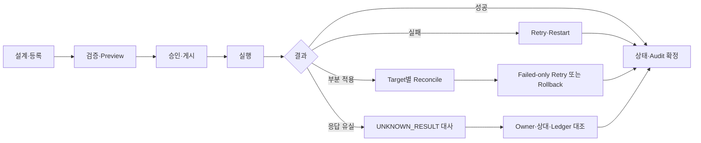

# CPF 프레임워크 안내

> **기준 Repository** `freeangelsun/202412_01_CPF`
> **기준 Branch** `master`
> **기준 Commit** `e1f8bef7b7193522f2cd8e36cc6857dd1ff6694a`
> **문서 목적** CPF의 제품 범위·비범위, Architecture, Module Ownership, 의존 방향, 지원 Topology, 실행·보안·DB·Generator와 공식 문서 지도를 설명한다.
> **주요 독자** 아키텍트, 기술 책임자, 개발자, 배치 개발자, ADM·BZA·Gateway 담당자, 운영자
> **문서 사용 결과** 독자가 CPF의 책임 경계와 기준 Commit의 기능을 이해하고 자신의 역할 문서와 Source 진입점을 선택한다.

## 0. 문서 사용 계약

이 문서는 제품 목표, 기준 Commit의 구현, 실제 실행 검증을 분리한다.

- 목표는 구현·검증 여부와 무관한 제품 계약이다.
- 기능 설명은 최신 Source·SQL·API·Config·Frontend·Script·Test의 exact path를 기준으로 한다.
- 적용 환경에서는 Build·DB·Kafka·Browser·다중 인스턴스·장애 시나리오의 실행 결과를 환경 기록에 남긴다.
- Source에 없는 Class·API·Property·Route·Permission·상태를 만들지 않는다.
- 기능 상태와 운영 상태는 Owner가 정의한 실제 상태값과 Terminal 조건을 사용한다.
- 명령 실행 전 Local Working Tree를 확인하고 기존 변경을 보호한다.


## 1. CPF 정의와 비범위

CPF는 업무 시스템의 설계·개발·실행·운영·감사·확장·검증·배포·복구를 연결하는 Framework를 목표로 한다. 공통 Utility 집합, 특정 프로젝트 Sample, 중앙 업무 DB, 화면 목록만으로 구성된 제품을 의미하지 않는다.

| 범위 | 포함 | 제외 또는 별도 판정 |
|---|---|---|
| 구조 | Modular Monolith, MSA, 동일 JVM, 분리 WAS | 내부 호출의 Gateway 강제 경유 |
| 실행 | 온라인, Kafka, File, 외부 연계, Spring Batch | Interface·DTO만 존재하는 경로 |
| 운영 | ADM Query·Command, 승인, 감사, 복구 | ADM의 Owner DB 직접 갱신 |
| 선택 제품 | BZA, Gateway | 미선택 시스템의 필수 Dependency |
| 공급 | Local·Remote·Offline Artifact, DB Lifecycle | 검증 없는 환경 지원 표기 |

## 2. 기준 Commit 기능 지도

| 기능군 | 정본 Source | 사용자가 수행하는 업무 |
|---|---|---|
| Build·Stack | `settings.gradle`, `build.gradle`, `gradle/cpf-stack.properties`, `cpf-tools/build/*` | Toolchain·BOM·Convention Plugin·Artifact Mode를 구성하고 Build한다. |
| Core·Starter | `cpf-core`, `cpf-common`, `cpf-starters/*` | 표준 API·SPI와 Security·Kafka·Cache·Observability·Resilience·Secret 기능을 사용한다. |
| 업무 Domain | `cpf-member`, Generator 산출물 | API·Application·Domain·Persistence·3DB Migration·Test를 개발한다. |
| ADM | `cpf-admin`, `cpf-admin/frontend` | 플랫폼 Query·Command·Permission·Approval·Audit와 59개 Route를 개발·운영한다. |
| Batch | `cpf-batch/*` | Spring Batch·Scheduler·Worker·Agent·Center-Cut을 개발·실행·복구한다. |
| BZA | `cpf-biz-admin`, `cpf-biz-admin/frontend` | 조직·직원·사용자·권한·결재·첨부·감사를 사용한다. |
| Gateway | `cpf-gateway` | Route·Target·Security·Retry·Ledger·Snapshot 게시·Rollback을 수행한다. |
| DB·운영 도구 | `cpf-tools/db`, `cpf-tools/scripts` | 설치·Migration·검증·배포·Backup·Restore를 수행한다. |

## 3. Module Ownership

| Owner | Module·Path | 소유 책임 | 금지 책임 |
|---|---|---|---|
| 기술 계약 | `cpf-core` | Public API·SPI, Context, Error, Gateway·File·Messaging 계약 | 고객 업무 상태·ADM 화면·Batch Runtime |
| 고객 공통 | `cpf-common` | 코드·메시지·Calendar 등 명시된 업무 공통 | 모든 업무의 중앙 경유지 |
| 기술 Adapter | `cpf-starters/*` | Security, Kafka, Cache, Observability, Resilience, Feature Flag, Secret | Core API에 Vendor Type 전파 |
| 플랫폼 운영 | `cpf-admin` | 플랫폼 Query·Command·Approval·Audit·Frontend | 다른 Owner Table 직접 변경 |
| 업무 관리 | `cpf-biz-admin` | 조직·사용자·권한·결재·업무 감사 | 플랫폼 Runtime 직접 제어 |
| Gateway | `cpf-gateway` | 외부 진입 Data Plane과 Route 정책 확장 | 업무 Transaction 소유 |
| Batch | `cpf-batch/*` | Spring Batch 실행·통제·Scheduler·Worker·Agent·Center-Cut | 업무별 Item DB 중앙 소유 |
| Generated Domain | `cpf-member` 및 Generator 산출물 | 자신의 API·상태·DB·Transaction | 다른 Domain DB 접근 |
| 참조 | `cpf-reference` | 실제 Public API 사용·오류·복구 EDU | 제품 원장 |

## 4. 의존 방향과 Public 경계

```text
Generated Domain ──> cpf-common ──> cpf-core
cpf-admin ──> Owner Query/Command Contract
cpf-biz-admin ──> Business Contract
cpf-gateway ──> cpf-core Gateway/Registry Contract + Starter
cpf-batch ──> cpf-core Contract + Business Job Contract
Starter ──> OSS Runtime
```

- 외부 Consumer는 `api` 또는 승인된 `spi`만 사용한다.
- `internal` Import, 순환 의존, 다른 Owner Repository·Mapper 호출은 Gate 대상이다.
- Local Adapter와 Remote Adapter는 DTO·오류·권한·Deadline·Idempotency 의미를 유지한다.
- 선택 Starter는 사용하지 않는 Module에 전이되지 않아야 한다.

## 5. Topology

| Topology | 호출 방식 | 상태·데이터 Owner | 필수 검증 |
|---|---|---|---|
| 동일 JVM | Local Port | Owner Application Service | Transaction 범위, Bean 충돌, 권한 문맥 |
| 분리 WAS | Remote Port | 원격 Owner | Timeout, 인증, 응답 유실, 오류 동등성 |
| Modular Monolith | Module 경계 | Module별 DB·Transaction | Internal Import, DB Owner, Startup |
| MSA | Service Contract | 서비스별 DB | Contract, Idempotency, Trace, Reconcile |
| 혼합 | Local+Remote | 기능별 Owner | 동일 Scenario의 Topology별 결과 |
| 다중 인스턴스 | Shared Registry·DB·Broker | Lease·Epoch·Fencing | Stale writer, takeover, rebalance, partial apply |

## 6. 표준 실행 문맥

필수 식별자: `transactionId`, `traceId`, `spanId`, `segmentId`, `operationId`, `idempotencyKey`, `attemptId`, `instanceId`. Batch는 `cpfExecutionId`, `jobInstanceId`, `jobExecutionId`, `stepExecutionId`, Partition·Worker ID를 연결한다.

Trust Boundary 원칙:

- 외부 Header를 내부 Principal·Environment·Instance 정보로 그대로 확정하지 않는다.
- Deadline을 하위 DB·HTTP·Kafka·File·Process에 배분한다.
- 결과가 확인되지 않은 변경 요청은 `UNKNOWN_RESULT`로 남기고 상태 조회·대사 후 확정한다.

## 7. 온라인·비동기·File 흐름

### 온라인

```text
Ingress → 인증·권한 → Validation → Application Transaction
→ DB/Outbox → Response → Audit·Metric·Trace
```

### Kafka

```text
업무 DB + Outbox → Publisher Claim → Kafka ACK
→ Consumer Inbox/Idempotency → 업무 Side Effect → Commit
→ Retry Topic/DLT/Reconcile
```

### File·Attachment

```text
Alias/Path 검증 → Bounded Stream → Temp File
→ Checksum·검사 → Atomic Publish → Metadata·Audit
→ Retention·삭제·복구
```

## 8. Batch와 Scheduler

Spring Batch가 Job·Step·Metadata·Checkpoint·Restart 정본이다. CPF는 승인·Idempotency·Fencing·실행 링크·운영 Control을 확장한다. 기준 Commit에는 Canonical Request Hash, `idempotencyScope`, Plan Checksum, Job별 `CPF_BATCH_EXECUTION_EPOCH`, 상태 전이와 실행 링크가 구현돼 있다. Java 25·3DB·Kafka·다중 인스턴스 Runtime 실행은 환경별로 실행해 확인한다.

## 9. ADM·BZA·Gateway 책임

- ADM: 플랫폼 Runtime 조회·제어. Owner Command를 호출하며 직접 DB Update 금지.
- BZA: 조직·사용자·Role·Permission·Data Scope·결재. 미사용 시스템에 강제하지 않음.
- Gateway: SCG MVC Data Plane, ACK Route Snapshot, Target 선택, Attempt Ledger. 업무 API 자체를 소유하지 않음.

## 10. Security·Approval·Audit

- 사용자·서비스 인증과 Route·API 권한을 분리한다.
- 위험 조치는 Permission, Reason, 필요 시 Approval, Expected Version, Preview, Audit을 요구한다.
- Token·Password·Private Key·Session ID·PII는 Log·Response·Evidence에 원문으로 남기지 않는다.
- Break-glass는 별도 권한·TTL·사유·사후 검토를 요구한다.

## 11. DB Lifecycle

공식 Vendor 목표는 Oracle·PostgreSQL·MariaDB다.

```text
Account/Schema → Install → Seed → Verify
→ Version Migration → Drift Check → Upgrade
→ Rollback 또는 Forward Recovery → Backup/Restore → Reconcile
```

파일 존재만으로 Vendor 지원을 판정하지 않는다. 빈 DB 설치, Upgrade, Rollback, Restore를 동일 exact SHA에서 실행해야 한다.

## 12. Build·Artifact

확인된 정본:

- `gradle/cpf-stack.properties`
- `gradle/cpf-platform.properties`
- `gradle/wrapper/gradle-wrapper.properties`
- Root `build.gradle`
- `settings.gradle`

현재 Build Tooling Source는 복원됐지만 Plugin ID·Group·Artifact·Marker와 `pluginManagement` 연결이 불일치한다. Canonical 좌표를 단일화한 뒤 empty-cache `help`, `projects`, Included Build `check`, Root `test`·`build`, Generated Domain Consumer를 다시 수행한다.

## 13. Generator

입력: DomainName, 3자리 SystemCode, Package, DB Vendor, Capability, Topology. Dry Run은 Module·Package·SystemCode·Port·Route·Menu·SQL·Schema 충돌을 차단해야 한다. 생성 후 Build·DB·Local·Remote·Test·ADM 등록과 remove→regenerate parity를 확인한다.

## 14. 운영·복구 판정

운영 조치는 상태를 직접 덮어쓰는 방식이 아니라 Owner Command와 상태 기계를 사용한다. 정상화는 다음으로 판정한다.

- 상태와 실제 Runtime 결과 일치
- Pending·Unknown·Orphan 0 또는 승인된 예외
- Instance Version·Checksum·Config 일치
- Error Rate·Lag·Queue·DB Lock 회복
- 감사 Event와 조치 결과 연결

## 15. 검증 층위

| 층위 | 예시 | 단독 완료 근거 여부 |
|---|---|---|
| Static | 파일·Import·Route·Property | 아니오 |
| Compile·Unit | Gradle/npm compile, Unit | 아니오 |
| Contract | API·Message·DB Contract | 적용 범위 일부 |
| Integration | DB·Kafka·Owner Adapter | 적용 범위 일부 |
| Runtime·Browser | 실제 Process·3 Browser | 필요 기능에 필수 |
| Multi-instance·Fault | Kill·Timeout·Response loss·Partial apply | 분산 기능에 필수 |
| Recovery | Restart·Reconcile·Rollback·Restore | 운영 기능에 필수 |

## 16. 구현 추적 시작점

| 영역 | exact Source 시작점 |
|---|---|
| Build | `settings.gradle`, `build.gradle`, `gradle/*` |
| Core | `cpf-core/src/main/java/com/cpf/core/api`, `spi`, `internal` |
| Starter | `cpf-starters/*` |
| ADM | `cpf-admin/src/main`, `cpf-admin/frontend/src/app/routes.ts` |
| BZA | `cpf-biz-admin/src/main`, `cpf-biz-admin/frontend/src/app/routes.ts` |
| Gateway | `cpf-gateway/src/main/java/com/cpf/gateway` |
| Batch | `cpf-batch/contract`, `execution-runtime`, `scheduler`, `worker`, `center-cut-runner`, `host-agent` |
| DB | `cpf-tools/db/vendor/{oracle,postgresql,mariadb}` |
| Generator | `cpf-tools/generator/create-domain.ps1` |
| Evidence | `cpf-docs/evidence`, `cpf-docs/quality` |

## 17. 적용 환경 기록 항목

환경별로 다음 값을 기록하면 동일 절차를 재현하고 교대·감사·복구에 사용할 수 있다.

- Repository·Branch·exact Source SHA와 Artifact SHA-256
- Java·Gradle·Node·npm·OS·WAS·Browser Version
- Profile·Environment·Cell·Zone·Instance ID
- DB Vendor·Schema Version·Migration History
- Kafka Broker·Topic·Partition·Consumer Group
- Effective Config Version과 Secret·Certificate Reference
- 실행 명령·시각·Exit Code·결과 파일
- 정상·오류·복구 Scenario와 대사 결과
- 담당자·승인자·Reason·Rollback 기준

## 18. 문서 지도와 읽는 순서

| 역할 | 읽는 순서 |
|---|---|
| 아키텍트 | 00 → `cpf-docs/governance/CPF_FINAL_TARGET_REQUIREMENTS.md` → 관련 역할 매뉴얼 |
| 일반 개발 | 00 → 01 → 적용 시 02·03·90·91 → 05 |
| Batch 개발 | 00 → 02 → 03·04 → 05 |
| ADM 개발 | 00 → 03 → 04 → Owner 기능 매뉴얼 |
| 운영관리자 | 00 → 04 → 05 → 필요 시 90·91 |
| BZA 담당 | 00 → 90 → 05 |
| Gateway 담당 | 00 → 91 → 03·04·05 |

## 부록 A. 기준 Commit의 등록 Module과 실행 경계

`settings.gradle`에서 확인한 Project 등록은 다음과 같다. 이 표는 **등록 사실**을 설명하며 Build 성공을 의미하지 않는다.

| Gradle Project | 실제 Directory | 역할 | 현재 판정 |
|---|---|---|---|
| `:cpf-core` | `cpf-core` | 기술 Public API·SPI와 최소 Runtime | 적용 절차 참조 |
| `:cpf-common` | `cpf-common` | 고객 공통 기능 | 적용 절차 참조 |
| `:cpf-starter-security` | `cpf-starters/security` | Spring Security·Session Adapter | 적용 절차 참조 |
| `:cpf-starter-messaging-kafka` | `cpf-starters/messaging-kafka` | Kafka Adapter | 적용 절차 참조 |
| `:cpf-starter-cache` | `cpf-starters/cache` | Caffeine Cache Adapter | 적용 절차 참조 |
| `:cpf-starter-observability` | `cpf-starters/observability` | Observation·Trace Adapter | 적용 절차 참조 |
| `:cpf-starter-resilience` | `cpf-starters/resilience` | Circuit Breaker·Retry Adapter | 적용 절차 참조 |
| `:cpf-starter-featureflag` | `cpf-starters/featureflag` | Feature Flag Adapter | 적용 절차 참조 |
| `:cpf-starter-secret` | `cpf-starters/secret` | Secret Provider Adapter | 적용 절차 참조 |
| `:cpf-admin` | `cpf-admin` | 플랫폼 ADM Backend·Frontend | 적용 절차 참조 |
| `:cpf-biz-admin` | `cpf-biz-admin` | 선택형 BZA Backend·Frontend | 적용 절차 참조 |
| `:cpf-gateway` | `cpf-gateway` | SCG MVC Gateway Runtime | 적용 절차 참조 |
| `:cpf-reference` | `cpf-reference` | Public Contract EDU Consumer | 기능 참조 |
| `:cpf-member` | `cpf-member` | Generator Golden Domain | 기능 참조 |
| `:cpf-local-runtime` | `cpf-tools/runtime/cpf-local-runtime` | Local 통합 Runtime | 환경별 실행 절차 |
| `:cpf-local-batch-runtime` | `cpf-tools/runtime/cpf-local-batch-runtime` | Local Batch Runtime | 환경별 실행 절차 |
| `:cpf-batch:contract` | `cpf-batch/contract` | Batch API·SPI | 적용 절차 참조 |
| `:cpf-batch:execution-runtime` | `cpf-batch/execution-runtime` | Spring Batch 실행 Adapter | 적용 절차 참조 |
| `:cpf-batch:control-server` | `cpf-batch/control-server` | Batch Control Runtime | 적용 절차 참조 |
| `:cpf-batch:scheduler` | `cpf-batch/scheduler` | DB Scheduler Runtime | 적용 절차 참조 |
| `:cpf-batch:worker` | `cpf-batch/worker` | Remote Worker Runtime | 적용 절차 참조 |
| `:cpf-batch:center-cut-runner` | `cpf-batch/center-cut-runner` | Center-Cut Manager Runtime | 적용 절차 참조 |
| `:cpf-batch:host-agent` | `cpf-batch/host-agent` | Host Agent | 적용 절차 참조 |
| `:cpf-batch:testkit` | `cpf-batch/testkit` | Batch Test Kit | 환경별 실행 절차 |

### A.1 Build Tooling 실패 조건

기준 Commit에는 다음 Included Build Source가 존재한다.

```text
cpf-tools/build/platform-bom
cpf-tools/build/gradle-plugin
```

현재 차단 원인은 Directory 부재가 아니라 Convention Plugin ID·Group·Artifact·Marker, Root `pluginManagement` 공급 경로, Generated Domain Consumer 계약의 불일치다. 판정 순서는 다음과 같다.

1. `settings.gradle`, `cpf-tools/build/gradle-plugin/build.gradle`, Plugin 구현 Class와 `cpf-member/build.gradle`의 Plugin ID를 대조한다.
2. BOM·Plugin Publication 좌표를 Root Artifact Federation의 Canonical Coordinate와 대조한다.
3. 불일치가 있으면 `gradlew help`나 `projects`의 우연한 Local Cache 성공을 근거로 사용하지 않는다.
4. Architecture Owner가 Canonical ID·좌표를 확정한 뒤 `settings.gradle`, Plugin Marker, Generator Template, Golden Domain, Publication·Verification Script를 함께 이관한다.
5. 별도 `GRADLE_USER_HOME`과 빈 CPF Local Repository에서 `help`, `projects`, Included Build `check`, Golden Domain Plugin Resolution, Root Build를 순서대로 실행한다.
6. exact SHA와 명령·출력·Artifact Hash가 연결되기 전 Build 상태는 `실패` 또는 환경별 실행 절차으로 유지한다.

## 부록 B. Topology 선택과 동등성 판정 절차

### B.1 선택 질문

| 질문 | 동일 JVM 쪽 판단 | 분리 WAS 쪽 판단 |
|---|---|---|
| 하나의 Transaction이 필요한가 | 같은 Owner 내부라면 검토 가능 | 분산 Transaction으로 가장하지 않음 |
| 독립 Scale·배포가 필요한가 | 불리함 | 유리하지만 Remote Failure 처리가 필수 |
| 보안 Zone이 분리되는가 | 부적합할 수 있음 | Service Identity·TLS·Audience가 필수 |
| 장애 격리가 중요한가 | Process 장애가 함께 전파됨 | Timeout·Circuit·Fallback 책임 필요 |
| 응답 유실 가능성이 있는가 | Commit 결과를 직접 확인할 여지가 큼 | `UNKNOWN_RESULT`와 상태 조회가 필수 |

### B.2 Local·Remote 동등성 Acceptance

같은 Use Case를 두 Adapter에 실행하고 다음을 비교한다.

- Request·Response DTO와 Validation 결과
- Principal·Permission·Data Scope
- transactionId·trace·operationId·idempotencyKey
- Business Error Code와 Retry 가능 여부
- Expected Version 충돌
- Timeout Budget과 Cancellation
- Side Effect 발생 후 응답 유실 처리
- Audit Event와 ADM 조회 결과

결과가 다르면 Topology 차이를 문서로 덮지 않고 Contract 또는 Adapter를 수정한다.

## 부록 C. Generator 입력 계약 요약

기준 Commit의 `cpf-tools/generator/create-domain.ps1` Parameter를 요약한다.

| 입력 | 기본값·제약 | 용도 |
|---|---|---|
| `DomainName` | 필수, 영문 소문자·숫자 2~30자, 영문자로 시작 | `cpf-<domain>` 이름 |
| `SystemCode` | 미입력 시 Domain 앞 3자, 최종 3자리 대문자·숫자 | 거래·식별 계약 |
| `ModuleName` | Class 이름 2~50자 | 생성 Class Prefix |
| `PackageName` | 기본 `com.cpf.<domain>` | Java Root Package |
| `SchemaName` | 기본 `<tablePrefix>DB` | Domain Schema |
| `TablePrefix` | 기본 SystemCode 소문자, 2~20자 | 업무 Table Prefix |
| `Port` | 기본 `8080`, 1024~65535 | Runtime Port |
| `DatabaseVendor` | `mariadb`, `postgresql`, `oracle`; 기본 `mariadb` | Vendor SQL 선택 |
| `DependencyModel` | `root-project` 또는 `published-artifact` | CPF 의존 모델 |
| `Capabilities` | 중앙 Template 지원 목록만 허용 | 선택 기능 생성 |
| `DryRun` | Switch | 충돌·계획 확인 |
| `GeneratePatch` | Switch | 적용 전 Patch 생성 |
| `Apply` | Switch | Repository 반영 |
| `ProvisionDatabase` | `Apply` 및 Database 활성 필요 | DB 실제 Provision |

Generator는 중앙 Template Contract, Stack 정본, Module·Package·SystemCode·Table Prefix 충돌을 먼저 검사한다. `ProvisionDatabase`는 Dry Run과 분리하고 DB 계정·Secret·Rollback 준비 후 실행한다.

## 부록 D. 문서와 구현의 양방향 추적

기능별로 다음 Chain을 유지한다.

```text
Requirement ID
→ Owner Module·Public Contract
→ 실제 Consumer
→ Source·Config·SQL·Frontend
→ 정상·오류·동시성·부분 실패
→ Retry·Reconcile·Rollback
→ Test·Runtime Evidence
→ 담당 매뉴얼 절차
```

문서에서 Source를 가리키는 것만으로 끝내지 않는다. Source 변경 시 해당 매뉴얼의 입력·상태·오류·복구·검증 절차도 함께 변경하고, 문서 변경 시 실제 Consumer가 존재하는지 역방향으로 확인한다.

---

## 기준 Source와 역할별 활용 범위

- Repository: `https://github.com/freeangelsun/202412_01_CPF`
- Branch: `master`
- 기준 Commit: `e1f8bef7b7193522f2cd8e36cc6857dd1ff6694a`
- 문서 표준: `cpf-docs/specification/CPF_DOCUMENTATION_STANDARD.md`
- 제품 목표 정본: `cpf-docs/governance/CPF_FINAL_TARGET_REQUIREMENTS.md`
- 사실 우선순위: 실제 Source·SQL·API·Config·Frontend·Script·Test → Architecture·Specification → 이 매뉴얼

이 매뉴얼의 대상 역할은 다음 흐름을 다른 사람의 구두 설명이나 Source 역분석 없이 수행할 수 있어야 한다.

```text
업무 목적 파악
→ 선행 조건과 권한 준비
→ 실제 기능 위치 탐색
→ 등록·설정·개발·실행
→ 상태와 결과 확인
→ 오류·동시성·부분 실패 판단
→ Retry·Restart·Reprocess·Reconcile·Compensation·Rollback
→ Log·Metric·Trace·Audit·Evidence 확인
→ 정상화와 완료 판정
```

기능 설명은 Source의 실제 계약과 사용 절차를 기준으로 하며, 적용 전 확인 조건·오류·복구 경로를 함께 제공한다.

---

## 제2부 실무편: CPF 전체 기능 지도와 역할별 사용 경로

## 19. 제품 기능 전수 지도

| 기능군 | Owner Module·정본 | 실제 Consumer·접근 위치 | 현재 상태 | 주 사용 매뉴얼 |
|---|---|---|---|---|
| 공개 계약·Context·오류·Paging | `cpf-core` Public API·SPI | 생성 Domain, ADM, Batch, Gateway, BZA | 기능 제공 — Consumer별 Runtime Test 환경 확인 대상 | 01, 03, 91 |
| 선택형 공통 기능 | `cpf-common` | Calendar·Code·Message·Archive Consumer | 적용 절차 참조 | 01, 04, 05 |
| Security Starter | `cpf-starters/security` | ADM·BZA BFF, 업무 Domain | 배포 전 확인 — BFF FilterChain Authorization 소유권 검증 필요 | 01, 03, 04, 05, 90 |
| Kafka Starter | `cpf-starters/messaging-kafka` | 비동기 업무·Batch Remote Worker | 기능 제공·Runtime 환경별 실행 절차 | 01, 02, 05 |
| Cache Starter | `cpf-starters/cache` | Domain·ADM Cache 운영 | 적용 절차 참조 | 01, 04, 05 |
| Observability·Resilience | `cpf-starters/observability`, `cpf-starters/resilience` | Online·Gateway·Batch | 기능 제공·부하/장애 환경별 실행 절차 | 01, 04, 05, 91 |
| ADM Control Plane | `cpf-admin` Backend·Frontend | 개발자·운영자·승인자 | Route별 상태 상이. `/logs` Component 누락은 `실패` | 03, 04 |
| BZA | `cpf-biz-admin` | 조직·사용자·권한·결재 담당자 | 기능 제공·Browser/3DB 환경별 실행 절차 | 90 |
| Gateway | `cpf-gateway` | 외부/내부 요청 Data Plane, ADM Control Plane | 기능 제공·DNS Rebinding/Runtime 기능 참조 | 91 |
| Spring Batch 제품 | `cpf-batch/*` | Batch 개발자·운영자·Agent | Canonical Hash·Ledger·Outbox·Reconciliation 구현, Runtime 환경별 실행 절차 | 02, 04, 05 |
| Generator | `cpf-tools/generator/create-domain.ps1` | 신규 Domain 개발자 | Source 계약 확인, Generated Consumer Build는 Build Gate 때문에 `실패` | 01 |
| DB Lifecycle | `cpf-tools/db/canonical`, `vendor/*/migration`, `rollback`, `runtime` | 설치·Upgrade·Runtime Query | 3 Vendor Script 존재, 실제 3DB 실행은 환경별 실행 절차 | 01, 02, 05, 90 |
| Build·Artifact Federation | Root Gradle, `cpf-tools/build/*` | Root·Standalone Domain·CI | Plugin ID·Marker·좌표 불일치로 `실패` | 01, 05 |

## 20. Module Ownership과 의존 방향

### 20.1 공개 경계

1. 호출자는 `cpf-core`의 Public API나 각 제품 Contract Module에 의존한다.
2. 구현 Adapter는 Owner Module 내부에 둔다.
3. ADM은 Owner Runtime을 대신해 상태를 소유하지 않는다. Query·Command Port를 통해 조회·명령한다.
4. Local Adapter와 Remote Adapter는 같은 계약·오류·Timeout Budget·멱등 의미를 유지해야 한다.
5. `internal` Package, JDBC Table, Frontend Local State를 외부 Module의 Public 계약으로 사용하지 않는다.

### 20.2 배포 형태별 확인

| 형태 | 호출 경계 | Transaction | 실패 판정 | 운영 확인 |
|---|---|---|---|---|
| 동일 JVM | Same-JVM Adapter | Owner DB Transaction 내부 또는 명시 분리 | Exception·Rollback 상태 | ADM Transaction·Audit |
| 분리 WAS | Remote Adapter | 호출자/대상 Transaction 분리 | Timeout·응답 유실·`UNKNOWN_RESULT` | Operation/Transaction ID 대사 |
| 비동기 | Outbox/Message/Inbox | DB Commit과 Publish 분리 | PENDING·RETRY·DLT·Unknown | Reliability·Message 화면 |
| Batch Worker | Spring Batch Metadata + CPF Control Ledger | Step Commit 단위 | FAILED·STOPPED·UNKNOWN_RESULT | Batch·Recovery·Audit 화면 |
| Gateway | SCG MVC Data Plane + CPF Policy/Ledger | 요청별 Attempt와 Completion | REJECTED·FAILED·UNKNOWN_RESULT | Gateway Transaction·Spool·Audit |

## 21. 공통 실행 계약

### 21.1 식별자

- `transactionId`: 온라인·Gateway·Batch 연계 추적 축이다. Client가 보낸 값을 무조건 신뢰하지 않고, 신뢰 Header 정책과 Owner 생성 규칙을 확인한다.
- `operationId`: 상태 변경 명령의 멱등 조회 축이다. 응답을 잃으면 새 ID로 재요청하지 않고 기존 ID로 결과를 조회한다.
- `idempotencyKey`: 동일 Scope에서 동일 Request Hash인지 확인한다. 같은 Key와 다른 Hash는 충돌로 중단한다.
- `expectedVersion`: Optimistic Lock/CAS 기준이다. 409 또는 Version 불일치 시 최신 상태를 다시 읽고 변경 의도를 재검토한다.
- `fencingToken`: Lease를 잃은 과거 Owner가 현재 상태를 덮어쓰지 못하게 한다.

### 21.2 결과 불명 처리

```text
요청 전 식별자 고정
→ 요청 전/후 원장 확인
→ 응답 유실 또는 Process Kill
→ 같은 식별자로 상태 조회
→ Owner DB·상대 시스템·Attempt Ledger 대사
→ CONFIRMED_SUCCESS / CONFIRMED_FAILURE / RETRY_PENDING / MANUAL_REVIEW 판정
→ 필요한 경우 보상·Rollback
```

`UNKNOWN_RESULT`는 실패와 동일하지 않다. 실제 Side Effect를 확인하기 전에 Blind Retry를 수행하지 않는다.

## 22. 기능 Lifecycle 지도

| 기능 유형 | 반드시 확인할 Lifecycle |
|---|---|
| 개발 기능 | 설계 → 생성 → 구현 → 연결 → Test → 배포 준비 → 운영 확인 → 변경 → Deprecated → 제거 |
| 설정·Metadata | 등록 → 조회 → 수정 → Version → 승인 → 적용 → ACK/NACK → 부분 적용 → Rollback → 폐기 |
| 실행 | 요청 → 검증 → 승인 → 실행 → 진행 → 완료/실패/결과 불명 → 재처리/대사/복구 → 종료 |
| Runtime Resource | 등록 → 인증 → Health → Capacity → Drain → 격리 → 재등록 → Upgrade → Rollback → 폐기 |
| DB Artifact | Canonical Source → 생성 → 설치 → Migration → 검증 → Upgrade → Rollback → Drift |

## 23. 역할별 전체 업무 경로

### 개발자

`01_개발자매뉴얼.md`에서 Toolchain, Build Gate, Generator, API/Application/Domain/Persistence, Transaction, Local/Remote, 멱등성, Kafka, File·외부 연계, Security·Audit, DB Lifecycle, OpenAPI·Test, ADM 확인, 배포 인계를 수행한다.

### Batch 개발자

`02_배치개발매뉴얼.md`에서 Job/Step/Tasklet/Chunk, JobParameter/Metadata/Checkpoint, Scheduler, Remote Partition/Chunk, Center-Cut, Worker/Agent, Artifact, Deployment, Fencing, Unknown/Reconciliation을 수행한다.

### ADM 개발자·운영자

`03`은 Backend·Owner Port·OpenAPI·Generated Client·Route·화면·Permission·Approval·Fault Test를 구현한다. `04`는 등록된 모든 Route의 Field·Button·상태·권한·조치·대사를 수행한다.

### 플랫폼 운영자

`05`에서 Artifact, 계정·Directory, Property·환경변수·Profile, Secret·Certificate, 3DB, Kafka, 설치·기동·배포, 관측·용량, Backup·Restore, Upgrade·Rollback, DR과 Runbook을 수행한다.

### BZA·Gateway 사용자

`90`은 조직·직원·사용자·Role·Permission·Data Scope·결재·위임·Attachment·Session·Audit·확장을 다룬다. `91`은 Route·Target·Security·Timeout/Retry·Ledger·Publish·ACK/NACK·LKG·Rollback·Scale-out·Reconciliation을 다룬다.

## 24. 기능 사용 전 공통 확인 절차

1. 최신 Source SHA와 사용 Artifact·Frontend Bundle·DB Migration의 SHA·Version을 대조한다.
2. 기능 Owner와 실제 Consumer, Public API·SPI·Internal 경계를 확인한다.
3. 적용 Profile의 Property·Secret·Certificate·DB·Kafka 선행 조건을 확인한다.
4. Permission·Data Scope·Masking·Reason·Approval 기준을 확인한다.
5. 정상 결과의 상태·Version·Checksum·건수·합계·Audit 기준을 정한다.
6. Timeout·응답 유실·부분 적용 시 조회할 Operation·Transaction·Job·Attempt ID를 준비한다.
7. Retry·Restart·Reprocess·Reconcile·Compensation·Rollback 중 허용 동작을 확인한다.
8. Log·Metric·Trace·ADM/BZA 화면의 확인 위치를 기록한다.

## 25. 전체 기능 확인 Checklist

- [ ] 기능의 Owner Module과 실제 Consumer를 확인했다.
- [ ] Public API·SPI·Internal 경계를 구분했다.
- [ ] Local·Remote·다중 인스턴스 Topology별 동작을 확인했다.
- [ ] 실제 입력·Default·허용 범위를 확인했다.
- [ ] 정상 상태와 오류·부분 실패 상태를 확인했다.
- [ ] 멱등성·Expected Version·Fencing·Timeout을 확인했다.
- [ ] Permission·Data Scope·Masking·Reason·Approval·Audit를 확인했다.
- [ ] Log·Metric·Trace·ADM 화면에서 결과를 확인했다.
- [ ] Retry·Restart·Reprocess·Reconcile·Compensation·Rollback 조건을 확인했다.
- [ ] 실행한 Test와 환경 확인 대상 항목을 분리해 Evidence를 남겼다.

---

## 제3부. CPF 전체 기능 활용 안내

> 이 부는 CPF를 처음 접한 사용자가 기능을 빠짐없이 찾고, 자신의 역할 매뉴얼로 이동하며, 기능 간 상태와 복구 관계를 이해하도록 구성한다. 기준 Source SHA는 `e1f8bef7b7193522f2cd8e36cc6857dd1ff6694a`다.

## 26. 제품 전체 기능 분류

| 기능군 | 제공 기능 | 주 사용자 | 공식 매뉴얼 |
|---|---|---|---|
| 개발 기반 | Stack·BOM·Convention Plugin·Generator·Local/Remote 계약 | 개발자·아키텍트 | 00, 01 |
| 온라인 실행 | 표준 Header·Transaction·Validation·Error·Service Call | 개발자·운영자 | 01, 04 |
| 비동기 | Kafka·Outbox·Inbox·DLQ·Replay·Reconcile | 개발자·운영자 | 01, 04, 05 |
| File·외부 연계 | Attachment·Archive·File Job·REST·전문·SFTP | 개발자·운영자 | 01, 04, 05 |
| Batch | Spring Batch·Scheduler·Worker·Agent·Center-Cut | Batch 개발자·운영자 | 02, 04, 05 |
| ADM | Query·Command·Approval·Audit·59개 Route | ADM 개발자·운영자 | 03, 04 |
| BZA | 조직·직원·권한·결재·첨부·감사·26개 Route | 업무 관리자·개발자 | 90 |
| Gateway | Route·Security·Target·Retry·Ledger·Publish·Rollback | Gateway 개발자·운영자 | 91 |
| 플랫폼 운영 | Artifact·Property·DB·Kafka·배포·관측·Backup·DR | 플랫폼 운영자 | 05 |

## 27. 기능을 찾는 방법

1. 업무 목적을 `온라인`, `비동기`, `Batch`, `ADM`, `BZA`, `Gateway`, `플랫폼 운영` 중 하나로 분류한다.
2. 기능 소유 Module을 확인한다. Public API는 `api`, 확장점은 `spi`, 구현 상세는 `internal` 경계를 따른다.
3. 실제 Consumer를 확인한다. Controller·Application Service·Frontend Page·Job·Script 중 하나 이상이 Public Contract를 사용해야 한다.
4. Config·SQL·Migration·Route·Permission을 함께 찾는다.
5. 역할별 매뉴얼의 따라하기와 오류·복구 절차를 수행한다.
6. Log·Metric·Trace·Audit에서 같은 Transaction·Operation·Job·Route 식별자를 확인한다.

## 28. Module 소유권 상세

### cpf-core

표준 요청·응답, Transaction Context, 오류 계약, Paging, Public API·SPI를 소유한다. 업무 Domain 상태나 ADM 화면, Spring Batch Runtime을 직접 소유하지 않는다.

### cpf-common

고객 공통 Code·Message·Business Calendar와 고객 공통 정책을 소유한다. 기술 Vendor Runtime을 Core에 역주입하지 않는다.

### cpf-starters

Security, Kafka, Cache, Observability, Resilience, Feature Flag, Secret Adapter를 제공한다. 선택 Starter를 사용하지 않는 Application에 해당 Runtime을 강제하지 않는다.

### cpf-admin

플랫폼 운영 Query·Command, Permission, Approval, Audit와 ADM Frontend를 소유한다. Owner DB를 직접 변경하지 않고 Owner Port를 호출한다.

### cpf-biz-admin

조직·직원·사용자·Role·Data Scope·결재·첨부·업무 감사를 소유한다. 고객 업무 Domain은 Public Contract로 연계한다.

### cpf-batch

Spring Batch Job·Step·Metadata, Scheduler, Remote Worker, Agent, Center-Cut, Deployment·Reconciliation을 소유한다.

### cpf-gateway

외부 진입 Trust Boundary, Route·Predicate·Rewrite, Target Selection, Timeout·Retry, Attempt Ledger, Snapshot Publish·Rollback을 소유한다.

### Generated Domain

Generator가 만든 업무 API·Application·Domain·Persistence·Migration·Test를 소유한다. 다른 Domain의 DB를 직접 조회하지 않는다.

## 29. 공통 Lifecycle



## 30. 식별자 연결 규칙

| 영역 | 핵심 식별자 | 연결 대상 |
|---|---|---|
| 온라인 | transactionId, traceId, segmentId, attempt | Service Call·Log·Trace·Audit |
| ADM Command | operationId, idempotencyKey, approvalId | Owner 상태·Audit·Reconcile |
| Batch | cpfExecutionId, jobExecutionId, stepExecutionId, partitionId | Spring Metadata·Control Plane·업무 결과 |
| Gateway | routeId, snapshotVersion, attemptId, transactionId | Target·Ledger·ACK/NACK·Spool |
| BZA | organizationId, employeeId, userId, roleId, approvalId | 유효기간·Data Scope·Audit |
| Deployment | planId, artifactSha256, configVersion, cellId | Instance ACK·Rollback·Reconciliation |

## 31. 정상 결과를 판정하는 공통 원칙

정상 결과는 HTTP 상태 하나가 아니라 다음 항목이 일치할 때 판정한다.

1. Owner 상태가 의도한 Terminal 상태로 전이된다.
2. Version·Checksum·Artifact SHA가 요청과 일치한다.
3. Side Effect 대상의 건수·합계·Hash가 대사 기준과 일치한다.
4. Log·Metric·Trace가 같은 식별자로 연결된다.
5. Permission·Reason·Approval·Before/After가 Audit에 남는다.
6. Partial·Unknown·Stale Target이 남아 있지 않다.

## 32. 오류와 복구 선택표

| 오류 유형 | 재실행 전 확인 | 주 복구 수단 |
|---|---|---|
| 입력 검증 | Field·범위·Encoding·Timezone | 입력 수정 후 새 요청 |
| 권한 | Principal·Role·Data Scope·Approval | 권한 정정 또는 승인 재요청 |
| Version 충돌 | 최신 Version·변경자·변경 시각 | 변경 의도 재검토 후 새 Command |
| Timeout | Side Effect 시작 여부·Operation ID | 상태 조회·Reconcile |
| 응답 유실 | Owner·상대·Ledger·Audit | UNKNOWN_RESULT 확정 |
| 부분 적용 | Target별 ACK/NACK·Version | Failed-only Retry·Exact Rollback |
| 중복 | Idempotency Key·Canonical Request Hash | 기존 결과 Replay 또는 Conflict |
| Stale Writer | Lease·Fencing Epoch | 최신 Owner만 처리, 늦은 Write 거부 |
| Data Drift | Schema·Config·Route Desired/Actual | Reconcile·Forward Recovery·Rollback |

## 33. 역할별 업무 종료 조건

### 개발자

Source·Config·Migration·Test·OpenAPI·JavaDoc·ADM 확인·배포 인계가 같은 기능과 식별자를 설명해야 한다.

### Batch 개발자

Job Definition·Parameter·Checkpoint·Scheduler·Worker·Agent·Restart·Reprocess·대사 기준이 연결돼야 한다.

### ADM 개발자

Menu·Route·Page·Generated Client·Backend Controller·Owner Port·Permission·Audit·Browser Test가 하나의 기능 Slice로 연결돼야 한다.

### ADM 운영자

59개 Route의 조회·변경·승인·대사·복구·Audit를 메뉴별 절차로 수행할 수 있어야 한다.

### 플랫폼 운영자

Artifact Trust, 전체 Property, DB·Kafka, 설치·기동·배포·관측·Backup·Restore·DR을 환경별 기록으로 남겨야 한다.

### BZA·Gateway 담당자

각 제품의 등록·설정·게시·사용·변경·감사·복구·확장 Lifecycle을 공식 매뉴얼에서 끝까지 수행한다.

## 34. 공식 매뉴얼 간 연결

| 시작 상황 | 먼저 읽을 장 | 이어서 읽을 문서 |
|---|---|---|
| 신규 Domain 생성 | 01 Generator | 03 ADM 개발, 05 배포 |
| 신규 Batch Job | 02 Job·Step | 04 Batch 운영, 05 Agent·배포 |
| 신규 ADM 메뉴 | 03 Feature Slice | 04 해당 Route 운영 |
| 신규 BZA 업무 연계 | 90 Domain 연계 | 01 API·Transaction |
| 신규 Gateway Route | 91 Route Lifecycle | 04 Gateway 운영, 05 배포 |
| 장애·복구 | 각 기능의 오류 장 | 04 또는 05 Runbook |

---

## 제4부. 기능별 빠른 참조 카드

### 35. 표준 Header·Transaction

- **Owner**: `cpf-core`
- **사용 결과**: 온라인·Local·Remote·Kafka·Batch에 transactionId·trace·segment·attempt를 전달
- **사용 문서**: 01,04
- **찾을 항목**: Public API·SPI, 실제 Consumer, Config, SQL·Migration, ADM/BZA Route, Test, Log·Metric·Trace, 오류·복구.
- **정상 확인**: 상태·Version·Checksum·식별자·Audit가 기능의 Owner 원장과 일치한다.
- **오류 확인**: 입력·권한·동시성·Timeout·응답 유실·부분 실패를 구분하고 Retry·Reconcile·Rollback 절차를 따른다.
### 36. 표준 오류

- **Owner**: `cpf-core`
- **사용 결과**: code·field·retryability·failure stage·unknown 여부·운영 지침을 반환
- **사용 문서**: 01,03
- **찾을 항목**: Public API·SPI, 실제 Consumer, Config, SQL·Migration, ADM/BZA Route, Test, Log·Metric·Trace, 오류·복구.
- **정상 확인**: 상태·Version·Checksum·식별자·Audit가 기능의 Owner 원장과 일치한다.
- **오류 확인**: 입력·권한·동시성·Timeout·응답 유실·부분 실패를 구분하고 Retry·Reconcile·Rollback 절차를 따른다.
### 37. Paging·Sort

- **Owner**: `cpf-core`
- **사용 결과**: 조회 조건과 Page 결과를 공통 계약으로 유지
- **사용 문서**: 01,03
- **찾을 항목**: Public API·SPI, 실제 Consumer, Config, SQL·Migration, ADM/BZA Route, Test, Log·Metric·Trace, 오류·복구.
- **정상 확인**: 상태·Version·Checksum·식별자·Audit가 기능의 Owner 원장과 일치한다.
- **오류 확인**: 입력·권한·동시성·Timeout·응답 유실·부분 실패를 구분하고 Retry·Reconcile·Rollback 절차를 따른다.
### 38. Local·Remote Facade

- **Owner**: `cpf-core/Generated Domain`
- **사용 결과**: 배포 형태와 무관한 Public API 사용
- **사용 문서**: 01
- **찾을 항목**: Public API·SPI, 실제 Consumer, Config, SQL·Migration, ADM/BZA Route, Test, Log·Metric·Trace, 오류·복구.
- **정상 확인**: 상태·Version·Checksum·식별자·Audit가 기능의 Owner 원장과 일치한다.
- **오류 확인**: 입력·권한·동시성·Timeout·응답 유실·부분 실패를 구분하고 Retry·Reconcile·Rollback 절차를 따른다.
### 39. Service Registry

- **Owner**: `cpf-admin/Owner`
- **사용 결과**: Service·Endpoint·Instance·Health·Routing 관리
- **사용 문서**: 03,04
- **찾을 항목**: Public API·SPI, 실제 Consumer, Config, SQL·Migration, ADM/BZA Route, Test, Log·Metric·Trace, 오류·복구.
- **정상 확인**: 상태·Version·Checksum·식별자·Audit가 기능의 Owner 원장과 일치한다.
- **오류 확인**: 입력·권한·동시성·Timeout·응답 유실·부분 실패를 구분하고 Retry·Reconcile·Rollback 절차를 따른다.
### 40. Runtime Control

- **Owner**: `cpf-admin/Owner Agent`
- **사용 결과**: Desired State·Rollout·Quorum·Rollback·Drift 관리
- **사용 문서**: 03,04,05
- **찾을 항목**: Public API·SPI, 실제 Consumer, Config, SQL·Migration, ADM/BZA Route, Test, Log·Metric·Trace, 오류·복구.
- **정상 확인**: 상태·Version·Checksum·식별자·Audit가 기능의 Owner 원장과 일치한다.
- **오류 확인**: 입력·권한·동시성·Timeout·응답 유실·부분 실패를 구분하고 Retry·Reconcile·Rollback 절차를 따른다.
### 41. Kafka Starter

- **Owner**: `cpf-starters/messaging`
- **사용 결과**: ACK·Payload·Idempotence와 Producer/Consumer 연결
- **사용 문서**: 01,05
- **찾을 항목**: Public API·SPI, 실제 Consumer, Config, SQL·Migration, ADM/BZA Route, Test, Log·Metric·Trace, 오류·복구.
- **정상 확인**: 상태·Version·Checksum·식별자·Audit가 기능의 Owner 원장과 일치한다.
- **오류 확인**: 입력·권한·동시성·Timeout·응답 유실·부분 실패를 구분하고 Retry·Reconcile·Rollback 절차를 따른다.
### 42. Outbox·Inbox

- **Owner**: `Owner Domain`
- **사용 결과**: 업무 Transaction과 비동기 전송·중복 차단 연결
- **사용 문서**: 01,04
- **찾을 항목**: Public API·SPI, 실제 Consumer, Config, SQL·Migration, ADM/BZA Route, Test, Log·Metric·Trace, 오류·복구.
- **정상 확인**: 상태·Version·Checksum·식별자·Audit가 기능의 Owner 원장과 일치한다.
- **오류 확인**: 입력·권한·동시성·Timeout·응답 유실·부분 실패를 구분하고 Retry·Reconcile·Rollback 절차를 따른다.
### 43. DLQ·Replay

- **Owner**: `Owner/ADM`
- **사용 결과**: Poison·실패 메시지 조회·승인 Replay·대사
- **사용 문서**: 04,05
- **찾을 항목**: Public API·SPI, 실제 Consumer, Config, SQL·Migration, ADM/BZA Route, Test, Log·Metric·Trace, 오류·복구.
- **정상 확인**: 상태·Version·Checksum·식별자·Audit가 기능의 Owner 원장과 일치한다.
- **오류 확인**: 입력·권한·동시성·Timeout·응답 유실·부분 실패를 구분하고 Retry·Reconcile·Rollback 절차를 따른다.
### 44. File·Attachment

- **Owner**: `cpf-core/BZA/Owner`
- **사용 결과**: bounded streaming·검사·Checksum·Audit
- **사용 문서**: 01,04,90
- **찾을 항목**: Public API·SPI, 실제 Consumer, Config, SQL·Migration, ADM/BZA Route, Test, Log·Metric·Trace, 오류·복구.
- **정상 확인**: 상태·Version·Checksum·식별자·Audit가 기능의 Owner 원장과 일치한다.
- **오류 확인**: 입력·권한·동시성·Timeout·응답 유실·부분 실패를 구분하고 Retry·Reconcile·Rollback 절차를 따른다.
### 45. External REST·전문

- **Owner**: `Owner Adapter`
- **사용 결과**: TLS·DNS·Timeout·Idempotency·Reconcile
- **사용 문서**: 01,05
- **찾을 항목**: Public API·SPI, 실제 Consumer, Config, SQL·Migration, ADM/BZA Route, Test, Log·Metric·Trace, 오류·복구.
- **정상 확인**: 상태·Version·Checksum·식별자·Audit가 기능의 Owner 원장과 일치한다.
- **오류 확인**: 입력·권한·동시성·Timeout·응답 유실·부분 실패를 구분하고 Retry·Reconcile·Rollback 절차를 따른다.
### 46. Security Session·BFF

- **Owner**: `cpf-starters/security`
- **사용 결과**: Cookie·CSRF·Origin·Credential Vault·Session 정책
- **사용 문서**: 03,04,05
- **찾을 항목**: Public API·SPI, 실제 Consumer, Config, SQL·Migration, ADM/BZA Route, Test, Log·Metric·Trace, 오류·복구.
- **정상 확인**: 상태·Version·Checksum·식별자·Audit가 기능의 Owner 원장과 일치한다.
- **오류 확인**: 입력·권한·동시성·Timeout·응답 유실·부분 실패를 구분하고 Retry·Reconcile·Rollback 절차를 따른다.
### 47. Permission·Data Scope

- **Owner**: `ADM/BZA/Owner`
- **사용 결과**: Menu·Button·API·행위·Data Scope·Masking
- **사용 문서**: 03,04,90
- **찾을 항목**: Public API·SPI, 실제 Consumer, Config, SQL·Migration, ADM/BZA Route, Test, Log·Metric·Trace, 오류·복구.
- **정상 확인**: 상태·Version·Checksum·식별자·Audit가 기능의 Owner 원장과 일치한다.
- **오류 확인**: 입력·권한·동시성·Timeout·응답 유실·부분 실패를 구분하고 Retry·Reconcile·Rollback 절차를 따른다.
### 48. Approval·Break-glass

- **Owner**: `ADM/BZA`
- **사용 결과**: Reason·Snapshot·Decision·Expiry·Audit
- **사용 문서**: 03,04,90
- **찾을 항목**: Public API·SPI, 실제 Consumer, Config, SQL·Migration, ADM/BZA Route, Test, Log·Metric·Trace, 오류·복구.
- **정상 확인**: 상태·Version·Checksum·식별자·Audit가 기능의 Owner 원장과 일치한다.
- **오류 확인**: 입력·권한·동시성·Timeout·응답 유실·부분 실패를 구분하고 Retry·Reconcile·Rollback 절차를 따른다.
### 49. Audit

- **Owner**: `ADM/BZA/Owner`
- **사용 결과**: 변경 Before/After·Actor·Reason·Result·Delivery
- **사용 문서**: 03,04,90
- **찾을 항목**: Public API·SPI, 실제 Consumer, Config, SQL·Migration, ADM/BZA Route, Test, Log·Metric·Trace, 오류·복구.
- **정상 확인**: 상태·Version·Checksum·식별자·Audit가 기능의 Owner 원장과 일치한다.
- **오류 확인**: 입력·권한·동시성·Timeout·응답 유실·부분 실패를 구분하고 Retry·Reconcile·Rollback 절차를 따른다.
### 50. Spring Batch

- **Owner**: `cpf-batch`
- **사용 결과**: Job·Step·Tasklet·Chunk·Metadata·Restart
- **사용 문서**: 02
- **찾을 항목**: Public API·SPI, 실제 Consumer, Config, SQL·Migration, ADM/BZA Route, Test, Log·Metric·Trace, 오류·복구.
- **정상 확인**: 상태·Version·Checksum·식별자·Audit가 기능의 Owner 원장과 일치한다.
- **오류 확인**: 입력·권한·동시성·Timeout·응답 유실·부분 실패를 구분하고 Retry·Reconcile·Rollback 절차를 따른다.
### 51. Scheduler

- **Owner**: `cpf-batch/scheduler`
- **사용 결과**: Cron·Timezone·Calendar·Misfire·Durable Outbox
- **사용 문서**: 02,04
- **찾을 항목**: Public API·SPI, 실제 Consumer, Config, SQL·Migration, ADM/BZA Route, Test, Log·Metric·Trace, 오류·복구.
- **정상 확인**: 상태·Version·Checksum·식별자·Audit가 기능의 Owner 원장과 일치한다.
- **오류 확인**: 입력·권한·동시성·Timeout·응답 유실·부분 실패를 구분하고 Retry·Reconcile·Rollback 절차를 따른다.
### 52. Remote Worker

- **Owner**: `cpf-batch`
- **사용 결과**: Partition·Chunk·Kafka·Lease·Fencing·Reply Ledger
- **사용 문서**: 02
- **찾을 항목**: Public API·SPI, 실제 Consumer, Config, SQL·Migration, ADM/BZA Route, Test, Log·Metric·Trace, 오류·복구.
- **정상 확인**: 상태·Version·Checksum·식별자·Audit가 기능의 Owner 원장과 일치한다.
- **오류 확인**: 입력·권한·동시성·Timeout·응답 유실·부분 실패를 구분하고 Retry·Reconcile·Rollback 절차를 따른다.
### 53. Host Agent

- **Owner**: `cpf-batch/host-agent`
- **사용 결과**: Artifact Trust·Install·Service·Log Archive·Command Ledger
- **사용 문서**: 02,05
- **찾을 항목**: Public API·SPI, 실제 Consumer, Config, SQL·Migration, ADM/BZA Route, Test, Log·Metric·Trace, 오류·복구.
- **정상 확인**: 상태·Version·Checksum·식별자·Audit가 기능의 Owner 원장과 일치한다.
- **오류 확인**: 입력·권한·동시성·Timeout·응답 유실·부분 실패를 구분하고 Retry·Reconcile·Rollback 절차를 따른다.
### 54. Center-Cut

- **Owner**: `cpf-batch`
- **사용 결과**: Preview·승인·대량 처리·재처리·대사
- **사용 문서**: 02,04
- **찾을 항목**: Public API·SPI, 실제 Consumer, Config, SQL·Migration, ADM/BZA Route, Test, Log·Metric·Trace, 오류·복구.
- **정상 확인**: 상태·Version·Checksum·식별자·Audit가 기능의 Owner 원장과 일치한다.
- **오류 확인**: 입력·권한·동시성·Timeout·응답 유실·부분 실패를 구분하고 Retry·Reconcile·Rollback 절차를 따른다.
### 55. Gateway Route

- **Owner**: `cpf-gateway`
- **사용 결과**: Predicate·Rewrite·Target·Security·Timeout·Retry
- **사용 문서**: 91
- **찾을 항목**: Public API·SPI, 실제 Consumer, Config, SQL·Migration, ADM/BZA Route, Test, Log·Metric·Trace, 오류·복구.
- **정상 확인**: 상태·Version·Checksum·식별자·Audit가 기능의 Owner 원장과 일치한다.
- **오류 확인**: 입력·권한·동시성·Timeout·응답 유실·부분 실패를 구분하고 Retry·Reconcile·Rollback 절차를 따른다.
### 56. Gateway Snapshot

- **Owner**: `cpf-gateway/ADM`
- **사용 결과**: Draft·Validate·Publish·ACK/NACK·LKG·Rollback
- **사용 문서**: 04,91
- **찾을 항목**: Public API·SPI, 실제 Consumer, Config, SQL·Migration, ADM/BZA Route, Test, Log·Metric·Trace, 오류·복구.
- **정상 확인**: 상태·Version·Checksum·식별자·Audit가 기능의 Owner 원장과 일치한다.
- **오류 확인**: 입력·권한·동시성·Timeout·응답 유실·부분 실패를 구분하고 Retry·Reconcile·Rollback 절차를 따른다.
### 57. Attempt Ledger

- **Owner**: `cpf-gateway`
- **사용 결과**: 요청·Target·Attempt·Completion·Unknown 기록
- **사용 문서**: 91
- **찾을 항목**: Public API·SPI, 실제 Consumer, Config, SQL·Migration, ADM/BZA Route, Test, Log·Metric·Trace, 오류·복구.
- **정상 확인**: 상태·Version·Checksum·식별자·Audit가 기능의 Owner 원장과 일치한다.
- **오류 확인**: 입력·권한·동시성·Timeout·응답 유실·부분 실패를 구분하고 Retry·Reconcile·Rollback 절차를 따른다.
### 58. Generator

- **Owner**: `cpf-tools/generator`
- **사용 결과**: 신규 Domain·3DB·Capability·Runtime Agent 생성
- **사용 문서**: 01
- **찾을 항목**: Public API·SPI, 실제 Consumer, Config, SQL·Migration, ADM/BZA Route, Test, Log·Metric·Trace, 오류·복구.
- **정상 확인**: 상태·Version·Checksum·식별자·Audit가 기능의 Owner 원장과 일치한다.
- **오류 확인**: 입력·권한·동시성·Timeout·응답 유실·부분 실패를 구분하고 Retry·Reconcile·Rollback 절차를 따른다.
### 59. DB Lifecycle

- **Owner**: `cpf-tools/db/Owner`
- **사용 결과**: 3 Vendor Migration·Rollback·Drift·Runtime Query
- **사용 문서**: 01,05
- **찾을 항목**: Public API·SPI, 실제 Consumer, Config, SQL·Migration, ADM/BZA Route, Test, Log·Metric·Trace, 오류·복구.
- **정상 확인**: 상태·Version·Checksum·식별자·Audit가 기능의 Owner 원장과 일치한다.
- **오류 확인**: 입력·권한·동시성·Timeout·응답 유실·부분 실패를 구분하고 Retry·Reconcile·Rollback 절차를 따른다.
### 60. OpenAPI·Generated Client

- **Owner**: `Owner/ADM/BZA`
- **사용 결과**: Backend 계약과 Frontend Consumer exact-SHA 연결
- **사용 문서**: 01,03,90
- **찾을 항목**: Public API·SPI, 실제 Consumer, Config, SQL·Migration, ADM/BZA Route, Test, Log·Metric·Trace, 오류·복구.
- **정상 확인**: 상태·Version·Checksum·식별자·Audit가 기능의 Owner 원장과 일치한다.
- **오류 확인**: 입력·권한·동시성·Timeout·응답 유실·부분 실패를 구분하고 Retry·Reconcile·Rollback 절차를 따른다.
### 61. Observability

- **Owner**: `cpf-starters/observability`
- **사용 결과**: Log·Metric·Trace·Context·Alert 연결
- **사용 문서**: 01,04,05
- **찾을 항목**: Public API·SPI, 실제 Consumer, Config, SQL·Migration, ADM/BZA Route, Test, Log·Metric·Trace, 오류·복구.
- **정상 확인**: 상태·Version·Checksum·식별자·Audit가 기능의 Owner 원장과 일치한다.
- **오류 확인**: 입력·권한·동시성·Timeout·응답 유실·부분 실패를 구분하고 Retry·Reconcile·Rollback 절차를 따른다.
### 62. Cache·Feature Flag·Secret

- **Owner**: `cpf-starters`
- **사용 결과**: 선택 Provider와 운영 Control 연결
- **사용 문서**: 01,04,05
- **찾을 항목**: Public API·SPI, 실제 Consumer, Config, SQL·Migration, ADM/BZA Route, Test, Log·Metric·Trace, 오류·복구.
- **정상 확인**: 상태·Version·Checksum·식별자·Audit가 기능의 Owner 원장과 일치한다.
- **오류 확인**: 입력·권한·동시성·Timeout·응답 유실·부분 실패를 구분하고 Retry·Reconcile·Rollback 절차를 따른다.
### 63. Artifact Federation

- **Owner**: `Build Tools`
- **사용 결과**: Local·Remote·Offline BOM·Plugin·Artifact 공급
- **사용 문서**: 01,05
- **찾을 항목**: Public API·SPI, 실제 Consumer, Config, SQL·Migration, ADM/BZA Route, Test, Log·Metric·Trace, 오류·복구.
- **정상 확인**: 상태·Version·Checksum·식별자·Audit가 기능의 Owner 원장과 일치한다.
- **오류 확인**: 입력·권한·동시성·Timeout·응답 유실·부분 실패를 구분하고 Retry·Reconcile·Rollback 절차를 따른다.
### 64. Backup·Restore·DR

- **Owner**: `Platform`
- **사용 결과**: DB·File·Config·Artifact·Ledger 복구와 대사
- **사용 문서**: 05
- **찾을 항목**: Public API·SPI, 실제 Consumer, Config, SQL·Migration, ADM/BZA Route, Test, Log·Metric·Trace, 오류·복구.
- **정상 확인**: 상태·Version·Checksum·식별자·Audit가 기능의 Owner 원장과 일치한다.
- **오류 확인**: 입력·권한·동시성·Timeout·응답 유실·부분 실패를 구분하고 Retry·Reconcile·Rollback 절차를 따른다.


## 65. 기능을 새 환경에 적용하는 순서

1. 00에서 제품 범위와 Owner를 확인한다.
2. 05에서 Toolchain·Artifact·DB·Kafka·Security·Property를 설치한다.
3. 01 또는 02에서 업무 기능을 개발한다.
4. 03에서 ADM 기능 Slice를 연결한다.
5. 04에서 운영 조회·조치·복구를 확인한다.
6. 선택 제품은 90·91에 따라 설치·등록·운영한다.
7. Backup·Restore·Rollback·DR까지 수행 절차를 인계한다.
