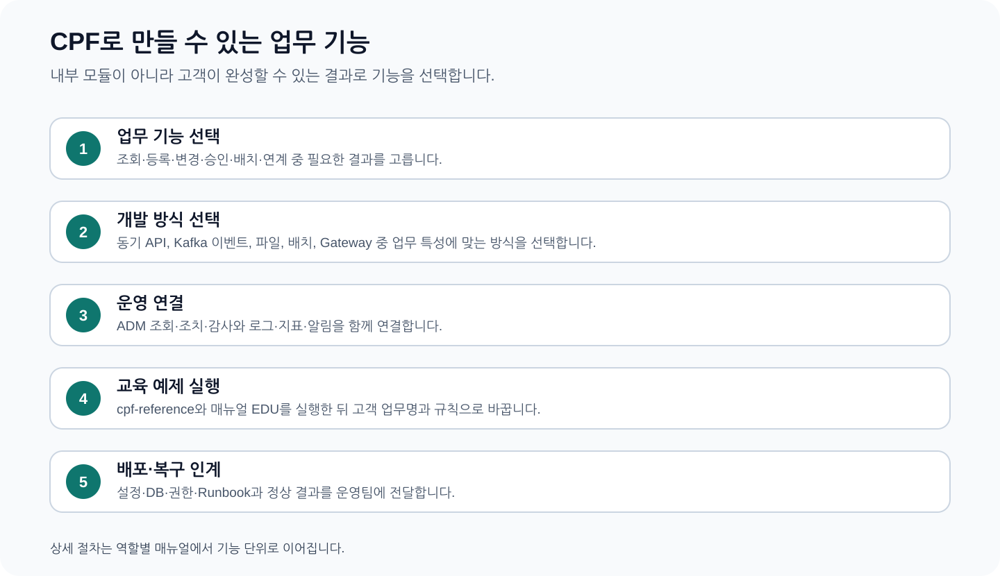
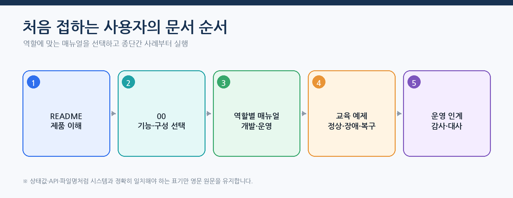
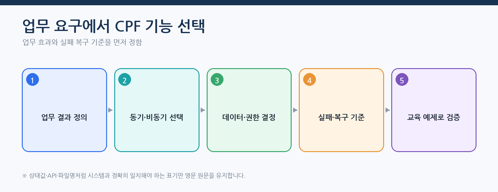
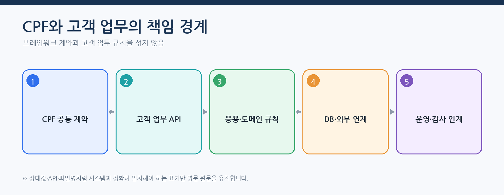
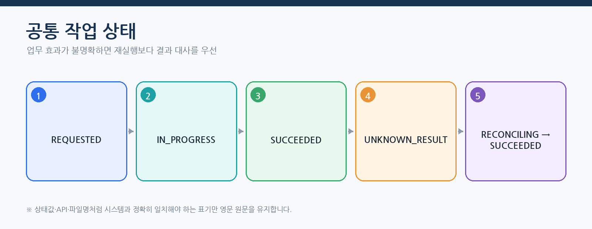
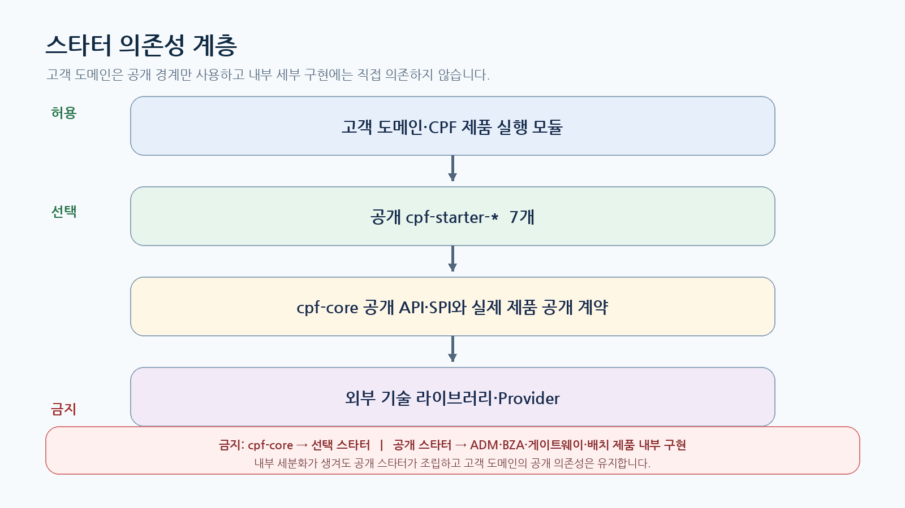
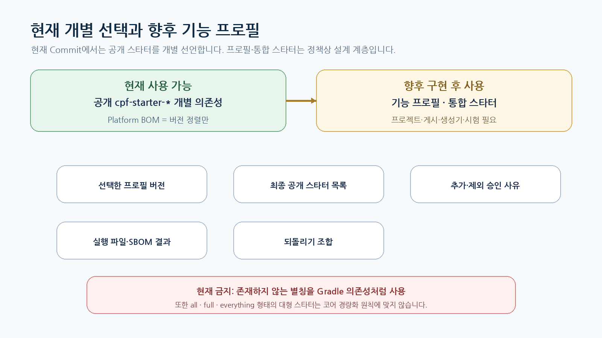

# CPF 프레임워크 안내 — 고객이 만들 수 있는 시스템과 선택 기준

> **주 독자**: 도입 검토자, 업무 기획자, 아키텍트, 개발·운영 책임자
> **읽고 나서 할 수 있어야 하는 일**: CPF로 만들 업무를 분류하고, 사용할 제품·배포 구성·담당 매뉴얼·운영 책임을 결정한다.



## 이 문서를 읽는 방법

이 문서는 CPF를 처음 접한 사용자를 기준으로 작성한다. 내부 소스를 먼저 분석하지 말고 다음 순서로 읽는다.

1. 만들려는 업무 결과를 정의한다.
2. 온라인·비동기·배치·ADM·BZA·게이트웨이 중 필요한 기능을 고른다.
3. 고객이 소유할 업무 규칙과 CPF가 제공할 공통 계약을 나눈다.
4. 동일 JVM, 모듈형 단일 애플리케이션, 분리 서비스 중 배포 구성을 고른다.
5. 역할별 매뉴얼의 종단간 사례를 실행한다.
6. 정상·오류·응답 유실·부분 실패·복구 결과를 운영팀에 인계한다.

API 경로, 설정 키, 클래스명, 상태값처럼 시스템과 정확히 일치해야 하는 값은 영문 원문을 유지한다. 설명과 판단 기준은 한글을 우선한다.

## 처음 접하는 사용자의 1일 이해 과정



| 시간 | 수행할 일 | 완료 결과 |
|---|---|---|
| 0~30분 | CPF가 제공하는 기능과 고객이 결정할 범위를 읽는다. | CPF와 고객 업무의 책임 경계를 설명할 수 있다. |
| 30~60분 | 만들 기능을 온라인·배치·ADM·BZA·게이트웨이로 분류한다. | 사용할 제품과 담당 매뉴얼이 정해진다. |
| 1~2시간 | 배포 구성과 모듈·DB 소유권을 정한다. | 동일 JVM·분리 서비스·다중 인스턴스 구성이 정해진다. |
| 2~4시간 | 대표 EDU를 실행해 작업 기록·대상·감사·아웃박스를 확인한다. | CPF의 실행·장애·복구 모델을 이해한다. |
| 4~8시간 | 개발·운영·보안·승인 담당자와 인계 항목을 정한다. | 역할·권한표와 도입 작업표가 작성된다. |

## 기능 선택을 업무 질문으로 시작



| 업무 질문 | 선택 기능 | 다음 문서 |
|---|---|---|
| 사용자가 요청 시점에 조회·등록·변경하는가? | 온라인 API·응용 계층·업무 영역·영속 계층 | [01 개발자 매뉴얼](01_개발자매뉴얼.md) |
| 정해진 시간이나 대량 데이터를 처리하는가? | Spring 배치·스케줄러·작업자 노드·센터컷 | [02 배치 개발 매뉴얼](02_배치개발매뉴얼.md) |
| 운영자가 고객 업무를 조회·조치·복구해야 하는가? | ADM 조회·명령·승인·결과 대사 연동 | [03 ADM 개발자](03_ADM개발자매뉴얼.md)·[04 ADM 운영자](04_ADM운영자매뉴얼.md) |
| 조직·직원·사용자·권한·결재를 여러 업무가 공유하는가? | BZA | [90 BZA 매뉴얼](90_BZA매뉴얼.md) |
| 여러 API에 공통 인증·라우팅·보안·제한이 필요한가? | 게이트웨이 | [91 게이트웨이 매뉴얼](91_Gateway매뉴얼.md) |
| 설치·DB·배포·관측·백업·재해복구가 필요한가? | 플랫폼 운영 | [05 플랫폼 운영 매뉴얼](05_플랫폼운영매뉴얼.md) |

## CPF와 고객 업무의 책임 경계



### 고객이 결정하고 소유하는 것

- 업무 엔터티, 상태, 금액·건수 계산 규칙
- 승인 조건, 취소·보상 조건, 대사 기준
- 고객·조직·상품·계약 데이터와 보존 정책
- 사용자 경험, 업무 화면과 외부기관 계약
- 서비스 분리 기준, 배포 단위와 운영 담당자

### CPF가 제공하는 것

- 요청 식별, 멱등성, 낙관적 버전 충돌 처리
- 임대 잠금과 펜싱 토큰을 이용한 다중 인스턴스 제어
- 아웃박스·인박스, 재처리, 결과 미확정 대사
- 권한·데이터 범위·가림 처리·감사 계약
- Spring 배치 실행·재시작·분할 처리·스케줄·센터컷
- ADM·BZA·게이트웨이와 플랫폼 운영 기능
- Oracle·PostgreSQL·MariaDB용 설치·변경·검증 묶음

ADM·BZA·게이트웨이는 고객 업무 원장을 직접 소유하지 않는다. 고객 업무 모듈의 공개 계약을 사용해 조회하거나 조치를 요청한다. 운영자는 DB를 직접 수정하지 않고 작업 기록, 대상 결과, 아웃박스, 감사와 제품 화면을 통해 상태를 판정한다.

## 모든 기능에서 공통으로 읽는 실행 상태



| 상태 | 의미 | 다음 행동 |
|---|---|---|
| `REQUESTED`, `IN_PROGRESS` | 요청이 접수되어 처리 중 | 시간 제한 안에서는 같은 요청을 다시 만들지 말고 기존 작업 기록을 조회한다. |
| `WAITING_APPROVAL` | 승인이 필요 | 승인 ID, 정책 버전, 유효시간과 요청자·승인자 분리를 확인한다. |
| `WAITING_EXTERNAL` | 외부 ACK 또는 대상 적용 결과 대기 | 아웃박스, 외부기관, 대상 인스턴스의 결과를 확인한다. |
| `UNKNOWN_RESULT` | DB 반영 또는 외부 효과의 성공 여부가 확정되지 않음 | 신규 실행을 만들지 말고 업무 원장·대상·외부 결과를 대사한다. |
| `PARTIAL_SUCCESS` | 일부 대상만 성공 | 성공 대상은 유지하고 실패 대상만 재처리한다. |
| `FAILED_RETRYABLE` | 원인 제거 후 재시도 가능한 실패 | 동일 작업 ID에서 재시도하고 새 업무 요청을 만들지 않는다. |
| `SUCCEEDED` | 업무 결과와 증적이 확정됨 | 업무 원장·감사·로그·지표·추적을 대사하고 인계한다. |

## 종단간 도입 사례 — 신규 지급 서비스

1. **업무 담당자**가 지급 신청·검증·승인·실행·취소 상태와 금액·건수 대사 기준을 정한다.
2. **온라인 개발자**가 `EDU-DEV-05`로 지급 등록, 멱등성, 응답 유실과 결과 대사를 확인한다.
3. **배치 개발자**가 일마감·대량 지급·센터컷 필요 여부를 정하고 `EDU-BAT-*`를 적용한다.
4. **ADM 연동 개발자**가 지급 조회·재처리·결과 대사 계약을 ADM에 연결한다.
5. **운영자**가 온라인 거래, 오류, 결과 미확정, 감사 화면에서 장애를 판정하고 복구한다.
6. **BZA 담당자**가 지급 승인 역할과 데이터 범위를 구성한다.
7. **게이트웨이 담당자**가 외부 지급 API 경로와 보안·게시 정책을 운영한다.
8. **플랫폼 운영자**가 DB·Kafka·배포·백업·재해복구를 인계받는다.

완료 시 하나의 지급 요청이 `businessKey`, `operationId`, `transactionId`, `traceId`로 API, 업무 원장, 배치, ADM, BZA 승인, 게이트웨이 거래와 감사에서 이어져야 한다.

## 제품 범위와 비범위

| CPF가 제공하는 범위 | 고객사가 결정하는 범위 |
|---|---|
| 모듈·계층·API·오류·거래 식별 규칙 | 업무 엔터티·상태·금액·권한 기준 |
| 로컬·원격 호출 계약과 시간 예산 | 서비스 분리 기준과 배포 단위 |
| 멱등성·버전·시도·대사 구조 | 중복의 업무 의미와 보상 정책 |
| Spring 배치 실행·재시작·작업자 노드·스케줄러 | 작업 매개변수, 청크 크기, 분할 기준, 업무 합계 |
| ADM 조회·통제·승인·감사 연결 | 어떤 조치를 누구에게 허용할지 |
| BZA 조직·권한·결재 제품 | 조직 모델, 역할, 결재 정책 |
| 게이트웨이 경로·보안·게시·적용 상태 | 공개 API, 대상, 정책, 서비스 목표 |
| DB 제품별 설치·변경·검증 도구 | 계정·용량·백업·보존·운영 정책 |

고객 업무 테이블과 상태를 CPF 공통 모듈이나 ADM·BZA·게이트웨이에 직접 넣지 않는다. 고객 업무는 해당 업무 모듈이 소유하고 다른 제품은 공개 API 또는 포트를 사용한다.

## 제품 구성과 선택 질문

### 기본 플랫폼

- 온라인 조회·등록·상태 변경·대사
- 동일 JVM·원격 서비스 호출
- Kafka 아웃박스·인박스와 재처리
- 파일·첨부·외부 REST·전문 연계
- Spring 배치 작업·작업자 노드·스케줄러·센터컷
- ADM 운영 조회·통제·복구
- 설치·DB·배포·관측·백업·재해복구

### 선택 제품

| 질문 | 선택 |
|---|---|
| 조직·직원·사용자·역할·데이터 범위·결재가 공통 제품으로 필요한가? | `cpf-biz-admin`과 90 매뉴얼 |
| 여러 업무 API를 한 진입점에서 인증·라우팅·제한·게시해야 하는가? | `cpf-gateway`와 91 매뉴얼 |
| 단일 업무 서비스가 자체 조직·권한과 직접 접속점을 사용해도 되는가? | 선택 제품 없이 기본 플랫폼 |

선택 제품을 사용하지 않을 때는 해당 모듈, 프로필, DB 초기 데이터와 기동 조건이 불필요하게 포함되지 않았는지 빌드와 실행 환경에서 확인한다.

## 아키텍처와 의존 방향

```text
고객 채널·외부기관·스케줄러
            ↓
API·메시지·배치 진입점
            ↓
고객 응용 계층 사용 사례
            ↓
고객 업무 규칙 + CPF 공개 API·확장 규약
            ↓
DB·Kafka·파일·원격 연결부
            ↓
ADM·BZA·게이트웨이의 조회·통제
```

- 업무 영역은 Spring MVC, JDBC, Kafka, 파일 구현에 직접 의존하지 않는다.
- 제어기는 저장소 구현을 직접 호출하지 않고 응용 계층 사용 사례를 호출한다.
- 동일 JVM과 원격 호출은 같은 공개 계약과 오류 의미를 사용한다.
- ADM·BZA·게이트웨이는 고객 업무 테이블을 직접 수정하지 않는다.
- 중앙 DB 제품별 묶음이 Oracle·PostgreSQL·MariaDB에서 같은 업무 의미를 유지한다.

### 모듈 소유권과 실제 사용 모듈

| 소유 모듈 | 소유 책임 | 대표 사용 모듈 | 고객이 직접 넣지 않을 것 |
|---|---|---|---|
| `cpf-core` | 공통 계약·식별·거래·오류·확장 경계와 최소 실행 기반 | 업무 모듈·스타터·실행 환경 | 고객 업무 엔터티·상태·테이블, 캐시·Kafka·세션 구현 |
| `cpf-starters` | 선택 기능 조립과 설정 연결을 소유하는 정식 루트 프로젝트군 | 고객 응용 계층·실행 모듈 | 업무별 고정 응답·원장 로직 |
| `cpf-batch/*` | 배치 제어·실행·작업자·스케줄러·센터컷 | 고객 작업 묶음·ADM | 고객 전용 업무 규칙 |
| `cpf-admin` | 운영 제어 API와 ADM 화면 | 운영자·ADM 연동부 | 고객 업무 테이블 직접 수정 |
| `cpf-biz-admin` | 조직·직원·사용자·권한·결재 | 고객 업무·ADM | 고객 업무 결과 강제 확정 |
| `cpf-gateway` | 경로·보안·정책·게시·적용 상태 | 외부 호출자·고객 API | 고객 대상 업무 로직 |
| `cpf-reference` | 고객 교육 기능과 통합 예제 | 개발·운영 교육 | 제품 실행 환경을 우회하는 구현 |
| `cpf-tools` | 생성 도구·DB 제품 묶음·설치·검증·배포 도구 | 개발·DBA·배포 담당자 | 고객 비밀정보·운영 원문 |

고객 업무가 CPF 공개 API와 확장 규약을 사용하는 방향을 유지한다. 교육 코드가 제품 모듈에 역방향 의존성을 만들거나 ADM·BZA·게이트웨이가 고객 업무 소유권을 대신하면 안 된다.

### 코어 최소화와 선택 기능 분리 원칙

`cpf-core`는 모든 도메인이 공유해야 하는 제공자 중립 계약과 최소 실행 기반만 소유한다. 특정 외부 기술, Spring Boot 자동 설정, 연결 풀, 세션 저장소, 내보내기 도구처럼 사용 여부가 서비스마다 달라지는 구현은 스타터 또는 실제 제품 소유 모듈로 분리한다.

```text
고객 도메인·제품 실행 모듈
        ↓ 필요한 기능만 선택
공개 cpf-starter-* 라이브러리
        ↓
cpf-core 공개 API·SPI + 외부 기술 라이브러리
```

- 도메인이 선택하지 않은 스타터의 JAR·Bean·설정·SQL·전이 의존성이 실행 파일에 들어오지 않아야 한다.
- `cpf-core`는 어떤 스타터도 역으로 참조하지 않는다.
- 스타터는 ADM·BZA·게이트웨이·배치·고객 도메인의 업무 상태와 원장을 소유하지 않는다.
- 기술 구현을 스타터로 옮길 때는 의존성만 이동하지 않고 공개 계약, 실제 소비 모듈, 설정, 실패 처리, 시험, 게시 메타데이터와 매뉴얼을 함께 이관한다.
- 고객은 스타터 이름보다 업무 결과·외부 기반·장애 복구 요구를 먼저 결정한다.

### 코어에서 분리하는 판단 기준

| 판단 질문 | `cpf-core`에 유지 | 스타터 또는 소유 모듈로 분리 |
|---|---|---|
| Spring 없이도 소비해야 하는 계약인가 | 식별자, 오류, 거래 문맥, API·SPI | Spring Boot 자동 설정과 조건부 Bean |
| 특정 제공자나 외부 기반이 필요한가 | 제공자 중립 인터페이스와 상태 의미 | Kafka, Redis, Caffeine, OTel, Resilience4j 연결 |
| 서비스마다 사용 여부가 다른가 | 모든 서비스의 최소 규약 | 세션, 메시징, 캐시, 관측 내보내기, 기능 전환, 비밀정보 제공자 |
| 제품 고유 상태와 정책인가 | 공통 계약만 | 게이트웨이 경로 원장, 배치 체크포인트, BZA 결재처럼 실제 제품 소유 모듈 |
| 장애·용량·비밀정보 설정이 독립적인가 | 공통 오류·관측 속성 계약 | 연결 정보, 풀, 만료, 재시도, 키·쿠키·회전 설정 |

현재 소스에서 확인한 공개 스타터는 7개다.

| 공개 스타터 | 실제 기술 연결 | 현재 소스에서 확인한 직접 소비 예 | 고객 선택 시 주의 |
|---|---|---|---|
| `cpf-starter-security` | Spring Security, 서버 세션 JDBC, 쿠키·CSRF·BFF 필터 | ADM, BZA, 배치 제어 서버 | 현재 자동 설정은 브라우저·BFF 세션 경계다. 일반 자원 서버 인증과 동일하게 취급하지 않는다. |
| `cpf-starter-messaging-kafka` | Spring Kafka와 CPF 브로커 계약 연결 | 배치 제어 서버·스케줄러·작업자·센터컷 | 업무 이벤트 의미·멱등성·대사·보상은 업무 소유자가 유지한다. |
| `cpf-starter-cache` | Spring Cache, Caffeine, Redis 연결 | 최신 기준에서 제품 직접 소비는 별도 확인 필요 | 현재 의존성에는 Caffeine과 Redis가 함께 있으므로 선택 제공자·비활성 제공자·최종 실행 파일을 확인한다. |
| `cpf-starter-observability` | Micrometer Observation, OTel 연결, OTLP 내보내기 | 게이트웨이, 배치 실행·제어·스케줄러·작업자·센터컷 | 수집기 장애가 업무 성공 여부를 바꾸지 않도록 내보내기 실패 정책을 정한다. |
| `cpf-starter-resilience` | 회로 차단기·Resilience4j 연결 | 게이트웨이, 배치 실행·작업자·센터컷 | 재시도 횟수보다 전체 시간 예산과 결과 미확정 처리를 먼저 정한다. |
| `cpf-starter-featureflag` | OpenFeature 클라이언트 연결 | 최신 기준에서 제품 직접 소비는 별도 확인 필요 | 실제 제공자, 평가 기본값, 감사와 장애 시 기본 동작을 준비한 뒤 사용한다. |
| `cpf-starter-secret` | CPF 비밀정보 제공자 자동 구성 경계 | 배치 작업자 | 저장소 제공자·회전·준비 상태·권한을 별도로 연결해야 한다. |

다음은 스타터로 옮기지 않는다.

- 고객 업무 상태·금액·승인·멱등성·대사·보상 규칙
- 배치 작업·단계·체크포인트·임대 잠금·펜싱의 제품 실행 책임
- 게이트웨이 경로·게시·적용 상태·시도 원장과 신뢰 정책
- BZA 조직·권한·결재 상태와 ADM 위험 조치의 소유권
- 공통 오류 의미, 거래 식별자, 제공자 중립 공개 계약



### 도메인의 스타터 등록 방식

현재 기준 Commit에서는 **필요한 공개 스타터를 개별 등록**한다. 플랫폼 BOM은 버전을 정렬할 뿐 스타터를 활성화하지 않으며, 루트 빌드와 생성 도구에는 여러 스타터를 한 번에 펼치는 정식 기능 묶음 프로젝트나 별칭이 아직 등록돼 있지 않다.

루트 저장소 안의 도메인 예:

```groovy
implementation project(':cpf-starter-observability')
implementation project(':cpf-starter-resilience')
```

게시 산출물을 소비하는 독립 도메인 예:

```groovy
implementation platform('com.cpf:cpf-platform-bom:<플랫폼 버전>')
implementation 'com.cpf.starter:cpf-starter-observability'
implementation 'com.cpf.starter:cpf-starter-resilience'
```

선택 계층은 다음과 같이 구분한다.

| 계층 | 현재 사용 여부 | 의미 |
|---|---|---|
| 공개 스타터 | 사용 | 실제 자동 설정·제공자 연결·게시 단위 |
| 기능 프로필 | 정책상 설계 후보 | 생성 도구나 중앙 빌드가 여러 공개 스타터를 명시적으로 해석하는 편의 계층 |
| 통합 스타터 | 승인·구현 후 사용 | 하나의 게시 의존성이 검증된 공개 스타터 조합만 전이하는 선택 계층 |
| 플랫폼 BOM | 사용 | 버전·호환성 정렬만 수행하며 기능을 추가하지 않음 |

기능 프로필이나 통합 스타터가 추가되더라도 생성 결과와 도메인 명세에는 최종 공개 스타터 목록과 버전을 남긴다. `all`, `full`, `everything`처럼 사용하지 않는 기술까지 넣는 대형 묶음은 만들지 않는다.



## 정식 루트 프로젝트 `cpf-starters`


Repository의 물리 컨테이너는 복수형 `cpf-starters/`다. Gradle 논리 프로젝트는 `:cpf-starter-<이름>` 형식이다. 두 이름을 섞지 않는다.

| Gradle 논리 프로젝트 | Repository 물리 경로 | 게시 배포 이름 |
|---|---|---|
| `:cpf-starter-security` | `cpf-starters/security` | `cpf-starter-security` |
| `:cpf-starter-messaging-kafka` | `cpf-starters/messaging-kafka` | `cpf-starter-messaging-kafka` |
| `:cpf-starter-cache` | `cpf-starters/cache` | `cpf-starter-cache` |
| `:cpf-starter-observability` | `cpf-starters/observability` | `cpf-starter-observability` |
| `:cpf-starter-resilience` | `cpf-starters/resilience` | `cpf-starter-resilience` |
| `:cpf-starter-featureflag` | `cpf-starters/featureflag` | `cpf-starter-featureflag` |
| `:cpf-starter-secret` | `cpf-starters/secret` | `cpf-starter-secret` |

### 어떤 때 어떤 스타터를 선택하는가

| 요구사항 | 선택 | 선택 전 확인 | 사용하지 않는 경우 |
|---|---|---|---|
| ADM·BZA와 같은 브라우저 운영 화면의 서버 세션·BFF | `security` | 세션 DB, 암호화 키, 허용 출처, CSRF, 로그아웃·동시 세션 | 무상태 자원 서버만 필요한 경우 현재 세션 스타터를 그대로 적용하지 않는다. |
| Kafka 비동기 발행·소비·원격 작업 | `messaging-kafka` | 주제·ACL·스키마·아웃박스·인박스·결과 대사 | 동일 거래에서 동기 결과가 반드시 확정돼야 하고 비동기 이점이 없는 경우 |
| 반복 조회 캐시 | `cache` | 정본, 키, TTL, 무효화, 제공자, 장애 시 우회 | 잔액·승인·체크포인트처럼 최신 정본을 캐시 값으로 확정하려는 경우 |
| 지표·추적·OTLP 내보내기 | `observability` | 수집기, 샘플링, 가림, 큐·역압, 장애 시 업무 영향 | 단순 API 계약만 소비하고 실행 관측을 소유하지 않는 라이브러리 |
| 시간 제한·회로 차단기·격벽 | `resilience` | 전체 시간 예산, 재시도 가능 오류, 멱등성, 결과 미확정 | 로컬 순수 계산이나 외부 효과 없는 단순 호출 |
| 기능 전환 평가 | `featureflag` | 제공자, 기본값, 새로 고침, 감사, 제공자 장애 | 배포 버전으로 고정해야 하는 보안·규제 정책을 임의 전환하려는 경우 |
| 비밀정보 참조·제공자 연결 | `secret` | 저장소 제공자, 최소 권한, 회전, 캐시, 준비 상태 | 비밀 원문을 설정 파일·환경 명세·로그에 직접 두려는 경우 |

### 하위 프로젝트 세분화 시 관리 규칙

스타터 세분화는 다음을 하나의 변경으로 처리한다.

1. 기존 공개 스타터의 소비 모듈·전이 의존성·설정·자동 설정을 수집한다.
2. 새 내부 프로젝트의 단일 책임과 공개 여부를 확정한다.
3. 공개 스타터가 내부 세부 프로젝트를 조립하게 하고 고객 도메인의 직접 의존성은 유지한다.
4. `settings.gradle`, 플랫폼 BOM, 게시 메타데이터, 잠금, SBOM과 생성 도구를 함께 갱신한다.
5. 설정 키·기본값·비밀정보·준비 상태·장애·되돌리기를 정의한다.
6. 미선택 컴파일, 자동 설정, 실제 소비 모듈, 실행 파일 포함 목록과 장애 시험을 수행한다.
7. 기존 공개 좌표를 변경한다면 호환 기간·종료 조건·이전 버전 복구 방법을 제공한다.
8. 공식 고객 매뉴얼의 프로젝트 표·선택표·Gradle 예제·운영 원장을 같은 변경에서 갱신한다.
9. 이전 프로젝트 제거 전 직접·전이 소비와 문서·BOM·생성기 참조가 0인지 확인한다.

### 프로젝트 등록과 관리 기준

1. 물리 Source는 `cpf-starters/<이름>` 아래에 둔다.
2. Gradle 논리 경로는 `:cpf-starter-<이름>`으로 루트 `settings.gradle`에 연결한다.
3. 독립 JAR·POM·Sources·JavaDoc·SBOM·버전·업그레이드·되돌리기 단위를 갖춘다.
4. AutoConfiguration은 클래스·설정·Bean 조건을 명시하고 필수 조건 누락 시 원인을 드러낸다.
5. 적어도 하나의 실제 제품 소비 또는 승인된 참조 소비와 미선택 제거 시험을 둔다.
6. 기능 프로필·통합 스타터는 실제 프로젝트·게시 좌표·해석 결과 잠금·시험이 준비된 뒤 고객 선택표에 넣는다.

### 금지 경계

- 스타터에 회원·지급·계약 같은 고객 업무 상태와 테이블을 넣지 않는다.
- `cpf-core`가 특정 제공자 형식이나 스타터를 참조하게 하지 않는다.
- 스타터를 독립 프로세스로 기동하거나 ADM에서 별도 서비스처럼 시작·중지하지 않는다.
- BOM을 추가했다는 이유만으로 기능이 활성화됐다고 판단하지 않는다.
- 생성 도구의 `Messaging`, `SecurityAudit` 같은 기능 코드 생성과 실제 스타터 의존성 등록을 같은 것으로 오해하지 않는다.

## 지원 배포 구성을 선택하는 기준

| 구성 | 적합한 경우 | 추가 확인 |
|---|---|---|
| 동일 JVM | 같은 배포·장애·확장 단위를 공유하고 호출 지연을 줄일 때 | 내부 호출이 원격 오류·권한·시간 제한 의미를 우회하지 않는지 |
| 모듈형 단일 애플리케이션 | 업무 경계는 나누되 하나의 배포 파일로 운영할 때 | 모듈 의존 방향, DB 소유권, 모듈별 시험 |
| 웹 응용 서버 분리(WAS) | 배포·확장·보안 경계를 분리할 때 | 시간 초과, 인증 전달, 원격 오류, 응답 유실 |
| 마이크로서비스 아키텍처(MSA) | 팀·배포·데이터 소유권이 분리될 때 | 아웃박스·인박스, 보상 흐름, 관측, 운영 책임 |
| 다중 인스턴스 | 처리량·가용성을 늘릴 때 | 임대 잠금, 펜싱 토큰, 버전 충돌, 설정 불일치 |

로컬 성공을 원격 성공으로 간주하지 않는다. 원격 호출의 시간 초과, 인증, 헤더 전달, 중복, 상대 처리 후 응답 유실을 별도로 시험한다.

## 고객 업무 유형별 기능 선택

| 만들 업무 | 선택할 기능 | 대표 EDU | 다음 문서 |
|---|---|---|---|
| 목록·상세·검색 | 데이터 범위, 페이지 나누기, 가림 처리 | `EDU-DEV-02`, `EDU-DEV-16` | 01 |
| 등록·수정·상태 변경 | 버전, 감사, 아웃박스 | `EDU-DEV-03`, `EDU-DEV-04` | 01 |
| 중복 방지·결과 대사 | 멱등성, 작업 기록, 결과 대사 | `EDU-DEV-05` | 01·04 |
| 비동기·메시지 | Kafka 아웃박스·인박스, DLQ | `EDU-DEV-07`, `EDU-DEV-21`, `EDU-DEV-44` | 01·04 |
| 파일·첨부 | 검사, 해시, 보존, 다운로드 감사 | `EDU-DEV-08`, `EDU-DEV-28`~`30` | 01 |
| 외부기관 연계 | REST·전문·SOAP·SFTP | `EDU-DEV-09`, `10`, `26`, `27` | 01 |
| 정기·대량 처리 | Spring 배치, 스케줄러, 작업자 노드 | `EDU-BAT-01`~`30` | 02·04 |
| 운영 화면 연결 | 조회·명령·승인·결과 대사 | `EDU-ADM-01`~`17` | 03·04 |
| 조직·권한·결재 | BZA | `EDU-BZA-01`~`14` | 90 |
| API 공개·라우팅 | 게이트웨이 | `EDU-GW-01`~`14` | 91 |
| 설치·배포·복구 | 플랫폼 운영 | `EDU-OPS-01`~`15` | 05 |

## 실행 상태와 복구 원칙

정상 응답만으로 업무 완료를 판정하지 않는다. 다음 식별자를 같은 처리 근거로 연결한다.

- 업무 ID, 업무 상태와 버전
- 작업 ID와 요청 ID
- 멱등 키와 요청 해시
- 추적 ID와 로그·지표
- 배치 작업 인스턴스·실행·단계 실행 ID
- 게이트웨이 경로 버전·검사합·시도 ID
- 승인 ID·사유·수행자·감사

응답 유실, 시간 초과, 프로세스 종료, 부분 성공이 발생하면 신규 요청보다 상태 조회와 결과 대사가 먼저다. 실제 결과를 확정한 뒤 재시도, 재시작, 실패 대상 재처리, 보상 처리, 되돌리기 중 하나를 선택한다.

## 보안·권한·감사 경계

1. 인증 주체, 역할, 조직·테넌트 범위를 검증된 요청 문맥에서 사용한다.
2. 데이터 범위를 화면 필터가 아니라 서버 조회와 명령에서 강제한다.
3. 개인정보는 기본 가림 상태로 표시하고 원문 보기는 별도 권한·사유·감사를 요구한다.
4. 위험 조치는 사전 확인, 기대 버전, 사유, 승인, 감사를 연결한다.
5. 비밀정보 원문은 문서·DB·로그·명령 인자에 남기지 않는다.
6. 긴급 권한은 대상·기간·사유를 제한하고 사용 후 권한·세션을 회수한다.

## DB 생명주기

- 지원 제품: Oracle·PostgreSQL·MariaDB
- 제품별 경로: `cpf-tools/db/vendor/<vendor>`
- 순서: 신규 설치 → 제품 초기 데이터 → 검증 → 업그레이드 → 불일치 검사 → 되돌리기 범위 판정
- 고객 업무 테이블은 고객 업무 모듈이 소유한다.
- 같은 테이블·열·제약조건·상태 의미를 세 제품에서 유지한다.
- 고객 환경에서 실행한 DB 제품, 버전, 명령, 결과와 되돌리기 지점을 설치 기록에 남긴다.

## 생성 도구와 신규 업무 시작

```powershell
pwsh -File .\cpf-tools\generator\create-domain.ps1 `
  -DomainName payment `
  -SystemCode PAY `
  -DatabaseVendor postgresql `
  -DryRun
```

사전 검토에서 모듈·패키지·시스템 코드·포트·경로·스키마 충돌을 확인한다. 실제 생성 뒤 빌드, 시험, DB 묶음, OpenAPI, JavaDoc, ADM 등록과 운영 인계를 함께 확인한다. 기존 파일 해시가 바뀐 경우 임의로 덮어쓰지 않는다.

## 135개 고객 교육 기능 지도

| 영역 | 수 | 고객 역할 | 기능 활성 조건 | 시작 문서 |
|---|---:|---|---|---|
| 온라인·연계 | 45 | `CPF_EDU_DEVELOPER` | 기본 기능과 선택 기능별 설정 | 01 |
| 배치 | 30 | `CPF_BATCH_OPERATOR` | `cpf.reference.features.batch.enabled` | 02 |
| ADM 연동 | 17 | `CPF_ADM_OPERATOR` | `cpf.reference.features.operations.enabled` | 03·04 |
| BZA | 14 | `CPF_BZA_OPERATOR` | `cpf.reference.features.backoffice.enabled` | 90 |
| 게이트웨이 | 14 | `CPF_GATEWAY_OPERATOR` | `cpf.reference.features.gateway.enabled` | 91 |
| 플랫폼 운영 | 15 | `CPF_PLATFORM_OPERATOR` | 저장소·운영 환경 명시 | 05 |

각 매뉴얼은 EDU ID, 실제 입력, 실행 API, 정상 상태, 장애 주입, 복구 방법과 고객 업무 전환 위치를 함께 설명한다.

## 역할별 문서 지도와 시작 순서

1. 도입 책임자는 이 문서에서 기능·제품·배포 구성을 결정한다.
2. 온라인·연계 개발자는 [01 개발자 매뉴얼](01_개발자매뉴얼.md)을 사용한다.
3. 배치 개발자·운영자는 [02 배치 개발 매뉴얼](02_배치개발매뉴얼.md)을 사용한다.
4. 고객 업무를 ADM에 연결하는 개발자는 [03 ADM 개발자 매뉴얼](03_ADM개발자매뉴얼.md)을 사용한다.
5. 화면 운영자는 [04 ADM 운영자 매뉴얼](04_ADM운영자매뉴얼.md)을 사용한다.
6. 설치·DB·배포·복구 담당자는 [05 플랫폼 운영 매뉴얼](05_플랫폼운영매뉴얼.md)을 사용한다.
7. 조직·권한·결재 담당자는 [90 BZA 매뉴얼](90_BZA매뉴얼.md)을 사용한다.
8. API 공개·보안·게시 담당자는 [91 게이트웨이 매뉴얼](91_Gateway매뉴얼.md)을 사용한다.

## 도입 완료 전에 남길 기록

- 선택한 제품과 제외한 제품, 제외 근거
- 배포 구성과 서비스·DB 소유권
- 온라인·비동기·배치 업무 유형
- 권한·데이터 범위·가림 처리·승인 정책
- DB 제품과 변경·되돌리기 범위
- 실행 환경·DB·웹 화면·다중 인스턴스·장애 시험 결과
- 운영 인계 담당자, 재현 명령, 복구 종료 기준
