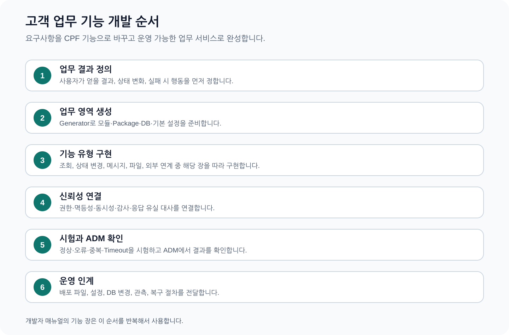
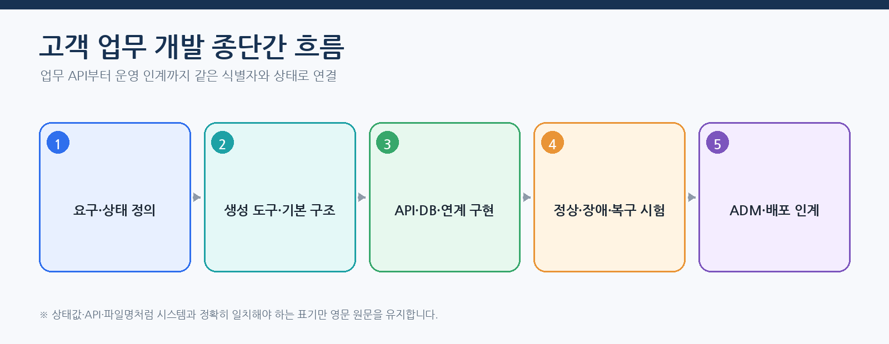
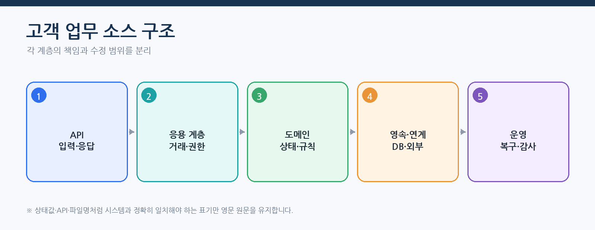
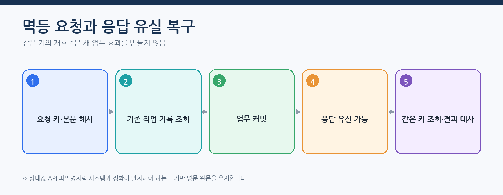
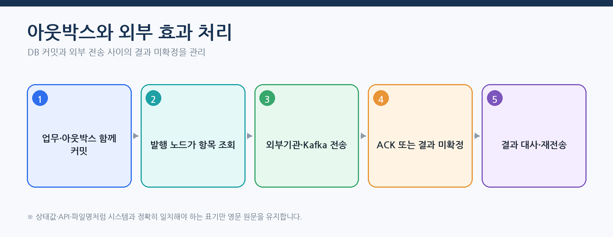
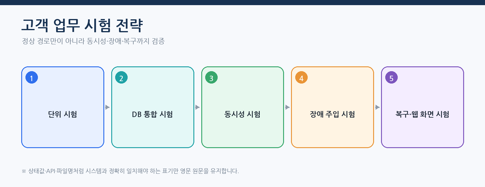
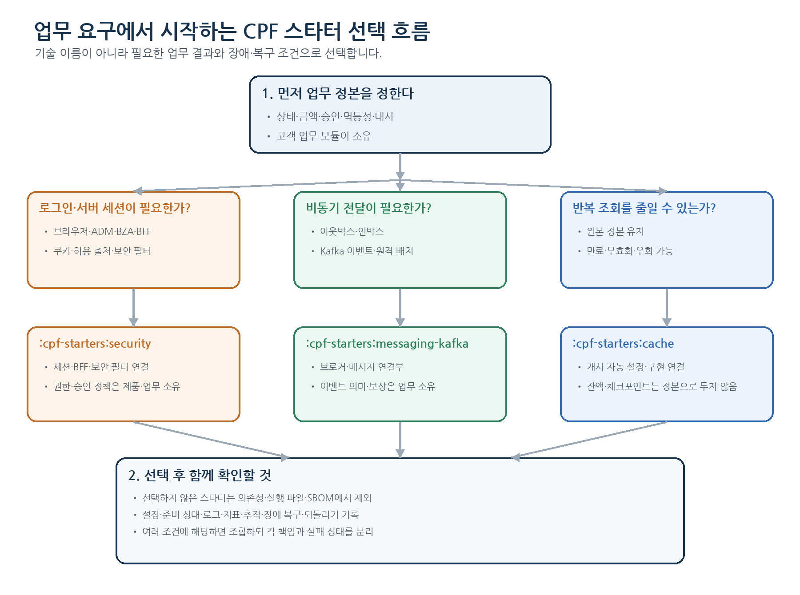

# CPF 개발자 매뉴얼 — 고객 온라인·연계 업무 개발 절차

> **주 독자**: CPF로 고객 업무 API, 메시지, 파일과 외부기관 연계를 만드는 개발자
> **목표**: 기능 선택부터 소스·DB·API·시험·ADM 운영 인계까지 한 흐름으로 수행한다.

> **용어 표기 원칙**: 설명은 한글을 우선한다. API 경로, 설정 키, 클래스·파일명, HTTP 헤더와 실제 상태값은 시스템과 일치해야 하므로 원문을 유지한다.



## 이 매뉴얼을 사용하는 기준

이 매뉴얼은 고객이 현재 배포 기준의 CPF 기능을 처음 접한다는 전제로 작성한다. 사용자는 소스를 역분석하지 않고 이 문서의 **시작 조건 → 단계별 절차 → 정상 결과 → 오류·복구 → 운영 인계** 순서로 작업한다.

- 제품 기능과 고객 교육 예제는 구현된 기능을 기준으로 설명한다.
- 기능 식별자·API·설정값·화면이 변경되면 같은 커밋에서 매뉴얼도 함께 현행화한다.
- 고객 업무 데이터·상태·승인 기준·대사 기준은 고객이 정하고, CPF가 제공하는 실행·보안·감사·복구 계약에 연결한다.
- 명령과 예시는 저장소 최상위 폴더에서 실행하는 것을 기본으로 한다.
- 운영 변경은 사전 확인, 사유, 권한, 승인, 버전, 대상별 결과, 감사 순서로 확인한다.

> 문서 검수자는 소스·SQL·API·설정·화면·스크립트·시험과 양방향으로 대조한다. 고객 사용자는 별도 소스 분석 없이 본문 절차를 수행할 수 있어야 한다.
## 처음 시작하는 개발자의 완료 기준



이 매뉴얼의 완료 결과는 제어기 하나가 아니라 다음 산출물이 같은 업무 의미로 연결된 상태다.

- API 요청·응답·오류 계약과 OpenAPI
- 응용 계층 사용 사례·트랜잭션·멱등성·기대 버전
- 업무 영역 상태 전이·업무 오류·권한·데이터 범위
- 저장소·SQL·DB 변경 이력·되돌리기·세 제품 의미
- 단위·통합·동시성·실패·복구 시험
- 로그·지표·추적·감사와 ADM 조회·복구 경로
- 배포 설정값·비밀정보·운영 인계표



## 종단간 따라하기 — 지급 등록과 응답 유실 복구

이 실습은 `EDU-DEV-05`의 실제 실행 계약을 이용해 멱등성, DB 커밋 후 응답 유실과 대사를 이해한 뒤 고객 지급 업무로 전환한다.

### 1. 구현 위치와 계약 확인

| 항목 | 경로·값 |
|---|---|
| 처리기 | `cpf-reference/src/main/java/com/cpf/reference/online/idempotency/payment/EduDev05Handler.java` |
| 시나리오 | `cpf-reference/src/main/resources/edu/online/idempotency/payment/scenario-contract.json` |
| 실행 API | `POST /api/reference/edu-capabilities/EDU-DEV-05/executions` |
| 업무 원장 | `CPF_EDU_BUSINESS_RECORD` |
| 작업 기록 | `CPF_EDU_OPERATION` |
| 대상 결과 | `CPF_EDU_OPERATION_TARGET` |
| 감사 | `CPF_EDU_OPERATION_AUDIT` |
| 필수 입력 | `customerId`, `amount`, `currency` |

### 2. 로컬 실행 환경 기동

```powershell
pwsh -File .\cpf-tools\scripts\start-cpf-local.ps1 -Mode integration
pwsh -File .\cpf-tools\scripts\status-cpf-local.ps1
```

정상 결과는 `LOCAL_WEB`과 필요한 배치 역할이 실행 중이고 각 상태 점검 URL이 `UP`인 상태다. 실패하면 `build/cpf-local-runtime/logs/*.err.log`를 먼저 확인하고, 남은 프로세스 등록 파일이 있으면 `stop-cpf-local.ps1`로 정상 종료한 뒤 다시 시작한다.

### 3. 정상 요청 실행

```powershell
$headers = @{
  'X-Cpf-Actor-Id'='dev01'
  'X-Cpf-Roles'='CPF_REFERENCE_DEVELOPER'
  'X-Cpf-Data-Scope'='ORG:100'
  'X-Cpf-Request-Id'=[guid]::NewGuid().ToString()
  'X-Cpf-Trace-Id'=[guid]::NewGuid().ToString()
}
$body = @{
  businessKey='PAY-20260802-0001'
  idempotencyKey='PAY-20260802-0001-CREATE'
  expectedVersion=0
  requestReason='고객 지급 등록 교육'
  payload=@{customerId='C10001'; amount='125000.00'; currency='KRW'}
  failurePoint='NONE'
  autoApprove=$true
  autoAcknowledge=$true
} | ConvertTo-Json -Depth 10
$result = Invoke-RestMethod -Method Post -Uri 'http://127.0.0.1:8080/api/reference/edu-capabilities/EDU-DEV-05/executions' -Headers $headers -ContentType 'application/json' -Body $body
$result | ConvertTo-Json -Depth 20
$operationId = $result.operationId
```

정상 판정:

- `state`가 `SUCCEEDED`다.
- `resultCode`가 `SUCCEEDED`다.
- `payloadHash`, `requestId`, `traceId`, `operationId`가 존재한다.
- 대상 조회에서 지급 대상이 한 건이며 `APPLIED`다.
- 감사 조회에 `CREATE`, `VALIDATED`, `IN_PROGRESS`, `DB_COMMITTED`, `SUCCEEDED` 흐름이 남는다.

### 4. 멱등성 확인

같은 `idempotencyKey`와 같은 요청 본문으로 다시 호출한다. 신규 지급을 만들지 않고 기존 작업 기록 결과를 반환해야 한다. 금액만 바꿔 다시 호출하면 같은 키·다른 요청 본문 충돌로 거부되어야 한다.



### 5. DB 커밋 후 응답 유실 재현

정상 요청의 `businessKey`와 `idempotencyKey`를 새 값으로 바꾸고 `failurePoint='RESPONSE_LOST'`를 사용한다. 호출자가 오류를 받거나 연결이 끊겨도 같은 키로 신규 지급을 만들지 않는다.

```powershell
Invoke-RestMethod -Method Get -Uri "http://127.0.0.1:8080/api/reference/edu-capabilities/EDU-DEV-05/executions?limit=20"
```

목록에서 `businessKey`를 찾아 `operationId`와 상태를 확인한다. `UNKNOWN_RESULT`이면 다음과 같이 대사한다.

```powershell
Invoke-RestMethod -Method Post -Uri "http://127.0.0.1:8080/api/reference/edu-capabilities/executions/$operationId/reconcile?reason=응답유실대사" -Headers @{'X-Cpf-Actor-Id'='dev01'}
```

대사 후 `SUCCEEDED`와 `RECONCILED` 결과를 확인한다. 지급 업무 원장·대상·감사의 `businessKey`와 `traceId`가 일치해야 한다.

### 6. 부분 실패와 외부 효과가 있는 기능



- `PARTIAL_TARGET_FAILURE`: 성공 대상을 유지하고 실패 대상만 결과 대사한다.
- `AFTER_COMMIT`: 업무 커밋 여부를 작업 기록·업무 원장으로 확인한다.
- `AFTER_EXTERNAL_SEND`·`RESPONSE_LOST`: 아웃박스 상태와 상대 기관 결과를 대사한다.
- 외부 효과가 있는 기능은 `WAITING_EXTERNAL`에서 ACK를 확인하기 전 성공으로 확정하지 않는다.

### 7. 고객 업무로 바꾸는 위치

| 바꿀 항목 | 고객 구현 | 유지할 CPF 계약 |
|---|---|---|
| 업무 이름·상태 | 지급 신청·검증·승인·완료·취소 | 작업 기록 상태와 복구 API |
| 입력 필드 | 고객·계좌·금액·통화·실행일 | 요청 ID·추적 ID·멱등 키 |
| 업무 테이블 | 고객 지급 원장 | 멱등 원장·감사·아웃박스 의미 |
| 권한 | 지급 등록·승인·원문 조회 | 권한·데이터 범위·가림 처리 검사 |
| 외부 연계 | 은행·기관 API | 시간 초과·재시도·UNKNOWN_RESULT·결과 대사 |
| 시험 데이터 | 고객 정책의 경계값 | 동시성·실패·복구 시험 구조 |

## 기능별 시험 작성 순서



1. 상태 전이와 검증을 단위 시험으로 고정한다.
2. 실제 DB와 트랜잭션·DB 변경 이력을 통합 시험으로 확인한다.
3. 같은 키·버전·임대 잠금에 동시 요청을 발생시킨다.
4. 커밋 전후·시간 초과·응답 유실·프로세스 종료를 주입한다.
5. 재시도·결과 대사·보상 처리 후 업무 건수·금액·해시를 대사한다.
6. ADM에서 `operationId`·`traceId`·감사가 같은 거래를 가리키는지 확인한다.

## 개발 시작 전 환경과 빌드

```powershell
git rev-parse HEAD
git rev-parse origin/master
git status --short
java -version
pwsh --version
.\gradlew.bat projects
```

- Java와 Gradle 버전은 저장소의 중앙 기술 기준과 플랫폼 운영 매뉴얼의 지원 환경 표를 따른다.
- 로컬 작업 폴더의 기존 변경을 삭제·복원하지 않는다.
- 고객 업무 모듈은 생성 도구 계획과 실제 생성 결과를 비교한다.
- DB 제품·프로필·포트·경로·시스템 코드를 고객 할당표에서 먼저 확정한다.

## 선택 기능 스타터 적용



스타터 선택의 출발점은 구현 기술이 아니라 고객이 끝내야 하는 업무 결과다. 다음 세 가지를 먼저 분리한다.

- **업무 정본:** 상태, 금액, 승인, 멱등성, 대사와 보상은 고객 업무 모듈이 소유한다.
- **기술 연결:** 캐시, Kafka, 세션·보안 필터는 해당 스타터가 연결한다.
- **운영 근거:** 설정, 준비 상태, 로그·지표·추적, 배포 버전과 되돌리기는 플랫폼 운영 절차가 관리한다.

신규 업무 영역을 만들기 전에 캐시·Kafka 메시징·보안 중 실제로 필요한 기능만 선택한다. 루트 프로젝트명은 `cpf-starters`이며, 현재 정식 하위 프로젝트는 `cache`, `messaging-kafka`, `security`다.

| 필요한 결과 | 추가할 프로젝트 | 고객이 결정할 값 | 정상 판정 |
|---|---|---|---|
| 반복 조회 부하를 줄이고 만료·무효화 정책을 적용 | `:cpf-starters:cache` | 캐시 대상, 키, 만료 시간, 최대 크기, 무효화 시점 | 캐시 미사용 결과와 업무 값이 같고, 무효화 뒤 최신 값을 조회 |
| Kafka 아웃박스·인박스 또는 비동기 이벤트 처리 | `:cpf-starters:messaging-kafka` | 주제, 키, 직렬화 계약, 재시도, 격리 큐, 멱등 범위 | 발행 원장·수신 원장·업무 상태·추적 ID가 연결 |
| 서버 세션·BFF·인증 필터 적용 | `:cpf-starters:security` | 세션 저장소, 쿠키 정책, 허용 출처, 인증 실패 처리, 동시 세션 정책 | 인증 전·후 접근, 로그아웃, 세션 만료, 위조 요청 차단 시험 통과 |


### 기능별 선택·비선택 기준

| 스타터 | 선택하는 경우 | 선택하지 않는 경우 | 반드시 함께 시험할 장애 |
|---|---|---|---|
| `cache` | 동일한 읽기가 반복되고, 오래된 값 허용 범위와 무효화 시점이 명확하며, 캐시 실패 시 원본 조회가 가능한 경우 | 잔액·승인 상태·실행 소유권·체크포인트처럼 최신 정본이 필요한 값을 캐시로 확정하려는 경우 | 오래된 값, 제공자 단절, 대량 만료, 메모리 압박, 무효화 유실 |
| `messaging-kafka` | 업무 커밋과 외부 전달을 분리하고, 중복·순서·재처리·격리 큐와 상대 결과 대사가 필요한 경우 | 같은 트랜잭션 안에서 동기 결과가 반드시 확정돼야 하는 단순 내부 호출을 비동기로 바꾸려는 경우 | 발행 후 응답 유실, 중복 수신, 순서 역전, 브로커 단절, 격리 큐 재처리 |
| `security` | 서버가 로그인·세션·쿠키·허용 출처·보안 필터를 소유하는 웹·BFF 경계인 경우 | 내부 배치 작업의 임대 잠금이나 서비스 간 업무 권한을 브라우저 세션으로 대체하려는 경우 | 세션 저장소 단절, 키 변경, 동시 세션, 시간 차이, 위조 요청, 로그아웃 실패 |

### 대표 조합 예시

**고객 조회 API에 캐시만 적용**

1. 고객 DB 조회를 정본으로 둔다.
2. 조회 결과 중 가림 처리된 읽기 모델만 캐시한다.
3. 고객 변경 커밋 뒤 해당 고객 키를 무효화한다.
4. 캐시가 비어 있거나 장애이면 DB 조회로 돌아간다.
5. 캐시 사용 전후 응답의 업무 값과 권한 범위가 같은지 시험한다.

**지급 등록 뒤 Kafka 이벤트 발행**

1. 지급 원장과 아웃박스를 같은 DB 트랜잭션에 기록한다.
2. 커밋 뒤 `messaging-kafka` 연결부가 이벤트를 전송한다.
3. 응답 유실 시 새 지급을 만들지 않고 아웃박스·상대 수신 원장을 조회한다.
4. 같은 키·같은 본문은 기존 결과를 반환하고, 같은 키·다른 본문은 충돌로 거부한다.
5. 발행·수신·업무 원장·감사에 같은 작업 ID와 추적 ID가 남는지 확인한다.

**ADM·BZA 로그인에 보안 스타터 적용**

1. 서버 세션 저장소와 쿠키 정책을 정한다.
2. 허용 출처, 세션 만료, 동시 세션과 로그아웃 정책을 구성한다.
3. 화면의 역할·메뉴·데이터 범위는 ADM·BZA 권한 계약으로 판정한다.
4. 세션 저장소 장애 시 변경 명령을 허용하지 않고 원인을 노출한다.
5. 로그인·만료·강제 종료·위조 요청·다중 인스턴스 시험을 수행한다.

### 개별 등록과 묶음 등록

고객 모듈은 다음 중 하나를 선택한다.

- **개별 등록:** 기능 하나만 필요하거나 비표준 조합인 경우
- **묶음 등록:** 반복 검증된 표준 업무 유형에 해당하는 경우

Repository 안에서 개별 등록하는 형식은 다음과 같다.

```groovy
implementation project(':cpf-starters:cache')
implementation project(':cpf-starters:messaging-kafka')
implementation project(':cpf-starters:security')
```

루트 버전 카탈로그가 묶음 별칭을 제공하는 경우에는 다음처럼 하나의 의존성 선언으로 등록한다.

```groovy
implementation(libs.bundles.cpf.operations.web)
```

위 별칭은 `security`와 `cache` 공개 스타터를 펼친다. `operations-event` 묶음은 세 공개 스타터를 펼친다. 묶음 별칭은 다음 표의 매핑을 따라야 한다.

| 묶음 별칭의 논리 이름 | 포함 공개 스타터 | 사용 예 |
|---|---|---|
| `secure-web` | `security` | 고객 웹·BFF 로그인 |
| `read-optimized` | `cache` | 반복 조회 최적화 |
| `event-driven` | `messaging-kafka` | 비동기 이벤트 서비스 |
| `operations-web` | `security`, `cache` | ADM·BZA 연동 운영 웹 |
| `operations-event` | `security`, `cache`, `messaging-kafka` | 운영 웹의 비동기 명령·통지 |

Gradle 카탈로그의 실제 별칭 표기는 점 표기 규칙에 따라 `libs.bundles.cpf.operations.web`처럼 노출될 수 있다. `gradle/libs.versions.toml` 또는 중앙 빌드 카탈로그에 해당 별칭이 등록된 Commit에서만 사용한다. 별칭이 없으면 같은 매핑의 공개 스타터를 개별 등록한다.

**BOM만 추가해서는 스타터 기능이 들어오지 않는다.** BOM은 버전 제약을 제공하고, 개별 스타터나 묶음 별칭이 실제 의존성을 추가한다. 게시된 배포 파일을 사용하는 고객 저장소에서는 플랫폼 BOM으로 버전을 맞춘 뒤 공개 스타터 또는 묶음 별칭을 별도로 선언한다. 프로젝트 의존성과 게시 좌표를 한 모듈에서 섞지 않는다.

### 향후 스타터 세분화에 대응하는 공개 경계

`cache`, `messaging-kafka`, `security`는 도메인이 의존하는 안정적인 공개 스타터로 유지한다. 내부 구현이 자동 설정·제공자·관측·시험 지원으로 더 나뉘더라도 고객 도메인은 새 내부 프로젝트를 하나씩 추가하지 않는다.

- 공개 스타터가 내부 세부 모듈을 조립한다.
- 기능 묶음은 공개 스타터만 참조한다.
- 도메인 빌드 파일은 공개 스타터 또는 묶음 별칭까지만 사용한다.
- 내부 세부 프로젝트를 직접 의존한 모듈은 의존성 누출 검사에서 실패시킨다.
- 공개 스타터를 교체하거나 제거할 때만 고객 모듈의 의존성을 변경한다.

### 적용 순서

1. 업무 요구에서 기술 기능과 업무 규칙을 분리한다. 업무 상태·원장·승인 규칙은 고객 업무 모듈에 둔다.
2. 표준 업무 유형이면 승인된 기능 묶음을 선택하고, 비표준 조합이면 필요한 공개 스타터만 개별 추가한 뒤 의존성 그래프를 확인한다.
3. 프로필과 설정값을 작성한 뒤 자동 설정 조건이 충족되는지 기동 로그와 준비 상태에서 확인한다.
4. 정상·설정 누락·연결 실패·시간 초과·중복 요청 시험을 실행한다.
5. 사용하지 않는 스타터가 실행 파일·POM·SBOM에 들어오지 않았는지 확인한다.
6. ADM 운영 인계에는 활성 스타터, 사용 모듈, 설정 위치, 재기동 필요 여부와 되돌리기 절차를 적는다.
7. 생성 도구를 사용할 때도 선택한 기능 묶음을 공개 스타터 목록으로 펼쳐 고객 모듈의 `build.gradle`과 도메인 명세에 남기고, 선택하지 않은 스타터나 내부 세부 프로젝트를 공통 의존성으로 추가하지 않는다.
8. 코어 공개 API로 해결할 수 있는 계약과 스타터가 제공하는 구현 연결을 구분해, 고객 코드가 스타터 내부 클래스에 직접 결합되지 않게 한다.

### 빌드와 회귀 확인

저장소 루트에서 실행한다.

```powershell
.\gradlew.bat :cpf-starters:cache:check `
  :cpf-starters:messaging-kafka:check `
  :cpf-starters:security:check
```

```bash
./gradlew :cpf-starters:cache:check \
  :cpf-starters:messaging-kafka:check \
  :cpf-starters:security:check
```

선택한 스타터 시험만 성공했다고 고객 업무가 완료된 것은 아니다. 해당 스타터를 실제로 사용하는 고객 모듈의 통합 시험과 전체 `clean build`까지 수행하고, 캐시 장애·Kafka 응답 유실·세션 저장소 장애를 각각 재현한다.

### 변경과 되돌리기

- 캐시 제거: 캐시를 비활성화한 상태에서도 DB 또는 원격 원본 조회가 같은 업무 결과를 반환하는지 확인한 뒤 의존성을 제거한다.
- Kafka 제거: 대기 중인 아웃박스·인박스와 격리 큐를 먼저 확정하고, 동기 대체 경로의 시간 제한·중복·응답 유실 정책을 검증한다.
- 보안 제거 또는 교체: 세션·쿠키·인증 필터를 먼저 대체하고, 기존 세션 폐기와 재로그인 정책을 운영 공지에 포함한다.
- 모든 경우에 플랫폼 BOM, 의존성 잠금, SBOM과 운영 설정 문서를 같은 변경에서 갱신한다.

## 생성 도구 기반 신규 업무 영역

### 결정할 값

- 업무 영역 이름과 Java 패키지 기준 경로
- 시스템 코드와 경로 접두어
- 데이터베이스 제품·스키마 소유 모듈
- 로컬·원격 배포 단위와 포트
- 생성 대상 모듈·작업 묶음·저장소 범위

### 사전 검토

```powershell
pwsh -File .\cpf-tools\generator\create-domain.ps1 `
  -DomainName payment `
  -SystemCode PAY `
  -DatabaseVendor postgresql `
  -DryRun
```

1. 생성·수정 예정 파일과 모듈 등록을 확인한다.
2. 모듈·패키지·시스템 코드·포트·경로·스키마 충돌이 0건인지 확인한다.
3. 기존 파일과 생성 틀의 해시가 다르면 덮어쓰지 않는다.
4. 아래 매개변수 표에서 필수값·허용값·기본값을 확인한다.
5. 생성 뒤 빌드·시험·DB 제품별 묶음·OpenAPI·JavaDoc·ADM 등록을 함께 검증한다.

### 생성 도구 매개변수

| 매개변수 | 필수·기본값 | 허용값·입력 기준 | 생성 결과에 미치는 영향 |
|---|---|---|---|
| `DomainName` | 필수 | 영문 소문자로 시작하는 2~30자리 영문 소문자·숫자 | 프로젝트명 `cpf-<domain>`과 업무 영역 식별자 |
| `SystemCode` | 필수 | 영문 대문자로 시작하는 정확히 3자리 영문 대문자·숫자 | 거래·DB·배포에서 사용하는 시스템 코드 |
| `ModuleName` | 선택 | 영문 대문자로 시작하는 2~50자리 자바 클래스 이름 | 생성 클래스와 명세 파일의 표시 이름 |
| `PackageName` | 기본 `com.cpf.<domain>` | 유효한 자바 패키지 이름 | API·응용·업무·저장 계층의 기준 패키지 |
| `Port` | 기본 `8080` | `1024~65535` | 로컬 실행과 배포 명세의 서비스 포트 |
| `DatabaseVendor` | 기본 `mariadb` | `mariadb`, `postgresql`, `oracle` | 선택 DB 드라이버·Flyway 모듈·제품별 SQL 묶음 |
| `DependencyModel` | 기본 `root-project` | `root-project`, `published-artifact` | 같은 저장소 참조 또는 배포 파일 저장소 참조 |
| `PlatformVersion` | 기본 `1.0.0-SNAPSHOT` | 승인된 CPF 배포 버전 | 배포 파일 의존 버전과 호환성 기준 |
| `Capabilities` | 기본 `online,database,local-call` | `database`, `batch`, `center-cut`, `external`, `messaging`, `file`, `ui`, `security`, `audit`, `local-call`, `remote-call` | 필요한 기능의 설정·의존성·배포 명세 생성 |
| `Online`, `Database`, `Batch`, `CenterCut`, `External`, `Messaging`, `File`, `SecurityAudit`, `Ui` | 각 기능에 따라 `Y` 또는 `N` | `Y`, `N` | 이전 호출 방식과의 호환 입력이며 `Capabilities`와 같은 의미로 정규화 |
| `DryRun` | 실제 생성 전 필수 수행 | 스위치 | 작업 폴더를 바꾸지 않고 생성·충돌·변경 예정 경로 출력 |
| `GeneratePatch` | 선택 | 스위치 | 직접 적용하지 않고 검토 가능한 변경 자료 생성 |
| `Apply` | 검토·승인 후 사용 | 스위치 | 검증된 생성 계획을 작업 폴더에 반영 |
| `ProvisionDatabase` | DB 계정 생성이 필요할 때 | 스위치 | DB 서비스 계정·권한 반영; 비밀정보와 승인 절차 필요 |
| `OutputDir` | 선택 | 저장소 안의 승인된 상대 경로 | 생성 자료와 명세 파일 출력 위치 |

`Capabilities`에서 선택하지 않은 기능은 생성 모듈의 필수 기동 조건으로 남기지 않는다. 현재 생성 도구 계약의 `security`와 `messaging` 선택은 각각 `security`, `messaging-kafka` 공개 스타터에 대응한다. 캐시는 생성 도구가 별도 `cache` 기능 또는 기능 묶음을 제공하는 Commit부터 자동 선택하며, 그 전에는 개발자가 공개 `cache` 스타터를 명시적으로 등록한다.

생성 도구가 기능 묶음을 지원할 때는 묶음 이름만 명세에 저장하고 빌드 생성 단계에서 승인된 공개 스타터 목록으로 펼친다. 생성 결과에는 묶음 이름, 펼쳐진 스타터, 각 버전과 선택 사유가 함께 남아야 한다. 묶음 정의가 바뀌어도 기존 도메인에 새 스타터가 조용히 추가되지 않도록 생성 계획과 실제 차이를 검토한다.

`DryRun` 결과에 기존 파일 충돌, 포트·경로·시스템 코드 중복, 지원하지 않는 DB 제품이 표시되면 `Apply`를 실행하지 않는다.

### 중단·되돌리기

- 사전 검토는 작업 폴더를 변경하지 않아야 한다.
- 실제 생성 중 중단되면 이번 실행 명세 파일에 포함된 경로만 식별한다.
- 다른 작업자의 추적·미추적 파일을 삭제하지 않는다.
- 생성 전 백업과 명세 파일이 없으면 광범위한 삭제 명령을 사용하지 않는다.

### EDU-DEV-01 제한

`cpf-reference/src/main/scripts/edu/invoke-reference-edu.ps1`의 `EDU-DEV-01`은 `GENERATOR_SANDBOX`를 만들며 결과에 `generatedDomainLinkedToEdu=false`를 기록한다. 이 격리 실행공간 성공은 실제 `create-domain.ps1`의 고객 업무 영역 생성·빌드·DB·OpenAPI 검증을 대신하지 않는다. 실제 고객 업무 영역 생성은 뒤의 생성 도구 완료 절차로 빌드·DB·OpenAPI까지 확인한다.

## 고객 업무 계층과 수정 경계

```text
api            HTTP·메시지·배치 입력, 전송 객체, 입력 검증
application    사용 사례, 트랜잭션, 권한, 작업 기록
domain         엔터티, 값 객체, 상태 전이, 업무 규칙
persistence    저장소 포트 구현, SQL 연결 규칙
integration    원격·Kafka·파일 연결부
operation      재시도·결과 대사·보상 처리·감사
config         프로필·설정값 연결·기능 전환값
```

고객이 수정하는 영역은 업무 상태·규칙·전송 객체·저장소 계약·연결부 설정이다. CPF 공개 API·SPI, 공통 헤더, 오류 분류와 중앙 DB 제품별 묶음의 관리 규칙을 임의 복사하거나 우회하지 않는다.

## 목록·상세 조회 API

### 업무 결과

조직·테넌트·역할 범위를 서버 조회 조건에 적용하고 목록 전체 건수와 상세 접근 범위를 일치시킨다.

### 시작 전에 결정할 값

- 검색 입력 항목·기본 기간·최대 기간
- 허용 정렬 입력 항목과 페이지/커서 방식
- 데이터 범위와 가림 처리 등급
- 조회 시간 초과와 최대 건수

### 수행 순서

1. 요청 전송 객체와 검증을 정의한다.
2. 응용 계층 조회가 권한과 데이터 범위를 먼저 계산한다.
3. 저장소 조회에 범위를 강제하고 페이지 나누기·정렬을 적용한다.
4. 목록·상세에서 같은 상태·가림 처리 의미를 사용한다.
5. 빈 결과·찾을 수 없음·권한 없음을 분리한다.
6. OpenAPI와 생성 클라이언트를 갱신하고 시험한다.

### 정상 판정

- 권한 밖 데이터 0건
- 목록 전체 건수와 상세 접근 범위 일치
- 최대 기간·페이지·정렬 오류가 표준 오류로 반환
- 추적에 조회 기준과 조직 범위가 민감정보 없이 남음

### 오류·경계·부분 실패

- N+1과 과도한 조회
- DB 시간 초과
- 커서 만료
- 조회 중 원본 변경
- 가림 처리 누락

### 복구·대사·되돌리기

- 조회는 무조건 재시도하지 않고 시간 초과 원인과 DB 부하를 확인한다.
- 커서가 무효면 첫 페이지부터 새 스냅샷 기준으로 조회한다.
- 권한 오류는 권한·조직 배정 변경 후 새 인증 문맥으로 다시 요청한다.

### 로그·지표·추적·감사

- `transactionId`·`traceId`·`businessKey`
- 조회 건수·지연·DB 호출 수
- 권한 거부·가림 처리 적용 감사

### 운영 인계

- 검색 기본값과 최대값
- 데이터 범위 담당자
- 색인·용량 기준
- ADM 조회 위치와 장애 연락처
## 등록·수정·상태 변경

### 업무 결과

업무 소유 모듈이 허용 상태 전이를 결정하고 버전·사유·감사·아웃박스를 한 트랜잭션 결과로 연결한다.

### 시작 전에 결정할 값

- 업무 상태표와 허용 전이
- 명령별 권한
- `expectedVersion` 사용 기준
- 사유 필수 조건
- 후속 이벤트와 보상 정책

### 수행 순서

1. 상태 전이 규칙을 업무 영역 시험로 작성한다.
2. 명령 API에서 검증·권한·데이터 범위를 검사한다.
3. 조건부 갱신 또는 낙관적 잠금으로 버전을 비교한다.
4. 업무 상태, 감사, 아웃박스를 같은 트랜잭션에 저장한다.
5. 응답 후 작업 기록과 업무 상태를 재조회한다.

### 정상 판정

- 한 요청만 버전을 증가시킴
- 감사에 변경 전후·실행자·사유 기록
- 아웃박스와 업무 상태 불일치 없음
- 응답 유실 뒤 작업 기록 조회로 결과 확정

### 오류·경계·부분 실패

- 사유 누락
- 허용되지 않은 전이
- 버전 충돌
- 감사·아웃박스 저장 실패
- 커밋 후 응답 유실

### 복구·대사·되돌리기

- 버전 충돌은 최신값 재조회 후 사용자가 차이를 확인한다.
- 커밋 전 실패는 전체 되돌리기를 확인한다.
- 커밋 후 응답 유실은 재등록하지 않고 작업 기록·멱등 키로 대사한다.
- 외부 효과가 있으면 보상 가능 여부를 확인한다.

### 로그·지표·추적·감사

- 상태 변경 성공·거부 수
- 버전 충돌 수
- 아웃박스 지연
- 작업 ID·업무 ID·추적 ID 감사

### 운영 인계

- 상태표·권한표
- DB 변경 이력과 되돌리기 제한
- 운영 재처리·결과 대사 절차
- ADM 조치와 승인 조건
## 멱등성·응답 유실·결과 대사

### 업무 결과

같은 업무 요청은 한 번만 반영하고 응답을 받지 못한 호출자는 실제 결과를 조회한 뒤 다음 행동을 결정한다.

### 시작 전에 결정할 값

- 멱등 키 범위와 만료
- HTTP 변경 API에서는 표준 헤더 `Idempotency-Key`와 요청 본문 해시를 함께 원장에 기록한다.
- 요청 해시 구성
- 동일 키·다른 요청 본문 처리
- 작업 기록 보존기간
- 결과 대사 소유 모듈

### 수행 순서

1. 요청 수신 시 키와 해시를 기록한다.
2. 동일 키·동일 해시는 기존 결과를 반환한다.
3. 동일 키·다른 해시는 충돌로 거부한다.
4. 업무 커밋과 작업 기록 결과를 연결한다.
5. 응답 유실 시험 자료로 결과 조회와 결과 대사를 시험한다.

### 정상 판정

- 중복 업무 행·이벤트·외부 전송 없음
- 동일 요청은 같은 작업 기록 결과
- 해시 충돌은 업무 변경 없이 거부
- UNKNOWN_RESULT가 조회·대사 뒤 종결

### 오류·경계·부분 실패

- 커밋 전 종료
- 커밋 후 응답 유실
- 외부 전송 뒤 시간 초과
- 상대 시스템 결과 조회 불가
- 멱등 원장 기록 만료

### 복구·대사·되돌리기

- 커밋 전 실패만 제한된 재시도 대상이다.
- 커밋 이후는 업무·아웃박스·상대 상태를 먼저 조회한다.
- 확정 불가 상태는 UNKNOWN_RESULT로 유지하고 운영자 확정·보상 절차를 사용한다.

### 로그·지표·추적·감사

- 멱등 재호출·충돌
- UNKNOWN_RESULT 체류시간
- 결과 대사 성공·실패
- 시도별 외부 응답·감사

### 운영 인계

- 키 생성 규칙
- 상대 조회 계약
- UNKNOWN_RESULT 담당자
- 강제 확정 권한·사유·승인
## 로컬·원격 호출과 시간 초과

### 업무 결과

같은 공개 계약을 동일 JVM의 로컬 연결부와 분리 WAS 원격 연결부에서 같은 의미로 실행한다.

### 시작 전에 결정할 값

- 호출 대상 시스템 코드·작업 기록
- 전체 시간 예산과 단계별 시간 초과
- 인증·권한 헤더 전달
- 재시도 가능한 오류
- 회로 차단기·격벽 범위

### 수행 순서

1. 호출자는 공개 클라이언트 또는 포트만 의존한다.
2. 로컬·원격 연결부가 같은 요청·응답·오류 계약을 구현한다.
3. 원격에서는 추적·수행자·데이터 범위·멱등 문맥을 전달한다.
4. 상대 처리 후 응답 유실을 장애 시험로 재현한다.
5. 두 구성 현황의 상태·감사 결과를 비교한다.

### 정상 판정

- 로컬·원격의 업무 상태·오류 코드 일치
- 시간 초과이 전체 예산을 넘지 않음
- 재시도가 멱등 요청에만 적용
- 상대 처리 후 응답 유실을 대사

### 오류·경계·부분 실패

- DNS·TLS·인증 실패
- 연결·읽기 시간 초과
- 원격 5xx
- 회로 차단기 열림
- 상대 커밋 후 응답 유실

### 복구·대사·되돌리기

- 연결 전 실패와 상대 처리 가능성이 있는 실패를 분리한다.
- 상대 작업 기록 조회가 있으면 먼저 사용한다.
- 결과 미확정은 새 명령을 보내지 않는다.

### 로그·지표·추적·감사

- 호출자·제공자 추적 연결
- 단계별 지연
- 회로 차단기 상태
- 상대 오류 분류·시도

### 운영 인계

- 구성 현황·주소·인증
- 시간 초과 예산
- 상대 장애 연락처
- 대사 API와 재처리 금지 조건
## Kafka 아웃박스·인박스

### 업무 결과

업무 커밋과 이벤트 발행 의도를 함께 저장하고 중복 전달·재시작에서도 사용 모듈 업무 결과를 한 번만 반영한다.

### 시작 전에 결정할 값

- 토픽·키·분할 처리 기준
- 이벤트 스키마 버전
- 아웃박스 재시도·만료
- 인박스 중복 보존
- DLQ·재처리 권한

### 수행 순서

1. 업무 상태와 아웃박스를 같은 트랜잭션에 저장한다.
2. 발행기가 소유권 획득·임대 잠금·펜싱으로 미전송 건을 전송한다.
3. 사용 모듈이 인박스 키와 요청 본문 해시를 확인한다.
4. 처리 성공 후 인박스와 업무 결과를 연결한다.
5. 스키마 비호환·처리 불가 메시지를 격리하고 재처리한다.

### 정상 판정

- 업무 커밋 없이 이벤트 발행 없음
- 중복 이벤트가 업무를 중복 변경하지 않음
- 발행기 재기동 후 미전송 건 계속 처리
- DLQ 재처리가 감사에 기록

### 오류·경계·부분 실패

- 브로커 중단
- 전송 성공 후 ACK 유실
- 사용 모듈 커밋 전 종료
- 스키마 버전 불일치
- DLQ 반복 실패

### 복구·대사·되돌리기

- 아웃박스는 시도와 다음 재시도 시각을 유지한다.
- 사용 모듈는 인박스 결과를 조회해 중복을 판정한다.
- DLQ는 원인 수정·대상 확인·승인 후 재처리한다.

### 로그·지표·추적·감사

- 아웃박스 적체량·최장 대기시간
- 사용 모듈 지연·중복 건수
- DLQ 건수·재처리 결과
- `eventId`·`aggregateId`·`traceId`

### 운영 인계

- 토픽·접근 제어 목록·보존
- 스키마 호환 정책
- DLQ 소유 모듈
- 브로커 장애와 재처리 절차
## 파일·첨부·외부기관 연계

### 업무 결과

파일과 외부 요청을 업무 상태와 분리해 저장하고 해시·버전·검사·시도로 부분 실패를 복구한다.

### 시작 전에 결정할 값

- 파일 최대 크기·형식·보존
- 검사 프로필과 격리 정책
- SFTP·REST·SOAP·전문 접속점 별칭
- 시간 초과·재전송·상대 조회
- 개인정보·암호화·키 교체

### 수행 순서

1. 스트리밍과 해시 계산으로 수신한다.
2. 검사 완료 전 업무에 연결하지 않는다.
3. 외부 요청 전 시도와 요청 해시를 기록한다.
4. 전송 전후 실패 지점를 시험한다.
5. 다운로드·반출은 권한·사유·만료·감사를 적용한다.

### 정상 판정

- 헤더·꼬리 레코드·건수·금액·해시 대사
- 악성 파일 격리
- 외부 응답과 업무 상태 연결
- 부분 업로드 재개 시 중복 조각 없음
- 다운로드 감사와 만료 적용

### 오류·경계·부분 실패

- 중단 업로드
- 해시 불일치
- 검사 실행 엔진 지연
- SFTP 이름 변경 실패
- 외부 전송 후 응답 유실
- SOAP 장애·전문 전문 형식 오류

### 복구·대사·되돌리기

- 업로드 ID와 조각 해시로 재개한다.
- 외부 전송 후에는 상대 거래 조회로 결과를 확정한다.
- 격리 파일은 승인 없이 해제하지 않는다.
- 삭제·보존·법적 보류 충돌은 보존 정책을 우선한다.

### 로그·지표·추적·감사

- 파일 크기·처리시간·검사 결과
- 외부 시도·시간 초과·상대코드
- 다운로드 수행자·사유
- 민감정보가 가려진 추적

### 운영 인계

- 접속점·인증·인증서
- 파일 전문 형식·해시
- 보존·삭제 소유 모듈
- 응답 유실 대사와 수동 확정

## 보안·권한·데이터 범위·감사

1. 인증 주체·역할·조직·테넌트·데이터 범위를 제어기 입력이 아니라 검증된 요청 문맥에서 사용한다.
2. 조회와 명령 모두 서버 측에서 데이터 범위를 강제한다.
3. 개인정보는 전송 객체·로그·추적·감사·반출에서 같은 가림 처리 정책을 사용한다.
4. 가림 처리 해제와 대량 반출은 별도 권한·사유·승인·만료·감사를 요구한다.
5. 상태 변경은 수행자·사유·기대 버전·변경 전후·작업 기록 ID를 감사한다.
6. 토큰·비밀번호·비밀정보·개인 키 원문을 소스·시험 자료·로그·명령 인자에 남기지 않는다.
7. 권한 실패, 범위 밖 데이터, 세션 만료, 키 교체, 감사 저장 실패를 시험한다.

정상 판정은 화면에서 보이지 않는 것만으로 끝나지 않는다. API 결과 0건·권한 없음 구분, DB 조회 범위, 가림 처리 값, 감사 수행자·사유·작업 기록을 함께 확인한다.

## DB 변경·업그레이드·되돌리기

1. 스키마·색인·제약조건 변경의 고객 업무 영향과 과거 데이터 보충을 작성한다.
2. 세 제품의 의미와 오류 조건을 맞춘다.
3. 신규 설치, 기존 버전 업그레이드, 재실행, 중단 후 재개를 시험한다.
4. 응용 계층 이전·신규 버전이 공존하는 배포 구간을 확인한다.
5. 되돌리기 가능한 변경과 전진 수정만 가능한 변경을 구분한다.
6. 불일치 검사 결과와 적용 전후 스키마 버전을 운영 인계에 포함한다.

## OpenAPI·생성 클라이언트·JavaDoc

- 제어기와 전송 객체를 바꾸면 OpenAPI를 갱신하고 검증 스크립트를 실행한다.
- 생성 클라이언트는 원본 OpenAPI와 작업 기록 ID가 일치해야 한다.
- 생성 결과만 수동 수정하지 않는다.
- 공개 API·SPI는 목적, 입력, 오류, 스레드·트랜잭션 의미를 JavaDoc에 기록한다.
- 내부 클래스를 고객 계약처럼 문서화하지 않는다.

## 시험 전략

| 시험 | 반드시 확인할 것 |
|---|---|
| 단위 | 상태 전이, 검증, 금액·시간·권한 규칙 |
| 계층 단위 | 제어기·저장소·직렬화 처리기·오류 연결 규칙 |
| 통합 | 실제 트랜잭션, DB, Kafka/파일 연결부 |
| 동시성 | 동일 버전·멱등 키·임대 잠금 경쟁 |
| 실패 | 커밋 전후, 외부 전송 전후, 시간 초과, 프로세스 종료 |
| 복구 | 재시도·결과 대사·보상 처리·되돌리기 |
| 제품 | Oracle·PostgreSQL·MariaDB 의미 일치 |
| 웹 화면/ADM | 화면 입력 항목·버튼·권한·응답 유실·감사 |

직접 실행한 명령, 종료 코드, 환경, 기준 SHA와 증적을 남긴다. 실행한 환경·명령·종료 코드와 결과를 검수 기록에 남긴다.

## 공통 EDU 실행 계약

### 1. 교육 기능과 입력값 확인

문서의 선택표에서 교육 ID를 고른 뒤 실행 중인 참조 서비스에서 기능 정의를 조회한다. 사용자는 소스 경로를 찾지 않아도 필수 입력, 역할, 처리 단계와 허용 장애 지점을 확인할 수 있다.

```powershell
$capabilities = Invoke-RestMethod -Method Get `
  -Uri 'http://127.0.0.1:8080/api/reference/edu-capabilities'
$capabilities | Where-Object requirementId -eq '<EDU-ID>' | Format-List
```

조회 결과의 `requiredFields`를 요청 본문의 `payload`에 채우고, `requiredRole`, `steps`, `failurePoints`, `maxRetries`를 실행 전에 확인한다. 구현을 확장하거나 시험 코드를 검토할 때만 기능 카탈로그의 `sourcePath`, `resourceContract`, `tests`를 유지보수 근거로 사용한다.

### 2. 역할과 기능 활성 조건

- 필요한 역할: `CPF_EDU_DEVELOPER`
- 대표 기능 전환: 기능 정의의 `configurationKey`; 빈 값은 기본 기능
- 기본 프로필에서 교육 기능이 임의 실행된다고 가정하지 않는다.
- 비밀정보·토큰·비밀번호 원문을 요청 본문, 명령 이력, 로그에 기록하지 않는다.

### 3. 교육 실행 API

```text
GET  /api/reference/edu-capabilities
POST /api/reference/edu-capabilities/{requirementId}/executions
GET  /api/reference/edu-capabilities/executions/{operationId}
GET  /api/reference/edu-capabilities/{requirementId}/executions?limit=100
GET  /api/reference/edu-capabilities/executions/{operationId}/audit
GET  /api/reference/edu-capabilities/executions/{operationId}/targets
GET  /api/reference/edu-capabilities/executions/{operationId}/outbox
POST /api/reference/edu-capabilities/executions/{operationId}/retry?reason=...
POST /api/reference/edu-capabilities/executions/{operationId}/reconcile?reason=...
POST /api/reference/edu-capabilities/executions/{operationId}/compensate?reason=...
POST /api/reference/edu-capabilities/executions/{operationId}/cancel?reason=...
```

필수 헤더는 `X-Cpf-Actor-Id`, `X-Cpf-Roles`, `X-Cpf-Data-Scope`다. `X-Cpf-Request-Id`, `X-Cpf-Trace-Id`는 호출자가 지정하지 않으면 서버가 생성할 수 있으나, 장애 재현과 대사 시험에서는 명시적으로 고정한다.

```powershell
$headers = @{
  'X-Cpf-Actor-Id'  = 'edu-operator'
  'X-Cpf-Roles'     = 'CPF_EDU_DEVELOPER'
  'X-Cpf-Data-Scope'= 'ORG:EDU'
  'X-Cpf-Request-Id'= 'REQ-EDU-0001'
  'X-Cpf-Trace-Id'  = 'TRACE-EDU-0001'
}
$body = @{
  businessKey      = 'BUSINESS-0001'
  idempotencyKey   = 'IDEMPOTENCY-0001'
  expectedVersion  = 0
  requestReason    = '교육 시나리오 실행'
  payload          = @{}
  failurePoint     = 'NONE'
  autoApprove      = $true
  autoAcknowledge  = $true
} | ConvertTo-Json -Depth 10
Invoke-RestMethod -Method Post `
  -Uri 'http://localhost:<port>/api/reference/edu-capabilities/<EDU-ID>/executions' `
  -Headers $headers -ContentType 'application/json' -Body $body
```

`payload`는 기능 목록의 `requiredFields`를 채운다. 허용 장애 주입 값은 `BEFORE_COMMIT`, `AFTER_COMMIT`, `BEFORE_EXTERNAL_SEND`, `AFTER_EXTERNAL_SEND`, `RESPONSE_LOST`, `PARTIAL_TARGET_FAILURE`, `TIMEOUT`, `PROCESS_KILL`, `LEASE_LOST`다.

### 4. 응답 유실과 부분 실패 복구

1. 같은 요청을 바로 반복하지 않는다.
2. 기록한 `operationId`, `requestId`, `businessKey`, `idempotencyKey`로 실행 상태를 조회한다.
3. `audit`, `targets`, `outbox`를 조회해 DB 커밋과 외부 효과를 분리한다.
4. 실제 결과가 확정되지 않으면 `reconcile`을 수행한다.
5. `retry`는 실패 원인이 일시적이고 해당 기능이 재시도 가능하다고 기능 목록·상태가 표시할 때만 사용한다.
6. 일부 대상만 성공했으면 성공 대상을 다시 실행하지 않고 실패·미확정 대상만 복구한다.
7. 최종 상태, 버전, 대상별 결과, 감사, 로그·지표·추적이 같은 작업 기록을 가리킬 때 종료한다.

## 온라인·연계 EDU 45개 선택표

| 교육 ID | 고객이 확인할 기능 | 역할 | 활성 조건 | 실행 안내 | 기능 제공 | 사용 방법 |
|---|---|---|---|---|---|---|
| `EDU-DEV-01` | 생성 도구 기반 신규 업무 영역 생성 | `CPF_EDU_DEVELOPER` | `기본 제공` | 공통 EDU 실행 계약과 해당 ID | 제공 | 본문 절차 |
| `EDU-DEV-02` | 권한·범위가 적용된 목록·상세 조회 | `CPF_EDU_DEVELOPER` | `기본 제공` | 공통 EDU 실행 계약과 해당 ID | 제공 | 본문 절차 |
| `EDU-DEV-03` | 등록·수정·상태 변경과 감사 | `CPF_EDU_DEVELOPER` | `기본 제공` | 공통 EDU 실행 계약과 해당 ID | 제공 | 본문 절차 |
| `EDU-DEV-04` | 동시 수정과 예상 버전 충돌 | `CPF_EDU_DEVELOPER` | `기본 제공` | 공통 EDU 실행 계약과 해당 ID | 제공 | 본문 절차 |
| `EDU-DEV-05` | 지급 등록 멱등성·응답 유실·결과 대사 | `CPF_EDU_DEVELOPER` | `기본 제공` | 공통 EDU 실행 계약과 해당 ID | 제공 | 본문 절차 |
| `EDU-DEV-06` | 같은 애플리케이션·분리 서비스 호출 동등성 | `CPF_EDU_DEVELOPER` | `기본 제공` | 공통 EDU 실행 계약과 해당 ID | 제공 | 본문 절차 |
| `EDU-DEV-07` | Kafka 아웃박스·인박스·중복 소비·재처리 | `CPF_EDU_DEVELOPER` | `기본 제공` | 공통 EDU 실행 계약과 해당 ID | 제공 | 본문 절차 |
| `EDU-DEV-08` | 파일 업로드·검사·첨부·다운로드 | `CPF_EDU_DEVELOPER` | `기본 제공` | 공통 EDU 실행 계약과 해당 ID | 제공 | 본문 절차 |
| `EDU-DEV-09` | 외부 REST 신용조회와 결과 미확정 | `CPF_EDU_DEVELOPER` | `기본 제공` | 공통 EDU 실행 계약과 해당 ID | 제공 | 본문 절차 |
| `EDU-DEV-10` | 고정길이 전문 기관 이체 | `CPF_EDU_DEVELOPER` | `기본 제공` | 공통 EDU 실행 계약과 해당 ID | 제공 | 본문 절차 |
| `EDU-DEV-11` | 권한·데이터 범위·개인정보 가림·감사 | `CPF_EDU_DEVELOPER` | `기본 제공` | 공통 EDU 실행 계약과 해당 ID | 제공 | 본문 절차 |
| `EDU-DEV-12` | 캐시·기능 전환·비밀정보 교체 | `CPF_EDU_DEVELOPER` | `기본 제공` | 공통 EDU 실행 계약과 해당 ID | 제공 | 본문 절차 |
| `EDU-DEV-13` | 알림·비동기 내보내기·다운로드 감사 | `CPF_EDU_DEVELOPER` | `기본 제공` | 공통 EDU 실행 계약과 해당 ID | 제공 | 본문 절차 |
| `EDU-DEV-14` | Oracle·PostgreSQL·MariaDB 동일 의미 DB 변경 이력 | `CPF_EDU_DEVELOPER` | `기본 제공` | 공통 EDU 실행 계약과 해당 ID | 제공 | 본문 절차 |
| `EDU-DEV-15` | 지급 업무 장애 주입·복구·운영 인계 | `CPF_EDU_DEVELOPER` | `기본 제공` | 공통 EDU 실행 계약과 해당 ID | 제공 | 본문 절차 |
| `EDU-DEV-16` | 대용량 목록 검색·정렬·커서 페이지 나누기 | `CPF_EDU_DEVELOPER` | `기본 제공` | 공통 EDU 실행 계약과 해당 ID | 제공 | 본문 절차 |
| `EDU-DEV-17` | 대량 등록 사전검증·부분 오류 보고·재업로드 | `CPF_EDU_DEVELOPER` | `기본 제공` | 공통 EDU 실행 계약과 해당 ID | 제공 | 본문 절차 |
| `EDU-DEV-18` | 논리 삭제·복원·보존기간 만료 | `CPF_EDU_DEVELOPER` | `기본 제공` | 공통 EDU 실행 계약과 해당 ID | 제공 | 본문 절차 |
| `EDU-DEV-19` | 기준일·유효기간이 있는 기준정보 | `CPF_EDU_DEVELOPER` | `기본 제공` | 공통 EDU 실행 계약과 해당 ID | 제공 | 본문 절차 |
| `EDU-DEV-20` | 다단계 고객 업무 상태기계와 취소·재개 | `CPF_EDU_DEVELOPER` | `기본 제공` | 공통 EDU 실행 계약과 해당 ID | 제공 | 본문 절차 |
| `EDU-DEV-21` | 트랜잭션형 아웃박스 게시 지연·재시작 | `CPF_EDU_DEVELOPER` | `기본 제공` | 공통 EDU 실행 계약과 해당 ID | 제공 | 본문 절차 |
| `EDU-DEV-22` | 서비스 간 Saga 보상·수동 확정 | `CPF_EDU_DEVELOPER` | `기본 제공` | 공통 EDU 실행 계약과 해당 ID | 제공 | 본문 절차 |
| `EDU-DEV-23` | 공통 입력검증·오류 계약·OpenAPI 일치 | `CPF_EDU_DEVELOPER` | `기본 제공` | 공통 EDU 실행 계약과 해당 ID | 제공 | 본문 절차 |
| `EDU-DEV-24` | 장시간 비동기 작업 기록 조회·취소 | `CPF_EDU_DEVELOPER` | `기본 제공` | 공통 EDU 실행 계약과 해당 ID | 제공 | 본문 절차 |
| `EDU-DEV-25` | 웹훅 회신 서명·재전송·재처리 방지 | `CPF_EDU_DEVELOPER` | `기본 제공` | 공통 EDU 실행 계약과 해당 ID | 제공 | 본문 절차 |
| `EDU-DEV-26` | SFTP 수신·송신·완료 파일 원자 처리 | `CPF_EDU_DEVELOPER` | `기본 제공` | 공통 EDU 실행 계약과 해당 ID | 제공 | 본문 절차 |
| `EDU-DEV-27` | SOAP·XML 외부기관 연계와 장애 처리 | `CPF_EDU_DEVELOPER` | `기본 제공` | 공통 EDU 실행 계약과 해당 ID | 제공 | 본문 절차 |
| `EDU-DEV-28` | 대용량 분할 업로드 업로드·중단 재개 | `CPF_EDU_DEVELOPER` | `기본 제공` | 공통 EDU 실행 계약과 해당 ID | 제공 | 본문 절차 |
| `EDU-DEV-29` | 악성코드 검사·격리·승인 해제 | `CPF_EDU_DEVELOPER` | `기본 제공` | 공통 EDU 실행 계약과 해당 ID | 제공 | 본문 절차 |
| `EDU-DEV-30` | 객체 저장소 저장소 보존·버전·법적 보류 | `CPF_EDU_DEVELOPER` | `기본 제공` | 공통 EDU 실행 계약과 해당 ID | 제공 | 본문 절차 |
| `EDU-DEV-31` | 다중 채널 알림 선호·재시도·대체 채널 | `CPF_EDU_DEVELOPER` | `기본 제공` | 공통 EDU 실행 계약과 해당 ID | 제공 | 본문 절차 |
| `EDU-DEV-32` | 개인정보 암호화·토큰화·키 교체 | `CPF_EDU_DEVELOPER` | `기본 제공` | 공통 EDU 실행 계약과 해당 ID | 제공 | 본문 절차 |
| `EDU-DEV-33` | 인증 토큰 만료·갱신·폐기·세션 강제 종료 | `CPF_EDU_DEVELOPER` | `기본 제공` | 공통 EDU 실행 계약과 해당 ID | 제공 | 본문 절차 |
| `EDU-DEV-34` | API 사용량 제한·고객별 할당량·초과 처리 | `CPF_EDU_DEVELOPER` | `기본 제공` | 공통 EDU 실행 계약과 해당 ID | 제공 | 본문 절차 |
| `EDU-DEV-35` | 기능 전환 카나리·Kill 전환·사용자 사용자 구간 | `CPF_EDU_DEVELOPER` | `기본 제공` | 공통 EDU 실행 계약과 해당 ID | 제공 | 본문 절차 |
| `EDU-DEV-36` | 캐시 동시 집중·부정 결과 캐시·원본 정합성 | `CPF_EDU_DEVELOPER` | `기본 제공` | 공통 EDU 실행 계약과 해당 ID | 제공 | 본문 절차 |
| `EDU-DEV-37` | 온라인 분산 임대 잠금·펜싱·소유권 상실 | `CPF_EDU_DEVELOPER` | `기본 제공` | 공통 EDU 실행 계약과 해당 ID | 제공 | 본문 절차 |
| `EDU-DEV-38` | 다중 테넌트 격리·설정·데이터 범위 | `CPF_EDU_DEVELOPER` | `기본 제공` | 공통 EDU 실행 계약과 해당 ID | 제공 | 본문 절차 |
| `EDU-DEV-39` | 업무일자·시간대·휴일 달력 | `CPF_EDU_DEVELOPER` | `기본 제공` | 공통 EDU 실행 계약과 해당 ID | 제공 | 본문 절차 |
| `EDU-DEV-40` | 금액·통화·반올림·환율 버전 | `CPF_EDU_DEVELOPER` | `기본 제공` | 공통 EDU 실행 계약과 해당 ID | 제공 | 본문 절차 |
| `EDU-DEV-41` | 감사 증적 반출·무결성 해시·검증 | `CPF_EDU_DEVELOPER` | `기본 제공` | 공통 EDU 실행 계약과 해당 ID | 제공 | 본문 절차 |
| `EDU-DEV-42` | 로그·지표·추적 상관관계와 표본 추출 | `CPF_EDU_DEVELOPER` | `기본 제공` | 공통 EDU 실행 계약과 해당 ID | 제공 | 본문 절차 |
| `EDU-DEV-43` | API 버전 전환·하위 호환·폐기 | `CPF_EDU_DEVELOPER` | `기본 제공` | 공통 EDU 실행 계약과 해당 ID | 제공 | 본문 절차 |
| `EDU-DEV-44` | 이벤트 스키마 진화·호환성·처리 실패 보관함 | `CPF_EDU_DEVELOPER` | `기본 제공` | 공통 EDU 실행 계약과 해당 ID | 제공 | 본문 절차 |
| `EDU-DEV-45` | 조회 모델·검색색인 최종 일관성 | `CPF_EDU_DEVELOPER` | `기본 제공` | 공통 EDU 실행 계약과 해당 ID | 제공 | 본문 절차 |

## 고객 업무로 전환하는 방법

| 교육 예제 | 고객 업무에서 바꿀 것 | 유지할 CPF 계약 |
|---|---|---|
| `businessKey`·샘플 상태 | 고객 업무 개체 ID·상태표 | 작업 기록·멱등성·버전 의미 |
| `payload` 필드 | 고객 전송 객체·검증 | 공통 헤더·오류 분류 |
| REF DB 테이블 | 고객 업무 소유 모듈 테이블 | DB 제품별 묶음·DB 변경 이력 절차 |
| 샘플 토픽·파일명 | 고객 토픽·전문 형식·보존 | 아웃박스·인박스·해시·시도 |
| 교육 역할 | 고객 역할·권한·데이터 범위 | 서버 권한 강제·감사 |
| 교육 접속점 별칭 | 고객 관리 접속점·비밀정보 Ref | 시간 초과·재시도·결과 대사 |

## 배포 인계 체크

- 활성 `cpf-starters` 하위 프로젝트와 버전, 설정 위치, 자동 설정 활성 조건, 재기동·되돌리기 절차를 인계한다.

- 배포 파일 버전·SHA-256과 의존 BOM
- DB 변경 이력 순서·재실행·되돌리기 제한
- 프로필·설정값·비밀정보 참조
- 포트·경로·상태 점검·상태 확인
- 권한·데이터 범위·가림 처리
- 토픽·접근 제어 목록·사용 모듈 그룹
- 업무 상태·작업 기록·대사 조회
- 로그·지표·추적 대시보드와 경보
- 정상·오류·부분 실패·복구 시험 결과
- 고객 인수 시험 항목·재현 명령·담당자
