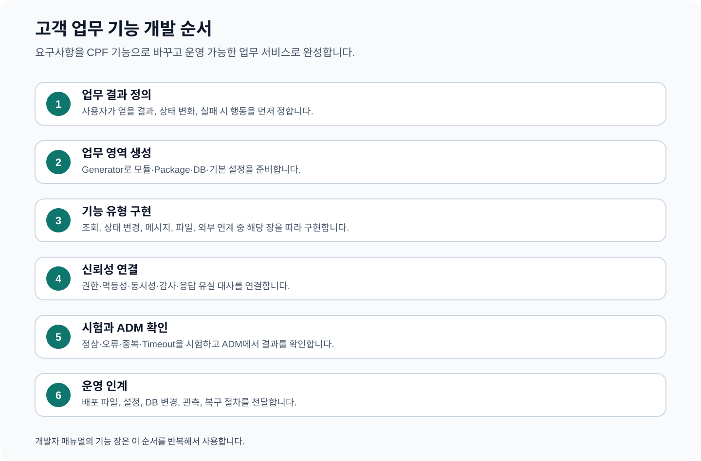

# CPF 개발자 매뉴얼 — 고객 업무 기능을 만드는 방법

> **주 독자**: CPF를 사용해 고객사의 온라인·연계 업무를 개발하는 개발자와 기술 리더
> **이 문서의 목표**: CPF 자체를 개발하지 않는다. 고객 업무에서 필요한 기능 유형을 선택하고, 설명된 순서대로 구현·시험·ADM 연동·운영 인계까지 완료한다.



## 빠른 찾기

- [0. 만들 기능을 먼저 선택하기](#0-만들-기능을-먼저-선택하기)
- [0.1 모든 고객 업무 기능의 공통 개발 순서](#01-모든-고객-업무-기능의-공통-개발-순서)
- [1. 이 매뉴얼을 사용하는 방법](#1-이-매뉴얼을-사용하는-방법)
- [2. 개발 시작 준비](#2-개발-시작-준비)
- [3. 신규 업무 영역과 서비스 시작](#3-신규-업무-영역과-서비스-시작)
- [4. 목록·상세 조회 API](#4-목록상세-조회-api)
- [5. 등록·수정·상태 변경 기능](#5-등록수정상태-변경-기능)
- [6. 동시 수정 충돌과 예상 버전](#6-동시-수정-충돌과-예상-버전)
- [7. 멱등 등록과 응답 유실 복구](#7-멱등-등록과-응답-유실-복구)
- [8. 같은 애플리케이션·분리 서비스 호출](#8-같은-애플리케이션분리-서비스-호출)
- [9. 카프카(Kafka) 이벤트와 발행·수신 보관함](#9-카프카kafka-이벤트와-발행수신-보관함)
- [10. 파일 업로드·첨부·다운로드](#10-파일-업로드첨부다운로드)
- [11. 외부 REST API 연계](#11-외부-rest-api-연계)
- [12. 고정길이 전문·기관 연계](#12-고정길이-전문기관-연계)
- [13. 권한·데이터 범위·개인정보 가림·감사](#13-권한데이터-범위개인정보-가림감사)
- [14. 캐시·기능 전환·비밀값](#14-캐시기능-전환비밀값)
- [15. 알림·다운로드·내보내기](#15-알림다운로드내보내기)
- [16. 데이터베이스 설치·변경·되돌리기](#16-데이터베이스-설치변경되돌리기)
- [17. 시험·장애 재현·운영 인계](#17-시험장애-재현운영-인계)
- [18. 기능별 교육 예제 찾기와 실행](#18-기능별-교육-예제-찾기와-실행)
- [19. 고객 업무 구현 예시 — 지급 요청 한 건을 끝까지 만들기](#19-고객-업무-구현-예시-지급-요청-한-건을-끝까지-만들기)
- [20. 기능별 파일 배치 예시](#20-기능별-파일-배치-예시)
- [21. 조회 API 계약 예시](#21-조회-api-계약-예시)
- [22. 상태 변경 API 계약 예시](#22-상태-변경-api-계약-예시)
- [23. 오류를 사용자 행동으로 연결하는 표](#23-오류를-사용자-행동으로-연결하는-표)
- [24. 교육 예제 전체 실행 순서](#24-교육-예제-전체-실행-순서)
- [25. 고객 업무 기능 배포 인계표](#25-고객-업무-기능-배포-인계표)
- [26. 개발 완료 확인](#26-개발-완료-확인)

## 0. 만들 기능을 먼저 선택하기

| 고객 요구 | 시작 장 | 함께 적용할 장 | 완성 결과 |
|---|---:|---|---|
| 조건 검색과 상세 조회 | 4 | 13, 17 | 권한·페이지·정렬이 적용된 조회 API |
| 신청·등록·정지·재개 | 5 | 6, 7, 13 | 상태 전이·버전·감사가 있는 변경 API |
| 결제·이체처럼 중복되면 안 되는 요청 | 7 | 11, 17 | 멱등 처리와 응답 유실 결과 조회 |
| 다른 업무 서비스 호출 | 8 | 7, 17 | 같은 애플리케이션·분리 서비스에서 같은 결과 |
| 업무 완료 후 후속 처리 | 9 | 7, 17 | Outbox·Inbox 기반 Kafka 처리 |
| 증빙·첨부·대량 파일 | 10 | 13, 15 | 검사·격리·다운로드 감사가 있는 파일 기능 |
| 외부 HTTP 기관 연계 | 11 | 7, 13, 17 | 시간초과·상대 상태 조회·대사 기능 |
| 고정길이 전문 연계 | 12 | 7, 13, 17 | 길이·인코딩·기관 오류·재전송 관리 |
| 역할·조직별 접근 제한 | 13 | 5, 10, 15 | API·버튼·데이터 범위·가림·감사 |
| 성능·점진 출시·비밀값 | 14 | 17 | Cache·기능 전환·비밀값 교체 |
| 알림·CSV·결과 파일 | 15 | 9, 10, 13 | 전달 이력과 다운로드 감사 |
| DB 구조 변경 | 16 | 17 | 3종 DB 설치·변경·되돌리기 |

## 0.1 모든 고객 업무 기능의 공통 개발 순서

1. 사용자가 얻을 업무 결과와 실패했을 때의 다음 행동을 한 문장으로 쓴다.
2. 입력값·기본값·허용 범위와 업무 상태표를 작성한다.
3. 권한·조직 범위·개인정보 가림·감사 항목을 정한다.
4. API 계약과 업무 식별자·작업 식별자·버전을 정한다.
5. 업무 처리와 DB 변경을 한 거래 경계로 구현한다.
6. 외부 호출·메시지·파일처럼 거래 밖의 처리는 중복 방지와 결과 대사를 설계한다.
7. 정상·입력 오류·권한·동시성·중복·시간초과·응답 유실 시험을 작성한다.
8. 로그·지표·추적·감사와 ADM 조회 항목을 같은 식별자로 연결한다.
9. 배포 파일·DB 변경·설정값·권한·복구 절차를 운영팀에 인계한다.

### 0.2 기능 개발 시작 전에 작성할 한 장짜리 설계표

기능 구현을 시작하기 전에 아래 표를 고객 업무 용어로 채운다. 이 표가 비어 있으면 코드보다 먼저 업무 담당자와 값을 확정한다.

| 항목 | 작성 내용 | 예시 |
|---|---|---|
| 사용자가 얻는 결과 | 성공했을 때 업무 상태와 사용자에게 보여 줄 결과 | 지급 요청이 `접수`되고 지급 ID가 반환됨 |
| 업무 식별자 | 조회·로그·감사·대사에서 공통으로 사용할 ID | `paymentId` |
| 작업 식별자 | 한 번의 변경 요청을 구분하고 응답 유실 뒤 조회할 ID | `operationId` |
| 입력값 | 필수·선택·기본값·길이·범위·형식 | 금액 1~1억, 통화 기본 KRW |
| 상태표 | 시작·진행·성공·거부·취소와 허용 전이 | `REQUESTED → PROCESSING → COMPLETED` |
| 권한·범위 | 역할, 조직, 지점, 개인정보 가림 | 지급 담당자, 소속 지점 데이터 |
| 거래 경계 | 한 번에 저장할 DB 변경 | 지급 원장+감사+발행대기 이벤트 |
| 외부 처리 | 메시지·파일·기관 호출과 중복 방지 | 기관 요청에 같은 작업 식별자 전달 |
| 정상 판정 | API·DB·로그·감사의 일치 기준 | 상태·버전·금액·작업 ID 일치 |
| 실패 후 행동 | 재조회·재처리·대사·보상·되돌리기 | 기관 상태 조회 후 미처리 건만 재전송 |
| 운영 연결 | ADM 검색값·버튼·승인·감사 | 지급 ID 조회, 결과 대사, 승인 재처리 |
| 교육 예제 | 먼저 실행할 EDU ID | `EDU-DEV-05` |

## 1. 이 매뉴얼을 사용하는 방법

1. 만들려는 기능과 가장 가까운 장을 찾는다.
2. “시작 전에 고객사가 정할 값”을 팀과 합의한다.
3. 단계별 개발 순서를 위에서 아래로 수행한다.
4. 정상 완료 기준을 API·DB·Audit·ADM에서 확인한다.
5. 오류 표의 조건을 Test로 재현한다.
6. 장 끝의 EDU를 실행하고 고객 업무로 바꾼다.

내부 Module·Class 설명은 실제 수정 위치를 찾기 위한 보조 정보다. 고객 업무 결과와 개발 순서보다 먼저 읽을 필요가 없다.

## 2. 개발 시작 준비

### 2.1 기준 환경 확인

```powershell
git rev-parse HEAD
git status --short
java -version
.\gradlew.bat --version
Get-Help .\cpf-tools\generator\create-domain.ps1 -Full
```

- 기준 Commit: `19dd72b5978f2a3c630943c0fff05bee2d2fed34`
- 교육 모듈: `cpf-reference`
- 교육 애플리케이션: `cpf-reference/src/main/java/com/cpf/reference/ReferenceApplication.java`
- 교육 설정: `cpf-reference/src/main/resources/application.yml`, `application-ref.yml`
- 기본 교육 Port: `8099`

### 2.2 Generator 주요 입력

| 입력 | 용도 | 결정 방법 |
|---|---|---|
| DomainName | 업무 영역 영문명 | 소문자로 시작하는 고객 업무명 |
| SystemCode | 로그·거래·배포 식별 코드 | 고객사 시스템 코드 체계의 3자리 값 |
| ModuleName·PackageName | Java 모듈·Package | 고객사 표준에 맞추되 기존 모듈과 충돌하지 않게 한다. |
| SchemaName·TablePrefix | DB 소유 경계 | 업무 데이터 소유 Schema와 Table 접두어 |
| DatabaseVendor | 초기 개발 DB | mariadb, postgresql, oracle 중 고객 환경 |
| Capabilities | 선택 기능 | database, messaging, security, audit 등 필요한 기능만 선택 |
| DryRun | 계획 확인 | 첫 실행에서 필수로 사용 |
| GeneratePatch | 변경 검토 | 파일 생성·수정 범위를 검토할 때 사용 |
| Apply | 실제 생성 | Dry Run과 Patch 승인 뒤 사용 |

### 2.3 권장 생성 예시

```powershell
pwsh -File .\cpf-tools\generator\create-domain.ps1 `
  -DomainName payment `
  -SystemCode PAY `
  -DatabaseVendor postgresql `
  -Capabilities 'database,messaging,security,audit' `
  -DryRun
```

Dry Run에서 Module·Package·Schema·Port·Route 충돌을 해소한 뒤 Patch와 Apply를 수행한다.

### 2.4 기능 공통 산출물

| 산출물 | 고객 개발자가 작성할 내용 | 운영에서 사용하는 이유 |
|---|---|---|
| API 계약 | 요청·응답·오류·권한 | 화면·외부 호출·사용 시스템·ADM이 같은 계약을 사용한다. |
| 업무 상태 | 시작·진행·완료·거부·취소 상태 | 재시도와 복구 가능 여부를 판단한다. |
| DB Migration | Table·Index·Constraint·Seed | 설치·Upgrade·Rollback에 사용한다. |
| 관측 | Log·Metric·Trace Tag | 장애 원인과 영향 범위를 찾는다. |
| 감사 | Actor·Reason·Before·After·Result | 고객사의 변경 통제와 감사에 사용한다. |
| Test | 정상·오류·동시성·중복·장애 | 배포 전에 업무 결과와 복구 가능성을 확인한다. |
| ADM 연동 | 조회 조건·조치·상태 조회 | 운영자가 DB 직접 조회 없이 관리한다. |

## 3. 신규 업무 영역과 서비스 시작

### 이 기능으로 만들 수 있는 것

회원, 지급, 대출, 계약처럼 고객사 고유 업무 영역을 독립 모듈로 시작한다.

**업무 예시**: `payment` 업무 영역을 PostgreSQL 기반으로 생성하고 조회 API 한 개를 추가한다.

### 언제 이 방식을 선택하는가

새 DB Schema, API, 배포 단위, 운영 책임을 가진 업무를 만들 때 사용한다.

### 시작 전에 고객사가 정할 값

- 업무 영역 영문명과 3자리 System Code
- 업무 모듈명과 Java Package
- DB Vendor와 Schema·Table Prefix
- 기본 Port와 배포 단위
- Messaging·File·Batch·Security 등 선택 기능

### 작업 후 만들어지는 결과

- 업무 모듈 Directory
- Build 설정과 Dependency
- API·Application·Domain·Persistence 기본 Package
- DB Migration 골격
- 기본 설정과 Test 골격

### 개발 순서

1. `Get-Help .\cpf-tools\generator\create-domain.ps1 -Full`로 현재 Parameter를 확인한다.
2. `git status --short`로 고객사 기존 변경을 확인한다.
3. `-DryRun`으로 Module·Package·Schema·Port 충돌을 확인한다.
4. `-GeneratePatch`로 생성·변경 예정 파일을 검토한다.
5. 승인된 값으로 `-Apply`를 실행한다.
6. 생성된 모듈의 업무명·상태·권한·Table을 고객 요구사항으로 채운다.
7. Build와 Module Test를 실행한다.
8. ADM 연동과 운영 인계 항목을 작성한다.

### 정상 완료 기준

- 계획한 Module·Package·Schema·Port만 생성된다.
- 생성 모듈이 Root Build 또는 독립 Composite Build에 연결된다.
- 업무 소유 파일과 Generator 관리 파일이 구분된다.

### 오류와 복구

| 상황 | 개발·복구 행동 |
|---|---|
| Module 충돌 | 기존 모듈·settings 등록을 확인하고 이름을 변경한다. 기존 파일을 덮어쓰지 않는다. |
| Schema·Port 충돌 | 고객 환경 할당표에서 다른 값을 정한 뒤 Dry Run부터 다시 수행한다. |
| 생성 중단 | 생성 결과 목록을 기준으로 이번 실행에서 만든 파일만 제거하고 재실행한다. |

### 운영 연결

- 업무 ID, Operation ID, 사용자 ID, 대상 ID를 Log·Trace·Audit에서 함께 찾을 수 있게 한다.
- 운영자가 확인할 조회 조건과 정상 상태를 정의한다.
- 운영 조치가 필요하면 [ADM 개발자 매뉴얼](03_ADM개발자매뉴얼.md)에 따라 조회·조치 API를 연결한다.
- 배포 시 API·DB 변경·Property·권한·알림·Rollback을 한 인계표로 전달한다.

### 교육 예제 EDU-DEV-01: 업무 영역 생성

#### 표준 교육 경로

```text
cpf-reference/src/main/java/com/cpf/reference/edu/dev01/domain/
cpf-reference/src/test/java/com/cpf/reference/edu/dev01/domain/
cpf-reference/src/main/resources/edu/01/
```

위 경로는 이 매뉴얼이 요구하는 교육 예제 계약이다. 교육 Source는 업무 API, 업무 처리, 저장소 또는 연계, 오류 처리와 ADM 확인용 식별자를 한 예제 안에 포함한다.

#### 실행 순서

1. `.\gradlew.bat :cpf-reference:test --tests "*01*"`로 해당 교육 Test를 실행한다.
2. `.\gradlew.bat :cpf-reference:bootRun`으로 교육 서비스를 실행한다.
3. 기준 입력 또는 요청 `payment`를 실행한다.
4. API 응답, 업무 DB 상태, 로그의 업무 ID·Operation ID, 감사 결과를 함께 확인한다.
5. 다음 장애를 재현한다: 같은 모듈명·포트 충돌을 넣어 계획 단계에서 거부되는지 확인한다.
6. 복구 뒤 같은 업무 ID의 결과가 한 개로 확정되는지 확인한다.

#### 정상 결과

생성 계획에 모듈·패키지·DB·포트가 표시되고 기존 파일을 덮어쓰지 않는다.

#### 고객 업무로 바꾸기

- `edu` 업무명과 고정 ID를 고객 업무명·식별자 규칙으로 바꾼다.
- 예제 상태값을 고객 업무 상태표로 바꾼다.
- 예제 권한을 고객사 역할·조직·데이터 범위로 바꾼다.
- 예제 DB·Topic·파일·외부 주소를 고객 환경 설정과 Secret 참조로 바꾼다.
- 교육 Fault Test와 ADM 확인 절차는 삭제하지 않고 고객 시나리오로 확장한다.

## 4. 목록·상세 조회 API

### 이 기능으로 만들 수 있는 것

조건 검색, 목록, 상세, Paging, 정렬을 제공하는 업무 조회 기능을 만든다.

**업무 예시**: 회원 목록을 이름·상태·가입일로 검색하고 상세를 조회한다.

### 언제 이 방식을 선택하는가

데이터를 변경하지 않고 사용자·채널·운영자에게 업무 정보를 제공할 때 사용한다.

### 시작 전에 고객사가 정할 값

- 검색 조건과 기본 조회기간
- Paging 크기와 최대 건수
- 정렬 허용 항목
- 데이터 범위와 개인정보 가림
- 조회 응답 시간과 Timeout

### 작업 후 만들어지는 결과

- 조회 Request·Response
- Query Service
- 조회 SQL 또는 Repository
- OpenAPI 계약
- 조회 권한과 Test

### 개발 순서

1. 사용자가 입력할 검색 조건과 기본값을 먼저 표로 만든다.
2. 검색하지 않아도 되는 조건과 필수 조건을 구분한다.
3. 결과 표에 필요한 항목과 상세 화면 항목을 분리한다.
4. Query Service에서 데이터 범위를 적용한다.
5. DB Index와 정렬 항목을 확인한다.
6. 빈 결과, 잘못된 조건, 최대 Page를 Test한다.
7. OpenAPI와 호출 예제를 갱신한다.
8. ADM에서 같은 식별자로 조회할 필요가 있으면 03 매뉴얼에 따라 연결한다.

### 정상 완료 기준

- 검색 조건이 같은 요청은 같은 범위의 결과를 반환한다.
- 권한 밖 데이터는 결과에 포함되지 않는다.
- 빈 결과와 오류가 구분된다.
- Paging의 전체 건수와 현재 Page가 일치한다.

### 오류와 복구

| 상황 | 개발·복구 행동 |
|---|---|
| 조회가 느림 | 실행계획, Index, 조회기간, 정렬항목을 확인하고 최대 범위를 제한한다. |
| 전체 건수 불일치 | Count Query와 목록 Query의 조건·데이터 범위를 비교한다. |
| 민감정보 노출 | Response DTO와 개인정보 가림 정책을 수정하고 Raw 권한 경로를 분리한다. |

### 운영 연결

- 업무 ID, Operation ID, 사용자 ID, 대상 ID를 Log·Trace·Audit에서 함께 찾을 수 있게 한다.
- 운영자가 확인할 조회 조건과 정상 상태를 정의한다.
- 운영 조치가 필요하면 [ADM 개발자 매뉴얼](03_ADM개발자매뉴얼.md)에 따라 조회·조치 API를 연결한다.
- 배포 시 API·DB 변경·Property·권한·알림·Rollback을 한 인계표로 전달한다.

### 교육 예제 EDU-DEV-02: 목록·상세 조회

#### 표준 교육 경로

```text
cpf-reference/src/main/java/com/cpf/reference/edu/dev02/query/
cpf-reference/src/test/java/com/cpf/reference/edu/dev02/query/
cpf-reference/src/main/resources/edu/02/
```

위 경로는 이 매뉴얼이 요구하는 교육 예제 계약이다. 교육 Source는 업무 API, 업무 처리, 저장소 또는 연계, 오류 처리와 ADM 확인용 식별자를 한 예제 안에 포함한다.

#### 실행 순서

1. `.\gradlew.bat :cpf-reference:test --tests "*02*"`로 해당 교육 Test를 실행한다.
2. `.\gradlew.bat :cpf-reference:bootRun`으로 교육 서비스를 실행한다.
3. 기준 입력 또는 요청 `GET /edu/customers?status=ACTIVE&page=0&size=20`를 실행한다.
4. API 응답, 업무 DB 상태, 로그의 업무 ID·Operation ID, 감사 결과를 함께 확인한다.
5. 다음 장애를 재현한다: 최대 기간·잘못된 정렬·권한 밖 조직을 요청한다.
6. 복구 뒤 같은 업무 ID의 결과가 한 개로 확정되는지 확인한다.

#### 정상 결과

목록·전체 건수·페이지가 일치하고 권한 밖 데이터가 제외된다.

#### 고객 업무로 바꾸기

- `edu` 업무명과 고정 ID를 고객 업무명·식별자 규칙으로 바꾼다.
- 예제 상태값을 고객 업무 상태표로 바꾼다.
- 예제 권한을 고객사 역할·조직·데이터 범위로 바꾼다.
- 예제 DB·Topic·파일·외부 주소를 고객 환경 설정과 Secret 참조로 바꾼다.
- 교육 Fault Test와 ADM 확인 절차는 삭제하지 않고 고객 시나리오로 확장한다.

## 5. 등록·수정·상태 변경 기능

### 이 기능으로 만들 수 있는 것

신규 신청, 정보 수정, 승인 요청, 정지·재개 같은 상태 변경 기능을 만든다.

**업무 예시**: 회원 상태를 `ACTIVE`에서 `SUSPENDED`로 변경하고 사유를 남긴다.

### 언제 이 방식을 선택하는가

DB 상태가 바뀌고 누가 왜 바꿨는지 남겨야 할 때 사용한다.

### 시작 전에 고객사가 정할 값

- 허용 상태와 상태 전이
- 필수 입력과 업무 Validation
- Transaction 경계
- 변경 사유와 감사 항목
- 실패 시 원복·보상 방식

### 작업 후 만들어지는 결과

- Command Request·Response
- Application Service
- Domain 상태 전이
- Repository·Migration
- Audit와 오류 응답

### 개발 순서

1. 시작 상태, 성공 상태, 거부 상태를 상태표로 작성한다.
2. 각 입력값의 필수·길이·범위·형식을 정한다.
3. Application Service 한 곳에서 Transaction을 소유한다.
4. Domain에서 허용 상태 전이를 검사한다.
5. 저장 후 반환할 ID와 Version을 정한다.
6. Actor·Reason·Before·After를 감사에 연결한다.
7. Validation·권한·DB 오류·상태 오류를 각각 Test한다.
8. 운영자가 상태를 확인할 조회 기능을 함께 제공한다.

### 정상 완료 기준

- Response ID·상태·Version과 DB 값이 일치한다.
- 허용되지 않은 상태 전이는 저장 전에 거부된다.
- 감사에서 행위자·사유·변경 전후를 찾을 수 있다.

### 오류와 복구

| 상황 | 개발·복구 행동 |
|---|---|
| 상태 전이 거부 | 현재 상태를 재조회하고 업무 규칙에 맞는 다음 Action을 선택한다. |
| DB 저장 실패 | Transaction Rollback을 확인하고 외부 Side Effect가 있었다면 보상 대상을 확인한다. |
| 응답 유실 | Operation ID 또는 업무 Key로 실제 저장 결과를 조회한 뒤 재실행 여부를 판단한다. |

### 운영 연결

- 업무 ID, Operation ID, 사용자 ID, 대상 ID를 Log·Trace·Audit에서 함께 찾을 수 있게 한다.
- 운영자가 확인할 조회 조건과 정상 상태를 정의한다.
- 운영 조치가 필요하면 [ADM 개발자 매뉴얼](03_ADM개발자매뉴얼.md)에 따라 조회·조치 API를 연결한다.
- 배포 시 API·DB 변경·Property·권한·알림·Rollback을 한 인계표로 전달한다.

### 교육 예제 EDU-DEV-03: 상태 변경

#### 표준 교육 경로

```text
cpf-reference/src/main/java/com/cpf/reference/edu/dev03/command/
cpf-reference/src/test/java/com/cpf/reference/edu/dev03/command/
cpf-reference/src/main/resources/edu/03/
```

위 경로는 이 매뉴얼이 요구하는 교육 예제 계약이다. 교육 Source는 업무 API, 업무 처리, 저장소 또는 연계, 오류 처리와 ADM 확인용 식별자를 한 예제 안에 포함한다.

#### 실행 순서

1. `.\gradlew.bat :cpf-reference:test --tests "*03*"`로 해당 교육 Test를 실행한다.
2. `.\gradlew.bat :cpf-reference:bootRun`으로 교육 서비스를 실행한다.
3. 기준 입력 또는 요청 `POST /edu/customers/{id}/suspend`를 실행한다.
4. API 응답, 업무 DB 상태, 로그의 업무 ID·Operation ID, 감사 결과를 함께 확인한다.
5. 다음 장애를 재현한다: 허용되지 않은 상태 전이와 사유 누락을 보낸다.
6. 복구 뒤 같은 업무 ID의 결과가 한 개로 확정되는지 확인한다.

#### 정상 결과

상태·Version·사유·감사가 같은 결과를 가리킨다.

#### 고객 업무로 바꾸기

- `edu` 업무명과 고정 ID를 고객 업무명·식별자 규칙으로 바꾼다.
- 예제 상태값을 고객 업무 상태표로 바꾼다.
- 예제 권한을 고객사 역할·조직·데이터 범위로 바꾼다.
- 예제 DB·Topic·파일·외부 주소를 고객 환경 설정과 Secret 참조로 바꾼다.
- 교육 Fault Test와 ADM 확인 절차는 삭제하지 않고 고객 시나리오로 확장한다.

## 6. 동시 수정 충돌과 예상 버전

### 이 기능으로 만들 수 있는 것

여러 사용자가 같은 데이터를 수정해 이전 값이 덮어써지는 문제를 방지한다.

**업무 예시**: 두 사용자가 같은 고객 한도를 수정해 한 요청만 성공하게 한다.

### 언제 이 방식을 선택하는가

한도, 잔액, 재고, 설정, 상태처럼 최신 값 기준 수정이 필요한 경우 사용한다.

### 시작 전에 고객사가 정할 값

- Version Column 위치
- 충돌 응답코드
- 사용자 재조회 흐름
- 자동 재시도 허용 여부
- Batch와 온라인의 충돌 우선순위

### 작업 후 만들어지는 결과

- Version Field
- 조건부 Update
- 충돌 오류
- 재조회 UI 흐름
- Concurrency Test

### 개발 순서

1. 조회 응답에 현재 Version을 포함한다.
2. 수정 요청에 사용자가 조회한 Version을 포함한다.
3. Update 조건에 ID와 Version을 함께 사용한다.
4. 변경 성공 시 Version을 증가시킨다.
5. 영향 행이 0이면 충돌로 응답한다.
6. 화면은 최신 값을 재조회하고 사용자가 차이를 확인하게 한다.
7. 동시에 두 요청을 보내 하나만 성공하는 Test를 작성한다.

### 정상 완료 기준

- 동시 요청 중 하나만 성공한다.
- 실패 요청은 최신 값과 충돌 사실을 확인할 수 있다.
- 운영자가 DB 직접 수정 없이 재처리할 수 있다.

### 오류와 복구

| 상황 | 개발·복구 행동 |
|---|---|
| 충돌 반복 | 사용자 화면이 이전 Version을 계속 보내는지 확인한다. |
| Batch가 덮어씀 | Batch Update에도 같은 Version 또는 소유권 조건을 적용한다. |
| 무조건 Retry | 업무 판단이 필요한 충돌은 자동 Retry하지 않고 재조회한다. |

### 운영 연결

- 업무 ID, Operation ID, 사용자 ID, 대상 ID를 Log·Trace·Audit에서 함께 찾을 수 있게 한다.
- 운영자가 확인할 조회 조건과 정상 상태를 정의한다.
- 운영 조치가 필요하면 [ADM 개발자 매뉴얼](03_ADM개발자매뉴얼.md)에 따라 조회·조치 API를 연결한다.
- 배포 시 API·DB 변경·Property·권한·알림·Rollback을 한 인계표로 전달한다.

### 교육 예제 EDU-DEV-04: 동시 수정

#### 표준 교육 경로

```text
cpf-reference/src/main/java/com/cpf/reference/edu/dev04/concurrency/
cpf-reference/src/test/java/com/cpf/reference/edu/dev04/concurrency/
cpf-reference/src/main/resources/edu/04/
```

위 경로는 이 매뉴얼이 요구하는 교육 예제 계약이다. 교육 Source는 업무 API, 업무 처리, 저장소 또는 연계, 오류 처리와 ADM 확인용 식별자를 한 예제 안에 포함한다.

#### 실행 순서

1. `.\gradlew.bat :cpf-reference:test --tests "*04*"`로 해당 교육 Test를 실행한다.
2. `.\gradlew.bat :cpf-reference:bootRun`으로 교육 서비스를 실행한다.
3. 기준 입력 또는 요청 `PUT /edu/limits/{id}`를 실행한다.
4. API 응답, 업무 DB 상태, 로그의 업무 ID·Operation ID, 감사 결과를 함께 확인한다.
5. 다음 장애를 재현한다: 두 요청을 동시에 보내 충돌 응답과 최신값 재조회를 확인한다.
6. 복구 뒤 같은 업무 ID의 결과가 한 개로 확정되는지 확인한다.

#### 정상 결과

동일 Version의 두 수정 중 하나만 성공한다.

#### 고객 업무로 바꾸기

- `edu` 업무명과 고정 ID를 고객 업무명·식별자 규칙으로 바꾼다.
- 예제 상태값을 고객 업무 상태표로 바꾼다.
- 예제 권한을 고객사 역할·조직·데이터 범위로 바꾼다.
- 예제 DB·Topic·파일·외부 주소를 고객 환경 설정과 Secret 참조로 바꾼다.
- 교육 Fault Test와 ADM 확인 절차는 삭제하지 않고 고객 시나리오로 확장한다.

## 7. 멱등 등록과 응답 유실 복구

### 이 기능으로 만들 수 있는 것

같은 요청이 반복돼도 한 번만 처리하고, 응답이 끊겨도 실제 결과를 조회한다.

**업무 예시**: 지급 요청을 같은 Operation ID로 반복 호출해 한 번만 지급한다.

### 언제 이 방식을 선택하는가

결제·이체·신청·외부기관 요청처럼 중복 결과가 허용되지 않을 때 사용한다.

### 시작 전에 고객사가 정할 값

- 멱등성 Scope와 Key
- 요청 정규화와 Hash
- 결과 보관 기간
- 같은 Key·다른 요청 처리
- 결과 조회 API와 대사 기한

### 작업 후 만들어지는 결과

- Operation ID
- 멱등성 Ledger
- 요청 Hash
- 완료 결과 저장
- 상태 조회·대사 절차

### 개발 순서

1. 호출자가 재사용할 수 있는 Operation ID를 발급한다.
2. 업무에 영향을 주는 Request Field만 정규화해 Hash를 만든다.
3. Scope+Key를 선점하고 같은 Key가 있는지 확인한다.
4. 같은 Hash이면 저장된 결과를 반환한다.
5. 다른 Hash이면 중복 Key 오류로 거부한다.
6. 업무 저장과 결과 기록의 Transaction 관계를 정한다.
7. 응답 유실 시 Operation 상태 조회로 실제 결과를 확인한다.
8. Process 종료·DB Commit 후 응답 유실을 Fault Test로 재현한다.

### 정상 완료 기준

- 동일 요청 10회에도 업무 데이터는 한 건이다.
- Replay 응답은 최초 결과와 같은 업무 ID를 반환한다.
- 응답 유실 후 상태 조회로 성공·실패·미확정을 구분한다.

### 오류와 복구

| 상황 | 개발·복구 행동 |
|---|---|
| 같은 Key·다른 Hash | 호출자 오류로 처리하고 기존 결과를 변경하지 않는다. |
| 처리 중 장기 정체 | Lease·Timeout과 업무 원장을 확인해 Reconcile한다. |
| 결과 미확정 | 재요청보다 상대 시스템·DB·Ledger를 먼저 대사한다. |

### 운영 연결

- 업무 ID, Operation ID, 사용자 ID, 대상 ID를 Log·Trace·Audit에서 함께 찾을 수 있게 한다.
- 운영자가 확인할 조회 조건과 정상 상태를 정의한다.
- 운영 조치가 필요하면 [ADM 개발자 매뉴얼](03_ADM개발자매뉴얼.md)에 따라 조회·조치 API를 연결한다.
- 배포 시 API·DB 변경·Property·권한·알림·Rollback을 한 인계표로 전달한다.

### 교육 예제 EDU-DEV-05: 멱등성·응답 유실

#### 표준 교육 경로

```text
cpf-reference/src/main/java/com/cpf/reference/edu/dev05/idempotency/
cpf-reference/src/test/java/com/cpf/reference/edu/dev05/idempotency/
cpf-reference/src/main/resources/edu/05/
```

위 경로는 이 매뉴얼이 요구하는 교육 예제 계약이다. 교육 Source는 업무 API, 업무 처리, 저장소 또는 연계, 오류 처리와 ADM 확인용 식별자를 한 예제 안에 포함한다.

#### 실행 순서

1. `.\gradlew.bat :cpf-reference:test --tests "*05*"`로 해당 교육 Test를 실행한다.
2. `.\gradlew.bat :cpf-reference:bootRun`으로 교육 서비스를 실행한다.
3. 기준 입력 또는 요청 `POST /edu/payments`를 실행한다.
4. API 응답, 업무 DB 상태, 로그의 업무 ID·Operation ID, 감사 결과를 함께 확인한다.
5. 다음 장애를 재현한다: 응답 송신 직전에 연결을 끊고 Operation 조회로 결과를 확정한다.
6. 복구 뒤 같은 업무 ID의 결과가 한 개로 확정되는지 확인한다.

#### 정상 결과

같은 Operation ID는 같은 결과를 반환하고 지급 원장은 한 건이다.

#### 고객 업무로 바꾸기

- `edu` 업무명과 고정 ID를 고객 업무명·식별자 규칙으로 바꾼다.
- 예제 상태값을 고객 업무 상태표로 바꾼다.
- 예제 권한을 고객사 역할·조직·데이터 범위로 바꾼다.
- 예제 DB·Topic·파일·외부 주소를 고객 환경 설정과 Secret 참조로 바꾼다.
- 교육 Fault Test와 ADM 확인 절차는 삭제하지 않고 고객 시나리오로 확장한다.

## 8. 같은 애플리케이션·분리 서비스 호출

### 이 기능으로 만들 수 있는 것

고객 업무 기능을 한 애플리케이션 안에서 호출하거나 별도 서비스로 호출한다.

**업무 예시**: 계약 서비스가 회원 서비스를 Local과 Remote 두 방식으로 조회한다.

### 언제 이 방식을 선택하는가

다른 업무 영역의 조회·변경 결과가 필요할 때 사용한다.

### 시작 전에 고객사가 정할 값

- 호출 대상 업무 소유자
- Local 또는 Remote 배포
- 전체 시간 예산
- 오류 Mapping
- 원격 변경의 결과 대사

### 작업 후 만들어지는 결과

- 공개 업무 계약
- Local Adapter
- Remote Adapter
- Timeout·Error 설정
- Contract Test

### 개발 순서

1. 호출자가 필요한 업무 결과만 포함한 공개 계약을 정의한다.
2. 같은 JVM에서는 Local Adapter가 Application Service를 호출하게 한다.
3. 분리 배포에서는 Remote Adapter가 같은 계약을 HTTP 또는 메시지로 호출하게 한다.
4. 호출자와 대상의 Transaction을 하나로 가정하지 않는다.
5. Connect·Response·Overall Timeout을 구분한다.
6. 오류코드를 고객 업무 오류로 Mapping한다.
7. 동일 입력에 Local·Remote가 같은 의미의 결과를 내는 Contract Test를 작성한다.

### 정상 완료 기준

- 호출자는 배포 위치를 바꿔도 같은 업무 계약을 사용한다.
- Trace와 업무 식별자가 호출 경계를 지나 유지된다.
- Remote Timeout이 호출자 Transaction을 무한 대기시키지 않는다.

### 오류와 복구

| 상황 | 개발·복구 행동 |
|---|---|
| Local 성공·Remote 실패 | DTO, Validation, Permission, Error Mapping 차이를 비교한다. |
| Remote 응답 유실 | 대상 업무의 상태 조회로 실제 변경 여부를 확인한다. |
| Timeout 중첩 | 호출 단계별 시간 합이 전체 시간 예산을 넘지 않게 조정한다. |

### 운영 연결

- 업무 ID, Operation ID, 사용자 ID, 대상 ID를 Log·Trace·Audit에서 함께 찾을 수 있게 한다.
- 운영자가 확인할 조회 조건과 정상 상태를 정의한다.
- 운영 조치가 필요하면 [ADM 개발자 매뉴얼](03_ADM개발자매뉴얼.md)에 따라 조회·조치 API를 연결한다.
- 배포 시 API·DB 변경·Property·권한·알림·Rollback을 한 인계표로 전달한다.

### 교육 예제 EDU-DEV-06: 같은 애플리케이션·분리 서비스 호출

#### 표준 교육 경로

```text
cpf-reference/src/main/java/com/cpf/reference/edu/dev06/servicecall/
cpf-reference/src/test/java/com/cpf/reference/edu/dev06/servicecall/
cpf-reference/src/main/resources/edu/06/
```

위 경로는 이 매뉴얼이 요구하는 교육 예제 계약이다. 교육 Source는 업무 API, 업무 처리, 저장소 또는 연계, 오류 처리와 ADM 확인용 식별자를 한 예제 안에 포함한다.

#### 실행 순서

1. `.\gradlew.bat :cpf-reference:test --tests "*06*"`로 해당 교육 Test를 실행한다.
2. `.\gradlew.bat :cpf-reference:bootRun`으로 교육 서비스를 실행한다.
3. 기준 입력 또는 요청 `GET /edu/contracts/{id}/member`를 실행한다.
4. API 응답, 업무 DB 상태, 로그의 업무 ID·Operation ID, 감사 결과를 함께 확인한다.
5. 다음 장애를 재현한다: 원격 호출 시간초과와 호출 후 응답 유실을 재현한다.
6. 복구 뒤 같은 업무 ID의 결과가 한 개로 확정되는지 확인한다.

#### 정상 결과

두 배포 방식에서 같은 업무 응답·오류 의미를 유지한다.

#### 고객 업무로 바꾸기

- `edu` 업무명과 고정 ID를 고객 업무명·식별자 규칙으로 바꾼다.
- 예제 상태값을 고객 업무 상태표로 바꾼다.
- 예제 권한을 고객사 역할·조직·데이터 범위로 바꾼다.
- 예제 DB·Topic·파일·외부 주소를 고객 환경 설정과 Secret 참조로 바꾼다.
- 교육 Fault Test와 ADM 확인 절차는 삭제하지 않고 고객 시나리오로 확장한다.

## 9. 카프카(Kafka) 이벤트와 발행·수신 보관함

### 이 기능으로 만들 수 있는 것

업무 완료 이벤트를 발행하고 여러 소비자가 중복 없이 후속 업무를 처리한다.

**업무 예시**: 회원 가입 완료 Event를 발행해 알림과 포인트 적립이 각각 처리한다.

### 언제 이 방식을 선택하는가

알림·정산·통계처럼 호출자가 기다리지 않아도 되는 후속 처리에 사용한다.

### 시작 전에 고객사가 정할 값

- Event 이름과 Version
- Partition Key와 순서 범위
- Outbox 저장 Transaction
- 호출·사용 시스템 재시도·DLT
- Inbox 중복 보관 기간

### 작업 후 만들어지는 결과

- Event Schema
- Outbox Table
- Publisher
- 호출·사용 시스템·Inbox
- Retry·DLT·재처리

### 개발 순서

1. 업무 완료 사실을 나타내는 Event를 정의한다.
2. 업무 저장과 같은 Transaction에서 Outbox를 저장한다.
3. Publisher가 미발행 Outbox를 Kafka로 전송한다.
4. 호출·사용 시스템는 Event ID를 Inbox에서 먼저 확인한다.
5. 처리 성공 후 Inbox 완료를 기록한다.
6. 재시도 가능한 오류와 업무 거부 오류를 구분한다.
7. DLT 재처리 전에 원인 수정과 중복 여부를 확인한다.
8. Broker 차단과 호출·사용 시스템 재시작을 Fault Test로 재현한다.

### 정상 완료 기준

- DB Commit된 업무만 Event가 발행된다.
- 같은 Event를 반복 수신해도 후속 업무는 한 번만 반영된다.
- 실패 Event는 DLT와 ADM에서 원인을 확인할 수 있다.

### 오류와 복구

| 상황 | 개발·복구 행동 |
|---|---|
| Outbox 적체 | Publisher 상태, Broker 연결, 재시도 횟수를 확인한다. |
| 호출·사용 시스템 반복 실패 | 업무 오류와 기술 오류를 분리하고 DLT로 이동한다. |
| 순서 역전 | Partition Key와 호출·사용 시스템 병렬도를 업무 순서 범위에 맞춘다. |

### 운영 연결

- 업무 ID, Operation ID, 사용자 ID, 대상 ID를 Log·Trace·Audit에서 함께 찾을 수 있게 한다.
- 운영자가 확인할 조회 조건과 정상 상태를 정의한다.
- 운영 조치가 필요하면 [ADM 개발자 매뉴얼](03_ADM개발자매뉴얼.md)에 따라 조회·조치 API를 연결한다.
- 배포 시 API·DB 변경·Property·권한·알림·Rollback을 한 인계표로 전달한다.

### 교육 예제 EDU-DEV-07: Kafka 발행·소비

#### 표준 교육 경로

```text
cpf-reference/src/main/java/com/cpf/reference/edu/dev07/kafka/
cpf-reference/src/test/java/com/cpf/reference/edu/dev07/kafka/
cpf-reference/src/main/resources/edu/07/
```

위 경로는 이 매뉴얼이 요구하는 교육 예제 계약이다. 교육 Source는 업무 API, 업무 처리, 저장소 또는 연계, 오류 처리와 ADM 확인용 식별자를 한 예제 안에 포함한다.

#### 실행 순서

1. `.\gradlew.bat :cpf-reference:test --tests "*07*"`로 해당 교육 Test를 실행한다.
2. `.\gradlew.bat :cpf-reference:bootRun`으로 교육 서비스를 실행한다.
3. 기준 입력 또는 요청 `POST /edu/members`를 실행한다.
4. API 응답, 업무 DB 상태, 로그의 업무 ID·Operation ID, 감사 결과를 함께 확인한다.
5. 다음 장애를 재현한다: 같은 Event를 두 번 전달하고 호출·사용 시스템 종료 후 재시작한다.
6. 복구 뒤 같은 업무 ID의 결과가 한 개로 확정되는지 확인한다.

#### 정상 결과

업무 저장과 Outbox가 함께 Commit되고 소비자가 한 번만 반영한다.

#### 고객 업무로 바꾸기

- `edu` 업무명과 고정 ID를 고객 업무명·식별자 규칙으로 바꾼다.
- 예제 상태값을 고객 업무 상태표로 바꾼다.
- 예제 권한을 고객사 역할·조직·데이터 범위로 바꾼다.
- 예제 DB·Topic·파일·외부 주소를 고객 환경 설정과 Secret 참조로 바꾼다.
- 교육 Fault Test와 ADM 확인 절차는 삭제하지 않고 고객 시나리오로 확장한다.

## 10. 파일 업로드·첨부·다운로드

### 이 기능으로 만들 수 있는 것

업무 파일을 업로드하고 검사·격리·보관·다운로드하며 이력을 남긴다.

**업무 예시**: 대출 신청서 PDF를 업로드하고 검사 성공 후 담당자만 다운로드한다.

### 언제 이 방식을 선택하는가

신청서, 증빙, 대량 입력, 결과 파일을 업무와 함께 관리할 때 사용한다.

### 시작 전에 고객사가 정할 값

- 허용 확장자·MIME·크기
- 바이러스·내용 검사
- 임시·격리·보관 위치
- 보존기간과 삭제
- Download 권한과 감사

### 작업 후 만들어지는 결과

- Upload API
- File Metadata
- 검사 상태
- Archive·Download
- Download Audit

### 개발 순서

1. 업무 레코드와 파일 Metadata의 연결 Key를 정한다.
2. Upload 전에 크기·확장자·MIME를 검사한다.
3. 파일을 임시 영역에 저장하고 검사 상태를 기록한다.
4. 검사 성공 파일만 업무 첨부로 확정한다.
5. 실패 파일은 격리하고 사용자에게 원인을 제공한다.
6. Download에서 권한·데이터 범위·개인정보 가림을 확인한다.
7. 보존기간 만료와 삭제 감사 절차를 작성한다.
8. 업로드 중단·검사 실패·저장소 장애를 Test한다.

### 정상 완료 기준

- 업무 상세에서 파일 상태와 이름·크기를 확인한다.
- 검사 실패 파일은 Download할 수 없다.
- Download 이력에서 사용자·사유·시각을 찾을 수 있다.

### 오류와 복구

| 상황 | 개발·복구 행동 |
|---|---|
| 업로드 중단 | 미완료 임시 파일과 Metadata를 만료 정책으로 정리한다. |
| 검사 장기 대기 | 검사 Worker와 Queue를 확인하고 재검사한다. |
| Archive 불일치 | Metadata Hash와 실제 파일 Hash를 대사한다. |

### 운영 연결

- 업무 ID, Operation ID, 사용자 ID, 대상 ID를 Log·Trace·Audit에서 함께 찾을 수 있게 한다.
- 운영자가 확인할 조회 조건과 정상 상태를 정의한다.
- 운영 조치가 필요하면 [ADM 개발자 매뉴얼](03_ADM개발자매뉴얼.md)에 따라 조회·조치 API를 연결한다.
- 배포 시 API·DB 변경·Property·권한·알림·Rollback을 한 인계표로 전달한다.

### 교육 예제 EDU-DEV-08: 파일·첨부

#### 표준 교육 경로

```text
cpf-reference/src/main/java/com/cpf/reference/edu/dev08/file/
cpf-reference/src/test/java/com/cpf/reference/edu/dev08/file/
cpf-reference/src/main/resources/edu/08/
```

위 경로는 이 매뉴얼이 요구하는 교육 예제 계약이다. 교육 Source는 업무 API, 업무 처리, 저장소 또는 연계, 오류 처리와 ADM 확인용 식별자를 한 예제 안에 포함한다.

#### 실행 순서

1. `.\gradlew.bat :cpf-reference:test --tests "*08*"`로 해당 교육 Test를 실행한다.
2. `.\gradlew.bat :cpf-reference:bootRun`으로 교육 서비스를 실행한다.
3. 기준 입력 또는 요청 `POST /edu/attachments`를 실행한다.
4. API 응답, 업무 DB 상태, 로그의 업무 ID·Operation ID, 감사 결과를 함께 확인한다.
5. 다음 장애를 재현한다: 허용하지 않는 확장자·중단 업로드·검사 실패를 재현한다.
6. 복구 뒤 같은 업무 ID의 결과가 한 개로 확정되는지 확인한다.

#### 정상 결과

검사 성공 파일만 연결·다운로드되고 Hash와 감사가 남는다.

#### 고객 업무로 바꾸기

- `edu` 업무명과 고정 ID를 고객 업무명·식별자 규칙으로 바꾼다.
- 예제 상태값을 고객 업무 상태표로 바꾼다.
- 예제 권한을 고객사 역할·조직·데이터 범위로 바꾼다.
- 예제 DB·Topic·파일·외부 주소를 고객 환경 설정과 Secret 참조로 바꾼다.
- 교육 Fault Test와 ADM 확인 절차는 삭제하지 않고 고객 시나리오로 확장한다.

## 11. 외부 REST API 연계

### 이 기능으로 만들 수 있는 것

외부기관 HTTP API를 호출하고 Timeout·오류·응답 유실을 업무 상태와 연결한다.

**업무 예시**: 외부 신용평가 요청 후 응답 유실 시 평가 조회 API로 결과를 확정한다.

### 언제 이 방식을 선택하는가

본인확인, 신용평가, 주소, 결제대행 등 외부 HTTP 연계에 사용한다.

### 시작 전에 고객사가 정할 값

- 인증 방식과 Secret
- Connect·Response·Overall Timeout
- Retry 가능 Method·오류
- 외부 오류 Mapping
- 상대 상태 조회·취소·보상 API

### 작업 후 만들어지는 결과

- 외부 Client
- 요청·응답 DTO
- Timeout·Retry·Circuit 설정
- Attempt 이력
- Reconcile·보상 절차

### 개발 순서

1. 외부 계약의 필수 Header·Body·오류를 정리한다.
2. Secret과 Certificate를 환경 설정으로 분리한다.
3. 각 Timeout을 업무 시간 예산 안에서 설정한다.
4. 변경 요청은 외부 멱등성 Key 지원 여부를 확인한다.
5. Retry 가능한 단계와 금지 단계를 구분한다.
6. 외부 오류를 고객 업무 오류로 Mapping한다.
7. 응답 유실 시 상대 상태 조회를 먼저 수행한다.
8. 지연·연결 차단·5xx·잘못된 응답을 Fault Test한다.

### 정상 완료 기준

- 외부 요청과 고객 업무 ID를 같은 Trace에서 찾는다.
- Timeout 후 중복 변경 없이 결과를 확정한다.
- 외부 장애가 지속되면 Circuit이 호출을 제한한다.

### 오류와 복구

| 상황 | 개발·복구 행동 |
|---|---|
| Connect 실패 | 네트워크·DNS·TLS를 확인하고 Side Effect 전 실패로 분류한다. |
| Response Timeout | 상대 처리 여부를 확인하기 전 변경 요청을 반복하지 않는다. |
| 5xx 반복 | Retry 횟수와 Circuit 상태를 확인하고 업무 대체 절차를 실행한다. |

### 운영 연결

- 업무 ID, Operation ID, 사용자 ID, 대상 ID를 Log·Trace·Audit에서 함께 찾을 수 있게 한다.
- 운영자가 확인할 조회 조건과 정상 상태를 정의한다.
- 운영 조치가 필요하면 [ADM 개발자 매뉴얼](03_ADM개발자매뉴얼.md)에 따라 조회·조치 API를 연결한다.
- 배포 시 API·DB 변경·Property·권한·알림·Rollback을 한 인계표로 전달한다.

### 교육 예제 EDU-DEV-09: 외부 REST 연계

#### 표준 교육 경로

```text
cpf-reference/src/main/java/com/cpf/reference/edu/dev09/rest/
cpf-reference/src/test/java/com/cpf/reference/edu/dev09/rest/
cpf-reference/src/main/resources/edu/09/
```

위 경로는 이 매뉴얼이 요구하는 교육 예제 계약이다. 교육 Source는 업무 API, 업무 처리, 저장소 또는 연계, 오류 처리와 ADM 확인용 식별자를 한 예제 안에 포함한다.

#### 실행 순서

1. `.\gradlew.bat :cpf-reference:test --tests "*09*"`로 해당 교육 Test를 실행한다.
2. `.\gradlew.bat :cpf-reference:bootRun`으로 교육 서비스를 실행한다.
3. 기준 입력 또는 요청 `POST /edu/credit-checks`를 실행한다.
4. API 응답, 업무 DB 상태, 로그의 업무 ID·Operation ID, 감사 결과를 함께 확인한다.
5. 다음 장애를 재현한다: 연결 실패·응답 시간초과·5xx·잘못된 JSON을 재현한다.
6. 복구 뒤 같은 업무 ID의 결과가 한 개로 확정되는지 확인한다.

#### 정상 결과

시간초과 후 상대 상태 조회로 한 결과만 확정한다.

#### 고객 업무로 바꾸기

- `edu` 업무명과 고정 ID를 고객 업무명·식별자 규칙으로 바꾼다.
- 예제 상태값을 고객 업무 상태표로 바꾼다.
- 예제 권한을 고객사 역할·조직·데이터 범위로 바꾼다.
- 예제 DB·Topic·파일·외부 주소를 고객 환경 설정과 Secret 참조로 바꾼다.
- 교육 Fault Test와 ADM 확인 절차는 삭제하지 않고 고객 시나리오로 확장한다.

## 12. 고정길이 전문·기관 연계

### 이 기능으로 만들 수 있는 것

Field 위치와 길이가 정해진 전문을 생성·검증하고 기관 응답과 대사한다.

**업무 예시**: 기관 지급 전문을 생성하고 응답코드를 고객 업무 상태로 변환한다.

### 언제 이 방식을 선택하는가

은행, 카드사, 공공기관, 레거시 Host와 전문 방식으로 연계할 때 사용한다.

### 시작 전에 고객사가 정할 값

- 전문 Layout·Encoding·Padding
- 거래 식별자 위치
- 요청·응답 전문 Type
- 기관 오류코드
- 재전송·대사·취소 규칙

### 작업 후 만들어지는 결과

- 전문 Layout 정의
- Encoder·Decoder
- 검증 결과
- 송수신 이력
- 기관 대사·재전송

### 개발 순서

1. 전문 Field별 시작 위치·길이·형식·필수 여부를 표로 만든다.
2. 문자 Encoding과 숫자 Padding 규칙을 고정한다.
3. 요청 생성 후 전체 길이와 Field 값을 검증한다.
4. 거래 식별자와 원문 Hash를 저장한다.
5. 기관 응답을 업무 응답으로 변환한다.
6. 미응답·중복 응답·지연 응답의 처리 규칙을 구현한다.
7. 전문 원문은 권한과 개인정보 가림 정책에 따라 보관한다.
8. 잘못된 길이·Encoding·기관 Timeout을 Test한다.

### 정상 완료 기준

- 생성 전문 길이와 Field 위치가 계약과 일치한다.
- 기관 거래번호와 고객 업무 ID가 연결된다.
- 재전송과 지연 응답이 중복 업무를 만들지 않는다.

### 오류와 복구

| 상황 | 개발·복구 행동 |
|---|---|
| 길이 오류 | Field 단위 검증 결과로 잘못된 값과 위치를 찾는다. |
| Encoding 깨짐 | 송신·수신 양쪽 Encoding과 Byte 길이를 비교한다. |
| 기관 미응답 | 기관 조회·대사 절차로 실제 결과를 확인한다. |

### 운영 연결

- 업무 ID, Operation ID, 사용자 ID, 대상 ID를 Log·Trace·Audit에서 함께 찾을 수 있게 한다.
- 운영자가 확인할 조회 조건과 정상 상태를 정의한다.
- 운영 조치가 필요하면 [ADM 개발자 매뉴얼](03_ADM개발자매뉴얼.md)에 따라 조회·조치 API를 연결한다.
- 배포 시 API·DB 변경·Property·권한·알림·Rollback을 한 인계표로 전달한다.

### 교육 예제 EDU-DEV-10: 고정길이 전문

#### 표준 교육 경로

```text
cpf-reference/src/main/java/com/cpf/reference/edu/dev10/fixedmessage/
cpf-reference/src/test/java/com/cpf/reference/edu/dev10/fixedmessage/
cpf-reference/src/main/resources/edu/10/
```

위 경로는 이 매뉴얼이 요구하는 교육 예제 계약이다. 교육 Source는 업무 API, 업무 처리, 저장소 또는 연계, 오류 처리와 ADM 확인용 식별자를 한 예제 안에 포함한다.

#### 실행 순서

1. `.\gradlew.bat :cpf-reference:test --tests "*10*"`로 해당 교육 Test를 실행한다.
2. `.\gradlew.bat :cpf-reference:bootRun`으로 교육 서비스를 실행한다.
3. 기준 입력 또는 요청 `POST /edu/institution-transfers`를 실행한다.
4. API 응답, 업무 DB 상태, 로그의 업무 ID·Operation ID, 감사 결과를 함께 확인한다.
5. 다음 장애를 재현한다: 잘못된 길이·인코딩·지연 응답을 재현한다.
6. 복구 뒤 같은 업무 ID의 결과가 한 개로 확정되는지 확인한다.

#### 정상 결과

전문 길이·필드 위치·기관 거래번호·업무 상태가 일치한다.

#### 고객 업무로 바꾸기

- `edu` 업무명과 고정 ID를 고객 업무명·식별자 규칙으로 바꾼다.
- 예제 상태값을 고객 업무 상태표로 바꾼다.
- 예제 권한을 고객사 역할·조직·데이터 범위로 바꾼다.
- 예제 DB·Topic·파일·외부 주소를 고객 환경 설정과 Secret 참조로 바꾼다.
- 교육 Fault Test와 ADM 확인 절차는 삭제하지 않고 고객 시나리오로 확장한다.

## 13. 권한·데이터 범위·개인정보 가림·감사

### 이 기능으로 만들 수 있는 것

사용자 역할과 조직에 따라 API·버튼·데이터를 제한하고 민감정보와 변경 이력을 보호한다.

**업무 예시**: 지점 담당자는 자기 지점 고객만 조회하고 개인정보 원문은 별도 권한으로 확인한다.

### 언제 이 방식을 선택하는가

개인정보, 금융정보, 운영 조치, 관리자 기능이 있는 모든 업무에 적용한다.

### 시작 전에 고객사가 정할 값

- 업무 Permission 이름
- 역할별 허용 Action
- 조직·소유자 데이터 범위
- 개인정보 가림·원문 조회
- Reason·Approval·Audit

### 작업 후 만들어지는 결과

- 서버 권한 검사
- 데이터 범위 조건
- Masked Response
- Raw 조회 경로
- Audit Event

### 개발 순서

1. 사용자 역할이 아니라 업무 Action 단위 Permission을 정의한다.
2. 서버에서 Permission을 검사한다.
3. 조회 Query에 데이터 범위를 적용한다.
4. 민감정보는 기본 개인정보 가림하고 원문 조회를 별도 권한으로 분리한다.
5. 위험 변경은 Reason을 필수로 받고 필요한 경우 Approval을 연결한다.
6. Audit에 Actor·Target·Before·After·Result를 기록한다.
7. 권한 없음·범위 축소·원문 조회·승인 없음 Test를 작성한다.

### 정상 완료 기준

- 화면 숨김과 관계없이 서버가 권한을 거부한다.
- 같은 API도 사용자 데이터 범위에 따라 결과가 다르다.
- 원문 조회와 변경 조치를 Audit에서 찾을 수 있다.

### 오류와 복구

| 상황 | 개발·복구 행동 |
|---|---|
| 화면에서만 차단 | 서버 Permission 검사를 추가한다. |
| 조회 범위 과다 | 조직·소유자 조건과 Effective Date를 Query에 적용한다. |
| Audit 민감정보 | Before/After 저장 항목을 개인정보 가림하고 Raw 접근을 분리한다. |

### 운영 연결

- 업무 ID, Operation ID, 사용자 ID, 대상 ID를 Log·Trace·Audit에서 함께 찾을 수 있게 한다.
- 운영자가 확인할 조회 조건과 정상 상태를 정의한다.
- 운영 조치가 필요하면 [ADM 개발자 매뉴얼](03_ADM개발자매뉴얼.md)에 따라 조회·조치 API를 연결한다.
- 배포 시 API·DB 변경·Property·권한·알림·Rollback을 한 인계표로 전달한다.

### 교육 예제 EDU-DEV-11: 권한·범위·감사

#### 표준 교육 경로

```text
cpf-reference/src/main/java/com/cpf/reference/edu/dev11/security/
cpf-reference/src/test/java/com/cpf/reference/edu/dev11/security/
cpf-reference/src/main/resources/edu/11/
```

위 경로는 이 매뉴얼이 요구하는 교육 예제 계약이다. 교육 Source는 업무 API, 업무 처리, 저장소 또는 연계, 오류 처리와 ADM 확인용 식별자를 한 예제 안에 포함한다.

#### 실행 순서

1. `.\gradlew.bat :cpf-reference:test --tests "*11*"`로 해당 교육 Test를 실행한다.
2. `.\gradlew.bat :cpf-reference:bootRun`으로 교육 서비스를 실행한다.
3. 기준 입력 또는 요청 `GET /edu/customers/{id}`를 실행한다.
4. API 응답, 업무 DB 상태, 로그의 업무 ID·Operation ID, 감사 결과를 함께 확인한다.
5. 다음 장애를 재현한다: 화면 URL 직접 호출·권한 없음·원문 권한 없음 요청을 보낸다.
6. 복구 뒤 같은 업무 ID의 결과가 한 개로 확정되는지 확인한다.

#### 정상 결과

지점 사용자는 자기 지점만 보고 원문 조회는 별도 권한과 감사가 필요하다.

#### 고객 업무로 바꾸기

- `edu` 업무명과 고정 ID를 고객 업무명·식별자 규칙으로 바꾼다.
- 예제 상태값을 고객 업무 상태표로 바꾼다.
- 예제 권한을 고객사 역할·조직·데이터 범위로 바꾼다.
- 예제 DB·Topic·파일·외부 주소를 고객 환경 설정과 Secret 참조로 바꾼다.
- 교육 Fault Test와 ADM 확인 절차는 삭제하지 않고 고객 시나리오로 확장한다.

## 14. 캐시·기능 전환·비밀값

### 이 기능으로 만들 수 있는 것

반복 조회를 줄이고 기능을 단계적으로 적용하며 비밀값을 Source 밖에서 사용한다.

**업무 예시**: 공통 코드 조회에 Cache를 적용하고 시험 사용자에게만 새 검증 규칙을 켠다.

### 언제 이 방식을 선택하는가

성능, 점진 적용, 외부 인증정보가 필요한 기능에 선택 적용한다.

### 시작 전에 고객사가 정할 값

- Cache Key·TTL·원본 우선순위
- Flag 기본값·대상·종료일
- Secret Provider·경로·Rotation
- 장애 시 Fallback
- 설정 변경의 재기동 여부

### 작업 후 만들어지는 결과

- Cache 설정·Evict
- Flag 평가
- Secret 참조
- 운영 Property
- ADM 조회·변경 절차

### 개발 순서

1. 원본 DB 없이도 값의 진위를 판단할 수 있는지 확인한다.
2. Cache Key에 Tenant·조직·Version이 필요한지 결정한다.
3. TTL과 변경 시 Evict 지점을 구현한다.
4. Flag 비활성 시 기존 업무 흐름을 정의한다.
5. Secret 값은 환경변수·Provider에서 주입하고 로그에 출력하지 않는다.
6. Rotation 시 구·신 Secret 공존 시간과 재기동을 정한다.
7. Cache 장애·Flag 변경·Secret 만료를 Test한다.

### 정상 완료 기준

- Cache Hit와 원본 결과가 같다.
- Flag 대상 사용자만 새 기능을 사용한다.
- Secret 원문이 Source·Log·Audit에 노출되지 않는다.

### 오류와 복구

| 상황 | 개발·복구 행동 |
|---|---|
| Stale Cache | Version·TTL·Evict Event를 확인하고 Namespace Reconcile을 수행한다. |
| Flag 종료 누락 | 소유자와 종료일을 확인해 불필요한 분기를 제거한다. |
| Secret Rotation 실패 | 구 Secret 유효시간 안에 Rollback하고 Provider 상태를 확인한다. |

### 운영 연결

- 업무 ID, Operation ID, 사용자 ID, 대상 ID를 Log·Trace·Audit에서 함께 찾을 수 있게 한다.
- 운영자가 확인할 조회 조건과 정상 상태를 정의한다.
- 운영 조치가 필요하면 [ADM 개발자 매뉴얼](03_ADM개발자매뉴얼.md)에 따라 조회·조치 API를 연결한다.
- 배포 시 API·DB 변경·Property·권한·알림·Rollback을 한 인계표로 전달한다.

### 교육 예제 EDU-DEV-12: Cache·기능 전환·Secret

#### 표준 교육 경로

```text
cpf-reference/src/main/java/com/cpf/reference/edu/dev12/platformfeatures/
cpf-reference/src/test/java/com/cpf/reference/edu/dev12/platformfeatures/
cpf-reference/src/main/resources/edu/12/
```

위 경로는 이 매뉴얼이 요구하는 교육 예제 계약이다. 교육 Source는 업무 API, 업무 처리, 저장소 또는 연계, 오류 처리와 ADM 확인용 식별자를 한 예제 안에 포함한다.

#### 실행 순서

1. `.\gradlew.bat :cpf-reference:test --tests "*12*"`로 해당 교육 Test를 실행한다.
2. `.\gradlew.bat :cpf-reference:bootRun`으로 교육 서비스를 실행한다.
3. 기준 입력 또는 요청 `GET /edu/codes/{group}`를 실행한다.
4. API 응답, 업무 DB 상태, 로그의 업무 ID·Operation ID, 감사 결과를 함께 확인한다.
5. 다음 장애를 재현한다: Cache 장애·Flag 종료·Secret 교체 실패를 재현한다.
6. 복구 뒤 같은 업무 ID의 결과가 한 개로 확정되는지 확인한다.

#### 정상 결과

Cache와 원본 결과가 같고 대상 사용자만 새 기능을 사용하며 Secret은 노출되지 않는다.

#### 고객 업무로 바꾸기

- `edu` 업무명과 고정 ID를 고객 업무명·식별자 규칙으로 바꾼다.
- 예제 상태값을 고객 업무 상태표로 바꾼다.
- 예제 권한을 고객사 역할·조직·데이터 범위로 바꾼다.
- 예제 DB·Topic·파일·외부 주소를 고객 환경 설정과 Secret 참조로 바꾼다.
- 교육 Fault Test와 ADM 확인 절차는 삭제하지 않고 고객 시나리오로 확장한다.

## 15. 알림·다운로드·내보내기

### 이 기능으로 만들 수 있는 것

업무 결과를 사용자에게 알리고 권한이 있는 사용자가 CSV·파일로 내려받게 한다.

**업무 예시**: 월 정산 완료 알림을 보내고 지점별 CSV 결과를 생성한다.

### 언제 이 방식을 선택하는가

처리 완료 알림, 운영 경보, 보고 자료와 대량 결과 제공에 사용한다.

### 시작 전에 고객사가 정할 값

- 알림 Channel·수신자
- 재전송·읽음 상태
- Export 대상·최대 건수
- 개인정보 가림·Watermark
- Download 보존·감사

### 작업 후 만들어지는 결과

- Notification Event
- Delivery 상태
- Export Job
- Download Artifact
- Download Audit

### 개발 순서

1. 알림을 보내는 업무 Event와 수신 대상을 정한다.
2. 전송 실패 재시도와 만료를 정한다.
3. Export Query에 데이터 범위와 최대 건수를 적용한다.
4. 대량 Export는 비동기 Job으로 만들고 상태 조회를 제공한다.
5. 파일 생성 후 Hash·만료시간·다운로드 권한을 기록한다.
6. 다운로드 사용자·사유·시각을 Audit에 기록한다.
7. 전송 실패·대량 데이터·만료 파일을 Test한다.

### 정상 완료 기준

- 업무 Event와 알림 Delivery가 연결된다.
- Export 건수와 화면·DB 건수가 일치한다.
- 만료되거나 권한 없는 파일은 다운로드할 수 없다.

### 오류와 복구

| 상황 | 개발·복구 행동 |
|---|---|
| 알림 적체 | Rule·Channel·Delivery 상태와 재시도 횟수를 확인한다. |
| Export Timeout | 비동기 Job·Paging·Streaming 방식으로 전환한다. |
| 민감정보 포함 | Export DTO와 개인정보 가림·승인 정책을 수정한다. |

### 운영 연결

- 업무 ID, Operation ID, 사용자 ID, 대상 ID를 Log·Trace·Audit에서 함께 찾을 수 있게 한다.
- 운영자가 확인할 조회 조건과 정상 상태를 정의한다.
- 운영 조치가 필요하면 [ADM 개발자 매뉴얼](03_ADM개발자매뉴얼.md)에 따라 조회·조치 API를 연결한다.
- 배포 시 API·DB 변경·Property·권한·알림·Rollback을 한 인계표로 전달한다.

### 교육 예제 EDU-DEV-13: 알림·내보내기

#### 표준 교육 경로

```text
cpf-reference/src/main/java/com/cpf/reference/edu/dev13/notificationexport/
cpf-reference/src/test/java/com/cpf/reference/edu/dev13/notificationexport/
cpf-reference/src/main/resources/edu/13/
```

위 경로는 이 매뉴얼이 요구하는 교육 예제 계약이다. 교육 Source는 업무 API, 업무 처리, 저장소 또는 연계, 오류 처리와 ADM 확인용 식별자를 한 예제 안에 포함한다.

#### 실행 순서

1. `.\gradlew.bat :cpf-reference:test --tests "*13*"`로 해당 교육 Test를 실행한다.
2. `.\gradlew.bat :cpf-reference:bootRun`으로 교육 서비스를 실행한다.
3. 기준 입력 또는 요청 `POST /edu/settlements/{id}/export`를 실행한다.
4. API 응답, 업무 DB 상태, 로그의 업무 ID·Operation ID, 감사 결과를 함께 확인한다.
5. 다음 장애를 재현한다: 전송 실패·대량 건수·만료 파일·권한 없음 요청을 재현한다.
6. 복구 뒤 같은 업무 ID의 결과가 한 개로 확정되는지 확인한다.

#### 정상 결과

알림 상태와 Export 건수·Hash·다운로드 감사가 일치한다.

#### 고객 업무로 바꾸기

- `edu` 업무명과 고정 ID를 고객 업무명·식별자 규칙으로 바꾼다.
- 예제 상태값을 고객 업무 상태표로 바꾼다.
- 예제 권한을 고객사 역할·조직·데이터 범위로 바꾼다.
- 예제 DB·Topic·파일·외부 주소를 고객 환경 설정과 Secret 참조로 바꾼다.
- 교육 Fault Test와 ADM 확인 절차는 삭제하지 않고 고객 시나리오로 확장한다.

## 16. 데이터베이스 설치·변경·되돌리기

### 이 기능으로 만들 수 있는 것

Oracle·PostgreSQL·MariaDB에서 같은 업무 의미를 유지하며 Schema를 설치·업그레이드·복원한다.

**업무 예시**: 회원 등급 Column을 추가하고 기존 데이터를 채운 뒤 필수 Constraint를 적용한다.

### 언제 이 방식을 선택하는가

Table·Column·Index·Constraint·Seed가 바뀌는 모든 기능에 적용한다.

### 시작 전에 고객사가 정할 값

- 지원 DB Vendor
- Schema Version
- Online 변경 여부
- Data Backfill
- Rollback 가능 범위

### 작업 후 만들어지는 결과

- Vendor별 Install·Upgrade·Rollback SQL
- Checksum
- Runtime Query
- Migration Test
- 운영 적용 순서

### 개발 순서

1. 논리 Schema 변경을 먼저 정의한다.
2. 세 DB Vendor의 Type·Default·Index 차이를 반영한다.
3. 기존 데이터 Backfill과 Null 허용 전환 순서를 정한다.
4. Upgrade 전 Backup과 예상 Lock 시간을 기록한다.
5. Upgrade SQL과 확인 Query를 작성한다.
6. Rollback SQL 또는 Forward Fix 절차를 작성한다.
7. 빈 DB·기존 DB·중단 후 재실행을 Test한다.

### 정상 완료 기준

- 세 DB에서 같은 업무 Constraint와 기본값을 제공한다.
- Migration Version과 Checksum이 기록된다.
- 재실행해도 중복 Object나 Seed가 생기지 않는다.

### 오류와 복구

| 상황 | 개발·복구 행동 |
|---|---|
| Vendor SQL 차이 | 공통 SQL로 억지 통합하지 말고 Vendor Pack에서 분리한다. |
| 중간 실패 | 적용된 Step을 확인하고 문서의 Resume 또는 Rollback Point를 따른다. |
| 대규모 Lock | 단계적 Column 추가·Backfill·Constraint 적용으로 분리한다. |

### 운영 연결

- 업무 ID, Operation ID, 사용자 ID, 대상 ID를 Log·Trace·Audit에서 함께 찾을 수 있게 한다.
- 운영자가 확인할 조회 조건과 정상 상태를 정의한다.
- 운영 조치가 필요하면 [ADM 개발자 매뉴얼](03_ADM개발자매뉴얼.md)에 따라 조회·조치 API를 연결한다.
- 배포 시 API·DB 변경·Property·권한·알림·Rollback을 한 인계표로 전달한다.

### 교육 예제 EDU-DEV-14: 3종 DB 변경

#### 표준 교육 경로

```text
cpf-reference/src/main/java/com/cpf/reference/edu/dev14/dbmigration/
cpf-reference/src/test/java/com/cpf/reference/edu/dev14/dbmigration/
cpf-reference/src/main/resources/edu/14/
```

위 경로는 이 매뉴얼이 요구하는 교육 예제 계약이다. 교육 Source는 업무 API, 업무 처리, 저장소 또는 연계, 오류 처리와 ADM 확인용 식별자를 한 예제 안에 포함한다.

#### 실행 순서

1. `.\gradlew.bat :cpf-reference:test --tests "*14*"`로 해당 교육 Test를 실행한다.
2. `.\gradlew.bat :cpf-reference:bootRun`으로 교육 서비스를 실행한다.
3. 기준 입력 또는 요청 `회원 등급 Column 추가`를 실행한다.
4. API 응답, 업무 DB 상태, 로그의 업무 ID·Operation ID, 감사 결과를 함께 확인한다.
5. 다음 장애를 재현한다: 중간 중단·재실행·기존 데이터 Backfill 오류를 재현한다.
6. 복구 뒤 같은 업무 ID의 결과가 한 개로 확정되는지 확인한다.

#### 정상 결과

MariaDB·PostgreSQL·Oracle에서 같은 제약·기본값·데이터 결과를 제공한다.

#### 고객 업무로 바꾸기

- `edu` 업무명과 고정 ID를 고객 업무명·식별자 규칙으로 바꾼다.
- 예제 상태값을 고객 업무 상태표로 바꾼다.
- 예제 권한을 고객사 역할·조직·데이터 범위로 바꾼다.
- 예제 DB·Topic·파일·외부 주소를 고객 환경 설정과 Secret 참조로 바꾼다.
- 교육 Fault Test와 ADM 확인 절차는 삭제하지 않고 고객 시나리오로 확장한다.

## 17. 시험·장애 재현·운영 인계

### 이 기능으로 만들 수 있는 것

정상 기능뿐 아니라 중복·Timeout·Process 종료·부분 실패를 확인하고 운영팀이 복구할 수 있게 인계한다.

**업무 예시**: 외부 요청 DB Commit 후 응답 연결을 끊고 Operation 조회로 결과를 확정한다.

### 언제 이 방식을 선택하는가

모든 고객 업무 기능의 개발 완료 단계에 적용한다.

### 시작 전에 고객사가 정할 값

- 정상·오류 Scenario
- 동시성·중복 Scenario
- 장애 주입 지점
- 정상화 판정
- 운영 인계 책임자

### 작업 후 만들어지는 결과

- Unit·Integration·Contract·Fault Test
- Test Data
- ADM 확인 절차
- Runbook
- 배포 인계표

### 개발 순서

1. 사용자 정상 시나리오를 API부터 DB·Audit까지 작성한다.
2. Validation·권한·상태·Version 오류를 작성한다.
3. 동시 요청과 중복 요청을 재현한다.
4. DB Commit 전후, 외부 전송 전후, 응답 송신 전후 장애를 주입한다.
5. 복구 후 건수·합계·상태·Hash를 대사한다.
6. ADM에서 Log·Trace·Operation·Audit를 확인한다.
7. Artifact·Config·Migration·권한·Runbook을 운영팀에 전달한다.

### 정상 완료 기준

- 정상·오류·복구 시나리오가 반복 실행 가능하다.
- 운영자가 Source 분석 없이 상태를 확인하고 복구한다.
- 배포 산출물과 문서가 같은 Commit과 Version을 사용한다.

### 오류와 복구

| 상황 | 개발·복구 행동 |
|---|---|
| Test는 성공하지만 운영 불가 | ADM 조회·조치·대사 절차와 관측 항목을 추가한다. |
| 복구 후 합계 불일치 | 재처리 범위와 중복 방지 Key를 확인한다. |
| 인계 누락 | 기능별 인계표의 API·SQL·Property·권한·알림·Rollback을 채운다. |

### 운영 연결

- 업무 ID, Operation ID, 사용자 ID, 대상 ID를 Log·Trace·Audit에서 함께 찾을 수 있게 한다.
- 운영자가 확인할 조회 조건과 정상 상태를 정의한다.
- 운영 조치가 필요하면 [ADM 개발자 매뉴얼](03_ADM개발자매뉴얼.md)에 따라 조회·조치 API를 연결한다.
- 배포 시 API·DB 변경·Property·권한·알림·Rollback을 한 인계표로 전달한다.

### 교육 예제 EDU-DEV-15: 장애 시험·운영 인계

#### 표준 교육 경로

```text
cpf-reference/src/main/java/com/cpf/reference/edu/dev15/faulthandoff/
cpf-reference/src/test/java/com/cpf/reference/edu/dev15/faulthandoff/
cpf-reference/src/main/resources/edu/15/
```

위 경로는 이 매뉴얼이 요구하는 교육 예제 계약이다. 교육 Source는 업무 API, 업무 처리, 저장소 또는 연계, 오류 처리와 ADM 확인용 식별자를 한 예제 안에 포함한다.

#### 실행 순서

1. `.\gradlew.bat :cpf-reference:test --tests "*15*"`로 해당 교육 Test를 실행한다.
2. `.\gradlew.bat :cpf-reference:bootRun`으로 교육 서비스를 실행한다.
3. 기준 입력 또는 요청 `지급 처리 장애 시나리오`를 실행한다.
4. API 응답, 업무 DB 상태, 로그의 업무 ID·Operation ID, 감사 결과를 함께 확인한다.
5. 다음 장애를 재현한다: DB Commit 전후·외부 전송 전후·응답 송신 전후 장애를 주입한다.
6. 복구 뒤 같은 업무 ID의 결과가 한 개로 확정되는지 확인한다.

#### 정상 결과

정상·오류·응답 유실·복구 결과가 반복 실행되고 ADM에서 확인된다.

#### 고객 업무로 바꾸기

- `edu` 업무명과 고정 ID를 고객 업무명·식별자 규칙으로 바꾼다.
- 예제 상태값을 고객 업무 상태표로 바꾼다.
- 예제 권한을 고객사 역할·조직·데이터 범위로 바꾼다.
- 예제 DB·Topic·파일·외부 주소를 고객 환경 설정과 Secret 참조로 바꾼다.
- 교육 Fault Test와 ADM 확인 절차는 삭제하지 않고 고객 시나리오로 확장한다.

## 18. 기능별 교육 예제 찾기와 실행

`cpf-reference`는 고객 개발자가 CPF 사용 방식을 실행해 보는 교육 모듈이다. 특정 파일명을 기억하기보다 기능 검색어로 Source와 Test를 함께 찾는다.

```powershell
Get-ChildItem .\cpf-reference\src -Recurse -File |
  Select-String -Pattern '@RestController|Idempotency|Outbox|Inbox|Kafka|attachment|permission|audit|Batch|sample'
```

### 공통 실행 순서

```powershell
.\gradlew.bat :cpf-reference:test
.\gradlew.bat :cpf-reference:bootRun
```

실행 로그에서 `Started ReferenceApplication`과 Port `8099`를 확인한다. DB 기능을 실습할 때는 `REF_DATASOURCE_*` 환경변수와 고객이 선택한 DB Vendor의 Migration을 적용한다. 비밀번호는 Source나 문서에 기록하지 않는다.

### 실무 전환 시 반드시 바꿀 값

- `REF` Module ID와 `ref` 애플리케이션 이름
- Sample 업무명·Table·상태·오류코드
- Sample Permission과 사용자
- DB URL·계정·Secret
- Timeout·Retry·보존기간
- 감사 사유와 개인정보 개인정보 가림
- ADM 메뉴·검색 조건·운영 조치

### 그대로 유지할 기준

- API와 업무 상태의 명확한 계약
- Transaction 소유 범위
- Version·멱등성·요청 Hash
- 권한·데이터 범위·개인정보 가림·Audit
- Log·Metric·Trace 식별자
- 정상·오류·중복·응답 유실 Test

## 19. 고객 업무 구현 예시 — 지급 요청 한 건을 끝까지 만들기

이 예시는 등록·멱등성·외부 연계·응답 유실·Kafka 후속 처리·ADM 확인을 한 업무 흐름으로 연결한다.

### 18.1 업무 계약

| 항목 | 결정값 예시 |
|---|---|
| 기능 | 지급 요청 등록 |
| 요청 식별자 | `operationId` |
| 중복 기준 | 고객사·채널·operationId |
| 시작 상태 | `REQUESTED` |
| 완료 상태 | `COMPLETED` |
| 실패 상태 | `REJECTED` |
| 결과 미확정 | `UNKNOWN_RESULT` |
| 외부기관 | 지급기관 REST API |
| 후속 처리 | 지급 완료 Event → 알림·정산 |
| 운영 조회 | 업무 ID, operationId, 기관 거래번호 |

### 18.2 요청 예시

```json
{
  "operationId": "8f3af4a0-7ef5-4a14-9880-2d3e884f3061",
  "customerId": "C000001",
  "accountId": "A000010",
  "amount": 125000,
  "currency": "KRW",
  "reason": "고객 환급"
}
```

### 18.3 처리 순서

1. 인증 사용자·채널·권한과 데이터 범위를 확인한다.
2. `operationId`와 요청 Hash로 기존 요청을 조회한다.
3. 같은 ID와 같은 Hash가 이미 완료됐다면 기존 결과를 반환한다.
4. 같은 ID와 다른 Hash이면 중복 충돌로 거부한다.
5. 지급 요청과 외부 호출 시도 이력을 같은 Transaction에 저장한다.
6. 외부기관 요청에 고객 업무 ID와 멱등성 Key를 전달한다.
7. 응답을 받으면 기관 거래번호와 업무 상태를 확정한다.
8. 응답을 받지 못하면 `UNKNOWN_RESULT`로 두고 기관 상태 조회 대상으로 등록한다.
9. 완료 상태와 Outbox Event를 같은 Transaction에 저장한다.
10. 호출·사용 시스템는 Inbox Key로 중복을 차단한 뒤 알림과 정산을 수행한다.
11. ADM에서 업무 ID·Operation ID·기관 거래번호로 조회·대사한다.

### 18.4 응답 예시

```json
{
  "paymentId": "P202608010001",
  "operationId": "8f3af4a0-7ef5-4a14-9880-2d3e884f3061",
  "status": "COMPLETED",
  "version": 3,
  "institutionTransactionId": "EXT-903821"
}
```

### 18.5 결과 미확정 응답 예시

```json
{
  "paymentId": "P202608010001",
  "operationId": "8f3af4a0-7ef5-4a14-9880-2d3e884f3061",
  "status": "UNKNOWN_RESULT",
  "nextAction": "QUERY_OPERATION_STATUS"
}
```

클라이언트는 같은 등록 요청을 새 ID로 반복하지 않는다. 상태 조회 API로 실제 결과를 확인한다.

## 20. 기능별 파일 배치 예시

아래는 고객 업무 모듈의 읽기 쉬운 예시 구조다. 실제 생성 결과와 고객사 Package 규칙에 맞춰 이름을 바꾼다.

```text
cpf-payment/
├─ src/main/java/com/customer/payment/
│  ├─ api/               요청·응답, Controller
│  ├─ application/       업무 순서와 Transaction
│  ├─ domain/            상태·규칙·업무 객체
│  ├─ persistence/       DB 저장·조회
│  ├─ integration/       Kafka·외부기관·파일
│  └─ operations/        ADM 조회·조치 계약
├─ src/main/resources/
│  ├─ application-payment.yml
│  └─ db/                고객 업무 Migration 참조
└─ src/test/
   ├─ unit/
   ├─ integration/
   ├─ contract/
   └─ fault/
```

## 21. 조회 API 계약 예시

| 입력 | 기본값 | 검증 | 사용 목적 |
|---|---|---|---|
| `status` | 전체 | 허용 상태만 | 상태 필터 |
| `from`, `to` | 최근 7일 | 최대 31일 | 조회 범위 제한 |
| `page` | 0 | 0 이상 | 현재 페이지 |
| `size` | 20 | 1~200 | 페이지 크기 |
| `sort` | 생성시각 내림차순 | 허용 항목 목록 | 정렬 SQL 보호 |

정상 응답은 검색 조건, 결과 목록, 현재 페이지, 페이지 크기, 전체 건수와 조회 완료 시각을 포함한다. 빈 결과는 정상 응답이며 오류와 구분한다.

## 22. 상태 변경 API 계약 예시

| 입력 | 필수 | 설명 |
|---|---|---|
| 대상 ID | 예 | 변경할 업무 객체 |
| 예상 Version | 예 | 사용자가 조회한 Version |
| 변경 Action | 예 | 상태표에 정의된 행위 |
| 사유 | 위험 조치에서 예 | 감사와 승인 근거 |
| Operation ID | 중복 방지 기능에서 예 | 같은 업무 요청 식별 |
| 승인 ID | 승인 대상에서 예 | 승인 범위·유효시간 검증 |

처리 결과는 대상 ID, 변경된 상태, 새 Version, Operation ID와 감사 식별자를 반환한다.

## 23. 오류를 사용자 행동으로 연결하는 표

| 오류 구분 | 사용자에게 보일 내용 | 자동 재시도 | 다음 행동 |
|---|---|---:|---|
| 입력 오류 | 잘못된 필드와 이유 | 아니오 | 입력 수정 |
| 권한 없음 | 수행 권한 없음 | 아니오 | 권한 담당자 확인 |
| Version 충돌 | 다른 변경이 있음 | 아니오 | 최신값 재조회·차이 확인 |
| 중복 충돌 | 같은 ID의 요청 내용이 다름 | 아니오 | 기존 요청 확인 |
| 외부 연결 실패 | 외부 서비스 연결 실패 | 조건부 | Side Effect 전 실패인지 확인 |
| 응답 시간초과 | 결과 확인 필요 | 아니오 | Operation·상대 상태 조회 |
| 부분 성공 | 일부 대상 실패 | 실패 대상만 | 대상별 결과 확인 |
| 시스템 오류 | 요청 처리 실패 | 정책에 따라 | Correlation ID로 운영 문의 |

## 24. 교육 예제 전체 실행 순서

```powershell
.\gradlew.bat :cpf-reference:test
.\gradlew.bat :cpf-reference:bootRun
```

1. EDU-DEV-02 조회부터 시작한다.
2. EDU-DEV-03 상태 변경을 추가한다.
3. EDU-DEV-04·05로 동시성·중복·응답 유실을 확인한다.
4. EDU-DEV-06·07로 서비스 호출과 Kafka 후속 처리를 연결한다.
5. EDU-DEV-08~13 중 고객 업무에 필요한 연계를 선택한다.
6. EDU-DEV-14로 3종 DB 변경을 확인한다.
7. EDU-DEV-15로 장애와 운영 인계를 끝낸다.

## 25. 고객 업무 기능 배포 인계표

기능별로 다음 표를 채워 운영팀에 전달한다.

| 항목 | 기록 내용 |
|---|---|
| 기능명·업무 목적 | 사용자가 무엇을 할 수 있는지 한 문장으로 작성 |
| API | Method, Path, Permission, Timeout, 오류코드 |
| 상태 | 시작·완료·거부·취소·결과 미확정과 허용 전이 |
| DB | Schema, Migration Version, 확인 Query, Rollback |
| 설정 | Property, 환경변수, 기본값, Secret, 재기동 여부 |
| 메시지·파일·외부 연계 | Topic·File 경로·외부 Endpoint·대사 방법 |
| 관측 | Log Keyword, Metric, Trace Tag, Alert |
| ADM | 조회 메뉴, 조치, 승인, Audit, Reconcile |
| Test | 정상·오류·동시성·중복·Fault 결과 |
| 복구 | Retry·Reprocess·Reconcile·Compensation·Rollback |

## 26. 개발 완료 확인

- [ ] 처음 보는 개발자가 이 장의 순서만으로 같은 기능을 만들 수 있다.
- [ ] 사용자 입력·기본값·정상 결과가 API 문서와 일치한다.
- [ ] 권한·데이터 범위·개인정보 가림이 서버에서 적용된다.
- [ ] 중복·동시성·응답 유실 결과가 정의돼 있다.
- [ ] DB Migration과 Rollback 또는 Forward Fix가 있다.
- [ ] 운영자가 ADM과 관측 정보로 상태를 확인할 수 있다.
- [ ] EDU를 실행하고 고객 업무로 바꿀 위치가 명확하다.
- [ ] 운영 인계표를 채웠다.
