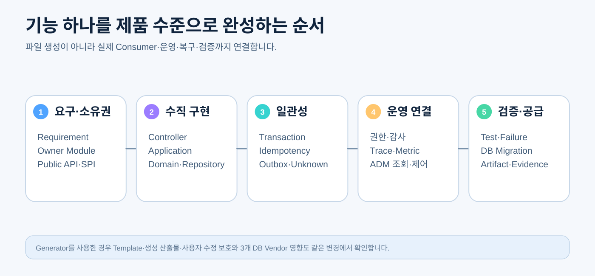
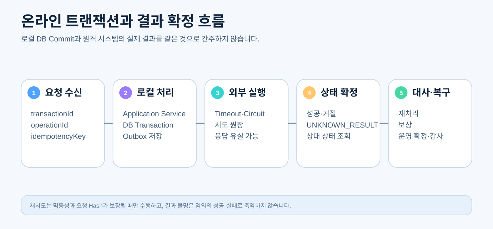
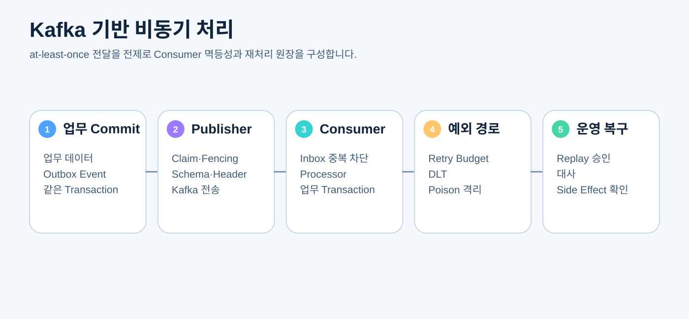

# CPF 개발자 매뉴얼

> **기준 Repository** `freeangelsun/202412_01_CPF` · **기준 Branch** `master` · **문서 작성 기준 SHA** `d31bd127aa12bb9368933216642a5a9d25bd0bfd`
> **문서 목적** 일반 온라인 기능과 공통 연계 기능을 실제 Source·DB·Test·운영까지 연결해 개발하는 방법을 설명한다.
> **주요 독자** Backend 개발자, Frontend 개발자, 업무영역 개발자, 공통 기능 개발자, 기술 리더
> **완료 결과** 독자가 기준 예제를 실행하고 Generator 또는 기존 Module에서 기능 하나를 Transaction·Messaging·File·외부 연계·보안·검증까지 완성한다.

## 0. 문서 사용 계약

이 문서는 제품 정본과 최신 Source를 함께 확인한다. 실행하지 않은 기능이나 검증은 완료로 표현하지 않는다.

문서의 예제는 다음 순서로 읽는다.

1. **제품 계약** — CPF가 보장해야 하는 규칙이다.
2. **현재 구현 확인** — 표에 제시한 Source·설정·API·SQL 경로를 최신 `master`에서 확인한다.
3. **실행 절차** — 명령을 실제 환경에서 실행하고 Exit Code와 결과를 확인한다.
4. **오류·복구** — 정상 경로만 보지 않고 중단·응답 유실·중복·부분 실패를 확인한다.
5. **Evidence** — 실행한 기준 SHA, 환경, 명령, 시작·종료 시각, Exit Code와 Sanitized 결과를 남긴다.

상태는 `완료`, `부분 구현`, `미구현`, `미검증`, `실패`, `재확인 필요`만 사용한다.


## 1. 개발자가 먼저 알아야 할 범위

이 매뉴얼은 일반 온라인·연계 기능을 담당한다. Spring Batch Job·Step 상세는 [02_배치개발매뉴얼](02_배치개발매뉴얼.md), ADM 자체 기능 개발은 [03_ADM개발자매뉴얼](03_ADM개발자매뉴얼.md), Gateway 내부 개발은 [91_게이트웨이매뉴얼](91_게이트웨이매뉴얼.md)을 따른다.



기능 완료는 Controller가 응답하는 것으로 끝나지 않는다.

```text
Requirement → Owner → API → Application → Domain → Repository/외부 Adapter
→ Transaction·Idempotency → 권한·감사 → 운영 추적 → Test·Failure → DB·Artifact·Evidence
```

## 2. 개발 환경 준비

### 2.1 필수 도구

- JDK 25와 Repository가 제공하는 Gradle Wrapper
- Git
- PowerShell 7 (`pwsh`)
- Node.js와 npm — Frontend 또는 Orval 생성 시
- Oracle·PostgreSQL·MariaDB 중 개발 대상 DB
- Kafka 또는 Testcontainers 실행이 가능한 Container Runtime — Messaging 통합 검증 시
- Chromium·Firefox·WebKit — Browser E2E 대상 기능 시

### 2.2 시작 상태 확인

```powershell
$ErrorActionPreference = 'Stop'
git remote -v
git branch --show-current
git rev-parse HEAD
git status --short
java -version
pwsh --version
node --version
npm --version
```

반드시 기록할 항목:

- Repository와 Branch/Ref
- exact SHA
- clean/dirty
- Java·Gradle·Node·npm·PowerShell Version
- DB Vendor와 Version
- 실행 Profile과 Port
- Container·Browser 사용 가능 여부

### 2.3 전체 Build 전 확인

```powershell
.\gradlew.bat projects
.\gradlew.bat tasks
.\gradlew.bat clean test
```

전체 `build`가 오래 걸리더라도 Module 단위 Compile만으로 제품 완료를 선언하지 않는다. 최종 검증에는 적용 범위에 맞는 전체 Build, DB, Runtime, Browser가 필요하다.

## 3. Repository를 읽는 순서

1. `CPF_FINAL_TARGET_REQUIREMENTS.md` — 최종 제품 목표
2. 현재 작업 요청·Requirement Matrix — 이번 변경 범위
3. `settings.gradle`, Root `build.gradle`, Version/BOM — Module과 Dependency
4. Owner Module의 Public API·SPI
5. 실제 Consumer와 Runtime 진입점
6. DB Canonical·Vendor·Migration
7. Test와 실행 Script
8. ADM·운영 연결과 Evidence

### 3.1 대표 Source 지도

| 확인 대상 | 대표 경로 | 확인 방법 |
|---|---|---|
| 기준 예제 | `cpf-reference` | 실제 계층·호출·설정·Test의 기준 Slice 확인 |
| 공개 API | `cpf-core/src/main/java/com/cpf/core/api` | Consumer가 사용할 안정 계약 확인 |
| 확장 SPI | `cpf-core/src/main/java/com/cpf/core/spi` | Provider 책임·Lifecycle·오류 확인 |
| 내부 구현 | `cpf-core/src/main/java/com/cpf/core/internal` | 외부 Import 금지와 Adapter 구현 확인 |
| 생성기 | `cpf-tools/generator/create-domain.ps1` | 신규 Domain 계획·충돌 검사·적용 |
| DB 정본 | `cpf-tools/db/canonical` | Schema와 Seed의 Canonical Source 확인 |
| Vendor SQL | `cpf-tools/db/vendor/{oracle,postgresql,mariadb}` | Install·Migration·Verify·Rollback 확인 |
| 공통 Gate | `cpf-tools/scripts/check-*` | Ownership·문서·보안·Hygiene 확인 |

## 4. 개발 시작 전 설계 질문

코드를 수정하기 전에 다음을 답한다.

| 질문 | 잘못된 답의 징후 |
|---|---|
| 어떤 Requirement를 해결하는가 | “요청받은 Class를 추가한다”만 있고 사용자 결과가 없음 |
| Owner Module은 어디인가 | 편의상 `cpf-core`에 넣음 |
| Public API, SPI, Internal 중 무엇인가 | 외부 Module이 구현 Package를 Import |
| 실제 Consumer는 누구인가 | Interface·DTO만 있고 호출자가 없음 |
| 동일 JVM과 분리 WAS에서 성립하는가 | Local Bean 호출만 있고 Remote Contract 없음 |
| Transaction Owner는 누구인가 | Controller·ADM·다른 Module이 DB를 직접 갱신 |
| 중복·응답 유실·부분 실패는 어떻게 처리하는가 | `catch(Exception)` 후 일반 실패로 축약 |
| 운영자는 어떻게 찾고 제어하는가 | 로그 문자열만 있고 ID·원장·권한·감사 없음 |
| DB·Generator 영향은 무엇인가 | 한 Vendor SQL만 수정하거나 Template 누락 |
| 어떤 검증으로 완료하는가 | Compile·Mock만 성공 |

## 5. 신규 업무영역 생성

### 5.1 계획부터 실행한다

```powershell
pwsh -File .\cpf-tools\generator\create-domain.ps1 `
  -DomainName payment `
  -SystemCode PAY `
  -DatabaseVendor postgresql `
  -DryRun
```

계획서에서 확인할 항목:

- Module 이름과 Directory
- Java Package
- 3자리 `SystemCode`
- Service ID, Route, Port
- Logical DB, Schema, Account
- Oracle·PostgreSQL·MariaDB 산출물
- Capability: Messaging, File, Batch, Frontend, BZA Menu 등
- 생성기 소유 영역과 사용자 수정 영역
- 기존 Module·Package·SystemCode·DB와 충돌 여부

계획이 승인된 뒤에만 적용한다. 실제 Parameter 이름은 `Get-Help`와 최신 Script를 기준으로 확인한다.

```powershell
Get-Help .\cpf-tools\generator\create-domain.ps1 -Full
```

### 5.2 생성 후 인수

- 생성된 `build.gradle`과 BOM 사용 여부
- 공개 API·SPI·Internal Package 경계
- `application.yml`과 Profile
- DB Migration·Install·Verify
- 기본 Controller·Service·Repository
- Local/Remote Adapter
- Test와 OpenAPI
- Generator 재실행 시 사용자 코드 보존
- Standalone Export 또는 Federation Boundary

## 6. 계층별 구현 책임

```text
adapter.in.web        Controller, Request/Response, HTTP 계약
application           Use Case, Transaction, 권한·멱등성 조정
domain                상태·규칙·불변식, 기술 의존 최소화
port.out               Repository·외부 호출 계약
adapter.out.persistence Mapper·SQL·DB 변환
adapter.out.remote     HTTP/Kafka/File Provider 연결
configuration          Bean·Property·Provider 선택
```

### 6.1 Controller

Controller는 다음만 담당한다.

- HTTP Method·Path·Content-Type
- Request 역직렬화와 기본 형식 검증
- 인증 Subject와 표준 실행 문맥 전달
- Application Service 호출
- 표준 Response·Error Mapping
- OpenAPI 설명과 예제

Controller에서 다음을 수행하지 않는다.

- 긴 업무 규칙
- 직접 SQL 실행
- 다른 Module DB 갱신
- 임의 Retry
- Transaction 결과와 원격 결과의 혼합 판정

### 6.2 Application Service

Application Service는 Use Case와 Transaction 경계를 소유한다.

- 입력 정규화·업무 Validation
- 권한·상태 전이·Version 확인
- Repository와 Port 조정
- Idempotency와 Operation 기록
- Outbox·Audit 연결
- 결과 확정 또는 `UNKNOWN_RESULT` 분류

### 6.3 Domain

Domain은 상태와 규칙을 표현한다.

- 허용 상태 전이
- 금액·수량·기간·Version 불변식
- 상태 변경 이유
- 이벤트 생성 조건
- 기술 Exception이 아닌 업무 의미

### 6.4 Repository와 Adapter

Repository는 Owner 데이터만 다룬다. Adapter는 기술 Type과 외부 계약을 Domain·Application 계약으로 변환한다.

## 7. Transaction 관리



### 7.1 Transaction Owner

- 변경 Use Case의 Application Service가 Transaction을 소유한다.
- Controller에 `@Transactional`을 붙여 HTTP 응답·직렬화까지 Transaction을 늘리지 않는다.
- Repository 단위의 작은 Transaction을 여러 번 순차 실행해 Use Case 원자성을 깨뜨리지 않는다.
- ADM·BZA는 Owner Runtime에 명령하고 다른 Owner DB를 직접 갱신하지 않는다.

### 7.2 기본 사용 예

```java
@Service
@RequiredArgsConstructor
public class OrderCommandService {
    private final OrderRepository orderRepository;
    private final OutboxRepository outboxRepository;

    @Transactional
    public OrderResult create(CreateOrderCommand command, CpfExecutionContext context) {
        Order order = Order.create(command, context.subject());
        orderRepository.insert(order);
        outboxRepository.append(order.createdEvent(context));
        return OrderResult.from(order);
    }
}
```

확인 사항:

- `@Transactional` Method가 Spring Proxy를 통해 호출되는가
- 같은 Class의 Self Invocation으로 Proxy가 우회되지 않는가
- Rollback 대상 Exception이 명확한가
- Transaction 안에서 외부 호출·대용량 File·긴 Lock을 수행하지 않는가
- Outbox가 업무 변경과 같은 DataSource·Transaction에 있는가

### 7.3 `readOnly`

조회 Use Case에는 `@Transactional(readOnly = true)`를 사용할 수 있다. 그러나 다음을 확인한다.

- 실제 Routing DataSource가 Read Replica를 사용할지
- Replica Lag가 허용되는 화면인지
- Lazy Loading이 Transaction 밖으로 새지 않는지
- 조회 중 Audit·Access Log 저장이 별도 책임인지

### 7.4 Rollback 규칙

- Runtime Exception은 기본 Rollback 대상이지만 제품 오류 계약을 명시적으로 분류한다.
- Checked Exception을 업무상 Rollback해야 한다면 `rollbackFor` 또는 Exception 설계를 검토한다.
- Exception을 잡고 성공 Response를 반환하면 Rollback되지 않을 수 있다.
- Audit 저장 실패를 원 업무 Rollback으로 볼지, 별도 Spool로 보낼지 위험도에 따라 정한다.
- 마스킹·권한 검증 실패처럼 데이터 반출을 막아야 하는 오류는 Fail-closed다.

### 7.5 전파 방식

| 전파 | 사용 판단 | 주의점 |
|---|---|---|
| `REQUIRED` | 기본 Use Case Transaction | 내부 호출이 같은 Transaction에 참여 |
| `REQUIRES_NEW` | 원 업무와 독립 Commit이 명확히 필요한 원장·보상 기록 | 외부 Transaction Rollback 뒤 독립 기록만 남는 의미를 설계 |
| `MANDATORY` | 반드시 상위 Use Case Transaction 안에서만 호출 | 독립 호출 시 즉시 실패 |
| `NOT_SUPPORTED` | 긴 외부 작업을 Transaction 밖에서 실행할 필요 | 앞선 상태 저장과 후속 확정 흐름 필요 |

`REQUIRES_NEW`는 “일단 저장되게 하자”는 편의로 사용하지 않는다. Connection Pool 추가 점유, 부분 Commit, 테스트 복잡도를 함께 검토한다.

### 7.6 격리 수준과 동시성

기본 DB 격리 수준을 무조건 높이지 않는다. 실제 충돌 형태를 기준으로 선택한다.

- Lost Update — Version Column과 낙관적 잠금
- 중복 생성 — Unique Key와 Idempotency 원장
- 재고·한도 경합 — 조건부 Update, Row Lock 또는 원장형 설계
- Phantom·집계 — Snapshot·Lock·재검증
- Deadlock — Lock 순서 통일, Transaction 단축, Typed Retry

낙관적 잠금 충돌은 일반 500이 아니라 최신 상태 재조회가 필요한 `409 Conflict` 성격으로 Mapping한다.

### 7.7 Deadlock Retry

Retry 조건:

- DB가 Deadlock 또는 일시 Lock Timeout으로 명확히 분류
- 전체 Use Case가 멱등하거나 안전하게 재실행 가능
- Retry 횟수·Backoff·전체 시간 Budget 존재
- 각 Attempt를 관측
- Retry 뒤 결과 불명이 생기지 않음

Thread Sleep을 직접 구현하지 말고 승인된 Resilience Policy를 사용한다.

### 7.8 원격 호출과 Local Transaction

다음 세 상태는 동일하지 않다.

```text
로컬 DB Commit ≠ 원격 Side Effect 완료 ≠ 호출자가 응답을 수신
```

권장 흐름:

1. Operation과 요청 Hash를 기록한다.
2. 필요하면 Local Transaction을 Commit한다.
3. 승인된 Outbound Adapter로 호출한다.
4. 응답을 받으면 결과와 Attempt를 저장한다.
5. Timeout·Connection Reset 등 Side Effect 가능성이 있으면 `UNKNOWN_RESULT`로 기록한다.
6. 상대 Status API·Callback·대사 File로 실제 결과를 확인한다.
7. 최종 상태에 따라 완료·재처리·보상한다.

DB Transaction 안에서 원격 호출이 불가피하면 Lock 시간, Pool 고갈, 상대 Timeout, 응답 유실과 Rollback 뒤 상대 Side Effect를 반드시 시험한다.

### 7.9 Multi-DataSource

- 한 Use Case가 여러 Owner DB를 직접 Commit하지 않도록 구조를 재검토한다.
- 순차 Commit은 첫 DB 성공·둘째 DB 실패의 부분 Commit을 만든다.
- XA/JTA는 제품 요구·운영 복잡도·Vendor 지원을 ADR로 입증한 경우에만 검토한다.
- 기본 대안은 Owner별 Local Transaction, Event/Command, Outbox, 대사와 보상이다.

### 7.10 Transaction 테스트

최소 시나리오:

- 정상 Commit
- Validation 실패 Rollback
- Duplicate Idempotency Key
- Version 충돌
- Deadlock·Lock Timeout
- DB Commit 직후 응답 유실
- 외부 Side Effect 뒤 Local 저장 실패
- Outbox 저장 실패
- Audit 저장 실패
- Multi-instance 동시 요청

## 8. 입력 검증과 표준 오류

### 8.1 검증 계층

- Frontend Zod·Form — 사용자 피드백 보조
- Controller Bean Validation — 형식·크기·필수값
- Application — 업무 규칙·권한·현재 상태
- Domain — 불변식
- DB — Unique·FK·Check·Not Null의 최종 안전망

Frontend 검증이 Backend 정본을 대체하지 않는다.

### 8.2 Null·Empty·Whitespace

각 Field마다 구분한다.

- 누락과 명시적 `null`
- 빈 문자열과 공백 문자열
- 빈 Collection
- Default 적용 여부
- Partial Update에서 “변경 안 함”과 “값 제거”

### 8.3 오류 Response

오류 Response에는 최소 다음 의미가 필요하다.

- 안정적인 Error Code
- 사용자 메시지와 운영 상세 분리
- `transactionId`, `traceId`, `operationId`
- Field 오류 목록
- Retry 가능 여부
- 현재 Version 또는 충돌 상태
- 결과 불명 여부와 Reconcile 안내

민감한 SQL, Stack Trace, 내부 Host, Secret을 Response에 노출하지 않는다.

## 9. 페이징·검색·정렬

- Server Paging을 기본으로 한다.
- Page Number와 Cursor 중 데이터 특성에 맞는 방식을 선택한다.
- Sort Field는 Enum/Allowlist로 제한한다.
- 동적 Identifier나 `ORDER BY`를 사용자 문자열로 SQL에 결합하지 않는다.
- 대량 Export는 화면 Page 조회와 별도 비동기 작업으로 분리한다.
- Count Query 비용, 최대 Page Size, Timeout과 Cancel을 정의한다.

## 10. 데이터 접근과 DB 변경

### 10.1 SQL 작성

- 값은 Parameter Binding을 사용한다.
- Table·Column·Sort Identifier는 Catalog/Enum으로 제한한다.
- Vendor별 차이는 Canonical Policy와 Vendor Source에 명시한다.
- `SELECT *`와 불명확한 Column Mapping을 지양한다.
- Index는 실제 Query와 Cardinality를 근거로 설계한다.
- 존재하지 않는 Column을 참조하는 Index·FK는 생성 Gate에서 차단한다.

### 10.2 Migration 변경 단위

Source 변경과 함께 확인한다.

- Canonical Schema
- Oracle·PostgreSQL·MariaDB SQL
- Fresh Install
- Upgrade
- Rollback 또는 Forward Fix
- Verify SQL
- Seed·Metadata
- Generator Template
- Repository·Mapper Test

### 10.3 Drift

기존 Schema가 정본과 다르면 조용히 Skip하지 않는다. Drift, 승인된 예외 또는 Migration 누락으로 분류한다.

## 11. Local·Remote 서비스 호출

호출자는 같은 공개 계약을 사용하고 Topology Adapter가 구현을 선택한다.

### 11.1 Local Adapter

- 직접 구현 Bean을 호출하되 Public Contract를 우회하지 않는다.
- 호출자 Transaction에 참여할지 명시한다.
- 같은 JVM이라도 Timeout·권한·Trace 의미를 잃지 않는다.

### 11.2 Remote Adapter

- Base URL을 외부 입력으로 자유 조합하지 않는다.
- Connect·Response·Overall Timeout을 실제 Client에 적용한다.
- 표준 Header와 서비스 Credential을 사용한다.
- Retry는 Method·Idempotency·Operation Policy에 따라 결정한다.
- 4xx·5xx·Timeout·Connection 오류를 Typed Error로 변환한다.
- 응답 유실 가능성이 있으면 `UNKNOWN_RESULT`로 분류한다.

### 11.3 동등성 시험

같은 Scenario를 Local과 Remote에서 실행한다.

- 정상 결과
- Validation·Permission 오류
- Version 충돌
- Timeout
- 중복 Idempotency Key
- Trace·Audit ID
- 결과 불명과 대사

## 12. Kafka 메시징



QA32 제품 기준에서 Kafka는 Product Messaging Primary다. Unit Test용 In-memory Adapter는 Kafka를 흉내 내는 자체 Broker가 아니라 단순하고 결정적인 Contract Test Adapter다.

### 12.1 Event Envelope

최소 의미:

- Event ID와 Type
- Schema Version
- Producer SystemCode
- Aggregate/Business Key
- `transactionId`, `traceId`, `correlationId`
- 발생 시각과 유효 시간
- Attempt·Replay 정보
- 민감정보 분류

### 12.2 Outbox

업무 변경과 Outbox 저장을 같은 Local Transaction에 둔다. Publisher는 Claim·Fencing으로 다중 인스턴스 중복 전송을 제어하되 Kafka의 at-least-once 특성을 숨기지 않는다.

### 12.3 Consumer Inbox와 멱등성

- Event ID 또는 업무 Idempotency Key를 저장한다.
- Inbox 중복 검사와 업무 Side Effect를 가능한 한 같은 Transaction에 둔다.
- 처리 완료 전 Offset Commit 의미를 명확히 한다.
- 재균형·Consumer Crash·중복 전달을 시험한다.

### 12.4 Retry와 DLT

Retry 가능 오류와 영구 오류를 분리한다. Poison Message는 무한 Retry하지 않고 DLT에 격리한다. Replay는 권한·사유·대상 범위·Version·Side Effect 확인과 감사가 필요하다.

### 12.5 통합 검증

- Testcontainers Kafka
- Partition Ordering
- Rebalance
- Duplicate·Redelivery
- DLT
- Broker Outage
- Offset Recovery
- Schema Incompatibility
- Consumer Crash 뒤 Side Effect 중복 0

## 13. File·Attachment 처리

### 13.1 업로드

- 파일명은 표시용으로만 사용하고 저장 경로를 결정하지 않는다.
- Canonical Root 아래에서 Normalize하고 Path Traversal·Symlink를 차단한다.
- 크기, 파일 수, MIME, Signature, 압축 해제 비율과 총량을 제한한다.
- 임시 저장 → 검사 → Atomic Move → Metadata Commit 순서를 설계한다.
- 원문 접근 권한과 마스킹·반출 감사를 적용한다.

### 13.2 다운로드

- Authorization과 Data Scope를 서버에서 재검증한다.
- Range·Streaming·Timeout·Cancellation을 고려한다.
- 민감정보는 서버에서 Masked Artifact를 생성한다.
- Artifact 수명, Owner, Hash, 다운로드 횟수와 감사 기록을 관리한다.

### 13.3 압축 파일

Zip Slip 외에도 Entry Count, Total Expanded Size, Ratio, Duplicate Entry, Symlink, Nested Archive, Disk Quota를 검사한다.

## 14. 외부 API·전문 연계

### 14.1 Endpoint Policy

- 승인된 Scheme·Host·Port·Path
- DNS Rebinding과 Private Network SSRF
- Redirect 정책
- TLS Hostname·Certificate
- Proxy와 Egress Allowlist
- Credential·Secret Reference

### 14.2 Timeout과 Resilience

Resilience4j 정책을 Adapter 경계에서 적용한다.

- Connect·Read·Overall Timeout
- Circuit Breaker
- Bulkhead
- Rate Limiter
- Retry Budget
- Mutation의 Idempotency 조건

Gateway와 Service Adapter가 같은 호출에 중복 Retry를 적용하지 않는다.

### 14.3 전문 변환

- Schema·Version
- 길이·Encoding·숫자·날짜 형식
- 필수/Optional Field
- Masking·Audit
- Unknown Field와 호환성
- 원문 보존 기간과 암호화

## 15. 보안·권한·감사·마스킹

### 15.1 Secret

- 설정에는 Secret 원문이 아니라 Reference를 둔다.
- Provider Allowlist와 환경별 정책을 적용한다.
- Command Line, Environment Dump, Log, Exception, Evidence에 원문을 남기지 않는다.
- Rotation 중 구·신 Version의 동시 허용 범위와 만료를 관리한다.

### 15.2 권한

- API·Method·Data Scope를 Backend에서 검증한다.
- Frontend Menu·Button 노출은 사용자 경험일 뿐 보안 정본이 아니다.
- 위험 조회·다운로드·상태 변경에는 사유·승인·재인증을 적용한다.

### 15.3 감사

Audit 실패 정책을 기능 위험도에 따라 정한다.

- 일반 조회 Audit — 비동기 Spool 가능 여부
- 민감정보 원문 조회 — Audit 불가 시 차단
- 위험 명령 — 실행 전에 승인·Audit 저장 필수
- 원 업무 Transaction과 Audit Transaction 분리 여부

### 15.4 마스킹

로그·API·화면·파일 반출·Evidence 각각의 Masking Rule을 일치시킨다. 단순 Key 문자열 검사에만 의존하지 않고 DTO·Schema·Data Classification을 사용한다.

## 16. Frontend 기본 개발

ADM 상세 Stack은 별도 매뉴얼을 따르지만 일반 Frontend도 다음 원칙을 사용한다.

- Route와 Feature Directory 책임 분리
- Server State와 Client/UI State 분리
- OpenAPI 기반 Typed Client
- Form Validation과 Backend Error Mapping
- Loading·Empty·Error·Partial 상태
- 401·403·409·422·500 처리
- Keyboard·Focus·ARIA
- PII Masking과 원문 조회 통제
- 대량 목록 Server Paging·Sort·Filter
- Browser Storage에 민감 Token 저장 금지

## 17. OpenAPI와 JavaDoc

### 17.1 OpenAPI

Controller마다 다음을 제공한다.

- 목적과 사용 권한
- Request·Response Schema
- Header
- 정상 예제
- Validation·Permission·Conflict·Unknown 예제
- Paging·Download·Multipart 계약
- 안정적인 `operationId`

Orval을 사용하는 Consumer가 Clean Regeneration할 수 있도록 Schema와 `operationId` Drift를 Gate로 차단한다.

### 17.2 JavaDoc

Public API·SPI, Service, Controller, 복잡한 Method에는 책임·의도·실패 조건·Thread/Transaction 의미를 이해할 수 있는 설명을 둔다. 구현을 그대로 읽어주는 주석은 피한다.

## 18. Observability

Application Instrumentation은 Micrometer Observation을 사용하고 Export는 OTel/OTLP Adapter 또는 Agent 경계로 분리한다.

필수 Attribute는 Allowlist로 관리한다.

- systemCode, serviceId, instanceId
- transactionId, operationId, attemptId
- remote target와 결과 분류
- jobExecutionId/stepExecutionId가 적용되는 경우
- 오류 코드와 Retry 여부

PII·Secret·고 Cardinality ID를 무제한 Tag로 넣지 않는다.

## 19. 테스트 전략

### 19.1 Unit

- Domain 상태·불변식
- Application 조정과 오류 분류
- Mapper·Codec
- Policy Decision
- In-memory Messaging Contract

### 19.2 Contract

- Public API Serialization
- Local·Remote 동등성
- OpenAPI와 Orval Regeneration
- Message Schema Version
- DB Mapping

### 19.3 Integration

- 실제 DB
- Testcontainers Kafka
- Spring Security·Session
- Outbound Stub과 Timeout
- File System Permission·Symlink

### 19.4 Runtime·Failure

- Process Kill
- Response Loss
- Duplicate Retry
- Lock Contention
- Disk Full
- Broker Outage
- Provider Missing
- Multi-instance Stale Fencing

### 19.5 Browser

- Deep Link·Refresh·Back/Forward
- 권한·Route·Button
- Paging·Sort·Filter
- Form Error Focus
- Download
- Partial Failure
- 접근성·반응형

## 20. EDU — 기능 하나를 끝까지 구현하기

이 실습은 `cpf-reference`의 실제 기준 Slice를 먼저 확인하고 동일한 구조로 신규 기능을 만든다. 경로가 변경됐다면 `git ls-files cpf-reference`와 Class 검색으로 최신 위치를 확인한다.

### 20.1 실습 요구

“요청을 등록하고 상태를 조회하며, 외부 연계 결과가 불명확하면 대사 가능한 상태로 보존한다.”

### 20.2 구현 순서

1. Requirement ID와 Owner Module을 정한다.
2. Request·Response와 Error Code를 작성한다.
3. Domain 상태 `REQUESTED → PROCESSING → COMPLETED/REJECTED/UNKNOWN_RESULT`를 정의한다.
4. Application Service와 `@Transactional` 경계를 작성한다.
5. Operation·Idempotency·Request Hash Table을 설계한다.
6. Repository·Mapper·Migration을 Oracle·PostgreSQL·MariaDB에 반영한다.
7. 외부 Port와 Local Test Adapter, Remote Adapter를 작성한다.
8. Timeout·Circuit Breaker·Attempt Ledger를 연결한다.
9. 응답 유실 시 Reconcile Use Case를 작성한다.
10. Outbox Event와 Kafka Consumer를 연결한다.
11. 권한·사유·Audit·Masking을 적용한다.
12. OpenAPI와 JavaDoc을 작성한다.
13. Unit·DB·Kafka·Response Loss·Multi-instance Test를 실행한다.
14. 운영 조회에 transactionId·operationId·attemptId가 연결되는지 확인한다.
15. Evidence에 exact SHA·명령·Exit Code·결과를 기록한다.

### 20.3 완료 금지

- Entity·Table·Controller만 존재
- 외부 Adapter가 Mock으로 고정
- Timeout Property만 있고 Client에 미적용
- `UNKNOWN_RESULT`를 일반 실패로 저장
- Kafka 대신 In-memory Test만 실행
- 한 DB Vendor만 반영
- ADM·운영 추적 없이 로그 문자열만 남김

## 21. 개발 완료 Gate

- [ ] Requirement, Owner Module, Public API/SPI/Internal 경계를 문서화했다.
- [ ] 실제 Product Consumer가 새 구현을 사용한다.
- [ ] Controller·Application·Domain·Repository·Adapter가 수직 연결됐다.
- [ ] Transaction·Rollback·Concurrency·Idempotency를 시험했다.
- [ ] 원격 Timeout·Retry·Circuit Breaker·UNKNOWN_RESULT를 시험했다.
- [ ] Kafka·File·외부 연계가 적용되는 경우 실제 Provider 통합 검증을 했다.
- [ ] 권한·감사·마스킹과 민감정보 비노출을 검증했다.
- [ ] Oracle·PostgreSQL·MariaDB와 Generator 영향을 확인했다.
- [ ] OpenAPI·JavaDoc·EDU·운영 추적을 갱신했다.
- [ ] Legacy Consumer·Import·Bean·Dependency·Route를 제거하고 재유입 Gate를 만들었다.
- [ ] latest exact SHA에서 Build·Integration·Runtime·Browser Evidence를 생성했다.

## 22. 자주 발생하는 문제와 판단

| 증상 | 먼저 확인 | 안전한 조치 |
|---|---|---|
| `@Transactional`이 적용되지 않음 | Self Invocation, final/private Method, Bean 호출 경로 | Transaction Owner를 외부 호출 가능한 Service로 분리 |
| 중복 데이터 생성 | Unique Key, Idempotency Table, 요청 Hash | 같은 Key의 기존 결과 반환 또는 충돌 처리 |
| Timeout 뒤 재호출로 중복 Side Effect | 상대 Idempotency 지원, Attempt Ledger | 상태 조회 후 확정, Blind Retry 금지 |
| Outbox는 저장됐는데 Event 미전송 | Publisher Claim, Kafka 장애, Retry | Publisher 재개·중복 전송 허용, Consumer 멱등성 확인 |
| DB Vendor별 SQL Drift | Canonical Source와 Generated Vendor SQL | Sync·Verify Gate로 재생성하고 수동 복사 금지 |
| Frontend와 Backend Validation 불일치 | OpenAPI·Zod·Backend Constraint | Backend를 정본으로 Orval/Zod 재생성 |
| 로그에 민감값 노출 | DTO·Map·Exception·Header Masking | Source와 생성 Artifact·Evidence 전수 Scan |

## 23. 구현 추적 명령

```powershell
# 공개 API와 SPI
git ls-files cpf-core | Select-String 'src/main/java/.*/(api|spi)/'

# 기준 예제와 생성 업무영역
git ls-files cpf-reference
git ls-files | Select-String 'cpf-[a-z0-9-]+/src/main'

# Transaction과 Outbox/Inbox
git grep -n '@Transactional' -- '*.java'
git grep -n 'Outbox\|Inbox\|Idempotency\|UNKNOWN_RESULT' -- '*.java' '*.sql'

# 원격 호출·Timeout·Retry
git grep -n 'WebClient\|RestClient\|CircuitBreaker\|Retry' -- '*.java' '*.yml'

# DB·Generator 영향
pwsh -File .\cpf-tools\scripts\sync-database-artifacts.ps1
pwsh -File .\cpf-tools\scripts\check-generator-arbitrary-domain-parity.ps1

# 공통 Gate
pwsh -File .\cpf-tools\scripts\check-architecture-ownership.ps1
pwsh -File .\cpf-tools\scripts\check-source-documentation-standard.ps1
git diff --check
```

실제 Script Parameter와 존재 여부는 최신 `master`에서 `Get-Help`와 `git ls-files`로 확인한다.
