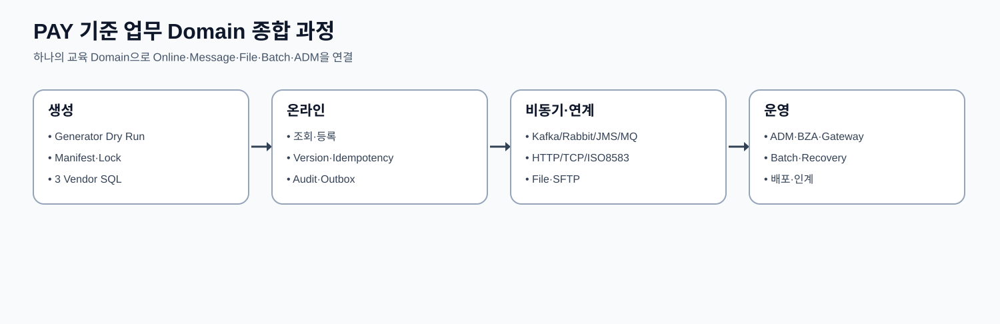

# CPF 개발자 매뉴얼

> 문서: `CPF 개발자 매뉴얼`
> 기준 Repository: `https://github.com/freeangelsun/202412_01_CPF`
> 기준 Branch: `master`
> 기준 Commit: `2a013663090d4e430a15983ad7269f8e86c5ef58` (`Merge B`)
> 기준일: `2026-08-06 Asia/Seoul`

| 항목 | 내용 |
|---|---|
| 주 독자 | 고객사 온라인·연계 업무 개발자 |
| 문서 목적 | 조회·상태 변경·메시지·파일·외부 연계 기능을 설계부터 Test·운영 인계까지 만든다. |
| 기능 서술 전제 | CPF 제품 기능은 고객이 사용할 수 있는 상태로 설명한다. 구현 진행률이나 개발 관리 상태는 이 문서의 사용 절차에 섞지 않는다. |
| 사실 우선순위 | 실제 Source·SQL·API·Config·Frontend·Script·Test → 설계·사양 → 본 매뉴얼 |
| 상태 표현 | 업무 상태와 운영 결과는 Source의 상태값을 사용한다. 문서 검토 상태는 `완료`, `부분 구현`, `미구현`, `미검증`, `실패`, `재확인 필요`만 사용한다. |

## 1. 개발자가 완료해야 할 일

이 매뉴얼의 목표는 고객 개발자가 Source를 역분석하지 않고 신규 업무 Domain을 생성해 조회·상태 변경·비동기·파일·외부 연계·보안·운영 기능을 연결하는 것이다. 예제 업무는 `PAY`이며 고객은 코드·Field·정책을 자기 업무로 바꾼다.



## 2. 환경·Artifact·Build

1. Java·Gradle·CPF Stack Version을 `gradle/cpf-stack.properties`에서 확인한다.
2. `CPF_ARTIFACT_MODE`를 `LOCAL_DEV`, `REMOTE`, `OFFLINE` 중 선택한다.
3. `REMOTE`는 Repository URL·Credential·Checksum을, `OFFLINE`은 사전 동기화 Artifact를 준비한다.
4. `settings.gradle`의 Profile·Capability 선택 결과와 `resolved-starter-lock.json`을 확인한다.
5. Fresh Clone에서 Build하고 선택하지 않은 Provider의 Bean·Config·Migration이 나타나지 않는지 확인한다.

```powershell
./gradlew --version
./gradlew projects
./gradlew clean test
./gradlew check
```

정상 결과는 Toolchain·BOM·Repository가 정본 Version으로 해석되고 Test가 동일 Lock에서 재현되는 것이다.

## 3. Generator로 신규 업무영역 생성

Generator 입력에는 Domain Code, Base Package, Profile, Capability Provider, DB Vendor, API Prefix, Table Prefix, Security Mode, Messaging/File/Integration 선택이 포함된다.

1. Dry Run으로 생성 파일·Starter·Migration·OpenAPI·Test를 미리 본다.
2. 충돌·금지 경로·미지원 조합이 0인지 확인한다.
3. 생성 후 Module·Package·Migration Version·Table Name을 검토한다.
4. `resolved-starter-lock.json`과 생성 Manifest를 저장한다.
5. Generated 영역과 고객 수정 영역을 구분한다.

생성 결과를 복사한 뒤 Package 이름만 바꾸는 방식은 사용하지 않는다. Generator Template 변경이 필요하면 다른 Domain·Sample·3 DB Vendor·OpenAPI·Test Consumer 영향까지 검토한다.

## 4. PAY Reference Domain 구조

```text
pay-domain/
├─ api/
│  ├─ PayMethodQueryController.java
│  ├─ PayMethodCommandController.java
│  └─ dto/
├─ application/
│  ├─ query/PayMethodQueryService.java
│  ├─ command/PayMethodCommandService.java
│  └─ port/
├─ domain/
│  ├─ PayMethod.java
│  ├─ PayMethodStatus.java
│  └─ PayMethodPolicy.java
├─ persistence/
│  ├─ PayMethodRepository.java
│  ├─ PayMethodMapper.xml
│  └─ PayIdempotencyStore.java
├─ integration/
│  ├─ PayInstitutionPort.java
│  ├─ LocalPayInstitutionAdapter.java
│  └─ RemotePayInstitutionAdapter.java
├─ messaging/
├─ file/
├─ batch/
├─ resources/db/{mariadb,postgresql,oracle}/
└─ test/
```

API는 입력·권한·HTTP 의미, Application은 Use Case·Transaction·Idempotency, Domain은 상태 규칙, Persistence는 Query·Version·Migration, Adapter는 Provider·Remote 계약을 소유한다.

## 5. 조회 API 구현

```java
public record PayMethodQuery(String customerId, String status, int size, String cursor) {}
public record PayMethodView(String methodId, String maskedAccount, String status, long version) {}
```

1. 검색 Field와 Sort whitelist를 정한다.
2. Data Scope를 Query 조건에 적용한다.
3. Offset 또는 Cursor를 선택하고 같은 Sort Key를 Index에 반영한다.
4. 목록 DTO와 상세 DTO를 분리한다.
5. 개인정보는 Repository 이후 또는 전용 Masking Policy에서 가린다.
6. Export는 동기 목록 응답과 분리해 Job·Audit로 처리한다.

잘못된 Cursor, 허용되지 않은 Sort, 범위 초과 기간, Data Scope 위반을 Negative Test에 포함한다.

## 6. 상태 변경 API 구현

```java
public record ChangePayMethodStatusCommand(
    String methodId,
    String targetStatus,
    long expectedVersion,
    String idempotencyKey,
    String reason) {}
```

Application Service는 다음 순서를 유지한다.

1. Permission·Data Scope·입력 Validation.
2. Idempotency Ledger 조회와 Request Hash 비교.
3. 현재 Row와 Version 조회.
4. Domain 상태 전이 판정.
5. 업무 Row·History·Audit·Outbox·Result Snapshot 저장.
6. Commit 후 결과 반환.

Version 충돌은 최신 상태를 덮지 않고 `409` 의미로 반환한다. 응답 유실 시 같은 Idempotency Key로 기존 Result Snapshot을 조회한다.

## 7. Transaction·Outbox·Inbox

같은 DB의 업무 Row·Audit·Outbox는 같은 Transaction Manager를 사용한다. Broker Publish 성공 여부를 업무 Commit과 혼합하지 않고 Outbox Publisher가 별도 Attempt로 처리한다.

Consumer는 Inbox 또는 Message Attempt를 먼저 확보하고 업무 처리를 완료한 뒤 ACK한다. Process 종료 시 Inbox 상태와 Broker Delivery를 기준으로 재개한다. Poison Message는 무한 Retry하지 않고 DLQ와 승인 Replay 절차로 분리한다.

## 8. Local·Remote 전환

업무 코드는 Port만 호출한다. Local Adapter는 Same-JVM Service를, Remote Adapter는 Generated Client를 사용한다. 두 Adapter는 DTO·Validation·Error·Idempotency·Permission 의미가 같다.

Remote에서만 추가되는 항목은 Service Identity, Audience, Serialization, Timeout Budget, Trace Header, Target Attempt, UNKNOWN_RESULT 대사다. Local Transaction을 Remote 호출까지 확장하지 않는다.

## 9. Security·Permission·Audit

사용자 Context와 서비스 Context를 분리한다. Controller는 인증 주체를 받고 Application Service는 Resource·Action·Data Scope를 판정한다. 상태 변경은 Reason과 Audit를 필수로 하며 위험 조치는 Approval Snapshot을 확인한다.

Secret은 `CpfSecretValue` 또는 Reference로 전달하고 String 평문을 장기 보관하지 않는다. Log·Exception·DTO·Frontend State에 Secret이나 Raw Contact를 남기지 않는다.

## 10. 공통 개발 Recipe 사용법

다음 42개 Recipe는 내부 Module 설명이 아니라 고객이 만들 수 있는 업무 결과를 기준으로 한다. 각 Recipe의 단계는 설계→구현→오류 재현→복구→ADM 확인→운영 인계 순서다. 한 기능을 선택하면 연결된 DB·API·Config·Test·문서를 함께 변경한다.

## 11. 기능별 실무 Recipe

### 11.1. 조건 검색·목록·상세 — `F01`

#### 만들 수 있는 업무 결과

검색 API와 화면을 일관된 Paging·Sorting·Masking 계약으로 제공한다.

#### 선택 기준과 사용하지 말아야 할 경우

단건 조회만 필요한 경우에도 목록 API와 상태 변경 API를 한 Endpoint에 섞지 않는다.

#### 역할·Owner·Consumer

| 항목 | 내용 |
|---|---|
| State/Contract Owner | 업무 Domain |
| 실제 Consumer | ADM·Frontend·외부 Consumer |
| 선택 Profile·Capability | `web-api 또는 secure-api` |
| 주요 Source·Config·SQL·Test 위치 | 업무 Module `api/`, `application/`, OpenAPI Source, API Contract Test |
| 운영 확인 | `/transactions`, `/logs`, `/transactionGroups` |

#### 시작 전에 결정할 값

`Query DTO`, `Sort whitelist`, `Cursor/Offset`, `Data Scope`. 각 값의 Default를 그대로 채우지 말고 업무 의미, 허용 범위, Owner, 변경 시 재기동·Migration 여부를 설계표에 기록한다.

#### 만들어지는 결과물

목록·상세 응답, 조회 Trace, Export 선택. 구현 완료 후 Source 파일만 인계하지 않고 API/Schema·DB Migration·Config·Test Data·운영 식별자·복구 절차를 함께 인계한다.

#### 단계별 개발 절차

1. 업무 결과와 State Owner를 한 문장으로 정의한다.
2. Public API/Port와 내부 구현을 분리하고 Provider Type이 외부 계약에 나타나지 않게 한다.
3. 입력 DTO에 형식·길이·범위·교차 Field Validation을 선언한다.
4. 현재 상태·Expected Version·Idempotency·Permission·Data Scope를 Application Service에서 검증한다.
5. 업무 Row·History·Audit·Ledger·Outbox 중 필요한 저장물을 같은 Transaction 경계로 묶는다.
6. Local/Remote Consumer가 같은 DTO·Error·상태 의미를 사용하도록 Contract Test를 작성한다.
7. 정상·중복·동시성·Timeout·응답 유실·부분 실패를 재현한다.
8. `/transactions`, `/logs`, `/transactionGroups`에서 Transaction/Operation/Attempt/Target·Audit를 확인한다.
9. 운영 인계표에 정상 판정, Alert, 대사 Key, Retry/Compensation/Rollback 조건을 기록한다.

#### 입력·기본값·범위

- 입력 계약: Query DTO, Sort whitelist, Cursor/Offset, Data Scope.
- 식별자는 앞뒤 공백을 제거하고 허용 Pattern·최대 길이를 정한다.
- 상태 변경은 `Expected Version`, `Reason`, `Operation ID`를 사용한다.
- 외부 부작용이 있으면 Target·Payload Hash·Attempt와 Timeout Budget을 기록한다.
- Secret·개인정보는 Config Reference와 Masking 정책으로 전달하고 Log에 평문을 남기지 않는다.

#### 정상 결과와 완료 판정

목록·상세 응답, 조회 Trace, Export 선택가 생성되고, 업무 결과·Version·Audit·Operation/Attempt가 같은 식별자로 연결돼야 한다. 조회 화면과 Owner 원장의 상태가 다르면 화면 표시만으로 완료 처리하지 않는다.

#### 오류·동시성·응답 유실·부분 실패

대표 실패는 Index·Paging·Masking·Timeout다. 외부 Dispatch 전 결정적 오류는 `FAILED`, Dispatch 이후 결과 Evidence가 부족하면 `UNKNOWN_RESULT`, 여러 Target 결과가 섞이면 `PARTIAL`로 구분한다.

#### 복구·대사·되돌리기

조건 축소→Owner Query 확인→동일 조회 재실행. 원본 Attempt를 수정하거나 삭제하지 않고 후속 Attempt와 결정 근거를 추가한다. 같은 Idempotency Key에 다른 Payload를 사용하지 않는다.

#### Log·Metric·Trace·Audit

`F01` 관측에서는 `조건 검색·목록·상세`의 Transaction ID·Trace ID·Operation ID와 `업무 Domain` 상태를 연결한다. `목록·상세 응답, 조회 Trace, Export 선택`의 생성 시각·Version·Attempt·Error Code·Duration을 Log/Trace에서 추적하고, Metric은 건수·지연·오류율처럼 집계 가능한 값만 사용한다.

#### Test와 교육 과제

필수 Test: Query Unit·Repository Integration·API Contract·Browser. 교육자는 정상 요청을 먼저 실행한 뒤 중복·Version 충돌·Timeout 또는 Process Kill을 재현하고 `/transactions`, `/logs`, `/transactionGroups`에서 복구 전후 상태를 비교한다.

#### 고객이 바꾸는 영역과 CPF 보호 영역

고객은 업무 Field·상태·권한·SLA·외부기관 규칙을 바꾼다. CPF의 Context·Error·Ledger·Audit·Generated Client·Migration 구조와 Owner 경계는 임의 축약하지 않는다.

#### 운영 인계

`F01` 운영 인계에는 Owner `업무 Domain`, Consumer `ADM·Frontend·외부 Consumer`, 주요 입력 `Query DTO, Sort whitelist, Cursor/Offset, Data Scope`, 생성 결과 `목록·상세 응답, 조회 Trace, Export 선택`, 대표 실패 `Index·Paging·Masking·Timeout`, 복구 기준 `조건 축소→Owner Query 확인→동일 조회 재실행`를 기록한다. 담당자는 Alert·Config·Secret Reference·DB/Message 원장과 다음 점검 시각을 함께 넘긴다.

### 11.2. 등록·수정·정지·재개·삭제 — `F02`

#### 만들 수 있는 업무 결과

업무 상태를 Version과 Reason을 사용해 예측 가능한 전이로 변경한다.

#### 선택 기준과 사용하지 말아야 할 경우

단순 조회에는 Command를 만들지 않고, 물리 삭제가 감사 요구와 충돌하면 상태 전이를 사용한다.

#### 역할·Owner·Consumer

| 항목 | 내용 |
|---|---|
| State/Contract Owner | 업무 Domain |
| 실제 Consumer | ADM Command·외부 API |
| 선택 Profile·Capability | `secure-api` |
| 주요 Source·Config·SQL·Test 위치 | 업무 Module `api/command`, `application/command`, `domain`, `persistence` |
| 운영 확인 | `/transactions`, `/auditLogs`, `/incidents` |

#### 시작 전에 결정할 값

`Command DTO`, `Expected Version`, `Reason`, `Idempotency Key`. 각 값의 Default를 그대로 채우지 말고 업무 의미, 허용 범위, Owner, 변경 시 재기동·Migration 여부를 설계표에 기록한다.

#### 만들어지는 결과물

업무 Row·History·Audit·Operation Result. 구현 완료 후 Source 파일만 인계하지 않고 API/Schema·DB Migration·Config·Test Data·운영 식별자·복구 절차를 함께 인계한다.

#### 단계별 개발 절차

1. 업무 결과와 State Owner를 한 문장으로 정의한다.
2. Public API/Port와 내부 구현을 분리하고 Provider Type이 외부 계약에 나타나지 않게 한다.
3. 입력 DTO에 형식·길이·범위·교차 Field Validation을 선언한다.
4. 현재 상태·Expected Version·Idempotency·Permission·Data Scope를 Application Service에서 검증한다.
5. 업무 Row·History·Audit·Ledger·Outbox 중 필요한 저장물을 같은 Transaction 경계로 묶는다.
6. Local/Remote Consumer가 같은 DTO·Error·상태 의미를 사용하도록 Contract Test를 작성한다.
7. 정상·중복·동시성·Timeout·응답 유실·부분 실패를 재현한다.
8. `/transactions`, `/auditLogs`, `/incidents`에서 Transaction/Operation/Attempt/Target·Audit를 확인한다.
9. 운영 인계표에 정상 판정, Alert, 대사 Key, Retry/Compensation/Rollback 조건을 기록한다.

#### 입력·기본값·범위

- 입력 계약: Command DTO, Expected Version, Reason, Idempotency Key.
- 식별자는 앞뒤 공백을 제거하고 허용 Pattern·최대 길이를 정한다.
- 상태 변경은 `Expected Version`, `Reason`, `Operation ID`를 사용한다.
- 외부 부작용이 있으면 Target·Payload Hash·Attempt와 Timeout Budget을 기록한다.
- Secret·개인정보는 Config Reference와 Masking 정책으로 전달하고 Log에 평문을 남기지 않는다.

#### 정상 결과와 완료 판정

업무 Row·History·Audit·Operation Result가 생성되고, 업무 결과·Version·Audit·Operation/Attempt가 같은 식별자로 연결돼야 한다. 조회 화면과 Owner 원장의 상태가 다르면 화면 표시만으로 완료 처리하지 않는다.

#### 오류·동시성·응답 유실·부분 실패

대표 실패는 Validation·Version conflict·Forbidden·부분 실패다. 외부 Dispatch 전 결정적 오류는 `FAILED`, Dispatch 이후 결과 Evidence가 부족하면 `UNKNOWN_RESULT`, 여러 Target 결과가 섞이면 `PARTIAL`로 구분한다.

#### 복구·대사·되돌리기

Operation 조회→Owner 원장 대사→새 Command 또는 보상. 원본 Attempt를 수정하거나 삭제하지 않고 후속 Attempt와 결정 근거를 추가한다. 같은 Idempotency Key에 다른 Payload를 사용하지 않는다.

#### Log·Metric·Trace·Audit

`F02` 관측에서는 `등록·수정·정지·재개·삭제`의 Transaction ID·Trace ID·Operation ID와 `업무 Domain` 상태를 연결한다. `업무 Row·History·Audit·Operation Result`의 생성 시각·Version·Attempt·Error Code·Duration을 Log/Trace에서 추적하고, Metric은 건수·지연·오류율처럼 집계 가능한 값만 사용한다.

#### Test와 교육 과제

필수 Test: Domain State Test·Concurrency·API Negative·Audit. 교육자는 정상 요청을 먼저 실행한 뒤 중복·Version 충돌·Timeout 또는 Process Kill을 재현하고 `/transactions`, `/auditLogs`, `/incidents`에서 복구 전후 상태를 비교한다.

#### 고객이 바꾸는 영역과 CPF 보호 영역

고객은 업무 Field·상태·권한·SLA·외부기관 규칙을 바꾼다. CPF의 Context·Error·Ledger·Audit·Generated Client·Migration 구조와 Owner 경계는 임의 축약하지 않는다.

#### 운영 인계

`F02` 운영 인계에는 Owner `업무 Domain`, Consumer `ADM Command·외부 API`, 주요 입력 `Command DTO, Expected Version, Reason, Idempotency Key`, 생성 결과 `업무 Row·History·Audit·Operation Result`, 대표 실패 `Validation·Version conflict·Forbidden·부분 실패`, 복구 기준 `Operation 조회→Owner 원장 대사→새 Command 또는 보상`를 기록한다. 담당자는 Alert·Config·Secret Reference·DB/Message 원장과 다음 점검 시각을 함께 넘긴다.

### 11.3. 멱등 요청과 Replay — `F03`

#### 만들 수 있는 업무 결과

같은 업무 요청의 중복 부작용을 막고 동일 결과를 재사용한다.

#### 선택 기준과 사용하지 말아야 할 경우

조회에는 강제하지 않으며, Payload가 달라진 요청에 같은 Key를 재사용하지 않는다.

#### 역할·Owner·Consumer

| 항목 | 내용 |
|---|---|
| State/Contract Owner | cpf-core reliability + 업무 Owner |
| 실제 Consumer | 모든 Write Consumer |
| 선택 Profile·Capability | `data reliability` |
| 주요 Source·Config·SQL·Test 위치 | `cpf-core` reliability 계약 + 업무 Module Ledger Repository |
| 운영 확인 | `/reliability`, `/incidents`, `/recoveryCenter` |

#### 시작 전에 결정할 값

`Idempotency Key`, `Request Hash`, `Owner Operation ID`. 각 값의 Default를 그대로 채우지 말고 업무 의미, 허용 범위, Owner, 변경 시 재기동·Migration 여부를 설계표에 기록한다.

#### 만들어지는 결과물

Ledger, Result Snapshot, Replay Indicator. 구현 완료 후 Source 파일만 인계하지 않고 API/Schema·DB Migration·Config·Test Data·운영 식별자·복구 절차를 함께 인계한다.

#### 단계별 개발 절차

1. 업무 결과와 State Owner를 한 문장으로 정의한다.
2. Public API/Port와 내부 구현을 분리하고 Provider Type이 외부 계약에 나타나지 않게 한다.
3. 입력 DTO에 형식·길이·범위·교차 Field Validation을 선언한다.
4. 현재 상태·Expected Version·Idempotency·Permission·Data Scope를 Application Service에서 검증한다.
5. 업무 Row·History·Audit·Ledger·Outbox 중 필요한 저장물을 같은 Transaction 경계로 묶는다.
6. Local/Remote Consumer가 같은 DTO·Error·상태 의미를 사용하도록 Contract Test를 작성한다.
7. 정상·중복·동시성·Timeout·응답 유실·부분 실패를 재현한다.
8. `/reliability`, `/incidents`, `/recoveryCenter`에서 Transaction/Operation/Attempt/Target·Audit를 확인한다.
9. 운영 인계표에 정상 판정, Alert, 대사 Key, Retry/Compensation/Rollback 조건을 기록한다.

#### 입력·기본값·범위

- 입력 계약: Idempotency Key, Request Hash, Owner Operation ID.
- 식별자는 앞뒤 공백을 제거하고 허용 Pattern·최대 길이를 정한다.
- 상태 변경은 `Expected Version`, `Reason`, `Operation ID`를 사용한다.
- 외부 부작용이 있으면 Target·Payload Hash·Attempt와 Timeout Budget을 기록한다.
- Secret·개인정보는 Config Reference와 Masking 정책으로 전달하고 Log에 평문을 남기지 않는다.

#### 정상 결과와 완료 판정

Ledger, Result Snapshot, Replay Indicator가 생성되고, 업무 결과·Version·Audit·Operation/Attempt가 같은 식별자로 연결돼야 한다. 조회 화면과 Owner 원장의 상태가 다르면 화면 표시만으로 완료 처리하지 않는다.

#### 오류·동시성·응답 유실·부분 실패

대표 실패는 Key 충돌·Hash 불일치·저장 결과 불명다. 외부 Dispatch 전 결정적 오류는 `FAILED`, Dispatch 이후 결과 Evidence가 부족하면 `UNKNOWN_RESULT`, 여러 Target 결과가 섞이면 `PARTIAL`로 구분한다.

#### 복구·대사·되돌리기

같은 Key 조회→Hash 비교→기존 결과 반환 또는 Conflict. 원본 Attempt를 수정하거나 삭제하지 않고 후속 Attempt와 결정 근거를 추가한다. 같은 Idempotency Key에 다른 Payload를 사용하지 않는다.

#### Log·Metric·Trace·Audit

`F03` 관측에서는 `멱등 요청과 Replay`의 Transaction ID·Trace ID·Operation ID와 `cpf-core reliability + 업무 Owner` 상태를 연결한다. `Ledger, Result Snapshot, Replay Indicator`의 생성 시각·Version·Attempt·Error Code·Duration을 Log/Trace에서 추적하고, Metric은 건수·지연·오류율처럼 집계 가능한 값만 사용한다.

#### Test와 교육 과제

필수 Test: First/Replay/Conflict/Response-loss Test. 교육자는 정상 요청을 먼저 실행한 뒤 중복·Version 충돌·Timeout 또는 Process Kill을 재현하고 `/reliability`, `/incidents`, `/recoveryCenter`에서 복구 전후 상태를 비교한다.

#### 고객이 바꾸는 영역과 CPF 보호 영역

고객은 업무 Field·상태·권한·SLA·외부기관 규칙을 바꾼다. CPF의 Context·Error·Ledger·Audit·Generated Client·Migration 구조와 Owner 경계는 임의 축약하지 않는다.

#### 운영 인계

`F03` 운영 인계에는 Owner `cpf-core reliability + 업무 Owner`, Consumer `모든 Write Consumer`, 주요 입력 `Idempotency Key, Request Hash, Owner Operation ID`, 생성 결과 `Ledger, Result Snapshot, Replay Indicator`, 대표 실패 `Key 충돌·Hash 불일치·저장 결과 불명`, 복구 기준 `같은 Key 조회→Hash 비교→기존 결과 반환 또는 Conflict`를 기록한다. 담당자는 Alert·Config·Secret Reference·DB/Message 원장과 다음 점검 시각을 함께 넘긴다.

### 11.4. 결과 불명과 대사 — `F04`

#### 만들 수 있는 업무 결과

외부 부작용 이후 응답이 유실된 요청을 UNKNOWN_RESULT로 보존하고 근거로 종료한다.

#### 선택 기준과 사용하지 말아야 할 경우

외부 호출 전 결정적 오류는 FAILED로 처리하고 UNKNOWN으로 뭉개지 않는다.

#### 역할·Owner·Consumer

| 항목 | 내용 |
|---|---|
| State/Contract Owner | Operation Owner |
| 실제 Consumer | ADM Recovery·Batch·Gateway |
| 선택 Profile·Capability | `reliability` |
| 주요 Source·Config·SQL·Test 위치 | Operation/Attempt Ledger, Owner Adapter, Reconciliation Service |
| 운영 확인 | `/incidents`, `/recoveryCenter`, `/reliability` |

#### 시작 전에 결정할 값

`Operation ID`, `Target`, `Attempt`, `Payload Hash`, `Version`. 각 값의 Default를 그대로 채우지 말고 업무 의미, 허용 범위, Owner, 변경 시 재기동·Migration 여부를 설계표에 기록한다.

#### 만들어지는 결과물

UNKNOWN Ledger, Reconciliation Decision, Compensation. 구현 완료 후 Source 파일만 인계하지 않고 API/Schema·DB Migration·Config·Test Data·운영 식별자·복구 절차를 함께 인계한다.

#### 단계별 개발 절차

1. 업무 결과와 State Owner를 한 문장으로 정의한다.
2. Public API/Port와 내부 구현을 분리하고 Provider Type이 외부 계약에 나타나지 않게 한다.
3. 입력 DTO에 형식·길이·범위·교차 Field Validation을 선언한다.
4. 현재 상태·Expected Version·Idempotency·Permission·Data Scope를 Application Service에서 검증한다.
5. 업무 Row·History·Audit·Ledger·Outbox 중 필요한 저장물을 같은 Transaction 경계로 묶는다.
6. Local/Remote Consumer가 같은 DTO·Error·상태 의미를 사용하도록 Contract Test를 작성한다.
7. 정상·중복·동시성·Timeout·응답 유실·부분 실패를 재현한다.
8. `/incidents`, `/recoveryCenter`, `/reliability`에서 Transaction/Operation/Attempt/Target·Audit를 확인한다.
9. 운영 인계표에 정상 판정, Alert, 대사 Key, Retry/Compensation/Rollback 조건을 기록한다.

#### 입력·기본값·범위

- 입력 계약: Operation ID, Target, Attempt, Payload Hash, Version.
- 식별자는 앞뒤 공백을 제거하고 허용 Pattern·최대 길이를 정한다.
- 상태 변경은 `Expected Version`, `Reason`, `Operation ID`를 사용한다.
- 외부 부작용이 있으면 Target·Payload Hash·Attempt와 Timeout Budget을 기록한다.
- Secret·개인정보는 Config Reference와 Masking 정책으로 전달하고 Log에 평문을 남기지 않는다.

#### 정상 결과와 완료 판정

UNKNOWN Ledger, Reconciliation Decision, Compensation가 생성되고, 업무 결과·Version·Audit·Operation/Attempt가 같은 식별자로 연결돼야 한다. 조회 화면과 Owner 원장의 상태가 다르면 화면 표시만으로 완료 처리하지 않는다.

#### 오류·동시성·응답 유실·부분 실패

대표 실패는 응답 유실·Target 부분 성공·Evidence 저장 실패다. 외부 Dispatch 전 결정적 오류는 `FAILED`, Dispatch 이후 결과 Evidence가 부족하면 `UNKNOWN_RESULT`, 여러 Target 결과가 섞이면 `PARTIAL`로 구분한다.

#### 복구·대사·되돌리기

Target 원장 조회→결과 확정→Retry/Compensation/종료. 원본 Attempt를 수정하거나 삭제하지 않고 후속 Attempt와 결정 근거를 추가한다. 같은 Idempotency Key에 다른 Payload를 사용하지 않는다.

#### Log·Metric·Trace·Audit

`F04` 관측에서는 `결과 불명과 대사`의 Transaction ID·Trace ID·Operation ID와 `Operation Owner` 상태를 연결한다. `UNKNOWN Ledger, Reconciliation Decision, Compensation`의 생성 시각·Version·Attempt·Error Code·Duration을 Log/Trace에서 추적하고, Metric은 건수·지연·오류율처럼 집계 가능한 값만 사용한다.

#### Test와 교육 과제

필수 Test: Timeout after dispatch·duplicate reconcile·partial target. 교육자는 정상 요청을 먼저 실행한 뒤 중복·Version 충돌·Timeout 또는 Process Kill을 재현하고 `/incidents`, `/recoveryCenter`, `/reliability`에서 복구 전후 상태를 비교한다.

#### 고객이 바꾸는 영역과 CPF 보호 영역

고객은 업무 Field·상태·권한·SLA·외부기관 규칙을 바꾼다. CPF의 Context·Error·Ledger·Audit·Generated Client·Migration 구조와 Owner 경계는 임의 축약하지 않는다.

#### 운영 인계

`F04` 운영 인계에는 Owner `Operation Owner`, Consumer `ADM Recovery·Batch·Gateway`, 주요 입력 `Operation ID, Target, Attempt, Payload Hash, Version`, 생성 결과 `UNKNOWN Ledger, Reconciliation Decision, Compensation`, 대표 실패 `응답 유실·Target 부분 성공·Evidence 저장 실패`, 복구 기준 `Target 원장 조회→결과 확정→Retry/Compensation/종료`를 기록한다. 담당자는 Alert·Config·Secret Reference·DB/Message 원장과 다음 점검 시각을 함께 넘긴다.

### 11.5. Local·Remote 동일 계약 — `F05`

#### 만들 수 있는 업무 결과

Same-JVM과 Remote 호출이 같은 Port·DTO·오류 의미를 사용한다.

#### 선택 기준과 사용하지 말아야 할 경우

Local 구현에만 존재하는 편의 Method를 업무 코드에서 직접 호출하지 않는다.

#### 역할·Owner·Consumer

| 항목 | 내용 |
|---|---|
| State/Contract Owner | Owner Port |
| 실제 Consumer | Modular Monolith·MSA Consumer |
| 선택 Profile·Capability | `integration` |
| 주요 Source·Config·SQL·Test 위치 | Owner Port·Local Adapter·Remote Generated Client Adapter |
| 운영 확인 | `/serviceRegistry`, `/runtimeControl`, `/transactionGroups` |

#### 시작 전에 결정할 값

`Port`, `DTO`, `Timeout`, `Service Identity`, `Serialization`. 각 값의 Default를 그대로 채우지 말고 업무 의미, 허용 범위, Owner, 변경 시 재기동·Migration 여부를 설계표에 기록한다.

#### 만들어지는 결과물

Local Adapter·Remote Adapter·Contract Test. 구현 완료 후 Source 파일만 인계하지 않고 API/Schema·DB Migration·Config·Test Data·운영 식별자·복구 절차를 함께 인계한다.

#### 단계별 개발 절차

1. 업무 결과와 State Owner를 한 문장으로 정의한다.
2. Public API/Port와 내부 구현을 분리하고 Provider Type이 외부 계약에 나타나지 않게 한다.
3. 입력 DTO에 형식·길이·범위·교차 Field Validation을 선언한다.
4. 현재 상태·Expected Version·Idempotency·Permission·Data Scope를 Application Service에서 검증한다.
5. 업무 Row·History·Audit·Ledger·Outbox 중 필요한 저장물을 같은 Transaction 경계로 묶는다.
6. Local/Remote Consumer가 같은 DTO·Error·상태 의미를 사용하도록 Contract Test를 작성한다.
7. 정상·중복·동시성·Timeout·응답 유실·부분 실패를 재현한다.
8. `/serviceRegistry`, `/runtimeControl`, `/transactionGroups`에서 Transaction/Operation/Attempt/Target·Audit를 확인한다.
9. 운영 인계표에 정상 판정, Alert, 대사 Key, Retry/Compensation/Rollback 조건을 기록한다.

#### 입력·기본값·범위

- 입력 계약: Port, DTO, Timeout, Service Identity, Serialization.
- 식별자는 앞뒤 공백을 제거하고 허용 Pattern·최대 길이를 정한다.
- 상태 변경은 `Expected Version`, `Reason`, `Operation ID`를 사용한다.
- 외부 부작용이 있으면 Target·Payload Hash·Attempt와 Timeout Budget을 기록한다.
- Secret·개인정보는 Config Reference와 Masking 정책으로 전달하고 Log에 평문을 남기지 않는다.

#### 정상 결과와 완료 판정

Local Adapter·Remote Adapter·Contract Test가 생성되고, 업무 결과·Version·Audit·Operation/Attempt가 같은 식별자로 연결돼야 한다. 조회 화면과 Owner 원장의 상태가 다르면 화면 표시만으로 완료 처리하지 않는다.

#### 오류·동시성·응답 유실·부분 실패

대표 실패는 Timeout·Serialization·Version skew다. 외부 Dispatch 전 결정적 오류는 `FAILED`, Dispatch 이후 결과 Evidence가 부족하면 `UNKNOWN_RESULT`, 여러 Target 결과가 섞이면 `PARTIAL`로 구분한다.

#### 복구·대사·되돌리기

Consumer가 Port만 사용하도록 복구하고 Remote 상태를 재조회. 원본 Attempt를 수정하거나 삭제하지 않고 후속 Attempt와 결정 근거를 추가한다. 같은 Idempotency Key에 다른 Payload를 사용하지 않는다.

#### Log·Metric·Trace·Audit

`F05` 관측에서는 `Local·Remote 동일 계약`의 Transaction ID·Trace ID·Operation ID와 `Owner Port` 상태를 연결한다. `Local Adapter·Remote Adapter·Contract Test`의 생성 시각·Version·Attempt·Error Code·Duration을 Log/Trace에서 추적하고, Metric은 건수·지연·오류율처럼 집계 가능한 값만 사용한다.

#### Test와 교육 과제

필수 Test: Local/Remote contract parity·serialization. 교육자는 정상 요청을 먼저 실행한 뒤 중복·Version 충돌·Timeout 또는 Process Kill을 재현하고 `/serviceRegistry`, `/runtimeControl`, `/transactionGroups`에서 복구 전후 상태를 비교한다.

#### 고객이 바꾸는 영역과 CPF 보호 영역

고객은 업무 Field·상태·권한·SLA·외부기관 규칙을 바꾼다. CPF의 Context·Error·Ledger·Audit·Generated Client·Migration 구조와 Owner 경계는 임의 축약하지 않는다.

#### 운영 인계

`F05` 운영 인계에는 Owner `Owner Port`, Consumer `Modular Monolith·MSA Consumer`, 주요 입력 `Port, DTO, Timeout, Service Identity, Serialization`, 생성 결과 `Local Adapter·Remote Adapter·Contract Test`, 대표 실패 `Timeout·Serialization·Version skew`, 복구 기준 `Consumer가 Port만 사용하도록 복구하고 Remote 상태를 재조회`를 기록한다. 담당자는 Alert·Config·Secret Reference·DB/Message 원장과 다음 점검 시각을 함께 넘긴다.

### 11.6. 업무 Transaction·Audit·Outbox — `F06`

#### 만들 수 있는 업무 결과

업무 Row, History, Audit, Outbox를 원자적 경계로 묶는다.

#### 선택 기준과 사용하지 말아야 할 경우

서로 다른 DB의 외부 부작용까지 하나의 Local Transaction으로 가정하지 않는다.

#### 역할·Owner·Consumer

| 항목 | 내용 |
|---|---|
| State/Contract Owner | 업무 Persistence Owner |
| 실제 Consumer | Message Publisher·ADM·Audit |
| 선택 Profile·Capability | `data` |
| 주요 Source·Config·SQL·Test 위치 | 업무 Repository·Migration·Audit·Outbox Store |
| 운영 확인 | `/logs`, `/auditLogs`, `/reliability` |

#### 시작 전에 결정할 값

`Transaction Manager`, `Isolation`, `Version`, `Event Key`. 각 값의 Default를 그대로 채우지 말고 업무 의미, 허용 범위, Owner, 변경 시 재기동·Migration 여부를 설계표에 기록한다.

#### 만들어지는 결과물

업무 Row·Audit·Outbox·Commit Evidence. 구현 완료 후 Source 파일만 인계하지 않고 API/Schema·DB Migration·Config·Test Data·운영 식별자·복구 절차를 함께 인계한다.

#### 단계별 개발 절차

1. 업무 결과와 State Owner를 한 문장으로 정의한다.
2. Public API/Port와 내부 구현을 분리하고 Provider Type이 외부 계약에 나타나지 않게 한다.
3. 입력 DTO에 형식·길이·범위·교차 Field Validation을 선언한다.
4. 현재 상태·Expected Version·Idempotency·Permission·Data Scope를 Application Service에서 검증한다.
5. 업무 Row·History·Audit·Ledger·Outbox 중 필요한 저장물을 같은 Transaction 경계로 묶는다.
6. Local/Remote Consumer가 같은 DTO·Error·상태 의미를 사용하도록 Contract Test를 작성한다.
7. 정상·중복·동시성·Timeout·응답 유실·부분 실패를 재현한다.
8. `/logs`, `/auditLogs`, `/reliability`에서 Transaction/Operation/Attempt/Target·Audit를 확인한다.
9. 운영 인계표에 정상 판정, Alert, 대사 Key, Retry/Compensation/Rollback 조건을 기록한다.

#### 입력·기본값·범위

- 입력 계약: Transaction Manager, Isolation, Version, Event Key.
- 식별자는 앞뒤 공백을 제거하고 허용 Pattern·최대 길이를 정한다.
- 상태 변경은 `Expected Version`, `Reason`, `Operation ID`를 사용한다.
- 외부 부작용이 있으면 Target·Payload Hash·Attempt와 Timeout Budget을 기록한다.
- Secret·개인정보는 Config Reference와 Masking 정책으로 전달하고 Log에 평문을 남기지 않는다.

#### 정상 결과와 완료 판정

업무 Row·Audit·Outbox·Commit Evidence가 생성되고, 업무 결과·Version·Audit·Operation/Attempt가 같은 식별자로 연결돼야 한다. 조회 화면과 Owner 원장의 상태가 다르면 화면 표시만으로 완료 처리하지 않는다.

#### 오류·동시성·응답 유실·부분 실패

대표 실패는 Deadlock·optimistic conflict·outbox insert failure다. 외부 Dispatch 전 결정적 오류는 `FAILED`, Dispatch 이후 결과 Evidence가 부족하면 `UNKNOWN_RESULT`, 여러 Target 결과가 섞이면 `PARTIAL`로 구분한다.

#### 복구·대사·되돌리기

Transaction Rollback 확인→원인 제거→동일 업무 Key 재호출. 원본 Attempt를 수정하거나 삭제하지 않고 후속 Attempt와 결정 근거를 추가한다. 같은 Idempotency Key에 다른 Payload를 사용하지 않는다.

#### Log·Metric·Trace·Audit

`F06` 관측에서는 `업무 Transaction·Audit·Outbox`의 Transaction ID·Trace ID·Operation ID와 `업무 Persistence Owner` 상태를 연결한다. `업무 Row·Audit·Outbox·Commit Evidence`의 생성 시각·Version·Attempt·Error Code·Duration을 Log/Trace에서 추적하고, Metric은 건수·지연·오류율처럼 집계 가능한 값만 사용한다.

#### Test와 교육 과제

필수 Test: rollback injection·deadlock retry·outbox parity. 교육자는 정상 요청을 먼저 실행한 뒤 중복·Version 충돌·Timeout 또는 Process Kill을 재현하고 `/logs`, `/auditLogs`, `/reliability`에서 복구 전후 상태를 비교한다.

#### 고객이 바꾸는 영역과 CPF 보호 영역

고객은 업무 Field·상태·권한·SLA·외부기관 규칙을 바꾼다. CPF의 Context·Error·Ledger·Audit·Generated Client·Migration 구조와 Owner 경계는 임의 축약하지 않는다.

#### 운영 인계

`F06` 운영 인계에는 Owner `업무 Persistence Owner`, Consumer `Message Publisher·ADM·Audit`, 주요 입력 `Transaction Manager, Isolation, Version, Event Key`, 생성 결과 `업무 Row·Audit·Outbox·Commit Evidence`, 대표 실패 `Deadlock·optimistic conflict·outbox insert failure`, 복구 기준 `Transaction Rollback 확인→원인 제거→동일 업무 Key 재호출`를 기록한다. 담당자는 Alert·Config·Secret Reference·DB/Message 원장과 다음 점검 시각을 함께 넘긴다.

### 11.7. Kafka 이벤트 — `F07`

#### 만들 수 있는 업무 결과

Partition Key와 Consumer Group을 사용해 순서·중복·재처리를 통제한다.

#### 선택 기준과 사용하지 말아야 할 경우

요청/응답을 동기 방식으로 확정해야 하는 동기 거래를 Kafka만으로 구현하지 않는다.

#### 역할·Owner·Consumer

| 항목 | 내용 |
|---|---|
| State/Contract Owner | Messaging Owner |
| 실제 Consumer | 업무 Producer·Consumer·ADM Broker |
| 선택 Profile·Capability | `messaging=kafka` |
| 주요 Source·Config·SQL·Test 위치 | Kafka Starter Binding·Outbox Publisher·Inbox Consumer |
| 운영 확인 | `/reliability`, `/incidents` |

#### 시작 전에 결정할 값

`Topic`, `Key`, `Schema Version`, `Headers`, `Consumer Group`. 각 값의 Default를 그대로 채우지 말고 업무 의미, 허용 범위, Owner, 변경 시 재기동·Migration 여부를 설계표에 기록한다.

#### 만들어지는 결과물

Outbox Event·Kafka Record·Inbox/Attempt. 구현 완료 후 Source 파일만 인계하지 않고 API/Schema·DB Migration·Config·Test Data·운영 식별자·복구 절차를 함께 인계한다.

#### 단계별 개발 절차

1. 업무 결과와 State Owner를 한 문장으로 정의한다.
2. Public API/Port와 내부 구현을 분리하고 Provider Type이 외부 계약에 나타나지 않게 한다.
3. 입력 DTO에 형식·길이·범위·교차 Field Validation을 선언한다.
4. 현재 상태·Expected Version·Idempotency·Permission·Data Scope를 Application Service에서 검증한다.
5. 업무 Row·History·Audit·Ledger·Outbox 중 필요한 저장물을 같은 Transaction 경계로 묶는다.
6. Local/Remote Consumer가 같은 DTO·Error·상태 의미를 사용하도록 Contract Test를 작성한다.
7. 정상·중복·동시성·Timeout·응답 유실·부분 실패를 재현한다.
8. `/reliability`, `/incidents`에서 Transaction/Operation/Attempt/Target·Audit를 확인한다.
9. 운영 인계표에 정상 판정, Alert, 대사 Key, Retry/Compensation/Rollback 조건을 기록한다.

#### 입력·기본값·범위

- 입력 계약: Topic, Key, Schema Version, Headers, Consumer Group.
- 식별자는 앞뒤 공백을 제거하고 허용 Pattern·최대 길이를 정한다.
- 상태 변경은 `Expected Version`, `Reason`, `Operation ID`를 사용한다.
- 외부 부작용이 있으면 Target·Payload Hash·Attempt와 Timeout Budget을 기록한다.
- Secret·개인정보는 Config Reference와 Masking 정책으로 전달하고 Log에 평문을 남기지 않는다.

#### 정상 결과와 완료 판정

Outbox Event·Kafka Record·Inbox/Attempt가 생성되고, 업무 결과·Version·Audit·Operation/Attempt가 같은 식별자로 연결돼야 한다. 조회 화면과 Owner 원장의 상태가 다르면 화면 표시만으로 완료 처리하지 않는다.

#### 오류·동시성·응답 유실·부분 실패

대표 실패는 Serialization·rebalance·poison·DLQ다. 외부 Dispatch 전 결정적 오류는 `FAILED`, Dispatch 이후 결과 Evidence가 부족하면 `UNKNOWN_RESULT`, 여러 Target 결과가 섞이면 `PARTIAL`로 구분한다.

#### 복구·대사·되돌리기

Inbox/Attempt 조회→poison 격리→승인 Replay. 원본 Attempt를 수정하거나 삭제하지 않고 후속 Attempt와 결정 근거를 추가한다. 같은 Idempotency Key에 다른 Payload를 사용하지 않는다.

#### Log·Metric·Trace·Audit

`F07` 관측에서는 `Kafka 이벤트`의 Transaction ID·Trace ID·Operation ID와 `Messaging Owner` 상태를 연결한다. `Outbox Event·Kafka Record·Inbox/Attempt`의 생성 시각·Version·Attempt·Error Code·Duration을 Log/Trace에서 추적하고, Metric은 건수·지연·오류율처럼 집계 가능한 값만 사용한다.

#### Test와 교육 과제

필수 Test: producer confirm·consumer crash·rebalance·DLQ. 교육자는 정상 요청을 먼저 실행한 뒤 중복·Version 충돌·Timeout 또는 Process Kill을 재현하고 `/reliability`, `/incidents`에서 복구 전후 상태를 비교한다.

#### 고객이 바꾸는 영역과 CPF 보호 영역

고객은 업무 Field·상태·권한·SLA·외부기관 규칙을 바꾼다. CPF의 Context·Error·Ledger·Audit·Generated Client·Migration 구조와 Owner 경계는 임의 축약하지 않는다.

#### 운영 인계

`F07` 운영 인계에는 Owner `Messaging Owner`, Consumer `업무 Producer·Consumer·ADM Broker`, 주요 입력 `Topic, Key, Schema Version, Headers, Consumer Group`, 생성 결과 `Outbox Event·Kafka Record·Inbox/Attempt`, 대표 실패 `Serialization·rebalance·poison·DLQ`, 복구 기준 `Inbox/Attempt 조회→poison 격리→승인 Replay`를 기록한다. 담당자는 Alert·Config·Secret Reference·DB/Message 원장과 다음 점검 시각을 함께 넘긴다.

### 11.8. RabbitMQ 이벤트 — `F08`

#### 만들 수 있는 업무 결과

Exchange·Queue·Binding·Publisher Confirm을 사용한다.

#### 선택 기준과 사용하지 말아야 할 경우

Partition 순서가 핵심인 대규모 Stream은 Kafka 선택을 검토한다.

#### 역할·Owner·Consumer

| 항목 | 내용 |
|---|---|
| State/Contract Owner | Messaging Owner |
| 실제 Consumer | Producer·Consumer·Broker 운영 |
| 선택 Profile·Capability | `messaging=rabbitmq` |
| 주요 Source·Config·SQL·Test 위치 | RabbitMQ Starter Binding·Publisher Confirm·DLQ Consumer |
| 운영 확인 | `/reliability`, `/incidents` |

#### 시작 전에 결정할 값

`Exchange`, `Routing Key`, `Queue`, `DLX`, `Confirm`. 각 값의 Default를 그대로 채우지 말고 업무 의미, 허용 범위, Owner, 변경 시 재기동·Migration 여부를 설계표에 기록한다.

#### 만들어지는 결과물

Publish Ledger·Delivery Attempt·DLQ. 구현 완료 후 Source 파일만 인계하지 않고 API/Schema·DB Migration·Config·Test Data·운영 식별자·복구 절차를 함께 인계한다.

#### 단계별 개발 절차

1. 업무 결과와 State Owner를 한 문장으로 정의한다.
2. Public API/Port와 내부 구현을 분리하고 Provider Type이 외부 계약에 나타나지 않게 한다.
3. 입력 DTO에 형식·길이·범위·교차 Field Validation을 선언한다.
4. 현재 상태·Expected Version·Idempotency·Permission·Data Scope를 Application Service에서 검증한다.
5. 업무 Row·History·Audit·Ledger·Outbox 중 필요한 저장물을 같은 Transaction 경계로 묶는다.
6. Local/Remote Consumer가 같은 DTO·Error·상태 의미를 사용하도록 Contract Test를 작성한다.
7. 정상·중복·동시성·Timeout·응답 유실·부분 실패를 재현한다.
8. `/reliability`, `/incidents`에서 Transaction/Operation/Attempt/Target·Audit를 확인한다.
9. 운영 인계표에 정상 판정, Alert, 대사 Key, Retry/Compensation/Rollback 조건을 기록한다.

#### 입력·기본값·범위

- 입력 계약: Exchange, Routing Key, Queue, DLX, Confirm.
- 식별자는 앞뒤 공백을 제거하고 허용 Pattern·최대 길이를 정한다.
- 상태 변경은 `Expected Version`, `Reason`, `Operation ID`를 사용한다.
- 외부 부작용이 있으면 Target·Payload Hash·Attempt와 Timeout Budget을 기록한다.
- Secret·개인정보는 Config Reference와 Masking 정책으로 전달하고 Log에 평문을 남기지 않는다.

#### 정상 결과와 완료 판정

Publish Ledger·Delivery Attempt·DLQ가 생성되고, 업무 결과·Version·Audit·Operation/Attempt가 같은 식별자로 연결돼야 한다. 조회 화면과 Owner 원장의 상태가 다르면 화면 표시만으로 완료 처리하지 않는다.

#### 오류·동시성·응답 유실·부분 실패

대표 실패는 NACK·unroutable·redelivery loop다. 외부 Dispatch 전 결정적 오류는 `FAILED`, Dispatch 이후 결과 Evidence가 부족하면 `UNKNOWN_RESULT`, 여러 Target 결과가 섞이면 `PARTIAL`로 구분한다.

#### 복구·대사·되돌리기

Confirm/Return 확인→Binding 수정→DLQ Replay. 원본 Attempt를 수정하거나 삭제하지 않고 후속 Attempt와 결정 근거를 추가한다. 같은 Idempotency Key에 다른 Payload를 사용하지 않는다.

#### Log·Metric·Trace·Audit

`F08` 관측에서는 `RabbitMQ 이벤트`의 Transaction ID·Trace ID·Operation ID와 `Messaging Owner` 상태를 연결한다. `Publish Ledger·Delivery Attempt·DLQ`의 생성 시각·Version·Attempt·Error Code·Duration을 Log/Trace에서 추적하고, Metric은 건수·지연·오류율처럼 집계 가능한 값만 사용한다.

#### Test와 교육 과제

필수 Test: confirm/nack/unroutable/redelivery. 교육자는 정상 요청을 먼저 실행한 뒤 중복·Version 충돌·Timeout 또는 Process Kill을 재현하고 `/reliability`, `/incidents`에서 복구 전후 상태를 비교한다.

#### 고객이 바꾸는 영역과 CPF 보호 영역

고객은 업무 Field·상태·권한·SLA·외부기관 규칙을 바꾼다. CPF의 Context·Error·Ledger·Audit·Generated Client·Migration 구조와 Owner 경계는 임의 축약하지 않는다.

#### 운영 인계

`F08` 운영 인계에는 Owner `Messaging Owner`, Consumer `Producer·Consumer·Broker 운영`, 주요 입력 `Exchange, Routing Key, Queue, DLX, Confirm`, 생성 결과 `Publish Ledger·Delivery Attempt·DLQ`, 대표 실패 `NACK·unroutable·redelivery loop`, 복구 기준 `Confirm/Return 확인→Binding 수정→DLQ Replay`를 기록한다. 담당자는 Alert·Config·Secret Reference·DB/Message 원장과 다음 점검 시각을 함께 넘긴다.

### 11.9. JMS 이벤트 — `F09`

#### 만들 수 있는 업무 결과

Destination·Session Transaction·Redelivery 정책을 사용한다.

#### 선택 기준과 사용하지 말아야 할 경우

Vendor 고유 API를 업무 코드에 직접 노출하지 않는다.

#### 역할·Owner·Consumer

| 항목 | 내용 |
|---|---|
| State/Contract Owner | Messaging Owner |
| 실제 Consumer | JMS Producer·Listener |
| 선택 Profile·Capability | `messaging=jms` |
| 주요 Source·Config·SQL·Test 위치 | JMS Starter Binding·Transactional Listener |
| 운영 확인 | `/reliability`, `/incidents` |

#### 시작 전에 결정할 값

`Destination`, `Ack Mode`, `Transaction`, `Redelivery`. 각 값의 Default를 그대로 채우지 말고 업무 의미, 허용 범위, Owner, 변경 시 재기동·Migration 여부를 설계표에 기록한다.

#### 만들어지는 결과물

Message ID·Delivery Count·Inbox. 구현 완료 후 Source 파일만 인계하지 않고 API/Schema·DB Migration·Config·Test Data·운영 식별자·복구 절차를 함께 인계한다.

#### 단계별 개발 절차

1. 업무 결과와 State Owner를 한 문장으로 정의한다.
2. Public API/Port와 내부 구현을 분리하고 Provider Type이 외부 계약에 나타나지 않게 한다.
3. 입력 DTO에 형식·길이·범위·교차 Field Validation을 선언한다.
4. 현재 상태·Expected Version·Idempotency·Permission·Data Scope를 Application Service에서 검증한다.
5. 업무 Row·History·Audit·Ledger·Outbox 중 필요한 저장물을 같은 Transaction 경계로 묶는다.
6. Local/Remote Consumer가 같은 DTO·Error·상태 의미를 사용하도록 Contract Test를 작성한다.
7. 정상·중복·동시성·Timeout·응답 유실·부분 실패를 재현한다.
8. `/reliability`, `/incidents`에서 Transaction/Operation/Attempt/Target·Audit를 확인한다.
9. 운영 인계표에 정상 판정, Alert, 대사 Key, Retry/Compensation/Rollback 조건을 기록한다.

#### 입력·기본값·범위

- 입력 계약: Destination, Ack Mode, Transaction, Redelivery.
- 식별자는 앞뒤 공백을 제거하고 허용 Pattern·최대 길이를 정한다.
- 상태 변경은 `Expected Version`, `Reason`, `Operation ID`를 사용한다.
- 외부 부작용이 있으면 Target·Payload Hash·Attempt와 Timeout Budget을 기록한다.
- Secret·개인정보는 Config Reference와 Masking 정책으로 전달하고 Log에 평문을 남기지 않는다.

#### 정상 결과와 완료 판정

Message ID·Delivery Count·Inbox가 생성되고, 업무 결과·Version·Audit·Operation/Attempt가 같은 식별자로 연결돼야 한다. 조회 화면과 Owner 원장의 상태가 다르면 화면 표시만으로 완료 처리하지 않는다.

#### 오류·동시성·응답 유실·부분 실패

대표 실패는 rollback·duplicate delivery·poison다. 외부 Dispatch 전 결정적 오류는 `FAILED`, Dispatch 이후 결과 Evidence가 부족하면 `UNKNOWN_RESULT`, 여러 Target 결과가 섞이면 `PARTIAL`로 구분한다.

#### 복구·대사·되돌리기

Transaction/Redelivery 원장 확인→poison 분리. 원본 Attempt를 수정하거나 삭제하지 않고 후속 Attempt와 결정 근거를 추가한다. 같은 Idempotency Key에 다른 Payload를 사용하지 않는다.

#### Log·Metric·Trace·Audit

`F09` 관측에서는 `JMS 이벤트`의 Transaction ID·Trace ID·Operation ID와 `Messaging Owner` 상태를 연결한다. `Message ID·Delivery Count·Inbox`의 생성 시각·Version·Attempt·Error Code·Duration을 Log/Trace에서 추적하고, Metric은 건수·지연·오류율처럼 집계 가능한 값만 사용한다.

#### Test와 교육 과제

필수 Test: session rollback·redelivery·DLQ. 교육자는 정상 요청을 먼저 실행한 뒤 중복·Version 충돌·Timeout 또는 Process Kill을 재현하고 `/reliability`, `/incidents`에서 복구 전후 상태를 비교한다.

#### 고객이 바꾸는 영역과 CPF 보호 영역

고객은 업무 Field·상태·권한·SLA·외부기관 규칙을 바꾼다. CPF의 Context·Error·Ledger·Audit·Generated Client·Migration 구조와 Owner 경계는 임의 축약하지 않는다.

#### 운영 인계

`F09` 운영 인계에는 Owner `Messaging Owner`, Consumer `JMS Producer·Listener`, 주요 입력 `Destination, Ack Mode, Transaction, Redelivery`, 생성 결과 `Message ID·Delivery Count·Inbox`, 대표 실패 `rollback·duplicate delivery·poison`, 복구 기준 `Transaction/Redelivery 원장 확인→poison 분리`를 기록한다. 담당자는 Alert·Config·Secret Reference·DB/Message 원장과 다음 점검 시각을 함께 넘긴다.

### 11.10. IBM MQ 연계 — `F10`

#### 만들 수 있는 업무 결과

Queue Manager·Channel·Queue·CCSID·Reason Code를 명시한다.

#### 선택 기준과 사용하지 말아야 할 경우

Reason Code를 일반 Timeout으로 치환하지 않는다.

#### 역할·Owner·Consumer

| 항목 | 내용 |
|---|---|
| State/Contract Owner | IBM MQ Provider |
| 실제 Consumer | 대외 전문 Producer·Consumer |
| 선택 Profile·Capability | `messaging=ibm-mq` |
| 주요 Source·Config·SQL·Test 위치 | IBM MQ Starter Binding·Reason Code Mapper·Backout Queue |
| 운영 확인 | `/messages`, `/reliability`, `/incidents` |

#### 시작 전에 결정할 값

`QM`, `Channel`, `Queue`, `CCSID`, `Correl ID`, `TLS`. 각 값의 Default를 그대로 채우지 말고 업무 의미, 허용 범위, Owner, 변경 시 재기동·Migration 여부를 설계표에 기록한다.

#### 만들어지는 결과물

MQMD·Put/Get Result·Attempt. 구현 완료 후 Source 파일만 인계하지 않고 API/Schema·DB Migration·Config·Test Data·운영 식별자·복구 절차를 함께 인계한다.

#### 단계별 개발 절차

1. 업무 결과와 State Owner를 한 문장으로 정의한다.
2. Public API/Port와 내부 구현을 분리하고 Provider Type이 외부 계약에 나타나지 않게 한다.
3. 입력 DTO에 형식·길이·범위·교차 Field Validation을 선언한다.
4. 현재 상태·Expected Version·Idempotency·Permission·Data Scope를 Application Service에서 검증한다.
5. 업무 Row·History·Audit·Ledger·Outbox 중 필요한 저장물을 같은 Transaction 경계로 묶는다.
6. Local/Remote Consumer가 같은 DTO·Error·상태 의미를 사용하도록 Contract Test를 작성한다.
7. 정상·중복·동시성·Timeout·응답 유실·부분 실패를 재현한다.
8. `/messages`, `/reliability`, `/incidents`에서 Transaction/Operation/Attempt/Target·Audit를 확인한다.
9. 운영 인계표에 정상 판정, Alert, 대사 Key, Retry/Compensation/Rollback 조건을 기록한다.

#### 입력·기본값·범위

- 입력 계약: QM, Channel, Queue, CCSID, Correl ID, TLS.
- 식별자는 앞뒤 공백을 제거하고 허용 Pattern·최대 길이를 정한다.
- 상태 변경은 `Expected Version`, `Reason`, `Operation ID`를 사용한다.
- 외부 부작용이 있으면 Target·Payload Hash·Attempt와 Timeout Budget을 기록한다.
- Secret·개인정보는 Config Reference와 Masking 정책으로 전달하고 Log에 평문을 남기지 않는다.

#### 정상 결과와 완료 판정

MQMD·Put/Get Result·Attempt가 생성되고, 업무 결과·Version·Audit·Operation/Attempt가 같은 식별자로 연결돼야 한다. 조회 화면과 Owner 원장의 상태가 다르면 화면 표시만으로 완료 처리하지 않는다.

#### 오류·동시성·응답 유실·부분 실패

대표 실패는 Reason Code·backout·channel down·CCSID다. 외부 Dispatch 전 결정적 오류는 `FAILED`, Dispatch 이후 결과 Evidence가 부족하면 `UNKNOWN_RESULT`, 여러 Target 결과가 섞이면 `PARTIAL`로 구분한다.

#### 복구·대사·되돌리기

MQ Reason과 Backout Queue 확인→승인 재처리. 원본 Attempt를 수정하거나 삭제하지 않고 후속 Attempt와 결정 근거를 추가한다. 같은 Idempotency Key에 다른 Payload를 사용하지 않는다.

#### Log·Metric·Trace·Audit

`F10` 관측에서는 `IBM MQ 연계`의 Transaction ID·Trace ID·Operation ID와 `IBM MQ Provider` 상태를 연결한다. `MQMD·Put/Get Result·Attempt`의 생성 시각·Version·Attempt·Error Code·Duration을 Log/Trace에서 추적하고, Metric은 건수·지연·오류율처럼 집계 가능한 값만 사용한다.

#### Test와 교육 과제

필수 Test: MQ put/get·reason mapping·backout. 교육자는 정상 요청을 먼저 실행한 뒤 중복·Version 충돌·Timeout 또는 Process Kill을 재현하고 `/messages`, `/reliability`, `/incidents`에서 복구 전후 상태를 비교한다.

#### 고객이 바꾸는 영역과 CPF 보호 영역

고객은 업무 Field·상태·권한·SLA·외부기관 규칙을 바꾼다. CPF의 Context·Error·Ledger·Audit·Generated Client·Migration 구조와 Owner 경계는 임의 축약하지 않는다.

#### 운영 인계

`F10` 운영 인계에는 Owner `IBM MQ Provider`, Consumer `대외 전문 Producer·Consumer`, 주요 입력 `QM, Channel, Queue, CCSID, Correl ID, TLS`, 생성 결과 `MQMD·Put/Get Result·Attempt`, 대표 실패 `Reason Code·backout·channel down·CCSID`, 복구 기준 `MQ Reason과 Backout Queue 확인→승인 재처리`를 기록한다. 담당자는 Alert·Config·Secret Reference·DB/Message 원장과 다음 점검 시각을 함께 넘긴다.

### 11.11. Attachment — `F11`

#### 만들 수 있는 업무 결과

파일 Upload·검사·보관·Download를 Metadata와 함께 관리한다.

#### 선택 기준과 사용하지 말아야 할 경우

업무 Row BLOB 직접 저장은 크기·보안·보존 정책을 검토하지 않고 선택하지 않는다.

#### 역할·Owner·Consumer

| 항목 | 내용 |
|---|---|
| State/Contract Owner | File/Attachment Owner |
| 실제 Consumer | 업무 API·BZA·ADM |
| 선택 Profile·Capability | `file` |
| 주요 Source·Config·SQL·Test 위치 | Attachment/File Module·Object Store Adapter·Scan SPI |
| 운영 확인 | `/file-jobs`, `/downloads`, `/auditLogs` |

#### 시작 전에 결정할 값

`Size`, `MIME`, `Checksum`, `Scan`, `Retention`, `Object Key`. 각 값의 Default를 그대로 채우지 말고 업무 의미, 허용 범위, Owner, 변경 시 재기동·Migration 여부를 설계표에 기록한다.

#### 만들어지는 결과물

Metadata·Artifact·Scan Result·Audit. 구현 완료 후 Source 파일만 인계하지 않고 API/Schema·DB Migration·Config·Test Data·운영 식별자·복구 절차를 함께 인계한다.

#### 단계별 개발 절차

1. 업무 결과와 State Owner를 한 문장으로 정의한다.
2. Public API/Port와 내부 구현을 분리하고 Provider Type이 외부 계약에 나타나지 않게 한다.
3. 입력 DTO에 형식·길이·범위·교차 Field Validation을 선언한다.
4. 현재 상태·Expected Version·Idempotency·Permission·Data Scope를 Application Service에서 검증한다.
5. 업무 Row·History·Audit·Ledger·Outbox 중 필요한 저장물을 같은 Transaction 경계로 묶는다.
6. Local/Remote Consumer가 같은 DTO·Error·상태 의미를 사용하도록 Contract Test를 작성한다.
7. 정상·중복·동시성·Timeout·응답 유실·부분 실패를 재현한다.
8. `/file-jobs`, `/downloads`, `/auditLogs`에서 Transaction/Operation/Attempt/Target·Audit를 확인한다.
9. 운영 인계표에 정상 판정, Alert, 대사 Key, Retry/Compensation/Rollback 조건을 기록한다.

#### 입력·기본값·범위

- 입력 계약: Size, MIME, Checksum, Scan, Retention, Object Key.
- 식별자는 앞뒤 공백을 제거하고 허용 Pattern·최대 길이를 정한다.
- 상태 변경은 `Expected Version`, `Reason`, `Operation ID`를 사용한다.
- 외부 부작용이 있으면 Target·Payload Hash·Attempt와 Timeout Budget을 기록한다.
- Secret·개인정보는 Config Reference와 Masking 정책으로 전달하고 Log에 평문을 남기지 않는다.

#### 정상 결과와 완료 판정

Metadata·Artifact·Scan Result·Audit가 생성되고, 업무 결과·Version·Audit·Operation/Attempt가 같은 식별자로 연결돼야 한다. 조회 화면과 Owner 원장의 상태가 다르면 화면 표시만으로 완료 처리하지 않는다.

#### 오류·동시성·응답 유실·부분 실패

대표 실패는 size/MIME/checksum/virus/storage failure다. 외부 Dispatch 전 결정적 오류는 `FAILED`, Dispatch 이후 결과 Evidence가 부족하면 `UNKNOWN_RESULT`, 여러 Target 결과가 섞이면 `PARTIAL`로 구분한다.

#### 복구·대사·되돌리기

격리 상태 유지→재검사 또는 폐기→Download 차단 확인. 원본 Attempt를 수정하거나 삭제하지 않고 후속 Attempt와 결정 근거를 추가한다. 같은 Idempotency Key에 다른 Payload를 사용하지 않는다.

#### Log·Metric·Trace·Audit

`F11` 관측에서는 `Attachment`의 Transaction ID·Trace ID·Operation ID와 `File/Attachment Owner` 상태를 연결한다. `Metadata·Artifact·Scan Result·Audit`의 생성 시각·Version·Attempt·Error Code·Duration을 Log/Trace에서 추적하고, Metric은 건수·지연·오류율처럼 집계 가능한 값만 사용한다.

#### Test와 교육 과제

필수 Test: upload boundary·scan fail·download auth. 교육자는 정상 요청을 먼저 실행한 뒤 중복·Version 충돌·Timeout 또는 Process Kill을 재현하고 `/file-jobs`, `/downloads`, `/auditLogs`에서 복구 전후 상태를 비교한다.

#### 고객이 바꾸는 영역과 CPF 보호 영역

고객은 업무 Field·상태·권한·SLA·외부기관 규칙을 바꾼다. CPF의 Context·Error·Ledger·Audit·Generated Client·Migration 구조와 Owner 경계는 임의 축약하지 않는다.

#### 운영 인계

`F11` 운영 인계에는 Owner `File/Attachment Owner`, Consumer `업무 API·BZA·ADM`, 주요 입력 `Size, MIME, Checksum, Scan, Retention, Object Key`, 생성 결과 `Metadata·Artifact·Scan Result·Audit`, 대표 실패 `size/MIME/checksum/virus/storage failure`, 복구 기준 `격리 상태 유지→재검사 또는 폐기→Download 차단 확인`를 기록한다. 담당자는 Alert·Config·Secret Reference·DB/Message 원장과 다음 점검 시각을 함께 넘긴다.

### 11.12. 대량 파일 Job — `F12`

#### 만들 수 있는 업무 결과

Preview·Row Validation·Apply·Retry·Rollback을 Job/Row 원장으로 수행한다.

#### 선택 기준과 사용하지 말아야 할 경우

검증 없이 Upload 직후 업무 Table에 반영하지 않는다.

#### 역할·Owner·Consumer

| 항목 | 내용 |
|---|---|
| State/Contract Owner | File Job Owner |
| 실제 Consumer | ADM file-jobs·업무 Service |
| 선택 Profile·Capability | `file-job` |
| 주요 Source·Config·SQL·Test 위치 | File Job Owner·Row Ledger·ADM file-jobs Client |
| 운영 확인 | `/file-jobs` |

#### 시작 전에 결정할 값

`File Checksum`, `Schema`, `Preview Count`, `Approval`, `Version`. 각 값의 Default를 그대로 채우지 말고 업무 의미, 허용 범위, Owner, 변경 시 재기동·Migration 여부를 설계표에 기록한다.

#### 만들어지는 결과물

Job·Row Result·Artifact·Audit. 구현 완료 후 Source 파일만 인계하지 않고 API/Schema·DB Migration·Config·Test Data·운영 식별자·복구 절차를 함께 인계한다.

#### 단계별 개발 절차

1. 업무 결과와 State Owner를 한 문장으로 정의한다.
2. Public API/Port와 내부 구현을 분리하고 Provider Type이 외부 계약에 나타나지 않게 한다.
3. 입력 DTO에 형식·길이·범위·교차 Field Validation을 선언한다.
4. 현재 상태·Expected Version·Idempotency·Permission·Data Scope를 Application Service에서 검증한다.
5. 업무 Row·History·Audit·Ledger·Outbox 중 필요한 저장물을 같은 Transaction 경계로 묶는다.
6. Local/Remote Consumer가 같은 DTO·Error·상태 의미를 사용하도록 Contract Test를 작성한다.
7. 정상·중복·동시성·Timeout·응답 유실·부분 실패를 재현한다.
8. `/file-jobs`에서 Transaction/Operation/Attempt/Target·Audit를 확인한다.
9. 운영 인계표에 정상 판정, Alert, 대사 Key, Retry/Compensation/Rollback 조건을 기록한다.

#### 입력·기본값·범위

- 입력 계약: File Checksum, Schema, Preview Count, Approval, Version.
- 식별자는 앞뒤 공백을 제거하고 허용 Pattern·최대 길이를 정한다.
- 상태 변경은 `Expected Version`, `Reason`, `Operation ID`를 사용한다.
- 외부 부작용이 있으면 Target·Payload Hash·Attempt와 Timeout Budget을 기록한다.
- Secret·개인정보는 Config Reference와 Masking 정책으로 전달하고 Log에 평문을 남기지 않는다.

#### 정상 결과와 완료 판정

Job·Row Result·Artifact·Audit가 생성되고, 업무 결과·Version·Audit·Operation/Attempt가 같은 식별자로 연결돼야 한다. 조회 화면과 Owner 원장의 상태가 다르면 화면 표시만으로 완료 처리하지 않는다.

#### 오류·동시성·응답 유실·부분 실패

대표 실패는 partial apply·response loss·bad row·rollback conflict다. 외부 Dispatch 전 결정적 오류는 `FAILED`, Dispatch 이후 결과 Evidence가 부족하면 `UNKNOWN_RESULT`, 여러 Target 결과가 섞이면 `PARTIAL`로 구분한다.

#### 복구·대사·되돌리기

Job/Row 대사→실패 Row Retry 또는 승인 Rollback. 원본 Attempt를 수정하거나 삭제하지 않고 후속 Attempt와 결정 근거를 추가한다. 같은 Idempotency Key에 다른 Payload를 사용하지 않는다.

#### Log·Metric·Trace·Audit

`F12` 관측에서는 `대량 파일 Job`의 Transaction ID·Trace ID·Operation ID와 `File Job Owner` 상태를 연결한다. `Job·Row Result·Artifact·Audit`의 생성 시각·Version·Attempt·Error Code·Duration을 Log/Trace에서 추적하고, Metric은 건수·지연·오류율처럼 집계 가능한 값만 사용한다.

#### Test와 교육 과제

필수 Test: preview/apply/partial/rollback/unknown. 교육자는 정상 요청을 먼저 실행한 뒤 중복·Version 충돌·Timeout 또는 Process Kill을 재현하고 `/file-jobs`에서 복구 전후 상태를 비교한다.

#### 고객이 바꾸는 영역과 CPF 보호 영역

고객은 업무 Field·상태·권한·SLA·외부기관 규칙을 바꾼다. CPF의 Context·Error·Ledger·Audit·Generated Client·Migration 구조와 Owner 경계는 임의 축약하지 않는다.

#### 운영 인계

`F12` 운영 인계에는 Owner `File Job Owner`, Consumer `ADM file-jobs·업무 Service`, 주요 입력 `File Checksum, Schema, Preview Count, Approval, Version`, 생성 결과 `Job·Row Result·Artifact·Audit`, 대표 실패 `partial apply·response loss·bad row·rollback conflict`, 복구 기준 `Job/Row 대사→실패 Row Retry 또는 승인 Rollback`를 기록한다. 담당자는 Alert·Config·Secret Reference·DB/Message 원장과 다음 점검 시각을 함께 넘긴다.

### 11.13. SFTP 송수신 — `F13`

#### 만들 수 있는 업무 결과

Host Key·Checksum·Temp Name·Rename·Resume를 통제한다.

#### 선택 기준과 사용하지 말아야 할 경우

Host Key 검증을 끄거나 동일 파일명 덮어쓰기를 허용하지 않는다.

#### 역할·Owner·Consumer

| 항목 | 내용 |
|---|---|
| State/Contract Owner | SFTP Provider |
| 실제 Consumer | File Batch·외부기관 |
| 선택 Profile·Capability | `file=sftp` |
| 주요 Source·Config·SQL·Test 위치 | SFTP Adapter·Host Key Config·Transfer Ledger |
| 운영 확인 | `/file-jobs`, `/reliability` |

#### 시작 전에 결정할 값

`Host`, `Port`, `User`, `Host Key`, `Remote Path`, `Temp Suffix`. 각 값의 Default를 그대로 채우지 말고 업무 의미, 허용 범위, Owner, 변경 시 재기동·Migration 여부를 설계표에 기록한다.

#### 만들어지는 결과물

Transfer Ledger·Checksum·Remote Rename. 구현 완료 후 Source 파일만 인계하지 않고 API/Schema·DB Migration·Config·Test Data·운영 식별자·복구 절차를 함께 인계한다.

#### 단계별 개발 절차

1. 업무 결과와 State Owner를 한 문장으로 정의한다.
2. Public API/Port와 내부 구현을 분리하고 Provider Type이 외부 계약에 나타나지 않게 한다.
3. 입력 DTO에 형식·길이·범위·교차 Field Validation을 선언한다.
4. 현재 상태·Expected Version·Idempotency·Permission·Data Scope를 Application Service에서 검증한다.
5. 업무 Row·History·Audit·Ledger·Outbox 중 필요한 저장물을 같은 Transaction 경계로 묶는다.
6. Local/Remote Consumer가 같은 DTO·Error·상태 의미를 사용하도록 Contract Test를 작성한다.
7. 정상·중복·동시성·Timeout·응답 유실·부분 실패를 재현한다.
8. `/file-jobs`, `/reliability`에서 Transaction/Operation/Attempt/Target·Audit를 확인한다.
9. 운영 인계표에 정상 판정, Alert, 대사 Key, Retry/Compensation/Rollback 조건을 기록한다.

#### 입력·기본값·범위

- 입력 계약: Host, Port, User, Host Key, Remote Path, Temp Suffix.
- 식별자는 앞뒤 공백을 제거하고 허용 Pattern·최대 길이를 정한다.
- 상태 변경은 `Expected Version`, `Reason`, `Operation ID`를 사용한다.
- 외부 부작용이 있으면 Target·Payload Hash·Attempt와 Timeout Budget을 기록한다.
- Secret·개인정보는 Config Reference와 Masking 정책으로 전달하고 Log에 평문을 남기지 않는다.

#### 정상 결과와 완료 판정

Transfer Ledger·Checksum·Remote Rename가 생성되고, 업무 결과·Version·Audit·Operation/Attempt가 같은 식별자로 연결돼야 한다. 조회 화면과 Owner 원장의 상태가 다르면 화면 표시만으로 완료 처리하지 않는다.

#### 오류·동시성·응답 유실·부분 실패

대표 실패는 host key mismatch·partial file·timeout다. 외부 Dispatch 전 결정적 오류는 `FAILED`, Dispatch 이후 결과 Evidence가 부족하면 `UNKNOWN_RESULT`, 여러 Target 결과가 섞이면 `PARTIAL`로 구분한다.

#### 복구·대사·되돌리기

Temp/Final 상태와 Checksum 대사→resume 또는 새 전송. 원본 Attempt를 수정하거나 삭제하지 않고 후속 Attempt와 결정 근거를 추가한다. 같은 Idempotency Key에 다른 Payload를 사용하지 않는다.

#### Log·Metric·Trace·Audit

`F13` 관측에서는 `SFTP 송수신`의 Transaction ID·Trace ID·Operation ID와 `SFTP Provider` 상태를 연결한다. `Transfer Ledger·Checksum·Remote Rename`의 생성 시각·Version·Attempt·Error Code·Duration을 Log/Trace에서 추적하고, Metric은 건수·지연·오류율처럼 집계 가능한 값만 사용한다.

#### Test와 교육 과제

필수 Test: host-key negative·partial transfer·resume. 교육자는 정상 요청을 먼저 실행한 뒤 중복·Version 충돌·Timeout 또는 Process Kill을 재현하고 `/file-jobs`, `/reliability`에서 복구 전후 상태를 비교한다.

#### 고객이 바꾸는 영역과 CPF 보호 영역

고객은 업무 Field·상태·권한·SLA·외부기관 규칙을 바꾼다. CPF의 Context·Error·Ledger·Audit·Generated Client·Migration 구조와 Owner 경계는 임의 축약하지 않는다.

#### 운영 인계

`F13` 운영 인계에는 Owner `SFTP Provider`, Consumer `File Batch·외부기관`, 주요 입력 `Host, Port, User, Host Key, Remote Path, Temp Suffix`, 생성 결과 `Transfer Ledger·Checksum·Remote Rename`, 대표 실패 `host key mismatch·partial file·timeout`, 복구 기준 `Temp/Final 상태와 Checksum 대사→resume 또는 새 전송`를 기록한다. 담당자는 Alert·Config·Secret Reference·DB/Message 원장과 다음 점검 시각을 함께 넘긴다.

### 11.14. HTTP 외부 연계 — `F14`

#### 만들 수 있는 업무 결과

Target·Timeout·Authentication·Retry·Circuit·Attempt를 사용한다.

#### 선택 기준과 사용하지 말아야 할 경우

비멱등 Write를 상태 확인 없이 재시도하지 않는다.

#### 역할·Owner·Consumer

| 항목 | 내용 |
|---|---|
| State/Contract Owner | HTTP Integration Owner |
| 실제 Consumer | 업무 Service·Gateway |
| 선택 Profile·Capability | `integration=http` |
| 주요 Source·Config·SQL·Test 위치 | HTTP Port·Client Adapter·Attempt Ledger |
| 운영 확인 | `/serviceRegistry`, `/transactionGroups`, `/incidents` |

#### 시작 전에 결정할 값

`Target`, `Method`, `Headers`, `Timeout`, `Idempotency`, `Response Mapping`. 각 값의 Default를 그대로 채우지 말고 업무 의미, 허용 범위, Owner, 변경 시 재기동·Migration 여부를 설계표에 기록한다.

#### 만들어지는 결과물

Attempt Ledger·Response Snapshot·Trace. 구현 완료 후 Source 파일만 인계하지 않고 API/Schema·DB Migration·Config·Test Data·운영 식별자·복구 절차를 함께 인계한다.

#### 단계별 개발 절차

1. 업무 결과와 State Owner를 한 문장으로 정의한다.
2. Public API/Port와 내부 구현을 분리하고 Provider Type이 외부 계약에 나타나지 않게 한다.
3. 입력 DTO에 형식·길이·범위·교차 Field Validation을 선언한다.
4. 현재 상태·Expected Version·Idempotency·Permission·Data Scope를 Application Service에서 검증한다.
5. 업무 Row·History·Audit·Ledger·Outbox 중 필요한 저장물을 같은 Transaction 경계로 묶는다.
6. Local/Remote Consumer가 같은 DTO·Error·상태 의미를 사용하도록 Contract Test를 작성한다.
7. 정상·중복·동시성·Timeout·응답 유실·부분 실패를 재현한다.
8. `/serviceRegistry`, `/transactionGroups`, `/incidents`에서 Transaction/Operation/Attempt/Target·Audit를 확인한다.
9. 운영 인계표에 정상 판정, Alert, 대사 Key, Retry/Compensation/Rollback 조건을 기록한다.

#### 입력·기본값·범위

- 입력 계약: Target, Method, Headers, Timeout, Idempotency, Response Mapping.
- 식별자는 앞뒤 공백을 제거하고 허용 Pattern·최대 길이를 정한다.
- 상태 변경은 `Expected Version`, `Reason`, `Operation ID`를 사용한다.
- 외부 부작용이 있으면 Target·Payload Hash·Attempt와 Timeout Budget을 기록한다.
- Secret·개인정보는 Config Reference와 Masking 정책으로 전달하고 Log에 평문을 남기지 않는다.

#### 정상 결과와 완료 판정

Attempt Ledger·Response Snapshot·Trace가 생성되고, 업무 결과·Version·Audit·Operation/Attempt가 같은 식별자로 연결돼야 한다. 조회 화면과 Owner 원장의 상태가 다르면 화면 표시만으로 완료 처리하지 않는다.

#### 오류·동시성·응답 유실·부분 실패

대표 실패는 timeout·5xx·4xx·response loss·TLS다. 외부 Dispatch 전 결정적 오류는 `FAILED`, Dispatch 이후 결과 Evidence가 부족하면 `UNKNOWN_RESULT`, 여러 Target 결과가 섞이면 `PARTIAL`로 구분한다.

#### 복구·대사·되돌리기

Target 거래 조회→결과 확정→정책에 따른 Retry. 원본 Attempt를 수정하거나 삭제하지 않고 후속 Attempt와 결정 근거를 추가한다. 같은 Idempotency Key에 다른 Payload를 사용하지 않는다.

#### Log·Metric·Trace·Audit

`F14` 관측에서는 `HTTP 외부 연계`의 Transaction ID·Trace ID·Operation ID와 `HTTP Integration Owner` 상태를 연결한다. `Attempt Ledger·Response Snapshot·Trace`의 생성 시각·Version·Attempt·Error Code·Duration을 Log/Trace에서 추적하고, Metric은 건수·지연·오류율처럼 집계 가능한 값만 사용한다.

#### Test와 교육 과제

필수 Test: wiremock success/error/timeout/response-loss. 교육자는 정상 요청을 먼저 실행한 뒤 중복·Version 충돌·Timeout 또는 Process Kill을 재현하고 `/serviceRegistry`, `/transactionGroups`, `/incidents`에서 복구 전후 상태를 비교한다.

#### 고객이 바꾸는 영역과 CPF 보호 영역

고객은 업무 Field·상태·권한·SLA·외부기관 규칙을 바꾼다. CPF의 Context·Error·Ledger·Audit·Generated Client·Migration 구조와 Owner 경계는 임의 축약하지 않는다.

#### 운영 인계

`F14` 운영 인계에는 Owner `HTTP Integration Owner`, Consumer `업무 Service·Gateway`, 주요 입력 `Target, Method, Headers, Timeout, Idempotency, Response Mapping`, 생성 결과 `Attempt Ledger·Response Snapshot·Trace`, 대표 실패 `timeout·5xx·4xx·response loss·TLS`, 복구 기준 `Target 거래 조회→결과 확정→정책에 따른 Retry`를 기록한다. 담당자는 Alert·Config·Secret Reference·DB/Message 원장과 다음 점검 시각을 함께 넘긴다.

### 11.15. TCP 연계 — `F15`

#### 만들 수 있는 업무 결과

Framing·Correlation·TLS·Connection Lifecycle을 명시한다.

#### 선택 기준과 사용하지 말아야 할 경우

메시지 경계가 없는 Raw Stream을 업무 Parser가 추측하게 하지 않는다.

#### 역할·Owner·Consumer

| 항목 | 내용 |
|---|---|
| State/Contract Owner | TCP Integration Owner |
| 실제 Consumer | 전문 업무 Service |
| 선택 Profile·Capability | `integration=tcp` |
| 주요 Source·Config·SQL·Test 위치 | TCP Port·Frame Codec·Connection Adapter |
| 운영 확인 | `/messages`, `/transactionGroups` |

#### 시작 전에 결정할 값

`Length/Delimiter`, `Charset`, `Correlation`, `Timeout`, `Pool`. 각 값의 Default를 그대로 채우지 말고 업무 의미, 허용 범위, Owner, 변경 시 재기동·Migration 여부를 설계표에 기록한다.

#### 만들어지는 결과물

Frame Log·Attempt·Decoded Message. 구현 완료 후 Source 파일만 인계하지 않고 API/Schema·DB Migration·Config·Test Data·운영 식별자·복구 절차를 함께 인계한다.

#### 단계별 개발 절차

1. 업무 결과와 State Owner를 한 문장으로 정의한다.
2. Public API/Port와 내부 구현을 분리하고 Provider Type이 외부 계약에 나타나지 않게 한다.
3. 입력 DTO에 형식·길이·범위·교차 Field Validation을 선언한다.
4. 현재 상태·Expected Version·Idempotency·Permission·Data Scope를 Application Service에서 검증한다.
5. 업무 Row·History·Audit·Ledger·Outbox 중 필요한 저장물을 같은 Transaction 경계로 묶는다.
6. Local/Remote Consumer가 같은 DTO·Error·상태 의미를 사용하도록 Contract Test를 작성한다.
7. 정상·중복·동시성·Timeout·응답 유실·부분 실패를 재현한다.
8. `/messages`, `/transactionGroups`에서 Transaction/Operation/Attempt/Target·Audit를 확인한다.
9. 운영 인계표에 정상 판정, Alert, 대사 Key, Retry/Compensation/Rollback 조건을 기록한다.

#### 입력·기본값·범위

- 입력 계약: Length/Delimiter, Charset, Correlation, Timeout, Pool.
- 식별자는 앞뒤 공백을 제거하고 허용 Pattern·최대 길이를 정한다.
- 상태 변경은 `Expected Version`, `Reason`, `Operation ID`를 사용한다.
- 외부 부작용이 있으면 Target·Payload Hash·Attempt와 Timeout Budget을 기록한다.
- Secret·개인정보는 Config Reference와 Masking 정책으로 전달하고 Log에 평문을 남기지 않는다.

#### 정상 결과와 완료 판정

Frame Log·Attempt·Decoded Message가 생성되고, 업무 결과·Version·Audit·Operation/Attempt가 같은 식별자로 연결돼야 한다. 조회 화면과 Owner 원장의 상태가 다르면 화면 표시만으로 완료 처리하지 않는다.

#### 오류·동시성·응답 유실·부분 실패

대표 실패는 short read·frame overflow·correlation miss·half close다. 외부 Dispatch 전 결정적 오류는 `FAILED`, Dispatch 이후 결과 Evidence가 부족하면 `UNKNOWN_RESULT`, 여러 Target 결과가 섞이면 `PARTIAL`로 구분한다.

#### 복구·대사·되돌리기

Connection 폐기→상대 원장 대사→새 Attempt. 원본 Attempt를 수정하거나 삭제하지 않고 후속 Attempt와 결정 근거를 추가한다. 같은 Idempotency Key에 다른 Payload를 사용하지 않는다.

#### Log·Metric·Trace·Audit

`F15` 관측에서는 `TCP 연계`의 Transaction ID·Trace ID·Operation ID와 `TCP Integration Owner` 상태를 연결한다. `Frame Log·Attempt·Decoded Message`의 생성 시각·Version·Attempt·Error Code·Duration을 Log/Trace에서 추적하고, Metric은 건수·지연·오류율처럼 집계 가능한 값만 사용한다.

#### Test와 교육 과제

필수 Test: fragmented frame·timeout·correlation. 교육자는 정상 요청을 먼저 실행한 뒤 중복·Version 충돌·Timeout 또는 Process Kill을 재현하고 `/messages`, `/transactionGroups`에서 복구 전후 상태를 비교한다.

#### 고객이 바꾸는 영역과 CPF 보호 영역

고객은 업무 Field·상태·권한·SLA·외부기관 규칙을 바꾼다. CPF의 Context·Error·Ledger·Audit·Generated Client·Migration 구조와 Owner 경계는 임의 축약하지 않는다.

#### 운영 인계

`F15` 운영 인계에는 Owner `TCP Integration Owner`, Consumer `전문 업무 Service`, 주요 입력 `Length/Delimiter, Charset, Correlation, Timeout, Pool`, 생성 결과 `Frame Log·Attempt·Decoded Message`, 대표 실패 `short read·frame overflow·correlation miss·half close`, 복구 기준 `Connection 폐기→상대 원장 대사→새 Attempt`를 기록한다. 담당자는 Alert·Config·Secret Reference·DB/Message 원장과 다음 점검 시각을 함께 넘긴다.

### 11.16. Fixed-length 전문 — `F16`

#### 만들 수 있는 업무 결과

Field Layout·Offset·Length·Charset·Padding을 Version으로 관리한다.

#### 선택 기준과 사용하지 말아야 할 경우

Layout Version을 코드 상수로만 숨기지 않는다.

#### 역할·Owner·Consumer

| 항목 | 내용 |
|---|---|
| State/Contract Owner | Codec Owner |
| 실제 Consumer | TCP/File Consumer |
| 선택 Profile·Capability | `codec=fixed-length` |
| 주요 Source·Config·SQL·Test 위치 | Fixed-length Layout Catalog·Codec Test |
| 운영 확인 | `/messages` |

#### 시작 전에 결정할 값

`Message Version`, `Field Offset/Length`, `Charset`, `Trim/Pad`. 각 값의 Default를 그대로 채우지 말고 업무 의미, 허용 범위, Owner, 변경 시 재기동·Migration 여부를 설계표에 기록한다.

#### 만들어지는 결과물

Encoded Bytes·Decoded DTO·Validation Result. 구현 완료 후 Source 파일만 인계하지 않고 API/Schema·DB Migration·Config·Test Data·운영 식별자·복구 절차를 함께 인계한다.

#### 단계별 개발 절차

1. 업무 결과와 State Owner를 한 문장으로 정의한다.
2. Public API/Port와 내부 구현을 분리하고 Provider Type이 외부 계약에 나타나지 않게 한다.
3. 입력 DTO에 형식·길이·범위·교차 Field Validation을 선언한다.
4. 현재 상태·Expected Version·Idempotency·Permission·Data Scope를 Application Service에서 검증한다.
5. 업무 Row·History·Audit·Ledger·Outbox 중 필요한 저장물을 같은 Transaction 경계로 묶는다.
6. Local/Remote Consumer가 같은 DTO·Error·상태 의미를 사용하도록 Contract Test를 작성한다.
7. 정상·중복·동시성·Timeout·응답 유실·부분 실패를 재현한다.
8. `/messages`에서 Transaction/Operation/Attempt/Target·Audit를 확인한다.
9. 운영 인계표에 정상 판정, Alert, 대사 Key, Retry/Compensation/Rollback 조건을 기록한다.

#### 입력·기본값·범위

- 입력 계약: Message Version, Field Offset/Length, Charset, Trim/Pad.
- 식별자는 앞뒤 공백을 제거하고 허용 Pattern·최대 길이를 정한다.
- 상태 변경은 `Expected Version`, `Reason`, `Operation ID`를 사용한다.
- 외부 부작용이 있으면 Target·Payload Hash·Attempt와 Timeout Budget을 기록한다.
- Secret·개인정보는 Config Reference와 Masking 정책으로 전달하고 Log에 평문을 남기지 않는다.

#### 정상 결과와 완료 판정

Encoded Bytes·Decoded DTO·Validation Result가 생성되고, 업무 결과·Version·Audit·Operation/Attempt가 같은 식별자로 연결돼야 한다. 조회 화면과 Owner 원장의 상태가 다르면 화면 표시만으로 완료 처리하지 않는다.

#### 오류·동시성·응답 유실·부분 실패

대표 실패는 byte/char length mismatch·overflow·invalid code다. 외부 Dispatch 전 결정적 오류는 `FAILED`, Dispatch 이후 결과 Evidence가 부족하면 `UNKNOWN_RESULT`, 여러 Target 결과가 섞이면 `PARTIAL`로 구분한다.

#### 복구·대사·되돌리기

원문 보존→Layout Version 확인→재파싱. 원본 Attempt를 수정하거나 삭제하지 않고 후속 Attempt와 결정 근거를 추가한다. 같은 Idempotency Key에 다른 Payload를 사용하지 않는다.

#### Log·Metric·Trace·Audit

`F16` 관측에서는 `Fixed-length 전문`의 Transaction ID·Trace ID·Operation ID와 `Codec Owner` 상태를 연결한다. `Encoded Bytes·Decoded DTO·Validation Result`의 생성 시각·Version·Attempt·Error Code·Duration을 Log/Trace에서 추적하고, Metric은 건수·지연·오류율처럼 집계 가능한 값만 사용한다.

#### Test와 교육 과제

필수 Test: golden bytes·multibyte boundary·invalid length. 교육자는 정상 요청을 먼저 실행한 뒤 중복·Version 충돌·Timeout 또는 Process Kill을 재현하고 `/messages`에서 복구 전후 상태를 비교한다.

#### 고객이 바꾸는 영역과 CPF 보호 영역

고객은 업무 Field·상태·권한·SLA·외부기관 규칙을 바꾼다. CPF의 Context·Error·Ledger·Audit·Generated Client·Migration 구조와 Owner 경계는 임의 축약하지 않는다.

#### 운영 인계

`F16` 운영 인계에는 Owner `Codec Owner`, Consumer `TCP/File Consumer`, 주요 입력 `Message Version, Field Offset/Length, Charset, Trim/Pad`, 생성 결과 `Encoded Bytes·Decoded DTO·Validation Result`, 대표 실패 `byte/char length mismatch·overflow·invalid code`, 복구 기준 `원문 보존→Layout Version 확인→재파싱`를 기록한다. 담당자는 Alert·Config·Secret Reference·DB/Message 원장과 다음 점검 시각을 함께 넘긴다.

### 11.17. ISO8583 전문 — `F17`

#### 만들 수 있는 업무 결과

MTI·Bitmap·Data Element·STAN/RRN·MAC을 계약으로 관리한다.

#### 선택 기준과 사용하지 말아야 할 경우

기관별 Variant를 하나의 무조건적 Parser에 섞지 않는다.

#### 역할·Owner·Consumer

| 항목 | 내용 |
|---|---|
| State/Contract Owner | ISO8583 Codec Owner |
| 실제 Consumer | 대외 금융 연계 |
| 선택 Profile·Capability | `codec=iso8583` |
| 주요 Source·Config·SQL·Test 위치 | ISO8583 Packager·MAC Provider·Golden Message Test |
| 운영 확인 | `/messages`, `/transactionGroups` |

#### 시작 전에 결정할 값

`Packager Version`, `MTI`, `Bitmap`, `STAN`, `RRN`, `MAC`. 각 값의 Default를 그대로 채우지 말고 업무 의미, 허용 범위, Owner, 변경 시 재기동·Migration 여부를 설계표에 기록한다.

#### 만들어지는 결과물

Packed Message·Field Map·MAC Result. 구현 완료 후 Source 파일만 인계하지 않고 API/Schema·DB Migration·Config·Test Data·운영 식별자·복구 절차를 함께 인계한다.

#### 단계별 개발 절차

1. 업무 결과와 State Owner를 한 문장으로 정의한다.
2. Public API/Port와 내부 구현을 분리하고 Provider Type이 외부 계약에 나타나지 않게 한다.
3. 입력 DTO에 형식·길이·범위·교차 Field Validation을 선언한다.
4. 현재 상태·Expected Version·Idempotency·Permission·Data Scope를 Application Service에서 검증한다.
5. 업무 Row·History·Audit·Ledger·Outbox 중 필요한 저장물을 같은 Transaction 경계로 묶는다.
6. Local/Remote Consumer가 같은 DTO·Error·상태 의미를 사용하도록 Contract Test를 작성한다.
7. 정상·중복·동시성·Timeout·응답 유실·부분 실패를 재현한다.
8. `/messages`, `/transactionGroups`에서 Transaction/Operation/Attempt/Target·Audit를 확인한다.
9. 운영 인계표에 정상 판정, Alert, 대사 Key, Retry/Compensation/Rollback 조건을 기록한다.

#### 입력·기본값·범위

- 입력 계약: Packager Version, MTI, Bitmap, STAN, RRN, MAC.
- 식별자는 앞뒤 공백을 제거하고 허용 Pattern·최대 길이를 정한다.
- 상태 변경은 `Expected Version`, `Reason`, `Operation ID`를 사용한다.
- 외부 부작용이 있으면 Target·Payload Hash·Attempt와 Timeout Budget을 기록한다.
- Secret·개인정보는 Config Reference와 Masking 정책으로 전달하고 Log에 평문을 남기지 않는다.

#### 정상 결과와 완료 판정

Packed Message·Field Map·MAC Result가 생성되고, 업무 결과·Version·Audit·Operation/Attempt가 같은 식별자로 연결돼야 한다. 조회 화면과 Owner 원장의 상태가 다르면 화면 표시만으로 완료 처리하지 않는다.

#### 오류·동시성·응답 유실·부분 실패

대표 실패는 missing field·invalid bitmap·MAC fail·duplicate STAN다. 외부 Dispatch 전 결정적 오류는 `FAILED`, Dispatch 이후 결과 Evidence가 부족하면 `UNKNOWN_RESULT`, 여러 Target 결과가 섞이면 `PARTIAL`로 구분한다.

#### 복구·대사·되돌리기

원문/Field Map 대사→기관 규칙에 따라 reversal/조회. 원본 Attempt를 수정하거나 삭제하지 않고 후속 Attempt와 결정 근거를 추가한다. 같은 Idempotency Key에 다른 Payload를 사용하지 않는다.

#### Log·Metric·Trace·Audit

`F17` 관측에서는 `ISO8583 전문`의 Transaction ID·Trace ID·Operation ID와 `ISO8583 Codec Owner` 상태를 연결한다. `Packed Message·Field Map·MAC Result`의 생성 시각·Version·Attempt·Error Code·Duration을 Log/Trace에서 추적하고, Metric은 건수·지연·오류율처럼 집계 가능한 값만 사용한다.

#### Test와 교육 과제

필수 Test: pack/unpack·MAC negative·duplicate correlation. 교육자는 정상 요청을 먼저 실행한 뒤 중복·Version 충돌·Timeout 또는 Process Kill을 재현하고 `/messages`, `/transactionGroups`에서 복구 전후 상태를 비교한다.

#### 고객이 바꾸는 영역과 CPF 보호 영역

고객은 업무 Field·상태·권한·SLA·외부기관 규칙을 바꾼다. CPF의 Context·Error·Ledger·Audit·Generated Client·Migration 구조와 Owner 경계는 임의 축약하지 않는다.

#### 운영 인계

`F17` 운영 인계에는 Owner `ISO8583 Codec Owner`, Consumer `대외 금융 연계`, 주요 입력 `Packager Version, MTI, Bitmap, STAN, RRN, MAC`, 생성 결과 `Packed Message·Field Map·MAC Result`, 대표 실패 `missing field·invalid bitmap·MAC fail·duplicate STAN`, 복구 기준 `원문/Field Map 대사→기관 규칙에 따라 reversal/조회`를 기록한다. 담당자는 Alert·Config·Secret Reference·DB/Message 원장과 다음 점검 시각을 함께 넘긴다.

### 11.18. Cache·Valkey — `F18`

#### 만들 수 있는 업무 결과

Tenant·Namespace·TTL·Payload 제한과 durable invalidation ledger를 사용한다.

#### 선택 기준과 사용하지 말아야 할 경우

Fast signal을 정본으로 사용하거나 wildcard delete를 무제한 수행하지 않는다.

#### 역할·Owner·Consumer

| 항목 | 내용 |
|---|---|
| State/Contract Owner | cpf-common/cache + Provider |
| 실제 Consumer | 업무 조회·ADM /cache |
| 선택 Profile·Capability | `data cache` |
| 주요 Source·Config·SQL·Test 위치 | `cpf-common/cache`, Caffeine/Valkey Starter, DB Vendor Cache Ledger |
| 운영 확인 | `/cache` |

#### 시작 전에 결정할 값

`Provider`, `Key Prefix`, `TTL`, `Tenant`, `Namespace`, `Event Key`, `Consumer ID`. 각 값의 Default를 그대로 채우지 말고 업무 의미, 허용 범위, Owner, 변경 시 재기동·Migration 여부를 설계표에 기록한다.

#### 만들어지는 결과물

Cache Entry·Invalidation Event·Checkpoint. 구현 완료 후 Source 파일만 인계하지 않고 API/Schema·DB Migration·Config·Test Data·운영 식별자·복구 절차를 함께 인계한다.

#### 단계별 개발 절차

1. 업무 결과와 State Owner를 한 문장으로 정의한다.
2. Public API/Port와 내부 구현을 분리하고 Provider Type이 외부 계약에 나타나지 않게 한다.
3. 입력 DTO에 형식·길이·범위·교차 Field Validation을 선언한다.
4. 현재 상태·Expected Version·Idempotency·Permission·Data Scope를 Application Service에서 검증한다.
5. 업무 Row·History·Audit·Ledger·Outbox 중 필요한 저장물을 같은 Transaction 경계로 묶는다.
6. Local/Remote Consumer가 같은 DTO·Error·상태 의미를 사용하도록 Contract Test를 작성한다.
7. 정상·중복·동시성·Timeout·응답 유실·부분 실패를 재현한다.
8. `/cache`에서 Transaction/Operation/Attempt/Target·Audit를 확인한다.
9. 운영 인계표에 정상 판정, Alert, 대사 Key, Retry/Compensation/Rollback 조건을 기록한다.

#### 입력·기본값·범위

- 입력 계약: Provider, Key Prefix, TTL, Tenant, Namespace, Event Key, Consumer ID.
- 식별자는 앞뒤 공백을 제거하고 허용 Pattern·최대 길이를 정한다.
- 상태 변경은 `Expected Version`, `Reason`, `Operation ID`를 사용한다.
- 외부 부작용이 있으면 Target·Payload Hash·Attempt와 Timeout Budget을 기록한다.
- Secret·개인정보는 Config Reference와 Masking 정책으로 전달하고 Log에 평문을 남기지 않는다.

#### 정상 결과와 완료 판정

Cache Entry·Invalidation Event·Checkpoint가 생성되고, 업무 결과·Version·Audit·Operation/Attempt가 같은 식별자로 연결돼야 한다. 조회 화면과 Owner 원장의 상태가 다르면 화면 표시만으로 완료 처리하지 않는다.

#### 오류·동시성·응답 유실·부분 실패

대표 실패는 signal loss·process kill·Valkey down·checkpoint lag다. 외부 Dispatch 전 결정적 오류는 `FAILED`, Dispatch 이후 결과 Evidence가 부족하면 `UNKNOWN_RESULT`, 여러 Target 결과가 섞이면 `PARTIAL`로 구분한다.

#### 복구·대사·되돌리기

durable ledger의 checkpoint 이후 Event를 reconcile. 원본 Attempt를 수정하거나 삭제하지 않고 후속 Attempt와 결정 근거를 추가한다. 같은 Idempotency Key에 다른 Payload를 사용하지 않는다.

#### Log·Metric·Trace·Audit

`F18` 관측에서는 `Cache·Valkey`의 Transaction ID·Trace ID·Operation ID와 `cpf-common/cache + Provider` 상태를 연결한다. `Cache Entry·Invalidation Event·Checkpoint`의 생성 시각·Version·Attempt·Error Code·Duration을 Log/Trace에서 추적하고, Metric은 건수·지연·오류율처럼 집계 가능한 값만 사용한다.

#### Test와 교육 과제

필수 Test: ttl·tenant isolation·signal loss·process kill. 교육자는 정상 요청을 먼저 실행한 뒤 중복·Version 충돌·Timeout 또는 Process Kill을 재현하고 `/cache`에서 복구 전후 상태를 비교한다.

#### 고객이 바꾸는 영역과 CPF 보호 영역

고객은 업무 Field·상태·권한·SLA·외부기관 규칙을 바꾼다. CPF의 Context·Error·Ledger·Audit·Generated Client·Migration 구조와 Owner 경계는 임의 축약하지 않는다.

#### 운영 인계

`F18` 운영 인계에는 Owner `cpf-common/cache + Provider`, Consumer `업무 조회·ADM /cache`, 주요 입력 `Provider, Key Prefix, TTL, Tenant, Namespace, Event Key, Consumer ID`, 생성 결과 `Cache Entry·Invalidation Event·Checkpoint`, 대표 실패 `signal loss·process kill·Valkey down·checkpoint lag`, 복구 기준 `durable ledger의 checkpoint 이후 Event를 reconcile`를 기록한다. 담당자는 Alert·Config·Secret Reference·DB/Message 원장과 다음 점검 시각을 함께 넘긴다.

### 11.19. Feature Flag — `F19`

#### 만들 수 있는 업무 결과

Typed Evaluation·Rule·Override·Kill Switch를 Context와 Version으로 평가한다.

#### 선택 기준과 사용하지 말아야 할 경우

영구 설정을 임시 Override로 운영하지 않는다.

#### 역할·Owner·Consumer

| 항목 | 내용 |
|---|---|
| State/Contract Owner | Feature Flag Owner |
| 실제 Consumer | 업무 Service·ADM |
| 선택 Profile·Capability | `platform-operations` |
| 주요 Source·Config·SQL·Test 위치 | Feature/Resilience/Observability Owner와 ADM Consumer |
| 운영 확인 | `/featureFlags`, `/runtimeControl`, `/logs` |

#### 시작 전에 결정할 값

`Flag`, `Type`, `Default`, `Context`, `Rule`, `Expiry`, `Approval`. 각 값의 Default를 그대로 채우지 말고 업무 의미, 허용 범위, Owner, 변경 시 재기동·Migration 여부를 설계표에 기록한다.

#### 만들어지는 결과물

Evaluation Evidence·Override·Applied Version. 구현 완료 후 Source 파일만 인계하지 않고 API/Schema·DB Migration·Config·Test Data·운영 식별자·복구 절차를 함께 인계한다.

#### 단계별 개발 절차

1. 업무 결과와 State Owner를 한 문장으로 정의한다.
2. Public API/Port와 내부 구현을 분리하고 Provider Type이 외부 계약에 나타나지 않게 한다.
3. 입력 DTO에 형식·길이·범위·교차 Field Validation을 선언한다.
4. 현재 상태·Expected Version·Idempotency·Permission·Data Scope를 Application Service에서 검증한다.
5. 업무 Row·History·Audit·Ledger·Outbox 중 필요한 저장물을 같은 Transaction 경계로 묶는다.
6. Local/Remote Consumer가 같은 DTO·Error·상태 의미를 사용하도록 Contract Test를 작성한다.
7. 정상·중복·동시성·Timeout·응답 유실·부분 실패를 재현한다.
8. `/featureFlags`, `/runtimeControl`, `/logs`에서 Transaction/Operation/Attempt/Target·Audit를 확인한다.
9. 운영 인계표에 정상 판정, Alert, 대사 Key, Retry/Compensation/Rollback 조건을 기록한다.

#### 입력·기본값·범위

- 입력 계약: Flag, Type, Default, Context, Rule, Expiry, Approval.
- 식별자는 앞뒤 공백을 제거하고 허용 Pattern·최대 길이를 정한다.
- 상태 변경은 `Expected Version`, `Reason`, `Operation ID`를 사용한다.
- 외부 부작용이 있으면 Target·Payload Hash·Attempt와 Timeout Budget을 기록한다.
- Secret·개인정보는 Config Reference와 Masking 정책으로 전달하고 Log에 평문을 남기지 않는다.

#### 정상 결과와 완료 판정

Evaluation Evidence·Override·Applied Version가 생성되고, 업무 결과·Version·Audit·Operation/Attempt가 같은 식별자로 연결돼야 한다. 조회 화면과 Owner 원장의 상태가 다르면 화면 표시만으로 완료 처리하지 않는다.

#### 오류·동시성·응답 유실·부분 실패

대표 실패는 rule overlap·context missing·partial apply·expiry다. 외부 Dispatch 전 결정적 오류는 `FAILED`, Dispatch 이후 결과 Evidence가 부족하면 `UNKNOWN_RESULT`, 여러 Target 결과가 섞이면 `PARTIAL`로 구분한다.

#### 복구·대사·되돌리기

Evaluation 근거 확인→Override 해제 또는 Version rollback. 원본 Attempt를 수정하거나 삭제하지 않고 후속 Attempt와 결정 근거를 추가한다. 같은 Idempotency Key에 다른 Payload를 사용하지 않는다.

#### Log·Metric·Trace·Audit

`F19` 관측에서는 `Feature Flag`의 Transaction ID·Trace ID·Operation ID와 `Feature Flag Owner` 상태를 연결한다. `Evaluation Evidence·Override·Applied Version`의 생성 시각·Version·Attempt·Error Code·Duration을 Log/Trace에서 추적하고, Metric은 건수·지연·오류율처럼 집계 가능한 값만 사용한다.

#### Test와 교육 과제

필수 Test: typed evaluation·override expiry·kill switch. 교육자는 정상 요청을 먼저 실행한 뒤 중복·Version 충돌·Timeout 또는 Process Kill을 재현하고 `/featureFlags`, `/runtimeControl`, `/logs`에서 복구 전후 상태를 비교한다.

#### 고객이 바꾸는 영역과 CPF 보호 영역

고객은 업무 Field·상태·권한·SLA·외부기관 규칙을 바꾼다. CPF의 Context·Error·Ledger·Audit·Generated Client·Migration 구조와 Owner 경계는 임의 축약하지 않는다.

#### 운영 인계

`F19` 운영 인계에는 Owner `Feature Flag Owner`, Consumer `업무 Service·ADM`, 주요 입력 `Flag, Type, Default, Context, Rule, Expiry, Approval`, 생성 결과 `Evaluation Evidence·Override·Applied Version`, 대표 실패 `rule overlap·context missing·partial apply·expiry`, 복구 기준 `Evaluation 근거 확인→Override 해제 또는 Version rollback`를 기록한다. 담당자는 Alert·Config·Secret Reference·DB/Message 원장과 다음 점검 시각을 함께 넘긴다.

### 11.20. Resilience 정책 — `F20`

#### 만들 수 있는 업무 결과

Timeout·Retry·Circuit Breaker·Bulkhead·Rate Limit을 Operation별로 관리한다.

#### 선택 기준과 사용하지 말아야 할 경우

모든 오류를 Retry하거나 상위 Timeout보다 긴 하위 Timeout을 두지 않는다.

#### 역할·Owner·Consumer

| 항목 | 내용 |
|---|---|
| State/Contract Owner | Resilience Policy Owner |
| 실제 Consumer | HTTP·Gateway·업무 Consumer |
| 선택 Profile·Capability | `integration resilience` |
| 주요 Source·Config·SQL·Test 위치 | Resilience Policy Port·Provider·Metric |
| 운영 확인 | `/resiliencePolicies`, `/incidents` |

#### 시작 전에 결정할 값

`Operation`, `Timeout`, `Retry predicate`, `Backoff`, `Circuit`, `Bulkhead`. 각 값의 Default를 그대로 채우지 말고 업무 의미, 허용 범위, Owner, 변경 시 재기동·Migration 여부를 설계표에 기록한다.

#### 만들어지는 결과물

Policy Version·Metric·Applied State. 구현 완료 후 Source 파일만 인계하지 않고 API/Schema·DB Migration·Config·Test Data·운영 식별자·복구 절차를 함께 인계한다.

#### 단계별 개발 절차

1. 업무 결과와 State Owner를 한 문장으로 정의한다.
2. Public API/Port와 내부 구현을 분리하고 Provider Type이 외부 계약에 나타나지 않게 한다.
3. 입력 DTO에 형식·길이·범위·교차 Field Validation을 선언한다.
4. 현재 상태·Expected Version·Idempotency·Permission·Data Scope를 Application Service에서 검증한다.
5. 업무 Row·History·Audit·Ledger·Outbox 중 필요한 저장물을 같은 Transaction 경계로 묶는다.
6. Local/Remote Consumer가 같은 DTO·Error·상태 의미를 사용하도록 Contract Test를 작성한다.
7. 정상·중복·동시성·Timeout·응답 유실·부분 실패를 재현한다.
8. `/resiliencePolicies`, `/incidents`에서 Transaction/Operation/Attempt/Target·Audit를 확인한다.
9. 운영 인계표에 정상 판정, Alert, 대사 Key, Retry/Compensation/Rollback 조건을 기록한다.

#### 입력·기본값·범위

- 입력 계약: Operation, Timeout, Retry predicate, Backoff, Circuit, Bulkhead.
- 식별자는 앞뒤 공백을 제거하고 허용 Pattern·최대 길이를 정한다.
- 상태 변경은 `Expected Version`, `Reason`, `Operation ID`를 사용한다.
- 외부 부작용이 있으면 Target·Payload Hash·Attempt와 Timeout Budget을 기록한다.
- Secret·개인정보는 Config Reference와 Masking 정책으로 전달하고 Log에 평문을 남기지 않는다.

#### 정상 결과와 완료 판정

Policy Version·Metric·Applied State가 생성되고, 업무 결과·Version·Audit·Operation/Attempt가 같은 식별자로 연결돼야 한다. 조회 화면과 Owner 원장의 상태가 다르면 화면 표시만으로 완료 처리하지 않는다.

#### 오류·동시성·응답 유실·부분 실패

대표 실패는 retry storm·circuit oscillation·bulkhead exhaustion다. 외부 Dispatch 전 결정적 오류는 `FAILED`, Dispatch 이후 결과 Evidence가 부족하면 `UNKNOWN_RESULT`, 여러 Target 결과가 섞이면 `PARTIAL`로 구분한다.

#### 복구·대사·되돌리기

Metric 확인→이전 Version rollback 또는 새 승인 정책. 원본 Attempt를 수정하거나 삭제하지 않고 후속 Attempt와 결정 근거를 추가한다. 같은 Idempotency Key에 다른 Payload를 사용하지 않는다.

#### Log·Metric·Trace·Audit

`F20` 관측에서는 `Resilience 정책`의 Transaction ID·Trace ID·Operation ID와 `Resilience Policy Owner` 상태를 연결한다. `Policy Version·Metric·Applied State`의 생성 시각·Version·Attempt·Error Code·Duration을 Log/Trace에서 추적하고, Metric은 건수·지연·오류율처럼 집계 가능한 값만 사용한다.

#### Test와 교육 과제

필수 Test: timeout hierarchy·retryable only·circuit transition. 교육자는 정상 요청을 먼저 실행한 뒤 중복·Version 충돌·Timeout 또는 Process Kill을 재현하고 `/resiliencePolicies`, `/incidents`에서 복구 전후 상태를 비교한다.

#### 고객이 바꾸는 영역과 CPF 보호 영역

고객은 업무 Field·상태·권한·SLA·외부기관 규칙을 바꾼다. CPF의 Context·Error·Ledger·Audit·Generated Client·Migration 구조와 Owner 경계는 임의 축약하지 않는다.

#### 운영 인계

`F20` 운영 인계에는 Owner `Resilience Policy Owner`, Consumer `HTTP·Gateway·업무 Consumer`, 주요 입력 `Operation, Timeout, Retry predicate, Backoff, Circuit, Bulkhead`, 생성 결과 `Policy Version·Metric·Applied State`, 대표 실패 `retry storm·circuit oscillation·bulkhead exhaustion`, 복구 기준 `Metric 확인→이전 Version rollback 또는 새 승인 정책`를 기록한다. 담당자는 Alert·Config·Secret Reference·DB/Message 원장과 다음 점검 시각을 함께 넘긴다.

### 11.21. Notification — `F21`

#### 만들 수 있는 업무 결과

Rule·Template Version·Provider Receipt·Retry·DLQ를 관리한다.

#### 선택 기준과 사용하지 말아야 할 경우

Provider 미설정을 성공으로 기록하지 않는다.

#### 역할·Owner·Consumer

| 항목 | 내용 |
|---|---|
| State/Contract Owner | Notification Owner |
| 실제 Consumer | 업무 Service·ADM·BZA |
| 선택 Profile·Capability | `notification` |
| 주요 Source·Config·SQL·Test 위치 | Notification Rule/Delivery/Attempt·Provider SPI |
| 운영 확인 | `/notifications` |

#### 시작 전에 결정할 값

`Channel`, `Template`, `Receiver`, `Schedule`, `Provider`, `Idempotency`. 각 값의 Default를 그대로 채우지 말고 업무 의미, 허용 범위, Owner, 변경 시 재기동·Migration 여부를 설계표에 기록한다.

#### 만들어지는 결과물

Delivery·Attempt·Receipt·DLQ. 구현 완료 후 Source 파일만 인계하지 않고 API/Schema·DB Migration·Config·Test Data·운영 식별자·복구 절차를 함께 인계한다.

#### 단계별 개발 절차

1. 업무 결과와 State Owner를 한 문장으로 정의한다.
2. Public API/Port와 내부 구현을 분리하고 Provider Type이 외부 계약에 나타나지 않게 한다.
3. 입력 DTO에 형식·길이·범위·교차 Field Validation을 선언한다.
4. 현재 상태·Expected Version·Idempotency·Permission·Data Scope를 Application Service에서 검증한다.
5. 업무 Row·History·Audit·Ledger·Outbox 중 필요한 저장물을 같은 Transaction 경계로 묶는다.
6. Local/Remote Consumer가 같은 DTO·Error·상태 의미를 사용하도록 Contract Test를 작성한다.
7. 정상·중복·동시성·Timeout·응답 유실·부분 실패를 재현한다.
8. `/notifications`에서 Transaction/Operation/Attempt/Target·Audit를 확인한다.
9. 운영 인계표에 정상 판정, Alert, 대사 Key, Retry/Compensation/Rollback 조건을 기록한다.

#### 입력·기본값·범위

- 입력 계약: Channel, Template, Receiver, Schedule, Provider, Idempotency.
- 식별자는 앞뒤 공백을 제거하고 허용 Pattern·최대 길이를 정한다.
- 상태 변경은 `Expected Version`, `Reason`, `Operation ID`를 사용한다.
- 외부 부작용이 있으면 Target·Payload Hash·Attempt와 Timeout Budget을 기록한다.
- Secret·개인정보는 Config Reference와 Masking 정책으로 전달하고 Log에 평문을 남기지 않는다.

#### 정상 결과와 완료 판정

Delivery·Attempt·Receipt·DLQ가 생성되고, 업무 결과·Version·Audit·Operation/Attempt가 같은 식별자로 연결돼야 한다. 조회 화면과 Owner 원장의 상태가 다르면 화면 표시만으로 완료 처리하지 않는다.

#### 오류·동시성·응답 유실·부분 실패

대표 실패는 provider absent·template error·timeout·duplicate다. 외부 Dispatch 전 결정적 오류는 `FAILED`, Dispatch 이후 결과 Evidence가 부족하면 `UNKNOWN_RESULT`, 여러 Target 결과가 섞이면 `PARTIAL`로 구분한다.

#### 복구·대사·되돌리기

Provider ID/Receipt 대사→실패 확정 Delivery만 Retry. 원본 Attempt를 수정하거나 삭제하지 않고 후속 Attempt와 결정 근거를 추가한다. 같은 Idempotency Key에 다른 Payload를 사용하지 않는다.

#### Log·Metric·Trace·Audit

`F21` 관측에서는 `Notification`의 Transaction ID·Trace ID·Operation ID와 `Notification Owner` 상태를 연결한다. `Delivery·Attempt·Receipt·DLQ`의 생성 시각·Version·Attempt·Error Code·Duration을 Log/Trace에서 추적하고, Metric은 건수·지연·오류율처럼 집계 가능한 값만 사용한다.

#### Test와 교육 과제

필수 Test: fail-closed·receipt·duplicate·DLQ. 교육자는 정상 요청을 먼저 실행한 뒤 중복·Version 충돌·Timeout 또는 Process Kill을 재현하고 `/notifications`에서 복구 전후 상태를 비교한다.

#### 고객이 바꾸는 영역과 CPF 보호 영역

고객은 업무 Field·상태·권한·SLA·외부기관 규칙을 바꾼다. CPF의 Context·Error·Ledger·Audit·Generated Client·Migration 구조와 Owner 경계는 임의 축약하지 않는다.

#### 운영 인계

`F21` 운영 인계에는 Owner `Notification Owner`, Consumer `업무 Service·ADM·BZA`, 주요 입력 `Channel, Template, Receiver, Schedule, Provider, Idempotency`, 생성 결과 `Delivery·Attempt·Receipt·DLQ`, 대표 실패 `provider absent·template error·timeout·duplicate`, 복구 기준 `Provider ID/Receipt 대사→실패 확정 Delivery만 Retry`를 기록한다. 담당자는 Alert·Config·Secret Reference·DB/Message 원장과 다음 점검 시각을 함께 넘긴다.

### 11.22. 인증·Session·Service Identity — `F22`

#### 만들 수 있는 업무 결과

사용자 JWT/Session과 서비스 Identity를 분리한다.

#### 선택 기준과 사용하지 말아야 할 경우

사용자 Token을 서비스 간 장기 Credential로 재사용하지 않는다.

#### 역할·Owner·Consumer

| 항목 | 내용 |
|---|---|
| State/Contract Owner | Security Owner |
| 실제 Consumer | 모든 API·ADM·BZA·Gateway |
| 선택 Profile·Capability | `security` |
| 주요 Source·Config·SQL·Test 위치 | Security Starter·Secret Provider·Session/Audit |
| 운영 확인 | `/security`, `/operators`, `/secrets` |

#### 시작 전에 결정할 값

`Issuer`, `Audience`, `Subject`, `Role`, `Session`, `Service Identity`. 각 값의 Default를 그대로 채우지 말고 업무 의미, 허용 범위, Owner, 변경 시 재기동·Migration 여부를 설계표에 기록한다.

#### 만들어지는 결과물

Security Context·Session·Audit. 구현 완료 후 Source 파일만 인계하지 않고 API/Schema·DB Migration·Config·Test Data·운영 식별자·복구 절차를 함께 인계한다.

#### 단계별 개발 절차

1. 업무 결과와 State Owner를 한 문장으로 정의한다.
2. Public API/Port와 내부 구현을 분리하고 Provider Type이 외부 계약에 나타나지 않게 한다.
3. 입력 DTO에 형식·길이·범위·교차 Field Validation을 선언한다.
4. 현재 상태·Expected Version·Idempotency·Permission·Data Scope를 Application Service에서 검증한다.
5. 업무 Row·History·Audit·Ledger·Outbox 중 필요한 저장물을 같은 Transaction 경계로 묶는다.
6. Local/Remote Consumer가 같은 DTO·Error·상태 의미를 사용하도록 Contract Test를 작성한다.
7. 정상·중복·동시성·Timeout·응답 유실·부분 실패를 재현한다.
8. `/security`, `/operators`, `/secrets`에서 Transaction/Operation/Attempt/Target·Audit를 확인한다.
9. 운영 인계표에 정상 판정, Alert, 대사 Key, Retry/Compensation/Rollback 조건을 기록한다.

#### 입력·기본값·범위

- 입력 계약: Issuer, Audience, Subject, Role, Session, Service Identity.
- 식별자는 앞뒤 공백을 제거하고 허용 Pattern·최대 길이를 정한다.
- 상태 변경은 `Expected Version`, `Reason`, `Operation ID`를 사용한다.
- 외부 부작용이 있으면 Target·Payload Hash·Attempt와 Timeout Budget을 기록한다.
- Secret·개인정보는 Config Reference와 Masking 정책으로 전달하고 Log에 평문을 남기지 않는다.

#### 정상 결과와 완료 판정

Security Context·Session·Audit가 생성되고, 업무 결과·Version·Audit·Operation/Attempt가 같은 식별자로 연결돼야 한다. 조회 화면과 Owner 원장의 상태가 다르면 화면 표시만으로 완료 처리하지 않는다.

#### 오류·동시성·응답 유실·부분 실패

대표 실패는 expired/invalid audience/revoked session/clock skew다. 외부 Dispatch 전 결정적 오류는 `FAILED`, Dispatch 이후 결과 Evidence가 부족하면 `UNKNOWN_RESULT`, 여러 Target 결과가 섞이면 `PARTIAL`로 구분한다.

#### 복구·대사·되돌리기

Credential Source와 Session 원장 확인→재인증 또는 폐기. 원본 Attempt를 수정하거나 삭제하지 않고 후속 Attempt와 결정 근거를 추가한다. 같은 Idempotency Key에 다른 Payload를 사용하지 않는다.

#### Log·Metric·Trace·Audit

`F22` 관측에서는 `인증·Session·Service Identity`의 Transaction ID·Trace ID·Operation ID와 `Security Owner` 상태를 연결한다. `Security Context·Session·Audit`의 생성 시각·Version·Attempt·Error Code·Duration을 Log/Trace에서 추적하고, Metric은 건수·지연·오류율처럼 집계 가능한 값만 사용한다.

#### Test와 교육 과제

필수 Test: JWT negative·session revoke·service audience. 교육자는 정상 요청을 먼저 실행한 뒤 중복·Version 충돌·Timeout 또는 Process Kill을 재현하고 `/security`, `/operators`, `/secrets`에서 복구 전후 상태를 비교한다.

#### 고객이 바꾸는 영역과 CPF 보호 영역

고객은 업무 Field·상태·권한·SLA·외부기관 규칙을 바꾼다. CPF의 Context·Error·Ledger·Audit·Generated Client·Migration 구조와 Owner 경계는 임의 축약하지 않는다.

#### 운영 인계

`F22` 운영 인계에는 Owner `Security Owner`, Consumer `모든 API·ADM·BZA·Gateway`, 주요 입력 `Issuer, Audience, Subject, Role, Session, Service Identity`, 생성 결과 `Security Context·Session·Audit`, 대표 실패 `expired/invalid audience/revoked session/clock skew`, 복구 기준 `Credential Source와 Session 원장 확인→재인증 또는 폐기`를 기록한다. 담당자는 Alert·Config·Secret Reference·DB/Message 원장과 다음 점검 시각을 함께 넘긴다.

### 11.23. Role·Permission·Data Scope·Masking — `F23`

#### 만들 수 있는 업무 결과

화면·Button·API·데이터 범위를 함께 통제한다.

#### 선택 기준과 사용하지 말아야 할 경우

화면 숨김만으로 API 권한을 대체하지 않는다.

#### 역할·Owner·Consumer

| 항목 | 내용 |
|---|---|
| State/Contract Owner | BZA/ADM Permission Owner |
| 실제 Consumer | Frontend·Controller·Repository |
| 선택 Profile·Capability | `BZA/ADM` |
| 주요 Source·Config·SQL·Test 위치 | BZA Directory/Permission + ADM Menu/Button/API Consumer |
| 운영 확인 | `/permissions`, BZA `/permissionTools` |

#### 시작 전에 결정할 값

`Role`, `Permission`, `Resource`, `Action`, `Data Scope`, `Masking`. 각 값의 Default를 그대로 채우지 말고 업무 의미, 허용 범위, Owner, 변경 시 재기동·Migration 여부를 설계표에 기록한다.

#### 만들어지는 결과물

Effective Permission·Decision Evidence·Audit. 구현 완료 후 Source 파일만 인계하지 않고 API/Schema·DB Migration·Config·Test Data·운영 식별자·복구 절차를 함께 인계한다.

#### 단계별 개발 절차

1. 업무 결과와 State Owner를 한 문장으로 정의한다.
2. Public API/Port와 내부 구현을 분리하고 Provider Type이 외부 계약에 나타나지 않게 한다.
3. 입력 DTO에 형식·길이·범위·교차 Field Validation을 선언한다.
4. 현재 상태·Expected Version·Idempotency·Permission·Data Scope를 Application Service에서 검증한다.
5. 업무 Row·History·Audit·Ledger·Outbox 중 필요한 저장물을 같은 Transaction 경계로 묶는다.
6. Local/Remote Consumer가 같은 DTO·Error·상태 의미를 사용하도록 Contract Test를 작성한다.
7. 정상·중복·동시성·Timeout·응답 유실·부분 실패를 재현한다.
8. `/permissions`, BZA `/permissionTools`에서 Transaction/Operation/Attempt/Target·Audit를 확인한다.
9. 운영 인계표에 정상 판정, Alert, 대사 Key, Retry/Compensation/Rollback 조건을 기록한다.

#### 입력·기본값·범위

- 입력 계약: Role, Permission, Resource, Action, Data Scope, Masking.
- 식별자는 앞뒤 공백을 제거하고 허용 Pattern·최대 길이를 정한다.
- 상태 변경은 `Expected Version`, `Reason`, `Operation ID`를 사용한다.
- 외부 부작용이 있으면 Target·Payload Hash·Attempt와 Timeout Budget을 기록한다.
- Secret·개인정보는 Config Reference와 Masking 정책으로 전달하고 Log에 평문을 남기지 않는다.

#### 정상 결과와 완료 판정

Effective Permission·Decision Evidence·Audit가 생성되고, 업무 결과·Version·Audit·Operation/Attempt가 같은 식별자로 연결돼야 한다. 조회 화면과 Owner 원장의 상태가 다르면 화면 표시만으로 완료 처리하지 않는다.

#### 오류·동시성·응답 유실·부분 실패

대표 실패는 orphan permission·scope escalation·self lockout다. 외부 Dispatch 전 결정적 오류는 `FAILED`, Dispatch 이후 결과 Evidence가 부족하면 `UNKNOWN_RESULT`, 여러 Target 결과가 섞이면 `PARTIAL`로 구분한다.

#### 복구·대사·되돌리기

Simulation→영향 Matrix→새 Version 적용. 원본 Attempt를 수정하거나 삭제하지 않고 후속 Attempt와 결정 근거를 추가한다. 같은 Idempotency Key에 다른 Payload를 사용하지 않는다.

#### Log·Metric·Trace·Audit

`F23` 관측에서는 `Role·Permission·Data Scope·Masking`의 Transaction ID·Trace ID·Operation ID와 `BZA/ADM Permission Owner` 상태를 연결한다. `Effective Permission·Decision Evidence·Audit`의 생성 시각·Version·Attempt·Error Code·Duration을 Log/Trace에서 추적하고, Metric은 건수·지연·오류율처럼 집계 가능한 값만 사용한다.

#### Test와 교육 과제

필수 Test: allow/deny/scope/masking/browser. 교육자는 정상 요청을 먼저 실행한 뒤 중복·Version 충돌·Timeout 또는 Process Kill을 재현하고 `/permissions`, BZA `/permissionTools`에서 복구 전후 상태를 비교한다.

#### 고객이 바꾸는 영역과 CPF 보호 영역

고객은 업무 Field·상태·권한·SLA·외부기관 규칙을 바꾼다. CPF의 Context·Error·Ledger·Audit·Generated Client·Migration 구조와 Owner 경계는 임의 축약하지 않는다.

#### 운영 인계

`F23` 운영 인계에는 Owner `BZA/ADM Permission Owner`, Consumer `Frontend·Controller·Repository`, 주요 입력 `Role, Permission, Resource, Action, Data Scope, Masking`, 생성 결과 `Effective Permission·Decision Evidence·Audit`, 대표 실패 `orphan permission·scope escalation·self lockout`, 복구 기준 `Simulation→영향 Matrix→새 Version 적용`를 기록한다. 담당자는 Alert·Config·Secret Reference·DB/Message 원장과 다음 점검 시각을 함께 넘긴다.

### 11.24. Audit·Reason·Approval — `F24`

#### 만들 수 있는 업무 결과

Before/After·Actor·Reason·Approval·Operation을 변경과 연결한다.

#### 선택 기준과 사용하지 말아야 할 경우

업무 성공 후 Audit를 best effort로 버리지 않는다.

#### 역할·Owner·Consumer

| 항목 | 내용 |
|---|---|
| State/Contract Owner | Audit Owner |
| 실제 Consumer | 모든 Write·ADM·BZA |
| 선택 Profile·Capability | `platform operations` |
| 주요 Source·Config·SQL·Test 위치 | Audit/Runtime/Backup Owner와 ADM/Tooling |
| 운영 확인 | `/auditLogs`, `/runtimeControl`, `/incidents` |

#### 시작 전에 결정할 값

`Actor`, `Reason`, `Resource`, `Before/After`, `Approval`, `Transaction`. 각 값의 Default를 그대로 채우지 말고 업무 의미, 허용 범위, Owner, 변경 시 재기동·Migration 여부를 설계표에 기록한다.

#### 만들어지는 결과물

Audit Row·Delivery Attempt·Verification. 구현 완료 후 Source 파일만 인계하지 않고 API/Schema·DB Migration·Config·Test Data·운영 식별자·복구 절차를 함께 인계한다.

#### 단계별 개발 절차

1. 업무 결과와 State Owner를 한 문장으로 정의한다.
2. Public API/Port와 내부 구현을 분리하고 Provider Type이 외부 계약에 나타나지 않게 한다.
3. 입력 DTO에 형식·길이·범위·교차 Field Validation을 선언한다.
4. 현재 상태·Expected Version·Idempotency·Permission·Data Scope를 Application Service에서 검증한다.
5. 업무 Row·History·Audit·Ledger·Outbox 중 필요한 저장물을 같은 Transaction 경계로 묶는다.
6. Local/Remote Consumer가 같은 DTO·Error·상태 의미를 사용하도록 Contract Test를 작성한다.
7. 정상·중복·동시성·Timeout·응답 유실·부분 실패를 재현한다.
8. `/auditLogs`, `/runtimeControl`, `/incidents`에서 Transaction/Operation/Attempt/Target·Audit를 확인한다.
9. 운영 인계표에 정상 판정, Alert, 대사 Key, Retry/Compensation/Rollback 조건을 기록한다.

#### 입력·기본값·범위

- 입력 계약: Actor, Reason, Resource, Before/After, Approval, Transaction.
- 식별자는 앞뒤 공백을 제거하고 허용 Pattern·최대 길이를 정한다.
- 상태 변경은 `Expected Version`, `Reason`, `Operation ID`를 사용한다.
- 외부 부작용이 있으면 Target·Payload Hash·Attempt와 Timeout Budget을 기록한다.
- Secret·개인정보는 Config Reference와 Masking 정책으로 전달하고 Log에 평문을 남기지 않는다.

#### 정상 결과와 완료 판정

Audit Row·Delivery Attempt·Verification가 생성되고, 업무 결과·Version·Audit·Operation/Attempt가 같은 식별자로 연결돼야 한다. 조회 화면과 Owner 원장의 상태가 다르면 화면 표시만으로 완료 처리하지 않는다.

#### 오류·동시성·응답 유실·부분 실패

대표 실패는 audit insert failure·delivery failure·hash mismatch다. 외부 Dispatch 전 결정적 오류는 `FAILED`, Dispatch 이후 결과 Evidence가 부족하면 `UNKNOWN_RESULT`, 여러 Target 결과가 섞이면 `PARTIAL`로 구분한다.

#### 복구·대사·되돌리기

업무 Transaction rollback 또는 Delivery만 별도 Retry. 원본 Attempt를 수정하거나 삭제하지 않고 후속 Attempt와 결정 근거를 추가한다. 같은 Idempotency Key에 다른 Payload를 사용하지 않는다.

#### Log·Metric·Trace·Audit

`F24` 관측에서는 `Audit·Reason·Approval`의 Transaction ID·Trace ID·Operation ID와 `Audit Owner` 상태를 연결한다. `Audit Row·Delivery Attempt·Verification`의 생성 시각·Version·Attempt·Error Code·Duration을 Log/Trace에서 추적하고, Metric은 건수·지연·오류율처럼 집계 가능한 값만 사용한다.

#### Test와 교육 과제

필수 Test: atomic audit·delivery retry·tamper detection. 교육자는 정상 요청을 먼저 실행한 뒤 중복·Version 충돌·Timeout 또는 Process Kill을 재현하고 `/auditLogs`, `/runtimeControl`, `/incidents`에서 복구 전후 상태를 비교한다.

#### 고객이 바꾸는 영역과 CPF 보호 영역

고객은 업무 Field·상태·권한·SLA·외부기관 규칙을 바꾼다. CPF의 Context·Error·Ledger·Audit·Generated Client·Migration 구조와 Owner 경계는 임의 축약하지 않는다.

#### 운영 인계

`F24` 운영 인계에는 Owner `Audit Owner`, Consumer `모든 Write·ADM·BZA`, 주요 입력 `Actor, Reason, Resource, Before/After, Approval, Transaction`, 생성 결과 `Audit Row·Delivery Attempt·Verification`, 대표 실패 `audit insert failure·delivery failure·hash mismatch`, 복구 기준 `업무 Transaction rollback 또는 Delivery만 별도 Retry`를 기록한다. 담당자는 Alert·Config·Secret Reference·DB/Message 원장과 다음 점검 시각을 함께 넘긴다.

### 11.25. Tasklet Batch — `F25`

#### 만들 수 있는 업무 결과

하나의 명시적 작업과 완료 Marker를 실행한다.

#### 선택 기준과 사용하지 말아야 할 경우

대량 Row 처리·Checkpoint가 필요하면 Chunk를 선택한다.

#### 역할·Owner·Consumer

| 항목 | 내용 |
|---|---|
| State/Contract Owner | Batch Job Owner |
| 실제 Consumer | Scheduler·ADM |
| 선택 Profile·Capability | `batch-service` |
| 주요 Source·Config·SQL·Test 위치 | `cpf-batch` Job/Control/Scheduler/Worker/Agent와 업무 Job Pack |
| 운영 확인 | Batch 메뉴군 |

#### 시작 전에 결정할 값

`JobParameter`, `Tasklet input`, `Completion Marker`. 각 값의 Default를 그대로 채우지 말고 업무 의미, 허용 범위, Owner, 변경 시 재기동·Migration 여부를 설계표에 기록한다.

#### 만들어지는 결과물

Job/Step Execution·Marker·Audit. 구현 완료 후 Source 파일만 인계하지 않고 API/Schema·DB Migration·Config·Test Data·운영 식별자·복구 절차를 함께 인계한다.

#### 단계별 개발 절차

1. 업무 결과와 State Owner를 한 문장으로 정의한다.
2. Public API/Port와 내부 구현을 분리하고 Provider Type이 외부 계약에 나타나지 않게 한다.
3. 입력 DTO에 형식·길이·범위·교차 Field Validation을 선언한다.
4. 현재 상태·Expected Version·Idempotency·Permission·Data Scope를 Application Service에서 검증한다.
5. 업무 Row·History·Audit·Ledger·Outbox 중 필요한 저장물을 같은 Transaction 경계로 묶는다.
6. Local/Remote Consumer가 같은 DTO·Error·상태 의미를 사용하도록 Contract Test를 작성한다.
7. 정상·중복·동시성·Timeout·응답 유실·부분 실패를 재현한다.
8. Batch 메뉴군에서 Transaction/Operation/Attempt/Target·Audit를 확인한다.
9. 운영 인계표에 정상 판정, Alert, 대사 Key, Retry/Compensation/Rollback 조건을 기록한다.

#### 입력·기본값·범위

- 입력 계약: JobParameter, Tasklet input, Completion Marker.
- 식별자는 앞뒤 공백을 제거하고 허용 Pattern·최대 길이를 정한다.
- 상태 변경은 `Expected Version`, `Reason`, `Operation ID`를 사용한다.
- 외부 부작용이 있으면 Target·Payload Hash·Attempt와 Timeout Budget을 기록한다.
- Secret·개인정보는 Config Reference와 Masking 정책으로 전달하고 Log에 평문을 남기지 않는다.

#### 정상 결과와 완료 판정

Job/Step Execution·Marker·Audit가 생성되고, 업무 결과·Version·Audit·Operation/Attempt가 같은 식별자로 연결돼야 한다. 조회 화면과 Owner 원장의 상태가 다르면 화면 표시만으로 완료 처리하지 않는다.

#### 오류·동시성·응답 유실·부분 실패

대표 실패는 duplicate parameter·tasklet failure·response loss다. 외부 Dispatch 전 결정적 오류는 `FAILED`, Dispatch 이후 결과 Evidence가 부족하면 `UNKNOWN_RESULT`, 여러 Target 결과가 섞이면 `PARTIAL`로 구분한다.

#### 복구·대사·되돌리기

JobInstance와 업무 Marker 대사→Restart 또는 새 Instance. 원본 Attempt를 수정하거나 삭제하지 않고 후속 Attempt와 결정 근거를 추가한다. 같은 Idempotency Key에 다른 Payload를 사용하지 않는다.

#### Log·Metric·Trace·Audit

`F25` 관측에서는 `Tasklet Batch`의 Transaction ID·Trace ID·Operation ID와 `Batch Job Owner` 상태를 연결한다. `Job/Step Execution·Marker·Audit`의 생성 시각·Version·Attempt·Error Code·Duration을 Log/Trace에서 추적하고, Metric은 건수·지연·오류율처럼 집계 가능한 값만 사용한다.

#### Test와 교육 과제

필수 Test: success/fail/restart/idempotent marker. 교육자는 정상 요청을 먼저 실행한 뒤 중복·Version 충돌·Timeout 또는 Process Kill을 재현하고 Batch 메뉴군에서 복구 전후 상태를 비교한다.

#### 고객이 바꾸는 영역과 CPF 보호 영역

고객은 업무 Field·상태·권한·SLA·외부기관 규칙을 바꾼다. CPF의 Context·Error·Ledger·Audit·Generated Client·Migration 구조와 Owner 경계는 임의 축약하지 않는다.

#### 운영 인계

`F25` 운영 인계에는 Owner `Batch Job Owner`, Consumer `Scheduler·ADM`, 주요 입력 `JobParameter, Tasklet input, Completion Marker`, 생성 결과 `Job/Step Execution·Marker·Audit`, 대표 실패 `duplicate parameter·tasklet failure·response loss`, 복구 기준 `JobInstance와 업무 Marker 대사→Restart 또는 새 Instance`를 기록한다. 담당자는 Alert·Config·Secret Reference·DB/Message 원장과 다음 점검 시각을 함께 넘긴다.

### 11.26. Chunk Batch — `F26`

#### 만들 수 있는 업무 결과

Reader·Processor·Writer와 Commit Interval·Checkpoint를 사용한다.

#### 선택 기준과 사용하지 말아야 할 경우

외부 비멱등 부작용을 Chunk Commit과 무관하게 실행하지 않는다.

#### 역할·Owner·Consumer

| 항목 | 내용 |
|---|---|
| State/Contract Owner | Batch Job Owner |
| 실제 Consumer | Worker·ADM |
| 선택 Profile·Capability | `batch-service` |
| 주요 Source·Config·SQL·Test 위치 | `cpf-batch` Job/Control/Scheduler/Worker/Agent와 업무 Job Pack |
| 운영 확인 | Batch 메뉴군 |

#### 시작 전에 결정할 값

`Reader query`, `Sort key`, `Chunk size`, `Skip/Retry`, `Writer idempotency`. 각 값의 Default를 그대로 채우지 말고 업무 의미, 허용 범위, Owner, 변경 시 재기동·Migration 여부를 설계표에 기록한다.

#### 만들어지는 결과물

Step Execution·Checkpoint·Read/Write/Skip Count. 구현 완료 후 Source 파일만 인계하지 않고 API/Schema·DB Migration·Config·Test Data·운영 식별자·복구 절차를 함께 인계한다.

#### 단계별 개발 절차

1. 업무 결과와 State Owner를 한 문장으로 정의한다.
2. Public API/Port와 내부 구현을 분리하고 Provider Type이 외부 계약에 나타나지 않게 한다.
3. 입력 DTO에 형식·길이·범위·교차 Field Validation을 선언한다.
4. 현재 상태·Expected Version·Idempotency·Permission·Data Scope를 Application Service에서 검증한다.
5. 업무 Row·History·Audit·Ledger·Outbox 중 필요한 저장물을 같은 Transaction 경계로 묶는다.
6. Local/Remote Consumer가 같은 DTO·Error·상태 의미를 사용하도록 Contract Test를 작성한다.
7. 정상·중복·동시성·Timeout·응답 유실·부분 실패를 재현한다.
8. Batch 메뉴군에서 Transaction/Operation/Attempt/Target·Audit를 확인한다.
9. 운영 인계표에 정상 판정, Alert, 대사 Key, Retry/Compensation/Rollback 조건을 기록한다.

#### 입력·기본값·범위

- 입력 계약: Reader query, Sort key, Chunk size, Skip/Retry, Writer idempotency.
- 식별자는 앞뒤 공백을 제거하고 허용 Pattern·최대 길이를 정한다.
- 상태 변경은 `Expected Version`, `Reason`, `Operation ID`를 사용한다.
- 외부 부작용이 있으면 Target·Payload Hash·Attempt와 Timeout Budget을 기록한다.
- Secret·개인정보는 Config Reference와 Masking 정책으로 전달하고 Log에 평문을 남기지 않는다.

#### 정상 결과와 완료 판정

Step Execution·Checkpoint·Read/Write/Skip Count가 생성되고, 업무 결과·Version·Audit·Operation/Attempt가 같은 식별자로 연결돼야 한다. 조회 화면과 Owner 원장의 상태가 다르면 화면 표시만으로 완료 처리하지 않는다.

#### 오류·동시성·응답 유실·부분 실패

대표 실패는 item error·deadlock·writer partial·checkpoint corrupt다. 외부 Dispatch 전 결정적 오류는 `FAILED`, Dispatch 이후 결과 Evidence가 부족하면 `UNKNOWN_RESULT`, 여러 Target 결과가 섞이면 `PARTIAL`로 구분한다.

#### 복구·대사·되돌리기

마지막 Commit과 업무 원장 대사→Restart/Reprocess. 원본 Attempt를 수정하거나 삭제하지 않고 후속 Attempt와 결정 근거를 추가한다. 같은 Idempotency Key에 다른 Payload를 사용하지 않는다.

#### Log·Metric·Trace·Audit

`F26` 관측에서는 `Chunk Batch`의 Transaction ID·Trace ID·Operation ID와 `Batch Job Owner` 상태를 연결한다. `Step Execution·Checkpoint·Read/Write/Skip Count`의 생성 시각·Version·Attempt·Error Code·Duration을 Log/Trace에서 추적하고, Metric은 건수·지연·오류율처럼 집계 가능한 값만 사용한다.

#### Test와 교육 과제

필수 Test: restart cursor·skip/retry·writer rollback. 교육자는 정상 요청을 먼저 실행한 뒤 중복·Version 충돌·Timeout 또는 Process Kill을 재현하고 Batch 메뉴군에서 복구 전후 상태를 비교한다.

#### 고객이 바꾸는 영역과 CPF 보호 영역

고객은 업무 Field·상태·권한·SLA·외부기관 규칙을 바꾼다. CPF의 Context·Error·Ledger·Audit·Generated Client·Migration 구조와 Owner 경계는 임의 축약하지 않는다.

#### 운영 인계

`F26` 운영 인계에는 Owner `Batch Job Owner`, Consumer `Worker·ADM`, 주요 입력 `Reader query, Sort key, Chunk size, Skip/Retry, Writer idempotency`, 생성 결과 `Step Execution·Checkpoint·Read/Write/Skip Count`, 대표 실패 `item error·deadlock·writer partial·checkpoint corrupt`, 복구 기준 `마지막 Commit과 업무 원장 대사→Restart/Reprocess`를 기록한다. 담당자는 Alert·Config·Secret Reference·DB/Message 원장과 다음 점검 시각을 함께 넘긴다.

### 11.27. Partition·Remote Worker — `F27`

#### 만들 수 있는 업무 결과

Partition Key·Lease·Claim·Fencing Token으로 병렬 처리한다.

#### 선택 기준과 사용하지 말아야 할 경우

하나의 호출 경로를 단순 개수 때문에 서로 다른 Owner로 나누지 않는다.

#### 역할·Owner·Consumer

| 항목 | 내용 |
|---|---|
| State/Contract Owner | Batch Partition Owner |
| 실제 Consumer | Manager·Worker·Agent |
| 선택 Profile·Capability | `batch-service` |
| 주요 Source·Config·SQL·Test 위치 | `cpf-batch` Job/Control/Scheduler/Worker/Agent와 업무 Job Pack |
| 운영 확인 | Batch 메뉴군 |

#### 시작 전에 결정할 값

`Partition plan`, `Worker capability`, `Lease TTL`, `Fencing token`. 각 값의 Default를 그대로 채우지 말고 업무 의미, 허용 범위, Owner, 변경 시 재기동·Migration 여부를 설계표에 기록한다.

#### 만들어지는 결과물

Partition Execution·Claim·Heartbeat·Result. 구현 완료 후 Source 파일만 인계하지 않고 API/Schema·DB Migration·Config·Test Data·운영 식별자·복구 절차를 함께 인계한다.

#### 단계별 개발 절차

1. 업무 결과와 State Owner를 한 문장으로 정의한다.
2. Public API/Port와 내부 구현을 분리하고 Provider Type이 외부 계약에 나타나지 않게 한다.
3. 입력 DTO에 형식·길이·범위·교차 Field Validation을 선언한다.
4. 현재 상태·Expected Version·Idempotency·Permission·Data Scope를 Application Service에서 검증한다.
5. 업무 Row·History·Audit·Ledger·Outbox 중 필요한 저장물을 같은 Transaction 경계로 묶는다.
6. Local/Remote Consumer가 같은 DTO·Error·상태 의미를 사용하도록 Contract Test를 작성한다.
7. 정상·중복·동시성·Timeout·응답 유실·부분 실패를 재현한다.
8. Batch 메뉴군에서 Transaction/Operation/Attempt/Target·Audit를 확인한다.
9. 운영 인계표에 정상 판정, Alert, 대사 Key, Retry/Compensation/Rollback 조건을 기록한다.

#### 입력·기본값·범위

- 입력 계약: Partition plan, Worker capability, Lease TTL, Fencing token.
- 식별자는 앞뒤 공백을 제거하고 허용 Pattern·최대 길이를 정한다.
- 상태 변경은 `Expected Version`, `Reason`, `Operation ID`를 사용한다.
- 외부 부작용이 있으면 Target·Payload Hash·Attempt와 Timeout Budget을 기록한다.
- Secret·개인정보는 Config Reference와 Masking 정책으로 전달하고 Log에 평문을 남기지 않는다.

#### 정상 결과와 완료 판정

Partition Execution·Claim·Heartbeat·Result가 생성되고, 업무 결과·Version·Audit·Operation/Attempt가 같은 식별자로 연결돼야 한다. 조회 화면과 Owner 원장의 상태가 다르면 화면 표시만으로 완료 처리하지 않는다.

#### 오류·동시성·응답 유실·부분 실패

대표 실패는 worker loss·duplicate claim·stale token·network split다. 외부 Dispatch 전 결정적 오류는 `FAILED`, Dispatch 이후 결과 Evidence가 부족하면 `UNKNOWN_RESULT`, 여러 Target 결과가 섞이면 `PARTIAL`로 구분한다.

#### 복구·대사·되돌리기

Lease 만료·Process 상태 확인→reclaim with higher token. 원본 Attempt를 수정하거나 삭제하지 않고 후속 Attempt와 결정 근거를 추가한다. 같은 Idempotency Key에 다른 Payload를 사용하지 않는다.

#### Log·Metric·Trace·Audit

`F27` 관측에서는 `Partition·Remote Worker`의 Transaction ID·Trace ID·Operation ID와 `Batch Partition Owner` 상태를 연결한다. `Partition Execution·Claim·Heartbeat·Result`의 생성 시각·Version·Attempt·Error Code·Duration을 Log/Trace에서 추적하고, Metric은 건수·지연·오류율처럼 집계 가능한 값만 사용한다.

#### Test와 교육 과제

필수 Test: worker kill·reclaim·stale writer blocked. 교육자는 정상 요청을 먼저 실행한 뒤 중복·Version 충돌·Timeout 또는 Process Kill을 재현하고 Batch 메뉴군에서 복구 전후 상태를 비교한다.

#### 고객이 바꾸는 영역과 CPF 보호 영역

고객은 업무 Field·상태·권한·SLA·외부기관 규칙을 바꾼다. CPF의 Context·Error·Ledger·Audit·Generated Client·Migration 구조와 Owner 경계는 임의 축약하지 않는다.

#### 운영 인계

`F27` 운영 인계에는 Owner `Batch Partition Owner`, Consumer `Manager·Worker·Agent`, 주요 입력 `Partition plan, Worker capability, Lease TTL, Fencing token`, 생성 결과 `Partition Execution·Claim·Heartbeat·Result`, 대표 실패 `worker loss·duplicate claim·stale token·network split`, 복구 기준 `Lease 만료·Process 상태 확인→reclaim with higher token`를 기록한다. 담당자는 Alert·Config·Secret Reference·DB/Message 원장과 다음 점검 시각을 함께 넘긴다.

### 11.28. Center-Cut — `F28`

#### 만들 수 있는 업무 결과

대상 Preview·조건 Hash·Partition·처리·대사를 Execution 단위로 수행한다.

#### 선택 기준과 사용하지 말아야 할 경우

Job 전체 FAILED/UNKNOWN 일괄 전이를 허용하지 않는다.

#### 역할·Owner·Consumer

| 항목 | 내용 |
|---|---|
| State/Contract Owner | Center-Cut Owner |
| 실제 Consumer | ADM batch-center-cut·업무 원장 |
| 선택 Profile·Capability | `batch-service` |
| 주요 Source·Config·SQL·Test 위치 | `cpf-batch` Job/Control/Scheduler/Worker/Agent와 업무 Job Pack |
| 운영 확인 | Batch 메뉴군 |

#### 시작 전에 결정할 값

`Cutoff`, `Target criteria`, `Preview hash`, `Execution ID`, `Approval`. 각 값의 Default를 그대로 채우지 말고 업무 의미, 허용 범위, Owner, 변경 시 재기동·Migration 여부를 설계표에 기록한다.

#### 만들어지는 결과물

Target Snapshot·Result·Reconciliation. 구현 완료 후 Source 파일만 인계하지 않고 API/Schema·DB Migration·Config·Test Data·운영 식별자·복구 절차를 함께 인계한다.

#### 단계별 개발 절차

1. 업무 결과와 State Owner를 한 문장으로 정의한다.
2. Public API/Port와 내부 구현을 분리하고 Provider Type이 외부 계약에 나타나지 않게 한다.
3. 입력 DTO에 형식·길이·범위·교차 Field Validation을 선언한다.
4. 현재 상태·Expected Version·Idempotency·Permission·Data Scope를 Application Service에서 검증한다.
5. 업무 Row·History·Audit·Ledger·Outbox 중 필요한 저장물을 같은 Transaction 경계로 묶는다.
6. Local/Remote Consumer가 같은 DTO·Error·상태 의미를 사용하도록 Contract Test를 작성한다.
7. 정상·중복·동시성·Timeout·응답 유실·부분 실패를 재현한다.
8. Batch 메뉴군에서 Transaction/Operation/Attempt/Target·Audit를 확인한다.
9. 운영 인계표에 정상 판정, Alert, 대사 Key, Retry/Compensation/Rollback 조건을 기록한다.

#### 입력·기본값·범위

- 입력 계약: Cutoff, Target criteria, Preview hash, Execution ID, Approval.
- 식별자는 앞뒤 공백을 제거하고 허용 Pattern·최대 길이를 정한다.
- 상태 변경은 `Expected Version`, `Reason`, `Operation ID`를 사용한다.
- 외부 부작용이 있으면 Target·Payload Hash·Attempt와 Timeout Budget을 기록한다.
- Secret·개인정보는 Config Reference와 Masking 정책으로 전달하고 Log에 평문을 남기지 않는다.

#### 정상 결과와 완료 판정

Target Snapshot·Result·Reconciliation가 생성되고, 업무 결과·Version·Audit·Operation/Attempt가 같은 식별자로 연결돼야 한다. 조회 화면과 Owner 원장의 상태가 다르면 화면 표시만으로 완료 처리하지 않는다.

#### 오류·동시성·응답 유실·부분 실패

대표 실패는 partial failure·unknown·criteria drift·approval mismatch다. 외부 Dispatch 전 결정적 오류는 `FAILED`, Dispatch 이후 결과 Evidence가 부족하면 `UNKNOWN_RESULT`, 여러 Target 결과가 섞이면 `PARTIAL`로 구분한다.

#### 복구·대사·되돌리기

Execution별 FAILED 재처리 또는 UNKNOWN 대사. 원본 Attempt를 수정하거나 삭제하지 않고 후속 Attempt와 결정 근거를 추가한다. 같은 Idempotency Key에 다른 Payload를 사용하지 않는다.

#### Log·Metric·Trace·Audit

`F28` 관측에서는 `Center-Cut`의 Transaction ID·Trace ID·Operation ID와 `Center-Cut Owner` 상태를 연결한다. `Target Snapshot·Result·Reconciliation`의 생성 시각·Version·Attempt·Error Code·Duration을 Log/Trace에서 추적하고, Metric은 건수·지연·오류율처럼 집계 가능한 값만 사용한다.

#### Test와 교육 과제

필수 Test: preview drift·partial·unknown·approval. 교육자는 정상 요청을 먼저 실행한 뒤 중복·Version 충돌·Timeout 또는 Process Kill을 재현하고 Batch 메뉴군에서 복구 전후 상태를 비교한다.

#### 고객이 바꾸는 영역과 CPF 보호 영역

고객은 업무 Field·상태·권한·SLA·외부기관 규칙을 바꾼다. CPF의 Context·Error·Ledger·Audit·Generated Client·Migration 구조와 Owner 경계는 임의 축약하지 않는다.

#### 운영 인계

`F28` 운영 인계에는 Owner `Center-Cut Owner`, Consumer `ADM batch-center-cut·업무 원장`, 주요 입력 `Cutoff, Target criteria, Preview hash, Execution ID, Approval`, 생성 결과 `Target Snapshot·Result·Reconciliation`, 대표 실패 `partial failure·unknown·criteria drift·approval mismatch`, 복구 기준 `Execution별 FAILED 재처리 또는 UNKNOWN 대사`를 기록한다. 담당자는 Alert·Config·Secret Reference·DB/Message 원장과 다음 점검 시각을 함께 넘긴다.

### 11.29. Scheduler·Calendar·Misfire·HA — `F29`

#### 만들 수 있는 업무 결과

Cron·Timezone·영업일·Misfire·Lease Owner로 단일 Dispatch를 보장한다.

#### 선택 기준과 사용하지 말아야 할 경우

업무 코드에서 자체 Timer를 만들지 않는다.

#### 역할·Owner·Consumer

| 항목 | 내용 |
|---|---|
| State/Contract Owner | Scheduler Owner |
| 실제 Consumer | Batch Control·ADM |
| 선택 Profile·Capability | `batch-service` |
| 주요 Source·Config·SQL·Test 위치 | `cpf-batch` Job/Control/Scheduler/Worker/Agent와 업무 Job Pack |
| 운영 확인 | Batch 메뉴군 |

#### 시작 전에 결정할 값

`Schedule`, `Cron`, `Timezone`, `Calendar`, `Misfire`, `JobParameter rule`. 각 값의 Default를 그대로 채우지 말고 업무 의미, 허용 범위, Owner, 변경 시 재기동·Migration 여부를 설계표에 기록한다.

#### 만들어지는 결과물

Dispatch·Lease·Next Fire·History. 구현 완료 후 Source 파일만 인계하지 않고 API/Schema·DB Migration·Config·Test Data·운영 식별자·복구 절차를 함께 인계한다.

#### 단계별 개발 절차

1. 업무 결과와 State Owner를 한 문장으로 정의한다.
2. Public API/Port와 내부 구현을 분리하고 Provider Type이 외부 계약에 나타나지 않게 한다.
3. 입력 DTO에 형식·길이·범위·교차 Field Validation을 선언한다.
4. 현재 상태·Expected Version·Idempotency·Permission·Data Scope를 Application Service에서 검증한다.
5. 업무 Row·History·Audit·Ledger·Outbox 중 필요한 저장물을 같은 Transaction 경계로 묶는다.
6. Local/Remote Consumer가 같은 DTO·Error·상태 의미를 사용하도록 Contract Test를 작성한다.
7. 정상·중복·동시성·Timeout·응답 유실·부분 실패를 재현한다.
8. Batch 메뉴군에서 Transaction/Operation/Attempt/Target·Audit를 확인한다.
9. 운영 인계표에 정상 판정, Alert, 대사 Key, Retry/Compensation/Rollback 조건을 기록한다.

#### 입력·기본값·범위

- 입력 계약: Schedule, Cron, Timezone, Calendar, Misfire, JobParameter rule.
- 식별자는 앞뒤 공백을 제거하고 허용 Pattern·최대 길이를 정한다.
- 상태 변경은 `Expected Version`, `Reason`, `Operation ID`를 사용한다.
- 외부 부작용이 있으면 Target·Payload Hash·Attempt와 Timeout Budget을 기록한다.
- Secret·개인정보는 Config Reference와 Masking 정책으로 전달하고 Log에 평문을 남기지 않는다.

#### 정상 결과와 완료 판정

Dispatch·Lease·Next Fire·History가 생성되고, 업무 결과·Version·Audit·Operation/Attempt가 같은 식별자로 연결돼야 한다. 조회 화면과 Owner 원장의 상태가 다르면 화면 표시만으로 완료 처리하지 않는다.

#### 오류·동시성·응답 유실·부분 실패

대표 실패는 duplicate dispatch·missed fire·clock skew·lease loss다. 외부 Dispatch 전 결정적 오류는 `FAILED`, Dispatch 이후 결과 Evidence가 부족하면 `UNKNOWN_RESULT`, 여러 Target 결과가 섞이면 `PARTIAL`로 구분한다.

#### 복구·대사·되돌리기

Schedule disable→simulation→원장 대사→enable. 원본 Attempt를 수정하거나 삭제하지 않고 후속 Attempt와 결정 근거를 추가한다. 같은 Idempotency Key에 다른 Payload를 사용하지 않는다.

#### Log·Metric·Trace·Audit

`F29` 관측에서는 `Scheduler·Calendar·Misfire·HA`의 Transaction ID·Trace ID·Operation ID와 `Scheduler Owner` 상태를 연결한다. `Dispatch·Lease·Next Fire·History`의 생성 시각·Version·Attempt·Error Code·Duration을 Log/Trace에서 추적하고, Metric은 건수·지연·오류율처럼 집계 가능한 값만 사용한다.

#### Test와 교육 과제

필수 Test: calendar/misfire/HA race/run-once. 교육자는 정상 요청을 먼저 실행한 뒤 중복·Version 충돌·Timeout 또는 Process Kill을 재현하고 Batch 메뉴군에서 복구 전후 상태를 비교한다.

#### 고객이 바꾸는 영역과 CPF 보호 영역

고객은 업무 Field·상태·권한·SLA·외부기관 규칙을 바꾼다. CPF의 Context·Error·Ledger·Audit·Generated Client·Migration 구조와 Owner 경계는 임의 축약하지 않는다.

#### 운영 인계

`F29` 운영 인계에는 Owner `Scheduler Owner`, Consumer `Batch Control·ADM`, 주요 입력 `Schedule, Cron, Timezone, Calendar, Misfire, JobParameter rule`, 생성 결과 `Dispatch·Lease·Next Fire·History`, 대표 실패 `duplicate dispatch·missed fire·clock skew·lease loss`, 복구 기준 `Schedule disable→simulation→원장 대사→enable`를 기록한다. 담당자는 Alert·Config·Secret Reference·DB/Message 원장과 다음 점검 시각을 함께 넘긴다.

### 11.30. Job Pack·Artifact — `F30`

#### 만들 수 있는 업무 결과

Definition·Version·Checksum·Lifecycle·Deployment를 관리한다.

#### 선택 기준과 사용하지 말아야 할 경우

검증되지 않은 Local JAR 경로를 운영 등록하지 않는다.

#### 역할·Owner·Consumer

| 항목 | 내용 |
|---|---|
| State/Contract Owner | Batch Artifact Owner |
| 실제 Consumer | Runner·Agent·ADM |
| 선택 Profile·Capability | `batch-service` |
| 주요 Source·Config·SQL·Test 위치 | `cpf-batch` Job/Control/Scheduler/Worker/Agent와 업무 Job Pack |
| 운영 확인 | Batch 메뉴군 |

#### 시작 전에 결정할 값

`Pack ID`, `Job definition`, `Artifact`, `Checksum`, `Compatibility`. 각 값의 Default를 그대로 채우지 말고 업무 의미, 허용 범위, Owner, 변경 시 재기동·Migration 여부를 설계표에 기록한다.

#### 만들어지는 결과물

Validated Pack·Deployment Plan·LKG. 구현 완료 후 Source 파일만 인계하지 않고 API/Schema·DB Migration·Config·Test Data·운영 식별자·복구 절차를 함께 인계한다.

#### 단계별 개발 절차

1. 업무 결과와 State Owner를 한 문장으로 정의한다.
2. Public API/Port와 내부 구현을 분리하고 Provider Type이 외부 계약에 나타나지 않게 한다.
3. 입력 DTO에 형식·길이·범위·교차 Field Validation을 선언한다.
4. 현재 상태·Expected Version·Idempotency·Permission·Data Scope를 Application Service에서 검증한다.
5. 업무 Row·History·Audit·Ledger·Outbox 중 필요한 저장물을 같은 Transaction 경계로 묶는다.
6. Local/Remote Consumer가 같은 DTO·Error·상태 의미를 사용하도록 Contract Test를 작성한다.
7. 정상·중복·동시성·Timeout·응답 유실·부분 실패를 재현한다.
8. Batch 메뉴군에서 Transaction/Operation/Attempt/Target·Audit를 확인한다.
9. 운영 인계표에 정상 판정, Alert, 대사 Key, Retry/Compensation/Rollback 조건을 기록한다.

#### 입력·기본값·범위

- 입력 계약: Pack ID, Job definition, Artifact, Checksum, Compatibility.
- 식별자는 앞뒤 공백을 제거하고 허용 Pattern·최대 길이를 정한다.
- 상태 변경은 `Expected Version`, `Reason`, `Operation ID`를 사용한다.
- 외부 부작용이 있으면 Target·Payload Hash·Attempt와 Timeout Budget을 기록한다.
- Secret·개인정보는 Config Reference와 Masking 정책으로 전달하고 Log에 평문을 남기지 않는다.

#### 정상 결과와 완료 판정

Validated Pack·Deployment Plan·LKG가 생성되고, 업무 결과·Version·Audit·Operation/Attempt가 같은 식별자로 연결돼야 한다. 조회 화면과 Owner 원장의 상태가 다르면 화면 표시만으로 완료 처리하지 않는다.

#### 오류·동시성·응답 유실·부분 실패

대표 실패는 checksum mismatch·schema fail·partial deploy다. 외부 Dispatch 전 결정적 오류는 `FAILED`, Dispatch 이후 결과 Evidence가 부족하면 `UNKNOWN_RESULT`, 여러 Target 결과가 섞이면 `PARTIAL`로 구분한다.

#### 복구·대사·되돌리기

배포 중지→LKG 유지→새 Version 검증. 원본 Attempt를 수정하거나 삭제하지 않고 후속 Attempt와 결정 근거를 추가한다. 같은 Idempotency Key에 다른 Payload를 사용하지 않는다.

#### Log·Metric·Trace·Audit

`F30` 관측에서는 `Job Pack·Artifact`의 Transaction ID·Trace ID·Operation ID와 `Batch Artifact Owner` 상태를 연결한다. `Validated Pack·Deployment Plan·LKG`의 생성 시각·Version·Attempt·Error Code·Duration을 Log/Trace에서 추적하고, Metric은 건수·지연·오류율처럼 집계 가능한 값만 사용한다.

#### Test와 교육 과제

필수 Test: definition validation·checksum·canary rollback. 교육자는 정상 요청을 먼저 실행한 뒤 중복·Version 충돌·Timeout 또는 Process Kill을 재현하고 Batch 메뉴군에서 복구 전후 상태를 비교한다.

#### 고객이 바꾸는 영역과 CPF 보호 영역

고객은 업무 Field·상태·권한·SLA·외부기관 규칙을 바꾼다. CPF의 Context·Error·Ledger·Audit·Generated Client·Migration 구조와 Owner 경계는 임의 축약하지 않는다.

#### 운영 인계

`F30` 운영 인계에는 Owner `Batch Artifact Owner`, Consumer `Runner·Agent·ADM`, 주요 입력 `Pack ID, Job definition, Artifact, Checksum, Compatibility`, 생성 결과 `Validated Pack·Deployment Plan·LKG`, 대표 실패 `checksum mismatch·schema fail·partial deploy`, 복구 기준 `배포 중지→LKG 유지→새 Version 검증`를 기록한다. 담당자는 Alert·Config·Secret Reference·DB/Message 원장과 다음 점검 시각을 함께 넘긴다.

### 11.31. Runtime Agent — `F31`

#### 만들 수 있는 업무 결과

Host의 Process Command와 Evidence를 반환한다.

#### 선택 기준과 사용하지 말아야 할 경우

응답 유실을 성공으로 가정하지 않는다.

#### 역할·Owner·Consumer

| 항목 | 내용 |
|---|---|
| State/Contract Owner | Host Agent Owner |
| 실제 Consumer | Batch Runtime Control·플랫폼 운영 |
| 선택 Profile·Capability | `batch-service` |
| 주요 Source·Config·SQL·Test 위치 | `cpf-batch` Job/Control/Scheduler/Worker/Agent와 업무 Job Pack |
| 운영 확인 | Batch 메뉴군 |

#### 시작 전에 결정할 값

`Agent ID`, `Command ID`, `Target`, `Expected State`, `Approval`. 각 값의 Default를 그대로 채우지 말고 업무 의미, 허용 범위, Owner, 변경 시 재기동·Migration 여부를 설계표에 기록한다.

#### 만들어지는 결과물

Command Attempt·Process State·Evidence. 구현 완료 후 Source 파일만 인계하지 않고 API/Schema·DB Migration·Config·Test Data·운영 식별자·복구 절차를 함께 인계한다.

#### 단계별 개발 절차

1. 업무 결과와 State Owner를 한 문장으로 정의한다.
2. Public API/Port와 내부 구현을 분리하고 Provider Type이 외부 계약에 나타나지 않게 한다.
3. 입력 DTO에 형식·길이·범위·교차 Field Validation을 선언한다.
4. 현재 상태·Expected Version·Idempotency·Permission·Data Scope를 Application Service에서 검증한다.
5. 업무 Row·History·Audit·Ledger·Outbox 중 필요한 저장물을 같은 Transaction 경계로 묶는다.
6. Local/Remote Consumer가 같은 DTO·Error·상태 의미를 사용하도록 Contract Test를 작성한다.
7. 정상·중복·동시성·Timeout·응답 유실·부분 실패를 재현한다.
8. Batch 메뉴군에서 Transaction/Operation/Attempt/Target·Audit를 확인한다.
9. 운영 인계표에 정상 판정, Alert, 대사 Key, Retry/Compensation/Rollback 조건을 기록한다.

#### 입력·기본값·범위

- 입력 계약: Agent ID, Command ID, Target, Expected State, Approval.
- 식별자는 앞뒤 공백을 제거하고 허용 Pattern·최대 길이를 정한다.
- 상태 변경은 `Expected Version`, `Reason`, `Operation ID`를 사용한다.
- 외부 부작용이 있으면 Target·Payload Hash·Attempt와 Timeout Budget을 기록한다.
- Secret·개인정보는 Config Reference와 Masking 정책으로 전달하고 Log에 평문을 남기지 않는다.

#### 정상 결과와 완료 판정

Command Attempt·Process State·Evidence가 생성되고, 업무 결과·Version·Audit·Operation/Attempt가 같은 식별자로 연결돼야 한다. 조회 화면과 Owner 원장의 상태가 다르면 화면 표시만으로 완료 처리하지 않는다.

#### 오류·동시성·응답 유실·부분 실패

대표 실패는 agent offline·permission·non-termination·response loss다. 외부 Dispatch 전 결정적 오류는 `FAILED`, Dispatch 이후 결과 Evidence가 부족하면 `UNKNOWN_RESULT`, 여러 Target 결과가 섞이면 `PARTIAL`로 구분한다.

#### 복구·대사·되돌리기

Command ID 조회→Service Manager 대사→UNKNOWN 종료. 원본 Attempt를 수정하거나 삭제하지 않고 후속 Attempt와 결정 근거를 추가한다. 같은 Idempotency Key에 다른 Payload를 사용하지 않는다.

#### Log·Metric·Trace·Audit

`F31` 관측에서는 `Runtime Agent`의 Transaction ID·Trace ID·Operation ID와 `Host Agent Owner` 상태를 연결한다. `Command Attempt·Process State·Evidence`의 생성 시각·Version·Attempt·Error Code·Duration을 Log/Trace에서 추적하고, Metric은 건수·지연·오류율처럼 집계 가능한 값만 사용한다.

#### Test와 교육 과제

필수 Test: start/stop/kill/response loss/evidence fail. 교육자는 정상 요청을 먼저 실행한 뒤 중복·Version 충돌·Timeout 또는 Process Kill을 재현하고 Batch 메뉴군에서 복구 전후 상태를 비교한다.

#### 고객이 바꾸는 영역과 CPF 보호 영역

고객은 업무 Field·상태·권한·SLA·외부기관 규칙을 바꾼다. CPF의 Context·Error·Ledger·Audit·Generated Client·Migration 구조와 Owner 경계는 임의 축약하지 않는다.

#### 운영 인계

`F31` 운영 인계에는 Owner `Host Agent Owner`, Consumer `Batch Runtime Control·플랫폼 운영`, 주요 입력 `Agent ID, Command ID, Target, Expected State, Approval`, 생성 결과 `Command Attempt·Process State·Evidence`, 대표 실패 `agent offline·permission·non-termination·response loss`, 복구 기준 `Command ID 조회→Service Manager 대사→UNKNOWN 종료`를 기록한다. 담당자는 Alert·Config·Secret Reference·DB/Message 원장과 다음 점검 시각을 함께 넘긴다.

### 11.32. ADM 업무 연동 — `F32`

#### 만들 수 있는 업무 결과

Owner Query·Command를 Generated Client와 Route에 연결한다.

#### 선택 기준과 사용하지 말아야 할 경우

Raw URL 호출·중복 Controller·Frontend 단독 상태를 만들지 않는다.

#### 역할·Owner·Consumer

| 항목 | 내용 |
|---|---|
| State/Contract Owner | 고객 업무 Owner + cpf-admin |
| 실제 Consumer | 운영자·승인자 |
| 선택 Profile·Capability | `cpf-admin` |
| 주요 Source·Config·SQL·Test 위치 | Owner Query/Command·OpenAPI·Generated Client·Vue Feature |
| 운영 확인 | 대상 Route와 `/openApiOperations` |

#### 시작 전에 결정할 값

`Operation ID`, `DTO`, `Permission`, `Route`, `Form`, `State`, `Audit`. 각 값의 Default를 그대로 채우지 말고 업무 의미, 허용 범위, Owner, 변경 시 재기동·Migration 여부를 설계표에 기록한다.

#### 만들어지는 결과물

ADM 화면·API·Generated Client·Browser Test. 구현 완료 후 Source 파일만 인계하지 않고 API/Schema·DB Migration·Config·Test Data·운영 식별자·복구 절차를 함께 인계한다.

#### 단계별 개발 절차

1. 업무 결과와 State Owner를 한 문장으로 정의한다.
2. Public API/Port와 내부 구현을 분리하고 Provider Type이 외부 계약에 나타나지 않게 한다.
3. 입력 DTO에 형식·길이·범위·교차 Field Validation을 선언한다.
4. 현재 상태·Expected Version·Idempotency·Permission·Data Scope를 Application Service에서 검증한다.
5. 업무 Row·History·Audit·Ledger·Outbox 중 필요한 저장물을 같은 Transaction 경계로 묶는다.
6. Local/Remote Consumer가 같은 DTO·Error·상태 의미를 사용하도록 Contract Test를 작성한다.
7. 정상·중복·동시성·Timeout·응답 유실·부분 실패를 재현한다.
8. 대상 Route와 `/openApiOperations`에서 Transaction/Operation/Attempt/Target·Audit를 확인한다.
9. 운영 인계표에 정상 판정, Alert, 대사 Key, Retry/Compensation/Rollback 조건을 기록한다.

#### 입력·기본값·범위

- 입력 계약: Operation ID, DTO, Permission, Route, Form, State, Audit.
- 식별자는 앞뒤 공백을 제거하고 허용 Pattern·최대 길이를 정한다.
- 상태 변경은 `Expected Version`, `Reason`, `Operation ID`를 사용한다.
- 외부 부작용이 있으면 Target·Payload Hash·Attempt와 Timeout Budget을 기록한다.
- Secret·개인정보는 Config Reference와 Masking 정책으로 전달하고 Log에 평문을 남기지 않는다.

#### 정상 결과와 완료 판정

ADM 화면·API·Generated Client·Browser Test가 생성되고, 업무 결과·Version·Audit·Operation/Attempt가 같은 식별자로 연결돼야 한다. 조회 화면과 Owner 원장의 상태가 다르면 화면 표시만으로 완료 처리하지 않는다.

#### 오류·동시성·응답 유실·부분 실패

대표 실패는 timeout·version conflict·partial·unknown·permission다. 외부 Dispatch 전 결정적 오류는 `FAILED`, Dispatch 이후 결과 Evidence가 부족하면 `UNKNOWN_RESULT`, 여러 Target 결과가 섞이면 `PARTIAL`로 구분한다.

#### 복구·대사·되돌리기

Owner 원장 대사→UI 상태 갱신→표준 Recovery. 원본 Attempt를 수정하거나 삭제하지 않고 후속 Attempt와 결정 근거를 추가한다. 같은 Idempotency Key에 다른 Payload를 사용하지 않는다.

#### Log·Metric·Trace·Audit

`F32` 관측에서는 `ADM 업무 연동`의 Transaction ID·Trace ID·Operation ID와 `고객 업무 Owner + cpf-admin` 상태를 연결한다. `ADM 화면·API·Generated Client·Browser Test`의 생성 시각·Version·Attempt·Error Code·Duration을 Log/Trace에서 추적하고, Metric은 건수·지연·오류율처럼 집계 가능한 값만 사용한다.

#### Test와 교육 과제

필수 Test: query/command/browser/response-loss/approval. 교육자는 정상 요청을 먼저 실행한 뒤 중복·Version 충돌·Timeout 또는 Process Kill을 재현하고 대상 Route와 `/openApiOperations`에서 복구 전후 상태를 비교한다.

#### 고객이 바꾸는 영역과 CPF 보호 영역

고객은 업무 Field·상태·권한·SLA·외부기관 규칙을 바꾼다. CPF의 Context·Error·Ledger·Audit·Generated Client·Migration 구조와 Owner 경계는 임의 축약하지 않는다.

#### 운영 인계

`F32` 운영 인계에는 Owner `고객 업무 Owner + cpf-admin`, Consumer `운영자·승인자`, 주요 입력 `Operation ID, DTO, Permission, Route, Form, State, Audit`, 생성 결과 `ADM 화면·API·Generated Client·Browser Test`, 대표 실패 `timeout·version conflict·partial·unknown·permission`, 복구 기준 `Owner 원장 대사→UI 상태 갱신→표준 Recovery`를 기록한다. 담당자는 Alert·Config·Secret Reference·DB/Message 원장과 다음 점검 시각을 함께 넘긴다.

### 11.33. BZA 조직·권한·결재 — `F33`

#### 만들 수 있는 업무 결과

조직·직원·사용자·Role·Data Scope·Versioned Approval을 업무에 적용한다.

#### 선택 기준과 사용하지 말아야 할 경우

고객 업무 Table에 별도 권한/결재 원장을 중복 생성하지 않는다.

#### 역할·Owner·Consumer

| 항목 | 내용 |
|---|---|
| State/Contract Owner | cpf-biz-admin |
| 실제 Consumer | 업무 Service·BZA 사용자 |
| 선택 Profile·Capability | `cpf-biz-admin` |
| 주요 Source·Config·SQL·Test 위치 | BZA Directory/Permission/Approval Backend·Frontend |
| 운영 확인 | BZA 대상 Route |

#### 시작 전에 결정할 값

`Directory`, `Role`, `Permission`, `Policy Version`, `Participant Snapshot`. 각 값의 Default를 그대로 채우지 말고 업무 의미, 허용 범위, Owner, 변경 시 재기동·Migration 여부를 설계표에 기록한다.

#### 만들어지는 결과물

Effective Permission·Approval Document·History. 구현 완료 후 Source 파일만 인계하지 않고 API/Schema·DB Migration·Config·Test Data·운영 식별자·복구 절차를 함께 인계한다.

#### 단계별 개발 절차

1. 업무 결과와 State Owner를 한 문장으로 정의한다.
2. Public API/Port와 내부 구현을 분리하고 Provider Type이 외부 계약에 나타나지 않게 한다.
3. 입력 DTO에 형식·길이·범위·교차 Field Validation을 선언한다.
4. 현재 상태·Expected Version·Idempotency·Permission·Data Scope를 Application Service에서 검증한다.
5. 업무 Row·History·Audit·Ledger·Outbox 중 필요한 저장물을 같은 Transaction 경계로 묶는다.
6. Local/Remote Consumer가 같은 DTO·Error·상태 의미를 사용하도록 Contract Test를 작성한다.
7. 정상·중복·동시성·Timeout·응답 유실·부분 실패를 재현한다.
8. BZA 대상 Route에서 Transaction/Operation/Attempt/Target·Audit를 확인한다.
9. 운영 인계표에 정상 판정, Alert, 대사 Key, Retry/Compensation/Rollback 조건을 기록한다.

#### 입력·기본값·범위

- 입력 계약: Directory, Role, Permission, Policy Version, Participant Snapshot.
- 식별자는 앞뒤 공백을 제거하고 허용 Pattern·최대 길이를 정한다.
- 상태 변경은 `Expected Version`, `Reason`, `Operation ID`를 사용한다.
- 외부 부작용이 있으면 Target·Payload Hash·Attempt와 Timeout Budget을 기록한다.
- Secret·개인정보는 Config Reference와 Masking 정책으로 전달하고 Log에 평문을 남기지 않는다.

#### 정상 결과와 완료 판정

Effective Permission·Approval Document·History가 생성되고, 업무 결과·Version·Audit·Operation/Attempt가 같은 식별자로 연결돼야 한다. 조회 화면과 Owner 원장의 상태가 다르면 화면 표시만으로 완료 처리하지 않는다.

#### 오류·동시성·응답 유실·부분 실패

대표 실패는 stale assignment·delegation expiry·idempotency conflict다. 외부 Dispatch 전 결정적 오류는 `FAILED`, Dispatch 이후 결과 Evidence가 부족하면 `UNKNOWN_RESULT`, 여러 Target 결과가 섞이면 `PARTIAL`로 구분한다.

#### 복구·대사·되돌리기

기준일 Snapshot·Policy Version·History 대사. 원본 Attempt를 수정하거나 삭제하지 않고 후속 Attempt와 결정 근거를 추가한다. 같은 Idempotency Key에 다른 Payload를 사용하지 않는다.

#### Log·Metric·Trace·Audit

`F33` 관측에서는 `BZA 조직·권한·결재`의 Transaction ID·Trace ID·Operation ID와 `cpf-biz-admin` 상태를 연결한다. `Effective Permission·Approval Document·History`의 생성 시각·Version·Attempt·Error Code·Duration을 Log/Trace에서 추적하고, Metric은 건수·지연·오류율처럼 집계 가능한 값만 사용한다.

#### Test와 교육 과제

필수 Test: directory/permission/policy/idempotency/delegation. 교육자는 정상 요청을 먼저 실행한 뒤 중복·Version 충돌·Timeout 또는 Process Kill을 재현하고 BZA 대상 Route에서 복구 전후 상태를 비교한다.

#### 고객이 바꾸는 영역과 CPF 보호 영역

고객은 업무 Field·상태·권한·SLA·외부기관 규칙을 바꾼다. CPF의 Context·Error·Ledger·Audit·Generated Client·Migration 구조와 Owner 경계는 임의 축약하지 않는다.

#### 운영 인계

`F33` 운영 인계에는 Owner `cpf-biz-admin`, Consumer `업무 Service·BZA 사용자`, 주요 입력 `Directory, Role, Permission, Policy Version, Participant Snapshot`, 생성 결과 `Effective Permission·Approval Document·History`, 대표 실패 `stale assignment·delegation expiry·idempotency conflict`, 복구 기준 `기준일 Snapshot·Policy Version·History 대사`를 기록한다. 담당자는 Alert·Config·Secret Reference·DB/Message 원장과 다음 점검 시각을 함께 넘긴다.

### 11.34. Gateway API 공개 — `F34`

#### 만들 수 있는 업무 결과

Server Group·Binding·Security·Attempt·Publish·LKG를 운영한다.

#### 선택 기준과 사용하지 말아야 할 경우

업무 Service가 SSRF·HMAC·Retry를 각자 다르게 구현하지 않는다.

#### 역할·Owner·Consumer

| 항목 | 내용 |
|---|---|
| State/Contract Owner | cpf-gateway |
| 실제 Consumer | 외부 Client·업무 Service·ADM |
| 선택 Profile·Capability | `cpf-gateway` |
| 주요 Source·Config·SQL·Test 위치 | Gateway Route/Security/Attempt/Publish Owner와 ADM |
| 운영 확인 | Gateway 메뉴군 |

#### 시작 전에 결정할 값

`Route`, `Target`, `Auth`, `Timeout`, `Idempotency`, `Version`, `Approval`. 각 값의 Default를 그대로 채우지 말고 업무 의미, 허용 범위, Owner, 변경 시 재기동·Migration 여부를 설계표에 기록한다.

#### 만들어지는 결과물

Binding Version·Attempt Ledger·Apply Status·LKG. 구현 완료 후 Source 파일만 인계하지 않고 API/Schema·DB Migration·Config·Test Data·운영 식별자·복구 절차를 함께 인계한다.

#### 단계별 개발 절차

1. 업무 결과와 State Owner를 한 문장으로 정의한다.
2. Public API/Port와 내부 구현을 분리하고 Provider Type이 외부 계약에 나타나지 않게 한다.
3. 입력 DTO에 형식·길이·범위·교차 Field Validation을 선언한다.
4. 현재 상태·Expected Version·Idempotency·Permission·Data Scope를 Application Service에서 검증한다.
5. 업무 Row·History·Audit·Ledger·Outbox 중 필요한 저장물을 같은 Transaction 경계로 묶는다.
6. Local/Remote Consumer가 같은 DTO·Error·상태 의미를 사용하도록 Contract Test를 작성한다.
7. 정상·중복·동시성·Timeout·응답 유실·부분 실패를 재현한다.
8. Gateway 메뉴군에서 Transaction/Operation/Attempt/Target·Audit를 확인한다.
9. 운영 인계표에 정상 판정, Alert, 대사 Key, Retry/Compensation/Rollback 조건을 기록한다.

#### 입력·기본값·범위

- 입력 계약: Route, Target, Auth, Timeout, Idempotency, Version, Approval.
- 식별자는 앞뒤 공백을 제거하고 허용 Pattern·최대 길이를 정한다.
- 상태 변경은 `Expected Version`, `Reason`, `Operation ID`를 사용한다.
- 외부 부작용이 있으면 Target·Payload Hash·Attempt와 Timeout Budget을 기록한다.
- Secret·개인정보는 Config Reference와 Masking 정책으로 전달하고 Log에 평문을 남기지 않는다.

#### 정상 결과와 완료 판정

Binding Version·Attempt Ledger·Apply Status·LKG가 생성되고, 업무 결과·Version·Audit·Operation/Attempt가 같은 식별자로 연결돼야 한다. 조회 화면과 Owner 원장의 상태가 다르면 화면 표시만으로 완료 처리하지 않는다.

#### 오류·동시성·응답 유실·부분 실패

대표 실패는 validation·NACK·partial apply·response loss·drift다. 외부 Dispatch 전 결정적 오류는 `FAILED`, Dispatch 이후 결과 Evidence가 부족하면 `UNKNOWN_RESULT`, 여러 Target 결과가 섞이면 `PARTIAL`로 구분한다.

#### 복구·대사·되돌리기

Target/Attempt 대사→LKG rollback 또는 새 publish. 원본 Attempt를 수정하거나 삭제하지 않고 후속 Attempt와 결정 근거를 추가한다. 같은 Idempotency Key에 다른 Payload를 사용하지 않는다.

#### Log·Metric·Trace·Audit

`F34` 관측에서는 `Gateway API 공개`의 Transaction ID·Trace ID·Operation ID와 `cpf-gateway` 상태를 연결한다. `Binding Version·Attempt Ledger·Apply Status·LKG`의 생성 시각·Version·Attempt·Error Code·Duration을 Log/Trace에서 추적하고, Metric은 건수·지연·오류율처럼 집계 가능한 값만 사용한다.

#### Test와 교육 과제

필수 Test: route/security/connection/publish/rollback. 교육자는 정상 요청을 먼저 실행한 뒤 중복·Version 충돌·Timeout 또는 Process Kill을 재현하고 Gateway 메뉴군에서 복구 전후 상태를 비교한다.

#### 고객이 바꾸는 영역과 CPF 보호 영역

고객은 업무 Field·상태·권한·SLA·외부기관 규칙을 바꾼다. CPF의 Context·Error·Ledger·Audit·Generated Client·Migration 구조와 Owner 경계는 임의 축약하지 않는다.

#### 운영 인계

`F34` 운영 인계에는 Owner `cpf-gateway`, Consumer `외부 Client·업무 Service·ADM`, 주요 입력 `Route, Target, Auth, Timeout, Idempotency, Version, Approval`, 생성 결과 `Binding Version·Attempt Ledger·Apply Status·LKG`, 대표 실패 `validation·NACK·partial apply·response loss·drift`, 복구 기준 `Target/Attempt 대사→LKG rollback 또는 새 publish`를 기록한다. 담당자는 Alert·Config·Secret Reference·DB/Message 원장과 다음 점검 시각을 함께 넘긴다.

### 11.35. DB 설치·Migration·Drift — `F35`

#### 만들 수 있는 업무 결과

MariaDB·PostgreSQL·Oracle Lifecycle을 같은 논리 계약으로 운영한다.

#### 선택 기준과 사용하지 말아야 할 경우

한 Vendor SQL만 수정하거나 Generated SQL만 고치지 않는다.

#### 역할·Owner·Consumer

| 항목 | 내용 |
|---|---|
| State/Contract Owner | DB Schema Owner |
| 실제 Consumer | Repository·운영 DBA |
| 선택 Profile·Capability | `3 vendors` |
| 주요 Source·Config·SQL·Test 위치 | Canonical Model·MariaDB/PostgreSQL/Oracle Vendor Pack |
| 운영 확인 | `/runtimeControl`, `/incidents`와 DB Verify |

#### 시작 전에 결정할 값

`Canonical model`, `source/install/migration/rollback/runtime/verify`. 각 값의 Default를 그대로 채우지 말고 업무 의미, 허용 범위, Owner, 변경 시 재기동·Migration 여부를 설계표에 기록한다.

#### 만들어지는 결과물

Schema Version·Checksum·Drift Report. 구현 완료 후 Source 파일만 인계하지 않고 API/Schema·DB Migration·Config·Test Data·운영 식별자·복구 절차를 함께 인계한다.

#### 단계별 개발 절차

1. 업무 결과와 State Owner를 한 문장으로 정의한다.
2. Public API/Port와 내부 구현을 분리하고 Provider Type이 외부 계약에 나타나지 않게 한다.
3. 입력 DTO에 형식·길이·범위·교차 Field Validation을 선언한다.
4. 현재 상태·Expected Version·Idempotency·Permission·Data Scope를 Application Service에서 검증한다.
5. 업무 Row·History·Audit·Ledger·Outbox 중 필요한 저장물을 같은 Transaction 경계로 묶는다.
6. Local/Remote Consumer가 같은 DTO·Error·상태 의미를 사용하도록 Contract Test를 작성한다.
7. 정상·중복·동시성·Timeout·응답 유실·부분 실패를 재현한다.
8. `/runtimeControl`, `/incidents`와 DB Verify에서 Transaction/Operation/Attempt/Target·Audit를 확인한다.
9. 운영 인계표에 정상 판정, Alert, 대사 Key, Retry/Compensation/Rollback 조건을 기록한다.

#### 입력·기본값·범위

- 입력 계약: Canonical model, source/install/migration/rollback/runtime/verify.
- 식별자는 앞뒤 공백을 제거하고 허용 Pattern·최대 길이를 정한다.
- 상태 변경은 `Expected Version`, `Reason`, `Operation ID`를 사용한다.
- 외부 부작용이 있으면 Target·Payload Hash·Attempt와 Timeout Budget을 기록한다.
- Secret·개인정보는 Config Reference와 Masking 정책으로 전달하고 Log에 평문을 남기지 않는다.

#### 정상 결과와 완료 판정

Schema Version·Checksum·Drift Report가 생성되고, 업무 결과·Version·Audit·Operation/Attempt가 같은 식별자로 연결돼야 한다. 조회 화면과 Owner 원장의 상태가 다르면 화면 표시만으로 완료 처리하지 않는다.

#### 오류·동시성·응답 유실·부분 실패

대표 실패는 vendor syntax·partial migration·checksum drift다. 외부 Dispatch 전 결정적 오류는 `FAILED`, Dispatch 이후 결과 Evidence가 부족하면 `UNKNOWN_RESULT`, 여러 Target 결과가 섞이면 `PARTIAL`로 구분한다.

#### 복구·대사·되돌리기

Backup 확인→rollback/forward recovery→verify. 원본 Attempt를 수정하거나 삭제하지 않고 후속 Attempt와 결정 근거를 추가한다. 같은 Idempotency Key에 다른 Payload를 사용하지 않는다.

#### Log·Metric·Trace·Audit

`F35` 관측에서는 `DB 설치·Migration·Drift`의 Transaction ID·Trace ID·Operation ID와 `DB Schema Owner` 상태를 연결한다. `Schema Version·Checksum·Drift Report`의 생성 시각·Version·Attempt·Error Code·Duration을 Log/Trace에서 추적하고, Metric은 건수·지연·오류율처럼 집계 가능한 값만 사용한다.

#### Test와 교육 과제

필수 Test: fresh/upgrade/rollback/restore/drift 3 vendors. 교육자는 정상 요청을 먼저 실행한 뒤 중복·Version 충돌·Timeout 또는 Process Kill을 재현하고 `/runtimeControl`, `/incidents`와 DB Verify에서 복구 전후 상태를 비교한다.

#### 고객이 바꾸는 영역과 CPF 보호 영역

고객은 업무 Field·상태·권한·SLA·외부기관 규칙을 바꾼다. CPF의 Context·Error·Ledger·Audit·Generated Client·Migration 구조와 Owner 경계는 임의 축약하지 않는다.

#### 운영 인계

`F35` 운영 인계에는 Owner `DB Schema Owner`, Consumer `Repository·운영 DBA`, 주요 입력 `Canonical model, source/install/migration/rollback/runtime/verify`, 생성 결과 `Schema Version·Checksum·Drift Report`, 대표 실패 `vendor syntax·partial migration·checksum drift`, 복구 기준 `Backup 확인→rollback/forward recovery→verify`를 기록한다. 담당자는 Alert·Config·Secret Reference·DB/Message 원장과 다음 점검 시각을 함께 넘긴다.

### 11.36. Artifact·BOM·Publication — `F36`

#### 만들 수 있는 업무 결과

Source SHA·BOM·Manifest·Checksum·SBOM을 배포 단위로 관리한다.

#### 선택 기준과 사용하지 말아야 할 경우

파일명만 같다는 이유로 같은 Artifact로 판단하지 않는다.

#### 역할·Owner·Consumer

| 항목 | 내용 |
|---|---|
| State/Contract Owner | Release Owner |
| 실제 Consumer | Build·배포·고객 Consumer |
| 선택 Profile·Capability | `cpf-tools` |
| 주요 Source·Config·SQL·Test 위치 | Generator/Release/Support Script·Manifest·Test |
| 운영 확인 | 배포 Pipeline·Support Bundle |

#### 시작 전에 결정할 값

`Version`, `Source SHA`, `Repository`, `Checksum`, `Signature`, `SBOM`. 각 값의 Default를 그대로 채우지 말고 업무 의미, 허용 범위, Owner, 변경 시 재기동·Migration 여부를 설계표에 기록한다.

#### 만들어지는 결과물

Release Bundle·Manifest·Provenance. 구현 완료 후 Source 파일만 인계하지 않고 API/Schema·DB Migration·Config·Test Data·운영 식별자·복구 절차를 함께 인계한다.

#### 단계별 개발 절차

1. 업무 결과와 State Owner를 한 문장으로 정의한다.
2. Public API/Port와 내부 구현을 분리하고 Provider Type이 외부 계약에 나타나지 않게 한다.
3. 입력 DTO에 형식·길이·범위·교차 Field Validation을 선언한다.
4. 현재 상태·Expected Version·Idempotency·Permission·Data Scope를 Application Service에서 검증한다.
5. 업무 Row·History·Audit·Ledger·Outbox 중 필요한 저장물을 같은 Transaction 경계로 묶는다.
6. Local/Remote Consumer가 같은 DTO·Error·상태 의미를 사용하도록 Contract Test를 작성한다.
7. 정상·중복·동시성·Timeout·응답 유실·부분 실패를 재현한다.
8. 배포 Pipeline·Support Bundle에서 Transaction/Operation/Attempt/Target·Audit를 확인한다.
9. 운영 인계표에 정상 판정, Alert, 대사 Key, Retry/Compensation/Rollback 조건을 기록한다.

#### 입력·기본값·범위

- 입력 계약: Version, Source SHA, Repository, Checksum, Signature, SBOM.
- 식별자는 앞뒤 공백을 제거하고 허용 Pattern·최대 길이를 정한다.
- 상태 변경은 `Expected Version`, `Reason`, `Operation ID`를 사용한다.
- 외부 부작용이 있으면 Target·Payload Hash·Attempt와 Timeout Budget을 기록한다.
- Secret·개인정보는 Config Reference와 Masking 정책으로 전달하고 Log에 평문을 남기지 않는다.

#### 정상 결과와 완료 판정

Release Bundle·Manifest·Provenance가 생성되고, 업무 결과·Version·Audit·Operation/Attempt가 같은 식별자로 연결돼야 한다. 조회 화면과 Owner 원장의 상태가 다르면 화면 표시만으로 완료 처리하지 않는다.

#### 오류·동시성·응답 유실·부분 실패

대표 실패는 checksum/signature/dependency/repository failure다. 외부 Dispatch 전 결정적 오류는 `FAILED`, Dispatch 이후 결과 Evidence가 부족하면 `UNKNOWN_RESULT`, 여러 Target 결과가 섞이면 `PARTIAL`로 구분한다.

#### 복구·대사·되돌리기

배포 중지→정본 Artifact 재수령→검증. 원본 Attempt를 수정하거나 삭제하지 않고 후속 Attempt와 결정 근거를 추가한다. 같은 Idempotency Key에 다른 Payload를 사용하지 않는다.

#### Log·Metric·Trace·Audit

`F36` 관측에서는 `Artifact·BOM·Publication`의 Transaction ID·Trace ID·Operation ID와 `Release Owner` 상태를 연결한다. `Release Bundle·Manifest·Provenance`의 생성 시각·Version·Attempt·Error Code·Duration을 Log/Trace에서 추적하고, Metric은 건수·지연·오류율처럼 집계 가능한 값만 사용한다.

#### Test와 교육 과제

필수 Test: publication/fresh consumer/offline/supply chain. 교육자는 정상 요청을 먼저 실행한 뒤 중복·Version 충돌·Timeout 또는 Process Kill을 재현하고 배포 Pipeline·Support Bundle에서 복구 전후 상태를 비교한다.

#### 고객이 바꾸는 영역과 CPF 보호 영역

고객은 업무 Field·상태·권한·SLA·외부기관 규칙을 바꾼다. CPF의 Context·Error·Ledger·Audit·Generated Client·Migration 구조와 Owner 경계는 임의 축약하지 않는다.

#### 운영 인계

`F36` 운영 인계에는 Owner `Release Owner`, Consumer `Build·배포·고객 Consumer`, 주요 입력 `Version, Source SHA, Repository, Checksum, Signature, SBOM`, 생성 결과 `Release Bundle·Manifest·Provenance`, 대표 실패 `checksum/signature/dependency/repository failure`, 복구 기준 `배포 중지→정본 Artifact 재수령→검증`를 기록한다. 담당자는 Alert·Config·Secret Reference·DB/Message 원장과 다음 점검 시각을 함께 넘긴다.

### 11.37. Log·Metric·Trace·Alert — `F37`

#### 만들 수 있는 업무 결과

Transaction·Operation·Attempt·Target 식별자를 관측 데이터에 연결한다.

#### 선택 기준과 사용하지 말아야 할 경우

민감 Payload를 Log에 기록하거나 Metric Label로 고카디널리티 ID를 사용하지 않는다.

#### 역할·Owner·Consumer

| 항목 | 내용 |
|---|---|
| State/Contract Owner | Observability Owner |
| 실제 Consumer | 개발자·운영자·감사 |
| 선택 Profile·Capability | `platform-operations` |
| 주요 Source·Config·SQL·Test 위치 | Feature/Resilience/Observability Owner와 ADM Consumer |
| 운영 확인 | `/featureFlags`, `/runtimeControl`, `/logs` |

#### 시작 전에 결정할 값

`Log policy`, `Metric`, `Trace sampling`, `Alert threshold`. 각 값의 Default를 그대로 채우지 말고 업무 의미, 허용 범위, Owner, 변경 시 재기동·Migration 여부를 설계표에 기록한다.

#### 만들어지는 결과물

Searchable log·metric dashboard·trace·incident. 구현 완료 후 Source 파일만 인계하지 않고 API/Schema·DB Migration·Config·Test Data·운영 식별자·복구 절차를 함께 인계한다.

#### 단계별 개발 절차

1. 업무 결과와 State Owner를 한 문장으로 정의한다.
2. Public API/Port와 내부 구현을 분리하고 Provider Type이 외부 계약에 나타나지 않게 한다.
3. 입력 DTO에 형식·길이·범위·교차 Field Validation을 선언한다.
4. 현재 상태·Expected Version·Idempotency·Permission·Data Scope를 Application Service에서 검증한다.
5. 업무 Row·History·Audit·Ledger·Outbox 중 필요한 저장물을 같은 Transaction 경계로 묶는다.
6. Local/Remote Consumer가 같은 DTO·Error·상태 의미를 사용하도록 Contract Test를 작성한다.
7. 정상·중복·동시성·Timeout·응답 유실·부분 실패를 재현한다.
8. `/featureFlags`, `/runtimeControl`, `/logs`에서 Transaction/Operation/Attempt/Target·Audit를 확인한다.
9. 운영 인계표에 정상 판정, Alert, 대사 Key, Retry/Compensation/Rollback 조건을 기록한다.

#### 입력·기본값·범위

- 입력 계약: Log policy, Metric, Trace sampling, Alert threshold.
- 식별자는 앞뒤 공백을 제거하고 허용 Pattern·최대 길이를 정한다.
- 상태 변경은 `Expected Version`, `Reason`, `Operation ID`를 사용한다.
- 외부 부작용이 있으면 Target·Payload Hash·Attempt와 Timeout Budget을 기록한다.
- Secret·개인정보는 Config Reference와 Masking 정책으로 전달하고 Log에 평문을 남기지 않는다.

#### 정상 결과와 완료 판정

Searchable log·metric dashboard·trace·incident가 생성되고, 업무 결과·Version·Audit·Operation/Attempt가 같은 식별자로 연결돼야 한다. 조회 화면과 Owner 원장의 상태가 다르면 화면 표시만으로 완료 처리하지 않는다.

#### 오류·동시성·응답 유실·부분 실패

대표 실패는 delivery loss·sampling gap·alert storm다. 외부 Dispatch 전 결정적 오류는 `FAILED`, Dispatch 이후 결과 Evidence가 부족하면 `UNKNOWN_RESULT`, 여러 Target 결과가 섞이면 `PARTIAL`로 구분한다.

#### 복구·대사·되돌리기

원장과 관측 경로 분리→정책/collector 복구. 원본 Attempt를 수정하거나 삭제하지 않고 후속 Attempt와 결정 근거를 추가한다. 같은 Idempotency Key에 다른 Payload를 사용하지 않는다.

#### Log·Metric·Trace·Audit

`F37` 관측에서는 `Log·Metric·Trace·Alert`의 Transaction ID·Trace ID·Operation ID와 `Observability Owner` 상태를 연결한다. `Searchable log·metric dashboard·trace·incident`의 생성 시각·Version·Attempt·Error Code·Duration을 Log/Trace에서 추적하고, Metric은 건수·지연·오류율처럼 집계 가능한 값만 사용한다.

#### Test와 교육 과제

필수 Test: masking·trace propagation·metric cardinality·alert. 교육자는 정상 요청을 먼저 실행한 뒤 중복·Version 충돌·Timeout 또는 Process Kill을 재현하고 `/featureFlags`, `/runtimeControl`, `/logs`에서 복구 전후 상태를 비교한다.

#### 고객이 바꾸는 영역과 CPF 보호 영역

고객은 업무 Field·상태·권한·SLA·외부기관 규칙을 바꾼다. CPF의 Context·Error·Ledger·Audit·Generated Client·Migration 구조와 Owner 경계는 임의 축약하지 않는다.

#### 운영 인계

`F37` 운영 인계에는 Owner `Observability Owner`, Consumer `개발자·운영자·감사`, 주요 입력 `Log policy, Metric, Trace sampling, Alert threshold`, 생성 결과 `Searchable log·metric dashboard·trace·incident`, 대표 실패 `delivery loss·sampling gap·alert storm`, 복구 기준 `원장과 관측 경로 분리→정책/collector 복구`를 기록한다. 담당자는 Alert·Config·Secret Reference·DB/Message 원장과 다음 점검 시각을 함께 넘긴다.

### 11.38. Backup·Restore·DR — `F38`

#### 만들 수 있는 업무 결과

업무 DB·Metadata·Object·Config·Secret을 일관된 복구점으로 복원한다.

#### 선택 기준과 사용하지 말아야 할 경우

Backup 파일 존재만으로 복구 가능하다고 판정하지 않는다.

#### 역할·Owner·Consumer

| 항목 | 내용 |
|---|---|
| State/Contract Owner | Platform/DBA/DR Owner |
| 실제 Consumer | 모든 Runtime |
| 선택 Profile·Capability | `platform operations` |
| 주요 Source·Config·SQL·Test 위치 | Audit/Runtime/Backup Owner와 ADM/Tooling |
| 운영 확인 | `/auditLogs`, `/runtimeControl`, `/incidents` |

#### 시작 전에 결정할 값

`RPO`, `RTO`, `backup set`, `encryption`, `restore order`, `DNS/failover`. 각 값의 Default를 그대로 채우지 말고 업무 의미, 허용 범위, Owner, 변경 시 재기동·Migration 여부를 설계표에 기록한다.

#### 만들어지는 결과물

Backup Manifest·Restore Evidence·Reconciliation. 구현 완료 후 Source 파일만 인계하지 않고 API/Schema·DB Migration·Config·Test Data·운영 식별자·복구 절차를 함께 인계한다.

#### 단계별 개발 절차

1. 업무 결과와 State Owner를 한 문장으로 정의한다.
2. Public API/Port와 내부 구현을 분리하고 Provider Type이 외부 계약에 나타나지 않게 한다.
3. 입력 DTO에 형식·길이·범위·교차 Field Validation을 선언한다.
4. 현재 상태·Expected Version·Idempotency·Permission·Data Scope를 Application Service에서 검증한다.
5. 업무 Row·History·Audit·Ledger·Outbox 중 필요한 저장물을 같은 Transaction 경계로 묶는다.
6. Local/Remote Consumer가 같은 DTO·Error·상태 의미를 사용하도록 Contract Test를 작성한다.
7. 정상·중복·동시성·Timeout·응답 유실·부분 실패를 재현한다.
8. `/auditLogs`, `/runtimeControl`, `/incidents`에서 Transaction/Operation/Attempt/Target·Audit를 확인한다.
9. 운영 인계표에 정상 판정, Alert, 대사 Key, Retry/Compensation/Rollback 조건을 기록한다.

#### 입력·기본값·범위

- 입력 계약: RPO, RTO, backup set, encryption, restore order, DNS/failover.
- 식별자는 앞뒤 공백을 제거하고 허용 Pattern·최대 길이를 정한다.
- 상태 변경은 `Expected Version`, `Reason`, `Operation ID`를 사용한다.
- 외부 부작용이 있으면 Target·Payload Hash·Attempt와 Timeout Budget을 기록한다.
- Secret·개인정보는 Config Reference와 Masking 정책으로 전달하고 Log에 평문을 남기지 않는다.

#### 정상 결과와 완료 판정

Backup Manifest·Restore Evidence·Reconciliation가 생성되고, 업무 결과·Version·Audit·Operation/Attempt가 같은 식별자로 연결돼야 한다. 조회 화면과 Owner 원장의 상태가 다르면 화면 표시만으로 완료 처리하지 않는다.

#### 오류·동시성·응답 유실·부분 실패

대표 실패는 corrupt backup·partial restore·version mismatch·failback drift다. 외부 Dispatch 전 결정적 오류는 `FAILED`, Dispatch 이후 결과 Evidence가 부족하면 `UNKNOWN_RESULT`, 여러 Target 결과가 섞이면 `PARTIAL`로 구분한다.

#### 복구·대사·되돌리기

격리 복원→검증→승인 전환→failback 대사. 원본 Attempt를 수정하거나 삭제하지 않고 후속 Attempt와 결정 근거를 추가한다. 같은 Idempotency Key에 다른 Payload를 사용하지 않는다.

#### Log·Metric·Trace·Audit

`F38` 관측에서는 `Backup·Restore·DR`의 Transaction ID·Trace ID·Operation ID와 `Platform/DBA/DR Owner` 상태를 연결한다. `Backup Manifest·Restore Evidence·Reconciliation`의 생성 시각·Version·Attempt·Error Code·Duration을 Log/Trace에서 추적하고, Metric은 건수·지연·오류율처럼 집계 가능한 값만 사용한다.

#### Test와 교육 과제

필수 Test: restore drill·point-in-time·failover/failback. 교육자는 정상 요청을 먼저 실행한 뒤 중복·Version 충돌·Timeout 또는 Process Kill을 재현하고 `/auditLogs`, `/runtimeControl`, `/incidents`에서 복구 전후 상태를 비교한다.

#### 고객이 바꾸는 영역과 CPF 보호 영역

고객은 업무 Field·상태·권한·SLA·외부기관 규칙을 바꾼다. CPF의 Context·Error·Ledger·Audit·Generated Client·Migration 구조와 Owner 경계는 임의 축약하지 않는다.

#### 운영 인계

`F38` 운영 인계에는 Owner `Platform/DBA/DR Owner`, Consumer `모든 Runtime`, 주요 입력 `RPO, RTO, backup set, encryption, restore order, DNS/failover`, 생성 결과 `Backup Manifest·Restore Evidence·Reconciliation`, 대표 실패 `corrupt backup·partial restore·version mismatch·failback drift`, 복구 기준 `격리 복원→검증→승인 전환→failback 대사`를 기록한다. 담당자는 Alert·Config·Secret Reference·DB/Message 원장과 다음 점검 시각을 함께 넘긴다.

### 11.39. Common Template Version — `F39`

#### 만들 수 있는 업무 결과

DRAFT·APPROVED·RETIRED와 Revision CAS로 알림·업무 문구를 관리한다.

#### 선택 기준과 사용하지 말아야 할 경우

승인된 Version 본문을 직접 수정하지 않는다.

#### 역할·Owner·Consumer

| 항목 | 내용 |
|---|---|
| State/Contract Owner | cpf-common/template |
| 실제 Consumer | Notification·BZA·업무 Consumer |
| 선택 Profile·Capability | `common template` |
| 주요 Source·Config·SQL·Test 위치 | `cpf-common/template`, SQL Resource, Audit, durable refresh |
| 운영 확인 | `/notifications`, BZA 알림 |

#### 시작 전에 결정할 값

`Template Code`, `Channel`, `Version`, `Revision`, `Variables`, `Actor`, `Reason`. 각 값의 Default를 그대로 채우지 말고 업무 의미, 허용 범위, Owner, 변경 시 재기동·Migration 여부를 설계표에 기록한다.

#### 만들어지는 결과물

Template Row·Audit·durable refresh Event. 구현 완료 후 Source 파일만 인계하지 않고 API/Schema·DB Migration·Config·Test Data·운영 식별자·복구 절차를 함께 인계한다.

#### 단계별 개발 절차

1. 업무 결과와 State Owner를 한 문장으로 정의한다.
2. Public API/Port와 내부 구현을 분리하고 Provider Type이 외부 계약에 나타나지 않게 한다.
3. 입력 DTO에 형식·길이·범위·교차 Field Validation을 선언한다.
4. 현재 상태·Expected Version·Idempotency·Permission·Data Scope를 Application Service에서 검증한다.
5. 업무 Row·History·Audit·Ledger·Outbox 중 필요한 저장물을 같은 Transaction 경계로 묶는다.
6. Local/Remote Consumer가 같은 DTO·Error·상태 의미를 사용하도록 Contract Test를 작성한다.
7. 정상·중복·동시성·Timeout·응답 유실·부분 실패를 재현한다.
8. `/notifications`, BZA 알림에서 Transaction/Operation/Attempt/Target·Audit를 확인한다.
9. 운영 인계표에 정상 판정, Alert, 대사 Key, Retry/Compensation/Rollback 조건을 기록한다.

#### 입력·기본값·범위

- 입력 계약: Template Code, Channel, Version, Revision, Variables, Actor, Reason.
- 식별자는 앞뒤 공백을 제거하고 허용 Pattern·최대 길이를 정한다.
- 상태 변경은 `Expected Version`, `Reason`, `Operation ID`를 사용한다.
- 외부 부작용이 있으면 Target·Payload Hash·Attempt와 Timeout Budget을 기록한다.
- Secret·개인정보는 Config Reference와 Masking 정책으로 전달하고 Log에 평문을 남기지 않는다.

#### 정상 결과와 완료 판정

Template Row·Audit·durable refresh Event가 생성되고, 업무 결과·Version·Audit·Operation/Attempt가 같은 식별자로 연결돼야 한다. 조회 화면과 Owner 원장의 상태가 다르면 화면 표시만으로 완료 처리하지 않는다.

#### 오류·동시성·응답 유실·부분 실패

대표 실패는 duplicate version·revision conflict·invalid variable·refresh lag다. 외부 Dispatch 전 결정적 오류는 `FAILED`, Dispatch 이후 결과 Evidence가 부족하면 `UNKNOWN_RESULT`, 여러 Target 결과가 섞이면 `PARTIAL`로 구분한다.

#### 복구·대사·되돌리기

새 Draft→Approve→Consumer checkpoint 대사. 원본 Attempt를 수정하거나 삭제하지 않고 후속 Attempt와 결정 근거를 추가한다. 같은 Idempotency Key에 다른 Payload를 사용하지 않는다.

#### Log·Metric·Trace·Audit

`F39` 관측에서는 `Common Template Version`의 Transaction ID·Trace ID·Operation ID와 `cpf-common/template` 상태를 연결한다. `Template Row·Audit·durable refresh Event`의 생성 시각·Version·Attempt·Error Code·Duration을 Log/Trace에서 추적하고, Metric은 건수·지연·오류율처럼 집계 가능한 값만 사용한다.

#### Test와 교육 과제

필수 Test: lifecycle/revision/renderer/refresh. 교육자는 정상 요청을 먼저 실행한 뒤 중복·Version 충돌·Timeout 또는 Process Kill을 재현하고 `/notifications`, BZA 알림에서 복구 전후 상태를 비교한다.

#### 고객이 바꾸는 영역과 CPF 보호 영역

고객은 업무 Field·상태·권한·SLA·외부기관 규칙을 바꾼다. CPF의 Context·Error·Ledger·Audit·Generated Client·Migration 구조와 Owner 경계는 임의 축약하지 않는다.

#### 운영 인계

`F39` 운영 인계에는 Owner `cpf-common/template`, Consumer `Notification·BZA·업무 Consumer`, 주요 입력 `Template Code, Channel, Version, Revision, Variables, Actor, Reason`, 생성 결과 `Template Row·Audit·durable refresh Event`, 대표 실패 `duplicate version·revision conflict·invalid variable·refresh lag`, 복구 기준 `새 Draft→Approve→Consumer checkpoint 대사`를 기록한다. 담당자는 Alert·Config·Secret Reference·DB/Message 원장과 다음 점검 시각을 함께 넘긴다.

### 11.40. 영업일 Calendar — `F40`

#### 만들 수 있는 업무 결과

기관별 영업일과 기준일 계산을 durable refresh로 전파한다.

#### 선택 기준과 사용하지 말아야 할 경우

업무마다 휴일 Table을 중복 생성하지 않는다.

#### 역할·Owner·Consumer

| 항목 | 내용 |
|---|---|
| State/Contract Owner | cpf-common/calendar |
| 실제 Consumer | Batch·업무 API·ADM |
| 선택 Profile·Capability | `common calendar` |
| 주요 Source·Config·SQL·Test 위치 | `cpf-common/calendar`, SQL Resource, Audit, durable refresh |
| 운영 확인 | `/businessCalendar` |

#### 시작 전에 결정할 값

`Calendar ID`, `Institution`, `Date`, `Day Type`, `Expected Version`. 각 값의 Default를 그대로 채우지 말고 업무 의미, 허용 범위, Owner, 변경 시 재기동·Migration 여부를 설계표에 기록한다.

#### 만들어지는 결과물

Calendar Row·Audit·refresh outbox. 구현 완료 후 Source 파일만 인계하지 않고 API/Schema·DB Migration·Config·Test Data·운영 식별자·복구 절차를 함께 인계한다.

#### 단계별 개발 절차

1. 업무 결과와 State Owner를 한 문장으로 정의한다.
2. Public API/Port와 내부 구현을 분리하고 Provider Type이 외부 계약에 나타나지 않게 한다.
3. 입력 DTO에 형식·길이·범위·교차 Field Validation을 선언한다.
4. 현재 상태·Expected Version·Idempotency·Permission·Data Scope를 Application Service에서 검증한다.
5. 업무 Row·History·Audit·Ledger·Outbox 중 필요한 저장물을 같은 Transaction 경계로 묶는다.
6. Local/Remote Consumer가 같은 DTO·Error·상태 의미를 사용하도록 Contract Test를 작성한다.
7. 정상·중복·동시성·Timeout·응답 유실·부분 실패를 재현한다.
8. `/businessCalendar`에서 Transaction/Operation/Attempt/Target·Audit를 확인한다.
9. 운영 인계표에 정상 판정, Alert, 대사 Key, Retry/Compensation/Rollback 조건을 기록한다.

#### 입력·기본값·범위

- 입력 계약: Calendar ID, Institution, Date, Day Type, Expected Version.
- 식별자는 앞뒤 공백을 제거하고 허용 Pattern·최대 길이를 정한다.
- 상태 변경은 `Expected Version`, `Reason`, `Operation ID`를 사용한다.
- 외부 부작용이 있으면 Target·Payload Hash·Attempt와 Timeout Budget을 기록한다.
- Secret·개인정보는 Config Reference와 Masking 정책으로 전달하고 Log에 평문을 남기지 않는다.

#### 정상 결과와 완료 판정

Calendar Row·Audit·refresh outbox가 생성되고, 업무 결과·Version·Audit·Operation/Attempt가 같은 식별자로 연결돼야 한다. 조회 화면과 Owner 원장의 상태가 다르면 화면 표시만으로 완료 처리하지 않는다.

#### 오류·동시성·응답 유실·부분 실패

대표 실패는 date conflict·version conflict·outbox fail·checkpoint lag다. 외부 Dispatch 전 결정적 오류는 `FAILED`, Dispatch 이후 결과 Evidence가 부족하면 `UNKNOWN_RESULT`, 여러 Target 결과가 섞이면 `PARTIAL`로 구분한다.

#### 복구·대사·되돌리기

Row/Audit/Event 대사→rollback된 요청만 재실행. 원본 Attempt를 수정하거나 삭제하지 않고 후속 Attempt와 결정 근거를 추가한다. 같은 Idempotency Key에 다른 Payload를 사용하지 않는다.

#### Log·Metric·Trace·Audit

`F40` 관측에서는 `영업일 Calendar`의 Transaction ID·Trace ID·Operation ID와 `cpf-common/calendar` 상태를 연결한다. `Calendar Row·Audit·refresh outbox`의 생성 시각·Version·Attempt·Error Code·Duration을 Log/Trace에서 추적하고, Metric은 건수·지연·오류율처럼 집계 가능한 값만 사용한다.

#### Test와 교육 과제

필수 Test: insert/update/delete/resolve/multi-instance. 교육자는 정상 요청을 먼저 실행한 뒤 중복·Version 충돌·Timeout 또는 Process Kill을 재현하고 `/businessCalendar`에서 복구 전후 상태를 비교한다.

#### 고객이 바꾸는 영역과 CPF 보호 영역

고객은 업무 Field·상태·권한·SLA·외부기관 규칙을 바꾼다. CPF의 Context·Error·Ledger·Audit·Generated Client·Migration 구조와 Owner 경계는 임의 축약하지 않는다.

#### 운영 인계

`F40` 운영 인계에는 Owner `cpf-common/calendar`, Consumer `Batch·업무 API·ADM`, 주요 입력 `Calendar ID, Institution, Date, Day Type, Expected Version`, 생성 결과 `Calendar Row·Audit·refresh outbox`, 대표 실패 `date conflict·version conflict·outbox fail·checkpoint lag`, 복구 기준 `Row/Audit/Event 대사→rollback된 요청만 재실행`를 기록한다. 담당자는 Alert·Config·Secret Reference·DB/Message 원장과 다음 점검 시각을 함께 넘긴다.

### 11.41. 고객 업무 채번 — `F41`

#### 만들 수 있는 업무 결과

고객 DB Transaction 안에서 Version·Operation ID·Request Hash로 번호를 발급한다.

#### 선택 기준과 사용하지 말아야 할 경우

Process Memory Counter나 무잠금 Max+1을 사용하지 않는다.

#### 역할·Owner·Consumer

| 항목 | 내용 |
|---|---|
| State/Contract Owner | 고객 BZA 확장 Domain |
| 실제 Consumer | 업무 Service·Audit |
| 선택 Profile·Capability | `BZA sequence sample` |
| 주요 Source·Config·SQL·Test 위치 | 고객 업무 Sequence Table/Repository + `BzaSequenceSampleService` 교육 계약 |
| 운영 확인 | 고객 업무 화면과 BZA Audit |

#### 시작 전에 결정할 값

`Rule`, `Business Date`, `Expected Version`, `Approval`, `Operation ID`, `Reason`. 각 값의 Default를 그대로 채우지 말고 업무 의미, 허용 범위, Owner, 변경 시 재기동·Migration 여부를 설계표에 기록한다.

#### 만들어지는 결과물

Sequence State·Generated Value·Audit·Replay. 구현 완료 후 Source 파일만 인계하지 않고 API/Schema·DB Migration·Config·Test Data·운영 식별자·복구 절차를 함께 인계한다.

#### 단계별 개발 절차

1. 업무 결과와 State Owner를 한 문장으로 정의한다.
2. Public API/Port와 내부 구현을 분리하고 Provider Type이 외부 계약에 나타나지 않게 한다.
3. 입력 DTO에 형식·길이·범위·교차 Field Validation을 선언한다.
4. 현재 상태·Expected Version·Idempotency·Permission·Data Scope를 Application Service에서 검증한다.
5. 업무 Row·History·Audit·Ledger·Outbox 중 필요한 저장물을 같은 Transaction 경계로 묶는다.
6. Local/Remote Consumer가 같은 DTO·Error·상태 의미를 사용하도록 Contract Test를 작성한다.
7. 정상·중복·동시성·Timeout·응답 유실·부분 실패를 재현한다.
8. 고객 업무 화면과 BZA Audit에서 Transaction/Operation/Attempt/Target·Audit를 확인한다.
9. 운영 인계표에 정상 판정, Alert, 대사 Key, Retry/Compensation/Rollback 조건을 기록한다.

#### 입력·기본값·범위

- 입력 계약: Rule, Business Date, Expected Version, Approval, Operation ID, Reason.
- 식별자는 앞뒤 공백을 제거하고 허용 Pattern·최대 길이를 정한다.
- 상태 변경은 `Expected Version`, `Reason`, `Operation ID`를 사용한다.
- 외부 부작용이 있으면 Target·Payload Hash·Attempt와 Timeout Budget을 기록한다.
- Secret·개인정보는 Config Reference와 Masking 정책으로 전달하고 Log에 평문을 남기지 않는다.

#### 정상 결과와 완료 판정

Sequence State·Generated Value·Audit·Replay가 생성되고, 업무 결과·Version·Audit·Operation/Attempt가 같은 식별자로 연결돼야 한다. 조회 화면과 Owner 원장의 상태가 다르면 화면 표시만으로 완료 처리하지 않는다.

#### 오류·동시성·응답 유실·부분 실패

대표 실패는 version conflict·max exceeded·operation hash conflict다. 외부 Dispatch 전 결정적 오류는 `FAILED`, Dispatch 이후 결과 Evidence가 부족하면 `UNKNOWN_RESULT`, 여러 Target 결과가 섞이면 `PARTIAL`로 구분한다.

#### 복구·대사·되돌리기

상태 잠금→같은 Operation 조회→persisted/result reconcile. 원본 Attempt를 수정하거나 삭제하지 않고 후속 Attempt와 결정 근거를 추가한다. 같은 Idempotency Key에 다른 Payload를 사용하지 않는다.

#### Log·Metric·Trace·Audit

`F41` 관측에서는 `고객 업무 채번`의 Transaction ID·Trace ID·Operation ID와 `고객 BZA 확장 Domain` 상태를 연결한다. `Sequence State·Generated Value·Audit·Replay`의 생성 시각·Version·Attempt·Error Code·Duration을 Log/Trace에서 추적하고, Metric은 건수·지연·오류율처럼 집계 가능한 값만 사용한다.

#### Test와 교육 과제

필수 Test: replay/version/date reset/max/reconcile. 교육자는 정상 요청을 먼저 실행한 뒤 중복·Version 충돌·Timeout 또는 Process Kill을 재현하고 고객 업무 화면과 BZA Audit에서 복구 전후 상태를 비교한다.

#### 고객이 바꾸는 영역과 CPF 보호 영역

고객은 업무 Field·상태·권한·SLA·외부기관 규칙을 바꾼다. CPF의 Context·Error·Ledger·Audit·Generated Client·Migration 구조와 Owner 경계는 임의 축약하지 않는다.

#### 운영 인계

`F41` 운영 인계에는 Owner `고객 BZA 확장 Domain`, Consumer `업무 Service·Audit`, 주요 입력 `Rule, Business Date, Expected Version, Approval, Operation ID, Reason`, 생성 결과 `Sequence State·Generated Value·Audit·Replay`, 대표 실패 `version conflict·max exceeded·operation hash conflict`, 복구 기준 `상태 잠금→같은 Operation 조회→persisted/result reconcile`를 기록한다. 담당자는 Alert·Config·Secret Reference·DB/Message 원장과 다음 점검 시각을 함께 넘긴다.

### 11.42. Support Bundle — `F42`

#### 만들 수 있는 업무 결과

운영 진단 자료를 Manifest와 Masking 정책으로 묶는다.

#### 선택 기준과 사용하지 말아야 할 경우

Repository 전체·Secret·개인정보를 무차별 압축하지 않는다.

#### 역할·Owner·Consumer

| 항목 | 내용 |
|---|---|
| State/Contract Owner | CPF Operations Tooling |
| 실제 Consumer | 운영자·지원 담당자 |
| 선택 Profile·Capability | `cpf-tools` |
| 주요 Source·Config·SQL·Test 위치 | Generator/Release/Support Script·Manifest·Test |
| 운영 확인 | 배포 Pipeline·Support Bundle |

#### 시작 전에 결정할 값

`기간`, `Component`, `Log 범위`, `Config allowlist`, `Output path`. 각 값의 Default를 그대로 채우지 말고 업무 의미, 허용 범위, Owner, 변경 시 재기동·Migration 여부를 설계표에 기록한다.

#### 만들어지는 결과물

Bundle·Manifest·Hash·Masking report. 구현 완료 후 Source 파일만 인계하지 않고 API/Schema·DB Migration·Config·Test Data·운영 식별자·복구 절차를 함께 인계한다.

#### 단계별 개발 절차

1. 업무 결과와 State Owner를 한 문장으로 정의한다.
2. Public API/Port와 내부 구현을 분리하고 Provider Type이 외부 계약에 나타나지 않게 한다.
3. 입력 DTO에 형식·길이·범위·교차 Field Validation을 선언한다.
4. 현재 상태·Expected Version·Idempotency·Permission·Data Scope를 Application Service에서 검증한다.
5. 업무 Row·History·Audit·Ledger·Outbox 중 필요한 저장물을 같은 Transaction 경계로 묶는다.
6. Local/Remote Consumer가 같은 DTO·Error·상태 의미를 사용하도록 Contract Test를 작성한다.
7. 정상·중복·동시성·Timeout·응답 유실·부분 실패를 재현한다.
8. 배포 Pipeline·Support Bundle에서 Transaction/Operation/Attempt/Target·Audit를 확인한다.
9. 운영 인계표에 정상 판정, Alert, 대사 Key, Retry/Compensation/Rollback 조건을 기록한다.

#### 입력·기본값·범위

- 입력 계약: 기간, Component, Log 범위, Config allowlist, Output path.
- 식별자는 앞뒤 공백을 제거하고 허용 Pattern·최대 길이를 정한다.
- 상태 변경은 `Expected Version`, `Reason`, `Operation ID`를 사용한다.
- 외부 부작용이 있으면 Target·Payload Hash·Attempt와 Timeout Budget을 기록한다.
- Secret·개인정보는 Config Reference와 Masking 정책으로 전달하고 Log에 평문을 남기지 않는다.

#### 정상 결과와 완료 판정

Bundle·Manifest·Hash·Masking report가 생성되고, 업무 결과·Version·Audit·Operation/Attempt가 같은 식별자로 연결돼야 한다. 조회 화면과 Owner 원장의 상태가 다르면 화면 표시만으로 완료 처리하지 않는다.

#### 오류·동시성·응답 유실·부분 실패

대표 실패는 file unreadable·size limit·masking failure다. 외부 Dispatch 전 결정적 오류는 `FAILED`, Dispatch 이후 결과 Evidence가 부족하면 `UNKNOWN_RESULT`, 여러 Target 결과가 섞이면 `PARTIAL`로 구분한다.

#### 복구·대사·되돌리기

실패 파일을 명시하고 범위를 축소해 새 Bundle 생성. 원본 Attempt를 수정하거나 삭제하지 않고 후속 Attempt와 결정 근거를 추가한다. 같은 Idempotency Key에 다른 Payload를 사용하지 않는다.

#### Log·Metric·Trace·Audit

`F42` 관측에서는 `Support Bundle`의 Transaction ID·Trace ID·Operation ID와 `CPF Operations Tooling` 상태를 연결한다. `Bundle·Manifest·Hash·Masking report`의 생성 시각·Version·Attempt·Error Code·Duration을 Log/Trace에서 추적하고, Metric은 건수·지연·오류율처럼 집계 가능한 값만 사용한다.

#### Test와 교육 과제

필수 Test: allowlist/masking/hash/size/error handling. 교육자는 정상 요청을 먼저 실행한 뒤 중복·Version 충돌·Timeout 또는 Process Kill을 재현하고 배포 Pipeline·Support Bundle에서 복구 전후 상태를 비교한다.

#### 고객이 바꾸는 영역과 CPF 보호 영역

고객은 업무 Field·상태·권한·SLA·외부기관 규칙을 바꾼다. CPF의 Context·Error·Ledger·Audit·Generated Client·Migration 구조와 Owner 경계는 임의 축약하지 않는다.

#### 운영 인계

`F42` 운영 인계에는 Owner `CPF Operations Tooling`, Consumer `운영자·지원 담당자`, 주요 입력 `기간, Component, Log 범위, Config allowlist, Output path`, 생성 결과 `Bundle·Manifest·Hash·Masking report`, 대표 실패 `file unreadable·size limit·masking failure`, 복구 기준 `실패 파일을 명시하고 범위를 축소해 새 Bundle 생성`를 기록한다. 담당자는 Alert·Config·Secret Reference·DB/Message 원장과 다음 점검 시각을 함께 넘긴다.

## 12. 종합 EDU — PAY 결제수단

교육 ID: `EDU-PAY-ONLINE-INTEGRATION-01`

1. `secure-api` Profile과 JDBC·Kafka·HTTP·Attachment·Notification·Platform Operations Capability를 선택한다.
2. `PAY_METHOD`와 `PAY_IDEMPOTENCY` Migration을 3 Vendor에 작성한다.
3. 조회·등록·상태 변경 API와 OpenAPI를 작성한다.
4. 승인 상태 변경 시 Audit·Outbox Event를 저장한다.
5. Kafka Consumer가 기관 등록 후속 처리를 수행한다.
6. 외부기관 HTTP 응답 유실을 만들어 UNKNOWN_RESULT를 기록한다.
7. Attachment를 Upload하고 Scan 실패 파일을 격리한다.
8. Notification Provider 미설정 시 성공이 기록되지 않는지 확인한다.
9. ADM `/transactions`, `/logs`, `/transactionGroups`, `/reliability`, `/incidents`, `/notifications`에서 결과를 확인한다.
10. Version 충돌·중복 Idempotency·Consumer Process Kill·HTTP 응답 유실을 재현한다.
11. Owner 원장과 외부기관 결과를 대사해 Retry·Compensation·종료를 결정한다.
12. 운영 인계표에 API·Table·Topic·Config·Alert·Runbook·Rollback을 기록한다.

정상 완료 Evidence는 API 응답, DB Row/History/Audit/Outbox, Consumer Inbox, 외부 Attempt, Trace, ADM 화면, Test Result다.

## 13. Test Matrix

| 층 | 정상 | 오류·경계 | 복구 |
|---|---|---|---|
| Domain | 허용 상태 전이 | 금지 전이·경계값 | 불변식 유지 |
| Application | Use Case·Transaction | Version·Idempotency·Permission | Replay·Compensation |
| Persistence | Query·Index·Migration | Deadlock·Constraint·Vendor 차이 | Rollback·Forward Recovery |
| API | Contract·OpenAPI | Validation·401/403/404/409 | 동일 Key 결과 조회 |
| Messaging | Publish·Consume·ACK | Poison·Duplicate·Process Kill | Inbox/DLQ Replay |
| Integration | 정상 Target | Timeout·TLS·5xx·응답 유실 | Attempt Reconcile |
| Browser | Field·Button·상태 | 권한·Timeout·부분 적용 | Retry/Reconcile/Rollback UI |
| 운영 | Log·Metric·Trace·Audit | Alert·Delivery 누락 | Runbook 실행 |

## 14. 운영 인계

운영팀에는 다음을 전달한다.

- 업무 Owner와 Consumer, API/Topic/Queue/File/Target.
- 식별자와 상태 전이, Idempotency·Version·UNKNOWN_RESULT 의미.
- 전체 Property·Secret Reference·변경 시 재기동 여부.
- DB Table·Index·Migration·Backup·Retention.
- Log·Metric·Trace·Alert와 정상 기준.
- ADM Route·Operation·Permission·Masking·Approval.
- Retry·Restart·Reprocess·Reconcile·Compensation·Rollback 절차.
- 실행한 Test와 고객 환경에서 확인할 항목.

## 15. 개발자 자체 검수

1. 업무 Source가 Owner Module에만 있는가?
2. Public 계약에 Provider Type이 없는가?
3. Query와 Command가 분리됐는가?
4. 상태 변경에 Expected Version·Reason·Idempotency가 있는가?
5. 업무 Row·Audit·Outbox의 Transaction이 일치하는가?
6. Timeout과 UNKNOWN_RESULT를 구분하는가?
7. Local/Remote Contract Test가 같은가?
8. MariaDB·PostgreSQL·Oracle Lifecycle이 모두 있는가?
9. OpenAPI·Generated Client·Frontend Consumer가 일치하는가?
10. 정상·중복·동시성·Process Kill·부분 실패·복구 Test가 있는가?
11. ADM에서 결과와 Audit를 찾을 수 있는가?
12. 운영 인계표만으로 담당자가 정상화할 수 있는가?
