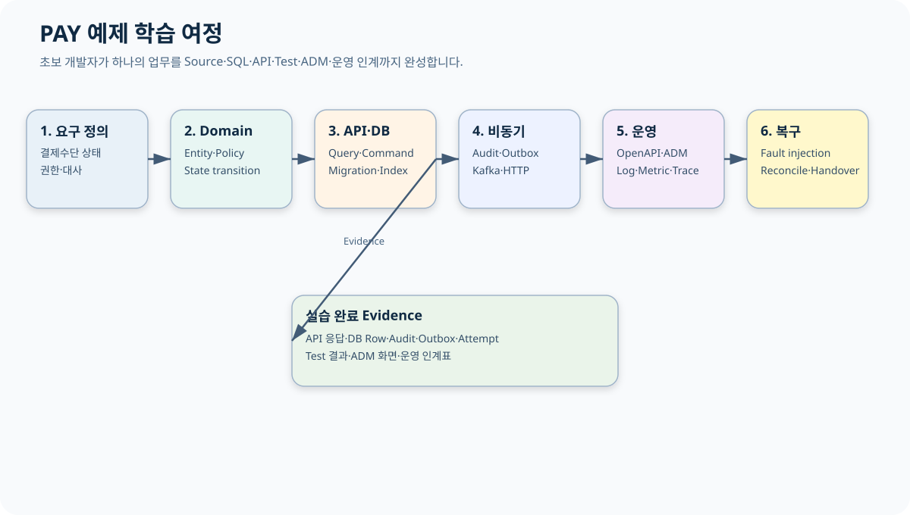
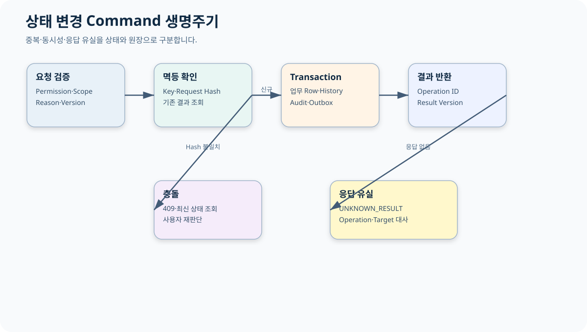
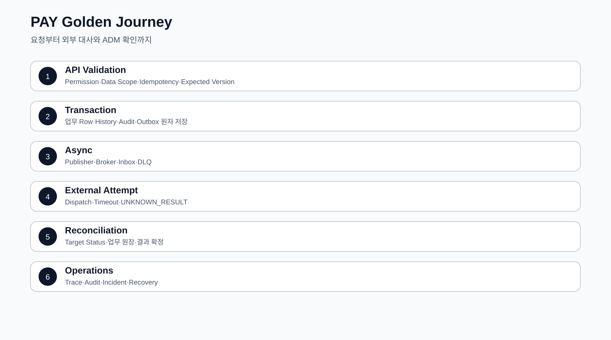

# CPF 개발자 매뉴얼

> 기준 Repository: `https://github.com/freeangelsun/202412_01_CPF`
> 기준 Branch: `master`
> 기준 Commit: `a8be27a34bdac0b7c075e06d6e86571244c96421` (`06_08`)
> 기준일: `2026-08-06 Asia/Seoul`

| 항목 | 내용 |
|---|---|
| 주 독자 | 온라인·연계 업무 개발자, Java/Spring 경험이 많지 않은 신규 개발자 |
| 이 문서로 완료할 일 | PAY 예제를 따라 신규 업무 Domain을 생성하고 Query·Command·DB·Message·외부 연계·보안·Test·ADM·운영 인계까지 만든다. |
| 읽는 방식 | 처음 접하는 독자는 앞에서부터 실습 순서로 읽고, 숙련자는 장별 판단표와 참조 경로를 사용한다. |
| 설명 원칙 | 제품 기능은 사용할 수 있는 상태로 설명한다. 실제 Source·SQL·API·Config·Frontend·Script·Test의 이름과 경계를 유지한다. |




## 1. 학습 목표와 준비

이 매뉴얼은 CPF 내부 구현을 설명하는 Reference가 아니다. 예제 업무 `PAY`를 책의 한 프로젝트처럼 따라 하며 다음 결과를 만든다.

- 결제수단 목록·상세 Query API
- 결제수단 등록·정지·재개 Command API
- 업무 Row·History·Audit·Idempotency·Outbox
- Kafka 후속 Event와 외부기관 HTTP Attempt
- 응답 유실 `UNKNOWN_RESULT` 대사
- OpenAPI·Generated Client·ADM 연동 계약
- Unit·Contract·Integration·Fault Test
- 운영 인계표와 복구 판정

### 1.1 선수 지식

Java Record와 Class, HTTP Method와 JSON, SQL의 PK·Index·Transaction, Git diff를 알면 시작할 수 있다. Spring의 세부 AutoConfiguration을 몰라도 예제를 수행할 수 있도록 명령과 결과를 함께 제시한다.

### 1.2 예제 업무

고객은 여러 결제수단을 등록한다. 결제수단 상태는 `PENDING`, `ACTIVE`, `SUSPENDED`, `CLOSED`다. 등록 뒤 외부기관에 계정을 등록하며 응답을 받지 못하면 `UNKNOWN_RESULT`로 보존한다.

| 업무 규칙 | 내용 |
|---|---|
| 상태 Owner | PAY Domain |
| 조회 권한 | `PAY_METHOD_READ` + 고객 Data Scope |
| 상태 변경 권한 | `PAY_METHOD_WRITE` |
| 정지 승인 | 고위험 결제수단은 Approval 필요 |
| 동시성 | `version` Optimistic Lock |
| 중복 | `Idempotency-Key` + Request Hash |
| 외부 대사 Key | `operationId`, `institutionRequestId` |
| 감사 | Actor·Reason·Before/After·Operation |

## 2. 개발 환경과 기준 확인

Repository Root를 `D:\WORK_CPF\202412_01_CPF`로 가정한다.

```powershell
$repo='D:\WORK_CPF\202412_01_CPF'
git -C $repo remote -v
git -C $repo branch --show-current
git -C $repo fetch origin master
git -C $repo rev-parse HEAD
git -C $repo rev-parse origin/master
git -C $repo status --short
java -version
& (Join-Path $repo 'gradlew.bat') --version
```

정상 결과:

- Remote가 `origin`과 CPF Repository를 가리킨다.
- Branch가 작업 기준 Branch와 일치한다.
- Working Tree의 기존 변경을 확인했다.
- Java·Gradle Version은 `gradle/cpf-stack.properties`, Wrapper, BOM 기준과 맞는다.

기존 변경이 있으면 삭제·초기화하지 않는다. 새 Domain 파일과 기존 변경의 경로가 겹치는지 먼저 확인한다.

## 3. Profile과 Capability 선택

PAY는 Browser와 외부 API가 있고 권한·감사가 필요하므로 `secure-api` 또는 `browser-bff`를 시작 Profile로 선택한다. 후속 Event와 외부기관 HTTP를 위해 Kafka·HTTP Capability를 추가한다.

| 선택 | 값 | 이유 |
|---|---|---|
| Profile | `secure-api` | 인증·권한·Audit가 있는 REST API |
| Data | JDBC 또는 MyBatis | 업무 Row·Ledger·Audit 저장 |
| Messaging | Kafka + reliability | Outbox·Inbox·DLQ |
| Integration | HTTP + resilience | 외부기관 등록과 Timeout Budget |
| File | Attachment | 신분 확인 자료가 필요한 경우 |
| Security | Resource Server·Service Identity·Secret | 사용자와 서비스 인증 분리 |
| Operations | Observability·Runtime Control | Trace·Health·운영 조치 |

선택 결과는 Generator Manifest와 `resolved-starter-lock.json`에서 확인한다.

## 4. Generator Dry Run

Repository의 Generator 명령은 실제 Script Parameter를 확인한 뒤 사용한다. 다음은 표준 입력 예다.

```powershell
$repo='D:\WORK_CPF\202412_01_CPF'
pwsh -NoProfile -ExecutionPolicy Bypass -File (Join-Path $repo 'cpf-tools\generator\create-domain.ps1') `
  -DomainName payment `
  -SystemCode PAY `
  -BasePackage com.customer.pay `
  -Profile secure-api `
  -DatabaseVendor postgresql `
  -DryRun
```

Dry Run에서 다음을 읽는다.

1. 생성 Module·Package·Table Prefix.
2. Profile이 해석한 Leaf Starter.
3. DB Vendor Pack과 Migration 경로.
4. 기존 파일 충돌.
5. Generated 영역과 고객 수정 영역.
6. OpenAPI·Test·Manifest 생성 대상.

Dry Run 결과가 승인되면 같은 입력으로 적용하되 `-DryRun`만 제거한다. 생성 경로를 임의 복사해 Package 이름만 바꾸지 않는다.

## 5. PAY Source 구조

```text
pay-domain/
├─ src/main/java/com/customer/pay/
│  ├─ api/
│  │  ├─ PayMethodQueryController.java
│  │  ├─ PayMethodCommandController.java
│  │  └─ dto/
│  ├─ application/
│  │  ├─ query/PayMethodQueryService.java
│  │  ├─ command/PayMethodCommandService.java
│  │  └─ port/
│  ├─ domain/
│  │  ├─ PayMethod.java
│  │  ├─ PayMethodStatus.java
│  │  └─ PayMethodPolicy.java
│  ├─ persistence/
│  │  ├─ PayMethodRepository.java
│  │  ├─ PayIdempotencyRepository.java
│  │  └─ PayAttemptRepository.java
│  ├─ messaging/
│  └─ integration/
├─ src/main/resources/
│  ├─ db/{mariadb,postgresql,oracle}/
│  └─ cpf-sql/pay/
└─ src/test/
```

### 5.1 계층별 책임

| 계층 | 담당 | 넣지 않는 것 |
|---|---|---|
| API | HTTP, 입력 형식, 인증 Context | DB Query, 상태 전이 규칙 |
| Application | Use Case, Transaction, Permission, Idempotency | Provider SDK Type |
| Domain | 상태·금액·정책 불변식 | HTTP·DB·Kafka 세부 구현 |
| Persistence | Query·Version·Ledger·Migration | 화면 권한 판정 |
| Adapter | HTTP·Kafka·SFTP 등 Provider 연결 | 업무 상태 Owner 역할 |

## 6. Domain 상태 모델

```java
public enum PayMethodStatus {
    PENDING,
    ACTIVE,
    SUSPENDED,
    CLOSED
}
```

```java
public final class PayMethod {
    private final String methodId;
    private PayMethodStatus status;
    private long version;

    public void suspend(long expectedVersion) {
        requireVersion(expectedVersion);
        if (status != PayMethodStatus.ACTIVE) {
            throw new IllegalStateException("ACTIVE 상태만 정지할 수 있습니다.");
        }
        status = PayMethodStatus.SUSPENDED;
        version++;
    }

    public void resume(long expectedVersion) {
        requireVersion(expectedVersion);
        if (status != PayMethodStatus.SUSPENDED) {
            throw new IllegalStateException("SUSPENDED 상태만 재개할 수 있습니다.");
        }
        status = PayMethodStatus.ACTIVE;
        version++;
    }

    private void requireVersion(long expectedVersion) {
        if (version != expectedVersion) {
            throw new PayVersionConflictException(methodId, expectedVersion, version);
        }
    }
}
```

Domain Test는 Spring Context 없이 실행한다.

```java
@Test
void active_method_can_be_suspended() {
    PayMethod method = fixture(PayMethodStatus.ACTIVE, 3L);
    method.suspend(3L);
    assertThat(method.status()).isEqualTo(PayMethodStatus.SUSPENDED);
    assertThat(method.version()).isEqualTo(4L);
}
```

금지 전이와 Version 충돌도 Test한다.

## 7. DB Schema와 Migration

### 7.1 논리 Table

| Table | 목적 | 핵심 Key |
|---|---|---|
| `PAY_METHOD` | 결제수단 현재 상태 | `METHOD_ID`, `VERSION` |
| `PAY_METHOD_HISTORY` | 상태 변경 이력 | `HISTORY_ID`, `METHOD_ID` |
| `PAY_IDEMPOTENCY` | 요청 Key·Hash·결과 Snapshot | `IDEMPOTENCY_KEY` |
| `PAY_OUTBOX` | Commit 뒤 발행할 Event | `EVENT_ID`, `STATUS` |
| `PAY_INSTITUTION_ATTEMPT` | 외부기관 요청·응답·불명 결과 | `ATTEMPT_ID`, `OPERATION_ID` |
| `PAY_AUDIT` | Actor·Reason·Before/After | `AUDIT_ID`, `OPERATION_ID` |

### 7.2 PostgreSQL 예제

```sql
create table pay_method (
    method_id varchar(40) primary key,
    customer_id varchar(40) not null,
    method_type varchar(30) not null,
    masked_account varchar(120) not null,
    status varchar(20) not null,
    version bigint not null,
    created_at timestamp with time zone not null,
    updated_at timestamp with time zone not null,
    constraint ck_pay_method_status
        check (status in ('PENDING','ACTIVE','SUSPENDED','CLOSED'))
);

create index ix_pay_method_customer_status
    on pay_method(customer_id, status, method_id);
```

MariaDB와 Oracle Script는 같은 Column 의미, 상태 Constraint, Index 목적을 유지하되 Vendor 문법을 분리한다. 하나의 Vendor만 변경하지 않는다.

### 7.3 Optimistic Update

```sql
update pay_method
   set status = :target_status,
       version = version + 1,
       updated_at = :now
 where method_id = :method_id
   and version = :expected_version
```

영향 건수가 0이면 Row 없음과 Version 충돌을 구분해 재조회한다.

## 8. Query API

### 8.1 DTO

```java
public record PayMethodCriteria(
    String customerId,
    PayMethodStatus status,
    int size,
    String cursor,
    String sort) {

    public PayMethodCriteria {
        if (customerId == null || customerId.isBlank()) {
            throw new IllegalArgumentException("customerId is required");
        }
        if (size < 1 || size > 200) {
            throw new IllegalArgumentException("size must be between 1 and 200");
        }
    }
}

public record PayMethodView(
    String methodId,
    String maskedAccount,
    PayMethodStatus status,
    long version,
    Instant updatedAt) {}
```

### 8.2 Controller

```java
@GetMapping("/api/pay/methods")
PayMethodPage findMethods(
        @Valid PayMethodCriteria criteria,
        CpfSecurityContext actor) {
    return queryService.find(criteria, actor);
}
```

Query Service가 할 일:

1. Actor의 고객 Data Scope를 Criteria에 적용한다.
2. Sort whitelist를 검증한다.
3. 안정된 Cursor Key를 사용한다.
4. Repository 결과를 Masking 정책으로 변환한다.
5. 기준시각과 Source Owner를 응답에 포함한다.

### 8.3 Negative Test

- 허용하지 않은 Sort 이름.
- 최대 Page 크기 초과.
- 다른 고객의 `customerId` 조회.
- 잘못된 Cursor Encoding.
- 상세 조회 Row의 Masking 누락.
- Owner Query Timeout.

## 9. Command API



### 9.1 입력

```java
public record ChangePayMethodStatusCommand(
    String methodId,
    PayMethodStatus targetStatus,
    long expectedVersion,
    String idempotencyKey,
    String reason) {}
```

`reason`은 “처리”, “확인”처럼 의미 없는 값이 아니라 업무 판단 근거를 남긴다. 길이·제어문자·민감정보 포함 여부를 검증한다.

### 9.2 Application Service 예제

```java
@Transactional
public PayOperationResult suspend(
        ChangePayMethodStatusCommand command,
        CpfSecurityContext actor) {

    permission.require(actor, "PAY_METHOD_WRITE", command.methodId());
    String requestHash = requestHasher.hash(command);

    var replay = idempotency.find(command.idempotencyKey());
    if (replay.isPresent()) {
        return replay.get().sameHashOrThrow(requestHash).result();
    }

    PayMethod method = repository.getRequired(command.methodId());
    PayMethodSnapshot before = method.snapshot();
    method.suspend(command.expectedVersion());

    String operationId = operationIds.next("PAY-SUSPEND");
    repository.update(method);
    history.append(method, operationId);
    audit.append(actor, command.reason(), before, method.snapshot(), operationId);
    outbox.append(PayMethodSuspended.from(method, operationId));

    PayOperationResult result = PayOperationResult.succeeded(operationId, method);
    idempotency.save(command.idempotencyKey(), requestHash, result);
    return result;
}
```

Transaction 안에는 업무 Row·History·Audit·Outbox·Idempotency Result를 넣는다. 외부기관 HTTP 호출은 이 Transaction 안에서 실행하지 않는다.

### 9.3 API 응답

```json
{
  "operationId": "PAY-SUSPEND-20260806-000041",
  "methodId": "PM-000123",
  "previousStatus": "ACTIVE",
  "status": "SUSPENDED",
  "resultVersion": 8,
  "replayed": false,
  "auditId": "AUD-000991"
}
```

응답을 잃은 Client는 같은 Idempotency Key로 재조회한다. 같은 Key에 다른 Payload를 보내면 Conflict다.

## 10. 오류 응답 계약

| HTTP | 오류 | 의미 | Client 행동 |
|---:|---|---|---|
| 400 | `CPF-VALIDATION` | 형식·범위 오류 | 입력 수정 |
| 401 | `CPF-AUTHENTICATION` | 인증 없음·만료 | 재인증 |
| 403 | `CPF-FORBIDDEN` | Permission·Data Scope 거부 | 권한 요청 또는 대상 축소 |
| 404 | `PAY-METHOD-NOT-FOUND` | 대상 없음 | ID 재확인 |
| 409 | `PAY-VERSION-CONFLICT` | 최신 Version과 불일치 | 최신 Row 비교 후 새 요청 |
| 409 | `CPF-IDEMPOTENCY-CONFLICT` | 같은 Key·다른 Hash | 새 Key로 새 의도 제출 |
| 504 | `CPF-TIMEOUT` | Dispatch 전 Timeout | 상태 확인 후 재시도 판단 |
| 202 | `UNKNOWN_RESULT` | Dispatch 뒤 결과 불명 | Operation 조회·대사 |

오류 응답에는 Error Code, Message, Transaction ID, Operation ID, Retry 가능 여부를 포함한다. Stack Trace와 Secret은 노출하지 않는다.

## 11. Outbox·Kafka·Inbox

### 11.1 Event

```java
public record PayMethodSuspended(
    String eventId,
    String operationId,
    String methodId,
    long version,
    Instant occurredAt) {}
```

### 11.2 Producer 흐름

1. 업무 Transaction에서 Outbox Row를 `READY`로 저장한다.
2. Publisher가 Lease를 확보한다.
3. Kafka Record Key로 `methodId` 또는 순서가 필요한 업무 Key를 사용한다.
4. Publish 결과와 Attempt를 저장한다.
5. Confirm 뒤 Outbox를 `PUBLISHED`로 바꾼다.
6. Process가 종료되면 Lease 만료 뒤 다른 Instance가 재개한다.

### 11.3 Consumer 흐름

1. Event ID·Consumer ID로 Inbox를 확보한다.
2. 이미 `SUCCEEDED`면 ACK하고 업무를 반복하지 않는다.
3. 업무 Transaction을 수행한다.
4. Inbox 결과를 `SUCCEEDED`로 저장한다.
5. Commit 뒤 ACK한다.
6. Poison은 DLQ로 보내고 운영 Replay를 사용한다.

### 11.4 Fault Test

- Outbox 저장 뒤 Publisher 종료.
- Broker Publish 뒤 Confirm 저장 전 종료.
- Consumer 업무 Commit 뒤 ACK 전 종료.
- 같은 Event 중복 Delivery.
- Schema Version 불일치.
- DLQ Replay 중 같은 Payload 중복.

## 12. 외부기관 HTTP와 결과 불명

### 12.1 Port

```java
public interface PayInstitutionPort {
    InstitutionRegistrationResult register(
        InstitutionRegistrationRequest request,
        CpfDeadline deadline,
        CpfServiceIdentity identity);

    InstitutionRegistrationStatus findStatus(String institutionRequestId);
}
```

### 12.2 Attempt 저장

외부 전송 전에 다음을 저장한다.

- Operation ID
- Attempt 번호
- Target ID와 URI 식별자
- 업무 Key
- Payload Hash
- Idempotency Key
- Deadline
- Request 시각

### 12.3 상태 분류

| 실패 지점 | 상태 | 행동 |
|---|---|---|
| DNS·Connection 전 실패 | `FAILED` | 정책이 허용하면 새 Attempt |
| Request 전송 중 연결 종료 | `UNKNOWN_RESULT` 가능 | Target 조회로 접수 여부 확인 |
| Target 4xx | `FAILED` | 입력·권한 수정, 동일 Blind Retry 금지 |
| Target 5xx 명시 | 정책에 따른 `FAILED` | 멱등성·조회 경로 확인 후 Retry |
| Target 처리 후 응답 유실 | `UNKNOWN_RESULT` | 기관 접수 ID·업무 Key 대사 |
| 여러 기관 중 일부 성공 | `PARTIAL` | 성공 기관 보존, 실패 기관만 조치 |

### 12.4 WireMock Fault 예

```java
stubFor(post(urlEqualTo("/institution/methods"))
    .willReturn(aResponse().withFixedDelay(8_000).withStatus(201)));
```

Client Timeout을 3초로 두면 Target은 접수했지만 Client는 응답을 받지 못하는 상황을 재현할 수 있다. Test는 Operation을 `UNKNOWN_RESULT`로 저장하고 `findStatus` 대사 뒤 `SUCCEEDED`로 종결되는지 확인한다.

## 13. Local·Remote 동일 계약

```java
public interface PayMethodOwnerPort {
    PayMethodPage find(PayMethodCriteria criteria, CpfSecurityContext actor);
    PayOperationResult suspend(ChangePayMethodStatusCommand command, CpfSecurityContext actor);
}
```

Local Adapter와 Remote Adapter는 같은 Port를 구현한다.

| 항목 | Local | Remote |
|---|---|---|
| DTO·Validation | 동일 | 동일 |
| 업무 Error | 동일 | HTTP/Serialization Mapping 추가 |
| Permission | 동일 의미 | Identity·Audience 전달 |
| Transaction | Same-JVM 경계 | 분리 Transaction, Attempt 필요 |
| Timeout | 내부 Deadline | Network·Queue 포함 |
| Test | Port Contract Fixture | 같은 Fixture + Network Fault |

업무 코드는 Adapter 구현을 직접 참조하지 않는다.

## 14. OpenAPI WebMVC

`06_06` 이후 `cpf.openapi.webmvc` 설정은 Web API의 OpenAPI Snapshot과 운영 상태를 제공한다.

| Property | Type | Default | 설명 |
|---|---|---:|---|
| `cpf.openapi.webmvc.enabled` | Boolean | `true` | OpenAPI 기능 활성화 |
| `cpf.openapi.webmvc.api-docs-enabled` | Boolean | `false` | API Docs Endpoint 노출 |
| `cpf.openapi.webmvc.management-enabled` | Boolean | `true` | 관리 기능 노출 |
| `cpf.openapi.webmvc.api-docs-path` | Path | `/v3/api-docs` | `..` 없는 절대 Path |
| `cpf.openapi.webmvc.title` | String | `CPF API` | 문서 제목 |
| `cpf.openapi.webmvc.version` | String | `unspecified` | API Version |
| `cpf.openapi.webmvc.instance-id` | String | `local` | Snapshot Instance |
| `cpf.openapi.webmvc.minimum-refresh-interval` | Duration | `1s` | Refresh 최소 간격 |

Operation ID는 Controller, OpenAPI, Generated Client, ADM Route, Permission, Audit를 연결한다. 중복 Operation ID와 Schema Drift는 Build Gate에서 차단한다.

## 15. Security·Data Scope·Masking

### 15.1 사용자와 서비스 Identity

- Browser/User 요청: 사용자 Subject, Role, Session, MFA 상태.
- Service 호출: Service ID, Audience, Credential Version.
- 사용자 Token을 서비스 장기 Credential로 재사용하지 않는다.

### 15.2 Permission 판정

```java
permission.require(actor, "PAY_METHOD_WRITE", methodId);
dataScope.requireCustomer(actor, customerId);
```

Frontend Button 숨김만으로 보호하지 않는다. Controller와 Application Service에서 다시 판정한다.

### 15.3 Field 암호화

Field마다 분류, Masking, 검색 필요 여부, Key Version을 정한다. 검색이 필요한 값은 암호문과 Search Token을 구분한다. 복호화는 Actor·Reason을 감사에 남긴다.

## 16. Attachment 예제

### 16.1 처리 순서

1. Upload Session 발급.
2. Size·MIME·File Name 검증.
3. Temp Object 저장.
4. Checksum 계산.
5. Malware Scan.
6. 성공 시 Final Object Key로 전환.
7. Metadata·Scan Result·Audit 저장.
8. Download Permission과 Retention 적용.

### 16.2 상태

`UPLOADING → RECEIVED → SCANNING → AVAILABLE`이며 Scan 실패는 `QUARANTINED`다. Object Store 저장 성공과 Metadata Commit 사이에 Process가 종료되면 Checksum·Object Key로 대사한다.

## 17. 데이터 품질 격리·정정·Replay

`CpfDataQualityOperations`를 사용해 Rule Version과 위반을 기록한다. `ERROR` 또는 `CRITICAL` 위반은 정상 원장 반영을 중단하고 Quarantine Item을 만든다.

ADM 통합 정정 흐름은 다음 계약을 사용한다.

1. Quarantine ID, Expected Version, Reason, Corrected JSON으로 승인 요청.
2. Server가 정정 Payload Snapshot을 고정.
3. 승인 결정.
4. 실행 시 Approval ID와 Reason만 전달.
5. Owner가 Version과 Snapshot을 다시 검증.
6. 결과를 `CORRECTED` 또는 오류 상태로 기록.
7. Replay 성공 시 `REPLAYED`로 종결.

Client가 `approved=true`를 Body에 넣어 승인을 우회하는 방식은 사용하지 않는다.

## 18. 시간·Deadline

UTC와 업무 Zone을 분리한다. 한국 영업일은 `Asia/Seoul`을 사용하되 DB에는 UTC 시각과 업무일자를 각각 저장한다. Timeout은 wall clock 차감보다 Deadline·monotonic time을 사용한다.

Test에서는 고정 Clock으로 자정, 영업일 전환, 만료, Clock rollback을 재현한다.

## 19. Test 전략

| 층 | 정상 Test | 오류·경계 | 복구 Test |
|---|---|---|---|
| Domain | 허용 상태 전이 | 금지 전이·금액 경계 | 불변식 유지 |
| Application | Use Case·Transaction | Version·Permission·Idempotency | Replay·Compensation |
| Persistence | CRUD·Index·Migration | Deadlock·Constraint·Vendor 차이 | Rollback·Forward recovery |
| API | Contract·OpenAPI | 400·401·403·404·409 | 같은 Key 결과 조회 |
| Messaging | Publish·Consume | Duplicate·Poison·Kill | Inbox·DLQ Replay |
| HTTP | 2xx·4xx·5xx | Timeout·TLS·응답 유실 | Attempt Reconcile |
| Browser | Field·Button·상태 | Permission·Timeout | Retry·Reconcile UI |

### 19.1 실행 예

```powershell
$repo='D:\WORK_CPF\202412_01_CPF'
& (Join-Path $repo 'gradlew.bat') :pay-domain:test --tests '*PayMethod*' --stacktrace
```

실제 Module 이름은 생성 Manifest를 따른다.

## 20. Fault Injection 실습

### 실습 A — 중복 요청

1. 같은 Idempotency Key와 같은 Body를 두 번 보낸다.
2. 두 번째 응답의 `replayed=true`를 확인한다.
3. 업무 Row·History·Audit·Outbox가 한 번만 생성됐는지 확인한다.

### 실습 B — Version 충돌

1. Version 7 Row를 두 사용자가 읽는다.
2. A가 정지해 Version 8을 만든다.
3. B가 Expected Version 7로 재개한다.
4. 409와 최신 Version 8을 확인한다.

### 실습 C — Consumer Kill

1. Consumer가 업무 Commit 뒤 ACK 전에 종료되도록 Fault Point를 둔다.
2. Broker가 같은 Event를 재전달한다.
3. Inbox가 기존 결과를 반환하고 업무 Row가 중복되지 않는지 확인한다.

### 실습 D — HTTP 응답 유실

1. Target은 접수하지만 Client Timeout을 발생시킨다.
2. Attempt가 `UNKNOWN_RESULT`인지 확인한다.
3. Target Status API로 결과를 조회한다.
4. 같은 원본 Attempt를 수정하지 않고 Reconciliation Decision을 추가한다.

## 21. ADM 확인

개발자는 다음 Route에서 결과를 찾을 수 있어야 한다.

- `/transactions`: 온라인 거래 정의와 상태.
- `/transactionGroups`: Transaction·Trace Timeline.
- `/logs`: 요청·응답·Error.
- `/auditLogs`: Actor·Reason·Before/After.
- `/reliability`: Outbox·Inbox·Idempotency·Unknown.
- `/incidents`: 미종결 오류와 운영 조치.
- `/integrationClosure`: 데이터 품질 정정 승인·Replay, Webhook DLQ, Crypto·Time 상태.
- `/openApiOperations`: OpenAPI 상태와 Refresh.

## 22. 운영 인계표

| 항목 | PAY 예 |
|---|---|
| Owner | PAY Domain |
| Consumer | Browser·ADM·Kafka Consumer·기관 Adapter |
| API | `/api/pay/methods`, 상태 변경 Command |
| Table | `PAY_METHOD`, History, Idempotency, Outbox, Attempt, Audit |
| Topic | `pay.method.changed.v1` |
| 외부 Target | 기관 등록 API와 Status 조회 API |
| 상태 | PENDING·ACTIVE·SUSPENDED·CLOSED·UNKNOWN_RESULT |
| 대사 Key | Operation ID·Institution Request ID·Payload Hash |
| Alert | Outbox Lag·Unknown Age·DLQ·HTTP Error Rate |
| 복구 | Replay·Reconcile·Compensation·Rollback 조건 |
| 배포 영향 | Migration·Config·Secret·Restart 여부 |
| Rollback | 이전 Artifact·Schema 호환·Event Version |

## 23. 고객 업무로 바꾸는 부분

고객이 바꾸는 것:

- Domain 이름과 상태.
- Field와 Validation.
- Permission·Data Scope.
- 외부기관 SLA와 대사 규칙.
- Event Schema와 업무 Key.
- Alert 임계치와 승인 정책.

CPF 계약으로 유지할 것:

- Context·Error·식별자.
- Public API/SPI/Internal 경계.
- Idempotency·Attempt·Audit 구조.
- Generated Client와 OpenAPI Source.
- Migration·3 Vendor·Test·운영 인계 형식.

## 24. 개발자 자체 검수

1. 업무 결과와 Owner를 한 문장으로 설명할 수 있는가?
2. Query와 Command가 분리됐는가?
3. Public 계약에 Provider SDK Type이 없는가?
4. 상태 변경에 Version·Reason·Idempotency가 있는가?
5. 업무 Row·History·Audit·Outbox가 같은 Transaction인가?
6. 응답 유실을 `FAILED`와 구분하는가?
7. Local·Remote가 같은 Contract Fixture를 통과하는가?
8. 3개 DB Vendor의 논리 계약이 같은가?
9. OpenAPI·Generated Client·ADM Route가 연결되는가?
10. 정상·중복·동시성·Timeout·Process Kill·부분 실패를 재현했는가?
11. ADM에서 Operation과 Audit를 찾을 수 있는가?
12. 운영 인계표만 읽고 다음 담당자가 복구할 수 있는가?

<!-- CPF_R10_QUALITY_EXPANSION -->



## 부록 A. PAY 예제 전체 연결 Source

이 부록은 앞 장의 부분 코드를 한 흐름으로 연결한다. Package와 Class 이름은 고객 업무 예제이며, CPF의 Public API·SPI·Generated 영역을 임의 수정하지 않는다.

### A.1 요청·응답 DTO

```java
package com.customer.pay.api.dto;

import jakarta.validation.constraints.NotBlank;
import jakarta.validation.constraints.NotNull;
import jakarta.validation.constraints.Positive;
import java.time.Instant;

public record RegisterPayMethodRequest(
        @NotBlank String customerId,
        @NotBlank String providerCode,
        @NotBlank String accountToken,
        @NotBlank String reason) {}

public record ChangePayMethodStatusRequest(
        @Positive long expectedVersion,
        @NotBlank String reason) {}

public record PayMethodResponse(
        String methodId,
        String customerId,
        String providerCode,
        String maskedAccount,
        PayMethodStatus status,
        long version,
        String operationId,
        Instant updatedAt) {}
```

### A.2 Command Controller

```java
package com.customer.pay.api;

import com.customer.pay.api.dto.ChangePayMethodStatusRequest;
import com.customer.pay.api.dto.PayMethodResponse;
import com.customer.pay.api.dto.RegisterPayMethodRequest;
import com.customer.pay.application.PayMethodCommandService;
import jakarta.validation.Valid;
import org.springframework.http.ResponseEntity;
import org.springframework.web.bind.annotation.*;

@RestController
@RequestMapping("/api/pay/methods")
public final class PayMethodCommandController {
    private final PayMethodCommandService service;

    public PayMethodCommandController(PayMethodCommandService service) {
        this.service = service;
    }

    @PostMapping
    public ResponseEntity<PayMethodResponse> register(
            @RequestHeader("Idempotency-Key") String idempotencyKey,
            @Valid @RequestBody RegisterPayMethodRequest request) {
        return ResponseEntity.ok(service.register(idempotencyKey, request));
    }

    @PostMapping("/{methodId}/suspend")
    public ResponseEntity<PayMethodResponse> suspend(
            @PathVariable String methodId,
            @RequestHeader("Idempotency-Key") String idempotencyKey,
            @Valid @RequestBody ChangePayMethodStatusRequest request) {
        return ResponseEntity.ok(service.suspend(methodId, idempotencyKey, request));
    }

    @PostMapping("/{methodId}/resume")
    public ResponseEntity<PayMethodResponse> resume(
            @PathVariable String methodId,
            @RequestHeader("Idempotency-Key") String idempotencyKey,
            @Valid @RequestBody ChangePayMethodStatusRequest request) {
        return ResponseEntity.ok(service.resume(methodId, idempotencyKey, request));
    }
}
```

### A.3 Application Service의 처리 순서

```java
@Transactional
public PayMethodResponse suspend(
        String methodId,
        String idempotencyKey,
        ChangePayMethodStatusRequest request) {
    CommandFingerprint fingerprint = fingerprintFactory.create(
            "PAY_METHOD_SUSPEND", methodId, request);

    return idempotencyRepository.execute(
            idempotencyKey,
            fingerprint,
            () -> {
                actorPermission.require("PAY_METHOD_WRITE", methodId);
                PayMethod current = repository.getForUpdate(methodId);
                PayMethod before = current.snapshot();
                current.suspend(request.expectedVersion());
                repository.update(current);
                historyRepository.append(before, current, request.reason());
                auditRepository.append(AuditEntry.of(
                        operationContext.operationId(),
                        actorContext.actorId(),
                        "PAY_METHOD_SUSPEND",
                        methodId,
                        request.reason(),
                        before,
                        current));
                outboxRepository.append(PayMethodChangedEvent.from(current));
                return mapper.toResponse(current, operationContext.operationId());
            });
}
```

처리 순서를 바꾸지 않는다. Permission과 Version 검증 전에 외부 호출을 보내지 않고, 업무 Row·History·Audit·Outbox가 같은 Transaction에서 Commit되도록 한다.

### A.4 JDBC Optimistic Update

```sql
UPDATE PAY_METHOD
   SET STATUS = :status,
       VERSION = VERSION + 1,
       UPDATED_AT = :updatedAt,
       UPDATED_BY = :updatedBy
 WHERE METHOD_ID = :methodId
   AND VERSION = :expectedVersion;
```

Update Count가 `0`이면 존재하지 않음과 Version 충돌을 구분해 조회한다. 현재 Version을 응답에 포함하되 민감 Field는 Masking한다.

### A.5 Outbox Publisher

```java
public int publishBatch(int limit) {
    List<OutboxRecord> claimed = outboxRepository.claim(
            publisherId, fencingTokenProvider.current(), limit);
    int published = 0;
    for (OutboxRecord record : claimed) {
        try {
            brokerPort.publish(record.topic(), record.key(), record.payload(), record.headers());
            outboxRepository.markPublished(record.id(), record.version(), clock.instant());
            published++;
        } catch (RetryableBrokerException retryable) {
            outboxRepository.markRetry(record.id(), retryable.code(), retryPolicy.next(record.attempt()));
        } catch (Exception permanent) {
            outboxRepository.moveToDlq(record.id(), permanent.getClass().getSimpleName());
        }
    }
    return published;
}
```

### A.6 Inbox Consumer

```java
@Transactional
public void onPayMethodChanged(PayMethodChangedEvent event) {
    InboxResult existing = inboxRepository.find(consumerId, event.eventId());
    if (existing != null) {
        return;
    }
    notificationProjection.apply(event);
    inboxRepository.insert(consumerId, event.eventId(), event.payloadHash(), clock.instant());
}
```

업무 반영과 Inbox 기록이 같은 Transaction이어야 한다. ACK는 Transaction Commit 이후 수행한다.

### A.7 외부기관 Attempt와 결과 불명

```java
public InstitutionRegistrationResult registerAtInstitution(PayMethod method) {
    ExternalAttempt attempt = attemptRepository.start(
            operationContext.operationId(),
            method.methodId(),
            payloadHasher.hash(method),
            deadline.remaining());
    try {
        InstitutionResponse response = institutionPort.register(attempt.requestId(), method);
        return attemptRepository.complete(attempt.id(), response.trackingId(), response.status());
    } catch (ReadTimeoutAfterDispatch timeout) {
        attemptRepository.markUnknown(attempt.id(), timeout.getMessage());
        return InstitutionRegistrationResult.unknown(attempt.operationId());
    } catch (ConnectFailureBeforeDispatch notSent) {
        attemptRepository.markFailed(attempt.id(), notSent.getMessage());
        throw notSent;
    }
}
```

`ReadTimeoutAfterDispatch`는 실패로 확정하지 않는다. 기관 Tracking ID 또는 업무 Key로 상태조회한 뒤 Reconciliation Decision을 새 Row로 남긴다.

### A.8 Error Response

```json
{
  "code": "PAY_VERSION_CONFLICT",
  "message": "다른 사용자가 먼저 변경했습니다.",
  "transactionId": "TX-20260806-000001",
  "operationId": "OP-20260806-000031",
  "details": {
    "methodId": "PM-1001",
    "expectedVersion": 7,
    "currentVersion": 8
  }
}
```

### A.9 통합 Test 시나리오

```java
@Test
void response_loss_is_reconciled_without_duplicate_registration() {
    String key = "idem-pay-register-001";
    institution.stubAcceptedThenTimeout("REQ-001", "TRACK-777");

    PayMethodResponse first = client.register(key, request());
    assertThat(first.status()).isEqualTo(PayMethodStatus.UNKNOWN_RESULT);

    institution.stubStatus("TRACK-777", "COMPLETED");
    reconciliationJob.run(first.operationId());

    PayMethodResponse resolved = client.get(first.methodId());
    assertThat(resolved.status()).isEqualTo(PayMethodStatus.ACTIVE);
    assertThat(institution.registrationCount("REQ-001")).isEqualTo(1);
    assertThat(attemptRepository.history(first.operationId()))
            .extracting(ExternalAttempt::status)
            .containsExactly(AttemptStatus.UNKNOWN_RESULT, AttemptStatus.COMPLETED);
}
```


## 부록 B. 온라인·공통·외부 연계 EDU 45개

온라인 EDU는 요청 준비부터 API·DB·Message·외부 Attempt의 정상 결과를 확인한 뒤, 중복·동시성·Timeout·응답 유실을 재현하고 복구한다. 적용할 때는 기준 Commit의 Public API와 Test 경로를 다시 대조한다.

### EDU-ONL-01 — Generator Dry Run과 충돌 검토

| 항목 | 수행 내용 |
|---|---|
| 학습 결과 | Generator Dry Run과 충돌 검토의 선택 기준과 정상·실패·복구 의미를 설명하고 직접 판정한다. |
| Repository 확인 위치 | `cpf-tools/generator` 및 실제 Consumer·Test·Config |
| 주요 입력 | DomainName·SystemCode·Profile·DB Vendor |
| 실행 순서 | Fixture 준비 → 정상 실행 → 원장·로그·Trace·Audit 확인 → 장애 주입 → 복구 실행 → 재검증 |
| 정상 판정 | 생성 경로·Starter Lock·충돌 목록 확인 |
| 장애 재현 | 기존 파일 충돌·지원하지 않는 조합 |
| 복구 판정 | Dry Run 결과를 수정하고 적용 전 diff를 재검토 |
| 운영 확인 | /configs |
| 고객 업무 전환 | 예제 ID·상태·Permission·SLA만 고객 값으로 바꾸고 Idempotency·Version·Audit·복구 계약은 유지 |

### EDU-ONL-02 — secure-api Profile 조립

| 항목 | 수행 내용 |
|---|---|
| 학습 결과 | secure-api Profile 조립의 선택 기준과 정상·실패·복구 의미를 설명하고 직접 판정한다. |
| Repository 확인 위치 | `cpf-starters/profiles/secure-api` 및 실제 Consumer·Test·Config |
| 주요 입력 | Resource Server·Audit·Persistence 선택 |
| 실행 순서 | Fixture 준비 → 정상 실행 → 원장·로그·Trace·Audit 확인 → 장애 주입 → 복구 실행 → 재검증 |
| 정상 판정 | 선택 Starter만 Classpath·Health에 나타남 |
| 장애 재현 | 선택하지 않은 Provider Bean 유입 |
| 복구 판정 | Resolved Lock과 dependencyInsight로 원인을 제거 |
| 운영 확인 | /openApiOperations |
| 고객 업무 전환 | 예제 ID·상태·Permission·SLA만 고객 값으로 바꾸고 Idempotency·Version·Audit·복구 계약은 유지 |

### EDU-ONL-03 — 조건 검색과 Paging

| 항목 | 수행 내용 |
|---|---|
| 학습 결과 | 조건 검색과 Paging의 선택 기준과 정상·실패·복구 의미를 설명하고 직접 판정한다. |
| Repository 확인 위치 | `cpf-reference 온라인 EDU` 및 실제 Consumer·Test·Config |
| 주요 입력 | 검색 Field·Page·Size·Sort |
| 실행 순서 | Fixture 준비 → 정상 실행 → 원장·로그·Trace·Audit 확인 → 장애 주입 → 복구 실행 → 재검증 |
| 정상 판정 | 허용 Sort와 Data Scope가 적용된 Page 응답 |
| 장애 재현 | 허용되지 않은 Sort·과대 Page |
| 복구 판정 | 400으로 차단하고 최대 Page Size를 유지 |
| 운영 확인 | /transactions |
| 고객 업무 전환 | 예제 ID·상태·Permission·SLA만 고객 값으로 바꾸고 Idempotency·Version·Audit·복구 계약은 유지 |

### EDU-ONL-04 — 상세 조회와 Masking

| 항목 | 수행 내용 |
|---|---|
| 학습 결과 | 상세 조회와 Masking의 선택 기준과 정상·실패·복구 의미를 설명하고 직접 판정한다. |
| Repository 확인 위치 | `cpf-reference 온라인 EDU` 및 실제 Consumer·Test·Config |
| 주요 입력 | Business ID·Actor·Data Scope |
| 실행 순서 | Fixture 준비 → 정상 실행 → 원장·로그·Trace·Audit 확인 → 장애 주입 → 복구 실행 → 재검증 |
| 정상 판정 | 권한별 Masking 결과와 조회 Audit |
| 장애 재현 | 타 조직 ID·원문 민감값 조회 |
| 복구 판정 | 403 또는 Masked 응답, Audit로 시도 확인 |
| 운영 확인 | /auditLogs |
| 고객 업무 전환 | 예제 ID·상태·Permission·SLA만 고객 값으로 바꾸고 Idempotency·Version·Audit·복구 계약은 유지 |

### EDU-ONL-05 — Versioned 상태 변경

| 항목 | 수행 내용 |
|---|---|
| 학습 결과 | Versioned 상태 변경의 선택 기준과 정상·실패·복구 의미를 설명하고 직접 판정한다. |
| Repository 확인 위치 | `cpf-reference 온라인 EDU` 및 실제 Consumer·Test·Config |
| 주요 입력 | expectedVersion·reason·command body |
| 실행 순서 | Fixture 준비 → 정상 실행 → 원장·로그·Trace·Audit 확인 → 장애 주입 → 복구 실행 → 재검증 |
| 정상 판정 | 상태·Version·History·Audit가 한 Transaction으로 변경 |
| 장애 재현 | 오래된 Version |
| 복구 판정 | 409와 현재 Version 반환 후 사용자가 재판단 |
| 운영 확인 | /transactionGroups |
| 고객 업무 전환 | 예제 ID·상태·Permission·SLA만 고객 값으로 바꾸고 Idempotency·Version·Audit·복구 계약은 유지 |

### EDU-ONL-06 — Idempotency 동일 요청 재호출

| 항목 | 수행 내용 |
|---|---|
| 학습 결과 | Idempotency 동일 요청 재호출의 선택 기준과 정상·실패·복구 의미를 설명하고 직접 판정한다. |
| Repository 확인 위치 | `cpf-reference reliability EDU` 및 실제 Consumer·Test·Config |
| 주요 입력 | Idempotency-Key·Request Hash |
| 실행 순서 | Fixture 준비 → 정상 실행 → 원장·로그·Trace·Audit 확인 → 장애 주입 → 복구 실행 → 재검증 |
| 정상 판정 | 원본 결과를 반환하고 부작용 1회 |
| 장애 재현 | 응답 유실 뒤 같은 요청 재호출 |
| 복구 판정 | 원본 Operation 결과 조회, 새 Row 생성 금지 |
| 운영 확인 | /reliability |
| 고객 업무 전환 | 예제 ID·상태·Permission·SLA만 고객 값으로 바꾸고 Idempotency·Version·Audit·복구 계약은 유지 |

### EDU-ONL-07 — Idempotency Key Payload 충돌

| 항목 | 수행 내용 |
|---|---|
| 학습 결과 | Idempotency Key Payload 충돌의 선택 기준과 정상·실패·복구 의미를 설명하고 직접 판정한다. |
| Repository 확인 위치 | `cpf-reference reliability EDU` 및 실제 Consumer·Test·Config |
| 주요 입력 | 같은 Key·다른 Payload |
| 실행 순서 | Fixture 준비 → 정상 실행 → 원장·로그·Trace·Audit 확인 → 장애 주입 → 복구 실행 → 재검증 |
| 정상 판정 | 409 또는 typed conflict |
| 장애 재현 | Key 재사용으로 다른 업무 실행 시도 |
| 복구 판정 | 원본 Hash를 유지하고 새 Key 발급 |
| 운영 확인 | /incidents |
| 고객 업무 전환 | 예제 ID·상태·Permission·SLA만 고객 값으로 바꾸고 Idempotency·Version·Audit·복구 계약은 유지 |

### EDU-ONL-08 — Optimistic Lock 동시 수정

| 항목 | 수행 내용 |
|---|---|
| 학습 결과 | Optimistic Lock 동시 수정의 선택 기준과 정상·실패·복구 의미를 설명하고 직접 판정한다. |
| Repository 확인 위치 | `cpf-reference concurrency EDU` 및 실제 Consumer·Test·Config |
| 주요 입력 | 두 사용자의 동일 Version |
| 실행 순서 | Fixture 준비 → 정상 실행 → 원장·로그·Trace·Audit 확인 → 장애 주입 → 복구 실행 → 재검증 |
| 정상 판정 | 한 요청 성공·다른 요청 409 |
| 장애 재현 | Last-write-wins로 덮어쓰기 |
| 복구 판정 | 최신 상태 재조회와 사유 재입력 |
| 운영 확인 | /transactions |
| 고객 업무 전환 | 예제 ID·상태·Permission·SLA만 고객 값으로 바꾸고 Idempotency·Version·Audit·복구 계약은 유지 |

### EDU-ONL-09 — 업무 Transaction과 Audit

| 항목 | 수행 내용 |
|---|---|
| 학습 결과 | 업무 Transaction과 Audit의 선택 기준과 정상·실패·복구 의미를 설명하고 직접 판정한다. |
| Repository 확인 위치 | `cpf-reference transaction EDU` 및 실제 Consumer·Test·Config |
| 주요 입력 | Actor·Reason·Before/After |
| 실행 순서 | Fixture 준비 → 정상 실행 → 원장·로그·Trace·Audit 확인 → 장애 주입 → 복구 실행 → 재검증 |
| 정상 판정 | 업무 Row·History·Audit Commit 시점 일치 |
| 장애 재현 | Audit만 Commit 또는 업무만 Commit |
| 복구 판정 | Transaction Rollback 후 재시도 가능 상태 확인 |
| 운영 확인 | /auditLogs |
| 고객 업무 전환 | 예제 ID·상태·Permission·SLA만 고객 값으로 바꾸고 Idempotency·Version·Audit·복구 계약은 유지 |

### EDU-ONL-10 — Outbox 원자 저장

| 항목 | 수행 내용 |
|---|---|
| 학습 결과 | Outbox 원자 저장의 선택 기준과 정상·실패·복구 의미를 설명하고 직접 판정한다. |
| Repository 확인 위치 | `cpf-reference messaging EDU` 및 실제 Consumer·Test·Config |
| 주요 입력 | Event Type·Aggregate ID·Payload |
| 실행 순서 | Fixture 준비 → 정상 실행 → 원장·로그·Trace·Audit 확인 → 장애 주입 → 복구 실행 → 재검증 |
| 정상 판정 | 업무 Commit과 Outbox Row 동시 저장 |
| 장애 재현 | DB Commit 후 Process 종료 |
| 복구 판정 | Publisher가 미발행 Row를 Claim해 발행 |
| 운영 확인 | /reliability |
| 고객 업무 전환 | 예제 ID·상태·Permission·SLA만 고객 값으로 바꾸고 Idempotency·Version·Audit·복구 계약은 유지 |

### EDU-ONL-11 — Outbox Publisher Lease

| 항목 | 수행 내용 |
|---|---|
| 학습 결과 | Outbox Publisher Lease의 선택 기준과 정상·실패·복구 의미를 설명하고 직접 판정한다. |
| Repository 확인 위치 | `cpf-reference messaging EDU` 및 실제 Consumer·Test·Config |
| 주요 입력 | Lease Owner·Fencing Token |
| 실행 순서 | Fixture 준비 → 정상 실행 → 원장·로그·Trace·Audit 확인 → 장애 주입 → 복구 실행 → 재검증 |
| 정상 판정 | 다중 Instance 중 한 Publisher만 발행 |
| 장애 재현 | Lease 만료 뒤 이전 Publisher 늦은 갱신 |
| 복구 판정 | Fencing Token으로 stale writer 차단 |
| 운영 확인 | /topology |
| 고객 업무 전환 | 예제 ID·상태·Permission·SLA만 고객 값으로 바꾸고 Idempotency·Version·Audit·복구 계약은 유지 |

### EDU-ONL-12 — Inbox 중복 소비 차단

| 항목 | 수행 내용 |
|---|---|
| 학습 결과 | Inbox 중복 소비 차단의 선택 기준과 정상·실패·복구 의미를 설명하고 직접 판정한다. |
| Repository 확인 위치 | `cpf-reference messaging EDU` 및 실제 Consumer·Test·Config |
| 주요 입력 | Event ID·Consumer ID |
| 실행 순서 | Fixture 준비 → 정상 실행 → 원장·로그·Trace·Audit 확인 → 장애 주입 → 복구 실행 → 재검증 |
| 정상 판정 | 재전달 시 기존 처리 결과 반환 |
| 장애 재현 | ACK 전 Consumer 종료 |
| 복구 판정 | Inbox와 업무 결과를 확인하고 ACK만 재수행 |
| 운영 확인 | /reliability |
| 고객 업무 전환 | 예제 ID·상태·Permission·SLA만 고객 값으로 바꾸고 Idempotency·Version·Audit·복구 계약은 유지 |

### EDU-ONL-13 — Broker DLQ와 Replay

| 항목 | 수행 내용 |
|---|---|
| 학습 결과 | Broker DLQ와 Replay의 선택 기준과 정상·실패·복구 의미를 설명하고 직접 판정한다. |
| Repository 확인 위치 | `cpf-reference messaging EDU` 및 실제 Consumer·Test·Config |
| 주요 입력 | DLQ ID·reason·approval |
| 실행 순서 | Fixture 준비 → 정상 실행 → 원장·로그·Trace·Audit 확인 → 장애 주입 → 복구 실행 → 재검증 |
| 정상 판정 | 원인 제거 뒤 새 Replay Operation 완료 |
| 장애 재현 | 원인 미해결 Blind Replay |
| 복구 판정 | Replay 중단, Payload와 Consumer Version 분석 |
| 운영 확인 | /recoveryCenter |
| 고객 업무 전환 | 예제 ID·상태·Permission·SLA만 고객 값으로 바꾸고 Idempotency·Version·Audit·복구 계약은 유지 |

### EDU-ONL-14 — Kafka Consumer Process Kill

| 항목 | 수행 내용 |
|---|---|
| 학습 결과 | Kafka Consumer Process Kill의 선택 기준과 정상·실패·복구 의미를 설명하고 직접 판정한다. |
| Repository 확인 위치 | `cpf-reference fault EDU` 및 실제 Consumer·Test·Config |
| 주요 입력 | Fault Point·Event ID |
| 실행 순서 | Fixture 준비 → 정상 실행 → 원장·로그·Trace·Audit 확인 → 장애 주입 → 복구 실행 → 재검증 |
| 정상 판정 | 재기동 후 중복 부작용 없이 완료 |
| 장애 재현 | Commit 후 ACK 전 Kill |
| 복구 판정 | Inbox 기준으로 재전달을 정상화 |
| 운영 확인 | /incidents |
| 고객 업무 전환 | 예제 ID·상태·Permission·SLA만 고객 값으로 바꾸고 Idempotency·Version·Audit·복구 계약은 유지 |

### EDU-ONL-15 — RabbitMQ Provider 교체

| 항목 | 수행 내용 |
|---|---|
| 학습 결과 | RabbitMQ Provider 교체의 선택 기준과 정상·실패·복구 의미를 설명하고 직접 판정한다. |
| Repository 확인 위치 | `cpf-starters/messaging-rabbitmq` 및 실제 Consumer·Test·Config |
| 주요 입력 | Exchange·Routing Key·Queue |
| 실행 순서 | Fixture 준비 → 정상 실행 → 원장·로그·Trace·Audit 확인 → 장애 주입 → 복구 실행 → 재검증 |
| 정상 판정 | 업무 Event DTO와 실패 의미 유지 |
| 장애 재현 | Provider SDK Type이 Public API에 노출 |
| 복구 판정 | Adapter 경계로 이동하고 Contract Test 재실행 |
| 운영 확인 | /notifications |
| 고객 업무 전환 | 예제 ID·상태·Permission·SLA만 고객 값으로 바꾸고 Idempotency·Version·Audit·복구 계약은 유지 |

### EDU-ONL-16 — JMS Provider 교체

| 항목 | 수행 내용 |
|---|---|
| 학습 결과 | JMS Provider 교체의 선택 기준과 정상·실패·복구 의미를 설명하고 직접 판정한다. |
| Repository 확인 위치 | `cpf-starters/messaging-jms` 및 실제 Consumer·Test·Config |
| 주요 입력 | Destination·Ack Mode |
| 실행 순서 | Fixture 준비 → 정상 실행 → 원장·로그·Trace·Audit 확인 → 장애 주입 → 복구 실행 → 재검증 |
| 정상 판정 | 표준 Event·Retry·DLQ 계약 유지 |
| 장애 재현 | Transaction/Ack 의미 불일치 |
| 복구 판정 | Provider별 Adapter Test와 운영 정책 보정 |
| 운영 확인 | /reliability |
| 고객 업무 전환 | 예제 ID·상태·Permission·SLA만 고객 값으로 바꾸고 Idempotency·Version·Audit·복구 계약은 유지 |

### EDU-ONL-17 — IBM MQ 연계

| 항목 | 수행 내용 |
|---|---|
| 학습 결과 | IBM MQ 연계의 선택 기준과 정상·실패·복구 의미를 설명하고 직접 판정한다. |
| Repository 확인 위치 | `cpf-starters/messaging-ibm-mq` 및 실제 Consumer·Test·Config |
| 주요 입력 | Queue Manager·Channel·TLS Secret |
| 실행 순서 | Fixture 준비 → 정상 실행 → 원장·로그·Trace·Audit 확인 → 장애 주입 → 복구 실행 → 재검증 |
| 정상 판정 | MQMD/Correlation과 CPF 식별자 연결 |
| 장애 재현 | Channel Down·Backout Queue |
| 복구 판정 | Backout 원인 제거 후 승인 Replay |
| 운영 확인 | /messages |
| 고객 업무 전환 | 예제 ID·상태·Permission·SLA만 고객 값으로 바꾸고 Idempotency·Version·Audit·복구 계약은 유지 |

### EDU-ONL-18 — HTTP Timeout Budget

| 항목 | 수행 내용 |
|---|---|
| 학습 결과 | HTTP Timeout Budget의 선택 기준과 정상·실패·복구 의미를 설명하고 직접 판정한다. |
| Repository 확인 위치 | `cpf-starters/http-client` 및 실제 Consumer·Test·Config |
| 주요 입력 | 상위 Deadline·Connect/Read Timeout |
| 실행 순서 | Fixture 준비 → 정상 실행 → 원장·로그·Trace·Audit 확인 → 장애 주입 → 복구 실행 → 재검증 |
| 정상 판정 | 하위 Timeout 합이 상위 Budget 이내 |
| 장애 재현 | 하위 Timeout이 상위보다 김 |
| 복구 판정 | 정책 검증에서 차단하고 Budget 재배분 |
| 운영 확인 | /resiliencePolicies |
| 고객 업무 전환 | 예제 ID·상태·Permission·SLA만 고객 값으로 바꾸고 Idempotency·Version·Audit·복구 계약은 유지 |

### EDU-ONL-19 — HTTP 응답 유실

| 항목 | 수행 내용 |
|---|---|
| 학습 결과 | HTTP 응답 유실의 선택 기준과 정상·실패·복구 의미를 설명하고 직접 판정한다. |
| Repository 확인 위치 | `cpf-reference integration EDU` 및 실제 Consumer·Test·Config |
| 주요 입력 | Operation ID·Target Request ID |
| 실행 순서 | Fixture 준비 → 정상 실행 → 원장·로그·Trace·Audit 확인 → 장애 주입 → 복구 실행 → 재검증 |
| 정상 판정 | Attempt가 UNKNOWN_RESULT로 보존 |
| 장애 재현 | Target 접수 후 Client Timeout |
| 복구 판정 | Status API/대사 파일로 결과 확정 |
| 운영 확인 | /incidents |
| 고객 업무 전환 | 예제 ID·상태·Permission·SLA만 고객 값으로 바꾸고 Idempotency·Version·Audit·복구 계약은 유지 |

### EDU-ONL-20 — Circuit Breaker 전이

| 항목 | 수행 내용 |
|---|---|
| 학습 결과 | Circuit Breaker 전이의 선택 기준과 정상·실패·복구 의미를 설명하고 직접 판정한다. |
| Repository 확인 위치 | `cpf-starters/resilience` 및 실제 Consumer·Test·Config |
| 주요 입력 | 실패율·Open Duration·Half-open Probe |
| 실행 순서 | Fixture 준비 → 정상 실행 → 원장·로그·Trace·Audit 확인 → 장애 주입 → 복구 실행 → 재검증 |
| 정상 판정 | CLOSED→OPEN→HALF_OPEN→CLOSED 관측 |
| 장애 재현 | Retry Storm과 Thread 고갈 |
| 복구 판정 | Retry를 줄이고 Bulkhead·Timeout을 함께 조정 |
| 운영 확인 | /resiliencePolicies |
| 고객 업무 전환 | 예제 ID·상태·Permission·SLA만 고객 값으로 바꾸고 Idempotency·Version·Audit·복구 계약은 유지 |

### EDU-ONL-21 — TCP Length Framing

| 항목 | 수행 내용 |
|---|---|
| 학습 결과 | TCP Length Framing의 선택 기준과 정상·실패·복구 의미를 설명하고 직접 판정한다. |
| Repository 확인 위치 | `cpf-starters/integration-tcp` 및 실제 Consumer·Test·Config |
| 주요 입력 | Length Header·Charset·Max Frame |
| 실행 순서 | Fixture 준비 → 정상 실행 → 원장·로그·Trace·Audit 확인 → 장애 주입 → 복구 실행 → 재검증 |
| 정상 판정 | 한 Frame이 정확히 Decode |
| 장애 재현 | 길이 불일치·Oversize |
| 복구 판정 | Connection 종료·원문 격리·재전송 판단 |
| 운영 확인 | /messages |
| 고객 업무 전환 | 예제 ID·상태·Permission·SLA만 고객 값으로 바꾸고 Idempotency·Version·Audit·복구 계약은 유지 |

### EDU-ONL-22 — TCP CRLF Framing

| 항목 | 수행 내용 |
|---|---|
| 학습 결과 | TCP CRLF Framing의 선택 기준과 정상·실패·복구 의미를 설명하고 직접 판정한다. |
| Repository 확인 위치 | `cpf-starters/integration-tcp` 및 실제 Consumer·Test·Config |
| 주요 입력 | Delimiter·Escape 규칙 |
| 실행 순서 | Fixture 준비 → 정상 실행 → 원장·로그·Trace·Audit 확인 → 장애 주입 → 복구 실행 → 재검증 |
| 정상 판정 | 경계가 정확한 Message 생성 |
| 장애 재현 | 본문 CRLF 오해석 |
| 복구 판정 | Escape/Length 방식으로 계약 변경 |
| 운영 확인 | /messages |
| 고객 업무 전환 | 예제 ID·상태·Permission·SLA만 고객 값으로 바꾸고 Idempotency·Version·Audit·복구 계약은 유지 |

### EDU-ONL-23 — TCP STX/ETX Framing

| 항목 | 수행 내용 |
|---|---|
| 학습 결과 | TCP STX/ETX Framing의 선택 기준과 정상·실패·복구 의미를 설명하고 직접 판정한다. |
| Repository 확인 위치 | `cpf-starters/integration-tcp` 및 실제 Consumer·Test·Config |
| 주요 입력 | STX·ETX·DLE 규칙 |
| 실행 순서 | Fixture 준비 → 정상 실행 → 원장·로그·Trace·Audit 확인 → 장애 주입 → 복구 실행 → 재검증 |
| 정상 판정 | Control Byte 포함 Payload 복원 |
| 장애 재현 | DLE 누락·Frame 중첩 |
| 복구 판정 | Connection Reset과 원문 분석 |
| 운영 확인 | /messages |
| 고객 업무 전환 | 예제 ID·상태·Permission·SLA만 고객 값으로 바꾸고 Idempotency·Version·Audit·복구 계약은 유지 |

### EDU-ONL-24 — Fixed-length 전문

| 항목 | 수행 내용 |
|---|---|
| 학습 결과 | Fixed-length 전문의 선택 기준과 정상·실패·복구 의미를 설명하고 직접 판정한다. |
| Repository 확인 위치 | `cpf-starters/integration-fixedlength` 및 실제 Consumer·Test·Config |
| 주요 입력 | Layout Version·Charset·Padding |
| 실행 순서 | Fixture 준비 → 정상 실행 → 원장·로그·Trace·Audit 확인 → 장애 주입 → 복구 실행 → 재검증 |
| 정상 판정 | Golden Bytes와 Object 상호 변환 |
| 장애 재현 | Byte 길이·한글 Charset 오류 |
| 복구 판정 | 원문 보존 후 Layout Version으로 재파싱 |
| 운영 확인 | /messages |
| 고객 업무 전환 | 예제 ID·상태·Permission·SLA만 고객 값으로 바꾸고 Idempotency·Version·Audit·복구 계약은 유지 |

### EDU-ONL-25 — ISO8583 전문

| 항목 | 수행 내용 |
|---|---|
| 학습 결과 | ISO8583 전문의 선택 기준과 정상·실패·복구 의미를 설명하고 직접 판정한다. |
| Repository 확인 위치 | `cpf-starters/integration-iso8583` 및 실제 Consumer·Test·Config |
| 주요 입력 | MTI·Bitmap·Field Spec |
| 실행 순서 | Fixture 준비 → 정상 실행 → 원장·로그·Trace·Audit 확인 → 장애 주입 → 복구 실행 → 재검증 |
| 정상 판정 | Golden Message·MAC·Correlation 일치 |
| 장애 재현 | Bitmap·MAC·Field Length 오류 |
| 복구 판정 | NACK·격리 후 Spec Version 재확인 |
| 운영 확인 | /messages |
| 고객 업무 전환 | 예제 ID·상태·Permission·SLA만 고객 값으로 바꾸고 Idempotency·Version·Audit·복구 계약은 유지 |

### EDU-ONL-26 — Attachment Upload

| 항목 | 수행 내용 |
|---|---|
| 학습 결과 | Attachment Upload의 선택 기준과 정상·실패·복구 의미를 설명하고 직접 판정한다. |
| Repository 확인 위치 | `cpf-starters/file-attachment` 및 실제 Consumer·Test·Config |
| 주요 입력 | Size·MIME·Checksum·Owner |
| 실행 순서 | Fixture 준비 → 정상 실행 → 원장·로그·Trace·Audit 확인 → 장애 주입 → 복구 실행 → 재검증 |
| 정상 판정 | Metadata·Object·Audit 연결 |
| 장애 재현 | 확장자 위장·Checksum 불일치 |
| 복구 판정 | 격리하고 Object 삭제 또는 재검사 |
| 운영 확인 | /downloads |
| 고객 업무 전환 | 예제 ID·상태·Permission·SLA만 고객 값으로 바꾸고 Idempotency·Version·Audit·복구 계약은 유지 |

### EDU-ONL-27 — Archive 안전 해제

| 항목 | 수행 내용 |
|---|---|
| 학습 결과 | Archive 안전 해제의 선택 기준과 정상·실패·복구 의미를 설명하고 직접 판정한다. |
| Repository 확인 위치 | `cpf-starters/file-archive` 및 실제 Consumer·Test·Config |
| 주요 입력 | Entry Count·Total Size·Path |
| 실행 순서 | Fixture 준비 → 정상 실행 → 원장·로그·Trace·Audit 확인 → 장애 주입 → 복구 실행 → 재검증 |
| 정상 판정 | 허용 경로 아래에 제한된 Entry만 생성 |
| 장애 재현 | Zip Slip·압축폭탄 |
| 복구 판정 | 전체 해제 중단·임시폴더 삭제·Audit |
| 운영 확인 | /file-jobs |
| 고객 업무 전환 | 예제 ID·상태·Permission·SLA만 고객 값으로 바꾸고 Idempotency·Version·Audit·복구 계약은 유지 |

### EDU-ONL-28 — Tabular Preview·Apply

| 항목 | 수행 내용 |
|---|---|
| 학습 결과 | Tabular Preview·Apply의 선택 기준과 정상·실패·복구 의미를 설명하고 직접 판정한다. |
| Repository 확인 위치 | `cpf-starters/file-tabular-poi` 및 실제 Consumer·Test·Config |
| 주요 입력 | Schema·Header·Row Limit |
| 실행 순서 | Fixture 준비 → 정상 실행 → 원장·로그·Trace·Audit 확인 → 장애 주입 → 복구 실행 → 재검증 |
| 정상 판정 | Preview 건수·오류 Row·Hash 고정 |
| 장애 재현 | Apply 중 일부 Row 실패 |
| 복구 판정 | 성공·실패 Row 원장 분리 후 실패만 Reprocess |
| 운영 확인 | /file-jobs |
| 고객 업무 전환 | 예제 ID·상태·Permission·SLA만 고객 값으로 바꾸고 Idempotency·Version·Audit·복구 계약은 유지 |

### EDU-ONL-29 — SFTP 수신

| 항목 | 수행 내용 |
|---|---|
| 학습 결과 | SFTP 수신의 선택 기준과 정상·실패·복구 의미를 설명하고 직접 판정한다. |
| Repository 확인 위치 | `cpf-starters/integration-sftp` 및 실제 Consumer·Test·Config |
| 주요 입력 | Remote Path·Host Key·Checksum |
| 실행 순서 | Fixture 준비 → 정상 실행 → 원장·로그·Trace·Audit 확인 → 장애 주입 → 복구 실행 → 재검증 |
| 정상 판정 | Temp Download→검증→Atomic Move |
| 장애 재현 | 중간 끊김·Host Key 변경 |
| 복구 판정 | 부분 파일 삭제·Host Key 승인 확인 후 재수신 |
| 운영 확인 | /file-jobs |
| 고객 업무 전환 | 예제 ID·상태·Permission·SLA만 고객 값으로 바꾸고 Idempotency·Version·Audit·복구 계약은 유지 |

### EDU-ONL-30 — Email Notification

| 항목 | 수행 내용 |
|---|---|
| 학습 결과 | Email Notification의 선택 기준과 정상·실패·복구 의미를 설명하고 직접 판정한다. |
| Repository 확인 위치 | `cpf-starters/notification-email` 및 실제 Consumer·Test·Config |
| 주요 입력 | Template·Recipient·Correlation |
| 실행 순서 | Fixture 준비 → 정상 실행 → 원장·로그·Trace·Audit 확인 → 장애 주입 → 복구 실행 → 재검증 |
| 정상 판정 | Delivery·Receipt·Audit 연결 |
| 장애 재현 | SMTP Timeout·Bounce |
| 복구 판정 | Attempt 상태에 따라 Retry 또는 DLQ |
| 운영 확인 | /notifications |
| 고객 업무 전환 | 예제 ID·상태·Permission·SLA만 고객 값으로 바꾸고 Idempotency·Version·Audit·복구 계약은 유지 |

### EDU-ONL-31 — SMS SPI

| 항목 | 수행 내용 |
|---|---|
| 학습 결과 | SMS SPI의 선택 기준과 정상·실패·복구 의미를 설명하고 직접 판정한다. |
| Repository 확인 위치 | `cpf-notification-sms-spi` 및 실제 Consumer·Test·Config |
| 주요 입력 | Template·Phone Token·Provider |
| 실행 순서 | Fixture 준비 → 정상 실행 → 원장·로그·Trace·Audit 확인 → 장애 주입 → 복구 실행 → 재검증 |
| 정상 판정 | 원문 전화번호 비노출, Receipt 연결 |
| 장애 재현 | Provider Timeout·중복 발송 |
| 복구 판정 | Idempotency와 Provider Message ID로 대사 |
| 운영 확인 | /notifications |
| 고객 업무 전환 | 예제 ID·상태·Permission·SLA만 고객 값으로 바꾸고 Idempotency·Version·Audit·복구 계약은 유지 |

### EDU-ONL-32 — Caffeine Local Cache

| 항목 | 수행 내용 |
|---|---|
| 학습 결과 | Caffeine Local Cache의 선택 기준과 정상·실패·복구 의미를 설명하고 직접 판정한다. |
| Repository 확인 위치 | `cpf-starters/cache-caffeine` 및 실제 Consumer·Test·Config |
| 주요 입력 | Key·TTL·Maximum Size |
| 실행 순서 | Fixture 준비 → 정상 실행 → 원장·로그·Trace·Audit 확인 → 장애 주입 → 복구 실행 → 재검증 |
| 정상 판정 | Owner 조회 감소와 TTL 만료 확인 |
| 장애 재현 | Stale Entry·Memory Pressure |
| 복구 판정 | Namespace Evict 후 Owner에서 재적재 |
| 운영 확인 | /cache |
| 고객 업무 전환 | 예제 ID·상태·Permission·SLA만 고객 값으로 바꾸고 Idempotency·Version·Audit·복구 계약은 유지 |

### EDU-ONL-33 — Valkey Distributed Cache

| 항목 | 수행 내용 |
|---|---|
| 학습 결과 | Valkey Distributed Cache의 선택 기준과 정상·실패·복구 의미를 설명하고 직접 판정한다. |
| Repository 확인 위치 | `cpf-starters/cache-valkey` 및 실제 Consumer·Test·Config |
| 주요 입력 | TLS·Key Prefix·Payload Limit |
| 실행 순서 | Fixture 준비 → 정상 실행 → 원장·로그·Trace·Audit 확인 → 장애 주입 → 복구 실행 → 재검증 |
| 정상 판정 | 다중 Instance가 같은 Cache Version 관측 |
| 장애 재현 | Valkey Down·Partial Key |
| 복구 판정 | Fail-open/closed 정책 적용 후 Ledger Reconcile |
| 운영 확인 | /cache |
| 고객 업무 전환 | 예제 ID·상태·Permission·SLA만 고객 값으로 바꾸고 Idempotency·Version·Audit·복구 계약은 유지 |

### EDU-ONL-34 — Durable Cache Invalidation

| 항목 | 수행 내용 |
|---|---|
| 학습 결과 | Durable Cache Invalidation의 선택 기준과 정상·실패·복구 의미를 설명하고 직접 판정한다. |
| Repository 확인 위치 | `cpf-common cache invalidation` 및 실제 Consumer·Test·Config |
| 주요 입력 | Event ID·Checkpoint·Consumer ID |
| 실행 순서 | Fixture 준비 → 정상 실행 → 원장·로그·Trace·Audit 확인 → 장애 주입 → 복구 실행 → 재검증 |
| 정상 판정 | Signal 유실 뒤에도 Checkpoint 이후 복구 |
| 장애 재현 | Pub/Sub Signal 유실 |
| 복구 판정 | Durable Ledger를 읽어 누락 Event 재적용 |
| 운영 확인 | /cache |
| 고객 업무 전환 | 예제 ID·상태·Permission·SLA만 고객 값으로 바꾸고 Idempotency·Version·Audit·복구 계약은 유지 |

### EDU-ONL-35 — Feature Flag Override

| 항목 | 수행 내용 |
|---|---|
| 학습 결과 | Feature Flag Override의 선택 기준과 정상·실패·복구 의미를 설명하고 직접 판정한다. |
| Repository 확인 위치 | `cpf-starters/feature-flag` 및 실제 Consumer·Test·Config |
| 주요 입력 | Typed Value·Rule·Expiry·Approval |
| 실행 순서 | Fixture 준비 → 정상 실행 → 원장·로그·Trace·Audit 확인 → 장애 주입 → 복구 실행 → 재검증 |
| 정상 판정 | 평가 Evidence와 Runtime 결과 일치 |
| 장애 재현 | 만료 누락·잘못된 Target |
| 복구 판정 | Override 폐기 또는 Kill Switch |
| 운영 확인 | /featureFlags |
| 고객 업무 전환 | 예제 ID·상태·Permission·SLA만 고객 값으로 바꾸고 Idempotency·Version·Audit·복구 계약은 유지 |

### EDU-ONL-36 — Secret Rotation

| 항목 | 수행 내용 |
|---|---|
| 학습 결과 | Secret Rotation의 선택 기준과 정상·실패·복구 의미를 설명하고 직접 판정한다. |
| Repository 확인 위치 | `cpf-starters/secret` 및 실제 Consumer·Test·Config |
| 주요 입력 | Secret Reference·Version·Grace |
| 실행 순서 | Fixture 준비 → 정상 실행 → 원장·로그·Trace·Audit 확인 → 장애 주입 → 복구 실행 → 재검증 |
| 정상 판정 | 새 Version 사용과 원문 비노출 |
| 장애 재현 | 일부 Consumer 구 Version |
| 복구 판정 | Grace 내 재적용, 실패 Consumer 격리 |
| 운영 확인 | /secrets |
| 고객 업무 전환 | 예제 ID·상태·Permission·SLA만 고객 값으로 바꾸고 Idempotency·Version·Audit·복구 계약은 유지 |

### EDU-ONL-37 — Service Identity

| 항목 | 수행 내용 |
|---|---|
| 학습 결과 | Service Identity의 선택 기준과 정상·실패·복구 의미를 설명하고 직접 판정한다. |
| Repository 확인 위치 | `cpf-starters/security-service-identity` 및 실제 Consumer·Test·Config |
| 주요 입력 | Audience·Scope·Credential Reference |
| 실행 순서 | Fixture 준비 → 정상 실행 → 원장·로그·Trace·Audit 확인 → 장애 주입 → 복구 실행 → 재검증 |
| 정상 판정 | Service 간 인증·권한 Audit |
| 장애 재현 | Wrong Audience·Expired Credential |
| 복구 판정 | Credential 교체와 실패 Attempt 확인 |
| 운영 확인 | /security |
| 고객 업무 전환 | 예제 ID·상태·Permission·SLA만 고객 값으로 바꾸고 Idempotency·Version·Audit·복구 계약은 유지 |

### EDU-ONL-38 — Browser Session·CSRF

| 항목 | 수행 내용 |
|---|---|
| 학습 결과 | Browser Session·CSRF의 선택 기준과 정상·실패·복구 의미를 설명하고 직접 판정한다. |
| Repository 확인 위치 | `cpf-starters/profile-browser-bff` 및 실제 Consumer·Test·Config |
| 주요 입력 | Secure Cookie·CSRF Token·Session ID |
| 실행 순서 | Fixture 준비 → 정상 실행 → 원장·로그·Trace·Audit 확인 → 장애 주입 → 복구 실행 → 재검증 |
| 정상 판정 | JS가 Token 원문에 접근하지 않음 |
| 장애 재현 | CSRF·Session Fixation·Role Revoke |
| 복구 판정 | Session 폐기·재로그인·권한 재평가 |
| 운영 확인 | /operators |
| 고객 업무 전환 | 예제 ID·상태·Permission·SLA만 고객 값으로 바꾸고 Idempotency·Version·Audit·복구 계약은 유지 |

### EDU-ONL-39 — Data Scope와 Masking

| 항목 | 수행 내용 |
|---|---|
| 학습 결과 | Data Scope와 Masking의 선택 기준과 정상·실패·복구 의미를 설명하고 직접 판정한다. |
| Repository 확인 위치 | `cpf-starters/security` 및 실제 Consumer·Test·Config |
| 주요 입력 | Actor·Organization·Field Policy |
| 실행 순서 | Fixture 준비 → 정상 실행 → 원장·로그·Trace·Audit 확인 → 장애 주입 → 복구 실행 → 재검증 |
| 정상 판정 | 조회·Export에서 다른 Masking 정책 적용 |
| 장애 재현 | 권한 우회·Raw Export |
| 복구 판정 | 403·Masked 결과·Download Audit 확인 |
| 운영 확인 | /permissions |
| 고객 업무 전환 | 예제 ID·상태·Permission·SLA만 고객 값으로 바꾸고 Idempotency·Version·Audit·복구 계약은 유지 |

### EDU-ONL-40 — Business Calendar

| 항목 | 수행 내용 |
|---|---|
| 학습 결과 | Business Calendar의 선택 기준과 정상·실패·복구 의미를 설명하고 직접 판정한다. |
| Repository 확인 위치 | `cpf-common calendar` 및 실제 Consumer·Test·Config |
| 주요 입력 | Calendar ID·Date·Day Type·Version |
| 실행 순서 | Fixture 준비 → 정상 실행 → 원장·로그·Trace·Audit 확인 → 장애 주입 → 복구 실행 → 재검증 |
| 정상 판정 | 기준일 계산과 Consumer Refresh 일치 |
| 장애 재현 | 유효기간 겹침·휴일 누락 |
| 복구 판정 | 새 Version 저장 후 Cache Reconcile |
| 운영 확인 | /businessCalendar |
| 고객 업무 전환 | 예제 ID·상태·Permission·SLA만 고객 값으로 바꾸고 Idempotency·Version·Audit·복구 계약은 유지 |

### EDU-ONL-41 — Time·Deadline

| 항목 | 수행 내용 |
|---|---|
| 학습 결과 | Time·Deadline의 선택 기준과 정상·실패·복구 의미를 설명하고 직접 판정한다. |
| Repository 확인 위치 | `cpf-common time` 및 실제 Consumer·Test·Config |
| 주요 입력 | UTC Instant·Business Zone·Deadline |
| 실행 순서 | Fixture 준비 → 정상 실행 → 원장·로그·Trace·Audit 확인 → 장애 주입 → 복구 실행 → 재검증 |
| 정상 판정 | 저장 UTC와 화면 업무시각 일치 |
| 장애 재현 | Clock Skew·DST 경계 |
| 복구 판정 | Time Health 확인 후 실행 차단 또는 보정 |
| 운영 확인 | /integrationClosure |
| 고객 업무 전환 | 예제 ID·상태·Permission·SLA만 고객 값으로 바꾸고 Idempotency·Version·Audit·복구 계약은 유지 |

### EDU-ONL-42 — Data Quality Quarantine

| 항목 | 수행 내용 |
|---|---|
| 학습 결과 | Data Quality Quarantine의 선택 기준과 정상·실패·복구 의미를 설명하고 직접 판정한다. |
| Repository 확인 위치 | `cpf-common data quality` 및 실제 Consumer·Test·Config |
| 주요 입력 | Rule Set·Record ID·Payload Hash |
| 실행 순서 | Fixture 준비 → 정상 실행 → 원장·로그·Trace·Audit 확인 → 장애 주입 → 복구 실행 → 재검증 |
| 정상 판정 | 위반 Row 격리와 원본 보존 |
| 장애 재현 | 오탐·Rule Version Drift |
| 복구 판정 | Rule Version 확인 후 승인 정정 |
| 운영 확인 | /integrationClosure |
| 고객 업무 전환 | 예제 ID·상태·Permission·SLA만 고객 값으로 바꾸고 Idempotency·Version·Audit·복구 계약은 유지 |

### EDU-ONL-43 — 정정 승인 Snapshot

| 항목 | 수행 내용 |
|---|---|
| 학습 결과 | 정정 승인 Snapshot의 선택 기준과 정상·실패·복구 의미를 설명하고 직접 판정한다. |
| Repository 확인 위치 | `cpf-admin integration closure` 및 실제 Consumer·Test·Config |
| 주요 입력 | Quarantine ID·expectedVersion·reason |
| 실행 순서 | Fixture 준비 → 정상 실행 → 원장·로그·Trace·Audit 확인 → 장애 주입 → 복구 실행 → 재검증 |
| 정상 판정 | 승인 Snapshot과 실행 대상 일치 |
| 장애 재현 | 승인 후 Payload 변경·만료 |
| 복구 판정 | 실행 차단 후 새 승인 요청 |
| 운영 확인 | /approvals |
| 고객 업무 전환 | 예제 ID·상태·Permission·SLA만 고객 값으로 바꾸고 Idempotency·Version·Audit·복구 계약은 유지 |

### EDU-ONL-44 — OpenAPI Snapshot Refresh

| 항목 | 수행 내용 |
|---|---|
| 학습 결과 | OpenAPI Snapshot Refresh의 선택 기준과 정상·실패·복구 의미를 설명하고 직접 판정한다. |
| Repository 확인 위치 | `cpf-starters/openapi-webmvc` 및 실제 Consumer·Test·Config |
| 주요 입력 | Title·Version·Docs Path·Instance |
| 실행 순서 | Fixture 준비 → 정상 실행 → 원장·로그·Trace·Audit 확인 → 장애 주입 → 복구 실행 → 재검증 |
| 정상 판정 | Schema Hash와 Controller 일치 |
| 장애 재현 | 중복 Operation ID·Unsafe Path |
| 복구 판정 | Schema 수정 후 Refresh 제한을 지켜 재실행 |
| 운영 확인 | /openApiOperations |
| 고객 업무 전환 | 예제 ID·상태·Permission·SLA만 고객 값으로 바꾸고 Idempotency·Version·Audit·복구 계약은 유지 |

### EDU-ONL-45 — Local·Remote 계약 동등성

| 항목 | 수행 내용 |
|---|---|
| 학습 결과 | Local·Remote 계약 동등성의 선택 기준과 정상·실패·복구 의미를 설명하고 직접 판정한다. |
| Repository 확인 위치 | `cpf-reference contract fixture` 및 실제 Consumer·Test·Config |
| 주요 입력 | 동일 Request Fixture |
| 실행 순서 | Fixture 준비 → 정상 실행 → 원장·로그·Trace·Audit 확인 → 장애 주입 → 복구 실행 → 재검증 |
| 정상 판정 | 응답·Error·Audit 의미 동등 |
| 장애 재현 | Remote Serialization·Timeout 차이 |
| 복구 판정 | Adapter 수정 후 같은 Contract Test 재실행 |
| 운영 확인 | /transactionGroups |
| 고객 업무 전환 | 예제 ID·상태·Permission·SLA만 고객 값으로 바꾸고 Idempotency·Version·Audit·복구 계약은 유지 |


## 부록 C. 오류·상태·HTTP 판정표

| 상황 | HTTP/상태 | 재시도 주체 | 중복 방지 | 운영자 행동 |
|---|---|---|---|---|
| 입력 형식 오류 | 400 | 사용자 수정 후 새 요청 | 해당 없음 | 반복 발생 시 Client Version 확인 |
| 인증 실패 | 401 | Credential 갱신 | Session/Token | Security Audit 확인 |
| 권한·Data Scope 실패 | 403 | 권한 승인 후 새 요청 | 해당 없음 | Role·Scope·Session 재평가 |
| 대상 없음 | 404 | ID 확인 | 해당 없음 | 삭제·Masking 여부 확인 |
| Version 충돌 | 409 | 최신 상태를 읽은 사용자 | expectedVersion | 자동 재시도 금지 |
| Idempotency Hash 충돌 | 409 | 새 Key 발급 | key+hash | Client Key 재사용 원인 분석 |
| Rate Limit | 429 | Client Backoff | Client Request ID | Retry-After 준수 |
| Dispatch 전 연결 실패 | FAILED | 정책 기반 Retry | idempotencyKey | Attempt가 전송 전인지 확인 |
| Dispatch 후 응답 유실 | UNKNOWN_RESULT | Reconciliation | operationId·targetRequestId | 외부 상태조회 전 재전송 금지 |
| Broker 일시 장애 | RETRY_SCHEDULED | Publisher/Consumer | Outbox/Inbox | Lag·Retry Age 확인 |
| 영구 Payload 오류 | DLQ | 승인 Replay | eventId·payloadHash | 원인 수정 후 새 Replay Operation |
| 일부 Target 적용 실패 | PARTIAL | Control Plane | publishId·target | 성공 Target 보존, 실패 Target 대사 |

## 부록 D. 코드 리뷰에서 반드시 찾을 결함

1. Controller나 Vue가 Owner DB를 직접 접근하는가?
2. Public DTO에 Kafka·Redis·HTTP Client 구현 Type이 노출됐는가?
3. 상태 변경 API가 `expectedVersion`, `reason`, `idempotencyKey` 중 필요한 값을 누락했는가?
4. 업무 Row와 Audit·Outbox가 서로 다른 Transaction인가?
5. 응답을 받지 못한 외부 호출을 곧바로 실패로 기록하는가?
6. Retry가 HTTP Method와 Idempotency 보장 여부를 무시하는가?
7. Consumer가 Inbox 기록보다 ACK를 먼저 수행하는가?
8. Cache 값을 정본으로 사용하거나 Durable invalidation 없이 Pub/Sub만 사용하는가?
9. Masking이 Frontend에만 있고 Backend·Export에서 재검증되지 않는가?
10. Unit Test만 있고 Process Kill·Timeout·중복·동시성·부분 실패 Test가 없는가?

<!-- CPF_R10_BOOK_EXPANSION -->

## 부록 E. PAY 교육 프로젝트를 실제 업무로 바꾸는 전체 절차

이 부록은 앞의 Source 조각을 파일 단위로 묶어 읽는 순서를 설명한다. 예제 Package는 고객 프로젝트에서 생성하는 영역이며, `cpf-core`, `cpf-common`, `cpf-starters`의 내부 Package는 수정하지 않는다. 실제 CPF 공개 계약 이름은 적용 시점의 JavaDoc과 `cpf-member` Consumer를 기준으로 선택한다.

### E.1 학습 결과와 완료 판정

| 항목 | 판정 기준 |
|---|---|
| 업무 결과 | 결제수단을 등록하고 일시정지·재개하며 외부기관 등록 결과를 대사한다. |
| 정본 | PAY 업무 DB의 `PAY_METHOD`, `PAY_METHOD_HISTORY`, `PAY_EXTERNAL_ATTEMPT`가 최종 상태를 소유한다. |
| 중복 | 같은 Idempotency Key와 Request Hash는 기존 결과를 반환하고 부작용은 한 번만 발생한다. |
| 동시성 | 오래된 Expected Version은 409로 차단하고 현재 Version을 제공한다. |
| 메시지 | 업무 Commit과 Outbox 저장이 같은 Transaction이고 Consumer는 Inbox로 중복을 차단한다. |
| 외부기관 | Dispatch 이후 Read Timeout은 `UNKNOWN_RESULT`로 남기고 기관 조회로 확정한다. |
| 운영 | Transaction ID, Operation ID, Business ID를 ADM Trace·Incident·Audit에서 찾을 수 있다. |
| 시험 | 정상·중복·Payload 충돌·동시수정·Broker 장애·Process Kill·응답 유실을 재현한다. |

### E.2 고객 프로젝트 Directory

```text
pay-domain/
├─ build.gradle
├─ src/main/java/com/customer/pay/
│  ├─ api/
│  │  ├─ PayMethodQueryController.java
│  │  ├─ PayMethodCommandController.java
│  │  ├─ PayErrorHandler.java
│  │  └─ dto/
│  ├─ application/
│  │  ├─ PayMethodQueryService.java
│  │  ├─ PayMethodCommandService.java
│  │  ├─ PayReconciliationService.java
│  │  └─ port/
│  ├─ domain/
│  │  ├─ PayMethod.java
│  │  ├─ PayMethodStatus.java
│  │  ├─ PayMethodPolicy.java
│  │  └─ event/
│  └─ persistence/
│     ├─ PayMethodMapper.java
│     ├─ PayOutboxMapper.java
│     ├─ PayInboxMapper.java
│     └─ PayExternalAttemptMapper.java
├─ src/main/resources/
│  ├─ application.yml
│  └─ db/migration/
└─ src/test/java/com/customer/pay/
   ├─ PayMethodCommandTest.java
   ├─ PayMethodConcurrencyTest.java
   ├─ PayMessagingRecoveryTest.java
   └─ PayInstitutionResponseLossTest.java
```

### E.3 Gradle 조립 예시

```groovy
plugins {
    id 'java'
    id 'org.springframework.boot'
}

dependencies {
    implementation platform(project(':cpf-tools:build:platform-bom:public-bom'))
    implementation project(':cpf-starters:profiles:secure-api')
    implementation project(':cpf-starters:data-persistence-mybatis')
    implementation project(':cpf-starters:messaging-reliability-jdbc')
    implementation project(':cpf-starters:messaging-kafka')
    implementation project(':cpf-starters:observability')
    implementation project(':cpf-starters:http-client')

    testImplementation project(':cpf-reference')
    testImplementation 'org.springframework.boot:spring-boot-starter-test'
}

tasks.named('test') { useJUnitPlatform() }
```

`settings.gradle`의 실제 Project 이름과 Catalog는 기준 Commit에서 확인한다. 존재하지 않는 별칭을 문서만 보고 추가하지 않는다. `dependencyInsight`로 선택하지 않은 Broker·DB·Session Provider가 들어오지 않았는지 확인한다.

### E.4 Domain 상태 모델

```java
package com.customer.pay.domain;

public enum PayMethodStatus {
    PENDING_REGISTRATION,
    ACTIVE,
    SUSPENDED,
    UNKNOWN_RESULT,
    REGISTRATION_FAILED,
    CLOSED
}

public final class PayMethod {
    private final String methodId;
    private final String customerId;
    private final String providerCode;
    private String maskedAccount;
    private PayMethodStatus status;
    private long version;

    public void suspend(long expectedVersion) {
        requireVersion(expectedVersion);
        if (status != PayMethodStatus.ACTIVE) {
            throw new IllegalStateException("ACTIVE 상태에서만 일시정지할 수 있습니다.");
        }
        status = PayMethodStatus.SUSPENDED;
        version++;
    }

    public void resume(long expectedVersion) {
        requireVersion(expectedVersion);
        if (status != PayMethodStatus.SUSPENDED) {
            throw new IllegalStateException("SUSPENDED 상태에서만 재개할 수 있습니다.");
        }
        status = PayMethodStatus.ACTIVE;
        version++;
    }

    public void markUnknown(long expectedVersion) {
        requireVersion(expectedVersion);
        status = PayMethodStatus.UNKNOWN_RESULT;
        version++;
    }

    private void requireVersion(long expectedVersion) {
        if (version != expectedVersion) {
            throw new PayVersionConflict(expectedVersion, version);
        }
    }
}
```

상태전이는 Controller가 아니라 Domain에서 검증한다. `UNKNOWN_RESULT`에서 `ACTIVE` 또는 `REGISTRATION_FAILED`로 바꾸는 권한은 Reconciliation Service만 가진다.

### E.5 Port 경계

```java
public interface PayMethodRepository {
    PayMethod find(String methodId);
    PayMethod lock(String methodId);
    void insert(PayMethod method);
    boolean update(PayMethod method, long expectedVersion);
}

public interface PayIdempotencyStore {
    StoredCommandResult find(String key);
    void reserve(String key, String requestHash, String operationId);
    void complete(String key, String resultHash, String responseJson);
    void fail(String key, String errorCode);
}

public interface PayEventOutbox {
    void append(String eventId, String aggregateId, String eventType, String payloadJson);
}

public interface InstitutionRegistrationPort {
    InstitutionResponse register(String requestId, InstitutionRegistration request);
    InstitutionStatus findStatus(String trackingId, String businessKey);
}

public interface PayAuditPort {
    void append(PayAuditEntry entry);
}
```

Port 이름은 고객 업무에서 정한다. 실제 CPF 기능을 소비할 때는 Public API 또는 SPI Adapter를 연결하고 Provider SDK Type을 이 Interface에 노출하지 않는다.

### E.6 Application Service의 분기

```java
@Transactional
public PayMethodResponse register(String idempotencyKey, RegisterPayMethodRequest request) {
    String requestHash = requestHasher.hash(request);
    StoredCommandResult previous = idempotencyStore.find(idempotencyKey);
    if (previous != null) {
        previous.requireSameHash(requestHash);
        return previous.toResponse();
    }

    String operationId = operationIds.next();
    idempotencyStore.reserve(idempotencyKey, requestHash, operationId);
    permission.require("PAY_METHOD_CREATE", request.customerId());

    PayMethod method = PayMethod.pending(ids.next(), request);
    repository.insert(method);
    history.appendCreated(method, operationId, request.reason());
    audit.append(PayAuditEntry.created(method, operationId, actor.current(), request.reason()));
    outbox.append(events.next(), method.methodId(), "PAY_METHOD_REGISTRATION_REQUESTED",
            eventJson.write(method, operationId));

    PayMethodResponse response = mapper.toResponse(method, operationId);
    idempotencyStore.complete(idempotencyKey, responseHasher.hash(response), json.write(response));
    return response;
}
```

외부기관 호출은 이 Transaction 안에서 수행하지 않는다. Outbox Consumer 또는 명시된 Orchestration 단계가 외부 Attempt를 생성한다.

### E.7 Query API와 검색 방어

```java
@GetMapping
@PreAuthorize("hasAuthority('PAY_METHOD_READ')")
public Page<PayMethodSummary> search(
        @RequestParam(required = false) String customerId,
        @RequestParam(required = false) PayMethodStatus status,
        @RequestParam(defaultValue = "0") int page,
        @RequestParam(defaultValue = "20") int size,
        @RequestParam(defaultValue = "updatedAt,desc") String sort) {
    if (size < 1 || size > 200) throw new InvalidPageSize(size);
    SortSpec sortSpec = PaySortWhitelist.parse(sort);
    PaySearchFilter filter = new PaySearchFilter(customerId, status, page, size, sortSpec);
    return queryService.search(filter, actor.current());
}
```

검색 SQL은 문자열 Sort를 그대로 붙이지 않는다. 허용 Column을 Enum으로 매핑하고 Data Scope 조건을 Query의 필수 Predicate로 넣는다.

### E.8 DB Table 계약

```sql
CREATE TABLE PAY_METHOD (
    METHOD_ID            VARCHAR(40)  NOT NULL,
    CUSTOMER_ID          VARCHAR(40)  NOT NULL,
    PROVIDER_CODE        VARCHAR(30)  NOT NULL,
    ACCOUNT_TOKEN_REF    VARCHAR(200) NOT NULL,
    MASKED_ACCOUNT       VARCHAR(100) NOT NULL,
    STATUS               VARCHAR(40)  NOT NULL,
    VERSION              BIGINT       NOT NULL,
    CREATED_AT           TIMESTAMP    NOT NULL,
    CREATED_BY           VARCHAR(80)  NOT NULL,
    UPDATED_AT           TIMESTAMP    NOT NULL,
    UPDATED_BY           VARCHAR(80)  NOT NULL,
    CONSTRAINT PK_PAY_METHOD PRIMARY KEY (METHOD_ID)
);

CREATE UNIQUE INDEX UX_PAY_METHOD_PROVIDER
    ON PAY_METHOD (CUSTOMER_ID, PROVIDER_CODE, ACCOUNT_TOKEN_REF);

CREATE TABLE PAY_EXTERNAL_ATTEMPT (
    ATTEMPT_ID           VARCHAR(40)  NOT NULL,
    OPERATION_ID         VARCHAR(40)  NOT NULL,
    METHOD_ID            VARCHAR(40)  NOT NULL,
    REQUEST_ID           VARCHAR(80)  NOT NULL,
    REQUEST_HASH         VARCHAR(128) NOT NULL,
    TRACKING_ID          VARCHAR(120),
    TARGET_CODE          VARCHAR(40)  NOT NULL,
    STATUS               VARCHAR(40)  NOT NULL,
    ATTEMPT_NO           INTEGER      NOT NULL,
    VERSION              BIGINT       NOT NULL,
    CREATED_AT           TIMESTAMP    NOT NULL,
    UPDATED_AT           TIMESTAMP    NOT NULL,
    CONSTRAINT PK_PAY_EXTERNAL_ATTEMPT PRIMARY KEY (ATTEMPT_ID)
);

CREATE UNIQUE INDEX UX_PAY_EXTERNAL_REQUEST
    ON PAY_EXTERNAL_ATTEMPT (TARGET_CODE, REQUEST_ID);
```

Oracle에서는 빈 문자열과 `VARCHAR2`, Sequence·Identity 정책을 Vendor Pack에서 적용한다. MariaDB·PostgreSQL·Oracle 모두 동일한 Logical Column·Unique 의미를 유지한다.

### E.9 MyBatis Update Count 판정

```xml
<update id="updateStatus">
  UPDATE PAY_METHOD
     SET STATUS = #{status},
         VERSION = VERSION + 1,
         UPDATED_AT = #{updatedAt},
         UPDATED_BY = #{updatedBy}
   WHERE METHOD_ID = #{methodId}
     AND VERSION = #{expectedVersion}
</update>

<select id="findVersion" resultType="long">
  SELECT VERSION
    FROM PAY_METHOD
   WHERE METHOD_ID = #{methodId}
</select>
```

Update Count가 0이면 `findVersion`으로 존재 여부와 Version 충돌을 분리한다. 재시도로 Update Count를 숨기지 않는다.

### E.10 외부기관 Attempt 상태기계

| 현재 상태 | 입력 사건 | 다음 상태 | 운영 의미 |
|---|---|---|---|
| CREATED | Dispatch 전 연결 실패 | FAILED_NOT_SENT | 같은 Request ID로 제한 Retry 가능 |
| CREATED | Request Body 전송 완료 | DISPATCHED | 부작용 가능성이 생긴 시점 |
| DISPATCHED | 2xx와 Tracking ID 수신 | ACCEPTED | 기관 상태조회 Key 저장 |
| DISPATCHED | Read Timeout | UNKNOWN_RESULT | 재호출 전에 기관 상태조회 |
| ACCEPTED | 기관 완료 조회 | COMPLETED | PAY 상태 ACTIVE 전이 가능 |
| ACCEPTED | 기관 거절 조회 | REJECTED | 실패 코드와 사유 보존 |
| UNKNOWN_RESULT | 기관 완료 확인 | COMPLETED | 대사 Decision을 새 이력으로 기록 |
| UNKNOWN_RESULT | 기관 미접수 확인 | FAILED_NOT_SENT | 정책 승인 뒤 새 Attempt 가능 |
| UNKNOWN_RESULT | 조회 불가 지속 | MANUAL_REVIEW | 운영자 대사와 기관 확인 필요 |

### E.11 PowerShell 요청과 예상 응답

```powershell
$base='http://localhost:8080'
$key='edu-pay-register-001'
$body=@{
  customerId='C1001'
  providerCode='BANK-A'
  accountToken='tok_test_001'
  reason='교육용 결제수단 등록'
} | ConvertTo-Json

$r=Invoke-RestMethod -Method Post -Uri "$base/api/pay/methods" `
  -Headers @{'Idempotency-Key'=$key} `
  -ContentType 'application/json' -Body $body
$r | ConvertTo-Json -Depth 8

# 같은 Key·같은 Body: 같은 methodId와 operationId 계열 결과, 부작용 1회
$r2=Invoke-RestMethod -Method Post -Uri "$base/api/pay/methods" `
  -Headers @{'Idempotency-Key'=$key} `
  -ContentType 'application/json' -Body $body
$r2 | ConvertTo-Json -Depth 8
```

```json
{
  "methodId": "PM-1001",
  "customerId": "C1001",
  "providerCode": "BANK-A",
  "maskedAccount": "****001",
  "status": "PENDING_REGISTRATION",
  "version": 1,
  "operationId": "OP-20260806-000001"
}
```

### E.12 DB·Log·Trace·Audit 확인

| 확인면 | 검색 Key | 정상 결과 | 이상 징후 |
|---|---|---|---|
| 업무 DB | METHOD_ID=PM-1001 | PAY_METHOD 1행, VERSION=1 | 같은 Key로 중복 Row |
| Idempotency | Idempotency-Key | Request Hash와 결과 Snapshot 존재 | 같은 Key에 다른 Hash 허용 |
| History | METHOD_ID·OPERATION_ID | CREATED 이력 1행 | 업무 Row와 이력 Commit 시점 불일치 |
| Outbox | Aggregate ID | PENDING 또는 PUBLISHED 1행 | 업무 Commit인데 Outbox 없음 |
| Attempt | OPERATION_ID | 외부 호출마다 Attempt No 증가 | Timeout인데 FAILED로 단정 |
| Log | transactionId·operationId | 민감 Token 없이 단계별 구조화 로그 | accountToken 원문 노출 |
| Trace | traceId | API→DB→Outbox→Consumer→기관 Segment 연결 | Segment 단절·Clock 역전 |
| Audit | actor·operationId | Reason·Before/After·Permission 기록 | 조치 성공인데 Audit 없음 |

### E.13 자동 Test 전체 목록

| Test | Fixture | 주입 | 판정 |
|---|---|---|---|
| register_success | 신규 고객·Provider | 없음 | 업무·History·Audit·Outbox 동시 Commit |
| same_key_same_payload | 완료된 Idempotency | 같은 요청 재호출 | 같은 결과, 부작용 1회 |
| same_key_different_payload | 예약된 Key | 다른 providerCode | 409 Key Payload Conflict |
| optimistic_conflict | VERSION=7 | 두 Command 동시 실행 | 한 건 성공, 한 건 409 |
| permission_denied | READ만 보유 | SUSPEND 호출 | 403, 업무 Row 변화 없음 |
| broker_unavailable | Outbox PENDING | Kafka 연결 실패 | 업무 Commit 유지, Retry 예정 |
| consumer_kill_after_commit | Inbox Transaction | ACK 전 Process 종료 | 재전달에도 업무 반영 1회 |
| connect_failure_before_dispatch | Attempt CREATED | DNS/Connect 거부 | FAILED_NOT_SENT, 정책 Retry 가능 |
| read_timeout_after_dispatch | Attempt DISPATCHED | 응답 지연 | UNKNOWN_RESULT, 재호출 금지 |
| reconcile_completed | UNKNOWN_RESULT | 기관 완료 응답 | Attempt COMPLETED·PAY ACTIVE |
| reconcile_not_received | UNKNOWN_RESULT | 기관 미접수 확인 | 새 Attempt 전 승인 필요 |
| masking_negative | 일반 조회자 | 상세 조회 | Token 원문이 API·Log에 없음 |

### E.14 Fault Injection 실행 순서

1. 정상 Fixture와 기대 Row 수를 먼저 기록한다.
2. Toxiproxy 또는 Test Double에서 장애 지점을 `connect`, `after-dispatch`, `after-commit`, `before-ack`로 구분한다.
3. API 응답만 보지 말고 업무 Row·Outbox·Inbox·Attempt·Audit를 같은 Operation ID로 조회한다.
4. 장애 후 같은 Key를 재호출하기 전에 상태가 확정됐는지 확인한다.
5. Reconciliation은 원본 Attempt를 수정해서 지우지 않고 Decision 이력을 추가한다.
6. 정상화 뒤 건수·상태·외부 등록 횟수를 다시 계산한다.

### E.15 고객 업무 전환표

| 예제 값 | 고객이 바꿀 것 | 유지할 계약 |
|---|---|---|
| PayMethod | 고객의 신청·계좌·주문 Aggregate | Owner가 최종 상태를 소유 |
| ACTIVE/SUSPENDED | 고객 상태와 허용 전이 | Expected Version과 상태전이 검증 |
| BANK-A | 실제 외부기관·Channel | Attempt Ledger와 Timeout 분류 |
| PAY_METHOD_WRITE | 고객 Permission Code | Menu·Button·API Permission 일치 |
| 10초 Timeout | SLA와 기관 계약 | Timeout Budget과 Dispatch 전후 분류 |
| Kafka Topic | 실제 Event Type·Partition Key | Outbox·Inbox·Schema Version |
| PAY_METHOD Table | 고객 Column·Index | History·Audit·Unique·Version |
| ADM Route | 업무 Route·Field·Button | Query/Command 분리와 Operation 조회 |

## 부록 F. 개발 중 자주 만나는 20개 판단 사례

### F.1 검색 결과가 2만 건을 넘는다

| 관점 | 내용 |
|---|---|
| 영역 | 조회 |
| 먼저 확인할 사실 | 검색 결과가 2만 건을 넘는다가 발생한 시점의 Transaction ID·Operation ID·Business ID와 부작용 경계를 찾는다. |
| 설계 판단 | 최대 Page Size를 낮추고 Cursor 또는 Keyset Paging을 검토 |
| 금지 판단 | 무제한 Export를 일반 조회 API로 처리 |
| 시험 | 정상 Fixture와 실패 Fixture를 분리하고 `검색 결과가 2만 건을 넘는다` 조건을 재현한다. |
| 완료 근거 | Query Plan·응답 크기·메모리·Download Audit |
| 운영 인계 | ADM에서 검색할 식별자, 허용 조치, 종료 판정을 `Query Plan·응답 크기·메모리·Download Audit`와 함께 기록한다. |

### F.2 두 사용자가 같은 신청을 승인한다

| 관점 | 내용 |
|---|---|
| 영역 | 동시성 |
| 먼저 확인할 사실 | 두 사용자가 같은 신청을 승인한다가 발생한 시점의 Transaction ID·Operation ID·Business ID와 부작용 경계를 찾는다. |
| 설계 판단 | Expected Version과 승인 Snapshot으로 한 명만 성공 |
| 금지 판단 | Last-write-wins 또는 Blind Retry |
| 시험 | 정상 Fixture와 실패 Fixture를 분리하고 `두 사용자가 같은 신청을 승인한다` 조건을 재현한다. |
| 완료 근거 | 409 응답·현재 Version·Audit 두 건 |
| 운영 인계 | ADM에서 검색할 식별자, 허용 조치, 종료 판정을 `409 응답·현재 Version·Audit 두 건`와 함께 기록한다. |

### F.3 기관이 처리했지만 HTTP 응답이 끊겼다

| 관점 | 내용 |
|---|---|
| 영역 | 외부 연계 |
| 먼저 확인할 사실 | 기관이 처리했지만 HTTP 응답이 끊겼다가 발생한 시점의 Transaction ID·Operation ID·Business ID와 부작용 경계를 찾는다. |
| 설계 판단 | Attempt를 UNKNOWN_RESULT로 남기고 Tracking ID 조회 |
| 금지 판단 | 같은 요청을 새 Request ID로 재전송 |
| 시험 | 정상 Fixture와 실패 Fixture를 분리하고 `기관이 처리했지만 HTTP 응답이 끊겼다` 조건을 재현한다. |
| 완료 근거 | 기관 등록 횟수·Attempt History·대사 Decision |
| 운영 인계 | ADM에서 검색할 식별자, 허용 조치, 종료 판정을 `기관 등록 횟수·Attempt History·대사 Decision`와 함께 기록한다. |

### F.4 Broker는 10분간 사용할 수 없다

| 관점 | 내용 |
|---|---|
| 영역 | 메시징 |
| 먼저 확인할 사실 | Broker는 10분간 사용할 수 없다가 발생한 시점의 Transaction ID·Operation ID·Business ID와 부작용 경계를 찾는다. |
| 설계 판단 | 업무 Commit과 Outbox를 보존하고 Backoff Retry |
| 금지 판단 | 업무 Transaction을 Broker 복구까지 유지 |
| 시험 | 정상 Fixture와 실패 Fixture를 분리하고 `Broker는 10분간 사용할 수 없다` 조건을 재현한다. |
| 완료 근거 | Outbox Lag·Retry Count·Circuit 상태 |
| 운영 인계 | ADM에서 검색할 식별자, 허용 조치, 종료 판정을 `Outbox Lag·Retry Count·Circuit 상태`와 함께 기록한다. |

### F.5 Consumer가 DB Commit 뒤 종료됐다

| 관점 | 내용 |
|---|---|
| 영역 | 메시징 |
| 먼저 확인할 사실 | Consumer가 DB Commit 뒤 종료됐다가 발생한 시점의 Transaction ID·Operation ID·Business ID와 부작용 경계를 찾는다. |
| 설계 판단 | Inbox와 업무 Commit 후 재전달을 중복 차단 |
| 금지 판단 | ACK 여부만 보고 업무를 다시 수행 |
| 시험 | 정상 Fixture와 실패 Fixture를 분리하고 `Consumer가 DB Commit 뒤 종료됐다` 조건을 재현한다. |
| 완료 근거 | Inbox Unique·업무 Row 수·Broker Offset |
| 운영 인계 | ADM에서 검색할 식별자, 허용 조치, 종료 판정을 `Inbox Unique·업무 Row 수·Broker Offset`와 함께 기록한다. |

### F.6 파일 100만 행 중 23행이 오류다

| 관점 | 내용 |
|---|---|
| 영역 | 파일 |
| 먼저 확인할 사실 | 파일 100만 행 중 23행이 오류다가 발생한 시점의 Transaction ID·Operation ID·Business ID와 부작용 경계를 찾는다. |
| 설계 판단 | Preview·행별 결과 원장·부분 적용 정책 |
| 금지 판단 | 첫 오류에서 전체 상태를 성공으로 종료 |
| 시험 | 정상 Fixture와 실패 Fixture를 분리하고 `파일 100만 행 중 23행이 오류다` 조건을 재현한다. |
| 완료 근거 | 입력=성공+실패+제외, Artifact Hash |
| 운영 인계 | ADM에서 검색할 식별자, 허용 조치, 종료 판정을 `입력=성공+실패+제외, Artifact Hash`와 함께 기록한다. |

### F.7 권한이 회수됐지만 Session이 남았다

| 관점 | 내용 |
|---|---|
| 영역 | 보안 |
| 먼저 확인할 사실 | 권한이 회수됐지만 Session이 남았다가 발생한 시점의 Transaction ID·Operation ID·Business ID와 부작용 경계를 찾는다. |
| 설계 판단 | Session 재평가·강제 폐기·API 권한 재검증 |
| 금지 판단 | 메뉴 숨김만 적용 |
| 시험 | 정상 Fixture와 실패 Fixture를 분리하고 `권한이 회수됐지만 Session이 남았다` 조건을 재현한다. |
| 완료 근거 | Session Row·403 Test·Audit |
| 운영 인계 | ADM에서 검색할 식별자, 허용 조치, 종료 판정을 `Session Row·403 Test·Audit`와 함께 기록한다. |

### F.8 Secret Key Version을 교체한다

| 관점 | 내용 |
|---|---|
| 영역 | 보안 |
| 먼저 확인할 사실 | Secret Key Version을 교체한다가 발생한 시점의 Transaction ID·Operation ID·Business ID와 부작용 경계를 찾는다. |
| 설계 판단 | 새 Version 배포→Consumer ACK→Grace→구 Version 폐기 |
| 금지 판단 | 모든 Consumer 확인 전 구 Key 폐기 |
| 시험 | 정상 Fixture와 실패 Fixture를 분리하고 `Secret Key Version을 교체한다` 조건을 재현한다. |
| 완료 근거 | Target별 Active Version·Decrypt Test |
| 운영 인계 | ADM에서 검색할 식별자, 허용 조치, 종료 판정을 `Target별 Active Version·Decrypt Test`와 함께 기록한다. |

### F.9 DB Migration 뒤 구 버전 Instance가 남았다

| 관점 | 내용 |
|---|---|
| 영역 | 호환성 |
| 먼저 확인할 사실 | DB Migration 뒤 구 버전 Instance가 남았다가 발생한 시점의 Transaction ID·Operation ID·Business ID와 부작용 경계를 찾는다. |
| 설계 판단 | Expand/Contract 단계와 Mixed Version Test |
| 금지 판단 | 파괴적 DDL을 먼저 적용 |
| 시험 | 정상 Fixture와 실패 Fixture를 분리하고 `DB Migration 뒤 구 버전 Instance가 남았다` 조건을 재현한다. |
| 완료 근거 | Schema Version·Instance Version·Rollback 가능성 |
| 운영 인계 | ADM에서 검색할 식별자, 허용 조치, 종료 판정을 `Schema Version·Instance Version·Rollback 가능성`와 함께 기록한다. |

### F.10 같은 업무를 Local에서 Remote로 분리한다

| 관점 | 내용 |
|---|---|
| 영역 | Topology |
| 먼저 확인할 사실 | 같은 업무를 Local에서 Remote로 분리한다가 발생한 시점의 Transaction ID·Operation ID·Business ID와 부작용 경계를 찾는다. |
| 설계 판단 | DTO·Validation·Error·Idempotency Contract Test 재사용 |
| 금지 판단 | Remote 전환과 함께 업무 규칙 변경 |
| 시험 | 정상 Fixture와 실패 Fixture를 분리하고 `같은 업무를 Local에서 Remote로 분리한다` 조건을 재현한다. |
| 완료 근거 | Local/Remote Fixture 결과·Trace |
| 운영 인계 | ADM에서 검색할 식별자, 허용 조치, 종료 판정을 `Local/Remote Fixture 결과·Trace`와 함께 기록한다. |

### F.11 다중 Instance에서 Cache 값이 다르다

| 관점 | 내용 |
|---|---|
| 영역 | Cache |
| 먼저 확인할 사실 | 다중 Instance에서 Cache 값이 다르다가 발생한 시점의 Transaction ID·Operation ID·Business ID와 부작용 경계를 찾는다. |
| 설계 판단 | Durable invalidation 원장과 Checkpoint로 Reconcile |
| 금지 판단 | Pub/Sub Signal만 정본으로 사용 |
| 시험 | 정상 Fixture와 실패 Fixture를 분리하고 `다중 Instance에서 Cache 값이 다르다` 조건을 재현한다. |
| 완료 근거 | Version·Checkpoint·재적재 건수 |
| 운영 인계 | ADM에서 검색할 식별자, 허용 조치, 종료 판정을 `Version·Checkpoint·재적재 건수`와 함께 기록한다. |

### F.12 외부 요청 Body가 50MB다

| 관점 | 내용 |
|---|---|
| 영역 | Resource |
| 먼저 확인할 사실 | 외부 요청 Body가 50MB다가 발생한 시점의 Transaction ID·Operation ID·Business ID와 부작용 경계를 찾는다. |
| 설계 판단 | Bounded Streaming·Size Limit·Temp Cleanup |
| 금지 판단 | 전체 Body를 Memory에 적재 |
| 시험 | 정상 Fixture와 실패 Fixture를 분리하고 `외부 요청 Body가 50MB다` 조건을 재현한다. |
| 완료 근거 | Heap·Disk·Checksum·Cleanup |
| 운영 인계 | ADM에서 검색할 식별자, 허용 조치, 종료 판정을 `Heap·Disk·Checksum·Cleanup`와 함께 기록한다. |

### F.13 고객이 같은 파일을 다시 업로드했다

| 관점 | 내용 |
|---|---|
| 영역 | 파일 |
| 먼저 확인할 사실 | 고객이 같은 파일을 다시 업로드했다가 발생한 시점의 Transaction ID·Operation ID·Business ID와 부작용 경계를 찾는다. |
| 설계 판단 | Checksum·Business Key·Idempotency로 중복 판정 |
| 금지 판단 | 파일명만 비교 |
| 시험 | 정상 Fixture와 실패 Fixture를 분리하고 `고객이 같은 파일을 다시 업로드했다` 조건을 재현한다. |
| 완료 근거 | Upload Hash·Job ID·행 결과 |
| 운영 인계 | ADM에서 검색할 식별자, 허용 조치, 종료 판정을 `Upload Hash·Job ID·행 결과`와 함께 기록한다. |

### F.14 정정 승인 후 원본 Row가 바뀌었다

| 관점 | 내용 |
|---|---|
| 영역 | 승인 |
| 먼저 확인할 사실 | 정정 승인 후 원본 Row가 바뀌었다가 발생한 시점의 Transaction ID·Operation ID·Business ID와 부작용 경계를 찾는다. |
| 설계 판단 | Approval Snapshot과 Expected Version으로 실행 거부 |
| 금지 판단 | 현재 값을 조용히 덮어씀 |
| 시험 | 정상 Fixture와 실패 Fixture를 분리하고 `정정 승인 후 원본 Row가 바뀌었다` 조건을 재현한다. |
| 완료 근거 | Snapshot Hash·Version Conflict·새 승인 |
| 운영 인계 | ADM에서 검색할 식별자, 허용 조치, 종료 판정을 `Snapshot Hash·Version Conflict·새 승인`와 함께 기록한다. |

### F.15 OpenAPI Operation ID가 중복됐다

| 관점 | 내용 |
|---|---|
| 영역 | 계약 |
| 먼저 확인할 사실 | OpenAPI Operation ID가 중복됐다가 발생한 시점의 Transaction ID·Operation ID·Business ID와 부작용 경계를 찾는다. |
| 설계 판단 | Build Gate에서 실패시키고 Generated Client를 갱신 |
| 금지 판단 | 마지막 Controller가 이전 정의를 덮어씀 |
| 시험 | 정상 Fixture와 실패 Fixture를 분리하고 `OpenAPI Operation ID가 중복됐다` 조건을 재현한다. |
| 완료 근거 | Schema Diff·Operation 목록·Client Build |
| 운영 인계 | ADM에서 검색할 식별자, 허용 조치, 종료 판정을 `Schema Diff·Operation 목록·Client Build`와 함께 기록한다. |

### F.16 시간대가 다른 기관과 영업일을 계산한다

| 관점 | 내용 |
|---|---|
| 영역 | 시간 |
| 먼저 확인할 사실 | 시간대가 다른 기관과 영업일을 계산한다가 발생한 시점의 Transaction ID·Operation ID·Business ID와 부작용 경계를 찾는다. |
| 설계 판단 | UTC 저장·업무 Zone 명시·Calendar Version |
| 금지 판단 | 서버 Local Time을 묵시 사용 |
| 시험 | 정상 Fixture와 실패 Fixture를 분리하고 `시간대가 다른 기관과 영업일을 계산한다` 조건을 재현한다. |
| 완료 근거 | 입력 Zone·계산일·Calendar Version |
| 운영 인계 | ADM에서 검색할 식별자, 허용 조치, 종료 판정을 `입력 Zone·계산일·Calendar Version`와 함께 기록한다. |

### F.17 개인정보 Export가 오래 걸린다

| 관점 | 내용 |
|---|---|
| 영역 | Download |
| 먼저 확인할 사실 | 개인정보 Export가 오래 걸린다가 발생한 시점의 Transaction ID·Operation ID·Business ID와 부작용 경계를 찾는다. |
| 설계 판단 | 비동기 Job·만료 Token·권한 재검증 |
| 금지 판단 | 브라우저 요청을 장시간 유지 |
| 시험 | 정상 Fixture와 실패 Fixture를 분리하고 `개인정보 Export가 오래 걸린다` 조건을 재현한다. |
| 완료 근거 | Job 상태·Download Audit·만료 |
| 운영 인계 | ADM에서 검색할 식별자, 허용 조치, 종료 판정을 `Job 상태·Download Audit·만료`와 함께 기록한다. |

### F.18 Retry가 전체 Thread를 소진한다

| 관점 | 내용 |
|---|---|
| 영역 | Resilience |
| 먼저 확인할 사실 | Retry가 전체 Thread를 소진한다가 발생한 시점의 Transaction ID·Operation ID·Business ID와 부작용 경계를 찾는다. |
| 설계 판단 | Budget·Backoff·Bulkhead·Circuit을 함께 적용 |
| 금지 판단 | 무제한 Retry |
| 시험 | 정상 Fixture와 실패 Fixture를 분리하고 `Retry가 전체 Thread를 소진한다` 조건을 재현한다. |
| 완료 근거 | Queue·Thread·Attempt Count·Circuit State |
| 운영 인계 | ADM에서 검색할 식별자, 허용 조치, 종료 판정을 `Queue·Thread·Attempt Count·Circuit State`와 함께 기록한다. |

### F.19 배포 도중 Error Rate가 증가한다

| 관점 | 내용 |
|---|---|
| 영역 | 배포 |
| 먼저 확인할 사실 | 배포 도중 Error Rate가 증가한다가 발생한 시점의 Transaction ID·Operation ID·Business ID와 부작용 경계를 찾는다. |
| 설계 판단 | Canary 중단·LKG 복귀·Unknown Operation 대사 |
| 금지 판단 | 모든 Target 배포 뒤 판단 |
| 시험 | 정상 Fixture와 실패 Fixture를 분리하고 `배포 도중 Error Rate가 증가한다` 조건을 재현한다. |
| 완료 근거 | Target Version·SLO Window·Rollback Audit |
| 운영 인계 | ADM에서 검색할 식별자, 허용 조치, 종료 판정을 `Target Version·SLO Window·Rollback Audit`와 함께 기록한다. |

### F.20 운영자가 결과를 수동 확정한다

| 관점 | 내용 |
|---|---|
| 영역 | 운영 |
| 먼저 확인할 사실 | 운영자가 결과를 수동 확정한다가 발생한 시점의 Transaction ID·Operation ID·Business ID와 부작용 경계를 찾는다. |
| 설계 판단 | 근거 원장·Reason·Approval·Decision 이력 요구 |
| 금지 판단 | DB 직접 Update |
| 시험 | 정상 Fixture와 실패 Fixture를 분리하고 `운영자가 결과를 수동 확정한다` 조건을 재현한다. |
| 완료 근거 | Operation·Before/After·Approver·Audit |
| 운영 인계 | ADM에서 검색할 식별자, 허용 조치, 종료 판정을 `Operation·Before/After·Approver·Audit`와 함께 기록한다. |
