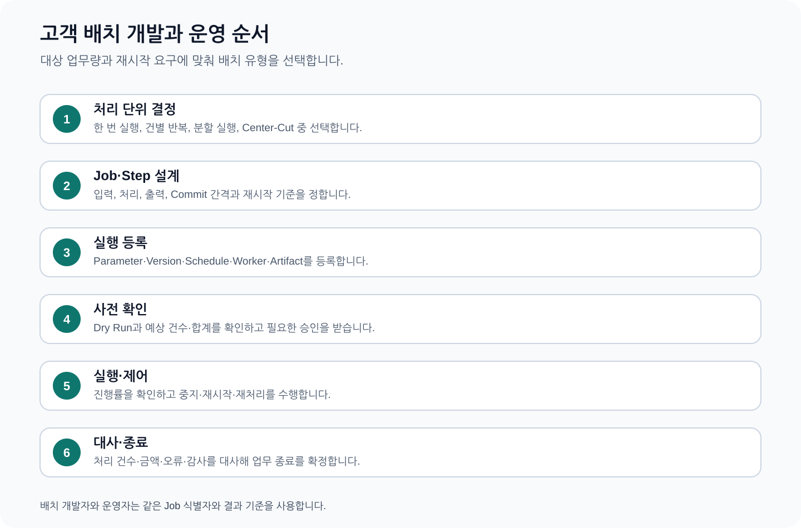

# CPF 배치 개발 매뉴얼 — 고객 정기·대량 업무를 만드는 방법

> **주 독자**: 고객사 배치 개발자, 배치 설계자, 배치 운영자
> **이 문서의 목표**: Spring Batch를 직접 다시 설계하지 않고, 고객 업무 특성에 맞는 배치 유형을 선택해 개발·등록·실행·중지·재시작·재처리·대사한다.



## 빠른 찾기

- [1. 배치 유형을 먼저 고른다](#1-배치-유형을-먼저-고른다)
- [2. 공통 용어](#2-공통-용어)
- [3. 모든 배치에 먼저 작성할 설계표](#3-모든-배치에-먼저-작성할-설계표)
- [4. 한 번에 끝나는 작업(Tasklet) 배치](#4-한-번에-끝나는-작업tasklet-배치)
- [5. 건별 대량 처리(Chunk) 배치](#5-건별-대량-처리chunk-배치)
- [6. 파일 입출력 배치](#6-파일-입출력-배치)
- [7. 범위를 나누어 처리하는 분할(Partition) 배치](#7-범위를-나누어-처리하는-분할partition-배치)
- [8. 여러 실행기에서 처리하는 원격 작업자(Worker) 배치](#8-여러-실행기에서-처리하는-원격-작업자worker-배치)
- [9. 대상 선정·승인·대사를 포함한 센터컷(Center-Cut) 배치](#9-대상-선정승인대사를-포함한-센터컷center-cut-배치)
- [10. 정해진 시각에 실행하는 일정(Scheduler) 배치](#10-정해진-시각에-실행하는-일정scheduler-배치)
- [11. 배치 배포 파일과 작업 묶음(Job Pack) 배포](#11-배치-배포-파일과-작업-묶음job-pack-배포)
- [12. 중지·재시작·재처리](#12-중지재시작재처리)
- [13. 결과를 받지 못한 실행의 확인과 대사](#13-결과를-받지-못한-실행의-확인과-대사)
- [14. 배치 등록에서 운영 종료까지](#14-배치-등록에서-운영-종료까지)
- [15. ADM 배치 메뉴를 어떤 순서로 보는가](#15-adm-배치-메뉴를-어떤-순서로-보는가)
- [16. 배포 인계표](#16-배포-인계표)
- [17. 전체 따라하기 — 월말 정산 배치](#17-전체-따라하기-월말-정산-배치)
- [18. 파일 배치 따라하기](#18-파일-배치-따라하기)
- [19. 배치 운영자가 받아야 할 인계](#19-배치-운영자가-받아야-할-인계)

## 1. 배치 유형을 먼저 고른다

| 업무 상황 | 권장 유형 | 핵심 이유 |
|---|---|---|
| 파일 이동, 마감 Flag 변경, 단일 Procedure 호출처럼 한 작업을 실행한다. | 한 번에 끝나는 Tasklet 배치 | 처리 단위가 한 번이고 중간 Checkpoint가 필요하지 않을 때 |
| 대상 데이터를 일정 건수로 읽고 변환·저장한다. | 대량 Chunk 배치 | 건수가 많고 중간 Commit과 재시작이 필요한 경우 |
| CSV·고정길이·대량 파일을 읽어 검증·반영하고 결과 파일을 만든다. | 파일 입출력 배치 | 외부기관·대량 업로드·정산 파일을 처리할 때 |
| 대상 범위를 여러 Partition으로 나눠 병렬 처리한다. | 분할 Partition 배치 | 대상 Key가 독립적이고 처리시간 단축이 필요한 경우 |
| Manager와 여러 Worker가 다른 프로세스에서 처리한다. | 원격 Worker 배치 | CPU·I/O 부하를 여러 Host에 분산하고 Worker를 확장할 때 |
| 대상자를 미리 산출하고 승인 후 분할·Chunk로 처리한다. | Center-Cut 배치 | 대상 선정 근거와 예상 건수·금액 검증이 중요한 경우 |
| 매일·매월·영업일·특정 시각에 Job을 실행한다. | 정기 Scheduler 배치 | 사용자 요청 없이 정기 실행해야 할 때 |
| Job 실행 파일과 설정을 Version 단위로 배포한다. | 배치 Artifact·Job Pack 배포 | 여러 Worker·Agent에 같은 배치 Version을 배포할 때 |
| 실행 중 배치를 통제하고 실패 지점부터 다시 처리한다. | 중지·재시작·재처리 | 장시간 실행, 일부 실패, 운영 중단 요구가 있는 경우 |
| 실행 요청 응답이 끊기거나 Manager·Worker 상태가 어긋난 결과를 확정한다. | 결과 미확정과 대사 | 요청은 전달됐지만 실제 실행 여부를 모를 때 |

## 2. 공통 용어

| 용어 | 고객 업무에서의 의미 |
|---|---|
| Job | 하나의 업무 배치 정의. 예: 일마감 정산 |
| JobInstance | Job 이름과 식별 Parameter가 같은 논리 실행 |
| JobExecution | JobInstance의 실제 실행 시도 |
| Step | Job을 구성하는 처리 단계 |
| Tasklet | 한 번의 작업으로 끝나는 Step 방식 |
| Chunk | 일정 건수를 읽고 처리·저장한 뒤 Commit하는 방식 |
| Checkpoint | 재시작할 위치를 기억하는 값 |
| Partition | 전체 대상을 겹치지 않는 범위로 나눈 처리 단위 |
| Lease·Fencing | 현재 Worker만 Partition을 갱신하게 하는 소유권 기준 |
| Center-Cut | 대상 선정·Preview·승인·분할 처리·대사를 묶은 대량 처리 방식 |

## 3. 모든 배치에 먼저 작성할 설계표

| 항목 | 작성 예 |
|---|---|
| 업무 목적 | 영업일 종료 후 계좌별 이자를 계산한다. |
| Job 이름·Version | `interestClosing`, Version 3 |
| 식별 Parameter | 업무일자, 대상기관, 실행구분 |
| 예상 대상 | 계좌 1,250,000건, 원금 합계 |
| 처리 방식 | Partition 16개, Chunk 1,000건 |
| 중복 기준 | 같은 업무일자·기관·Version은 한 번만 성공 |
| 재시작 | 마지막 Commit 이후부터 |
| 오류 처리 | 데이터 오류는 별도 오류 목록, 시스템 오류는 Step 실패 |
| 종료 판정 | 처리·제외·오류 건수 합이 Preview 건수와 일치 |
| 운영 권한 | 실행자, 중지자, 승인자, 재처리자 분리 |

## 4. 한 번에 끝나는 작업(Tasklet) 배치

### 만들 수 있는 결과

파일 이동, 마감 Flag 변경, 단일 Procedure 호출처럼 한 작업을 실행한다.

### 언제 선택하는가

처리 단위가 한 번이고 중간 Checkpoint가 필요하지 않을 때

### 설계할 값

- Job 이름과 Version
- 업무 기준일과 JobParameter
- 같은 실행으로 판단할 Parameter와 참고용 Parameter
- 예상 대상 건수·금액·파일 Hash
- Commit·Checkpoint·재시작 지점
- 중지·재실행·재처리 권한과 승인
- 결과 대사 Query와 정상 종료 기준

### 개발 순서

1. 사용자 또는 업무 부서가 기대하는 최종 결과를 건수·금액·상태로 정의한다.
2. JobParameter를 식별 Parameter와 비식별 Parameter로 나눈다.
3. Job과 Step을 구성하고 Step별 입력·처리·출력을 기록한다.
4. Tasklet에서 한 작업만 수행하고 결과 건수·상태를 Step Execution에 기록한다.
5. 처리 전 Preview 또는 예상 건수를 산출한다.
6. 성공·실패·건너뜀·재시도 건수를 Step 결과에 기록한다.
7. ADM에서 실행·진행·오류·재시작을 확인할 수 있게 등록한다.
8. 정상, 중간 실패, Process 종료, 중복 Trigger를 Test한다.
9. 실행 결과와 업무 원장의 건수·합계·Hash를 대사한다.

### 주의할 점

같은 Parameter로 재실행할 때 중복 Side Effect가 생기지 않게 한다.

### 정상 결과

- JobInstance와 JobExecution을 업무 기준일·Version으로 식별할 수 있다.
- Step별 읽기·쓰기·건너뜀·실패 건수가 업무 합계와 일치한다.
- 재시작 후 이미 완료된 범위가 중복 반영되지 않는다.
- ADM에서 Parameter, 진행률, 실패 단계, Trace와 Audit를 확인할 수 있다.

### 오류와 복구

| 상황 | 확인 | 행동 |
|---|---|---|
| 시작 요청 Timeout | 같은 Execution ID 또는 JobParameter의 실행 존재 여부 | 새 실행 전에 상태를 대사한다. |
| Step 실패 | 마지막 Commit·Checkpoint와 실패 Record | 원인 수정 후 Restart 또는 실패 건 재처리를 선택한다. |
| Worker 종료 | Lease·Heartbeat·Fencing Token | 소유권 만료 후 Partition을 회수한다. |
| 건수 불일치 | Preview, Reader 조건, Skip·Retry, Writer 결과 | 차이 대상을 추출하고 재처리 범위를 고정한다. |
| 중복 실행 | JobInstance Key와 Scheduler Trigger | 중복 실행을 중지하고 Side Effect를 대사한다. |

### 교육 예제 EDU-BAT-01

- 표준 Source: `cpf-reference/src/main/java/com/cpf/reference/edu/bat01/tasklet/`
- 표준 Test: `cpf-reference/src/test/java/com/cpf/reference/edu/bat01/tasklet/`
- 입력 시나리오: 업무일자 마감 Flag 한 건 변경

```powershell
.\gradlew.bat :cpf-reference:test --tests "*EDUBAT01*"
```

1. 정상 실행의 JobInstance·JobExecution·StepExecution을 확인한다.
2. ADM의 Batch Overview와 Executions에서 같은 Execution ID를 확인한다.
3. 처리 중 Process 종료, DB 연결 차단 또는 Worker 중단을 재현한다.
4. Restart 또는 실패 대상 재처리를 실행한다.
5. 정상 결과: 중복 실행해도 마감 이력이 한 건이다.
6. 고객 업무 전환 시 Job 이름·Parameter·Reader·Writer·대사 Query·권한을 바꾼다.

## 5. 건별 대량 처리(Chunk) 배치

### 만들 수 있는 결과

대상 데이터를 일정 건수로 읽고 변환·저장한다.

### 언제 선택하는가

건수가 많고 중간 Commit과 재시작이 필요한 경우

### 설계할 값

- Job 이름과 Version
- 업무 기준일과 JobParameter
- 같은 실행으로 판단할 Parameter와 참고용 Parameter
- 예상 대상 건수·금액·파일 Hash
- Commit·Checkpoint·재시작 지점
- 중지·재실행·재처리 권한과 승인
- 결과 대사 Query와 정상 종료 기준

### 개발 순서

1. 사용자 또는 업무 부서가 기대하는 최종 결과를 건수·금액·상태로 정의한다.
2. JobParameter를 식별 Parameter와 비식별 Parameter로 나눈다.
3. Job과 Step을 구성하고 Step별 입력·처리·출력을 기록한다.
4. Reader·Processor·Writer를 분리하고 Chunk 크기와 Checkpoint를 정한다.
5. 처리 전 Preview 또는 예상 건수를 산출한다.
6. 성공·실패·건너뜀·재시도 건수를 Step 결과에 기록한다.
7. ADM에서 실행·진행·오류·재시작을 확인할 수 있게 등록한다.
8. 정상, 중간 실패, Process 종료, 중복 Trigger를 Test한다.
9. 실행 결과와 업무 원장의 건수·합계·Hash를 대사한다.

### 주의할 점

Skip·Retry가 업무 합계와 중복 처리에 미치는 영향을 대사한다.

### 정상 결과

- JobInstance와 JobExecution을 업무 기준일·Version으로 식별할 수 있다.
- Step별 읽기·쓰기·건너뜀·실패 건수가 업무 합계와 일치한다.
- 재시작 후 이미 완료된 범위가 중복 반영되지 않는다.
- ADM에서 Parameter, 진행률, 실패 단계, Trace와 Audit를 확인할 수 있다.

### 오류와 복구

| 상황 | 확인 | 행동 |
|---|---|---|
| 시작 요청 Timeout | 같은 Execution ID 또는 JobParameter의 실행 존재 여부 | 새 실행 전에 상태를 대사한다. |
| Step 실패 | 마지막 Commit·Checkpoint와 실패 Record | 원인 수정 후 Restart 또는 실패 건 재처리를 선택한다. |
| Worker 종료 | Lease·Heartbeat·Fencing Token | 소유권 만료 후 Partition을 회수한다. |
| 건수 불일치 | Preview, Reader 조건, Skip·Retry, Writer 결과 | 차이 대상을 추출하고 재처리 범위를 고정한다. |
| 중복 실행 | JobInstance Key와 Scheduler Trigger | 중복 실행을 중지하고 Side Effect를 대사한다. |

### 교육 예제 EDU-BAT-02

- 표준 Source: `cpf-reference/src/main/java/com/cpf/reference/edu/bat02/chunk/`
- 표준 Test: `cpf-reference/src/test/java/com/cpf/reference/edu/bat02/chunk/`
- 입력 시나리오: 10000건 회원 등급 재계산

```powershell
.\gradlew.bat :cpf-reference:test --tests "*EDUBAT02*"
```

1. 정상 실행의 JobInstance·JobExecution·StepExecution을 확인한다.
2. ADM의 Batch Overview와 Executions에서 같은 Execution ID를 확인한다.
3. 처리 중 Process 종료, DB 연결 차단 또는 Worker 중단을 재현한다.
4. Restart 또는 실패 대상 재처리를 실행한다.
5. 정상 결과: Read=10000, Write+Skip=10000이며 재시작 중복이 없다.
6. 고객 업무 전환 시 Job 이름·Parameter·Reader·Writer·대사 Query·권한을 바꾼다.

## 6. 파일 입출력 배치

### 만들 수 있는 결과

CSV·고정길이·대량 파일을 읽어 검증·반영하고 결과 파일을 만든다.

### 언제 선택하는가

외부기관·대량 업로드·정산 파일을 처리할 때

### 설계할 값

- Job 이름과 Version
- 업무 기준일과 JobParameter
- 같은 실행으로 판단할 Parameter와 참고용 Parameter
- 예상 대상 건수·금액·파일 Hash
- Commit·Checkpoint·재시작 지점
- 중지·재실행·재처리 권한과 승인
- 결과 대사 Query와 정상 종료 기준

### 개발 순서

1. 사용자 또는 업무 부서가 기대하는 최종 결과를 건수·금액·상태로 정의한다.
2. JobParameter를 식별 Parameter와 비식별 Parameter로 나눈다.
3. Job과 Step을 구성하고 Step별 입력·처리·출력을 기록한다.
4. 파일 Hash, Header·Trailer, Record 수, 오류 파일, 재실행 기준을 관리한다.
5. 처리 전 Preview 또는 예상 건수를 산출한다.
6. 성공·실패·건너뜀·재시도 건수를 Step 결과에 기록한다.
7. ADM에서 실행·진행·오류·재시작을 확인할 수 있게 등록한다.
8. 정상, 중간 실패, Process 종료, 중복 Trigger를 Test한다.
9. 실행 결과와 업무 원장의 건수·합계·Hash를 대사한다.

### 주의할 점

같은 파일 중복 반영과 일부 반영 후 재실행을 방지한다.

### 정상 결과

- JobInstance와 JobExecution을 업무 기준일·Version으로 식별할 수 있다.
- Step별 읽기·쓰기·건너뜀·실패 건수가 업무 합계와 일치한다.
- 재시작 후 이미 완료된 범위가 중복 반영되지 않는다.
- ADM에서 Parameter, 진행률, 실패 단계, Trace와 Audit를 확인할 수 있다.

### 오류와 복구

| 상황 | 확인 | 행동 |
|---|---|---|
| 시작 요청 Timeout | 같은 Execution ID 또는 JobParameter의 실행 존재 여부 | 새 실행 전에 상태를 대사한다. |
| Step 실패 | 마지막 Commit·Checkpoint와 실패 Record | 원인 수정 후 Restart 또는 실패 건 재처리를 선택한다. |
| Worker 종료 | Lease·Heartbeat·Fencing Token | 소유권 만료 후 Partition을 회수한다. |
| 건수 불일치 | Preview, Reader 조건, Skip·Retry, Writer 결과 | 차이 대상을 추출하고 재처리 범위를 고정한다. |
| 중복 실행 | JobInstance Key와 Scheduler Trigger | 중복 실행을 중지하고 Side Effect를 대사한다. |

### 교육 예제 EDU-BAT-03

- 표준 Source: `cpf-reference/src/main/java/com/cpf/reference/edu/bat03/file/`
- 표준 Test: `cpf-reference/src/test/java/com/cpf/reference/edu/bat03/file/`
- 입력 시나리오: CSV 1000건 입력

```powershell
.\gradlew.bat :cpf-reference:test --tests "*EDUBAT03*"
```

1. 정상 실행의 JobInstance·JobExecution·StepExecution을 확인한다.
2. ADM의 Batch Overview와 Executions에서 같은 Execution ID를 확인한다.
3. 처리 중 Process 종료, DB 연결 차단 또는 Worker 중단을 재현한다.
4. Restart 또는 실패 대상 재처리를 실행한다.
5. 정상 결과: Header·Trailer·Record·Hash와 성공+오류 합계가 일치한다.
6. 고객 업무 전환 시 Job 이름·Parameter·Reader·Writer·대사 Query·권한을 바꾼다.

## 7. 범위를 나누어 처리하는 분할(Partition) 배치

### 만들 수 있는 결과

대상 범위를 여러 Partition으로 나눠 병렬 처리한다.

### 언제 선택하는가

대상 Key가 독립적이고 처리시간 단축이 필요한 경우

### 설계할 값

- Job 이름과 Version
- 업무 기준일과 JobParameter
- 같은 실행으로 판단할 Parameter와 참고용 Parameter
- 예상 대상 건수·금액·파일 Hash
- Commit·Checkpoint·재시작 지점
- 중지·재실행·재처리 권한과 승인
- 결과 대사 Query와 정상 종료 기준

### 개발 순서

1. 사용자 또는 업무 부서가 기대하는 최종 결과를 건수·금액·상태로 정의한다.
2. JobParameter를 식별 Parameter와 비식별 Parameter로 나눈다.
3. Job과 Step을 구성하고 Step별 입력·처리·출력을 기록한다.
4. Partition Key와 범위를 겹치지 않게 만들고 Worker 결과를 합산한다.
5. 처리 전 Preview 또는 예상 건수를 산출한다.
6. 성공·실패·건너뜀·재시도 건수를 Step 결과에 기록한다.
7. ADM에서 실행·진행·오류·재시작을 확인할 수 있게 등록한다.
8. 정상, 중간 실패, Process 종료, 중복 Trigger를 Test한다.
9. 실행 결과와 업무 원장의 건수·합계·Hash를 대사한다.

### 주의할 점

Worker 실패 시 실패 Partition만 회수·재실행한다.

### 정상 결과

- JobInstance와 JobExecution을 업무 기준일·Version으로 식별할 수 있다.
- Step별 읽기·쓰기·건너뜀·실패 건수가 업무 합계와 일치한다.
- 재시작 후 이미 완료된 범위가 중복 반영되지 않는다.
- ADM에서 Parameter, 진행률, 실패 단계, Trace와 Audit를 확인할 수 있다.

### 오류와 복구

| 상황 | 확인 | 행동 |
|---|---|---|
| 시작 요청 Timeout | 같은 Execution ID 또는 JobParameter의 실행 존재 여부 | 새 실행 전에 상태를 대사한다. |
| Step 실패 | 마지막 Commit·Checkpoint와 실패 Record | 원인 수정 후 Restart 또는 실패 건 재처리를 선택한다. |
| Worker 종료 | Lease·Heartbeat·Fencing Token | 소유권 만료 후 Partition을 회수한다. |
| 건수 불일치 | Preview, Reader 조건, Skip·Retry, Writer 결과 | 차이 대상을 추출하고 재처리 범위를 고정한다. |
| 중복 실행 | JobInstance Key와 Scheduler Trigger | 중복 실행을 중지하고 Side Effect를 대사한다. |

### 교육 예제 EDU-BAT-04

- 표준 Source: `cpf-reference/src/main/java/com/cpf/reference/edu/bat04/partition/`
- 표준 Test: `cpf-reference/src/test/java/com/cpf/reference/edu/bat04/partition/`
- 입력 시나리오: 고객번호 범위 8개 분할

```powershell
.\gradlew.bat :cpf-reference:test --tests "*EDUBAT04*"
```

1. 정상 실행의 JobInstance·JobExecution·StepExecution을 확인한다.
2. ADM의 Batch Overview와 Executions에서 같은 Execution ID를 확인한다.
3. 처리 중 Process 종료, DB 연결 차단 또는 Worker 중단을 재현한다.
4. Restart 또는 실패 대상 재처리를 실행한다.
5. 정상 결과: Partition 범위가 겹치지 않고 합계가 Preview와 같다.
6. 고객 업무 전환 시 Job 이름·Parameter·Reader·Writer·대사 Query·권한을 바꾼다.

## 8. 여러 실행기에서 처리하는 원격 작업자(Worker) 배치

### 만들 수 있는 결과

Manager와 여러 Worker가 다른 프로세스에서 처리한다.

### 언제 선택하는가

CPU·I/O 부하를 여러 Host에 분산하고 Worker를 확장할 때

### 설계할 값

- Job 이름과 Version
- 업무 기준일과 JobParameter
- 같은 실행으로 판단할 Parameter와 참고용 Parameter
- 예상 대상 건수·금액·파일 Hash
- Commit·Checkpoint·재시작 지점
- 중지·재실행·재처리 권한과 승인
- 결과 대사 Query와 정상 종료 기준

### 개발 순서

1. 사용자 또는 업무 부서가 기대하는 최종 결과를 건수·금액·상태로 정의한다.
2. JobParameter를 식별 Parameter와 비식별 Parameter로 나눈다.
3. Job과 Step을 구성하고 Step별 입력·처리·출력을 기록한다.
4. Worker Pool, Queue, Lease, Heartbeat, Fencing을 구성한다.
5. 처리 전 Preview 또는 예상 건수를 산출한다.
6. 성공·실패·건너뜀·재시도 건수를 Step 결과에 기록한다.
7. ADM에서 실행·진행·오류·재시작을 확인할 수 있게 등록한다.
8. 정상, 중간 실패, Process 종료, 중복 Trigger를 Test한다.
9. 실행 결과와 업무 원장의 건수·합계·Hash를 대사한다.

### 주의할 점

소유권을 잃은 Worker가 결과를 덮어쓰지 않게 한다.

### 정상 결과

- JobInstance와 JobExecution을 업무 기준일·Version으로 식별할 수 있다.
- Step별 읽기·쓰기·건너뜀·실패 건수가 업무 합계와 일치한다.
- 재시작 후 이미 완료된 범위가 중복 반영되지 않는다.
- ADM에서 Parameter, 진행률, 실패 단계, Trace와 Audit를 확인할 수 있다.

### 오류와 복구

| 상황 | 확인 | 행동 |
|---|---|---|
| 시작 요청 Timeout | 같은 Execution ID 또는 JobParameter의 실행 존재 여부 | 새 실행 전에 상태를 대사한다. |
| Step 실패 | 마지막 Commit·Checkpoint와 실패 Record | 원인 수정 후 Restart 또는 실패 건 재처리를 선택한다. |
| Worker 종료 | Lease·Heartbeat·Fencing Token | 소유권 만료 후 Partition을 회수한다. |
| 건수 불일치 | Preview, Reader 조건, Skip·Retry, Writer 결과 | 차이 대상을 추출하고 재처리 범위를 고정한다. |
| 중복 실행 | JobInstance Key와 Scheduler Trigger | 중복 실행을 중지하고 Side Effect를 대사한다. |

### 교육 예제 EDU-BAT-05

- 표준 Source: `cpf-reference/src/main/java/com/cpf/reference/edu/bat05/remoteworker/`
- 표준 Test: `cpf-reference/src/test/java/com/cpf/reference/edu/bat05/remoteworker/`
- 입력 시나리오: Manager 1·Worker 2

```powershell
.\gradlew.bat :cpf-reference:test --tests "*EDUBAT05*"
```

1. 정상 실행의 JobInstance·JobExecution·StepExecution을 확인한다.
2. ADM의 Batch Overview와 Executions에서 같은 Execution ID를 확인한다.
3. 처리 중 Process 종료, DB 연결 차단 또는 Worker 중단을 재현한다.
4. Restart 또는 실패 대상 재처리를 실행한다.
5. 정상 결과: Lease를 잃은 Worker가 결과를 덮어쓰지 않는다.
6. 고객 업무 전환 시 Job 이름·Parameter·Reader·Writer·대사 Query·권한을 바꾼다.

## 9. 대상 선정·승인·대사를 포함한 센터컷(Center-Cut) 배치

### 만들 수 있는 결과

대상자를 미리 산출하고 승인 후 분할·Chunk로 처리한다.

### 언제 선택하는가

대상 선정 근거와 예상 건수·금액 검증이 중요한 경우

### 설계할 값

- Job 이름과 Version
- 업무 기준일과 JobParameter
- 같은 실행으로 판단할 Parameter와 참고용 Parameter
- 예상 대상 건수·금액·파일 Hash
- Commit·Checkpoint·재시작 지점
- 중지·재실행·재처리 권한과 승인
- 결과 대사 Query와 정상 종료 기준

### 개발 순서

1. 사용자 또는 업무 부서가 기대하는 최종 결과를 건수·금액·상태로 정의한다.
2. JobParameter를 식별 Parameter와 비식별 Parameter로 나눈다.
3. Job과 Step을 구성하고 Step별 입력·처리·출력을 기록한다.
4. Preview, 대상 Snapshot, 승인, 실행, 대사와 실패 대상 재처리를 연결한다.
5. 처리 전 Preview 또는 예상 건수를 산출한다.
6. 성공·실패·건너뜀·재시도 건수를 Step 결과에 기록한다.
7. ADM에서 실행·진행·오류·재시작을 확인할 수 있게 등록한다.
8. 정상, 중간 실패, Process 종료, 중복 Trigger를 Test한다.
9. 실행 결과와 업무 원장의 건수·합계·Hash를 대사한다.

### 주의할 점

Preview와 실행 대상이 달라지지 않도록 Version·Checksum을 고정한다.

### 정상 결과

- JobInstance와 JobExecution을 업무 기준일·Version으로 식별할 수 있다.
- Step별 읽기·쓰기·건너뜀·실패 건수가 업무 합계와 일치한다.
- 재시작 후 이미 완료된 범위가 중복 반영되지 않는다.
- ADM에서 Parameter, 진행률, 실패 단계, Trace와 Audit를 확인할 수 있다.

### 오류와 복구

| 상황 | 확인 | 행동 |
|---|---|---|
| 시작 요청 Timeout | 같은 Execution ID 또는 JobParameter의 실행 존재 여부 | 새 실행 전에 상태를 대사한다. |
| Step 실패 | 마지막 Commit·Checkpoint와 실패 Record | 원인 수정 후 Restart 또는 실패 건 재처리를 선택한다. |
| Worker 종료 | Lease·Heartbeat·Fencing Token | 소유권 만료 후 Partition을 회수한다. |
| 건수 불일치 | Preview, Reader 조건, Skip·Retry, Writer 결과 | 차이 대상을 추출하고 재처리 범위를 고정한다. |
| 중복 실행 | JobInstance Key와 Scheduler Trigger | 중복 실행을 중지하고 Side Effect를 대사한다. |

### 교육 예제 EDU-BAT-06

- 표준 Source: `cpf-reference/src/main/java/com/cpf/reference/edu/bat06/centercut/`
- 표준 Test: `cpf-reference/src/test/java/com/cpf/reference/edu/bat06/centercut/`
- 입력 시나리오: 대상 Preview 5000건

```powershell
.\gradlew.bat :cpf-reference:test --tests "*EDUBAT06*"
```

1. 정상 실행의 JobInstance·JobExecution·StepExecution을 확인한다.
2. ADM의 Batch Overview와 Executions에서 같은 Execution ID를 확인한다.
3. 처리 중 Process 종료, DB 연결 차단 또는 Worker 중단을 재현한다.
4. Restart 또는 실패 대상 재처리를 실행한다.
5. 정상 결과: 승인 Snapshot과 실행 대상 Version·Checksum이 같다.
6. 고객 업무 전환 시 Job 이름·Parameter·Reader·Writer·대사 Query·권한을 바꾼다.

## 10. 정해진 시각에 실행하는 일정(Scheduler) 배치

### 만들 수 있는 결과

매일·매월·영업일·특정 시각에 Job을 실행한다.

### 언제 선택하는가

사용자 요청 없이 정기 실행해야 할 때

### 설계할 값

- Job 이름과 Version
- 업무 기준일과 JobParameter
- 같은 실행으로 판단할 Parameter와 참고용 Parameter
- 예상 대상 건수·금액·파일 Hash
- Commit·Checkpoint·재시작 지점
- 중지·재실행·재처리 권한과 승인
- 결과 대사 Query와 정상 종료 기준

### 개발 순서

1. 사용자 또는 업무 부서가 기대하는 최종 결과를 건수·금액·상태로 정의한다.
2. JobParameter를 식별 Parameter와 비식별 Parameter로 나눈다.
3. Job과 Step을 구성하고 Step별 입력·처리·출력을 기록한다.
4. Schedule, Timezone, Calendar, Misfire, 중복 Trigger 정책을 정한다.
5. 처리 전 Preview 또는 예상 건수를 산출한다.
6. 성공·실패·건너뜀·재시도 건수를 Step 결과에 기록한다.
7. ADM에서 실행·진행·오류·재시작을 확인할 수 있게 등록한다.
8. 정상, 중간 실패, Process 종료, 중복 Trigger를 Test한다.
9. 실행 결과와 업무 원장의 건수·합계·Hash를 대사한다.

### 주의할 점

수동 실행과 Scheduler 실행의 JobParameter 충돌을 방지한다.

### 정상 결과

- JobInstance와 JobExecution을 업무 기준일·Version으로 식별할 수 있다.
- Step별 읽기·쓰기·건너뜀·실패 건수가 업무 합계와 일치한다.
- 재시작 후 이미 완료된 범위가 중복 반영되지 않는다.
- ADM에서 Parameter, 진행률, 실패 단계, Trace와 Audit를 확인할 수 있다.

### 오류와 복구

| 상황 | 확인 | 행동 |
|---|---|---|
| 시작 요청 Timeout | 같은 Execution ID 또는 JobParameter의 실행 존재 여부 | 새 실행 전에 상태를 대사한다. |
| Step 실패 | 마지막 Commit·Checkpoint와 실패 Record | 원인 수정 후 Restart 또는 실패 건 재처리를 선택한다. |
| Worker 종료 | Lease·Heartbeat·Fencing Token | 소유권 만료 후 Partition을 회수한다. |
| 건수 불일치 | Preview, Reader 조건, Skip·Retry, Writer 결과 | 차이 대상을 추출하고 재처리 범위를 고정한다. |
| 중복 실행 | JobInstance Key와 Scheduler Trigger | 중복 실행을 중지하고 Side Effect를 대사한다. |

### 교육 예제 EDU-BAT-07

- 표준 Source: `cpf-reference/src/main/java/com/cpf/reference/edu/bat07/scheduler/`
- 표준 Test: `cpf-reference/src/test/java/com/cpf/reference/edu/bat07/scheduler/`
- 입력 시나리오: 영업일 23:00 실행

```powershell
.\gradlew.bat :cpf-reference:test --tests "*EDUBAT07*"
```

1. 정상 실행의 JobInstance·JobExecution·StepExecution을 확인한다.
2. ADM의 Batch Overview와 Executions에서 같은 Execution ID를 확인한다.
3. 처리 중 Process 종료, DB 연결 차단 또는 Worker 중단을 재현한다.
4. Restart 또는 실패 대상 재처리를 실행한다.
5. 정상 결과: 중복 Trigger 없이 한 JobInstance가 생성된다.
6. 고객 업무 전환 시 Job 이름·Parameter·Reader·Writer·대사 Query·권한을 바꾼다.

## 11. 배치 배포 파일과 작업 묶음(Job Pack) 배포

### 만들 수 있는 결과

Job 실행 파일과 설정을 Version 단위로 배포한다.

### 언제 선택하는가

여러 Worker·Agent에 같은 배치 Version을 배포할 때

### 설계할 값

- Job 이름과 Version
- 업무 기준일과 JobParameter
- 같은 실행으로 판단할 Parameter와 참고용 Parameter
- 예상 대상 건수·금액·파일 Hash
- Commit·Checkpoint·재시작 지점
- 중지·재실행·재처리 권한과 승인
- 결과 대사 Query와 정상 종료 기준

### 개발 순서

1. 사용자 또는 업무 부서가 기대하는 최종 결과를 건수·금액·상태로 정의한다.
2. JobParameter를 식별 Parameter와 비식별 Parameter로 나눈다.
3. Job과 Step을 구성하고 Step별 입력·처리·출력을 기록한다.
4. Artifact SHA, Job Pack Version, 승인, 설치 상태와 Rollback Point를 관리한다.
5. 처리 전 Preview 또는 예상 건수를 산출한다.
6. 성공·실패·건너뜀·재시도 건수를 Step 결과에 기록한다.
7. ADM에서 실행·진행·오류·재시작을 확인할 수 있게 등록한다.
8. 정상, 중간 실패, Process 종료, 중복 Trigger를 Test한다.
9. 실행 결과와 업무 원장의 건수·합계·Hash를 대사한다.

### 주의할 점

일부 Agent만 적용된 상태를 분리해 대사한다.

### 정상 결과

- JobInstance와 JobExecution을 업무 기준일·Version으로 식별할 수 있다.
- Step별 읽기·쓰기·건너뜀·실패 건수가 업무 합계와 일치한다.
- 재시작 후 이미 완료된 범위가 중복 반영되지 않는다.
- ADM에서 Parameter, 진행률, 실패 단계, Trace와 Audit를 확인할 수 있다.

### 오류와 복구

| 상황 | 확인 | 행동 |
|---|---|---|
| 시작 요청 Timeout | 같은 Execution ID 또는 JobParameter의 실행 존재 여부 | 새 실행 전에 상태를 대사한다. |
| Step 실패 | 마지막 Commit·Checkpoint와 실패 Record | 원인 수정 후 Restart 또는 실패 건 재처리를 선택한다. |
| Worker 종료 | Lease·Heartbeat·Fencing Token | 소유권 만료 후 Partition을 회수한다. |
| 건수 불일치 | Preview, Reader 조건, Skip·Retry, Writer 결과 | 차이 대상을 추출하고 재처리 범위를 고정한다. |
| 중복 실행 | JobInstance Key와 Scheduler Trigger | 중복 실행을 중지하고 Side Effect를 대사한다. |

### 교육 예제 EDU-BAT-08

- 표준 Source: `cpf-reference/src/main/java/com/cpf/reference/edu/bat08/jobpack/`
- 표준 Test: `cpf-reference/src/test/java/com/cpf/reference/edu/bat08/jobpack/`
- 입력 시나리오: Job Pack Version 3

```powershell
.\gradlew.bat :cpf-reference:test --tests "*EDUBAT08*"
```

1. 정상 실행의 JobInstance·JobExecution·StepExecution을 확인한다.
2. ADM의 Batch Overview와 Executions에서 같은 Execution ID를 확인한다.
3. 처리 중 Process 종료, DB 연결 차단 또는 Worker 중단을 재현한다.
4. Restart 또는 실패 대상 재처리를 실행한다.
5. 정상 결과: 모든 대상 Agent의 Artifact SHA와 적용 상태가 같다.
6. 고객 업무 전환 시 Job 이름·Parameter·Reader·Writer·대사 Query·권한을 바꾼다.

## 12. 중지·재시작·재처리

### 만들 수 있는 결과

실행 중 배치를 통제하고 실패 지점부터 다시 처리한다.

### 언제 선택하는가

장시간 실행, 일부 실패, 운영 중단 요구가 있는 경우

### 설계할 값

- Job 이름과 Version
- 업무 기준일과 JobParameter
- 같은 실행으로 판단할 Parameter와 참고용 Parameter
- 예상 대상 건수·금액·파일 Hash
- Commit·Checkpoint·재시작 지점
- 중지·재실행·재처리 권한과 승인
- 결과 대사 Query와 정상 종료 기준

### 개발 순서

1. 사용자 또는 업무 부서가 기대하는 최종 결과를 건수·금액·상태로 정의한다.
2. JobParameter를 식별 Parameter와 비식별 Parameter로 나눈다.
3. Job과 Step을 구성하고 Step별 입력·처리·출력을 기록한다.
4. Stop은 안전 지점에서 반영하고 Restart는 Checkpoint를 사용한다.
5. 처리 전 Preview 또는 예상 건수를 산출한다.
6. 성공·실패·건너뜀·재시도 건수를 Step 결과에 기록한다.
7. ADM에서 실행·진행·오류·재시작을 확인할 수 있게 등록한다.
8. 정상, 중간 실패, Process 종료, 중복 Trigger를 Test한다.
9. 실행 결과와 업무 원장의 건수·합계·Hash를 대사한다.

### 주의할 점

전체 재실행과 실패 건만 재처리를 구분한다.

### 정상 결과

- JobInstance와 JobExecution을 업무 기준일·Version으로 식별할 수 있다.
- Step별 읽기·쓰기·건너뜀·실패 건수가 업무 합계와 일치한다.
- 재시작 후 이미 완료된 범위가 중복 반영되지 않는다.
- ADM에서 Parameter, 진행률, 실패 단계, Trace와 Audit를 확인할 수 있다.

### 오류와 복구

| 상황 | 확인 | 행동 |
|---|---|---|
| 시작 요청 Timeout | 같은 Execution ID 또는 JobParameter의 실행 존재 여부 | 새 실행 전에 상태를 대사한다. |
| Step 실패 | 마지막 Commit·Checkpoint와 실패 Record | 원인 수정 후 Restart 또는 실패 건 재처리를 선택한다. |
| Worker 종료 | Lease·Heartbeat·Fencing Token | 소유권 만료 후 Partition을 회수한다. |
| 건수 불일치 | Preview, Reader 조건, Skip·Retry, Writer 결과 | 차이 대상을 추출하고 재처리 범위를 고정한다. |
| 중복 실행 | JobInstance Key와 Scheduler Trigger | 중복 실행을 중지하고 Side Effect를 대사한다. |

### 교육 예제 EDU-BAT-09

- 표준 Source: `cpf-reference/src/main/java/com/cpf/reference/edu/bat09/restart/`
- 표준 Test: `cpf-reference/src/test/java/com/cpf/reference/edu/bat09/restart/`
- 입력 시나리오: Chunk 처리 중 Stop

```powershell
.\gradlew.bat :cpf-reference:test --tests "*EDUBAT09*"
```

1. 정상 실행의 JobInstance·JobExecution·StepExecution을 확인한다.
2. ADM의 Batch Overview와 Executions에서 같은 Execution ID를 확인한다.
3. 처리 중 Process 종료, DB 연결 차단 또는 Worker 중단을 재현한다.
4. Restart 또는 실패 대상 재처리를 실행한다.
5. 정상 결과: 마지막 Commit 이후부터 재시작하고 완료 구간은 중복되지 않는다.
6. 고객 업무 전환 시 Job 이름·Parameter·Reader·Writer·대사 Query·권한을 바꾼다.

## 13. 결과를 받지 못한 실행의 확인과 대사

### 만들 수 있는 결과

실행 요청 응답이 끊기거나 Manager·Worker 상태가 어긋난 결과를 확정한다.

### 언제 선택하는가

요청은 전달됐지만 실제 실행 여부를 모를 때

### 설계할 값

- Job 이름과 Version
- 업무 기준일과 JobParameter
- 같은 실행으로 판단할 Parameter와 참고용 Parameter
- 예상 대상 건수·금액·파일 Hash
- Commit·Checkpoint·재시작 지점
- 중지·재실행·재처리 권한과 승인
- 결과 대사 Query와 정상 종료 기준

### 개발 순서

1. 사용자 또는 업무 부서가 기대하는 최종 결과를 건수·금액·상태로 정의한다.
2. JobParameter를 식별 Parameter와 비식별 Parameter로 나눈다.
3. Job과 Step을 구성하고 Step별 입력·처리·출력을 기록한다.
4. Execution ID, JobInstance, Worker Attempt, 업무 합계를 비교한다.
5. 처리 전 Preview 또는 예상 건수를 산출한다.
6. 성공·실패·건너뜀·재시도 건수를 Step 결과에 기록한다.
7. ADM에서 실행·진행·오류·재시작을 확인할 수 있게 등록한다.
8. 정상, 중간 실패, Process 종료, 중복 Trigger를 Test한다.
9. 실행 결과와 업무 원장의 건수·합계·Hash를 대사한다.

### 주의할 점

확인 전 새 실행을 만들지 않고 Reconcile 후 다음 행동을 정한다.

### 정상 결과

- JobInstance와 JobExecution을 업무 기준일·Version으로 식별할 수 있다.
- Step별 읽기·쓰기·건너뜀·실패 건수가 업무 합계와 일치한다.
- 재시작 후 이미 완료된 범위가 중복 반영되지 않는다.
- ADM에서 Parameter, 진행률, 실패 단계, Trace와 Audit를 확인할 수 있다.

### 오류와 복구

| 상황 | 확인 | 행동 |
|---|---|---|
| 시작 요청 Timeout | 같은 Execution ID 또는 JobParameter의 실행 존재 여부 | 새 실행 전에 상태를 대사한다. |
| Step 실패 | 마지막 Commit·Checkpoint와 실패 Record | 원인 수정 후 Restart 또는 실패 건 재처리를 선택한다. |
| Worker 종료 | Lease·Heartbeat·Fencing Token | 소유권 만료 후 Partition을 회수한다. |
| 건수 불일치 | Preview, Reader 조건, Skip·Retry, Writer 결과 | 차이 대상을 추출하고 재처리 범위를 고정한다. |
| 중복 실행 | JobInstance Key와 Scheduler Trigger | 중복 실행을 중지하고 Side Effect를 대사한다. |

### 교육 예제 EDU-BAT-10

- 표준 Source: `cpf-reference/src/main/java/com/cpf/reference/edu/bat10/reconcile/`
- 표준 Test: `cpf-reference/src/test/java/com/cpf/reference/edu/bat10/reconcile/`
- 입력 시나리오: 실행 요청 응답 유실

```powershell
.\gradlew.bat :cpf-reference:test --tests "*EDUBAT10*"
```

1. 정상 실행의 JobInstance·JobExecution·StepExecution을 확인한다.
2. ADM의 Batch Overview와 Executions에서 같은 Execution ID를 확인한다.
3. 처리 중 Process 종료, DB 연결 차단 또는 Worker 중단을 재현한다.
4. Restart 또는 실패 대상 재처리를 실행한다.
5. 정상 결과: Execution·업무 합계를 조회해 새 실행 없이 실제 결과를 확정한다.
6. 고객 업무 전환 시 Job 이름·Parameter·Reader·Writer·대사 Query·권한을 바꾼다.

## 14. 배치 등록에서 운영 종료까지

### 14.1 Job 등록

1. Job 이름, Version, 설명, 담당 조직을 등록한다.
2. 식별 JobParameter와 기본값을 등록한다.
3. Artifact 또는 Job Pack Version을 연결한다.
4. 실행 가능한 Worker Pool과 Agent를 연결한다.
5. ADM에서 Job Definition과 Version을 조회한다.

### 14.2 Scheduler 등록

1. Cron 또는 실행 주기를 입력한다.
2. Timezone과 영업일 Calendar를 선택한다.
3. Misfire 시 건너뛸지, 한 번 실행할지, 순차 보충할지 정한다.
4. 같은 Job의 중복 실행 방지 기준을 정한다.
5. 다음 실행 시각과 Parameter Preview를 확인한다.

### 14.3 실행 전 확인

- 대상 건수와 금액
- Job·Artifact Version
- DB·Kafka·Worker Health
- 선행 Job 완료 여부
- 승인 ID와 변경 사유
- 예상 종료 시각과 운영 연락망

### 14.4 실행 중 확인

- 현재 Step과 진행률
- Read·Write·Skip·Retry 건수
- Partition·Worker 상태
- 처리 속도와 예상 종료 시각
- 오류 증가와 Alert
- Lease·Heartbeat·Fencing

### 14.5 종료와 대사

1. Job 상태가 성공인지 확인한다.
2. 모든 Step과 Partition이 종료됐는지 확인한다.
3. Preview 건수 = 성공 + 제외 + 오류인지 대사한다.
4. 금액·수량·파일 Hash를 업무 원장과 대사한다.
5. 오류 대상을 재처리 Queue로 분리한다.
6. 실행자·승인자·Version·결과를 Audit에서 확인한다.

## 15. ADM 배치 메뉴를 어떤 순서로 보는가

| 목적 | 메뉴 |
|---|---|
| 전체 현황 | Batch Overview |
| 실행 Runtime | Runtime Topology, Batch Instances |
| 정기 실행 | Scheduler |
| 분산 처리 | Worker Pools, Workers, Leases |
| 대량 대상 처리 | Center-Cut |
| 배포 파일 | Job Packs, Deployment History·Plan |
| 실행 상세 | Executions |
| 결과 미확정·복구 | Recovery/Unknown |
| 경보·감사 | Alerts, Audit Evidence |

## 16. 배포 인계표

| 항목 | 내용 |
|---|---|
| Job·Version | 실행 Job과 변경 이력 |
| Schedule | Cron, Timezone, Calendar, Misfire |
| Parameter | 필수·기본값·식별 여부 |
| 처리량 | 예상 건수·Chunk·Partition·Worker |
| DB | Metadata DB와 업무 DB, Migration |
| Artifact | Job Pack, SHA-256, 설치 위치 |
| 관측 | Log, Metric, Trace, Alert |
| 제어 | Stop, Restart, Reprocess, Abandon 조건 |
| 대사 | 건수·금액·Hash와 확인 Query |
| 복구 | 실패 단계별 행동과 담당자 |


## 17. 전체 따라하기 — 월말 정산 배치

### 업무 목표

월말 기준 대상 계좌를 먼저 산출하고 승인한 뒤 16개 범위로 나눠 이자를 계산하고, 처리·제외·오류 건수와 금액을 대사한다.

### 설계값

| 항목 | 예시 |
|---|---|
| Job | `monthlyInterestClosing`, Version 3 |
| 식별 Parameter | 기준월, 기관코드, Job Version |
| Preview | 계좌 건수, 원금 합계, 예상 이자 |
| 처리 | Partition 16, Chunk 1000 |
| 제외 | 해지·법적 제한 계좌 |
| 재시작 | 마지막 Commit 이후 |
| 재처리 | 오류 계좌 ID 목록만 |
| 승인 | Preview Version·Checksum |
| 종료 | 성공+제외+오류=Preview, 금액 차이 0 |

### 개발 순서

1. Preview Query와 실행 Query의 조건을 한 Source에서 관리한다.
2. Preview 결과와 대상 Snapshot에 Version·Checksum을 기록한다.
3. 승인자는 건수·금액·제외 기준과 Rollback Point를 확인한다.
4. Partition Key를 겹치지 않게 생성한다.
5. Reader는 승인 Snapshot만 읽는다.
6. Processor는 이자 계산과 업무 Validation을 수행한다.
7. Writer는 업무 원장과 처리 이력을 같은 Transaction에 저장한다.
8. Step 종료 시 Read·Write·Skip·Retry와 금액 합계를 기록한다.
9. 실패 Partition만 재시작한다.
10. ADM에서 실행·Partition·Worker·오류·대사 결과를 확인한다.

## 18. 파일 배치 따라하기

1. 파일명·업무일자·기관코드·Hash를 등록한다.
2. Header·Trailer·Record 수와 인코딩을 검사한다.
3. 같은 Hash의 파일이 이미 완료됐는지 확인한다.
4. Record 오류는 오류 파일과 사유로 분리한다.
5. 정상 Record만 Chunk로 반영한다.
6. 성공·오류·제외 합계와 Trailer 건수를 대사한다.
7. 일부 반영 후 재시작은 완료 Record Key를 건너뛴다.
8. 결과 파일과 Download 권한·만료·감사를 등록한다.

## 19. 배치 운영자가 받아야 할 인계

| 항목 | 내용 |
|---|---|
| Job·Version | 업무명·설명·Artifact SHA |
| 실행 조건 | Schedule·Timezone·Calendar·선행 Job |
| Parameter | 필수·기본값·식별 여부·예시 |
| Preview | 건수·금액·Hash·승인 기준 |
| 처리 | Step·Chunk·Partition·Worker |
| 오류 | Skip·Retry·중단 기준 |
| 복구 | Stop·Restart·재처리·Abandon 조건 |
| 대사 | Query·합계·허용 오차 |
| ADM | 조회·실행·중지·복구 메뉴·권한 |
