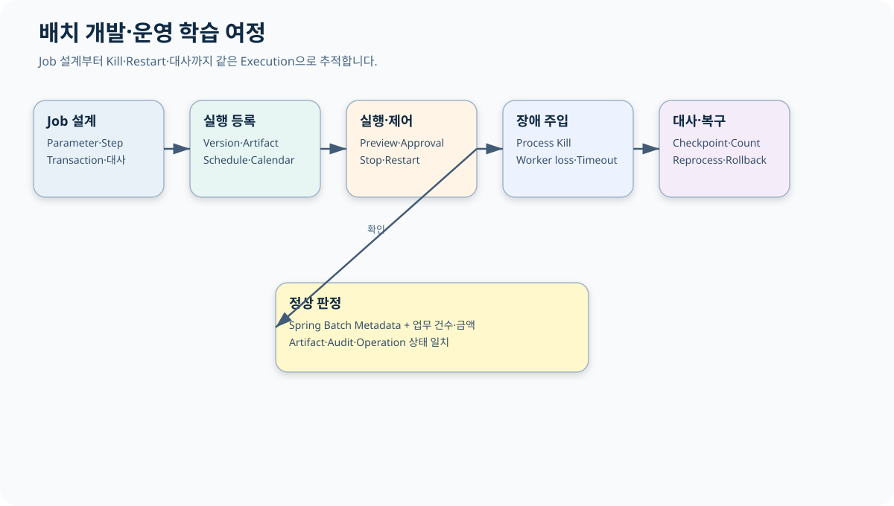

# CPF 배치 개발 매뉴얼

> 기준 Repository: `https://github.com/freeangelsun/202412_01_CPF`
> 기준 Branch: `master`
> 기준 Commit: `ee977cf66c251081df78ea5e9675b81c3dfafa59` (`06_07`)
> 기준일: `2026-08-06 Asia/Seoul`

| 항목 | 내용 |
|---|---|
| 주 독자 | 배치 개발자·배치 운영자, Spring Batch를 처음 사용하는 개발자 |
| 이 문서로 완료할 일 | Job을 설계·구현·등록·실행하고 Process Kill 뒤 Restart·Reprocess·Reconcile까지 수행한다. |
| 읽는 방식 | 처음 접하는 독자는 앞에서부터 실습 순서로 읽고, 숙련자는 장별 판단표와 참조 경로를 사용한다. |
| 설명 원칙 | 제품 기능은 사용할 수 있는 상태로 설명한다. 실제 Source·SQL·API·Config·Frontend·Script·Test의 이름과 경계를 유지한다. |




## 1. 먼저 이해할 배치 용어

| 용어 | 쉬운 설명 | 운영에서 보는 값 |
|---|---|---|
| Job | 하나의 업무 실행 정의 | Job Name·Version |
| JobInstance | 식별 JobParameter가 같은 논리 실행 | businessDate·institutionCode |
| JobExecution | Instance를 실제로 실행한 한 번의 시도 | Status·Start/End·Exit Code |
| Step | Job 안의 처리 단계 | Read·Write·Skip·Commit Count |
| ExecutionContext | Restart에 필요한 작은 상태 | Cursor·마지막 처리 Key |
| Checkpoint | 다시 시작할 위치를 확정한 지점 | 마지막 Commit과 업무 Row |
| Restart | 같은 Instance를 이어 실행 | 같은 식별 Parameter |
| Reprocess | 대사 뒤 새 대상 또는 새 의도로 실행 | 새 Parameter·승인·Reason |
| Reconcile | Metadata와 업무 원장을 비교해 결과를 확정 | 건수·금액·Hash·Target ID |

배치 성공은 Spring Batch `COMPLETED`만으로 판단하지 않는다. 업무 대상·처리 건수·금액·외부 접수·Audit가 대사 기준과 일치해야 한다.

## 2. Job 유형 선택

| 유형 | 선택할 때 | Restart 기준 | 대표 위험 |
|---|---|---|---|
| Tasklet | 파일 이동, Marker, 한 번의 명시 작업 | 완료 Marker | Rename 뒤 Marker 저장 전 종료 |
| Chunk | 많은 Row를 일정 건수로 Commit | 마지막 Commit Cursor | Writer 중복·정렬 Key 변경 |
| File Job | Upload·Preview·Row Validation·Apply | File·Row 상태 | 일부 Row만 반영 |
| Partition | 독립 범위를 병렬 처리 | Partition별 Execution | 중복 Claim·stale writer |
| Remote Worker | Manager와 Worker를 분리 | Message·Partition Attempt | Worker loss·ACK 유실 |
| Center-Cut | 기준시점 대상 Snapshot 일괄 처리 | Execution·Item Result | Preview Drift·부분 결과 |

## 3. 예제: 일별 PAY 정산 Job

업무 날짜별 결제 거래를 읽어 가맹점 정산 Table을 생성한다.

| 항목 | 예제 값 |
|---|---|
| Job Name | `payDailySettlementJob` |
| 식별 Parameter | `businessDate`, `institutionCode` |
| Step 1 | 대상 Snapshot 생성 Tasklet |
| Step 2 | 거래 정산 Chunk |
| Step 3 | 건수·금액 대사 Tasklet |
| Chunk Size | 500 |
| Reader Sort | `transaction_id` 오름차순 |
| Writer Key | `(business_date, transaction_id)` |
| 대사 | 입력 건수·금액 = 정산 건수·금액 + 제외 건수·금액 |

### 3.1 JobParameter

```java
public record PaySettlementParameters(
    LocalDate businessDate,
    String institutionCode,
    String runType,
    String requestId,
    String requestedBy,
    String reason) {}
```

식별 Parameter는 업무 의미가 있어야 한다. 실행 시각만 식별값으로 사용하면 같은 업무를 Restart하기 어렵다.

## 4. Job 구성 코드

```java
@Bean
Job payDailySettlementJob(JobRepository repository,
                          Step snapshotStep,
                          Step settlementStep,
                          Step reconciliationStep) {
    return new JobBuilder("payDailySettlementJob", repository)
        .start(snapshotStep)
        .next(settlementStep)
        .next(reconciliationStep)
        .build();
}
```

### 4.1 Chunk Step

```java
@Bean
Step settlementStep(JobRepository repository,
                    PlatformTransactionManager tx,
                    ItemReader<PayTransaction> reader,
                    ItemProcessor<PayTransaction, Settlement> processor,
                    ItemWriter<Settlement> writer) {
    return new StepBuilder("settlementStep", repository)
        .<PayTransaction, Settlement>chunk(500, tx)
        .reader(reader)
        .processor(processor)
        .writer(writer)
        .faultTolerant()
        .retry(DeadlockLoserDataAccessException.class)
        .retryLimit(3)
        .build();
}
```

## 5. Reader 설계

Reader는 안정된 정렬 Key를 사용한다. `updated_at`처럼 실행 중 바뀔 수 있는 값만 Cursor로 사용하지 않는다.

```sql
select transaction_id, customer_id, amount, status
  from pay_transaction
 where business_date = :business_date
   and institution_code = :institution_code
   and transaction_id > :last_transaction_id
 order by transaction_id
 fetch first :page_size rows only
```

Vendor별 Paging 문법은 분리하되 Sort와 Cursor 의미는 같다.

Reader Test:

- 빈 대상.
- 마지막 Page가 Chunk보다 작음.
- 같은 Timestamp의 여러 Row.
- 실행 중 신규 Row 유입.
- Cursor Row 삭제 또는 상태 변경.
- Process Kill 뒤 마지막 Commit 다음 Row부터 재개.

## 6. Processor 설계

Processor는 검증과 계산을 수행하고 외부 부작용을 만들지 않는다.

```java
public Settlement process(PayTransaction item) {
    if (!item.isSettledTarget()) return null;
    Money fee = feePolicy.calculate(item.amount(), item.merchantGrade());
    return Settlement.of(item, fee);
}
```

`null` Filter와 오류를 구분한다. Filter 사유는 별도 Count 또는 Result Code로 남긴다.

## 7. Writer 설계

Writer는 Chunk Transaction 안에서 멱등하게 저장한다.

```sql
insert into pay_settlement(
    business_date, transaction_id, gross_amount, fee_amount, net_amount, version)
values (
    :business_date, :transaction_id, :gross_amount, :fee_amount, :net_amount, 1)
```

같은 업무 Key가 이미 존재할 때 정책을 명시한다.

- 같은 Payload: 기존 결과 확인.
- 다른 Payload: Conflict와 대사 대상.
- 외부 전송: Writer 안에서 직접 하지 않고 Outbox 또는 다음 Step으로 분리.

## 8. Skip·Retry 결정

| 오류 | Retry | Skip | Job 실패 | 이유 |
|---|---:|---:|---:|---|
| 일시 DB Deadlock | O | X | 한도 초과 | Transaction 재시도 가능 |
| 입력 Validation 오류 | X | 정책 허용 시 | 허용 건수 초과 | 오류 Row 원장 필요 |
| Version 충돌 | X | X | O | Snapshot Drift 가능 |
| 외부기관 Timeout | Blind Retry 금지 | X | `UNKNOWN_RESULT` | 부작용 여부 대사 필요 |
| Disk Full | X | X | O | 환경 복구 전 반복 금지 |

Skip은 “버려도 되는 Row”가 아니다. Row ID, 오류, 원본 Artifact, 승인 정책과 재처리 방법을 남긴다.

## 9. Tasklet 예제: 파일 수신

1. Remote Final 이름이 아니라 Temp 이름으로 받는다.
2. Size·Checksum·Naming Rule·File ID를 검증한다.
3. Metadata를 `RECEIVED`로 저장한다.
4. Scan과 Row Schema 검증을 수행한다.
5. 같은 Filesystem에서 Final 이름으로 Rename한다.
6. 완료 Marker와 Artifact Hash를 기록한다.
7. 같은 File ID·Checksum은 Replay, 다른 Checksum은 Conflict로 격리한다.

| 종료 지점 | 남는 상태 | Restart 행동 |
|---|---|---|
| Download 중 | Temp 일부 | Size·Checksum 확인 후 Resume 또는 폐기 |
| Metadata 저장 뒤 Rename 전 | `RECEIVED`, Temp | Rename 재개 |
| Rename 뒤 Marker 전 | Final 존재, Marker 없음 | Hash 대사 후 Marker 보정 |
| 외부 접수 뒤 응답 유실 | Attempt `UNKNOWN_RESULT` | Target 접수 ID 조회 |

## 10. Partition·Remote Worker

### 10.1 Partition 계획

```text
institution=BANK01, range=00000000-19999999
institution=BANK01, range=20000000-39999999
institution=BANK02, range=00000000-19999999
```

Partition Key는 겹치지 않고 재현 가능해야 한다. 단순 Worker 수로 범위를 나누면 Worker 수 변경 시 Restart가 어려워질 수 있다.

### 10.2 Lease·Claim·Fencing

- Manager가 Partition을 `READY`로 만든다.
- Worker가 Lease와 증가하는 Fencing Token으로 Claim한다.
- Heartbeat가 없고 Lease가 만료되면 새 Worker가 더 큰 Token으로 Claim한다.
- 이전 Worker의 늦은 Write는 Token 비교로 거부한다.
- 결과 저장과 ACK 순서를 정한다.

Fault Test:

1. Worker가 Row 저장 중 종료.
2. Network partition으로 Heartbeat만 유실.
3. Lease 만료 뒤 이전 Worker가 복귀.
4. 같은 Partition 중복 Claim.
5. Manager가 재시작해도 Partition 상태 유지.

## 11. Scheduler·Calendar·Misfire

Schedule 입력:

| Field | 예 | 설명 |
|---|---|---|
| Schedule ID | `PAY-DAILY-SETTLEMENT` | 불변 식별자 |
| Cron | `0 10 1 * * *` | 업무 시간대 기준 |
| Timezone | `Asia/Seoul` | 명시적 Zone |
| Calendar | `KR-BANKING` | 영업일 기준 |
| Misfire | `FIRE_ONCE`, `SKIP`, `MANUAL` | 누락 실행 처리 |
| Parameter Rule | `businessDate=previousBusinessDay` | 실행 Parameter 생성 |

HA Scheduler는 Lease Owner가 한 번만 Dispatch하도록 한다. Clock Skew, Lease loss, 중복 Trigger를 Test한다.

## 12. Job Definition·Version·Artifact

Job Pack은 다음을 묶는다.

- Job Code와 Version.
- Step Graph와 Parameter Schema.
- Artifact Coordinate와 Checksum.
- DB·Config·Secret 요구.
- 호환 가능한 Runner·Worker Capability.
- 대사 기준과 Runbook.
- LKG Version과 Rollback 조건.

검증되지 않은 Local JAR 경로를 운영 Job Definition에 등록하지 않는다.

## 13. Center-Cut

Center-Cut은 기준시점 대상 집합을 고정하고 Execution별 결과를 대사하는 처리다.

### 13.1 흐름

1. 기준시각과 대상 조건 입력.
2. Preview 건수·금액·조건 Hash 생성.
3. 운영자 검토와 Approval Snapshot.
4. Execution과 Partition 생성.
5. Item 처리와 결과 저장.
6. 성공·실패·불명 Item 집계.
7. 업무 원장과 건수·금액·Hash 대사.
8. Execution별 FAILED 재처리 또는 UNKNOWN 대사.

Job 전체를 한 번에 성공·실패로 덮지 않는다. 성공 Item을 다시 처리하지 않는다.

## 14. 실행·Stop·Restart·Abandon·Reprocess

| 조치 | 선택 조건 | 남겨야 할 기록 |
|---|---|---|
| Stop | 정상 중지 지점까지 기다릴 수 있음 | 요청자·Reason·마지막 Checkpoint |
| Restart | 같은 Instance의 실패 Step을 이어 실행 | 이전 Execution·새 Execution 연결 |
| Abandon | 해당 Execution을 더 이상 Restart하지 않음 | 대사·승인·대체 실행 ID |
| Reprocess | 새 대상 또는 보정 후 다시 처리 | 새 Parameter·대상 Snapshot·Reason |
| Rollback | 업무 결과를 이전 상태로 되돌림 | Target별 Before/After·부분 실패 |

`STOPPED`라고 해서 업무 부작용이 없다는 뜻은 아니다. 마지막 Commit과 외부 Attempt를 확인한다.

## 15. Metadata 판독 순서

1. JobInstance의 식별 Parameter.
2. 최신·이전 JobExecution Status와 Exit Description.
3. StepExecution의 Read·Write·Filter·Skip·Commit·Rollback Count.
4. ExecutionContext Cursor.
5. 실제 업무 Table 마지막 Commit Row.
6. 외부 Attempt·Outbox·Audit.
7. Restart 또는 Reprocess 선택.

## 16. Process Kill 실습

### 16.1 준비

- Test Data 2,000건.
- Chunk Size 500.
- 900번째 Row 처리 뒤 Process 종료 Fault Point.

### 16.2 기대 결과

- 첫 500건은 Commit.
- 다음 Chunk는 Rollback.
- Metadata의 Write Count와 업무 Table 건수가 일치.
- Restart는 501번째 업무 Key부터 읽음.
- Writer 멱등성 때문에 중복 Row가 생기지 않음.

### 16.3 대사 SQL 예

```sql
select count(*) as cnt, coalesce(sum(net_amount),0) as amount
  from pay_settlement
 where business_date = :business_date;
```

Metadata Count와 업무 합계가 다르면 `COMPLETED`라도 정상 종료로 판정하지 않는다.

## 17. ADM 운영 확인

- `/batch-overview`: 전체 Job·Schedule·Execution 현황.
- `/batch-job-packs`: Definition·Version·Validation.
- `/batch-executions`: Job·Step·Count·Stop·Retry.
- `/batch-center-cut`: Preview·Execution·Item 결과·대사.
- `/batch-runtime`: Runner·Worker·Command 상태.
- `/batch-scheduler`: Calendar·Misfire·HA.
- `/batch-leases`: Lease·Fencing·stale holder.
- `/batch-recovery`: Ghost·Unknown·복구.
- `/batch-audit`: Operation·Audit·Evidence.

## 18. 운영 인계

| 항목 | 기록 내용 |
|---|---|
| Job·Version | Definition ID·Artifact SHA·Checksum |
| Parameter | 식별 여부·Default·Validation |
| Step | Tasklet/Chunk·Transaction Manager·Commit Interval |
| Data | Input Query·Sort·Snapshot·Output Table/File |
| Restart | Checkpoint·허용 상태·변경 감지 |
| Fault | Retryable·Skip·Timeout·Kill 지점 |
| External | Target·Idempotency·UNKNOWN 대사 |
| Parallel | Partition·Lease·Fencing·Worker Capability |
| Reconciliation | 건수·금액·Hash·Tolerance |
| Operations | ADM Route·Permission·Approval·Alert·Rollback |

## 19. 배치 자체 검수

1. JobParameter가 업무 실행을 식별하는가?
2. Reader Sort와 Cursor가 안정적인가?
3. Writer가 재읽기와 중복 Delivery에 멱등한가?
4. 외부 부작용을 Chunk Transaction과 분리했는가?
5. Skip Row를 원장과 승인 정책으로 관리하는가?
6. Process Kill 뒤 Restart 위치를 검증했는가?
7. Worker loss와 stale token을 차단하는가?
8. Misfire와 영업일 Parameter 생성이 정의됐는가?
9. Metadata와 업무 건수·금액을 대사하는가?
10. ADM에서 실행·조치·Audit를 찾을 수 있는가?
