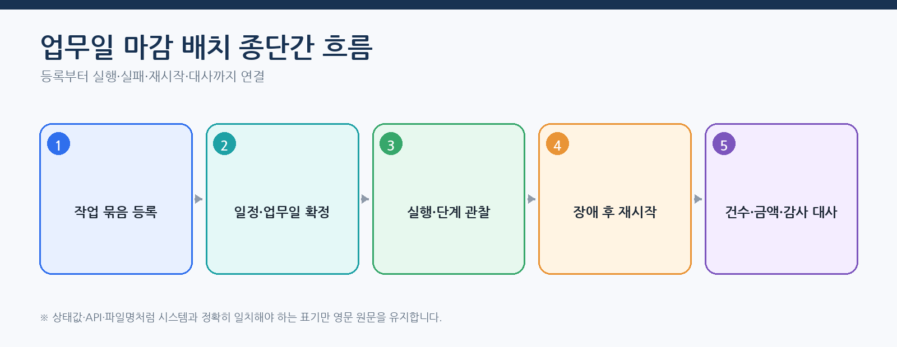
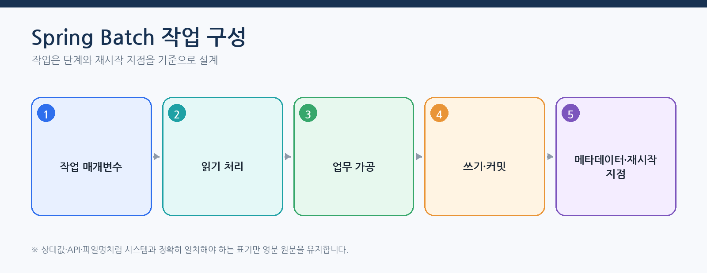
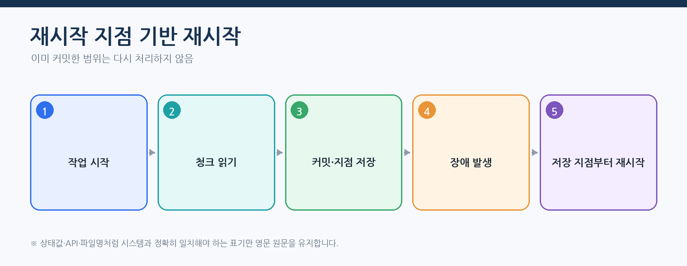
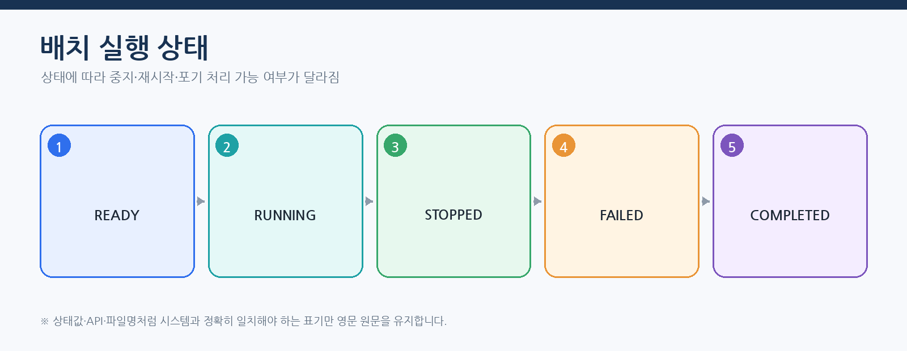
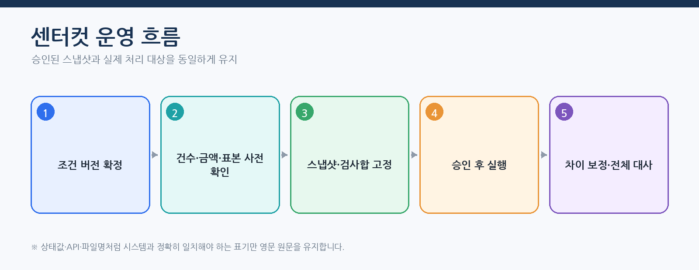

# CPF 배치 개발 매뉴얼 — Spring 배치 작업 개발·실행·복구

> **주 독자**: 고객 배치 개발자, 스케줄러·작업자 노드·센터컷 운영자
> **목표**: 작업 유형 선택부터 등록·승인·실행·중지·재시작·재처리·대사까지 수행한다.

> **용어 표기 원칙**: 설명은 한글을 우선한다. API 경로, 설정 키, 클래스·파일명, HTTP 헤더와 실제 상태값은 시스템과 일치해야 하므로 원문을 유지한다.


## 이 매뉴얼을 사용하는 기준

이 매뉴얼은 고객이 현재 배포 기준의 CPF 기능을 처음 접한다는 전제로 작성한다. 사용자는 소스를 역분석하지 않고 이 문서의 **시작 조건 → 단계별 절차 → 정상 결과 → 오류·복구 → 운영 인계** 순서로 작업한다.

- 제품 기능과 고객 교육 예제는 구현된 기능을 기준으로 설명한다.
- 기능 식별자·API·설정값·화면이 변경되면 같은 커밋에서 매뉴얼도 함께 현행화한다.
- 고객 업무 데이터·상태·승인 기준·대사 기준은 고객이 정하고, CPF가 제공하는 실행·보안·감사·복구 계약에 연결한다.
- 명령과 예시는 저장소 최상위 폴더에서 실행하는 것을 기본으로 한다.
- 운영 변경은 사전 확인, 사유, 권한, 승인, 버전, 대상별 결과, 감사 순서로 확인한다.

> 문서 검수자는 소스·SQL·API·설정·화면·스크립트·시험과 양방향으로 대조한다. 고객 사용자는 별도 소스 분석 없이 본문 절차를 수행할 수 있어야 한다.
## 처음 시작하는 배치 개발자의 완료 기준



배치 개발은 작업 실행 성공만으로 끝나지 않는다. 작업 매개변수·메타데이터·재시작 지점·업무 결과·대사 기준·ADM 운영 절차까지 함께 제공해야 한다.



## 종단간 따라하기 — 업무일 마감 태스크릿(Tasklet)

대표 예제는 `EDU-BAT-01`이며 실제 처리기는 `cpf-reference/src/main/java/com/cpf/reference/batch/tasklet/close/EduBat01Handler.java`다.

### 1. 시작 전에 결정할 값

| 항목 | 예시 | 이유 |
|---|---|---|
| 작업 이름 | `dailyCloseJob` | 등록·배포·실행 식별자 |
| businessDate | `2026-08-01` | 작업 인스턴스를 구분하는 식별 매개변수 |
| force | `false` | 이미 마감된 날짜의 재실행 통제 |
| 사유 | `정상 일마감` | 운영 조치와 감사 |
| 재시작 지점 | 단계 완료 또는 청크 커밋 | 재시작 위치 |
| 대사 기준 | 건수·금액·업무일·해시 | 완료 판정 |

### 2. 기능 활성과 실행

`cpf.reference.features.batch.enabled=true`를 적용하고 로컬 실행 환경을 `integration` 또는 배치 역할이 포함된 Mode로 기동한다.

```powershell
$headers=@{
 'X-Cpf-Actor-Id'='batch-op01'
 'X-Cpf-Roles'='CPF_REFERENCE_BATCH_OPERATOR'
 'X-Cpf-Data-Scope'='BATCH:ALL'
 'X-Cpf-Request-Id'=[guid]::NewGuid().ToString()
 'X-Cpf-Trace-Id'=[guid]::NewGuid().ToString()
}
$body=@{
 businessKey='CLOSE-2026-08-01'
 idempotencyKey='dailyCloseJob:2026-08-01:v1'
 expectedVersion=0
 requestReason='정상 일마감 실행'
 payload=@{businessDate='2026-08-01';force=$false;reason='정상 일마감'}
 failurePoint='NONE';autoApprove=$true;autoAcknowledge=$true
}|ConvertTo-Json -Depth 10
$r=Invoke-RestMethod -Method Post -Uri 'http://127.0.0.1:8080/api/reference/edu-capabilities/EDU-BAT-01/executions' -Headers $headers -ContentType 'application/json' -Body $body
$r|ConvertTo-Json -Depth 20
```

정상 판정은 작업 기록 `SUCCEEDED`, 작업·단계 완료, 업무 결과 대사 일치, 같은 실행 ID가 ADM과 감사에 표시되는 상태다.

### 3. 중간 실패와 재시작



- `BEFORE_COMMIT`: 현재 청크 또는 태스크릿 트랜잭션은 반영되지 않았으므로 재시도·재시작이 가능하다.
- `AFTER_COMMIT`: 업무 결과가 반영됐을 수 있으므로 메타데이터와 업무 원장을 대사한다.
- `PROCESS_KILL`: 마지막 재시작 지점과 임대 잠금 소유권을 확인한다.
- `LEASE_LOST`: 이전 작업자 노드의 늦은 결과를 펜싱 토큰으로 거부한다.

`FAILED_RETRYABLE`은 원인을 제거한 뒤 재시도한다. `UNKNOWN_RESULT`는 신규 실행을 만들지 않고 결과 대사한다.

### 4. 중지·재시작·포기 처리 구분



| 조치 | 사용할 때 | 하지 않는 일 |
|---|---|---|
| 중지 | 정상 중지 지점에서 실행을 멈출 때 | 이미 커밋된 결과를 되돌리지 않는다. |
| 재시작 | 실패·중지 실행을 재시작 지점부터 이어갈 때 | 새 작업 매개변수로 다른 인스턴스를 만들지 않는다. |
| 실패 대상 재처리 | 실패 대상만 다시 처리할 때 | 성공 대상 전체를 반복 처리하지 않는다. |
| 결과 대사 | 실행 상태와 업무 결과가 불일치하거나 미확정일 때 | 확인 없이 Job을 재실행하지 않는다. |
| 포기 처리 | 해당 실행을 다시 시작하지 않기로 결정할 때 | 업무 데이터를 삭제하거나 자동 되돌리기하지 않는다. |

## 분할 처리·작업자 노드 실습에서 확인할 것


1. 분할 처리 계획에 겹침과 누락이 없는지 확인한다.
2. 작업자 노드가 임대 잠금을 소유권 획득하고 펜싱 토큰을 받는지 확인한다.
3. 작업자 노드 종료 뒤 임대 잠금 만료와 재할당을 확인한다.
4. 이전 토큰의 늦은 결과가 반영되지 않는지 확인한다.
5. 실패 분할 처리만 재처리하고 전체 건수·금액·해시를 대사한다.

## 센터컷 실습에서 확인할 것



사전 확인 시 조건 버전·스냅샷·예상 건수·표본을 고정한다. 승인자는 대상 범위와 위험을 확인하고, 실행자는 승인 ID와 같은 스냅샷으로 실행한다. 부분 실패는 성공 대상에 손대지 않고 실패 대상만 재처리한 뒤 전체 대사를 다시 수행한다.

## 배치에서 사용하는 스타터 경계

배치 제품의 작업·단계·체크포인트·재시작·임대 잠금은 `cpf-batch/*`가 소유한다. `cpf-starters`는 선택 기술 연결만 제공하며 배치 실행 원장을 대신 소유하지 않는다.

| 배치 요구 | 사용할 수 있는 스타터 | 적용 경계 | 사용하지 말아야 할 경우 |
|---|---|---|---|
| Kafka 기반 원격 작업·결과 전달 | `:cpf-starters:messaging-kafka` | 브로커 연결, 메시지 송수신 연결부 | 단일 프로세스 로컬 작업에 불필요하게 Kafka를 강제할 때 |
| 제어 API·작업자 관리 API 보호 | `:cpf-starters:security` | 웹 진입점의 인증·세션·보안 필터 | 작업 실행 소유권·임대 잠금·펜싱을 인증 세션으로 대체할 때 |
| 기준정보·작업 정의 조회 캐시 | `:cpf-starters:cache` | 읽기 최적화와 명시적 무효화 | JobExecution·StepExecution·체크포인트·임대 잠금 상태를 캐시 정본으로 사용할 때 |

배포 전에는 선택 스타터 시험과 함께 `cpf-batch` 소비 모듈의 시험을 실행한다. Kafka 전송 뒤 응답 유실, 캐시의 오래된 작업 정의, 세션 저장소 장애가 배치 실행 원장을 손상시키지 않는지 확인한다.

배치 모듈의 스타터 선택은 다음 기준을 따른다.

| 배치 사용 상황 | 권장 등록 | 포함 공개 스타터 | 주의 사항 |
|---|---|---|---|
| 같은 프로세스에서 DB 중심으로 실행 | 스타터 없음 또는 개별 선택 | 필요 없음 | 체크포인트·작업 원장은 배치 Runtime이 소유 |
| Kafka 원격 작업자·비동기 명령 | `event-driven` 묶음 또는 개별 등록 | `messaging-kafka` | 중복·순서·응답 유실·격리 큐 대사 필요 |
| 운영 웹에서 배치 제어 | `secure-web` | `security` | 브라우저 세션이 배치 실행 소유권을 대신하지 않음 |
| 운영 웹 + 반복 기준정보 조회 | `operations-web` | `security`, `cache` | 작업 상태·체크포인트를 캐시로 확정하지 않음 |
| 운영 웹 + 원격 메시징 | `operations-event` | 세 공개 스타터 | 각 외부 기반의 장애와 복구를 따로 판정 |

스타터가 내부적으로 세분화돼도 배치 작업이나 고객 작업 묶음은 내부 세부 프로젝트를 직접 등록하지 않는다. 공개 스타터 또는 승인된 기능 묶음까지만 의존한다.

## 실행 엔진과 책임 경계

- 주 운영 실행 엔진은 Spring 배치다.
- 고객 업무는 작업·단계·태스크릿·읽기 처리기·가공 처리기·쓰기 처리기와 업무 저장소를 소유한다.
- CPF 배치 실행 환경은 실행 요청, 배치 메타데이터 저장소 연동, 스케줄러, 작업자 노드, 에이전트, 임대 잠금·소유권 획득·펜싱, 배포·운영 계약을 소유한다.
- ADM은 조회·통제·승인을 제공하지만 업무 결과 테이블을 직접 수정하지 않는다.
- 같은 Job을 메모리 상태나 고정 응답으로 대체하지 않는다.

## 작업 유형 선택

| 조건 | 선택 | 핵심 설정 | 대표 EDU |
|---|---|---|---|
| 한 트랜잭션 또는 단순 운영 작업 | 태스크릿 | 재실행 가능성·멱등성 | BAT-01 |
| 많은 동일 레코드 처리 | 청크 | 청크·커밋·재시도·건너뛰기 | BAT-02·12·13 |
| 파일 수신·산출 | 파일 작업 | 전문 형식·해시·완료 이름 변경 | BAT-03·17~19 |
| 범위 분할 | 로컬 분할 처리 | 분할 처리 키·겹침 방지 | BAT-04·25 |
| 별도 작업자 노드 확장 | 원격 작업자 노드 | 임대 잠금·펜싱·재할당 | BAT-05·24 |
| 대량 대상 일괄 조치 | 센터컷 | 사전 확인·스냅샷·승인 | BAT-06·26 |
| 정기 실행 | 스케줄러 | 달력·실행 누락·중복 실행 요청 | BAT-07·20·22 |
| 배포 파일 배포 | 작업 묶음 | 버전·검사합·호환·되돌리기 | BAT-08·27 |

## 작업·단계·매개변수 설계

### 업무 결과

같은 업무 실행을 식별하는 매개변수와 변경 가능한 운영 매개변수를 구분해 작업 인스턴스 중복과 재시작 의미를 보존한다.

### 시작 전에 결정할 값

- JobName·JobVersion
- 식별 매개변수와 비식별 매개변수
- 업무일·기준 버전
- 청크·커밋·건너뛰기·재시도 한도
- 업무 합계·해시 대사 기준

### 수행 순서

1. 작업 매개변수 스키마와 검증을 작성한다.
2. 같은 매개변수 해시의 중복 실행 정책을 정한다.
3. Step별 읽기 처리기·가공 처리기·쓰기 처리기와 트랜잭션 경계를 정의한다.
4. 배치 메타데이터 저장소와 업무 원장 식별자를 연결한다.
5. 정상·중단·재시작·새 인스턴스 실행을 시험한다.

### 정상 판정

- 같은 매개변수가 의도하지 않은 새 작업 인스턴스를 만들지 않음
- 재시작은 마지막 성공 커밋 다음부터 처리
- 읽기 건수=쓰기 건수+건너뛴 건수+필터 제외 건수 등 업무 합계 일치
- 작업 실행과 업무 결과가 같은 버전·해시

### 오류·경계·부분 실패

- 매개변수 누락·형식 오류
- 동일 매개변수 동시 실행 요청
- 쓰기 처리기 커밋 전후 종료
- 건너뛰기 한도 초과
- 배치 메타데이터 저장소와 업무 원장 불일치

### 복구·대사·되돌리기

- FAILED/STOPPED는 같은 작업 인스턴스 재시작 조건을 확인한다.
- COMPLETED는 새 실행 전에 재산출·정정 업무 의미를 결정한다.
- ABANDONED는 재시작하지 않고 별도 복구 계획을 승인한다.

### 로그·지표·추적·감사

- 작업명·`instanceId`·`executionId`
- 읽기·쓰기·건너뛰기·커밋·되돌리기
- 청크 지연·재시도·예외
- 업무 건수·금액·해시

### 운영 인계

- 매개변수 스키마
- 재시작·새 작업으로 다시 실행·실패 대상 재처리 기준
- 대사 조회
- 운영 허용 조치
## 분할 처리·원격 작업자 노드·임대 잠금

### 업무 결과

분할 범위를 겹치지 않게 고정하고 소유권을 잃은 작업자 노드가 현재 결과를 덮어쓰지 못하게 한다.

### 시작 전에 결정할 값

- 분할 처리 키와 스냅샷 버전
- 분할 수·범위·재분할 조건
- 임대 잠금 기간·갱신 주기
- 펜싱 토큰 비교 위치
- 작업자 노드 재할당 정책

### 수행 순서

1. 사전 확인에서 전체 대상과 분할 처리 합계를 계산한다.
2. 관리 노드가 분할 처리과 토큰을 발급한다.
3. 작업자 노드가 쓰기 전 현재 토큰을 검증한다.
4. 임대 잠금 상실·프로세스 Kill을 주입한다.
5. 새 작업자 노드 재할당 후 중복 결과와 누락을 대사한다.

### 정상 판정

- 분할 처리 범위 겹침 0건
- 전체 합계=분할 처리 합계
- 과거 토큰 쓰기 0건
- 유실 분할 처리만 재할당
- 재시작 뒤 중복 결과 없음

### 오류·경계·부분 실패

- 작업자 노드 Heartbeat 지연
- 임대 잠금 상실 뒤 늦은 커밋
- 관리 노드 응답 유실
- 분할 처리 편향
- 한 작업자 노드 반복 실패

### 복구·대사·되돌리기

- 소유권 상실 작업자 노드는 바로 중단하고 결과를 확정하지 않는다.
- 현재 토큰과 결과 해시를 조회한다.
- 실패 분할 처리만 새 시도로 재할당한다.

### 로그·지표·추적·감사

- 임대 잠금 경과시간·갱신 실패
- 분할 처리 처리량·편향
- 펜싱 거부 건수
- `attemptId`·`workerId`·토큰 감사

### 운영 인계

- 작업자 노드 묶음·용량
- 임대 잠금·펜싱 값
- 재할당 승인
- 대사와 강제 종료 기준
## 센터컷 사전 확인·승인·실행

### 업무 결과

대량 조치 대상과 기준을 스냅샷으로 고정하고 승인한 대상·버전·검사합만 실행한다.

### 시작 전에 결정할 값

- 대상 조건·기준시각
- 사전 확인 최대 건수·표본
- 스냅샷 보존기간
- 승인 역할·유효시간
- 분할 처리·청크·커밋·대사 기준

### 수행 순서

1. 사전 검토으로 대상 수·금액·분포·표본을 계산한다.
2. 조건 버전·스냅샷 ID·검사합을 기록한다.
3. 승인자가 영향과 복구 계획을 검토한다.
4. 실행 시 승인 스냅샷과 검사합을 재검증한다.
5. 대상별 성공·실패·미확정을 기록하고 대사한다.

### 정상 판정

- 승인 대상과 실행 대상 동일
- 대상별 결과 합계=스냅샷 총계
- 부분 성공이 대상별로 분리
- 재실행이 성공 대상을 반복하지 않음

### 오류·경계·부분 실패

- 승인 후 데이터 변경
- 스냅샷 만료
- 일부 분할 처리 실패
- 응답 유실
- 되돌리기 불가능한 외부 부수 효과

### 복구·대사·되돌리기

- 스냅샷 불일치는 실행 전 거부한다.
- 실패·미확정 대상만 재처리한다.
- 외부 부수 효과는 상대 상태 조회와 보상 가능 여부를 판단한다.

### 로그·지표·추적·감사

- `snapshotId`·checksum
- 대상 status 분포
- partition 시도
- `approvalId`·사유·수행자

### 운영 인계

- 사전 확인·승인·실행 권한
- 대상 대사 조회
- 부분 실패 복구
- 되돌리기 제한
## 스케줄러·실행 누락·중복 방지

### 업무 결과

영업일과 일정 버전을 기준으로 한 번의 실행 요청이 한 작업 인스턴스만 만들도록 한다.

### 시작 전에 결정할 값

- 일정식(Cron)·시간대·달력
- 실행 누락 정책: 바로 보충·누락분 보충·건너뛰기
- 주 실행 노드 임대 잠금·펜싱
- 실행 요청 멱등 키
- 점검창·일시중지

### 수행 순서

1. 일정 초안과 버전을 등록한다.
2. 달력·시간대·다음 실행시각을 사전 확인한다.
3. 승인 후 적용본과 스케줄러 적용 상태를 확인한다.
4. 주 실행 노드 전환과 중복 실행 요청을 시험한다.
5. 실행 누락별 실제 작업 인스턴스와 감사를 확인한다.

### 정상 판정

- 같은 실행 요청 키에 작업 인스턴스 1개
- 주 실행 노드 변경 중 중복 실행 없음
- 실행 누락 정책대로 누락분 보충 또는 건너뛰기
- 일정 버전과 실행 환경 적용본 일치

### 오류·경계·부분 실패

- 시계·시간대 오류
- 스케줄러 주 실행 노드 상실
- DB 지연
- 적용본 부분 적용
- 장기 중단 후 다수 실행 누락

### 복구·대사·되돌리기

- 새 실행 요청 전 기존 실행 요청·실행을 조회한다.
- 부분 적용는 인스턴스별 버전을 대사한다.
- 누락분 보충 실행 폭주가 예상되면 승인된 상한과 역압을 적용한다.

### 로그·지표·추적·감사

- 다음 실행 시각·실행 누락 건수
- 리더 토큰
- trigger claim·dispatch
- schedule version 불일치

### 운영 인계

- 달력 소유 모듈
- 실행 누락 정책
- 점검창 변경
- 중복 실행·복구 담당자
## 결과 미확정·중지·재시작·실패 대상 재처리

### 업무 결과

실행 요청 응답 유실과 프로세스 종료를 실제 배치 메타데이터 저장소·업무 원장 조회로 확정하고 새 실행 여부를 결정한다.

### 시작 전에 결정할 값

- 실행 식별자·매개변수 해시
- 중지 대기 한도
- 재시작 가능 상태
- 실패 대상 재처리 대상 선정
- 업무 대사 기준

### 수행 순서

1. 요청 전 작업 기록 ID와 매개변수 해시를 기록한다.
2. 응답 유실 시 실행 목록과 배치 메타데이터 저장소를 조회한다.
3. 중지는 현재 청크 종료·재시작 지점 저장 여부를 확인한다.
4. 재시작과 새 작업 인스턴스 새 작업으로 다시 실행을 구분한다.
5. 실패 대상 재처리는 실패 대상 스냅샷과 중복 방지 키를 사용한다.

### 정상 판정

- 새 실행 없이 기존 실행 결과를 확정
- 재시작이 완료 청크를 반복하지 않음
- 실패 대상 재처리 대상이 실패·미확정으로 제한
- 업무 합계와 배치 메타데이터 저장소 일치

### 오류·경계·부분 실패

- 중지 요청 응답 유실
- 프로세스 Kill
- 재시작 지점 저장 실패
- 업무 커밋과 단계 상태 불일치
- ABANDON 오사용

### 복구·대사·되돌리기

- UNKNOWN_RESULT는 결과 대사 전 성공·실패로 바꾸지 않는다.
- 단계·업무 원장·외부 부수 효과를 대사한다.
- 필요하면 실패 대상만 재처리한다.

### 로그·지표·추적·감사

- stop 지연시간·checkpoint
- 재시작 횟수
- 미확정 경과시간
- 업무 건수·금액·해시

### 운영 인계

- 실행·중지·재시작 권한
- 대사 SQL/API
- ABANDON 승인
- 교대 인계 상태

## 작업 등록·버전·배포 파일·실행기·작업자 노드·에이전트

1. 작업 정의를 초안으로 작성하고 매개변수 스키마·단계 흐름도·재시작·동시 실행 정책을 검증한다.
2. 승인된 작업 버전만 게시하고 이전 버전의 진행 실행 의미를 보존한다.
3. 작업 묶음 명세 파일에 작업 ID·버전·CPF 호환 범위·배포 파일 SHA-256·필요 비밀정보 참조를 기록한다.
4. 실행기·작업자 노드·에이전트는 허용된 배포 파일와 명령만 실행하고 셸 원문·비밀정보를 로그에 남기지 않는다.
5. 배포 요청 뒤 에이전트별 ACK/NACK·적용 버전·검사합을 조회한다.
6. 일부 에이전트 적용 실패는 성공 에이전트를 반복 배포하지 않고 실패·미확정 대상만 결과 대사한다.
7. 이전 버전 복구는 DB·배치 메타데이터 저장소·업무 결과 호환성과 LKG 배포 파일을 확인한다.

| 실패 | 판정·복구 |
|---|---|
| 배포 파일 해시 불일치 | 실행 전 거부하고 배포 원본·명세 파일를 재검증 |
| 에이전트 연결 끊김·ACK 유실 | 명령 ID와 에이전트 상태 조회 후 미확정 대상만 재전송 |
| 작업자 노드 임대 잠금 상실 | 현재 펜싱 토큰 확인 후 재할당 |
| 작업 정의 게시 부분 실패 | 적용본·스케줄러·작업자 노드의 버전을 대사하고 되돌리기 또는 재적용 |
| 이전 버전과 DB 비호환 | 응용 계층 되돌리기를 중단하고 전진 수정 또는 호환 DB 변경 이력 적용 |

## 실제 배치 교육 API

`ReferenceBatchEducationController`는 `/api/reference/batch`와 `/reference/edu/batch`를 제공하고 `CpfBatchOperationsPort`를 통해 BAT 소유 모듈에 요청한다.

```text
POST /api/reference/batch/tasklet/run
POST /api/reference/batch/chunk/run
POST /api/reference/batch/retry/run
GET  /api/reference/batch/retry-policy
GET  /api/reference/batch/lock-policy
GET  /api/reference/batch/checkpoint-restart
GET  /api/reference/batch/adm-link
GET  /api/reference/batch/ownership
GET  /api/reference/batch/schedule-policy
GET  /api/reference/batch/lifecycle-policy
```

대표 작업 ID는 `CPF_EDU_TASKLET_JOB`, `CPF_EDU_CHUNK_JOB`, `CPF_EDU_RETRY_JOB`이다. 로컬 또는 원격 `CpfBatchOperationsPort` 연결부가 없으면 실행 요청은 `SERVICE_UNAVAILABLE`로 거부된다. 정책 조회 성공을 실제 작업 실행 성공으로 간주하지 않는다.

## 공통 EDU 실행 계약

### 1. 교육 기능과 입력값 확인

문서의 선택표에서 교육 ID를 고른 뒤 실행 중인 참조 서비스에서 기능 정의를 조회한다. 사용자는 소스 경로를 찾지 않아도 필수 입력, 역할, 처리 단계와 허용 장애 지점을 확인할 수 있다.

```powershell
$capabilities = Invoke-RestMethod -Method Get `
  -Uri 'http://127.0.0.1:8080/api/reference/edu-capabilities'
$capabilities | Where-Object requirementId -eq '<EDU-ID>' | Format-List
```

조회 결과의 `requiredFields`를 요청 본문의 `payload`에 채우고, `requiredRole`, `steps`, `failurePoints`, `maxRetries`를 실행 전에 확인한다. 구현을 확장하거나 시험 코드를 검토할 때만 기능 카탈로그의 `sourcePath`, `resourceContract`, `tests`를 유지보수 근거로 사용한다.

### 2. 역할과 기능 활성 조건

- 필요한 역할: `CPF_BATCH_OPERATOR`
- 대표 기능 전환: `cpf.reference.features.batch.enabled`
- 기본 프로필에서 교육 기능이 임의 실행된다고 가정하지 않는다.
- 비밀정보·토큰·비밀번호 원문을 요청 본문, 명령 이력, 로그에 기록하지 않는다.

### 3. 교육 실행 API

```text
GET  /api/reference/edu-capabilities
POST /api/reference/edu-capabilities/{requirementId}/executions
GET  /api/reference/edu-capabilities/executions/{operationId}
GET  /api/reference/edu-capabilities/{requirementId}/executions?limit=100
GET  /api/reference/edu-capabilities/executions/{operationId}/audit
GET  /api/reference/edu-capabilities/executions/{operationId}/targets
GET  /api/reference/edu-capabilities/executions/{operationId}/outbox
POST /api/reference/edu-capabilities/executions/{operationId}/retry?reason=...
POST /api/reference/edu-capabilities/executions/{operationId}/reconcile?reason=...
POST /api/reference/edu-capabilities/executions/{operationId}/compensate?reason=...
POST /api/reference/edu-capabilities/executions/{operationId}/cancel?reason=...
```

필수 헤더는 `X-Cpf-Actor-Id`, `X-Cpf-Roles`, `X-Cpf-Data-Scope`다. `X-Cpf-Request-Id`, `X-Cpf-Trace-Id`는 호출자가 지정하지 않으면 서버가 생성할 수 있으나, 장애 재현과 대사 시험에서는 명시적으로 고정한다.

```powershell
$headers = @{
  'X-Cpf-Actor-Id'  = 'edu-operator'
  'X-Cpf-Roles'     = 'CPF_BATCH_OPERATOR'
  'X-Cpf-Data-Scope'= 'ORG:EDU'
  'X-Cpf-Request-Id'= 'REQ-EDU-0001'
  'X-Cpf-Trace-Id'  = 'TRACE-EDU-0001'
}
$body = @{
  businessKey      = 'BUSINESS-0001'
  idempotencyKey   = 'IDEMPOTENCY-0001'
  expectedVersion  = 0
  requestReason    = '교육 시나리오 실행'
  payload          = @{}
  failurePoint     = 'NONE'
  autoApprove      = $true
  autoAcknowledge  = $true
} | ConvertTo-Json -Depth 10
Invoke-RestMethod -Method Post `
  -Uri 'http://localhost:<port>/api/reference/edu-capabilities/<EDU-ID>/executions' `
  -Headers $headers -ContentType 'application/json' -Body $body
```

`payload`는 기능 목록의 `requiredFields`를 채운다. 허용 장애 주입 값은 `BEFORE_COMMIT`, `AFTER_COMMIT`, `BEFORE_EXTERNAL_SEND`, `AFTER_EXTERNAL_SEND`, `RESPONSE_LOST`, `PARTIAL_TARGET_FAILURE`, `TIMEOUT`, `PROCESS_KILL`, `LEASE_LOST`다.

### 4. 응답 유실과 부분 실패 복구

1. 같은 요청을 바로 반복하지 않는다.
2. 기록한 `operationId`, `requestId`, `businessKey`, `idempotencyKey`로 실행 상태를 조회한다.
3. `audit`, `targets`, `outbox`를 조회해 DB 커밋과 외부 부수 효과를 분리한다.
4. 실제 결과가 확정되지 않으면 `reconcile`을 수행한다.
5. `retry`는 실패 원인이 일시적이고 해당 기능이 재시도 가능하다고 기능 목록·상태가 표시할 때만 사용한다.
6. 일부 대상만 성공했으면 성공 대상을 다시 실행하지 않고 실패·미확정 대상만 복구한다.
7. 최종 상태, 버전, 대상별 결과, 감사, 로그·지표·추적이 같은 작업 기록을 가리킬 때 종료한다.

## 배치 EDU 30개 선택표

| 교육 ID | 고객이 확인할 기능 | 역할 | 활성 조건 | 실행 안내 | 기능 제공 | 사용 방법 |
|---|---|---|---|---|---|---|
| `EDU-BAT-01` | 업무일 마감 태스크릿 | `CPF_BATCH_OPERATOR` | `cpf.reference.features.batch.enabled` | 공통 EDU 실행 계약과 해당 ID | 제공 | 본문 절차 |
| `EDU-BAT-02` | 회원 등급 10,000건 청크 | `CPF_BATCH_OPERATOR` | `cpf.reference.features.batch.enabled` | 공통 EDU 실행 계약과 해당 ID | 제공 | 본문 절차 |
| `EDU-BAT-03` | CSV 입출력 배치 | `CPF_BATCH_OPERATOR` | `cpf.reference.features.batch.enabled` | 공통 EDU 실행 계약과 해당 ID | 제공 | 본문 절차 |
| `EDU-BAT-04` | 8개 범위 분할 처리 | `CPF_BATCH_OPERATOR` | `cpf.reference.features.batch.enabled` | 공통 EDU 실행 계약과 해당 ID | 제공 | 본문 절차 |
| `EDU-BAT-05` | 관리 노드·작업자 노드·임대 잠금·펜싱 | `CPF_BATCH_OPERATOR` | `cpf.reference.features.batch.enabled` | 공통 EDU 실행 계약과 해당 ID | 제공 | 본문 절차 |
| `EDU-BAT-06` | 센터컷 사전 확인·승인·실행 | `CPF_BATCH_OPERATOR` | `cpf.reference.features.batch.enabled` | 공통 EDU 실행 계약과 해당 ID | 제공 | 본문 절차 |
| `EDU-BAT-07` | 영업일 23시 스케줄러 | `CPF_BATCH_OPERATOR` | `cpf.reference.features.batch.enabled` | 공통 EDU 실행 계약과 해당 ID | 제공 | 본문 절차 |
| `EDU-BAT-08` | 작업 묶음 버전·배포 파일 배포 | `CPF_BATCH_OPERATOR` | `cpf.reference.features.batch.enabled` | 공통 EDU 실행 계약과 해당 ID | 제공 | 본문 절차 |
| `EDU-BAT-09` | 중지·재시작·실패건 재처리 | `CPF_BATCH_OPERATOR` | `cpf.reference.features.batch.enabled` | 공통 EDU 실행 계약과 해당 ID | 제공 | 본문 절차 |
| `EDU-BAT-10` | 실행 요청 응답 유실·결과 대사 | `CPF_BATCH_OPERATOR` | `cpf.reference.features.batch.enabled` | 공통 EDU 실행 계약과 해당 ID | 제공 | 본문 절차 |
| `EDU-BAT-11` | 조건 분기·다단계 작업 흐름 | `CPF_BATCH_OPERATOR` | `cpf.reference.features.batch.enabled` | 공통 EDU 실행 계약과 해당 ID | 제공 | 본문 절차 |
| `EDU-BAT-12` | 재시도·건너뛰기·건너뛰기 금지 예외 분류 | `CPF_BATCH_OPERATOR` | `cpf.reference.features.batch.enabled` | 공통 EDU 실행 계약과 해당 ID | 제공 | 본문 절차 |
| `EDU-BAT-13` | 쓰기 처리기 커밋 장애 후 재시작 지점 재시작 | `CPF_BATCH_OPERATOR` | `cpf.reference.features.batch.enabled` | 공통 EDU 실행 계약과 해당 ID | 제공 | 본문 절차 |
| `EDU-BAT-14` | 작업 매개변수 식별·중복 실행·새 인스턴스 | `CPF_BATCH_OPERATOR` | `cpf.reference.features.batch.enabled` | 공통 EDU 실행 계약과 해당 ID | 제공 | 본문 절차 |
| `EDU-BAT-15` | 지연 도착 데이터·과거 데이터 보충·재산출 | `CPF_BATCH_OPERATOR` | `cpf.reference.features.batch.enabled` | 공통 EDU 실행 계약과 해당 ID | 제공 | 본문 절차 |
| `EDU-BAT-16` | 처리 기준점 기반 증분 수집·재시작 | `CPF_BATCH_OPERATOR` | `cpf.reference.features.batch.enabled` | 공통 EDU 실행 계약과 해당 ID | 제공 | 본문 절차 |
| `EDU-BAT-17` | 암호화·압축·검사합 파일 산출 | `CPF_BATCH_OPERATOR` | `cpf.reference.features.batch.enabled` | 공통 EDU 실행 계약과 해당 ID | 제공 | 본문 절차 |
| `EDU-BAT-18` | 수신 파일 헤더·상세·꼬리 레코드 대사 | `CPF_BATCH_OPERATOR` | `cpf.reference.features.batch.enabled` | 공통 EDU 실행 계약과 해당 ID | 제공 | 본문 절차 |
| `EDU-BAT-19` | 다중 파일 다중 입력 병합·다중 출력 분기 | `CPF_BATCH_OPERATOR` | `cpf.reference.features.batch.enabled` | 공통 EDU 실행 계약과 해당 ID | 제공 | 본문 절차 |
| `EDU-BAT-20` | 스케줄러 실행 누락·보충 실행·건너뛰기 | `CPF_BATCH_OPERATOR` | `cpf.reference.features.batch.enabled` | 공통 EDU 실행 계약과 해당 ID | 제공 | 본문 절차 |
| `EDU-BAT-21` | 중복 실행 방지·동시 실행 허용 범위 | `CPF_BATCH_OPERATOR` | `cpf.reference.features.batch.enabled` | 공통 EDU 실행 계약과 해당 ID | 제공 | 본문 절차 |
| `EDU-BAT-22` | 휴일 달력·영업일 순번 작업 매개변수 | `CPF_BATCH_OPERATOR` | `cpf.reference.features.batch.enabled` | 공통 EDU 실행 계약과 해당 ID | 제공 | 본문 절차 |
| `EDU-BAT-23` | 중지·포기 처리·재시작 의미 분리 | `CPF_BATCH_OPERATOR` | `cpf.reference.features.batch.enabled` | 공통 EDU 실행 계약과 해당 ID | 제공 | 본문 절차 |
| `EDU-BAT-24` | 원격 작업자 노드 유실·재할당·중복 결과 차단 | `CPF_BATCH_OPERATOR` | `cpf.reference.features.batch.enabled` | 공통 EDU 실행 계약과 해당 ID | 제공 | 본문 절차 |
| `EDU-BAT-25` | 분할 처리 편향 감지·재분할 | `CPF_BATCH_OPERATOR` | `cpf.reference.features.batch.enabled` | 공통 EDU 실행 계약과 해당 ID | 제공 | 본문 절차 |
| `EDU-BAT-26` | 센터컷 결과 대사·차이 보정·재실행 | `CPF_BATCH_OPERATOR` | `cpf.reference.features.batch.enabled` | 공통 EDU 실행 계약과 해당 ID | 제공 | 본문 절차 |
| `EDU-BAT-27` | 작업 묶음 검사합·호환성·이전 버전 복구 | `CPF_BATCH_OPERATOR` | `cpf.reference.features.batch.enabled` | 공통 EDU 실행 계약과 해당 ID | 제공 | 본문 절차 |
| `EDU-BAT-28` | Host 에이전트 연결 끊김·명령 ACK 유실 | `CPF_BATCH_OPERATOR` | `cpf.reference.features.batch.enabled` | 공통 EDU 실행 계약과 해당 ID | 제공 | 본문 절차 |
| `EDU-BAT-29` | 사전 검토·건수 사전 확인·표본 확인 | `CPF_BATCH_OPERATOR` | `cpf.reference.features.batch.enabled` | 공통 EDU 실행 계약과 해당 ID | 제공 | 본문 절차 |
| `EDU-BAT-30` | 대용량 처리 성능·용량·역압 | `CPF_BATCH_OPERATOR` | `cpf.reference.features.batch.enabled` | 공통 EDU 실행 계약과 해당 ID | 제공 | 본문 절차 |

## ADM에서 확인할 위치

- `/batch`, `/batch-overview`: 전체 현황과 우선 처리 항목
- `/batch-runtime`, `/batch-instances`: 실행 환경·인스턴스 상태
- `/batch-scheduler`: 일정·주 실행 노드·실행 누락
- `/batch-worker-pools`, `/workers`: 작업자 노드 묶음·에이전트·임대 잠금
- `/batch-center-cut`: 사전 확인·승인·대상 결과
- `/batch-job-packs`, `/batch-deployment`: 배포 파일 버전·검사합·되돌리기
- `/batch-executions`: 작업 인스턴스·실행·Step·매개변수
- `/batch-recovery`, `/batch-leases`: UNKNOWN_RESULT·재시작·펜싱
- `/batch-alerts`, `/batch-audit`: 경보·감사·증적

화면 결과는 실제 배치 메타데이터 저장소와 업무 원장 결과를 대체하지 않는다. 같은 `executionId`·`parameterHash`·`operationId`로 양쪽을 대사한다.

## 고객 작업 묶음으로 전환

- 교육 작업 이름·매개변수를 고객 업무명과 상태표로 교체한다.
- 읽기 처리기·가공 처리기·쓰기 처리기는 고객 업무 소유 모듈 모듈에 둔다.
- 실행 환경·스케줄러·작업자 노드·ADM 계약은 CPF 소유 모듈 경계를 유지한다.
- 배포 파일 버전·검사합·호환성과 되돌리기 기준을 배포 인계에 포함한다.
- 운영자는 새 실행, 재시작, 실패 대상 재처리, 결과 대사의 선택 근거를 기록한다.
