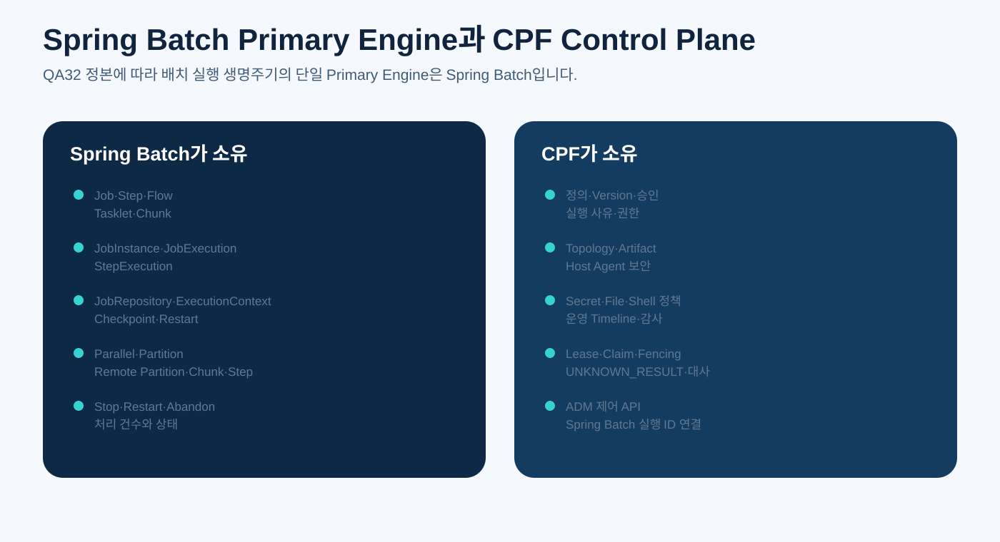
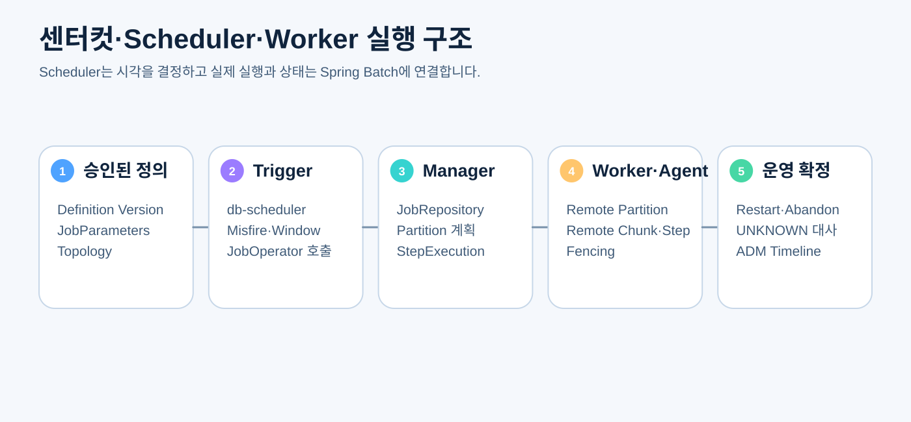

# CPF 배치 개발 매뉴얼

> **기준 Repository** `freeangelsun/202412_01_CPF` · **기준 Branch** `master` · **문서 작성 기준 SHA** `d31bd127aa12bb9368933216642a5a9d25bd0bfd`  
> **문서 목적** Spring Batch 기반 Job·Step, Scheduler Trigger, Center-Cut, Worker·Agent 분산 실행과 File·DB·API·Shell Job을 개발하고 검증하는 방법을 설명한다.  
> **주요 독자** 배치 개발자, Scheduler·Worker·Agent 개발자, Batch 운영 API 개발자, 배치 아키텍트  
> **완료 결과** 독자가 Spring Batch를 실제 Primary Engine으로 사용해 Job을 작성하고 중단·재시작·분산 실행·대사까지 검증한다.

## 0. 문서 사용 계약

QA32 정본은 Spring Batch를 CPF 전체 Batch의 Primary Execution Engine으로 지정한다. 실제 Source 이관과 Legacy 제거는 최신 개발 결과와 Runtime Evidence로 확인한다.

문서의 예제는 다음 순서로 읽는다.

1. **제품 계약** — CPF가 보장해야 하는 규칙이다.
2. **현재 구현 확인** — 표에 제시한 Source·설정·API·SQL 경로를 최신 `master`에서 확인한다.
3. **실행 절차** — 명령을 실제 환경에서 실행하고 Exit Code와 결과를 확인한다.
4. **오류·복구** — 정상 경로만 보지 않고 중단·응답 유실·중복·부분 실패를 확인한다.
5. **Evidence** — 실행한 기준 SHA, 환경, 명령, 시작·종료 시각, Exit Code와 Sanitized 결과를 남긴다.

상태는 `완료`, `부분 구현`, `미구현`, `미검증`, `실패`, `재확인 필요`만 사용한다.


## 1. 가장 중요한 제품 결정



Spring Batch가 소유하는 범용 실행 기능과 CPF Control Plane을 섞지 않는다.

### 1.1 Spring Batch 소유

- `Job`, `Step`, `Flow`, 조건 분기
- Tasklet과 Chunk 처리
- `ItemReader`, `ItemProcessor`, `ItemWriter`
- `JobInstance`, `JobExecution`, `StepExecution`
- `JobRepository`, `ExecutionContext`
- Checkpoint, Restart, Stop, Abandon
- Parallel Step
- Local Partitioning
- Remote Partitioning
- Remote Chunking 또는 Spring Batch 6 Remote Step
- 처리 건수, Skip·Retry·Exit Status
- Center-Cut와 Worker의 실제 실행 생명주기

### 1.2 CPF 소유

- 배치 정의 등록과 Version
- 배포·실행 승인, 사용자 권한과 사유
- 실행 대상, 환경, Topology
- Artifact 검증과 Host Agent 보안
- File·Shell·Secret 정책
- 업무 식별자와 Spring Batch 실행 ID 연결
- Lease·Claim·Fencing
- 응답 유실 시 `UNKNOWN_RESULT`, 대사와 복구
- ADM 운영 화면과 감사 Timeline

### 1.3 제거 대상

동등성 검증과 Consumer 전환 뒤 다음 자체 구현을 제거한다.

- 자체 Job·Step 상태 모델과 실행기
- 자체 Restart·Checkpoint
- 자체 Partition Dispatcher
- Center-Cut 자체 Thread Pool·Polling·완료 집계
- Worker 완료 상태를 별도 정본으로 관리하는 Repository
- Scheduler가 Job 실행 상태를 소유하는 상태 머신
- Spring Batch를 우회하는 File·Shell·API Product Consumer

## 2. 제품 실행 구조



```text
Definition/Version/Approval
       ↓
db-scheduler Trigger 또는 운영자 Start
       ↓ JobOperator/JobLauncher
Spring Batch JobRepository
       ↓
JobExecution → StepExecution → Partition/Worker
       ↓
CPF Attempt·Audit·Unknown·Reconciliation Ledger
```

Scheduler는 실행 시각과 Misfire를 결정한다. Trigger를 성공적으로 전달했다는 사실을 Job 성공으로 기록하지 않는다.

## 3. Source 진입점

| 확인 대상 | 대표 경로 | 확인 방법 |
|---|---|---|
| 배치 계약 | `cpf-batch/contract/src/main/java/com/cpf/batch/api 및 spi` | 공개 Definition·Command·상태·Handler 계약 확인 |
| Control Server | `cpf-batch/control-server` | 정의·Version·승인·운영 API와 Job 실행 연결 확인 |
| Scheduler | `cpf-batch/scheduler` | db-scheduler Trigger와 JobOperator 연결, Misfire·Takeover 확인 |
| Worker | `cpf-batch/worker` | Step·Partition Consumer와 Fencing·Attempt 연결 확인 |
| Center-Cut | `cpf-batch/center-cut-runner 또는 실제 포함 Module` | Spring Batch Manager Runtime인지 확인 |
| Host Agent | `cpf-batch/host-agent` | Artifact·File·Shell 보안과 Process 제어 확인 |
| Runtime Common | `cpf-batch/runtime-common` | 공통 Adapter가 Spring Batch 생명주기를 중복 구현하지 않는지 확인 |
| DB | `cpf-tools/db/vendor/*/runtime/bat` | JobRepository·Scheduler·CPF 원장 SQL과 Vendor 정합성 확인 |
| ADM Adapter | `cpf-admin/src/main/java/com/cpf/admin/opr/batch` | 운영 제어와 실제 Owner 연결 확인 |

## 4. Batch Module 구성 원칙

권장 책임 구조:

```text
contract                 Public API/SPI, Definition, Parameter Schema
control-server           정의·승인·게시·운영 명령·대사
scheduler                시간 Trigger, Misfire, Window, JobOperator 호출
center-cut-runner        Spring Batch Manager Job Runtime
worker                   Remote Partition/Chunk/Step Worker
host-agent               승인 Artifact·File·Shell Process 실행
runtime-common           공통 보안·관측 Adapter, Spring Batch 확장
batch-testkit            Contract·Failure Injection·Kafka Test 지원
```

`runtime-common`이 자체 Job Engine으로 성장하지 않도록 주의한다. Spring Batch Type을 Public Product Contract로 무분별하게 노출하지 않되, 내부 Runtime에서는 표준 Lifecycle과 State를 실제로 사용한다.

## 5. Job과 Step 설계

### 5.1 Job 식별

Spring Batch `JobInstance`는 Job Name과 식별 가능한 `JobParameters` 조합으로 결정된다. CPF는 다음을 함께 사용한다.

- CPF Definition ID와 Version
- Environment
- Business Date 또는 Execution Date
- 승인 Version
- 실행 범위·대상
- CPF Operation/Idempotency Key

동일 Job의 “재시작”과 새로운 “재실행”을 Parameter 변경으로 혼동하지 않는다.

### 5.2 JobParameters 분류

| 분류 | 예 | 식별 참여 |
|---|---|---|
| 실행 식별 | businessDate, targetId, definitionVersion | 참여 |
| 운영 메타데이터 | requestedBy, reason, approvalId | 보통 비식별 또는 CPF 원장 연결 |
| Secret | secretReference | 원문 금지, 식별 참여 신중 |
| 대량 범위 | fromKey, toKey, partitionPlanId | 실행 의미에 따라 참여 |

Parameter는 문자열 Map으로 방치하지 않고 Schema, Type, 필수·Default, 범위, Masking, Restart 호환성을 정의한다.

### 5.3 Step 분리 기준

Step은 다음 중 하나의 재시작·Transaction·운영 단위를 나타낸다.

- 입력 준비와 검증
- DB/File Read
- 변환·업무 처리
- 외부 API 호출
- 결과 Writer
- 대사·정리
- 보고서·통계

너무 큰 단일 Tasklet은 재시작 지점과 처리 통계를 잃는다. 반대로 기술 Method마다 Step을 만들면 Flow와 운영 화면이 불필요하게 복잡해진다.

## 6. Tasklet 개발

Tasklet은 단일 명령, Shell, 파일 이동, 사전·후처리처럼 Chunk보다 명확한 작업에 사용한다.

```java
@Bean
Step verifyInputStep(JobRepository repository,
                     PlatformTransactionManager transactionManager,
                     VerifyInputTasklet tasklet) {
    return new StepBuilder("verifyInputStep", repository)
            .tasklet(tasklet, transactionManager)
            .build();
}
```

Tasklet 체크 항목:

- 반복 반환(`RepeatStatus`) 의미
- Transaction 범위
- ExecutionContext 저장 시점
- 중단·재시작 시 이미 수행한 Side Effect 탐지
- Timeout·Cancellation
- stdout·stderr·Exit Code 저장
- Resource 정리
- 권한·Secret·Audit

## 7. Chunk 개발

### 7.1 Reader

Reader는 Checkpoint 가능한 Cursor 또는 Page 위치를 ExecutionContext에 저장한다.

- DB Paging 또는 Cursor
- Flat File Line Number·Byte Offset
- API Page Token
- Object Storage Key
- Partition Range

Restart 뒤 Reader가 앞에서 읽은 항목을 다시 읽을 수 있으므로 Writer와 업무 처리는 멱등해야 한다.

### 7.2 Processor

Processor는 순수 변환과 업무 Validation을 우선한다. 원격 Side Effect를 Processor 안에 숨기면 Retry·Skip·Transaction 의미가 불명확해진다.

### 7.3 Writer

Writer는 Chunk Transaction의 Commit 단위를 이해해야 한다.

- Batch Update와 실제 Row Count
- Unique·Version 충돌
- Outbox와 같은 Transaction
- 외부 호출 Writer의 결과 불명
- 부분 성공을 한 건 성공으로 축약하지 않음

### 7.4 Chunk Size

Chunk Size는 임의 숫자가 아니다.

- 평균 Row 크기와 Heap
- DB Lock 시간
- Commit 비용
- 외부 호출 Latency
- Restart 시 재처리 범위
- Skip·Retry 비용
- SLA와 처리량

실제 부하 시험으로 결정하고 설정 범위와 안전 상한을 둔다.

## 8. Transaction·Checkpoint·Restart

### 8.1 Chunk Transaction

Reader가 Transactional Resource인지, Processor·Writer Side Effect가 Transaction에 포함되는지 확인한다. Kafka, File, 외부 API는 DB Transaction과 동일하지 않다.

### 8.2 ExecutionContext

저장 가능한 값만 넣는다.

- Resume Position
- Last Confirmed Key
- Page Token
- Artifact Hash
- Partition Cursor
- Reconcile Marker

Secret 원문, 대용량 Payload, 직렬화 불안정 객체를 넣지 않는다. Version Upgrade 뒤 역직렬화 호환성을 검토한다.

### 8.3 Restart 가능성

Restart 전 확인:

- JobInstance가 재시작 가능한 상태인가
- 실패 Step과 완료 Step의 재실행 정책
- 외부 Side Effect의 실제 상태
- File Pointer와 Hash
- Definition/Artifact Version이 동일한가
- 승인 범위와 Parameter가 아직 유효한가
- Stale Worker가 늦게 결과를 쓰지 못하는가

### 8.4 Restart·Rerun·Reprocess 구분

| 조치 | 의미 | 실행 식별 |
|---|---|---|
| Restart | 같은 JobInstance의 실패 실행을 Checkpoint부터 재개 | 같은 식별 JobParameters |
| Rerun | 같은 논리 업무를 새 JobInstance로 처음부터 실행 | 새 Run Parameter 또는 승인 |
| Reprocess | 특정 실패·대상만 선택해 별도 처리 | 대상 Manifest·Reason·Approval 필요 |

## 9. Skip·Retry·Rollback

### 9.1 Retry

Retry는 일시적이고 멱등한 오류만 대상으로 한다.

- DB Deadlock·Transient Connection
- Broker 일시 중단
- 외부 API 429·일시 5xx

다음은 일반 Retry 대상이 아니다.

- Validation 오류
- 권한·승인 오류
- Artifact Hash 불일치
- 결과 불명 외부 Side Effect
- Poison Record

### 9.2 Skip

Skip은 데이터 손실을 숨기지 않는다. Skip Limit, 분류, 원본 위치, Error Code, 재처리 가능성, 운영 승인과 통계를 남긴다.

### 9.3 Rollback Classifier

특정 Exception을 Rollback하지 않는 설정은 Side Effect와 Checkpoint 의미를 분석한 뒤 사용한다. “처리를 계속하기 위해” 모든 오류를 No Rollback으로 만들지 않는다.

## 10. Flow와 조건 분기

```text
validate → load → process
                    ├─ COMPLETED → publish → reconcile
                    └─ CUSTOM_EXIT → quarantine → notify
```

분기 기준은 `BatchStatus` 하나가 아니라 명시적 Exit Status와 업무 결과를 사용한다. Listener가 상태를 임의로 성공으로 바꾸지 않는다.

## 11. Parallel Step

한 JVM에서 서로 독립적인 Step을 병렬 실행한다.

- 공유 Table·File·Cache 충돌
- Thread-safe Reader/Writer
- Executor Queue·Concurrency 상한
- TransactionManager와 Connection Pool
- Step별 Timeout·Cancel
- 한 Step 실패 시 Flow 종료 정책

자체 `CompletableFuture`·Thread Pool로 Step Lifecycle을 우회하지 않는다.

## 12. Local Partitioning

Manager가 Partition Plan을 만들고 같은 JVM 또는 같은 Runtime의 Worker Step이 범위를 처리한다.

Partition Key 예:

- ID Range
- 날짜·지역·고객 Segment
- File Shard
- Hash Bucket

필수 조건:

- 범위 중복·누락 0
- 균등도와 Hot Partition
- Partition별 ExecutionContext
- 일부 Partition 실패 뒤 선택 Restart
- 완료 집계는 StepExecution 기준

## 13. Remote Partitioning

Manager는 Partition Metadata와 StepExecution을 만들고 Worker는 할당된 Step을 실행한다.

- 메시지에는 실행 ID, StepExecution ID, Partition Key, Definition/Artifact Version, Fencing Token을 포함한다.
- Worker는 승인된 Version과 Token을 검증한다.
- 응답 중복·순서 역전·지연을 허용하되 Stale 결과를 반영하지 않는다.
- Manager 재기동 뒤 JobRepository에서 실제 상태를 복원한다.
- Broker 지연과 중복 전달을 시험한다.

## 14. Remote Chunking과 Remote Step

### 14.1 Remote Chunking

Manager가 Read하고 Chunk를 Worker에 보내 처리·쓰기하도록 구성한다. Network Payload 크기, Ordering, Chunk Acknowledgement, Worker Duplicate를 검토한다.

### 14.2 Remote Step

Spring Batch 6 Remote Step을 선택하는 경우 표준 Protocol과 Lifecycle을 사용한다. CPF가 동일 기능을 자체 Command Bus로 다시 구현하지 않는다.

선택 기준:

| 방식 | 적합한 상황 |
|---|---|
| Remote Partitioning | 데이터 범위를 Worker별 독립 Step으로 나눌 수 있음 |
| Remote Chunking | Read는 중앙에 두고 CPU/처리를 분산 |
| Remote Step | 전체 Step 실행을 원격 Runtime에 위임 |

## 15. Center-Cut

`center-cut-runner`는 별도 자체 Center-Cut Engine이 아니라 Spring Batch Manager Runtime이다.

### 15.1 실행 방식

- 단일 Job — 일반 JobOperator Start
- 단일 JVM 병렬 — Parallel Step 또는 Local Partitioning
- 원격 Worker — Remote Partitioning/Chunking/Remote Step
- 대량 대상 — 승인된 Target Manifest와 Partition Plan

### 15.2 금지

- 자체 Thread Pool로 대상 분할 후 별도 상태 Table 집계
- Polling으로 Worker 상태를 자체 완료 처리
- JobRepository와 다른 “실행 성공” 정본
- Spring Batch Step 밖에서 File·API·Shell Product Job 수행

## 16. Scheduler 연결

Scheduler는 Trigger 역할만 한다.


### 16.1 Schedule Definition

- Cron 또는 반복 규칙
- Time Zone
- Calendar·Holiday
- Available Window
- Misfire Policy
- Concurrent 실행 정책
- 대상 Definition Version
- JobParameters 생성 규칙
- 승인·적용 Version

### 16.2 Misfire

| 정책 | 의미 |
|---|---|
| SKIP | 놓친 실행을 건너뜀 |
| FIRE_NOW | 즉시 한 번 실행 |
| CATCH_UP | 허용 범위에서 누락 실행 생성 |
| NEXT | 다음 예정 시각만 계산 |
| COMPENSATE | 별도 보상 Job 요청 |

Misfire 처리도 JobInstance 중복, SLA, 업무 날짜, 승인 범위를 확인한다.

### 16.3 중복 Trigger 차단

- db-scheduler의 persistent Claim
- CPF 승인 Version
- Job Name+식별 JobParameters
- Idempotency Key
- Fencing Token

Trigger 성공과 Job 성공은 분리한다.

## 17. File Job

### 17.1 Reader·Writer

- FlatFile Reader/Writer
- MultiResource Reader
- DB Staging
- Object Storage Adapter

### 17.2 Crash 재개

- File Hash와 Size 고정
- Line·Offset Checkpoint
- Header/Trailer 검증
- 중복 Writer 차단
- Atomic Rename
- 처리 완료 Marker
- Crash 뒤 동일 Record Side Effect 중복 0

Remote File Provider가 Watch·Scan·Claim Capability를 지원하지 않으면 UI와 Definition Publish에서 해당 기능을 차단한다.

## 18. DB Job

- Paging Query 정렬 Key 안정성
- Snapshot과 변경 중 데이터
- Cursor Resource
- Batch Write Row Count
- Deadlock과 Lock 순서
- Read Replica Lag
- Vendor별 SQL·Hint 차이
- JobRepository와 업무 DataSource Transaction 구분

## 19. API Job

외부 API 호출은 Spring Batch Step 안에서 수행하되 CPF Resilience·Unknown 정책을 적용한다.

- Rate Limit과 Backpressure
- Request Idempotency
- Page Token·Resume
- Timeout·Circuit Breaker
- 응답 유실과 상대 Status 조회
- 성공 Row와 Unknown Row 분리
- 운영자 Reconcile

Blind Retry로 외부 Side Effect를 중복시키지 않는다.

## 20. Shell Job

Shell은 승인된 Tasklet 또는 표준 Step Adapter로 실행한다.

필수 통제:

- 승인 Artifact와 Signature·Hash
- Executable·Argument Allowlist
- Working Directory와 Path Normalize
- Secret는 Reference로 전달하고 Command Line·일반 Temp File 노출 금지
- OS 계정·권한·Sandbox
- Process Tree 종료
- Timeout·Output Size Limit
- Exit Code, stdout, stderr, truncation, hash 저장
- 결과 불명과 Agent 재기동 대사

## 21. Worker와 Host Agent

### 21.1 Worker 등록

- workerId, instanceId, environment
- Capability와 Version
- Artifact Version
- Heartbeat·Lease
- Max Concurrency·Resource
- Fencing Generation

### 21.2 Claim과 Fencing

Worker가 Lease를 잃은 뒤 늦게 완료를 보고해도 현재 Step 상태를 덮어쓰지 못하게 한다. JobRepository 상태와 CPF Fencing Policy를 함께 검증한다.

### 21.3 Agent 보안

Host Agent는 임의 원격 Shell Server가 아니다. 승인된 Artifact·명령·경로만 실행하고 모든 조치를 감사한다.

## 22. CPF 원장과 Spring Batch ID 연결

CPF 실행 원장에는 최소 다음 연결이 필요하다.

- CPF executionId / operationId
- Definition ID·Version
- Approval ID
- `JobInstanceId`
- `JobExecutionId`
- `StepExecutionId`
- Partition ID와 Worker ID
- Attempt ID
- Fencing Token
- Unknown/Reconcile 상태

Spring Batch Metadata를 복사해 또 하나의 상태 머신을 만들지 않는다. CPF Table은 Control Plane 확장 정보와 연결 Key를 소유한다.

## 23. ADM 운영 API 연결

ADM은 Owner Control API를 통해 다음을 수행한다.

- Job·Step·Partition 조회
- Start·Stop·Restart·Abandon 요청
- Definition·Version·Approval 조회
- Unknown Result 대사
- Worker·Agent 상태
- File·Shell 상세 결과
- Audit Timeline

ADM이 Spring Batch Metadata Table을 직접 임의 갱신하지 않는다.

## 24. Observability

- Job·Step·Partition·Chunk 처리 건수
- Read·Write·Filter·Skip·Commit·Rollback Count
- 실행 시간·Queue·Worker 사용률
- Retry·Circuit·Timeout
- JobRepository 오류
- Scheduler Trigger 지연
- Kafka 원격 실행 지연·중복
- File Throughput·API Rate

Trace와 Metric Tag에 대량 Business Key를 무제한 넣지 않는다.

## 25. 필수 Runtime 검증

### 25.1 정상

- Center-Cut 단일 Job
- 다중 Step 순차·조건 분기
- Tasklet·Chunk
- 병렬 Step
- Local Partitioning
- Remote Partitioning
- Remote Chunking 또는 Remote Step
- Scheduler Trigger → JobOperator

### 25.2 중단·복구

- Worker 중단 후 Restart
- Manager 재기동 후 복구
- ExecutionContext Checkpoint 재개
- 동일 Job 중복 실행 차단
- 일부 Partition 실패 후 선택 Restart
- 응답 유실 후 JobRepository 상태 대사
- File Crash 후 중복 없는 재개
- Shell Process 중단·Exit·Output 보존

### 25.3 보안·다중 인스턴스

- 승인되지 않은 실행 차단
- 오래된 Fencing Token 결과 차단
- Agent Replay·Artifact Tamper 차단
- Scheduler Takeover
- Worker Duplicate Message

### 25.4 환경

- Oracle·PostgreSQL·MariaDB JobRepository
- Kafka Broker 지연·중복·재시작
- 다중 Manager·Worker
- Disk Full·DB Lock·Network Block

## 26. EDU — Spring Batch Job 작성

### 실습 목표

CSV 입력을 읽어 DB를 갱신하고 Outbox Event를 발행한다. Worker 중단 뒤 Checkpoint부터 재개하며 중복 Side Effect가 없어야 한다.

### 단계

1. Definition ID·Version·Parameter Schema를 등록한다.
2. JobParameters에 businessDate, inputArtifactId, definitionVersion을 둔다.
3. 입력 File Hash와 크기를 검증하는 Tasklet을 작성한다.
4. FlatFile Reader와 line checkpoint를 구성한다.
5. Processor에서 Validation·Mapping을 수행한다.
6. Writer에서 업무 DB와 Outbox를 같은 Transaction에 저장한다.
7. Skip 가능한 오류와 중단해야 하는 오류를 분리한다.
8. JobRepository와 CPF 실행 원장 ID를 연결한다.
9. Local Partitioning으로 파일 Range를 분할한다.
10. Remote Partitioning으로 Worker를 연결한다.
11. Worker Process를 중간에 종료한다.
12. Restart 후 완료 Row와 Outbox 중복이 없는지 확인한다.
13. File Hash 변경 뒤 Restart를 차단한다.
14. ADM에서 Job·Step·Partition·Attempt를 조회한다.
15. exact SHA와 DB Row·Log·Metric·Exit Code Evidence를 남긴다.

## 27. 배치 개발 완료 체크리스트

- [ ] 모든 실제 Batch Consumer가 Spring Batch Job·Step을 사용한다.
- [ ] Center-Cut Runner가 Spring Batch Manager Runtime으로 동작한다.
- [ ] Scheduler가 Trigger만 소유하고 JobOperator/Launcher로 연결된다.
- [ ] JobRepository와 ExecutionContext가 실행 이력·Checkpoint의 정본이다.
- [ ] Parallel·Partition·Remote 실행이 Spring Batch 표준 방식이다.
- [ ] CPF 원장에 JobInstance·JobExecution·StepExecution ID가 연결된다.
- [ ] File·DB·API·Shell 작업이 Step 안에서 실행된다.
- [ ] Worker·Manager 중단·재기동·응답 유실·중복·Fencing을 검증했다.
- [ ] Oracle·PostgreSQL·MariaDB와 Kafka Runtime을 실제 검증했다.
- [ ] 자체 Job/Step·Restart·Checkpoint·Dispatcher·완료 집계 Legacy를 제거했다.
- [ ] ADM·API·DB·Scheduler·Worker·Agent가 실제로 연결됐다.
- [ ] latest exact SHA Evidence와 Supply Chain 결과가 있다.

## 28. 구현 추적 명령

```powershell
# Spring Batch Dependency와 Job/Step Consumer
git grep -n 'spring-batch\|JobBuilder\|StepBuilder\|JobOperator\|JobRepository' cpf-batch -- '*.gradle' '*.java'

# Legacy 자체 실행기·상태 모델 후보
git grep -n 'Dispatcher\|Checkpoint\|Restart\|Partition\|Polling\|ExecutionRepository' cpf-batch -- '*.java'

# Scheduler가 Job 성공을 자체 판정하는지 확인
git grep -n 'trigger\|JobOperator\|JobLauncher\|nextFireAt\|misfire' cpf-batch/scheduler -- '*.java'

# JobRepository·CPF 원장 SQL
git grep -n 'BATCH_JOB_\|JOB_EXECUTION\|STEP_EXECUTION' cpf-tools/db -- '*.sql' '*.json'

# ADM 연결
git grep -n 'JobExecution\|StepExecution\|restart\|abandon' cpf-admin cpf-batch -- '*.java' '*.ts' '*.vue'
```

검색 결과는 후보일 뿐이다. 실제 Bean·Runtime Call Graph·DB Row와 Test를 확인한다.
